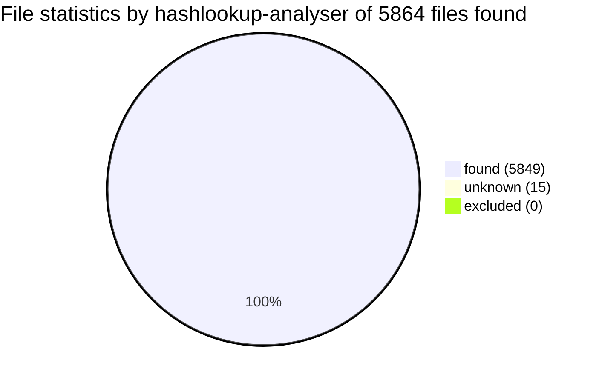

# Overall statistics

Analysed directory /usr/lib/modules/5.11.0-41-generic/ on maurer running Linux-5.11.0-43-generic-x86_64-with-glibc2.29 at 2022-01-02 11:20:10.596458+00:00.

Run with [hashlookup-forensic-analysed](https://github.com/hashlookup/hashlookup-forensic-analyser) version 0.8.

|Hashlookup type|Numbers|
|:-------------:|:-----:|
|found|5849|
|unknown|15|
|excluded|0|
|analysed|5864|

 - *found* : File found and known in the [hashlookup database](https://circl.lu/services/hashlookup/).
 - *unknown* : File not found in the [hashlookup database](https://circl.lu/services/hashlookup/).
 - *excluded* : File excluded from the analysis such as special files or files inaccessible.
 - *analysed* : Total file analysed (hashed) without the excluded ones.

# Detailed review
Files analysed can be found below sorted by unknown and known files. The result is also available in a [JSON file](full.json).
## Unknown files

Files which might require further investigation and analysis are listed below.

|Filename|SHA-1 value|
|:-------|:----------|
|/usr/lib/modules/5.11.0-41-generic/modules.softdep|3E914907510F7F1BCFD5DF14D70D137F54BBA494|
|/usr/lib/modules/5.11.0-41-generic/modules.builtin.bin|FC2C2A1FA2982012CFBB81F91E78ECE776760420|
|/usr/lib/modules/5.11.0-41-generic/modules.builtin.alias.bin|C1684F17AB9905FDC3FCFC102DF248957275E6EA|
|/usr/lib/modules/5.11.0-41-generic/modules.alias|A88A1559B57C6D50C87277C62C6556ED7821A69F|
|/usr/lib/modules/5.11.0-41-generic/modules.dep|0A7BDE81B1C56BD62A7721B66E966E2DB1A23B4C|
|/usr/lib/modules/5.11.0-41-generic/modules.devname|EFA5ADB32FC040B82CB6DA19110015F03C02DC8A|
|/usr/lib/modules/5.11.0-41-generic/modules.dep.bin|CBD5869A79B89530E37E27B40B2945E22B9FF2CB|
|/usr/lib/modules/5.11.0-41-generic/modules.symbols|630D04094A7BC4BEC5C0C652E1BD7428C86FCCF2|
|/usr/lib/modules/5.11.0-41-generic/modules.symbols.bin|5F1C19F993F32FFD245A74456EE7FA02AA8170DD|
|/usr/lib/modules/5.11.0-41-generic/modules.alias.bin|D5789988294166EB3040B2D77B8EC6702E7B2969|
|/usr/lib/modules/5.11.0-41-generic/updates/dkms/sysdig-probe.ko|4D7FE8A050F14FB261FC7968EF1162E50DF8B041|
|/usr/lib/modules/5.11.0-41-generic/updates/dkms/vboxnetflt.ko|28C76489AA09D733A1F831A907170B73EC6D1887|
|/usr/lib/modules/5.11.0-41-generic/updates/dkms/vboxnetadp.ko|0743C2A1880B9EF01850F7249459EFD4677CCD74|
|/usr/lib/modules/5.11.0-41-generic/updates/dkms/evdi.ko|0DF531EE08404DF4A8683EBE4F8E929F15F6D970|
|/usr/lib/modules/5.11.0-41-generic/updates/dkms/vboxdrv.ko|A88622EED83DC66441CF557C68E53432BED4424B|

## Known files

Files found in hashlookup which might require less investigation and analysis are listed below.

|Filename|SHA-1 value|
|:-------|:----------|
|/usr/lib/modules/5.11.0-41-generic/modules.builtin.modinfo|[17D568B61CD9353EC923344C058DBFDA66D3E509](https://hashlookup.circl.lu/lookup/sha1/17D568B61CD9353EC923344C058DBFDA66D3E509)|
|/usr/lib/modules/5.11.0-41-generic/modules.builtin|[6CD5EB4C10E3C15EA40461214D169E091F31D9E3](https://hashlookup.circl.lu/lookup/sha1/6CD5EB4C10E3C15EA40461214D169E091F31D9E3)|
|/usr/lib/modules/5.11.0-41-generic/modules.order|[DBC947073A310BB2023061380413A332DB5A49A3](https://hashlookup.circl.lu/lookup/sha1/DBC947073A310BB2023061380413A332DB5A49A3)|
|/usr/lib/modules/5.11.0-41-generic/vdso/vdso64.so|[48880AF46FBDC128E6A76629FEEE8F6B5C7D2E82](https://hashlookup.circl.lu/lookup/sha1/48880AF46FBDC128E6A76629FEEE8F6B5C7D2E82)|
|/usr/lib/modules/5.11.0-41-generic/vdso/vdso32.so|[4C88AEB389D73AB3607DD00AF6E56E63655F9E6C](https://hashlookup.circl.lu/lookup/sha1/4C88AEB389D73AB3607DD00AF6E56E63655F9E6C)|
|/usr/lib/modules/5.11.0-41-generic/vdso/vdsox32.so|[CDEB6C6BF14CB1870A02E9317F5DF555AA806705](https://hashlookup.circl.lu/lookup/sha1/CDEB6C6BF14CB1870A02E9317F5DF555AA806705)|
|/usr/lib/modules/5.11.0-41-generic/vdso/.build-id/8d/ba0e4cf11ff44439eff5e47cfce294f0d48641.debug|[CDEB6C6BF14CB1870A02E9317F5DF555AA806705](https://hashlookup.circl.lu/lookup/sha1/CDEB6C6BF14CB1870A02E9317F5DF555AA806705)|
|/usr/lib/modules/5.11.0-41-generic/vdso/.build-id/97/843d882c9ca89a3db7a5d178c0af7d748f0ae8.debug|[48880AF46FBDC128E6A76629FEEE8F6B5C7D2E82](https://hashlookup.circl.lu/lookup/sha1/48880AF46FBDC128E6A76629FEEE8F6B5C7D2E82)|
|/usr/lib/modules/5.11.0-41-generic/vdso/.build-id/ef/582dd88d8da2f48a005f899900f4ebf5fcd6e1.debug|[4C88AEB389D73AB3607DD00AF6E56E63655F9E6C](https://hashlookup.circl.lu/lookup/sha1/4C88AEB389D73AB3607DD00AF6E56E63655F9E6C)|
|/usr/lib/modules/5.11.0-41-generic/kernel/crypto/sm2_generic.ko|[7C11E77112D71BE898F16AA59545CA14D226CB1D](https://hashlookup.circl.lu/lookup/sha1/7C11E77112D71BE898F16AA59545CA14D226CB1D)|
|/usr/lib/modules/5.11.0-41-generic/kernel/crypto/authencesn.ko|[756A0CE7CAAA5028C101852E41D5782E1044A24B](https://hashlookup.circl.lu/lookup/sha1/756A0CE7CAAA5028C101852E41D5782E1044A24B)|
|/usr/lib/modules/5.11.0-41-generic/kernel/crypto/xor.ko|[740DDA0F02C109F1C0ABDBF6229AD40BAB59589D](https://hashlookup.circl.lu/lookup/sha1/740DDA0F02C109F1C0ABDBF6229AD40BAB59589D)|
|/usr/lib/modules/5.11.0-41-generic/kernel/crypto/ecrdsa_generic.ko|[1EE988719F7AAA609D20269DC52D432747B33876](https://hashlookup.circl.lu/lookup/sha1/1EE988719F7AAA609D20269DC52D432747B33876)|
|/usr/lib/modules/5.11.0-41-generic/kernel/crypto/crypto_simd.ko|[9C6113667E0FBF8BA856183E30CB4D9C37675661](https://hashlookup.circl.lu/lookup/sha1/9C6113667E0FBF8BA856183E30CB4D9C37675661)|
|/usr/lib/modules/5.11.0-41-generic/kernel/crypto/cmac.ko|[641A08A7412FEB9B1F6B155ED66DED604321785F](https://hashlookup.circl.lu/lookup/sha1/641A08A7412FEB9B1F6B155ED66DED604321785F)|
|/usr/lib/modules/5.11.0-41-generic/kernel/crypto/842.ko|[775B74E58EFA9418808DDA03535F89F9DA385732](https://hashlookup.circl.lu/lookup/sha1/775B74E58EFA9418808DDA03535F89F9DA385732)|
|/usr/lib/modules/5.11.0-41-generic/kernel/crypto/ccm.ko|[D7381A3FE32D7F8A8797D526C8E61300C9046870](https://hashlookup.circl.lu/lookup/sha1/D7381A3FE32D7F8A8797D526C8E61300C9046870)|
|/usr/lib/modules/5.11.0-41-generic/kernel/crypto/xxhash_generic.ko|[74C1D037632A14445E172756B16DAA7545179B72](https://hashlookup.circl.lu/lookup/sha1/74C1D037632A14445E172756B16DAA7545179B72)|
|/usr/lib/modules/5.11.0-41-generic/kernel/crypto/tgr192.ko|[1167AF422D19178C45EC657D2ED276A8A98CEB50](https://hashlookup.circl.lu/lookup/sha1/1167AF422D19178C45EC657D2ED276A8A98CEB50)|
|/usr/lib/modules/5.11.0-41-generic/kernel/crypto/des_generic.ko|[CECF8C3B87CBC04C6C505FFE6D1EA0013015438B](https://hashlookup.circl.lu/lookup/sha1/CECF8C3B87CBC04C6C505FFE6D1EA0013015438B)|
|/usr/lib/modules/5.11.0-41-generic/kernel/crypto/michael_mic.ko|[C2988AD0DD34E458D031B401EAAAAD44C33D35BE](https://hashlookup.circl.lu/lookup/sha1/C2988AD0DD34E458D031B401EAAAAD44C33D35BE)|
|/usr/lib/modules/5.11.0-41-generic/kernel/crypto/algif_aead.ko|[9AAC4575A81B5C7AB0135D5854A7A3A0D251B92A](https://hashlookup.circl.lu/lookup/sha1/9AAC4575A81B5C7AB0135D5854A7A3A0D251B92A)|
|/usr/lib/modules/5.11.0-41-generic/kernel/crypto/aes_ti.ko|[EDA4E9C71221C441EA3774B863FDF8646EEB79E5](https://hashlookup.circl.lu/lookup/sha1/EDA4E9C71221C441EA3774B863FDF8646EEB79E5)|
|/usr/lib/modules/5.11.0-41-generic/kernel/crypto/ansi_cprng.ko|[4B9E982E75FB5471CD36C4EAC4B82853A97F109D](https://hashlookup.circl.lu/lookup/sha1/4B9E982E75FB5471CD36C4EAC4B82853A97F109D)|
|/usr/lib/modules/5.11.0-41-generic/kernel/crypto/sm4_generic.ko|[D78098B206FE4A12ECCD59E49CAE43FA0B62DCCC](https://hashlookup.circl.lu/lookup/sha1/D78098B206FE4A12ECCD59E49CAE43FA0B62DCCC)|
|/usr/lib/modules/5.11.0-41-generic/kernel/crypto/authenc.ko|[0E8AD41CEC620993CF6D2A6BF1D45C0A3EAC1A5F](https://hashlookup.circl.lu/lookup/sha1/0E8AD41CEC620993CF6D2A6BF1D45C0A3EAC1A5F)|
|/usr/lib/modules/5.11.0-41-generic/kernel/crypto/crypto_engine.ko|[05A9F7D08FC2A007BF2B975E458560B7EA526C30](https://hashlookup.circl.lu/lookup/sha1/05A9F7D08FC2A007BF2B975E458560B7EA526C30)|
|/usr/lib/modules/5.11.0-41-generic/kernel/crypto/cast_common.ko|[3933F113671D4A4F13AE1513C7AE67AB6424CA6B](https://hashlookup.circl.lu/lookup/sha1/3933F113671D4A4F13AE1513C7AE67AB6424CA6B)|
|/usr/lib/modules/5.11.0-41-generic/kernel/crypto/rmd320.ko|[FC91BF1EF3E3F1304F815A4A7700FDFD75D8B28E](https://hashlookup.circl.lu/lookup/sha1/FC91BF1EF3E3F1304F815A4A7700FDFD75D8B28E)|
|/usr/lib/modules/5.11.0-41-generic/kernel/crypto/fcrypt.ko|[FF7826868959E8F57191C224ECE34AFCD4D10EFD](https://hashlookup.circl.lu/lookup/sha1/FF7826868959E8F57191C224ECE34AFCD4D10EFD)|
|/usr/lib/modules/5.11.0-41-generic/kernel/crypto/crc32_generic.ko|[A3E93598687F05DAA5B0D70BDB7366C0148F0477](https://hashlookup.circl.lu/lookup/sha1/A3E93598687F05DAA5B0D70BDB7366C0148F0477)|
|/usr/lib/modules/5.11.0-41-generic/kernel/crypto/twofish_common.ko|[A0494D5BAF28A565FD4B79CFD709A8AC9E5BE55B](https://hashlookup.circl.lu/lookup/sha1/A0494D5BAF28A565FD4B79CFD709A8AC9E5BE55B)|
|/usr/lib/modules/5.11.0-41-generic/kernel/crypto/serpent_generic.ko|[D48B99F64D0DA12EA1116E020A9974BE097E2B33](https://hashlookup.circl.lu/lookup/sha1/D48B99F64D0DA12EA1116E020A9974BE097E2B33)|
|/usr/lib/modules/5.11.0-41-generic/kernel/crypto/poly1305_generic.ko|[517148CACAF405D6D7876FD583E52EAE1A5A3FF3](https://hashlookup.circl.lu/lookup/sha1/517148CACAF405D6D7876FD583E52EAE1A5A3FF3)|
|/usr/lib/modules/5.11.0-41-generic/kernel/crypto/cfb.ko|[131C9F25EACD7091223E2558AD62D63019E56EFA](https://hashlookup.circl.lu/lookup/sha1/131C9F25EACD7091223E2558AD62D63019E56EFA)|
|/usr/lib/modules/5.11.0-41-generic/kernel/crypto/zstd.ko|[F13B2F31E75B1DDD9278A956568C580F8B46F68D](https://hashlookup.circl.lu/lookup/sha1/F13B2F31E75B1DDD9278A956568C580F8B46F68D)|
|/usr/lib/modules/5.11.0-41-generic/kernel/crypto/twofish_generic.ko|[024CFF90B22EA184441FA3826C4E1EC34ED249B3](https://hashlookup.circl.lu/lookup/sha1/024CFF90B22EA184441FA3826C4E1EC34ED249B3)|
|/usr/lib/modules/5.11.0-41-generic/kernel/crypto/pcrypt.ko|[7246A49F2D251AB54A9ECEA294A69A11E5B037BE](https://hashlookup.circl.lu/lookup/sha1/7246A49F2D251AB54A9ECEA294A69A11E5B037BE)|
|/usr/lib/modules/5.11.0-41-generic/kernel/crypto/blowfish_common.ko|[A6CDB76232C8349C3C9AC727A555C0CE321C87B6](https://hashlookup.circl.lu/lookup/sha1/A6CDB76232C8349C3C9AC727A555C0CE321C87B6)|
|/usr/lib/modules/5.11.0-41-generic/kernel/crypto/blake2b_generic.ko|[2E62E64632EAD74D7E42C73DCB3AB66D9AD800B4](https://hashlookup.circl.lu/lookup/sha1/2E62E64632EAD74D7E42C73DCB3AB66D9AD800B4)|
|/usr/lib/modules/5.11.0-41-generic/kernel/crypto/salsa20_generic.ko|[3511CCF10797E61A296D69AD07AD5F60804F6934](https://hashlookup.circl.lu/lookup/sha1/3511CCF10797E61A296D69AD07AD5F60804F6934)|
|/usr/lib/modules/5.11.0-41-generic/kernel/crypto/adiantum.ko|[93706311F3D32DB2AD22B53881BFFA814241592A](https://hashlookup.circl.lu/lookup/sha1/93706311F3D32DB2AD22B53881BFFA814241592A)|
|/usr/lib/modules/5.11.0-41-generic/kernel/crypto/crypto_user.ko|[9B738065FC0458D9E87C75D8CD6185C18A46DC0B](https://hashlookup.circl.lu/lookup/sha1/9B738065FC0458D9E87C75D8CD6185C18A46DC0B)|
|/usr/lib/modules/5.11.0-41-generic/kernel/crypto/ecdh_generic.ko|[5A51BF1A38C39E98C1861D114D73CDB9C6307D2E](https://hashlookup.circl.lu/lookup/sha1/5A51BF1A38C39E98C1861D114D73CDB9C6307D2E)|
|/usr/lib/modules/5.11.0-41-generic/kernel/crypto/lrw.ko|[926E1CC330DA553CD74CBFC28ED032B60BCAFCF4](https://hashlookup.circl.lu/lookup/sha1/926E1CC330DA553CD74CBFC28ED032B60BCAFCF4)|
|/usr/lib/modules/5.11.0-41-generic/kernel/crypto/vmac.ko|[4F26C78FBEBAF11913A308A86028AFC3FD23CCB4](https://hashlookup.circl.lu/lookup/sha1/4F26C78FBEBAF11913A308A86028AFC3FD23CCB4)|
|/usr/lib/modules/5.11.0-41-generic/kernel/crypto/camellia_generic.ko|[F1AD994D5B07B18CE581B47D676D15AD14B4A44E](https://hashlookup.circl.lu/lookup/sha1/F1AD994D5B07B18CE581B47D676D15AD14B4A44E)|
|/usr/lib/modules/5.11.0-41-generic/kernel/crypto/echainiv.ko|[CF3DCDD2E42CD9AD4DD94ECCCB32C198AA1C2353](https://hashlookup.circl.lu/lookup/sha1/CF3DCDD2E42CD9AD4DD94ECCCB32C198AA1C2353)|
|/usr/lib/modules/5.11.0-41-generic/kernel/crypto/sha3_generic.ko|[EFACCC4F2A6FA5DF9A2697540EC4CE25DDA90D87](https://hashlookup.circl.lu/lookup/sha1/EFACCC4F2A6FA5DF9A2697540EC4CE25DDA90D87)|
|/usr/lib/modules/5.11.0-41-generic/kernel/crypto/rmd256.ko|[88A407C73E781B5369498A1427346397455615C9](https://hashlookup.circl.lu/lookup/sha1/88A407C73E781B5369498A1427346397455615C9)|
|/usr/lib/modules/5.11.0-41-generic/kernel/crypto/af_alg.ko|[A313C9A95F968C214021B4CD9417F38AE2C03BFD](https://hashlookup.circl.lu/lookup/sha1/A313C9A95F968C214021B4CD9417F38AE2C03BFD)|
|/usr/lib/modules/5.11.0-41-generic/kernel/crypto/curve25519-generic.ko|[03A3B1B40698BA9DF035632F250E2D70EB6B6BD6](https://hashlookup.circl.lu/lookup/sha1/03A3B1B40698BA9DF035632F250E2D70EB6B6BD6)|
|/usr/lib/modules/5.11.0-41-generic/kernel/crypto/ofb.ko|[0C0640BADC9FEF79C631D6B32F0690FBE011326D](https://hashlookup.circl.lu/lookup/sha1/0C0640BADC9FEF79C631D6B32F0690FBE011326D)|
|/usr/lib/modules/5.11.0-41-generic/kernel/crypto/keywrap.ko|[6A7E5EE26D5A366B35B84F94AE263E5C1C80B1C3](https://hashlookup.circl.lu/lookup/sha1/6A7E5EE26D5A366B35B84F94AE263E5C1C80B1C3)|
|/usr/lib/modules/5.11.0-41-generic/kernel/crypto/cryptd.ko|[BA7CCEE1E158160A097BE2ED2EC691204F94317C](https://hashlookup.circl.lu/lookup/sha1/BA7CCEE1E158160A097BE2ED2EC691204F94317C)|
|/usr/lib/modules/5.11.0-41-generic/kernel/crypto/tcrypt.ko|[18395E5136B38F3DED2FD63F3290ACF624D0A4FF](https://hashlookup.circl.lu/lookup/sha1/18395E5136B38F3DED2FD63F3290ACF624D0A4FF)|
|/usr/lib/modules/5.11.0-41-generic/kernel/crypto/algif_skcipher.ko|[BA5567F9A1A84396D4DD64D56852056D1DEE794E](https://hashlookup.circl.lu/lookup/sha1/BA5567F9A1A84396D4DD64D56852056D1DEE794E)|
|/usr/lib/modules/5.11.0-41-generic/kernel/crypto/pcbc.ko|[764ABB2DAA523F78E14D3C5E243D793F2BA1375E](https://hashlookup.circl.lu/lookup/sha1/764ABB2DAA523F78E14D3C5E243D793F2BA1375E)|
|/usr/lib/modules/5.11.0-41-generic/kernel/crypto/chacha_generic.ko|[95217E4357CF6C83581B3F88E52B58FFB183856B](https://hashlookup.circl.lu/lookup/sha1/95217E4357CF6C83581B3F88E52B58FFB183856B)|
|/usr/lib/modules/5.11.0-41-generic/kernel/crypto/essiv.ko|[34E2321C1F0EB57141AC4CAA84E1129980879293](https://hashlookup.circl.lu/lookup/sha1/34E2321C1F0EB57141AC4CAA84E1129980879293)|
|/usr/lib/modules/5.11.0-41-generic/kernel/crypto/xcbc.ko|[04621A1E4F02CFE191347D043CC1FADDA60F5B4F](https://hashlookup.circl.lu/lookup/sha1/04621A1E4F02CFE191347D043CC1FADDA60F5B4F)|
|/usr/lib/modules/5.11.0-41-generic/kernel/crypto/aegis128.ko|[E336C988E781BF8ABF280AEAB036CDC962F08679](https://hashlookup.circl.lu/lookup/sha1/E336C988E781BF8ABF280AEAB036CDC962F08679)|
|/usr/lib/modules/5.11.0-41-generic/kernel/crypto/wp512.ko|[473ED40A1D5E7046E257442ADF631223855DE53D](https://hashlookup.circl.lu/lookup/sha1/473ED40A1D5E7046E257442ADF631223855DE53D)|
|/usr/lib/modules/5.11.0-41-generic/kernel/crypto/cast5_generic.ko|[CE5E00B98EED181327E1BC3B8818CDC1B8AFA3B1](https://hashlookup.circl.lu/lookup/sha1/CE5E00B98EED181327E1BC3B8818CDC1B8AFA3B1)|
|/usr/lib/modules/5.11.0-41-generic/kernel/crypto/streebog_generic.ko|[419E3F3FEFA23FE0C64861CC60DC05773A67C51F](https://hashlookup.circl.lu/lookup/sha1/419E3F3FEFA23FE0C64861CC60DC05773A67C51F)|
|/usr/lib/modules/5.11.0-41-generic/kernel/crypto/algif_rng.ko|[155814165DFC06F3537628B4804C02A17D059E5E](https://hashlookup.circl.lu/lookup/sha1/155814165DFC06F3537628B4804C02A17D059E5E)|
|/usr/lib/modules/5.11.0-41-generic/kernel/crypto/rmd128.ko|[17E372EBF33A0BF5F06C08F9A8C0994A8E512CFD](https://hashlookup.circl.lu/lookup/sha1/17E372EBF33A0BF5F06C08F9A8C0994A8E512CFD)|
|/usr/lib/modules/5.11.0-41-generic/kernel/crypto/cast6_generic.ko|[37A11F3AC1CF43C175DBE09A86C045C7B2590E92](https://hashlookup.circl.lu/lookup/sha1/37A11F3AC1CF43C175DBE09A86C045C7B2590E92)|
|/usr/lib/modules/5.11.0-41-generic/kernel/crypto/chacha20poly1305.ko|[FB95DF76854A568F2CDF59C5249916F75198FE2C](https://hashlookup.circl.lu/lookup/sha1/FB95DF76854A568F2CDF59C5249916F75198FE2C)|
|/usr/lib/modules/5.11.0-41-generic/kernel/crypto/blowfish_generic.ko|[5F44DCB47220034956073654C6D698949DA190D3](https://hashlookup.circl.lu/lookup/sha1/5F44DCB47220034956073654C6D698949DA190D3)|
|/usr/lib/modules/5.11.0-41-generic/kernel/crypto/sm3_generic.ko|[0CCEC9CE0EDAA79D4C4785D2E99D6689AA900616](https://hashlookup.circl.lu/lookup/sha1/0CCEC9CE0EDAA79D4C4785D2E99D6689AA900616)|
|/usr/lib/modules/5.11.0-41-generic/kernel/crypto/lz4.ko|[88429E906A1B540265EDE358819152361F010048](https://hashlookup.circl.lu/lookup/sha1/88429E906A1B540265EDE358819152361F010048)|
|/usr/lib/modules/5.11.0-41-generic/kernel/crypto/lz4hc.ko|[986AB6B66279A27D0FC90358D4B8D317F36B1BD4](https://hashlookup.circl.lu/lookup/sha1/986AB6B66279A27D0FC90358D4B8D317F36B1BD4)|
|/usr/lib/modules/5.11.0-41-generic/kernel/crypto/ecc.ko|[DB2DC805E9E83F5B198B6F79C46ABBE768CCFE55](https://hashlookup.circl.lu/lookup/sha1/DB2DC805E9E83F5B198B6F79C46ABBE768CCFE55)|
|/usr/lib/modules/5.11.0-41-generic/kernel/crypto/rmd160.ko|[C9B2C1F0023D512544ADFBA32FE5F2E2EA7D6894](https://hashlookup.circl.lu/lookup/sha1/C9B2C1F0023D512544ADFBA32FE5F2E2EA7D6894)|
|/usr/lib/modules/5.11.0-41-generic/kernel/crypto/md4.ko|[131C53C566E309C6B6D95DB66B94D8DA2F355418](https://hashlookup.circl.lu/lookup/sha1/131C53C566E309C6B6D95DB66B94D8DA2F355418)|
|/usr/lib/modules/5.11.0-41-generic/kernel/crypto/blake2s_generic.ko|[0DBA3B571EE3849D9AF3B7A3C197A922241FB210](https://hashlookup.circl.lu/lookup/sha1/0DBA3B571EE3849D9AF3B7A3C197A922241FB210)|
|/usr/lib/modules/5.11.0-41-generic/kernel/crypto/algif_hash.ko|[2F25BA48C2B2EE534051B0DB744BE994A6A9DAA2](https://hashlookup.circl.lu/lookup/sha1/2F25BA48C2B2EE534051B0DB744BE994A6A9DAA2)|
|/usr/lib/modules/5.11.0-41-generic/kernel/crypto/nhpoly1305.ko|[90F41AC65636BFED2398CED2E4AEAA6094BA4C7A](https://hashlookup.circl.lu/lookup/sha1/90F41AC65636BFED2398CED2E4AEAA6094BA4C7A)|
|/usr/lib/modules/5.11.0-41-generic/kernel/crypto/asymmetric_keys/tpm_key_parser.ko|[4986115C89DC749545B365275BF460B2BA789F41](https://hashlookup.circl.lu/lookup/sha1/4986115C89DC749545B365275BF460B2BA789F41)|
|/usr/lib/modules/5.11.0-41-generic/kernel/crypto/asymmetric_keys/pkcs7_test_key.ko|[B4EF09A6CF48E7DDD5DE6E073D469B8E30B9F5C6](https://hashlookup.circl.lu/lookup/sha1/B4EF09A6CF48E7DDD5DE6E073D469B8E30B9F5C6)|
|/usr/lib/modules/5.11.0-41-generic/kernel/crypto/asymmetric_keys/pkcs8_key_parser.ko|[CAA701424566F0C6FA2B7F2462A268E01FBA8A1D](https://hashlookup.circl.lu/lookup/sha1/CAA701424566F0C6FA2B7F2462A268E01FBA8A1D)|
|/usr/lib/modules/5.11.0-41-generic/kernel/crypto/asymmetric_keys/asym_tpm.ko|[663913A4127A4835BDFA39881BA2315F4E44F66A](https://hashlookup.circl.lu/lookup/sha1/663913A4127A4835BDFA39881BA2315F4E44F66A)|
|/usr/lib/modules/5.11.0-41-generic/kernel/crypto/async_tx/async_pq.ko|[715C7214AF9A3E187ADD8F87DF3A835E0A2B29F6](https://hashlookup.circl.lu/lookup/sha1/715C7214AF9A3E187ADD8F87DF3A835E0A2B29F6)|
|/usr/lib/modules/5.11.0-41-generic/kernel/crypto/async_tx/async_raid6_recov.ko|[5861B205746559F941ED236B7E54FEDBB14959F5](https://hashlookup.circl.lu/lookup/sha1/5861B205746559F941ED236B7E54FEDBB14959F5)|
|/usr/lib/modules/5.11.0-41-generic/kernel/crypto/async_tx/async_memcpy.ko|[761EBFE286C3F1F3392387D6AB3D4D1998101A8A](https://hashlookup.circl.lu/lookup/sha1/761EBFE286C3F1F3392387D6AB3D4D1998101A8A)|
|/usr/lib/modules/5.11.0-41-generic/kernel/crypto/async_tx/async_xor.ko|[B8F0C48A26D409789CEC73C05590E104E8141967](https://hashlookup.circl.lu/lookup/sha1/B8F0C48A26D409789CEC73C05590E104E8141967)|
|/usr/lib/modules/5.11.0-41-generic/kernel/crypto/async_tx/async_tx.ko|[F2E06068CA5429386075DA577A4C99B858BFA13F](https://hashlookup.circl.lu/lookup/sha1/F2E06068CA5429386075DA577A4C99B858BFA13F)|
|/usr/lib/modules/5.11.0-41-generic/kernel/mm/z3fold.ko|[2CC2CDBD226CE154AF38C61241733CB574DAC4C1](https://hashlookup.circl.lu/lookup/sha1/2CC2CDBD226CE154AF38C61241733CB574DAC4C1)|
|/usr/lib/modules/5.11.0-41-generic/kernel/mm/hwpoison-inject.ko|[61A9CB82B772815426A9BAD8C579B02815C08743](https://hashlookup.circl.lu/lookup/sha1/61A9CB82B772815426A9BAD8C579B02815C08743)|
|/usr/lib/modules/5.11.0-41-generic/kernel/ubuntu/xr-usb-serial/xr_usb_serial_common.ko|[B7B60A3D31C0AFA7A81EF041828C6AA36E32575D](https://hashlookup.circl.lu/lookup/sha1/B7B60A3D31C0AFA7A81EF041828C6AA36E32575D)|
|/usr/lib/modules/5.11.0-41-generic/kernel/ubuntu/hio/hio.ko|[2DFC6A41477D56BF32810832BC9CDA461930216A](https://hashlookup.circl.lu/lookup/sha1/2DFC6A41477D56BF32810832BC9CDA461930216A)|
|/usr/lib/modules/5.11.0-41-generic/kernel/ubuntu/ubuntu-host/ubuntu-host.ko|[AD3DE06B9078AC0C6D932D721BC1C30FCC62FFC1](https://hashlookup.circl.lu/lookup/sha1/AD3DE06B9078AC0C6D932D721BC1C30FCC62FFC1)|
|/usr/lib/modules/5.11.0-41-generic/kernel/lib/crc-itu-t.ko|[4AF0BF363B303DAE27506A69811E762C9AAD709D](https://hashlookup.circl.lu/lookup/sha1/4AF0BF363B303DAE27506A69811E762C9AAD709D)|
|/usr/lib/modules/5.11.0-41-generic/kernel/lib/crc7.ko|[D1F270F9D0D697CC97ABEE68ADF0AF1D72E7D873](https://hashlookup.circl.lu/lookup/sha1/D1F270F9D0D697CC97ABEE68ADF0AF1D72E7D873)|
|/usr/lib/modules/5.11.0-41-generic/kernel/lib/pm-notifier-error-inject.ko|[B0A9AB123972E8104AAE5615AE0712A47FDD2750](https://hashlookup.circl.lu/lookup/sha1/B0A9AB123972E8104AAE5615AE0712A47FDD2750)|
|/usr/lib/modules/5.11.0-41-generic/kernel/lib/bch.ko|[F35DFE36B25899CE922D94007DD8B18E99DD0ACE](https://hashlookup.circl.lu/lookup/sha1/F35DFE36B25899CE922D94007DD8B18E99DD0ACE)|
|/usr/lib/modules/5.11.0-41-generic/kernel/lib/ts_kmp.ko|[45D7D707A98792D9A419BF202DE1E19480A47924](https://hashlookup.circl.lu/lookup/sha1/45D7D707A98792D9A419BF202DE1E19480A47924)|
|/usr/lib/modules/5.11.0-41-generic/kernel/lib/test_bpf.ko|[8B2E7843EBAD7A2D767B10EFD0F6BC8B2FE318C9](https://hashlookup.circl.lu/lookup/sha1/8B2E7843EBAD7A2D767B10EFD0F6BC8B2FE318C9)|
|/usr/lib/modules/5.11.0-41-generic/kernel/lib/crc4.ko|[D14FD691366BEA62A95589813FBB94297CC593DD](https://hashlookup.circl.lu/lookup/sha1/D14FD691366BEA62A95589813FBB94297CC593DD)|
|/usr/lib/modules/5.11.0-41-generic/kernel/lib/ts_fsm.ko|[F6EE14D837DCA0AAA2BB7F2065BF858A4D6030B6](https://hashlookup.circl.lu/lookup/sha1/F6EE14D837DCA0AAA2BB7F2065BF858A4D6030B6)|
|/usr/lib/modules/5.11.0-41-generic/kernel/lib/test_blackhole_dev.ko|[8DE86D126F4F357165798347BC8FE47B1866BEAE](https://hashlookup.circl.lu/lookup/sha1/8DE86D126F4F357165798347BC8FE47B1866BEAE)|
|/usr/lib/modules/5.11.0-41-generic/kernel/lib/notifier-error-inject.ko|[45F26B002000A87A78A7701DA95442D2F804BB20](https://hashlookup.circl.lu/lookup/sha1/45F26B002000A87A78A7701DA95442D2F804BB20)|
|/usr/lib/modules/5.11.0-41-generic/kernel/lib/lru_cache.ko|[65C0C91871878A5AFBFD1FCE3F7648F6124D9CD1](https://hashlookup.circl.lu/lookup/sha1/65C0C91871878A5AFBFD1FCE3F7648F6124D9CD1)|
|/usr/lib/modules/5.11.0-41-generic/kernel/lib/crc8.ko|[0C148AE318A55DA38DA3117A94CD7634EB8C3C3B](https://hashlookup.circl.lu/lookup/sha1/0C148AE318A55DA38DA3117A94CD7634EB8C3C3B)|
|/usr/lib/modules/5.11.0-41-generic/kernel/lib/ts_bm.ko|[3400F299074C04EF0ED2DF0002E30C9E3AB701D7](https://hashlookup.circl.lu/lookup/sha1/3400F299074C04EF0ED2DF0002E30C9E3AB701D7)|
|/usr/lib/modules/5.11.0-41-generic/kernel/lib/memory-notifier-error-inject.ko|[CE54D03C40D5E404EE1C55AFAC6F6D4DF54F85B9](https://hashlookup.circl.lu/lookup/sha1/CE54D03C40D5E404EE1C55AFAC6F6D4DF54F85B9)|
|/usr/lib/modules/5.11.0-41-generic/kernel/lib/parman.ko|[AAD2E4480FE108FB6040B83D0A97914BEC0BEAB0](https://hashlookup.circl.lu/lookup/sha1/AAD2E4480FE108FB6040B83D0A97914BEC0BEAB0)|
|/usr/lib/modules/5.11.0-41-generic/kernel/lib/crc64.ko|[E4E65C80F9ED64538B4259BDC5F629E22AC429DB](https://hashlookup.circl.lu/lookup/sha1/E4E65C80F9ED64538B4259BDC5F629E22AC429DB)|
|/usr/lib/modules/5.11.0-41-generic/kernel/lib/libcrc32c.ko|[F76AAAD3BDE3B0D5387DA8C649F3BDBA0CFDFAE7](https://hashlookup.circl.lu/lookup/sha1/F76AAAD3BDE3B0D5387DA8C649F3BDBA0CFDFAE7)|
|/usr/lib/modules/5.11.0-41-generic/kernel/lib/objagg.ko|[C8FE3963DBEC13B3AC54B872DE6E87AEC81CF50D](https://hashlookup.circl.lu/lookup/sha1/C8FE3963DBEC13B3AC54B872DE6E87AEC81CF50D)|
|/usr/lib/modules/5.11.0-41-generic/kernel/lib/reed_solomon/reed_solomon.ko|[162E55B924F4114B4BE883CA916D82DCEB6DF6C2](https://hashlookup.circl.lu/lookup/sha1/162E55B924F4114B4BE883CA916D82DCEB6DF6C2)|
|/usr/lib/modules/5.11.0-41-generic/kernel/lib/crypto/libcurve25519.ko|[3537976EAEAB917446ED8E0774EEF35CC9FCFE19](https://hashlookup.circl.lu/lookup/sha1/3537976EAEAB917446ED8E0774EEF35CC9FCFE19)|
|/usr/lib/modules/5.11.0-41-generic/kernel/lib/crypto/libblake2s-generic.ko|[8865629E839950E67E223F5353DF3A27AA945FFA](https://hashlookup.circl.lu/lookup/sha1/8865629E839950E67E223F5353DF3A27AA945FFA)|
|/usr/lib/modules/5.11.0-41-generic/kernel/lib/crypto/libdes.ko|[E10A86B9E5D236F6E3076BC616BE2DA37A05DF41](https://hashlookup.circl.lu/lookup/sha1/E10A86B9E5D236F6E3076BC616BE2DA37A05DF41)|
|/usr/lib/modules/5.11.0-41-generic/kernel/lib/crypto/libcurve25519-generic.ko|[72B467D977B72962FD14FD4C8EBE027E765108AD](https://hashlookup.circl.lu/lookup/sha1/72B467D977B72962FD14FD4C8EBE027E765108AD)|
|/usr/lib/modules/5.11.0-41-generic/kernel/lib/crypto/libchacha20poly1305.ko|[7AF816FCD14E491AF6535B7D40FDAB3D4C4DD981](https://hashlookup.circl.lu/lookup/sha1/7AF816FCD14E491AF6535B7D40FDAB3D4C4DD981)|
|/usr/lib/modules/5.11.0-41-generic/kernel/lib/crypto/libblake2s.ko|[5B841DD9DF7928C22719FF3CDAB526F729E53E58](https://hashlookup.circl.lu/lookup/sha1/5B841DD9DF7928C22719FF3CDAB526F729E53E58)|
|/usr/lib/modules/5.11.0-41-generic/kernel/lib/crypto/libarc4.ko|[70024666774E607BA9052BC5A104E0D2D0F5D232](https://hashlookup.circl.lu/lookup/sha1/70024666774E607BA9052BC5A104E0D2D0F5D232)|
|/usr/lib/modules/5.11.0-41-generic/kernel/lib/crypto/libchacha.ko|[F23DB0B5A821E8A40CFFDB5A4E26AB3C14755406](https://hashlookup.circl.lu/lookup/sha1/F23DB0B5A821E8A40CFFDB5A4E26AB3C14755406)|
|/usr/lib/modules/5.11.0-41-generic/kernel/lib/crypto/libpoly1305.ko|[2D2C42AD58E415D60BB83E1D7810955807F15E1F](https://hashlookup.circl.lu/lookup/sha1/2D2C42AD58E415D60BB83E1D7810955807F15E1F)|
|/usr/lib/modules/5.11.0-41-generic/kernel/lib/raid6/raid6_pq.ko|[F8CD7C6F89615CCB3D606DA7F005E2CDF0B79167](https://hashlookup.circl.lu/lookup/sha1/F8CD7C6F89615CCB3D606DA7F005E2CDF0B79167)|
|/usr/lib/modules/5.11.0-41-generic/kernel/lib/lz4/lz4hc_compress.ko|[E8396FF0CF7AEDC26991FB5C4287FE48024EB9ED](https://hashlookup.circl.lu/lookup/sha1/E8396FF0CF7AEDC26991FB5C4287FE48024EB9ED)|
|/usr/lib/modules/5.11.0-41-generic/kernel/lib/math/cordic.ko|[30307CE7C4D20813EAE17CF0A2651220FE8B56C0](https://hashlookup.circl.lu/lookup/sha1/30307CE7C4D20813EAE17CF0A2651220FE8B56C0)|
|/usr/lib/modules/5.11.0-41-generic/kernel/lib/xz/xz_dec_test.ko|[90C1CE625FC778E243ECA84B609AE4E1E1A5B48A](https://hashlookup.circl.lu/lookup/sha1/90C1CE625FC778E243ECA84B609AE4E1E1A5B48A)|
|/usr/lib/modules/5.11.0-41-generic/kernel/lib/842/842_decompress.ko|[F6A9D8CB351F906C66F3562584C33414776AAC6C](https://hashlookup.circl.lu/lookup/sha1/F6A9D8CB351F906C66F3562584C33414776AAC6C)|
|/usr/lib/modules/5.11.0-41-generic/kernel/lib/842/842_compress.ko|[7A1E7BEA36C3681F5DAC82E87DDEF403E63ACA4A](https://hashlookup.circl.lu/lookup/sha1/7A1E7BEA36C3681F5DAC82E87DDEF403E63ACA4A)|
|/usr/lib/modules/5.11.0-41-generic/kernel/sound/ac97_bus.ko|[536686EBEF4A800C6E3093AAAE783E609989C5A8](https://hashlookup.circl.lu/lookup/sha1/536686EBEF4A800C6E3093AAAE783E609989C5A8)|
|/usr/lib/modules/5.11.0-41-generic/kernel/sound/soundcore.ko|[156C4F7ED9A699D195DB608F7779AA4285EE4931](https://hashlookup.circl.lu/lookup/sha1/156C4F7ED9A699D195DB608F7779AA4285EE4931)|
|/usr/lib/modules/5.11.0-41-generic/kernel/sound/synth/snd-util-mem.ko|[0B7B42395EAFA62E3051FDF53DDBDAE2CC27FDC3](https://hashlookup.circl.lu/lookup/sha1/0B7B42395EAFA62E3051FDF53DDBDAE2CC27FDC3)|
|/usr/lib/modules/5.11.0-41-generic/kernel/sound/synth/emux/snd-emux-synth.ko|[222623CCF7B372D482EB934F0EF083C409DD487A](https://hashlookup.circl.lu/lookup/sha1/222623CCF7B372D482EB934F0EF083C409DD487A)|
|/usr/lib/modules/5.11.0-41-generic/kernel/sound/usb/snd-usbmidi-lib.ko|[F921AD070FC3CB757882F2B7E67573E8236B55FB](https://hashlookup.circl.lu/lookup/sha1/F921AD070FC3CB757882F2B7E67573E8236B55FB)|
|/usr/lib/modules/5.11.0-41-generic/kernel/sound/usb/snd-usb-audio.ko|[9A2880418710DAED960351771C55DDAF185E3963](https://hashlookup.circl.lu/lookup/sha1/9A2880418710DAED960351771C55DDAF185E3963)|
|/usr/lib/modules/5.11.0-41-generic/kernel/sound/usb/usx2y/snd-usb-us122l.ko|[8657CD616BD3E197E194C76535019D82709C8A24](https://hashlookup.circl.lu/lookup/sha1/8657CD616BD3E197E194C76535019D82709C8A24)|
|/usr/lib/modules/5.11.0-41-generic/kernel/sound/usb/usx2y/snd-usb-usx2y.ko|[EF4D2E53F295B689CF80C99C3B66F5490CCF9C2C](https://hashlookup.circl.lu/lookup/sha1/EF4D2E53F295B689CF80C99C3B66F5490CCF9C2C)|
|/usr/lib/modules/5.11.0-41-generic/kernel/sound/usb/bcd2000/snd-bcd2000.ko|[4910508EDF585D0CC95E4A31EA933913247FE49F](https://hashlookup.circl.lu/lookup/sha1/4910508EDF585D0CC95E4A31EA933913247FE49F)|
|/usr/lib/modules/5.11.0-41-generic/kernel/sound/usb/caiaq/snd-usb-caiaq.ko|[754D9CD9E7A504C7557F6873CD4042CC9ADE32AD](https://hashlookup.circl.lu/lookup/sha1/754D9CD9E7A504C7557F6873CD4042CC9ADE32AD)|
|/usr/lib/modules/5.11.0-41-generic/kernel/sound/usb/misc/snd-ua101.ko|[00A71A0D09E4CFEB7E71D1DE61E0720E2260312E](https://hashlookup.circl.lu/lookup/sha1/00A71A0D09E4CFEB7E71D1DE61E0720E2260312E)|
|/usr/lib/modules/5.11.0-41-generic/kernel/sound/usb/6fire/snd-usb-6fire.ko|[CCA89092E9F813ED1CC586DA1D914473B7C5B274](https://hashlookup.circl.lu/lookup/sha1/CCA89092E9F813ED1CC586DA1D914473B7C5B274)|
|/usr/lib/modules/5.11.0-41-generic/kernel/sound/usb/hiface/snd-usb-hiface.ko|[15FA3A2E93756DC6E108F77310464C24A89892DD](https://hashlookup.circl.lu/lookup/sha1/15FA3A2E93756DC6E108F77310464C24A89892DD)|
|/usr/lib/modules/5.11.0-41-generic/kernel/sound/usb/line6/snd-usb-pod.ko|[3CDB3190F53D71E65CAE891329763D2DFC3FB301](https://hashlookup.circl.lu/lookup/sha1/3CDB3190F53D71E65CAE891329763D2DFC3FB301)|
|/usr/lib/modules/5.11.0-41-generic/kernel/sound/usb/line6/snd-usb-variax.ko|[635061FFD17F7105BBC4C27217AFCABA8E9F5608](https://hashlookup.circl.lu/lookup/sha1/635061FFD17F7105BBC4C27217AFCABA8E9F5608)|
|/usr/lib/modules/5.11.0-41-generic/kernel/sound/usb/line6/snd-usb-toneport.ko|[D883EF271C29CB5BDE98678C4CEC322001654C19](https://hashlookup.circl.lu/lookup/sha1/D883EF271C29CB5BDE98678C4CEC322001654C19)|
|/usr/lib/modules/5.11.0-41-generic/kernel/sound/usb/line6/snd-usb-line6.ko|[BE48C2526880367A5B3BC8C776F18917E85AEF85](https://hashlookup.circl.lu/lookup/sha1/BE48C2526880367A5B3BC8C776F18917E85AEF85)|
|/usr/lib/modules/5.11.0-41-generic/kernel/sound/usb/line6/snd-usb-podhd.ko|[3CAFD69E7631117EC471B0E5922DF77F0A83C863](https://hashlookup.circl.lu/lookup/sha1/3CAFD69E7631117EC471B0E5922DF77F0A83C863)|
|/usr/lib/modules/5.11.0-41-generic/kernel/sound/hda/snd-hda-core.ko|[ED403A31067F354FA7BD4F941F48AFBEB781C16B](https://hashlookup.circl.lu/lookup/sha1/ED403A31067F354FA7BD4F941F48AFBEB781C16B)|
|/usr/lib/modules/5.11.0-41-generic/kernel/sound/hda/snd-intel-dspcfg.ko|[82E573460D0A6E1801A051AD470AE5F666155AED](https://hashlookup.circl.lu/lookup/sha1/82E573460D0A6E1801A051AD470AE5F666155AED)|
|/usr/lib/modules/5.11.0-41-generic/kernel/sound/hda/ext/snd-hda-ext-core.ko|[437D4F8954D78979E3F08201545A2CA2223DF45B](https://hashlookup.circl.lu/lookup/sha1/437D4F8954D78979E3F08201545A2CA2223DF45B)|
|/usr/lib/modules/5.11.0-41-generic/kernel/sound/i2c/snd-cs8427.ko|[CAAC6F91CFE154F768ECC66622D0F00FB3A25B27](https://hashlookup.circl.lu/lookup/sha1/CAAC6F91CFE154F768ECC66622D0F00FB3A25B27)|
|/usr/lib/modules/5.11.0-41-generic/kernel/sound/i2c/snd-i2c.ko|[8B30686CFA62EF9A80F0A80C5D089EC40F765630](https://hashlookup.circl.lu/lookup/sha1/8B30686CFA62EF9A80F0A80C5D089EC40F765630)|
|/usr/lib/modules/5.11.0-41-generic/kernel/sound/i2c/other/snd-ak4113.ko|[47BE3F982A33B0DFB801E988798FC62EDE69B1EC](https://hashlookup.circl.lu/lookup/sha1/47BE3F982A33B0DFB801E988798FC62EDE69B1EC)|
|/usr/lib/modules/5.11.0-41-generic/kernel/sound/i2c/other/snd-ak4xxx-adda.ko|[BF03A451E4FAC45A785820676F42C80A6DEB9D2B](https://hashlookup.circl.lu/lookup/sha1/BF03A451E4FAC45A785820676F42C80A6DEB9D2B)|
|/usr/lib/modules/5.11.0-41-generic/kernel/sound/i2c/other/snd-ak4117.ko|[0299FBB5C5860EC703C00A5225271CA29F39B942](https://hashlookup.circl.lu/lookup/sha1/0299FBB5C5860EC703C00A5225271CA29F39B942)|
|/usr/lib/modules/5.11.0-41-generic/kernel/sound/i2c/other/snd-pt2258.ko|[B6F9569C2BDA7A85C69BED2BD29C3AD0D3B27BFF](https://hashlookup.circl.lu/lookup/sha1/B6F9569C2BDA7A85C69BED2BD29C3AD0D3B27BFF)|
|/usr/lib/modules/5.11.0-41-generic/kernel/sound/i2c/other/snd-ak4114.ko|[C71A8952FB1D8B41E7BC9A1E426FF2A3C309E04F](https://hashlookup.circl.lu/lookup/sha1/C71A8952FB1D8B41E7BC9A1E426FF2A3C309E04F)|
|/usr/lib/modules/5.11.0-41-generic/kernel/sound/pcmcia/pdaudiocf/snd-pdaudiocf.ko|[12F2829516BD176D22892D85C46E3839F4647A2E](https://hashlookup.circl.lu/lookup/sha1/12F2829516BD176D22892D85C46E3839F4647A2E)|
|/usr/lib/modules/5.11.0-41-generic/kernel/sound/pcmcia/vx/snd-vxpocket.ko|[4365F896D4D8B0A43B6C780F727CFE0394300167](https://hashlookup.circl.lu/lookup/sha1/4365F896D4D8B0A43B6C780F727CFE0394300167)|
|/usr/lib/modules/5.11.0-41-generic/kernel/sound/soc/snd-soc-core.ko|[46A4350E2EE08A789F4D3911FF46BD62EF9A561A](https://hashlookup.circl.lu/lookup/sha1/46A4350E2EE08A789F4D3911FF46BD62EF9A561A)|
|/usr/lib/modules/5.11.0-41-generic/kernel/sound/soc/snd-soc-acpi.ko|[5F17300F6D705220DA4CED1A4CF821ECAD10142D](https://hashlookup.circl.lu/lookup/sha1/5F17300F6D705220DA4CED1A4CF821ECAD10142D)|
|/usr/lib/modules/5.11.0-41-generic/kernel/sound/soc/adi/snd-soc-adi-axi-i2s.ko|[6FB8F6A2978E650A4C715865F00BE392F5608300](https://hashlookup.circl.lu/lookup/sha1/6FB8F6A2978E650A4C715865F00BE392F5608300)|
|/usr/lib/modules/5.11.0-41-generic/kernel/sound/soc/adi/snd-soc-adi-axi-spdif.ko|[D3E9808DA5D4A6884681B654663D69F316546FB7](https://hashlookup.circl.lu/lookup/sha1/D3E9808DA5D4A6884681B654663D69F316546FB7)|
|/usr/lib/modules/5.11.0-41-generic/kernel/sound/soc/generic/snd-soc-simple-card-utils.ko|[C33CCEE9F1DE199F7AFA26AB91E08CB9BB8C058E](https://hashlookup.circl.lu/lookup/sha1/C33CCEE9F1DE199F7AFA26AB91E08CB9BB8C058E)|
|/usr/lib/modules/5.11.0-41-generic/kernel/sound/soc/generic/snd-soc-simple-card.ko|[BD92B494A50B02D963D7E8F3D9327B0F76544FAA](https://hashlookup.circl.lu/lookup/sha1/BD92B494A50B02D963D7E8F3D9327B0F76544FAA)|
|/usr/lib/modules/5.11.0-41-generic/kernel/sound/soc/xtensa/snd-soc-xtfpga-i2s.ko|[AEC6A5DA3A3F90AD1AB515BFDAB88B29CE8346D9](https://hashlookup.circl.lu/lookup/sha1/AEC6A5DA3A3F90AD1AB515BFDAB88B29CE8346D9)|
|/usr/lib/modules/5.11.0-41-generic/kernel/sound/soc/xilinx/snd-soc-xlnx-spdif.ko|[55467D1BAB6FB37B12AC387946818DF5440F96DF](https://hashlookup.circl.lu/lookup/sha1/55467D1BAB6FB37B12AC387946818DF5440F96DF)|
|/usr/lib/modules/5.11.0-41-generic/kernel/sound/soc/xilinx/snd-soc-xlnx-formatter-pcm.ko|[02CB2BE012DF52D8C2AEF7E71D6F36EBF6F65BF9](https://hashlookup.circl.lu/lookup/sha1/02CB2BE012DF52D8C2AEF7E71D6F36EBF6F65BF9)|
|/usr/lib/modules/5.11.0-41-generic/kernel/sound/soc/xilinx/snd-soc-xlnx-i2s.ko|[9E6F81F95DA3C5B5D449CDB1F29143BA682767D3](https://hashlookup.circl.lu/lookup/sha1/9E6F81F95DA3C5B5D449CDB1F29143BA682767D3)|
|/usr/lib/modules/5.11.0-41-generic/kernel/sound/soc/zte/zx-tdm.ko|[B54287F072EF7F7A153910AAAB1C5EBB61ABD95B](https://hashlookup.circl.lu/lookup/sha1/B54287F072EF7F7A153910AAAB1C5EBB61ABD95B)|
|/usr/lib/modules/5.11.0-41-generic/kernel/sound/soc/hisilicon/hi6210-i2s.ko|[8AC7DA8293F6226911189328539A0813CB2A14E2](https://hashlookup.circl.lu/lookup/sha1/8AC7DA8293F6226911189328539A0813CB2A14E2)|
|/usr/lib/modules/5.11.0-41-generic/kernel/sound/soc/intel/common/snd-soc-sst-dsp.ko|[DF3E24371A93FC996E4944ECA7300D9E8370E841](https://hashlookup.circl.lu/lookup/sha1/DF3E24371A93FC996E4944ECA7300D9E8370E841)|
|/usr/lib/modules/5.11.0-41-generic/kernel/sound/soc/intel/common/snd-soc-sst-ipc.ko|[4F7C0C31C89435D2BEB7CD416F53CECDAC44FACC](https://hashlookup.circl.lu/lookup/sha1/4F7C0C31C89435D2BEB7CD416F53CECDAC44FACC)|
|/usr/lib/modules/5.11.0-41-generic/kernel/sound/soc/intel/common/snd-soc-acpi-intel-match.ko|[A9A51AAC9CB9403D0D1E20AC98FF2CF75CF4FEAF](https://hashlookup.circl.lu/lookup/sha1/A9A51AAC9CB9403D0D1E20AC98FF2CF75CF4FEAF)|
|/usr/lib/modules/5.11.0-41-generic/kernel/sound/soc/intel/atom/snd-soc-sst-atom-hifi2-platform.ko|[AC5AB133B10D6BCFBD03FB1E5F606F2AE5C86AF5](https://hashlookup.circl.lu/lookup/sha1/AC5AB133B10D6BCFBD03FB1E5F606F2AE5C86AF5)|
|/usr/lib/modules/5.11.0-41-generic/kernel/sound/soc/intel/atom/sst/snd-intel-sst-acpi.ko|[682DD464D3DDC4F1B7B0ACCE0E74D232FEFD6516](https://hashlookup.circl.lu/lookup/sha1/682DD464D3DDC4F1B7B0ACCE0E74D232FEFD6516)|
|/usr/lib/modules/5.11.0-41-generic/kernel/sound/soc/intel/atom/sst/snd-intel-sst-pci.ko|[81D7A454AF113289F5F9104EE9DEA1654A215D1A](https://hashlookup.circl.lu/lookup/sha1/81D7A454AF113289F5F9104EE9DEA1654A215D1A)|
|/usr/lib/modules/5.11.0-41-generic/kernel/sound/soc/intel/atom/sst/snd-intel-sst-core.ko|[0284525176D80DC6EDAAB1700C859F66DD7F6B61](https://hashlookup.circl.lu/lookup/sha1/0284525176D80DC6EDAAB1700C859F66DD7F6B61)|
|/usr/lib/modules/5.11.0-41-generic/kernel/sound/soc/intel/boards/snd-soc-sst-byt-cht-es8316.ko|[F5FC8AE50F246B9FBC60E627FC9C6BBBB84C8C48](https://hashlookup.circl.lu/lookup/sha1/F5FC8AE50F246B9FBC60E627FC9C6BBBB84C8C48)|
|/usr/lib/modules/5.11.0-41-generic/kernel/sound/soc/intel/boards/snd-soc-sst-bdw-rt5650-mach.ko|[F91D4D85118E2B97EE38C3D77166BB314867B0DB](https://hashlookup.circl.lu/lookup/sha1/F91D4D85118E2B97EE38C3D77166BB314867B0DB)|
|/usr/lib/modules/5.11.0-41-generic/kernel/sound/soc/intel/boards/snd-soc-ehl-rt5660.ko|[3A7B9D839EA5DB3E6CE6BCD296885F88867ADDA8](https://hashlookup.circl.lu/lookup/sha1/3A7B9D839EA5DB3E6CE6BCD296885F88867ADDA8)|
|/usr/lib/modules/5.11.0-41-generic/kernel/sound/soc/intel/boards/snd-soc-sst-cht-bsw-max98090_ti.ko|[66B200ACC024A2F17A46FD45418009580A07B710](https://hashlookup.circl.lu/lookup/sha1/66B200ACC024A2F17A46FD45418009580A07B710)|
|/usr/lib/modules/5.11.0-41-generic/kernel/sound/soc/intel/boards/snd-soc-sst-sof-wm8804.ko|[18CF39419233B8DD8D405DEB44A617FD7B3561D9](https://hashlookup.circl.lu/lookup/sha1/18CF39419233B8DD8D405DEB44A617FD7B3561D9)|
|/usr/lib/modules/5.11.0-41-generic/kernel/sound/soc/intel/boards/snd-soc-skl_nau88l25_ssm4567.ko|[D0DAB56BCA527AC7B8C6F48C2233C14631642E5E](https://hashlookup.circl.lu/lookup/sha1/D0DAB56BCA527AC7B8C6F48C2233C14631642E5E)|
|/usr/lib/modules/5.11.0-41-generic/kernel/sound/soc/intel/boards/snd-soc-intel-hda-dsp-common.ko|[4B7E5482BDF2960AB09E20CFC8938E52F65E0CE8](https://hashlookup.circl.lu/lookup/sha1/4B7E5482BDF2960AB09E20CFC8938E52F65E0CE8)|
|/usr/lib/modules/5.11.0-41-generic/kernel/sound/soc/intel/boards/snd-soc-sst-byt-cht-da7213.ko|[6136A40DC9D8F62DAEFE9E6DD5D160E7D6B67322](https://hashlookup.circl.lu/lookup/sha1/6136A40DC9D8F62DAEFE9E6DD5D160E7D6B67322)|
|/usr/lib/modules/5.11.0-41-generic/kernel/sound/soc/intel/boards/snd-soc-sst-cht-bsw-rt5672.ko|[A0E2C6E1D05927D0AB638D7E8696823B3F67CBC4](https://hashlookup.circl.lu/lookup/sha1/A0E2C6E1D05927D0AB638D7E8696823B3F67CBC4)|
|/usr/lib/modules/5.11.0-41-generic/kernel/sound/soc/intel/boards/snd-soc-cml_rt1011_rt5682.ko|[0CBEAE291619E03BDA76C52C68EA67457C890F08](https://hashlookup.circl.lu/lookup/sha1/0CBEAE291619E03BDA76C52C68EA67457C890F08)|
|/usr/lib/modules/5.11.0-41-generic/kernel/sound/soc/intel/boards/snd-soc-kbl_rt5663_max98927.ko|[B133ADC5A55CFCDD3588FEA71DB79E7A633328AA](https://hashlookup.circl.lu/lookup/sha1/B133ADC5A55CFCDD3588FEA71DB79E7A633328AA)|
|/usr/lib/modules/5.11.0-41-generic/kernel/sound/soc/intel/boards/snd-soc-sst-cht-bsw-rt5645.ko|[79133F108DF5D2D076F47BD57F234C5DD1C5DECA](https://hashlookup.circl.lu/lookup/sha1/79133F108DF5D2D076F47BD57F234C5DD1C5DECA)|
|/usr/lib/modules/5.11.0-41-generic/kernel/sound/soc/intel/boards/snd-skl_nau88l25_max98357a.ko|[1D975D989AD5EF8B654470418DFECADA7F6CEB88](https://hashlookup.circl.lu/lookup/sha1/1D975D989AD5EF8B654470418DFECADA7F6CEB88)|
|/usr/lib/modules/5.11.0-41-generic/kernel/sound/soc/intel/boards/snd-soc-sst-bxt-da7219_max98357a.ko|[767C571779DED9598E888F7EB8BDBCD4DC9D45E2](https://hashlookup.circl.lu/lookup/sha1/767C571779DED9598E888F7EB8BDBCD4DC9D45E2)|
|/usr/lib/modules/5.11.0-41-generic/kernel/sound/soc/intel/boards/snd-soc-sst-bdw-rt5677-mach.ko|[E980619BC8943B0F02938164384A4E6DBACD4577](https://hashlookup.circl.lu/lookup/sha1/E980619BC8943B0F02938164384A4E6DBACD4577)|
|/usr/lib/modules/5.11.0-41-generic/kernel/sound/soc/intel/boards/snd-soc-sst-bytcr-rt5640.ko|[176CF98CCEF7F0CFF24FE41082E4D1110902DFE7](https://hashlookup.circl.lu/lookup/sha1/176CF98CCEF7F0CFF24FE41082E4D1110902DFE7)|
|/usr/lib/modules/5.11.0-41-generic/kernel/sound/soc/intel/boards/snd-soc-sst-haswell.ko|[8C50F04A6BF13F45F5D945150C07A1A65BEF7265](https://hashlookup.circl.lu/lookup/sha1/8C50F04A6BF13F45F5D945150C07A1A65BEF7265)|
|/usr/lib/modules/5.11.0-41-generic/kernel/sound/soc/intel/boards/snd-soc-sst-bxt-rt298.ko|[B95E31A486B07C844FA9522CC05B53545FCF8E2F](https://hashlookup.circl.lu/lookup/sha1/B95E31A486B07C844FA9522CC05B53545FCF8E2F)|
|/usr/lib/modules/5.11.0-41-generic/kernel/sound/soc/intel/boards/snd-soc-sst-glk-rt5682_max98357a.ko|[49DA3616AFE98C2FC18EF12451F2284FF0FD6C52](https://hashlookup.circl.lu/lookup/sha1/49DA3616AFE98C2FC18EF12451F2284FF0FD6C52)|
|/usr/lib/modules/5.11.0-41-generic/kernel/sound/soc/intel/boards/snd-soc-kbl_rt5660.ko|[965894A60BE1782865C12A3D4DD7AA2ED7DC3170](https://hashlookup.circl.lu/lookup/sha1/965894A60BE1782865C12A3D4DD7AA2ED7DC3170)|
|/usr/lib/modules/5.11.0-41-generic/kernel/sound/soc/intel/boards/snd-soc-sst-byt-cht-cx2072x.ko|[9861890848EF23E9B0B68BB97C9902E677274E22](https://hashlookup.circl.lu/lookup/sha1/9861890848EF23E9B0B68BB97C9902E677274E22)|
|/usr/lib/modules/5.11.0-41-generic/kernel/sound/soc/intel/boards/snd-soc-sof-sdw.ko|[B190C5D724E90C27D0775B183AD56B9318170000](https://hashlookup.circl.lu/lookup/sha1/B190C5D724E90C27D0775B183AD56B9318170000)|
|/usr/lib/modules/5.11.0-41-generic/kernel/sound/soc/intel/boards/snd-soc-skl_hda_dsp.ko|[3B4B3B105100C038C209D554E76C1F49DABCBACF](https://hashlookup.circl.lu/lookup/sha1/3B4B3B105100C038C209D554E76C1F49DABCBACF)|
|/usr/lib/modules/5.11.0-41-generic/kernel/sound/soc/intel/boards/snd-soc-sof_rt5682.ko|[E12A13A82A69855F5E1DCC6C9C4F042C3C7BEE16](https://hashlookup.circl.lu/lookup/sha1/E12A13A82A69855F5E1DCC6C9C4F042C3C7BEE16)|
|/usr/lib/modules/5.11.0-41-generic/kernel/sound/soc/intel/boards/snd-soc-sst-sof-pcm512x.ko|[0F4C0868145CDB4E5E64DE117F0AFD4EEEF369BD](https://hashlookup.circl.lu/lookup/sha1/0F4C0868145CDB4E5E64DE117F0AFD4EEEF369BD)|
|/usr/lib/modules/5.11.0-41-generic/kernel/sound/soc/intel/boards/snd-soc-skl_rt286.ko|[58EFEB85C7A7216D2E3FE55116CF59CA84E9C1F2](https://hashlookup.circl.lu/lookup/sha1/58EFEB85C7A7216D2E3FE55116CF59CA84E9C1F2)|
|/usr/lib/modules/5.11.0-41-generic/kernel/sound/soc/intel/boards/snd-soc-kbl_da7219_max98927.ko|[0FE1675EFF2887AAF6E5B12AE8F619F9B22DF089](https://hashlookup.circl.lu/lookup/sha1/0FE1675EFF2887AAF6E5B12AE8F619F9B22DF089)|
|/usr/lib/modules/5.11.0-41-generic/kernel/sound/soc/intel/boards/snd-soc-kbl_rt5663_rt5514_max98927.ko|[E82B1C81E5715A73EEE42F5C7058692E88B41576](https://hashlookup.circl.lu/lookup/sha1/E82B1C81E5715A73EEE42F5C7058692E88B41576)|
|/usr/lib/modules/5.11.0-41-generic/kernel/sound/soc/intel/boards/snd-soc-sst-cht-bsw-nau8824.ko|[F0A5934663C6AEF4AFDC42B83ECED38BB2D1B2DF](https://hashlookup.circl.lu/lookup/sha1/F0A5934663C6AEF4AFDC42B83ECED38BB2D1B2DF)|
|/usr/lib/modules/5.11.0-41-generic/kernel/sound/soc/intel/boards/snd-soc-kbl_da7219_max98357a.ko|[F22A862AB000942DE40B3A41D9B37441D4EC423A](https://hashlookup.circl.lu/lookup/sha1/F22A862AB000942DE40B3A41D9B37441D4EC423A)|
|/usr/lib/modules/5.11.0-41-generic/kernel/sound/soc/intel/boards/snd-soc-sof_da7219_max98373.ko|[C0B5DE75D629ED0D20B2E7FA2717EB38CCA56114](https://hashlookup.circl.lu/lookup/sha1/C0B5DE75D629ED0D20B2E7FA2717EB38CCA56114)|
|/usr/lib/modules/5.11.0-41-generic/kernel/sound/soc/intel/boards/snd-soc-sst-broadwell.ko|[52779CB0AA3E43174567B1741D196BEBE7973F3D](https://hashlookup.circl.lu/lookup/sha1/52779CB0AA3E43174567B1741D196BEBE7973F3D)|
|/usr/lib/modules/5.11.0-41-generic/kernel/sound/soc/intel/boards/snd-soc-intel-sof-maxim-common.ko|[477F6E3046485741A7AE9716EC2824695E8D29BC](https://hashlookup.circl.lu/lookup/sha1/477F6E3046485741A7AE9716EC2824695E8D29BC)|
|/usr/lib/modules/5.11.0-41-generic/kernel/sound/soc/intel/boards/snd-soc-sst-bytcr-rt5651.ko|[62CF0A7DE0BC00ADC318805D4CF6676D7B0FD042](https://hashlookup.circl.lu/lookup/sha1/62CF0A7DE0BC00ADC318805D4CF6676D7B0FD042)|
|/usr/lib/modules/5.11.0-41-generic/kernel/sound/soc/intel/skylake/snd-soc-skl.ko|[88DF0B505F18FF2B066BD281CF5803966D091FF2](https://hashlookup.circl.lu/lookup/sha1/88DF0B505F18FF2B066BD281CF5803966D091FF2)|
|/usr/lib/modules/5.11.0-41-generic/kernel/sound/soc/intel/skylake/snd-soc-skl-ssp-clk.ko|[40850A429F65FED00A48A63B4B76F220772E0672](https://hashlookup.circl.lu/lookup/sha1/40850A429F65FED00A48A63B4B76F220772E0672)|
|/usr/lib/modules/5.11.0-41-generic/kernel/sound/soc/intel/catpt/snd-soc-catpt.ko|[AAAB80294E67FF5B2D95DAAC3A8EFD13F899AA6B](https://hashlookup.circl.lu/lookup/sha1/AAAB80294E67FF5B2D95DAAC3A8EFD13F899AA6B)|
|/usr/lib/modules/5.11.0-41-generic/kernel/sound/soc/codecs/snd-soc-max98373-sdw.ko|[FD83E88DF450FBD901A64972D9291818811E2C56](https://hashlookup.circl.lu/lookup/sha1/FD83E88DF450FBD901A64972D9291818811E2C56)|
|/usr/lib/modules/5.11.0-41-generic/kernel/sound/soc/codecs/snd-soc-pcm3060-i2c.ko|[7C4F5EF9A61C26E3CBA96331F0D9C3ABEFC51374](https://hashlookup.circl.lu/lookup/sha1/7C4F5EF9A61C26E3CBA96331F0D9C3ABEFC51374)|
|/usr/lib/modules/5.11.0-41-generic/kernel/sound/soc/codecs/snd-soc-pcm512x.ko|[0248C0ECC8B9B0CD4769EF612D1F1B441BC00256](https://hashlookup.circl.lu/lookup/sha1/0248C0ECC8B9B0CD4769EF612D1F1B441BC00256)|
|/usr/lib/modules/5.11.0-41-generic/kernel/sound/soc/codecs/snd-soc-cx2072x.ko|[6ED900EAB0D19BEFC4ED4F9DA422CC348B8E4EDE](https://hashlookup.circl.lu/lookup/sha1/6ED900EAB0D19BEFC4ED4F9DA422CC348B8E4EDE)|
|/usr/lib/modules/5.11.0-41-generic/kernel/sound/soc/codecs/snd-soc-adau-utils.ko|[A3CFE7A462FC5798AB5942531F9FCE27DE740A67](https://hashlookup.circl.lu/lookup/sha1/A3CFE7A462FC5798AB5942531F9FCE27DE740A67)|
|/usr/lib/modules/5.11.0-41-generic/kernel/sound/soc/codecs/snd-soc-rt5514.ko|[8A9D26D534991D201089A6BE97F937306FDC6D28](https://hashlookup.circl.lu/lookup/sha1/8A9D26D534991D201089A6BE97F937306FDC6D28)|
|/usr/lib/modules/5.11.0-41-generic/kernel/sound/soc/codecs/snd-soc-adau7002.ko|[3159E71E2BCD2A1E0BE40EB79E4CB83665543A05](https://hashlookup.circl.lu/lookup/sha1/3159E71E2BCD2A1E0BE40EB79E4CB83665543A05)|
|/usr/lib/modules/5.11.0-41-generic/kernel/sound/soc/codecs/snd-soc-tlv320aic23.ko|[93B70ED38694F47FA1D8D8F815CA36B000C6C3A0](https://hashlookup.circl.lu/lookup/sha1/93B70ED38694F47FA1D8D8F815CA36B000C6C3A0)|
|/usr/lib/modules/5.11.0-41-generic/kernel/sound/soc/codecs/snd-soc-wm8580.ko|[EF8C4895C156566019BC3F94E727A77945378B23](https://hashlookup.circl.lu/lookup/sha1/EF8C4895C156566019BC3F94E727A77945378B23)|
|/usr/lib/modules/5.11.0-41-generic/kernel/sound/soc/codecs/snd-soc-tscs42xx.ko|[458E96F25F71FD6FC548F12B9B6CA3FE57686747](https://hashlookup.circl.lu/lookup/sha1/458E96F25F71FD6FC548F12B9B6CA3FE57686747)|
|/usr/lib/modules/5.11.0-41-generic/kernel/sound/soc/codecs/snd-soc-spdif-tx.ko|[F37C8B2A922F823CA32040C40B53C4A0D9E0DDFF](https://hashlookup.circl.lu/lookup/sha1/F37C8B2A922F823CA32040C40B53C4A0D9E0DDFF)|
|/usr/lib/modules/5.11.0-41-generic/kernel/sound/soc/codecs/snd-soc-ak4642.ko|[A41EA688726780DBE79C3E3FCB10F119F6B2984F](https://hashlookup.circl.lu/lookup/sha1/A41EA688726780DBE79C3E3FCB10F119F6B2984F)|
|/usr/lib/modules/5.11.0-41-generic/kernel/sound/soc/codecs/snd-soc-wm8510.ko|[155597C664AFECF6DEC9D919EE06200327BD7DD4](https://hashlookup.circl.lu/lookup/sha1/155597C664AFECF6DEC9D919EE06200327BD7DD4)|
|/usr/lib/modules/5.11.0-41-generic/kernel/sound/soc/codecs/snd-soc-rt5514-spi.ko|[36E2C7295D2F064BA392B6F80E95B0E755067403](https://hashlookup.circl.lu/lookup/sha1/36E2C7295D2F064BA392B6F80E95B0E755067403)|
|/usr/lib/modules/5.11.0-41-generic/kernel/sound/soc/codecs/snd-soc-uda1334.ko|[B76E6B7E33D1CB75FAF30487483EA7523D6E3BA3](https://hashlookup.circl.lu/lookup/sha1/B76E6B7E33D1CB75FAF30487483EA7523D6E3BA3)|
|/usr/lib/modules/5.11.0-41-generic/kernel/sound/soc/codecs/snd-soc-pcm512x-i2c.ko|[A8E48C1E61B2C0BBAB6C0E2BAA250777549E0792](https://hashlookup.circl.lu/lookup/sha1/A8E48C1E61B2C0BBAB6C0E2BAA250777549E0792)|
|/usr/lib/modules/5.11.0-41-generic/kernel/sound/soc/codecs/snd-soc-tlv320aic23-spi.ko|[517B1FE78BC54DF2FD7A652FB22ACC009E2B5667](https://hashlookup.circl.lu/lookup/sha1/517B1FE78BC54DF2FD7A652FB22ACC009E2B5667)|
|/usr/lib/modules/5.11.0-41-generic/kernel/sound/soc/codecs/snd-soc-pcm5102a.ko|[F087D99F5145D3081C356620FFE17AD976A5B476](https://hashlookup.circl.lu/lookup/sha1/F087D99F5145D3081C356620FFE17AD976A5B476)|
|/usr/lib/modules/5.11.0-41-generic/kernel/sound/soc/codecs/snd-soc-sti-sas.ko|[3578BFF4F2AEDD3575F47D6DD5B3E04C1570886F](https://hashlookup.circl.lu/lookup/sha1/3578BFF4F2AEDD3575F47D6DD5B3E04C1570886F)|
|/usr/lib/modules/5.11.0-41-generic/kernel/sound/soc/codecs/snd-soc-tlv320adcx140.ko|[2CE96F48414580D496477A76F3FBE867B2C2DA15](https://hashlookup.circl.lu/lookup/sha1/2CE96F48414580D496477A76F3FBE867B2C2DA15)|
|/usr/lib/modules/5.11.0-41-generic/kernel/sound/soc/codecs/snd-soc-rt1308-sdw.ko|[7D01E0D185406AA756817DB2DD10A4AA3D039E1F](https://hashlookup.circl.lu/lookup/sha1/7D01E0D185406AA756817DB2DD10A4AA3D039E1F)|
|/usr/lib/modules/5.11.0-41-generic/kernel/sound/soc/codecs/snd-soc-max98090.ko|[2404E073433A116A3CC5FCB13AB37DF1FFF11301](https://hashlookup.circl.lu/lookup/sha1/2404E073433A116A3CC5FCB13AB37DF1FFF11301)|
|/usr/lib/modules/5.11.0-41-generic/kernel/sound/soc/codecs/snd-soc-sta32x.ko|[86472E8330E5B92ABFB8AC3312C3A7908A50A751](https://hashlookup.circl.lu/lookup/sha1/86472E8330E5B92ABFB8AC3312C3A7908A50A751)|
|/usr/lib/modules/5.11.0-41-generic/kernel/sound/soc/codecs/snd-soc-pcm3168a-spi.ko|[0282AB17FB653AAD7BF6565094385211DB0BAB31](https://hashlookup.circl.lu/lookup/sha1/0282AB17FB653AAD7BF6565094385211DB0BAB31)|
|/usr/lib/modules/5.11.0-41-generic/kernel/sound/soc/codecs/snd-soc-alc5623.ko|[A400C94EF72F1DBD1A5966B2D926B76F35F2E96B](https://hashlookup.circl.lu/lookup/sha1/A400C94EF72F1DBD1A5966B2D926B76F35F2E96B)|
|/usr/lib/modules/5.11.0-41-generic/kernel/sound/soc/codecs/snd-soc-wm8524.ko|[26A7EAD64BD31206C62776301BF24C716C529690](https://hashlookup.circl.lu/lookup/sha1/26A7EAD64BD31206C62776301BF24C716C529690)|
|/usr/lib/modules/5.11.0-41-generic/kernel/sound/soc/codecs/snd-soc-max98357a.ko|[73FCF108BEE8E7F49E0E88832DCD9E35770A8C5E](https://hashlookup.circl.lu/lookup/sha1/73FCF108BEE8E7F49E0E88832DCD9E35770A8C5E)|
|/usr/lib/modules/5.11.0-41-generic/kernel/sound/soc/codecs/snd-soc-nau8822.ko|[F62FD72AA81DF9AAE97E4FA0B5EBC662F06B1565](https://hashlookup.circl.lu/lookup/sha1/F62FD72AA81DF9AAE97E4FA0B5EBC662F06B1565)|
|/usr/lib/modules/5.11.0-41-generic/kernel/sound/soc/codecs/snd-soc-pcm3060.ko|[13D21BFA756DD7E6C1B50DF4FB27A3234153E90B](https://hashlookup.circl.lu/lookup/sha1/13D21BFA756DD7E6C1B50DF4FB27A3234153E90B)|
|/usr/lib/modules/5.11.0-41-generic/kernel/sound/soc/codecs/snd-soc-ssm4567.ko|[33631BAA9504BCBA743112118D21EF08C0C2AD3D](https://hashlookup.circl.lu/lookup/sha1/33631BAA9504BCBA743112118D21EF08C0C2AD3D)|
|/usr/lib/modules/5.11.0-41-generic/kernel/sound/soc/codecs/snd-soc-wcd934x.ko|[346E589017F4FE30BE7C621D75FC99F0C212A5AA](https://hashlookup.circl.lu/lookup/sha1/346E589017F4FE30BE7C621D75FC99F0C212A5AA)|
|/usr/lib/modules/5.11.0-41-generic/kernel/sound/soc/codecs/snd-soc-pcm1789-codec.ko|[674D18770869D778FE190B0E96B0132A9F74D92E](https://hashlookup.circl.lu/lookup/sha1/674D18770869D778FE190B0E96B0132A9F74D92E)|
|/usr/lib/modules/5.11.0-41-generic/kernel/sound/soc/codecs/snd-soc-sigmadsp.ko|[20F846A0A9C068D359252EF46F95600AB5FCF280](https://hashlookup.circl.lu/lookup/sha1/20F846A0A9C068D359252EF46F95600AB5FCF280)|
|/usr/lib/modules/5.11.0-41-generic/kernel/sound/soc/codecs/snd-soc-rt5660.ko|[4F819A88FA8D3D54E4881006C84DC00BE22BB4A3](https://hashlookup.circl.lu/lookup/sha1/4F819A88FA8D3D54E4881006C84DC00BE22BB4A3)|
|/usr/lib/modules/5.11.0-41-generic/kernel/sound/soc/codecs/snd-soc-pcm179x-i2c.ko|[08F5C5C769F7C5AE4B4F4F0F54EC7BA6240AB6D4](https://hashlookup.circl.lu/lookup/sha1/08F5C5C769F7C5AE4B4F4F0F54EC7BA6240AB6D4)|
|/usr/lib/modules/5.11.0-41-generic/kernel/sound/soc/codecs/snd-soc-wm8978.ko|[62D19CDFF7518F77B401503D9A6B2B278E777617](https://hashlookup.circl.lu/lookup/sha1/62D19CDFF7518F77B401503D9A6B2B278E777617)|
|/usr/lib/modules/5.11.0-41-generic/kernel/sound/soc/codecs/snd-soc-adau1372-i2c.ko|[458AD34687D924EA1040E3000280948CC01936EA](https://hashlookup.circl.lu/lookup/sha1/458AD34687D924EA1040E3000280948CC01936EA)|
|/usr/lib/modules/5.11.0-41-generic/kernel/sound/soc/codecs/snd-soc-bt-sco.ko|[1F15C63AF27D41517414B912E9A3E89EAEA1BB08](https://hashlookup.circl.lu/lookup/sha1/1F15C63AF27D41517414B912E9A3E89EAEA1BB08)|
|/usr/lib/modules/5.11.0-41-generic/kernel/sound/soc/codecs/snd-soc-adau1372-spi.ko|[C7999DE5CF17723F7220B7D6357F19380D34FCE4](https://hashlookup.circl.lu/lookup/sha1/C7999DE5CF17723F7220B7D6357F19380D34FCE4)|
|/usr/lib/modules/5.11.0-41-generic/kernel/sound/soc/codecs/snd-soc-mt6351.ko|[1C8CB8CB50C7793F9E3ECB1891079F01925D62E2](https://hashlookup.circl.lu/lookup/sha1/1C8CB8CB50C7793F9E3ECB1891079F01925D62E2)|
|/usr/lib/modules/5.11.0-41-generic/kernel/sound/soc/codecs/snd-soc-adau1761-spi.ko|[BCA86C432900F46FF0394CB2090E66B37C002CFA](https://hashlookup.circl.lu/lookup/sha1/BCA86C432900F46FF0394CB2090E66B37C002CFA)|
|/usr/lib/modules/5.11.0-41-generic/kernel/sound/soc/codecs/snd-soc-wm8782.ko|[0545C77E8CBA4FA86A2B8BDFD4A749AF46F2C80D](https://hashlookup.circl.lu/lookup/sha1/0545C77E8CBA4FA86A2B8BDFD4A749AF46F2C80D)|
|/usr/lib/modules/5.11.0-41-generic/kernel/sound/soc/codecs/snd-soc-inno-rk3036.ko|[13E2106553B687C9C82D47A221CA977DDE46858B](https://hashlookup.circl.lu/lookup/sha1/13E2106553B687C9C82D47A221CA977DDE46858B)|
|/usr/lib/modules/5.11.0-41-generic/kernel/sound/soc/codecs/snd-soc-wm8985.ko|[85237DBBB9FCD7E85699966AF527F56A53B40196](https://hashlookup.circl.lu/lookup/sha1/85237DBBB9FCD7E85699966AF527F56A53B40196)|
|/usr/lib/modules/5.11.0-41-generic/kernel/sound/soc/codecs/snd-soc-da7213.ko|[2A332E88D1A7F22B68F99F250129A0B9850FE266](https://hashlookup.circl.lu/lookup/sha1/2A332E88D1A7F22B68F99F250129A0B9850FE266)|
|/usr/lib/modules/5.11.0-41-generic/kernel/sound/soc/codecs/snd-soc-rt5645.ko|[EB1A5090C71B927B37AEFE9DD61636EAB9F13DF6](https://hashlookup.circl.lu/lookup/sha1/EB1A5090C71B927B37AEFE9DD61636EAB9F13DF6)|
|/usr/lib/modules/5.11.0-41-generic/kernel/sound/soc/codecs/snd-soc-hdac-hda.ko|[86AFBE6FC9A12FE187633EACCEAA940721CCD134](https://hashlookup.circl.lu/lookup/sha1/86AFBE6FC9A12FE187633EACCEAA940721CCD134)|
|/usr/lib/modules/5.11.0-41-generic/kernel/sound/soc/codecs/snd-soc-nau8824.ko|[1E657A863FEFB11E8493AF31E5F87AFFB0346E22](https://hashlookup.circl.lu/lookup/sha1/1E657A863FEFB11E8493AF31E5F87AFFB0346E22)|
|/usr/lib/modules/5.11.0-41-generic/kernel/sound/soc/codecs/snd-soc-sta350.ko|[39D6FA250638758255A709096A409D3AF42D5A39](https://hashlookup.circl.lu/lookup/sha1/39D6FA250638758255A709096A409D3AF42D5A39)|
|/usr/lib/modules/5.11.0-41-generic/kernel/sound/soc/codecs/snd-soc-wm8523.ko|[E527B41B2D5DA4423A5BA34C8A46320922C642A5](https://hashlookup.circl.lu/lookup/sha1/E527B41B2D5DA4423A5BA34C8A46320922C642A5)|
|/usr/lib/modules/5.11.0-41-generic/kernel/sound/soc/codecs/snd-soc-tas2770.ko|[7F2B289BAAD9896CB8E329B6695603FFA2A6E481](https://hashlookup.circl.lu/lookup/sha1/7F2B289BAAD9896CB8E329B6695603FFA2A6E481)|
|/usr/lib/modules/5.11.0-41-generic/kernel/sound/soc/codecs/snd-soc-ssm2602.ko|[0C643C0189E52A484AB6B7EF1BF504426EA85C10](https://hashlookup.circl.lu/lookup/sha1/0C643C0189E52A484AB6B7EF1BF504426EA85C10)|
|/usr/lib/modules/5.11.0-41-generic/kernel/sound/soc/codecs/snd-soc-nau8315.ko|[86B08B0C64AD341DA7317500D76F7E42649AFA39](https://hashlookup.circl.lu/lookup/sha1/86B08B0C64AD341DA7317500D76F7E42649AFA39)|
|/usr/lib/modules/5.11.0-41-generic/kernel/sound/soc/codecs/snd-soc-dmic.ko|[6BAFB91205ED8A4F63D3E00865A21A89F95A5287](https://hashlookup.circl.lu/lookup/sha1/6BAFB91205ED8A4F63D3E00865A21A89F95A5287)|
|/usr/lib/modules/5.11.0-41-generic/kernel/sound/soc/codecs/snd-soc-spdif-rx.ko|[A17026D8B37B28361A11647D04C2BF365634F6DB](https://hashlookup.circl.lu/lookup/sha1/A17026D8B37B28361A11647D04C2BF365634F6DB)|
|/usr/lib/modules/5.11.0-41-generic/kernel/sound/soc/codecs/snd-soc-msm8916-analog.ko|[30DFDE8DD224A412DB36C346FC80037EB97FCE81](https://hashlookup.circl.lu/lookup/sha1/30DFDE8DD224A412DB36C346FC80037EB97FCE81)|
|/usr/lib/modules/5.11.0-41-generic/kernel/sound/soc/codecs/snd-soc-ak4104.ko|[92A161BF1916206E1A3D0D80413484B1FC089C80](https://hashlookup.circl.lu/lookup/sha1/92A161BF1916206E1A3D0D80413484B1FC089C80)|
|/usr/lib/modules/5.11.0-41-generic/kernel/sound/soc/codecs/snd-soc-rt5631.ko|[178DF3D389A85414010614AAFE3F75C2B003FCEE](https://hashlookup.circl.lu/lookup/sha1/178DF3D389A85414010614AAFE3F75C2B003FCEE)|
|/usr/lib/modules/5.11.0-41-generic/kernel/sound/soc/codecs/snd-soc-cros-ec-codec.ko|[43CAAB1ADCAB5156FACA805C92AE645156A6A78B](https://hashlookup.circl.lu/lookup/sha1/43CAAB1ADCAB5156FACA805C92AE645156A6A78B)|
|/usr/lib/modules/5.11.0-41-generic/kernel/sound/soc/codecs/snd-soc-rt5677-spi.ko|[5404FEE0967CD67AF6EFB6E3AAC251EA58373292](https://hashlookup.circl.lu/lookup/sha1/5404FEE0967CD67AF6EFB6E3AAC251EA58373292)|
|/usr/lib/modules/5.11.0-41-generic/kernel/sound/soc/codecs/snd-soc-pcm186x.ko|[065BD5EB42B11FE6A182EADD8F99451C62045268](https://hashlookup.circl.lu/lookup/sha1/065BD5EB42B11FE6A182EADD8F99451C62045268)|
|/usr/lib/modules/5.11.0-41-generic/kernel/sound/soc/codecs/snd-soc-cs35l32.ko|[9C234DBDA2E94E51284EB68B656F900EB3E11083](https://hashlookup.circl.lu/lookup/sha1/9C234DBDA2E94E51284EB68B656F900EB3E11083)|
|/usr/lib/modules/5.11.0-41-generic/kernel/sound/soc/codecs/snd-soc-pcm3060-spi.ko|[6EED071F9023310747C6665D1F030F5215C31653](https://hashlookup.circl.lu/lookup/sha1/6EED071F9023310747C6665D1F030F5215C31653)|
|/usr/lib/modules/5.11.0-41-generic/kernel/sound/soc/codecs/snd-soc-rt5651.ko|[6AD4ED654783837599FE9DE75E83D0945F858E12](https://hashlookup.circl.lu/lookup/sha1/6AD4ED654783837599FE9DE75E83D0945F858E12)|
|/usr/lib/modules/5.11.0-41-generic/kernel/sound/soc/codecs/snd-soc-cs4271-i2c.ko|[0E389C7850BC3B8AC52F0DA04B5C155B0D95DDBB](https://hashlookup.circl.lu/lookup/sha1/0E389C7850BC3B8AC52F0DA04B5C155B0D95DDBB)|
|/usr/lib/modules/5.11.0-41-generic/kernel/sound/soc/codecs/snd-soc-si476x.ko|[95090074CF9753E401F99C3BF92DC871A3059529](https://hashlookup.circl.lu/lookup/sha1/95090074CF9753E401F99C3BF92DC871A3059529)|
|/usr/lib/modules/5.11.0-41-generic/kernel/sound/soc/codecs/snd-soc-tas2764.ko|[2B860DFAD61D749095C0C69977D6A7AC1F87FE77](https://hashlookup.circl.lu/lookup/sha1/2B860DFAD61D749095C0C69977D6A7AC1F87FE77)|
|/usr/lib/modules/5.11.0-41-generic/kernel/sound/soc/codecs/snd-soc-wcd9335.ko|[F94DEFEDEA3E995203F43A578C10B05B25E717BB](https://hashlookup.circl.lu/lookup/sha1/F94DEFEDEA3E995203F43A578C10B05B25E717BB)|
|/usr/lib/modules/5.11.0-41-generic/kernel/sound/soc/codecs/snd-soc-adau1372.ko|[E7DCACA994D8061A02B55404FE60101BFAD0BA61](https://hashlookup.circl.lu/lookup/sha1/E7DCACA994D8061A02B55404FE60101BFAD0BA61)|
|/usr/lib/modules/5.11.0-41-generic/kernel/sound/soc/codecs/snd-soc-mt6660.ko|[6226F9ED3785CD702D3B80F63A3EC2CCFC7BBF5C](https://hashlookup.circl.lu/lookup/sha1/6226F9ED3785CD702D3B80F63A3EC2CCFC7BBF5C)|
|/usr/lib/modules/5.11.0-41-generic/kernel/sound/soc/codecs/snd-soc-adau1701.ko|[07B54C7BEC56640EF2A33E75E536A0DBC6BCE046](https://hashlookup.circl.lu/lookup/sha1/07B54C7BEC56640EF2A33E75E536A0DBC6BCE046)|
|/usr/lib/modules/5.11.0-41-generic/kernel/sound/soc/codecs/snd-soc-lpass-va-macro.ko|[A0BEB2656EEC70D693DDA91E2E1A118F06A1CC3D](https://hashlookup.circl.lu/lookup/sha1/A0BEB2656EEC70D693DDA91E2E1A118F06A1CC3D)|
|/usr/lib/modules/5.11.0-41-generic/kernel/sound/soc/codecs/snd-soc-cs35l35.ko|[202D7BC0D0A163FFEEBB5B1D67F339A758DA884A](https://hashlookup.circl.lu/lookup/sha1/202D7BC0D0A163FFEEBB5B1D67F339A758DA884A)|
|/usr/lib/modules/5.11.0-41-generic/kernel/sound/soc/codecs/snd-soc-sigmadsp-i2c.ko|[3507C18586744923F1BF24BC25720192B6CEFF9A](https://hashlookup.circl.lu/lookup/sha1/3507C18586744923F1BF24BC25720192B6CEFF9A)|
|/usr/lib/modules/5.11.0-41-generic/kernel/sound/soc/codecs/snd-soc-pcm186x-spi.ko|[6E8919C9BE81F05054B8E2441D93D8833800286D](https://hashlookup.circl.lu/lookup/sha1/6E8919C9BE81F05054B8E2441D93D8833800286D)|
|/usr/lib/modules/5.11.0-41-generic/kernel/sound/soc/codecs/snd-soc-rt1308.ko|[3C758F87C111E924F7F3093D7FB5FFD9C308479D](https://hashlookup.circl.lu/lookup/sha1/3C758F87C111E924F7F3093D7FB5FFD9C308479D)|
|/usr/lib/modules/5.11.0-41-generic/kernel/sound/soc/codecs/snd-soc-ssm2305.ko|[BF6F4BE2A1A3C77E6EDC87A2E8D67533F4AE6E89](https://hashlookup.circl.lu/lookup/sha1/BF6F4BE2A1A3C77E6EDC87A2E8D67533F4AE6E89)|
|/usr/lib/modules/5.11.0-41-generic/kernel/sound/soc/codecs/snd-soc-ts3a227e.ko|[4B06775CCE81C7445B8D34756182EA756DE61EE7](https://hashlookup.circl.lu/lookup/sha1/4B06775CCE81C7445B8D34756182EA756DE61EE7)|
|/usr/lib/modules/5.11.0-41-generic/kernel/sound/soc/codecs/snd-soc-cs53l30.ko|[5C3B24EE739F176EEC4B3D63FFB59ABDA18FD6A2](https://hashlookup.circl.lu/lookup/sha1/5C3B24EE739F176EEC4B3D63FFB59ABDA18FD6A2)|
|/usr/lib/modules/5.11.0-41-generic/kernel/sound/soc/codecs/snd-soc-cs35l33.ko|[83B635A1585838C14863928B4533C93F08AF3958](https://hashlookup.circl.lu/lookup/sha1/83B635A1585838C14863928B4533C93F08AF3958)|
|/usr/lib/modules/5.11.0-41-generic/kernel/sound/soc/codecs/snd-soc-zx-aud96p22.ko|[00327FACBB3BA76E0D10736F3DE4025E0DCFCE0B](https://hashlookup.circl.lu/lookup/sha1/00327FACBB3BA76E0D10736F3DE4025E0DCFCE0B)|
|/usr/lib/modules/5.11.0-41-generic/kernel/sound/soc/codecs/snd-soc-cs4271.ko|[CDD7FE3D9B3626AAE3E9431C58833EBDE698A833](https://hashlookup.circl.lu/lookup/sha1/CDD7FE3D9B3626AAE3E9431C58833EBDE698A833)|
|/usr/lib/modules/5.11.0-41-generic/kernel/sound/soc/codecs/snd-soc-ssm2602-spi.ko|[E33828CAF0B8CEE74BD4D70B00F4AFA98B09DA92](https://hashlookup.circl.lu/lookup/sha1/E33828CAF0B8CEE74BD4D70B00F4AFA98B09DA92)|
|/usr/lib/modules/5.11.0-41-generic/kernel/sound/soc/codecs/snd-soc-nau8540.ko|[CCFA7CB06E030008F2C46AAFB6E61374823A8E60](https://hashlookup.circl.lu/lookup/sha1/CCFA7CB06E030008F2C46AAFB6E61374823A8E60)|
|/usr/lib/modules/5.11.0-41-generic/kernel/sound/soc/codecs/snd-soc-lpass-wsa-macro.ko|[B6345439B3A82F59CADFC6AE2E51BE79706BD070](https://hashlookup.circl.lu/lookup/sha1/B6345439B3A82F59CADFC6AE2E51BE79706BD070)|
|/usr/lib/modules/5.11.0-41-generic/kernel/sound/soc/codecs/snd-soc-cs42l56.ko|[6E210BE176CAC12A8B575EFC5556358C34CB69C8](https://hashlookup.circl.lu/lookup/sha1/6E210BE176CAC12A8B575EFC5556358C34CB69C8)|
|/usr/lib/modules/5.11.0-41-generic/kernel/sound/soc/codecs/snd-soc-es8328-i2c.ko|[4F6274DE78FDBEE11E14BC60C8BEA6110CD98FCA](https://hashlookup.circl.lu/lookup/sha1/4F6274DE78FDBEE11E14BC60C8BEA6110CD98FCA)|
|/usr/lib/modules/5.11.0-41-generic/kernel/sound/soc/codecs/snd-soc-pcm179x-codec.ko|[961EEF271DBED5F117F9FF999006129E29A317C1](https://hashlookup.circl.lu/lookup/sha1/961EEF271DBED5F117F9FF999006129E29A317C1)|
|/usr/lib/modules/5.11.0-41-generic/kernel/sound/soc/codecs/snd-soc-rt5682.ko|[5C380BF4F0EAAC343882FAA69A1B4002F8020ED1](https://hashlookup.circl.lu/lookup/sha1/5C380BF4F0EAAC343882FAA69A1B4002F8020ED1)|
|/usr/lib/modules/5.11.0-41-generic/kernel/sound/soc/codecs/snd-soc-cs42l51-i2c.ko|[7998152D67C1EE9D05B1B6EC8B4AE199007C0979](https://hashlookup.circl.lu/lookup/sha1/7998152D67C1EE9D05B1B6EC8B4AE199007C0979)|
|/usr/lib/modules/5.11.0-41-generic/kernel/sound/soc/codecs/snd-soc-tlv320aic32x4-i2c.ko|[9B42885B30413270AB9FFA9C9EBC4DA1FA0802B5](https://hashlookup.circl.lu/lookup/sha1/9B42885B30413270AB9FFA9C9EBC4DA1FA0802B5)|
|/usr/lib/modules/5.11.0-41-generic/kernel/sound/soc/codecs/snd-soc-tas2552.ko|[F125997CDE2D01A7756AAC1EF823E8CD05E5B5F8](https://hashlookup.circl.lu/lookup/sha1/F125997CDE2D01A7756AAC1EF823E8CD05E5B5F8)|
|/usr/lib/modules/5.11.0-41-generic/kernel/sound/soc/codecs/snd-soc-rt5663.ko|[5A9A549B915AED1A2DE859AF943BEFAA2AC459F3](https://hashlookup.circl.lu/lookup/sha1/5A9A549B915AED1A2DE859AF943BEFAA2AC459F3)|
|/usr/lib/modules/5.11.0-41-generic/kernel/sound/soc/codecs/snd-soc-adau1761.ko|[5C176CED71F05704A8DA2DB068EF21B000C84CC5](https://hashlookup.circl.lu/lookup/sha1/5C176CED71F05704A8DA2DB068EF21B000C84CC5)|
|/usr/lib/modules/5.11.0-41-generic/kernel/sound/soc/codecs/snd-soc-nau8825.ko|[6ECDFC94FA5B0D7EDF30D8A50C6E0FC1F3F21012](https://hashlookup.circl.lu/lookup/sha1/6ECDFC94FA5B0D7EDF30D8A50C6E0FC1F3F21012)|
|/usr/lib/modules/5.11.0-41-generic/kernel/sound/soc/codecs/snd-soc-max98373.ko|[38AD587B05BC17570E076E7F057D1C626E677AE8](https://hashlookup.circl.lu/lookup/sha1/38AD587B05BC17570E076E7F057D1C626E677AE8)|
|/usr/lib/modules/5.11.0-41-generic/kernel/sound/soc/codecs/snd-soc-da7219.ko|[6E2094D17020BE9AF2E2D7D98E572045E52C443F](https://hashlookup.circl.lu/lookup/sha1/6E2094D17020BE9AF2E2D7D98E572045E52C443F)|
|/usr/lib/modules/5.11.0-41-generic/kernel/sound/soc/codecs/snd-soc-max9759.ko|[8305ECDA643C747B8A2A9AF41CAD1078164AB523](https://hashlookup.circl.lu/lookup/sha1/8305ECDA643C747B8A2A9AF41CAD1078164AB523)|
|/usr/lib/modules/5.11.0-41-generic/kernel/sound/soc/codecs/snd-soc-tas6424.ko|[F9004A16ED6D61FB83225A9597349FD136ADC1FC](https://hashlookup.circl.lu/lookup/sha1/F9004A16ED6D61FB83225A9597349FD136ADC1FC)|
|/usr/lib/modules/5.11.0-41-generic/kernel/sound/soc/codecs/snd-soc-rk3328.ko|[CBE35F11276F70618EAF83DF70C4875B24EE4B30](https://hashlookup.circl.lu/lookup/sha1/CBE35F11276F70618EAF83DF70C4875B24EE4B30)|
|/usr/lib/modules/5.11.0-41-generic/kernel/sound/soc/codecs/snd-soc-tas5086.ko|[C4B8ACCC849EDA6E453A25A5F343B58903B9B464](https://hashlookup.circl.lu/lookup/sha1/C4B8ACCC849EDA6E453A25A5F343B58903B9B464)|
|/usr/lib/modules/5.11.0-41-generic/kernel/sound/soc/codecs/snd-soc-pcm179x-spi.ko|[20125E91BB748C78A329810AF88FC47D68FAF5FF](https://hashlookup.circl.lu/lookup/sha1/20125E91BB748C78A329810AF88FC47D68FAF5FF)|
|/usr/lib/modules/5.11.0-41-generic/kernel/sound/soc/codecs/snd-soc-max9867.ko|[4E9171977289F15CE2887B7795A4134FAB4719F0](https://hashlookup.circl.lu/lookup/sha1/4E9171977289F15CE2887B7795A4134FAB4719F0)|
|/usr/lib/modules/5.11.0-41-generic/kernel/sound/soc/codecs/snd-soc-tda7419.ko|[9B58798710E6A44EA6E7BF3E71712B73C381454C](https://hashlookup.circl.lu/lookup/sha1/9B58798710E6A44EA6E7BF3E71712B73C381454C)|
|/usr/lib/modules/5.11.0-41-generic/kernel/sound/soc/codecs/snd-soc-wm8804-i2c.ko|[A85F4E3C40D742BBF50458FC51536733C07AAD48](https://hashlookup.circl.lu/lookup/sha1/A85F4E3C40D742BBF50458FC51536733C07AAD48)|
|/usr/lib/modules/5.11.0-41-generic/kernel/sound/soc/codecs/snd-soc-ak4613.ko|[E74A772D605BA2FC7BA638D79A881B5006D1D585](https://hashlookup.circl.lu/lookup/sha1/E74A772D605BA2FC7BA638D79A881B5006D1D585)|
|/usr/lib/modules/5.11.0-41-generic/kernel/sound/soc/codecs/snd-soc-wm8770.ko|[6CC881B26DA3E8E5F1F7459778C7278451D1DDF1](https://hashlookup.circl.lu/lookup/sha1/6CC881B26DA3E8E5F1F7459778C7278451D1DDF1)|
|/usr/lib/modules/5.11.0-41-generic/kernel/sound/soc/codecs/snd-soc-wm8741.ko|[B0860AC576EED5E59C0B2F09D86FBE51B7F7AEBF](https://hashlookup.circl.lu/lookup/sha1/B0860AC576EED5E59C0B2F09D86FBE51B7F7AEBF)|
|/usr/lib/modules/5.11.0-41-generic/kernel/sound/soc/codecs/snd-soc-wm8962.ko|[22C60C63AB18084AAC7D1E00229466357DB30A53](https://hashlookup.circl.lu/lookup/sha1/22C60C63AB18084AAC7D1E00229466357DB30A53)|
|/usr/lib/modules/5.11.0-41-generic/kernel/sound/soc/codecs/snd-soc-tlv320aic32x4-spi.ko|[117B325ED210ECED7EFFD692D21179414E95044F](https://hashlookup.circl.lu/lookup/sha1/117B325ED210ECED7EFFD692D21179414E95044F)|
|/usr/lib/modules/5.11.0-41-generic/kernel/sound/soc/codecs/snd-soc-es8328-spi.ko|[29B9A4DE9FA9913B6EBE3D56D30646AEE1B69A8D](https://hashlookup.circl.lu/lookup/sha1/29B9A4DE9FA9913B6EBE3D56D30646AEE1B69A8D)|
|/usr/lib/modules/5.11.0-41-generic/kernel/sound/soc/codecs/snd-soc-wm8711.ko|[699852246B8C27D9D82439E7D47C17E9B296CC43](https://hashlookup.circl.lu/lookup/sha1/699852246B8C27D9D82439E7D47C17E9B296CC43)|
|/usr/lib/modules/5.11.0-41-generic/kernel/sound/soc/codecs/snd-soc-tas2562.ko|[C8A5D588C785E38CE17A2E4E1BCA5F14F9E6A2D1](https://hashlookup.circl.lu/lookup/sha1/C8A5D588C785E38CE17A2E4E1BCA5F14F9E6A2D1)|
|/usr/lib/modules/5.11.0-41-generic/kernel/sound/soc/codecs/snd-soc-cs43130.ko|[DF626524165D74136C14F9875CEB4EDF1A63950A](https://hashlookup.circl.lu/lookup/sha1/DF626524165D74136C14F9875CEB4EDF1A63950A)|
|/usr/lib/modules/5.11.0-41-generic/kernel/sound/soc/codecs/snd-soc-ak5386.ko|[06417B198DA49E3878C595AF69C87A794D285EF5](https://hashlookup.circl.lu/lookup/sha1/06417B198DA49E3878C595AF69C87A794D285EF5)|
|/usr/lib/modules/5.11.0-41-generic/kernel/sound/soc/codecs/snd-soc-adau7118-i2c.ko|[A7143D89FACBD013924C31E2C5402A8D2A84305F](https://hashlookup.circl.lu/lookup/sha1/A7143D89FACBD013924C31E2C5402A8D2A84305F)|
|/usr/lib/modules/5.11.0-41-generic/kernel/sound/soc/codecs/snd-soc-es7134.ko|[68F83FE4E46D720D644CD1D7B0640DC242C2FA73](https://hashlookup.circl.lu/lookup/sha1/68F83FE4E46D720D644CD1D7B0640DC242C2FA73)|
|/usr/lib/modules/5.11.0-41-generic/kernel/sound/soc/codecs/snd-soc-tas571x.ko|[9E24A28D5AFD9476D8E08AA8C0F1C7737ECDB07D](https://hashlookup.circl.lu/lookup/sha1/9E24A28D5AFD9476D8E08AA8C0F1C7737ECDB07D)|
|/usr/lib/modules/5.11.0-41-generic/kernel/sound/soc/codecs/snd-soc-cs4265.ko|[8174EEBF265B17513FAFE7F4D455DA326AC3FE91](https://hashlookup.circl.lu/lookup/sha1/8174EEBF265B17513FAFE7F4D455DA326AC3FE91)|
|/usr/lib/modules/5.11.0-41-generic/kernel/sound/soc/codecs/snd-soc-es8328.ko|[5BFC23694D7C303815D8E5A0B889DAB6F8944A38](https://hashlookup.circl.lu/lookup/sha1/5BFC23694D7C303815D8E5A0B889DAB6F8944A38)|
|/usr/lib/modules/5.11.0-41-generic/kernel/sound/soc/codecs/snd-soc-wm8960.ko|[F0CF197F058D70C1D2822B5393617DFD15A61253](https://hashlookup.circl.lu/lookup/sha1/F0CF197F058D70C1D2822B5393617DFD15A61253)|
|/usr/lib/modules/5.11.0-41-generic/kernel/sound/soc/codecs/snd-soc-cs35l36.ko|[097164EF6571C1765662603969BC8AED55C129AB](https://hashlookup.circl.lu/lookup/sha1/097164EF6571C1765662603969BC8AED55C129AB)|
|/usr/lib/modules/5.11.0-41-generic/kernel/sound/soc/codecs/snd-soc-nau8810.ko|[ED0E4274F56E000078DA80B60DE66E967F4F0480](https://hashlookup.circl.lu/lookup/sha1/ED0E4274F56E000078DA80B60DE66E967F4F0480)|
|/usr/lib/modules/5.11.0-41-generic/kernel/sound/soc/codecs/sirf-audio-codec.ko|[A03A519CC40AAB991762FBB573B6118452586F0B](https://hashlookup.circl.lu/lookup/sha1/A03A519CC40AAB991762FBB573B6118452586F0B)|
|/usr/lib/modules/5.11.0-41-generic/kernel/sound/soc/codecs/snd-soc-wm8737.ko|[B8E45B9CA690013D177B5F33532ABD19D6929C7A](https://hashlookup.circl.lu/lookup/sha1/B8E45B9CA690013D177B5F33532ABD19D6929C7A)|
|/usr/lib/modules/5.11.0-41-generic/kernel/sound/soc/codecs/snd-soc-max98088.ko|[8080B47C7978CD11E3305E2B6DB99E3A48122E55](https://hashlookup.circl.lu/lookup/sha1/8080B47C7978CD11E3305E2B6DB99E3A48122E55)|
|/usr/lib/modules/5.11.0-41-generic/kernel/sound/soc/codecs/snd-soc-adau1761-i2c.ko|[5F68D6C258D5ADADC186FBB41E86D4ACBEEE3BDD](https://hashlookup.circl.lu/lookup/sha1/5F68D6C258D5ADADC186FBB41E86D4ACBEEE3BDD)|
|/usr/lib/modules/5.11.0-41-generic/kernel/sound/soc/codecs/snd-soc-cs4271-spi.ko|[51A27A859E6047E3B28D12702534108E1C81FECC](https://hashlookup.circl.lu/lookup/sha1/51A27A859E6047E3B28D12702534108E1C81FECC)|
|/usr/lib/modules/5.11.0-41-generic/kernel/sound/soc/codecs/snd-soc-pcm3168a.ko|[FBCD8A46B8A18E13B36B8C1FE6B2065D34EA8463](https://hashlookup.circl.lu/lookup/sha1/FBCD8A46B8A18E13B36B8C1FE6B2065D34EA8463)|
|/usr/lib/modules/5.11.0-41-generic/kernel/sound/soc/codecs/snd-soc-ak4118.ko|[7A1DE62D087C605DC87B8C8BAAD062C3EDD5B47F](https://hashlookup.circl.lu/lookup/sha1/7A1DE62D087C605DC87B8C8BAAD062C3EDD5B47F)|
|/usr/lib/modules/5.11.0-41-generic/kernel/sound/soc/codecs/snd-soc-hdmi-codec.ko|[31B39CA3A9591A5EB20BCAF1F3CB55E1D38903FA](https://hashlookup.circl.lu/lookup/sha1/31B39CA3A9591A5EB20BCAF1F3CB55E1D38903FA)|
|/usr/lib/modules/5.11.0-41-generic/kernel/sound/soc/codecs/snd-soc-wm8974.ko|[8B74779A3978061C33130566DEF82FE29D0A3C30](https://hashlookup.circl.lu/lookup/sha1/8B74779A3978061C33130566DEF82FE29D0A3C30)|
|/usr/lib/modules/5.11.0-41-generic/kernel/sound/soc/codecs/snd-soc-sgtl5000.ko|[2B2115125F373942CBD4CD13631E99D419676342](https://hashlookup.circl.lu/lookup/sha1/2B2115125F373942CBD4CD13631E99D419676342)|
|/usr/lib/modules/5.11.0-41-generic/kernel/sound/soc/codecs/snd-soc-rt5640.ko|[FB16541B723152AADE9469E4A26B78338E80703A](https://hashlookup.circl.lu/lookup/sha1/FB16541B723152AADE9469E4A26B78338E80703A)|
|/usr/lib/modules/5.11.0-41-generic/kernel/sound/soc/codecs/snd-soc-cs4349.ko|[8234571306859B7CFBA1A636BF88CE34707A952B](https://hashlookup.circl.lu/lookup/sha1/8234571306859B7CFBA1A636BF88CE34707A952B)|
|/usr/lib/modules/5.11.0-41-generic/kernel/sound/soc/codecs/snd-soc-tlv320aic3x.ko|[FA4FD5DD916E5CF7BA3D72ABE213382E37CC8D38](https://hashlookup.circl.lu/lookup/sha1/FA4FD5DD916E5CF7BA3D72ABE213382E37CC8D38)|
|/usr/lib/modules/5.11.0-41-generic/kernel/sound/soc/codecs/snd-soc-ak4554.ko|[987D82FDC99D4637D07D7C65D3749E486D669055](https://hashlookup.circl.lu/lookup/sha1/987D82FDC99D4637D07D7C65D3749E486D669055)|
|/usr/lib/modules/5.11.0-41-generic/kernel/sound/soc/codecs/snd-soc-tas5720.ko|[B19490F1FA807FE5D42B8371A826877EB4F43E25](https://hashlookup.circl.lu/lookup/sha1/B19490F1FA807FE5D42B8371A826877EB4F43E25)|
|/usr/lib/modules/5.11.0-41-generic/kernel/sound/soc/codecs/snd-soc-tfa9879.ko|[C703E21001FC66FF2F3614B64CDD61E6120AEF53](https://hashlookup.circl.lu/lookup/sha1/C703E21001FC66FF2F3614B64CDD61E6120AEF53)|
|/usr/lib/modules/5.11.0-41-generic/kernel/sound/soc/codecs/snd-soc-rl6347a.ko|[EFBA627E2C80EB94FC3370D05FB649F02A72BDDE](https://hashlookup.circl.lu/lookup/sha1/EFBA627E2C80EB94FC3370D05FB649F02A72BDDE)|
|/usr/lib/modules/5.11.0-41-generic/kernel/sound/soc/codecs/snd-soc-tlv320aic31xx.ko|[1C53DDBA503F06B86DA463B750B6DF6D52F37551](https://hashlookup.circl.lu/lookup/sha1/1C53DDBA503F06B86DA463B750B6DF6D52F37551)|
|/usr/lib/modules/5.11.0-41-generic/kernel/sound/soc/codecs/snd-soc-gtm601.ko|[0159BCF609CB021DFADBF3BECDEDB0447ADB7016](https://hashlookup.circl.lu/lookup/sha1/0159BCF609CB021DFADBF3BECDEDB0447ADB7016)|
|/usr/lib/modules/5.11.0-41-generic/kernel/sound/soc/codecs/snd-soc-wm8753.ko|[BCAFA89978721152211DB305865DA37976F71241](https://hashlookup.circl.lu/lookup/sha1/BCAFA89978721152211DB305865DA37976F71241)|
|/usr/lib/modules/5.11.0-41-generic/kernel/sound/soc/codecs/snd-soc-cs42l52.ko|[B77F49A9A4FB55CF9E9311F9BAD95A4F94193149](https://hashlookup.circl.lu/lookup/sha1/B77F49A9A4FB55CF9E9311F9BAD95A4F94193149)|
|/usr/lib/modules/5.11.0-41-generic/kernel/sound/soc/codecs/snd-soc-rt5677.ko|[0884AB1D424045427B340A2522F94E6ECC97C316](https://hashlookup.circl.lu/lookup/sha1/0884AB1D424045427B340A2522F94E6ECC97C316)|
|/usr/lib/modules/5.11.0-41-generic/kernel/sound/soc/codecs/snd-soc-cs42xx8.ko|[87183E4C5D7D4B4C94448A636B51F97286F6ECAB](https://hashlookup.circl.lu/lookup/sha1/87183E4C5D7D4B4C94448A636B51F97286F6ECAB)|
|/usr/lib/modules/5.11.0-41-generic/kernel/sound/soc/codecs/snd-soc-rt1015.ko|[597B93BCFC94DE9E0A8E6034281FB55D4CAF12E6](https://hashlookup.circl.lu/lookup/sha1/597B93BCFC94DE9E0A8E6034281FB55D4CAF12E6)|
|/usr/lib/modules/5.11.0-41-generic/kernel/sound/soc/codecs/snd-soc-rt5616.ko|[D6E30D7047E634F1EE98C066B6A14C55FB4F9019](https://hashlookup.circl.lu/lookup/sha1/D6E30D7047E634F1EE98C066B6A14C55FB4F9019)|
|/usr/lib/modules/5.11.0-41-generic/kernel/sound/soc/codecs/snd-soc-rt715.ko|[06FA27C5E5D3E10BAA2BC084BBA8E23655030CAC](https://hashlookup.circl.lu/lookup/sha1/06FA27C5E5D3E10BAA2BC084BBA8E23655030CAC)|
|/usr/lib/modules/5.11.0-41-generic/kernel/sound/soc/codecs/snd-soc-simple-amplifier.ko|[20820577A79CA6DC91591D80ABAF57F7E4767662](https://hashlookup.circl.lu/lookup/sha1/20820577A79CA6DC91591D80ABAF57F7E4767662)|
|/usr/lib/modules/5.11.0-41-generic/kernel/sound/soc/codecs/snd-soc-rt286.ko|[809AE5BFB5C5F104B3A2322FC7EDC681E8B119F0](https://hashlookup.circl.lu/lookup/sha1/809AE5BFB5C5F104B3A2322FC7EDC681E8B119F0)|
|/usr/lib/modules/5.11.0-41-generic/kernel/sound/soc/codecs/snd-soc-cs42l51.ko|[03B6EB7D2BC73093F8FABE0298116E302E5D544F](https://hashlookup.circl.lu/lookup/sha1/03B6EB7D2BC73093F8FABE0298116E302E5D544F)|
|/usr/lib/modules/5.11.0-41-generic/kernel/sound/soc/codecs/snd-soc-mt6358.ko|[ED47F64F5826318658BD404D11DBD998A82F9472](https://hashlookup.circl.lu/lookup/sha1/ED47F64F5826318658BD404D11DBD998A82F9472)|
|/usr/lib/modules/5.11.0-41-generic/kernel/sound/soc/codecs/snd-soc-rt5670.ko|[87DC19A5C71F837A0A3A3B14D81D179B02CC91C2](https://hashlookup.circl.lu/lookup/sha1/87DC19A5C71F837A0A3A3B14D81D179B02CC91C2)|
|/usr/lib/modules/5.11.0-41-generic/kernel/sound/soc/codecs/snd-soc-max98390.ko|[0D78178DC402075667119FFCDED1A243F30A33DB](https://hashlookup.circl.lu/lookup/sha1/0D78178DC402075667119FFCDED1A243F30A33DB)|
|/usr/lib/modules/5.11.0-41-generic/kernel/sound/soc/codecs/snd-soc-rt5682-sdw.ko|[8181F20B53DA4C7BF267A64ABEBE275E1732C6B9](https://hashlookup.circl.lu/lookup/sha1/8181F20B53DA4C7BF267A64ABEBE275E1732C6B9)|
|/usr/lib/modules/5.11.0-41-generic/kernel/sound/soc/codecs/snd-soc-rt298.ko|[85F35C2C7E737BBB0C4D3862C22AB7B2F998E546](https://hashlookup.circl.lu/lookup/sha1/85F35C2C7E737BBB0C4D3862C22AB7B2F998E546)|
|/usr/lib/modules/5.11.0-41-generic/kernel/sound/soc/codecs/snd-soc-pcm186x-i2c.ko|[CBAFF44A4BDEFC1109C2C201F82CB25496A22D7C](https://hashlookup.circl.lu/lookup/sha1/CBAFF44A4BDEFC1109C2C201F82CB25496A22D7C)|
|/usr/lib/modules/5.11.0-41-generic/kernel/sound/soc/codecs/snd-soc-tlv320aic32x4.ko|[C09ACAEDE2109EFE049E93C73396D8D85DD0488A](https://hashlookup.circl.lu/lookup/sha1/C09ACAEDE2109EFE049E93C73396D8D85DD0488A)|
|/usr/lib/modules/5.11.0-41-generic/kernel/sound/soc/codecs/snd-soc-rt711.ko|[6EC886BF04A43B0A4F31CB8D3518A3B6709F4E86](https://hashlookup.circl.lu/lookup/sha1/6EC886BF04A43B0A4F31CB8D3518A3B6709F4E86)|
|/usr/lib/modules/5.11.0-41-generic/kernel/sound/soc/codecs/snd-soc-max98927.ko|[0D79D7E2E5963A412042F92C4BA6A040E029D37C](https://hashlookup.circl.lu/lookup/sha1/0D79D7E2E5963A412042F92C4BA6A040E029D37C)|
|/usr/lib/modules/5.11.0-41-generic/kernel/sound/soc/codecs/snd-soc-es8316.ko|[D06FD1DB860DDA0024F442C2F88EB5DA07460DA2](https://hashlookup.circl.lu/lookup/sha1/D06FD1DB860DDA0024F442C2F88EB5DA07460DA2)|
|/usr/lib/modules/5.11.0-41-generic/kernel/sound/soc/codecs/snd-soc-rt700.ko|[A6EC0E4EF71147A355AA8DE220A21FE30483492F](https://hashlookup.circl.lu/lookup/sha1/A6EC0E4EF71147A355AA8DE220A21FE30483492F)|
|/usr/lib/modules/5.11.0-41-generic/kernel/sound/soc/codecs/snd-soc-bd28623.ko|[A2B0EFD05026CFF2CD549DA1065308AD7F3A8422](https://hashlookup.circl.lu/lookup/sha1/A2B0EFD05026CFF2CD549DA1065308AD7F3A8422)|
|/usr/lib/modules/5.11.0-41-generic/kernel/sound/soc/codecs/snd-soc-pcm1789-i2c.ko|[2A868E082CFF9AF04E98977422A33DD9CFFEA0D9](https://hashlookup.circl.lu/lookup/sha1/2A868E082CFF9AF04E98977422A33DD9CFFEA0D9)|
|/usr/lib/modules/5.11.0-41-generic/kernel/sound/soc/codecs/snd-soc-wm8731.ko|[CFCEDA545AA571051D2ACA01C29A7A32DBB9EF2C](https://hashlookup.circl.lu/lookup/sha1/CFCEDA545AA571051D2ACA01C29A7A32DBB9EF2C)|
|/usr/lib/modules/5.11.0-41-generic/kernel/sound/soc/codecs/snd-soc-wm8804-spi.ko|[7FAB9ABFA1D28D88EC4F3B1EDBE102DBF28E39F8](https://hashlookup.circl.lu/lookup/sha1/7FAB9ABFA1D28D88EC4F3B1EDBE102DBF28E39F8)|
|/usr/lib/modules/5.11.0-41-generic/kernel/sound/soc/codecs/snd-soc-wm8904.ko|[72A44288565E39D1AE2F9817653ED9A7B3F7C567](https://hashlookup.circl.lu/lookup/sha1/72A44288565E39D1AE2F9817653ED9A7B3F7C567)|
|/usr/lib/modules/5.11.0-41-generic/kernel/sound/soc/codecs/snd-soc-max9860.ko|[C269C5E8772261EC0EDC8DB11DE3DFAFDF38464F](https://hashlookup.circl.lu/lookup/sha1/C269C5E8772261EC0EDC8DB11DE3DFAFDF38464F)|
|/usr/lib/modules/5.11.0-41-generic/kernel/sound/soc/codecs/snd-soc-msm8916-digital.ko|[B88628F6FB6D5D8713354336DC3BBFA68E2D9455](https://hashlookup.circl.lu/lookup/sha1/B88628F6FB6D5D8713354336DC3BBFA68E2D9455)|
|/usr/lib/modules/5.11.0-41-generic/kernel/sound/soc/codecs/snd-soc-wm8776.ko|[AFD14BF18181B3809B9443D55F3CCD921FAE9609](https://hashlookup.circl.lu/lookup/sha1/AFD14BF18181B3809B9443D55F3CCD921FAE9609)|
|/usr/lib/modules/5.11.0-41-generic/kernel/sound/soc/codecs/snd-soc-ak5558.ko|[BC653F11A30C79B035368D3A9F27964B15DEC9D7](https://hashlookup.circl.lu/lookup/sha1/BC653F11A30C79B035368D3A9F27964B15DEC9D7)|
|/usr/lib/modules/5.11.0-41-generic/kernel/sound/soc/codecs/snd-soc-wm8903.ko|[8D069DECD41EC3045DE5BCD5BC35E7815B8CC6F7](https://hashlookup.circl.lu/lookup/sha1/8D069DECD41EC3045DE5BCD5BC35E7815B8CC6F7)|
|/usr/lib/modules/5.11.0-41-generic/kernel/sound/soc/codecs/snd-soc-tscs454.ko|[3B161935C0D0765D281B81B810E541754CDF2F9A](https://hashlookup.circl.lu/lookup/sha1/3B161935C0D0765D281B81B810E541754CDF2F9A)|
|/usr/lib/modules/5.11.0-41-generic/kernel/sound/soc/codecs/snd-soc-zl38060.ko|[5772D98052B22DA184CE143591B489AD044C6E24](https://hashlookup.circl.lu/lookup/sha1/5772D98052B22DA184CE143591B489AD044C6E24)|
|/usr/lib/modules/5.11.0-41-generic/kernel/sound/soc/codecs/snd-soc-pcm3168a-i2c.ko|[EE9F3C82FCDC2D0D5AF149A73AEB700C859A5D83](https://hashlookup.circl.lu/lookup/sha1/EE9F3C82FCDC2D0D5AF149A73AEB700C859A5D83)|
|/usr/lib/modules/5.11.0-41-generic/kernel/sound/soc/codecs/snd-soc-tpa6130a2.ko|[684C8928CFCE13D45C340DD20C79F9EABA760DF5](https://hashlookup.circl.lu/lookup/sha1/684C8928CFCE13D45C340DD20C79F9EABA760DF5)|
|/usr/lib/modules/5.11.0-41-generic/kernel/sound/soc/codecs/snd-soc-cs4234.ko|[EB04364BDBDAACC3887373AAF9F58400F4F862A7](https://hashlookup.circl.lu/lookup/sha1/EB04364BDBDAACC3887373AAF9F58400F4F862A7)|
|/usr/lib/modules/5.11.0-41-generic/kernel/sound/soc/codecs/snd-soc-wsa881x.ko|[46051D3B9D37CCA110138017513A8302D875C528](https://hashlookup.circl.lu/lookup/sha1/46051D3B9D37CCA110138017513A8302D875C528)|
|/usr/lib/modules/5.11.0-41-generic/kernel/sound/soc/codecs/snd-soc-ac97.ko|[22161C379BF6EB31669B33C37BF0CBE048384BC5](https://hashlookup.circl.lu/lookup/sha1/22161C379BF6EB31669B33C37BF0CBE048384BC5)|
|/usr/lib/modules/5.11.0-41-generic/kernel/sound/soc/codecs/snd-soc-hdac-hdmi.ko|[C3EFEDFA854C703181964A95B4604B6DD0F31855](https://hashlookup.circl.lu/lookup/sha1/C3EFEDFA854C703181964A95B4604B6DD0F31855)|
|/usr/lib/modules/5.11.0-41-generic/kernel/sound/soc/codecs/snd-soc-ssm2602-i2c.ko|[21D38C294961AFB61B806D4E8612EA10E855AE9F](https://hashlookup.circl.lu/lookup/sha1/21D38C294961AFB61B806D4E8612EA10E855AE9F)|
|/usr/lib/modules/5.11.0-41-generic/kernel/sound/soc/codecs/snd-soc-adau7118-hw.ko|[D84F74EB5EDEBE49B27ADF9C4D672C751A381ADA](https://hashlookup.circl.lu/lookup/sha1/D84F74EB5EDEBE49B27ADF9C4D672C751A381ADA)|
|/usr/lib/modules/5.11.0-41-generic/kernel/sound/soc/codecs/snd-soc-adau17x1.ko|[2F93AA17610340587147AB520026CB040667AC57](https://hashlookup.circl.lu/lookup/sha1/2F93AA17610340587147AB520026CB040667AC57)|
|/usr/lib/modules/5.11.0-41-generic/kernel/sound/soc/codecs/snd-soc-cs4341.ko|[EE6A9C47AC848747A58B8991FC8EEB988B9E48EB](https://hashlookup.circl.lu/lookup/sha1/EE6A9C47AC848747A58B8991FC8EEB988B9E48EB)|
|/usr/lib/modules/5.11.0-41-generic/kernel/sound/soc/codecs/snd-soc-rt5682-i2c.ko|[423AA5E1C9CF287A9B40C9434B91517943DB4519](https://hashlookup.circl.lu/lookup/sha1/423AA5E1C9CF287A9B40C9434B91517943DB4519)|
|/usr/lib/modules/5.11.0-41-generic/kernel/sound/soc/codecs/snd-soc-wm8804.ko|[4445D57E3B3F1E9B7C9EDF273EF0AF3DDA7C3704](https://hashlookup.circl.lu/lookup/sha1/4445D57E3B3F1E9B7C9EDF273EF0AF3DDA7C3704)|
|/usr/lib/modules/5.11.0-41-generic/kernel/sound/soc/codecs/snd-soc-cs42l42.ko|[BB5879A7C5FE05C5B7AA607B20984BAFB433E6F5](https://hashlookup.circl.lu/lookup/sha1/BB5879A7C5FE05C5B7AA607B20984BAFB433E6F5)|
|/usr/lib/modules/5.11.0-41-generic/kernel/sound/soc/codecs/snd-soc-cs42l73.ko|[B5207DA378FB044457CCC1690CF59F1659F5D38D](https://hashlookup.circl.lu/lookup/sha1/B5207DA378FB044457CCC1690CF59F1659F5D38D)|
|/usr/lib/modules/5.11.0-41-generic/kernel/sound/soc/codecs/snd-soc-pcm512x-spi.ko|[59B93498A7970386E51D18C5ED7EC9FA69341AEF](https://hashlookup.circl.lu/lookup/sha1/59B93498A7970386E51D18C5ED7EC9FA69341AEF)|
|/usr/lib/modules/5.11.0-41-generic/kernel/sound/soc/codecs/snd-soc-rt1011.ko|[F88C049B91EE28DF565738DF768D1EF3B6FA5AAA](https://hashlookup.circl.lu/lookup/sha1/F88C049B91EE28DF565738DF768D1EF3B6FA5AAA)|
|/usr/lib/modules/5.11.0-41-generic/kernel/sound/soc/codecs/snd-soc-max98504.ko|[BA95714DCF9FB566CA48DBEDB030F43ED1EA1AFE](https://hashlookup.circl.lu/lookup/sha1/BA95714DCF9FB566CA48DBEDB030F43ED1EA1AFE)|
|/usr/lib/modules/5.11.0-41-generic/kernel/sound/soc/codecs/snd-soc-sigmadsp-regmap.ko|[73A144129C9BDA0CEB16C2D773F29614446CE707](https://hashlookup.circl.lu/lookup/sha1/73A144129C9BDA0CEB16C2D773F29614446CE707)|
|/usr/lib/modules/5.11.0-41-generic/kernel/sound/soc/codecs/snd-soc-ak4458.ko|[D9CD9B2A72857367BB16373168F1C339E5FBF3E9](https://hashlookup.circl.lu/lookup/sha1/D9CD9B2A72857367BB16373168F1C339E5FBF3E9)|
|/usr/lib/modules/5.11.0-41-generic/kernel/sound/soc/codecs/snd-soc-rl6231.ko|[87386EB536B56C2066B39F79131DC68FA00DFBD2](https://hashlookup.circl.lu/lookup/sha1/87386EB536B56C2066B39F79131DC68FA00DFBD2)|
|/usr/lib/modules/5.11.0-41-generic/kernel/sound/soc/codecs/snd-soc-cs35l34.ko|[C0C7A81534CF478D50AE7F544D31A89C07394FEF](https://hashlookup.circl.lu/lookup/sha1/C0C7A81534CF478D50AE7F544D31A89C07394FEF)|
|/usr/lib/modules/5.11.0-41-generic/kernel/sound/soc/codecs/snd-soc-simple-mux.ko|[E86FEB87D11977C76F7A7DD5141CB675A3F26B35](https://hashlookup.circl.lu/lookup/sha1/E86FEB87D11977C76F7A7DD5141CB675A3F26B35)|
|/usr/lib/modules/5.11.0-41-generic/kernel/sound/soc/codecs/snd-soc-pcm1681.ko|[BB265B6BD17EA40F194BFE0D05F05485A1619F63](https://hashlookup.circl.lu/lookup/sha1/BB265B6BD17EA40F194BFE0D05F05485A1619F63)|
|/usr/lib/modules/5.11.0-41-generic/kernel/sound/soc/codecs/snd-soc-adau7118.ko|[CB4D4A9763AEE4C5A89F29EE77F95D783CDC4074](https://hashlookup.circl.lu/lookup/sha1/CB4D4A9763AEE4C5A89F29EE77F95D783CDC4074)|
|/usr/lib/modules/5.11.0-41-generic/kernel/sound/soc/codecs/snd-soc-cs42xx8-i2c.ko|[4F0CB382FC0784CE1CB09260BA253E9A33E96C62](https://hashlookup.circl.lu/lookup/sha1/4F0CB382FC0784CE1CB09260BA253E9A33E96C62)|
|/usr/lib/modules/5.11.0-41-generic/kernel/sound/soc/codecs/snd-soc-es7241.ko|[BFAD1FD9D2E31A8000299E9F6322E30F2B20BD0E](https://hashlookup.circl.lu/lookup/sha1/BFAD1FD9D2E31A8000299E9F6322E30F2B20BD0E)|
|/usr/lib/modules/5.11.0-41-generic/kernel/sound/soc/codecs/snd-soc-wm8750.ko|[89BFE80024DA73EA3AC0BBB22CE44C1C2CC51E41](https://hashlookup.circl.lu/lookup/sha1/89BFE80024DA73EA3AC0BBB22CE44C1C2CC51E41)|
|/usr/lib/modules/5.11.0-41-generic/kernel/sound/soc/codecs/snd-soc-tlv320aic23-i2c.ko|[EC863BE07E9BA77B7CECDC55603BA0334B3D262E](https://hashlookup.circl.lu/lookup/sha1/EC863BE07E9BA77B7CECDC55603BA0334B3D262E)|
|/usr/lib/modules/5.11.0-41-generic/kernel/sound/soc/codecs/snd-soc-cs4270.ko|[82EA888230168796B8525F41DA6BAA56372DEF27](https://hashlookup.circl.lu/lookup/sha1/82EA888230168796B8525F41DA6BAA56372DEF27)|
|/usr/lib/modules/5.11.0-41-generic/kernel/sound/soc/codecs/snd-soc-wm8728.ko|[38C37D0C295F6DFA5379E9BF190E02AF00DE76A9](https://hashlookup.circl.lu/lookup/sha1/38C37D0C295F6DFA5379E9BF190E02AF00DE76A9)|
|/usr/lib/modules/5.11.0-41-generic/kernel/sound/soc/codecs/snd-soc-max98373-i2c.ko|[D7C545447C2759E77E7D34580AC2EAF0B55D8487](https://hashlookup.circl.lu/lookup/sha1/D7C545447C2759E77E7D34580AC2EAF0B55D8487)|
|/usr/lib/modules/5.11.0-41-generic/kernel/sound/soc/bcm/snd-soc-63xx.ko|[F507686E223573F3BCF4EB3A45BC145D35BEE3AB](https://hashlookup.circl.lu/lookup/sha1/F507686E223573F3BCF4EB3A45BC145D35BEE3AB)|
|/usr/lib/modules/5.11.0-41-generic/kernel/sound/soc/img/img-i2s-in.ko|[FEE867046AE790BCEBC3C500580E41D78E1C9F35](https://hashlookup.circl.lu/lookup/sha1/FEE867046AE790BCEBC3C500580E41D78E1C9F35)|
|/usr/lib/modules/5.11.0-41-generic/kernel/sound/soc/img/pistachio-internal-dac.ko|[9F4579980CA9CB3A1CCB454B348E44E6C2B7A022](https://hashlookup.circl.lu/lookup/sha1/9F4579980CA9CB3A1CCB454B348E44E6C2B7A022)|
|/usr/lib/modules/5.11.0-41-generic/kernel/sound/soc/img/img-spdif-in.ko|[40A2A8E136D82B2D9ED05F771C511B5A32AFCD6A](https://hashlookup.circl.lu/lookup/sha1/40A2A8E136D82B2D9ED05F771C511B5A32AFCD6A)|
|/usr/lib/modules/5.11.0-41-generic/kernel/sound/soc/img/img-parallel-out.ko|[A472AB8409447B4829A1755685D33F55093F1D5D](https://hashlookup.circl.lu/lookup/sha1/A472AB8409447B4829A1755685D33F55093F1D5D)|
|/usr/lib/modules/5.11.0-41-generic/kernel/sound/soc/img/img-i2s-out.ko|[0C54ACA090BC1922C72D1DFF1EFBE359D63DABAD](https://hashlookup.circl.lu/lookup/sha1/0C54ACA090BC1922C72D1DFF1EFBE359D63DABAD)|
|/usr/lib/modules/5.11.0-41-generic/kernel/sound/soc/img/img-spdif-out.ko|[5E3286E005B2D21F42928604F9020DFFE5AB17B4](https://hashlookup.circl.lu/lookup/sha1/5E3286E005B2D21F42928604F9020DFFE5AB17B4)|
|/usr/lib/modules/5.11.0-41-generic/kernel/sound/soc/amd/acp_audio_dma.ko|[56F0CBB6AAF4ED444691BC7FBF6C54D26F0A5F11](https://hashlookup.circl.lu/lookup/sha1/56F0CBB6AAF4ED444691BC7FBF6C54D26F0A5F11)|
|/usr/lib/modules/5.11.0-41-generic/kernel/sound/soc/amd/snd-soc-acp-rt5645-mach.ko|[589F142BD21DD0B943282F806CBD176BA0CBD9C3](https://hashlookup.circl.lu/lookup/sha1/589F142BD21DD0B943282F806CBD176BA0CBD9C3)|
|/usr/lib/modules/5.11.0-41-generic/kernel/sound/soc/amd/snd-soc-acp-rt5682-mach.ko|[02CD733858777F4531DDD2DE9D64C54478D78AB1](https://hashlookup.circl.lu/lookup/sha1/02CD733858777F4531DDD2DE9D64C54478D78AB1)|
|/usr/lib/modules/5.11.0-41-generic/kernel/sound/soc/amd/snd-soc-acp-da7219mx98357-mach.ko|[BD5CC449CF78440F20805366709341B542DAD8B5](https://hashlookup.circl.lu/lookup/sha1/BD5CC449CF78440F20805366709341B542DAD8B5)|
|/usr/lib/modules/5.11.0-41-generic/kernel/sound/soc/amd/raven/snd-acp3x-pcm-dma.ko|[F2DBA2040B9CF678793F0C43FD2E1A48C407C261](https://hashlookup.circl.lu/lookup/sha1/F2DBA2040B9CF678793F0C43FD2E1A48C407C261)|
|/usr/lib/modules/5.11.0-41-generic/kernel/sound/soc/amd/raven/snd-pci-acp3x.ko|[7D7825CD831E5069D8F9ABF8609D78C9117F7890](https://hashlookup.circl.lu/lookup/sha1/7D7825CD831E5069D8F9ABF8609D78C9117F7890)|
|/usr/lib/modules/5.11.0-41-generic/kernel/sound/soc/amd/raven/snd-acp3x-i2s.ko|[BC941EE5D4D824FCBC968C6EF016045F49B01205](https://hashlookup.circl.lu/lookup/sha1/BC941EE5D4D824FCBC968C6EF016045F49B01205)|
|/usr/lib/modules/5.11.0-41-generic/kernel/sound/soc/amd/renoir/snd-acp3x-pdm-dma.ko|[E3017AFCF464D761AD3889977C2BF3B0D7AE69A7](https://hashlookup.circl.lu/lookup/sha1/E3017AFCF464D761AD3889977C2BF3B0D7AE69A7)|
|/usr/lib/modules/5.11.0-41-generic/kernel/sound/soc/amd/renoir/snd-rn-pci-acp3x.ko|[CF425D9256B3E03D4900C3C65D4BAA23E0147C16](https://hashlookup.circl.lu/lookup/sha1/CF425D9256B3E03D4900C3C65D4BAA23E0147C16)|
|/usr/lib/modules/5.11.0-41-generic/kernel/sound/soc/amd/renoir/snd-acp3x-rn.ko|[B142D404E989689743E56B3F2275C5AFB407F504](https://hashlookup.circl.lu/lookup/sha1/B142D404E989689743E56B3F2275C5AFB407F504)|
|/usr/lib/modules/5.11.0-41-generic/kernel/sound/soc/fsl/snd-soc-fsl-ssi.ko|[6A3868B7FD95BD5BAC58993BEC954465654CFF59](https://hashlookup.circl.lu/lookup/sha1/6A3868B7FD95BD5BAC58993BEC954465654CFF59)|
|/usr/lib/modules/5.11.0-41-generic/kernel/sound/soc/fsl/snd-soc-fsl-esai.ko|[166E22A5DD295E23200857066229529F59D1F7FF](https://hashlookup.circl.lu/lookup/sha1/166E22A5DD295E23200857066229529F59D1F7FF)|
|/usr/lib/modules/5.11.0-41-generic/kernel/sound/soc/fsl/snd-soc-fsl-sai.ko|[4702049763CFEBE17C105F0EB40560F6092068A3](https://hashlookup.circl.lu/lookup/sha1/4702049763CFEBE17C105F0EB40560F6092068A3)|
|/usr/lib/modules/5.11.0-41-generic/kernel/sound/soc/fsl/snd-soc-fsl-spdif.ko|[855FBBED0E5B0A4B49D8B63A0F2520399E441383](https://hashlookup.circl.lu/lookup/sha1/855FBBED0E5B0A4B49D8B63A0F2520399E441383)|
|/usr/lib/modules/5.11.0-41-generic/kernel/sound/soc/fsl/snd-soc-fsl-micfil.ko|[208657BBB174DC5E11BE0117A582232144F5FFC3](https://hashlookup.circl.lu/lookup/sha1/208657BBB174DC5E11BE0117A582232144F5FFC3)|
|/usr/lib/modules/5.11.0-41-generic/kernel/sound/soc/fsl/snd-soc-fsl-xcvr.ko|[859550BB813F66F491356537866033A4F30AC017](https://hashlookup.circl.lu/lookup/sha1/859550BB813F66F491356537866033A4F30AC017)|
|/usr/lib/modules/5.11.0-41-generic/kernel/sound/soc/fsl/snd-soc-fsl-easrc.ko|[29D0240BACA070FF70800FF77B276A378313F076](https://hashlookup.circl.lu/lookup/sha1/29D0240BACA070FF70800FF77B276A378313F076)|
|/usr/lib/modules/5.11.0-41-generic/kernel/sound/soc/fsl/snd-soc-fsl-audmix.ko|[58AECA93E4060F1F12666FB6C816E8F62EE6EC4E](https://hashlookup.circl.lu/lookup/sha1/58AECA93E4060F1F12666FB6C816E8F62EE6EC4E)|
|/usr/lib/modules/5.11.0-41-generic/kernel/sound/soc/fsl/snd-soc-imx-audmux.ko|[F9C4BCDB709B6ED802B9DBD917DA389E7C16EF75](https://hashlookup.circl.lu/lookup/sha1/F9C4BCDB709B6ED802B9DBD917DA389E7C16EF75)|
|/usr/lib/modules/5.11.0-41-generic/kernel/sound/soc/fsl/snd-soc-fsl-mqs.ko|[478D5350427A386B74ADAD988A9612962342D71F](https://hashlookup.circl.lu/lookup/sha1/478D5350427A386B74ADAD988A9612962342D71F)|
|/usr/lib/modules/5.11.0-41-generic/kernel/sound/soc/fsl/snd-soc-fsl-asrc.ko|[AFA8C835B48153307CCA336126F7860007202394](https://hashlookup.circl.lu/lookup/sha1/AFA8C835B48153307CCA336126F7860007202394)|
|/usr/lib/modules/5.11.0-41-generic/kernel/sound/soc/sof/snd-sof-acpi.ko|[A61B3E70FD79229CB0A4E929398FA14CB0B3CA36](https://hashlookup.circl.lu/lookup/sha1/A61B3E70FD79229CB0A4E929398FA14CB0B3CA36)|
|/usr/lib/modules/5.11.0-41-generic/kernel/sound/soc/sof/snd-sof.ko|[FFF32D118479B3D62F525EA0A46F406F3CD8E934](https://hashlookup.circl.lu/lookup/sha1/FFF32D118479B3D62F525EA0A46F406F3CD8E934)|
|/usr/lib/modules/5.11.0-41-generic/kernel/sound/soc/sof/snd-sof-pci.ko|[E50A7963C051568851063D0443BBAB6EFCD4C54A](https://hashlookup.circl.lu/lookup/sha1/E50A7963C051568851063D0443BBAB6EFCD4C54A)|
|/usr/lib/modules/5.11.0-41-generic/kernel/sound/soc/sof/xtensa/snd-sof-xtensa-dsp.ko|[79E1FAD045AECF11D5E93BAE5392879395BF4CA5](https://hashlookup.circl.lu/lookup/sha1/79E1FAD045AECF11D5E93BAE5392879395BF4CA5)|
|/usr/lib/modules/5.11.0-41-generic/kernel/sound/soc/sof/intel/snd-sof-intel-hda.ko|[3170F36DB78DABFB3A8AF37AB757D7B025E203FF](https://hashlookup.circl.lu/lookup/sha1/3170F36DB78DABFB3A8AF37AB757D7B025E203FF)|
|/usr/lib/modules/5.11.0-41-generic/kernel/sound/soc/sof/intel/snd-sof-intel-ipc.ko|[53E38A35F0E8C37D50B463AD03A2D0E3C0B91980](https://hashlookup.circl.lu/lookup/sha1/53E38A35F0E8C37D50B463AD03A2D0E3C0B91980)|
|/usr/lib/modules/5.11.0-41-generic/kernel/sound/soc/sof/intel/snd-sof-intel-byt.ko|[6FAF7E1F75B090534A67EE6931BAB68B5D3CBD60](https://hashlookup.circl.lu/lookup/sha1/6FAF7E1F75B090534A67EE6931BAB68B5D3CBD60)|
|/usr/lib/modules/5.11.0-41-generic/kernel/sound/soc/sof/intel/snd-sof-intel-hda-common.ko|[11C8E1BC70F6EC22925DA8FA9C22654B2EDBC326](https://hashlookup.circl.lu/lookup/sha1/11C8E1BC70F6EC22925DA8FA9C22654B2EDBC326)|
|/usr/lib/modules/5.11.0-41-generic/kernel/sound/soc/dwc/designware_i2s.ko|[E000E1FEE98B0BF6B07C2B4A9CE5D8EC17CB3B2E](https://hashlookup.circl.lu/lookup/sha1/E000E1FEE98B0BF6B07C2B4A9CE5D8EC17CB3B2E)|
|/usr/lib/modules/5.11.0-41-generic/kernel/sound/isa/sb/snd-sb-common.ko|[8B2DD5F2E8532AD8929C58A5530A6FCFDE45AE05](https://hashlookup.circl.lu/lookup/sha1/8B2DD5F2E8532AD8929C58A5530A6FCFDE45AE05)|
|/usr/lib/modules/5.11.0-41-generic/kernel/sound/firewire/snd-isight.ko|[70752A5C82664C720598600EC758B3A19C236543](https://hashlookup.circl.lu/lookup/sha1/70752A5C82664C720598600EC758B3A19C236543)|
|/usr/lib/modules/5.11.0-41-generic/kernel/sound/firewire/snd-firewire-lib.ko|[7CAA46279D2C4D781A45FE3647948EF4AC83063E](https://hashlookup.circl.lu/lookup/sha1/7CAA46279D2C4D781A45FE3647948EF4AC83063E)|
|/usr/lib/modules/5.11.0-41-generic/kernel/sound/firewire/digi00x/snd-firewire-digi00x.ko|[D35E33C12AE8A75066D0C6FBBE96E8059F195040](https://hashlookup.circl.lu/lookup/sha1/D35E33C12AE8A75066D0C6FBBE96E8059F195040)|
|/usr/lib/modules/5.11.0-41-generic/kernel/sound/firewire/fireface/snd-fireface.ko|[D24AB767EAA978AEBDB88C0FAC9D6BBC82D8545C](https://hashlookup.circl.lu/lookup/sha1/D24AB767EAA978AEBDB88C0FAC9D6BBC82D8545C)|
|/usr/lib/modules/5.11.0-41-generic/kernel/sound/firewire/bebob/snd-bebob.ko|[B39501BAF1054C49AA385A76B0DCA8B51CC4F402](https://hashlookup.circl.lu/lookup/sha1/B39501BAF1054C49AA385A76B0DCA8B51CC4F402)|
|/usr/lib/modules/5.11.0-41-generic/kernel/sound/firewire/oxfw/snd-oxfw.ko|[18DABCA100EEAA8E16B914EDAFC28CF28592505E](https://hashlookup.circl.lu/lookup/sha1/18DABCA100EEAA8E16B914EDAFC28CF28592505E)|
|/usr/lib/modules/5.11.0-41-generic/kernel/sound/firewire/tascam/snd-firewire-tascam.ko|[991A6D4B8005F2EE8A1DD977A62D358774B280CE](https://hashlookup.circl.lu/lookup/sha1/991A6D4B8005F2EE8A1DD977A62D358774B280CE)|
|/usr/lib/modules/5.11.0-41-generic/kernel/sound/firewire/dice/snd-dice.ko|[7D75632E87EB4E6F9A2453F39F87EC7BB59A8F5A](https://hashlookup.circl.lu/lookup/sha1/7D75632E87EB4E6F9A2453F39F87EC7BB59A8F5A)|
|/usr/lib/modules/5.11.0-41-generic/kernel/sound/firewire/motu/snd-firewire-motu.ko|[DF9F61906CBB85946D7B5ADCDFA02E6E00540998](https://hashlookup.circl.lu/lookup/sha1/DF9F61906CBB85946D7B5ADCDFA02E6E00540998)|
|/usr/lib/modules/5.11.0-41-generic/kernel/sound/firewire/fireworks/snd-fireworks.ko|[20E81154EB272FCC8A5AAE421D5356C5F7DEC18A](https://hashlookup.circl.lu/lookup/sha1/20E81154EB272FCC8A5AAE421D5356C5F7DEC18A)|
|/usr/lib/modules/5.11.0-41-generic/kernel/sound/core/snd-hrtimer.ko|[BD838E20D97438C3091C14EA1F8D023B18962BA5](https://hashlookup.circl.lu/lookup/sha1/BD838E20D97438C3091C14EA1F8D023B18962BA5)|
|/usr/lib/modules/5.11.0-41-generic/kernel/sound/core/snd-pcm.ko|[5365DDE5C9E595EAAFB3138A1B9F60A5F05AD69D](https://hashlookup.circl.lu/lookup/sha1/5365DDE5C9E595EAAFB3138A1B9F60A5F05AD69D)|
|/usr/lib/modules/5.11.0-41-generic/kernel/sound/core/snd-hwdep.ko|[B509AE650F66D8D000540E083C46FBB80D467E99](https://hashlookup.circl.lu/lookup/sha1/B509AE650F66D8D000540E083C46FBB80D467E99)|
|/usr/lib/modules/5.11.0-41-generic/kernel/sound/core/snd.ko|[899CE285B6BC210EC6222C1B93A6FC42007A0FD9](https://hashlookup.circl.lu/lookup/sha1/899CE285B6BC210EC6222C1B93A6FC42007A0FD9)|
|/usr/lib/modules/5.11.0-41-generic/kernel/sound/core/snd-seq-device.ko|[4359002E048A85A5274A20FFD758ABD9FC7EF180](https://hashlookup.circl.lu/lookup/sha1/4359002E048A85A5274A20FFD758ABD9FC7EF180)|
|/usr/lib/modules/5.11.0-41-generic/kernel/sound/core/snd-rawmidi.ko|[9C65CB8A7F2A626E488C59EE6F1EFB380A2748C8](https://hashlookup.circl.lu/lookup/sha1/9C65CB8A7F2A626E488C59EE6F1EFB380A2748C8)|
|/usr/lib/modules/5.11.0-41-generic/kernel/sound/core/snd-pcm-dmaengine.ko|[9B547444EF1428A2C138E27830944488ED3F24E9](https://hashlookup.circl.lu/lookup/sha1/9B547444EF1428A2C138E27830944488ED3F24E9)|
|/usr/lib/modules/5.11.0-41-generic/kernel/sound/core/snd-timer.ko|[15B95A44E270F981305A643F16E9D9CA4EC0E562](https://hashlookup.circl.lu/lookup/sha1/15B95A44E270F981305A643F16E9D9CA4EC0E562)|
|/usr/lib/modules/5.11.0-41-generic/kernel/sound/core/snd-compress.ko|[D997A5BB62CCA90D49DDDE148A248F9FF317D002](https://hashlookup.circl.lu/lookup/sha1/D997A5BB62CCA90D49DDDE148A248F9FF317D002)|
|/usr/lib/modules/5.11.0-41-generic/kernel/sound/core/seq/snd-seq-midi-emul.ko|[DC3110C2D09F4DA2B19EA77EC14E4ABE35FA9065](https://hashlookup.circl.lu/lookup/sha1/DC3110C2D09F4DA2B19EA77EC14E4ABE35FA9065)|
|/usr/lib/modules/5.11.0-41-generic/kernel/sound/core/seq/snd-seq-midi.ko|[DAAB66B69027DEB8957DFFF7602DCDFA14A98C81](https://hashlookup.circl.lu/lookup/sha1/DAAB66B69027DEB8957DFFF7602DCDFA14A98C81)|
|/usr/lib/modules/5.11.0-41-generic/kernel/sound/core/seq/snd-seq-midi-event.ko|[FA6B480B5008355A8014048AF335AEDEECD86372](https://hashlookup.circl.lu/lookup/sha1/FA6B480B5008355A8014048AF335AEDEECD86372)|
|/usr/lib/modules/5.11.0-41-generic/kernel/sound/core/seq/snd-seq-dummy.ko|[D8DB704E13CE61B25BDE6E34F3FCF9C60BB60FA8](https://hashlookup.circl.lu/lookup/sha1/D8DB704E13CE61B25BDE6E34F3FCF9C60BB60FA8)|
|/usr/lib/modules/5.11.0-41-generic/kernel/sound/core/seq/snd-seq.ko|[A3E705B77311DD36A99C6E9C5FF81B9A39ED9B47](https://hashlookup.circl.lu/lookup/sha1/A3E705B77311DD36A99C6E9C5FF81B9A39ED9B47)|
|/usr/lib/modules/5.11.0-41-generic/kernel/sound/core/seq/snd-seq-virmidi.ko|[FB406AD75689204EDF58438A73EA71A9FA486A96](https://hashlookup.circl.lu/lookup/sha1/FB406AD75689204EDF58438A73EA71A9FA486A96)|
|/usr/lib/modules/5.11.0-41-generic/kernel/sound/core/oss/snd-mixer-oss.ko|[AB992D22F7B4195DE2130D9CBFE3662C0B449C59](https://hashlookup.circl.lu/lookup/sha1/AB992D22F7B4195DE2130D9CBFE3662C0B449C59)|
|/usr/lib/modules/5.11.0-41-generic/kernel/sound/xen/snd_xen_front.ko|[8A3D324F5A9EB4C5354757EA02131674A0220449](https://hashlookup.circl.lu/lookup/sha1/8A3D324F5A9EB4C5354757EA02131674A0220449)|
|/usr/lib/modules/5.11.0-41-generic/kernel/sound/x86/snd-hdmi-lpe-audio.ko|[105032811D8BD14ECAD10A07BE7B8539718F7B5F](https://hashlookup.circl.lu/lookup/sha1/105032811D8BD14ECAD10A07BE7B8539718F7B5F)|
|/usr/lib/modules/5.11.0-41-generic/kernel/sound/drivers/snd-aloop.ko|[D7BACE8141794DECD540DA4D2E27DCD903554253](https://hashlookup.circl.lu/lookup/sha1/D7BACE8141794DECD540DA4D2E27DCD903554253)|
|/usr/lib/modules/5.11.0-41-generic/kernel/sound/drivers/snd-mtpav.ko|[EFF2F3A6A76987E1530691F330982A4A355D837E](https://hashlookup.circl.lu/lookup/sha1/EFF2F3A6A76987E1530691F330982A4A355D837E)|
|/usr/lib/modules/5.11.0-41-generic/kernel/sound/drivers/snd-virmidi.ko|[2CEF14EFCA0ACC7547756A8C9B82B37192B83742](https://hashlookup.circl.lu/lookup/sha1/2CEF14EFCA0ACC7547756A8C9B82B37192B83742)|
|/usr/lib/modules/5.11.0-41-generic/kernel/sound/drivers/snd-mts64.ko|[80F67A5F75286C99609AC3B93FB38E718B40680A](https://hashlookup.circl.lu/lookup/sha1/80F67A5F75286C99609AC3B93FB38E718B40680A)|
|/usr/lib/modules/5.11.0-41-generic/kernel/sound/drivers/snd-dummy.ko|[67B6111EC1693B1AA5F15435E279BEA6AA44DFD4](https://hashlookup.circl.lu/lookup/sha1/67B6111EC1693B1AA5F15435E279BEA6AA44DFD4)|
|/usr/lib/modules/5.11.0-41-generic/kernel/sound/drivers/snd-portman2x4.ko|[8F90444CE54F384569C7F5257F9049D6C2F59962](https://hashlookup.circl.lu/lookup/sha1/8F90444CE54F384569C7F5257F9049D6C2F59962)|
|/usr/lib/modules/5.11.0-41-generic/kernel/sound/drivers/snd-serial-u16550.ko|[152A39E6438A328BA5207466BC305F94777E42C8](https://hashlookup.circl.lu/lookup/sha1/152A39E6438A328BA5207466BC305F94777E42C8)|
|/usr/lib/modules/5.11.0-41-generic/kernel/sound/drivers/pcsp/snd-pcsp.ko|[D56E61151452A48841418A58B6F61B5DAC99BF44](https://hashlookup.circl.lu/lookup/sha1/D56E61151452A48841418A58B6F61B5DAC99BF44)|
|/usr/lib/modules/5.11.0-41-generic/kernel/sound/drivers/opl3/snd-opl3-lib.ko|[2BF34DA498413ABDBA3E8058E19FC111CE472E5B](https://hashlookup.circl.lu/lookup/sha1/2BF34DA498413ABDBA3E8058E19FC111CE472E5B)|
|/usr/lib/modules/5.11.0-41-generic/kernel/sound/drivers/opl3/snd-opl3-synth.ko|[FA9D733E5E9434AC581B88A93354740F45DEF63F](https://hashlookup.circl.lu/lookup/sha1/FA9D733E5E9434AC581B88A93354740F45DEF63F)|
|/usr/lib/modules/5.11.0-41-generic/kernel/sound/drivers/mpu401/snd-mpu401.ko|[6BD634A2FFC475676490515701FE1C57C703CFCD](https://hashlookup.circl.lu/lookup/sha1/6BD634A2FFC475676490515701FE1C57C703CFCD)|
|/usr/lib/modules/5.11.0-41-generic/kernel/sound/drivers/mpu401/snd-mpu401-uart.ko|[CE89B72A5FF6171031F3BDA6CC5E429A3133F784](https://hashlookup.circl.lu/lookup/sha1/CE89B72A5FF6171031F3BDA6CC5E429A3133F784)|
|/usr/lib/modules/5.11.0-41-generic/kernel/sound/drivers/vx/snd-vx-lib.ko|[291EE8A0AF10290753500C110D38663472AC324D](https://hashlookup.circl.lu/lookup/sha1/291EE8A0AF10290753500C110D38663472AC324D)|
|/usr/lib/modules/5.11.0-41-generic/kernel/sound/pci/snd-via82xx-modem.ko|[0DA32F8DE6C8B4C5FE8DDDE427240551E0C7A7D6](https://hashlookup.circl.lu/lookup/sha1/0DA32F8DE6C8B4C5FE8DDDE427240551E0C7A7D6)|
|/usr/lib/modules/5.11.0-41-generic/kernel/sound/pci/snd-es1968.ko|[ECB2102522E28398BF39FC4A46EDCC1AEAD764CD](https://hashlookup.circl.lu/lookup/sha1/ECB2102522E28398BF39FC4A46EDCC1AEAD764CD)|
|/usr/lib/modules/5.11.0-41-generic/kernel/sound/pci/snd-atiixp-modem.ko|[27E01B49564AEA917435048D5AF8BAED6E10B446](https://hashlookup.circl.lu/lookup/sha1/27E01B49564AEA917435048D5AF8BAED6E10B446)|
|/usr/lib/modules/5.11.0-41-generic/kernel/sound/pci/snd-via82xx.ko|[ED12B128D6FB7DBABD454BFB4A6EFE26CC42410D](https://hashlookup.circl.lu/lookup/sha1/ED12B128D6FB7DBABD454BFB4A6EFE26CC42410D)|
|/usr/lib/modules/5.11.0-41-generic/kernel/sound/pci/snd-sonicvibes.ko|[29CC261A5D7BF34232392A51E110DAF4A380AF57](https://hashlookup.circl.lu/lookup/sha1/29CC261A5D7BF34232392A51E110DAF4A380AF57)|
|/usr/lib/modules/5.11.0-41-generic/kernel/sound/pci/snd-azt3328.ko|[831FCB0DB7781B6A6FA757E507728BE1C7F4715F](https://hashlookup.circl.lu/lookup/sha1/831FCB0DB7781B6A6FA757E507728BE1C7F4715F)|
|/usr/lib/modules/5.11.0-41-generic/kernel/sound/pci/snd-rme32.ko|[461CD330E768E2A547DA91770420A877B7B2DD2D](https://hashlookup.circl.lu/lookup/sha1/461CD330E768E2A547DA91770420A877B7B2DD2D)|
|/usr/lib/modules/5.11.0-41-generic/kernel/sound/pci/snd-als4000.ko|[628132FBF2BC547B06C46656CE6A2CF2C95FD50D](https://hashlookup.circl.lu/lookup/sha1/628132FBF2BC547B06C46656CE6A2CF2C95FD50D)|
|/usr/lib/modules/5.11.0-41-generic/kernel/sound/pci/snd-intel8x0.ko|[A2F726DC674E318DB65D83B0A53F017EF10871F5](https://hashlookup.circl.lu/lookup/sha1/A2F726DC674E318DB65D83B0A53F017EF10871F5)|
|/usr/lib/modules/5.11.0-41-generic/kernel/sound/pci/snd-als300.ko|[7AEECC2FCB5E8ACA46EBADA53666036E25D60108](https://hashlookup.circl.lu/lookup/sha1/7AEECC2FCB5E8ACA46EBADA53666036E25D60108)|
|/usr/lib/modules/5.11.0-41-generic/kernel/sound/pci/snd-maestro3.ko|[C91A28FA416A5A93E0166B82CA33AD391EA36E49](https://hashlookup.circl.lu/lookup/sha1/C91A28FA416A5A93E0166B82CA33AD391EA36E49)|
|/usr/lib/modules/5.11.0-41-generic/kernel/sound/pci/snd-cs4281.ko|[A04EF9373F07A3FE73B0F7D884F5AC693D35D28C](https://hashlookup.circl.lu/lookup/sha1/A04EF9373F07A3FE73B0F7D884F5AC693D35D28C)|
|/usr/lib/modules/5.11.0-41-generic/kernel/sound/pci/snd-intel8x0m.ko|[61901BCF9403051AD7EB550908C8D99D7762FE07](https://hashlookup.circl.lu/lookup/sha1/61901BCF9403051AD7EB550908C8D99D7762FE07)|
|/usr/lib/modules/5.11.0-41-generic/kernel/sound/pci/snd-ens1370.ko|[0CCE4CDE173AAD9F1FB6B8E6BA23513AE78BB5F0](https://hashlookup.circl.lu/lookup/sha1/0CCE4CDE173AAD9F1FB6B8E6BA23513AE78BB5F0)|
|/usr/lib/modules/5.11.0-41-generic/kernel/sound/pci/snd-ens1371.ko|[7C8A4F9F4DBA62735DCBF931C051D9EB0CF7F1C6](https://hashlookup.circl.lu/lookup/sha1/7C8A4F9F4DBA62735DCBF931C051D9EB0CF7F1C6)|
|/usr/lib/modules/5.11.0-41-generic/kernel/sound/pci/snd-fm801.ko|[41851CF627190F37D5F14C4BD011E8020A54D003](https://hashlookup.circl.lu/lookup/sha1/41851CF627190F37D5F14C4BD011E8020A54D003)|
|/usr/lib/modules/5.11.0-41-generic/kernel/sound/pci/snd-cmipci.ko|[CE7496104958B37759769C87E989431616BAB4EE](https://hashlookup.circl.lu/lookup/sha1/CE7496104958B37759769C87E989431616BAB4EE)|
|/usr/lib/modules/5.11.0-41-generic/kernel/sound/pci/snd-bt87x.ko|[278F0C904D88263D909521B5FCD316FF2949A31F](https://hashlookup.circl.lu/lookup/sha1/278F0C904D88263D909521B5FCD316FF2949A31F)|
|/usr/lib/modules/5.11.0-41-generic/kernel/sound/pci/snd-rme96.ko|[A2ADDD6D5D9A55045F00510270842B2AA5908865](https://hashlookup.circl.lu/lookup/sha1/A2ADDD6D5D9A55045F00510270842B2AA5908865)|
|/usr/lib/modules/5.11.0-41-generic/kernel/sound/pci/snd-ad1889.ko|[394C3FFE472B8931C792D4F15DEB51F8C212C7C5](https://hashlookup.circl.lu/lookup/sha1/394C3FFE472B8931C792D4F15DEB51F8C212C7C5)|
|/usr/lib/modules/5.11.0-41-generic/kernel/sound/pci/snd-atiixp.ko|[7ACCD5A248DF07E3A8F2252C363E011F071B25F0](https://hashlookup.circl.lu/lookup/sha1/7ACCD5A248DF07E3A8F2252C363E011F071B25F0)|
|/usr/lib/modules/5.11.0-41-generic/kernel/sound/pci/snd-es1938.ko|[3E833355C4186958BAA59D224BF56A5F39003C85](https://hashlookup.circl.lu/lookup/sha1/3E833355C4186958BAA59D224BF56A5F39003C85)|
|/usr/lib/modules/5.11.0-41-generic/kernel/sound/pci/ice1712/snd-ice1712.ko|[980EA80B9F7C9B6148DE0440B77B4F414E9FC25D](https://hashlookup.circl.lu/lookup/sha1/980EA80B9F7C9B6148DE0440B77B4F414E9FC25D)|
|/usr/lib/modules/5.11.0-41-generic/kernel/sound/pci/ice1712/snd-ice17xx-ak4xxx.ko|[A09EC80D6D09860578669B995C942D5A82D06110](https://hashlookup.circl.lu/lookup/sha1/A09EC80D6D09860578669B995C942D5A82D06110)|
|/usr/lib/modules/5.11.0-41-generic/kernel/sound/pci/ice1712/snd-ice1724.ko|[CD63724529593B142B8D30A37C17190E5552DABE](https://hashlookup.circl.lu/lookup/sha1/CD63724529593B142B8D30A37C17190E5552DABE)|
|/usr/lib/modules/5.11.0-41-generic/kernel/sound/pci/vx222/snd-vx222.ko|[DDB18093503AB80CE01A93E82F395514AECC43AD](https://hashlookup.circl.lu/lookup/sha1/DDB18093503AB80CE01A93E82F395514AECC43AD)|
|/usr/lib/modules/5.11.0-41-generic/kernel/sound/pci/mixart/snd-mixart.ko|[0B033C5734B60FE2A2C2381D2FD8757F2CDE810F](https://hashlookup.circl.lu/lookup/sha1/0B033C5734B60FE2A2C2381D2FD8757F2CDE810F)|
|/usr/lib/modules/5.11.0-41-generic/kernel/sound/pci/ymfpci/snd-ymfpci.ko|[E1D2C663A863AD35033290ED763D7923E4215D76](https://hashlookup.circl.lu/lookup/sha1/E1D2C663A863AD35033290ED763D7923E4215D76)|
|/usr/lib/modules/5.11.0-41-generic/kernel/sound/pci/oxygen/snd-oxygen.ko|[1E0365C38B91EB7C1F13F7249D3A1E12A2A8C7BE](https://hashlookup.circl.lu/lookup/sha1/1E0365C38B91EB7C1F13F7249D3A1E12A2A8C7BE)|
|/usr/lib/modules/5.11.0-41-generic/kernel/sound/pci/oxygen/snd-virtuoso.ko|[4AF847BE739B57DFC99C38314AB9D5A000EC71F4](https://hashlookup.circl.lu/lookup/sha1/4AF847BE739B57DFC99C38314AB9D5A000EC71F4)|
|/usr/lib/modules/5.11.0-41-generic/kernel/sound/pci/oxygen/snd-oxygen-lib.ko|[3B28B86CBF79DB0B4D5764AE9846B88F56F937DC](https://hashlookup.circl.lu/lookup/sha1/3B28B86CBF79DB0B4D5764AE9846B88F56F937DC)|
|/usr/lib/modules/5.11.0-41-generic/kernel/sound/pci/nm256/snd-nm256.ko|[AE50A7D6DE166FC1191523D13B701ACF737F4F58](https://hashlookup.circl.lu/lookup/sha1/AE50A7D6DE166FC1191523D13B701ACF737F4F58)|
|/usr/lib/modules/5.11.0-41-generic/kernel/sound/pci/emu10k1/snd-emu10k1x.ko|[7C3328EE52802338CF9313BF7BB9717DEB2EA437](https://hashlookup.circl.lu/lookup/sha1/7C3328EE52802338CF9313BF7BB9717DEB2EA437)|
|/usr/lib/modules/5.11.0-41-generic/kernel/sound/pci/emu10k1/snd-emu10k1.ko|[09E491C33050B2272746EA96F794330142F247F5](https://hashlookup.circl.lu/lookup/sha1/09E491C33050B2272746EA96F794330142F247F5)|
|/usr/lib/modules/5.11.0-41-generic/kernel/sound/pci/emu10k1/snd-emu10k1-synth.ko|[3A18A9628AF68756C45AC5ADBEE7C9A382B90011](https://hashlookup.circl.lu/lookup/sha1/3A18A9628AF68756C45AC5ADBEE7C9A382B90011)|
|/usr/lib/modules/5.11.0-41-generic/kernel/sound/pci/korg1212/snd-korg1212.ko|[622FE84963214F504ADC7BC581F5EBBB2410957E](https://hashlookup.circl.lu/lookup/sha1/622FE84963214F504ADC7BC581F5EBBB2410957E)|
|/usr/lib/modules/5.11.0-41-generic/kernel/sound/pci/hda/snd-hda-codec-idt.ko|[143218F30C0E46B3B573BCD9479B01B8548EDAF5](https://hashlookup.circl.lu/lookup/sha1/143218F30C0E46B3B573BCD9479B01B8548EDAF5)|
|/usr/lib/modules/5.11.0-41-generic/kernel/sound/pci/hda/snd-hda-codec-hdmi.ko|[77E95F8AFACF29DD510DCBDDF8C2D1E38F8AF048](https://hashlookup.circl.lu/lookup/sha1/77E95F8AFACF29DD510DCBDDF8C2D1E38F8AF048)|
|/usr/lib/modules/5.11.0-41-generic/kernel/sound/pci/hda/snd-hda-codec-via.ko|[307F71A334B8E6C73FF620D2313F75B9135787F6](https://hashlookup.circl.lu/lookup/sha1/307F71A334B8E6C73FF620D2313F75B9135787F6)|
|/usr/lib/modules/5.11.0-41-generic/kernel/sound/pci/hda/snd-hda-codec-cirrus.ko|[89AE877BED30C6F62B7A5A93C86E2653735326AC](https://hashlookup.circl.lu/lookup/sha1/89AE877BED30C6F62B7A5A93C86E2653735326AC)|
|/usr/lib/modules/5.11.0-41-generic/kernel/sound/pci/hda/snd-hda-codec-realtek.ko|[896C34258DCC3A08A9A3AA171F7E842508B8163C](https://hashlookup.circl.lu/lookup/sha1/896C34258DCC3A08A9A3AA171F7E842508B8163C)|
|/usr/lib/modules/5.11.0-41-generic/kernel/sound/pci/hda/snd-hda-codec-ca0110.ko|[00720E4CD266C0D82A09DB8248D7DFB14A3F0B9E](https://hashlookup.circl.lu/lookup/sha1/00720E4CD266C0D82A09DB8248D7DFB14A3F0B9E)|
|/usr/lib/modules/5.11.0-41-generic/kernel/sound/pci/hda/snd-hda-codec-analog.ko|[B15A4104AAC0D93C7C7C4DA7009E9F497C17E1DE](https://hashlookup.circl.lu/lookup/sha1/B15A4104AAC0D93C7C7C4DA7009E9F497C17E1DE)|
|/usr/lib/modules/5.11.0-41-generic/kernel/sound/pci/hda/snd-hda-codec.ko|[2A00BF56FADB9BAE0555D916D9292E36C08748A9](https://hashlookup.circl.lu/lookup/sha1/2A00BF56FADB9BAE0555D916D9292E36C08748A9)|
|/usr/lib/modules/5.11.0-41-generic/kernel/sound/pci/hda/snd-hda-codec-si3054.ko|[BAC8FA7E22BEEF08A0A29123ACC3EE976AC22A99](https://hashlookup.circl.lu/lookup/sha1/BAC8FA7E22BEEF08A0A29123ACC3EE976AC22A99)|
|/usr/lib/modules/5.11.0-41-generic/kernel/sound/pci/hda/snd-hda-codec-ca0132.ko|[BB4F006F8CCAE2A46E545797B97AB098DF6B8B1F](https://hashlookup.circl.lu/lookup/sha1/BB4F006F8CCAE2A46E545797B97AB098DF6B8B1F)|
|/usr/lib/modules/5.11.0-41-generic/kernel/sound/pci/hda/snd-hda-codec-generic.ko|[527BA4043ABEEB045A221E41FC69E9B06547E222](https://hashlookup.circl.lu/lookup/sha1/527BA4043ABEEB045A221E41FC69E9B06547E222)|
|/usr/lib/modules/5.11.0-41-generic/kernel/sound/pci/hda/snd-hda-intel.ko|[5AC6DE977A079D661A4AC1D66CF057BB88BA07AD](https://hashlookup.circl.lu/lookup/sha1/5AC6DE977A079D661A4AC1D66CF057BB88BA07AD)|
|/usr/lib/modules/5.11.0-41-generic/kernel/sound/pci/hda/snd-hda-codec-cmedia.ko|[24BAB43CB19CDD6D7D7CB4D663D84FDCCA8CC4DA](https://hashlookup.circl.lu/lookup/sha1/24BAB43CB19CDD6D7D7CB4D663D84FDCCA8CC4DA)|
|/usr/lib/modules/5.11.0-41-generic/kernel/sound/pci/hda/snd-hda-codec-conexant.ko|[A3847C1C3DD7E15CE080B2D8F0A2EAB5C2D1A441](https://hashlookup.circl.lu/lookup/sha1/A3847C1C3DD7E15CE080B2D8F0A2EAB5C2D1A441)|
|/usr/lib/modules/5.11.0-41-generic/kernel/sound/pci/rme9652/snd-hdspm.ko|[FA490149CA6FB27D08A4AB0E1C7489B9F3785F84](https://hashlookup.circl.lu/lookup/sha1/FA490149CA6FB27D08A4AB0E1C7489B9F3785F84)|
|/usr/lib/modules/5.11.0-41-generic/kernel/sound/pci/rme9652/snd-rme9652.ko|[FB03F21872D9F7F9301A49DD7A095B77F0147D44](https://hashlookup.circl.lu/lookup/sha1/FB03F21872D9F7F9301A49DD7A095B77F0147D44)|
|/usr/lib/modules/5.11.0-41-generic/kernel/sound/pci/rme9652/snd-hdsp.ko|[70F010125223ACCFE5585E5C8DA396AE4A64DDC9](https://hashlookup.circl.lu/lookup/sha1/70F010125223ACCFE5585E5C8DA396AE4A64DDC9)|
|/usr/lib/modules/5.11.0-41-generic/kernel/sound/pci/asihpi/snd-asihpi.ko|[8AAA88F384D8238E56436C5BC542D5D769786032](https://hashlookup.circl.lu/lookup/sha1/8AAA88F384D8238E56436C5BC542D5D769786032)|
|/usr/lib/modules/5.11.0-41-generic/kernel/sound/pci/lola/snd-lola.ko|[BF26D3ACF183F5A08CE8090F534C89FE37366CB4](https://hashlookup.circl.lu/lookup/sha1/BF26D3ACF183F5A08CE8090F534C89FE37366CB4)|
|/usr/lib/modules/5.11.0-41-generic/kernel/sound/pci/ali5451/snd-ali5451.ko|[3D20A19ED5DFE10BBF92B7820998B989D174A191](https://hashlookup.circl.lu/lookup/sha1/3D20A19ED5DFE10BBF92B7820998B989D174A191)|
|/usr/lib/modules/5.11.0-41-generic/kernel/sound/pci/echoaudio/snd-indigodjx.ko|[904D1A33B6AFEB9A7F130EE710676BBEE99182FF](https://hashlookup.circl.lu/lookup/sha1/904D1A33B6AFEB9A7F130EE710676BBEE99182FF)|
|/usr/lib/modules/5.11.0-41-generic/kernel/sound/pci/echoaudio/snd-darla20.ko|[3B7940F5F8E7B5CBFF3E5D02F45FABF1059FBC60](https://hashlookup.circl.lu/lookup/sha1/3B7940F5F8E7B5CBFF3E5D02F45FABF1059FBC60)|
|/usr/lib/modules/5.11.0-41-generic/kernel/sound/pci/echoaudio/snd-layla20.ko|[C3FE8D228628F416FC78E046241696F90E34A319](https://hashlookup.circl.lu/lookup/sha1/C3FE8D228628F416FC78E046241696F90E34A319)|
|/usr/lib/modules/5.11.0-41-generic/kernel/sound/pci/echoaudio/snd-gina20.ko|[2DA006252C42B28B0AEFB0F7EFAB35888448F235](https://hashlookup.circl.lu/lookup/sha1/2DA006252C42B28B0AEFB0F7EFAB35888448F235)|
|/usr/lib/modules/5.11.0-41-generic/kernel/sound/pci/echoaudio/snd-indigoiox.ko|[04B300D3F3A349F07053FDF0521C4BC9D3DA33A4](https://hashlookup.circl.lu/lookup/sha1/04B300D3F3A349F07053FDF0521C4BC9D3DA33A4)|
|/usr/lib/modules/5.11.0-41-generic/kernel/sound/pci/echoaudio/snd-indigoio.ko|[2DD6BA83B9D31228FB60563558C13A26C465E650](https://hashlookup.circl.lu/lookup/sha1/2DD6BA83B9D31228FB60563558C13A26C465E650)|
|/usr/lib/modules/5.11.0-41-generic/kernel/sound/pci/echoaudio/snd-darla24.ko|[EFB3F5D8A270802F8A6BD88F3A2878A7318F91DB](https://hashlookup.circl.lu/lookup/sha1/EFB3F5D8A270802F8A6BD88F3A2878A7318F91DB)|
|/usr/lib/modules/5.11.0-41-generic/kernel/sound/pci/echoaudio/snd-echo3g.ko|[CC1D6ED64DF5AC1BD6060F42FE3436C50EE57870](https://hashlookup.circl.lu/lookup/sha1/CC1D6ED64DF5AC1BD6060F42FE3436C50EE57870)|
|/usr/lib/modules/5.11.0-41-generic/kernel/sound/pci/echoaudio/snd-gina24.ko|[5DD2A6C6EF3F5523A624FC84F0B96D3A2A3CFA00](https://hashlookup.circl.lu/lookup/sha1/5DD2A6C6EF3F5523A624FC84F0B96D3A2A3CFA00)|
|/usr/lib/modules/5.11.0-41-generic/kernel/sound/pci/echoaudio/snd-mia.ko|[F153723EA8D09209A4A598A68420401C14B12C3A](https://hashlookup.circl.lu/lookup/sha1/F153723EA8D09209A4A598A68420401C14B12C3A)|
|/usr/lib/modules/5.11.0-41-generic/kernel/sound/pci/echoaudio/snd-indigo.ko|[911A69A4921EC52FBE8C1FEDCDE8A4BDFB65C473](https://hashlookup.circl.lu/lookup/sha1/911A69A4921EC52FBE8C1FEDCDE8A4BDFB65C473)|
|/usr/lib/modules/5.11.0-41-generic/kernel/sound/pci/echoaudio/snd-layla24.ko|[AFA4D08BD287BE1A4160A4E1515A8AE1BBD4ACD9](https://hashlookup.circl.lu/lookup/sha1/AFA4D08BD287BE1A4160A4E1515A8AE1BBD4ACD9)|
|/usr/lib/modules/5.11.0-41-generic/kernel/sound/pci/echoaudio/snd-mona.ko|[56694B08E7197A7FBF7F4AE3070AF0659AFE5607](https://hashlookup.circl.lu/lookup/sha1/56694B08E7197A7FBF7F4AE3070AF0659AFE5607)|
|/usr/lib/modules/5.11.0-41-generic/kernel/sound/pci/echoaudio/snd-indigodj.ko|[EA7AF86576DA5D1898877EBDFF34BA28C9FF01F4](https://hashlookup.circl.lu/lookup/sha1/EA7AF86576DA5D1898877EBDFF34BA28C9FF01F4)|
|/usr/lib/modules/5.11.0-41-generic/kernel/sound/pci/au88x0/snd-au8810.ko|[3C260B9609248AD288C7CCA1925BABE38BA7C2BA](https://hashlookup.circl.lu/lookup/sha1/3C260B9609248AD288C7CCA1925BABE38BA7C2BA)|
|/usr/lib/modules/5.11.0-41-generic/kernel/sound/pci/au88x0/snd-au8820.ko|[4197E07CAFB3A3709F7ECF0EB35E2BB96FAEF796](https://hashlookup.circl.lu/lookup/sha1/4197E07CAFB3A3709F7ECF0EB35E2BB96FAEF796)|
|/usr/lib/modules/5.11.0-41-generic/kernel/sound/pci/au88x0/snd-au8830.ko|[E4B824411D6501AC28E4C83577E434F9F7F5185D](https://hashlookup.circl.lu/lookup/sha1/E4B824411D6501AC28E4C83577E434F9F7F5185D)|
|/usr/lib/modules/5.11.0-41-generic/kernel/sound/pci/riptide/snd-riptide.ko|[02831D8A2D0BEEDE7D53AC84F0AA31B8D3BBEC60](https://hashlookup.circl.lu/lookup/sha1/02831D8A2D0BEEDE7D53AC84F0AA31B8D3BBEC60)|
|/usr/lib/modules/5.11.0-41-generic/kernel/sound/pci/pcxhr/snd-pcxhr.ko|[69FA6F68BAD18A262E81284466CCBF73DC41A2CA](https://hashlookup.circl.lu/lookup/sha1/69FA6F68BAD18A262E81284466CCBF73DC41A2CA)|
|/usr/lib/modules/5.11.0-41-generic/kernel/sound/pci/ctxfi/snd-ctxfi.ko|[6D43E78329F3E6610803ED7160B7262D4A3E003E](https://hashlookup.circl.lu/lookup/sha1/6D43E78329F3E6610803ED7160B7262D4A3E003E)|
|/usr/lib/modules/5.11.0-41-generic/kernel/sound/pci/trident/snd-trident.ko|[74FDA96D70BEBFFB92A2D3CE2476DAF0CBF48410](https://hashlookup.circl.lu/lookup/sha1/74FDA96D70BEBFFB92A2D3CE2476DAF0CBF48410)|
|/usr/lib/modules/5.11.0-41-generic/kernel/sound/pci/cs46xx/snd-cs46xx.ko|[968FB8AB2DA4037403F8B587C4ADDD6558C37B26](https://hashlookup.circl.lu/lookup/sha1/968FB8AB2DA4037403F8B587C4ADDD6558C37B26)|
|/usr/lib/modules/5.11.0-41-generic/kernel/sound/pci/ac97/snd-ac97-codec.ko|[CA3D319E7C2F38B65F507863C3BC200FBA38DD83](https://hashlookup.circl.lu/lookup/sha1/CA3D319E7C2F38B65F507863C3BC200FBA38DD83)|
|/usr/lib/modules/5.11.0-41-generic/kernel/sound/pci/lx6464es/snd-lx6464es.ko|[34DB41CD9B4F77D663A13F940DFAD25040BE95EE](https://hashlookup.circl.lu/lookup/sha1/34DB41CD9B4F77D663A13F940DFAD25040BE95EE)|
|/usr/lib/modules/5.11.0-41-generic/kernel/sound/pci/aw2/snd-aw2.ko|[C4F3F0B155BB4B28A5EBAFDA316CC5C22E76E2CD](https://hashlookup.circl.lu/lookup/sha1/C4F3F0B155BB4B28A5EBAFDA316CC5C22E76E2CD)|
|/usr/lib/modules/5.11.0-41-generic/kernel/sound/pci/ca0106/snd-ca0106.ko|[B15FD38114BB7325DB2215A6D4EC7618E784315F](https://hashlookup.circl.lu/lookup/sha1/B15FD38114BB7325DB2215A6D4EC7618E784315F)|
|/usr/lib/modules/5.11.0-41-generic/kernel/net/atm/lec.ko|[D5195FA47106294B0A92DC567716407D6B17B67F](https://hashlookup.circl.lu/lookup/sha1/D5195FA47106294B0A92DC567716407D6B17B67F)|
|/usr/lib/modules/5.11.0-41-generic/kernel/net/atm/br2684.ko|[C79013BF367DCBC48BCEE8418A0F6D01C18149D0](https://hashlookup.circl.lu/lookup/sha1/C79013BF367DCBC48BCEE8418A0F6D01C18149D0)|
|/usr/lib/modules/5.11.0-41-generic/kernel/net/atm/atm.ko|[98C9672814E8550CCBCBEEFC853925FC23E83438](https://hashlookup.circl.lu/lookup/sha1/98C9672814E8550CCBCBEEFC853925FC23E83438)|
|/usr/lib/modules/5.11.0-41-generic/kernel/net/atm/clip.ko|[8CF07461C2F50D9E58DBEC5E972C74221980D0D9](https://hashlookup.circl.lu/lookup/sha1/8CF07461C2F50D9E58DBEC5E972C74221980D0D9)|
|/usr/lib/modules/5.11.0-41-generic/kernel/net/atm/pppoatm.ko|[E49DFAE41FE590E0C21685ABCD057E77805E1C5F](https://hashlookup.circl.lu/lookup/sha1/E49DFAE41FE590E0C21685ABCD057E77805E1C5F)|
|/usr/lib/modules/5.11.0-41-generic/kernel/net/atm/mpoa.ko|[61D2D76FB8C064EC87519E37BF921C8F3D94E7D1](https://hashlookup.circl.lu/lookup/sha1/61D2D76FB8C064EC87519E37BF921C8F3D94E7D1)|
|/usr/lib/modules/5.11.0-41-generic/kernel/net/caif/caif.ko|[4E0AAD0FB17F0A30615E6B3DF9A512CFE403CA85](https://hashlookup.circl.lu/lookup/sha1/4E0AAD0FB17F0A30615E6B3DF9A512CFE403CA85)|
|/usr/lib/modules/5.11.0-41-generic/kernel/net/caif/chnl_net.ko|[A9092BD9D9C8C5F3A0F71150E891758196E72D95](https://hashlookup.circl.lu/lookup/sha1/A9092BD9D9C8C5F3A0F71150E891758196E72D95)|
|/usr/lib/modules/5.11.0-41-generic/kernel/net/caif/caif_usb.ko|[EA10BF78CBFC6277640CD2A2CFBD490471A8F685](https://hashlookup.circl.lu/lookup/sha1/EA10BF78CBFC6277640CD2A2CFBD490471A8F685)|
|/usr/lib/modules/5.11.0-41-generic/kernel/net/caif/caif_socket.ko|[A3A663F90F3FD944C1F9B3BE10C52EC4EAAC5356](https://hashlookup.circl.lu/lookup/sha1/A3A663F90F3FD944C1F9B3BE10C52EC4EAAC5356)|
|/usr/lib/modules/5.11.0-41-generic/kernel/net/l2tp/l2tp_ppp.ko|[600ED0177B2185778D35192F50D6266354010F6F](https://hashlookup.circl.lu/lookup/sha1/600ED0177B2185778D35192F50D6266354010F6F)|
|/usr/lib/modules/5.11.0-41-generic/kernel/net/l2tp/l2tp_debugfs.ko|[077F9563D0CD3A895B05B0C9760744F113562637](https://hashlookup.circl.lu/lookup/sha1/077F9563D0CD3A895B05B0C9760744F113562637)|
|/usr/lib/modules/5.11.0-41-generic/kernel/net/l2tp/l2tp_netlink.ko|[F349CCDB9A1E8F7D5C80247636DD00BE8A6A7150](https://hashlookup.circl.lu/lookup/sha1/F349CCDB9A1E8F7D5C80247636DD00BE8A6A7150)|
|/usr/lib/modules/5.11.0-41-generic/kernel/net/l2tp/l2tp_ip.ko|[6B7C0C0CA0E1D76D304F9BA1F3671A3ACE45B642](https://hashlookup.circl.lu/lookup/sha1/6B7C0C0CA0E1D76D304F9BA1F3671A3ACE45B642)|
|/usr/lib/modules/5.11.0-41-generic/kernel/net/l2tp/l2tp_eth.ko|[9572E0B542970277A7E777C86A2BC2F674F5471B](https://hashlookup.circl.lu/lookup/sha1/9572E0B542970277A7E777C86A2BC2F674F5471B)|
|/usr/lib/modules/5.11.0-41-generic/kernel/net/l2tp/l2tp_ip6.ko|[FAEC3317B8CF5D71CAB6D64CA4E8DCA74EBB7CA0](https://hashlookup.circl.lu/lookup/sha1/FAEC3317B8CF5D71CAB6D64CA4E8DCA74EBB7CA0)|
|/usr/lib/modules/5.11.0-41-generic/kernel/net/l2tp/l2tp_core.ko|[9F7B582AC61791D3918530DEBE2B6B0EBF3E9261](https://hashlookup.circl.lu/lookup/sha1/9F7B582AC61791D3918530DEBE2B6B0EBF3E9261)|
|/usr/lib/modules/5.11.0-41-generic/kernel/net/rose/rose.ko|[D7F7CA2FA7A286EBFEB2E82A89AC4A899F3741DA](https://hashlookup.circl.lu/lookup/sha1/D7F7CA2FA7A286EBFEB2E82A89AC4A899F3741DA)|
|/usr/lib/modules/5.11.0-41-generic/kernel/net/vmw_vsock/vsock_loopback.ko|[7822CC9F9E2590BCF325E8FF3A9E88ADFAB3ED83](https://hashlookup.circl.lu/lookup/sha1/7822CC9F9E2590BCF325E8FF3A9E88ADFAB3ED83)|
|/usr/lib/modules/5.11.0-41-generic/kernel/net/vmw_vsock/vmw_vsock_virtio_transport.ko|[3C15B941F5A81F6AAB2BA882045E1E826869E733](https://hashlookup.circl.lu/lookup/sha1/3C15B941F5A81F6AAB2BA882045E1E826869E733)|
|/usr/lib/modules/5.11.0-41-generic/kernel/net/vmw_vsock/vmw_vsock_vmci_transport.ko|[FDD4B0C95300B267CA87F1580BF4AC0307226985](https://hashlookup.circl.lu/lookup/sha1/FDD4B0C95300B267CA87F1580BF4AC0307226985)|
|/usr/lib/modules/5.11.0-41-generic/kernel/net/vmw_vsock/vsock.ko|[57599FAA9C788CA1E0D52C748D07A0C4C3FA02C6](https://hashlookup.circl.lu/lookup/sha1/57599FAA9C788CA1E0D52C748D07A0C4C3FA02C6)|
|/usr/lib/modules/5.11.0-41-generic/kernel/net/vmw_vsock/vsock_diag.ko|[AC5A3EA808B1C89328856F9083834584B1E2ED65](https://hashlookup.circl.lu/lookup/sha1/AC5A3EA808B1C89328856F9083834584B1E2ED65)|
|/usr/lib/modules/5.11.0-41-generic/kernel/net/vmw_vsock/hv_sock.ko|[8DAD00589E1CD5744122F08A9ACAF818C3F70546](https://hashlookup.circl.lu/lookup/sha1/8DAD00589E1CD5744122F08A9ACAF818C3F70546)|
|/usr/lib/modules/5.11.0-41-generic/kernel/net/vmw_vsock/vmw_vsock_virtio_transport_common.ko|[7C9AD0DE94FE38FEFDE2ECE6CEF631B8F3A0CD99](https://hashlookup.circl.lu/lookup/sha1/7C9AD0DE94FE38FEFDE2ECE6CEF631B8F3A0CD99)|
|/usr/lib/modules/5.11.0-41-generic/kernel/net/x25/x25.ko|[6E42E5660384D24D99E2F8CADF4DB9E5CEA57DF4](https://hashlookup.circl.lu/lookup/sha1/6E42E5660384D24D99E2F8CADF4DB9E5CEA57DF4)|
|/usr/lib/modules/5.11.0-41-generic/kernel/net/kcm/kcm.ko|[AF292F07A4E7558F9A5122E062FF7BCDB3AB3886](https://hashlookup.circl.lu/lookup/sha1/AF292F07A4E7558F9A5122E062FF7BCDB3AB3886)|
|/usr/lib/modules/5.11.0-41-generic/kernel/net/psample/psample.ko|[2893F21E20863543739135AB05B173D056203075](https://hashlookup.circl.lu/lookup/sha1/2893F21E20863543739135AB05B173D056203075)|
|/usr/lib/modules/5.11.0-41-generic/kernel/net/can/can-gw.ko|[EF57834718F76BA50936B578D0F8B43B1517A752](https://hashlookup.circl.lu/lookup/sha1/EF57834718F76BA50936B578D0F8B43B1517A752)|
|/usr/lib/modules/5.11.0-41-generic/kernel/net/can/can.ko|[4A67BA7006D548FD09861AB5E48AC4B572F12F41](https://hashlookup.circl.lu/lookup/sha1/4A67BA7006D548FD09861AB5E48AC4B572F12F41)|
|/usr/lib/modules/5.11.0-41-generic/kernel/net/can/can-isotp.ko|[0A62155BD1272CDD315AB9E5BA7EEAC79D1F1E87](https://hashlookup.circl.lu/lookup/sha1/0A62155BD1272CDD315AB9E5BA7EEAC79D1F1E87)|
|/usr/lib/modules/5.11.0-41-generic/kernel/net/can/can-raw.ko|[249291204A55CACF812E2AF15A05C7DE95D1D8FB](https://hashlookup.circl.lu/lookup/sha1/249291204A55CACF812E2AF15A05C7DE95D1D8FB)|
|/usr/lib/modules/5.11.0-41-generic/kernel/net/can/can-bcm.ko|[10AE708EED8F4BB7E3060CA34845F331F6BD2D83](https://hashlookup.circl.lu/lookup/sha1/10AE708EED8F4BB7E3060CA34845F331F6BD2D83)|
|/usr/lib/modules/5.11.0-41-generic/kernel/net/can/j1939/can-j1939.ko|[A4E19E4F67B64029E7401989F9476CA11D1A24CA](https://hashlookup.circl.lu/lookup/sha1/A4E19E4F67B64029E7401989F9476CA11D1A24CA)|
|/usr/lib/modules/5.11.0-41-generic/kernel/net/packet/af_packet_diag.ko|[F2F4C57307880FB31F7BB22564F6ACD40D7499C9](https://hashlookup.circl.lu/lookup/sha1/F2F4C57307880FB31F7BB22564F6ACD40D7499C9)|
|/usr/lib/modules/5.11.0-41-generic/kernel/net/ieee802154/ieee802154_socket.ko|[548AD7BB8A8449CC842383648DCDB10201BB716F](https://hashlookup.circl.lu/lookup/sha1/548AD7BB8A8449CC842383648DCDB10201BB716F)|
|/usr/lib/modules/5.11.0-41-generic/kernel/net/ieee802154/ieee802154.ko|[B1907A38AAE534D21D6EBC21FE0AF5FE2776E2EE](https://hashlookup.circl.lu/lookup/sha1/B1907A38AAE534D21D6EBC21FE0AF5FE2776E2EE)|
|/usr/lib/modules/5.11.0-41-generic/kernel/net/ieee802154/6lowpan/ieee802154_6lowpan.ko|[08D71FEC59A7522131153A445CFF5A45CE72D88F](https://hashlookup.circl.lu/lookup/sha1/08D71FEC59A7522131153A445CFF5A45CE72D88F)|
|/usr/lib/modules/5.11.0-41-generic/kernel/net/bridge/bridge.ko|[2693787AB88D9D549E6E5031843EDA5D2C28B246](https://hashlookup.circl.lu/lookup/sha1/2693787AB88D9D549E6E5031843EDA5D2C28B246)|
|/usr/lib/modules/5.11.0-41-generic/kernel/net/bridge/br_netfilter.ko|[E23228AC4C62E34106A53A56107E3A0AA9C1EFEE](https://hashlookup.circl.lu/lookup/sha1/E23228AC4C62E34106A53A56107E3A0AA9C1EFEE)|
|/usr/lib/modules/5.11.0-41-generic/kernel/net/bridge/netfilter/ebt_dnat.ko|[3C2EFCBF7A2C2AC80EBFF00E005563BDB4E93393](https://hashlookup.circl.lu/lookup/sha1/3C2EFCBF7A2C2AC80EBFF00E005563BDB4E93393)|
|/usr/lib/modules/5.11.0-41-generic/kernel/net/bridge/netfilter/ebtable_broute.ko|[A1E93D34076ED1469874994C5867C4571C41A761](https://hashlookup.circl.lu/lookup/sha1/A1E93D34076ED1469874994C5867C4571C41A761)|
|/usr/lib/modules/5.11.0-41-generic/kernel/net/bridge/netfilter/ebt_pkttype.ko|[8FD842ED1EB84910D69EB46FB7614D24023C1FE1](https://hashlookup.circl.lu/lookup/sha1/8FD842ED1EB84910D69EB46FB7614D24023C1FE1)|
|/usr/lib/modules/5.11.0-41-generic/kernel/net/bridge/netfilter/ebtables.ko|[9FDDD360D2222BA88641069FE37B489899184F94](https://hashlookup.circl.lu/lookup/sha1/9FDDD360D2222BA88641069FE37B489899184F94)|
|/usr/lib/modules/5.11.0-41-generic/kernel/net/bridge/netfilter/ebt_vlan.ko|[5EE287395554AE45FFA5BC974456BE32D998BD33](https://hashlookup.circl.lu/lookup/sha1/5EE287395554AE45FFA5BC974456BE32D998BD33)|
|/usr/lib/modules/5.11.0-41-generic/kernel/net/bridge/netfilter/ebt_snat.ko|[9D40175D34EDE11D8F15DA5FD65DD1AF418CB953](https://hashlookup.circl.lu/lookup/sha1/9D40175D34EDE11D8F15DA5FD65DD1AF418CB953)|
|/usr/lib/modules/5.11.0-41-generic/kernel/net/bridge/netfilter/ebt_nflog.ko|[8B2C3960868F7CE223463E65A6006DEAD9329E8C](https://hashlookup.circl.lu/lookup/sha1/8B2C3960868F7CE223463E65A6006DEAD9329E8C)|
|/usr/lib/modules/5.11.0-41-generic/kernel/net/bridge/netfilter/ebt_arp.ko|[5C5B6907C5792F1EC6105CBBE290CF79C5D58528](https://hashlookup.circl.lu/lookup/sha1/5C5B6907C5792F1EC6105CBBE290CF79C5D58528)|
|/usr/lib/modules/5.11.0-41-generic/kernel/net/bridge/netfilter/ebt_arpreply.ko|[15B3689E69176EDABCAEB567601F34E2BA595A39](https://hashlookup.circl.lu/lookup/sha1/15B3689E69176EDABCAEB567601F34E2BA595A39)|
|/usr/lib/modules/5.11.0-41-generic/kernel/net/bridge/netfilter/ebt_stp.ko|[933178E25B6F8AFF8D431A37CA3AF0F05F7022D8](https://hashlookup.circl.lu/lookup/sha1/933178E25B6F8AFF8D431A37CA3AF0F05F7022D8)|
|/usr/lib/modules/5.11.0-41-generic/kernel/net/bridge/netfilter/ebtable_nat.ko|[B105CC7C0503A454328C60FC9770B078EBF3859F](https://hashlookup.circl.lu/lookup/sha1/B105CC7C0503A454328C60FC9770B078EBF3859F)|
|/usr/lib/modules/5.11.0-41-generic/kernel/net/bridge/netfilter/ebt_log.ko|[AE34B689D289F561ABB58B81A779E044ECBD6F9D](https://hashlookup.circl.lu/lookup/sha1/AE34B689D289F561ABB58B81A779E044ECBD6F9D)|
|/usr/lib/modules/5.11.0-41-generic/kernel/net/bridge/netfilter/ebt_limit.ko|[E02C7B220F89032B5290CDAB003768893279E070](https://hashlookup.circl.lu/lookup/sha1/E02C7B220F89032B5290CDAB003768893279E070)|
|/usr/lib/modules/5.11.0-41-generic/kernel/net/bridge/netfilter/ebt_802_3.ko|[1B08F64EDA945C91BCC8D301E6CCFFAC360E8E55](https://hashlookup.circl.lu/lookup/sha1/1B08F64EDA945C91BCC8D301E6CCFFAC360E8E55)|
|/usr/lib/modules/5.11.0-41-generic/kernel/net/bridge/netfilter/ebtable_filter.ko|[0131FDE1E82FC83E4761303085EAFDE2DA3777EA](https://hashlookup.circl.lu/lookup/sha1/0131FDE1E82FC83E4761303085EAFDE2DA3777EA)|
|/usr/lib/modules/5.11.0-41-generic/kernel/net/bridge/netfilter/nf_conntrack_bridge.ko|[AD6190593F78AF0D8A1374B89F41EE36D866C077](https://hashlookup.circl.lu/lookup/sha1/AD6190593F78AF0D8A1374B89F41EE36D866C077)|
|/usr/lib/modules/5.11.0-41-generic/kernel/net/bridge/netfilter/nft_meta_bridge.ko|[4456CBB4F78DBE5F1DABDD0456CC9EC775F1E99D](https://hashlookup.circl.lu/lookup/sha1/4456CBB4F78DBE5F1DABDD0456CC9EC775F1E99D)|
|/usr/lib/modules/5.11.0-41-generic/kernel/net/bridge/netfilter/nft_reject_bridge.ko|[EEA3BF07A95754073926CB322C82A1E134EF51C0](https://hashlookup.circl.lu/lookup/sha1/EEA3BF07A95754073926CB322C82A1E134EF51C0)|
|/usr/lib/modules/5.11.0-41-generic/kernel/net/bridge/netfilter/ebt_ip.ko|[E56C64DF8D45995F4E4A376F09170AA53A6BBAB0](https://hashlookup.circl.lu/lookup/sha1/E56C64DF8D45995F4E4A376F09170AA53A6BBAB0)|
|/usr/lib/modules/5.11.0-41-generic/kernel/net/bridge/netfilter/nf_log_bridge.ko|[E339D5A9989228802EEE752C3DA3D2030A3E6043](https://hashlookup.circl.lu/lookup/sha1/E339D5A9989228802EEE752C3DA3D2030A3E6043)|
|/usr/lib/modules/5.11.0-41-generic/kernel/net/bridge/netfilter/ebt_among.ko|[3AFE6D841444999236CDC37813DD66416486DB43](https://hashlookup.circl.lu/lookup/sha1/3AFE6D841444999236CDC37813DD66416486DB43)|
|/usr/lib/modules/5.11.0-41-generic/kernel/net/bridge/netfilter/ebt_mark.ko|[42D79DFF3BBC1B0C1AEC1AA4559657BECD20407A](https://hashlookup.circl.lu/lookup/sha1/42D79DFF3BBC1B0C1AEC1AA4559657BECD20407A)|
|/usr/lib/modules/5.11.0-41-generic/kernel/net/bridge/netfilter/ebt_mark_m.ko|[139A011B4CB1F6F1E7196B4D69F7EFBA011376D6](https://hashlookup.circl.lu/lookup/sha1/139A011B4CB1F6F1E7196B4D69F7EFBA011376D6)|
|/usr/lib/modules/5.11.0-41-generic/kernel/net/bridge/netfilter/ebt_ip6.ko|[413CB02A4B72AE03E04DA03750926F8984327810](https://hashlookup.circl.lu/lookup/sha1/413CB02A4B72AE03E04DA03750926F8984327810)|
|/usr/lib/modules/5.11.0-41-generic/kernel/net/bridge/netfilter/ebt_redirect.ko|[94D858F6288BAAB42A34C308DAAC68358744F9EB](https://hashlookup.circl.lu/lookup/sha1/94D858F6288BAAB42A34C308DAAC68358744F9EB)|
|/usr/lib/modules/5.11.0-41-generic/kernel/net/batman-adv/batman-adv.ko|[23C55D1B8F711439C4AA1F6794CE97E09F65B6DE](https://hashlookup.circl.lu/lookup/sha1/23C55D1B8F711439C4AA1F6794CE97E09F65B6DE)|
|/usr/lib/modules/5.11.0-41-generic/kernel/net/mac80211/mac80211.ko|[0AABA27CB996F0F0E2C5F262CBF60C787BB9CA8F](https://hashlookup.circl.lu/lookup/sha1/0AABA27CB996F0F0E2C5F262CBF60C787BB9CA8F)|
|/usr/lib/modules/5.11.0-41-generic/kernel/net/bpfilter/bpfilter.ko|[660FC7A8B3C651E8A51FE69D08099E3EF3E397C9](https://hashlookup.circl.lu/lookup/sha1/660FC7A8B3C651E8A51FE69D08099E3EF3E397C9)|
|/usr/lib/modules/5.11.0-41-generic/kernel/net/ipv6/ip6_tunnel.ko|[0EC3EEAC3231A480484A198658DF3EF87E6D47E5](https://hashlookup.circl.lu/lookup/sha1/0EC3EEAC3231A480484A198658DF3EF87E6D47E5)|
|/usr/lib/modules/5.11.0-41-generic/kernel/net/ipv6/fou6.ko|[5B26F483D49B40CA1915C2F84E944861183CC0E0](https://hashlookup.circl.lu/lookup/sha1/5B26F483D49B40CA1915C2F84E944861183CC0E0)|
|/usr/lib/modules/5.11.0-41-generic/kernel/net/ipv6/ip6_udp_tunnel.ko|[4F41304D59F7B9BDA7312CB7D4FC3AECC8FD1A23](https://hashlookup.circl.lu/lookup/sha1/4F41304D59F7B9BDA7312CB7D4FC3AECC8FD1A23)|
|/usr/lib/modules/5.11.0-41-generic/kernel/net/ipv6/ip6_vti.ko|[8E20C89C8593B09D1F57A2C1C04C872C80E798E2](https://hashlookup.circl.lu/lookup/sha1/8E20C89C8593B09D1F57A2C1C04C872C80E798E2)|
|/usr/lib/modules/5.11.0-41-generic/kernel/net/ipv6/ipcomp6.ko|[5FE5E1B7C4C35D4617134521D0720846322FA4B5](https://hashlookup.circl.lu/lookup/sha1/5FE5E1B7C4C35D4617134521D0720846322FA4B5)|
|/usr/lib/modules/5.11.0-41-generic/kernel/net/ipv6/ah6.ko|[A3233B9BA3EEFADAD96C5A59377675518CE26EBD](https://hashlookup.circl.lu/lookup/sha1/A3233B9BA3EEFADAD96C5A59377675518CE26EBD)|
|/usr/lib/modules/5.11.0-41-generic/kernel/net/ipv6/mip6.ko|[88BF9AB6C47875B569AF2E214DEA654DE49AA885](https://hashlookup.circl.lu/lookup/sha1/88BF9AB6C47875B569AF2E214DEA654DE49AA885)|
|/usr/lib/modules/5.11.0-41-generic/kernel/net/ipv6/esp6_offload.ko|[8346E1F552D99E5328807E122FBDDC854A58F367](https://hashlookup.circl.lu/lookup/sha1/8346E1F552D99E5328807E122FBDDC854A58F367)|
|/usr/lib/modules/5.11.0-41-generic/kernel/net/ipv6/esp6.ko|[C1D7FDF0EABD170A1BAE98565E65FC1E06061ECD](https://hashlookup.circl.lu/lookup/sha1/C1D7FDF0EABD170A1BAE98565E65FC1E06061ECD)|
|/usr/lib/modules/5.11.0-41-generic/kernel/net/ipv6/xfrm6_tunnel.ko|[0B7CD615FD8B2909E86F81A212265C3FE2ABE29E](https://hashlookup.circl.lu/lookup/sha1/0B7CD615FD8B2909E86F81A212265C3FE2ABE29E)|
|/usr/lib/modules/5.11.0-41-generic/kernel/net/ipv6/tunnel6.ko|[C7F1186B172E12DF12EA65AC6330B298A557FFEC](https://hashlookup.circl.lu/lookup/sha1/C7F1186B172E12DF12EA65AC6330B298A557FFEC)|
|/usr/lib/modules/5.11.0-41-generic/kernel/net/ipv6/ip6_gre.ko|[08FA490DFB55ECEFA7D0227C97F0DE171D1B0B37](https://hashlookup.circl.lu/lookup/sha1/08FA490DFB55ECEFA7D0227C97F0DE171D1B0B37)|
|/usr/lib/modules/5.11.0-41-generic/kernel/net/ipv6/sit.ko|[EE0BA54D3D0EC81E8D08A91B543B0B04A4BBF56B](https://hashlookup.circl.lu/lookup/sha1/EE0BA54D3D0EC81E8D08A91B543B0B04A4BBF56B)|
|/usr/lib/modules/5.11.0-41-generic/kernel/net/ipv6/ila/ila.ko|[F7D18681C4E483D7E90794642A7EAD0804C3BFAE](https://hashlookup.circl.lu/lookup/sha1/F7D18681C4E483D7E90794642A7EAD0804C3BFAE)|
|/usr/lib/modules/5.11.0-41-generic/kernel/net/ipv6/netfilter/ip6t_srh.ko|[6150A2CBDDC584BC79A631E8E72161713F64A938](https://hashlookup.circl.lu/lookup/sha1/6150A2CBDDC584BC79A631E8E72161713F64A938)|
|/usr/lib/modules/5.11.0-41-generic/kernel/net/ipv6/netfilter/nft_fib_ipv6.ko|[BAE30CC30E45828FA2B3BFCA893FBF6D94634467](https://hashlookup.circl.lu/lookup/sha1/BAE30CC30E45828FA2B3BFCA893FBF6D94634467)|
|/usr/lib/modules/5.11.0-41-generic/kernel/net/ipv6/netfilter/nf_socket_ipv6.ko|[72E582D5D30FD38D0FD794C269E2ACB0164F2DAE](https://hashlookup.circl.lu/lookup/sha1/72E582D5D30FD38D0FD794C269E2ACB0164F2DAE)|
|/usr/lib/modules/5.11.0-41-generic/kernel/net/ipv6/netfilter/nft_reject_ipv6.ko|[4503C0CEAF5BC1EE69CA8872BBB4FD9133BDB747](https://hashlookup.circl.lu/lookup/sha1/4503C0CEAF5BC1EE69CA8872BBB4FD9133BDB747)|
|/usr/lib/modules/5.11.0-41-generic/kernel/net/ipv6/netfilter/ip6t_ipv6header.ko|[E500B6AD62FA2E90162503CD0AE58C10CC4CD406](https://hashlookup.circl.lu/lookup/sha1/E500B6AD62FA2E90162503CD0AE58C10CC4CD406)|
|/usr/lib/modules/5.11.0-41-generic/kernel/net/ipv6/netfilter/nf_dup_ipv6.ko|[A17DC6A28097B132018698FD03F38B45A6CCFBFC](https://hashlookup.circl.lu/lookup/sha1/A17DC6A28097B132018698FD03F38B45A6CCFBFC)|
|/usr/lib/modules/5.11.0-41-generic/kernel/net/ipv6/netfilter/ip6t_REJECT.ko|[3E6F2831583D8FF8EDDE40DC017977206EBF4BD2](https://hashlookup.circl.lu/lookup/sha1/3E6F2831583D8FF8EDDE40DC017977206EBF4BD2)|
|/usr/lib/modules/5.11.0-41-generic/kernel/net/ipv6/netfilter/ip6_tables.ko|[EABEC1AD855B62597B445242C9B938D73972B75D](https://hashlookup.circl.lu/lookup/sha1/EABEC1AD855B62597B445242C9B938D73972B75D)|
|/usr/lib/modules/5.11.0-41-generic/kernel/net/ipv6/netfilter/ip6table_security.ko|[40F3128449A988951A88D0977B53684BA5219103](https://hashlookup.circl.lu/lookup/sha1/40F3128449A988951A88D0977B53684BA5219103)|
|/usr/lib/modules/5.11.0-41-generic/kernel/net/ipv6/netfilter/nf_defrag_ipv6.ko|[132B4D20C451F83C26C3D72F49B1C48B3EADE331](https://hashlookup.circl.lu/lookup/sha1/132B4D20C451F83C26C3D72F49B1C48B3EADE331)|
|/usr/lib/modules/5.11.0-41-generic/kernel/net/ipv6/netfilter/ip6table_mangle.ko|[93F5AF6E12200930CF3061A55CA7CE162F79CD12](https://hashlookup.circl.lu/lookup/sha1/93F5AF6E12200930CF3061A55CA7CE162F79CD12)|
|/usr/lib/modules/5.11.0-41-generic/kernel/net/ipv6/netfilter/ip6table_filter.ko|[1CF88E8E4EBB46C2B72DE96FF5D0992D71A9A7CE](https://hashlookup.circl.lu/lookup/sha1/1CF88E8E4EBB46C2B72DE96FF5D0992D71A9A7CE)|
|/usr/lib/modules/5.11.0-41-generic/kernel/net/ipv6/netfilter/ip6t_mh.ko|[52AEA8183F61EABFDACC70B2504828E0E6336363](https://hashlookup.circl.lu/lookup/sha1/52AEA8183F61EABFDACC70B2504828E0E6336363)|
|/usr/lib/modules/5.11.0-41-generic/kernel/net/ipv6/netfilter/ip6table_raw.ko|[5AC7BE7B93F4994788210CF709DEE24681F61C52](https://hashlookup.circl.lu/lookup/sha1/5AC7BE7B93F4994788210CF709DEE24681F61C52)|
|/usr/lib/modules/5.11.0-41-generic/kernel/net/ipv6/netfilter/nf_log_ipv6.ko|[32A716EA03AD3F948B6E10AC051486EA9E176C1A](https://hashlookup.circl.lu/lookup/sha1/32A716EA03AD3F948B6E10AC051486EA9E176C1A)|
|/usr/lib/modules/5.11.0-41-generic/kernel/net/ipv6/netfilter/nft_dup_ipv6.ko|[2684367B83EC6BAF0892D1FF6E50D6E7A4F5B495](https://hashlookup.circl.lu/lookup/sha1/2684367B83EC6BAF0892D1FF6E50D6E7A4F5B495)|
|/usr/lib/modules/5.11.0-41-generic/kernel/net/ipv6/netfilter/ip6table_nat.ko|[1395C9569DB45B046C2BB72065A70E1EC78BA5A9](https://hashlookup.circl.lu/lookup/sha1/1395C9569DB45B046C2BB72065A70E1EC78BA5A9)|
|/usr/lib/modules/5.11.0-41-generic/kernel/net/ipv6/netfilter/nf_flow_table_ipv6.ko|[F95FA384CE2728E197EEB7A4FA7760C6B0F2B55B](https://hashlookup.circl.lu/lookup/sha1/F95FA384CE2728E197EEB7A4FA7760C6B0F2B55B)|
|/usr/lib/modules/5.11.0-41-generic/kernel/net/ipv6/netfilter/nf_tproxy_ipv6.ko|[37F4B95D5ED912A9466BDCC6CAA17C8864C7DCEC](https://hashlookup.circl.lu/lookup/sha1/37F4B95D5ED912A9466BDCC6CAA17C8864C7DCEC)|
|/usr/lib/modules/5.11.0-41-generic/kernel/net/ipv6/netfilter/ip6t_SYNPROXY.ko|[0F03A0D2ADFE6E726501BE65DA030A4EA9AE113D](https://hashlookup.circl.lu/lookup/sha1/0F03A0D2ADFE6E726501BE65DA030A4EA9AE113D)|
|/usr/lib/modules/5.11.0-41-generic/kernel/net/ipv6/netfilter/ip6t_NPT.ko|[46C395E5329CC060E627C340CA868F1F639790FE](https://hashlookup.circl.lu/lookup/sha1/46C395E5329CC060E627C340CA868F1F639790FE)|
|/usr/lib/modules/5.11.0-41-generic/kernel/net/ipv6/netfilter/nf_reject_ipv6.ko|[BC1827965A6A5EB6E09F7E095F2B87D647DB259A](https://hashlookup.circl.lu/lookup/sha1/BC1827965A6A5EB6E09F7E095F2B87D647DB259A)|
|/usr/lib/modules/5.11.0-41-generic/kernel/net/ipv6/netfilter/ip6t_ah.ko|[0C0889EC8F9BA5BAD238D18BD618873FA38550AE](https://hashlookup.circl.lu/lookup/sha1/0C0889EC8F9BA5BAD238D18BD618873FA38550AE)|
|/usr/lib/modules/5.11.0-41-generic/kernel/net/ipv6/netfilter/ip6t_rpfilter.ko|[CACFC6D4244FB9F8B6A956334D829298AAA1ACB1](https://hashlookup.circl.lu/lookup/sha1/CACFC6D4244FB9F8B6A956334D829298AAA1ACB1)|
|/usr/lib/modules/5.11.0-41-generic/kernel/net/ipv6/netfilter/ip6t_frag.ko|[8405217557E0FA921A004D265A15EE0EEBF34BEC](https://hashlookup.circl.lu/lookup/sha1/8405217557E0FA921A004D265A15EE0EEBF34BEC)|
|/usr/lib/modules/5.11.0-41-generic/kernel/net/ipv6/netfilter/ip6t_hbh.ko|[825CF5EFB1FA8F0E6338E5A13B4B38A0F8E5DA4E](https://hashlookup.circl.lu/lookup/sha1/825CF5EFB1FA8F0E6338E5A13B4B38A0F8E5DA4E)|
|/usr/lib/modules/5.11.0-41-generic/kernel/net/ipv6/netfilter/ip6t_rt.ko|[78DBC5ADA77A9B472B286D53C114587C50C2D322](https://hashlookup.circl.lu/lookup/sha1/78DBC5ADA77A9B472B286D53C114587C50C2D322)|
|/usr/lib/modules/5.11.0-41-generic/kernel/net/ipv6/netfilter/ip6t_eui64.ko|[A9E226D2A78EA6E0A78384FF435D4F02176FBE5E](https://hashlookup.circl.lu/lookup/sha1/A9E226D2A78EA6E0A78384FF435D4F02176FBE5E)|
|/usr/lib/modules/5.11.0-41-generic/kernel/net/ceph/libceph.ko|[28D027304197B924D2DEFAEC4C7171516C16CE1E](https://hashlookup.circl.lu/lookup/sha1/28D027304197B924D2DEFAEC4C7171516C16CE1E)|
|/usr/lib/modules/5.11.0-41-generic/kernel/net/sctp/sctp_diag.ko|[7F0D71BD614A1E542D599AB4BF65587DB52270CE](https://hashlookup.circl.lu/lookup/sha1/7F0D71BD614A1E542D599AB4BF65587DB52270CE)|
|/usr/lib/modules/5.11.0-41-generic/kernel/net/sctp/sctp.ko|[5AF761742779A17D1F99C13AB0C2FE8B46D58AD4](https://hashlookup.circl.lu/lookup/sha1/5AF761742779A17D1F99C13AB0C2FE8B46D58AD4)|
|/usr/lib/modules/5.11.0-41-generic/kernel/net/802/mrp.ko|[40863B2B6F784C399D1DF448D211BFB44793DBB1](https://hashlookup.circl.lu/lookup/sha1/40863B2B6F784C399D1DF448D211BFB44793DBB1)|
|/usr/lib/modules/5.11.0-41-generic/kernel/net/802/stp.ko|[532A68F7C1C802EC3E9E0D91E8575572F5B04F2D](https://hashlookup.circl.lu/lookup/sha1/532A68F7C1C802EC3E9E0D91E8575572F5B04F2D)|
|/usr/lib/modules/5.11.0-41-generic/kernel/net/802/garp.ko|[61DE90379EBEB2C5035B0EB9A9725CBA4B719134](https://hashlookup.circl.lu/lookup/sha1/61DE90379EBEB2C5035B0EB9A9725CBA4B719134)|
|/usr/lib/modules/5.11.0-41-generic/kernel/net/802/p8022.ko|[E2BFA0E2AF5F268484B45CBDFD826232CDE12C50](https://hashlookup.circl.lu/lookup/sha1/E2BFA0E2AF5F268484B45CBDFD826232CDE12C50)|
|/usr/lib/modules/5.11.0-41-generic/kernel/net/802/psnap.ko|[7EE69405EEB71005A42EB5A2A37D42CB22217105](https://hashlookup.circl.lu/lookup/sha1/7EE69405EEB71005A42EB5A2A37D42CB22217105)|
|/usr/lib/modules/5.11.0-41-generic/kernel/net/wireless/cfg80211.ko|[076283519AFE3926388A0CBFDAD8C925C42281AD](https://hashlookup.circl.lu/lookup/sha1/076283519AFE3926388A0CBFDAD8C925C42281AD)|
|/usr/lib/modules/5.11.0-41-generic/kernel/net/wireless/lib80211_crypt_tkip.ko|[5EF8B381B9F587858DFBBCDAC024EFC9FFC6B43D](https://hashlookup.circl.lu/lookup/sha1/5EF8B381B9F587858DFBBCDAC024EFC9FFC6B43D)|
|/usr/lib/modules/5.11.0-41-generic/kernel/net/wireless/lib80211_crypt_ccmp.ko|[35E214F7626845DF928BB3762A64A37F9BEFEF4D](https://hashlookup.circl.lu/lookup/sha1/35E214F7626845DF928BB3762A64A37F9BEFEF4D)|
|/usr/lib/modules/5.11.0-41-generic/kernel/net/wireless/lib80211_crypt_wep.ko|[7B1C525679EC67D826592EAB63BBE62B89AA2D5D](https://hashlookup.circl.lu/lookup/sha1/7B1C525679EC67D826592EAB63BBE62B89AA2D5D)|
|/usr/lib/modules/5.11.0-41-generic/kernel/net/wireless/lib80211.ko|[4E227B745A27855261DAD181B6A4E27A4995C7C9](https://hashlookup.circl.lu/lookup/sha1/4E227B745A27855261DAD181B6A4E27A4995C7C9)|
|/usr/lib/modules/5.11.0-41-generic/kernel/net/dccp/dccp_diag.ko|[F1DF5E9A4D8B53C86BE5526498F8A30D9E639508](https://hashlookup.circl.lu/lookup/sha1/F1DF5E9A4D8B53C86BE5526498F8A30D9E639508)|
|/usr/lib/modules/5.11.0-41-generic/kernel/net/dccp/dccp_ipv4.ko|[E44258C21C00B6DBF0B45BCD5EC2C3831C5D7C0C](https://hashlookup.circl.lu/lookup/sha1/E44258C21C00B6DBF0B45BCD5EC2C3831C5D7C0C)|
|/usr/lib/modules/5.11.0-41-generic/kernel/net/dccp/dccp.ko|[019D2D5F98C0F4B4272292E78D6A6093A20993A0](https://hashlookup.circl.lu/lookup/sha1/019D2D5F98C0F4B4272292E78D6A6093A20993A0)|
|/usr/lib/modules/5.11.0-41-generic/kernel/net/dccp/dccp_ipv6.ko|[492782F68299EAB606F74529FE7B38B8B2376D93](https://hashlookup.circl.lu/lookup/sha1/492782F68299EAB606F74529FE7B38B8B2376D93)|
|/usr/lib/modules/5.11.0-41-generic/kernel/net/unix/unix_diag.ko|[77D22964770792497FC10896BD9CE855EBB2E5B1](https://hashlookup.circl.lu/lookup/sha1/77D22964770792497FC10896BD9CE855EBB2E5B1)|
|/usr/lib/modules/5.11.0-41-generic/kernel/net/bluetooth/bluetooth_6lowpan.ko|[3E8BEDCF4F77C0BA879E145A02624056D3DC8DE1](https://hashlookup.circl.lu/lookup/sha1/3E8BEDCF4F77C0BA879E145A02624056D3DC8DE1)|
|/usr/lib/modules/5.11.0-41-generic/kernel/net/bluetooth/bluetooth.ko|[C69A0BF6E9036103BCF331CA08EAE8EB1EF739CA](https://hashlookup.circl.lu/lookup/sha1/C69A0BF6E9036103BCF331CA08EAE8EB1EF739CA)|
|/usr/lib/modules/5.11.0-41-generic/kernel/net/bluetooth/bnep/bnep.ko|[2CFB643AF40222B1894DDFDF678C1120409141B9](https://hashlookup.circl.lu/lookup/sha1/2CFB643AF40222B1894DDFDF678C1120409141B9)|
|/usr/lib/modules/5.11.0-41-generic/kernel/net/bluetooth/rfcomm/rfcomm.ko|[5D2B6C9CD1D5D11252D75E144F5134E84F772DB6](https://hashlookup.circl.lu/lookup/sha1/5D2B6C9CD1D5D11252D75E144F5134E84F772DB6)|
|/usr/lib/modules/5.11.0-41-generic/kernel/net/bluetooth/hidp/hidp.ko|[67BD53C451A588C2BC40143860DDC97DB39E993A](https://hashlookup.circl.lu/lookup/sha1/67BD53C451A588C2BC40143860DDC97DB39E993A)|
|/usr/lib/modules/5.11.0-41-generic/kernel/net/bluetooth/cmtp/cmtp.ko|[39776897BFEC727DC2A3BC5375B4775517D7C546](https://hashlookup.circl.lu/lookup/sha1/39776897BFEC727DC2A3BC5375B4775517D7C546)|
|/usr/lib/modules/5.11.0-41-generic/kernel/net/netlink/netlink_diag.ko|[153077C928AB048164813B7D58D9F7F462451AB0](https://hashlookup.circl.lu/lookup/sha1/153077C928AB048164813B7D58D9F7F462451AB0)|
|/usr/lib/modules/5.11.0-41-generic/kernel/net/rxrpc/rxrpc.ko|[F27D0D892203215D51650F536C29A7D8DCEDF287](https://hashlookup.circl.lu/lookup/sha1/F27D0D892203215D51650F536C29A7D8DCEDF287)|
|/usr/lib/modules/5.11.0-41-generic/kernel/net/appletalk/appletalk.ko|[BEF01CB2A171014CFCFDF8FDABCD7F91823A379C](https://hashlookup.circl.lu/lookup/sha1/BEF01CB2A171014CFCFDF8FDABCD7F91823A379C)|
|/usr/lib/modules/5.11.0-41-generic/kernel/net/openvswitch/vport-geneve.ko|[CED44B6E84027C7F8D114DD8B54106E4C28CF830](https://hashlookup.circl.lu/lookup/sha1/CED44B6E84027C7F8D114DD8B54106E4C28CF830)|
|/usr/lib/modules/5.11.0-41-generic/kernel/net/openvswitch/openvswitch.ko|[C8FAADD0DC4F0D9C28DA338EB975A2474068473B](https://hashlookup.circl.lu/lookup/sha1/C8FAADD0DC4F0D9C28DA338EB975A2474068473B)|
|/usr/lib/modules/5.11.0-41-generic/kernel/net/openvswitch/vport-gre.ko|[6E9428516420095095AA62B793C83EA8D135402F](https://hashlookup.circl.lu/lookup/sha1/6E9428516420095095AA62B793C83EA8D135402F)|
|/usr/lib/modules/5.11.0-41-generic/kernel/net/openvswitch/vport-vxlan.ko|[8F5417D780F0C87BCD01F76FEC7388920091C18E](https://hashlookup.circl.lu/lookup/sha1/8F5417D780F0C87BCD01F76FEC7388920091C18E)|
|/usr/lib/modules/5.11.0-41-generic/kernel/net/lapb/lapb.ko|[15BD84D818D05E1A6E2ABE2AACC23BA854C80C98](https://hashlookup.circl.lu/lookup/sha1/15BD84D818D05E1A6E2ABE2AACC23BA854C80C98)|
|/usr/lib/modules/5.11.0-41-generic/kernel/net/decnet/decnet.ko|[9E019EAA101FB9B1CBA77F2509A46C2C825B3F50](https://hashlookup.circl.lu/lookup/sha1/9E019EAA101FB9B1CBA77F2509A46C2C825B3F50)|
|/usr/lib/modules/5.11.0-41-generic/kernel/net/decnet/netfilter/dn_rtmsg.ko|[8990CEACD0E9A1B1FB538FE053766C313CFEB21A](https://hashlookup.circl.lu/lookup/sha1/8990CEACD0E9A1B1FB538FE053766C313CFEB21A)|
|/usr/lib/modules/5.11.0-41-generic/kernel/net/sched/act_vlan.ko|[9BBDCD7D388944813A3D1430BE5424E22A4F9EF1](https://hashlookup.circl.lu/lookup/sha1/9BBDCD7D388944813A3D1430BE5424E22A4F9EF1)|
|/usr/lib/modules/5.11.0-41-generic/kernel/net/sched/sch_fq_codel.ko|[0EBE9309C8C45BB893D05F39C9DB68CC195A41A8](https://hashlookup.circl.lu/lookup/sha1/0EBE9309C8C45BB893D05F39C9DB68CC195A41A8)|
|/usr/lib/modules/5.11.0-41-generic/kernel/net/sched/sch_ets.ko|[3649C58EBE1BE9FCD380B32B05CF2B25976B28C3](https://hashlookup.circl.lu/lookup/sha1/3649C58EBE1BE9FCD380B32B05CF2B25976B28C3)|
|/usr/lib/modules/5.11.0-41-generic/kernel/net/sched/em_ipt.ko|[037ACF15582033A84B6C8C9D20F7845D351A61D5](https://hashlookup.circl.lu/lookup/sha1/037ACF15582033A84B6C8C9D20F7845D351A61D5)|
|/usr/lib/modules/5.11.0-41-generic/kernel/net/sched/sch_cbq.ko|[BFC21E1BE327C287E55C8C0C7FB437BF60FA9895](https://hashlookup.circl.lu/lookup/sha1/BFC21E1BE327C287E55C8C0C7FB437BF60FA9895)|
|/usr/lib/modules/5.11.0-41-generic/kernel/net/sched/act_skbedit.ko|[C8573FF269221E4285002F215CC3599A903A9C9F](https://hashlookup.circl.lu/lookup/sha1/C8573FF269221E4285002F215CC3599A903A9C9F)|
|/usr/lib/modules/5.11.0-41-generic/kernel/net/sched/sch_pie.ko|[1E58C0329E04133FA2D93565CB6CE285D38A7E61](https://hashlookup.circl.lu/lookup/sha1/1E58C0329E04133FA2D93565CB6CE285D38A7E61)|
|/usr/lib/modules/5.11.0-41-generic/kernel/net/sched/sch_plug.ko|[DEC8265BFFAF49708A09E42CF4C76A5FB2FE6CFC](https://hashlookup.circl.lu/lookup/sha1/DEC8265BFFAF49708A09E42CF4C76A5FB2FE6CFC)|
|/usr/lib/modules/5.11.0-41-generic/kernel/net/sched/cls_bpf.ko|[A9058247E826DFAAE385754E5A9E55D3C055E55D](https://hashlookup.circl.lu/lookup/sha1/A9058247E826DFAAE385754E5A9E55D3C055E55D)|
|/usr/lib/modules/5.11.0-41-generic/kernel/net/sched/act_nat.ko|[E3960223C6B3B907A3F1D80468458006AE68A962](https://hashlookup.circl.lu/lookup/sha1/E3960223C6B3B907A3F1D80468458006AE68A962)|
|/usr/lib/modules/5.11.0-41-generic/kernel/net/sched/em_ipset.ko|[053088EC0D31938E1EE369FA65C84FB3E4CB9270](https://hashlookup.circl.lu/lookup/sha1/053088EC0D31938E1EE369FA65C84FB3E4CB9270)|
|/usr/lib/modules/5.11.0-41-generic/kernel/net/sched/sch_atm.ko|[C96B66F67ADE2EF4ED776F851B66DC8578190FE3](https://hashlookup.circl.lu/lookup/sha1/C96B66F67ADE2EF4ED776F851B66DC8578190FE3)|
|/usr/lib/modules/5.11.0-41-generic/kernel/net/sched/sch_cake.ko|[5021E362C7A11E2CE10E77F44C0C86E3789751EA](https://hashlookup.circl.lu/lookup/sha1/5021E362C7A11E2CE10E77F44C0C86E3789751EA)|
|/usr/lib/modules/5.11.0-41-generic/kernel/net/sched/act_gact.ko|[A2F8E0EAC5D21AF9CB5E66FACF2CF51BD496D01F](https://hashlookup.circl.lu/lookup/sha1/A2F8E0EAC5D21AF9CB5E66FACF2CF51BD496D01F)|
|/usr/lib/modules/5.11.0-41-generic/kernel/net/sched/em_nbyte.ko|[C880CE1033556AD2616A069FE17501B315C9B07E](https://hashlookup.circl.lu/lookup/sha1/C880CE1033556AD2616A069FE17501B315C9B07E)|
|/usr/lib/modules/5.11.0-41-generic/kernel/net/sched/sch_hfsc.ko|[C349574FF95B7BECF241CE421F4C1F16381BBEBA](https://hashlookup.circl.lu/lookup/sha1/C349574FF95B7BECF241CE421F4C1F16381BBEBA)|
|/usr/lib/modules/5.11.0-41-generic/kernel/net/sched/act_mirred.ko|[EA58FE2F646CB3FDE8E4E1DF9FC20BD43CC0256F](https://hashlookup.circl.lu/lookup/sha1/EA58FE2F646CB3FDE8E4E1DF9FC20BD43CC0256F)|
|/usr/lib/modules/5.11.0-41-generic/kernel/net/sched/act_simple.ko|[ABD26E565160D1DFF5A834596C3BB0869572B4A8](https://hashlookup.circl.lu/lookup/sha1/ABD26E565160D1DFF5A834596C3BB0869572B4A8)|
|/usr/lib/modules/5.11.0-41-generic/kernel/net/sched/sch_multiq.ko|[3DAEA8C3E6064D4B11B19067CE88BE1D82CD986A](https://hashlookup.circl.lu/lookup/sha1/3DAEA8C3E6064D4B11B19067CE88BE1D82CD986A)|
|/usr/lib/modules/5.11.0-41-generic/kernel/net/sched/act_ipt.ko|[726A617BFE5A26B0463EBD825732E9743A61E925](https://hashlookup.circl.lu/lookup/sha1/726A617BFE5A26B0463EBD825732E9743A61E925)|
|/usr/lib/modules/5.11.0-41-generic/kernel/net/sched/act_connmark.ko|[4BBD021F2AB043C1B0595028B68A2CB804F5A178](https://hashlookup.circl.lu/lookup/sha1/4BBD021F2AB043C1B0595028B68A2CB804F5A178)|
|/usr/lib/modules/5.11.0-41-generic/kernel/net/sched/cls_tcindex.ko|[C04364B9D6897C55286F7D090011FD02407103FF](https://hashlookup.circl.lu/lookup/sha1/C04364B9D6897C55286F7D090011FD02407103FF)|
|/usr/lib/modules/5.11.0-41-generic/kernel/net/sched/sch_choke.ko|[671ADFC0049521DA1FA491557C5A937308D6FC34](https://hashlookup.circl.lu/lookup/sha1/671ADFC0049521DA1FA491557C5A937308D6FC34)|
|/usr/lib/modules/5.11.0-41-generic/kernel/net/sched/act_skbmod.ko|[38A502A3B5BD8B11256042215CEB47F6A881853B](https://hashlookup.circl.lu/lookup/sha1/38A502A3B5BD8B11256042215CEB47F6A881853B)|
|/usr/lib/modules/5.11.0-41-generic/kernel/net/sched/sch_cbs.ko|[E3A87292188E38D4D1FB8203B2E843100B90D4FF](https://hashlookup.circl.lu/lookup/sha1/E3A87292188E38D4D1FB8203B2E843100B90D4FF)|
|/usr/lib/modules/5.11.0-41-generic/kernel/net/sched/sch_red.ko|[269E45A3FF82880DF0CC8FAEBEA4B926AAA53383](https://hashlookup.circl.lu/lookup/sha1/269E45A3FF82880DF0CC8FAEBEA4B926AAA53383)|
|/usr/lib/modules/5.11.0-41-generic/kernel/net/sched/sch_gred.ko|[8BA49C74580282FBF8CC9C6BCDB171FF83DF3B61](https://hashlookup.circl.lu/lookup/sha1/8BA49C74580282FBF8CC9C6BCDB171FF83DF3B61)|
|/usr/lib/modules/5.11.0-41-generic/kernel/net/sched/act_gate.ko|[1A21499FA88B1AE5579CE453624F933FA94EE324](https://hashlookup.circl.lu/lookup/sha1/1A21499FA88B1AE5579CE453624F933FA94EE324)|
|/usr/lib/modules/5.11.0-41-generic/kernel/net/sched/act_tunnel_key.ko|[31EBB082E0B52E818C4EE81286A1BF2A77D2811A](https://hashlookup.circl.lu/lookup/sha1/31EBB082E0B52E818C4EE81286A1BF2A77D2811A)|
|/usr/lib/modules/5.11.0-41-generic/kernel/net/sched/em_cmp.ko|[B0273AE8B486FE1FC28D64873279EFB1C17E8B1F](https://hashlookup.circl.lu/lookup/sha1/B0273AE8B486FE1FC28D64873279EFB1C17E8B1F)|
|/usr/lib/modules/5.11.0-41-generic/kernel/net/sched/cls_rsvp.ko|[CEEE4CCD4710308B976429080D4385DE12CD476C](https://hashlookup.circl.lu/lookup/sha1/CEEE4CCD4710308B976429080D4385DE12CD476C)|
|/usr/lib/modules/5.11.0-41-generic/kernel/net/sched/act_police.ko|[89D9587D73D7861C9062EE2873209C1ABBB8B02A](https://hashlookup.circl.lu/lookup/sha1/89D9587D73D7861C9062EE2873209C1ABBB8B02A)|
|/usr/lib/modules/5.11.0-41-generic/kernel/net/sched/cls_flow.ko|[B1240517BE9E81E0DE69C78CD8EE1E573A715618](https://hashlookup.circl.lu/lookup/sha1/B1240517BE9E81E0DE69C78CD8EE1E573A715618)|
|/usr/lib/modules/5.11.0-41-generic/kernel/net/sched/cls_fw.ko|[2BEF591E284C51BAEFA63300F36BA81878A697B7](https://hashlookup.circl.lu/lookup/sha1/2BEF591E284C51BAEFA63300F36BA81878A697B7)|
|/usr/lib/modules/5.11.0-41-generic/kernel/net/sched/sch_tbf.ko|[72DBF2A0239F4CB265FBD5D1DF67B4D38A64FE43](https://hashlookup.circl.lu/lookup/sha1/72DBF2A0239F4CB265FBD5D1DF67B4D38A64FE43)|
|/usr/lib/modules/5.11.0-41-generic/kernel/net/sched/cls_matchall.ko|[119C2B9EE7844A71A1B74BD03EAD6A2E2EABB4C8](https://hashlookup.circl.lu/lookup/sha1/119C2B9EE7844A71A1B74BD03EAD6A2E2EABB4C8)|
|/usr/lib/modules/5.11.0-41-generic/kernel/net/sched/sch_htb.ko|[83053DCF14584CA3E60BD8C355F137A0EC19A65F](https://hashlookup.circl.lu/lookup/sha1/83053DCF14584CA3E60BD8C355F137A0EC19A65F)|
|/usr/lib/modules/5.11.0-41-generic/kernel/net/sched/sch_dsmark.ko|[06DA6E2AFB32D8A635BE60585570E518E4A08CE5](https://hashlookup.circl.lu/lookup/sha1/06DA6E2AFB32D8A635BE60585570E518E4A08CE5)|
|/usr/lib/modules/5.11.0-41-generic/kernel/net/sched/cls_cgroup.ko|[37347424035E6D7C70332AE385A7DFBC6B48C97F](https://hashlookup.circl.lu/lookup/sha1/37347424035E6D7C70332AE385A7DFBC6B48C97F)|
|/usr/lib/modules/5.11.0-41-generic/kernel/net/sched/sch_sfb.ko|[465EC2E52897BB66E309F6DE7728319DFAA48043](https://hashlookup.circl.lu/lookup/sha1/465EC2E52897BB66E309F6DE7728319DFAA48043)|
|/usr/lib/modules/5.11.0-41-generic/kernel/net/sched/act_mpls.ko|[97CD594A2ADF44228745B786733ADFEBEC8E7414](https://hashlookup.circl.lu/lookup/sha1/97CD594A2ADF44228745B786733ADFEBEC8E7414)|
|/usr/lib/modules/5.11.0-41-generic/kernel/net/sched/sch_prio.ko|[5102D36E2C05BD85A70AB3782F0D6968673A68B1](https://hashlookup.circl.lu/lookup/sha1/5102D36E2C05BD85A70AB3782F0D6968673A68B1)|
|/usr/lib/modules/5.11.0-41-generic/kernel/net/sched/sch_skbprio.ko|[B4BB27D163ED91622981DECB6F8AC558E1AD671D](https://hashlookup.circl.lu/lookup/sha1/B4BB27D163ED91622981DECB6F8AC558E1AD671D)|
|/usr/lib/modules/5.11.0-41-generic/kernel/net/sched/em_text.ko|[5F338ADCEC977B47FCC455F7D273BEF867D486D1](https://hashlookup.circl.lu/lookup/sha1/5F338ADCEC977B47FCC455F7D273BEF867D486D1)|
|/usr/lib/modules/5.11.0-41-generic/kernel/net/sched/act_pedit.ko|[97E0DA9B5BE07402848299672FF96808123E8502](https://hashlookup.circl.lu/lookup/sha1/97E0DA9B5BE07402848299672FF96808123E8502)|
|/usr/lib/modules/5.11.0-41-generic/kernel/net/sched/em_meta.ko|[B08C527A7084F6F1B59B1659D138A843E04ECE54](https://hashlookup.circl.lu/lookup/sha1/B08C527A7084F6F1B59B1659D138A843E04ECE54)|
|/usr/lib/modules/5.11.0-41-generic/kernel/net/sched/sch_drr.ko|[C7958A52EE8913C5AF285514F92B6F41228DF293](https://hashlookup.circl.lu/lookup/sha1/C7958A52EE8913C5AF285514F92B6F41228DF293)|
|/usr/lib/modules/5.11.0-41-generic/kernel/net/sched/sch_taprio.ko|[C3CE9D69824D5ADF4F081F35EC81A7B23AD18EF2](https://hashlookup.circl.lu/lookup/sha1/C3CE9D69824D5ADF4F081F35EC81A7B23AD18EF2)|
|/usr/lib/modules/5.11.0-41-generic/kernel/net/sched/sch_codel.ko|[5300D72F139B40DBF9BD42D2BC508968D841A6B7](https://hashlookup.circl.lu/lookup/sha1/5300D72F139B40DBF9BD42D2BC508968D841A6B7)|
|/usr/lib/modules/5.11.0-41-generic/kernel/net/sched/sch_netem.ko|[EE622EF08909E59CAE459766095D126D46249509](https://hashlookup.circl.lu/lookup/sha1/EE622EF08909E59CAE459766095D126D46249509)|
|/usr/lib/modules/5.11.0-41-generic/kernel/net/sched/act_bpf.ko|[7BE9C8D0CEBDE62700A742ACD22CE8555E368543](https://hashlookup.circl.lu/lookup/sha1/7BE9C8D0CEBDE62700A742ACD22CE8555E368543)|
|/usr/lib/modules/5.11.0-41-generic/kernel/net/sched/sch_teql.ko|[46B4BC88D672751758ACC839D191BB4942F97001](https://hashlookup.circl.lu/lookup/sha1/46B4BC88D672751758ACC839D191BB4942F97001)|
|/usr/lib/modules/5.11.0-41-generic/kernel/net/sched/em_u32.ko|[F6E07DE7F462357523DFFB8BE7D35C347297C960](https://hashlookup.circl.lu/lookup/sha1/F6E07DE7F462357523DFFB8BE7D35C347297C960)|
|/usr/lib/modules/5.11.0-41-generic/kernel/net/sched/cls_basic.ko|[44E4E0DD3389C7E5A7F72B38B1C67E1B5290308B](https://hashlookup.circl.lu/lookup/sha1/44E4E0DD3389C7E5A7F72B38B1C67E1B5290308B)|
|/usr/lib/modules/5.11.0-41-generic/kernel/net/sched/act_csum.ko|[1DC28B91FFE452984297A3EF0834A598899E9252](https://hashlookup.circl.lu/lookup/sha1/1DC28B91FFE452984297A3EF0834A598899E9252)|
|/usr/lib/modules/5.11.0-41-generic/kernel/net/sched/act_ctinfo.ko|[3331E7EDBD6F1686903AACFAC41774F0FEC1AFBE](https://hashlookup.circl.lu/lookup/sha1/3331E7EDBD6F1686903AACFAC41774F0FEC1AFBE)|
|/usr/lib/modules/5.11.0-41-generic/kernel/net/sched/cls_rsvp6.ko|[5F44A88938FC081977D3AAF8F9566F931B5B20DD](https://hashlookup.circl.lu/lookup/sha1/5F44A88938FC081977D3AAF8F9566F931B5B20DD)|
|/usr/lib/modules/5.11.0-41-generic/kernel/net/sched/sch_qfq.ko|[99F3C7869096D52F62C863D94D49E09A4D9E0DD4](https://hashlookup.circl.lu/lookup/sha1/99F3C7869096D52F62C863D94D49E09A4D9E0DD4)|
|/usr/lib/modules/5.11.0-41-generic/kernel/net/sched/sch_etf.ko|[D5CC73BCC89F055041D0A6347103FBB024DC6506](https://hashlookup.circl.lu/lookup/sha1/D5CC73BCC89F055041D0A6347103FBB024DC6506)|
|/usr/lib/modules/5.11.0-41-generic/kernel/net/sched/sch_ingress.ko|[F789CEDA0C98CB5C94DCB127D1FCACC9FD5173E2](https://hashlookup.circl.lu/lookup/sha1/F789CEDA0C98CB5C94DCB127D1FCACC9FD5173E2)|
|/usr/lib/modules/5.11.0-41-generic/kernel/net/sched/sch_sfq.ko|[4C49CBE61A6BCF967F22215281729EB1473FBF33](https://hashlookup.circl.lu/lookup/sha1/4C49CBE61A6BCF967F22215281729EB1473FBF33)|
|/usr/lib/modules/5.11.0-41-generic/kernel/net/sched/cls_flower.ko|[D74A95A825500482089B98F2FF5BA07ACF507C47](https://hashlookup.circl.lu/lookup/sha1/D74A95A825500482089B98F2FF5BA07ACF507C47)|
|/usr/lib/modules/5.11.0-41-generic/kernel/net/sched/cls_u32.ko|[1E934683526101EC2002F835DA1BDEC76832B60A](https://hashlookup.circl.lu/lookup/sha1/1E934683526101EC2002F835DA1BDEC76832B60A)|
|/usr/lib/modules/5.11.0-41-generic/kernel/net/sched/act_ct.ko|[E78DE3F433D5D3835CEFA8ED83EB6CA9570A8194](https://hashlookup.circl.lu/lookup/sha1/E78DE3F433D5D3835CEFA8ED83EB6CA9570A8194)|
|/usr/lib/modules/5.11.0-41-generic/kernel/net/sched/sch_mqprio.ko|[317EDCD0EF893F71260FBFC552ED23EC76214FC7](https://hashlookup.circl.lu/lookup/sha1/317EDCD0EF893F71260FBFC552ED23EC76214FC7)|
|/usr/lib/modules/5.11.0-41-generic/kernel/net/sched/cls_route.ko|[2F7E9D33FF6FBE18AE1201EDFC63A25FC2E3D8BB](https://hashlookup.circl.lu/lookup/sha1/2F7E9D33FF6FBE18AE1201EDFC63A25FC2E3D8BB)|
|/usr/lib/modules/5.11.0-41-generic/kernel/net/sched/em_canid.ko|[D66850CCC1575B6F9D79A85C84297D5A0674B7F8](https://hashlookup.circl.lu/lookup/sha1/D66850CCC1575B6F9D79A85C84297D5A0674B7F8)|
|/usr/lib/modules/5.11.0-41-generic/kernel/net/sched/sch_fq.ko|[4A4939AB1F4B896ADA4788138E39986D73937ED8](https://hashlookup.circl.lu/lookup/sha1/4A4939AB1F4B896ADA4788138E39986D73937ED8)|
|/usr/lib/modules/5.11.0-41-generic/kernel/net/sched/sch_fq_pie.ko|[1D26F323576AE93442C88DFF3AEEC1750BC3988D](https://hashlookup.circl.lu/lookup/sha1/1D26F323576AE93442C88DFF3AEEC1750BC3988D)|
|/usr/lib/modules/5.11.0-41-generic/kernel/net/sched/act_sample.ko|[3672AEA53FF2DDF7A0119FA4A62C19A4DD756089](https://hashlookup.circl.lu/lookup/sha1/3672AEA53FF2DDF7A0119FA4A62C19A4DD756089)|
|/usr/lib/modules/5.11.0-41-generic/kernel/net/sched/sch_hhf.ko|[77247F3F0656EC9DB099815B09272C46857BE2D2](https://hashlookup.circl.lu/lookup/sha1/77247F3F0656EC9DB099815B09272C46857BE2D2)|
|/usr/lib/modules/5.11.0-41-generic/kernel/net/netfilter/xt_CLASSIFY.ko|[2104D9FB57C8CB305267DFD6D1B9FDF3A213E6F8](https://hashlookup.circl.lu/lookup/sha1/2104D9FB57C8CB305267DFD6D1B9FDF3A213E6F8)|
|/usr/lib/modules/5.11.0-41-generic/kernel/net/netfilter/nft_redir.ko|[DC4E0E8754A4878FAF640AF9A825ED0E87AD3B4C](https://hashlookup.circl.lu/lookup/sha1/DC4E0E8754A4878FAF640AF9A825ED0E87AD3B4C)|
|/usr/lib/modules/5.11.0-41-generic/kernel/net/netfilter/xt_esp.ko|[6EB889AF0B2E1441017BEBA7452D07DD54762E41](https://hashlookup.circl.lu/lookup/sha1/6EB889AF0B2E1441017BEBA7452D07DD54762E41)|
|/usr/lib/modules/5.11.0-41-generic/kernel/net/netfilter/xt_connlabel.ko|[F6122BB89CE0E1AF78457DD4E214B8142E94C4A0](https://hashlookup.circl.lu/lookup/sha1/F6122BB89CE0E1AF78457DD4E214B8142E94C4A0)|
|/usr/lib/modules/5.11.0-41-generic/kernel/net/netfilter/nft_quota.ko|[EC345BDE795FB4D359C594B306E07632F2751F74](https://hashlookup.circl.lu/lookup/sha1/EC345BDE795FB4D359C594B306E07632F2751F74)|
|/usr/lib/modules/5.11.0-41-generic/kernel/net/netfilter/nfnetlink.ko|[1A3D215B84E0A995DD0265600289944336BC4BF2](https://hashlookup.circl.lu/lookup/sha1/1A3D215B84E0A995DD0265600289944336BC4BF2)|
|/usr/lib/modules/5.11.0-41-generic/kernel/net/netfilter/xt_osf.ko|[8FA5F2950FA3AD72E401049BA3F05923CC8FE8E1](https://hashlookup.circl.lu/lookup/sha1/8FA5F2950FA3AD72E401049BA3F05923CC8FE8E1)|
|/usr/lib/modules/5.11.0-41-generic/kernel/net/netfilter/xt_nat.ko|[EF47792CFFA4530852A1523686DB1818A6080E20](https://hashlookup.circl.lu/lookup/sha1/EF47792CFFA4530852A1523686DB1818A6080E20)|
|/usr/lib/modules/5.11.0-41-generic/kernel/net/netfilter/nft_queue.ko|[EF998120938705BA8A00803C01F592C5CA0CC6AE](https://hashlookup.circl.lu/lookup/sha1/EF998120938705BA8A00803C01F592C5CA0CC6AE)|
|/usr/lib/modules/5.11.0-41-generic/kernel/net/netfilter/nft_synproxy.ko|[62145FFA26AD3715D2D38226206FB3C2BD3B9639](https://hashlookup.circl.lu/lookup/sha1/62145FFA26AD3715D2D38226206FB3C2BD3B9639)|
|/usr/lib/modules/5.11.0-41-generic/kernel/net/netfilter/nft_hash.ko|[EDFDE2E3615E06BBC266198DA2D6329867BDC181](https://hashlookup.circl.lu/lookup/sha1/EDFDE2E3615E06BBC266198DA2D6329867BDC181)|
|/usr/lib/modules/5.11.0-41-generic/kernel/net/netfilter/nfnetlink_cthelper.ko|[A985D3803744771A5F901135FC22A1DDD20616CB](https://hashlookup.circl.lu/lookup/sha1/A985D3803744771A5F901135FC22A1DDD20616CB)|
|/usr/lib/modules/5.11.0-41-generic/kernel/net/netfilter/nft_reject_netdev.ko|[47636A5C20B745F3E3E37D7C61A40C8DD1EC247E](https://hashlookup.circl.lu/lookup/sha1/47636A5C20B745F3E3E37D7C61A40C8DD1EC247E)|
|/usr/lib/modules/5.11.0-41-generic/kernel/net/netfilter/xt_physdev.ko|[C92F930965BF4B09684D5C56254D8F03CC0AA7DD](https://hashlookup.circl.lu/lookup/sha1/C92F930965BF4B09684D5C56254D8F03CC0AA7DD)|
|/usr/lib/modules/5.11.0-41-generic/kernel/net/netfilter/nft_reject_inet.ko|[14B447FE8BC005DAFBAE3DFD909B3BFD14108BBB](https://hashlookup.circl.lu/lookup/sha1/14B447FE8BC005DAFBAE3DFD909B3BFD14108BBB)|
|/usr/lib/modules/5.11.0-41-generic/kernel/net/netfilter/xt_helper.ko|[2EAAD0F4E508CB33178EFDD14F5C075EE76BCA76](https://hashlookup.circl.lu/lookup/sha1/2EAAD0F4E508CB33178EFDD14F5C075EE76BCA76)|
|/usr/lib/modules/5.11.0-41-generic/kernel/net/netfilter/xt_addrtype.ko|[315360CE1B3322F373ACDD028BD9B29F0360BDFE](https://hashlookup.circl.lu/lookup/sha1/315360CE1B3322F373ACDD028BD9B29F0360BDFE)|
|/usr/lib/modules/5.11.0-41-generic/kernel/net/netfilter/xt_string.ko|[10D7D9379975BE0838C588C9E6839B14D5CB3FD1](https://hashlookup.circl.lu/lookup/sha1/10D7D9379975BE0838C588C9E6839B14D5CB3FD1)|
|/usr/lib/modules/5.11.0-41-generic/kernel/net/netfilter/xt_dscp.ko|[1B32958927B0DA0906009821EED0623536FF06BD](https://hashlookup.circl.lu/lookup/sha1/1B32958927B0DA0906009821EED0623536FF06BD)|
|/usr/lib/modules/5.11.0-41-generic/kernel/net/netfilter/xt_DSCP.ko|[41B6517A34A0BDF239CABCEF5F6DDB47475EAA3E](https://hashlookup.circl.lu/lookup/sha1/41B6517A34A0BDF239CABCEF5F6DDB47475EAA3E)|
|/usr/lib/modules/5.11.0-41-generic/kernel/net/netfilter/xt_TEE.ko|[2A1AEE60F814B9C2FB1198AB11EE87FA0664BFB9](https://hashlookup.circl.lu/lookup/sha1/2A1AEE60F814B9C2FB1198AB11EE87FA0664BFB9)|
|/usr/lib/modules/5.11.0-41-generic/kernel/net/netfilter/nft_fib_inet.ko|[AF66C5B326AF71E72D86D9D0418524CB6137218F](https://hashlookup.circl.lu/lookup/sha1/AF66C5B326AF71E72D86D9D0418524CB6137218F)|
|/usr/lib/modules/5.11.0-41-generic/kernel/net/netfilter/xt_l2tp.ko|[455EFD45A4781459C9F721F65FDEA41557791E38](https://hashlookup.circl.lu/lookup/sha1/455EFD45A4781459C9F721F65FDEA41557791E38)|
|/usr/lib/modules/5.11.0-41-generic/kernel/net/netfilter/xt_sctp.ko|[DF3029BFA3C7E3BB5043251B3E74649D6A59157D](https://hashlookup.circl.lu/lookup/sha1/DF3029BFA3C7E3BB5043251B3E74649D6A59157D)|
|/usr/lib/modules/5.11.0-41-generic/kernel/net/netfilter/nft_xfrm.ko|[2467821D608CCCEC0DE099068AF5C6A018E1B024](https://hashlookup.circl.lu/lookup/sha1/2467821D608CCCEC0DE099068AF5C6A018E1B024)|
|/usr/lib/modules/5.11.0-41-generic/kernel/net/netfilter/xt_nfacct.ko|[F3B39BA6522676CC78E263A20C7C6B921529D297](https://hashlookup.circl.lu/lookup/sha1/F3B39BA6522676CC78E263A20C7C6B921529D297)|
|/usr/lib/modules/5.11.0-41-generic/kernel/net/netfilter/nf_conntrack_tftp.ko|[0E7399BB6A86C7005055A5258FF2E0520BFA3B0B](https://hashlookup.circl.lu/lookup/sha1/0E7399BB6A86C7005055A5258FF2E0520BFA3B0B)|
|/usr/lib/modules/5.11.0-41-generic/kernel/net/netfilter/xt_TCPOPTSTRIP.ko|[6599A7F43CB2AFE70BD5DB294B4781CF84A05663](https://hashlookup.circl.lu/lookup/sha1/6599A7F43CB2AFE70BD5DB294B4781CF84A05663)|
|/usr/lib/modules/5.11.0-41-generic/kernel/net/netfilter/xt_MASQUERADE.ko|[5055AC377818331A7CF16D0C4BAF8648416441B8](https://hashlookup.circl.lu/lookup/sha1/5055AC377818331A7CF16D0C4BAF8648416441B8)|
|/usr/lib/modules/5.11.0-41-generic/kernel/net/netfilter/xt_mark.ko|[7B3145A0BE7126C00E04AF31712EE0F5E9DE9CC6](https://hashlookup.circl.lu/lookup/sha1/7B3145A0BE7126C00E04AF31712EE0F5E9DE9CC6)|
|/usr/lib/modules/5.11.0-41-generic/kernel/net/netfilter/xt_dccp.ko|[5EFDEDDFDF22148015290398874953E39BB50177](https://hashlookup.circl.lu/lookup/sha1/5EFDEDDFDF22148015290398874953E39BB50177)|
|/usr/lib/modules/5.11.0-41-generic/kernel/net/netfilter/xt_mac.ko|[EDD7833A4AF73E3526DEF77AC12EF47A69BA90DA](https://hashlookup.circl.lu/lookup/sha1/EDD7833A4AF73E3526DEF77AC12EF47A69BA90DA)|
|/usr/lib/modules/5.11.0-41-generic/kernel/net/netfilter/nft_tproxy.ko|[F72A0FA6CBD7B59DB99047F40A3CFB3B4785F6FC](https://hashlookup.circl.lu/lookup/sha1/F72A0FA6CBD7B59DB99047F40A3CFB3B4785F6FC)|
|/usr/lib/modules/5.11.0-41-generic/kernel/net/netfilter/xt_NFLOG.ko|[1A2765D693ACEE1B8F51DAAFFE06DA077416083F](https://hashlookup.circl.lu/lookup/sha1/1A2765D693ACEE1B8F51DAAFFE06DA077416083F)|
|/usr/lib/modules/5.11.0-41-generic/kernel/net/netfilter/nfnetlink_osf.ko|[18F2C46E7B9CC568FD7133007F89A70E6380E045](https://hashlookup.circl.lu/lookup/sha1/18F2C46E7B9CC568FD7133007F89A70E6380E045)|
|/usr/lib/modules/5.11.0-41-generic/kernel/net/netfilter/nfnetlink_log.ko|[AC587D2C315950A2F45C2580C983682CEE754E25](https://hashlookup.circl.lu/lookup/sha1/AC587D2C315950A2F45C2580C983682CEE754E25)|
|/usr/lib/modules/5.11.0-41-generic/kernel/net/netfilter/xt_REDIRECT.ko|[6F0446D159EB522884B4016C8BF5D956285F1C82](https://hashlookup.circl.lu/lookup/sha1/6F0446D159EB522884B4016C8BF5D956285F1C82)|
|/usr/lib/modules/5.11.0-41-generic/kernel/net/netfilter/xt_quota.ko|[0526C418024727FF918D67528347BF6ED3F4D8BD](https://hashlookup.circl.lu/lookup/sha1/0526C418024727FF918D67528347BF6ED3F4D8BD)|
|/usr/lib/modules/5.11.0-41-generic/kernel/net/netfilter/xt_AUDIT.ko|[9D572224B9924DA5D3A8EF593C2419ACD0EB4DE7](https://hashlookup.circl.lu/lookup/sha1/9D572224B9924DA5D3A8EF593C2419ACD0EB4DE7)|
|/usr/lib/modules/5.11.0-41-generic/kernel/net/netfilter/xt_rateest.ko|[BC1A3D72A3273F45C45E4675D4D2406A32F2B6A3](https://hashlookup.circl.lu/lookup/sha1/BC1A3D72A3273F45C45E4675D4D2406A32F2B6A3)|
|/usr/lib/modules/5.11.0-41-generic/kernel/net/netfilter/xt_policy.ko|[BB82641D37807DD18513EFC019B7425FA85897B0](https://hashlookup.circl.lu/lookup/sha1/BB82641D37807DD18513EFC019B7425FA85897B0)|
|/usr/lib/modules/5.11.0-41-generic/kernel/net/netfilter/xt_u32.ko|[737C09BF84B62E49451FAEF36E26F74D5B86739D](https://hashlookup.circl.lu/lookup/sha1/737C09BF84B62E49451FAEF36E26F74D5B86739D)|
|/usr/lib/modules/5.11.0-41-generic/kernel/net/netfilter/nft_fwd_netdev.ko|[4F064F7778A324C537ABECBDDF71F622608673F3](https://hashlookup.circl.lu/lookup/sha1/4F064F7778A324C537ABECBDDF71F622608673F3)|
|/usr/lib/modules/5.11.0-41-generic/kernel/net/netfilter/xt_conntrack.ko|[1A8BC2082983B3FDB5FEA1372FCDD5302E4D9189](https://hashlookup.circl.lu/lookup/sha1/1A8BC2082983B3FDB5FEA1372FCDD5302E4D9189)|
|/usr/lib/modules/5.11.0-41-generic/kernel/net/netfilter/xt_RATEEST.ko|[9DC6DC4EFC9D6AFAEE49C410AFBBB9ADC49CF364](https://hashlookup.circl.lu/lookup/sha1/9DC6DC4EFC9D6AFAEE49C410AFBBB9ADC49CF364)|
|/usr/lib/modules/5.11.0-41-generic/kernel/net/netfilter/xt_IDLETIMER.ko|[BCD462AE1A9D61D85AC254C85A783A9F593BEF87](https://hashlookup.circl.lu/lookup/sha1/BCD462AE1A9D61D85AC254C85A783A9F593BEF87)|
|/usr/lib/modules/5.11.0-41-generic/kernel/net/netfilter/xt_HL.ko|[9F2CCF9C90F07693872D1992EB77004C652E4C26](https://hashlookup.circl.lu/lookup/sha1/9F2CCF9C90F07693872D1992EB77004C652E4C26)|
|/usr/lib/modules/5.11.0-41-generic/kernel/net/netfilter/nft_reject.ko|[1C4D1341EE6269FA7853EE11CCA4F8A674281510](https://hashlookup.circl.lu/lookup/sha1/1C4D1341EE6269FA7853EE11CCA4F8A674281510)|
|/usr/lib/modules/5.11.0-41-generic/kernel/net/netfilter/nf_conntrack_h323.ko|[8B88A099516938633BA69AB30E766D3390067522](https://hashlookup.circl.lu/lookup/sha1/8B88A099516938633BA69AB30E766D3390067522)|
|/usr/lib/modules/5.11.0-41-generic/kernel/net/netfilter/xt_hl.ko|[5BBB3C4BE2F4CE065176BDB8139026CC0DBE7042](https://hashlookup.circl.lu/lookup/sha1/5BBB3C4BE2F4CE065176BDB8139026CC0DBE7042)|
|/usr/lib/modules/5.11.0-41-generic/kernel/net/netfilter/nf_conntrack_ftp.ko|[25E9D00ADAE7835B8724D139F8B6493175D49367](https://hashlookup.circl.lu/lookup/sha1/25E9D00ADAE7835B8724D139F8B6493175D49367)|
|/usr/lib/modules/5.11.0-41-generic/kernel/net/netfilter/xt_recent.ko|[1798C21E279D30F5CB01B52BEB62003D2E626678](https://hashlookup.circl.lu/lookup/sha1/1798C21E279D30F5CB01B52BEB62003D2E626678)|
|/usr/lib/modules/5.11.0-41-generic/kernel/net/netfilter/nf_conntrack_sane.ko|[54BE69DDEEA93F3287F715A2E1264DF0008D7B0A](https://hashlookup.circl.lu/lookup/sha1/54BE69DDEEA93F3287F715A2E1264DF0008D7B0A)|
|/usr/lib/modules/5.11.0-41-generic/kernel/net/netfilter/xt_NFQUEUE.ko|[70E86A21A38C8A700F4241DC68A31A0AD8193094](https://hashlookup.circl.lu/lookup/sha1/70E86A21A38C8A700F4241DC68A31A0AD8193094)|
|/usr/lib/modules/5.11.0-41-generic/kernel/net/netfilter/nf_tables.ko|[771762CFC28433451D8C11E81920EDC79C35E359](https://hashlookup.circl.lu/lookup/sha1/771762CFC28433451D8C11E81920EDC79C35E359)|
|/usr/lib/modules/5.11.0-41-generic/kernel/net/netfilter/xt_comment.ko|[E78B727ADDE3F6222DDC66F514C87351B97E384B](https://hashlookup.circl.lu/lookup/sha1/E78B727ADDE3F6222DDC66F514C87351B97E384B)|
|/usr/lib/modules/5.11.0-41-generic/kernel/net/netfilter/nf_conntrack_snmp.ko|[D1987E0328072A5E23BF932D081EFB7A1F7EF360](https://hashlookup.circl.lu/lookup/sha1/D1987E0328072A5E23BF932D081EFB7A1F7EF360)|
|/usr/lib/modules/5.11.0-41-generic/kernel/net/netfilter/xt_LED.ko|[85F52E5C8CA96088E0AD3D03F7BACBC311AF03A0](https://hashlookup.circl.lu/lookup/sha1/85F52E5C8CA96088E0AD3D03F7BACBC311AF03A0)|
|/usr/lib/modules/5.11.0-41-generic/kernel/net/netfilter/nfnetlink_acct.ko|[8ADB3A1DA7F232E0052AD7AC54DDE2D7CC01ABE9](https://hashlookup.circl.lu/lookup/sha1/8ADB3A1DA7F232E0052AD7AC54DDE2D7CC01ABE9)|
|/usr/lib/modules/5.11.0-41-generic/kernel/net/netfilter/nft_chain_nat.ko|[FA0F5C44977CD0F010B2FAB0576D3C257E756394](https://hashlookup.circl.lu/lookup/sha1/FA0F5C44977CD0F010B2FAB0576D3C257E756394)|
|/usr/lib/modules/5.11.0-41-generic/kernel/net/netfilter/xt_tcpmss.ko|[4C64D3E3179B7DD8953B2037051F3CCE52154400](https://hashlookup.circl.lu/lookup/sha1/4C64D3E3179B7DD8953B2037051F3CCE52154400)|
|/usr/lib/modules/5.11.0-41-generic/kernel/net/netfilter/nft_nat.ko|[030595D363A7F85C904FBF778D616D77B2C2FAD7](https://hashlookup.circl.lu/lookup/sha1/030595D363A7F85C904FBF778D616D77B2C2FAD7)|
|/usr/lib/modules/5.11.0-41-generic/kernel/net/netfilter/nf_conntrack_sip.ko|[08D01F1824720506D83CD3E8126EBF461CBDFA99](https://hashlookup.circl.lu/lookup/sha1/08D01F1824720506D83CD3E8126EBF461CBDFA99)|
|/usr/lib/modules/5.11.0-41-generic/kernel/net/netfilter/xt_connmark.ko|[CEE67A5773612033542F85F79A10B8200C69D870](https://hashlookup.circl.lu/lookup/sha1/CEE67A5773612033542F85F79A10B8200C69D870)|
|/usr/lib/modules/5.11.0-41-generic/kernel/net/netfilter/nft_numgen.ko|[E584D3D8DF35D08D3251DAC33382779A351B1E51](https://hashlookup.circl.lu/lookup/sha1/E584D3D8DF35D08D3251DAC33382779A351B1E51)|
|/usr/lib/modules/5.11.0-41-generic/kernel/net/netfilter/nft_flow_offload.ko|[4196BABD41CBCECE0B6D4297C01D523CF511AAB0](https://hashlookup.circl.lu/lookup/sha1/4196BABD41CBCECE0B6D4297C01D523CF511AAB0)|
|/usr/lib/modules/5.11.0-41-generic/kernel/net/netfilter/xt_HMARK.ko|[08C01FEE480DAFF4C58EE7352AFAFE9DDA0BF542](https://hashlookup.circl.lu/lookup/sha1/08C01FEE480DAFF4C58EE7352AFAFE9DDA0BF542)|
|/usr/lib/modules/5.11.0-41-generic/kernel/net/netfilter/xt_iprange.ko|[F6609A6B3949644D528E235E61AEECCB5B8C1437](https://hashlookup.circl.lu/lookup/sha1/F6609A6B3949644D528E235E61AEECCB5B8C1437)|
|/usr/lib/modules/5.11.0-41-generic/kernel/net/netfilter/xt_TCPMSS.ko|[C1C72CB0ECFB94257E685DD6D3E0CA0F2FA02430](https://hashlookup.circl.lu/lookup/sha1/C1C72CB0ECFB94257E685DD6D3E0CA0F2FA02430)|
|/usr/lib/modules/5.11.0-41-generic/kernel/net/netfilter/nf_flow_table.ko|[AC5596188DE29B0D9BC0D65F629362224D02602B](https://hashlookup.circl.lu/lookup/sha1/AC5596188DE29B0D9BC0D65F629362224D02602B)|
|/usr/lib/modules/5.11.0-41-generic/kernel/net/netfilter/xt_CHECKSUM.ko|[14BE1BF58E852DE51B74B4A6913D0CFD6F3233ED](https://hashlookup.circl.lu/lookup/sha1/14BE1BF58E852DE51B74B4A6913D0CFD6F3233ED)|
|/usr/lib/modules/5.11.0-41-generic/kernel/net/netfilter/nf_conntrack_irc.ko|[D3C065132F520ABB5B1EB9106064309BFF53586A](https://hashlookup.circl.lu/lookup/sha1/D3C065132F520ABB5B1EB9106064309BFF53586A)|
|/usr/lib/modules/5.11.0-41-generic/kernel/net/netfilter/nft_masq.ko|[1557AC091611D4EFBFE3A17C3061D91CA7553FEC](https://hashlookup.circl.lu/lookup/sha1/1557AC091611D4EFBFE3A17C3061D91CA7553FEC)|
|/usr/lib/modules/5.11.0-41-generic/kernel/net/netfilter/nf_conntrack_netbios_ns.ko|[E9E4426FCAEFC429C7D8B989B08CE5B6F19A1FBE](https://hashlookup.circl.lu/lookup/sha1/E9E4426FCAEFC429C7D8B989B08CE5B6F19A1FBE)|
|/usr/lib/modules/5.11.0-41-generic/kernel/net/netfilter/xt_set.ko|[A480AD76BA40F5224254483883CF611FB461CF08](https://hashlookup.circl.lu/lookup/sha1/A480AD76BA40F5224254483883CF611FB461CF08)|
|/usr/lib/modules/5.11.0-41-generic/kernel/net/netfilter/xt_NETMAP.ko|[298FD70A9AD9196A09DBC3925138A4374B334AC2](https://hashlookup.circl.lu/lookup/sha1/298FD70A9AD9196A09DBC3925138A4374B334AC2)|
|/usr/lib/modules/5.11.0-41-generic/kernel/net/netfilter/nft_tunnel.ko|[CF818B84FDD52297C6E66FAB828FB2926A554C07](https://hashlookup.circl.lu/lookup/sha1/CF818B84FDD52297C6E66FAB828FB2926A554C07)|
|/usr/lib/modules/5.11.0-41-generic/kernel/net/netfilter/x_tables.ko|[2F7D281579EA6DA6774F0A5BA45A3EF235DB3338](https://hashlookup.circl.lu/lookup/sha1/2F7D281579EA6DA6774F0A5BA45A3EF235DB3338)|
|/usr/lib/modules/5.11.0-41-generic/kernel/net/netfilter/xt_multiport.ko|[8E3163FAE6E0243A2A5E66823D13B43291749470](https://hashlookup.circl.lu/lookup/sha1/8E3163FAE6E0243A2A5E66823D13B43291749470)|
|/usr/lib/modules/5.11.0-41-generic/kernel/net/netfilter/xt_TPROXY.ko|[9C762F4FABA3DEFFE6EC5FCD9FE0F4389E27C2B3](https://hashlookup.circl.lu/lookup/sha1/9C762F4FABA3DEFFE6EC5FCD9FE0F4389E27C2B3)|
|/usr/lib/modules/5.11.0-41-generic/kernel/net/netfilter/xt_TRACE.ko|[2BD93FA15074E3EB5B6EA79E8D12B6A0C06FF98D](https://hashlookup.circl.lu/lookup/sha1/2BD93FA15074E3EB5B6EA79E8D12B6A0C06FF98D)|
|/usr/lib/modules/5.11.0-41-generic/kernel/net/netfilter/nft_fib.ko|[FDB10D84CAB29FFEE3615D60F5D804E63127D29B](https://hashlookup.circl.lu/lookup/sha1/FDB10D84CAB29FFEE3615D60F5D804E63127D29B)|
|/usr/lib/modules/5.11.0-41-generic/kernel/net/netfilter/xt_devgroup.ko|[677FA3913CD1BB5F6C3E559C6400BAFCD8D8CA77](https://hashlookup.circl.lu/lookup/sha1/677FA3913CD1BB5F6C3E559C6400BAFCD8D8CA77)|
|/usr/lib/modules/5.11.0-41-generic/kernel/net/netfilter/xt_time.ko|[C327F1792D2CA48E809612C40A2C552B328AD11E](https://hashlookup.circl.lu/lookup/sha1/C327F1792D2CA48E809612C40A2C552B328AD11E)|
|/usr/lib/modules/5.11.0-41-generic/kernel/net/netfilter/nf_log_common.ko|[15B24154D90959E0A7BA1191839853AA1A2C75DB](https://hashlookup.circl.lu/lookup/sha1/15B24154D90959E0A7BA1191839853AA1A2C75DB)|
|/usr/lib/modules/5.11.0-41-generic/kernel/net/netfilter/nft_fib_netdev.ko|[33F6780AA5D2A8CAFA6B263A594C63927CD71B1D](https://hashlookup.circl.lu/lookup/sha1/33F6780AA5D2A8CAFA6B263A594C63927CD71B1D)|
|/usr/lib/modules/5.11.0-41-generic/kernel/net/netfilter/xt_cgroup.ko|[59BC0415A30E5995CC2D2308FE0FB62C96AECF4E](https://hashlookup.circl.lu/lookup/sha1/59BC0415A30E5995CC2D2308FE0FB62C96AECF4E)|
|/usr/lib/modules/5.11.0-41-generic/kernel/net/netfilter/xt_ecn.ko|[CDF7723F22000E1163D47E8EBCD7E3E83B26F9E5](https://hashlookup.circl.lu/lookup/sha1/CDF7723F22000E1163D47E8EBCD7E3E83B26F9E5)|
|/usr/lib/modules/5.11.0-41-generic/kernel/net/netfilter/xt_ipvs.ko|[1980F2C5ADB52488EE202524D028703CC1BB9F3A](https://hashlookup.circl.lu/lookup/sha1/1980F2C5ADB52488EE202524D028703CC1BB9F3A)|
|/usr/lib/modules/5.11.0-41-generic/kernel/net/netfilter/nf_flow_table_inet.ko|[7A46ABCDAD53A8C61A39C511D9AF4438E5FA984D](https://hashlookup.circl.lu/lookup/sha1/7A46ABCDAD53A8C61A39C511D9AF4438E5FA984D)|
|/usr/lib/modules/5.11.0-41-generic/kernel/net/netfilter/nfnetlink_cttimeout.ko|[ADAD89990EF94D8B9A03B8E390DB904EA3900504](https://hashlookup.circl.lu/lookup/sha1/ADAD89990EF94D8B9A03B8E390DB904EA3900504)|
|/usr/lib/modules/5.11.0-41-generic/kernel/net/netfilter/nft_counter.ko|[D13E119BA9976B89222106683F378942FB13872B](https://hashlookup.circl.lu/lookup/sha1/D13E119BA9976B89222106683F378942FB13872B)|
|/usr/lib/modules/5.11.0-41-generic/kernel/net/netfilter/xt_statistic.ko|[C47BFC4D526F973D282FEEA1EF088F5F6046A8A7](https://hashlookup.circl.lu/lookup/sha1/C47BFC4D526F973D282FEEA1EF088F5F6046A8A7)|
|/usr/lib/modules/5.11.0-41-generic/kernel/net/netfilter/xt_limit.ko|[F85436A633B4055EA57E07B2620AB57358195766](https://hashlookup.circl.lu/lookup/sha1/F85436A633B4055EA57E07B2620AB57358195766)|
|/usr/lib/modules/5.11.0-41-generic/kernel/net/netfilter/xt_connbytes.ko|[0D45A22FE856C87378B6B71F637D489DAE5B6935](https://hashlookup.circl.lu/lookup/sha1/0D45A22FE856C87378B6B71F637D489DAE5B6935)|
|/usr/lib/modules/5.11.0-41-generic/kernel/net/netfilter/nf_nat_sip.ko|[6D598FFF36C09E0B46C0B2399DB6B0023D4C67FE](https://hashlookup.circl.lu/lookup/sha1/6D598FFF36C09E0B46C0B2399DB6B0023D4C67FE)|
|/usr/lib/modules/5.11.0-41-generic/kernel/net/netfilter/nf_dup_netdev.ko|[CE8CBE01859653F5F42DB31D86C598FB91B9A407](https://hashlookup.circl.lu/lookup/sha1/CE8CBE01859653F5F42DB31D86C598FB91B9A407)|
|/usr/lib/modules/5.11.0-41-generic/kernel/net/netfilter/xt_CONNSECMARK.ko|[073F424E1C5E48797638AC66407CF14E10043A5D](https://hashlookup.circl.lu/lookup/sha1/073F424E1C5E48797638AC66407CF14E10043A5D)|
|/usr/lib/modules/5.11.0-41-generic/kernel/net/netfilter/xt_cpu.ko|[DE20820540896E5C82162175462F786D31BC1182](https://hashlookup.circl.lu/lookup/sha1/DE20820540896E5C82162175462F786D31BC1182)|
|/usr/lib/modules/5.11.0-41-generic/kernel/net/netfilter/nft_socket.ko|[6C16F112E2AB2F67791B102169F776B2615ECE90](https://hashlookup.circl.lu/lookup/sha1/6C16F112E2AB2F67791B102169F776B2615ECE90)|
|/usr/lib/modules/5.11.0-41-generic/kernel/net/netfilter/xt_socket.ko|[855C4DF9FC4BFF7EB603B7958546BD040AD0A3BF](https://hashlookup.circl.lu/lookup/sha1/855C4DF9FC4BFF7EB603B7958546BD040AD0A3BF)|
|/usr/lib/modules/5.11.0-41-generic/kernel/net/netfilter/nf_conntrack_netlink.ko|[9F2BE342B348FC966BB06A4C4988C7648C9B7C23](https://hashlookup.circl.lu/lookup/sha1/9F2BE342B348FC966BB06A4C4988C7648C9B7C23)|
|/usr/lib/modules/5.11.0-41-generic/kernel/net/netfilter/nf_nat_amanda.ko|[1448718346A873C7B3010452E385131F6E08EF61](https://hashlookup.circl.lu/lookup/sha1/1448718346A873C7B3010452E385131F6E08EF61)|
|/usr/lib/modules/5.11.0-41-generic/kernel/net/netfilter/xt_length.ko|[0EE6157DE6711FC9C92BB50937CFDF8015008755](https://hashlookup.circl.lu/lookup/sha1/0EE6157DE6711FC9C92BB50937CFDF8015008755)|
|/usr/lib/modules/5.11.0-41-generic/kernel/net/netfilter/xt_hashlimit.ko|[723D5EE1145FA80EDBCB0097765B3BD5509026BC](https://hashlookup.circl.lu/lookup/sha1/723D5EE1145FA80EDBCB0097765B3BD5509026BC)|
|/usr/lib/modules/5.11.0-41-generic/kernel/net/netfilter/nft_objref.ko|[2D5D8A9FAA56D68E7187793F4F6701E19906D128](https://hashlookup.circl.lu/lookup/sha1/2D5D8A9FAA56D68E7187793F4F6701E19906D128)|
|/usr/lib/modules/5.11.0-41-generic/kernel/net/netfilter/nft_compat.ko|[C0A5875D68E0C0510662953F5E015ABF197B80A9](https://hashlookup.circl.lu/lookup/sha1/C0A5875D68E0C0510662953F5E015ABF197B80A9)|
|/usr/lib/modules/5.11.0-41-generic/kernel/net/netfilter/xt_cluster.ko|[C61317A35A8F1DA438BBA1606A06750349C1DC15](https://hashlookup.circl.lu/lookup/sha1/C61317A35A8F1DA438BBA1606A06750349C1DC15)|
|/usr/lib/modules/5.11.0-41-generic/kernel/net/netfilter/nfnetlink_queue.ko|[309D360982F0D2573C5F74647C33CBB72270A519](https://hashlookup.circl.lu/lookup/sha1/309D360982F0D2573C5F74647C33CBB72270A519)|
|/usr/lib/modules/5.11.0-41-generic/kernel/net/netfilter/nft_ct.ko|[B8ECA88EBBC32E01B3FCC87FB8C56136AFBB944C](https://hashlookup.circl.lu/lookup/sha1/B8ECA88EBBC32E01B3FCC87FB8C56136AFBB944C)|
|/usr/lib/modules/5.11.0-41-generic/kernel/net/netfilter/nf_synproxy_core.ko|[7C380671B62F7B955AA5D247C83C91C6012DB836](https://hashlookup.circl.lu/lookup/sha1/7C380671B62F7B955AA5D247C83C91C6012DB836)|
|/usr/lib/modules/5.11.0-41-generic/kernel/net/netfilter/nf_conntrack.ko|[1DE4EF744E3A3677040485CB3B1D8E22F8D0B69E](https://hashlookup.circl.lu/lookup/sha1/1DE4EF744E3A3677040485CB3B1D8E22F8D0B69E)|
|/usr/lib/modules/5.11.0-41-generic/kernel/net/netfilter/nf_conntrack_amanda.ko|[2A332EF8D25225F7F33F53C3A21C9FC8F4BAB977](https://hashlookup.circl.lu/lookup/sha1/2A332EF8D25225F7F33F53C3A21C9FC8F4BAB977)|
|/usr/lib/modules/5.11.0-41-generic/kernel/net/netfilter/nf_conntrack_pptp.ko|[D450078876AA3258E65197FC51668A5BB8A88F58](https://hashlookup.circl.lu/lookup/sha1/D450078876AA3258E65197FC51668A5BB8A88F58)|
|/usr/lib/modules/5.11.0-41-generic/kernel/net/netfilter/xt_realm.ko|[2C3D67C943F280E08C23789802EEB1EB27A2DAD1](https://hashlookup.circl.lu/lookup/sha1/2C3D67C943F280E08C23789802EEB1EB27A2DAD1)|
|/usr/lib/modules/5.11.0-41-generic/kernel/net/netfilter/nft_dup_netdev.ko|[4AFD23F5FDD9EBB61EEB06843D2AD69D5EC85632](https://hashlookup.circl.lu/lookup/sha1/4AFD23F5FDD9EBB61EEB06843D2AD69D5EC85632)|
|/usr/lib/modules/5.11.0-41-generic/kernel/net/netfilter/nf_nat_ftp.ko|[4CC1F1486E47E8DBA86528E9F9BB7EBCEB778E18](https://hashlookup.circl.lu/lookup/sha1/4CC1F1486E47E8DBA86528E9F9BB7EBCEB778E18)|
|/usr/lib/modules/5.11.0-41-generic/kernel/net/netfilter/xt_state.ko|[7ED3DCCF90F9A793233BF9EC871546EC51E23216](https://hashlookup.circl.lu/lookup/sha1/7ED3DCCF90F9A793233BF9EC871546EC51E23216)|
|/usr/lib/modules/5.11.0-41-generic/kernel/net/netfilter/xt_owner.ko|[A07FA1DC57AF6C5D9085DBC80607DDA19177D786](https://hashlookup.circl.lu/lookup/sha1/A07FA1DC57AF6C5D9085DBC80607DDA19177D786)|
|/usr/lib/modules/5.11.0-41-generic/kernel/net/netfilter/xt_LOG.ko|[23C171C1F58E5A38B7891892B75AA3B24AFC2750](https://hashlookup.circl.lu/lookup/sha1/23C171C1F58E5A38B7891892B75AA3B24AFC2750)|
|/usr/lib/modules/5.11.0-41-generic/kernel/net/netfilter/nf_nat_irc.ko|[3FF29AE368E0A09FE0FF6E67217A37D2523E004F](https://hashlookup.circl.lu/lookup/sha1/3FF29AE368E0A09FE0FF6E67217A37D2523E004F)|
|/usr/lib/modules/5.11.0-41-generic/kernel/net/netfilter/xt_bpf.ko|[20F26760758292229716B7384E4C38ECE3EE8644](https://hashlookup.circl.lu/lookup/sha1/20F26760758292229716B7384E4C38ECE3EE8644)|
|/usr/lib/modules/5.11.0-41-generic/kernel/net/netfilter/nft_log.ko|[5C1BA5DB0CA9BCC8AEE5BD4D9900B24ECBD356ED](https://hashlookup.circl.lu/lookup/sha1/5C1BA5DB0CA9BCC8AEE5BD4D9900B24ECBD356ED)|
|/usr/lib/modules/5.11.0-41-generic/kernel/net/netfilter/nf_log_netdev.ko|[24B7F95A54B429A893B83DAF8EC322BD639A9E5D](https://hashlookup.circl.lu/lookup/sha1/24B7F95A54B429A893B83DAF8EC322BD639A9E5D)|
|/usr/lib/modules/5.11.0-41-generic/kernel/net/netfilter/nft_connlimit.ko|[A7AFB2BEAE47AAD3632BFD34A3D72F1B653C7176](https://hashlookup.circl.lu/lookup/sha1/A7AFB2BEAE47AAD3632BFD34A3D72F1B653C7176)|
|/usr/lib/modules/5.11.0-41-generic/kernel/net/netfilter/xt_ipcomp.ko|[5599D736E51A44845AB869571876F42E5033D000](https://hashlookup.circl.lu/lookup/sha1/5599D736E51A44845AB869571876F42E5033D000)|
|/usr/lib/modules/5.11.0-41-generic/kernel/net/netfilter/nf_conntrack_broadcast.ko|[C0B040581569754C24CD311F5008286BAD7B28B8](https://hashlookup.circl.lu/lookup/sha1/C0B040581569754C24CD311F5008286BAD7B28B8)|
|/usr/lib/modules/5.11.0-41-generic/kernel/net/netfilter/xt_CT.ko|[B65C75F72BB256E152BCD161979C00F0C0E3F36E](https://hashlookup.circl.lu/lookup/sha1/B65C75F72BB256E152BCD161979C00F0C0E3F36E)|
|/usr/lib/modules/5.11.0-41-generic/kernel/net/netfilter/nf_conncount.ko|[066E66DC2913B8C7E99C6624A7E31FCF5AC329C6](https://hashlookup.circl.lu/lookup/sha1/066E66DC2913B8C7E99C6624A7E31FCF5AC329C6)|
|/usr/lib/modules/5.11.0-41-generic/kernel/net/netfilter/xt_connlimit.ko|[F01F921BD90D057AC766F0A3AE7E92D7119D160E](https://hashlookup.circl.lu/lookup/sha1/F01F921BD90D057AC766F0A3AE7E92D7119D160E)|
|/usr/lib/modules/5.11.0-41-generic/kernel/net/netfilter/nf_nat_tftp.ko|[D31A1C4A5450951E13E1CAA7D860A73928936E76](https://hashlookup.circl.lu/lookup/sha1/D31A1C4A5450951E13E1CAA7D860A73928936E76)|
|/usr/lib/modules/5.11.0-41-generic/kernel/net/netfilter/xt_SECMARK.ko|[191C4D118E19692ED6245DF3136D604ABE1B3991](https://hashlookup.circl.lu/lookup/sha1/191C4D118E19692ED6245DF3136D604ABE1B3991)|
|/usr/lib/modules/5.11.0-41-generic/kernel/net/netfilter/nft_limit.ko|[D40D9AAD343E7D77AFE75F2847D10C0E05A7F016](https://hashlookup.circl.lu/lookup/sha1/D40D9AAD343E7D77AFE75F2847D10C0E05A7F016)|
|/usr/lib/modules/5.11.0-41-generic/kernel/net/netfilter/xt_pkttype.ko|[9D880FA8616B8D53508FB4A7EB0AB3727FD27CA2](https://hashlookup.circl.lu/lookup/sha1/9D880FA8616B8D53508FB4A7EB0AB3727FD27CA2)|
|/usr/lib/modules/5.11.0-41-generic/kernel/net/netfilter/nft_osf.ko|[4E32555FE3D884863EF48625891E9DFEA59B2C64](https://hashlookup.circl.lu/lookup/sha1/4E32555FE3D884863EF48625891E9DFEA59B2C64)|
|/usr/lib/modules/5.11.0-41-generic/kernel/net/netfilter/nf_nat.ko|[054DC721873C5DF3FAEEB80F4F7C43A32EA3133D](https://hashlookup.circl.lu/lookup/sha1/054DC721873C5DF3FAEEB80F4F7C43A32EA3133D)|
|/usr/lib/modules/5.11.0-41-generic/kernel/net/netfilter/xt_tcpudp.ko|[C4E4FBDEC9F2C7537ECCC7CEB3692192D3F18668](https://hashlookup.circl.lu/lookup/sha1/C4E4FBDEC9F2C7537ECCC7CEB3692192D3F18668)|
|/usr/lib/modules/5.11.0-41-generic/kernel/net/netfilter/ipvs/ip_vs_lblc.ko|[E0FCC31EA7DBB8E406663B8403110E0CD8D06D5B](https://hashlookup.circl.lu/lookup/sha1/E0FCC31EA7DBB8E406663B8403110E0CD8D06D5B)|
|/usr/lib/modules/5.11.0-41-generic/kernel/net/netfilter/ipvs/ip_vs_sed.ko|[388845A8F39EC69AA1FE6374EF1C3978F674C833](https://hashlookup.circl.lu/lookup/sha1/388845A8F39EC69AA1FE6374EF1C3978F674C833)|
|/usr/lib/modules/5.11.0-41-generic/kernel/net/netfilter/ipvs/ip_vs_wrr.ko|[3622BD76287DD2A60AD21CAE80BC32248D8C185B](https://hashlookup.circl.lu/lookup/sha1/3622BD76287DD2A60AD21CAE80BC32248D8C185B)|
|/usr/lib/modules/5.11.0-41-generic/kernel/net/netfilter/ipvs/ip_vs_mh.ko|[61BB9B368B46642F086786C0E32A2D542BC7A47D](https://hashlookup.circl.lu/lookup/sha1/61BB9B368B46642F086786C0E32A2D542BC7A47D)|
|/usr/lib/modules/5.11.0-41-generic/kernel/net/netfilter/ipvs/ip_vs_sh.ko|[AD8BEC778BE25EC361F783453D0C8EC86E9F63EC](https://hashlookup.circl.lu/lookup/sha1/AD8BEC778BE25EC361F783453D0C8EC86E9F63EC)|
|/usr/lib/modules/5.11.0-41-generic/kernel/net/netfilter/ipvs/ip_vs_fo.ko|[03D991E95760EC775D877F290ACA17D082CFBE1C](https://hashlookup.circl.lu/lookup/sha1/03D991E95760EC775D877F290ACA17D082CFBE1C)|
|/usr/lib/modules/5.11.0-41-generic/kernel/net/netfilter/ipvs/ip_vs_wlc.ko|[B0CDE856726C261A05F555448F1070FC6A75676D](https://hashlookup.circl.lu/lookup/sha1/B0CDE856726C261A05F555448F1070FC6A75676D)|
|/usr/lib/modules/5.11.0-41-generic/kernel/net/netfilter/ipvs/ip_vs.ko|[D92F342AE8625DBC2C610A867545308619A08138](https://hashlookup.circl.lu/lookup/sha1/D92F342AE8625DBC2C610A867545308619A08138)|
|/usr/lib/modules/5.11.0-41-generic/kernel/net/netfilter/ipvs/ip_vs_dh.ko|[A686A9DDB2ABCBB80D41ECD0B788DDCF1E77F302](https://hashlookup.circl.lu/lookup/sha1/A686A9DDB2ABCBB80D41ECD0B788DDCF1E77F302)|
|/usr/lib/modules/5.11.0-41-generic/kernel/net/netfilter/ipvs/ip_vs_ftp.ko|[E26F306F5744ED0B4D6829B41AFD708D60FB902C](https://hashlookup.circl.lu/lookup/sha1/E26F306F5744ED0B4D6829B41AFD708D60FB902C)|
|/usr/lib/modules/5.11.0-41-generic/kernel/net/netfilter/ipvs/ip_vs_pe_sip.ko|[2674EB4D4993978C5BCFC117AE8F3DE9F2D34E19](https://hashlookup.circl.lu/lookup/sha1/2674EB4D4993978C5BCFC117AE8F3DE9F2D34E19)|
|/usr/lib/modules/5.11.0-41-generic/kernel/net/netfilter/ipvs/ip_vs_nq.ko|[EC99CAA763313CA72213ED274C7914FFC87124E1](https://hashlookup.circl.lu/lookup/sha1/EC99CAA763313CA72213ED274C7914FFC87124E1)|
|/usr/lib/modules/5.11.0-41-generic/kernel/net/netfilter/ipvs/ip_vs_lblcr.ko|[A6495C6FB814BD9EA8425D0541FA2249A1175FE6](https://hashlookup.circl.lu/lookup/sha1/A6495C6FB814BD9EA8425D0541FA2249A1175FE6)|
|/usr/lib/modules/5.11.0-41-generic/kernel/net/netfilter/ipvs/ip_vs_rr.ko|[3068AC3C47BE4C0A5576692E9B19386B89280F5F](https://hashlookup.circl.lu/lookup/sha1/3068AC3C47BE4C0A5576692E9B19386B89280F5F)|
|/usr/lib/modules/5.11.0-41-generic/kernel/net/netfilter/ipvs/ip_vs_lc.ko|[1B3BE031B86EDC024A764E5F72AA4C2F55E67703](https://hashlookup.circl.lu/lookup/sha1/1B3BE031B86EDC024A764E5F72AA4C2F55E67703)|
|/usr/lib/modules/5.11.0-41-generic/kernel/net/netfilter/ipvs/ip_vs_ovf.ko|[648B44F2C78F7956F704DFB5860C29711CA5D6B0](https://hashlookup.circl.lu/lookup/sha1/648B44F2C78F7956F704DFB5860C29711CA5D6B0)|
|/usr/lib/modules/5.11.0-41-generic/kernel/net/netfilter/ipset/ip_set_hash_ipmark.ko|[F401166B10C3FF1069C9E0E5D1C81254AB9A851F](https://hashlookup.circl.lu/lookup/sha1/F401166B10C3FF1069C9E0E5D1C81254AB9A851F)|
|/usr/lib/modules/5.11.0-41-generic/kernel/net/netfilter/ipset/ip_set_bitmap_ipmac.ko|[729BAF504D2B682D9BED90311CCD52788381861D](https://hashlookup.circl.lu/lookup/sha1/729BAF504D2B682D9BED90311CCD52788381861D)|
|/usr/lib/modules/5.11.0-41-generic/kernel/net/netfilter/ipset/ip_set_hash_netiface.ko|[96D8C0260864A7971D3ADB03F64EF8D48A417FBF](https://hashlookup.circl.lu/lookup/sha1/96D8C0260864A7971D3ADB03F64EF8D48A417FBF)|
|/usr/lib/modules/5.11.0-41-generic/kernel/net/netfilter/ipset/ip_set_hash_ipport.ko|[8B4CAEA4FB5B4713B67C17C7CD6FAADD67E0454E](https://hashlookup.circl.lu/lookup/sha1/8B4CAEA4FB5B4713B67C17C7CD6FAADD67E0454E)|
|/usr/lib/modules/5.11.0-41-generic/kernel/net/netfilter/ipset/ip_set_bitmap_ip.ko|[025D72138179E888FB9517777C5C30A0E629266D](https://hashlookup.circl.lu/lookup/sha1/025D72138179E888FB9517777C5C30A0E629266D)|
|/usr/lib/modules/5.11.0-41-generic/kernel/net/netfilter/ipset/ip_set_hash_netnet.ko|[8C61DBCB465A04E45200F6DA6DD79AF506E8CF1D](https://hashlookup.circl.lu/lookup/sha1/8C61DBCB465A04E45200F6DA6DD79AF506E8CF1D)|
|/usr/lib/modules/5.11.0-41-generic/kernel/net/netfilter/ipset/ip_set_list_set.ko|[5566E3A478C4DCF5D60B2AC40981295CF8B00201](https://hashlookup.circl.lu/lookup/sha1/5566E3A478C4DCF5D60B2AC40981295CF8B00201)|
|/usr/lib/modules/5.11.0-41-generic/kernel/net/netfilter/ipset/ip_set_hash_ipportnet.ko|[7262E187E7C50576334139A961FF317283D51EF2](https://hashlookup.circl.lu/lookup/sha1/7262E187E7C50576334139A961FF317283D51EF2)|
|/usr/lib/modules/5.11.0-41-generic/kernel/net/netfilter/ipset/ip_set_hash_net.ko|[4FF0D9992D0EDC41F7AE6A86FC618A755ADDE313](https://hashlookup.circl.lu/lookup/sha1/4FF0D9992D0EDC41F7AE6A86FC618A755ADDE313)|
|/usr/lib/modules/5.11.0-41-generic/kernel/net/netfilter/ipset/ip_set_hash_ipmac.ko|[F09872441B975F62123E4773258EB41FA60E8F07](https://hashlookup.circl.lu/lookup/sha1/F09872441B975F62123E4773258EB41FA60E8F07)|
|/usr/lib/modules/5.11.0-41-generic/kernel/net/netfilter/ipset/ip_set.ko|[E388A221B5C0A3C50F32C9B7FF26D631988E30D8](https://hashlookup.circl.lu/lookup/sha1/E388A221B5C0A3C50F32C9B7FF26D631988E30D8)|
|/usr/lib/modules/5.11.0-41-generic/kernel/net/netfilter/ipset/ip_set_hash_netportnet.ko|[0EDB851F7D7751FA67C9B820E3F1B5DF07FF9402](https://hashlookup.circl.lu/lookup/sha1/0EDB851F7D7751FA67C9B820E3F1B5DF07FF9402)|
|/usr/lib/modules/5.11.0-41-generic/kernel/net/netfilter/ipset/ip_set_hash_ipportip.ko|[61CE79350EFC47E7F1AF21B515E054557EE3C4F8](https://hashlookup.circl.lu/lookup/sha1/61CE79350EFC47E7F1AF21B515E054557EE3C4F8)|
|/usr/lib/modules/5.11.0-41-generic/kernel/net/netfilter/ipset/ip_set_bitmap_port.ko|[FB2F24E09C1879579DE3F83975AEC236653D6C10](https://hashlookup.circl.lu/lookup/sha1/FB2F24E09C1879579DE3F83975AEC236653D6C10)|
|/usr/lib/modules/5.11.0-41-generic/kernel/net/netfilter/ipset/ip_set_hash_netport.ko|[08BC38E9082DC690DD771FC787B70B6D615CF0F1](https://hashlookup.circl.lu/lookup/sha1/08BC38E9082DC690DD771FC787B70B6D615CF0F1)|
|/usr/lib/modules/5.11.0-41-generic/kernel/net/netfilter/ipset/ip_set_hash_mac.ko|[16C338C76BED8B3680C454609C982A80CB9CBD1D](https://hashlookup.circl.lu/lookup/sha1/16C338C76BED8B3680C454609C982A80CB9CBD1D)|
|/usr/lib/modules/5.11.0-41-generic/kernel/net/netfilter/ipset/ip_set_hash_ip.ko|[AA417E982A68C9060FEFC570C6F2FD21E015D9ED](https://hashlookup.circl.lu/lookup/sha1/AA417E982A68C9060FEFC570C6F2FD21E015D9ED)|
|/usr/lib/modules/5.11.0-41-generic/kernel/net/smc/smc.ko|[0ECCF86675EB134489106394BEB477F047A5423F](https://hashlookup.circl.lu/lookup/sha1/0ECCF86675EB134489106394BEB477F047A5423F)|
|/usr/lib/modules/5.11.0-41-generic/kernel/net/smc/smc_diag.ko|[1438587AD15555FC6A9D158ABC3B51B2D3753303](https://hashlookup.circl.lu/lookup/sha1/1438587AD15555FC6A9D158ABC3B51B2D3753303)|
|/usr/lib/modules/5.11.0-41-generic/kernel/net/ax25/ax25.ko|[4AE9E17B8DAEE7DB5727505152CA19ED1E9DF96A](https://hashlookup.circl.lu/lookup/sha1/4AE9E17B8DAEE7DB5727505152CA19ED1E9DF96A)|
|/usr/lib/modules/5.11.0-41-generic/kernel/net/ife/ife.ko|[6020A29D6A249AEEA4482613FC3E0ECB93688C21](https://hashlookup.circl.lu/lookup/sha1/6020A29D6A249AEEA4482613FC3E0ECB93688C21)|
|/usr/lib/modules/5.11.0-41-generic/kernel/net/9p/9pnet_virtio.ko|[6BA91BFD6EDF833A3C4F36EFC106186A9DBC4F3B](https://hashlookup.circl.lu/lookup/sha1/6BA91BFD6EDF833A3C4F36EFC106186A9DBC4F3B)|
|/usr/lib/modules/5.11.0-41-generic/kernel/net/9p/9pnet_xen.ko|[23C77D7DFFDE22A0D1EE09A7E1178B01486047E1](https://hashlookup.circl.lu/lookup/sha1/23C77D7DFFDE22A0D1EE09A7E1178B01486047E1)|
|/usr/lib/modules/5.11.0-41-generic/kernel/net/9p/9pnet_rdma.ko|[C3AD00C0B0E8FEDCC76BE1027F97F72264A5C8FC](https://hashlookup.circl.lu/lookup/sha1/C3AD00C0B0E8FEDCC76BE1027F97F72264A5C8FC)|
|/usr/lib/modules/5.11.0-41-generic/kernel/net/9p/9pnet.ko|[BB7CFACC3CEF1DA707AFC5F7E8909D45A93374CF](https://hashlookup.circl.lu/lookup/sha1/BB7CFACC3CEF1DA707AFC5F7E8909D45A93374CF)|
|/usr/lib/modules/5.11.0-41-generic/kernel/net/tipc/tipc.ko|[8F50157E862FB68A4E4319A0A9D7C306ACAE107D](https://hashlookup.circl.lu/lookup/sha1/8F50157E862FB68A4E4319A0A9D7C306ACAE107D)|
|/usr/lib/modules/5.11.0-41-generic/kernel/net/tipc/diag.ko|[9D86F6528F273B5ED697ED344B9365A24EF564E9](https://hashlookup.circl.lu/lookup/sha1/9D86F6528F273B5ED697ED344B9365A24EF564E9)|
|/usr/lib/modules/5.11.0-41-generic/kernel/net/mac802154/mac802154.ko|[6D3E27648849DDC796B299E84CF232BAC82073F4](https://hashlookup.circl.lu/lookup/sha1/6D3E27648849DDC796B299E84CF232BAC82073F4)|
|/usr/lib/modules/5.11.0-41-generic/kernel/net/qrtr/qrtr-mhi.ko|[6BB238F040F16570F804FC3853D738F3F89FFBD9](https://hashlookup.circl.lu/lookup/sha1/6BB238F040F16570F804FC3853D738F3F89FFBD9)|
|/usr/lib/modules/5.11.0-41-generic/kernel/net/qrtr/qrtr-tun.ko|[1C4C9B1B2C27B7C8BA3808EE0C01A485F09AF13E](https://hashlookup.circl.lu/lookup/sha1/1C4C9B1B2C27B7C8BA3808EE0C01A485F09AF13E)|
|/usr/lib/modules/5.11.0-41-generic/kernel/net/qrtr/ns.ko|[E7F57FA96EC3DE6418A5B6F1ECE7489FDE46935F](https://hashlookup.circl.lu/lookup/sha1/E7F57FA96EC3DE6418A5B6F1ECE7489FDE46935F)|
|/usr/lib/modules/5.11.0-41-generic/kernel/net/qrtr/qrtr.ko|[BCDE102BF7FAE2F47E83062A2BC9AF98CBB74DD5](https://hashlookup.circl.lu/lookup/sha1/BCDE102BF7FAE2F47E83062A2BC9AF98CBB74DD5)|
|/usr/lib/modules/5.11.0-41-generic/kernel/net/qrtr/qrtr-smd.ko|[D56CF86BB04642C0DEDE3BCF22E21E0A7B9893AE](https://hashlookup.circl.lu/lookup/sha1/D56CF86BB04642C0DEDE3BCF22E21E0A7B9893AE)|
|/usr/lib/modules/5.11.0-41-generic/kernel/net/nsh/nsh.ko|[646F0CF4A31C64B86A62C58E140742A36A732E87](https://hashlookup.circl.lu/lookup/sha1/646F0CF4A31C64B86A62C58E140742A36A732E87)|
|/usr/lib/modules/5.11.0-41-generic/kernel/net/6lowpan/6lowpan.ko|[ED0EFCE42D58361B3B1C449C70E4A2F42B0882EB](https://hashlookup.circl.lu/lookup/sha1/ED0EFCE42D58361B3B1C449C70E4A2F42B0882EB)|
|/usr/lib/modules/5.11.0-41-generic/kernel/net/6lowpan/nhc_dest.ko|[6507667E5663BF251AB5C6FD260605D3AED6EDAA](https://hashlookup.circl.lu/lookup/sha1/6507667E5663BF251AB5C6FD260605D3AED6EDAA)|
|/usr/lib/modules/5.11.0-41-generic/kernel/net/6lowpan/nhc_mobility.ko|[E20B1EC218B9F928A127882C6709D8D09C8A2C9C](https://hashlookup.circl.lu/lookup/sha1/E20B1EC218B9F928A127882C6709D8D09C8A2C9C)|
|/usr/lib/modules/5.11.0-41-generic/kernel/net/6lowpan/nhc_udp.ko|[69864BEA0D842B841A57E543578225CECC4497DB](https://hashlookup.circl.lu/lookup/sha1/69864BEA0D842B841A57E543578225CECC4497DB)|
|/usr/lib/modules/5.11.0-41-generic/kernel/net/6lowpan/nhc_routing.ko|[EFCEA0932FC0E0EEB1F75EB703DBEDF028D8AE1D](https://hashlookup.circl.lu/lookup/sha1/EFCEA0932FC0E0EEB1F75EB703DBEDF028D8AE1D)|
|/usr/lib/modules/5.11.0-41-generic/kernel/net/6lowpan/nhc_fragment.ko|[B8D0AA3812AA98F6F9A029E007A1EA4291A1CCBA](https://hashlookup.circl.lu/lookup/sha1/B8D0AA3812AA98F6F9A029E007A1EA4291A1CCBA)|
|/usr/lib/modules/5.11.0-41-generic/kernel/net/6lowpan/nhc_ipv6.ko|[4A0211F3913E91EB5E556BAA39B09BC2F01A2426](https://hashlookup.circl.lu/lookup/sha1/4A0211F3913E91EB5E556BAA39B09BC2F01A2426)|
|/usr/lib/modules/5.11.0-41-generic/kernel/net/6lowpan/nhc_hop.ko|[58DC59F0CF64B0E5B9B0371F79D85475DFEEB957](https://hashlookup.circl.lu/lookup/sha1/58DC59F0CF64B0E5B9B0371F79D85475DFEEB957)|
|/usr/lib/modules/5.11.0-41-generic/kernel/net/netrom/netrom.ko|[26D779F86B14D4137A326CEA01449644CD45C992](https://hashlookup.circl.lu/lookup/sha1/26D779F86B14D4137A326CEA01449644CD45C992)|
|/usr/lib/modules/5.11.0-41-generic/kernel/net/xdp/xsk_diag.ko|[1E74DC15586D0C4202601AA794F9A2D00C2F7931](https://hashlookup.circl.lu/lookup/sha1/1E74DC15586D0C4202601AA794F9A2D00C2F7931)|
|/usr/lib/modules/5.11.0-41-generic/kernel/net/core/failover.ko|[546161CAFC1F67CF2F173AA2F6B46C51780D66F8](https://hashlookup.circl.lu/lookup/sha1/546161CAFC1F67CF2F173AA2F6B46C51780D66F8)|
|/usr/lib/modules/5.11.0-41-generic/kernel/net/core/pktgen.ko|[737302F898ED82AEC8C34137608D5132B619736F](https://hashlookup.circl.lu/lookup/sha1/737302F898ED82AEC8C34137608D5132B619736F)|
|/usr/lib/modules/5.11.0-41-generic/kernel/net/rfkill/rfkill-gpio.ko|[24365AD5957F7B3840564D37327B16DF86892A1C](https://hashlookup.circl.lu/lookup/sha1/24365AD5957F7B3840564D37327B16DF86892A1C)|
|/usr/lib/modules/5.11.0-41-generic/kernel/net/nfc/nfc_digital.ko|[1D6DC00E515A20FF448FE516B4264E73573B6EA2](https://hashlookup.circl.lu/lookup/sha1/1D6DC00E515A20FF448FE516B4264E73573B6EA2)|
|/usr/lib/modules/5.11.0-41-generic/kernel/net/nfc/nfc.ko|[4C6E393455E4585A37D82F112F02D45C0551E602](https://hashlookup.circl.lu/lookup/sha1/4C6E393455E4585A37D82F112F02D45C0551E602)|
|/usr/lib/modules/5.11.0-41-generic/kernel/net/nfc/nci/nci.ko|[F216DD58AD7927D2A9FC118B6C7A4CC481E59CD7](https://hashlookup.circl.lu/lookup/sha1/F216DD58AD7927D2A9FC118B6C7A4CC481E59CD7)|
|/usr/lib/modules/5.11.0-41-generic/kernel/net/nfc/nci/nci_uart.ko|[532418ADE2CC9897E15A306E0CA809C08DA60886](https://hashlookup.circl.lu/lookup/sha1/532418ADE2CC9897E15A306E0CA809C08DA60886)|
|/usr/lib/modules/5.11.0-41-generic/kernel/net/nfc/nci/nci_spi.ko|[01325316517744898C335ADBCAED19B9C3D81438](https://hashlookup.circl.lu/lookup/sha1/01325316517744898C335ADBCAED19B9C3D81438)|
|/usr/lib/modules/5.11.0-41-generic/kernel/net/nfc/hci/hci.ko|[15FB9F94080509A5447315DA22501C90CF442323](https://hashlookup.circl.lu/lookup/sha1/15FB9F94080509A5447315DA22501C90CF442323)|
|/usr/lib/modules/5.11.0-41-generic/kernel/net/phonet/phonet.ko|[8F7759FC02FE8377DB1EDFE0CCE06150A4DA1CBA](https://hashlookup.circl.lu/lookup/sha1/8F7759FC02FE8377DB1EDFE0CCE06150A4DA1CBA)|
|/usr/lib/modules/5.11.0-41-generic/kernel/net/phonet/pn_pep.ko|[F23C14604FFB76DC5BA003D14AFD2EA5F3E11EC6](https://hashlookup.circl.lu/lookup/sha1/F23C14604FFB76DC5BA003D14AFD2EA5F3E11EC6)|
|/usr/lib/modules/5.11.0-41-generic/kernel/net/mptcp/mptcp_diag.ko|[AF98D96AE229C24E2BBD406FF050939D3134D1FF](https://hashlookup.circl.lu/lookup/sha1/AF98D96AE229C24E2BBD406FF050939D3134D1FF)|
|/usr/lib/modules/5.11.0-41-generic/kernel/net/mpls/mpls_iptunnel.ko|[B1FFE2040C4AB413A34EE23BFA00500D6CA036F9](https://hashlookup.circl.lu/lookup/sha1/B1FFE2040C4AB413A34EE23BFA00500D6CA036F9)|
|/usr/lib/modules/5.11.0-41-generic/kernel/net/mpls/mpls_router.ko|[3081BE430194923DA3E9BDED990E4F28BD695B28](https://hashlookup.circl.lu/lookup/sha1/3081BE430194923DA3E9BDED990E4F28BD695B28)|
|/usr/lib/modules/5.11.0-41-generic/kernel/net/mpls/mpls_gso.ko|[6E53B1937F059371CAF2C416B8E6558CC4D4D12D](https://hashlookup.circl.lu/lookup/sha1/6E53B1937F059371CAF2C416B8E6558CC4D4D12D)|
|/usr/lib/modules/5.11.0-41-generic/kernel/net/8021q/8021q.ko|[48327E3E0F6E07798422429848706634BB474747](https://hashlookup.circl.lu/lookup/sha1/48327E3E0F6E07798422429848706634BB474747)|
|/usr/lib/modules/5.11.0-41-generic/kernel/net/llc/llc2.ko|[FB308E6878B7F4C08EEAE804E962AAFC71D1EDBB](https://hashlookup.circl.lu/lookup/sha1/FB308E6878B7F4C08EEAE804E962AAFC71D1EDBB)|
|/usr/lib/modules/5.11.0-41-generic/kernel/net/llc/llc.ko|[912FE58D6AA6C5631B058DA50091F7DBEBEBDE6D](https://hashlookup.circl.lu/lookup/sha1/912FE58D6AA6C5631B058DA50091F7DBEBEBDE6D)|
|/usr/lib/modules/5.11.0-41-generic/kernel/net/sunrpc/sunrpc.ko|[C9DB0FB26A3612A11F44DE84383CCAD397611627](https://hashlookup.circl.lu/lookup/sha1/C9DB0FB26A3612A11F44DE84383CCAD397611627)|
|/usr/lib/modules/5.11.0-41-generic/kernel/net/sunrpc/xprtrdma/rpcrdma.ko|[C6BF110E2CE9CBFD2418596534E880E2F05D4C07](https://hashlookup.circl.lu/lookup/sha1/C6BF110E2CE9CBFD2418596534E880E2F05D4C07)|
|/usr/lib/modules/5.11.0-41-generic/kernel/net/sunrpc/auth_gss/rpcsec_gss_krb5.ko|[5E1894B228A2A05599E673734DB1A064914A8A9C](https://hashlookup.circl.lu/lookup/sha1/5E1894B228A2A05599E673734DB1A064914A8A9C)|
|/usr/lib/modules/5.11.0-41-generic/kernel/net/sunrpc/auth_gss/auth_rpcgss.ko|[4514D4D1FD0D43457FD88A06AFBABD02FA2094D5](https://hashlookup.circl.lu/lookup/sha1/4514D4D1FD0D43457FD88A06AFBABD02FA2094D5)|
|/usr/lib/modules/5.11.0-41-generic/kernel/net/ipv4/ip_tunnel.ko|[8A17B90D02B635C4653B3C802F490F4FCD98DB0A](https://hashlookup.circl.lu/lookup/sha1/8A17B90D02B635C4653B3C802F490F4FCD98DB0A)|
|/usr/lib/modules/5.11.0-41-generic/kernel/net/ipv4/tcp_cdg.ko|[F79584D21123C54394D485837C23E7721801D8B2](https://hashlookup.circl.lu/lookup/sha1/F79584D21123C54394D485837C23E7721801D8B2)|
|/usr/lib/modules/5.11.0-41-generic/kernel/net/ipv4/esp4.ko|[2684C6B06473F8CA60891D461E341CEDC1E7335C](https://hashlookup.circl.lu/lookup/sha1/2684C6B06473F8CA60891D461E341CEDC1E7335C)|
|/usr/lib/modules/5.11.0-41-generic/kernel/net/ipv4/tcp_dctcp.ko|[7BAEC327831D0E4250601FD506446DC83F3CA9D5](https://hashlookup.circl.lu/lookup/sha1/7BAEC327831D0E4250601FD506446DC83F3CA9D5)|
|/usr/lib/modules/5.11.0-41-generic/kernel/net/ipv4/xfrm4_tunnel.ko|[FB4FC137CCFC2DF8A2B795CBCC6CC3062371DEA6](https://hashlookup.circl.lu/lookup/sha1/FB4FC137CCFC2DF8A2B795CBCC6CC3062371DEA6)|
|/usr/lib/modules/5.11.0-41-generic/kernel/net/ipv4/tcp_westwood.ko|[D62113C90EC7E837083FE79C41D1F513B40BA252](https://hashlookup.circl.lu/lookup/sha1/D62113C90EC7E837083FE79C41D1F513B40BA252)|
|/usr/lib/modules/5.11.0-41-generic/kernel/net/ipv4/ip_vti.ko|[F841B48FE3C609BB1B7232B660F77AEE572AD0D6](https://hashlookup.circl.lu/lookup/sha1/F841B48FE3C609BB1B7232B660F77AEE572AD0D6)|
|/usr/lib/modules/5.11.0-41-generic/kernel/net/ipv4/tcp_vegas.ko|[C72A0083E7BF53F9FF774D1D91B710D3DB166C80](https://hashlookup.circl.lu/lookup/sha1/C72A0083E7BF53F9FF774D1D91B710D3DB166C80)|
|/usr/lib/modules/5.11.0-41-generic/kernel/net/ipv4/esp4_offload.ko|[CE206562AD6BA04C35BBB1471B16F39CCB9A14A9](https://hashlookup.circl.lu/lookup/sha1/CE206562AD6BA04C35BBB1471B16F39CCB9A14A9)|
|/usr/lib/modules/5.11.0-41-generic/kernel/net/ipv4/tcp_scalable.ko|[4AAD9C49DC9860B6029073BA009DEBE19D8142E6](https://hashlookup.circl.lu/lookup/sha1/4AAD9C49DC9860B6029073BA009DEBE19D8142E6)|
|/usr/lib/modules/5.11.0-41-generic/kernel/net/ipv4/ip_gre.ko|[65BE0109248EDD3EF85B60B020965CF3F73A540C](https://hashlookup.circl.lu/lookup/sha1/65BE0109248EDD3EF85B60B020965CF3F73A540C)|
|/usr/lib/modules/5.11.0-41-generic/kernel/net/ipv4/tcp_nv.ko|[5B2D50B1254940A435D0410377CF3BDC266CAB50](https://hashlookup.circl.lu/lookup/sha1/5B2D50B1254940A435D0410377CF3BDC266CAB50)|
|/usr/lib/modules/5.11.0-41-generic/kernel/net/ipv4/tcp_veno.ko|[D1C7408FF53E3EE0D787F428F7C5D4FD6EB65BB3](https://hashlookup.circl.lu/lookup/sha1/D1C7408FF53E3EE0D787F428F7C5D4FD6EB65BB3)|
|/usr/lib/modules/5.11.0-41-generic/kernel/net/ipv4/tcp_bic.ko|[6C2E82205963B17A9C565EB3268F50E7B0358516](https://hashlookup.circl.lu/lookup/sha1/6C2E82205963B17A9C565EB3268F50E7B0358516)|
|/usr/lib/modules/5.11.0-41-generic/kernel/net/ipv4/raw_diag.ko|[D450CFB4CD827456BA0896EE9438269D40000D4E](https://hashlookup.circl.lu/lookup/sha1/D450CFB4CD827456BA0896EE9438269D40000D4E)|
|/usr/lib/modules/5.11.0-41-generic/kernel/net/ipv4/tcp_htcp.ko|[FF1BC431A1DBFA0FA82E6CFBC0FF795DA01788B5](https://hashlookup.circl.lu/lookup/sha1/FF1BC431A1DBFA0FA82E6CFBC0FF795DA01788B5)|
|/usr/lib/modules/5.11.0-41-generic/kernel/net/ipv4/tcp_highspeed.ko|[435DA5465D8F3756C3B6B06FFC5DCD66A8249438](https://hashlookup.circl.lu/lookup/sha1/435DA5465D8F3756C3B6B06FFC5DCD66A8249438)|
|/usr/lib/modules/5.11.0-41-generic/kernel/net/ipv4/tcp_hybla.ko|[E1EB90AA60419705A464CE5705B4DC85D1F54951](https://hashlookup.circl.lu/lookup/sha1/E1EB90AA60419705A464CE5705B4DC85D1F54951)|
|/usr/lib/modules/5.11.0-41-generic/kernel/net/ipv4/inet_diag.ko|[1B045B212F2F0CF7419DDA4242D3AB2145CD7DAD](https://hashlookup.circl.lu/lookup/sha1/1B045B212F2F0CF7419DDA4242D3AB2145CD7DAD)|
|/usr/lib/modules/5.11.0-41-generic/kernel/net/ipv4/tcp_lp.ko|[E96C7C4DB74C10455126FCD25C2BBF90040462B1](https://hashlookup.circl.lu/lookup/sha1/E96C7C4DB74C10455126FCD25C2BBF90040462B1)|
|/usr/lib/modules/5.11.0-41-generic/kernel/net/ipv4/udp_diag.ko|[EC790BE232834ADDE9255280260BBCD54BB823A4](https://hashlookup.circl.lu/lookup/sha1/EC790BE232834ADDE9255280260BBCD54BB823A4)|
|/usr/lib/modules/5.11.0-41-generic/kernel/net/ipv4/tcp_diag.ko|[D2EFB1771B16828ED9F983DC8B6683155DE8EDF0](https://hashlookup.circl.lu/lookup/sha1/D2EFB1771B16828ED9F983DC8B6683155DE8EDF0)|
|/usr/lib/modules/5.11.0-41-generic/kernel/net/ipv4/tcp_illinois.ko|[5B79DE0A97209008B9D9FC25EAAAD75D6287ECC8](https://hashlookup.circl.lu/lookup/sha1/5B79DE0A97209008B9D9FC25EAAAD75D6287ECC8)|
|/usr/lib/modules/5.11.0-41-generic/kernel/net/ipv4/tunnel4.ko|[D9C6BA57ACB604427814002490AC06EF6FC1A3F0](https://hashlookup.circl.lu/lookup/sha1/D9C6BA57ACB604427814002490AC06EF6FC1A3F0)|
|/usr/lib/modules/5.11.0-41-generic/kernel/net/ipv4/ipcomp.ko|[C03285C2D94FC52B5408DCE1F5533342F8C29D54](https://hashlookup.circl.lu/lookup/sha1/C03285C2D94FC52B5408DCE1F5533342F8C29D54)|
|/usr/lib/modules/5.11.0-41-generic/kernel/net/ipv4/tcp_yeah.ko|[3B4B152C8C4C263EE3A597951BB737B8B5B9D072](https://hashlookup.circl.lu/lookup/sha1/3B4B152C8C4C263EE3A597951BB737B8B5B9D072)|
|/usr/lib/modules/5.11.0-41-generic/kernel/net/ipv4/tcp_bbr.ko|[15C2B52EFF0B58D6E2A9FAFD2B8FA641F538B933](https://hashlookup.circl.lu/lookup/sha1/15C2B52EFF0B58D6E2A9FAFD2B8FA641F538B933)|
|/usr/lib/modules/5.11.0-41-generic/kernel/net/ipv4/udp_tunnel.ko|[4DB2CAC4FA5C34745D4AEA2FA1ED5CA2BD94F6C0](https://hashlookup.circl.lu/lookup/sha1/4DB2CAC4FA5C34745D4AEA2FA1ED5CA2BD94F6C0)|
|/usr/lib/modules/5.11.0-41-generic/kernel/net/ipv4/gre.ko|[D3BBF7050BC5B6391F74D129B1313EFF0AB50EEF](https://hashlookup.circl.lu/lookup/sha1/D3BBF7050BC5B6391F74D129B1313EFF0AB50EEF)|
|/usr/lib/modules/5.11.0-41-generic/kernel/net/ipv4/ah4.ko|[FABF0C26297608F2180515F75369C21871A2E026](https://hashlookup.circl.lu/lookup/sha1/FABF0C26297608F2180515F75369C21871A2E026)|
|/usr/lib/modules/5.11.0-41-generic/kernel/net/ipv4/ipip.ko|[283A18FC17364F3EBBA898F7FB6C5932C200515C](https://hashlookup.circl.lu/lookup/sha1/283A18FC17364F3EBBA898F7FB6C5932C200515C)|
|/usr/lib/modules/5.11.0-41-generic/kernel/net/ipv4/fou.ko|[D6BFC185136FDDA7D1FE3BDC07BEA2F33DB2A906](https://hashlookup.circl.lu/lookup/sha1/D6BFC185136FDDA7D1FE3BDC07BEA2F33DB2A906)|
|/usr/lib/modules/5.11.0-41-generic/kernel/net/ipv4/netfilter/nf_nat_pptp.ko|[CA2D2F549D3AB89D4334E94E1C01EBCF2827CE51](https://hashlookup.circl.lu/lookup/sha1/CA2D2F549D3AB89D4334E94E1C01EBCF2827CE51)|
|/usr/lib/modules/5.11.0-41-generic/kernel/net/ipv4/netfilter/iptable_nat.ko|[012A19B98FFCB36BEECF17346CBB7EADEBF9D540](https://hashlookup.circl.lu/lookup/sha1/012A19B98FFCB36BEECF17346CBB7EADEBF9D540)|
|/usr/lib/modules/5.11.0-41-generic/kernel/net/ipv4/netfilter/ipt_SYNPROXY.ko|[21A8143CC8F4558ABBFEDFD6CC5EA7696694F27A](https://hashlookup.circl.lu/lookup/sha1/21A8143CC8F4558ABBFEDFD6CC5EA7696694F27A)|
|/usr/lib/modules/5.11.0-41-generic/kernel/net/ipv4/netfilter/ipt_CLUSTERIP.ko|[668D8764BAA35A562BF57B1163A659BD3F31B406](https://hashlookup.circl.lu/lookup/sha1/668D8764BAA35A562BF57B1163A659BD3F31B406)|
|/usr/lib/modules/5.11.0-41-generic/kernel/net/ipv4/netfilter/iptable_security.ko|[2DF49D9AB5E2A4183DA636BEA6CF89A414EBE526](https://hashlookup.circl.lu/lookup/sha1/2DF49D9AB5E2A4183DA636BEA6CF89A414EBE526)|
|/usr/lib/modules/5.11.0-41-generic/kernel/net/ipv4/netfilter/iptable_mangle.ko|[CFE056BF10EC5DD2C2F3612896FED8AB010C4F49](https://hashlookup.circl.lu/lookup/sha1/CFE056BF10EC5DD2C2F3612896FED8AB010C4F49)|
|/usr/lib/modules/5.11.0-41-generic/kernel/net/ipv4/netfilter/nf_defrag_ipv4.ko|[8D96A1470E90EBE2E3690F8D99B57639BB5712D7](https://hashlookup.circl.lu/lookup/sha1/8D96A1470E90EBE2E3690F8D99B57639BB5712D7)|
|/usr/lib/modules/5.11.0-41-generic/kernel/net/ipv4/netfilter/nf_tproxy_ipv4.ko|[972A28D83171E5AC2A1F856077E7A61654B58CA4](https://hashlookup.circl.lu/lookup/sha1/972A28D83171E5AC2A1F856077E7A61654B58CA4)|
|/usr/lib/modules/5.11.0-41-generic/kernel/net/ipv4/netfilter/nft_fib_ipv4.ko|[2F9F9DA457F70F4389523ACAA7246647A40F4A9E](https://hashlookup.circl.lu/lookup/sha1/2F9F9DA457F70F4389523ACAA7246647A40F4A9E)|
|/usr/lib/modules/5.11.0-41-generic/kernel/net/ipv4/netfilter/nft_reject_ipv4.ko|[192DC40C1915C30470B91117690981C0280C809F](https://hashlookup.circl.lu/lookup/sha1/192DC40C1915C30470B91117690981C0280C809F)|
|/usr/lib/modules/5.11.0-41-generic/kernel/net/ipv4/netfilter/arp_tables.ko|[F75567A541B3803B1AB2A228957EA88015A3038B](https://hashlookup.circl.lu/lookup/sha1/F75567A541B3803B1AB2A228957EA88015A3038B)|
|/usr/lib/modules/5.11.0-41-generic/kernel/net/ipv4/netfilter/ipt_REJECT.ko|[D76B3C08931F137188706B925C0F90C50FA24AEC](https://hashlookup.circl.lu/lookup/sha1/D76B3C08931F137188706B925C0F90C50FA24AEC)|
|/usr/lib/modules/5.11.0-41-generic/kernel/net/ipv4/netfilter/ipt_rpfilter.ko|[D59D4F9440D8120A807875D8CB2DCAB2D7C57937](https://hashlookup.circl.lu/lookup/sha1/D59D4F9440D8120A807875D8CB2DCAB2D7C57937)|
|/usr/lib/modules/5.11.0-41-generic/kernel/net/ipv4/netfilter/nf_reject_ipv4.ko|[6F90C801AC989095BBC5EE830853FB727489338A](https://hashlookup.circl.lu/lookup/sha1/6F90C801AC989095BBC5EE830853FB727489338A)|
|/usr/lib/modules/5.11.0-41-generic/kernel/net/ipv4/netfilter/ip_tables.ko|[19F45CA0B6B5041C3C6654137604E4E7027C3A47](https://hashlookup.circl.lu/lookup/sha1/19F45CA0B6B5041C3C6654137604E4E7027C3A47)|
|/usr/lib/modules/5.11.0-41-generic/kernel/net/ipv4/netfilter/nf_flow_table_ipv4.ko|[CDA78509DCFD9F4F5E19B3A629DE54801FE6B1C9](https://hashlookup.circl.lu/lookup/sha1/CDA78509DCFD9F4F5E19B3A629DE54801FE6B1C9)|
|/usr/lib/modules/5.11.0-41-generic/kernel/net/ipv4/netfilter/nf_log_arp.ko|[4D60E631FFFF7C8BC807D3A9315E671D7EEC816F](https://hashlookup.circl.lu/lookup/sha1/4D60E631FFFF7C8BC807D3A9315E671D7EEC816F)|
|/usr/lib/modules/5.11.0-41-generic/kernel/net/ipv4/netfilter/nf_socket_ipv4.ko|[C9CCA5250075FF7C03577CC049870BD386BB902F](https://hashlookup.circl.lu/lookup/sha1/C9CCA5250075FF7C03577CC049870BD386BB902F)|
|/usr/lib/modules/5.11.0-41-generic/kernel/net/ipv4/netfilter/nft_dup_ipv4.ko|[C1BDAE71DB10D4F0A0570730B50344AABB1BEF59](https://hashlookup.circl.lu/lookup/sha1/C1BDAE71DB10D4F0A0570730B50344AABB1BEF59)|
|/usr/lib/modules/5.11.0-41-generic/kernel/net/ipv4/netfilter/nf_nat_h323.ko|[84282827F86EB2AC49472330DC8D99D29CD8CBC5](https://hashlookup.circl.lu/lookup/sha1/84282827F86EB2AC49472330DC8D99D29CD8CBC5)|
|/usr/lib/modules/5.11.0-41-generic/kernel/net/ipv4/netfilter/nf_nat_snmp_basic.ko|[4CE0DECFDBF4B3CE2A659353A10EF1455CB74978](https://hashlookup.circl.lu/lookup/sha1/4CE0DECFDBF4B3CE2A659353A10EF1455CB74978)|
|/usr/lib/modules/5.11.0-41-generic/kernel/net/ipv4/netfilter/ipt_ECN.ko|[D258D05012D5C28A028DE8EB3B2C3A4DF409117A](https://hashlookup.circl.lu/lookup/sha1/D258D05012D5C28A028DE8EB3B2C3A4DF409117A)|
|/usr/lib/modules/5.11.0-41-generic/kernel/net/ipv4/netfilter/iptable_raw.ko|[88B7C033C5DA3003DC34C928E320C7058E138C4A](https://hashlookup.circl.lu/lookup/sha1/88B7C033C5DA3003DC34C928E320C7058E138C4A)|
|/usr/lib/modules/5.11.0-41-generic/kernel/net/ipv4/netfilter/ipt_ah.ko|[565A8C991F5423C8E929A3FA018978F898107ACE](https://hashlookup.circl.lu/lookup/sha1/565A8C991F5423C8E929A3FA018978F898107ACE)|
|/usr/lib/modules/5.11.0-41-generic/kernel/net/ipv4/netfilter/iptable_filter.ko|[1A3BC8129B9BE58163437C472AA094593F05F5F9](https://hashlookup.circl.lu/lookup/sha1/1A3BC8129B9BE58163437C472AA094593F05F5F9)|
|/usr/lib/modules/5.11.0-41-generic/kernel/net/ipv4/netfilter/arptable_filter.ko|[6D98F3935E3CDD0C16A23CB22F55C40123D830BC](https://hashlookup.circl.lu/lookup/sha1/6D98F3935E3CDD0C16A23CB22F55C40123D830BC)|
|/usr/lib/modules/5.11.0-41-generic/kernel/net/ipv4/netfilter/arpt_mangle.ko|[B362D524C178A14210E15B03A27D8BB84E0E2631](https://hashlookup.circl.lu/lookup/sha1/B362D524C178A14210E15B03A27D8BB84E0E2631)|
|/usr/lib/modules/5.11.0-41-generic/kernel/net/ipv4/netfilter/nf_log_ipv4.ko|[C752CB3174A687FB41EE0961577872D81F1FB25A](https://hashlookup.circl.lu/lookup/sha1/C752CB3174A687FB41EE0961577872D81F1FB25A)|
|/usr/lib/modules/5.11.0-41-generic/kernel/net/ipv4/netfilter/nf_dup_ipv4.ko|[2D725CA708F906AF7D9A4432670A0D7B6017A3E8](https://hashlookup.circl.lu/lookup/sha1/2D725CA708F906AF7D9A4432670A0D7B6017A3E8)|
|/usr/lib/modules/5.11.0-41-generic/kernel/net/key/af_key.ko|[A62D1E7D866DAC1CE4E3823C440CD4D273F50BAD](https://hashlookup.circl.lu/lookup/sha1/A62D1E7D866DAC1CE4E3823C440CD4D273F50BAD)|
|/usr/lib/modules/5.11.0-41-generic/kernel/net/rds/rds_rdma.ko|[51D891F81B13BB0987A31522F3577F6470FFEB08](https://hashlookup.circl.lu/lookup/sha1/51D891F81B13BB0987A31522F3577F6470FFEB08)|
|/usr/lib/modules/5.11.0-41-generic/kernel/net/rds/rds.ko|[510717B73E4554653F02CEE5B8DF3CCAF898B8F3](https://hashlookup.circl.lu/lookup/sha1/510717B73E4554653F02CEE5B8DF3CCAF898B8F3)|
|/usr/lib/modules/5.11.0-41-generic/kernel/net/rds/rds_tcp.ko|[39B67C53772966A10F22E0107972CD9FFC2B9EA9](https://hashlookup.circl.lu/lookup/sha1/39B67C53772966A10F22E0107972CD9FFC2B9EA9)|
|/usr/lib/modules/5.11.0-41-generic/kernel/net/xfrm/xfrm_algo.ko|[0A8F8FB16CB6D7E71BC7436E139E408BCEFD556E](https://hashlookup.circl.lu/lookup/sha1/0A8F8FB16CB6D7E71BC7436E139E408BCEFD556E)|
|/usr/lib/modules/5.11.0-41-generic/kernel/net/xfrm/xfrm_compat.ko|[A18F6F255B6A53CE1D0A87F7E73D9D15C30D505E](https://hashlookup.circl.lu/lookup/sha1/A18F6F255B6A53CE1D0A87F7E73D9D15C30D505E)|
|/usr/lib/modules/5.11.0-41-generic/kernel/net/xfrm/xfrm_user.ko|[519BCF73CBF2B125773C6D9FAB90587712D1665A](https://hashlookup.circl.lu/lookup/sha1/519BCF73CBF2B125773C6D9FAB90587712D1665A)|
|/usr/lib/modules/5.11.0-41-generic/kernel/net/xfrm/xfrm_interface.ko|[EF39CA975E33BBB0EEBD8652CA57240D91736C0D](https://hashlookup.circl.lu/lookup/sha1/EF39CA975E33BBB0EEBD8652CA57240D91736C0D)|
|/usr/lib/modules/5.11.0-41-generic/kernel/net/xfrm/xfrm_ipcomp.ko|[6B1A6EBB4712E434D3DAA2B9FE2ADAACB2896B28](https://hashlookup.circl.lu/lookup/sha1/6B1A6EBB4712E434D3DAA2B9FE2ADAACB2896B28)|
|/usr/lib/modules/5.11.0-41-generic/kernel/net/dsa/tag_dsa.ko|[4A51FA7A0D44757D68E67A698467767546EBB609](https://hashlookup.circl.lu/lookup/sha1/4A51FA7A0D44757D68E67A698467767546EBB609)|
|/usr/lib/modules/5.11.0-41-generic/kernel/net/dsa/tag_ocelot.ko|[1D7E99ED9A711028DC06E27DE558DA97E6AFE630](https://hashlookup.circl.lu/lookup/sha1/1D7E99ED9A711028DC06E27DE558DA97E6AFE630)|
|/usr/lib/modules/5.11.0-41-generic/kernel/net/dsa/tag_brcm.ko|[02C8F24EE476E040B40EB1562FBA52140ED1E3DD](https://hashlookup.circl.lu/lookup/sha1/02C8F24EE476E040B40EB1562FBA52140ED1E3DD)|
|/usr/lib/modules/5.11.0-41-generic/kernel/net/dsa/tag_ksz.ko|[B120EA69163F6D70EAC7941D306733779318D15B](https://hashlookup.circl.lu/lookup/sha1/B120EA69163F6D70EAC7941D306733779318D15B)|
|/usr/lib/modules/5.11.0-41-generic/kernel/net/dsa/tag_rtl4_a.ko|[5A8F107282F429EC574610C118CE9E5639D58992](https://hashlookup.circl.lu/lookup/sha1/5A8F107282F429EC574610C118CE9E5639D58992)|
|/usr/lib/modules/5.11.0-41-generic/kernel/net/dsa/tag_sja1105.ko|[5C859010B08A81399E33B92EE3F56627851171DB](https://hashlookup.circl.lu/lookup/sha1/5C859010B08A81399E33B92EE3F56627851171DB)|
|/usr/lib/modules/5.11.0-41-generic/kernel/net/dsa/dsa_core.ko|[A1A6992F2F9CEDC7AD7599BB5A0C956B0B4065CB](https://hashlookup.circl.lu/lookup/sha1/A1A6992F2F9CEDC7AD7599BB5A0C956B0B4065CB)|
|/usr/lib/modules/5.11.0-41-generic/kernel/net/dsa/tag_hellcreek.ko|[50FF359FFAA4C0C533562BA13BC5FABE22173D01](https://hashlookup.circl.lu/lookup/sha1/50FF359FFAA4C0C533562BA13BC5FABE22173D01)|
|/usr/lib/modules/5.11.0-41-generic/kernel/net/dsa/tag_gswip.ko|[2E33749B6C17321CFF67323262A54B6D14353C26](https://hashlookup.circl.lu/lookup/sha1/2E33749B6C17321CFF67323262A54B6D14353C26)|
|/usr/lib/modules/5.11.0-41-generic/kernel/net/dsa/tag_8021q.ko|[FBF677E70D399A8A3BADE3201D54BB7E363A3BE1](https://hashlookup.circl.lu/lookup/sha1/FBF677E70D399A8A3BADE3201D54BB7E363A3BE1)|
|/usr/lib/modules/5.11.0-41-generic/kernel/net/dsa/tag_trailer.ko|[BFE989CAC8C50BEB8507D4B0CB52888FE14B6F2E](https://hashlookup.circl.lu/lookup/sha1/BFE989CAC8C50BEB8507D4B0CB52888FE14B6F2E)|
|/usr/lib/modules/5.11.0-41-generic/kernel/net/dsa/tag_qca.ko|[C0F1F84A35C32442924253BB0CD385B8BCD57F92](https://hashlookup.circl.lu/lookup/sha1/C0F1F84A35C32442924253BB0CD385B8BCD57F92)|
|/usr/lib/modules/5.11.0-41-generic/kernel/net/dsa/tag_ar9331.ko|[84218F92A3C945E113348AFFF18D1860627DDEEA](https://hashlookup.circl.lu/lookup/sha1/84218F92A3C945E113348AFFF18D1860627DDEEA)|
|/usr/lib/modules/5.11.0-41-generic/kernel/net/dsa/tag_mtk.ko|[7BF7574E839DA3EA70BE28D8F3724EF3CF43CEB4](https://hashlookup.circl.lu/lookup/sha1/7BF7574E839DA3EA70BE28D8F3724EF3CF43CEB4)|
|/usr/lib/modules/5.11.0-41-generic/kernel/net/dsa/tag_lan9303.ko|[9C43BA03ABA95E010C9A7B492E170E25FF2F1938](https://hashlookup.circl.lu/lookup/sha1/9C43BA03ABA95E010C9A7B492E170E25FF2F1938)|
|/usr/lib/modules/5.11.0-41-generic/kernel/net/hsr/hsr.ko|[1D070E62F9BC3BDB0007D3A3977971E9B1F51E75](https://hashlookup.circl.lu/lookup/sha1/1D070E62F9BC3BDB0007D3A3977971E9B1F51E75)|
|/usr/lib/modules/5.11.0-41-generic/kernel/net/tls/tls.ko|[F3B277E53F39D385167814116A2462E25705F68C](https://hashlookup.circl.lu/lookup/sha1/F3B277E53F39D385167814116A2462E25705F68C)|
|/usr/lib/modules/5.11.0-41-generic/kernel/arch/x86/oprofile/oprofile.ko|[B79D64FCB3EE60CB975B082BFEC1B4A12EF3420A](https://hashlookup.circl.lu/lookup/sha1/B79D64FCB3EE60CB975B082BFEC1B4A12EF3420A)|
|/usr/lib/modules/5.11.0-41-generic/kernel/arch/x86/events/rapl.ko|[264D92B4D0E1CA14F4BEA01E664A2A8574886CD0](https://hashlookup.circl.lu/lookup/sha1/264D92B4D0E1CA14F4BEA01E664A2A8574886CD0)|
|/usr/lib/modules/5.11.0-41-generic/kernel/arch/x86/events/intel/intel-cstate.ko|[2E4DEB879D47EEC4C8D6A8D250D726935326C089](https://hashlookup.circl.lu/lookup/sha1/2E4DEB879D47EEC4C8D6A8D250D726935326C089)|
|/usr/lib/modules/5.11.0-41-generic/kernel/arch/x86/crypto/camellia-x86_64.ko|[086BBE621BE015C4B77B74B6B2A64AF0D0175BCE](https://hashlookup.circl.lu/lookup/sha1/086BBE621BE015C4B77B74B6B2A64AF0D0175BCE)|
|/usr/lib/modules/5.11.0-41-generic/kernel/arch/x86/crypto/serpent-sse2-x86_64.ko|[26351874B92A97D4CC69C3D6E8DB02BE6D98B0D6](https://hashlookup.circl.lu/lookup/sha1/26351874B92A97D4CC69C3D6E8DB02BE6D98B0D6)|
|/usr/lib/modules/5.11.0-41-generic/kernel/arch/x86/crypto/blowfish-x86_64.ko|[ADDC69D180539D7ECF624510EC27894EEFB4E48E](https://hashlookup.circl.lu/lookup/sha1/ADDC69D180539D7ECF624510EC27894EEFB4E48E)|
|/usr/lib/modules/5.11.0-41-generic/kernel/arch/x86/crypto/camellia-aesni-avx-x86_64.ko|[D90F3BCA6DD2F0058676BF3F5413A48518C92BE8](https://hashlookup.circl.lu/lookup/sha1/D90F3BCA6DD2F0058676BF3F5413A48518C92BE8)|
|/usr/lib/modules/5.11.0-41-generic/kernel/arch/x86/crypto/camellia-aesni-avx2.ko|[39995C83FC82343E33552267AB80B3912FBF13EF](https://hashlookup.circl.lu/lookup/sha1/39995C83FC82343E33552267AB80B3912FBF13EF)|
|/usr/lib/modules/5.11.0-41-generic/kernel/arch/x86/crypto/crct10dif-pclmul.ko|[E6A1E60FD2FC5164E9873BCA45EA4C913FB6EC42](https://hashlookup.circl.lu/lookup/sha1/E6A1E60FD2FC5164E9873BCA45EA4C913FB6EC42)|
|/usr/lib/modules/5.11.0-41-generic/kernel/arch/x86/crypto/nhpoly1305-avx2.ko|[FADD8E34048AC0454E341EA4091C97D90D93DE89](https://hashlookup.circl.lu/lookup/sha1/FADD8E34048AC0454E341EA4091C97D90D93DE89)|
|/usr/lib/modules/5.11.0-41-generic/kernel/arch/x86/crypto/twofish-x86_64.ko|[98780D38CF620404C9DE4D77A91359F1364260E9](https://hashlookup.circl.lu/lookup/sha1/98780D38CF620404C9DE4D77A91359F1364260E9)|
|/usr/lib/modules/5.11.0-41-generic/kernel/arch/x86/crypto/glue_helper.ko|[3E593CC53CBB6CD0639C290C3E25CC15FD18945F](https://hashlookup.circl.lu/lookup/sha1/3E593CC53CBB6CD0639C290C3E25CC15FD18945F)|
|/usr/lib/modules/5.11.0-41-generic/kernel/arch/x86/crypto/crc32-pclmul.ko|[647528D20C6C7A7C99E7142FFA581734D42C129B](https://hashlookup.circl.lu/lookup/sha1/647528D20C6C7A7C99E7142FFA581734D42C129B)|
|/usr/lib/modules/5.11.0-41-generic/kernel/arch/x86/crypto/nhpoly1305-sse2.ko|[20D9AB51FF77A6C14A6F80430ABD63831D023071](https://hashlookup.circl.lu/lookup/sha1/20D9AB51FF77A6C14A6F80430ABD63831D023071)|
|/usr/lib/modules/5.11.0-41-generic/kernel/arch/x86/crypto/cast6-avx-x86_64.ko|[94ABF3B5C1EA877E6695E9459F8E8D80CC8D34FD](https://hashlookup.circl.lu/lookup/sha1/94ABF3B5C1EA877E6695E9459F8E8D80CC8D34FD)|
|/usr/lib/modules/5.11.0-41-generic/kernel/arch/x86/crypto/chacha-x86_64.ko|[29FFDEC83C9B7222E1B0F0E3E9A07EC71353D5F9](https://hashlookup.circl.lu/lookup/sha1/29FFDEC83C9B7222E1B0F0E3E9A07EC71353D5F9)|
|/usr/lib/modules/5.11.0-41-generic/kernel/arch/x86/crypto/poly1305-x86_64.ko|[3B0D98CDCA9486C2FF1C2E6B0A2E7110E63703B8](https://hashlookup.circl.lu/lookup/sha1/3B0D98CDCA9486C2FF1C2E6B0A2E7110E63703B8)|
|/usr/lib/modules/5.11.0-41-generic/kernel/arch/x86/crypto/cast5-avx-x86_64.ko|[26BAF655E1C7D0E32F9DF92ECCEF297C25E75159](https://hashlookup.circl.lu/lookup/sha1/26BAF655E1C7D0E32F9DF92ECCEF297C25E75159)|
|/usr/lib/modules/5.11.0-41-generic/kernel/arch/x86/crypto/sha1-ssse3.ko|[874F0EEF578D92144417CFD217C6F8C2B179BA8C](https://hashlookup.circl.lu/lookup/sha1/874F0EEF578D92144417CFD217C6F8C2B179BA8C)|
|/usr/lib/modules/5.11.0-41-generic/kernel/arch/x86/crypto/aegis128-aesni.ko|[C656CD037202453D13969CB63AC3905BBE891211](https://hashlookup.circl.lu/lookup/sha1/C656CD037202453D13969CB63AC3905BBE891211)|
|/usr/lib/modules/5.11.0-41-generic/kernel/arch/x86/crypto/twofish-avx-x86_64.ko|[32A51DFE31D14A94E9EEA5A33F2D3BFA1520E276](https://hashlookup.circl.lu/lookup/sha1/32A51DFE31D14A94E9EEA5A33F2D3BFA1520E276)|
|/usr/lib/modules/5.11.0-41-generic/kernel/arch/x86/crypto/serpent-avx2.ko|[FE6131ABF60AE7DB40CB0C7A57BD004CDC6C63E9](https://hashlookup.circl.lu/lookup/sha1/FE6131ABF60AE7DB40CB0C7A57BD004CDC6C63E9)|
|/usr/lib/modules/5.11.0-41-generic/kernel/arch/x86/crypto/ghash-clmulni-intel.ko|[6947ECF7887A51A74642CAFA42CFF6C44E26B19D](https://hashlookup.circl.lu/lookup/sha1/6947ECF7887A51A74642CAFA42CFF6C44E26B19D)|
|/usr/lib/modules/5.11.0-41-generic/kernel/arch/x86/crypto/sha512-ssse3.ko|[3BC6104798060C5C0C5E59C0DBE1518AF7084D8F](https://hashlookup.circl.lu/lookup/sha1/3BC6104798060C5C0C5E59C0DBE1518AF7084D8F)|
|/usr/lib/modules/5.11.0-41-generic/kernel/arch/x86/crypto/sha256-ssse3.ko|[6B9979A0AA740CF74568A378D183BB47BCF7E420](https://hashlookup.circl.lu/lookup/sha1/6B9979A0AA740CF74568A378D183BB47BCF7E420)|
|/usr/lib/modules/5.11.0-41-generic/kernel/arch/x86/crypto/serpent-avx-x86_64.ko|[AB4B94BEEFD408B9BE70FA3B6980D5D248FB9DE2](https://hashlookup.circl.lu/lookup/sha1/AB4B94BEEFD408B9BE70FA3B6980D5D248FB9DE2)|
|/usr/lib/modules/5.11.0-41-generic/kernel/arch/x86/crypto/aesni-intel.ko|[7FCA48F5A8B74808FDC7F9E4F2BE0E161A56B6A6](https://hashlookup.circl.lu/lookup/sha1/7FCA48F5A8B74808FDC7F9E4F2BE0E161A56B6A6)|
|/usr/lib/modules/5.11.0-41-generic/kernel/arch/x86/crypto/blake2s-x86_64.ko|[14E5C5F2584A22A1D4FB39A6CED4440D0A4B4B7A](https://hashlookup.circl.lu/lookup/sha1/14E5C5F2584A22A1D4FB39A6CED4440D0A4B4B7A)|
|/usr/lib/modules/5.11.0-41-generic/kernel/arch/x86/crypto/twofish-x86_64-3way.ko|[CACAB013C27929BF58DF2E6BD248308214D45000](https://hashlookup.circl.lu/lookup/sha1/CACAB013C27929BF58DF2E6BD248308214D45000)|
|/usr/lib/modules/5.11.0-41-generic/kernel/arch/x86/crypto/curve25519-x86_64.ko|[0D7230D7804550058434721C33F638C26FBFAB15](https://hashlookup.circl.lu/lookup/sha1/0D7230D7804550058434721C33F638C26FBFAB15)|
|/usr/lib/modules/5.11.0-41-generic/kernel/arch/x86/crypto/des3_ede-x86_64.ko|[D3F7D0538C6E965E4F1B49D221F5FB43D1111B6D](https://hashlookup.circl.lu/lookup/sha1/D3F7D0538C6E965E4F1B49D221F5FB43D1111B6D)|
|/usr/lib/modules/5.11.0-41-generic/kernel/arch/x86/kvm/kvm-amd.ko|[48178C8E1F3DED9ECC467741C441B1BBB24A76B7](https://hashlookup.circl.lu/lookup/sha1/48178C8E1F3DED9ECC467741C441B1BBB24A76B7)|
|/usr/lib/modules/5.11.0-41-generic/kernel/arch/x86/kvm/kvm-intel.ko|[09A0AC254BEFC92AD16158EA73D96F69DA6EAAAC](https://hashlookup.circl.lu/lookup/sha1/09A0AC254BEFC92AD16158EA73D96F69DA6EAAAC)|
|/usr/lib/modules/5.11.0-41-generic/kernel/arch/x86/kvm/kvm.ko|[B9FD31F4C7BA21120060F77AE1A82718048985EE](https://hashlookup.circl.lu/lookup/sha1/B9FD31F4C7BA21120060F77AE1A82718048985EE)|
|/usr/lib/modules/5.11.0-41-generic/kernel/arch/x86/kernel/msr.ko|[A8968E58A41F518FBF562794CD6C09CA93FFA86C](https://hashlookup.circl.lu/lookup/sha1/A8968E58A41F518FBF562794CD6C09CA93FFA86C)|
|/usr/lib/modules/5.11.0-41-generic/kernel/arch/x86/kernel/cpuid.ko|[D5087170BAA750F1BCFAB75D7F12F08C7B9F4D7B](https://hashlookup.circl.lu/lookup/sha1/D5087170BAA750F1BCFAB75D7F12F08C7B9F4D7B)|
|/usr/lib/modules/5.11.0-41-generic/kernel/arch/x86/kernel/cpu/mce/mce-inject.ko|[EDC67B344BC285FD8FAED07D097FFCE4FAA1CFFC](https://hashlookup.circl.lu/lookup/sha1/EDC67B344BC285FD8FAED07D097FFCE4FAA1CFFC)|
|/usr/lib/modules/5.11.0-41-generic/kernel/arch/x86/platform/atom/punit_atom_debug.ko|[FA5233198D616046D2B6FE731C915C84C15211F2](https://hashlookup.circl.lu/lookup/sha1/FA5233198D616046D2B6FE731C915C84C15211F2)|
|/usr/lib/modules/5.11.0-41-generic/kernel/kernel/kheaders.ko|[694EF6525BD99D5C8C441A3578D8B149ACE39F4C](https://hashlookup.circl.lu/lookup/sha1/694EF6525BD99D5C8C441A3578D8B149ACE39F4C)|
|/usr/lib/modules/5.11.0-41-generic/kernel/block/kyber-iosched.ko|[8E7758E0574F8D6622BA50871321E05AFA8A526A](https://hashlookup.circl.lu/lookup/sha1/8E7758E0574F8D6622BA50871321E05AFA8A526A)|
|/usr/lib/modules/5.11.0-41-generic/kernel/block/bfq.ko|[65444558EBB122B2EECAA474DCE21D33280D6CED](https://hashlookup.circl.lu/lookup/sha1/65444558EBB122B2EECAA474DCE21D33280D6CED)|
|/usr/lib/modules/5.11.0-41-generic/kernel/fs/binfmt_misc.ko|[2312F44DC9238EA39FB55EB33C68FCAE83F52010](https://hashlookup.circl.lu/lookup/sha1/2312F44DC9238EA39FB55EB33C68FCAE83F52010)|
|/usr/lib/modules/5.11.0-41-generic/kernel/fs/shiftfs.ko|[51168578A64B3C5E550A243828CDC35296155AFD](https://hashlookup.circl.lu/lookup/sha1/51168578A64B3C5E550A243828CDC35296155AFD)|
|/usr/lib/modules/5.11.0-41-generic/kernel/fs/adfs/adfs.ko|[DBFCE3297FA0B47D68F2670C1DDC0662274756BF](https://hashlookup.circl.lu/lookup/sha1/DBFCE3297FA0B47D68F2670C1DDC0662274756BF)|
|/usr/lib/modules/5.11.0-41-generic/kernel/fs/jffs2/jffs2.ko|[74E5D3F72B1EB0588AB7E861CACD8989A7528999](https://hashlookup.circl.lu/lookup/sha1/74E5D3F72B1EB0588AB7E861CACD8989A7528999)|
|/usr/lib/modules/5.11.0-41-generic/kernel/fs/jfs/jfs.ko|[F2E1F892EB450A7B410380350FC54AC1E681550A](https://hashlookup.circl.lu/lookup/sha1/F2E1F892EB450A7B410380350FC54AC1E681550A)|
|/usr/lib/modules/5.11.0-41-generic/kernel/fs/pstore/ramoops.ko|[83E1BD06DB316DF2911F2197E54C010FE6988D5F](https://hashlookup.circl.lu/lookup/sha1/83E1BD06DB316DF2911F2197E54C010FE6988D5F)|
|/usr/lib/modules/5.11.0-41-generic/kernel/fs/freevxfs/freevxfs.ko|[80AF6184B19851632DD0DD6503A65C6D0B30C931](https://hashlookup.circl.lu/lookup/sha1/80AF6184B19851632DD0DD6503A65C6D0B30C931)|
|/usr/lib/modules/5.11.0-41-generic/kernel/fs/zonefs/zonefs.ko|[94FE97C6969C958656304320C925D3649745487C](https://hashlookup.circl.lu/lookup/sha1/94FE97C6969C958656304320C925D3649745487C)|
|/usr/lib/modules/5.11.0-41-generic/kernel/fs/affs/affs.ko|[64951AD53FCA8C67AA8ACD0C9C67DA037C3592EF](https://hashlookup.circl.lu/lookup/sha1/64951AD53FCA8C67AA8ACD0C9C67DA037C3592EF)|
|/usr/lib/modules/5.11.0-41-generic/kernel/fs/vboxsf/vboxsf.ko|[BEBE7D98C804D9D1DE7155BA072CB1945F9F40F9](https://hashlookup.circl.lu/lookup/sha1/BEBE7D98C804D9D1DE7155BA072CB1945F9F40F9)|
|/usr/lib/modules/5.11.0-41-generic/kernel/fs/nfsd/nfsd.ko|[CC39D82B21E35BCCB8C29894DF7E614FBD480D6A](https://hashlookup.circl.lu/lookup/sha1/CC39D82B21E35BCCB8C29894DF7E614FBD480D6A)|
|/usr/lib/modules/5.11.0-41-generic/kernel/fs/coda/coda.ko|[24BF815C59DA45A01EBB7813DD6D8395D8EC5F9E](https://hashlookup.circl.lu/lookup/sha1/24BF815C59DA45A01EBB7813DD6D8395D8EC5F9E)|
|/usr/lib/modules/5.11.0-41-generic/kernel/fs/ceph/ceph.ko|[38F6F8E85959061AB7FDC3E391950B6D871A5707](https://hashlookup.circl.lu/lookup/sha1/38F6F8E85959061AB7FDC3E391950B6D871A5707)|
|/usr/lib/modules/5.11.0-41-generic/kernel/fs/befs/befs.ko|[F7F3D550A22F64B4BD4DC7A9813C270E3891D27B](https://hashlookup.circl.lu/lookup/sha1/F7F3D550A22F64B4BD4DC7A9813C270E3891D27B)|
|/usr/lib/modules/5.11.0-41-generic/kernel/fs/orangefs/orangefs.ko|[E3596F358A6F435222E1D95F1F1CC03157885786](https://hashlookup.circl.lu/lookup/sha1/E3596F358A6F435222E1D95F1F1CC03157885786)|
|/usr/lib/modules/5.11.0-41-generic/kernel/fs/cachefiles/cachefiles.ko|[AE79D43E0C5EA69C4D2F468C94AAFFACEBEE7517](https://hashlookup.circl.lu/lookup/sha1/AE79D43E0C5EA69C4D2F468C94AAFFACEBEE7517)|
|/usr/lib/modules/5.11.0-41-generic/kernel/fs/autofs/autofs4.ko|[3E119C114F1E7B33E7985CBB8FDFCE75D26D97CF](https://hashlookup.circl.lu/lookup/sha1/3E119C114F1E7B33E7985CBB8FDFCE75D26D97CF)|
|/usr/lib/modules/5.11.0-41-generic/kernel/fs/cramfs/cramfs.ko|[C171DD03819CE65B016E75DDA3D521A8ACA3C93A](https://hashlookup.circl.lu/lookup/sha1/C171DD03819CE65B016E75DDA3D521A8ACA3C93A)|
|/usr/lib/modules/5.11.0-41-generic/kernel/fs/ntfs/ntfs.ko|[E92BE629E1129777584DF592167797700B537259](https://hashlookup.circl.lu/lookup/sha1/E92BE629E1129777584DF592167797700B537259)|
|/usr/lib/modules/5.11.0-41-generic/kernel/fs/ocfs2/ocfs2_stackglue.ko|[B413354F2D24D2E701EAD4CCF91E31984EDE7688](https://hashlookup.circl.lu/lookup/sha1/B413354F2D24D2E701EAD4CCF91E31984EDE7688)|
|/usr/lib/modules/5.11.0-41-generic/kernel/fs/ocfs2/ocfs2.ko|[ED6D0FD4F7E52500C7286DF5C236EFF150D6C3A2](https://hashlookup.circl.lu/lookup/sha1/ED6D0FD4F7E52500C7286DF5C236EFF150D6C3A2)|
|/usr/lib/modules/5.11.0-41-generic/kernel/fs/ocfs2/ocfs2_stack_o2cb.ko|[9F01025DF39E6BB47E7B72C4B8B5E8F3F2F92D72](https://hashlookup.circl.lu/lookup/sha1/9F01025DF39E6BB47E7B72C4B8B5E8F3F2F92D72)|
|/usr/lib/modules/5.11.0-41-generic/kernel/fs/ocfs2/ocfs2_stack_user.ko|[785BED685D6268A3CEEF04DDB0993B736D9A81D1](https://hashlookup.circl.lu/lookup/sha1/785BED685D6268A3CEEF04DDB0993B736D9A81D1)|
|/usr/lib/modules/5.11.0-41-generic/kernel/fs/ocfs2/dlm/ocfs2_dlm.ko|[1D0B5CE7C9ED83D4D1E11FF256F192C0C7F1A1AC](https://hashlookup.circl.lu/lookup/sha1/1D0B5CE7C9ED83D4D1E11FF256F192C0C7F1A1AC)|
|/usr/lib/modules/5.11.0-41-generic/kernel/fs/ocfs2/cluster/ocfs2_nodemanager.ko|[24899AAA545111ECC6D9F059B6E5E9D8D18DAC35](https://hashlookup.circl.lu/lookup/sha1/24899AAA545111ECC6D9F059B6E5E9D8D18DAC35)|
|/usr/lib/modules/5.11.0-41-generic/kernel/fs/ocfs2/dlmfs/ocfs2_dlmfs.ko|[C93BC73BFB58235AFD118B15B5885007F4D85D03](https://hashlookup.circl.lu/lookup/sha1/C93BC73BFB58235AFD118B15B5885007F4D85D03)|
|/usr/lib/modules/5.11.0-41-generic/kernel/fs/nfs_common/nfs_acl.ko|[A41AFE0DF4DC2D74F9587BBD851C354106E4DB1D](https://hashlookup.circl.lu/lookup/sha1/A41AFE0DF4DC2D74F9587BBD851C354106E4DB1D)|
|/usr/lib/modules/5.11.0-41-generic/kernel/fs/nfs_common/grace.ko|[8AE7BFFB5B257D3F144CB55F6A1DD7B745EE2DA0](https://hashlookup.circl.lu/lookup/sha1/8AE7BFFB5B257D3F144CB55F6A1DD7B745EE2DA0)|
|/usr/lib/modules/5.11.0-41-generic/kernel/fs/nfs_common/nfs_ssc.ko|[BB5F55B86C2E5A9CBCE03DAD8A01CB5238423FB5](https://hashlookup.circl.lu/lookup/sha1/BB5F55B86C2E5A9CBCE03DAD8A01CB5238423FB5)|
|/usr/lib/modules/5.11.0-41-generic/kernel/fs/xfs/xfs.ko|[F3A0999600CA107100C470759F7AD88CD085CCD6](https://hashlookup.circl.lu/lookup/sha1/F3A0999600CA107100C470759F7AD88CD085CCD6)|
|/usr/lib/modules/5.11.0-41-generic/kernel/fs/afs/kafs.ko|[FCB9D3B90DFAECBC9E240656D1A77BE98C998D70](https://hashlookup.circl.lu/lookup/sha1/FCB9D3B90DFAECBC9E240656D1A77BE98C998D70)|
|/usr/lib/modules/5.11.0-41-generic/kernel/fs/udf/udf.ko|[B8A0035512E3F5B8BCE918956503924F1CB77982](https://hashlookup.circl.lu/lookup/sha1/B8A0035512E3F5B8BCE918956503924F1CB77982)|
|/usr/lib/modules/5.11.0-41-generic/kernel/fs/hpfs/hpfs.ko|[9BED293B2E8F8ED789BC21EAF154C174462D43CB](https://hashlookup.circl.lu/lookup/sha1/9BED293B2E8F8ED789BC21EAF154C174462D43CB)|
|/usr/lib/modules/5.11.0-41-generic/kernel/fs/nfs/nfsv2.ko|[B03588AEC796041CE04A8030CB6DF71F18F7879D](https://hashlookup.circl.lu/lookup/sha1/B03588AEC796041CE04A8030CB6DF71F18F7879D)|
|/usr/lib/modules/5.11.0-41-generic/kernel/fs/nfs/nfsv4.ko|[C08F78C20C100403C1BFC1F31283F94CC5C8AB2E](https://hashlookup.circl.lu/lookup/sha1/C08F78C20C100403C1BFC1F31283F94CC5C8AB2E)|
|/usr/lib/modules/5.11.0-41-generic/kernel/fs/nfs/nfsv3.ko|[01A87763C3564993A921D24966E1B0B1E1674C43](https://hashlookup.circl.lu/lookup/sha1/01A87763C3564993A921D24966E1B0B1E1674C43)|
|/usr/lib/modules/5.11.0-41-generic/kernel/fs/nfs/nfs.ko|[28BD3A9E6A31B9764B46327D49B573F6EADA7F74](https://hashlookup.circl.lu/lookup/sha1/28BD3A9E6A31B9764B46327D49B573F6EADA7F74)|
|/usr/lib/modules/5.11.0-41-generic/kernel/fs/nfs/blocklayout/blocklayoutdriver.ko|[8A5A1DBBA88BB7FD94FA93BF82C16E0CBE5A981B](https://hashlookup.circl.lu/lookup/sha1/8A5A1DBBA88BB7FD94FA93BF82C16E0CBE5A981B)|
|/usr/lib/modules/5.11.0-41-generic/kernel/fs/nfs/filelayout/nfs_layout_nfsv41_files.ko|[BEB61014E58AF56B2795A051E2FF68BE04E039FD](https://hashlookup.circl.lu/lookup/sha1/BEB61014E58AF56B2795A051E2FF68BE04E039FD)|
|/usr/lib/modules/5.11.0-41-generic/kernel/fs/nfs/flexfilelayout/nfs_layout_flexfiles.ko|[D237D053747ECCA24AA0812582A0DC88A49DC22B](https://hashlookup.circl.lu/lookup/sha1/D237D053747ECCA24AA0812582A0DC88A49DC22B)|
|/usr/lib/modules/5.11.0-41-generic/kernel/fs/btrfs/btrfs.ko|[CBA1072ADA8810DD2BC6C719CBFC62BFC00E5AC4](https://hashlookup.circl.lu/lookup/sha1/CBA1072ADA8810DD2BC6C719CBFC62BFC00E5AC4)|
|/usr/lib/modules/5.11.0-41-generic/kernel/fs/bfs/bfs.ko|[36C067BB98A47B4B303CB21DEDF039CB68FF495A](https://hashlookup.circl.lu/lookup/sha1/36C067BB98A47B4B303CB21DEDF039CB68FF495A)|
|/usr/lib/modules/5.11.0-41-generic/kernel/fs/f2fs/f2fs.ko|[724F3CD8BD192897B7AF7443E1B67B4E774194A8](https://hashlookup.circl.lu/lookup/sha1/724F3CD8BD192897B7AF7443E1B67B4E774194A8)|
|/usr/lib/modules/5.11.0-41-generic/kernel/fs/dlm/dlm.ko|[778D48D27AD45BB62D53734F47C8676589515221](https://hashlookup.circl.lu/lookup/sha1/778D48D27AD45BB62D53734F47C8676589515221)|
|/usr/lib/modules/5.11.0-41-generic/kernel/fs/qnx4/qnx4.ko|[49200F60731B1ECF0CD9A5E9CB375EF7E6CCAE77](https://hashlookup.circl.lu/lookup/sha1/49200F60731B1ECF0CD9A5E9CB375EF7E6CCAE77)|
|/usr/lib/modules/5.11.0-41-generic/kernel/fs/overlayfs/overlay.ko|[38E115A292F73B7FB8243D58F60BBA077DE0DA27](https://hashlookup.circl.lu/lookup/sha1/38E115A292F73B7FB8243D58F60BBA077DE0DA27)|
|/usr/lib/modules/5.11.0-41-generic/kernel/fs/9p/9p.ko|[10CB7502169E5CB9C76B0323CB92364F88E8CF68](https://hashlookup.circl.lu/lookup/sha1/10CB7502169E5CB9C76B0323CB92364F88E8CF68)|
|/usr/lib/modules/5.11.0-41-generic/kernel/fs/quota/quota_v2.ko|[D772EFF6797F24A0B0616F32555EB7E43D9DD597](https://hashlookup.circl.lu/lookup/sha1/D772EFF6797F24A0B0616F32555EB7E43D9DD597)|
|/usr/lib/modules/5.11.0-41-generic/kernel/fs/quota/quota_v1.ko|[C00A708F459AC31E7FD73FB75DE90C41FEF706D1](https://hashlookup.circl.lu/lookup/sha1/C00A708F459AC31E7FD73FB75DE90C41FEF706D1)|
|/usr/lib/modules/5.11.0-41-generic/kernel/fs/quota/quota_tree.ko|[81115B247D41D015A410B1B007D016A38BDC1DF0](https://hashlookup.circl.lu/lookup/sha1/81115B247D41D015A410B1B007D016A38BDC1DF0)|
|/usr/lib/modules/5.11.0-41-generic/kernel/fs/reiserfs/reiserfs.ko|[AEBF406F370FE9EEB75B983AF0D45186D694E3A2](https://hashlookup.circl.lu/lookup/sha1/AEBF406F370FE9EEB75B983AF0D45186D694E3A2)|
|/usr/lib/modules/5.11.0-41-generic/kernel/fs/hfsplus/hfsplus.ko|[44AEEAA8A7D408C60B14BAFE350E519BE811A432](https://hashlookup.circl.lu/lookup/sha1/44AEEAA8A7D408C60B14BAFE350E519BE811A432)|
|/usr/lib/modules/5.11.0-41-generic/kernel/fs/lockd/lockd.ko|[AD76670488F28D2CBA19F5775A50B117B736C4D5](https://hashlookup.circl.lu/lookup/sha1/AD76670488F28D2CBA19F5775A50B117B736C4D5)|
|/usr/lib/modules/5.11.0-41-generic/kernel/fs/efs/efs.ko|[76E3054403F43F17E91523CD58525E715D800D74](https://hashlookup.circl.lu/lookup/sha1/76E3054403F43F17E91523CD58525E715D800D74)|
|/usr/lib/modules/5.11.0-41-generic/kernel/fs/ubifs/ubifs.ko|[C68015C36A67402A1D209E4B138B9704B65122B9](https://hashlookup.circl.lu/lookup/sha1/C68015C36A67402A1D209E4B138B9704B65122B9)|
|/usr/lib/modules/5.11.0-41-generic/kernel/fs/nilfs2/nilfs2.ko|[2F4EE097B1D6E2A79419985157C1A2FBD1612169](https://hashlookup.circl.lu/lookup/sha1/2F4EE097B1D6E2A79419985157C1A2FBD1612169)|
|/usr/lib/modules/5.11.0-41-generic/kernel/fs/ufs/ufs.ko|[11232F779B6ECF3F385B871510FCE5123A34ABC7](https://hashlookup.circl.lu/lookup/sha1/11232F779B6ECF3F385B871510FCE5123A34ABC7)|
|/usr/lib/modules/5.11.0-41-generic/kernel/fs/minix/minix.ko|[9696054EBF6D1BB1A136FC9DA4DC4795E055A405](https://hashlookup.circl.lu/lookup/sha1/9696054EBF6D1BB1A136FC9DA4DC4795E055A405)|
|/usr/lib/modules/5.11.0-41-generic/kernel/fs/gfs2/gfs2.ko|[C8F9C476DCE6FA14B67B55DF0FAE70F8D3B768D1](https://hashlookup.circl.lu/lookup/sha1/C8F9C476DCE6FA14B67B55DF0FAE70F8D3B768D1)|
|/usr/lib/modules/5.11.0-41-generic/kernel/fs/fscache/fscache.ko|[F6A36F2FDB6343A2CA52551C5A6D887007D0B205](https://hashlookup.circl.lu/lookup/sha1/F6A36F2FDB6343A2CA52551C5A6D887007D0B205)|
|/usr/lib/modules/5.11.0-41-generic/kernel/fs/romfs/romfs.ko|[274AA7EE89BA5DE9AA6F4080B592F68935BB66CE](https://hashlookup.circl.lu/lookup/sha1/274AA7EE89BA5DE9AA6F4080B592F68935BB66CE)|
|/usr/lib/modules/5.11.0-41-generic/kernel/fs/sysv/sysv.ko|[5FED7E0F31CC3C4FBE57ABEF0680EC43E6A6C4B8](https://hashlookup.circl.lu/lookup/sha1/5FED7E0F31CC3C4FBE57ABEF0680EC43E6A6C4B8)|
|/usr/lib/modules/5.11.0-41-generic/kernel/fs/hfs/hfs.ko|[FAA11F86065E5EB3AEC96A8B4430107EBA3A4FF7](https://hashlookup.circl.lu/lookup/sha1/FAA11F86065E5EB3AEC96A8B4430107EBA3A4FF7)|
|/usr/lib/modules/5.11.0-41-generic/kernel/fs/aufs/aufs.ko|[0FF2C7BEA15F922AC0E5299330048AA337DDB8EB](https://hashlookup.circl.lu/lookup/sha1/0FF2C7BEA15F922AC0E5299330048AA337DDB8EB)|
|/usr/lib/modules/5.11.0-41-generic/kernel/fs/cifs/cifs.ko|[3057CBF9A8F05B4B1757FD271E8341374AE397AE](https://hashlookup.circl.lu/lookup/sha1/3057CBF9A8F05B4B1757FD271E8341374AE397AE)|
|/usr/lib/modules/5.11.0-41-generic/kernel/fs/erofs/erofs.ko|[8CDDB710792923FB146EBA2D6FB7F715D84BB259](https://hashlookup.circl.lu/lookup/sha1/8CDDB710792923FB146EBA2D6FB7F715D84BB259)|
|/usr/lib/modules/5.11.0-41-generic/kernel/fs/isofs/isofs.ko|[C90B4692B6A8F3C375D5535A629F8B5FC9826575](https://hashlookup.circl.lu/lookup/sha1/C90B4692B6A8F3C375D5535A629F8B5FC9826575)|
|/usr/lib/modules/5.11.0-41-generic/kernel/fs/nls/nls_iso8859-7.ko|[40C4135039E0C832CE8EC5A37FA8D222D2B36B57](https://hashlookup.circl.lu/lookup/sha1/40C4135039E0C832CE8EC5A37FA8D222D2B36B57)|
|/usr/lib/modules/5.11.0-41-generic/kernel/fs/nls/nls_iso8859-3.ko|[9C52EEB28FC5D8E1979F9E5093200FE8B68D7085](https://hashlookup.circl.lu/lookup/sha1/9C52EEB28FC5D8E1979F9E5093200FE8B68D7085)|
|/usr/lib/modules/5.11.0-41-generic/kernel/fs/nls/nls_euc-jp.ko|[52394082FF11D708CA2E0DC89334E622860AB6DA](https://hashlookup.circl.lu/lookup/sha1/52394082FF11D708CA2E0DC89334E622860AB6DA)|
|/usr/lib/modules/5.11.0-41-generic/kernel/fs/nls/nls_ascii.ko|[3A795E2A2139361552EC32895F9D1E1A51276E52](https://hashlookup.circl.lu/lookup/sha1/3A795E2A2139361552EC32895F9D1E1A51276E52)|
|/usr/lib/modules/5.11.0-41-generic/kernel/fs/nls/nls_cp862.ko|[6439B418038265344FEA9E6338ABC530E1C4C86F](https://hashlookup.circl.lu/lookup/sha1/6439B418038265344FEA9E6338ABC530E1C4C86F)|
|/usr/lib/modules/5.11.0-41-generic/kernel/fs/nls/nls_iso8859-5.ko|[FACE443517AE253144CDBD0D4AE43E6D6CA8842A](https://hashlookup.circl.lu/lookup/sha1/FACE443517AE253144CDBD0D4AE43E6D6CA8842A)|
|/usr/lib/modules/5.11.0-41-generic/kernel/fs/nls/nls_cp949.ko|[37EA655E86C9DF2213E6A1BECA09B1161837862F](https://hashlookup.circl.lu/lookup/sha1/37EA655E86C9DF2213E6A1BECA09B1161837862F)|
|/usr/lib/modules/5.11.0-41-generic/kernel/fs/nls/nls_iso8859-6.ko|[7C7FCA9ED0E7D3B6D2EA890BBFC0A20AFED8E0B6](https://hashlookup.circl.lu/lookup/sha1/7C7FCA9ED0E7D3B6D2EA890BBFC0A20AFED8E0B6)|
|/usr/lib/modules/5.11.0-41-generic/kernel/fs/nls/nls_cp869.ko|[F200D63A09A362EA86ADEE524D68B2ADCB38226D](https://hashlookup.circl.lu/lookup/sha1/F200D63A09A362EA86ADEE524D68B2ADCB38226D)|
|/usr/lib/modules/5.11.0-41-generic/kernel/fs/nls/nls_iso8859-13.ko|[B0BFFC72337233D65D96F8B2DB74877DE2D78C33](https://hashlookup.circl.lu/lookup/sha1/B0BFFC72337233D65D96F8B2DB74877DE2D78C33)|
|/usr/lib/modules/5.11.0-41-generic/kernel/fs/nls/mac-croatian.ko|[DF4ABFA74AA978DEDB98FD32D050B5F2F86AB249](https://hashlookup.circl.lu/lookup/sha1/DF4ABFA74AA978DEDB98FD32D050B5F2F86AB249)|
|/usr/lib/modules/5.11.0-41-generic/kernel/fs/nls/nls_cp1250.ko|[006A5B72BA6D14E8AEAF6F58638FD61304C770A1](https://hashlookup.circl.lu/lookup/sha1/006A5B72BA6D14E8AEAF6F58638FD61304C770A1)|
|/usr/lib/modules/5.11.0-41-generic/kernel/fs/nls/nls_cp852.ko|[505A689B9433744592AE30AC19B75562A8081E6C](https://hashlookup.circl.lu/lookup/sha1/505A689B9433744592AE30AC19B75562A8081E6C)|
|/usr/lib/modules/5.11.0-41-generic/kernel/fs/nls/nls_iso8859-2.ko|[6B032125C6B06455081338304BB05A18D7E53E50](https://hashlookup.circl.lu/lookup/sha1/6B032125C6B06455081338304BB05A18D7E53E50)|
|/usr/lib/modules/5.11.0-41-generic/kernel/fs/nls/mac-centeuro.ko|[4203CD5C7C27DEA4E36D008AC5B845EF993BCD9F](https://hashlookup.circl.lu/lookup/sha1/4203CD5C7C27DEA4E36D008AC5B845EF993BCD9F)|
|/usr/lib/modules/5.11.0-41-generic/kernel/fs/nls/nls_cp950.ko|[E41EC56BD72AB4B665233EC45973BD71A33282BD](https://hashlookup.circl.lu/lookup/sha1/E41EC56BD72AB4B665233EC45973BD71A33282BD)|
|/usr/lib/modules/5.11.0-41-generic/kernel/fs/nls/nls_cp866.ko|[1F7AF2543BDFBE3DA8CE3483F6B476F8086F5DEA](https://hashlookup.circl.lu/lookup/sha1/1F7AF2543BDFBE3DA8CE3483F6B476F8086F5DEA)|
|/usr/lib/modules/5.11.0-41-generic/kernel/fs/nls/nls_cp861.ko|[43333F1478250861F5E27A210365568AA40744F0](https://hashlookup.circl.lu/lookup/sha1/43333F1478250861F5E27A210365568AA40744F0)|
|/usr/lib/modules/5.11.0-41-generic/kernel/fs/nls/nls_cp936.ko|[87DDBB75EA1D81CE3B44EC883A68056F5E849F49](https://hashlookup.circl.lu/lookup/sha1/87DDBB75EA1D81CE3B44EC883A68056F5E849F49)|
|/usr/lib/modules/5.11.0-41-generic/kernel/fs/nls/nls_cp860.ko|[929D2C7BBE419AF4C727E969263A71F3B0C1E60F](https://hashlookup.circl.lu/lookup/sha1/929D2C7BBE419AF4C727E969263A71F3B0C1E60F)|
|/usr/lib/modules/5.11.0-41-generic/kernel/fs/nls/mac-iceland.ko|[348A5EBEDC1EA8CA035E9892959F5E5EB1ACD495](https://hashlookup.circl.lu/lookup/sha1/348A5EBEDC1EA8CA035E9892959F5E5EB1ACD495)|
|/usr/lib/modules/5.11.0-41-generic/kernel/fs/nls/nls_koi8-u.ko|[B60FB2B981A30E8BF5E67132EF813A8D10E367B5](https://hashlookup.circl.lu/lookup/sha1/B60FB2B981A30E8BF5E67132EF813A8D10E367B5)|
|/usr/lib/modules/5.11.0-41-generic/kernel/fs/nls/nls_cp863.ko|[B1E1B90FDB8D7839EBFF7898ED34E6F15B37080B](https://hashlookup.circl.lu/lookup/sha1/B1E1B90FDB8D7839EBFF7898ED34E6F15B37080B)|
|/usr/lib/modules/5.11.0-41-generic/kernel/fs/nls/mac-celtic.ko|[487F6F39ED4B6F77DAE3F7F219DC6E47E3A55C7E](https://hashlookup.circl.lu/lookup/sha1/487F6F39ED4B6F77DAE3F7F219DC6E47E3A55C7E)|
|/usr/lib/modules/5.11.0-41-generic/kernel/fs/nls/nls_cp855.ko|[C359B5999682A327C619EBEA9F8CDCF2C2E18290](https://hashlookup.circl.lu/lookup/sha1/C359B5999682A327C619EBEA9F8CDCF2C2E18290)|
|/usr/lib/modules/5.11.0-41-generic/kernel/fs/nls/nls_cp775.ko|[572BD80028F060D79CE6204235120D3DF32B98D7](https://hashlookup.circl.lu/lookup/sha1/572BD80028F060D79CE6204235120D3DF32B98D7)|
|/usr/lib/modules/5.11.0-41-generic/kernel/fs/nls/nls_iso8859-14.ko|[AFA0E6FF8DF57E5417C219EA328A652D57369705](https://hashlookup.circl.lu/lookup/sha1/AFA0E6FF8DF57E5417C219EA328A652D57369705)|
|/usr/lib/modules/5.11.0-41-generic/kernel/fs/nls/nls_iso8859-15.ko|[18660A0A208A4DAD1DFC22084C9A0CFE33FE4A2D](https://hashlookup.circl.lu/lookup/sha1/18660A0A208A4DAD1DFC22084C9A0CFE33FE4A2D)|
|/usr/lib/modules/5.11.0-41-generic/kernel/fs/nls/mac-roman.ko|[A5F93D1B85423A921DD45EAC8C0AA0323EC44ED4](https://hashlookup.circl.lu/lookup/sha1/A5F93D1B85423A921DD45EAC8C0AA0323EC44ED4)|
|/usr/lib/modules/5.11.0-41-generic/kernel/fs/nls/nls_cp932.ko|[37A8937B02D7953CAFF890A9532CC664BE081008](https://hashlookup.circl.lu/lookup/sha1/37A8937B02D7953CAFF890A9532CC664BE081008)|
|/usr/lib/modules/5.11.0-41-generic/kernel/fs/nls/nls_iso8859-9.ko|[2A946CB64C762911EA54B823CE69782AE7B2C9F4](https://hashlookup.circl.lu/lookup/sha1/2A946CB64C762911EA54B823CE69782AE7B2C9F4)|
|/usr/lib/modules/5.11.0-41-generic/kernel/fs/nls/nls_iso8859-1.ko|[5A918351FF50A5612DBDE6A2BCB21971F87BBA80](https://hashlookup.circl.lu/lookup/sha1/5A918351FF50A5612DBDE6A2BCB21971F87BBA80)|
|/usr/lib/modules/5.11.0-41-generic/kernel/fs/nls/nls_cp864.ko|[2AC60CDA198EA45FEA5AE57605809D0072C2FBAB](https://hashlookup.circl.lu/lookup/sha1/2AC60CDA198EA45FEA5AE57605809D0072C2FBAB)|
|/usr/lib/modules/5.11.0-41-generic/kernel/fs/nls/mac-inuit.ko|[AAB346D29BEF8A6C530E60350D6DA26DB90CC352](https://hashlookup.circl.lu/lookup/sha1/AAB346D29BEF8A6C530E60350D6DA26DB90CC352)|
|/usr/lib/modules/5.11.0-41-generic/kernel/fs/nls/mac-gaelic.ko|[B5402B198C1CBEE9F3E78CF597B6BA9697358C0B](https://hashlookup.circl.lu/lookup/sha1/B5402B198C1CBEE9F3E78CF597B6BA9697358C0B)|
|/usr/lib/modules/5.11.0-41-generic/kernel/fs/nls/nls_cp1255.ko|[7DAA5BFC14A3FE1EB597DAD6AAAF3C443534D6C2](https://hashlookup.circl.lu/lookup/sha1/7DAA5BFC14A3FE1EB597DAD6AAAF3C443534D6C2)|
|/usr/lib/modules/5.11.0-41-generic/kernel/fs/nls/nls_utf8.ko|[96696872154C05AD6E3A40759DE8B0129445520A](https://hashlookup.circl.lu/lookup/sha1/96696872154C05AD6E3A40759DE8B0129445520A)|
|/usr/lib/modules/5.11.0-41-generic/kernel/fs/nls/mac-romanian.ko|[0227A5D1357F428D6C4246B42AF8E7CDADB9F6AE](https://hashlookup.circl.lu/lookup/sha1/0227A5D1357F428D6C4246B42AF8E7CDADB9F6AE)|
|/usr/lib/modules/5.11.0-41-generic/kernel/fs/nls/nls_koi8-ru.ko|[514E38A38144C549F086BCB0A6E3DAEAA26F7D3E](https://hashlookup.circl.lu/lookup/sha1/514E38A38144C549F086BCB0A6E3DAEAA26F7D3E)|
|/usr/lib/modules/5.11.0-41-generic/kernel/fs/nls/nls_iso8859-4.ko|[7E7EC5726A9156E46970C57D82FF86F56864CF72](https://hashlookup.circl.lu/lookup/sha1/7E7EC5726A9156E46970C57D82FF86F56864CF72)|
|/usr/lib/modules/5.11.0-41-generic/kernel/fs/nls/nls_cp857.ko|[F20B9F45CFB21ABFBC479B8707953D61B50C9FF6](https://hashlookup.circl.lu/lookup/sha1/F20B9F45CFB21ABFBC479B8707953D61B50C9FF6)|
|/usr/lib/modules/5.11.0-41-generic/kernel/fs/nls/nls_cp850.ko|[1C3A65F89B5102396A033E00EF227E4372E52887](https://hashlookup.circl.lu/lookup/sha1/1C3A65F89B5102396A033E00EF227E4372E52887)|
|/usr/lib/modules/5.11.0-41-generic/kernel/fs/nls/nls_cp1251.ko|[55003BD75C470BB56C83EA1067710EFC8146FBA9](https://hashlookup.circl.lu/lookup/sha1/55003BD75C470BB56C83EA1067710EFC8146FBA9)|
|/usr/lib/modules/5.11.0-41-generic/kernel/fs/nls/mac-greek.ko|[F271825BC84B8DC9D2F6D4DF530E972D1952791F](https://hashlookup.circl.lu/lookup/sha1/F271825BC84B8DC9D2F6D4DF530E972D1952791F)|
|/usr/lib/modules/5.11.0-41-generic/kernel/fs/nls/nls_cp737.ko|[88DB014163CAF7E3AC4B603CECE77C8D7B6DB4D8](https://hashlookup.circl.lu/lookup/sha1/88DB014163CAF7E3AC4B603CECE77C8D7B6DB4D8)|
|/usr/lib/modules/5.11.0-41-generic/kernel/fs/nls/nls_koi8-r.ko|[BA5F00299870E71934A1B99D48268427919DF72F](https://hashlookup.circl.lu/lookup/sha1/BA5F00299870E71934A1B99D48268427919DF72F)|
|/usr/lib/modules/5.11.0-41-generic/kernel/fs/nls/nls_cp865.ko|[BD0F663BD1D345F998BACAAC7BD1EEEC7DCD4A35](https://hashlookup.circl.lu/lookup/sha1/BD0F663BD1D345F998BACAAC7BD1EEEC7DCD4A35)|
|/usr/lib/modules/5.11.0-41-generic/kernel/fs/nls/mac-turkish.ko|[C3DFCB3132DF63385A37BF5CA8495CB4E9EC1DBD](https://hashlookup.circl.lu/lookup/sha1/C3DFCB3132DF63385A37BF5CA8495CB4E9EC1DBD)|
|/usr/lib/modules/5.11.0-41-generic/kernel/fs/nls/mac-cyrillic.ko|[F544A9966894AEB1499C9C384E7CFCE8D985457A](https://hashlookup.circl.lu/lookup/sha1/F544A9966894AEB1499C9C384E7CFCE8D985457A)|
|/usr/lib/modules/5.11.0-41-generic/kernel/fs/nls/nls_cp874.ko|[F124FB880B529047D2A57A3836C4788D7E5A8CFD](https://hashlookup.circl.lu/lookup/sha1/F124FB880B529047D2A57A3836C4788D7E5A8CFD)|
|/usr/lib/modules/5.11.0-41-generic/kernel/fs/fuse/cuse.ko|[57B7BA090D7896955FB9AFAA62C2876395E541B9](https://hashlookup.circl.lu/lookup/sha1/57B7BA090D7896955FB9AFAA62C2876395E541B9)|
|/usr/lib/modules/5.11.0-41-generic/kernel/fs/fuse/virtiofs.ko|[28D2A7DFF0E3620F3DBC022D251C9A002DBE40BB](https://hashlookup.circl.lu/lookup/sha1/28D2A7DFF0E3620F3DBC022D251C9A002DBE40BB)|
|/usr/lib/modules/5.11.0-41-generic/kernel/fs/fat/msdos.ko|[C8E340029F6E3960201CFEF8135C6A759CD44480](https://hashlookup.circl.lu/lookup/sha1/C8E340029F6E3960201CFEF8135C6A759CD44480)|
|/usr/lib/modules/5.11.0-41-generic/kernel/fs/omfs/omfs.ko|[A51CFBD32E58C97007343D4B40DB14ABF44C9457](https://hashlookup.circl.lu/lookup/sha1/A51CFBD32E58C97007343D4B40DB14ABF44C9457)|
|/usr/lib/modules/5.11.0-41-generic/kernel/fs/exfat/exfat.ko|[7F45C7420FE69D03B54581889F13A13ED05B3C1B](https://hashlookup.circl.lu/lookup/sha1/7F45C7420FE69D03B54581889F13A13ED05B3C1B)|
|/usr/lib/modules/5.11.0-41-generic/kernel/fs/qnx6/qnx6.ko|[B40D354CA34B24CC58DD9BB53E100124A4DE0B7B](https://hashlookup.circl.lu/lookup/sha1/B40D354CA34B24CC58DD9BB53E100124A4DE0B7B)|
|/usr/lib/modules/5.11.0-41-generic/kernel/samples/trace_printk/trace-printk.ko|[90EFBACEA72C3C81146355001C0963A287122C88](https://hashlookup.circl.lu/lookup/sha1/90EFBACEA72C3C81146355001C0963A287122C88)|
|/usr/lib/modules/5.11.0-41-generic/kernel/samples/ftrace/sample-trace-array.ko|[1B689CF6BEA9290A6F437D9D8A7065C6FBB9EC5B](https://hashlookup.circl.lu/lookup/sha1/1B689CF6BEA9290A6F437D9D8A7065C6FBB9EC5B)|
|/usr/lib/modules/5.11.0-41-generic/kernel/samples/ftrace/ftrace-direct-too.ko|[E56A2063D19E3E276BBC60DAFC527AD0DAA931B6](https://hashlookup.circl.lu/lookup/sha1/E56A2063D19E3E276BBC60DAFC527AD0DAA931B6)|
|/usr/lib/modules/5.11.0-41-generic/kernel/samples/ftrace/ftrace-direct-modify.ko|[BC52319A09764BFE405FD9FC3FAC30D2AE0D6794](https://hashlookup.circl.lu/lookup/sha1/BC52319A09764BFE405FD9FC3FAC30D2AE0D6794)|
|/usr/lib/modules/5.11.0-41-generic/kernel/samples/ftrace/ftrace-direct.ko|[2FAD6275FC9B8EDDC3AF6EAAC4DACF35AE70B0F1](https://hashlookup.circl.lu/lookup/sha1/2FAD6275FC9B8EDDC3AF6EAAC4DACF35AE70B0F1)|
|/usr/lib/modules/5.11.0-41-generic/kernel/zfs/zzstd.ko|[7F32974E5B5A6E418CB398E3A93657762A80A872](https://hashlookup.circl.lu/lookup/sha1/7F32974E5B5A6E418CB398E3A93657762A80A872)|
|/usr/lib/modules/5.11.0-41-generic/kernel/zfs/zavl.ko|[1DE75D3A61972F453F5127AC1328EE9EFD8B6F7D](https://hashlookup.circl.lu/lookup/sha1/1DE75D3A61972F453F5127AC1328EE9EFD8B6F7D)|
|/usr/lib/modules/5.11.0-41-generic/kernel/zfs/zlua.ko|[1DFBBA4C2DF0DAE95EAE93EDF11818CCA49AA80D](https://hashlookup.circl.lu/lookup/sha1/1DFBBA4C2DF0DAE95EAE93EDF11818CCA49AA80D)|
|/usr/lib/modules/5.11.0-41-generic/kernel/zfs/zfs.ko|[65FD567D1289462AD3CE1A32914F9C0D12889D8B](https://hashlookup.circl.lu/lookup/sha1/65FD567D1289462AD3CE1A32914F9C0D12889D8B)|
|/usr/lib/modules/5.11.0-41-generic/kernel/zfs/zunicode.ko|[0E0FE197401F8719D5640F0FCBAFCA98644F7D08](https://hashlookup.circl.lu/lookup/sha1/0E0FE197401F8719D5640F0FCBAFCA98644F7D08)|
|/usr/lib/modules/5.11.0-41-generic/kernel/zfs/icp.ko|[A242CE2643030C15B1A125C2A52A4EC2BD1EA6AE](https://hashlookup.circl.lu/lookup/sha1/A242CE2643030C15B1A125C2A52A4EC2BD1EA6AE)|
|/usr/lib/modules/5.11.0-41-generic/kernel/zfs/znvpair.ko|[0EBF60E3D1AD190F7156E1CF09FE457A6793B2EA](https://hashlookup.circl.lu/lookup/sha1/0EBF60E3D1AD190F7156E1CF09FE457A6793B2EA)|
|/usr/lib/modules/5.11.0-41-generic/kernel/zfs/spl.ko|[8CD28F5156FC8C039712BAEF79D9E1CFEEE7642D](https://hashlookup.circl.lu/lookup/sha1/8CD28F5156FC8C039712BAEF79D9E1CFEEE7642D)|
|/usr/lib/modules/5.11.0-41-generic/kernel/zfs/zcommon.ko|[CCAEF36F2024C13F7FF3C0080689E6D107031022](https://hashlookup.circl.lu/lookup/sha1/CCAEF36F2024C13F7FF3C0080689E6D107031022)|
|/usr/lib/modules/5.11.0-41-generic/kernel/drivers/edac/i82975x_edac.ko|[92A0C8CBCCFC8F069B2953566A2CABECDB3C6712](https://hashlookup.circl.lu/lookup/sha1/92A0C8CBCCFC8F069B2953566A2CABECDB3C6712)|
|/usr/lib/modules/5.11.0-41-generic/kernel/drivers/edac/i5000_edac.ko|[A5A56C0BDD2587CA5B67D84A997533790950A0FC](https://hashlookup.circl.lu/lookup/sha1/A5A56C0BDD2587CA5B67D84A997533790950A0FC)|
|/usr/lib/modules/5.11.0-41-generic/kernel/drivers/edac/ie31200_edac.ko|[2E3F54094C0EC5553DAD184DC47FC7388FC913F1](https://hashlookup.circl.lu/lookup/sha1/2E3F54094C0EC5553DAD184DC47FC7388FC913F1)|
|/usr/lib/modules/5.11.0-41-generic/kernel/drivers/edac/igen6_edac.ko|[8C53E23282A8D4FD64659EBA55E8E7E862E888FF](https://hashlookup.circl.lu/lookup/sha1/8C53E23282A8D4FD64659EBA55E8E7E862E888FF)|
|/usr/lib/modules/5.11.0-41-generic/kernel/drivers/edac/i5400_edac.ko|[B6C28BB0D7478BB5F9ABBB7A3E45B39F54DEF201](https://hashlookup.circl.lu/lookup/sha1/B6C28BB0D7478BB5F9ABBB7A3E45B39F54DEF201)|
|/usr/lib/modules/5.11.0-41-generic/kernel/drivers/edac/i5100_edac.ko|[F9E79FE38A6B3D9BC872233C34016E2410DD601B](https://hashlookup.circl.lu/lookup/sha1/F9E79FE38A6B3D9BC872233C34016E2410DD601B)|
|/usr/lib/modules/5.11.0-41-generic/kernel/drivers/edac/x38_edac.ko|[49C80AABB9B201E45F596CC57D9F86C13FD51861](https://hashlookup.circl.lu/lookup/sha1/49C80AABB9B201E45F596CC57D9F86C13FD51861)|
|/usr/lib/modules/5.11.0-41-generic/kernel/drivers/edac/edac_mce_amd.ko|[B10B6793DCAFABB1E588F50E0E9A7E8413545D77](https://hashlookup.circl.lu/lookup/sha1/B10B6793DCAFABB1E588F50E0E9A7E8413545D77)|
|/usr/lib/modules/5.11.0-41-generic/kernel/drivers/edac/amd64_edac_mod.ko|[DF48060331DDAB265C834CC104182996D0624E6D](https://hashlookup.circl.lu/lookup/sha1/DF48060331DDAB265C834CC104182996D0624E6D)|
|/usr/lib/modules/5.11.0-41-generic/kernel/drivers/edac/i7core_edac.ko|[F835EEAF176B5DED86057450F6FACB5C67541021](https://hashlookup.circl.lu/lookup/sha1/F835EEAF176B5DED86057450F6FACB5C67541021)|
|/usr/lib/modules/5.11.0-41-generic/kernel/drivers/edac/i7300_edac.ko|[5AFD38160D45BAFE4BF22196B8307279128F1B43](https://hashlookup.circl.lu/lookup/sha1/5AFD38160D45BAFE4BF22196B8307279128F1B43)|
|/usr/lib/modules/5.11.0-41-generic/kernel/drivers/edac/i3000_edac.ko|[6B9406684358A71AD1154CDAC2BCA52FEEFCE326](https://hashlookup.circl.lu/lookup/sha1/6B9406684358A71AD1154CDAC2BCA52FEEFCE326)|
|/usr/lib/modules/5.11.0-41-generic/kernel/drivers/edac/e752x_edac.ko|[36B9AF82EAAC597C1476EC1A2B99CBC4F01ED88B](https://hashlookup.circl.lu/lookup/sha1/36B9AF82EAAC597C1476EC1A2B99CBC4F01ED88B)|
|/usr/lib/modules/5.11.0-41-generic/kernel/drivers/edac/sb_edac.ko|[2A0ECB7FD675E36F76D9F06F45E0BAB88376142E](https://hashlookup.circl.lu/lookup/sha1/2A0ECB7FD675E36F76D9F06F45E0BAB88376142E)|
|/usr/lib/modules/5.11.0-41-generic/kernel/drivers/edac/pnd2_edac.ko|[BE331C1C1F0EAADE42741A5B403A97B899F57516](https://hashlookup.circl.lu/lookup/sha1/BE331C1C1F0EAADE42741A5B403A97B899F57516)|
|/usr/lib/modules/5.11.0-41-generic/kernel/drivers/edac/i3200_edac.ko|[105F3ACE48C3D381AA18BB022A5BAA1094804EBC](https://hashlookup.circl.lu/lookup/sha1/105F3ACE48C3D381AA18BB022A5BAA1094804EBC)|
|/usr/lib/modules/5.11.0-41-generic/kernel/drivers/edac/i10nm_edac.ko|[DB4195EEBDC3A8D46E9539F4588D94568A4C2CE6](https://hashlookup.circl.lu/lookup/sha1/DB4195EEBDC3A8D46E9539F4588D94568A4C2CE6)|
|/usr/lib/modules/5.11.0-41-generic/kernel/drivers/edac/skx_edac.ko|[854965006F198E6FCC918CD196A6C409A7250EF1](https://hashlookup.circl.lu/lookup/sha1/854965006F198E6FCC918CD196A6C409A7250EF1)|
|/usr/lib/modules/5.11.0-41-generic/kernel/drivers/atm/iphase.ko|[5EFF5533E49F9932EDC043377DE8BB033C82955E](https://hashlookup.circl.lu/lookup/sha1/5EFF5533E49F9932EDC043377DE8BB033C82955E)|
|/usr/lib/modules/5.11.0-41-generic/kernel/drivers/atm/solos-pci.ko|[EDDE440701EBA1F6BF96367E82A033FE4490B494](https://hashlookup.circl.lu/lookup/sha1/EDDE440701EBA1F6BF96367E82A033FE4490B494)|
|/usr/lib/modules/5.11.0-41-generic/kernel/drivers/atm/fore_200e.ko|[C03736ABC5278B5E624E74A7379EB0004BC1C456](https://hashlookup.circl.lu/lookup/sha1/C03736ABC5278B5E624E74A7379EB0004BC1C456)|
|/usr/lib/modules/5.11.0-41-generic/kernel/drivers/atm/ambassador.ko|[B9DE50F3F0EB927A78BDE83039C3CD85F34FE815](https://hashlookup.circl.lu/lookup/sha1/B9DE50F3F0EB927A78BDE83039C3CD85F34FE815)|
|/usr/lib/modules/5.11.0-41-generic/kernel/drivers/atm/zatm.ko|[DCA48B3EC504B56A69BA04E4EC48306CD4D58B66](https://hashlookup.circl.lu/lookup/sha1/DCA48B3EC504B56A69BA04E4EC48306CD4D58B66)|
|/usr/lib/modules/5.11.0-41-generic/kernel/drivers/atm/horizon.ko|[6E97EB924E08122BD3DFC03FD019DCA8D896DE8B](https://hashlookup.circl.lu/lookup/sha1/6E97EB924E08122BD3DFC03FD019DCA8D896DE8B)|
|/usr/lib/modules/5.11.0-41-generic/kernel/drivers/atm/suni.ko|[EB1C319DD3C939F5986D9D7DB3DEC796E06B0175](https://hashlookup.circl.lu/lookup/sha1/EB1C319DD3C939F5986D9D7DB3DEC796E06B0175)|
|/usr/lib/modules/5.11.0-41-generic/kernel/drivers/atm/eni.ko|[852A4D57865CF6A776E993A000F4BAE5F9D865FC](https://hashlookup.circl.lu/lookup/sha1/852A4D57865CF6A776E993A000F4BAE5F9D865FC)|
|/usr/lib/modules/5.11.0-41-generic/kernel/drivers/atm/firestream.ko|[A74779FE1C58F9F045872FAAF1D9A5D8878534CF](https://hashlookup.circl.lu/lookup/sha1/A74779FE1C58F9F045872FAAF1D9A5D8878534CF)|
|/usr/lib/modules/5.11.0-41-generic/kernel/drivers/atm/lanai.ko|[B8B9317D827A32E5965537FE5BB409A0F1F1801E](https://hashlookup.circl.lu/lookup/sha1/B8B9317D827A32E5965537FE5BB409A0F1F1801E)|
|/usr/lib/modules/5.11.0-41-generic/kernel/drivers/atm/idt77252.ko|[AF75DF47ECDE3CEF1A71CD622D71A50212491269](https://hashlookup.circl.lu/lookup/sha1/AF75DF47ECDE3CEF1A71CD622D71A50212491269)|
|/usr/lib/modules/5.11.0-41-generic/kernel/drivers/atm/atmtcp.ko|[76E3451C9647E3CD32287EA40F9CE4812D9348B6](https://hashlookup.circl.lu/lookup/sha1/76E3451C9647E3CD32287EA40F9CE4812D9348B6)|
|/usr/lib/modules/5.11.0-41-generic/kernel/drivers/atm/uPD98402.ko|[4DEAD74D4D7C13D060E27ACDC548E9490DD464D2](https://hashlookup.circl.lu/lookup/sha1/4DEAD74D4D7C13D060E27ACDC548E9490DD464D2)|
|/usr/lib/modules/5.11.0-41-generic/kernel/drivers/atm/he.ko|[0315DE4298991EC5AD701298892FBBBBD96753A7](https://hashlookup.circl.lu/lookup/sha1/0315DE4298991EC5AD701298892FBBBBD96753A7)|
|/usr/lib/modules/5.11.0-41-generic/kernel/drivers/atm/adummy.ko|[27208189159D7857BB85AF9DC9BB51796127CBD0](https://hashlookup.circl.lu/lookup/sha1/27208189159D7857BB85AF9DC9BB51796127CBD0)|
|/usr/lib/modules/5.11.0-41-generic/kernel/drivers/atm/nicstar.ko|[DDE008DE4F263383A4AF3156BBCDCF99D4F7B490](https://hashlookup.circl.lu/lookup/sha1/DDE008DE4F263383A4AF3156BBCDCF99D4F7B490)|
|/usr/lib/modules/5.11.0-41-generic/kernel/drivers/bcma/bcma.ko|[78FF65E1E6267BD1572C262E0534C5953B1469DE](https://hashlookup.circl.lu/lookup/sha1/78FF65E1E6267BD1572C262E0534C5953B1469DE)|
|/usr/lib/modules/5.11.0-41-generic/kernel/drivers/visorbus/visorbus.ko|[03C921477629FEBBD4B857C5C24D56B66DF97708](https://hashlookup.circl.lu/lookup/sha1/03C921477629FEBBD4B857C5C24D56B66DF97708)|
|/usr/lib/modules/5.11.0-41-generic/kernel/drivers/crypto/atmel-sha204a.ko|[B8C181CE003F3661314254AE767D1F367E48FFB4](https://hashlookup.circl.lu/lookup/sha1/B8C181CE003F3661314254AE767D1F367E48FFB4)|
|/usr/lib/modules/5.11.0-41-generic/kernel/drivers/crypto/padlock-sha.ko|[7EE208AAAF01B074CFE5D4682806D7AFCF9287DA](https://hashlookup.circl.lu/lookup/sha1/7EE208AAAF01B074CFE5D4682806D7AFCF9287DA)|
|/usr/lib/modules/5.11.0-41-generic/kernel/drivers/crypto/padlock-aes.ko|[CA9407D76BA808E08BFDB38E27EC0BFE653E6FA6](https://hashlookup.circl.lu/lookup/sha1/CA9407D76BA808E08BFDB38E27EC0BFE653E6FA6)|
|/usr/lib/modules/5.11.0-41-generic/kernel/drivers/crypto/atmel-i2c.ko|[99DB51C3DC1F3D7DD9C6AC0A95F7C880CFA91379](https://hashlookup.circl.lu/lookup/sha1/99DB51C3DC1F3D7DD9C6AC0A95F7C880CFA91379)|
|/usr/lib/modules/5.11.0-41-generic/kernel/drivers/crypto/atmel-ecc.ko|[EDE23804FBBFC933AC7A104EE24E865BBD169DC0](https://hashlookup.circl.lu/lookup/sha1/EDE23804FBBFC933AC7A104EE24E865BBD169DC0)|
|/usr/lib/modules/5.11.0-41-generic/kernel/drivers/crypto/inside-secure/crypto_safexcel.ko|[67BBCC808B4F75DFE4615C72132A23F578029BC1](https://hashlookup.circl.lu/lookup/sha1/67BBCC808B4F75DFE4615C72132A23F578029BC1)|
|/usr/lib/modules/5.11.0-41-generic/kernel/drivers/crypto/ccp/ccp-crypto.ko|[A784BAEE9F3504D86EE133E0981F6B78A4D4E5C2](https://hashlookup.circl.lu/lookup/sha1/A784BAEE9F3504D86EE133E0981F6B78A4D4E5C2)|
|/usr/lib/modules/5.11.0-41-generic/kernel/drivers/crypto/ccp/ccp.ko|[075D0298E23642FEC0433F26A55E11A1B152DE16](https://hashlookup.circl.lu/lookup/sha1/075D0298E23642FEC0433F26A55E11A1B152DE16)|
|/usr/lib/modules/5.11.0-41-generic/kernel/drivers/crypto/chelsio/chcr.ko|[FB0B740EAA33BE51F3AA0DAEA3BE9ADC429E9F8D](https://hashlookup.circl.lu/lookup/sha1/FB0B740EAA33BE51F3AA0DAEA3BE9ADC429E9F8D)|
|/usr/lib/modules/5.11.0-41-generic/kernel/drivers/crypto/amlogic/amlogic-gxl-crypto.ko|[E338095F2BFA3F41BC8D498BE755BC284BEF9502](https://hashlookup.circl.lu/lookup/sha1/E338095F2BFA3F41BC8D498BE755BC284BEF9502)|
|/usr/lib/modules/5.11.0-41-generic/kernel/drivers/crypto/qat/qat_c3xxxvf/qat_c3xxxvf.ko|[92533F0EA082C50F728C8128ED189E82C9AEC757](https://hashlookup.circl.lu/lookup/sha1/92533F0EA082C50F728C8128ED189E82C9AEC757)|
|/usr/lib/modules/5.11.0-41-generic/kernel/drivers/crypto/qat/qat_c3xxx/qat_c3xxx.ko|[31FB6FFAD1B12DD0D43D9F1DBB0CCEB2151CB2A3](https://hashlookup.circl.lu/lookup/sha1/31FB6FFAD1B12DD0D43D9F1DBB0CCEB2151CB2A3)|
|/usr/lib/modules/5.11.0-41-generic/kernel/drivers/crypto/qat/qat_c62x/qat_c62x.ko|[ACE9500EA2A25C73FE4270D252C57C6F9783E7EF](https://hashlookup.circl.lu/lookup/sha1/ACE9500EA2A25C73FE4270D252C57C6F9783E7EF)|
|/usr/lib/modules/5.11.0-41-generic/kernel/drivers/crypto/qat/qat_c62xvf/qat_c62xvf.ko|[7FDE3FBF44066F5B1569D4BBC761D50D7D41C3D8](https://hashlookup.circl.lu/lookup/sha1/7FDE3FBF44066F5B1569D4BBC761D50D7D41C3D8)|
|/usr/lib/modules/5.11.0-41-generic/kernel/drivers/crypto/qat/qat_dh895xccvf/qat_dh895xccvf.ko|[2A64137A6FE65D7735BBC98A6439C49DA32587C2](https://hashlookup.circl.lu/lookup/sha1/2A64137A6FE65D7735BBC98A6439C49DA32587C2)|
|/usr/lib/modules/5.11.0-41-generic/kernel/drivers/crypto/qat/qat_dh895xcc/qat_dh895xcc.ko|[2ADE9AEFA5A729E41E22DBB312D0571EFA000232](https://hashlookup.circl.lu/lookup/sha1/2ADE9AEFA5A729E41E22DBB312D0571EFA000232)|
|/usr/lib/modules/5.11.0-41-generic/kernel/drivers/crypto/qat/qat_common/intel_qat.ko|[DAE27976B75B342D709AE7C3D0669AA99395CA9E](https://hashlookup.circl.lu/lookup/sha1/DAE27976B75B342D709AE7C3D0669AA99395CA9E)|
|/usr/lib/modules/5.11.0-41-generic/kernel/drivers/crypto/qat/qat_4xxx/qat_4xxx.ko|[5F1725BE616A789BB7777AAFC7659DE5C9035211](https://hashlookup.circl.lu/lookup/sha1/5F1725BE616A789BB7777AAFC7659DE5C9035211)|
|/usr/lib/modules/5.11.0-41-generic/kernel/drivers/crypto/virtio/virtio_crypto.ko|[387FA25DDC6B2D678AD0BC9251292B1F52F666E9](https://hashlookup.circl.lu/lookup/sha1/387FA25DDC6B2D678AD0BC9251292B1F52F666E9)|
|/usr/lib/modules/5.11.0-41-generic/kernel/drivers/crypto/cavium/nitrox/n5pf.ko|[2BA428F3E87E5EB99C3F15E44890F44653D786D5](https://hashlookup.circl.lu/lookup/sha1/2BA428F3E87E5EB99C3F15E44890F44653D786D5)|
|/usr/lib/modules/5.11.0-41-generic/kernel/drivers/nvme/target/nvmet-rdma.ko|[DFB7B39757C69EE92A7A5CD69215F8ACB19289CF](https://hashlookup.circl.lu/lookup/sha1/DFB7B39757C69EE92A7A5CD69215F8ACB19289CF)|
|/usr/lib/modules/5.11.0-41-generic/kernel/drivers/nvme/target/nvme-loop.ko|[83FA264441471680D621B349EF1D91D58EF09ABA](https://hashlookup.circl.lu/lookup/sha1/83FA264441471680D621B349EF1D91D58EF09ABA)|
|/usr/lib/modules/5.11.0-41-generic/kernel/drivers/nvme/target/nvmet-fc.ko|[C284A811C17F4379CEC152D935F266D8199963AE](https://hashlookup.circl.lu/lookup/sha1/C284A811C17F4379CEC152D935F266D8199963AE)|
|/usr/lib/modules/5.11.0-41-generic/kernel/drivers/nvme/target/nvmet.ko|[F1F815295E278281ED55279B061AFE275EAFAA1A](https://hashlookup.circl.lu/lookup/sha1/F1F815295E278281ED55279B061AFE275EAFAA1A)|
|/usr/lib/modules/5.11.0-41-generic/kernel/drivers/nvme/target/nvmet-tcp.ko|[23CAF1D6B0FDBA2DA4805532D59D09640C08A827](https://hashlookup.circl.lu/lookup/sha1/23CAF1D6B0FDBA2DA4805532D59D09640C08A827)|
|/usr/lib/modules/5.11.0-41-generic/kernel/drivers/nvme/host/nvme-tcp.ko|[79074F9C2BB5EA53770ED64648CDA8BC14DFE853](https://hashlookup.circl.lu/lookup/sha1/79074F9C2BB5EA53770ED64648CDA8BC14DFE853)|
|/usr/lib/modules/5.11.0-41-generic/kernel/drivers/nvme/host/nvme-fc.ko|[B8CBA688A66E0F7BA23641E69A734326A64706A3](https://hashlookup.circl.lu/lookup/sha1/B8CBA688A66E0F7BA23641E69A734326A64706A3)|
|/usr/lib/modules/5.11.0-41-generic/kernel/drivers/nvme/host/nvme-fabrics.ko|[EB96C4B73A3C47C564E0E0134811C63140ACC52C](https://hashlookup.circl.lu/lookup/sha1/EB96C4B73A3C47C564E0E0134811C63140ACC52C)|
|/usr/lib/modules/5.11.0-41-generic/kernel/drivers/nvme/host/nvme-rdma.ko|[60990FFE503CCD02CE80EE5FDB1D14977E07B538](https://hashlookup.circl.lu/lookup/sha1/60990FFE503CCD02CE80EE5FDB1D14977E07B538)|
|/usr/lib/modules/5.11.0-41-generic/kernel/drivers/nvme/host/nvme-core.ko|[37D6DD6469416A0E9A640142BC2B151BDF87C843](https://hashlookup.circl.lu/lookup/sha1/37D6DD6469416A0E9A640142BC2B151BDF87C843)|
|/usr/lib/modules/5.11.0-41-generic/kernel/drivers/nvme/host/nvme.ko|[DBF9D9023F5117C5AABD11ABEAEB0F1A93D3790B](https://hashlookup.circl.lu/lookup/sha1/DBF9D9023F5117C5AABD11ABEAEB0F1A93D3790B)|
|/usr/lib/modules/5.11.0-41-generic/kernel/drivers/rtc/rtc-tps6586x.ko|[449D49CC3E67055821D64AA58D9771A32A6A921D](https://hashlookup.circl.lu/lookup/sha1/449D49CC3E67055821D64AA58D9771A32A6A921D)|
|/usr/lib/modules/5.11.0-41-generic/kernel/drivers/rtc/rtc-hid-sensor-time.ko|[75933473BBED0A8E89AC1CA20DA476DC90EBF4DF](https://hashlookup.circl.lu/lookup/sha1/75933473BBED0A8E89AC1CA20DA476DC90EBF4DF)|
|/usr/lib/modules/5.11.0-41-generic/kernel/drivers/rtc/rtc-m41t94.ko|[3CDDA1DE9500438F9049A8C91377FB96885908F3](https://hashlookup.circl.lu/lookup/sha1/3CDDA1DE9500438F9049A8C91377FB96885908F3)|
|/usr/lib/modules/5.11.0-41-generic/kernel/drivers/rtc/rtc-rc5t583.ko|[09E524599A25002CB7BF645B1468B6D085A06A2A](https://hashlookup.circl.lu/lookup/sha1/09E524599A25002CB7BF645B1468B6D085A06A2A)|
|/usr/lib/modules/5.11.0-41-generic/kernel/drivers/rtc/rtc-s5m.ko|[665D3B22FDF87097D84144AA738DD4C5EE60EF18](https://hashlookup.circl.lu/lookup/sha1/665D3B22FDF87097D84144AA738DD4C5EE60EF18)|
|/usr/lib/modules/5.11.0-41-generic/kernel/drivers/rtc/rtc-da9052.ko|[C32877FFA9A1ADE9FD0EED313003D0F17495B0DF](https://hashlookup.circl.lu/lookup/sha1/C32877FFA9A1ADE9FD0EED313003D0F17495B0DF)|
|/usr/lib/modules/5.11.0-41-generic/kernel/drivers/rtc/rtc-rv3028.ko|[ECDD27006E4B82B3CFF8C2BC1D7A2B33EB1CAD26](https://hashlookup.circl.lu/lookup/sha1/ECDD27006E4B82B3CFF8C2BC1D7A2B33EB1CAD26)|
|/usr/lib/modules/5.11.0-41-generic/kernel/drivers/rtc/rtc-ds3232.ko|[0D5A4DB8814A598D5D04FD127C170D4B4F22A664](https://hashlookup.circl.lu/lookup/sha1/0D5A4DB8814A598D5D04FD127C170D4B4F22A664)|
|/usr/lib/modules/5.11.0-41-generic/kernel/drivers/rtc/rtc-rv3029c2.ko|[F503D8C6D2A0197BD68C4DF44AD058B466513D8B](https://hashlookup.circl.lu/lookup/sha1/F503D8C6D2A0197BD68C4DF44AD058B466513D8B)|
|/usr/lib/modules/5.11.0-41-generic/kernel/drivers/rtc/rtc-max8907.ko|[7396275D30019C171DD6D8595B19FBD15E7572D5](https://hashlookup.circl.lu/lookup/sha1/7396275D30019C171DD6D8595B19FBD15E7572D5)|
|/usr/lib/modules/5.11.0-41-generic/kernel/drivers/rtc/rtc-ds1347.ko|[EF114A693EAC7CF39B2AE19B2C64C5AA2DF0422F](https://hashlookup.circl.lu/lookup/sha1/EF114A693EAC7CF39B2AE19B2C64C5AA2DF0422F)|
|/usr/lib/modules/5.11.0-41-generic/kernel/drivers/rtc/rtc-pcf8563.ko|[04B9179073DED6AE155770D786D3D01458D799FA](https://hashlookup.circl.lu/lookup/sha1/04B9179073DED6AE155770D786D3D01458D799FA)|
|/usr/lib/modules/5.11.0-41-generic/kernel/drivers/rtc/rtc-max6916.ko|[17EF3EBFF53E1D0FCB7ADF39AAC217EB3291311E](https://hashlookup.circl.lu/lookup/sha1/17EF3EBFF53E1D0FCB7ADF39AAC217EB3291311E)|
|/usr/lib/modules/5.11.0-41-generic/kernel/drivers/rtc/rtc-max8925.ko|[1B2E9232C36338581218B235BA353464B23F9221](https://hashlookup.circl.lu/lookup/sha1/1B2E9232C36338581218B235BA353464B23F9221)|
|/usr/lib/modules/5.11.0-41-generic/kernel/drivers/rtc/rtc-ab-b5ze-s3.ko|[4FBFEA2DE0AF1AE5ED86695777941D4270CA2905](https://hashlookup.circl.lu/lookup/sha1/4FBFEA2DE0AF1AE5ED86695777941D4270CA2905)|
|/usr/lib/modules/5.11.0-41-generic/kernel/drivers/rtc/rtc-pcf85363.ko|[6C432969CB4A8659849441DE853E96DD0D2F1716](https://hashlookup.circl.lu/lookup/sha1/6C432969CB4A8659849441DE853E96DD0D2F1716)|
|/usr/lib/modules/5.11.0-41-generic/kernel/drivers/rtc/rtc-ds1390.ko|[A61165D5FDF38060C818636354E81693A1464A81](https://hashlookup.circl.lu/lookup/sha1/A61165D5FDF38060C818636354E81693A1464A81)|
|/usr/lib/modules/5.11.0-41-generic/kernel/drivers/rtc/rtc-abx80x.ko|[220072270B7C7077A7775F2E07FA3945C7C89C8B](https://hashlookup.circl.lu/lookup/sha1/220072270B7C7077A7775F2E07FA3945C7C89C8B)|
|/usr/lib/modules/5.11.0-41-generic/kernel/drivers/rtc/rtc-rs5c348.ko|[5AE81D73F1B9C2A4D64A12E7DAD0B96BB6A5CD76](https://hashlookup.circl.lu/lookup/sha1/5AE81D73F1B9C2A4D64A12E7DAD0B96BB6A5CD76)|
|/usr/lib/modules/5.11.0-41-generic/kernel/drivers/rtc/rtc-max6902.ko|[589FF20889E9E1BD4D6F3942276DD5886335E0AB](https://hashlookup.circl.lu/lookup/sha1/589FF20889E9E1BD4D6F3942276DD5886335E0AB)|
|/usr/lib/modules/5.11.0-41-generic/kernel/drivers/rtc/rtc-wm831x.ko|[D192DD33C361DFBE9E4EBAD2820301FA9054C85F](https://hashlookup.circl.lu/lookup/sha1/D192DD33C361DFBE9E4EBAD2820301FA9054C85F)|
|/usr/lib/modules/5.11.0-41-generic/kernel/drivers/rtc/rtc-m41t80.ko|[B27088BC8B1E55C6F4DB5E0B3B0F0934A79CFD19](https://hashlookup.circl.lu/lookup/sha1/B27088BC8B1E55C6F4DB5E0B3B0F0934A79CFD19)|
|/usr/lib/modules/5.11.0-41-generic/kernel/drivers/rtc/rtc-mc13xxx.ko|[C03E02DC7EE48B5859C8A58A697FE0FFB710B032](https://hashlookup.circl.lu/lookup/sha1/C03E02DC7EE48B5859C8A58A697FE0FFB710B032)|
|/usr/lib/modules/5.11.0-41-generic/kernel/drivers/rtc/rtc-v3020.ko|[9D3BA199C9BD6CF0B0693988631A003CB1B3AB42](https://hashlookup.circl.lu/lookup/sha1/9D3BA199C9BD6CF0B0693988631A003CB1B3AB42)|
|/usr/lib/modules/5.11.0-41-generic/kernel/drivers/rtc/rtc-88pm80x.ko|[76CE011A9A6C384244DE81DDC3B40CCDFB703A97](https://hashlookup.circl.lu/lookup/sha1/76CE011A9A6C384244DE81DDC3B40CCDFB703A97)|
|/usr/lib/modules/5.11.0-41-generic/kernel/drivers/rtc/rtc-pcf2123.ko|[DC9B4E76F3AE56A7D664ED0BAE6D28FE23E5D26D](https://hashlookup.circl.lu/lookup/sha1/DC9B4E76F3AE56A7D664ED0BAE6D28FE23E5D26D)|
|/usr/lib/modules/5.11.0-41-generic/kernel/drivers/rtc/rtc-pcf50633.ko|[73C8377ADEE9BC14211260D0B0569661CF6D8949](https://hashlookup.circl.lu/lookup/sha1/73C8377ADEE9BC14211260D0B0569661CF6D8949)|
|/usr/lib/modules/5.11.0-41-generic/kernel/drivers/rtc/rtc-ds1307.ko|[06C03F093AC855653086548DD0A14596087B40A8](https://hashlookup.circl.lu/lookup/sha1/06C03F093AC855653086548DD0A14596087B40A8)|
|/usr/lib/modules/5.11.0-41-generic/kernel/drivers/rtc/rtc-mcp795.ko|[C106505CBDBA8F374F123A7D07B6B835132E2F11](https://hashlookup.circl.lu/lookup/sha1/C106505CBDBA8F374F123A7D07B6B835132E2F11)|
|/usr/lib/modules/5.11.0-41-generic/kernel/drivers/rtc/rtc-88pm860x.ko|[A0CCC9DE485EC29037B830AA9A5FA98B0F7A3F13](https://hashlookup.circl.lu/lookup/sha1/A0CCC9DE485EC29037B830AA9A5FA98B0F7A3F13)|
|/usr/lib/modules/5.11.0-41-generic/kernel/drivers/rtc/rtc-rx8010.ko|[AAE5C16D48E3BF39BE621725151296F76C3F5DF3](https://hashlookup.circl.lu/lookup/sha1/AAE5C16D48E3BF39BE621725151296F76C3F5DF3)|
|/usr/lib/modules/5.11.0-41-generic/kernel/drivers/rtc/rtc-bq32k.ko|[5D991B27F982AE3651011CC17E7B573CBEDCB9FB](https://hashlookup.circl.lu/lookup/sha1/5D991B27F982AE3651011CC17E7B573CBEDCB9FB)|
|/usr/lib/modules/5.11.0-41-generic/kernel/drivers/rtc/rtc-ds1374.ko|[6875B1EB3888191FF2BC211A1B8076DB2E11DBFB](https://hashlookup.circl.lu/lookup/sha1/6875B1EB3888191FF2BC211A1B8076DB2E11DBFB)|
|/usr/lib/modules/5.11.0-41-generic/kernel/drivers/rtc/rtc-max8997.ko|[56A6BF7674EC25EF344E9548AE425B6859CE3616](https://hashlookup.circl.lu/lookup/sha1/56A6BF7674EC25EF344E9548AE425B6859CE3616)|
|/usr/lib/modules/5.11.0-41-generic/kernel/drivers/rtc/rtc-tps80031.ko|[E6142CDC9E36A69ADFECB6429A959F028AC73130](https://hashlookup.circl.lu/lookup/sha1/E6142CDC9E36A69ADFECB6429A959F028AC73130)|
|/usr/lib/modules/5.11.0-41-generic/kernel/drivers/rtc/rtc-ab3100.ko|[BDA89752E7ED5CDB07A6FE6BE3B9674941D8DAE1](https://hashlookup.circl.lu/lookup/sha1/BDA89752E7ED5CDB07A6FE6BE3B9674941D8DAE1)|
|/usr/lib/modules/5.11.0-41-generic/kernel/drivers/rtc/rtc-rp5c01.ko|[BA59115DAB46B7D170FF1A8DB4BEBAB6BD905EB9](https://hashlookup.circl.lu/lookup/sha1/BA59115DAB46B7D170FF1A8DB4BEBAB6BD905EB9)|
|/usr/lib/modules/5.11.0-41-generic/kernel/drivers/rtc/rtc-fm3130.ko|[7599BC5A333675C7AB1606B1C5A7AE9F34DC5626](https://hashlookup.circl.lu/lookup/sha1/7599BC5A333675C7AB1606B1C5A7AE9F34DC5626)|
|/usr/lib/modules/5.11.0-41-generic/kernel/drivers/rtc/rtc-ds1742.ko|[0FBEA5A176042D300E3A49E792A7F5D3487A634D](https://hashlookup.circl.lu/lookup/sha1/0FBEA5A176042D300E3A49E792A7F5D3487A634D)|
|/usr/lib/modules/5.11.0-41-generic/kernel/drivers/rtc/rtc-wilco-ec.ko|[07F9103983A0166B56A869579DAF8B4C28BCD4A6](https://hashlookup.circl.lu/lookup/sha1/07F9103983A0166B56A869579DAF8B4C28BCD4A6)|
|/usr/lib/modules/5.11.0-41-generic/kernel/drivers/rtc/rtc-rs5c372.ko|[924EA826A0036FA598FCE2EDF1DDC94E8BE69C22](https://hashlookup.circl.lu/lookup/sha1/924EA826A0036FA598FCE2EDF1DDC94E8BE69C22)|
|/usr/lib/modules/5.11.0-41-generic/kernel/drivers/rtc/rtc-max6900.ko|[39E151943C5B57DDC061B68499A58381CFC1FCB0](https://hashlookup.circl.lu/lookup/sha1/39E151943C5B57DDC061B68499A58381CFC1FCB0)|
|/usr/lib/modules/5.11.0-41-generic/kernel/drivers/rtc/rtc-ds1286.ko|[6A618FAEE21E514FD3768AF6040E534D55E270FD](https://hashlookup.circl.lu/lookup/sha1/6A618FAEE21E514FD3768AF6040E534D55E270FD)|
|/usr/lib/modules/5.11.0-41-generic/kernel/drivers/rtc/rtc-palmas.ko|[31FF730C03EDCE34F19726D3B6B25854CD4FC9DF](https://hashlookup.circl.lu/lookup/sha1/31FF730C03EDCE34F19726D3B6B25854CD4FC9DF)|
|/usr/lib/modules/5.11.0-41-generic/kernel/drivers/rtc/rtc-x1205.ko|[B0848DBC82188DE8BD9F4B7040518A3190EE10C3](https://hashlookup.circl.lu/lookup/sha1/B0848DBC82188DE8BD9F4B7040518A3190EE10C3)|
|/usr/lib/modules/5.11.0-41-generic/kernel/drivers/rtc/rtc-pcf2127.ko|[A8D016613EFE0B9DD91527A50F4CFF4FD140299C](https://hashlookup.circl.lu/lookup/sha1/A8D016613EFE0B9DD91527A50F4CFF4FD140299C)|
|/usr/lib/modules/5.11.0-41-generic/kernel/drivers/rtc/rtc-ds1685.ko|[6380681BCEF6CA016A98AF7158D7F2C2285ADB3E](https://hashlookup.circl.lu/lookup/sha1/6380681BCEF6CA016A98AF7158D7F2C2285ADB3E)|
|/usr/lib/modules/5.11.0-41-generic/kernel/drivers/rtc/rtc-rx8581.ko|[D19A1D8D0A232F7C678F32AE03E1919A45AB9549](https://hashlookup.circl.lu/lookup/sha1/D19A1D8D0A232F7C678F32AE03E1919A45AB9549)|
|/usr/lib/modules/5.11.0-41-generic/kernel/drivers/rtc/rtc-rx6110.ko|[67CEB05605457DB5F34BC75E1F74F8574AF2FE22](https://hashlookup.circl.lu/lookup/sha1/67CEB05605457DB5F34BC75E1F74F8574AF2FE22)|
|/usr/lib/modules/5.11.0-41-generic/kernel/drivers/rtc/rtc-pcf8523.ko|[3680F967D10581B4BCE0A139763495128E39C1BC](https://hashlookup.circl.lu/lookup/sha1/3680F967D10581B4BCE0A139763495128E39C1BC)|
|/usr/lib/modules/5.11.0-41-generic/kernel/drivers/rtc/rtc-tps65910.ko|[26B115680678539260670BBC3BD0514CD37DEE3F](https://hashlookup.circl.lu/lookup/sha1/26B115680678539260670BBC3BD0514CD37DEE3F)|
|/usr/lib/modules/5.11.0-41-generic/kernel/drivers/rtc/rtc-pcf8583.ko|[6369CC84FF1BD8709BC720BD97B7C366E4AD8003](https://hashlookup.circl.lu/lookup/sha1/6369CC84FF1BD8709BC720BD97B7C366E4AD8003)|
|/usr/lib/modules/5.11.0-41-generic/kernel/drivers/rtc/rtc-rx4581.ko|[675731089DB958112EE919D7E4964866D3A94DAB](https://hashlookup.circl.lu/lookup/sha1/675731089DB958112EE919D7E4964866D3A94DAB)|
|/usr/lib/modules/5.11.0-41-generic/kernel/drivers/rtc/rtc-msm6242.ko|[D99CB785E45096C5FABD9FF340716437FA795D85](https://hashlookup.circl.lu/lookup/sha1/D99CB785E45096C5FABD9FF340716437FA795D85)|
|/usr/lib/modules/5.11.0-41-generic/kernel/drivers/rtc/rtc-m48t86.ko|[C6F871CA815A9A8631782403A5BD74FE2ADBCA34](https://hashlookup.circl.lu/lookup/sha1/C6F871CA815A9A8631782403A5BD74FE2ADBCA34)|
|/usr/lib/modules/5.11.0-41-generic/kernel/drivers/rtc/rtc-ds1305.ko|[E879823F3E516E3F3F6A602DAD217D69BBEADCE7](https://hashlookup.circl.lu/lookup/sha1/E879823F3E516E3F3F6A602DAD217D69BBEADCE7)|
|/usr/lib/modules/5.11.0-41-generic/kernel/drivers/rtc/rtc-m41t93.ko|[02B945D57F39148FD31693C766B7A810680FD848](https://hashlookup.circl.lu/lookup/sha1/02B945D57F39148FD31693C766B7A810680FD848)|
|/usr/lib/modules/5.11.0-41-generic/kernel/drivers/rtc/rtc-rx8025.ko|[D85B460F8F6604BAC0675F67F664AA8EB2C2109A](https://hashlookup.circl.lu/lookup/sha1/D85B460F8F6604BAC0675F67F664AA8EB2C2109A)|
|/usr/lib/modules/5.11.0-41-generic/kernel/drivers/rtc/rtc-isl12022.ko|[477112CB078A48E9B043DA7D3449923D7364B3CE](https://hashlookup.circl.lu/lookup/sha1/477112CB078A48E9B043DA7D3449923D7364B3CE)|
|/usr/lib/modules/5.11.0-41-generic/kernel/drivers/rtc/rtc-ds1672.ko|[0798A11A6DCF85E90CA3555C2AFF7E295A712D34](https://hashlookup.circl.lu/lookup/sha1/0798A11A6DCF85E90CA3555C2AFF7E295A712D34)|
|/usr/lib/modules/5.11.0-41-generic/kernel/drivers/rtc/rtc-da9055.ko|[3CB61F31889D6DDCF198247BED2B3A325B8CAC70](https://hashlookup.circl.lu/lookup/sha1/3CB61F31889D6DDCF198247BED2B3A325B8CAC70)|
|/usr/lib/modules/5.11.0-41-generic/kernel/drivers/rtc/rtc-ftrtc010.ko|[D636B4C361120C676C19ED1E29C7E02DC903513F](https://hashlookup.circl.lu/lookup/sha1/D636B4C361120C676C19ED1E29C7E02DC903513F)|
|/usr/lib/modules/5.11.0-41-generic/kernel/drivers/rtc/rtc-bq4802.ko|[99C42327EA89525645AF2E4A7237A6861B61246A](https://hashlookup.circl.lu/lookup/sha1/99C42327EA89525645AF2E4A7237A6861B61246A)|
|/usr/lib/modules/5.11.0-41-generic/kernel/drivers/rtc/rtc-cros-ec.ko|[EE58F9427C281522B3D8A8071028F613D49612EB](https://hashlookup.circl.lu/lookup/sha1/EE58F9427C281522B3D8A8071028F613D49612EB)|
|/usr/lib/modules/5.11.0-41-generic/kernel/drivers/rtc/rtc-ab-eoz9.ko|[AEA80276A210E84D199EB99639278AE333EAF16B](https://hashlookup.circl.lu/lookup/sha1/AEA80276A210E84D199EB99639278AE333EAF16B)|
|/usr/lib/modules/5.11.0-41-generic/kernel/drivers/rtc/rtc-sd3078.ko|[C53F53FA56A06B14E64F69C69C25BE7E12F58DA3](https://hashlookup.circl.lu/lookup/sha1/C53F53FA56A06B14E64F69C69C25BE7E12F58DA3)|
|/usr/lib/modules/5.11.0-41-generic/kernel/drivers/rtc/rtc-ds2404.ko|[593359585B6799ABBB206071A0FD4D1EC0C74F94](https://hashlookup.circl.lu/lookup/sha1/593359585B6799ABBB206071A0FD4D1EC0C74F94)|
|/usr/lib/modules/5.11.0-41-generic/kernel/drivers/rtc/rtc-da9063.ko|[747A33A7AC2B05F92C6F98EE86510DE9D98FE7FD](https://hashlookup.circl.lu/lookup/sha1/747A33A7AC2B05F92C6F98EE86510DE9D98FE7FD)|
|/usr/lib/modules/5.11.0-41-generic/kernel/drivers/rtc/rtc-stk17ta8.ko|[A4A17C3FF4775B811005B3F99E96BF75A4D8E28C](https://hashlookup.circl.lu/lookup/sha1/A4A17C3FF4775B811005B3F99E96BF75A4D8E28C)|
|/usr/lib/modules/5.11.0-41-generic/kernel/drivers/rtc/rtc-rv3032.ko|[F9B8E1B2FF0617AD7BAD697E4DF0B09FF4FA90AE](https://hashlookup.circl.lu/lookup/sha1/F9B8E1B2FF0617AD7BAD697E4DF0B09FF4FA90AE)|
|/usr/lib/modules/5.11.0-41-generic/kernel/drivers/rtc/rtc-s35390a.ko|[73A73AEFD8FE57293E298DF86046E81589B8ECD7](https://hashlookup.circl.lu/lookup/sha1/73A73AEFD8FE57293E298DF86046E81589B8ECD7)|
|/usr/lib/modules/5.11.0-41-generic/kernel/drivers/rtc/rtc-pcf85063.ko|[50B78E3A06B644FB94FA3CDE33388FEF8DFA470F](https://hashlookup.circl.lu/lookup/sha1/50B78E3A06B644FB94FA3CDE33388FEF8DFA470F)|
|/usr/lib/modules/5.11.0-41-generic/kernel/drivers/rtc/rtc-r9701.ko|[13929FB8C489ECE5F4FE6B62B4AE2ED89D633A18](https://hashlookup.circl.lu/lookup/sha1/13929FB8C489ECE5F4FE6B62B4AE2ED89D633A18)|
|/usr/lib/modules/5.11.0-41-generic/kernel/drivers/rtc/rtc-wm8350.ko|[43EBCBCFE7D38AE5AAAE3825E7AC1D04A4AA9EE0](https://hashlookup.circl.lu/lookup/sha1/43EBCBCFE7D38AE5AAAE3825E7AC1D04A4AA9EE0)|
|/usr/lib/modules/5.11.0-41-generic/kernel/drivers/rtc/rtc-max8998.ko|[CA4A8BDAEBC7B051105839C14D9E013199369AF9](https://hashlookup.circl.lu/lookup/sha1/CA4A8BDAEBC7B051105839C14D9E013199369AF9)|
|/usr/lib/modules/5.11.0-41-generic/kernel/drivers/rtc/rtc-lp8788.ko|[C0475BD41D5595B196728A25C7F6A8C7EB5F27C1](https://hashlookup.circl.lu/lookup/sha1/C0475BD41D5595B196728A25C7F6A8C7EB5F27C1)|
|/usr/lib/modules/5.11.0-41-generic/kernel/drivers/rtc/rtc-em3027.ko|[04B9A584DA709726B7A081C721E5CDB326F7201D](https://hashlookup.circl.lu/lookup/sha1/04B9A584DA709726B7A081C721E5CDB326F7201D)|
|/usr/lib/modules/5.11.0-41-generic/kernel/drivers/rtc/rtc-pcap.ko|[D10F7CE11BB9D967CC39934AE03DC41D839A8DBA](https://hashlookup.circl.lu/lookup/sha1/D10F7CE11BB9D967CC39934AE03DC41D839A8DBA)|
|/usr/lib/modules/5.11.0-41-generic/kernel/drivers/rtc/rtc-ds1302.ko|[24939DBE0CF8C966BC9C35107C3865087E67C7BF](https://hashlookup.circl.lu/lookup/sha1/24939DBE0CF8C966BC9C35107C3865087E67C7BF)|
|/usr/lib/modules/5.11.0-41-generic/kernel/drivers/rtc/rtc-m48t59.ko|[A36DEE990BDE1734BF49422EDC6CFD6776D69834](https://hashlookup.circl.lu/lookup/sha1/A36DEE990BDE1734BF49422EDC6CFD6776D69834)|
|/usr/lib/modules/5.11.0-41-generic/kernel/drivers/rtc/rtc-ds1553.ko|[239296AF6143BA1CC2B75D4B0AF423C7741C1848](https://hashlookup.circl.lu/lookup/sha1/239296AF6143BA1CC2B75D4B0AF423C7741C1848)|
|/usr/lib/modules/5.11.0-41-generic/kernel/drivers/rtc/rtc-ds1343.ko|[9B190914BD1A9A689E09946751F91701BCE2621C](https://hashlookup.circl.lu/lookup/sha1/9B190914BD1A9A689E09946751F91701BCE2621C)|
|/usr/lib/modules/5.11.0-41-generic/kernel/drivers/rtc/rtc-isl1208.ko|[CC071C764216087CA8E4310D8A0099AAE19B8EB9](https://hashlookup.circl.lu/lookup/sha1/CC071C764216087CA8E4310D8A0099AAE19B8EB9)|
|/usr/lib/modules/5.11.0-41-generic/kernel/drivers/rtc/rtc-mt6397.ko|[FBCF28BC0639C81B5E8907BCFEE3349666255FCA](https://hashlookup.circl.lu/lookup/sha1/FBCF28BC0639C81B5E8907BCFEE3349666255FCA)|
|/usr/lib/modules/5.11.0-41-generic/kernel/drivers/rtc/rtc-ds1511.ko|[F4C3ED1286DF5207436B5D80078ADF0FD6002A3C](https://hashlookup.circl.lu/lookup/sha1/F4C3ED1286DF5207436B5D80078ADF0FD6002A3C)|
|/usr/lib/modules/5.11.0-41-generic/kernel/drivers/rtc/rtc-m48t35.ko|[6D2C3EADA9B44D019844FB4EC90FB59754E1F116](https://hashlookup.circl.lu/lookup/sha1/6D2C3EADA9B44D019844FB4EC90FB59754E1F116)|
|/usr/lib/modules/5.11.0-41-generic/kernel/drivers/rtc/rtc-rv8803.ko|[E42023BC4D1EBB78B167AC0A0D718AC706E3E516](https://hashlookup.circl.lu/lookup/sha1/E42023BC4D1EBB78B167AC0A0D718AC706E3E516)|
|/usr/lib/modules/5.11.0-41-generic/kernel/drivers/ptp/ptp_vmw.ko|[26C0163698CB1B8D6B4CE94A6D9F60BE3A0BEBD0](https://hashlookup.circl.lu/lookup/sha1/26C0163698CB1B8D6B4CE94A6D9F60BE3A0BEBD0)|
|/usr/lib/modules/5.11.0-41-generic/kernel/drivers/ptp/ptp_clockmatrix.ko|[78CA22510255D33F7C0C8BA6AF428EB36788A832](https://hashlookup.circl.lu/lookup/sha1/78CA22510255D33F7C0C8BA6AF428EB36788A832)|
|/usr/lib/modules/5.11.0-41-generic/kernel/drivers/ptp/ptp_kvm.ko|[ECB10655AFE21B80B00B0998979590824A4B4D96](https://hashlookup.circl.lu/lookup/sha1/ECB10655AFE21B80B00B0998979590824A4B4D96)|
|/usr/lib/modules/5.11.0-41-generic/kernel/drivers/ptp/ptp_ines.ko|[D21FEEBF06CAECE200F81B81B331979D397491B6](https://hashlookup.circl.lu/lookup/sha1/D21FEEBF06CAECE200F81B81B331979D397491B6)|
|/usr/lib/modules/5.11.0-41-generic/kernel/drivers/ptp/ptp_idt82p33.ko|[828867BF12F6289AEA816B0A6B1D75988E76DEE0](https://hashlookup.circl.lu/lookup/sha1/828867BF12F6289AEA816B0A6B1D75988E76DEE0)|
|/usr/lib/modules/5.11.0-41-generic/kernel/drivers/ptp/ptp_ocp.ko|[D7D8B2A946A1995EE2049F2A2D3D13AF6C59BDB5](https://hashlookup.circl.lu/lookup/sha1/D7D8B2A946A1995EE2049F2A2D3D13AF6C59BDB5)|
|/usr/lib/modules/5.11.0-41-generic/kernel/drivers/lightnvm/pblk.ko|[5C09EE1A77389D8B2CA7B0A60C0EA84CFE40144C](https://hashlookup.circl.lu/lookup/sha1/5C09EE1A77389D8B2CA7B0A60C0EA84CFE40144C)|
|/usr/lib/modules/5.11.0-41-generic/kernel/drivers/target/target_core_file.ko|[BC6BDC8724C4943D7DE791DD2B74ACD0F02873CB](https://hashlookup.circl.lu/lookup/sha1/BC6BDC8724C4943D7DE791DD2B74ACD0F02873CB)|
|/usr/lib/modules/5.11.0-41-generic/kernel/drivers/target/target_core_user.ko|[8B2C67D205BFBE349FB490A2536106976C318804](https://hashlookup.circl.lu/lookup/sha1/8B2C67D205BFBE349FB490A2536106976C318804)|
|/usr/lib/modules/5.11.0-41-generic/kernel/drivers/target/target_core_mod.ko|[832DA8DC01A460FA7CF55CBB66C5C2DDA21C9FDF](https://hashlookup.circl.lu/lookup/sha1/832DA8DC01A460FA7CF55CBB66C5C2DDA21C9FDF)|
|/usr/lib/modules/5.11.0-41-generic/kernel/drivers/target/target_core_iblock.ko|[F9E83D74156D1FCD99E50E1B0307CFD494658204](https://hashlookup.circl.lu/lookup/sha1/F9E83D74156D1FCD99E50E1B0307CFD494658204)|
|/usr/lib/modules/5.11.0-41-generic/kernel/drivers/target/target_core_pscsi.ko|[FE70C59D653E8FBA1663AAE23EFB62C27FA5ADFC](https://hashlookup.circl.lu/lookup/sha1/FE70C59D653E8FBA1663AAE23EFB62C27FA5ADFC)|
|/usr/lib/modules/5.11.0-41-generic/kernel/drivers/target/tcm_fc/tcm_fc.ko|[570A9E8AF413FFC933D10051D855B5935EA190DA](https://hashlookup.circl.lu/lookup/sha1/570A9E8AF413FFC933D10051D855B5935EA190DA)|
|/usr/lib/modules/5.11.0-41-generic/kernel/drivers/target/iscsi/iscsi_target_mod.ko|[DCA4EA958E8A25EB44F250AFCE78AFEBE6D178E5](https://hashlookup.circl.lu/lookup/sha1/DCA4EA958E8A25EB44F250AFCE78AFEBE6D178E5)|
|/usr/lib/modules/5.11.0-41-generic/kernel/drivers/target/iscsi/cxgbit/cxgbit.ko|[09DEFA3C6AD3243BA8ADB8D614BA8588E4CB2101](https://hashlookup.circl.lu/lookup/sha1/09DEFA3C6AD3243BA8ADB8D614BA8588E4CB2101)|
|/usr/lib/modules/5.11.0-41-generic/kernel/drivers/target/sbp/sbp_target.ko|[4876DB2AC5745DE54C8F5224B6B240B2FF0B3C8D](https://hashlookup.circl.lu/lookup/sha1/4876DB2AC5745DE54C8F5224B6B240B2FF0B3C8D)|
|/usr/lib/modules/5.11.0-41-generic/kernel/drivers/target/loopback/tcm_loop.ko|[39BAE19179BE8A17315274D2FBAEB94F131DC012](https://hashlookup.circl.lu/lookup/sha1/39BAE19179BE8A17315274D2FBAEB94F131DC012)|
|/usr/lib/modules/5.11.0-41-generic/kernel/drivers/fpga/dfl-fme-mgr.ko|[80B56E584C2B476E59B12AE4D10BE4F80852DB7E](https://hashlookup.circl.lu/lookup/sha1/80B56E584C2B476E59B12AE4D10BE4F80852DB7E)|
|/usr/lib/modules/5.11.0-41-generic/kernel/drivers/fpga/fpga-region.ko|[44D792FB2E68053147CCE0F7329FE00B2F4F3F23](https://hashlookup.circl.lu/lookup/sha1/44D792FB2E68053147CCE0F7329FE00B2F4F3F23)|
|/usr/lib/modules/5.11.0-41-generic/kernel/drivers/fpga/fpga-mgr.ko|[C6DFB55A43862B35AD42738E918F2FBEC470F1A2](https://hashlookup.circl.lu/lookup/sha1/C6DFB55A43862B35AD42738E918F2FBEC470F1A2)|
|/usr/lib/modules/5.11.0-41-generic/kernel/drivers/fpga/dfl-fme.ko|[E2EA0EB3C6BE96C34D88179B77D552C9BA2E7DE2](https://hashlookup.circl.lu/lookup/sha1/E2EA0EB3C6BE96C34D88179B77D552C9BA2E7DE2)|
|/usr/lib/modules/5.11.0-41-generic/kernel/drivers/fpga/xilinx-spi.ko|[AAC6FDB4743C627A69D36D4A4668176C750F018B](https://hashlookup.circl.lu/lookup/sha1/AAC6FDB4743C627A69D36D4A4668176C750F018B)|
|/usr/lib/modules/5.11.0-41-generic/kernel/drivers/fpga/altera-pr-ip-core.ko|[5D148769AE992A38D2F7471BD5DCD7AAA859A23D](https://hashlookup.circl.lu/lookup/sha1/5D148769AE992A38D2F7471BD5DCD7AAA859A23D)|
|/usr/lib/modules/5.11.0-41-generic/kernel/drivers/fpga/dfl-afu.ko|[48219A2BC3858B31EE2529903A06BE2017525CDD](https://hashlookup.circl.lu/lookup/sha1/48219A2BC3858B31EE2529903A06BE2017525CDD)|
|/usr/lib/modules/5.11.0-41-generic/kernel/drivers/fpga/dfl-pci.ko|[9199CAA648EF77A2569EE7FA277ED57B8F03C2E4](https://hashlookup.circl.lu/lookup/sha1/9199CAA648EF77A2569EE7FA277ED57B8F03C2E4)|
|/usr/lib/modules/5.11.0-41-generic/kernel/drivers/fpga/xilinx-pr-decoupler.ko|[900355FB00DC6350496291BEEEB0F9A1A5F611E4](https://hashlookup.circl.lu/lookup/sha1/900355FB00DC6350496291BEEEB0F9A1A5F611E4)|
|/usr/lib/modules/5.11.0-41-generic/kernel/drivers/fpga/dfl-fme-br.ko|[6BDBF0A2BC38813C6EDB1AC9408220619A0CA3B3](https://hashlookup.circl.lu/lookup/sha1/6BDBF0A2BC38813C6EDB1AC9408220619A0CA3B3)|
|/usr/lib/modules/5.11.0-41-generic/kernel/drivers/fpga/altera-ps-spi.ko|[82EF72C66743E938EA76104BB039F9E7BDA0052F](https://hashlookup.circl.lu/lookup/sha1/82EF72C66743E938EA76104BB039F9E7BDA0052F)|
|/usr/lib/modules/5.11.0-41-generic/kernel/drivers/fpga/altera-cvp.ko|[94DFBE09D5879306CB6E5204821472A9A1686AD6](https://hashlookup.circl.lu/lookup/sha1/94DFBE09D5879306CB6E5204821472A9A1686AD6)|
|/usr/lib/modules/5.11.0-41-generic/kernel/drivers/fpga/machxo2-spi.ko|[B858B3B6C9E0AE6834AA2548538BF27569E19B48](https://hashlookup.circl.lu/lookup/sha1/B858B3B6C9E0AE6834AA2548538BF27569E19B48)|
|/usr/lib/modules/5.11.0-41-generic/kernel/drivers/fpga/altera-freeze-bridge.ko|[8574DF1909E2E6E8C623B5762573D630ECD73EF5](https://hashlookup.circl.lu/lookup/sha1/8574DF1909E2E6E8C623B5762573D630ECD73EF5)|
|/usr/lib/modules/5.11.0-41-generic/kernel/drivers/fpga/dfl.ko|[1895233BA270AA11E4776B77C4A52AC5217F9416](https://hashlookup.circl.lu/lookup/sha1/1895233BA270AA11E4776B77C4A52AC5217F9416)|
|/usr/lib/modules/5.11.0-41-generic/kernel/drivers/fpga/fpga-bridge.ko|[C3A60D8979BE69D9AB377A918BDBC16AB92CA535](https://hashlookup.circl.lu/lookup/sha1/C3A60D8979BE69D9AB377A918BDBC16AB92CA535)|
|/usr/lib/modules/5.11.0-41-generic/kernel/drivers/fpga/dfl-fme-region.ko|[1A58DEBC242C2A90F6C809E9645B8EAB6A61B45F](https://hashlookup.circl.lu/lookup/sha1/1A58DEBC242C2A90F6C809E9645B8EAB6A61B45F)|
|/usr/lib/modules/5.11.0-41-generic/kernel/drivers/gpu/drm/drm_ttm_helper.ko|[F0F92FB3F6170D58AB54453019F305F48D241878](https://hashlookup.circl.lu/lookup/sha1/F0F92FB3F6170D58AB54453019F305F48D241878)|
|/usr/lib/modules/5.11.0-41-generic/kernel/drivers/gpu/drm/drm.ko|[088B68EC0FB95770EEE6A967ABF7CCC7CE9157B1](https://hashlookup.circl.lu/lookup/sha1/088B68EC0FB95770EEE6A967ABF7CCC7CE9157B1)|
|/usr/lib/modules/5.11.0-41-generic/kernel/drivers/gpu/drm/drm_kms_helper.ko|[7B9BD0494C551E9279428260272C372B7467E2A5](https://hashlookup.circl.lu/lookup/sha1/7B9BD0494C551E9279428260272C372B7467E2A5)|
|/usr/lib/modules/5.11.0-41-generic/kernel/drivers/gpu/drm/drm_mipi_dbi.ko|[2C80A3B2480C158C8D65E11FB8FF6CD11A653847](https://hashlookup.circl.lu/lookup/sha1/2C80A3B2480C158C8D65E11FB8FF6CD11A653847)|
|/usr/lib/modules/5.11.0-41-generic/kernel/drivers/gpu/drm/drm_vram_helper.ko|[B97CF1A1A6BD7621473DA68E66918EF874635718](https://hashlookup.circl.lu/lookup/sha1/B97CF1A1A6BD7621473DA68E66918EF874635718)|
|/usr/lib/modules/5.11.0-41-generic/kernel/drivers/gpu/drm/vmwgfx/vmwgfx.ko|[644E29C305F1771D5B8110494026A7319D9DCC65](https://hashlookup.circl.lu/lookup/sha1/644E29C305F1771D5B8110494026A7319D9DCC65)|
|/usr/lib/modules/5.11.0-41-generic/kernel/drivers/gpu/drm/bridge/analogix/analogix-anx78xx.ko|[F5F138F19C1396CE4FB3AE3175B7BD45C6FF2D5E](https://hashlookup.circl.lu/lookup/sha1/F5F138F19C1396CE4FB3AE3175B7BD45C6FF2D5E)|
|/usr/lib/modules/5.11.0-41-generic/kernel/drivers/gpu/drm/bridge/analogix/analogix_dp.ko|[E0DC7BBDA7C65E95570405E62743AD3424842B68](https://hashlookup.circl.lu/lookup/sha1/E0DC7BBDA7C65E95570405E62743AD3424842B68)|
|/usr/lib/modules/5.11.0-41-generic/kernel/drivers/gpu/drm/vgem/vgem.ko|[1C4BF004FBC0CF5D7E62D01A60E3802522BC417D](https://hashlookup.circl.lu/lookup/sha1/1C4BF004FBC0CF5D7E62D01A60E3802522BC417D)|
|/usr/lib/modules/5.11.0-41-generic/kernel/drivers/gpu/drm/radeon/radeon.ko|[03EBDAB103FE7BA1E42E09C7E4AC83E1C8237B2F](https://hashlookup.circl.lu/lookup/sha1/03EBDAB103FE7BA1E42E09C7E4AC83E1C8237B2F)|
|/usr/lib/modules/5.11.0-41-generic/kernel/drivers/gpu/drm/qxl/qxl.ko|[18E479C147770B104AB0E17FFDD27FF2087818A2](https://hashlookup.circl.lu/lookup/sha1/18E479C147770B104AB0E17FFDD27FF2087818A2)|
|/usr/lib/modules/5.11.0-41-generic/kernel/drivers/gpu/drm/gma500/gma500_gfx.ko|[441DAD0CCDEDB0F8A404645E976EE01F05E6CC0B](https://hashlookup.circl.lu/lookup/sha1/441DAD0CCDEDB0F8A404645E976EE01F05E6CC0B)|
|/usr/lib/modules/5.11.0-41-generic/kernel/drivers/gpu/drm/i2c/tda998x.ko|[01C6AB9FC738ADB223440C75C00F7227EF75AA77](https://hashlookup.circl.lu/lookup/sha1/01C6AB9FC738ADB223440C75C00F7227EF75AA77)|
|/usr/lib/modules/5.11.0-41-generic/kernel/drivers/gpu/drm/i2c/tda9950.ko|[D29EEEBC257FD96FF5C6E20A7418BEE7A74ECB09](https://hashlookup.circl.lu/lookup/sha1/D29EEEBC257FD96FF5C6E20A7418BEE7A74ECB09)|
|/usr/lib/modules/5.11.0-41-generic/kernel/drivers/gpu/drm/i2c/ch7006.ko|[48466DDC5713BB4E7ACD27DFBCF23245AE0333E0](https://hashlookup.circl.lu/lookup/sha1/48466DDC5713BB4E7ACD27DFBCF23245AE0333E0)|
|/usr/lib/modules/5.11.0-41-generic/kernel/drivers/gpu/drm/i2c/sil164.ko|[49BFFA00EF6791A93DC3EED5F0DB7354C94FCEEA](https://hashlookup.circl.lu/lookup/sha1/49BFFA00EF6791A93DC3EED5F0DB7354C94FCEEA)|
|/usr/lib/modules/5.11.0-41-generic/kernel/drivers/gpu/drm/scheduler/gpu-sched.ko|[00FCB1B516CEDFB0E307DB9E2D9E8882BD3806CF](https://hashlookup.circl.lu/lookup/sha1/00FCB1B516CEDFB0E307DB9E2D9E8882BD3806CF)|
|/usr/lib/modules/5.11.0-41-generic/kernel/drivers/gpu/drm/ast/ast.ko|[45BF14343E78F7A52A89BAE0064B44181489EA33](https://hashlookup.circl.lu/lookup/sha1/45BF14343E78F7A52A89BAE0064B44181489EA33)|
|/usr/lib/modules/5.11.0-41-generic/kernel/drivers/gpu/drm/udl/udl.ko|[BF9BF1105578BB51407599417777967C4BAB1EDA](https://hashlookup.circl.lu/lookup/sha1/BF9BF1105578BB51407599417777967C4BAB1EDA)|
|/usr/lib/modules/5.11.0-41-generic/kernel/drivers/gpu/drm/tiny/ili9486.ko|[2D2E6FEA3BF93F841E6E2136E9B56515D5C75C47](https://hashlookup.circl.lu/lookup/sha1/2D2E6FEA3BF93F841E6E2136E9B56515D5C75C47)|
|/usr/lib/modules/5.11.0-41-generic/kernel/drivers/gpu/drm/tiny/mi0283qt.ko|[4A0FE69A22979FA0EBCC26C71F1FDC421862926D](https://hashlookup.circl.lu/lookup/sha1/4A0FE69A22979FA0EBCC26C71F1FDC421862926D)|
|/usr/lib/modules/5.11.0-41-generic/kernel/drivers/gpu/drm/tiny/st7735r.ko|[608C138638849DACDDAE3E21C588E30A323303E2](https://hashlookup.circl.lu/lookup/sha1/608C138638849DACDDAE3E21C588E30A323303E2)|
|/usr/lib/modules/5.11.0-41-generic/kernel/drivers/gpu/drm/tiny/cirrus.ko|[20EE11DBC569EDFF3168EF0A51626E87847DC2B8](https://hashlookup.circl.lu/lookup/sha1/20EE11DBC569EDFF3168EF0A51626E87847DC2B8)|
|/usr/lib/modules/5.11.0-41-generic/kernel/drivers/gpu/drm/tiny/repaper.ko|[160B8A159CCD7C83EF9397779F6C0750E829A9E2](https://hashlookup.circl.lu/lookup/sha1/160B8A159CCD7C83EF9397779F6C0750E829A9E2)|
|/usr/lib/modules/5.11.0-41-generic/kernel/drivers/gpu/drm/tiny/hx8357d.ko|[8677706F572DFF0FEE98EE1F67911F52B8BB4CA3](https://hashlookup.circl.lu/lookup/sha1/8677706F572DFF0FEE98EE1F67911F52B8BB4CA3)|
|/usr/lib/modules/5.11.0-41-generic/kernel/drivers/gpu/drm/tiny/st7586.ko|[C3243E9DCAFB7452DF6F543B804C2CCF150E73D7](https://hashlookup.circl.lu/lookup/sha1/C3243E9DCAFB7452DF6F543B804C2CCF150E73D7)|
|/usr/lib/modules/5.11.0-41-generic/kernel/drivers/gpu/drm/tiny/gm12u320.ko|[ECF0FB80AD565DB7CA55DF2730DB25E4A5171909](https://hashlookup.circl.lu/lookup/sha1/ECF0FB80AD565DB7CA55DF2730DB25E4A5171909)|
|/usr/lib/modules/5.11.0-41-generic/kernel/drivers/gpu/drm/tiny/ili9341.ko|[5D209F4964B5861060CB46882EB81F10AFE9F49A](https://hashlookup.circl.lu/lookup/sha1/5D209F4964B5861060CB46882EB81F10AFE9F49A)|
|/usr/lib/modules/5.11.0-41-generic/kernel/drivers/gpu/drm/tiny/ili9225.ko|[88608A8075D643CE0E3E2920B1694EB975FB3E27](https://hashlookup.circl.lu/lookup/sha1/88608A8075D643CE0E3E2920B1694EB975FB3E27)|
|/usr/lib/modules/5.11.0-41-generic/kernel/drivers/gpu/drm/virtio/virtio-gpu.ko|[2400AF12724975CEAABD443B24F66F0DF526A763](https://hashlookup.circl.lu/lookup/sha1/2400AF12724975CEAABD443B24F66F0DF526A763)|
|/usr/lib/modules/5.11.0-41-generic/kernel/drivers/gpu/drm/vkms/vkms.ko|[195BE4BA34785EDED5D095E185C153E718E2ABB0](https://hashlookup.circl.lu/lookup/sha1/195BE4BA34785EDED5D095E185C153E718E2ABB0)|
|/usr/lib/modules/5.11.0-41-generic/kernel/drivers/gpu/drm/amd/amdgpu/amdgpu.ko|[64D9EC9A11A9A8BF21A307C6296873539A2EE3D5](https://hashlookup.circl.lu/lookup/sha1/64D9EC9A11A9A8BF21A307C6296873539A2EE3D5)|
|/usr/lib/modules/5.11.0-41-generic/kernel/drivers/gpu/drm/panel/panel-raspberrypi-touchscreen.ko|[B59F67EED5EF786F7298833F2BB52D6732CD7D39](https://hashlookup.circl.lu/lookup/sha1/B59F67EED5EF786F7298833F2BB52D6732CD7D39)|
|/usr/lib/modules/5.11.0-41-generic/kernel/drivers/gpu/drm/vboxvideo/vboxvideo.ko|[A16CFA74A08FC2A1DACAA0E0E58B00E0F8681BCC](https://hashlookup.circl.lu/lookup/sha1/A16CFA74A08FC2A1DACAA0E0E58B00E0F8681BCC)|
|/usr/lib/modules/5.11.0-41-generic/kernel/drivers/gpu/drm/bochs/bochs-drm.ko|[CF210A1E16C0C2A75060BCE8F0D55B732F698F90](https://hashlookup.circl.lu/lookup/sha1/CF210A1E16C0C2A75060BCE8F0D55B732F698F90)|
|/usr/lib/modules/5.11.0-41-generic/kernel/drivers/gpu/drm/i915/i915.ko|[576D65EC2BEA9E7B61367624188F526B2AF64A53](https://hashlookup.circl.lu/lookup/sha1/576D65EC2BEA9E7B61367624188F526B2AF64A53)|
|/usr/lib/modules/5.11.0-41-generic/kernel/drivers/gpu/drm/i915/gvt/kvmgt.ko|[C193B1AFFF852D8BAF4F86D045DFBA6A8CED758F](https://hashlookup.circl.lu/lookup/sha1/C193B1AFFF852D8BAF4F86D045DFBA6A8CED758F)|
|/usr/lib/modules/5.11.0-41-generic/kernel/drivers/gpu/drm/mgag200/mgag200.ko|[99376E010E123E993D786832D429E1CD771C436E](https://hashlookup.circl.lu/lookup/sha1/99376E010E123E993D786832D429E1CD771C436E)|
|/usr/lib/modules/5.11.0-41-generic/kernel/drivers/gpu/drm/xen/drm_xen_front.ko|[A88D80C6A20B427BDAB41482143E3A38A314B166](https://hashlookup.circl.lu/lookup/sha1/A88D80C6A20B427BDAB41482143E3A38A314B166)|
|/usr/lib/modules/5.11.0-41-generic/kernel/drivers/gpu/drm/ttm/ttm.ko|[0252251DF3B55DE122CA3A2F2B91C3C7F1B3EDF5](https://hashlookup.circl.lu/lookup/sha1/0252251DF3B55DE122CA3A2F2B91C3C7F1B3EDF5)|
|/usr/lib/modules/5.11.0-41-generic/kernel/drivers/gpu/drm/nouveau/nouveau.ko|[EFC85FEE0C2C4039CE30F9868C3F45C8B99E5BF3](https://hashlookup.circl.lu/lookup/sha1/EFC85FEE0C2C4039CE30F9868C3F45C8B99E5BF3)|
|/usr/lib/modules/5.11.0-41-generic/kernel/drivers/rapidio/rio_cm.ko|[1B1EBE6FFBAFD453F1D50E982AB0272ADF82FF76](https://hashlookup.circl.lu/lookup/sha1/1B1EBE6FFBAFD453F1D50E982AB0272ADF82FF76)|
|/usr/lib/modules/5.11.0-41-generic/kernel/drivers/rapidio/rio-scan.ko|[C2E4FB9E5C404CD0E013BBEEEFEBCC5F37D51AA5](https://hashlookup.circl.lu/lookup/sha1/C2E4FB9E5C404CD0E013BBEEEFEBCC5F37D51AA5)|
|/usr/lib/modules/5.11.0-41-generic/kernel/drivers/rapidio/devices/tsi721_mport.ko|[752CA7A8B39C752C7BA69EB4ACFC8B75C43150CB](https://hashlookup.circl.lu/lookup/sha1/752CA7A8B39C752C7BA69EB4ACFC8B75C43150CB)|
|/usr/lib/modules/5.11.0-41-generic/kernel/drivers/rapidio/devices/rio_mport_cdev.ko|[F7DF1A029B24BD2457876AA4AF41F0114E7041FE](https://hashlookup.circl.lu/lookup/sha1/F7DF1A029B24BD2457876AA4AF41F0114E7041FE)|
|/usr/lib/modules/5.11.0-41-generic/kernel/drivers/rapidio/switches/idt_gen3.ko|[AB57323AFFB120A9B8F894CFE997A8D73E92E215](https://hashlookup.circl.lu/lookup/sha1/AB57323AFFB120A9B8F894CFE997A8D73E92E215)|
|/usr/lib/modules/5.11.0-41-generic/kernel/drivers/rapidio/switches/tsi568.ko|[26D92EF4F57578F16A6A355CECB588747758564B](https://hashlookup.circl.lu/lookup/sha1/26D92EF4F57578F16A6A355CECB588747758564B)|
|/usr/lib/modules/5.11.0-41-generic/kernel/drivers/rapidio/switches/idt_gen2.ko|[2C5F5186ACDCC4EB696771A766404BDF497C01DE](https://hashlookup.circl.lu/lookup/sha1/2C5F5186ACDCC4EB696771A766404BDF497C01DE)|
|/usr/lib/modules/5.11.0-41-generic/kernel/drivers/rapidio/switches/idtcps.ko|[DD9DC8D0A0D798D7BFEB504CE6209A6D9F7FFA52](https://hashlookup.circl.lu/lookup/sha1/DD9DC8D0A0D798D7BFEB504CE6209A6D9F7FFA52)|
|/usr/lib/modules/5.11.0-41-generic/kernel/drivers/rapidio/switches/tsi57x.ko|[91B401DD725B4AA0384BA5E45868C634161AF032](https://hashlookup.circl.lu/lookup/sha1/91B401DD725B4AA0384BA5E45868C634161AF032)|
|/usr/lib/modules/5.11.0-41-generic/kernel/drivers/spi/spi-lm70llp.ko|[6677D5424E49AE4589F8BFE2F3D08C5E3F0A1ACA](https://hashlookup.circl.lu/lookup/sha1/6677D5424E49AE4589F8BFE2F3D08C5E3F0A1ACA)|
|/usr/lib/modules/5.11.0-41-generic/kernel/drivers/spi/spi-oc-tiny.ko|[3A92B03E048854B7195442336E8AA2966B07551E](https://hashlookup.circl.lu/lookup/sha1/3A92B03E048854B7195442336E8AA2966B07551E)|
|/usr/lib/modules/5.11.0-41-generic/kernel/drivers/spi/spi-bitbang.ko|[04D7AD1D61472306F4B4E90E856FD99F6ADE1BF0](https://hashlookup.circl.lu/lookup/sha1/04D7AD1D61472306F4B4E90E856FD99F6ADE1BF0)|
|/usr/lib/modules/5.11.0-41-generic/kernel/drivers/spi/spi-mux.ko|[F1C352CB7C23BECF6FCC43D0E91337E31890051B](https://hashlookup.circl.lu/lookup/sha1/F1C352CB7C23BECF6FCC43D0E91337E31890051B)|
|/usr/lib/modules/5.11.0-41-generic/kernel/drivers/spi/spi-zynqmp-gqspi.ko|[A8AE3F25A969BA224B2DD52FF9C961667F36F455](https://hashlookup.circl.lu/lookup/sha1/A8AE3F25A969BA224B2DD52FF9C961667F36F455)|
|/usr/lib/modules/5.11.0-41-generic/kernel/drivers/spi/spi-pxa2xx-platform.ko|[08B3E42E68CED3190C523F0B4269DD8EB94DF131](https://hashlookup.circl.lu/lookup/sha1/08B3E42E68CED3190C523F0B4269DD8EB94DF131)|
|/usr/lib/modules/5.11.0-41-generic/kernel/drivers/spi/spi-butterfly.ko|[7E6C8B3D8760787D1DB069CC1B24B472BA6B6EAA](https://hashlookup.circl.lu/lookup/sha1/7E6C8B3D8760787D1DB069CC1B24B472BA6B6EAA)|
|/usr/lib/modules/5.11.0-41-generic/kernel/drivers/spi/spi-xcomm.ko|[44A2AD8B6F29BFEBC8C152DE43A05029B0713D9D](https://hashlookup.circl.lu/lookup/sha1/44A2AD8B6F29BFEBC8C152DE43A05029B0713D9D)|
|/usr/lib/modules/5.11.0-41-generic/kernel/drivers/spi/spi-dw.ko|[0B28D84CC60FCF896DA82D7C8CB1B52E1CE80B47](https://hashlookup.circl.lu/lookup/sha1/0B28D84CC60FCF896DA82D7C8CB1B52E1CE80B47)|
|/usr/lib/modules/5.11.0-41-generic/kernel/drivers/spi/spi-dw-pci.ko|[2C0E2249036D068537BF4EE531231B31A96E693B](https://hashlookup.circl.lu/lookup/sha1/2C0E2249036D068537BF4EE531231B31A96E693B)|
|/usr/lib/modules/5.11.0-41-generic/kernel/drivers/spi/spi-nxp-fspi.ko|[AA0E09A8A8D7EE19AEAF8BF89CA1BB1C70C81F73](https://hashlookup.circl.lu/lookup/sha1/AA0E09A8A8D7EE19AEAF8BF89CA1BB1C70C81F73)|
|/usr/lib/modules/5.11.0-41-generic/kernel/drivers/spi/spi-axi-spi-engine.ko|[76EA925FEFB77E4194AAF457D532D445E6FCB75F](https://hashlookup.circl.lu/lookup/sha1/76EA925FEFB77E4194AAF457D532D445E6FCB75F)|
|/usr/lib/modules/5.11.0-41-generic/kernel/drivers/spi/spi-slave-time.ko|[011B15800E986C42F4AB4BA58E0EF6DBCBB7931F](https://hashlookup.circl.lu/lookup/sha1/011B15800E986C42F4AB4BA58E0EF6DBCBB7931F)|
|/usr/lib/modules/5.11.0-41-generic/kernel/drivers/spi/spi-altera.ko|[40C03A949C3E830FD68045EAA09D144329EE264A](https://hashlookup.circl.lu/lookup/sha1/40C03A949C3E830FD68045EAA09D144329EE264A)|
|/usr/lib/modules/5.11.0-41-generic/kernel/drivers/spi/spi-sifive.ko|[0B4C88184111942B0DA7F23F62CF7100A07DC259](https://hashlookup.circl.lu/lookup/sha1/0B4C88184111942B0DA7F23F62CF7100A07DC259)|
|/usr/lib/modules/5.11.0-41-generic/kernel/drivers/spi/spi-amd.ko|[CC98280329A4E6BA8E4C7101556C208F4A1AD02F](https://hashlookup.circl.lu/lookup/sha1/CC98280329A4E6BA8E4C7101556C208F4A1AD02F)|
|/usr/lib/modules/5.11.0-41-generic/kernel/drivers/spi/spi-tle62x0.ko|[1CA6C8DC3094EAFD43B6AFD5FD6B0A7051EC398A](https://hashlookup.circl.lu/lookup/sha1/1CA6C8DC3094EAFD43B6AFD5FD6B0A7051EC398A)|
|/usr/lib/modules/5.11.0-41-generic/kernel/drivers/spi/spi-sc18is602.ko|[EB484E6605AF5440421C58CBFE362AD54972ABEA](https://hashlookup.circl.lu/lookup/sha1/EB484E6605AF5440421C58CBFE362AD54972ABEA)|
|/usr/lib/modules/5.11.0-41-generic/kernel/drivers/spi/spi-dln2.ko|[4A40E7D4430207DDAB5002F54449E421079A15C5](https://hashlookup.circl.lu/lookup/sha1/4A40E7D4430207DDAB5002F54449E421079A15C5)|
|/usr/lib/modules/5.11.0-41-generic/kernel/drivers/spi/spi-pxa2xx-pci.ko|[932EB7659E922BAF9BEC5005F6C161892F16F97E](https://hashlookup.circl.lu/lookup/sha1/932EB7659E922BAF9BEC5005F6C161892F16F97E)|
|/usr/lib/modules/5.11.0-41-generic/kernel/drivers/spi/spi-loopback-test.ko|[F629D0F3EAE6E052E898CF2CEE91FCB1E95419D7](https://hashlookup.circl.lu/lookup/sha1/F629D0F3EAE6E052E898CF2CEE91FCB1E95419D7)|
|/usr/lib/modules/5.11.0-41-generic/kernel/drivers/spi/spi-mxic.ko|[AF3725216857B601A41C6AA6847977A469257D52](https://hashlookup.circl.lu/lookup/sha1/AF3725216857B601A41C6AA6847977A469257D52)|
|/usr/lib/modules/5.11.0-41-generic/kernel/drivers/spi/spi-lantiq-ssc.ko|[FD04E7C4A4F3123F0069B18A1A4D2FA8E4279A9C](https://hashlookup.circl.lu/lookup/sha1/FD04E7C4A4F3123F0069B18A1A4D2FA8E4279A9C)|
|/usr/lib/modules/5.11.0-41-generic/kernel/drivers/spi/spi-gpio.ko|[B39E065CBDE1E36785DC590276EEC45314ADBA3F](https://hashlookup.circl.lu/lookup/sha1/B39E065CBDE1E36785DC590276EEC45314ADBA3F)|
|/usr/lib/modules/5.11.0-41-generic/kernel/drivers/spi/spi-slave-system-control.ko|[45F9BA1C8D2CB93133723105C41FDA5A9CDA5FCE](https://hashlookup.circl.lu/lookup/sha1/45F9BA1C8D2CB93133723105C41FDA5A9CDA5FCE)|
|/usr/lib/modules/5.11.0-41-generic/kernel/drivers/spi/spidev.ko|[6111E7552DE9A961BD001825668547A7955D46E9](https://hashlookup.circl.lu/lookup/sha1/6111E7552DE9A961BD001825668547A7955D46E9)|
|/usr/lib/modules/5.11.0-41-generic/kernel/drivers/spi/spi-cadence.ko|[0D832D0749D19A72D1DEEA4AEB321C9F2B393BC0](https://hashlookup.circl.lu/lookup/sha1/0D832D0749D19A72D1DEEA4AEB321C9F2B393BC0)|
|/usr/lib/modules/5.11.0-41-generic/kernel/drivers/spi/spi-dw-mmio.ko|[3E6243E67A8418FB6B33760569AE2488727E9C69](https://hashlookup.circl.lu/lookup/sha1/3E6243E67A8418FB6B33760569AE2488727E9C69)|
|/usr/lib/modules/5.11.0-41-generic/kernel/drivers/vhost/vhost_vdpa.ko|[351FA3B59D97E6AD6680C56DCB166AD28BE4CBEE](https://hashlookup.circl.lu/lookup/sha1/351FA3B59D97E6AD6680C56DCB166AD28BE4CBEE)|
|/usr/lib/modules/5.11.0-41-generic/kernel/drivers/vhost/vhost_net.ko|[8E7427CFDEE12FDC8235F58315043FF77294FBB3](https://hashlookup.circl.lu/lookup/sha1/8E7427CFDEE12FDC8235F58315043FF77294FBB3)|
|/usr/lib/modules/5.11.0-41-generic/kernel/drivers/vhost/vhost_scsi.ko|[B9AA9C52749C4D1BFDBDE6DD02429ACA99B8CDA4](https://hashlookup.circl.lu/lookup/sha1/B9AA9C52749C4D1BFDBDE6DD02429ACA99B8CDA4)|
|/usr/lib/modules/5.11.0-41-generic/kernel/drivers/vhost/vringh.ko|[847C68FAEBE36EF24B7B8E293BC57EF8566FEA18](https://hashlookup.circl.lu/lookup/sha1/847C68FAEBE36EF24B7B8E293BC57EF8566FEA18)|
|/usr/lib/modules/5.11.0-41-generic/kernel/drivers/vhost/vhost_vsock.ko|[5500F2DB97374572095827DD2376F122BEB2B016](https://hashlookup.circl.lu/lookup/sha1/5500F2DB97374572095827DD2376F122BEB2B016)|
|/usr/lib/modules/5.11.0-41-generic/kernel/drivers/vhost/vhost_iotlb.ko|[9B0442371C448293510C0F9CDD6BA7BFBF007E07](https://hashlookup.circl.lu/lookup/sha1/9B0442371C448293510C0F9CDD6BA7BFBF007E07)|
|/usr/lib/modules/5.11.0-41-generic/kernel/drivers/vhost/vhost.ko|[117453AF41DFC5DCCC52711DA6D843A18150767A](https://hashlookup.circl.lu/lookup/sha1/117453AF41DFC5DCCC52711DA6D843A18150767A)|
|/usr/lib/modules/5.11.0-41-generic/kernel/drivers/spmi/spmi.ko|[114BB13C0CAA533EEEBD0246DD9568BA051EC06A](https://hashlookup.circl.lu/lookup/sha1/114BB13C0CAA533EEEBD0246DD9568BA051EC06A)|
|/usr/lib/modules/5.11.0-41-generic/kernel/drivers/gpio/gpio-amdpt.ko|[7992E95F257C9D7A9F18BE5D377A9C64CD0A9062](https://hashlookup.circl.lu/lookup/sha1/7992E95F257C9D7A9F18BE5D377A9C64CD0A9062)|
|/usr/lib/modules/5.11.0-41-generic/kernel/drivers/gpio/gpio-madera.ko|[DD8D647A1A1A7A9EB57338A72B52DC30809640B1](https://hashlookup.circl.lu/lookup/sha1/DD8D647A1A1A7A9EB57338A72B52DC30809640B1)|
|/usr/lib/modules/5.11.0-41-generic/kernel/drivers/gpio/gpio-da9052.ko|[8039DCC8FCBBF2A7006406CBE28DA4476608DEF6](https://hashlookup.circl.lu/lookup/sha1/8039DCC8FCBBF2A7006406CBE28DA4476608DEF6)|
|/usr/lib/modules/5.11.0-41-generic/kernel/drivers/gpio/gpio-menz127.ko|[5E617EBA7657D9D2FB01A0E66F0793ECCF4A9293](https://hashlookup.circl.lu/lookup/sha1/5E617EBA7657D9D2FB01A0E66F0793ECCF4A9293)|
|/usr/lib/modules/5.11.0-41-generic/kernel/drivers/gpio/gpio-tps65912.ko|[3E28C44C650FFD0E6ABA0F77B249A4B6D6B7DFB5](https://hashlookup.circl.lu/lookup/sha1/3E28C44C650FFD0E6ABA0F77B249A4B6D6B7DFB5)|
|/usr/lib/modules/5.11.0-41-generic/kernel/drivers/gpio/gpio-ich.ko|[2BD81FAF9AD60C663FBAC66D2C12818658FFA3D5](https://hashlookup.circl.lu/lookup/sha1/2BD81FAF9AD60C663FBAC66D2C12818658FFA3D5)|
|/usr/lib/modules/5.11.0-41-generic/kernel/drivers/gpio/gpio-ucb1400.ko|[8E7548B07ABAC1D8779F5DAF453F8C880F43422F](https://hashlookup.circl.lu/lookup/sha1/8E7548B07ABAC1D8779F5DAF453F8C880F43422F)|
|/usr/lib/modules/5.11.0-41-generic/kernel/drivers/gpio/gpio-max7301.ko|[5A79904AC62A12EBD83357BF7539740B69E59A94](https://hashlookup.circl.lu/lookup/sha1/5A79904AC62A12EBD83357BF7539740B69E59A94)|
|/usr/lib/modules/5.11.0-41-generic/kernel/drivers/gpio/gpio-104-idio-16.ko|[24A856F3C91FF141ED804052DAEBECD33CC7D158](https://hashlookup.circl.lu/lookup/sha1/24A856F3C91FF141ED804052DAEBECD33CC7D158)|
|/usr/lib/modules/5.11.0-41-generic/kernel/drivers/gpio/gpio-tqmx86.ko|[6EBA14D732079028882D2EB32B14D3D412DF801F](https://hashlookup.circl.lu/lookup/sha1/6EBA14D732079028882D2EB32B14D3D412DF801F)|
|/usr/lib/modules/5.11.0-41-generic/kernel/drivers/gpio/gpio-ml-ioh.ko|[3D4680DECBD050DB3C27C594C365FDD8F3A2BBBA](https://hashlookup.circl.lu/lookup/sha1/3D4680DECBD050DB3C27C594C365FDD8F3A2BBBA)|
|/usr/lib/modules/5.11.0-41-generic/kernel/drivers/gpio/gpio-xra1403.ko|[F79181B4FB44ED11C402D668B44F068A2614BFCE](https://hashlookup.circl.lu/lookup/sha1/F79181B4FB44ED11C402D668B44F068A2614BFCE)|
|/usr/lib/modules/5.11.0-41-generic/kernel/drivers/gpio/gpio-wm831x.ko|[F51AFA36371D3E87F3FEF4CF0DE4111393B54AC8](https://hashlookup.circl.lu/lookup/sha1/F51AFA36371D3E87F3FEF4CF0DE4111393B54AC8)|
|/usr/lib/modules/5.11.0-41-generic/kernel/drivers/gpio/gpio-rdc321x.ko|[6980BCA50765D1001C0C102EAC77173F8F70D626](https://hashlookup.circl.lu/lookup/sha1/6980BCA50765D1001C0C102EAC77173F8F70D626)|
|/usr/lib/modules/5.11.0-41-generic/kernel/drivers/gpio/gpio-max732x.ko|[D9E2DB6CAA8878AAA7BD1294D229A1C735469432](https://hashlookup.circl.lu/lookup/sha1/D9E2DB6CAA8878AAA7BD1294D229A1C735469432)|
|/usr/lib/modules/5.11.0-41-generic/kernel/drivers/gpio/gpio-twl6040.ko|[93057E128FE74F5BDC0518035D63A9C59D35DADF](https://hashlookup.circl.lu/lookup/sha1/93057E128FE74F5BDC0518035D63A9C59D35DADF)|
|/usr/lib/modules/5.11.0-41-generic/kernel/drivers/gpio/gpio-sch311x.ko|[2E6EC14E322378DCBD0063BD0A51BED18E80E48F](https://hashlookup.circl.lu/lookup/sha1/2E6EC14E322378DCBD0063BD0A51BED18E80E48F)|
|/usr/lib/modules/5.11.0-41-generic/kernel/drivers/gpio/gpio-ws16c48.ko|[18E82402A0B61E1EF909A6525E79EE6D22648B0E](https://hashlookup.circl.lu/lookup/sha1/18E82402A0B61E1EF909A6525E79EE6D22648B0E)|
|/usr/lib/modules/5.11.0-41-generic/kernel/drivers/gpio/gpio-lp3943.ko|[BB2BBC11D6AFF6F3C9AC553595F74B4A6FCAE894](https://hashlookup.circl.lu/lookup/sha1/BB2BBC11D6AFF6F3C9AC553595F74B4A6FCAE894)|
|/usr/lib/modules/5.11.0-41-generic/kernel/drivers/gpio/gpio-aaeon.ko|[FD66CB0D801803B1873839B07C00BB42D65C478B](https://hashlookup.circl.lu/lookup/sha1/FD66CB0D801803B1873839B07C00BB42D65C478B)|
|/usr/lib/modules/5.11.0-41-generic/kernel/drivers/gpio/gpio-twl4030.ko|[62E61BF77BAC8FC61B37DA79F5865F3981F9967A](https://hashlookup.circl.lu/lookup/sha1/62E61BF77BAC8FC61B37DA79F5865F3981F9967A)|
|/usr/lib/modules/5.11.0-41-generic/kernel/drivers/gpio/gpio-pcie-idio-24.ko|[06E6B1778EB67EDB6CB2621A7CE66B9754B38572](https://hashlookup.circl.lu/lookup/sha1/06E6B1778EB67EDB6CB2621A7CE66B9754B38572)|
|/usr/lib/modules/5.11.0-41-generic/kernel/drivers/gpio/gpio-siox.ko|[8F8D320D03C22573D53151BDF669A44F5AFB3A10](https://hashlookup.circl.lu/lookup/sha1/8F8D320D03C22573D53151BDF669A44F5AFB3A10)|
|/usr/lib/modules/5.11.0-41-generic/kernel/drivers/gpio/gpio-dwapb.ko|[2441144ADC46103F71AE9ACC677120DB41D50318](https://hashlookup.circl.lu/lookup/sha1/2441144ADC46103F71AE9ACC677120DB41D50318)|
|/usr/lib/modules/5.11.0-41-generic/kernel/drivers/gpio/gpio-pci-idio-16.ko|[AE5534C8641D7FF1D79CC64AB632FE1EFED9F299](https://hashlookup.circl.lu/lookup/sha1/AE5534C8641D7FF1D79CC64AB632FE1EFED9F299)|
|/usr/lib/modules/5.11.0-41-generic/kernel/drivers/gpio/gpio-kempld.ko|[9C44015661948F77666BEF6E4BFA909387BD90DA](https://hashlookup.circl.lu/lookup/sha1/9C44015661948F77666BEF6E4BFA909387BD90DA)|
|/usr/lib/modules/5.11.0-41-generic/kernel/drivers/gpio/gpio-da9055.ko|[00AEE0910D076DB2503437763B6B85DE8CECC725](https://hashlookup.circl.lu/lookup/sha1/00AEE0910D076DB2503437763B6B85DE8CECC725)|
|/usr/lib/modules/5.11.0-41-generic/kernel/drivers/gpio/gpio-generic.ko|[476770583370322C2C77165C1ACC47193F74F3D2](https://hashlookup.circl.lu/lookup/sha1/476770583370322C2C77165C1ACC47193F74F3D2)|
|/usr/lib/modules/5.11.0-41-generic/kernel/drivers/gpio/gpio-adp5520.ko|[DEC5893492B46352059EAD276995D4CAD79E4877](https://hashlookup.circl.lu/lookup/sha1/DEC5893492B46352059EAD276995D4CAD79E4877)|
|/usr/lib/modules/5.11.0-41-generic/kernel/drivers/gpio/gpio-max730x.ko|[DA42EA8300C3568D519EBCC4FF07B8BA7A046E59](https://hashlookup.circl.lu/lookup/sha1/DA42EA8300C3568D519EBCC4FF07B8BA7A046E59)|
|/usr/lib/modules/5.11.0-41-generic/kernel/drivers/gpio/gpio-adp5588.ko|[743073155DE73AD90A1026880A0CBFF789E046B8](https://hashlookup.circl.lu/lookup/sha1/743073155DE73AD90A1026880A0CBFF789E046B8)|
|/usr/lib/modules/5.11.0-41-generic/kernel/drivers/gpio/gpio-pca953x.ko|[FA089EB542B4DC69F1498650ABB4327622F0D464](https://hashlookup.circl.lu/lookup/sha1/FA089EB542B4DC69F1498650ABB4327622F0D464)|
|/usr/lib/modules/5.11.0-41-generic/kernel/drivers/gpio/gpio-it87.ko|[A6B42880400327094C294969F1399C03D7939F8F](https://hashlookup.circl.lu/lookup/sha1/A6B42880400327094C294969F1399C03D7939F8F)|
|/usr/lib/modules/5.11.0-41-generic/kernel/drivers/gpio/gpio-f7188x.ko|[2FC48F1C428C23D4C93778086B2F9A1D52290612](https://hashlookup.circl.lu/lookup/sha1/2FC48F1C428C23D4C93778086B2F9A1D52290612)|
|/usr/lib/modules/5.11.0-41-generic/kernel/drivers/gpio/gpio-max7300.ko|[37155307F24C9C4585E206B4BB8BC5BCED7C4EF4](https://hashlookup.circl.lu/lookup/sha1/37155307F24C9C4585E206B4BB8BC5BCED7C4EF4)|
|/usr/lib/modules/5.11.0-41-generic/kernel/drivers/gpio/gpio-104-dio-48e.ko|[713F2946368C21B1E6693BE5B05A57B84CD24A85](https://hashlookup.circl.lu/lookup/sha1/713F2946368C21B1E6693BE5B05A57B84CD24A85)|
|/usr/lib/modules/5.11.0-41-generic/kernel/drivers/gpio/gpio-bd9571mwv.ko|[6252E2CC18C6A085CE32544AC428D1B05225C79E](https://hashlookup.circl.lu/lookup/sha1/6252E2CC18C6A085CE32544AC428D1B05225C79E)|
|/usr/lib/modules/5.11.0-41-generic/kernel/drivers/gpio/gpio-pisosr.ko|[C8C33E9590B78E9153BA80A13C9540AD183B0B4E](https://hashlookup.circl.lu/lookup/sha1/C8C33E9590B78E9153BA80A13C9540AD183B0B4E)|
|/usr/lib/modules/5.11.0-41-generic/kernel/drivers/gpio/gpio-max3191x.ko|[30C226C5E648E975275F272361BF40705FAFB05B](https://hashlookup.circl.lu/lookup/sha1/30C226C5E648E975275F272361BF40705FAFB05B)|
|/usr/lib/modules/5.11.0-41-generic/kernel/drivers/gpio/gpio-amd8111.ko|[130E5999BCE55B06AA3FBDBE851E5B4C5DA96168](https://hashlookup.circl.lu/lookup/sha1/130E5999BCE55B06AA3FBDBE851E5B4C5DA96168)|
|/usr/lib/modules/5.11.0-41-generic/kernel/drivers/gpio/gpio-amd-fch.ko|[784F21A5445509D5B7AEFEA48A1D3A20BCD7669F](https://hashlookup.circl.lu/lookup/sha1/784F21A5445509D5B7AEFEA48A1D3A20BCD7669F)|
|/usr/lib/modules/5.11.0-41-generic/kernel/drivers/gpio/gpio-pcf857x.ko|[5EF3A1E7218ECF3923EEF63F5C1111C03AD80DF3](https://hashlookup.circl.lu/lookup/sha1/5EF3A1E7218ECF3923EEF63F5C1111C03AD80DF3)|
|/usr/lib/modules/5.11.0-41-generic/kernel/drivers/gpio/gpio-gpio-mm.ko|[14A11A4D2C90299F4A7833B7BCAC8F4068041ED2](https://hashlookup.circl.lu/lookup/sha1/14A11A4D2C90299F4A7833B7BCAC8F4068041ED2)|
|/usr/lib/modules/5.11.0-41-generic/kernel/drivers/gpio/gpio-mb86s7x.ko|[A499C222F83E160951D80DD4805ACE4E93AA652C](https://hashlookup.circl.lu/lookup/sha1/A499C222F83E160951D80DD4805ACE4E93AA652C)|
|/usr/lib/modules/5.11.0-41-generic/kernel/drivers/gpio/gpio-mc33880.ko|[AAFB48373CA598757D786D8DEEDE12CA5775FCA6](https://hashlookup.circl.lu/lookup/sha1/AAFB48373CA598757D786D8DEEDE12CA5775FCA6)|
|/usr/lib/modules/5.11.0-41-generic/kernel/drivers/gpio/gpio-sch.ko|[B88953EEDEB9EB0274FE61AF2E82A6E27BC40E2D](https://hashlookup.circl.lu/lookup/sha1/B88953EEDEB9EB0274FE61AF2E82A6E27BC40E2D)|
|/usr/lib/modules/5.11.0-41-generic/kernel/drivers/gpio/gpio-wcove.ko|[E42634C4C787A03FADC7B1C383A0A2458724B698](https://hashlookup.circl.lu/lookup/sha1/E42634C4C787A03FADC7B1C383A0A2458724B698)|
|/usr/lib/modules/5.11.0-41-generic/kernel/drivers/gpio/gpio-wm8350.ko|[7363FBC39FD5766EBC9108A3E9FDA1E5D59DE81C](https://hashlookup.circl.lu/lookup/sha1/7363FBC39FD5766EBC9108A3E9FDA1E5D59DE81C)|
|/usr/lib/modules/5.11.0-41-generic/kernel/drivers/gpio/gpio-tps65086.ko|[F0E99CAEC79399DEF358C070AB1061AB449E044A](https://hashlookup.circl.lu/lookup/sha1/F0E99CAEC79399DEF358C070AB1061AB449E044A)|
|/usr/lib/modules/5.11.0-41-generic/kernel/drivers/gpio/gpio-dln2.ko|[ED00203F1D50F9E88BC50233B440FB9F87024067](https://hashlookup.circl.lu/lookup/sha1/ED00203F1D50F9E88BC50233B440FB9F87024067)|
|/usr/lib/modules/5.11.0-41-generic/kernel/drivers/gpio/gpio-vx855.ko|[C14E8F6F51AF65AC83B0F71175850C2CD4BEEACD](https://hashlookup.circl.lu/lookup/sha1/C14E8F6F51AF65AC83B0F71175850C2CD4BEEACD)|
|/usr/lib/modules/5.11.0-41-generic/kernel/drivers/gpio/gpio-viperboard.ko|[73AF06FA5B98816162252242E0980D05A1565627](https://hashlookup.circl.lu/lookup/sha1/73AF06FA5B98816162252242E0980D05A1565627)|
|/usr/lib/modules/5.11.0-41-generic/kernel/drivers/gpio/gpio-wm8994.ko|[39C7BA41FAB2D360585426A264C6807EB7BDD8CB](https://hashlookup.circl.lu/lookup/sha1/39C7BA41FAB2D360585426A264C6807EB7BDD8CB)|
|/usr/lib/modules/5.11.0-41-generic/kernel/drivers/gpio/gpio-pca9570.ko|[1CD0F04E9085141118A2E8A7B47E135593615F80](https://hashlookup.circl.lu/lookup/sha1/1CD0F04E9085141118A2E8A7B47E135593615F80)|
|/usr/lib/modules/5.11.0-41-generic/kernel/drivers/gpio/gpio-winbond.ko|[114E64075743EB809B4BB2E38E9BCD674B009B53](https://hashlookup.circl.lu/lookup/sha1/114E64075743EB809B4BB2E38E9BCD674B009B53)|
|/usr/lib/modules/5.11.0-41-generic/kernel/drivers/gpio/gpio-janz-ttl.ko|[89666E2D9E118E5849854123F16B40518C47DC34](https://hashlookup.circl.lu/lookup/sha1/89666E2D9E118E5849854123F16B40518C47DC34)|
|/usr/lib/modules/5.11.0-41-generic/kernel/drivers/gpio/gpio-exar.ko|[34220258BDFECDD86EE6FFB37A0D36D09E5150BD](https://hashlookup.circl.lu/lookup/sha1/34220258BDFECDD86EE6FFB37A0D36D09E5150BD)|
|/usr/lib/modules/5.11.0-41-generic/kernel/drivers/gpio/gpio-tpic2810.ko|[E06D85DDF8309BE293C4AB89B22AA13241ED7705](https://hashlookup.circl.lu/lookup/sha1/E06D85DDF8309BE293C4AB89B22AA13241ED7705)|
|/usr/lib/modules/5.11.0-41-generic/kernel/drivers/gpio/gpio-aggregator.ko|[F78BE334AC00653A70F7CF298CE2B9199A181BE7](https://hashlookup.circl.lu/lookup/sha1/F78BE334AC00653A70F7CF298CE2B9199A181BE7)|
|/usr/lib/modules/5.11.0-41-generic/kernel/drivers/gpio/gpio-arizona.ko|[B64674CF8D6521CC28F909B9F1B64138ECDBA199](https://hashlookup.circl.lu/lookup/sha1/B64674CF8D6521CC28F909B9F1B64138ECDBA199)|
|/usr/lib/modules/5.11.0-41-generic/kernel/drivers/gpio/gpio-104-idi-48.ko|[79DEDAA40531FE4CC4A73A121DCEA0290738378A](https://hashlookup.circl.lu/lookup/sha1/79DEDAA40531FE4CC4A73A121DCEA0290738378A)|
|/usr/lib/modules/5.11.0-41-generic/kernel/drivers/gpio/gpio-lp873x.ko|[1DF214536BBF0F855A033B0B537E91C9E16AF456](https://hashlookup.circl.lu/lookup/sha1/1DF214536BBF0F855A033B0B537E91C9E16AF456)|
|/usr/lib/modules/5.11.0-41-generic/kernel/drivers/soundwire/soundwire-cadence.ko|[5FF9073EF1990ED6AF717F9C47D9D690D3C85D40](https://hashlookup.circl.lu/lookup/sha1/5FF9073EF1990ED6AF717F9C47D9D690D3C85D40)|
|/usr/lib/modules/5.11.0-41-generic/kernel/drivers/soundwire/soundwire-bus.ko|[1FF89E9711EA8F78FA60D1A2BB3BA58A4C39626B](https://hashlookup.circl.lu/lookup/sha1/1FF89E9711EA8F78FA60D1A2BB3BA58A4C39626B)|
|/usr/lib/modules/5.11.0-41-generic/kernel/drivers/soundwire/soundwire-qcom.ko|[42BA9A37D0D5507F10DC2C9B6CD512BC92BDADFE](https://hashlookup.circl.lu/lookup/sha1/42BA9A37D0D5507F10DC2C9B6CD512BC92BDADFE)|
|/usr/lib/modules/5.11.0-41-generic/kernel/drivers/soundwire/soundwire-intel.ko|[B6E9003A4E06879D4CD8A538B69E053FBCA5AC13](https://hashlookup.circl.lu/lookup/sha1/B6E9003A4E06879D4CD8A538B69E053FBCA5AC13)|
|/usr/lib/modules/5.11.0-41-generic/kernel/drivers/soundwire/soundwire-generic-allocation.ko|[3540475E7E3766FE596C349EAC5E16BE291F085C](https://hashlookup.circl.lu/lookup/sha1/3540475E7E3766FE596C349EAC5E16BE291F085C)|
|/usr/lib/modules/5.11.0-41-generic/kernel/drivers/iommu/amd/iommu_v2.ko|[8445C362101A6FA6A17B09362ABC3B1DAA377799](https://hashlookup.circl.lu/lookup/sha1/8445C362101A6FA6A17B09362ABC3B1DAA377799)|
|/usr/lib/modules/5.11.0-41-generic/kernel/drivers/firmware/qemu_fw_cfg.ko|[A51872655468A3D4F3ACB49768B1CE00566EB6AD](https://hashlookup.circl.lu/lookup/sha1/A51872655468A3D4F3ACB49768B1CE00566EB6AD)|
|/usr/lib/modules/5.11.0-41-generic/kernel/drivers/firmware/iscsi_ibft.ko|[1478740124D31D45855E82B0D4CE161485DB186A](https://hashlookup.circl.lu/lookup/sha1/1478740124D31D45855E82B0D4CE161485DB186A)|
|/usr/lib/modules/5.11.0-41-generic/kernel/drivers/firmware/dmi-sysfs.ko|[1FF83C0464276CF1852E3F4F67DA25190BEFA574](https://hashlookup.circl.lu/lookup/sha1/1FF83C0464276CF1852E3F4F67DA25190BEFA574)|
|/usr/lib/modules/5.11.0-41-generic/kernel/drivers/firmware/efi/efi-pstore.ko|[1E95916A75C61F8D80D629F3D1886ACC16495790](https://hashlookup.circl.lu/lookup/sha1/1E95916A75C61F8D80D629F3D1886ACC16495790)|
|/usr/lib/modules/5.11.0-41-generic/kernel/drivers/firmware/efi/efibc.ko|[812A51A9B0C8A320316629FCA1DBB33E9BCD526E](https://hashlookup.circl.lu/lookup/sha1/812A51A9B0C8A320316629FCA1DBB33E9BCD526E)|
|/usr/lib/modules/5.11.0-41-generic/kernel/drivers/firmware/efi/capsule-loader.ko|[FFC533D10CC80D3B978BE8134F26DF19B7ABA7D1](https://hashlookup.circl.lu/lookup/sha1/FFC533D10CC80D3B978BE8134F26DF19B7ABA7D1)|
|/usr/lib/modules/5.11.0-41-generic/kernel/drivers/firmware/efi/test/efi_test.ko|[7609CA8FE19C1673C803E1B384A1ABC5BA1125DC](https://hashlookup.circl.lu/lookup/sha1/7609CA8FE19C1673C803E1B384A1ABC5BA1125DC)|
|/usr/lib/modules/5.11.0-41-generic/kernel/drivers/dax/kmem.ko|[729D0562FDF2D5F9AF825E417672ADDDD676E9FA](https://hashlookup.circl.lu/lookup/sha1/729D0562FDF2D5F9AF825E417672ADDDD676E9FA)|
|/usr/lib/modules/5.11.0-41-generic/kernel/drivers/dax/device_dax.ko|[EA20689CA61AE656C5B134885B5C0251A9AA540B](https://hashlookup.circl.lu/lookup/sha1/EA20689CA61AE656C5B134885B5C0251A9AA540B)|
|/usr/lib/modules/5.11.0-41-generic/kernel/drivers/dax/hmem/dax_hmem.ko|[B9154312D601A75F09894C511BE575BF0C442EF8](https://hashlookup.circl.lu/lookup/sha1/B9154312D601A75F09894C511BE575BF0C442EF8)|
|/usr/lib/modules/5.11.0-41-generic/kernel/drivers/dax/pmem/dax_pmem_compat.ko|[D8124352ECF58919870603E27871AEBC21D099E7](https://hashlookup.circl.lu/lookup/sha1/D8124352ECF58919870603E27871AEBC21D099E7)|
|/usr/lib/modules/5.11.0-41-generic/kernel/drivers/dax/pmem/dax_pmem.ko|[5098E2B7C57DD90692D15A16835295297781A4D3](https://hashlookup.circl.lu/lookup/sha1/5098E2B7C57DD90692D15A16835295297781A4D3)|
|/usr/lib/modules/5.11.0-41-generic/kernel/drivers/dax/pmem/dax_pmem_core.ko|[3296378449415FADA63CDF38A5A91D209C4A60E7](https://hashlookup.circl.lu/lookup/sha1/3296378449415FADA63CDF38A5A91D209C4A60E7)|
|/usr/lib/modules/5.11.0-41-generic/kernel/drivers/mmc/host/sdhci-xenon-driver.ko|[72B972FDBC56C340B2887656E1EBA1682CDB09E5](https://hashlookup.circl.lu/lookup/sha1/72B972FDBC56C340B2887656E1EBA1682CDB09E5)|
|/usr/lib/modules/5.11.0-41-generic/kernel/drivers/mmc/host/cqhci.ko|[08EE536C9FBE5D7DAAD452961A4F303635DCF48A](https://hashlookup.circl.lu/lookup/sha1/08EE536C9FBE5D7DAAD452961A4F303635DCF48A)|
|/usr/lib/modules/5.11.0-41-generic/kernel/drivers/mmc/host/sdhci-pci.ko|[8C9AA5CFF0A42C8333A1C21350689A20AD6CA692](https://hashlookup.circl.lu/lookup/sha1/8C9AA5CFF0A42C8333A1C21350689A20AD6CA692)|
|/usr/lib/modules/5.11.0-41-generic/kernel/drivers/mmc/host/vub300.ko|[E8DE7E739F6474635B43BFBB5E061714974BC2DB](https://hashlookup.circl.lu/lookup/sha1/E8DE7E739F6474635B43BFBB5E061714974BC2DB)|
|/usr/lib/modules/5.11.0-41-generic/kernel/drivers/mmc/host/sdricoh_cs.ko|[C6E5376934531F2B908FE04267AF046ECB88EE5E](https://hashlookup.circl.lu/lookup/sha1/C6E5376934531F2B908FE04267AF046ECB88EE5E)|
|/usr/lib/modules/5.11.0-41-generic/kernel/drivers/mmc/host/sdhci-pltfm.ko|[A5F66468ABDD6128C368830C706B506B1F7A304B](https://hashlookup.circl.lu/lookup/sha1/A5F66468ABDD6128C368830C706B506B1F7A304B)|
|/usr/lib/modules/5.11.0-41-generic/kernel/drivers/mmc/host/mmc_spi.ko|[9FFF265978FA31C532F8FB88F6165165C8CF299F](https://hashlookup.circl.lu/lookup/sha1/9FFF265978FA31C532F8FB88F6165165C8CF299F)|
|/usr/lib/modules/5.11.0-41-generic/kernel/drivers/mmc/host/via-sdmmc.ko|[308CA9084811E60170BE0D1C21561674DEC7A0CA](https://hashlookup.circl.lu/lookup/sha1/308CA9084811E60170BE0D1C21561674DEC7A0CA)|
|/usr/lib/modules/5.11.0-41-generic/kernel/drivers/mmc/host/ushc.ko|[74EECA65B8B0775D937AB318C34AF54F044D251C](https://hashlookup.circl.lu/lookup/sha1/74EECA65B8B0775D937AB318C34AF54F044D251C)|
|/usr/lib/modules/5.11.0-41-generic/kernel/drivers/mmc/host/wbsd.ko|[664C548D888B7959582B1D45073E788350DC7478](https://hashlookup.circl.lu/lookup/sha1/664C548D888B7959582B1D45073E788350DC7478)|
|/usr/lib/modules/5.11.0-41-generic/kernel/drivers/mmc/host/rtsx_pci_sdmmc.ko|[13C2BEF87DF28F440C50FE961EAD855666CD89F1](https://hashlookup.circl.lu/lookup/sha1/13C2BEF87DF28F440C50FE961EAD855666CD89F1)|
|/usr/lib/modules/5.11.0-41-generic/kernel/drivers/mmc/host/sdhci.ko|[FF9455552B8ABDA50976E7F7C9A4F86AFCC4ED47](https://hashlookup.circl.lu/lookup/sha1/FF9455552B8ABDA50976E7F7C9A4F86AFCC4ED47)|
|/usr/lib/modules/5.11.0-41-generic/kernel/drivers/mmc/host/sdhci-acpi.ko|[8A8BC0DC07659954114545E7F54EBB6C656D6E7D](https://hashlookup.circl.lu/lookup/sha1/8A8BC0DC07659954114545E7F54EBB6C656D6E7D)|
|/usr/lib/modules/5.11.0-41-generic/kernel/drivers/mmc/host/toshsd.ko|[6EFFF6A05EDD228AB9463C31170CE980C7DB623C](https://hashlookup.circl.lu/lookup/sha1/6EFFF6A05EDD228AB9463C31170CE980C7DB623C)|
|/usr/lib/modules/5.11.0-41-generic/kernel/drivers/mmc/host/tifm_sd.ko|[DA56791D51D31745CEF601AD8A297200E63B7CA3](https://hashlookup.circl.lu/lookup/sha1/DA56791D51D31745CEF601AD8A297200E63B7CA3)|
|/usr/lib/modules/5.11.0-41-generic/kernel/drivers/mmc/host/cb710-mmc.ko|[E355512830BD6BD0EE4AC0271C42C6BCAEA070AF](https://hashlookup.circl.lu/lookup/sha1/E355512830BD6BD0EE4AC0271C42C6BCAEA070AF)|
|/usr/lib/modules/5.11.0-41-generic/kernel/drivers/mmc/host/mtk-sd.ko|[E066A5AFB10F82EB2589399FA73827B3B46AB736](https://hashlookup.circl.lu/lookup/sha1/E066A5AFB10F82EB2589399FA73827B3B46AB736)|
|/usr/lib/modules/5.11.0-41-generic/kernel/drivers/mmc/host/alcor.ko|[0B6154A0D3A9D5B7A4CE9DE244BC25631CBCFA49](https://hashlookup.circl.lu/lookup/sha1/0B6154A0D3A9D5B7A4CE9DE244BC25631CBCFA49)|
|/usr/lib/modules/5.11.0-41-generic/kernel/drivers/mmc/host/sdhci_f_sdh30.ko|[D23D8587B0640FAAB002F4B5DE10E07E6D0FCE4E](https://hashlookup.circl.lu/lookup/sha1/D23D8587B0640FAAB002F4B5DE10E07E6D0FCE4E)|
|/usr/lib/modules/5.11.0-41-generic/kernel/drivers/mmc/host/rtsx_usb_sdmmc.ko|[EDAAB4DCDFF0ECA4DD4A78D565F69A307C272561](https://hashlookup.circl.lu/lookup/sha1/EDAAB4DCDFF0ECA4DD4A78D565F69A307C272561)|
|/usr/lib/modules/5.11.0-41-generic/kernel/drivers/mmc/host/usdhi6rol0.ko|[C109690861839FBBAF484822B998DE93132F7C21](https://hashlookup.circl.lu/lookup/sha1/C109690861839FBBAF484822B998DE93132F7C21)|
|/usr/lib/modules/5.11.0-41-generic/kernel/drivers/mmc/core/sdio_uart.ko|[B486EADAB19F1B374152ADEEC854EBAC7C46B58F](https://hashlookup.circl.lu/lookup/sha1/B486EADAB19F1B374152ADEEC854EBAC7C46B58F)|
|/usr/lib/modules/5.11.0-41-generic/kernel/drivers/mmc/core/mmc_block.ko|[13A2AB339E193225AD6A3F8ED1F1D2F66C66A63A](https://hashlookup.circl.lu/lookup/sha1/13A2AB339E193225AD6A3F8ED1F1D2F66C66A63A)|
|/usr/lib/modules/5.11.0-41-generic/kernel/drivers/usb/atm/ueagle-atm.ko|[527C520DDA5861B3B6F8FA6DD5391E931FFB8C40](https://hashlookup.circl.lu/lookup/sha1/527C520DDA5861B3B6F8FA6DD5391E931FFB8C40)|
|/usr/lib/modules/5.11.0-41-generic/kernel/drivers/usb/atm/speedtch.ko|[7D8D9149A6AE92B6D16715CF5C903B65C7CA4A0D](https://hashlookup.circl.lu/lookup/sha1/7D8D9149A6AE92B6D16715CF5C903B65C7CA4A0D)|
|/usr/lib/modules/5.11.0-41-generic/kernel/drivers/usb/atm/xusbatm.ko|[EBDE6F5469EADA087D51A6B6EB83A6A0255FBF91](https://hashlookup.circl.lu/lookup/sha1/EBDE6F5469EADA087D51A6B6EB83A6A0255FBF91)|
|/usr/lib/modules/5.11.0-41-generic/kernel/drivers/usb/atm/usbatm.ko|[89EF31B2680391DCE8E92DC31E2DF2ED71CFC687](https://hashlookup.circl.lu/lookup/sha1/89EF31B2680391DCE8E92DC31E2DF2ED71CFC687)|
|/usr/lib/modules/5.11.0-41-generic/kernel/drivers/usb/atm/cxacru.ko|[F5145B996C11B54629A232ED7A3B67CFC97E6249](https://hashlookup.circl.lu/lookup/sha1/F5145B996C11B54629A232ED7A3B67CFC97E6249)|
|/usr/lib/modules/5.11.0-41-generic/kernel/drivers/usb/dwc2/dwc2_pci.ko|[4EE2D74A94032B402A94ED78DFDC2E5DD064AF80](https://hashlookup.circl.lu/lookup/sha1/4EE2D74A94032B402A94ED78DFDC2E5DD064AF80)|
|/usr/lib/modules/5.11.0-41-generic/kernel/drivers/usb/common/ulpi.ko|[19CED0518140A6391946906CB350D4CBA5A4177D](https://hashlookup.circl.lu/lookup/sha1/19CED0518140A6391946906CB350D4CBA5A4177D)|
|/usr/lib/modules/5.11.0-41-generic/kernel/drivers/usb/common/usb-conn-gpio.ko|[833C535F625E02DD5B4B4D88AC4BE7EBA4BFB389](https://hashlookup.circl.lu/lookup/sha1/833C535F625E02DD5B4B4D88AC4BE7EBA4BFB389)|
|/usr/lib/modules/5.11.0-41-generic/kernel/drivers/usb/storage/ums-sddr09.ko|[2A5F2EBF0E930F008CA3FACCBBDBD931548F86CE](https://hashlookup.circl.lu/lookup/sha1/2A5F2EBF0E930F008CA3FACCBBDBD931548F86CE)|
|/usr/lib/modules/5.11.0-41-generic/kernel/drivers/usb/storage/ums-karma.ko|[356F3F1E7620D40370711FA1EC3F8BC6885C7FDA](https://hashlookup.circl.lu/lookup/sha1/356F3F1E7620D40370711FA1EC3F8BC6885C7FDA)|
|/usr/lib/modules/5.11.0-41-generic/kernel/drivers/usb/storage/ums-realtek.ko|[0169D13F02409A8A1F76BA829665B49FAC8914F2](https://hashlookup.circl.lu/lookup/sha1/0169D13F02409A8A1F76BA829665B49FAC8914F2)|
|/usr/lib/modules/5.11.0-41-generic/kernel/drivers/usb/storage/usb-storage.ko|[114084C09913D5B0374FFE308E01D5A338F38A97](https://hashlookup.circl.lu/lookup/sha1/114084C09913D5B0374FFE308E01D5A338F38A97)|
|/usr/lib/modules/5.11.0-41-generic/kernel/drivers/usb/storage/ums-cypress.ko|[AFF7A23ADC0BF58AA840A7D1056922CD5D0ADB96](https://hashlookup.circl.lu/lookup/sha1/AFF7A23ADC0BF58AA840A7D1056922CD5D0ADB96)|
|/usr/lib/modules/5.11.0-41-generic/kernel/drivers/usb/storage/ums-isd200.ko|[6C1B5A5713F9DEE2EA4B4149B3998D778557C713](https://hashlookup.circl.lu/lookup/sha1/6C1B5A5713F9DEE2EA4B4149B3998D778557C713)|
|/usr/lib/modules/5.11.0-41-generic/kernel/drivers/usb/storage/ums-eneub6250.ko|[96592909D66DB141B8CB54709A292078F459692C](https://hashlookup.circl.lu/lookup/sha1/96592909D66DB141B8CB54709A292078F459692C)|
|/usr/lib/modules/5.11.0-41-generic/kernel/drivers/usb/storage/uas.ko|[82D95E59549A2A1BA3000F5EEEA23EE3A6B66C35](https://hashlookup.circl.lu/lookup/sha1/82D95E59549A2A1BA3000F5EEEA23EE3A6B66C35)|
|/usr/lib/modules/5.11.0-41-generic/kernel/drivers/usb/storage/ums-onetouch.ko|[9EE52B18EDF190E07708D967852C5DBA8524047F](https://hashlookup.circl.lu/lookup/sha1/9EE52B18EDF190E07708D967852C5DBA8524047F)|
|/usr/lib/modules/5.11.0-41-generic/kernel/drivers/usb/storage/ums-usbat.ko|[DB86350C72C26AB6F697D88015509B680D263C01](https://hashlookup.circl.lu/lookup/sha1/DB86350C72C26AB6F697D88015509B680D263C01)|
|/usr/lib/modules/5.11.0-41-generic/kernel/drivers/usb/storage/ums-sddr55.ko|[48A1AB87326D121B9BDEBC4B3C16BA00CED29354](https://hashlookup.circl.lu/lookup/sha1/48A1AB87326D121B9BDEBC4B3C16BA00CED29354)|
|/usr/lib/modules/5.11.0-41-generic/kernel/drivers/usb/storage/ums-freecom.ko|[4EDEB4A99729CBF0B61CF739AC5632D90D1792ED](https://hashlookup.circl.lu/lookup/sha1/4EDEB4A99729CBF0B61CF739AC5632D90D1792ED)|
|/usr/lib/modules/5.11.0-41-generic/kernel/drivers/usb/storage/ums-alauda.ko|[3AE26C85A93ACAC3CD75200188BDB84B5B098D2B](https://hashlookup.circl.lu/lookup/sha1/3AE26C85A93ACAC3CD75200188BDB84B5B098D2B)|
|/usr/lib/modules/5.11.0-41-generic/kernel/drivers/usb/storage/ums-jumpshot.ko|[FC4F27D90DFA666CE30DF69D11E136F395042451](https://hashlookup.circl.lu/lookup/sha1/FC4F27D90DFA666CE30DF69D11E136F395042451)|
|/usr/lib/modules/5.11.0-41-generic/kernel/drivers/usb/storage/ums-datafab.ko|[81BED2AF4BF19114BE409F7195F3F90FA1F6947F](https://hashlookup.circl.lu/lookup/sha1/81BED2AF4BF19114BE409F7195F3F90FA1F6947F)|
|/usr/lib/modules/5.11.0-41-generic/kernel/drivers/usb/c67x00/c67x00.ko|[D950C6CC46E97A745397E2BBAB7A65107A421F76](https://hashlookup.circl.lu/lookup/sha1/D950C6CC46E97A745397E2BBAB7A65107A421F76)|
|/usr/lib/modules/5.11.0-41-generic/kernel/drivers/usb/cdns3/cdns3-pci-wrap.ko|[C1CD7FAE97FE7C8D71D099A688797A295D8C29AC](https://hashlookup.circl.lu/lookup/sha1/C1CD7FAE97FE7C8D71D099A688797A295D8C29AC)|
|/usr/lib/modules/5.11.0-41-generic/kernel/drivers/usb/cdns3/cdns3.ko|[56A159AA29A3A658072821D0222600B0150E0B66](https://hashlookup.circl.lu/lookup/sha1/56A159AA29A3A658072821D0222600B0150E0B66)|
|/usr/lib/modules/5.11.0-41-generic/kernel/drivers/usb/usbip/usbip-host.ko|[8E542282A7714444B57ED4E7694E35823C49F1D8](https://hashlookup.circl.lu/lookup/sha1/8E542282A7714444B57ED4E7694E35823C49F1D8)|
|/usr/lib/modules/5.11.0-41-generic/kernel/drivers/usb/usbip/usbip-core.ko|[736DF7DF25A51D55ADFA30DEF7FB65882E490FEC](https://hashlookup.circl.lu/lookup/sha1/736DF7DF25A51D55ADFA30DEF7FB65882E490FEC)|
|/usr/lib/modules/5.11.0-41-generic/kernel/drivers/usb/usbip/vhci-hcd.ko|[427E88D36BCF497A4BB81AD57F366DF5D498569F](https://hashlookup.circl.lu/lookup/sha1/427E88D36BCF497A4BB81AD57F366DF5D498569F)|
|/usr/lib/modules/5.11.0-41-generic/kernel/drivers/usb/usbip/usbip-vudc.ko|[6A04F5A6AD1E317352DDA677D75BF8D9450DD651](https://hashlookup.circl.lu/lookup/sha1/6A04F5A6AD1E317352DDA677D75BF8D9450DD651)|
|/usr/lib/modules/5.11.0-41-generic/kernel/drivers/usb/dwc3/dwc3-pci.ko|[4C20A0F66481A08BA9271937DEB712746872C8C4](https://hashlookup.circl.lu/lookup/sha1/4C20A0F66481A08BA9271937DEB712746872C8C4)|
|/usr/lib/modules/5.11.0-41-generic/kernel/drivers/usb/dwc3/dwc3-haps.ko|[8FDA5A026A66FC0530CDB44D15AEA4C7F10082B6](https://hashlookup.circl.lu/lookup/sha1/8FDA5A026A66FC0530CDB44D15AEA4C7F10082B6)|
|/usr/lib/modules/5.11.0-41-generic/kernel/drivers/usb/dwc3/dwc3.ko|[21052E8D46B53CA816B1345CC25E686510F5213F](https://hashlookup.circl.lu/lookup/sha1/21052E8D46B53CA816B1345CC25E686510F5213F)|
|/usr/lib/modules/5.11.0-41-generic/kernel/drivers/usb/typec/stusb160x.ko|[3D88E840252E8D6EE0DCBAD40E1BF462A5DA06BC](https://hashlookup.circl.lu/lookup/sha1/3D88E840252E8D6EE0DCBAD40E1BF462A5DA06BC)|
|/usr/lib/modules/5.11.0-41-generic/kernel/drivers/usb/typec/hd3ss3220.ko|[D6A940B83F1DC8C2A2ADF287C06BC92238C319DE](https://hashlookup.circl.lu/lookup/sha1/D6A940B83F1DC8C2A2ADF287C06BC92238C319DE)|
|/usr/lib/modules/5.11.0-41-generic/kernel/drivers/usb/typec/tps6598x.ko|[2F54C5F9BF642270035C877A1A65AC21DA85B747](https://hashlookup.circl.lu/lookup/sha1/2F54C5F9BF642270035C877A1A65AC21DA85B747)|
|/usr/lib/modules/5.11.0-41-generic/kernel/drivers/usb/typec/typec.ko|[4ADB4BF5F693E3E70F92F81D5269D366296A6D39](https://hashlookup.circl.lu/lookup/sha1/4ADB4BF5F693E3E70F92F81D5269D366296A6D39)|
|/usr/lib/modules/5.11.0-41-generic/kernel/drivers/usb/typec/tcpm/tcpci_rt1711h.ko|[6ACF75EAC7DACC0485E80DF5EFFB9E3D797D9F29](https://hashlookup.circl.lu/lookup/sha1/6ACF75EAC7DACC0485E80DF5EFFB9E3D797D9F29)|
|/usr/lib/modules/5.11.0-41-generic/kernel/drivers/usb/typec/tcpm/tcpci.ko|[D8C04FBF154DA8817C4830BC52801A7FBF052BFA](https://hashlookup.circl.lu/lookup/sha1/D8C04FBF154DA8817C4830BC52801A7FBF052BFA)|
|/usr/lib/modules/5.11.0-41-generic/kernel/drivers/usb/typec/tcpm/tcpci_mt6360.ko|[DC5197D9A4278E3EDF0529824BC2F489222C0901](https://hashlookup.circl.lu/lookup/sha1/DC5197D9A4278E3EDF0529824BC2F489222C0901)|
|/usr/lib/modules/5.11.0-41-generic/kernel/drivers/usb/typec/tcpm/tcpci_maxim.ko|[543E135BB4A4E51E9763FBCD156DDB91C4CF0B4E](https://hashlookup.circl.lu/lookup/sha1/543E135BB4A4E51E9763FBCD156DDB91C4CF0B4E)|
|/usr/lib/modules/5.11.0-41-generic/kernel/drivers/usb/typec/tcpm/fusb302.ko|[C7094684DFD472378B9849C98061C9E4620D2560](https://hashlookup.circl.lu/lookup/sha1/C7094684DFD472378B9849C98061C9E4620D2560)|
|/usr/lib/modules/5.11.0-41-generic/kernel/drivers/usb/typec/tcpm/tcpm.ko|[845EC7DD6378C4A9351FC63F5127C68F1A7B09C1](https://hashlookup.circl.lu/lookup/sha1/845EC7DD6378C4A9351FC63F5127C68F1A7B09C1)|
|/usr/lib/modules/5.11.0-41-generic/kernel/drivers/usb/typec/mux/intel_pmc_mux.ko|[D95923A1F559E8003777FC1A281A4F978034BBE1](https://hashlookup.circl.lu/lookup/sha1/D95923A1F559E8003777FC1A281A4F978034BBE1)|
|/usr/lib/modules/5.11.0-41-generic/kernel/drivers/usb/typec/mux/pi3usb30532.ko|[3733D9174748C96146BA21642908382FE63FE625](https://hashlookup.circl.lu/lookup/sha1/3733D9174748C96146BA21642908382FE63FE625)|
|/usr/lib/modules/5.11.0-41-generic/kernel/drivers/usb/typec/ucsi/ucsi_acpi.ko|[5235EEADD164F16E300E49C7AB60A66012E6607C](https://hashlookup.circl.lu/lookup/sha1/5235EEADD164F16E300E49C7AB60A66012E6607C)|
|/usr/lib/modules/5.11.0-41-generic/kernel/drivers/usb/typec/ucsi/ucsi_ccg.ko|[BF9E7259147A72EE6AC745973C3DF632F8589B5F](https://hashlookup.circl.lu/lookup/sha1/BF9E7259147A72EE6AC745973C3DF632F8589B5F)|
|/usr/lib/modules/5.11.0-41-generic/kernel/drivers/usb/typec/ucsi/typec_ucsi.ko|[0D453067C49DDAD5FF363C39A229ED339B72AF53](https://hashlookup.circl.lu/lookup/sha1/0D453067C49DDAD5FF363C39A229ED339B72AF53)|
|/usr/lib/modules/5.11.0-41-generic/kernel/drivers/usb/typec/altmodes/typec_nvidia.ko|[34EE4FDC7AFD96B712EE18AF8E9EE0319217814B](https://hashlookup.circl.lu/lookup/sha1/34EE4FDC7AFD96B712EE18AF8E9EE0319217814B)|
|/usr/lib/modules/5.11.0-41-generic/kernel/drivers/usb/typec/altmodes/typec_displayport.ko|[5A49878B64F2E9B3DFC46E5384FD2E5A0D628515](https://hashlookup.circl.lu/lookup/sha1/5A49878B64F2E9B3DFC46E5384FD2E5A0D628515)|
|/usr/lib/modules/5.11.0-41-generic/kernel/drivers/usb/image/mdc800.ko|[9BC260546EAD56EF174CF816089D10305F02499F](https://hashlookup.circl.lu/lookup/sha1/9BC260546EAD56EF174CF816089D10305F02499F)|
|/usr/lib/modules/5.11.0-41-generic/kernel/drivers/usb/image/microtek.ko|[B438C5F54A6C7B38C1734EF174C1F3583412E254](https://hashlookup.circl.lu/lookup/sha1/B438C5F54A6C7B38C1734EF174C1F3583412E254)|
|/usr/lib/modules/5.11.0-41-generic/kernel/drivers/usb/class/cdc-wdm.ko|[0BB780E6E2ECC86D853C3526676A593F35239CED](https://hashlookup.circl.lu/lookup/sha1/0BB780E6E2ECC86D853C3526676A593F35239CED)|
|/usr/lib/modules/5.11.0-41-generic/kernel/drivers/usb/class/usblp.ko|[CD6FC62D82505B3C97454AD0572A3EADA7653D94](https://hashlookup.circl.lu/lookup/sha1/CD6FC62D82505B3C97454AD0572A3EADA7653D94)|
|/usr/lib/modules/5.11.0-41-generic/kernel/drivers/usb/class/usbtmc.ko|[4908D7D46E1A4F0989A70913470F285DBA53F730](https://hashlookup.circl.lu/lookup/sha1/4908D7D46E1A4F0989A70913470F285DBA53F730)|
|/usr/lib/modules/5.11.0-41-generic/kernel/drivers/usb/class/cdc-acm.ko|[BBAC7085C6D1E2F85B51FAA42555D6F46A432576](https://hashlookup.circl.lu/lookup/sha1/BBAC7085C6D1E2F85B51FAA42555D6F46A432576)|
|/usr/lib/modules/5.11.0-41-generic/kernel/drivers/usb/mon/usbmon.ko|[630CDE13A4161FF958F356B377001CDEEBEEE875](https://hashlookup.circl.lu/lookup/sha1/630CDE13A4161FF958F356B377001CDEEBEEE875)|
|/usr/lib/modules/5.11.0-41-generic/kernel/drivers/usb/phy/phy-isp1301.ko|[9EAD415EED1CB7673F5FAE5EB1DE164E565F520A](https://hashlookup.circl.lu/lookup/sha1/9EAD415EED1CB7673F5FAE5EB1DE164E565F520A)|
|/usr/lib/modules/5.11.0-41-generic/kernel/drivers/usb/phy/phy-gpio-vbus-usb.ko|[148CBBFBAD103EA488AAFEB235BC7C4D18FE172E](https://hashlookup.circl.lu/lookup/sha1/148CBBFBAD103EA488AAFEB235BC7C4D18FE172E)|
|/usr/lib/modules/5.11.0-41-generic/kernel/drivers/usb/phy/phy-generic.ko|[E34AC2A24BF116E479D793640DC7BFA7825BFC97](https://hashlookup.circl.lu/lookup/sha1/E34AC2A24BF116E479D793640DC7BFA7825BFC97)|
|/usr/lib/modules/5.11.0-41-generic/kernel/drivers/usb/phy/phy-tahvo.ko|[D5C54D6939407BA981B800AF3756ABBDE37A72A7](https://hashlookup.circl.lu/lookup/sha1/D5C54D6939407BA981B800AF3756ABBDE37A72A7)|
|/usr/lib/modules/5.11.0-41-generic/kernel/drivers/usb/host/fotg210-hcd.ko|[BCA6A30C15C33498D515F85E57C958BC9FEA8A60](https://hashlookup.circl.lu/lookup/sha1/BCA6A30C15C33498D515F85E57C958BC9FEA8A60)|
|/usr/lib/modules/5.11.0-41-generic/kernel/drivers/usb/host/r8a66597-hcd.ko|[C95E1B9B1C3E564DDDBF3F2EB8DF6ED1E43562E2](https://hashlookup.circl.lu/lookup/sha1/C95E1B9B1C3E564DDDBF3F2EB8DF6ED1E43562E2)|
|/usr/lib/modules/5.11.0-41-generic/kernel/drivers/usb/host/max3421-hcd.ko|[5C323568D098573E9A7E43E582DB69CB08002651](https://hashlookup.circl.lu/lookup/sha1/5C323568D098573E9A7E43E582DB69CB08002651)|
|/usr/lib/modules/5.11.0-41-generic/kernel/drivers/usb/host/sl811_cs.ko|[A89D3B29BD827D9E30870F53A47E1EBE4FC0CD76](https://hashlookup.circl.lu/lookup/sha1/A89D3B29BD827D9E30870F53A47E1EBE4FC0CD76)|
|/usr/lib/modules/5.11.0-41-generic/kernel/drivers/usb/host/fsl-mph-dr-of.ko|[B567B1933749B04DDE1428D3925960106C54C691](https://hashlookup.circl.lu/lookup/sha1/B567B1933749B04DDE1428D3925960106C54C691)|
|/usr/lib/modules/5.11.0-41-generic/kernel/drivers/usb/host/u132-hcd.ko|[6791B5C4A0C4921E233387C73C93464BBC37E497](https://hashlookup.circl.lu/lookup/sha1/6791B5C4A0C4921E233387C73C93464BBC37E497)|
|/usr/lib/modules/5.11.0-41-generic/kernel/drivers/usb/host/xhci-pci.ko|[5559E15DD3E706CA49892D368475D8DAA309E8DD](https://hashlookup.circl.lu/lookup/sha1/5559E15DD3E706CA49892D368475D8DAA309E8DD)|
|/usr/lib/modules/5.11.0-41-generic/kernel/drivers/usb/host/xhci-plat-hcd.ko|[0C67D88AD5AF2C5B8AD1700BC0E6AA7A459726F9](https://hashlookup.circl.lu/lookup/sha1/0C67D88AD5AF2C5B8AD1700BC0E6AA7A459726F9)|
|/usr/lib/modules/5.11.0-41-generic/kernel/drivers/usb/host/sl811-hcd.ko|[84710A40E09799633606BFF36AF04E0DA095D484](https://hashlookup.circl.lu/lookup/sha1/84710A40E09799633606BFF36AF04E0DA095D484)|
|/usr/lib/modules/5.11.0-41-generic/kernel/drivers/usb/host/bcma-hcd.ko|[0FECFEC7A493FB3014B02D6DDDA60CD7595B4F52](https://hashlookup.circl.lu/lookup/sha1/0FECFEC7A493FB3014B02D6DDDA60CD7595B4F52)|
|/usr/lib/modules/5.11.0-41-generic/kernel/drivers/usb/host/ehci-fsl.ko|[4A6D1770E726582A006A729BB468227B9F7BC981](https://hashlookup.circl.lu/lookup/sha1/4A6D1770E726582A006A729BB468227B9F7BC981)|
|/usr/lib/modules/5.11.0-41-generic/kernel/drivers/usb/host/ssb-hcd.ko|[810997C3BC95D1F2570E36E5D9DB1130CDF5BD72](https://hashlookup.circl.lu/lookup/sha1/810997C3BC95D1F2570E36E5D9DB1130CDF5BD72)|
|/usr/lib/modules/5.11.0-41-generic/kernel/drivers/usb/host/xhci-pci-renesas.ko|[39A08D3E0562A66F8AE68609B095366E7B4ED764](https://hashlookup.circl.lu/lookup/sha1/39A08D3E0562A66F8AE68609B095366E7B4ED764)|
|/usr/lib/modules/5.11.0-41-generic/kernel/drivers/usb/host/isp116x-hcd.ko|[6223743D02845D16BF9BB1F84754ED44F65CB4C5](https://hashlookup.circl.lu/lookup/sha1/6223743D02845D16BF9BB1F84754ED44F65CB4C5)|
|/usr/lib/modules/5.11.0-41-generic/kernel/drivers/usb/host/oxu210hp-hcd.ko|[968D836B9F6D7E656A1B473F44E9ACC967C7E295](https://hashlookup.circl.lu/lookup/sha1/968D836B9F6D7E656A1B473F44E9ACC967C7E295)|
|/usr/lib/modules/5.11.0-41-generic/kernel/drivers/usb/serial/usb_debug.ko|[5ECEC5BCD4C8E2467B29559889CC69952A4DDA92](https://hashlookup.circl.lu/lookup/sha1/5ECEC5BCD4C8E2467B29559889CC69952A4DDA92)|
|/usr/lib/modules/5.11.0-41-generic/kernel/drivers/usb/serial/usb-serial-simple.ko|[BD2AF9DE7543BDB55D044EAF0B52E08524BBC6ED](https://hashlookup.circl.lu/lookup/sha1/BD2AF9DE7543BDB55D044EAF0B52E08524BBC6ED)|
|/usr/lib/modules/5.11.0-41-generic/kernel/drivers/usb/serial/omninet.ko|[2FEC69E23C517F583B5E00E1CB0796BF9B9582ED](https://hashlookup.circl.lu/lookup/sha1/2FEC69E23C517F583B5E00E1CB0796BF9B9582ED)|
|/usr/lib/modules/5.11.0-41-generic/kernel/drivers/usb/serial/kl5kusb105.ko|[891FE86B0184C781996B33AD80C675044B078C6B](https://hashlookup.circl.lu/lookup/sha1/891FE86B0184C781996B33AD80C675044B078C6B)|
|/usr/lib/modules/5.11.0-41-generic/kernel/drivers/usb/serial/qcaux.ko|[D1BDF6BA95FDD4906D646533DF85A50A56034CB9](https://hashlookup.circl.lu/lookup/sha1/D1BDF6BA95FDD4906D646533DF85A50A56034CB9)|
|/usr/lib/modules/5.11.0-41-generic/kernel/drivers/usb/serial/empeg.ko|[494A37DFDE229B6AA91BD88D257AE6539A34A37D](https://hashlookup.circl.lu/lookup/sha1/494A37DFDE229B6AA91BD88D257AE6539A34A37D)|
|/usr/lib/modules/5.11.0-41-generic/kernel/drivers/usb/serial/upd78f0730.ko|[C22DD069407F0DE20CD67CEFC914560CBBD67608](https://hashlookup.circl.lu/lookup/sha1/C22DD069407F0DE20CD67CEFC914560CBBD67608)|
|/usr/lib/modules/5.11.0-41-generic/kernel/drivers/usb/serial/wishbone-serial.ko|[C226CBA6F6EAA71394178B7F376B5BA8506C8769](https://hashlookup.circl.lu/lookup/sha1/C226CBA6F6EAA71394178B7F376B5BA8506C8769)|
|/usr/lib/modules/5.11.0-41-generic/kernel/drivers/usb/serial/pl2303.ko|[F0FDC7D7F5A89B5E5F62A52FC6B484645448AF0D](https://hashlookup.circl.lu/lookup/sha1/F0FDC7D7F5A89B5E5F62A52FC6B484645448AF0D)|
|/usr/lib/modules/5.11.0-41-generic/kernel/drivers/usb/serial/ipw.ko|[EB59A20E26936556CDD5716BB8F2AB138BB7F2D9](https://hashlookup.circl.lu/lookup/sha1/EB59A20E26936556CDD5716BB8F2AB138BB7F2D9)|
|/usr/lib/modules/5.11.0-41-generic/kernel/drivers/usb/serial/sierra.ko|[CF77B3A9D230B3384627F584E39CEE86C064C9F5](https://hashlookup.circl.lu/lookup/sha1/CF77B3A9D230B3384627F584E39CEE86C064C9F5)|
|/usr/lib/modules/5.11.0-41-generic/kernel/drivers/usb/serial/f81232.ko|[AB72DF9D9A645B49E807955A1072639E4D0E623A](https://hashlookup.circl.lu/lookup/sha1/AB72DF9D9A645B49E807955A1072639E4D0E623A)|
|/usr/lib/modules/5.11.0-41-generic/kernel/drivers/usb/serial/visor.ko|[21697869421BB05020B60AF23A569F576747E62E](https://hashlookup.circl.lu/lookup/sha1/21697869421BB05020B60AF23A569F576747E62E)|
|/usr/lib/modules/5.11.0-41-generic/kernel/drivers/usb/serial/qcserial.ko|[3842E404D76EA9996FE879E7D353191B86F701AB](https://hashlookup.circl.lu/lookup/sha1/3842E404D76EA9996FE879E7D353191B86F701AB)|
|/usr/lib/modules/5.11.0-41-generic/kernel/drivers/usb/serial/digi_acceleport.ko|[92FD320B60118C75DDAF626F6FE3072241FEEC3C](https://hashlookup.circl.lu/lookup/sha1/92FD320B60118C75DDAF626F6FE3072241FEEC3C)|
|/usr/lib/modules/5.11.0-41-generic/kernel/drivers/usb/serial/symbolserial.ko|[175EA7B4C8EC0C8C312FD3B6FAAA267BD7734011](https://hashlookup.circl.lu/lookup/sha1/175EA7B4C8EC0C8C312FD3B6FAAA267BD7734011)|
|/usr/lib/modules/5.11.0-41-generic/kernel/drivers/usb/serial/ftdi_sio.ko|[224858B0D8869846AB1611C7BBA980BB4212A846](https://hashlookup.circl.lu/lookup/sha1/224858B0D8869846AB1611C7BBA980BB4212A846)|
|/usr/lib/modules/5.11.0-41-generic/kernel/drivers/usb/serial/io_ti.ko|[C9E2879F30E733FE81F762D7D405D438C69C0E40](https://hashlookup.circl.lu/lookup/sha1/C9E2879F30E733FE81F762D7D405D438C69C0E40)|
|/usr/lib/modules/5.11.0-41-generic/kernel/drivers/usb/serial/belkin_sa.ko|[8D81AC9408E8CF34EFAC14FFDEE8393298D0B910](https://hashlookup.circl.lu/lookup/sha1/8D81AC9408E8CF34EFAC14FFDEE8393298D0B910)|
|/usr/lib/modules/5.11.0-41-generic/kernel/drivers/usb/serial/option.ko|[C8BC0A66C098AE4B3C4AD24A689438CD8D07C857](https://hashlookup.circl.lu/lookup/sha1/C8BC0A66C098AE4B3C4AD24A689438CD8D07C857)|
|/usr/lib/modules/5.11.0-41-generic/kernel/drivers/usb/serial/aircable.ko|[8A0D9A59003418080580424FCA827061B9C5512D](https://hashlookup.circl.lu/lookup/sha1/8A0D9A59003418080580424FCA827061B9C5512D)|
|/usr/lib/modules/5.11.0-41-generic/kernel/drivers/usb/serial/mos7840.ko|[302C646D3948C05E8079D3F00524ACB7861D2F6C](https://hashlookup.circl.lu/lookup/sha1/302C646D3948C05E8079D3F00524ACB7861D2F6C)|
|/usr/lib/modules/5.11.0-41-generic/kernel/drivers/usb/serial/ark3116.ko|[D8E5BED8AF0EA7F1A3481BCF59DEDB5EAA196521](https://hashlookup.circl.lu/lookup/sha1/D8E5BED8AF0EA7F1A3481BCF59DEDB5EAA196521)|
|/usr/lib/modules/5.11.0-41-generic/kernel/drivers/usb/serial/navman.ko|[A62558BA6CB3318576BE1B7E059D6B689348E100](https://hashlookup.circl.lu/lookup/sha1/A62558BA6CB3318576BE1B7E059D6B689348E100)|
|/usr/lib/modules/5.11.0-41-generic/kernel/drivers/usb/serial/io_edgeport.ko|[4DD25F027D8005938A8DF0EEB0F9C275CFBADE21](https://hashlookup.circl.lu/lookup/sha1/4DD25F027D8005938A8DF0EEB0F9C275CFBADE21)|
|/usr/lib/modules/5.11.0-41-generic/kernel/drivers/usb/serial/ir-usb.ko|[EA21943B960A8332EC6F2903EA89B77A02CE5D41](https://hashlookup.circl.lu/lookup/sha1/EA21943B960A8332EC6F2903EA89B77A02CE5D41)|
|/usr/lib/modules/5.11.0-41-generic/kernel/drivers/usb/serial/iuu_phoenix.ko|[659EBBD106E20ACBC310D586A75DE567EE8C304A](https://hashlookup.circl.lu/lookup/sha1/659EBBD106E20ACBC310D586A75DE567EE8C304A)|
|/usr/lib/modules/5.11.0-41-generic/kernel/drivers/usb/serial/whiteheat.ko|[2F585A10987C40DF2A371B4FE388E5E5789111CD](https://hashlookup.circl.lu/lookup/sha1/2F585A10987C40DF2A371B4FE388E5E5789111CD)|
|/usr/lib/modules/5.11.0-41-generic/kernel/drivers/usb/serial/quatech2.ko|[20F13CF43FB9E3CCD996C5790A21AAB5024053FE](https://hashlookup.circl.lu/lookup/sha1/20F13CF43FB9E3CCD996C5790A21AAB5024053FE)|
|/usr/lib/modules/5.11.0-41-generic/kernel/drivers/usb/serial/keyspan_pda.ko|[62CE48886A5E3E4AE756D87AF280602D6160E782](https://hashlookup.circl.lu/lookup/sha1/62CE48886A5E3E4AE756D87AF280602D6160E782)|
|/usr/lib/modules/5.11.0-41-generic/kernel/drivers/usb/serial/mct_u232.ko|[81B2EE0FE4226A5CC1204924A71CF929ED631E65](https://hashlookup.circl.lu/lookup/sha1/81B2EE0FE4226A5CC1204924A71CF929ED631E65)|
|/usr/lib/modules/5.11.0-41-generic/kernel/drivers/usb/serial/mxuport.ko|[BF63BEDCE0634B6F189E52BB8AE9761A09DA3871](https://hashlookup.circl.lu/lookup/sha1/BF63BEDCE0634B6F189E52BB8AE9761A09DA3871)|
|/usr/lib/modules/5.11.0-41-generic/kernel/drivers/usb/serial/usb_wwan.ko|[19302B9D06895DF14E1DE164A1B96CD42D31673A](https://hashlookup.circl.lu/lookup/sha1/19302B9D06895DF14E1DE164A1B96CD42D31673A)|
|/usr/lib/modules/5.11.0-41-generic/kernel/drivers/usb/serial/keyspan.ko|[390A7C1D1A558E9E0EFD6C28E02A9E902189643F](https://hashlookup.circl.lu/lookup/sha1/390A7C1D1A558E9E0EFD6C28E02A9E902189643F)|
|/usr/lib/modules/5.11.0-41-generic/kernel/drivers/usb/serial/spcp8x5.ko|[ED6AA39A8AA469AD36C0B63309178B8B6E436056](https://hashlookup.circl.lu/lookup/sha1/ED6AA39A8AA469AD36C0B63309178B8B6E436056)|
|/usr/lib/modules/5.11.0-41-generic/kernel/drivers/usb/serial/ti_usb_3410_5052.ko|[A93D5869AE783E85BF09C2F8F06667CF29057C54](https://hashlookup.circl.lu/lookup/sha1/A93D5869AE783E85BF09C2F8F06667CF29057C54)|
|/usr/lib/modules/5.11.0-41-generic/kernel/drivers/usb/serial/ipaq.ko|[3E0C1F971F29157FEBCB3AAA354441327B9B3EB6](https://hashlookup.circl.lu/lookup/sha1/3E0C1F971F29157FEBCB3AAA354441327B9B3EB6)|
|/usr/lib/modules/5.11.0-41-generic/kernel/drivers/usb/serial/safe_serial.ko|[1AA8937CE0079DE7D2E218561FB3DC9CF72A12B6](https://hashlookup.circl.lu/lookup/sha1/1AA8937CE0079DE7D2E218561FB3DC9CF72A12B6)|
|/usr/lib/modules/5.11.0-41-generic/kernel/drivers/usb/serial/cp210x.ko|[4C2141B764B4640F1886ECAC40CC875B0D5C6110](https://hashlookup.circl.lu/lookup/sha1/4C2141B764B4640F1886ECAC40CC875B0D5C6110)|
|/usr/lib/modules/5.11.0-41-generic/kernel/drivers/usb/serial/ssu100.ko|[D88342B52659831777E0E699DE5EF246FF787358](https://hashlookup.circl.lu/lookup/sha1/D88342B52659831777E0E699DE5EF246FF787358)|
|/usr/lib/modules/5.11.0-41-generic/kernel/drivers/usb/serial/garmin_gps.ko|[9E005CD9CFFDCE63065B17568A81B0C5F233E8C9](https://hashlookup.circl.lu/lookup/sha1/9E005CD9CFFDCE63065B17568A81B0C5F233E8C9)|
|/usr/lib/modules/5.11.0-41-generic/kernel/drivers/usb/serial/opticon.ko|[1F8A20429D207C1E743EA41E80E6C25E87A3D5C6](https://hashlookup.circl.lu/lookup/sha1/1F8A20429D207C1E743EA41E80E6C25E87A3D5C6)|
|/usr/lib/modules/5.11.0-41-generic/kernel/drivers/usb/serial/usbserial.ko|[3475209FBAB16B41E970763FA8EE0E3F2AF36B9D](https://hashlookup.circl.lu/lookup/sha1/3475209FBAB16B41E970763FA8EE0E3F2AF36B9D)|
|/usr/lib/modules/5.11.0-41-generic/kernel/drivers/usb/serial/cypress_m8.ko|[F3F8D3D9B359C53B3EA75324D4DE3C71F32C710F](https://hashlookup.circl.lu/lookup/sha1/F3F8D3D9B359C53B3EA75324D4DE3C71F32C710F)|
|/usr/lib/modules/5.11.0-41-generic/kernel/drivers/usb/serial/xsens_mt.ko|[02884958C0D928FEAC56A680081E0AAF0CA6518E](https://hashlookup.circl.lu/lookup/sha1/02884958C0D928FEAC56A680081E0AAF0CA6518E)|
|/usr/lib/modules/5.11.0-41-generic/kernel/drivers/usb/serial/ch341.ko|[33C02953A0F2809FE06926B94401D6CFA8082BC8](https://hashlookup.circl.lu/lookup/sha1/33C02953A0F2809FE06926B94401D6CFA8082BC8)|
|/usr/lib/modules/5.11.0-41-generic/kernel/drivers/usb/serial/cyberjack.ko|[DB524D417FF448355B9D3F73C4A4F8B9579EBDB9](https://hashlookup.circl.lu/lookup/sha1/DB524D417FF448355B9D3F73C4A4F8B9579EBDB9)|
|/usr/lib/modules/5.11.0-41-generic/kernel/drivers/usb/serial/kobil_sct.ko|[5CE81154FBE939DA4A253C75628C5BB69D658D3D](https://hashlookup.circl.lu/lookup/sha1/5CE81154FBE939DA4A253C75628C5BB69D658D3D)|
|/usr/lib/modules/5.11.0-41-generic/kernel/drivers/usb/serial/oti6858.ko|[5C739C5456F805D54F188CE992E7CD6C4DDB29E7](https://hashlookup.circl.lu/lookup/sha1/5C739C5456F805D54F188CE992E7CD6C4DDB29E7)|
|/usr/lib/modules/5.11.0-41-generic/kernel/drivers/usb/serial/mos7720.ko|[B89DDCEE068A08C7612D7CD9EFBE47C838262890](https://hashlookup.circl.lu/lookup/sha1/B89DDCEE068A08C7612D7CD9EFBE47C838262890)|
|/usr/lib/modules/5.11.0-41-generic/kernel/drivers/usb/serial/metro-usb.ko|[AB7C1BAC3EB8C5AEB42A61B183707D6A9B99647D](https://hashlookup.circl.lu/lookup/sha1/AB7C1BAC3EB8C5AEB42A61B183707D6A9B99647D)|
|/usr/lib/modules/5.11.0-41-generic/kernel/drivers/usb/serial/f81534.ko|[F6673D441AD7249A8AD15147957D95F5BE891047](https://hashlookup.circl.lu/lookup/sha1/F6673D441AD7249A8AD15147957D95F5BE891047)|
|/usr/lib/modules/5.11.0-41-generic/kernel/drivers/usb/isp1760/isp1760.ko|[0EFA48769C996294BD246783133C0DFDD679D5E7](https://hashlookup.circl.lu/lookup/sha1/0EFA48769C996294BD246783133C0DFDD679D5E7)|
|/usr/lib/modules/5.11.0-41-generic/kernel/drivers/usb/gadget/libcomposite.ko|[3BB1ADA89A47F3CCE1E260F6E2D223AC19230C39](https://hashlookup.circl.lu/lookup/sha1/3BB1ADA89A47F3CCE1E260F6E2D223AC19230C39)|
|/usr/lib/modules/5.11.0-41-generic/kernel/drivers/usb/gadget/udc/amd5536udc_pci.ko|[1729CB8701F22E02E2A14B82F1736B6D02EC994C](https://hashlookup.circl.lu/lookup/sha1/1729CB8701F22E02E2A14B82F1736B6D02EC994C)|
|/usr/lib/modules/5.11.0-41-generic/kernel/drivers/usb/gadget/udc/mv_u3d_core.ko|[EC8435B2AF3CD0298C6EDA8324A1A1192793E6CD](https://hashlookup.circl.lu/lookup/sha1/EC8435B2AF3CD0298C6EDA8324A1A1192793E6CD)|
|/usr/lib/modules/5.11.0-41-generic/kernel/drivers/usb/gadget/udc/udc-core.ko|[DFF76FD68DBD9CBCB69294264AA24E5DC7D2EA9A](https://hashlookup.circl.lu/lookup/sha1/DFF76FD68DBD9CBCB69294264AA24E5DC7D2EA9A)|
|/usr/lib/modules/5.11.0-41-generic/kernel/drivers/usb/gadget/udc/r8a66597-udc.ko|[190B7BEEA9CC1BCFAB1525684BAE09F9C5D20197](https://hashlookup.circl.lu/lookup/sha1/190B7BEEA9CC1BCFAB1525684BAE09F9C5D20197)|
|/usr/lib/modules/5.11.0-41-generic/kernel/drivers/usb/gadget/udc/snps_udc_core.ko|[B01508BBE793F5912711D1F2498070F3E4AD8D77](https://hashlookup.circl.lu/lookup/sha1/B01508BBE793F5912711D1F2498070F3E4AD8D77)|
|/usr/lib/modules/5.11.0-41-generic/kernel/drivers/usb/gadget/udc/mv_udc.ko|[089A7FBBF4AC483DAEC58C1992BAE04B0E49A2F3](https://hashlookup.circl.lu/lookup/sha1/089A7FBBF4AC483DAEC58C1992BAE04B0E49A2F3)|
|/usr/lib/modules/5.11.0-41-generic/kernel/drivers/usb/gadget/udc/max3420_udc.ko|[9719AD2CF1CE83F97CA9212527C4870B097929A3](https://hashlookup.circl.lu/lookup/sha1/9719AD2CF1CE83F97CA9212527C4870B097929A3)|
|/usr/lib/modules/5.11.0-41-generic/kernel/drivers/usb/gadget/udc/pch_udc.ko|[7061265F716D331D9E1003DA03EB98B3B641F3BC](https://hashlookup.circl.lu/lookup/sha1/7061265F716D331D9E1003DA03EB98B3B641F3BC)|
|/usr/lib/modules/5.11.0-41-generic/kernel/drivers/usb/gadget/udc/gr_udc.ko|[F0E708A6ADDB9AC393F2B95D4419D5343CFEF7DF](https://hashlookup.circl.lu/lookup/sha1/F0E708A6ADDB9AC393F2B95D4419D5343CFEF7DF)|
|/usr/lib/modules/5.11.0-41-generic/kernel/drivers/usb/gadget/udc/fotg210-udc.ko|[0D282528DCA898A09ACD47A040C7770B5E37B9DE](https://hashlookup.circl.lu/lookup/sha1/0D282528DCA898A09ACD47A040C7770B5E37B9DE)|
|/usr/lib/modules/5.11.0-41-generic/kernel/drivers/usb/gadget/udc/goku_udc.ko|[ABD0FD335DBE939D6043BAD19BEF0EC5524E26F6](https://hashlookup.circl.lu/lookup/sha1/ABD0FD335DBE939D6043BAD19BEF0EC5524E26F6)|
|/usr/lib/modules/5.11.0-41-generic/kernel/drivers/usb/gadget/udc/net2280.ko|[2B6C89956164DAF2F710B5593318A18B4D75CFD2](https://hashlookup.circl.lu/lookup/sha1/2B6C89956164DAF2F710B5593318A18B4D75CFD2)|
|/usr/lib/modules/5.11.0-41-generic/kernel/drivers/usb/gadget/udc/pxa27x_udc.ko|[A556A88B9F38C57A9686F8AB495063C4E437264E](https://hashlookup.circl.lu/lookup/sha1/A556A88B9F38C57A9686F8AB495063C4E437264E)|
|/usr/lib/modules/5.11.0-41-generic/kernel/drivers/usb/gadget/udc/net2272.ko|[8CE1505A1AA9D6A52D5B4948F588F275C91FE035](https://hashlookup.circl.lu/lookup/sha1/8CE1505A1AA9D6A52D5B4948F588F275C91FE035)|
|/usr/lib/modules/5.11.0-41-generic/kernel/drivers/usb/gadget/udc/bdc/bdc.ko|[C22421AC7C9355C81A500B25BE2285C24AC87BE5](https://hashlookup.circl.lu/lookup/sha1/C22421AC7C9355C81A500B25BE2285C24AC87BE5)|
|/usr/lib/modules/5.11.0-41-generic/kernel/drivers/usb/gadget/function/usb_f_ecm_subset.ko|[803CC416E0EB184FE5EB86875FD54B3A3D78A3C7](https://hashlookup.circl.lu/lookup/sha1/803CC416E0EB184FE5EB86875FD54B3A3D78A3C7)|
|/usr/lib/modules/5.11.0-41-generic/kernel/drivers/usb/gadget/function/usb_f_midi.ko|[E0FEE7450E6A0BEFF77BF8AD26148F09EC14E38A](https://hashlookup.circl.lu/lookup/sha1/E0FEE7450E6A0BEFF77BF8AD26148F09EC14E38A)|
|/usr/lib/modules/5.11.0-41-generic/kernel/drivers/usb/gadget/function/usb_f_eem.ko|[B4997DE658BEFF84F1095B0BA1DABF8DCDB63BFA](https://hashlookup.circl.lu/lookup/sha1/B4997DE658BEFF84F1095B0BA1DABF8DCDB63BFA)|
|/usr/lib/modules/5.11.0-41-generic/kernel/drivers/usb/gadget/function/usb_f_rndis.ko|[33659912AD563FC4C87E95058476B16D9DB6301E](https://hashlookup.circl.lu/lookup/sha1/33659912AD563FC4C87E95058476B16D9DB6301E)|
|/usr/lib/modules/5.11.0-41-generic/kernel/drivers/usb/gadget/function/usb_f_hid.ko|[4764491B0C09BD74A06EDB258647FF4552E460A3](https://hashlookup.circl.lu/lookup/sha1/4764491B0C09BD74A06EDB258647FF4552E460A3)|
|/usr/lib/modules/5.11.0-41-generic/kernel/drivers/usb/gadget/function/usb_f_fs.ko|[9DC96001113F582D87F65BEE882E77DC0CDBC2B7](https://hashlookup.circl.lu/lookup/sha1/9DC96001113F582D87F65BEE882E77DC0CDBC2B7)|
|/usr/lib/modules/5.11.0-41-generic/kernel/drivers/usb/gadget/function/u_audio.ko|[58F190F511A2871BDDC27DAF6F2EE5CC16756F0B](https://hashlookup.circl.lu/lookup/sha1/58F190F511A2871BDDC27DAF6F2EE5CC16756F0B)|
|/usr/lib/modules/5.11.0-41-generic/kernel/drivers/usb/gadget/function/usb_f_tcm.ko|[7943EAA75FA7C41B600655C6AEC567848BE1A306](https://hashlookup.circl.lu/lookup/sha1/7943EAA75FA7C41B600655C6AEC567848BE1A306)|
|/usr/lib/modules/5.11.0-41-generic/kernel/drivers/usb/gadget/function/usb_f_serial.ko|[2EE9F01715C8C0767481C21EEB7C7E5146597DA5](https://hashlookup.circl.lu/lookup/sha1/2EE9F01715C8C0767481C21EEB7C7E5146597DA5)|
|/usr/lib/modules/5.11.0-41-generic/kernel/drivers/usb/gadget/function/usb_f_ncm.ko|[0AEC6DDB9F29A429FCC53AAE9989915DFAA52B86](https://hashlookup.circl.lu/lookup/sha1/0AEC6DDB9F29A429FCC53AAE9989915DFAA52B86)|
|/usr/lib/modules/5.11.0-41-generic/kernel/drivers/usb/gadget/function/usb_f_mass_storage.ko|[6A5AF746796B7F658D4CD10278E8E357B2339D82](https://hashlookup.circl.lu/lookup/sha1/6A5AF746796B7F658D4CD10278E8E357B2339D82)|
|/usr/lib/modules/5.11.0-41-generic/kernel/drivers/usb/gadget/function/usb_f_uac2.ko|[83A367224A95D8E3CB6409671DC20483B6CDC959](https://hashlookup.circl.lu/lookup/sha1/83A367224A95D8E3CB6409671DC20483B6CDC959)|
|/usr/lib/modules/5.11.0-41-generic/kernel/drivers/usb/gadget/function/usb_f_uac1_legacy.ko|[819192EEB56DF3BFCA234D45FBA728396D015CA0](https://hashlookup.circl.lu/lookup/sha1/819192EEB56DF3BFCA234D45FBA728396D015CA0)|
|/usr/lib/modules/5.11.0-41-generic/kernel/drivers/usb/gadget/function/usb_f_uvc.ko|[5E3F0CF39B36EE00A7294F752F7A0EEF30726638](https://hashlookup.circl.lu/lookup/sha1/5E3F0CF39B36EE00A7294F752F7A0EEF30726638)|
|/usr/lib/modules/5.11.0-41-generic/kernel/drivers/usb/gadget/function/usb_f_ss_lb.ko|[B759AF45B5318F044C43849B3ABEBB08D6F25281](https://hashlookup.circl.lu/lookup/sha1/B759AF45B5318F044C43849B3ABEBB08D6F25281)|
|/usr/lib/modules/5.11.0-41-generic/kernel/drivers/usb/gadget/function/u_serial.ko|[4E08B3D2CF5EF1199EC77B3A8C59EC95220AD739](https://hashlookup.circl.lu/lookup/sha1/4E08B3D2CF5EF1199EC77B3A8C59EC95220AD739)|
|/usr/lib/modules/5.11.0-41-generic/kernel/drivers/usb/gadget/function/usb_f_obex.ko|[60279580213047A5938BC47209D2DBD3935A49CB](https://hashlookup.circl.lu/lookup/sha1/60279580213047A5938BC47209D2DBD3935A49CB)|
|/usr/lib/modules/5.11.0-41-generic/kernel/drivers/usb/gadget/function/usb_f_uac1.ko|[54021FCF310E26BFFD9C16EA759427B17302D6BD](https://hashlookup.circl.lu/lookup/sha1/54021FCF310E26BFFD9C16EA759427B17302D6BD)|
|/usr/lib/modules/5.11.0-41-generic/kernel/drivers/usb/gadget/function/u_ether.ko|[0FEC09F2B0455B8DE6D3755C8292192403767FC4](https://hashlookup.circl.lu/lookup/sha1/0FEC09F2B0455B8DE6D3755C8292192403767FC4)|
|/usr/lib/modules/5.11.0-41-generic/kernel/drivers/usb/gadget/function/usb_f_ecm.ko|[8D9200BC91431089577884DC4D450DB180F5D079](https://hashlookup.circl.lu/lookup/sha1/8D9200BC91431089577884DC4D450DB180F5D079)|
|/usr/lib/modules/5.11.0-41-generic/kernel/drivers/usb/gadget/function/usb_f_printer.ko|[010E7880A2E77429DAED44100218237BA183A43C](https://hashlookup.circl.lu/lookup/sha1/010E7880A2E77429DAED44100218237BA183A43C)|
|/usr/lib/modules/5.11.0-41-generic/kernel/drivers/usb/gadget/function/usb_f_phonet.ko|[3FBD4A91D889B08E0906635B7E96C54849F625E3](https://hashlookup.circl.lu/lookup/sha1/3FBD4A91D889B08E0906635B7E96C54849F625E3)|
|/usr/lib/modules/5.11.0-41-generic/kernel/drivers/usb/gadget/function/usb_f_acm.ko|[94325942ABAC628F090FD471ED60C508F1C4BC43](https://hashlookup.circl.lu/lookup/sha1/94325942ABAC628F090FD471ED60C508F1C4BC43)|
|/usr/lib/modules/5.11.0-41-generic/kernel/drivers/usb/gadget/legacy/g_zero.ko|[DDDFADAADAEF78212DA31FF33ACDFE43763C8155](https://hashlookup.circl.lu/lookup/sha1/DDDFADAADAEF78212DA31FF33ACDFE43763C8155)|
|/usr/lib/modules/5.11.0-41-generic/kernel/drivers/usb/gadget/legacy/g_acm_ms.ko|[71D8710EC308CBAE71ECF42A1FA49D226C0E75B8](https://hashlookup.circl.lu/lookup/sha1/71D8710EC308CBAE71ECF42A1FA49D226C0E75B8)|
|/usr/lib/modules/5.11.0-41-generic/kernel/drivers/usb/gadget/legacy/g_ether.ko|[D3E722B841BF17ADF390840FF19D0ADC94EF172C](https://hashlookup.circl.lu/lookup/sha1/D3E722B841BF17ADF390840FF19D0ADC94EF172C)|
|/usr/lib/modules/5.11.0-41-generic/kernel/drivers/usb/gadget/legacy/g_audio.ko|[B19475F62DD1C433521B3128EB431CE9F4BC0029](https://hashlookup.circl.lu/lookup/sha1/B19475F62DD1C433521B3128EB431CE9F4BC0029)|
|/usr/lib/modules/5.11.0-41-generic/kernel/drivers/usb/gadget/legacy/g_hid.ko|[C1C5AD72582889E35BA1A6D8CB2E3CBBE92BC1A3](https://hashlookup.circl.lu/lookup/sha1/C1C5AD72582889E35BA1A6D8CB2E3CBBE92BC1A3)|
|/usr/lib/modules/5.11.0-41-generic/kernel/drivers/usb/gadget/legacy/g_serial.ko|[763DFD28BD01248FA1F1FE5F2BAE3A1B55E91CA7](https://hashlookup.circl.lu/lookup/sha1/763DFD28BD01248FA1F1FE5F2BAE3A1B55E91CA7)|
|/usr/lib/modules/5.11.0-41-generic/kernel/drivers/usb/gadget/legacy/g_nokia.ko|[080F0B24FCC488AB14EB865DE333DBF8B2C790E6](https://hashlookup.circl.lu/lookup/sha1/080F0B24FCC488AB14EB865DE333DBF8B2C790E6)|
|/usr/lib/modules/5.11.0-41-generic/kernel/drivers/usb/gadget/legacy/g_printer.ko|[C25C5FCDD712B1B7462D5A3207F37D16CBF5AFAB](https://hashlookup.circl.lu/lookup/sha1/C25C5FCDD712B1B7462D5A3207F37D16CBF5AFAB)|
|/usr/lib/modules/5.11.0-41-generic/kernel/drivers/usb/gadget/legacy/raw_gadget.ko|[33F22BA551B0D2F1369BD236527B1BD687FC7FF0](https://hashlookup.circl.lu/lookup/sha1/33F22BA551B0D2F1369BD236527B1BD687FC7FF0)|
|/usr/lib/modules/5.11.0-41-generic/kernel/drivers/usb/gadget/legacy/g_cdc.ko|[69967525BB50BB9C929A41367D6F19234B6BB032](https://hashlookup.circl.lu/lookup/sha1/69967525BB50BB9C929A41367D6F19234B6BB032)|
|/usr/lib/modules/5.11.0-41-generic/kernel/drivers/usb/gadget/legacy/tcm_usb_gadget.ko|[26D1A387EB2FDFD3920B288230D1D6C85C4CD580](https://hashlookup.circl.lu/lookup/sha1/26D1A387EB2FDFD3920B288230D1D6C85C4CD580)|
|/usr/lib/modules/5.11.0-41-generic/kernel/drivers/usb/gadget/legacy/g_dbgp.ko|[BF0366C56C6F3A6BE82FE30462F3C00FEF7532A7](https://hashlookup.circl.lu/lookup/sha1/BF0366C56C6F3A6BE82FE30462F3C00FEF7532A7)|
|/usr/lib/modules/5.11.0-41-generic/kernel/drivers/usb/gadget/legacy/g_ffs.ko|[AD91272DBBD6A6C4768379B0BF146A41BE4A7DE5](https://hashlookup.circl.lu/lookup/sha1/AD91272DBBD6A6C4768379B0BF146A41BE4A7DE5)|
|/usr/lib/modules/5.11.0-41-generic/kernel/drivers/usb/gadget/legacy/g_ncm.ko|[9B3E235560AAD83259A84A2C8861A3AF10E3E09D](https://hashlookup.circl.lu/lookup/sha1/9B3E235560AAD83259A84A2C8861A3AF10E3E09D)|
|/usr/lib/modules/5.11.0-41-generic/kernel/drivers/usb/gadget/legacy/g_webcam.ko|[AE772932F361D779C874A60FDEDB90C176C6C8AB](https://hashlookup.circl.lu/lookup/sha1/AE772932F361D779C874A60FDEDB90C176C6C8AB)|
|/usr/lib/modules/5.11.0-41-generic/kernel/drivers/usb/gadget/legacy/g_midi.ko|[9F7C25312A4EF07FE995DE2D41DBAE9B4F917B68](https://hashlookup.circl.lu/lookup/sha1/9F7C25312A4EF07FE995DE2D41DBAE9B4F917B68)|
|/usr/lib/modules/5.11.0-41-generic/kernel/drivers/usb/gadget/legacy/g_mass_storage.ko|[0616298FEE0D6DC7A517ADFD257D7F55022AF3B5](https://hashlookup.circl.lu/lookup/sha1/0616298FEE0D6DC7A517ADFD257D7F55022AF3B5)|
|/usr/lib/modules/5.11.0-41-generic/kernel/drivers/usb/gadget/legacy/gadgetfs.ko|[98CA89B17BE83599D63BEB6084503C5CBDA14C88](https://hashlookup.circl.lu/lookup/sha1/98CA89B17BE83599D63BEB6084503C5CBDA14C88)|
|/usr/lib/modules/5.11.0-41-generic/kernel/drivers/usb/musb/musb_hdrc.ko|[C08DD908DF2CDE01228C0DE93BF36298A1E0B396](https://hashlookup.circl.lu/lookup/sha1/C08DD908DF2CDE01228C0DE93BF36298A1E0B396)|
|/usr/lib/modules/5.11.0-41-generic/kernel/drivers/usb/core/ledtrig-usbport.ko|[22074CC1CAD0EB87B6BFC12CE1E5BC8445BD1F1B](https://hashlookup.circl.lu/lookup/sha1/22074CC1CAD0EB87B6BFC12CE1E5BC8445BD1F1B)|
|/usr/lib/modules/5.11.0-41-generic/kernel/drivers/usb/misc/adutux.ko|[BF586FC62DF4949D7DEDA4AD02AD0AF742C8185F](https://hashlookup.circl.lu/lookup/sha1/BF586FC62DF4949D7DEDA4AD02AD0AF742C8185F)|
|/usr/lib/modules/5.11.0-41-generic/kernel/drivers/usb/misc/usbsevseg.ko|[2F5BF7C934244A665860101AC34BD9C5C167A838](https://hashlookup.circl.lu/lookup/sha1/2F5BF7C934244A665860101AC34BD9C5C167A838)|
|/usr/lib/modules/5.11.0-41-generic/kernel/drivers/usb/misc/trancevibrator.ko|[6F2B41D012282EEAF3E954AD6768AAFBED085363](https://hashlookup.circl.lu/lookup/sha1/6F2B41D012282EEAF3E954AD6768AAFBED085363)|
|/usr/lib/modules/5.11.0-41-generic/kernel/drivers/usb/misc/iowarrior.ko|[9AD548809A92FA51F6D5BFB9DC45259989246BA1](https://hashlookup.circl.lu/lookup/sha1/9AD548809A92FA51F6D5BFB9DC45259989246BA1)|
|/usr/lib/modules/5.11.0-41-generic/kernel/drivers/usb/misc/lvstest.ko|[600D7CC4B049923B2134AC839392DAEFA64E3489](https://hashlookup.circl.lu/lookup/sha1/600D7CC4B049923B2134AC839392DAEFA64E3489)|
|/usr/lib/modules/5.11.0-41-generic/kernel/drivers/usb/misc/cypress_cy7c63.ko|[3EBDD57CAFA4C9DCED6267B1B27F6631EC3B1CE1](https://hashlookup.circl.lu/lookup/sha1/3EBDD57CAFA4C9DCED6267B1B27F6631EC3B1CE1)|
|/usr/lib/modules/5.11.0-41-generic/kernel/drivers/usb/misc/isight_firmware.ko|[0707418BE8B1C55BA4C6A64143749653E7AA8616](https://hashlookup.circl.lu/lookup/sha1/0707418BE8B1C55BA4C6A64143749653E7AA8616)|
|/usr/lib/modules/5.11.0-41-generic/kernel/drivers/usb/misc/usb4604.ko|[D92B0015968D305F29A43934504D59F3116960CD](https://hashlookup.circl.lu/lookup/sha1/D92B0015968D305F29A43934504D59F3116960CD)|
|/usr/lib/modules/5.11.0-41-generic/kernel/drivers/usb/misc/usb3503.ko|[BFF98C97A2292BD67962926AFE6D7D4D7BB00604](https://hashlookup.circl.lu/lookup/sha1/BFF98C97A2292BD67962926AFE6D7D4D7BB00604)|
|/usr/lib/modules/5.11.0-41-generic/kernel/drivers/usb/misc/apple-mfi-fastcharge.ko|[5ECD0A16F608275031EFA2C146440D21502E7BB0](https://hashlookup.circl.lu/lookup/sha1/5ECD0A16F608275031EFA2C146440D21502E7BB0)|
|/usr/lib/modules/5.11.0-41-generic/kernel/drivers/usb/misc/legousbtower.ko|[A29D4786C3EBD0D607FDFA3327B45AC824CD5DCE](https://hashlookup.circl.lu/lookup/sha1/A29D4786C3EBD0D607FDFA3327B45AC824CD5DCE)|
|/usr/lib/modules/5.11.0-41-generic/kernel/drivers/usb/misc/emi26.ko|[E8C63D69C055141E920C3D5D93AAF3A826CDA47F](https://hashlookup.circl.lu/lookup/sha1/E8C63D69C055141E920C3D5D93AAF3A826CDA47F)|
|/usr/lib/modules/5.11.0-41-generic/kernel/drivers/usb/misc/idmouse.ko|[B63CE6EB34705870D319F9C8D4DEBBF375E38C2B](https://hashlookup.circl.lu/lookup/sha1/B63CE6EB34705870D319F9C8D4DEBBF375E38C2B)|
|/usr/lib/modules/5.11.0-41-generic/kernel/drivers/usb/misc/usblcd.ko|[03D36993475792FE1957AA558C35DE76F060D554](https://hashlookup.circl.lu/lookup/sha1/03D36993475792FE1957AA558C35DE76F060D554)|
|/usr/lib/modules/5.11.0-41-generic/kernel/drivers/usb/misc/cytherm.ko|[73560E90B438DEACAF0A5E8D9AF6A626A8D0D9FA](https://hashlookup.circl.lu/lookup/sha1/73560E90B438DEACAF0A5E8D9AF6A626A8D0D9FA)|
|/usr/lib/modules/5.11.0-41-generic/kernel/drivers/usb/misc/ldusb.ko|[551546FF696753B789DC801F9557D983EA231121](https://hashlookup.circl.lu/lookup/sha1/551546FF696753B789DC801F9557D983EA231121)|
|/usr/lib/modules/5.11.0-41-generic/kernel/drivers/usb/misc/chaoskey.ko|[C39598C937951EF2130D72F219B1D8A533C3E27D](https://hashlookup.circl.lu/lookup/sha1/C39598C937951EF2130D72F219B1D8A533C3E27D)|
|/usr/lib/modules/5.11.0-41-generic/kernel/drivers/usb/misc/ehset.ko|[CFD06C858AABD675503EA5BB5AA65411D469762C](https://hashlookup.circl.lu/lookup/sha1/CFD06C858AABD675503EA5BB5AA65411D469762C)|
|/usr/lib/modules/5.11.0-41-generic/kernel/drivers/usb/misc/yurex.ko|[4AD2F5D7382BE6A90A09517D6DBB2C92332D2AEA](https://hashlookup.circl.lu/lookup/sha1/4AD2F5D7382BE6A90A09517D6DBB2C92332D2AEA)|
|/usr/lib/modules/5.11.0-41-generic/kernel/drivers/usb/misc/uss720.ko|[F035C410461CF85D417FA04CA4D24414CB942188](https://hashlookup.circl.lu/lookup/sha1/F035C410461CF85D417FA04CA4D24414CB942188)|
|/usr/lib/modules/5.11.0-41-generic/kernel/drivers/usb/misc/usb251xb.ko|[961675A9A50D2E0213E4F6A35472DA3075DB472B](https://hashlookup.circl.lu/lookup/sha1/961675A9A50D2E0213E4F6A35472DA3075DB472B)|
|/usr/lib/modules/5.11.0-41-generic/kernel/drivers/usb/misc/emi62.ko|[4803397A227170921ACE10C887B1F8C97F625711](https://hashlookup.circl.lu/lookup/sha1/4803397A227170921ACE10C887B1F8C97F625711)|
|/usr/lib/modules/5.11.0-41-generic/kernel/drivers/usb/misc/usbtest.ko|[7B767D42ABDCEB40536A15FB824F05C33F9CF793](https://hashlookup.circl.lu/lookup/sha1/7B767D42ABDCEB40536A15FB824F05C33F9CF793)|
|/usr/lib/modules/5.11.0-41-generic/kernel/drivers/usb/misc/ftdi-elan.ko|[3A6E60E5BB899E7426DB06078C0D28F0A1A420AF](https://hashlookup.circl.lu/lookup/sha1/3A6E60E5BB899E7426DB06078C0D28F0A1A420AF)|
|/usr/lib/modules/5.11.0-41-generic/kernel/drivers/usb/misc/appledisplay.ko|[AAE2DA8779BED12351263A39772CB348B449FBC2](https://hashlookup.circl.lu/lookup/sha1/AAE2DA8779BED12351263A39772CB348B449FBC2)|
|/usr/lib/modules/5.11.0-41-generic/kernel/drivers/usb/misc/ezusb.ko|[7B45C378A9200B4A752BC6790B340BFA4D263F26](https://hashlookup.circl.lu/lookup/sha1/7B45C378A9200B4A752BC6790B340BFA4D263F26)|
|/usr/lib/modules/5.11.0-41-generic/kernel/drivers/usb/misc/sisusbvga/sisusbvga.ko|[4D49F0EEFAADB8EBAEFBAB3F06F2AAD3E900443E](https://hashlookup.circl.lu/lookup/sha1/4D49F0EEFAADB8EBAEFBAB3F06F2AAD3E900443E)|
|/usr/lib/modules/5.11.0-41-generic/kernel/drivers/usb/chipidea/ci_hdrc_msm.ko|[A1985E7EA458DB49FF3257D1CA7205CADEE94E2F](https://hashlookup.circl.lu/lookup/sha1/A1985E7EA458DB49FF3257D1CA7205CADEE94E2F)|
|/usr/lib/modules/5.11.0-41-generic/kernel/drivers/usb/chipidea/ci_hdrc_pci.ko|[D805D6D5B46CFE315394AE95C8BC32D20D73BFBF](https://hashlookup.circl.lu/lookup/sha1/D805D6D5B46CFE315394AE95C8BC32D20D73BFBF)|
|/usr/lib/modules/5.11.0-41-generic/kernel/drivers/usb/chipidea/ci_hdrc.ko|[EB3647BE8093A02DC7C3AA3EC0C2E0ACF00D5134](https://hashlookup.circl.lu/lookup/sha1/EB3647BE8093A02DC7C3AA3EC0C2E0ACF00D5134)|
|/usr/lib/modules/5.11.0-41-generic/kernel/drivers/usb/chipidea/ci_hdrc_usb2.ko|[17E893DF865A5D3FD898D473BDFFFC1B9EB8A5BA](https://hashlookup.circl.lu/lookup/sha1/17E893DF865A5D3FD898D473BDFFFC1B9EB8A5BA)|
|/usr/lib/modules/5.11.0-41-generic/kernel/drivers/usb/roles/intel-xhci-usb-role-switch.ko|[FE7A31E170B0D546674417A1C916ECE6CEC1A97E](https://hashlookup.circl.lu/lookup/sha1/FE7A31E170B0D546674417A1C916ECE6CEC1A97E)|
|/usr/lib/modules/5.11.0-41-generic/kernel/drivers/cpuidle/cpuidle-haltpoll.ko|[D99182EDAEBA15D76FEAF9A07217CAAC8D46C158](https://hashlookup.circl.lu/lookup/sha1/D99182EDAEBA15D76FEAF9A07217CAAC8D46C158)|
|/usr/lib/modules/5.11.0-41-generic/kernel/drivers/virt/vboxguest/vboxguest.ko|[1B29FBE83B11BA12299A2C04CB8BDB772B8D898A](https://hashlookup.circl.lu/lookup/sha1/1B29FBE83B11BA12299A2C04CB8BDB772B8D898A)|
|/usr/lib/modules/5.11.0-41-generic/kernel/drivers/virt/nitro_enclaves/nitro_enclaves.ko|[3FA47288D0A803F531A29B17575E1D8BDD4F6C27](https://hashlookup.circl.lu/lookup/sha1/3FA47288D0A803F531A29B17575E1D8BDD4F6C27)|
|/usr/lib/modules/5.11.0-41-generic/kernel/drivers/mtd/mtdblock.ko|[127B7AE7F5F19FCC0DA50916308BBD801966ABA9](https://hashlookup.circl.lu/lookup/sha1/127B7AE7F5F19FCC0DA50916308BBD801966ABA9)|
|/usr/lib/modules/5.11.0-41-generic/kernel/drivers/mtd/ssfdc.ko|[C43690281226C4BADAD10718867AD7D517706FC7](https://hashlookup.circl.lu/lookup/sha1/C43690281226C4BADAD10718867AD7D517706FC7)|
|/usr/lib/modules/5.11.0-41-generic/kernel/drivers/mtd/mtdswap.ko|[766615DD8AF9ACB5ADB81565407D85043857A276](https://hashlookup.circl.lu/lookup/sha1/766615DD8AF9ACB5ADB81565407D85043857A276)|
|/usr/lib/modules/5.11.0-41-generic/kernel/drivers/mtd/ftl.ko|[1C38584D7811B2C34388366B464215C6C7C6C6A5](https://hashlookup.circl.lu/lookup/sha1/1C38584D7811B2C34388366B464215C6C7C6C6A5)|
|/usr/lib/modules/5.11.0-41-generic/kernel/drivers/mtd/inftl.ko|[CB84EE219AF3F2253A748AC9093140C2C5DD291E](https://hashlookup.circl.lu/lookup/sha1/CB84EE219AF3F2253A748AC9093140C2C5DD291E)|
|/usr/lib/modules/5.11.0-41-generic/kernel/drivers/mtd/mtd_blkdevs.ko|[5B7CDE274DB749BEB8A2CC570DD4B17AFE286374](https://hashlookup.circl.lu/lookup/sha1/5B7CDE274DB749BEB8A2CC570DD4B17AFE286374)|
|/usr/lib/modules/5.11.0-41-generic/kernel/drivers/mtd/mtdoops.ko|[9B6F687B577020214606BB6EC47625A0611BEF04](https://hashlookup.circl.lu/lookup/sha1/9B6F687B577020214606BB6EC47625A0611BEF04)|
|/usr/lib/modules/5.11.0-41-generic/kernel/drivers/mtd/sm_ftl.ko|[F53A8531620F177F4F2A51AF479CF23E2280BAA7](https://hashlookup.circl.lu/lookup/sha1/F53A8531620F177F4F2A51AF479CF23E2280BAA7)|
|/usr/lib/modules/5.11.0-41-generic/kernel/drivers/mtd/nftl.ko|[EEE36D453386A9896B9C513C7C6E7CAFE8F7E024](https://hashlookup.circl.lu/lookup/sha1/EEE36D453386A9896B9C513C7C6E7CAFE8F7E024)|
|/usr/lib/modules/5.11.0-41-generic/kernel/drivers/mtd/mtd.ko|[843EF8F543C00CEAA491B048A989A7FEE14BF134](https://hashlookup.circl.lu/lookup/sha1/843EF8F543C00CEAA491B048A989A7FEE14BF134)|
|/usr/lib/modules/5.11.0-41-generic/kernel/drivers/mtd/mtdblock_ro.ko|[BCE09F3C47BCC2AE69257BB58BD2338F4213341A](https://hashlookup.circl.lu/lookup/sha1/BCE09F3C47BCC2AE69257BB58BD2338F4213341A)|
|/usr/lib/modules/5.11.0-41-generic/kernel/drivers/mtd/rfd_ftl.ko|[AC9A1D5D3A5F363AAB5AB77B59E6B4864AE8352A](https://hashlookup.circl.lu/lookup/sha1/AC9A1D5D3A5F363AAB5AB77B59E6B4864AE8352A)|
|/usr/lib/modules/5.11.0-41-generic/kernel/drivers/mtd/lpddr/qinfo_probe.ko|[CD005E99DBBB35479A83A4B52FD069106A328CD2](https://hashlookup.circl.lu/lookup/sha1/CD005E99DBBB35479A83A4B52FD069106A328CD2)|
|/usr/lib/modules/5.11.0-41-generic/kernel/drivers/mtd/lpddr/lpddr_cmds.ko|[6CFE28FA1422271FC76355E58F9E7E56C9FD077B](https://hashlookup.circl.lu/lookup/sha1/6CFE28FA1422271FC76355E58F9E7E56C9FD077B)|
|/usr/lib/modules/5.11.0-41-generic/kernel/drivers/mtd/hyperbus/hyperbus-core.ko|[5557245444FD6BD82E8EB2673A0CBC5EC3CE7FB5](https://hashlookup.circl.lu/lookup/sha1/5557245444FD6BD82E8EB2673A0CBC5EC3CE7FB5)|
|/usr/lib/modules/5.11.0-41-generic/kernel/drivers/mtd/ubi/gluebi.ko|[9D6E5C82770D31475DB205E226CBA9AD5EAFD1B2](https://hashlookup.circl.lu/lookup/sha1/9D6E5C82770D31475DB205E226CBA9AD5EAFD1B2)|
|/usr/lib/modules/5.11.0-41-generic/kernel/drivers/mtd/ubi/ubi.ko|[5C60D22FB6804DC2464282FAAFC10708B1E1C725](https://hashlookup.circl.lu/lookup/sha1/5C60D22FB6804DC2464282FAAFC10708B1E1C725)|
|/usr/lib/modules/5.11.0-41-generic/kernel/drivers/mtd/nand/nandcore.ko|[8067DC2D9C3FFB32DE0D2DA78A33BF1F26C1CFCA](https://hashlookup.circl.lu/lookup/sha1/8067DC2D9C3FFB32DE0D2DA78A33BF1F26C1CFCA)|
|/usr/lib/modules/5.11.0-41-generic/kernel/drivers/mtd/nand/spi/spinand.ko|[4A24940067657A7D896FEE97924A539D3A5F8319](https://hashlookup.circl.lu/lookup/sha1/4A24940067657A7D896FEE97924A539D3A5F8319)|
|/usr/lib/modules/5.11.0-41-generic/kernel/drivers/mtd/nand/onenand/generic.ko|[766E9FC98117766F79FDD063309390D827DC0F73](https://hashlookup.circl.lu/lookup/sha1/766E9FC98117766F79FDD063309390D827DC0F73)|
|/usr/lib/modules/5.11.0-41-generic/kernel/drivers/mtd/nand/onenand/onenand.ko|[35846E2F144E456258407014DF3EA3848635AA33](https://hashlookup.circl.lu/lookup/sha1/35846E2F144E456258407014DF3EA3848635AA33)|
|/usr/lib/modules/5.11.0-41-generic/kernel/drivers/mtd/nand/raw/nandsim.ko|[F5FCA9B7C698158C42730623450198CEDEC72B57](https://hashlookup.circl.lu/lookup/sha1/F5FCA9B7C698158C42730623450198CEDEC72B57)|
|/usr/lib/modules/5.11.0-41-generic/kernel/drivers/mtd/nand/raw/mxic_nand.ko|[57BDA4868AB980FB026A90DE0A45F89ED90BF102](https://hashlookup.circl.lu/lookup/sha1/57BDA4868AB980FB026A90DE0A45F89ED90BF102)|
|/usr/lib/modules/5.11.0-41-generic/kernel/drivers/mtd/nand/raw/sm_common.ko|[80F468EAA59E95637A0305B4B4664045B2D98B90](https://hashlookup.circl.lu/lookup/sha1/80F468EAA59E95637A0305B4B4664045B2D98B90)|
|/usr/lib/modules/5.11.0-41-generic/kernel/drivers/mtd/nand/raw/cafe_nand.ko|[AC2D9502E4C560D91F249CD54ED81BF968F3AE93](https://hashlookup.circl.lu/lookup/sha1/AC2D9502E4C560D91F249CD54ED81BF968F3AE93)|
|/usr/lib/modules/5.11.0-41-generic/kernel/drivers/mtd/nand/raw/plat_nand.ko|[D7208AD4F2730E175D7FCFBB1161518A9B1EF454](https://hashlookup.circl.lu/lookup/sha1/D7208AD4F2730E175D7FCFBB1161518A9B1EF454)|
|/usr/lib/modules/5.11.0-41-generic/kernel/drivers/mtd/nand/raw/gpio.ko|[AB79DF9920F9427EDEC40BFE993034CD83A4E4E5](https://hashlookup.circl.lu/lookup/sha1/AB79DF9920F9427EDEC40BFE993034CD83A4E4E5)|
|/usr/lib/modules/5.11.0-41-generic/kernel/drivers/mtd/nand/raw/arasan-nand-controller.ko|[D7C47C3DA9FD62C80815C6EC06FD38F5265471E5](https://hashlookup.circl.lu/lookup/sha1/D7C47C3DA9FD62C80815C6EC06FD38F5265471E5)|
|/usr/lib/modules/5.11.0-41-generic/kernel/drivers/mtd/nand/raw/denali_pci.ko|[1AB18AB50BDAA530C78DE86E41CB390C4BB9AACD](https://hashlookup.circl.lu/lookup/sha1/1AB18AB50BDAA530C78DE86E41CB390C4BB9AACD)|
|/usr/lib/modules/5.11.0-41-generic/kernel/drivers/mtd/nand/raw/denali.ko|[D5F80BCB1D62EAC912C0F1F19960CAE220CDC417](https://hashlookup.circl.lu/lookup/sha1/D5F80BCB1D62EAC912C0F1F19960CAE220CDC417)|
|/usr/lib/modules/5.11.0-41-generic/kernel/drivers/mtd/nand/raw/nand.ko|[53384A33E1F2E1A18AD84D14B8785A4F2AADCE3B](https://hashlookup.circl.lu/lookup/sha1/53384A33E1F2E1A18AD84D14B8785A4F2AADCE3B)|
|/usr/lib/modules/5.11.0-41-generic/kernel/drivers/mtd/nand/raw/diskonchip.ko|[C0F2DC1848059EDFF9B2504B39F63D8263519F30](https://hashlookup.circl.lu/lookup/sha1/C0F2DC1848059EDFF9B2504B39F63D8263519F30)|
|/usr/lib/modules/5.11.0-41-generic/kernel/drivers/mtd/nand/raw/r852.ko|[CBFF1A1F2B1CEB2E1BECC59A0C43F18C8C3730B2](https://hashlookup.circl.lu/lookup/sha1/CBFF1A1F2B1CEB2E1BECC59A0C43F18C8C3730B2)|
|/usr/lib/modules/5.11.0-41-generic/kernel/drivers/mtd/devices/mtd_dataflash.ko|[320D3CEA1A9DCBA1400CAC30F2DCD955018C57D4](https://hashlookup.circl.lu/lookup/sha1/320D3CEA1A9DCBA1400CAC30F2DCD955018C57D4)|
|/usr/lib/modules/5.11.0-41-generic/kernel/drivers/mtd/devices/phram.ko|[FDDC061CB8BE0ADF5A7A09281A9A6F7FA5FA07D2](https://hashlookup.circl.lu/lookup/sha1/FDDC061CB8BE0ADF5A7A09281A9A6F7FA5FA07D2)|
|/usr/lib/modules/5.11.0-41-generic/kernel/drivers/mtd/devices/mtdram.ko|[6B22AFA4D61642F224736C6D664CDA885F6D395A](https://hashlookup.circl.lu/lookup/sha1/6B22AFA4D61642F224736C6D664CDA885F6D395A)|
|/usr/lib/modules/5.11.0-41-generic/kernel/drivers/mtd/devices/pmc551.ko|[4A26D1FDFD88A45F04CF27F3917A6E5BF4652C78](https://hashlookup.circl.lu/lookup/sha1/4A26D1FDFD88A45F04CF27F3917A6E5BF4652C78)|
|/usr/lib/modules/5.11.0-41-generic/kernel/drivers/mtd/devices/mchp23k256.ko|[57B2E14AA4D01E082DE4632D10E34C15530A0CDD](https://hashlookup.circl.lu/lookup/sha1/57B2E14AA4D01E082DE4632D10E34C15530A0CDD)|
|/usr/lib/modules/5.11.0-41-generic/kernel/drivers/mtd/devices/slram.ko|[D0C01C1B3F7DD77693BDCD60F0F04B59F3CD35EA](https://hashlookup.circl.lu/lookup/sha1/D0C01C1B3F7DD77693BDCD60F0F04B59F3CD35EA)|
|/usr/lib/modules/5.11.0-41-generic/kernel/drivers/mtd/devices/sst25l.ko|[DC55DF212BE2EDF8514E7BD2B7D9A0DA794E8ECB](https://hashlookup.circl.lu/lookup/sha1/DC55DF212BE2EDF8514E7BD2B7D9A0DA794E8ECB)|
|/usr/lib/modules/5.11.0-41-generic/kernel/drivers/mtd/devices/block2mtd.ko|[549ACA9BC67D4485A9E97CF052C8F1560AB9C4A7](https://hashlookup.circl.lu/lookup/sha1/549ACA9BC67D4485A9E97CF052C8F1560AB9C4A7)|
|/usr/lib/modules/5.11.0-41-generic/kernel/drivers/mtd/spi-nor/spi-nor.ko|[1AACB62E95DCF8AA9E56B5413D3AC87F18FF3841](https://hashlookup.circl.lu/lookup/sha1/1AACB62E95DCF8AA9E56B5413D3AC87F18FF3841)|
|/usr/lib/modules/5.11.0-41-generic/kernel/drivers/mtd/chips/chipreg.ko|[B03F44788FDE98C9B1CD62626B14D62B207F5664](https://hashlookup.circl.lu/lookup/sha1/B03F44788FDE98C9B1CD62626B14D62B207F5664)|
|/usr/lib/modules/5.11.0-41-generic/kernel/drivers/mtd/chips/cfi_cmdset_0002.ko|[457529727139A7D69E8C61288E8BF2A7BD05F2D3](https://hashlookup.circl.lu/lookup/sha1/457529727139A7D69E8C61288E8BF2A7BD05F2D3)|
|/usr/lib/modules/5.11.0-41-generic/kernel/drivers/mtd/chips/cfi_util.ko|[09A8CA572ED37DBE0A2623B60A30F6AC01EAD951](https://hashlookup.circl.lu/lookup/sha1/09A8CA572ED37DBE0A2623B60A30F6AC01EAD951)|
|/usr/lib/modules/5.11.0-41-generic/kernel/drivers/mtd/chips/cfi_cmdset_0001.ko|[1758EADAA1C07C3D2D9E4873E58C5FC6DAE13912](https://hashlookup.circl.lu/lookup/sha1/1758EADAA1C07C3D2D9E4873E58C5FC6DAE13912)|
|/usr/lib/modules/5.11.0-41-generic/kernel/drivers/mtd/chips/map_rom.ko|[96285366D127A483D9CBB47FCA8FAA7CE0DA6A57](https://hashlookup.circl.lu/lookup/sha1/96285366D127A483D9CBB47FCA8FAA7CE0DA6A57)|
|/usr/lib/modules/5.11.0-41-generic/kernel/drivers/mtd/chips/cfi_cmdset_0020.ko|[50AA53B9CB8E47065414A7107EDAE681D038AC55](https://hashlookup.circl.lu/lookup/sha1/50AA53B9CB8E47065414A7107EDAE681D038AC55)|
|/usr/lib/modules/5.11.0-41-generic/kernel/drivers/mtd/chips/map_ram.ko|[1409BE61719CEFFEC04D0CD3F423A0DE341318B4](https://hashlookup.circl.lu/lookup/sha1/1409BE61719CEFFEC04D0CD3F423A0DE341318B4)|
|/usr/lib/modules/5.11.0-41-generic/kernel/drivers/mtd/chips/gen_probe.ko|[CE265E5169A61FCA650F7910415949E60AE325A0](https://hashlookup.circl.lu/lookup/sha1/CE265E5169A61FCA650F7910415949E60AE325A0)|
|/usr/lib/modules/5.11.0-41-generic/kernel/drivers/mtd/chips/map_absent.ko|[054E24E543F9D8DC1D65E28AD2CB9201100C4107](https://hashlookup.circl.lu/lookup/sha1/054E24E543F9D8DC1D65E28AD2CB9201100C4107)|
|/usr/lib/modules/5.11.0-41-generic/kernel/drivers/mtd/chips/cfi_probe.ko|[87F0AFF9E8B897AA3EFB728CC026AE258311948A](https://hashlookup.circl.lu/lookup/sha1/87F0AFF9E8B897AA3EFB728CC026AE258311948A)|
|/usr/lib/modules/5.11.0-41-generic/kernel/drivers/mtd/chips/jedec_probe.ko|[8255A56813F3F9D5035AFF9171DD2957BE30AD31](https://hashlookup.circl.lu/lookup/sha1/8255A56813F3F9D5035AFF9171DD2957BE30AD31)|
|/usr/lib/modules/5.11.0-41-generic/kernel/drivers/mtd/parsers/cmdlinepart.ko|[80AC432F40875139693DC3DD655CC1AA6672524D](https://hashlookup.circl.lu/lookup/sha1/80AC432F40875139693DC3DD655CC1AA6672524D)|
|/usr/lib/modules/5.11.0-41-generic/kernel/drivers/mtd/parsers/ar7part.ko|[BF64A97FCFBB378975809AABC439CB0D330B6B50](https://hashlookup.circl.lu/lookup/sha1/BF64A97FCFBB378975809AABC439CB0D330B6B50)|
|/usr/lib/modules/5.11.0-41-generic/kernel/drivers/mtd/parsers/redboot.ko|[DD8CBF5BE3840F88F864114AD7D8F5FB17002E8B](https://hashlookup.circl.lu/lookup/sha1/DD8CBF5BE3840F88F864114AD7D8F5FB17002E8B)|
|/usr/lib/modules/5.11.0-41-generic/kernel/drivers/mtd/maps/intel_vr_nor.ko|[23564FBBD2D132436C3940A4D5E372321B6B969B](https://hashlookup.circl.lu/lookup/sha1/23564FBBD2D132436C3940A4D5E372321B6B969B)|
|/usr/lib/modules/5.11.0-41-generic/kernel/drivers/mtd/maps/physmap.ko|[AA6C2CFA7B5AE45C31DAA3E0BB1247C2EC4F0F0C](https://hashlookup.circl.lu/lookup/sha1/AA6C2CFA7B5AE45C31DAA3E0BB1247C2EC4F0F0C)|
|/usr/lib/modules/5.11.0-41-generic/kernel/drivers/mtd/maps/esb2rom.ko|[F09DDF052E2EF01719C7F075C1EAD8AE6D15F1BC](https://hashlookup.circl.lu/lookup/sha1/F09DDF052E2EF01719C7F075C1EAD8AE6D15F1BC)|
|/usr/lib/modules/5.11.0-41-generic/kernel/drivers/mtd/maps/l440gx.ko|[02CBEC636CF8151B2AE878081FB25665694A678E](https://hashlookup.circl.lu/lookup/sha1/02CBEC636CF8151B2AE878081FB25665694A678E)|
|/usr/lib/modules/5.11.0-41-generic/kernel/drivers/mtd/maps/sbc_gxx.ko|[AB479626F3DE021EDAB54CADB49285DD988C8FE0](https://hashlookup.circl.lu/lookup/sha1/AB479626F3DE021EDAB54CADB49285DD988C8FE0)|
|/usr/lib/modules/5.11.0-41-generic/kernel/drivers/mtd/maps/pcmciamtd.ko|[35151D6CCFFD9179AD5EFB81726ED7F9CCAC2CCD](https://hashlookup.circl.lu/lookup/sha1/35151D6CCFFD9179AD5EFB81726ED7F9CCAC2CCD)|
|/usr/lib/modules/5.11.0-41-generic/kernel/drivers/mtd/maps/pci.ko|[F7B53102FAFE37402A188AEC728C2A666D82E8A3](https://hashlookup.circl.lu/lookup/sha1/F7B53102FAFE37402A188AEC728C2A666D82E8A3)|
|/usr/lib/modules/5.11.0-41-generic/kernel/drivers/mtd/maps/scb2_flash.ko|[6949CF9EC117E79826C305084D0A065D20C0EE60](https://hashlookup.circl.lu/lookup/sha1/6949CF9EC117E79826C305084D0A065D20C0EE60)|
|/usr/lib/modules/5.11.0-41-generic/kernel/drivers/mtd/maps/plat-ram.ko|[8D2BD6803B3470DDAB30363EBC2441166A1DC13B](https://hashlookup.circl.lu/lookup/sha1/8D2BD6803B3470DDAB30363EBC2441166A1DC13B)|
|/usr/lib/modules/5.11.0-41-generic/kernel/drivers/mtd/maps/ck804xrom.ko|[8971AF3A8F3F1B316F904734E0042932C187F9A9](https://hashlookup.circl.lu/lookup/sha1/8971AF3A8F3F1B316F904734E0042932C187F9A9)|
|/usr/lib/modules/5.11.0-41-generic/kernel/drivers/mtd/maps/amd76xrom.ko|[EEBBEB0A8F63B0FCD14774B93508CABD5E6CAE9D](https://hashlookup.circl.lu/lookup/sha1/EEBBEB0A8F63B0FCD14774B93508CABD5E6CAE9D)|
|/usr/lib/modules/5.11.0-41-generic/kernel/drivers/mtd/maps/nettel.ko|[0EC08648EC38E4807E0896A390C5CF342E755797](https://hashlookup.circl.lu/lookup/sha1/0EC08648EC38E4807E0896A390C5CF342E755797)|
|/usr/lib/modules/5.11.0-41-generic/kernel/drivers/mtd/maps/ichxrom.ko|[9E87DBE8E5F3F0AE3B4251D7154124321112BDEE](https://hashlookup.circl.lu/lookup/sha1/9E87DBE8E5F3F0AE3B4251D7154124321112BDEE)|
|/usr/lib/modules/5.11.0-41-generic/kernel/drivers/mtd/maps/map_funcs.ko|[4F04D7172F97E7B90AAC0E4378B5840C12047EBB](https://hashlookup.circl.lu/lookup/sha1/4F04D7172F97E7B90AAC0E4378B5840C12047EBB)|
|/usr/lib/modules/5.11.0-41-generic/kernel/drivers/leds/leds-wm831x-status.ko|[8C0F59290CF11F408F8EC9F954D58515305DFAE3](https://hashlookup.circl.lu/lookup/sha1/8C0F59290CF11F408F8EC9F954D58515305DFAE3)|
|/usr/lib/modules/5.11.0-41-generic/kernel/drivers/leds/leds-88pm860x.ko|[B7716D8B4D767A166E975E06D2AC8B439E178660](https://hashlookup.circl.lu/lookup/sha1/B7716D8B4D767A166E975E06D2AC8B439E178660)|
|/usr/lib/modules/5.11.0-41-generic/kernel/drivers/leds/leds-mc13783.ko|[E56C56738EB287734012F8B4D4A26B76119DDC34](https://hashlookup.circl.lu/lookup/sha1/E56C56738EB287734012F8B4D4A26B76119DDC34)|
|/usr/lib/modules/5.11.0-41-generic/kernel/drivers/leds/uleds.ko|[DACCD6B0D8FEA3F34A053C869AB591C1A5AA8A19](https://hashlookup.circl.lu/lookup/sha1/DACCD6B0D8FEA3F34A053C869AB591C1A5AA8A19)|
|/usr/lib/modules/5.11.0-41-generic/kernel/drivers/leds/leds-lm3642.ko|[B3602D45F1445B05F2F41231ED4CB9831F3259AB](https://hashlookup.circl.lu/lookup/sha1/B3602D45F1445B05F2F41231ED4CB9831F3259AB)|
|/usr/lib/modules/5.11.0-41-generic/kernel/drivers/leds/leds-lm36274.ko|[79D0512779E168E0428E39D9A7AA7641A2196735](https://hashlookup.circl.lu/lookup/sha1/79D0512779E168E0428E39D9A7AA7641A2196735)|
|/usr/lib/modules/5.11.0-41-generic/kernel/drivers/leds/leds-lm3532.ko|[76AA3DDA8D62F0B353A6C8961313B809C94D84FE](https://hashlookup.circl.lu/lookup/sha1/76AA3DDA8D62F0B353A6C8961313B809C94D84FE)|
|/usr/lib/modules/5.11.0-41-generic/kernel/drivers/leds/leds-mlxcpld.ko|[A44055B25028B32E36662085706457067D788987](https://hashlookup.circl.lu/lookup/sha1/A44055B25028B32E36662085706457067D788987)|
|/usr/lib/modules/5.11.0-41-generic/kernel/drivers/leds/leds-mt6323.ko|[35B62D650389E2D9B66A5FD0D01CB81073DE9264](https://hashlookup.circl.lu/lookup/sha1/35B62D650389E2D9B66A5FD0D01CB81073DE9264)|
|/usr/lib/modules/5.11.0-41-generic/kernel/drivers/leds/leds-mlxreg.ko|[0F50FFFCE128A8AEB3E2595CEFA0FD0EFEF819F2](https://hashlookup.circl.lu/lookup/sha1/0F50FFFCE128A8AEB3E2595CEFA0FD0EFEF819F2)|
|/usr/lib/modules/5.11.0-41-generic/kernel/drivers/leds/leds-da9052.ko|[D9729D1DBF9D434BBC5370E8BED42EAE7ECD1F3A](https://hashlookup.circl.lu/lookup/sha1/D9729D1DBF9D434BBC5370E8BED42EAE7ECD1F3A)|
|/usr/lib/modules/5.11.0-41-generic/kernel/drivers/leds/leds-lp3952.ko|[3CB52EB417823A10F320ECA1D1D2F7BC1BAB0BDD](https://hashlookup.circl.lu/lookup/sha1/3CB52EB417823A10F320ECA1D1D2F7BC1BAB0BDD)|
|/usr/lib/modules/5.11.0-41-generic/kernel/drivers/leds/leds-ti-lmu-common.ko|[DD7D280A228132E9F5DBE63A3B8F0D5C4BE14527](https://hashlookup.circl.lu/lookup/sha1/DD7D280A228132E9F5DBE63A3B8F0D5C4BE14527)|
|/usr/lib/modules/5.11.0-41-generic/kernel/drivers/leds/leds-pca9532.ko|[EA02DEA4B2F46F183994BFD7C4C87E1D05D264F9](https://hashlookup.circl.lu/lookup/sha1/EA02DEA4B2F46F183994BFD7C4C87E1D05D264F9)|
|/usr/lib/modules/5.11.0-41-generic/kernel/drivers/leds/leds-ss4200.ko|[F91082485EDBC5DE3AFC47B8C6C49EB0539DCFAC](https://hashlookup.circl.lu/lookup/sha1/F91082485EDBC5DE3AFC47B8C6C49EB0539DCFAC)|
|/usr/lib/modules/5.11.0-41-generic/kernel/drivers/leds/leds-lp8788.ko|[938D7D88359E38F565D53411D20704097DAD3169](https://hashlookup.circl.lu/lookup/sha1/938D7D88359E38F565D53411D20704097DAD3169)|
|/usr/lib/modules/5.11.0-41-generic/kernel/drivers/leds/leds-tca6507.ko|[15331FC0AEFA0A26C25DAC811A69366176AFB9CE](https://hashlookup.circl.lu/lookup/sha1/15331FC0AEFA0A26C25DAC811A69366176AFB9CE)|
|/usr/lib/modules/5.11.0-41-generic/kernel/drivers/leds/leds-as3645a.ko|[9B9436652C0ECB2F20CB148E5B2DA4D193E34011](https://hashlookup.circl.lu/lookup/sha1/9B9436652C0ECB2F20CB148E5B2DA4D193E34011)|
|/usr/lib/modules/5.11.0-41-generic/kernel/drivers/leds/leds-lm355x.ko|[5870919367781C25CC775379811CD2DC29C6AB84](https://hashlookup.circl.lu/lookup/sha1/5870919367781C25CC775379811CD2DC29C6AB84)|
|/usr/lib/modules/5.11.0-41-generic/kernel/drivers/leds/leds-nic78bx.ko|[F7989CFA8B0D267C014BBB62455EC1C445CEB5E7](https://hashlookup.circl.lu/lookup/sha1/F7989CFA8B0D267C014BBB62455EC1C445CEB5E7)|
|/usr/lib/modules/5.11.0-41-generic/kernel/drivers/leds/leds-adp5520.ko|[46D98EEEFC1DC0A220D7A6EDBB6B8ACBB157D6CE](https://hashlookup.circl.lu/lookup/sha1/46D98EEEFC1DC0A220D7A6EDBB6B8ACBB157D6CE)|
|/usr/lib/modules/5.11.0-41-generic/kernel/drivers/leds/leds-aaeon.ko|[E248E767CE1A0712D579319EDC6A627BE19E1EDD](https://hashlookup.circl.lu/lookup/sha1/E248E767CE1A0712D579319EDC6A627BE19E1EDD)|
|/usr/lib/modules/5.11.0-41-generic/kernel/drivers/leds/leds-blinkm.ko|[14A8BE17592B2223C545FDC10B0A8D715ABF844F](https://hashlookup.circl.lu/lookup/sha1/14A8BE17592B2223C545FDC10B0A8D715ABF844F)|
|/usr/lib/modules/5.11.0-41-generic/kernel/drivers/leds/leds-tps6105x.ko|[3B253E409A8AAA22DDCBC4CA6D777E505D76BC5E](https://hashlookup.circl.lu/lookup/sha1/3B253E409A8AAA22DDCBC4CA6D777E505D76BC5E)|
|/usr/lib/modules/5.11.0-41-generic/kernel/drivers/leds/leds-pwm.ko|[D00C846676C82283CD68E3FD0E61A17DE0E29379](https://hashlookup.circl.lu/lookup/sha1/D00C846676C82283CD68E3FD0E61A17DE0E29379)|
|/usr/lib/modules/5.11.0-41-generic/kernel/drivers/leds/leds-pca963x.ko|[FB0E2D930135D8D7B2A09D3FD9D78921F6160FA9](https://hashlookup.circl.lu/lookup/sha1/FB0E2D930135D8D7B2A09D3FD9D78921F6160FA9)|
|/usr/lib/modules/5.11.0-41-generic/kernel/drivers/leds/leds-tlc591xx.ko|[4C519CB4D47C230902FD4320DA429FC1D6B01ACF](https://hashlookup.circl.lu/lookup/sha1/4C519CB4D47C230902FD4320DA429FC1D6B01ACF)|
|/usr/lib/modules/5.11.0-41-generic/kernel/drivers/leds/leds-lm3530.ko|[64B240ACD69DBDFA972A13D03AD97F4742358AA0](https://hashlookup.circl.lu/lookup/sha1/64B240ACD69DBDFA972A13D03AD97F4742358AA0)|
|/usr/lib/modules/5.11.0-41-generic/kernel/drivers/leds/led-class-multicolor.ko|[BB3AFDC62C072F9FEC9B1DF6D7FA872EC7F06A84](https://hashlookup.circl.lu/lookup/sha1/BB3AFDC62C072F9FEC9B1DF6D7FA872EC7F06A84)|
|/usr/lib/modules/5.11.0-41-generic/kernel/drivers/leds/leds-lp3944.ko|[875529672A084732C6C0E6218E28052F7D259F56](https://hashlookup.circl.lu/lookup/sha1/875529672A084732C6C0E6218E28052F7D259F56)|
|/usr/lib/modules/5.11.0-41-generic/kernel/drivers/leds/leds-bd2802.ko|[48E79546D9765A216643A65680586B8122554E23](https://hashlookup.circl.lu/lookup/sha1/48E79546D9765A216643A65680586B8122554E23)|
|/usr/lib/modules/5.11.0-41-generic/kernel/drivers/leds/leds-lm3533.ko|[91314D202E8A88825C9959AAF53B0C7EF18958F9](https://hashlookup.circl.lu/lookup/sha1/91314D202E8A88825C9959AAF53B0C7EF18958F9)|
|/usr/lib/modules/5.11.0-41-generic/kernel/drivers/leds/leds-regulator.ko|[0E989E8B91B145B58F1A21546A334340CDE2D7AA](https://hashlookup.circl.lu/lookup/sha1/0E989E8B91B145B58F1A21546A334340CDE2D7AA)|
|/usr/lib/modules/5.11.0-41-generic/kernel/drivers/leds/leds-sgm3140.ko|[69C50E8A5DB31A45A3272AF4DCB5E4FE50B2A868](https://hashlookup.circl.lu/lookup/sha1/69C50E8A5DB31A45A3272AF4DCB5E4FE50B2A868)|
|/usr/lib/modules/5.11.0-41-generic/kernel/drivers/leds/leds-da903x.ko|[85BBBDCA91D21C8323C492360EADFF999471C6AC](https://hashlookup.circl.lu/lookup/sha1/85BBBDCA91D21C8323C492360EADFF999471C6AC)|
|/usr/lib/modules/5.11.0-41-generic/kernel/drivers/leds/leds-lm3601x.ko|[802E2D9A1B1A567517F990CBA33E2239A85D2B3B](https://hashlookup.circl.lu/lookup/sha1/802E2D9A1B1A567517F990CBA33E2239A85D2B3B)|
|/usr/lib/modules/5.11.0-41-generic/kernel/drivers/leds/leds-dac124s085.ko|[115E8F6A0498A261A33376ADDE20B869AA8F4AFB](https://hashlookup.circl.lu/lookup/sha1/115E8F6A0498A261A33376ADDE20B869AA8F4AFB)|
|/usr/lib/modules/5.11.0-41-generic/kernel/drivers/leds/leds-wm8350.ko|[0BE4EE76A88CF574D35312B9F5326E6939BEB22E](https://hashlookup.circl.lu/lookup/sha1/0BE4EE76A88CF574D35312B9F5326E6939BEB22E)|
|/usr/lib/modules/5.11.0-41-generic/kernel/drivers/leds/leds-pca955x.ko|[BB23F369E495D4031D0B30C7AC8658F965FF779F](https://hashlookup.circl.lu/lookup/sha1/BB23F369E495D4031D0B30C7AC8658F965FF779F)|
|/usr/lib/modules/5.11.0-41-generic/kernel/drivers/leds/leds-menf21bmc.ko|[FE7412211C6ACEDB12E65F3EE3447C78DB8DFF7A](https://hashlookup.circl.lu/lookup/sha1/FE7412211C6ACEDB12E65F3EE3447C78DB8DFF7A)|
|/usr/lib/modules/5.11.0-41-generic/kernel/drivers/leds/leds-clevo-mail.ko|[B451DB9C1379AAD5EC28A57ED9C1B8AD3A43E341](https://hashlookup.circl.lu/lookup/sha1/B451DB9C1379AAD5EC28A57ED9C1B8AD3A43E341)|
|/usr/lib/modules/5.11.0-41-generic/kernel/drivers/leds/leds-gpio.ko|[6B504D9C5564B96164C698B84CC2B7AE359B6907](https://hashlookup.circl.lu/lookup/sha1/6B504D9C5564B96164C698B84CC2B7AE359B6907)|
|/usr/lib/modules/5.11.0-41-generic/kernel/drivers/leds/leds-apu.ko|[E2CCF3D7BDEDB3EBC30AA29717F2EB66942908A4](https://hashlookup.circl.lu/lookup/sha1/E2CCF3D7BDEDB3EBC30AA29717F2EB66942908A4)|
|/usr/lib/modules/5.11.0-41-generic/kernel/drivers/leds/leds-max8997.ko|[6F132431439B3B7F951F0A48ECEFD6BC9809C65D](https://hashlookup.circl.lu/lookup/sha1/6F132431439B3B7F951F0A48ECEFD6BC9809C65D)|
|/usr/lib/modules/5.11.0-41-generic/kernel/drivers/leds/led-class-flash.ko|[60EC898DFC4DA2D0EEE80289438E54F6EAFA75B9](https://hashlookup.circl.lu/lookup/sha1/60EC898DFC4DA2D0EEE80289438E54F6EAFA75B9)|
|/usr/lib/modules/5.11.0-41-generic/kernel/drivers/leds/leds-lp50xx.ko|[0500ACDE33654188A33F5A9583171008A134D4BD](https://hashlookup.circl.lu/lookup/sha1/0500ACDE33654188A33F5A9583171008A134D4BD)|
|/usr/lib/modules/5.11.0-41-generic/kernel/drivers/leds/trigger/ledtrig-camera.ko|[448A974234F296F69AC7D0D4DAA5B24B9ED9CAC7](https://hashlookup.circl.lu/lookup/sha1/448A974234F296F69AC7D0D4DAA5B24B9ED9CAC7)|
|/usr/lib/modules/5.11.0-41-generic/kernel/drivers/leds/trigger/ledtrig-timer.ko|[7784389271B80D0533919D8A5D8F79D9568FBFD6](https://hashlookup.circl.lu/lookup/sha1/7784389271B80D0533919D8A5D8F79D9568FBFD6)|
|/usr/lib/modules/5.11.0-41-generic/kernel/drivers/leds/trigger/ledtrig-heartbeat.ko|[70AA37E09E9A7EB538C20952DB0EAE7EF31B1805](https://hashlookup.circl.lu/lookup/sha1/70AA37E09E9A7EB538C20952DB0EAE7EF31B1805)|
|/usr/lib/modules/5.11.0-41-generic/kernel/drivers/leds/trigger/ledtrig-gpio.ko|[18C683138F369BB0AD7D4AF9C0CAD4B8E3CB4AB4](https://hashlookup.circl.lu/lookup/sha1/18C683138F369BB0AD7D4AF9C0CAD4B8E3CB4AB4)|
|/usr/lib/modules/5.11.0-41-generic/kernel/drivers/leds/trigger/ledtrig-activity.ko|[1C0D475B86D6BC4D4FE8A40412B8239B0CF32A55](https://hashlookup.circl.lu/lookup/sha1/1C0D475B86D6BC4D4FE8A40412B8239B0CF32A55)|
|/usr/lib/modules/5.11.0-41-generic/kernel/drivers/leds/trigger/ledtrig-backlight.ko|[78D136DA88FF2DCCF6E6C1523E12380658E6B60B](https://hashlookup.circl.lu/lookup/sha1/78D136DA88FF2DCCF6E6C1523E12380658E6B60B)|
|/usr/lib/modules/5.11.0-41-generic/kernel/drivers/leds/trigger/ledtrig-oneshot.ko|[8448051429715941E7A916C9DF92ACFBDFF12699](https://hashlookup.circl.lu/lookup/sha1/8448051429715941E7A916C9DF92ACFBDFF12699)|
|/usr/lib/modules/5.11.0-41-generic/kernel/drivers/leds/trigger/ledtrig-pattern.ko|[E68FF2A2BE27077AC95B3CE00273E66141D7886E](https://hashlookup.circl.lu/lookup/sha1/E68FF2A2BE27077AC95B3CE00273E66141D7886E)|
|/usr/lib/modules/5.11.0-41-generic/kernel/drivers/leds/trigger/ledtrig-netdev.ko|[416B3C1139C7287E01C8D05B1F310007B6E2AA34](https://hashlookup.circl.lu/lookup/sha1/416B3C1139C7287E01C8D05B1F310007B6E2AA34)|
|/usr/lib/modules/5.11.0-41-generic/kernel/drivers/leds/trigger/ledtrig-audio.ko|[719C6255D9E45C2F817DB025BC57E40906BDA514](https://hashlookup.circl.lu/lookup/sha1/719C6255D9E45C2F817DB025BC57E40906BDA514)|
|/usr/lib/modules/5.11.0-41-generic/kernel/drivers/leds/trigger/ledtrig-transient.ko|[B584E07F3A4E6705B2B082378DC359BB826E907B](https://hashlookup.circl.lu/lookup/sha1/B584E07F3A4E6705B2B082378DC359BB826E907B)|
|/usr/lib/modules/5.11.0-41-generic/kernel/drivers/leds/trigger/ledtrig-default-on.ko|[A8539A5B5499ACAEB2C8374F9833022FE373A7B0](https://hashlookup.circl.lu/lookup/sha1/A8539A5B5499ACAEB2C8374F9833022FE373A7B0)|
|/usr/lib/modules/5.11.0-41-generic/kernel/drivers/leds/flash/leds-rt8515.ko|[8E60FAC9CA00BF297DBB37E4A9A88E1A75CFC31E](https://hashlookup.circl.lu/lookup/sha1/8E60FAC9CA00BF297DBB37E4A9A88E1A75CFC31E)|
|/usr/lib/modules/5.11.0-41-generic/kernel/drivers/i2c/i2c-smbus.ko|[334D1E43535032A48B49FBD8149338C3CDBBBAA9](https://hashlookup.circl.lu/lookup/sha1/334D1E43535032A48B49FBD8149338C3CDBBBAA9)|
|/usr/lib/modules/5.11.0-41-generic/kernel/drivers/i2c/i2c-mux.ko|[FD593694828E315D88AE66EAEB181B3D961CC6DF](https://hashlookup.circl.lu/lookup/sha1/FD593694828E315D88AE66EAEB181B3D961CC6DF)|
|/usr/lib/modules/5.11.0-41-generic/kernel/drivers/i2c/i2c-stub.ko|[032F79554C3E71CCB25A241AE6D045AB4A419944](https://hashlookup.circl.lu/lookup/sha1/032F79554C3E71CCB25A241AE6D045AB4A419944)|
|/usr/lib/modules/5.11.0-41-generic/kernel/drivers/i2c/busses/i2c-diolan-u2c.ko|[2E92734081BFFC91AC8D936E7D825B1C26670BCC](https://hashlookup.circl.lu/lookup/sha1/2E92734081BFFC91AC8D936E7D825B1C26670BCC)|
|/usr/lib/modules/5.11.0-41-generic/kernel/drivers/i2c/busses/i2c-viperboard.ko|[5EE96C4202DE93E21141D6E20C0D573CF140780D](https://hashlookup.circl.lu/lookup/sha1/5EE96C4202DE93E21141D6E20C0D573CF140780D)|
|/usr/lib/modules/5.11.0-41-generic/kernel/drivers/i2c/busses/i2c-nforce2.ko|[852E6F83FDF42087D22180BCB02D98D058A7EE5F](https://hashlookup.circl.lu/lookup/sha1/852E6F83FDF42087D22180BCB02D98D058A7EE5F)|
|/usr/lib/modules/5.11.0-41-generic/kernel/drivers/i2c/busses/i2c-ismt.ko|[9DDA9CFE5FA8A327EED98077E5223C5575110C59](https://hashlookup.circl.lu/lookup/sha1/9DDA9CFE5FA8A327EED98077E5223C5575110C59)|
|/usr/lib/modules/5.11.0-41-generic/kernel/drivers/i2c/busses/i2c-amd-mp2-pci.ko|[A8AF0F0B3D8D9C8846C588BE2E1DFE1B39EF7108](https://hashlookup.circl.lu/lookup/sha1/A8AF0F0B3D8D9C8846C588BE2E1DFE1B39EF7108)|
|/usr/lib/modules/5.11.0-41-generic/kernel/drivers/i2c/busses/i2c-via.ko|[7BEC150EE9166FF5C9EB148ADFBBABA81975216D](https://hashlookup.circl.lu/lookup/sha1/7BEC150EE9166FF5C9EB148ADFBBABA81975216D)|
|/usr/lib/modules/5.11.0-41-generic/kernel/drivers/i2c/busses/i2c-piix4.ko|[A3CDC88D02A4952343D2E84F98FD58B57A75FC96](https://hashlookup.circl.lu/lookup/sha1/A3CDC88D02A4952343D2E84F98FD58B57A75FC96)|
|/usr/lib/modules/5.11.0-41-generic/kernel/drivers/i2c/busses/i2c-designware-pci.ko|[58D48A8DE7EEFD211FAEBD58C0F134EB12145079](https://hashlookup.circl.lu/lookup/sha1/58D48A8DE7EEFD211FAEBD58C0F134EB12145079)|
|/usr/lib/modules/5.11.0-41-generic/kernel/drivers/i2c/busses/i2c-ocores.ko|[B7931B99024157DD6A41EEB7FBB3EEEFBDCD8202](https://hashlookup.circl.lu/lookup/sha1/B7931B99024157DD6A41EEB7FBB3EEEFBDCD8202)|
|/usr/lib/modules/5.11.0-41-generic/kernel/drivers/i2c/busses/i2c-sis96x.ko|[215FC079DF3384A377A5C9D34CFDCAC8DD781855](https://hashlookup.circl.lu/lookup/sha1/215FC079DF3384A377A5C9D34CFDCAC8DD781855)|
|/usr/lib/modules/5.11.0-41-generic/kernel/drivers/i2c/busses/i2c-cbus-gpio.ko|[C1A8F794E2A66E9EBBB6B72F282E9302D29ACBEE](https://hashlookup.circl.lu/lookup/sha1/C1A8F794E2A66E9EBBB6B72F282E9302D29ACBEE)|
|/usr/lib/modules/5.11.0-41-generic/kernel/drivers/i2c/busses/i2c-isch.ko|[7F86E109AE25D4A26E3BC393266DF0E121EE09AA](https://hashlookup.circl.lu/lookup/sha1/7F86E109AE25D4A26E3BC393266DF0E121EE09AA)|
|/usr/lib/modules/5.11.0-41-generic/kernel/drivers/i2c/busses/i2c-amd756-s4882.ko|[C506CE31493D7985D098A2EB22C4B1A73BC441F4](https://hashlookup.circl.lu/lookup/sha1/C506CE31493D7985D098A2EB22C4B1A73BC441F4)|
|/usr/lib/modules/5.11.0-41-generic/kernel/drivers/i2c/busses/i2c-pca-platform.ko|[49E5F9BD3B0B1C4943FF891B2800C092324FA587](https://hashlookup.circl.lu/lookup/sha1/49E5F9BD3B0B1C4943FF891B2800C092324FA587)|
|/usr/lib/modules/5.11.0-41-generic/kernel/drivers/i2c/busses/i2c-simtec.ko|[8A5EB83F9824222609ECAF39D840D9B2594A8EE6](https://hashlookup.circl.lu/lookup/sha1/8A5EB83F9824222609ECAF39D840D9B2594A8EE6)|
|/usr/lib/modules/5.11.0-41-generic/kernel/drivers/i2c/busses/i2c-scmi.ko|[4196F4B1373CC472F65922F5335AC31C8764B211](https://hashlookup.circl.lu/lookup/sha1/4196F4B1373CC472F65922F5335AC31C8764B211)|
|/usr/lib/modules/5.11.0-41-generic/kernel/drivers/i2c/busses/i2c-i801.ko|[CBD1F9D837A02D3C7703EF8B1F9B5925EA932430](https://hashlookup.circl.lu/lookup/sha1/CBD1F9D837A02D3C7703EF8B1F9B5925EA932430)|
|/usr/lib/modules/5.11.0-41-generic/kernel/drivers/i2c/busses/i2c-ali1563.ko|[677AECDDCB4D3AD3F7AA839F76AB57557D3C23A0](https://hashlookup.circl.lu/lookup/sha1/677AECDDCB4D3AD3F7AA839F76AB57557D3C23A0)|
|/usr/lib/modules/5.11.0-41-generic/kernel/drivers/i2c/busses/i2c-xiic.ko|[A525FD3562A2EA99D7549872ED44D5674A8CFA0A](https://hashlookup.circl.lu/lookup/sha1/A525FD3562A2EA99D7549872ED44D5674A8CFA0A)|
|/usr/lib/modules/5.11.0-41-generic/kernel/drivers/i2c/busses/i2c-ali1535.ko|[F29782ECBBEBC6202F968E24570FBD9C77F9E0F1](https://hashlookup.circl.lu/lookup/sha1/F29782ECBBEBC6202F968E24570FBD9C77F9E0F1)|
|/usr/lib/modules/5.11.0-41-generic/kernel/drivers/i2c/busses/i2c-gpio.ko|[004AC3C3E88D601AC07BFE6AF9A5C8975E11CCFE](https://hashlookup.circl.lu/lookup/sha1/004AC3C3E88D601AC07BFE6AF9A5C8975E11CCFE)|
|/usr/lib/modules/5.11.0-41-generic/kernel/drivers/i2c/busses/i2c-ali15x3.ko|[0092F8F8B128F0E7F38ABF6FBEDC17F6EC0D7905](https://hashlookup.circl.lu/lookup/sha1/0092F8F8B128F0E7F38ABF6FBEDC17F6EC0D7905)|
|/usr/lib/modules/5.11.0-41-generic/kernel/drivers/i2c/busses/i2c-sis5595.ko|[22DA443B84A6C431E67E507E542107C651D14CDA](https://hashlookup.circl.lu/lookup/sha1/22DA443B84A6C431E67E507E542107C651D14CDA)|
|/usr/lib/modules/5.11.0-41-generic/kernel/drivers/i2c/busses/i2c-cros-ec-tunnel.ko|[05E8E0E8284192B6A5956CC338376D6619654322](https://hashlookup.circl.lu/lookup/sha1/05E8E0E8284192B6A5956CC338376D6619654322)|
|/usr/lib/modules/5.11.0-41-generic/kernel/drivers/i2c/busses/i2c-viapro.ko|[DF780A49A55426E4CFB6018FAD0BF8B380F2B142](https://hashlookup.circl.lu/lookup/sha1/DF780A49A55426E4CFB6018FAD0BF8B380F2B142)|
|/usr/lib/modules/5.11.0-41-generic/kernel/drivers/i2c/busses/i2c-amd-mp2-plat.ko|[5102135711AB7CF91E1F9E2928A7A216D217FD04](https://hashlookup.circl.lu/lookup/sha1/5102135711AB7CF91E1F9E2928A7A216D217FD04)|
|/usr/lib/modules/5.11.0-41-generic/kernel/drivers/i2c/busses/i2c-amd756.ko|[357AE45C6213A7D68ACADBD8CB9A17DC14E6D77B](https://hashlookup.circl.lu/lookup/sha1/357AE45C6213A7D68ACADBD8CB9A17DC14E6D77B)|
|/usr/lib/modules/5.11.0-41-generic/kernel/drivers/i2c/busses/i2c-nvidia-gpu.ko|[A6B2FB517A7FE94D789D82642A6DAECCAC95EAB0](https://hashlookup.circl.lu/lookup/sha1/A6B2FB517A7FE94D789D82642A6DAECCAC95EAB0)|
|/usr/lib/modules/5.11.0-41-generic/kernel/drivers/i2c/busses/i2c-kempld.ko|[A53E40D12499698AA1A7E22761B462F79B42C1E7](https://hashlookup.circl.lu/lookup/sha1/A53E40D12499698AA1A7E22761B462F79B42C1E7)|
|/usr/lib/modules/5.11.0-41-generic/kernel/drivers/i2c/busses/i2c-sis630.ko|[86424BB9ECC1E78590901651B18F02FBA67F3142](https://hashlookup.circl.lu/lookup/sha1/86424BB9ECC1E78590901651B18F02FBA67F3142)|
|/usr/lib/modules/5.11.0-41-generic/kernel/drivers/i2c/busses/i2c-amd8111.ko|[6A21A7C0EE885776949F24702D5B7FC1B5CA24D5](https://hashlookup.circl.lu/lookup/sha1/6A21A7C0EE885776949F24702D5B7FC1B5CA24D5)|
|/usr/lib/modules/5.11.0-41-generic/kernel/drivers/i2c/busses/i2c-nforce2-s4985.ko|[75524E9645A1A2F13E1CDE42362E18B302B1CCFB](https://hashlookup.circl.lu/lookup/sha1/75524E9645A1A2F13E1CDE42362E18B302B1CCFB)|
|/usr/lib/modules/5.11.0-41-generic/kernel/drivers/i2c/busses/i2c-robotfuzz-osif.ko|[66D335FC3B4B77AFDB206A9EAF3DF2359B520B4D](https://hashlookup.circl.lu/lookup/sha1/66D335FC3B4B77AFDB206A9EAF3DF2359B520B4D)|
|/usr/lib/modules/5.11.0-41-generic/kernel/drivers/i2c/busses/i2c-tiny-usb.ko|[C135F90BBA7FB8231AC3CA385560A8E3A918AB1B](https://hashlookup.circl.lu/lookup/sha1/C135F90BBA7FB8231AC3CA385560A8E3A918AB1B)|
|/usr/lib/modules/5.11.0-41-generic/kernel/drivers/i2c/busses/i2c-dln2.ko|[79CD28E0F45417AF37150BF077BF2C7096509ED7](https://hashlookup.circl.lu/lookup/sha1/79CD28E0F45417AF37150BF077BF2C7096509ED7)|
|/usr/lib/modules/5.11.0-41-generic/kernel/drivers/i2c/busses/i2c-cht-wc.ko|[92A09D521DF1E393987164D798BAD9E15A741A9C](https://hashlookup.circl.lu/lookup/sha1/92A09D521DF1E393987164D798BAD9E15A741A9C)|
|/usr/lib/modules/5.11.0-41-generic/kernel/drivers/i2c/busses/i2c-taos-evm.ko|[E6CA0FA56FFD74516F186A18945C7B3B1155BB52](https://hashlookup.circl.lu/lookup/sha1/E6CA0FA56FFD74516F186A18945C7B3B1155BB52)|
|/usr/lib/modules/5.11.0-41-generic/kernel/drivers/i2c/busses/i2c-parport.ko|[161DA1BD14552184890DBE1D36A0ADF81952B937](https://hashlookup.circl.lu/lookup/sha1/161DA1BD14552184890DBE1D36A0ADF81952B937)|
|/usr/lib/modules/5.11.0-41-generic/kernel/drivers/i2c/busses/i2c-mlxcpld.ko|[4C968FA178D654CD04C92299EAA851C5C756740A](https://hashlookup.circl.lu/lookup/sha1/4C968FA178D654CD04C92299EAA851C5C756740A)|
|/usr/lib/modules/5.11.0-41-generic/kernel/drivers/i2c/muxes/i2c-mux-pca9541.ko|[22FBFC1A1223CE789F21C1F5ABCBB69EB73B84CE](https://hashlookup.circl.lu/lookup/sha1/22FBFC1A1223CE789F21C1F5ABCBB69EB73B84CE)|
|/usr/lib/modules/5.11.0-41-generic/kernel/drivers/i2c/muxes/i2c-mux-ltc4306.ko|[B0DAB0DDC42BA587056581FFF5AB6440DA15EDC3](https://hashlookup.circl.lu/lookup/sha1/B0DAB0DDC42BA587056581FFF5AB6440DA15EDC3)|
|/usr/lib/modules/5.11.0-41-generic/kernel/drivers/i2c/muxes/i2c-mux-mlxcpld.ko|[5891891BF5BCFD0915B2146A1B7B6517A78C0F68](https://hashlookup.circl.lu/lookup/sha1/5891891BF5BCFD0915B2146A1B7B6517A78C0F68)|
|/usr/lib/modules/5.11.0-41-generic/kernel/drivers/i2c/muxes/i2c-mux-gpio.ko|[766298508B5DAD74BBFF46679BAE1BECAC26FB18](https://hashlookup.circl.lu/lookup/sha1/766298508B5DAD74BBFF46679BAE1BECAC26FB18)|
|/usr/lib/modules/5.11.0-41-generic/kernel/drivers/i2c/muxes/i2c-mux-reg.ko|[9FC79EB8A75E8947C8140B9BC900BE22D961998D](https://hashlookup.circl.lu/lookup/sha1/9FC79EB8A75E8947C8140B9BC900BE22D961998D)|
|/usr/lib/modules/5.11.0-41-generic/kernel/drivers/i2c/muxes/i2c-mux-pca954x.ko|[EF595C7A38301A3C7F77E3839E71E1D33A3192E7](https://hashlookup.circl.lu/lookup/sha1/EF595C7A38301A3C7F77E3839E71E1D33A3192E7)|
|/usr/lib/modules/5.11.0-41-generic/kernel/drivers/i2c/algos/i2c-algo-pca.ko|[B8C0604702C25E4113934B2E6135719968BE59AF](https://hashlookup.circl.lu/lookup/sha1/B8C0604702C25E4113934B2E6135719968BE59AF)|
|/usr/lib/modules/5.11.0-41-generic/kernel/drivers/i2c/algos/i2c-algo-bit.ko|[C20D3466F6203EB5645F739E164404397AA6BE3A](https://hashlookup.circl.lu/lookup/sha1/C20D3466F6203EB5645F739E164404397AA6BE3A)|
|/usr/lib/modules/5.11.0-41-generic/kernel/drivers/regulator/pca9450-regulator.ko|[6BF0DF0CC69121CD3DFB05276A8C71D5A55F4FF6](https://hashlookup.circl.lu/lookup/sha1/6BF0DF0CC69121CD3DFB05276A8C71D5A55F4FF6)|
|/usr/lib/modules/5.11.0-41-generic/kernel/drivers/regulator/mc13783-regulator.ko|[6CFEB071A97BD6C5E75FA818EE1900DC86C4E87F](https://hashlookup.circl.lu/lookup/sha1/6CFEB071A97BD6C5E75FA818EE1900DC86C4E87F)|
|/usr/lib/modules/5.11.0-41-generic/kernel/drivers/regulator/wm831x-ldo.ko|[90953D360953C93FB6363DEC4EF3747194C3964F](https://hashlookup.circl.lu/lookup/sha1/90953D360953C93FB6363DEC4EF3747194C3964F)|
|/usr/lib/modules/5.11.0-41-generic/kernel/drivers/regulator/max14577-regulator.ko|[AB0307FFF2ABFA7979752D196A3AC6536311E3B1](https://hashlookup.circl.lu/lookup/sha1/AB0307FFF2ABFA7979752D196A3AC6536311E3B1)|
|/usr/lib/modules/5.11.0-41-generic/kernel/drivers/regulator/rtmv20-regulator.ko|[664B91B1AE97B99541C677AF0B159CF9DC4DEE84](https://hashlookup.circl.lu/lookup/sha1/664B91B1AE97B99541C677AF0B159CF9DC4DEE84)|
|/usr/lib/modules/5.11.0-41-generic/kernel/drivers/regulator/pwm-regulator.ko|[89FD09E64ADEFF306EBCB5468437281C6A8B1172](https://hashlookup.circl.lu/lookup/sha1/89FD09E64ADEFF306EBCB5468437281C6A8B1172)|
|/usr/lib/modules/5.11.0-41-generic/kernel/drivers/regulator/max8925-regulator.ko|[FB0A2EC411D60D77FDAEAF1069B62DF3DDAC8DA1](https://hashlookup.circl.lu/lookup/sha1/FB0A2EC411D60D77FDAEAF1069B62DF3DDAC8DA1)|
|/usr/lib/modules/5.11.0-41-generic/kernel/drivers/regulator/as3711-regulator.ko|[D171D39964B29A52494EBB399D4DB837FF79E9AB](https://hashlookup.circl.lu/lookup/sha1/D171D39964B29A52494EBB399D4DB837FF79E9AB)|
|/usr/lib/modules/5.11.0-41-generic/kernel/drivers/regulator/tps6105x-regulator.ko|[1707462CA2FDF4F71BB2A88B1BA0112BC8294B72](https://hashlookup.circl.lu/lookup/sha1/1707462CA2FDF4F71BB2A88B1BA0112BC8294B72)|
|/usr/lib/modules/5.11.0-41-generic/kernel/drivers/regulator/88pm8607.ko|[2E8042019F5B27398EA4AEB58A5F22971EEA8CD3](https://hashlookup.circl.lu/lookup/sha1/2E8042019F5B27398EA4AEB58A5F22971EEA8CD3)|
|/usr/lib/modules/5.11.0-41-generic/kernel/drivers/regulator/max1586.ko|[584B22164995C0B9237FFB654B62C514C6A84FAE](https://hashlookup.circl.lu/lookup/sha1/584B22164995C0B9237FFB654B62C514C6A84FAE)|
|/usr/lib/modules/5.11.0-41-generic/kernel/drivers/regulator/tps51632-regulator.ko|[09C7258CE0364DCB3B1CF25D750A21744FF49A89](https://hashlookup.circl.lu/lookup/sha1/09C7258CE0364DCB3B1CF25D750A21744FF49A89)|
|/usr/lib/modules/5.11.0-41-generic/kernel/drivers/regulator/pcap-regulator.ko|[4988A0A30C3FA255D12A3368F86A58C24A14F2C2](https://hashlookup.circl.lu/lookup/sha1/4988A0A30C3FA255D12A3368F86A58C24A14F2C2)|
|/usr/lib/modules/5.11.0-41-generic/kernel/drivers/regulator/lp8788-ldo.ko|[2E37F2B917F43C00BF796102D0CA1162132B3AC7](https://hashlookup.circl.lu/lookup/sha1/2E37F2B917F43C00BF796102D0CA1162132B3AC7)|
|/usr/lib/modules/5.11.0-41-generic/kernel/drivers/regulator/act8865-regulator.ko|[600CC167E898C562B2E2B813FB559AF1F7A6FD58](https://hashlookup.circl.lu/lookup/sha1/600CC167E898C562B2E2B813FB559AF1F7A6FD58)|
|/usr/lib/modules/5.11.0-41-generic/kernel/drivers/regulator/da9052-regulator.ko|[EF424BFB6EBB0A153A7206FA63DF283F2F8E0DF3](https://hashlookup.circl.lu/lookup/sha1/EF424BFB6EBB0A153A7206FA63DF283F2F8E0DF3)|
|/usr/lib/modules/5.11.0-41-generic/kernel/drivers/regulator/pv88080-regulator.ko|[6B3B12221510BA083B824923D0532E2AF4CC5489](https://hashlookup.circl.lu/lookup/sha1/6B3B12221510BA083B824923D0532E2AF4CC5489)|
|/usr/lib/modules/5.11.0-41-generic/kernel/drivers/regulator/ad5398.ko|[007EBD08E1D520D2805F8895816F7873292DDEC5](https://hashlookup.circl.lu/lookup/sha1/007EBD08E1D520D2805F8895816F7873292DDEC5)|
|/usr/lib/modules/5.11.0-41-generic/kernel/drivers/regulator/da9062-regulator.ko|[2EA3D23667C5FAA238942D6C07892454AA7731B8](https://hashlookup.circl.lu/lookup/sha1/2EA3D23667C5FAA238942D6C07892454AA7731B8)|
|/usr/lib/modules/5.11.0-41-generic/kernel/drivers/regulator/s2mpa01.ko|[1ECDC3F69817E7AABDA6EC24A1D4582075FD59D8](https://hashlookup.circl.lu/lookup/sha1/1ECDC3F69817E7AABDA6EC24A1D4582075FD59D8)|
|/usr/lib/modules/5.11.0-41-generic/kernel/drivers/regulator/lp3971.ko|[B5612D8E89574E6CB9BF718CB08AE8B7DB5938A8](https://hashlookup.circl.lu/lookup/sha1/B5612D8E89574E6CB9BF718CB08AE8B7DB5938A8)|
|/usr/lib/modules/5.11.0-41-generic/kernel/drivers/regulator/twl6030-regulator.ko|[CD9311883EF3092404A9FC8EA2938AF4B7FE22A2](https://hashlookup.circl.lu/lookup/sha1/CD9311883EF3092404A9FC8EA2938AF4B7FE22A2)|
|/usr/lib/modules/5.11.0-41-generic/kernel/drivers/regulator/tps65023-regulator.ko|[A1A9182CE06F1DAF7F40419DA3731AC67D1C4B40](https://hashlookup.circl.lu/lookup/sha1/A1A9182CE06F1DAF7F40419DA3731AC67D1C4B40)|
|/usr/lib/modules/5.11.0-41-generic/kernel/drivers/regulator/lp8788-buck.ko|[D976EFF86F1354AFF2F4A3EF499D3D93A59E3DAF](https://hashlookup.circl.lu/lookup/sha1/D976EFF86F1354AFF2F4A3EF499D3D93A59E3DAF)|
|/usr/lib/modules/5.11.0-41-generic/kernel/drivers/regulator/rpi-panel-attiny-regulator.ko|[30A050CFBEE7C9360046A8285F47D9089928E360](https://hashlookup.circl.lu/lookup/sha1/30A050CFBEE7C9360046A8285F47D9089928E360)|
|/usr/lib/modules/5.11.0-41-generic/kernel/drivers/regulator/max8998.ko|[718F7B29A2F6B73313E1AB5DD08A280D74E1DA51](https://hashlookup.circl.lu/lookup/sha1/718F7B29A2F6B73313E1AB5DD08A280D74E1DA51)|
|/usr/lib/modules/5.11.0-41-generic/kernel/drivers/regulator/lm363x-regulator.ko|[EC800C71211E08FAE0A56F3631DA2EBCC4868367](https://hashlookup.circl.lu/lookup/sha1/EC800C71211E08FAE0A56F3631DA2EBCC4868367)|
|/usr/lib/modules/5.11.0-41-generic/kernel/drivers/regulator/tps65912-regulator.ko|[FD683F628A91FB2D43BACC129CEB5FE12F49E644](https://hashlookup.circl.lu/lookup/sha1/FD683F628A91FB2D43BACC129CEB5FE12F49E644)|
|/usr/lib/modules/5.11.0-41-generic/kernel/drivers/regulator/ab3100.ko|[5A3AD5F3C395AF0A84B0379EC00332904406E894](https://hashlookup.circl.lu/lookup/sha1/5A3AD5F3C395AF0A84B0379EC00332904406E894)|
|/usr/lib/modules/5.11.0-41-generic/kernel/drivers/regulator/da9211-regulator.ko|[D3E147909CFFC332F365BD3E57C3106306945EE9](https://hashlookup.circl.lu/lookup/sha1/D3E147909CFFC332F365BD3E57C3106306945EE9)|
|/usr/lib/modules/5.11.0-41-generic/kernel/drivers/regulator/tps65090-regulator.ko|[FAD6C2200E46CE9128FFE855F1FB2ADBD4DC0E82](https://hashlookup.circl.lu/lookup/sha1/FAD6C2200E46CE9128FFE855F1FB2ADBD4DC0E82)|
|/usr/lib/modules/5.11.0-41-generic/kernel/drivers/regulator/da903x-regulator.ko|[E74CE4B18C1F1C5804DF33EE068B2521AFC6ED46](https://hashlookup.circl.lu/lookup/sha1/E74CE4B18C1F1C5804DF33EE068B2521AFC6ED46)|
|/usr/lib/modules/5.11.0-41-generic/kernel/drivers/regulator/sky81452-regulator.ko|[67FC1B4AF69CD6D4CE15D99EF43B33CF0EB9E6C2](https://hashlookup.circl.lu/lookup/sha1/67FC1B4AF69CD6D4CE15D99EF43B33CF0EB9E6C2)|
|/usr/lib/modules/5.11.0-41-generic/kernel/drivers/regulator/da9055-regulator.ko|[9283E387D9321B4CA64B481FA04F858F2FD52539](https://hashlookup.circl.lu/lookup/sha1/9283E387D9321B4CA64B481FA04F858F2FD52539)|
|/usr/lib/modules/5.11.0-41-generic/kernel/drivers/regulator/max8660.ko|[6DB01C1EA7147011321657CF1449CFA741A895F0](https://hashlookup.circl.lu/lookup/sha1/6DB01C1EA7147011321657CF1449CFA741A895F0)|
|/usr/lib/modules/5.11.0-41-generic/kernel/drivers/regulator/lp3972.ko|[E7F81A9C06077D9A58486B8B330E2546FB1E2DBB](https://hashlookup.circl.lu/lookup/sha1/E7F81A9C06077D9A58486B8B330E2546FB1E2DBB)|
|/usr/lib/modules/5.11.0-41-generic/kernel/drivers/regulator/aat2870-regulator.ko|[C0147B970B49781FD562DB52FFC28DDDFFD2D3BD](https://hashlookup.circl.lu/lookup/sha1/C0147B970B49781FD562DB52FFC28DDDFFD2D3BD)|
|/usr/lib/modules/5.11.0-41-generic/kernel/drivers/regulator/mt6358-regulator.ko|[8FD2F2E5A1F564B4CF8BDE4F631B84B5DB5D7BAF](https://hashlookup.circl.lu/lookup/sha1/8FD2F2E5A1F564B4CF8BDE4F631B84B5DB5D7BAF)|
|/usr/lib/modules/5.11.0-41-generic/kernel/drivers/regulator/ltc3589.ko|[3ACDB8710B3FB7011E581B7E690FE88701D579E8](https://hashlookup.circl.lu/lookup/sha1/3ACDB8710B3FB7011E581B7E690FE88701D579E8)|
|/usr/lib/modules/5.11.0-41-generic/kernel/drivers/regulator/88pg86x.ko|[7147755CDF4FFB8F1F7D7F74B9A1C6831A579B11](https://hashlookup.circl.lu/lookup/sha1/7147755CDF4FFB8F1F7D7F74B9A1C6831A579B11)|
|/usr/lib/modules/5.11.0-41-generic/kernel/drivers/regulator/tps62360-regulator.ko|[C352AB5F0C39EE87D851C19A08C1CF8DD9F31207](https://hashlookup.circl.lu/lookup/sha1/C352AB5F0C39EE87D851C19A08C1CF8DD9F31207)|
|/usr/lib/modules/5.11.0-41-generic/kernel/drivers/regulator/rt5033-regulator.ko|[26E7C9E9110E22AB74FBBB66C1D0861901E983E4](https://hashlookup.circl.lu/lookup/sha1/26E7C9E9110E22AB74FBBB66C1D0861901E983E4)|
|/usr/lib/modules/5.11.0-41-generic/kernel/drivers/regulator/fan53555.ko|[1EDB61FAC2964AA87AD3FADA7F304E7D048E5C13](https://hashlookup.circl.lu/lookup/sha1/1EDB61FAC2964AA87AD3FADA7F304E7D048E5C13)|
|/usr/lib/modules/5.11.0-41-generic/kernel/drivers/regulator/pv88060-regulator.ko|[FCF1768C038ED08B29D3726CB229D17AEAED97E3](https://hashlookup.circl.lu/lookup/sha1/FCF1768C038ED08B29D3726CB229D17AEAED97E3)|
|/usr/lib/modules/5.11.0-41-generic/kernel/drivers/regulator/fixed.ko|[FBE72EF1D4AB959EEF2F65220CDCF1BD09379811](https://hashlookup.circl.lu/lookup/sha1/FBE72EF1D4AB959EEF2F65220CDCF1BD09379811)|
|/usr/lib/modules/5.11.0-41-generic/kernel/drivers/regulator/arizona-micsupp.ko|[DD9B49F6AC37389940E1FF2190BEAB28F64E33EE](https://hashlookup.circl.lu/lookup/sha1/DD9B49F6AC37389940E1FF2190BEAB28F64E33EE)|
|/usr/lib/modules/5.11.0-41-generic/kernel/drivers/regulator/bd9571mwv-regulator.ko|[3FAFF2799E6101449840628A538CAA0BB95FBCD1](https://hashlookup.circl.lu/lookup/sha1/3FAFF2799E6101449840628A538CAA0BB95FBCD1)|
|/usr/lib/modules/5.11.0-41-generic/kernel/drivers/regulator/qcom-labibb-regulator.ko|[2DF3E3F7BE907C1C1780B5554DF4BD592D304F61](https://hashlookup.circl.lu/lookup/sha1/2DF3E3F7BE907C1C1780B5554DF4BD592D304F61)|
|/usr/lib/modules/5.11.0-41-generic/kernel/drivers/regulator/mp8859.ko|[96A5CCFB02F4149F84F8F0387385611C043BB9CE](https://hashlookup.circl.lu/lookup/sha1/96A5CCFB02F4149F84F8F0387385611C043BB9CE)|
|/usr/lib/modules/5.11.0-41-generic/kernel/drivers/regulator/isl6271a-regulator.ko|[958D16AAF07484EBED42D37087F416B03CB39E54](https://hashlookup.circl.lu/lookup/sha1/958D16AAF07484EBED42D37087F416B03CB39E54)|
|/usr/lib/modules/5.11.0-41-generic/kernel/drivers/regulator/max77826-regulator.ko|[25A2C55E4A19FEF03E8D3557BC8E80C28C31BD42](https://hashlookup.circl.lu/lookup/sha1/25A2C55E4A19FEF03E8D3557BC8E80C28C31BD42)|
|/usr/lib/modules/5.11.0-41-generic/kernel/drivers/regulator/isl9305.ko|[E1C4D7AD2D99E1F46E2635810AB5E0FC21CB8EF6](https://hashlookup.circl.lu/lookup/sha1/E1C4D7AD2D99E1F46E2635810AB5E0FC21CB8EF6)|
|/usr/lib/modules/5.11.0-41-generic/kernel/drivers/regulator/max77693-regulator.ko|[50F1D8B4A1B2A73E2C8B2566AC4ECD3784C3ADB3](https://hashlookup.circl.lu/lookup/sha1/50F1D8B4A1B2A73E2C8B2566AC4ECD3784C3ADB3)|
|/usr/lib/modules/5.11.0-41-generic/kernel/drivers/regulator/qcom_usb_vbus-regulator.ko|[6D770C5D61F291930AA6281B2A2312E266C4229E](https://hashlookup.circl.lu/lookup/sha1/6D770C5D61F291930AA6281B2A2312E266C4229E)|
|/usr/lib/modules/5.11.0-41-generic/kernel/drivers/regulator/arizona-ldo1.ko|[393E4AD58E94349B1257D0813037CBD87C7F74C3](https://hashlookup.circl.lu/lookup/sha1/393E4AD58E94349B1257D0813037CBD87C7F74C3)|
|/usr/lib/modules/5.11.0-41-generic/kernel/drivers/regulator/mc13xxx-regulator-core.ko|[FAC0A8D62700CBA51B05A80BFA31982CF0F834EB](https://hashlookup.circl.lu/lookup/sha1/FAC0A8D62700CBA51B05A80BFA31982CF0F834EB)|
|/usr/lib/modules/5.11.0-41-generic/kernel/drivers/regulator/mt6323-regulator.ko|[561790AAF6E7C80DE9CCB5B046B2B97456346592](https://hashlookup.circl.lu/lookup/sha1/561790AAF6E7C80DE9CCB5B046B2B97456346592)|
|/usr/lib/modules/5.11.0-41-generic/kernel/drivers/regulator/wm8994-regulator.ko|[529FEBC2E60D377B5914E12997C9262D2A5BE56F](https://hashlookup.circl.lu/lookup/sha1/529FEBC2E60D377B5914E12997C9262D2A5BE56F)|
|/usr/lib/modules/5.11.0-41-generic/kernel/drivers/regulator/rt4801-regulator.ko|[6A91C72876A6FDF9E2AA9F499DFB78DCEB036373](https://hashlookup.circl.lu/lookup/sha1/6A91C72876A6FDF9E2AA9F499DFB78DCEB036373)|
|/usr/lib/modules/5.11.0-41-generic/kernel/drivers/regulator/mc13892-regulator.ko|[CD75CA26ED209D1ECFC2DC9F29D66A48E6A0BCD1](https://hashlookup.circl.lu/lookup/sha1/CD75CA26ED209D1ECFC2DC9F29D66A48E6A0BCD1)|
|/usr/lib/modules/5.11.0-41-generic/kernel/drivers/regulator/s5m8767.ko|[5580BAA02F8DFFA804D8058CC65F08A0A3B27DB4](https://hashlookup.circl.lu/lookup/sha1/5580BAA02F8DFFA804D8058CC65F08A0A3B27DB4)|
|/usr/lib/modules/5.11.0-41-generic/kernel/drivers/regulator/wm831x-dcdc.ko|[F43396BF4E4B4ED20CEC486DBFFBC51A13C9B254](https://hashlookup.circl.lu/lookup/sha1/F43396BF4E4B4ED20CEC486DBFFBC51A13C9B254)|
|/usr/lib/modules/5.11.0-41-generic/kernel/drivers/regulator/mt6360-regulator.ko|[B6C81BFD5C7A4FDF8F9D6D146995986B94E9180F](https://hashlookup.circl.lu/lookup/sha1/B6C81BFD5C7A4FDF8F9D6D146995986B94E9180F)|
|/usr/lib/modules/5.11.0-41-generic/kernel/drivers/regulator/twl-regulator.ko|[0EA1EB28E24EB828304C2A6EA2E311F814302BE5](https://hashlookup.circl.lu/lookup/sha1/0EA1EB28E24EB828304C2A6EA2E311F814302BE5)|
|/usr/lib/modules/5.11.0-41-generic/kernel/drivers/regulator/slg51000-regulator.ko|[602C5FCA3552F1579EADEB5DD269B06CAD09A655](https://hashlookup.circl.lu/lookup/sha1/602C5FCA3552F1579EADEB5DD269B06CAD09A655)|
|/usr/lib/modules/5.11.0-41-generic/kernel/drivers/regulator/tps80031-regulator.ko|[FFDDB0C5D43A8371415CE75C6A4D4988F6DF132E](https://hashlookup.circl.lu/lookup/sha1/FFDDB0C5D43A8371415CE75C6A4D4988F6DF132E)|
|/usr/lib/modules/5.11.0-41-generic/kernel/drivers/regulator/gpio-regulator.ko|[BBE4A2F562385F93817448B532306D2F870C3110](https://hashlookup.circl.lu/lookup/sha1/BBE4A2F562385F93817448B532306D2F870C3110)|
|/usr/lib/modules/5.11.0-41-generic/kernel/drivers/regulator/tps65132-regulator.ko|[35E6D6A4FE154D7F249717EBCA9EBE36DB07C73C](https://hashlookup.circl.lu/lookup/sha1/35E6D6A4FE154D7F249717EBCA9EBE36DB07C73C)|
|/usr/lib/modules/5.11.0-41-generic/kernel/drivers/regulator/tps65086-regulator.ko|[171A4720847E31215DE2EB38F88830A04EFE1473](https://hashlookup.circl.lu/lookup/sha1/171A4720847E31215DE2EB38F88830A04EFE1473)|
|/usr/lib/modules/5.11.0-41-generic/kernel/drivers/regulator/max8997-regulator.ko|[4B009CD90A0D91D9E750FF7914F18C570ACDE214](https://hashlookup.circl.lu/lookup/sha1/4B009CD90A0D91D9E750FF7914F18C570ACDE214)|
|/usr/lib/modules/5.11.0-41-generic/kernel/drivers/regulator/ltc3676.ko|[D28B0CF49626F74727BBD03088536CE58859B116](https://hashlookup.circl.lu/lookup/sha1/D28B0CF49626F74727BBD03088536CE58859B116)|
|/usr/lib/modules/5.11.0-41-generic/kernel/drivers/regulator/tps65910-regulator.ko|[F1ADAC194EECBE2F5F88351CE33F9D1E1586E0B3](https://hashlookup.circl.lu/lookup/sha1/F1ADAC194EECBE2F5F88351CE33F9D1E1586E0B3)|
|/usr/lib/modules/5.11.0-41-generic/kernel/drivers/regulator/da9210-regulator.ko|[CDB7984D212000A21D5FF379056381A76873DCC9](https://hashlookup.circl.lu/lookup/sha1/CDB7984D212000A21D5FF379056381A76873DCC9)|
|/usr/lib/modules/5.11.0-41-generic/kernel/drivers/regulator/palmas-regulator.ko|[1AD3896C7346AE0641A15F7EF1374C42AD5FF8FD](https://hashlookup.circl.lu/lookup/sha1/1AD3896C7346AE0641A15F7EF1374C42AD5FF8FD)|
|/usr/lib/modules/5.11.0-41-generic/kernel/drivers/regulator/wm8400-regulator.ko|[426832901F63FFE846210AA3CDA2C1F1088FA873](https://hashlookup.circl.lu/lookup/sha1/426832901F63FFE846210AA3CDA2C1F1088FA873)|
|/usr/lib/modules/5.11.0-41-generic/kernel/drivers/regulator/mt6311-regulator.ko|[FB297E8A236BD8BA56C6EF0AC7B843494A443982](https://hashlookup.circl.lu/lookup/sha1/FB297E8A236BD8BA56C6EF0AC7B843494A443982)|
|/usr/lib/modules/5.11.0-41-generic/kernel/drivers/regulator/wm831x-isink.ko|[C4AE8F31AAC2BB1CB2136185730285D85866370D](https://hashlookup.circl.lu/lookup/sha1/C4AE8F31AAC2BB1CB2136185730285D85866370D)|
|/usr/lib/modules/5.11.0-41-generic/kernel/drivers/regulator/pcf50633-regulator.ko|[FCE08E9903DDB3F49A936A1725F64EB6C041F6C3](https://hashlookup.circl.lu/lookup/sha1/FCE08E9903DDB3F49A936A1725F64EB6C041F6C3)|
|/usr/lib/modules/5.11.0-41-generic/kernel/drivers/regulator/pv88090-regulator.ko|[CC5E59DAA5B537C0460E6CFDFA67983CE88CD21D](https://hashlookup.circl.lu/lookup/sha1/CC5E59DAA5B537C0460E6CFDFA67983CE88CD21D)|
|/usr/lib/modules/5.11.0-41-generic/kernel/drivers/regulator/qcom_spmi-regulator.ko|[78A050E8AD67F6698096E03C23CFE9EC961ADC51](https://hashlookup.circl.lu/lookup/sha1/78A050E8AD67F6698096E03C23CFE9EC961ADC51)|
|/usr/lib/modules/5.11.0-41-generic/kernel/drivers/regulator/virtual.ko|[11117484D6018D6628FC2C225950803201F6493A](https://hashlookup.circl.lu/lookup/sha1/11117484D6018D6628FC2C225950803201F6493A)|
|/usr/lib/modules/5.11.0-41-generic/kernel/drivers/regulator/userspace-consumer.ko|[C042A52F0F5A19CCCDA7E3DFB7D31942533D1B96](https://hashlookup.circl.lu/lookup/sha1/C042A52F0F5A19CCCDA7E3DFB7D31942533D1B96)|
|/usr/lib/modules/5.11.0-41-generic/kernel/drivers/regulator/max8907-regulator.ko|[6AAAEFCE82BFB56CC1B69F17DC93082861477421](https://hashlookup.circl.lu/lookup/sha1/6AAAEFCE82BFB56CC1B69F17DC93082861477421)|
|/usr/lib/modules/5.11.0-41-generic/kernel/drivers/regulator/rc5t583-regulator.ko|[695AC51DE6C041981CA7A11461DD10EE45C60181](https://hashlookup.circl.lu/lookup/sha1/695AC51DE6C041981CA7A11461DD10EE45C60181)|
|/usr/lib/modules/5.11.0-41-generic/kernel/drivers/regulator/axp20x-regulator.ko|[C27D60E338A3D0CA7CD16791732C72CBF31C3591](https://hashlookup.circl.lu/lookup/sha1/C27D60E338A3D0CA7CD16791732C72CBF31C3591)|
|/usr/lib/modules/5.11.0-41-generic/kernel/drivers/regulator/88pm800-regulator.ko|[79E901B390869A1B6F33A101FA840F6CEBA5A9A6](https://hashlookup.circl.lu/lookup/sha1/79E901B390869A1B6F33A101FA840F6CEBA5A9A6)|
|/usr/lib/modules/5.11.0-41-generic/kernel/drivers/regulator/bcm590xx-regulator.ko|[D63697E856478D902665673B960B2470218D52A6](https://hashlookup.circl.lu/lookup/sha1/D63697E856478D902665673B960B2470218D52A6)|
|/usr/lib/modules/5.11.0-41-generic/kernel/drivers/regulator/s2mps11.ko|[62986650C4A80BD775F0EF1BD57DD24DE150BF31](https://hashlookup.circl.lu/lookup/sha1/62986650C4A80BD775F0EF1BD57DD24DE150BF31)|
|/usr/lib/modules/5.11.0-41-generic/kernel/drivers/regulator/tps6586x-regulator.ko|[3C644B0292B92027F0887A4912B416F250CF90BC](https://hashlookup.circl.lu/lookup/sha1/3C644B0292B92027F0887A4912B416F250CF90BC)|
|/usr/lib/modules/5.11.0-41-generic/kernel/drivers/regulator/mt6397-regulator.ko|[4CD0EB058D756072E3A9D72A9E1A9706283E87B2](https://hashlookup.circl.lu/lookup/sha1/4CD0EB058D756072E3A9D72A9E1A9706283E87B2)|
|/usr/lib/modules/5.11.0-41-generic/kernel/drivers/regulator/lp8755.ko|[65A20C6F43FC64E4B514555493A6B9AF9B9037DF](https://hashlookup.circl.lu/lookup/sha1/65A20C6F43FC64E4B514555493A6B9AF9B9037DF)|
|/usr/lib/modules/5.11.0-41-generic/kernel/drivers/regulator/tps6507x-regulator.ko|[4C80A8931B1B2091517D975052788C9ADA504EF3](https://hashlookup.circl.lu/lookup/sha1/4C80A8931B1B2091517D975052788C9ADA504EF3)|
|/usr/lib/modules/5.11.0-41-generic/kernel/drivers/regulator/tps6524x-regulator.ko|[335B997E800F70F74516E411B1E00930C0939338](https://hashlookup.circl.lu/lookup/sha1/335B997E800F70F74516E411B1E00930C0939338)|
|/usr/lib/modules/5.11.0-41-generic/kernel/drivers/regulator/wm8350-regulator.ko|[9B4C7647DB06D7CF51FD338B6F4BB92E0BFA204A](https://hashlookup.circl.lu/lookup/sha1/9B4C7647DB06D7CF51FD338B6F4BB92E0BFA204A)|
|/usr/lib/modules/5.11.0-41-generic/kernel/drivers/regulator/max8952.ko|[751FFADACDAC82CE415B51498882D915729B1A49](https://hashlookup.circl.lu/lookup/sha1/751FFADACDAC82CE415B51498882D915729B1A49)|
|/usr/lib/modules/5.11.0-41-generic/kernel/drivers/regulator/lp872x.ko|[B252FA6584270B08BFF09CBC7FA93DA876637818](https://hashlookup.circl.lu/lookup/sha1/B252FA6584270B08BFF09CBC7FA93DA876637818)|
|/usr/lib/modules/5.11.0-41-generic/kernel/drivers/regulator/max8649.ko|[7AB9D9388A71251F69ED67C21EAD73AA066F098A](https://hashlookup.circl.lu/lookup/sha1/7AB9D9388A71251F69ED67C21EAD73AA066F098A)|
|/usr/lib/modules/5.11.0-41-generic/kernel/drivers/mux/mux-gpio.ko|[72B9FB1B0A64797AD64C8FC94137C39588E49F78](https://hashlookup.circl.lu/lookup/sha1/72B9FB1B0A64797AD64C8FC94137C39588E49F78)|
|/usr/lib/modules/5.11.0-41-generic/kernel/drivers/mux/mux-adg792a.ko|[48956E8127A711DF345819662B3796B7BB32FAE5](https://hashlookup.circl.lu/lookup/sha1/48956E8127A711DF345819662B3796B7BB32FAE5)|
|/usr/lib/modules/5.11.0-41-generic/kernel/drivers/mux/mux-adgs1408.ko|[E898ABCFAF69A3F1A88715E6616C01CE0C7CC358](https://hashlookup.circl.lu/lookup/sha1/E898ABCFAF69A3F1A88715E6616C01CE0C7CC358)|
|/usr/lib/modules/5.11.0-41-generic/kernel/drivers/mux/mux-core.ko|[DCB6B7FB07692FC86BD56B11859DFF30727BBCA9](https://hashlookup.circl.lu/lookup/sha1/DCB6B7FB07692FC86BD56B11859DFF30727BBCA9)|
|/usr/lib/modules/5.11.0-41-generic/kernel/drivers/acpi/sbshc.ko|[A9F45C594EBA831C6ED04A38F244BDE174AF5E72](https://hashlookup.circl.lu/lookup/sha1/A9F45C594EBA831C6ED04A38F244BDE174AF5E72)|
|/usr/lib/modules/5.11.0-41-generic/kernel/drivers/acpi/acpi_extlog.ko|[FAA7AE83FA26F195AB7459286938AFCA4F4F3A20](https://hashlookup.circl.lu/lookup/sha1/FAA7AE83FA26F195AB7459286938AFCA4F4F3A20)|
|/usr/lib/modules/5.11.0-41-generic/kernel/drivers/acpi/acpi_ipmi.ko|[004B31FE1B53DF5F91A6B4B0B47AFD7C7FA4373A](https://hashlookup.circl.lu/lookup/sha1/004B31FE1B53DF5F91A6B4B0B47AFD7C7FA4373A)|
|/usr/lib/modules/5.11.0-41-generic/kernel/drivers/acpi/acpi_pad.ko|[0157B1AC99131CFF6B34FB9456908BFB51F17F07](https://hashlookup.circl.lu/lookup/sha1/0157B1AC99131CFF6B34FB9456908BFB51F17F07)|
|/usr/lib/modules/5.11.0-41-generic/kernel/drivers/acpi/ec_sys.ko|[F878BF2AD8BC75942CA41AB8C799F8D9FF46991B](https://hashlookup.circl.lu/lookup/sha1/F878BF2AD8BC75942CA41AB8C799F8D9FF46991B)|
|/usr/lib/modules/5.11.0-41-generic/kernel/drivers/acpi/acpi_tad.ko|[EB75F00566A4E56E6BFE33CEA25ABAA6ACC30020](https://hashlookup.circl.lu/lookup/sha1/EB75F00566A4E56E6BFE33CEA25ABAA6ACC30020)|
|/usr/lib/modules/5.11.0-41-generic/kernel/drivers/acpi/video.ko|[D65A427E9CEB4B447CA87485214D2E846A5517EE](https://hashlookup.circl.lu/lookup/sha1/D65A427E9CEB4B447CA87485214D2E846A5517EE)|
|/usr/lib/modules/5.11.0-41-generic/kernel/drivers/acpi/acpi_configfs.ko|[93B5CBAC986EDEF65ABF1FCEC1249F8D0353003C](https://hashlookup.circl.lu/lookup/sha1/93B5CBAC986EDEF65ABF1FCEC1249F8D0353003C)|
|/usr/lib/modules/5.11.0-41-generic/kernel/drivers/acpi/sbs.ko|[AFFF87C491132E742432FD104B00DDFE4F0523F4](https://hashlookup.circl.lu/lookup/sha1/AFFF87C491132E742432FD104B00DDFE4F0523F4)|
|/usr/lib/modules/5.11.0-41-generic/kernel/drivers/acpi/nfit/nfit.ko|[6869D93CDB83F72B52106236FB4D1ECA78967A51](https://hashlookup.circl.lu/lookup/sha1/6869D93CDB83F72B52106236FB4D1ECA78967A51)|
|/usr/lib/modules/5.11.0-41-generic/kernel/drivers/acpi/dptf/dptf_pch_fivr.ko|[6B65B3F30B7DC42B96A7091C3BDF0064E9A7AE27](https://hashlookup.circl.lu/lookup/sha1/6B65B3F30B7DC42B96A7091C3BDF0064E9A7AE27)|
|/usr/lib/modules/5.11.0-41-generic/kernel/drivers/acpi/dptf/dptf_power.ko|[117CEFF0320F0DDB768A6E76ECD9F334A67DC842](https://hashlookup.circl.lu/lookup/sha1/117CEFF0320F0DDB768A6E76ECD9F334A67DC842)|
|/usr/lib/modules/5.11.0-41-generic/kernel/drivers/acpi/apei/einj.ko|[BBCBC9B1F7EA0D96C036D793BE9F9A3A24378F08](https://hashlookup.circl.lu/lookup/sha1/BBCBC9B1F7EA0D96C036D793BE9F9A3A24378F08)|
|/usr/lib/modules/5.11.0-41-generic/kernel/drivers/pps/clients/pps_parport.ko|[5E4CABA3C5303367CC637F85186CBE0A913EA19A](https://hashlookup.circl.lu/lookup/sha1/5E4CABA3C5303367CC637F85186CBE0A913EA19A)|
|/usr/lib/modules/5.11.0-41-generic/kernel/drivers/pps/clients/pps-gpio.ko|[F32515BB199B9A24E1E9E135EB87165D8E9C388A](https://hashlookup.circl.lu/lookup/sha1/F32515BB199B9A24E1E9E135EB87165D8E9C388A)|
|/usr/lib/modules/5.11.0-41-generic/kernel/drivers/pps/clients/pps-ldisc.ko|[65549FA519A9DDD93BA76D7A7DA15078499C79F7](https://hashlookup.circl.lu/lookup/sha1/65549FA519A9DDD93BA76D7A7DA15078499C79F7)|
|/usr/lib/modules/5.11.0-41-generic/kernel/drivers/bluetooth/ath3k.ko|[9D43024D6394A6E15BA5077817F756BADDC39AE0](https://hashlookup.circl.lu/lookup/sha1/9D43024D6394A6E15BA5077817F756BADDC39AE0)|
|/usr/lib/modules/5.11.0-41-generic/kernel/drivers/bluetooth/hci_uart.ko|[6A36FAA8E90D26168FB4AE8A30761BFF4124D94B](https://hashlookup.circl.lu/lookup/sha1/6A36FAA8E90D26168FB4AE8A30761BFF4124D94B)|
|/usr/lib/modules/5.11.0-41-generic/kernel/drivers/bluetooth/btrsi.ko|[9A8FBB72D56FD5FF9A2B03A9A120443E11447DA9](https://hashlookup.circl.lu/lookup/sha1/9A8FBB72D56FD5FF9A2B03A9A120443E11447DA9)|
|/usr/lib/modules/5.11.0-41-generic/kernel/drivers/bluetooth/btmrvl_sdio.ko|[41EB428F1C8EEC1E8901413C70A91B6D32106E4F](https://hashlookup.circl.lu/lookup/sha1/41EB428F1C8EEC1E8901413C70A91B6D32106E4F)|
|/usr/lib/modules/5.11.0-41-generic/kernel/drivers/bluetooth/dtl1_cs.ko|[07474117588425C9FCFFF5C143350ABAFDE9639A](https://hashlookup.circl.lu/lookup/sha1/07474117588425C9FCFFF5C143350ABAFDE9639A)|
|/usr/lib/modules/5.11.0-41-generic/kernel/drivers/bluetooth/btbcm.ko|[323EC214D8E724CB64A0ECE2A56F566E99C99E77](https://hashlookup.circl.lu/lookup/sha1/323EC214D8E724CB64A0ECE2A56F566E99C99E77)|
|/usr/lib/modules/5.11.0-41-generic/kernel/drivers/bluetooth/bluecard_cs.ko|[F8CBA810CAF31D3896CFDC998778B95B5509F8BB](https://hashlookup.circl.lu/lookup/sha1/F8CBA810CAF31D3896CFDC998778B95B5509F8BB)|
|/usr/lib/modules/5.11.0-41-generic/kernel/drivers/bluetooth/btintel.ko|[D5717216330122D5FB31FEE340B1569EF8789AC4](https://hashlookup.circl.lu/lookup/sha1/D5717216330122D5FB31FEE340B1569EF8789AC4)|
|/usr/lib/modules/5.11.0-41-generic/kernel/drivers/bluetooth/btqca.ko|[1F94346B928CE5FE89BB2F0C1ED17274D14A157D](https://hashlookup.circl.lu/lookup/sha1/1F94346B928CE5FE89BB2F0C1ED17274D14A157D)|
|/usr/lib/modules/5.11.0-41-generic/kernel/drivers/bluetooth/btsdio.ko|[7BF28B2A88E0D84F186EB2DF872BADFB9A09487D](https://hashlookup.circl.lu/lookup/sha1/7BF28B2A88E0D84F186EB2DF872BADFB9A09487D)|
|/usr/lib/modules/5.11.0-41-generic/kernel/drivers/bluetooth/hci_nokia.ko|[4EFB42BE9F3A5A3DC0FF68140E6BB493609DD06D](https://hashlookup.circl.lu/lookup/sha1/4EFB42BE9F3A5A3DC0FF68140E6BB493609DD06D)|
|/usr/lib/modules/5.11.0-41-generic/kernel/drivers/bluetooth/bpa10x.ko|[1B9B491B54C910FBBAA2E5EFCC407D0F9F7CE6BC](https://hashlookup.circl.lu/lookup/sha1/1B9B491B54C910FBBAA2E5EFCC407D0F9F7CE6BC)|
|/usr/lib/modules/5.11.0-41-generic/kernel/drivers/bluetooth/bfusb.ko|[C09569AECB27C23C5BCE6BBC6CDFF3126F17C135](https://hashlookup.circl.lu/lookup/sha1/C09569AECB27C23C5BCE6BBC6CDFF3126F17C135)|
|/usr/lib/modules/5.11.0-41-generic/kernel/drivers/bluetooth/btmtksdio.ko|[296E087798B7EA7AC2E4D1DAD36843C9AAB8A30A](https://hashlookup.circl.lu/lookup/sha1/296E087798B7EA7AC2E4D1DAD36843C9AAB8A30A)|
|/usr/lib/modules/5.11.0-41-generic/kernel/drivers/bluetooth/btmrvl.ko|[206FF99D8A89BC4EA43123B079DE120C8FE7D51B](https://hashlookup.circl.lu/lookup/sha1/206FF99D8A89BC4EA43123B079DE120C8FE7D51B)|
|/usr/lib/modules/5.11.0-41-generic/kernel/drivers/bluetooth/btrtl.ko|[1E2640EFEB668A064F4A1DA9547115FCF9994D98](https://hashlookup.circl.lu/lookup/sha1/1E2640EFEB668A064F4A1DA9547115FCF9994D98)|
|/usr/lib/modules/5.11.0-41-generic/kernel/drivers/bluetooth/bcm203x.ko|[1E4D0F5BED669D2FD5EF80CDE52245990D2E9C5C](https://hashlookup.circl.lu/lookup/sha1/1E4D0F5BED669D2FD5EF80CDE52245990D2E9C5C)|
|/usr/lib/modules/5.11.0-41-generic/kernel/drivers/bluetooth/btusb.ko|[6453D4739219C6FE28A935BEF66302C4C97111BC](https://hashlookup.circl.lu/lookup/sha1/6453D4739219C6FE28A935BEF66302C4C97111BC)|
|/usr/lib/modules/5.11.0-41-generic/kernel/drivers/bluetooth/hci_vhci.ko|[6256E9D502C750A767DFF2C508CBD8AB66F48DA7](https://hashlookup.circl.lu/lookup/sha1/6256E9D502C750A767DFF2C508CBD8AB66F48DA7)|
|/usr/lib/modules/5.11.0-41-generic/kernel/drivers/bluetooth/btmtkuart.ko|[93D1609595F7104CA5126B52816DDEE523A8CCD7](https://hashlookup.circl.lu/lookup/sha1/93D1609595F7104CA5126B52816DDEE523A8CCD7)|
|/usr/lib/modules/5.11.0-41-generic/kernel/drivers/bluetooth/bt3c_cs.ko|[5287F3B70BEEBAA82114BB20A86F9C20CA290B54](https://hashlookup.circl.lu/lookup/sha1/5287F3B70BEEBAA82114BB20A86F9C20CA290B54)|
|/usr/lib/modules/5.11.0-41-generic/kernel/drivers/hwmon/thmc50.ko|[EA6927C5BAA6D78DEC2F79A164909FA3A1C8D3B8](https://hashlookup.circl.lu/lookup/sha1/EA6927C5BAA6D78DEC2F79A164909FA3A1C8D3B8)|
|/usr/lib/modules/5.11.0-41-generic/kernel/drivers/hwmon/lm87.ko|[D03F0F85DEBFD403A8E35ECD472340673FFAD0A9](https://hashlookup.circl.lu/lookup/sha1/D03F0F85DEBFD403A8E35ECD472340673FFAD0A9)|
|/usr/lib/modules/5.11.0-41-generic/kernel/drivers/hwmon/max6650.ko|[8684BB57ACD7D3F96C8AE643D8A66266CA592800](https://hashlookup.circl.lu/lookup/sha1/8684BB57ACD7D3F96C8AE643D8A66266CA592800)|
|/usr/lib/modules/5.11.0-41-generic/kernel/drivers/hwmon/emc1403.ko|[009DD017CD724C366E8609A0EBDC66907F65DFD2](https://hashlookup.circl.lu/lookup/sha1/009DD017CD724C366E8609A0EBDC66907F65DFD2)|
|/usr/lib/modules/5.11.0-41-generic/kernel/drivers/hwmon/w83627ehf.ko|[8629F2294235BFC2F24A953DAE820630683BC639](https://hashlookup.circl.lu/lookup/sha1/8629F2294235BFC2F24A953DAE820630683BC639)|
|/usr/lib/modules/5.11.0-41-generic/kernel/drivers/hwmon/ltc2947-spi.ko|[19E8E2BC3C5CDA46E2A1109110F625CEAA0376C5](https://hashlookup.circl.lu/lookup/sha1/19E8E2BC3C5CDA46E2A1109110F625CEAA0376C5)|
|/usr/lib/modules/5.11.0-41-generic/kernel/drivers/hwmon/w83795.ko|[E1079B7E8C2C05E19F4A43C367FB0FB89AAED13D](https://hashlookup.circl.lu/lookup/sha1/E1079B7E8C2C05E19F4A43C367FB0FB89AAED13D)|
|/usr/lib/modules/5.11.0-41-generic/kernel/drivers/hwmon/ds1621.ko|[428CF214062C74E17F527A12124CDA56976E48A9](https://hashlookup.circl.lu/lookup/sha1/428CF214062C74E17F527A12124CDA56976E48A9)|
|/usr/lib/modules/5.11.0-41-generic/kernel/drivers/hwmon/asus_atk0110.ko|[B4C756C21248A9FB44DEF03E97EF26030A85C861](https://hashlookup.circl.lu/lookup/sha1/B4C756C21248A9FB44DEF03E97EF26030A85C861)|
|/usr/lib/modules/5.11.0-41-generic/kernel/drivers/hwmon/jc42.ko|[D9DCCD4942652A48AB0C0DEFF6C5DC09F5DFE8A9](https://hashlookup.circl.lu/lookup/sha1/D9DCCD4942652A48AB0C0DEFF6C5DC09F5DFE8A9)|
|/usr/lib/modules/5.11.0-41-generic/kernel/drivers/hwmon/max1668.ko|[AFDF5373D5404BC0037D8EACB60A034A669C5E10](https://hashlookup.circl.lu/lookup/sha1/AFDF5373D5404BC0037D8EACB60A034A669C5E10)|
|/usr/lib/modules/5.11.0-41-generic/kernel/drivers/hwmon/wm8350-hwmon.ko|[0D2B12FB6E53E1BF0DF78F62A485101AD893301E](https://hashlookup.circl.lu/lookup/sha1/0D2B12FB6E53E1BF0DF78F62A485101AD893301E)|
|/usr/lib/modules/5.11.0-41-generic/kernel/drivers/hwmon/tmp421.ko|[0CF498DEAB3286CA99B9C9343F1EA46C7018CD0D](https://hashlookup.circl.lu/lookup/sha1/0CF498DEAB3286CA99B9C9343F1EA46C7018CD0D)|
|/usr/lib/modules/5.11.0-41-generic/kernel/drivers/hwmon/ads7828.ko|[BC623306D23F5FE4DC6EC9959EA85E465155C442](https://hashlookup.circl.lu/lookup/sha1/BC623306D23F5FE4DC6EC9959EA85E465155C442)|
|/usr/lib/modules/5.11.0-41-generic/kernel/drivers/hwmon/shtc1.ko|[48AA426CF85480AC18DA3D1B7704D4FFB67B09E7](https://hashlookup.circl.lu/lookup/sha1/48AA426CF85480AC18DA3D1B7704D4FFB67B09E7)|
|/usr/lib/modules/5.11.0-41-generic/kernel/drivers/hwmon/sch5627.ko|[925B8DBAF1789F2BD9B4489065D12A10D5EBC1BC](https://hashlookup.circl.lu/lookup/sha1/925B8DBAF1789F2BD9B4489065D12A10D5EBC1BC)|
|/usr/lib/modules/5.11.0-41-generic/kernel/drivers/hwmon/adt7x10.ko|[202C1F5284AD3B20434B5DFE86BB917CD3209B5A](https://hashlookup.circl.lu/lookup/sha1/202C1F5284AD3B20434B5DFE86BB917CD3209B5A)|
|/usr/lib/modules/5.11.0-41-generic/kernel/drivers/hwmon/da9055-hwmon.ko|[E4CB9E548F930FB1D5EF765C96B61D917E5B28B2](https://hashlookup.circl.lu/lookup/sha1/E4CB9E548F930FB1D5EF765C96B61D917E5B28B2)|
|/usr/lib/modules/5.11.0-41-generic/kernel/drivers/hwmon/max31790.ko|[31C4EAC83EF8DDC130AE2C1A4C84D3B8830344DF](https://hashlookup.circl.lu/lookup/sha1/31C4EAC83EF8DDC130AE2C1A4C84D3B8830344DF)|
|/usr/lib/modules/5.11.0-41-generic/kernel/drivers/hwmon/max6642.ko|[3BE0C9A8452BBFB0637EF2EEBF5F5F442C47F121](https://hashlookup.circl.lu/lookup/sha1/3BE0C9A8452BBFB0637EF2EEBF5F5F442C47F121)|
|/usr/lib/modules/5.11.0-41-generic/kernel/drivers/hwmon/amd_energy.ko|[88EDC10F038C1A090A6AC4B9F376C897325234F3](https://hashlookup.circl.lu/lookup/sha1/88EDC10F038C1A090A6AC4B9F376C897325234F3)|
|/usr/lib/modules/5.11.0-41-generic/kernel/drivers/hwmon/as370-hwmon.ko|[362B6DE9F5BB84410D3838E9531A60387C60EEB2](https://hashlookup.circl.lu/lookup/sha1/362B6DE9F5BB84410D3838E9531A60387C60EEB2)|
|/usr/lib/modules/5.11.0-41-generic/kernel/drivers/hwmon/adt7470.ko|[6CEE6101F15D92ED76E741923745EC78664BDD57](https://hashlookup.circl.lu/lookup/sha1/6CEE6101F15D92ED76E741923745EC78664BDD57)|
|/usr/lib/modules/5.11.0-41-generic/kernel/drivers/hwmon/sht15.ko|[8F7C2116705B8DCFE33C5BB52C1038D2F060E7E8](https://hashlookup.circl.lu/lookup/sha1/8F7C2116705B8DCFE33C5BB52C1038D2F060E7E8)|
|/usr/lib/modules/5.11.0-41-generic/kernel/drivers/hwmon/gl518sm.ko|[C9EFB67373ADBF14BCE3DC63FDB15BE3F05531D2](https://hashlookup.circl.lu/lookup/sha1/C9EFB67373ADBF14BCE3DC63FDB15BE3F05531D2)|
|/usr/lib/modules/5.11.0-41-generic/kernel/drivers/hwmon/hwmon-aaeon.ko|[9C54D8A61721F9248DCD2135496D408016B8F82D](https://hashlookup.circl.lu/lookup/sha1/9C54D8A61721F9248DCD2135496D408016B8F82D)|
|/usr/lib/modules/5.11.0-41-generic/kernel/drivers/hwmon/smm665.ko|[DF534B84CA0DD16768FD89BD8932EDEED70BD9BF](https://hashlookup.circl.lu/lookup/sha1/DF534B84CA0DD16768FD89BD8932EDEED70BD9BF)|
|/usr/lib/modules/5.11.0-41-generic/kernel/drivers/hwmon/lm73.ko|[1CE0483E749DC18F19B11C699383E30EA797BE17](https://hashlookup.circl.lu/lookup/sha1/1CE0483E749DC18F19B11C699383E30EA797BE17)|
|/usr/lib/modules/5.11.0-41-generic/kernel/drivers/hwmon/vt1211.ko|[7FC8046AAC9A5221214E343AFF3D7D82F68367ED](https://hashlookup.circl.lu/lookup/sha1/7FC8046AAC9A5221214E343AFF3D7D82F68367ED)|
|/usr/lib/modules/5.11.0-41-generic/kernel/drivers/hwmon/adm1031.ko|[03B1A3B1FDDC7D87E34FC04292C7FC78AF4448BC](https://hashlookup.circl.lu/lookup/sha1/03B1A3B1FDDC7D87E34FC04292C7FC78AF4448BC)|
|/usr/lib/modules/5.11.0-41-generic/kernel/drivers/hwmon/emc6w201.ko|[FE00BB2EA7C622C29A08FA6636FFD4B53FACFEAE](https://hashlookup.circl.lu/lookup/sha1/FE00BB2EA7C622C29A08FA6636FFD4B53FACFEAE)|
|/usr/lib/modules/5.11.0-41-generic/kernel/drivers/hwmon/lm78.ko|[75D5F6A9375075500B26ED0CCFD2CA31CC30386B](https://hashlookup.circl.lu/lookup/sha1/75D5F6A9375075500B26ED0CCFD2CA31CC30386B)|
|/usr/lib/modules/5.11.0-41-generic/kernel/drivers/hwmon/adt7462.ko|[9C95E3AF2AC7BAA6231371CE36368F66146ED59A](https://hashlookup.circl.lu/lookup/sha1/9C95E3AF2AC7BAA6231371CE36368F66146ED59A)|
|/usr/lib/modules/5.11.0-41-generic/kernel/drivers/hwmon/lm63.ko|[961504FAB11B08C3C1457E76DE7AC094EBF02485](https://hashlookup.circl.lu/lookup/sha1/961504FAB11B08C3C1457E76DE7AC094EBF02485)|
|/usr/lib/modules/5.11.0-41-generic/kernel/drivers/hwmon/adcxx.ko|[2EBB457872EDE6178C6FB54B90DB0E4B30BD240B](https://hashlookup.circl.lu/lookup/sha1/2EBB457872EDE6178C6FB54B90DB0E4B30BD240B)|
|/usr/lib/modules/5.11.0-41-generic/kernel/drivers/hwmon/hwmon-vid.ko|[724557A0B8C5F83E0BF919FEF94D07D6B58E4AF6](https://hashlookup.circl.lu/lookup/sha1/724557A0B8C5F83E0BF919FEF94D07D6B58E4AF6)|
|/usr/lib/modules/5.11.0-41-generic/kernel/drivers/hwmon/adm1021.ko|[30F623AB5C5257CD0A43AA8FE7D75E0EC3BFCF85](https://hashlookup.circl.lu/lookup/sha1/30F623AB5C5257CD0A43AA8FE7D75E0EC3BFCF85)|
|/usr/lib/modules/5.11.0-41-generic/kernel/drivers/hwmon/sch56xx-common.ko|[3819DF81A6B4B9C8FAE483FE055F876B86136765](https://hashlookup.circl.lu/lookup/sha1/3819DF81A6B4B9C8FAE483FE055F876B86136765)|
|/usr/lib/modules/5.11.0-41-generic/kernel/drivers/hwmon/adt7475.ko|[911DC0DBE6CFD67F7841BD3C6622617DD2BD1CE7](https://hashlookup.circl.lu/lookup/sha1/911DC0DBE6CFD67F7841BD3C6622617DD2BD1CE7)|
|/usr/lib/modules/5.11.0-41-generic/kernel/drivers/hwmon/f75375s.ko|[92B442E1505E16F1546737872052800606BAA45C](https://hashlookup.circl.lu/lookup/sha1/92B442E1505E16F1546737872052800606BAA45C)|
|/usr/lib/modules/5.11.0-41-generic/kernel/drivers/hwmon/adm1177.ko|[B9BB5C64741437FE245883C2188C616622F7D440](https://hashlookup.circl.lu/lookup/sha1/B9BB5C64741437FE245883C2188C616622F7D440)|
|/usr/lib/modules/5.11.0-41-generic/kernel/drivers/hwmon/k8temp.ko|[FBAA457AC054C4EB9EB15CC653F732FB35C83560](https://hashlookup.circl.lu/lookup/sha1/FBAA457AC054C4EB9EB15CC653F732FB35C83560)|
|/usr/lib/modules/5.11.0-41-generic/kernel/drivers/hwmon/ina209.ko|[0BB68A3F573822C46B66D91FC3DBB2D0AA2EF5E0](https://hashlookup.circl.lu/lookup/sha1/0BB68A3F573822C46B66D91FC3DBB2D0AA2EF5E0)|
|/usr/lib/modules/5.11.0-41-generic/kernel/drivers/hwmon/pc87427.ko|[59C0020FD378A2E26DE5EE7C11F677154EBD6974](https://hashlookup.circl.lu/lookup/sha1/59C0020FD378A2E26DE5EE7C11F677154EBD6974)|
|/usr/lib/modules/5.11.0-41-generic/kernel/drivers/hwmon/f71805f.ko|[22C23030C51A91E87B0DE2541C6CAA674C5A3E30](https://hashlookup.circl.lu/lookup/sha1/22C23030C51A91E87B0DE2541C6CAA674C5A3E30)|
|/usr/lib/modules/5.11.0-41-generic/kernel/drivers/hwmon/smsc47b397.ko|[6ECEF5753EF285CC0A7A1F290F3E04296838F15C](https://hashlookup.circl.lu/lookup/sha1/6ECEF5753EF285CC0A7A1F290F3E04296838F15C)|
|/usr/lib/modules/5.11.0-41-generic/kernel/drivers/hwmon/nct7904.ko|[C9040BD5977CCA1102D382C1E55B3A6CD9ACFD42](https://hashlookup.circl.lu/lookup/sha1/C9040BD5977CCA1102D382C1E55B3A6CD9ACFD42)|
|/usr/lib/modules/5.11.0-41-generic/kernel/drivers/hwmon/smsc47m1.ko|[A6CC95A149E657D5DC0DBFEE63120737AEA9AFA0](https://hashlookup.circl.lu/lookup/sha1/A6CC95A149E657D5DC0DBFEE63120737AEA9AFA0)|
|/usr/lib/modules/5.11.0-41-generic/kernel/drivers/hwmon/ad7314.ko|[D80115C13955BBA2E8B2373500D7EE213A4C97B6](https://hashlookup.circl.lu/lookup/sha1/D80115C13955BBA2E8B2373500D7EE213A4C97B6)|
|/usr/lib/modules/5.11.0-41-generic/kernel/drivers/hwmon/max127.ko|[CF35E53E94EBB330508A6E415E0EBD17C08B4413](https://hashlookup.circl.lu/lookup/sha1/CF35E53E94EBB330508A6E415E0EBD17C08B4413)|
|/usr/lib/modules/5.11.0-41-generic/kernel/drivers/hwmon/wm831x-hwmon.ko|[9214636D4A370B490DB5F8EBD1406F89322685E3](https://hashlookup.circl.lu/lookup/sha1/9214636D4A370B490DB5F8EBD1406F89322685E3)|
|/usr/lib/modules/5.11.0-41-generic/kernel/drivers/hwmon/ltc4245.ko|[8B971242FAC54D732D8280625FFC295A5F238039](https://hashlookup.circl.lu/lookup/sha1/8B971242FAC54D732D8280625FFC295A5F238039)|
|/usr/lib/modules/5.11.0-41-generic/kernel/drivers/hwmon/intel-m10-bmc-hwmon.ko|[3588D425E6AEABE73B55C851A686ABEA2FD9F5D5](https://hashlookup.circl.lu/lookup/sha1/3588D425E6AEABE73B55C851A686ABEA2FD9F5D5)|
|/usr/lib/modules/5.11.0-41-generic/kernel/drivers/hwmon/pcf8591.ko|[E76DFAE1EC6C91A4EEC51254B050997FDA606B80](https://hashlookup.circl.lu/lookup/sha1/E76DFAE1EC6C91A4EEC51254B050997FDA606B80)|
|/usr/lib/modules/5.11.0-41-generic/kernel/drivers/hwmon/ltc4222.ko|[F0062BE6825769F850AC89465BC0350EAB966C8A](https://hashlookup.circl.lu/lookup/sha1/F0062BE6825769F850AC89465BC0350EAB966C8A)|
|/usr/lib/modules/5.11.0-41-generic/kernel/drivers/hwmon/iio_hwmon.ko|[FCEED6716E538CCBA3574E93AE27655A6D28C4AB](https://hashlookup.circl.lu/lookup/sha1/FCEED6716E538CCBA3574E93AE27655A6D28C4AB)|
|/usr/lib/modules/5.11.0-41-generic/kernel/drivers/hwmon/w83627hf.ko|[91B4E977B8DD424466C237CC1E25A25A837A76EF](https://hashlookup.circl.lu/lookup/sha1/91B4E977B8DD424466C237CC1E25A25A837A76EF)|
|/usr/lib/modules/5.11.0-41-generic/kernel/drivers/hwmon/ltc2945.ko|[3DAED9935A1E23014184297289AFC422BB207CFD](https://hashlookup.circl.lu/lookup/sha1/3DAED9935A1E23014184297289AFC422BB207CFD)|
|/usr/lib/modules/5.11.0-41-generic/kernel/drivers/hwmon/ltc2992.ko|[44C20D6B74AAD4CEC0F577C8D99FFA135CFD8109](https://hashlookup.circl.lu/lookup/sha1/44C20D6B74AAD4CEC0F577C8D99FFA135CFD8109)|
|/usr/lib/modules/5.11.0-41-generic/kernel/drivers/hwmon/i5500_temp.ko|[113EC19FC620934C90BD15609A24E37EFD6F2291](https://hashlookup.circl.lu/lookup/sha1/113EC19FC620934C90BD15609A24E37EFD6F2291)|
|/usr/lib/modules/5.11.0-41-generic/kernel/drivers/hwmon/via-cputemp.ko|[7FD9B4FB5C053CED9C2F3054776C6DFD7319185C](https://hashlookup.circl.lu/lookup/sha1/7FD9B4FB5C053CED9C2F3054776C6DFD7319185C)|
|/usr/lib/modules/5.11.0-41-generic/kernel/drivers/hwmon/tmp108.ko|[629F17E1074290C64AA5E1A72872536BAA11BB36](https://hashlookup.circl.lu/lookup/sha1/629F17E1074290C64AA5E1A72872536BAA11BB36)|
|/usr/lib/modules/5.11.0-41-generic/kernel/drivers/hwmon/ltc2947-i2c.ko|[C6B654233DF00115E1438671179FF2D64AFEA1CC](https://hashlookup.circl.lu/lookup/sha1/C6B654233DF00115E1438671179FF2D64AFEA1CC)|
|/usr/lib/modules/5.11.0-41-generic/kernel/drivers/hwmon/acpi_power_meter.ko|[19D1DBE271E71383206601C138D06626E22B5DCF](https://hashlookup.circl.lu/lookup/sha1/19D1DBE271E71383206601C138D06626E22B5DCF)|
|/usr/lib/modules/5.11.0-41-generic/kernel/drivers/hwmon/stts751.ko|[7384E7FB350127BDF3315C7A1BE85A4DDDEDF9EB](https://hashlookup.circl.lu/lookup/sha1/7384E7FB350127BDF3315C7A1BE85A4DDDEDF9EB)|
|/usr/lib/modules/5.11.0-41-generic/kernel/drivers/hwmon/smsc47m192.ko|[3723A6314B1C55EE6CA4A1B1643FAB934958ADDF](https://hashlookup.circl.lu/lookup/sha1/3723A6314B1C55EE6CA4A1B1643FAB934958ADDF)|
|/usr/lib/modules/5.11.0-41-generic/kernel/drivers/hwmon/coretemp.ko|[2E0964F66EC3A334D210BBD74AC4B024930B83BF](https://hashlookup.circl.lu/lookup/sha1/2E0964F66EC3A334D210BBD74AC4B024930B83BF)|
|/usr/lib/modules/5.11.0-41-generic/kernel/drivers/hwmon/mc13783-adc.ko|[6587CAE225C97B0C8E4D0F28F45D711B6B08AF86](https://hashlookup.circl.lu/lookup/sha1/6587CAE225C97B0C8E4D0F28F45D711B6B08AF86)|
|/usr/lib/modules/5.11.0-41-generic/kernel/drivers/hwmon/lm77.ko|[9E176BBA83FBCFCC7F6D9CA4103ADEBC7AAAF438](https://hashlookup.circl.lu/lookup/sha1/9E176BBA83FBCFCC7F6D9CA4103ADEBC7AAAF438)|
|/usr/lib/modules/5.11.0-41-generic/kernel/drivers/hwmon/sbtsi_temp.ko|[915D82F65F0B8036CB0432D8AEADA7BC7D6C0276](https://hashlookup.circl.lu/lookup/sha1/915D82F65F0B8036CB0432D8AEADA7BC7D6C0276)|
|/usr/lib/modules/5.11.0-41-generic/kernel/drivers/hwmon/ibmaem.ko|[F1EC3AD8F115AF2924BF456B0E3D44EDCA69A0C7](https://hashlookup.circl.lu/lookup/sha1/F1EC3AD8F115AF2924BF456B0E3D44EDCA69A0C7)|
|/usr/lib/modules/5.11.0-41-generic/kernel/drivers/hwmon/lm75.ko|[6F9461D960F793733FBFBAD5150221F342C5382D](https://hashlookup.circl.lu/lookup/sha1/6F9461D960F793733FBFBAD5150221F342C5382D)|
|/usr/lib/modules/5.11.0-41-generic/kernel/drivers/hwmon/adt7310.ko|[CB0CC1D3AAEAFB31FB029FBEA4A106D934C98232](https://hashlookup.circl.lu/lookup/sha1/CB0CC1D3AAEAFB31FB029FBEA4A106D934C98232)|
|/usr/lib/modules/5.11.0-41-generic/kernel/drivers/hwmon/corsair-cpro.ko|[591B6B12AD2F0AADD89412E9DC38604CF6C5E54A](https://hashlookup.circl.lu/lookup/sha1/591B6B12AD2F0AADD89412E9DC38604CF6C5E54A)|
|/usr/lib/modules/5.11.0-41-generic/kernel/drivers/hwmon/aspeed-pwm-tacho.ko|[862DE56E69602B26C53FEE203F432533AF64FF9D](https://hashlookup.circl.lu/lookup/sha1/862DE56E69602B26C53FEE203F432533AF64FF9D)|
|/usr/lib/modules/5.11.0-41-generic/kernel/drivers/hwmon/da9052-hwmon.ko|[0730A57F392695EC3BBD8AACB56291E6453A08C9](https://hashlookup.circl.lu/lookup/sha1/0730A57F392695EC3BBD8AACB56291E6453A08C9)|
|/usr/lib/modules/5.11.0-41-generic/kernel/drivers/hwmon/lm95245.ko|[8C9E909C36F7B8AAB60D02CEAB8C4C42242CD668](https://hashlookup.circl.lu/lookup/sha1/8C9E909C36F7B8AAB60D02CEAB8C4C42242CD668)|
|/usr/lib/modules/5.11.0-41-generic/kernel/drivers/hwmon/max1111.ko|[23A075E3C2BCA061F02D8285DDBD90A51A8B1770](https://hashlookup.circl.lu/lookup/sha1/23A075E3C2BCA061F02D8285DDBD90A51A8B1770)|
|/usr/lib/modules/5.11.0-41-generic/kernel/drivers/hwmon/ltc2947-core.ko|[AF384FE620A83631F3C2DA30A55E263739A92103](https://hashlookup.circl.lu/lookup/sha1/AF384FE620A83631F3C2DA30A55E263739A92103)|
|/usr/lib/modules/5.11.0-41-generic/kernel/drivers/hwmon/nct6775.ko|[C1DD2F4080631098CE81C99D87A343A983767A6A](https://hashlookup.circl.lu/lookup/sha1/C1DD2F4080631098CE81C99D87A343A983767A6A)|
|/usr/lib/modules/5.11.0-41-generic/kernel/drivers/hwmon/max197.ko|[50087F44832DA631CC40A6F765C8B5C4358205C7](https://hashlookup.circl.lu/lookup/sha1/50087F44832DA631CC40A6F765C8B5C4358205C7)|
|/usr/lib/modules/5.11.0-41-generic/kernel/drivers/hwmon/mcp3021.ko|[36C5E7132B8A8FD39DBC4EA4CED9A0D5F0E78CEA](https://hashlookup.circl.lu/lookup/sha1/36C5E7132B8A8FD39DBC4EA4CED9A0D5F0E78CEA)|
|/usr/lib/modules/5.11.0-41-generic/kernel/drivers/hwmon/sht21.ko|[B376E5564BB8B52CE5D4708DA7FCFDB632EA5172](https://hashlookup.circl.lu/lookup/sha1/B376E5564BB8B52CE5D4708DA7FCFDB632EA5172)|
|/usr/lib/modules/5.11.0-41-generic/kernel/drivers/hwmon/sch5636.ko|[1E85CEB561EEF0181CDFC57A5377176DB16BEEB0](https://hashlookup.circl.lu/lookup/sha1/1E85CEB561EEF0181CDFC57A5377176DB16BEEB0)|
|/usr/lib/modules/5.11.0-41-generic/kernel/drivers/hwmon/k10temp.ko|[ABC0D0BFD9CD3975385AE11784F172F8F09EDF97](https://hashlookup.circl.lu/lookup/sha1/ABC0D0BFD9CD3975385AE11784F172F8F09EDF97)|
|/usr/lib/modules/5.11.0-41-generic/kernel/drivers/hwmon/fschmd.ko|[A84C2AB3BCFB7C8274804277DE5F506550B36A76](https://hashlookup.circl.lu/lookup/sha1/A84C2AB3BCFB7C8274804277DE5F506550B36A76)|
|/usr/lib/modules/5.11.0-41-generic/kernel/drivers/hwmon/lm95241.ko|[C2BA6C9B881ADEC2D92014D24FA84D53CE6F8070](https://hashlookup.circl.lu/lookup/sha1/C2BA6C9B881ADEC2D92014D24FA84D53CE6F8070)|
|/usr/lib/modules/5.11.0-41-generic/kernel/drivers/hwmon/pc87360.ko|[A272CE1E4A49C6FE988485E76B64119A44BE4264](https://hashlookup.circl.lu/lookup/sha1/A272CE1E4A49C6FE988485E76B64119A44BE4264)|
|/usr/lib/modules/5.11.0-41-generic/kernel/drivers/hwmon/asb100.ko|[AC7F27BD5EADE101F787D039D43A27583B975D3F](https://hashlookup.circl.lu/lookup/sha1/AC7F27BD5EADE101F787D039D43A27583B975D3F)|
|/usr/lib/modules/5.11.0-41-generic/kernel/drivers/hwmon/adm1026.ko|[739F0184684C12DE7FE46C708641504635242BAE](https://hashlookup.circl.lu/lookup/sha1/739F0184684C12DE7FE46C708641504635242BAE)|
|/usr/lib/modules/5.11.0-41-generic/kernel/drivers/hwmon/max31730.ko|[BB6FAA904FAA68DF44663BA0D43DB6DDD628E6A8](https://hashlookup.circl.lu/lookup/sha1/BB6FAA904FAA68DF44663BA0D43DB6DDD628E6A8)|
|/usr/lib/modules/5.11.0-41-generic/kernel/drivers/hwmon/adm1029.ko|[EF2401EDD1FA4D0933D4A37A1D083E1AD47CA943](https://hashlookup.circl.lu/lookup/sha1/EF2401EDD1FA4D0933D4A37A1D083E1AD47CA943)|
|/usr/lib/modules/5.11.0-41-generic/kernel/drivers/hwmon/asc7621.ko|[58783382EB9775E5842BD2E95363AD31ECD272CF](https://hashlookup.circl.lu/lookup/sha1/58783382EB9775E5842BD2E95363AD31ECD272CF)|
|/usr/lib/modules/5.11.0-41-generic/kernel/drivers/hwmon/tmp102.ko|[DEF07B380F33467E62781D2432121B8CADD0F9C7](https://hashlookup.circl.lu/lookup/sha1/DEF07B380F33467E62781D2432121B8CADD0F9C7)|
|/usr/lib/modules/5.11.0-41-generic/kernel/drivers/hwmon/i5k_amb.ko|[9549B034BFA11592C74A6818721BC16C8B6D4E93](https://hashlookup.circl.lu/lookup/sha1/9549B034BFA11592C74A6818721BC16C8B6D4E93)|
|/usr/lib/modules/5.11.0-41-generic/kernel/drivers/hwmon/w83l785ts.ko|[04DD700BB2E07A5FE8BA49D4A4D708B25033376C](https://hashlookup.circl.lu/lookup/sha1/04DD700BB2E07A5FE8BA49D4A4D708B25033376C)|
|/usr/lib/modules/5.11.0-41-generic/kernel/drivers/hwmon/lm83.ko|[93B65AD62E020384F1FE38BB15FCB5BB95FF79F1](https://hashlookup.circl.lu/lookup/sha1/93B65AD62E020384F1FE38BB15FCB5BB95FF79F1)|
|/usr/lib/modules/5.11.0-41-generic/kernel/drivers/hwmon/lm93.ko|[FEA0EDF25CA7524BD17147FA93CBE3777C281F72](https://hashlookup.circl.lu/lookup/sha1/FEA0EDF25CA7524BD17147FA93CBE3777C281F72)|
|/usr/lib/modules/5.11.0-41-generic/kernel/drivers/hwmon/ad7418.ko|[5F024665FE685C8519256AEED774C42D68D34307](https://hashlookup.circl.lu/lookup/sha1/5F024665FE685C8519256AEED774C42D68D34307)|
|/usr/lib/modules/5.11.0-41-generic/kernel/drivers/hwmon/ibmpex.ko|[AA2F434A052D96DE93AF5C5C0D913A20B80745FC](https://hashlookup.circl.lu/lookup/sha1/AA2F434A052D96DE93AF5C5C0D913A20B80745FC)|
|/usr/lib/modules/5.11.0-41-generic/kernel/drivers/hwmon/lm80.ko|[0D5BD4AB12581BFA956B2E86EF322EAA3680665E](https://hashlookup.circl.lu/lookup/sha1/0D5BD4AB12581BFA956B2E86EF322EAA3680665E)|
|/usr/lib/modules/5.11.0-41-generic/kernel/drivers/hwmon/ina3221.ko|[4F54B2BA26D2DDDA1474653AB662969355C5AD3A](https://hashlookup.circl.lu/lookup/sha1/4F54B2BA26D2DDDA1474653AB662969355C5AD3A)|
|/usr/lib/modules/5.11.0-41-generic/kernel/drivers/hwmon/lm70.ko|[C5EFB4C7FD21F38366C0054E3B89F05B7A0A3235](https://hashlookup.circl.lu/lookup/sha1/C5EFB4C7FD21F38366C0054E3B89F05B7A0A3235)|
|/usr/lib/modules/5.11.0-41-generic/kernel/drivers/hwmon/axi-fan-control.ko|[FAD19F10F03878977F848D110D3D952DFB767BBB](https://hashlookup.circl.lu/lookup/sha1/FAD19F10F03878977F848D110D3D952DFB767BBB)|
|/usr/lib/modules/5.11.0-41-generic/kernel/drivers/hwmon/ds620.ko|[4D48D23F9DF9670674C5DE9B70909E3EEA732077](https://hashlookup.circl.lu/lookup/sha1/4D48D23F9DF9670674C5DE9B70909E3EEA732077)|
|/usr/lib/modules/5.11.0-41-generic/kernel/drivers/hwmon/g762.ko|[EF5A2C142B72127643E61501A50837AD58C01A9E](https://hashlookup.circl.lu/lookup/sha1/EF5A2C142B72127643E61501A50837AD58C01A9E)|
|/usr/lib/modules/5.11.0-41-generic/kernel/drivers/hwmon/mlxreg-fan.ko|[089EA283CB4058D8C187621B50022C41B5E4732D](https://hashlookup.circl.lu/lookup/sha1/089EA283CB4058D8C187621B50022C41B5E4732D)|
|/usr/lib/modules/5.11.0-41-generic/kernel/drivers/hwmon/max16065.ko|[83C58CAAE850F48CB709E5511F0EE228D1654B17](https://hashlookup.circl.lu/lookup/sha1/83C58CAAE850F48CB709E5511F0EE228D1654B17)|
|/usr/lib/modules/5.11.0-41-generic/kernel/drivers/hwmon/ltc4215.ko|[A8866D077B04B61811A2244A1FFBA3A1A3792570](https://hashlookup.circl.lu/lookup/sha1/A8866D077B04B61811A2244A1FFBA3A1A3792570)|
|/usr/lib/modules/5.11.0-41-generic/kernel/drivers/hwmon/sis5595.ko|[40FE71C904599465B92C577931CE7D4FAFA96E42](https://hashlookup.circl.lu/lookup/sha1/40FE71C904599465B92C577931CE7D4FAFA96E42)|
|/usr/lib/modules/5.11.0-41-generic/kernel/drivers/hwmon/via686a.ko|[23D8B18498BE43006EF341531D6C4AEBB26FACE9](https://hashlookup.circl.lu/lookup/sha1/23D8B18498BE43006EF341531D6C4AEBB26FACE9)|
|/usr/lib/modules/5.11.0-41-generic/kernel/drivers/hwmon/w83792d.ko|[CA8600D6E4A179D37CDF45E765304AC146CB0B0F](https://hashlookup.circl.lu/lookup/sha1/CA8600D6E4A179D37CDF45E765304AC146CB0B0F)|
|/usr/lib/modules/5.11.0-41-generic/kernel/drivers/hwmon/tmp513.ko|[DCC9E3E2FD580AA137FB5259FDC1ECEC6EC553C9](https://hashlookup.circl.lu/lookup/sha1/DCC9E3E2FD580AA137FB5259FDC1ECEC6EC553C9)|
|/usr/lib/modules/5.11.0-41-generic/kernel/drivers/hwmon/ina2xx.ko|[36E917D513AF2258BE6763A9033464D5E064E7B9](https://hashlookup.circl.lu/lookup/sha1/36E917D513AF2258BE6763A9033464D5E064E7B9)|
|/usr/lib/modules/5.11.0-41-generic/kernel/drivers/hwmon/fam15h_power.ko|[3D9D71A08130DF5619E6E4C342EF49E5109FC5C5](https://hashlookup.circl.lu/lookup/sha1/3D9D71A08130DF5619E6E4C342EF49E5109FC5C5)|
|/usr/lib/modules/5.11.0-41-generic/kernel/drivers/hwmon/nct7802.ko|[4D849388459D64E2C7319614CA7AB95CC8AA1D9A](https://hashlookup.circl.lu/lookup/sha1/4D849388459D64E2C7319614CA7AB95CC8AA1D9A)|
|/usr/lib/modules/5.11.0-41-generic/kernel/drivers/hwmon/powr1220.ko|[5E2F874DED6F3DBAF198B53F5D86981209DA8381](https://hashlookup.circl.lu/lookup/sha1/5E2F874DED6F3DBAF198B53F5D86981209DA8381)|
|/usr/lib/modules/5.11.0-41-generic/kernel/drivers/hwmon/w83773g.ko|[8E877864E6D36109E6F0FFBBEAB30B0C8C2762EA](https://hashlookup.circl.lu/lookup/sha1/8E877864E6D36109E6F0FFBBEAB30B0C8C2762EA)|
|/usr/lib/modules/5.11.0-41-generic/kernel/drivers/hwmon/dme1737.ko|[84CBF8BC18E20144B5B097ADC4950433D4187531](https://hashlookup.circl.lu/lookup/sha1/84CBF8BC18E20144B5B097ADC4950433D4187531)|
|/usr/lib/modules/5.11.0-41-generic/kernel/drivers/hwmon/adm1025.ko|[097367FB8CB867A994170B73E87CFF4EDF199F68](https://hashlookup.circl.lu/lookup/sha1/097367FB8CB867A994170B73E87CFF4EDF199F68)|
|/usr/lib/modules/5.11.0-41-generic/kernel/drivers/hwmon/ftsteutates.ko|[8FA7245DA4EA05AF2A3EFAD5B8ED508AC916BD97](https://hashlookup.circl.lu/lookup/sha1/8FA7245DA4EA05AF2A3EFAD5B8ED508AC916BD97)|
|/usr/lib/modules/5.11.0-41-generic/kernel/drivers/hwmon/adt7410.ko|[1F78BA0503DD0E9FA6067C088ECF26F56F4214DE](https://hashlookup.circl.lu/lookup/sha1/1F78BA0503DD0E9FA6067C088ECF26F56F4214DE)|
|/usr/lib/modules/5.11.0-41-generic/kernel/drivers/hwmon/f71882fg.ko|[5E784EE5BB33DFE5AB917AB8E1D31504A6BFC089](https://hashlookup.circl.lu/lookup/sha1/5E784EE5BB33DFE5AB917AB8E1D31504A6BFC089)|
|/usr/lib/modules/5.11.0-41-generic/kernel/drivers/hwmon/ntc_thermistor.ko|[B00CF0BAEACAF3F1E793A5984CFBB8C4A4DE657B](https://hashlookup.circl.lu/lookup/sha1/B00CF0BAEACAF3F1E793A5984CFBB8C4A4DE657B)|
|/usr/lib/modules/5.11.0-41-generic/kernel/drivers/hwmon/ads7871.ko|[42B0DE163B616978C563984859862C9BBE77D895](https://hashlookup.circl.lu/lookup/sha1/42B0DE163B616978C563984859862C9BBE77D895)|
|/usr/lib/modules/5.11.0-41-generic/kernel/drivers/hwmon/max31722.ko|[C62C61D21BC43C890661441EC544E82BCD14B5F4](https://hashlookup.circl.lu/lookup/sha1/C62C61D21BC43C890661441EC544E82BCD14B5F4)|
|/usr/lib/modules/5.11.0-41-generic/kernel/drivers/hwmon/ltc2990.ko|[B04ECF55FA3C6D689DC29C40BA1E9F22FB84A8DB](https://hashlookup.circl.lu/lookup/sha1/B04ECF55FA3C6D689DC29C40BA1E9F22FB84A8DB)|
|/usr/lib/modules/5.11.0-41-generic/kernel/drivers/hwmon/tc74.ko|[4AA5134672E96CA9EDFC85A011124786CBFC0114](https://hashlookup.circl.lu/lookup/sha1/4AA5134672E96CA9EDFC85A011124786CBFC0114)|
|/usr/lib/modules/5.11.0-41-generic/kernel/drivers/hwmon/sht3x.ko|[BA86BA6C3B6A8E54CE03F440FA5358E129FF241C](https://hashlookup.circl.lu/lookup/sha1/BA86BA6C3B6A8E54CE03F440FA5358E129FF241C)|
|/usr/lib/modules/5.11.0-41-generic/kernel/drivers/hwmon/hih6130.ko|[ADCA55CC1A7651C512DAE77198AD20A0E3B47B09](https://hashlookup.circl.lu/lookup/sha1/ADCA55CC1A7651C512DAE77198AD20A0E3B47B09)|
|/usr/lib/modules/5.11.0-41-generic/kernel/drivers/hwmon/w83l786ng.ko|[65D502DA0B88D365FAC3238B8F61A7BDBFA41915](https://hashlookup.circl.lu/lookup/sha1/65D502DA0B88D365FAC3238B8F61A7BDBFA41915)|
|/usr/lib/modules/5.11.0-41-generic/kernel/drivers/hwmon/npcm750-pwm-fan.ko|[C250C07B25D28ADD2449E6445086D1DF9F8032C5](https://hashlookup.circl.lu/lookup/sha1/C250C07B25D28ADD2449E6445086D1DF9F8032C5)|
|/usr/lib/modules/5.11.0-41-generic/kernel/drivers/hwmon/tmp401.ko|[7A4F0238A5DB3E2EFEAB6007C9053C8C34BC0432](https://hashlookup.circl.lu/lookup/sha1/7A4F0238A5DB3E2EFEAB6007C9053C8C34BC0432)|
|/usr/lib/modules/5.11.0-41-generic/kernel/drivers/hwmon/tc654.ko|[23B7478651ADBBD949D489AAC9386310F9E80B1E](https://hashlookup.circl.lu/lookup/sha1/23B7478651ADBBD949D489AAC9386310F9E80B1E)|
|/usr/lib/modules/5.11.0-41-generic/kernel/drivers/hwmon/mr75203.ko|[4D9E210125142099917617423E513EC7C1E83C55](https://hashlookup.circl.lu/lookup/sha1/4D9E210125142099917617423E513EC7C1E83C55)|
|/usr/lib/modules/5.11.0-41-generic/kernel/drivers/hwmon/emc2103.ko|[4D5E819DB36CFF5C3600695BB567CE4610FFE518](https://hashlookup.circl.lu/lookup/sha1/4D5E819DB36CFF5C3600695BB567CE4610FFE518)|
|/usr/lib/modules/5.11.0-41-generic/kernel/drivers/hwmon/max6621.ko|[337B2A503E24A03C5B43425570AB8AA4DD7C8C13](https://hashlookup.circl.lu/lookup/sha1/337B2A503E24A03C5B43425570AB8AA4DD7C8C13)|
|/usr/lib/modules/5.11.0-41-generic/kernel/drivers/hwmon/nct6683.ko|[CABD2E022DC5120A17D2B00900243B249BD68DE0](https://hashlookup.circl.lu/lookup/sha1/CABD2E022DC5120A17D2B00900243B249BD68DE0)|
|/usr/lib/modules/5.11.0-41-generic/kernel/drivers/hwmon/ltc4151.ko|[63F274FB01221A3BC9D15751CD70B984FA31DE77](https://hashlookup.circl.lu/lookup/sha1/63F274FB01221A3BC9D15751CD70B984FA31DE77)|
|/usr/lib/modules/5.11.0-41-generic/kernel/drivers/hwmon/max6639.ko|[D428BCE8E9B32877682F2E98D8A59421B9FB99ED](https://hashlookup.circl.lu/lookup/sha1/D428BCE8E9B32877682F2E98D8A59421B9FB99ED)|
|/usr/lib/modules/5.11.0-41-generic/kernel/drivers/hwmon/adm9240.ko|[D9DD01C5641E23DE24ECC1F1953D7E6BD3650DF9](https://hashlookup.circl.lu/lookup/sha1/D9DD01C5641E23DE24ECC1F1953D7E6BD3650DF9)|
|/usr/lib/modules/5.11.0-41-generic/kernel/drivers/hwmon/lineage-pem.ko|[3867670918013763BCBA82350721AD92DFAE8CB7](https://hashlookup.circl.lu/lookup/sha1/3867670918013763BCBA82350721AD92DFAE8CB7)|
|/usr/lib/modules/5.11.0-41-generic/kernel/drivers/hwmon/max6697.ko|[37108F949F3E50E9D73C2E8F451733C9A4F04215](https://hashlookup.circl.lu/lookup/sha1/37108F949F3E50E9D73C2E8F451733C9A4F04215)|
|/usr/lib/modules/5.11.0-41-generic/kernel/drivers/hwmon/menf21bmc_hwmon.ko|[171F93A27AFED04FA5A8CBDE11E5E6286FF479DF](https://hashlookup.circl.lu/lookup/sha1/171F93A27AFED04FA5A8CBDE11E5E6286FF479DF)|
|/usr/lib/modules/5.11.0-41-generic/kernel/drivers/hwmon/abituguru.ko|[FE866E4BC30F2585029FA46FD178CAF06172554B](https://hashlookup.circl.lu/lookup/sha1/FE866E4BC30F2585029FA46FD178CAF06172554B)|
|/usr/lib/modules/5.11.0-41-generic/kernel/drivers/hwmon/abituguru3.ko|[4D59805547C28529CB7E19781D56014EEEA2FA11](https://hashlookup.circl.lu/lookup/sha1/4D59805547C28529CB7E19781D56014EEEA2FA11)|
|/usr/lib/modules/5.11.0-41-generic/kernel/drivers/hwmon/adt7411.ko|[7CF5C7791FF5B00C852D78BFD59FAC2E7D727AA1](https://hashlookup.circl.lu/lookup/sha1/7CF5C7791FF5B00C852D78BFD59FAC2E7D727AA1)|
|/usr/lib/modules/5.11.0-41-generic/kernel/drivers/hwmon/vt8231.ko|[B603B818D729D9FAEAD1E80702878ECE28681376](https://hashlookup.circl.lu/lookup/sha1/B603B818D729D9FAEAD1E80702878ECE28681376)|
|/usr/lib/modules/5.11.0-41-generic/kernel/drivers/hwmon/lm92.ko|[F488E5D89D7780765E57149064FC91B8B78D433E](https://hashlookup.circl.lu/lookup/sha1/F488E5D89D7780765E57149064FC91B8B78D433E)|
|/usr/lib/modules/5.11.0-41-generic/kernel/drivers/hwmon/w83791d.ko|[F4ED7C19F9DC383442D23BDC91B3FBB2BD84153B](https://hashlookup.circl.lu/lookup/sha1/F4ED7C19F9DC383442D23BDC91B3FBB2BD84153B)|
|/usr/lib/modules/5.11.0-41-generic/kernel/drivers/hwmon/adc128d818.ko|[72E9FFE43200B9A3FDC228222D914D3B1EC41AB7](https://hashlookup.circl.lu/lookup/sha1/72E9FFE43200B9A3FDC228222D914D3B1EC41AB7)|
|/usr/lib/modules/5.11.0-41-generic/kernel/drivers/hwmon/lm95234.ko|[5632980A5E8CD281B98EF4F4CA86673067E3FF18](https://hashlookup.circl.lu/lookup/sha1/5632980A5E8CD281B98EF4F4CA86673067E3FF18)|
|/usr/lib/modules/5.11.0-41-generic/kernel/drivers/hwmon/drivetemp.ko|[E406AFEDCD7D99E8A418659AFC982F89F2481E15](https://hashlookup.circl.lu/lookup/sha1/E406AFEDCD7D99E8A418659AFC982F89F2481E15)|
|/usr/lib/modules/5.11.0-41-generic/kernel/drivers/hwmon/max1619.ko|[70F1BD2C678729DE866885835B0BF7EE4F306852](https://hashlookup.circl.lu/lookup/sha1/70F1BD2C678729DE866885835B0BF7EE4F306852)|
|/usr/lib/modules/5.11.0-41-generic/kernel/drivers/hwmon/ltc4260.ko|[FC2E3A0266DEE3C3885C94F8B9D849EFC17906C3](https://hashlookup.circl.lu/lookup/sha1/FC2E3A0266DEE3C3885C94F8B9D849EFC17906C3)|
|/usr/lib/modules/5.11.0-41-generic/kernel/drivers/hwmon/gl520sm.ko|[61DB0063DFBA3D435264CA7AEAD74605FAB1F14E](https://hashlookup.circl.lu/lookup/sha1/61DB0063DFBA3D435264CA7AEAD74605FAB1F14E)|
|/usr/lib/modules/5.11.0-41-generic/kernel/drivers/hwmon/amc6821.ko|[E80715D8FA50C7FE68A7915441C6FB4E0B708F61](https://hashlookup.circl.lu/lookup/sha1/E80715D8FA50C7FE68A7915441C6FB4E0B708F61)|
|/usr/lib/modules/5.11.0-41-generic/kernel/drivers/hwmon/w83793.ko|[49910210CE6BDFD6E149AFFD94201DC5C4987FFF](https://hashlookup.circl.lu/lookup/sha1/49910210CE6BDFD6E149AFFD94201DC5C4987FFF)|
|/usr/lib/modules/5.11.0-41-generic/kernel/drivers/hwmon/w83781d.ko|[1ADF0886C92A1781B2AA93A88BF9575F4CE59A03](https://hashlookup.circl.lu/lookup/sha1/1ADF0886C92A1781B2AA93A88BF9575F4CE59A03)|
|/usr/lib/modules/5.11.0-41-generic/kernel/drivers/hwmon/lm85.ko|[1C01B603C1F0064DF71AD7CA8EAD08FF9320207C](https://hashlookup.circl.lu/lookup/sha1/1C01B603C1F0064DF71AD7CA8EAD08FF9320207C)|
|/usr/lib/modules/5.11.0-41-generic/kernel/drivers/hwmon/it87.ko|[003507E40FEC4A4BB1E89C27030E818018BABA3C](https://hashlookup.circl.lu/lookup/sha1/003507E40FEC4A4BB1E89C27030E818018BABA3C)|
|/usr/lib/modules/5.11.0-41-generic/kernel/drivers/hwmon/applesmc.ko|[558CFEC9124A6B2B3A4062D6C24C190FCA23AA4B](https://hashlookup.circl.lu/lookup/sha1/558CFEC9124A6B2B3A4062D6C24C190FCA23AA4B)|
|/usr/lib/modules/5.11.0-41-generic/kernel/drivers/hwmon/g760a.ko|[1D72F55D12A8E878C836C9BBB035059F76247513](https://hashlookup.circl.lu/lookup/sha1/1D72F55D12A8E878C836C9BBB035059F76247513)|
|/usr/lib/modules/5.11.0-41-generic/kernel/drivers/hwmon/xgene-hwmon.ko|[88235FEF13B59630D18A7C793156915A88E8F168](https://hashlookup.circl.lu/lookup/sha1/88235FEF13B59630D18A7C793156915A88E8F168)|
|/usr/lib/modules/5.11.0-41-generic/kernel/drivers/hwmon/atxp1.ko|[307F046E07A2DD2FE046F4AB8F98D34101C1B2EF](https://hashlookup.circl.lu/lookup/sha1/307F046E07A2DD2FE046F4AB8F98D34101C1B2EF)|
|/usr/lib/modules/5.11.0-41-generic/kernel/drivers/hwmon/corsair-psu.ko|[2FC3FFD4D27757630CC548EA4E70DF6E54D1BF37](https://hashlookup.circl.lu/lookup/sha1/2FC3FFD4D27757630CC548EA4E70DF6E54D1BF37)|
|/usr/lib/modules/5.11.0-41-generic/kernel/drivers/hwmon/tmp103.ko|[72602229E01D1E10E7D2830CEEE8EF43FB707775](https://hashlookup.circl.lu/lookup/sha1/72602229E01D1E10E7D2830CEEE8EF43FB707775)|
|/usr/lib/modules/5.11.0-41-generic/kernel/drivers/hwmon/lm90.ko|[72092D5BFA7E4D85098787A48A9F930DF0C5830E](https://hashlookup.circl.lu/lookup/sha1/72092D5BFA7E4D85098787A48A9F930DF0C5830E)|
|/usr/lib/modules/5.11.0-41-generic/kernel/drivers/hwmon/ad7414.ko|[9B275C4876004379CD66206719A7D7C849645155](https://hashlookup.circl.lu/lookup/sha1/9B275C4876004379CD66206719A7D7C849645155)|
|/usr/lib/modules/5.11.0-41-generic/kernel/drivers/hwmon/ltc4261.ko|[C1CF2E2206E28F12B6E38B56FE97856957D9D154](https://hashlookup.circl.lu/lookup/sha1/C1CF2E2206E28F12B6E38B56FE97856957D9D154)|
|/usr/lib/modules/5.11.0-41-generic/kernel/drivers/hwmon/dell-smm-hwmon.ko|[6AA9A53F22A466BF84A38F3575E899F515158A11](https://hashlookup.circl.lu/lookup/sha1/6AA9A53F22A466BF84A38F3575E899F515158A11)|
|/usr/lib/modules/5.11.0-41-generic/kernel/drivers/hwmon/pmbus/max34440.ko|[F5954B8088CD356B59724FCDFBF290662BE77231](https://hashlookup.circl.lu/lookup/sha1/F5954B8088CD356B59724FCDFBF290662BE77231)|
|/usr/lib/modules/5.11.0-41-generic/kernel/drivers/hwmon/pmbus/max16064.ko|[01DEFCEE47485048C598289AD9536E2AB16FA574](https://hashlookup.circl.lu/lookup/sha1/01DEFCEE47485048C598289AD9536E2AB16FA574)|
|/usr/lib/modules/5.11.0-41-generic/kernel/drivers/hwmon/pmbus/irps5401.ko|[9FC50E694E74A4D46F0F5248738DE1C036A8AC70](https://hashlookup.circl.lu/lookup/sha1/9FC50E694E74A4D46F0F5248738DE1C036A8AC70)|
|/usr/lib/modules/5.11.0-41-generic/kernel/drivers/hwmon/pmbus/tps40422.ko|[E5B0F3E0118EC8847F3494E7D6421F148483F1E0](https://hashlookup.circl.lu/lookup/sha1/E5B0F3E0118EC8847F3494E7D6421F148483F1E0)|
|/usr/lib/modules/5.11.0-41-generic/kernel/drivers/hwmon/pmbus/max8688.ko|[AD87C3612AB209A1B59BAD63B4A50BB01D4ACDE8](https://hashlookup.circl.lu/lookup/sha1/AD87C3612AB209A1B59BAD63B4A50BB01D4ACDE8)|
|/usr/lib/modules/5.11.0-41-generic/kernel/drivers/hwmon/pmbus/adm1275.ko|[88C886EC10D80E6123D012661E3B12B73FB27C4C](https://hashlookup.circl.lu/lookup/sha1/88C886EC10D80E6123D012661E3B12B73FB27C4C)|
|/usr/lib/modules/5.11.0-41-generic/kernel/drivers/hwmon/pmbus/pxe1610.ko|[E604DE485F7DDBFCC60F0508D95AE0277057C207](https://hashlookup.circl.lu/lookup/sha1/E604DE485F7DDBFCC60F0508D95AE0277057C207)|
|/usr/lib/modules/5.11.0-41-generic/kernel/drivers/hwmon/pmbus/ltc2978.ko|[578731B463478DEEF6128F8466819E9D5F6E6CC2](https://hashlookup.circl.lu/lookup/sha1/578731B463478DEEF6128F8466819E9D5F6E6CC2)|
|/usr/lib/modules/5.11.0-41-generic/kernel/drivers/hwmon/pmbus/mp2975.ko|[C6F2EBA73C989553BEA2957C2C7644A2870BD130](https://hashlookup.circl.lu/lookup/sha1/C6F2EBA73C989553BEA2957C2C7644A2870BD130)|
|/usr/lib/modules/5.11.0-41-generic/kernel/drivers/hwmon/pmbus/ir38064.ko|[165B717EDF5953D141DA8B905E5F74EADA3FE4AA](https://hashlookup.circl.lu/lookup/sha1/165B717EDF5953D141DA8B905E5F74EADA3FE4AA)|
|/usr/lib/modules/5.11.0-41-generic/kernel/drivers/hwmon/pmbus/zl6100.ko|[E6AB95C3AEA25CA96AAFF8E9A2942078FB571FC3](https://hashlookup.circl.lu/lookup/sha1/E6AB95C3AEA25CA96AAFF8E9A2942078FB571FC3)|
|/usr/lib/modules/5.11.0-41-generic/kernel/drivers/hwmon/pmbus/inspur-ipsps.ko|[031847D85F459EFB575ADCB0D82B8BBA7B3F3899](https://hashlookup.circl.lu/lookup/sha1/031847D85F459EFB575ADCB0D82B8BBA7B3F3899)|
|/usr/lib/modules/5.11.0-41-generic/kernel/drivers/hwmon/pmbus/pm6764tr.ko|[4509B0D11602B1E240C04CDEE8D266F3819C4BAD](https://hashlookup.circl.lu/lookup/sha1/4509B0D11602B1E240C04CDEE8D266F3819C4BAD)|
|/usr/lib/modules/5.11.0-41-generic/kernel/drivers/hwmon/pmbus/ltc3815.ko|[31CA1730BA2830AC0F3B4C80DC5E939992C679C3](https://hashlookup.circl.lu/lookup/sha1/31CA1730BA2830AC0F3B4C80DC5E939992C679C3)|
|/usr/lib/modules/5.11.0-41-generic/kernel/drivers/hwmon/pmbus/xdpe12284.ko|[CA644E16F9C12BBF56397B4BA8BE20EF13231DAA](https://hashlookup.circl.lu/lookup/sha1/CA644E16F9C12BBF56397B4BA8BE20EF13231DAA)|
|/usr/lib/modules/5.11.0-41-generic/kernel/drivers/hwmon/pmbus/ibm-cffps.ko|[F75ADA547AD514C45021C04CF396F7D999CF3F13](https://hashlookup.circl.lu/lookup/sha1/F75ADA547AD514C45021C04CF396F7D999CF3F13)|
|/usr/lib/modules/5.11.0-41-generic/kernel/drivers/hwmon/pmbus/max20730.ko|[35EA7D05F7D567E76DE1541CD2AF357D71B774BA](https://hashlookup.circl.lu/lookup/sha1/35EA7D05F7D567E76DE1541CD2AF357D71B774BA)|
|/usr/lib/modules/5.11.0-41-generic/kernel/drivers/hwmon/pmbus/max20751.ko|[A5EF870504B74B3F9E8FC0C6C461E566D528F65B](https://hashlookup.circl.lu/lookup/sha1/A5EF870504B74B3F9E8FC0C6C461E566D528F65B)|
|/usr/lib/modules/5.11.0-41-generic/kernel/drivers/hwmon/pmbus/isl68137.ko|[3C51B182E39C5FD0F3E4529A857218F362D0629B](https://hashlookup.circl.lu/lookup/sha1/3C51B182E39C5FD0F3E4529A857218F362D0629B)|
|/usr/lib/modules/5.11.0-41-generic/kernel/drivers/hwmon/pmbus/adm1266.ko|[E2812B076A99C8CAABBB70D3BF2B70D591585E8D](https://hashlookup.circl.lu/lookup/sha1/E2812B076A99C8CAABBB70D3BF2B70D591585E8D)|
|/usr/lib/modules/5.11.0-41-generic/kernel/drivers/hwmon/pmbus/max31785.ko|[3B5E9492FC5B5436E6E8C7121D437410E9000618](https://hashlookup.circl.lu/lookup/sha1/3B5E9492FC5B5436E6E8C7121D437410E9000618)|
|/usr/lib/modules/5.11.0-41-generic/kernel/drivers/hwmon/pmbus/max16601.ko|[6F6C34F7A8BA7D207366DBA9953884F330417B5D](https://hashlookup.circl.lu/lookup/sha1/6F6C34F7A8BA7D207366DBA9953884F330417B5D)|
|/usr/lib/modules/5.11.0-41-generic/kernel/drivers/hwmon/pmbus/q54sj108a2.ko|[05811D61825740FE0EC0747D868FAEAB3BFDBAA3](https://hashlookup.circl.lu/lookup/sha1/05811D61825740FE0EC0747D868FAEAB3BFDBAA3)|
|/usr/lib/modules/5.11.0-41-generic/kernel/drivers/hwmon/pmbus/ucd9200.ko|[EEBECDB39404ECE09D282813AB841EB07F18F032](https://hashlookup.circl.lu/lookup/sha1/EEBECDB39404ECE09D282813AB841EB07F18F032)|
|/usr/lib/modules/5.11.0-41-generic/kernel/drivers/hwmon/pmbus/ir35221.ko|[DA42F841184392CE06D3B78A22FDD18EC376B3A3](https://hashlookup.circl.lu/lookup/sha1/DA42F841184392CE06D3B78A22FDD18EC376B3A3)|
|/usr/lib/modules/5.11.0-41-generic/kernel/drivers/hwmon/pmbus/pmbus.ko|[B63C5C2EFB8987DA5EF2334F9B3832BEBFD389F9](https://hashlookup.circl.lu/lookup/sha1/B63C5C2EFB8987DA5EF2334F9B3832BEBFD389F9)|
|/usr/lib/modules/5.11.0-41-generic/kernel/drivers/hwmon/pmbus/ucd9000.ko|[0A7847846376E1EAFAF77C47459169405BD46851](https://hashlookup.circl.lu/lookup/sha1/0A7847846376E1EAFAF77C47459169405BD46851)|
|/usr/lib/modules/5.11.0-41-generic/kernel/drivers/hwmon/pmbus/tps53679.ko|[17B118F045E8A0BF4CD1B10D090121CCF0FF3B4B](https://hashlookup.circl.lu/lookup/sha1/17B118F045E8A0BF4CD1B10D090121CCF0FF3B4B)|
|/usr/lib/modules/5.11.0-41-generic/kernel/drivers/hwmon/pmbus/pmbus_core.ko|[3063BA50E14078EE8231ABAB120BC6D6F5DB80B4](https://hashlookup.circl.lu/lookup/sha1/3063BA50E14078EE8231ABAB120BC6D6F5DB80B4)|
|/usr/lib/modules/5.11.0-41-generic/kernel/drivers/hwmon/pmbus/bel-pfe.ko|[5018B5AA5439F38D8D9E4FE5DB1A8A814BA48FF7](https://hashlookup.circl.lu/lookup/sha1/5018B5AA5439F38D8D9E4FE5DB1A8A814BA48FF7)|
|/usr/lib/modules/5.11.0-41-generic/kernel/drivers/hwmon/pmbus/lm25066.ko|[25DB284445D9C3DCD456A1CAF7A3D1A51C909792](https://hashlookup.circl.lu/lookup/sha1/25DB284445D9C3DCD456A1CAF7A3D1A51C909792)|
|/usr/lib/modules/5.11.0-41-generic/kernel/drivers/dca/dca.ko|[BC17A6143CF6296ACA4A36D46D54F4541D8AF0B4](https://hashlookup.circl.lu/lookup/sha1/BC17A6143CF6296ACA4A36D46D54F4541D8AF0B4)|
|/usr/lib/modules/5.11.0-41-generic/kernel/drivers/vdpa/vdpa.ko|[09BEC96215D994D786393B52F1945BCE89B1272F](https://hashlookup.circl.lu/lookup/sha1/09BEC96215D994D786393B52F1945BCE89B1272F)|
|/usr/lib/modules/5.11.0-41-generic/kernel/drivers/vdpa/mlx5/mlx5_vdpa.ko|[BDB26C6032E14A27730AAA9BE0E8102FA45F5D75](https://hashlookup.circl.lu/lookup/sha1/BDB26C6032E14A27730AAA9BE0E8102FA45F5D75)|
|/usr/lib/modules/5.11.0-41-generic/kernel/drivers/vdpa/ifcvf/ifcvf.ko|[AB40676D900D95C44A76FBB8A14F2B2B459C93F6](https://hashlookup.circl.lu/lookup/sha1/AB40676D900D95C44A76FBB8A14F2B2B459C93F6)|
|/usr/lib/modules/5.11.0-41-generic/kernel/drivers/vdpa/vdpa_sim/vdpa_sim.ko|[919DDFCDE890B2991A067CCE1A1D79A2D773602B](https://hashlookup.circl.lu/lookup/sha1/919DDFCDE890B2991A067CCE1A1D79A2D773602B)|
|/usr/lib/modules/5.11.0-41-generic/kernel/drivers/vdpa/vdpa_sim/vdpa_sim_net.ko|[BEA103B7573DE5F6DC5D43B71D6D4F9B9B3AAB89](https://hashlookup.circl.lu/lookup/sha1/BEA103B7573DE5F6DC5D43B71D6D4F9B9B3AAB89)|
|/usr/lib/modules/5.11.0-41-generic/kernel/drivers/hsi/hsi.ko|[A368E3521DC731B7994E816D23094C6407ABA5BC](https://hashlookup.circl.lu/lookup/sha1/A368E3521DC731B7994E816D23094C6407ABA5BC)|
|/usr/lib/modules/5.11.0-41-generic/kernel/drivers/hsi/clients/hsi_char.ko|[BF47FBCF6DC8B5CC61F43924ED5E1D3B392FDDA9](https://hashlookup.circl.lu/lookup/sha1/BF47FBCF6DC8B5CC61F43924ED5E1D3B392FDDA9)|
|/usr/lib/modules/5.11.0-41-generic/kernel/drivers/net/dummy.ko|[E1CA5D9BE21B3F656E746950E241A67E3E047DC0](https://hashlookup.circl.lu/lookup/sha1/E1CA5D9BE21B3F656E746950E241A67E3E047DC0)|
|/usr/lib/modules/5.11.0-41-generic/kernel/drivers/net/bareudp.ko|[5BE12DB05594949B7D528CBCB315E0552FFF8C7E](https://hashlookup.circl.lu/lookup/sha1/5BE12DB05594949B7D528CBCB315E0552FFF8C7E)|
|/usr/lib/modules/5.11.0-41-generic/kernel/drivers/net/netconsole.ko|[5C460D68B82E00CB7813FDFB971E5A52BB4CAFF8](https://hashlookup.circl.lu/lookup/sha1/5C460D68B82E00CB7813FDFB971E5A52BB4CAFF8)|
|/usr/lib/modules/5.11.0-41-generic/kernel/drivers/net/ifb.ko|[E533A9B56081D7FA54C5B71305690012B22D018C](https://hashlookup.circl.lu/lookup/sha1/E533A9B56081D7FA54C5B71305690012B22D018C)|
|/usr/lib/modules/5.11.0-41-generic/kernel/drivers/net/geneve.ko|[9EB42DD5A6516F8E1DEFDD7379752FC4F820B433](https://hashlookup.circl.lu/lookup/sha1/9EB42DD5A6516F8E1DEFDD7379752FC4F820B433)|
|/usr/lib/modules/5.11.0-41-generic/kernel/drivers/net/mii.ko|[3BB4857CB8D8CD2BE685E5AD700781625CF5E893](https://hashlookup.circl.lu/lookup/sha1/3BB4857CB8D8CD2BE685E5AD700781625CF5E893)|
|/usr/lib/modules/5.11.0-41-generic/kernel/drivers/net/eql.ko|[AA9BB9F27705A79613F13ECA8D4CA20F1DB92DAF](https://hashlookup.circl.lu/lookup/sha1/AA9BB9F27705A79613F13ECA8D4CA20F1DB92DAF)|
|/usr/lib/modules/5.11.0-41-generic/kernel/drivers/net/ntb_netdev.ko|[4B54C86BB994BB281879029F0D1FE72FC55A93D3](https://hashlookup.circl.lu/lookup/sha1/4B54C86BB994BB281879029F0D1FE72FC55A93D3)|
|/usr/lib/modules/5.11.0-41-generic/kernel/drivers/net/rionet.ko|[6831C6BEDB7DE90B053606D38B0D587BEB161FF3](https://hashlookup.circl.lu/lookup/sha1/6831C6BEDB7DE90B053606D38B0D587BEB161FF3)|
|/usr/lib/modules/5.11.0-41-generic/kernel/drivers/net/net_failover.ko|[6A9D46D25B461A9BA835B68EB40EAA2BBA9D599B](https://hashlookup.circl.lu/lookup/sha1/6A9D46D25B461A9BA835B68EB40EAA2BBA9D599B)|
|/usr/lib/modules/5.11.0-41-generic/kernel/drivers/net/sb1000.ko|[0141E9C4E00869E5E3C105B3BDAFB7433707A126](https://hashlookup.circl.lu/lookup/sha1/0141E9C4E00869E5E3C105B3BDAFB7433707A126)|
|/usr/lib/modules/5.11.0-41-generic/kernel/drivers/net/sungem_phy.ko|[7D121106609DE0B3ADD56A28C04A8BB61FBE7806](https://hashlookup.circl.lu/lookup/sha1/7D121106609DE0B3ADD56A28C04A8BB61FBE7806)|
|/usr/lib/modules/5.11.0-41-generic/kernel/drivers/net/macsec.ko|[1CF55A3E93722C4016861F27D1C9FAE091532DE0](https://hashlookup.circl.lu/lookup/sha1/1CF55A3E93722C4016861F27D1C9FAE091532DE0)|
|/usr/lib/modules/5.11.0-41-generic/kernel/drivers/net/vsockmon.ko|[8D695F0BF1D6B58EE285E06659EBEE4F386BFB83](https://hashlookup.circl.lu/lookup/sha1/8D695F0BF1D6B58EE285E06659EBEE4F386BFB83)|
|/usr/lib/modules/5.11.0-41-generic/kernel/drivers/net/mhi_net.ko|[0D05BCCC51E95B91097EDCAE742E0C0540A783CA](https://hashlookup.circl.lu/lookup/sha1/0D05BCCC51E95B91097EDCAE742E0C0540A783CA)|
|/usr/lib/modules/5.11.0-41-generic/kernel/drivers/net/thunderbolt-net.ko|[68B7F0F13B6A19CAC0C2EA382710AADDCCB5BC45](https://hashlookup.circl.lu/lookup/sha1/68B7F0F13B6A19CAC0C2EA382710AADDCCB5BC45)|
|/usr/lib/modules/5.11.0-41-generic/kernel/drivers/net/virtio_net.ko|[5FAA8B14F71EF5E32AD089F42A40EFABF999817A](https://hashlookup.circl.lu/lookup/sha1/5FAA8B14F71EF5E32AD089F42A40EFABF999817A)|
|/usr/lib/modules/5.11.0-41-generic/kernel/drivers/net/veth.ko|[380AA8669BE59414AFE75A05852107DD211204F7](https://hashlookup.circl.lu/lookup/sha1/380AA8669BE59414AFE75A05852107DD211204F7)|
|/usr/lib/modules/5.11.0-41-generic/kernel/drivers/net/macvtap.ko|[CB99C09ABC3864AB1145B46005A4582B2566D036](https://hashlookup.circl.lu/lookup/sha1/CB99C09ABC3864AB1145B46005A4582B2566D036)|
|/usr/lib/modules/5.11.0-41-generic/kernel/drivers/net/gtp.ko|[127A06834B71731A25B6AAB50B015B809A9961C8](https://hashlookup.circl.lu/lookup/sha1/127A06834B71731A25B6AAB50B015B809A9961C8)|
|/usr/lib/modules/5.11.0-41-generic/kernel/drivers/net/vxlan.ko|[1EF1E6DC068C5E3E14C06DB8653330FE7877EB48](https://hashlookup.circl.lu/lookup/sha1/1EF1E6DC068C5E3E14C06DB8653330FE7877EB48)|
|/usr/lib/modules/5.11.0-41-generic/kernel/drivers/net/nlmon.ko|[68903D3B9752999CF2C79A002AAB71B4EB3E52D6](https://hashlookup.circl.lu/lookup/sha1/68903D3B9752999CF2C79A002AAB71B4EB3E52D6)|
|/usr/lib/modules/5.11.0-41-generic/kernel/drivers/net/tap.ko|[4DD5A79B99FD667C7D34A3CC40B79BA87A6F5460](https://hashlookup.circl.lu/lookup/sha1/4DD5A79B99FD667C7D34A3CC40B79BA87A6F5460)|
|/usr/lib/modules/5.11.0-41-generic/kernel/drivers/net/macvlan.ko|[4D207E61F8040D22AE39105FF112074555BEECAB](https://hashlookup.circl.lu/lookup/sha1/4D207E61F8040D22AE39105FF112074555BEECAB)|
|/usr/lib/modules/5.11.0-41-generic/kernel/drivers/net/mdio.ko|[F549833791586B0702C97B451498F50A5CD4DE6F](https://hashlookup.circl.lu/lookup/sha1/F549833791586B0702C97B451498F50A5CD4DE6F)|
|/usr/lib/modules/5.11.0-41-generic/kernel/drivers/net/vrf.ko|[9ACA40A6FE4AA579A296D926C6916EB0F97CBFB2](https://hashlookup.circl.lu/lookup/sha1/9ACA40A6FE4AA579A296D926C6916EB0F97CBFB2)|
|/usr/lib/modules/5.11.0-41-generic/kernel/drivers/net/caif/caif_hsi.ko|[179AFD1109373C3A3DC3ABC7AA6D49D55D2AD12D](https://hashlookup.circl.lu/lookup/sha1/179AFD1109373C3A3DC3ABC7AA6D49D55D2AD12D)|
|/usr/lib/modules/5.11.0-41-generic/kernel/drivers/net/caif/caif_serial.ko|[2449667A909DAD27D8D1F97991E119EA9A8BE902](https://hashlookup.circl.lu/lookup/sha1/2449667A909DAD27D8D1F97991E119EA9A8BE902)|
|/usr/lib/modules/5.11.0-41-generic/kernel/drivers/net/caif/caif_virtio.ko|[E7C1E83939465048131BF641DD0762A05F97023D](https://hashlookup.circl.lu/lookup/sha1/E7C1E83939465048131BF641DD0762A05F97023D)|
|/usr/lib/modules/5.11.0-41-generic/kernel/drivers/net/wireguard/wireguard.ko|[170EE36FC20DBC2B9FAAA6E143DD3AF2B352F205](https://hashlookup.circl.lu/lookup/sha1/170EE36FC20DBC2B9FAAA6E143DD3AF2B352F205)|
|/usr/lib/modules/5.11.0-41-generic/kernel/drivers/net/ppp/ppp_synctty.ko|[329E10CBDC38A4723FDF026B2C89EF7D1D12E989](https://hashlookup.circl.lu/lookup/sha1/329E10CBDC38A4723FDF026B2C89EF7D1D12E989)|
|/usr/lib/modules/5.11.0-41-generic/kernel/drivers/net/ppp/bsd_comp.ko|[866E7C98161842F688C7842A395AC8D4C4217BE7](https://hashlookup.circl.lu/lookup/sha1/866E7C98161842F688C7842A395AC8D4C4217BE7)|
|/usr/lib/modules/5.11.0-41-generic/kernel/drivers/net/ppp/pppox.ko|[3A0114B3C5D89661C1A2281FA4FA327F220E2A53](https://hashlookup.circl.lu/lookup/sha1/3A0114B3C5D89661C1A2281FA4FA327F220E2A53)|
|/usr/lib/modules/5.11.0-41-generic/kernel/drivers/net/ppp/pppoe.ko|[F2A1A71BC946F619B0BF0FE43B09118A98EBCF90](https://hashlookup.circl.lu/lookup/sha1/F2A1A71BC946F619B0BF0FE43B09118A98EBCF90)|
|/usr/lib/modules/5.11.0-41-generic/kernel/drivers/net/ppp/ppp_deflate.ko|[21E47ECD1EE77633DD6A129208C59BBC264D8065](https://hashlookup.circl.lu/lookup/sha1/21E47ECD1EE77633DD6A129208C59BBC264D8065)|
|/usr/lib/modules/5.11.0-41-generic/kernel/drivers/net/ppp/ppp_mppe.ko|[A4700D19098CEA058FADFB7E1FB627061E14D0F9](https://hashlookup.circl.lu/lookup/sha1/A4700D19098CEA058FADFB7E1FB627061E14D0F9)|
|/usr/lib/modules/5.11.0-41-generic/kernel/drivers/net/ppp/ppp_async.ko|[64198013011268F33D6A2B7E0DBD4D5DC331371C](https://hashlookup.circl.lu/lookup/sha1/64198013011268F33D6A2B7E0DBD4D5DC331371C)|
|/usr/lib/modules/5.11.0-41-generic/kernel/drivers/net/ppp/pptp.ko|[863030683919A883120328CA662674016E8A3AC1](https://hashlookup.circl.lu/lookup/sha1/863030683919A883120328CA662674016E8A3AC1)|
|/usr/lib/modules/5.11.0-41-generic/kernel/drivers/net/ethernet/dnet.ko|[82782B34867737492B15FB8F075DAE34E9F720E2](https://hashlookup.circl.lu/lookup/sha1/82782B34867737492B15FB8F075DAE34E9F720E2)|
|/usr/lib/modules/5.11.0-41-generic/kernel/drivers/net/ethernet/ethoc.ko|[1D5A14398AFD52A3E217737F459930459DF715D3](https://hashlookup.circl.lu/lookup/sha1/1D5A14398AFD52A3E217737F459930459DF715D3)|
|/usr/lib/modules/5.11.0-41-generic/kernel/drivers/net/ethernet/fealnx.ko|[B3C14F36DE5C8F200845177B520BE152D94D4558](https://hashlookup.circl.lu/lookup/sha1/B3C14F36DE5C8F200845177B520BE152D94D4558)|
|/usr/lib/modules/5.11.0-41-generic/kernel/drivers/net/ethernet/ec_bhf.ko|[A3EFAA75F693A066D370FD558D76F0F6CBFE8D7D](https://hashlookup.circl.lu/lookup/sha1/A3EFAA75F693A066D370FD558D76F0F6CBFE8D7D)|
|/usr/lib/modules/5.11.0-41-generic/kernel/drivers/net/ethernet/jme.ko|[5E7AD73AD2B229E770A8417BC62D18EE76AEBE66](https://hashlookup.circl.lu/lookup/sha1/5E7AD73AD2B229E770A8417BC62D18EE76AEBE66)|
|/usr/lib/modules/5.11.0-41-generic/kernel/drivers/net/ethernet/adaptec/starfire.ko|[6F5E62F54B6FEE0E43D5447ACA1DB4071659BC7C](https://hashlookup.circl.lu/lookup/sha1/6F5E62F54B6FEE0E43D5447ACA1DB4071659BC7C)|
|/usr/lib/modules/5.11.0-41-generic/kernel/drivers/net/ethernet/realtek/8139too.ko|[C319E75730D0272B12EA5F0382ED461855EB9491](https://hashlookup.circl.lu/lookup/sha1/C319E75730D0272B12EA5F0382ED461855EB9491)|
|/usr/lib/modules/5.11.0-41-generic/kernel/drivers/net/ethernet/realtek/r8169.ko|[EFADB5FEE775791D6E7087FADE96CB2BE213EC1B](https://hashlookup.circl.lu/lookup/sha1/EFADB5FEE775791D6E7087FADE96CB2BE213EC1B)|
|/usr/lib/modules/5.11.0-41-generic/kernel/drivers/net/ethernet/realtek/atp.ko|[85EBECD4070AF5D112158DE199EBBA900BD7FF34](https://hashlookup.circl.lu/lookup/sha1/85EBECD4070AF5D112158DE199EBBA900BD7FF34)|
|/usr/lib/modules/5.11.0-41-generic/kernel/drivers/net/ethernet/realtek/8139cp.ko|[7E669050B706EE0CF519EC1D6B93E359DCFE825E](https://hashlookup.circl.lu/lookup/sha1/7E669050B706EE0CF519EC1D6B93E359DCFE825E)|
|/usr/lib/modules/5.11.0-41-generic/kernel/drivers/net/ethernet/ti/tlan.ko|[4C71649DC226D53C368D483EDF4189D4762B0748](https://hashlookup.circl.lu/lookup/sha1/4C71649DC226D53C368D483EDF4189D4762B0748)|
|/usr/lib/modules/5.11.0-41-generic/kernel/drivers/net/ethernet/agere/et131x.ko|[A7C8E958CEDED370E5E9ECB2FA8F0FE6B6555CAA](https://hashlookup.circl.lu/lookup/sha1/A7C8E958CEDED370E5E9ECB2FA8F0FE6B6555CAA)|
|/usr/lib/modules/5.11.0-41-generic/kernel/drivers/net/ethernet/synopsys/dwc-xlgmac.ko|[8DAE3D09A067E96CD7E2DDDE3367AED1C336E38E](https://hashlookup.circl.lu/lookup/sha1/8DAE3D09A067E96CD7E2DDDE3367AED1C336E38E)|
|/usr/lib/modules/5.11.0-41-generic/kernel/drivers/net/ethernet/emulex/benet/be2net.ko|[1A2D6D546F84B4E7EB5E44515660DD5663ED677E](https://hashlookup.circl.lu/lookup/sha1/1A2D6D546F84B4E7EB5E44515660DD5663ED677E)|
|/usr/lib/modules/5.11.0-41-generic/kernel/drivers/net/ethernet/sis/sis900.ko|[EBF4C2935C1A1865A2B65E1A71BD54DE606D6FA5](https://hashlookup.circl.lu/lookup/sha1/EBF4C2935C1A1865A2B65E1A71BD54DE606D6FA5)|
|/usr/lib/modules/5.11.0-41-generic/kernel/drivers/net/ethernet/sis/sis190.ko|[EF38FA3EE71E4D47EABF5140E3935F58C98FA52F](https://hashlookup.circl.lu/lookup/sha1/EF38FA3EE71E4D47EABF5140E3935F58C98FA52F)|
|/usr/lib/modules/5.11.0-41-generic/kernel/drivers/net/ethernet/aquantia/atlantic/atlantic.ko|[D88BE755BF4D353E3D73DCDFBA8F944B939375CD](https://hashlookup.circl.lu/lookup/sha1/D88BE755BF4D353E3D73DCDFBA8F944B939375CD)|
|/usr/lib/modules/5.11.0-41-generic/kernel/drivers/net/ethernet/brocade/bna/bna.ko|[FE6E323A1E6F61FE644D5BE57B333FCCC3CC618D](https://hashlookup.circl.lu/lookup/sha1/FE6E323A1E6F61FE644D5BE57B333FCCC3CC618D)|
|/usr/lib/modules/5.11.0-41-generic/kernel/drivers/net/ethernet/3com/3c574_cs.ko|[0ED09F7384A9FEB228918E51D1CF8D01D9D426FD](https://hashlookup.circl.lu/lookup/sha1/0ED09F7384A9FEB228918E51D1CF8D01D9D426FD)|
|/usr/lib/modules/5.11.0-41-generic/kernel/drivers/net/ethernet/3com/3c589_cs.ko|[9461C678C383ADDADE60971866EBAAE1CD60FEC0](https://hashlookup.circl.lu/lookup/sha1/9461C678C383ADDADE60971866EBAAE1CD60FEC0)|
|/usr/lib/modules/5.11.0-41-generic/kernel/drivers/net/ethernet/3com/3c59x.ko|[0817F961654737B450F5A7B2841A42D11CE41AE6](https://hashlookup.circl.lu/lookup/sha1/0817F961654737B450F5A7B2841A42D11CE41AE6)|
|/usr/lib/modules/5.11.0-41-generic/kernel/drivers/net/ethernet/3com/typhoon.ko|[0769AE12336CF77D4E4A1AA5CE8E3C48D3B8E3A3](https://hashlookup.circl.lu/lookup/sha1/0769AE12336CF77D4E4A1AA5CE8E3C48D3B8E3A3)|
|/usr/lib/modules/5.11.0-41-generic/kernel/drivers/net/ethernet/3com/3c509.ko|[7D51FD3D6277ED9A59EA0452488C9B394E423884](https://hashlookup.circl.lu/lookup/sha1/7D51FD3D6277ED9A59EA0452488C9B394E423884)|
|/usr/lib/modules/5.11.0-41-generic/kernel/drivers/net/ethernet/stmicro/stmmac/stmmac-pci.ko|[2251700CCB9F3943C4672EB97E48C9271A774B73](https://hashlookup.circl.lu/lookup/sha1/2251700CCB9F3943C4672EB97E48C9271A774B73)|
|/usr/lib/modules/5.11.0-41-generic/kernel/drivers/net/ethernet/stmicro/stmmac/dwmac-intel.ko|[1BC361B75F95D609E79744B2EA0B9C499C5DB5D8](https://hashlookup.circl.lu/lookup/sha1/1BC361B75F95D609E79744B2EA0B9C499C5DB5D8)|
|/usr/lib/modules/5.11.0-41-generic/kernel/drivers/net/ethernet/stmicro/stmmac/dwmac-generic.ko|[509C5EB1AD1DAD4DFF40F5D12E8777D02396F1C3](https://hashlookup.circl.lu/lookup/sha1/509C5EB1AD1DAD4DFF40F5D12E8777D02396F1C3)|
|/usr/lib/modules/5.11.0-41-generic/kernel/drivers/net/ethernet/stmicro/stmmac/stmmac-platform.ko|[3429665CEDB298DE51F28429063CD641252720D6](https://hashlookup.circl.lu/lookup/sha1/3429665CEDB298DE51F28429063CD641252720D6)|
|/usr/lib/modules/5.11.0-41-generic/kernel/drivers/net/ethernet/stmicro/stmmac/stmmac.ko|[0B15A76D8814856D1D6F1564DE6865C7DB600F8B](https://hashlookup.circl.lu/lookup/sha1/0B15A76D8814856D1D6F1564DE6865C7DB600F8B)|
|/usr/lib/modules/5.11.0-41-generic/kernel/drivers/net/ethernet/rocker/rocker.ko|[357B90BFF088ED43A247DB4D846DAC574ACB5AE5](https://hashlookup.circl.lu/lookup/sha1/357B90BFF088ED43A247DB4D846DAC574ACB5AE5)|
|/usr/lib/modules/5.11.0-41-generic/kernel/drivers/net/ethernet/qualcomm/emac/qcom-emac.ko|[13310A718D5606F10E8704B8B070599A85AAC3C3](https://hashlookup.circl.lu/lookup/sha1/13310A718D5606F10E8704B8B070599A85AAC3C3)|
|/usr/lib/modules/5.11.0-41-generic/kernel/drivers/net/ethernet/qualcomm/rmnet/rmnet.ko|[0AFFAD7ED969950092FE1CD8AFC3FCDE5369C6A3](https://hashlookup.circl.lu/lookup/sha1/0AFFAD7ED969950092FE1CD8AFC3FCDE5369C6A3)|
|/usr/lib/modules/5.11.0-41-generic/kernel/drivers/net/ethernet/xilinx/ll_temac.ko|[8F789CAE83C20B8459C38C7C9B24CC092B360FCF](https://hashlookup.circl.lu/lookup/sha1/8F789CAE83C20B8459C38C7C9B24CC092B360FCF)|
|/usr/lib/modules/5.11.0-41-generic/kernel/drivers/net/ethernet/xilinx/xilinx_emac.ko|[923DDECEA35A9553E3B864A13479AF4AF5D2F91B](https://hashlookup.circl.lu/lookup/sha1/923DDECEA35A9553E3B864A13479AF4AF5D2F91B)|
|/usr/lib/modules/5.11.0-41-generic/kernel/drivers/net/ethernet/neterion/s2io.ko|[4F9A31E60FD7996831EFB4F3B421D09B3E612510](https://hashlookup.circl.lu/lookup/sha1/4F9A31E60FD7996831EFB4F3B421D09B3E612510)|
|/usr/lib/modules/5.11.0-41-generic/kernel/drivers/net/ethernet/neterion/vxge/vxge.ko|[C40BE442B9B64DBBB63701B42F9DA0D93C69FF24](https://hashlookup.circl.lu/lookup/sha1/C40BE442B9B64DBBB63701B42F9DA0D93C69FF24)|
|/usr/lib/modules/5.11.0-41-generic/kernel/drivers/net/ethernet/aurora/nb8800.ko|[1006DFD39E260E87AE92135BAAF10F2F66696C99](https://hashlookup.circl.lu/lookup/sha1/1006DFD39E260E87AE92135BAAF10F2F66696C99)|
|/usr/lib/modules/5.11.0-41-generic/kernel/drivers/net/ethernet/alteon/acenic.ko|[E150394301608D94B92694E22761593182C34ECA](https://hashlookup.circl.lu/lookup/sha1/E150394301608D94B92694E22761593182C34ECA)|
|/usr/lib/modules/5.11.0-41-generic/kernel/drivers/net/ethernet/packetengines/yellowfin.ko|[CF8413A8F4F0988C9B2C2EA12580E5065DD58F3F](https://hashlookup.circl.lu/lookup/sha1/CF8413A8F4F0988C9B2C2EA12580E5065DD58F3F)|
|/usr/lib/modules/5.11.0-41-generic/kernel/drivers/net/ethernet/packetengines/hamachi.ko|[4EC9BF88C8204A23F87E1E6E42742E83B6859196](https://hashlookup.circl.lu/lookup/sha1/4EC9BF88C8204A23F87E1E6E42742E83B6859196)|
|/usr/lib/modules/5.11.0-41-generic/kernel/drivers/net/ethernet/wiznet/w5100.ko|[4425F27EDE13931E6BCA4D84CF0694E6CB2EA6CF](https://hashlookup.circl.lu/lookup/sha1/4425F27EDE13931E6BCA4D84CF0694E6CB2EA6CF)|
|/usr/lib/modules/5.11.0-41-generic/kernel/drivers/net/ethernet/wiznet/w5100-spi.ko|[4FB9396B9E4C9B1CEEA79993553551DBBE04303C](https://hashlookup.circl.lu/lookup/sha1/4FB9396B9E4C9B1CEEA79993553551DBBE04303C)|
|/usr/lib/modules/5.11.0-41-generic/kernel/drivers/net/ethernet/wiznet/w5300.ko|[3FB4391CC14915D6E89F64189ED2A6AD10DD6656](https://hashlookup.circl.lu/lookup/sha1/3FB4391CC14915D6E89F64189ED2A6AD10DD6656)|
|/usr/lib/modules/5.11.0-41-generic/kernel/drivers/net/ethernet/chelsio/cxgb4vf/cxgb4vf.ko|[8A4091B17BC842DE9C444D65F4F399DABFFF6005](https://hashlookup.circl.lu/lookup/sha1/8A4091B17BC842DE9C444D65F4F399DABFFF6005)|
|/usr/lib/modules/5.11.0-41-generic/kernel/drivers/net/ethernet/chelsio/inline_crypto/ch_ipsec/ch_ipsec.ko|[01F740B3687B448542E6FF57BE0D4974ABFA7453](https://hashlookup.circl.lu/lookup/sha1/01F740B3687B448542E6FF57BE0D4974ABFA7453)|
|/usr/lib/modules/5.11.0-41-generic/kernel/drivers/net/ethernet/chelsio/inline_crypto/ch_ktls/ch_ktls.ko|[9209580CD5FF4E9A039D8637DAD622DAC5463A85](https://hashlookup.circl.lu/lookup/sha1/9209580CD5FF4E9A039D8637DAD622DAC5463A85)|
|/usr/lib/modules/5.11.0-41-generic/kernel/drivers/net/ethernet/chelsio/cxgb/cxgb.ko|[FC31226F5E02C13FA25E9D2A02290321092C41A3](https://hashlookup.circl.lu/lookup/sha1/FC31226F5E02C13FA25E9D2A02290321092C41A3)|
|/usr/lib/modules/5.11.0-41-generic/kernel/drivers/net/ethernet/chelsio/libcxgb/libcxgb.ko|[E45B98057A95DA267235DF7989FAA72A50ABB854](https://hashlookup.circl.lu/lookup/sha1/E45B98057A95DA267235DF7989FAA72A50ABB854)|
|/usr/lib/modules/5.11.0-41-generic/kernel/drivers/net/ethernet/chelsio/cxgb3/cxgb3.ko|[D9F0926E7EC7E78C09B56BEDA7E4A1EC6C7765BA](https://hashlookup.circl.lu/lookup/sha1/D9F0926E7EC7E78C09B56BEDA7E4A1EC6C7765BA)|
|/usr/lib/modules/5.11.0-41-generic/kernel/drivers/net/ethernet/chelsio/cxgb4/cxgb4.ko|[738A1DC9A018B22A75FB3C901097B0357D711633](https://hashlookup.circl.lu/lookup/sha1/738A1DC9A018B22A75FB3C901097B0357D711633)|
|/usr/lib/modules/5.11.0-41-generic/kernel/drivers/net/ethernet/smsc/smsc9420.ko|[64D90A4C06781BEF779859CDBCEBF3D9400EDAC7](https://hashlookup.circl.lu/lookup/sha1/64D90A4C06781BEF779859CDBCEBF3D9400EDAC7)|
|/usr/lib/modules/5.11.0-41-generic/kernel/drivers/net/ethernet/smsc/smc91c92_cs.ko|[6013F911184CEBA5CA1F9D00658FCD19567913CD](https://hashlookup.circl.lu/lookup/sha1/6013F911184CEBA5CA1F9D00658FCD19567913CD)|
|/usr/lib/modules/5.11.0-41-generic/kernel/drivers/net/ethernet/smsc/epic100.ko|[6C8F23B867ED3A59940F03491DC79B66C329677F](https://hashlookup.circl.lu/lookup/sha1/6C8F23B867ED3A59940F03491DC79B66C329677F)|
|/usr/lib/modules/5.11.0-41-generic/kernel/drivers/net/ethernet/smsc/smsc911x.ko|[F274DD9829ECEE178DE605A482984561A124C45A](https://hashlookup.circl.lu/lookup/sha1/F274DD9829ECEE178DE605A482984561A124C45A)|
|/usr/lib/modules/5.11.0-41-generic/kernel/drivers/net/ethernet/alacritech/slicoss.ko|[A9943666B7722C5DA400B4C44E521DFF525D2AD0](https://hashlookup.circl.lu/lookup/sha1/A9943666B7722C5DA400B4C44E521DFF525D2AD0)|
|/usr/lib/modules/5.11.0-41-generic/kernel/drivers/net/ethernet/intel/e100.ko|[706F4393F63FC50683A66F569B45CF7587674F17](https://hashlookup.circl.lu/lookup/sha1/706F4393F63FC50683A66F569B45CF7587674F17)|
|/usr/lib/modules/5.11.0-41-generic/kernel/drivers/net/ethernet/intel/igc/igc.ko|[8B1A01188CD7913A0D862544B9BA18E7D8258909](https://hashlookup.circl.lu/lookup/sha1/8B1A01188CD7913A0D862544B9BA18E7D8258909)|
|/usr/lib/modules/5.11.0-41-generic/kernel/drivers/net/ethernet/intel/i40e/i40e.ko|[F44063CD8867D299481F25FA42DFB8B88F76D48C](https://hashlookup.circl.lu/lookup/sha1/F44063CD8867D299481F25FA42DFB8B88F76D48C)|
|/usr/lib/modules/5.11.0-41-generic/kernel/drivers/net/ethernet/intel/igbvf/igbvf.ko|[27348A08D8369E0D0E227BB916950709EA8BDE26](https://hashlookup.circl.lu/lookup/sha1/27348A08D8369E0D0E227BB916950709EA8BDE26)|
|/usr/lib/modules/5.11.0-41-generic/kernel/drivers/net/ethernet/intel/igb/igb.ko|[B909B2CE8C00794DC9EE30A40DEBAF21ADB5F17C](https://hashlookup.circl.lu/lookup/sha1/B909B2CE8C00794DC9EE30A40DEBAF21ADB5F17C)|
|/usr/lib/modules/5.11.0-41-generic/kernel/drivers/net/ethernet/intel/ixgbe/ixgbe.ko|[CC47435FA9996D272B0A305C5C2FA05DDFFD8B99](https://hashlookup.circl.lu/lookup/sha1/CC47435FA9996D272B0A305C5C2FA05DDFFD8B99)|
|/usr/lib/modules/5.11.0-41-generic/kernel/drivers/net/ethernet/intel/ixgb/ixgb.ko|[F80ABBD1308661D1B8155CB7CC1AF7ADA4940C16](https://hashlookup.circl.lu/lookup/sha1/F80ABBD1308661D1B8155CB7CC1AF7ADA4940C16)|
|/usr/lib/modules/5.11.0-41-generic/kernel/drivers/net/ethernet/intel/ixgbevf/ixgbevf.ko|[ECB9DB9CBF97CB22C63B1FD1D121738D445E49DB](https://hashlookup.circl.lu/lookup/sha1/ECB9DB9CBF97CB22C63B1FD1D121738D445E49DB)|
|/usr/lib/modules/5.11.0-41-generic/kernel/drivers/net/ethernet/intel/iavf/iavf.ko|[4E19E2E1B1FD24C8F5BC2B4039EB7A58235A95A7](https://hashlookup.circl.lu/lookup/sha1/4E19E2E1B1FD24C8F5BC2B4039EB7A58235A95A7)|
|/usr/lib/modules/5.11.0-41-generic/kernel/drivers/net/ethernet/intel/fm10k/fm10k.ko|[A5B77241F8AD393AFA03CED27C4505CC39EA747B](https://hashlookup.circl.lu/lookup/sha1/A5B77241F8AD393AFA03CED27C4505CC39EA747B)|
|/usr/lib/modules/5.11.0-41-generic/kernel/drivers/net/ethernet/intel/e1000e/e1000e.ko|[CF3653F46132AE9610F0B3CB6E9466B7F5814605](https://hashlookup.circl.lu/lookup/sha1/CF3653F46132AE9610F0B3CB6E9466B7F5814605)|
|/usr/lib/modules/5.11.0-41-generic/kernel/drivers/net/ethernet/intel/ice/ice.ko|[8707D11888FE29156246D56EB67DE7C797480B23](https://hashlookup.circl.lu/lookup/sha1/8707D11888FE29156246D56EB67DE7C797480B23)|
|/usr/lib/modules/5.11.0-41-generic/kernel/drivers/net/ethernet/intel/e1000/e1000.ko|[4F0A7C98F1137C4F8103A75FC56D7E9EAEF8C3CE](https://hashlookup.circl.lu/lookup/sha1/4F0A7C98F1137C4F8103A75FC56D7E9EAEF8C3CE)|
|/usr/lib/modules/5.11.0-41-generic/kernel/drivers/net/ethernet/natsemi/natsemi.ko|[76153A957BE135A1BF4A0501F43CC7896CF7E1C7](https://hashlookup.circl.lu/lookup/sha1/76153A957BE135A1BF4A0501F43CC7896CF7E1C7)|
|/usr/lib/modules/5.11.0-41-generic/kernel/drivers/net/ethernet/natsemi/ns83820.ko|[DDB2CE91B5E91C11661CC7DCB64DC18E416AE95A](https://hashlookup.circl.lu/lookup/sha1/DDB2CE91B5E91C11661CC7DCB64DC18E416AE95A)|
|/usr/lib/modules/5.11.0-41-generic/kernel/drivers/net/ethernet/samsung/sxgbe/samsung-sxgbe.ko|[9BB7758E02B76315969F4486BF156D8108251C33](https://hashlookup.circl.lu/lookup/sha1/9BB7758E02B76315969F4486BF156D8108251C33)|
|/usr/lib/modules/5.11.0-41-generic/kernel/drivers/net/ethernet/8390/pcnet_cs.ko|[197CC3040E0825F95E8DA82B4E688EE67389A150](https://hashlookup.circl.lu/lookup/sha1/197CC3040E0825F95E8DA82B4E688EE67389A150)|
|/usr/lib/modules/5.11.0-41-generic/kernel/drivers/net/ethernet/8390/axnet_cs.ko|[1B0AB575931CEA54ACFCC82C306D25F28093AD70](https://hashlookup.circl.lu/lookup/sha1/1B0AB575931CEA54ACFCC82C306D25F28093AD70)|
|/usr/lib/modules/5.11.0-41-generic/kernel/drivers/net/ethernet/8390/ne2k-pci.ko|[F336228BA9206EF160D8BCE3DD3D1F27EF054ECE](https://hashlookup.circl.lu/lookup/sha1/F336228BA9206EF160D8BCE3DD3D1F27EF054ECE)|
|/usr/lib/modules/5.11.0-41-generic/kernel/drivers/net/ethernet/8390/8390.ko|[30AC5BBDDE7F1FE2C6735CE9BDCA518380397B5F](https://hashlookup.circl.lu/lookup/sha1/30AC5BBDDE7F1FE2C6735CE9BDCA518380397B5F)|
|/usr/lib/modules/5.11.0-41-generic/kernel/drivers/net/ethernet/dec/tulip/de2104x.ko|[237792177B55FFA0509E1579EEB6204424438812](https://hashlookup.circl.lu/lookup/sha1/237792177B55FFA0509E1579EEB6204424438812)|
|/usr/lib/modules/5.11.0-41-generic/kernel/drivers/net/ethernet/dec/tulip/winbond-840.ko|[F0D0E6A627B65E7E5BC783463B53AC7DA8FE250D](https://hashlookup.circl.lu/lookup/sha1/F0D0E6A627B65E7E5BC783463B53AC7DA8FE250D)|
|/usr/lib/modules/5.11.0-41-generic/kernel/drivers/net/ethernet/dec/tulip/tulip.ko|[695D12FB085F9007011DA53C0C2D2E3FA720E35D](https://hashlookup.circl.lu/lookup/sha1/695D12FB085F9007011DA53C0C2D2E3FA720E35D)|
|/usr/lib/modules/5.11.0-41-generic/kernel/drivers/net/ethernet/dec/tulip/de4x5.ko|[3EE06532392EDB14A3F11C44EC135B3A15AE571A](https://hashlookup.circl.lu/lookup/sha1/3EE06532392EDB14A3F11C44EC135B3A15AE571A)|
|/usr/lib/modules/5.11.0-41-generic/kernel/drivers/net/ethernet/dec/tulip/uli526x.ko|[1F0D8D1BDB0C9BAD6D1BBC9647ABBC9991118CCE](https://hashlookup.circl.lu/lookup/sha1/1F0D8D1BDB0C9BAD6D1BBC9647ABBC9991118CCE)|
|/usr/lib/modules/5.11.0-41-generic/kernel/drivers/net/ethernet/dec/tulip/dmfe.ko|[9EAB70E34008516C5FBBE8D5B425255CCC8B33D5](https://hashlookup.circl.lu/lookup/sha1/9EAB70E34008516C5FBBE8D5B425255CCC8B33D5)|
|/usr/lib/modules/5.11.0-41-generic/kernel/drivers/net/ethernet/dec/tulip/xircom_cb.ko|[75B6C498C0277F261C9141228D0A2122847B18A1](https://hashlookup.circl.lu/lookup/sha1/75B6C498C0277F261C9141228D0A2122847B18A1)|
|/usr/lib/modules/5.11.0-41-generic/kernel/drivers/net/ethernet/micrel/ks8851_mll.ko|[AD61B1E16114DC34DF2FB5E1A0AA8C092AD0A8BF](https://hashlookup.circl.lu/lookup/sha1/AD61B1E16114DC34DF2FB5E1A0AA8C092AD0A8BF)|
|/usr/lib/modules/5.11.0-41-generic/kernel/drivers/net/ethernet/micrel/ksz884x.ko|[65E60C8DC5BF49292E683DD79CA81D25F51F059F](https://hashlookup.circl.lu/lookup/sha1/65E60C8DC5BF49292E683DD79CA81D25F51F059F)|
|/usr/lib/modules/5.11.0-41-generic/kernel/drivers/net/ethernet/micrel/ks8842.ko|[0A134ACDB989DD1E4544F67609D0207B1732B9B4](https://hashlookup.circl.lu/lookup/sha1/0A134ACDB989DD1E4544F67609D0207B1732B9B4)|
|/usr/lib/modules/5.11.0-41-generic/kernel/drivers/net/ethernet/micrel/ks8851.ko|[CE5303FC4B56470B0D5AA3ECFD4C98F7881DDEA1](https://hashlookup.circl.lu/lookup/sha1/CE5303FC4B56470B0D5AA3ECFD4C98F7881DDEA1)|
|/usr/lib/modules/5.11.0-41-generic/kernel/drivers/net/ethernet/rdc/r6040.ko|[6151A589C105D0C62F7505ED8CBE02A62BAE4AC0](https://hashlookup.circl.lu/lookup/sha1/6151A589C105D0C62F7505ED8CBE02A62BAE4AC0)|
|/usr/lib/modules/5.11.0-41-generic/kernel/drivers/net/ethernet/ni/nixge.ko|[245F16D6DB14260B762E366D538A3879EC0F8D03](https://hashlookup.circl.lu/lookup/sha1/245F16D6DB14260B762E366D538A3879EC0F8D03)|
|/usr/lib/modules/5.11.0-41-generic/kernel/drivers/net/ethernet/via/via-velocity.ko|[7D9F7E7E23B6F86C2481623E6A312501BEECEE49](https://hashlookup.circl.lu/lookup/sha1/7D9F7E7E23B6F86C2481623E6A312501BEECEE49)|
|/usr/lib/modules/5.11.0-41-generic/kernel/drivers/net/ethernet/via/via-rhine.ko|[50DCD4926807DE8434DD3B146A95849933A5E791](https://hashlookup.circl.lu/lookup/sha1/50DCD4926807DE8434DD3B146A95849933A5E791)|
|/usr/lib/modules/5.11.0-41-generic/kernel/drivers/net/ethernet/broadcom/bcmsysport.ko|[35535577B16AD0A3B324470546E1D1720C53E64A](https://hashlookup.circl.lu/lookup/sha1/35535577B16AD0A3B324470546E1D1720C53E64A)|
|/usr/lib/modules/5.11.0-41-generic/kernel/drivers/net/ethernet/broadcom/cnic.ko|[35AAC22D801ADFA5790B17F3A963177ABE288234](https://hashlookup.circl.lu/lookup/sha1/35AAC22D801ADFA5790B17F3A963177ABE288234)|
|/usr/lib/modules/5.11.0-41-generic/kernel/drivers/net/ethernet/broadcom/bnx2.ko|[E1720C445685EA640DC2C6AA05101C41C6816912](https://hashlookup.circl.lu/lookup/sha1/E1720C445685EA640DC2C6AA05101C41C6816912)|
|/usr/lib/modules/5.11.0-41-generic/kernel/drivers/net/ethernet/broadcom/b44.ko|[F23DC3043B2C9FCA194449501F4887A40ECE3347](https://hashlookup.circl.lu/lookup/sha1/F23DC3043B2C9FCA194449501F4887A40ECE3347)|
|/usr/lib/modules/5.11.0-41-generic/kernel/drivers/net/ethernet/broadcom/tg3.ko|[A59CCE996ACFA07B566B2AD5EEA8A94E386EE7AC](https://hashlookup.circl.lu/lookup/sha1/A59CCE996ACFA07B566B2AD5EEA8A94E386EE7AC)|
|/usr/lib/modules/5.11.0-41-generic/kernel/drivers/net/ethernet/broadcom/bnx2x/bnx2x.ko|[CB1E3EAD00AC9E153E5919EE17755322C580EFF0](https://hashlookup.circl.lu/lookup/sha1/CB1E3EAD00AC9E153E5919EE17755322C580EFF0)|
|/usr/lib/modules/5.11.0-41-generic/kernel/drivers/net/ethernet/broadcom/genet/genet.ko|[18E738EB6C7B3F889DD6C634219764EE171302DF](https://hashlookup.circl.lu/lookup/sha1/18E738EB6C7B3F889DD6C634219764EE171302DF)|
|/usr/lib/modules/5.11.0-41-generic/kernel/drivers/net/ethernet/broadcom/bnxt/bnxt_en.ko|[A98F37DD0227E51A041AE51CD258BE26C297C6E8](https://hashlookup.circl.lu/lookup/sha1/A98F37DD0227E51A041AE51CD258BE26C297C6E8)|
|/usr/lib/modules/5.11.0-41-generic/kernel/drivers/net/ethernet/atheros/alx/alx.ko|[BB6055BDF1AF9144396D7AB442B4A60F8B25734C](https://hashlookup.circl.lu/lookup/sha1/BB6055BDF1AF9144396D7AB442B4A60F8B25734C)|
|/usr/lib/modules/5.11.0-41-generic/kernel/drivers/net/ethernet/atheros/atlx/atl2.ko|[BC3A19F1CEA4FDA585657E06799DE6B281C941A0](https://hashlookup.circl.lu/lookup/sha1/BC3A19F1CEA4FDA585657E06799DE6B281C941A0)|
|/usr/lib/modules/5.11.0-41-generic/kernel/drivers/net/ethernet/atheros/atlx/atl1.ko|[50CFE76AEF6D048E4E425165EE98545C429F0001](https://hashlookup.circl.lu/lookup/sha1/50CFE76AEF6D048E4E425165EE98545C429F0001)|
|/usr/lib/modules/5.11.0-41-generic/kernel/drivers/net/ethernet/atheros/atl1e/atl1e.ko|[F56A4F0B4FF3BE948EAFD7E6013EFBB3AB86950B](https://hashlookup.circl.lu/lookup/sha1/F56A4F0B4FF3BE948EAFD7E6013EFBB3AB86950B)|
|/usr/lib/modules/5.11.0-41-generic/kernel/drivers/net/ethernet/atheros/atl1c/atl1c.ko|[8C5B4FA4DBC812F02ADA0792AB4FF4909A3948F9](https://hashlookup.circl.lu/lookup/sha1/8C5B4FA4DBC812F02ADA0792AB4FF4909A3948F9)|
|/usr/lib/modules/5.11.0-41-generic/kernel/drivers/net/ethernet/mscc/mscc_ocelot_switch_lib.ko|[C4CEF15AFA54A77A018F0FB3EADF01F3E2B669C7](https://hashlookup.circl.lu/lookup/sha1/C4CEF15AFA54A77A018F0FB3EADF01F3E2B669C7)|
|/usr/lib/modules/5.11.0-41-generic/kernel/drivers/net/ethernet/amd/nmclan_cs.ko|[B5567BD7FED9E0D501878DBA06E8233CB7544F3F](https://hashlookup.circl.lu/lookup/sha1/B5567BD7FED9E0D501878DBA06E8233CB7544F3F)|
|/usr/lib/modules/5.11.0-41-generic/kernel/drivers/net/ethernet/amd/pcnet32.ko|[49F44D5F1AC7B81FC0B6570CAF86BD9E3EA69680](https://hashlookup.circl.lu/lookup/sha1/49F44D5F1AC7B81FC0B6570CAF86BD9E3EA69680)|
|/usr/lib/modules/5.11.0-41-generic/kernel/drivers/net/ethernet/amd/amd8111e.ko|[4EE24329CD20C3BA680F28F9910E49B98FC5D6F0](https://hashlookup.circl.lu/lookup/sha1/4EE24329CD20C3BA680F28F9910E49B98FC5D6F0)|
|/usr/lib/modules/5.11.0-41-generic/kernel/drivers/net/ethernet/amd/xgbe/amd-xgbe.ko|[7C75D1F2F94F123FF6D6247A10D4ECEF0B14E92A](https://hashlookup.circl.lu/lookup/sha1/7C75D1F2F94F123FF6D6247A10D4ECEF0B14E92A)|
|/usr/lib/modules/5.11.0-41-generic/kernel/drivers/net/ethernet/xircom/xirc2ps_cs.ko|[3039D60FC352621364C843852C810067F7977D08](https://hashlookup.circl.lu/lookup/sha1/3039D60FC352621364C843852C810067F7977D08)|
|/usr/lib/modules/5.11.0-41-generic/kernel/drivers/net/ethernet/myricom/myri10ge/myri10ge.ko|[4871BB884440FB19BD1AEE09C074D20B3FAA33DE](https://hashlookup.circl.lu/lookup/sha1/4871BB884440FB19BD1AEE09C074D20B3FAA33DE)|
|/usr/lib/modules/5.11.0-41-generic/kernel/drivers/net/ethernet/tehuti/tehuti.ko|[F43B7DFDA10BD3204D945FF0D2396CED45528F37](https://hashlookup.circl.lu/lookup/sha1/F43B7DFDA10BD3204D945FF0D2396CED45528F37)|
|/usr/lib/modules/5.11.0-41-generic/kernel/drivers/net/ethernet/microchip/lan743x.ko|[A1D28BDDBBD3E5A18BFC06B3E17782901FB7E8B8](https://hashlookup.circl.lu/lookup/sha1/A1D28BDDBBD3E5A18BFC06B3E17782901FB7E8B8)|
|/usr/lib/modules/5.11.0-41-generic/kernel/drivers/net/ethernet/microchip/encx24j600-regmap.ko|[9D77182D069A829FF15D5F844F7487906EF45F85](https://hashlookup.circl.lu/lookup/sha1/9D77182D069A829FF15D5F844F7487906EF45F85)|
|/usr/lib/modules/5.11.0-41-generic/kernel/drivers/net/ethernet/microchip/enc28j60.ko|[9A1332223EDA80CD30084F544F3B6663B5490C01](https://hashlookup.circl.lu/lookup/sha1/9A1332223EDA80CD30084F544F3B6663B5490C01)|
|/usr/lib/modules/5.11.0-41-generic/kernel/drivers/net/ethernet/microchip/encx24j600.ko|[DE561E7710D419E7DC6F31337ACF1597E16BA171](https://hashlookup.circl.lu/lookup/sha1/DE561E7710D419E7DC6F31337ACF1597E16BA171)|
|/usr/lib/modules/5.11.0-41-generic/kernel/drivers/net/ethernet/fujitsu/fmvj18x_cs.ko|[A14B4B16A70DBD44AD47539837ED384F05B83B7E](https://hashlookup.circl.lu/lookup/sha1/A14B4B16A70DBD44AD47539837ED384F05B83B7E)|
|/usr/lib/modules/5.11.0-41-generic/kernel/drivers/net/ethernet/cavium/common/cavium_ptp.ko|[638BE56ECEBD1511644EEBEB1972E0AA3196AA09](https://hashlookup.circl.lu/lookup/sha1/638BE56ECEBD1511644EEBEB1972E0AA3196AA09)|
|/usr/lib/modules/5.11.0-41-generic/kernel/drivers/net/ethernet/cavium/liquidio/liquidio_vf.ko|[92061F11BD478AA8CACDFDF6FE79DB454974767E](https://hashlookup.circl.lu/lookup/sha1/92061F11BD478AA8CACDFDF6FE79DB454974767E)|
|/usr/lib/modules/5.11.0-41-generic/kernel/drivers/net/ethernet/cavium/liquidio/liquidio.ko|[011D1E1486385ADF4377E4F993AA00B8A374743E](https://hashlookup.circl.lu/lookup/sha1/011D1E1486385ADF4377E4F993AA00B8A374743E)|
|/usr/lib/modules/5.11.0-41-generic/kernel/drivers/net/ethernet/cavium/thunder/thunder_xcv.ko|[4B5D21C805400453C56B20F559E990D5D8DBE566](https://hashlookup.circl.lu/lookup/sha1/4B5D21C805400453C56B20F559E990D5D8DBE566)|
|/usr/lib/modules/5.11.0-41-generic/kernel/drivers/net/ethernet/cavium/thunder/thunder_bgx.ko|[ECEBDBC623264D405B1DAF277E1CC2498C4829FF](https://hashlookup.circl.lu/lookup/sha1/ECEBDBC623264D405B1DAF277E1CC2498C4829FF)|
|/usr/lib/modules/5.11.0-41-generic/kernel/drivers/net/ethernet/cavium/thunder/nicpf.ko|[5880CA2BB99FD46D7A6144267A7EB64DB74D7000](https://hashlookup.circl.lu/lookup/sha1/5880CA2BB99FD46D7A6144267A7EB64DB74D7000)|
|/usr/lib/modules/5.11.0-41-generic/kernel/drivers/net/ethernet/cavium/thunder/nicvf.ko|[01BA2FF2C03F7F857C84FC6D64CC0DC595E4EF30](https://hashlookup.circl.lu/lookup/sha1/01BA2FF2C03F7F857C84FC6D64CC0DC595E4EF30)|
|/usr/lib/modules/5.11.0-41-generic/kernel/drivers/net/ethernet/cisco/enic/enic.ko|[A44E1E70AE1A404828D786E02A750A8A49488B35](https://hashlookup.circl.lu/lookup/sha1/A44E1E70AE1A404828D786E02A750A8A49488B35)|
|/usr/lib/modules/5.11.0-41-generic/kernel/drivers/net/ethernet/nvidia/forcedeth.ko|[F7DDCCA7E52F5FDB26D747AB2CCC5F182BEF60E3](https://hashlookup.circl.lu/lookup/sha1/F7DDCCA7E52F5FDB26D747AB2CCC5F182BEF60E3)|
|/usr/lib/modules/5.11.0-41-generic/kernel/drivers/net/ethernet/altera/altera_tse.ko|[B16E509ED7DB9CE468BD02DFD0294FC0A7D4FE93](https://hashlookup.circl.lu/lookup/sha1/B16E509ED7DB9CE468BD02DFD0294FC0A7D4FE93)|
|/usr/lib/modules/5.11.0-41-generic/kernel/drivers/net/ethernet/pensando/ionic/ionic.ko|[72E421AEE78DE18625CDCAA00120AEA1DEFB04C4](https://hashlookup.circl.lu/lookup/sha1/72E421AEE78DE18625CDCAA00120AEA1DEFB04C4)|
|/usr/lib/modules/5.11.0-41-generic/kernel/drivers/net/ethernet/qlogic/qla3xxx.ko|[78F4A201B569A01FE638203A3EF6540F0A37B5E9](https://hashlookup.circl.lu/lookup/sha1/78F4A201B569A01FE638203A3EF6540F0A37B5E9)|
|/usr/lib/modules/5.11.0-41-generic/kernel/drivers/net/ethernet/qlogic/qede/qede.ko|[0BF1F815271717853390D7548A51936F3ABEC5B1](https://hashlookup.circl.lu/lookup/sha1/0BF1F815271717853390D7548A51936F3ABEC5B1)|
|/usr/lib/modules/5.11.0-41-generic/kernel/drivers/net/ethernet/qlogic/netxen/netxen_nic.ko|[AFD8C6CF1E7A3B940D6EF7F328CC4D47F78D28C0](https://hashlookup.circl.lu/lookup/sha1/AFD8C6CF1E7A3B940D6EF7F328CC4D47F78D28C0)|
|/usr/lib/modules/5.11.0-41-generic/kernel/drivers/net/ethernet/qlogic/qlcnic/qlcnic.ko|[EA831CDCEB49328C7587355AF1208A6643B16B23](https://hashlookup.circl.lu/lookup/sha1/EA831CDCEB49328C7587355AF1208A6643B16B23)|
|/usr/lib/modules/5.11.0-41-generic/kernel/drivers/net/ethernet/qlogic/qed/qed.ko|[5143C26F2A2C0C28B81DFE4B257E15CB0C2B5560](https://hashlookup.circl.lu/lookup/sha1/5143C26F2A2C0C28B81DFE4B257E15CB0C2B5560)|
|/usr/lib/modules/5.11.0-41-generic/kernel/drivers/net/ethernet/cadence/macb_pci.ko|[35A50D2E1BF6199E13496BF0E2D28D47A1C3BF71](https://hashlookup.circl.lu/lookup/sha1/35A50D2E1BF6199E13496BF0E2D28D47A1C3BF71)|
|/usr/lib/modules/5.11.0-41-generic/kernel/drivers/net/ethernet/cadence/macb.ko|[3FD0C39F5A23963BF915B86777D9EB413B64118A](https://hashlookup.circl.lu/lookup/sha1/3FD0C39F5A23963BF915B86777D9EB413B64118A)|
|/usr/lib/modules/5.11.0-41-generic/kernel/drivers/net/ethernet/cirrus/cs89x0.ko|[861CCFC59DC8F2948974865E4CCE0B36739769C9](https://hashlookup.circl.lu/lookup/sha1/861CCFC59DC8F2948974865E4CCE0B36739769C9)|
|/usr/lib/modules/5.11.0-41-generic/kernel/drivers/net/ethernet/dlink/sundance.ko|[C2764584A2FF3A97EEE8927C94BA04A1A2DD2CFF](https://hashlookup.circl.lu/lookup/sha1/C2764584A2FF3A97EEE8927C94BA04A1A2DD2CFF)|
|/usr/lib/modules/5.11.0-41-generic/kernel/drivers/net/ethernet/dlink/dl2k.ko|[BB4B0D3FEFEFB0909C7C91BE99B52A0418C5AAC7](https://hashlookup.circl.lu/lookup/sha1/BB4B0D3FEFEFB0909C7C91BE99B52A0418C5AAC7)|
|/usr/lib/modules/5.11.0-41-generic/kernel/drivers/net/ethernet/huawei/hinic/hinic.ko|[98188B9AD2F7E73E140C789ECF8886A56CE3AAE6](https://hashlookup.circl.lu/lookup/sha1/98188B9AD2F7E73E140C789ECF8886A56CE3AAE6)|
|/usr/lib/modules/5.11.0-41-generic/kernel/drivers/net/ethernet/mellanox/mlx5/core/mlx5_core.ko|[CBF8B31626BF1F82A8C9346BF80FC0F2FD12BB58](https://hashlookup.circl.lu/lookup/sha1/CBF8B31626BF1F82A8C9346BF80FC0F2FD12BB58)|
|/usr/lib/modules/5.11.0-41-generic/kernel/drivers/net/ethernet/mellanox/mlxsw/mlxsw_switchx2.ko|[A660AAE49A07F15C873477D940F8E4B20104C903](https://hashlookup.circl.lu/lookup/sha1/A660AAE49A07F15C873477D940F8E4B20104C903)|
|/usr/lib/modules/5.11.0-41-generic/kernel/drivers/net/ethernet/mellanox/mlxsw/mlxsw_spectrum.ko|[7091BF57A3DD31E2BB6E67727586CE1600A767E5](https://hashlookup.circl.lu/lookup/sha1/7091BF57A3DD31E2BB6E67727586CE1600A767E5)|
|/usr/lib/modules/5.11.0-41-generic/kernel/drivers/net/ethernet/mellanox/mlxsw/mlxsw_switchib.ko|[BDF78F09D514F81E2E4FE75E151A1C1A6EBDC5DF](https://hashlookup.circl.lu/lookup/sha1/BDF78F09D514F81E2E4FE75E151A1C1A6EBDC5DF)|
|/usr/lib/modules/5.11.0-41-generic/kernel/drivers/net/ethernet/mellanox/mlxsw/mlxsw_pci.ko|[ED783B22841ECED1105FB761BC943D68A5357ABA](https://hashlookup.circl.lu/lookup/sha1/ED783B22841ECED1105FB761BC943D68A5357ABA)|
|/usr/lib/modules/5.11.0-41-generic/kernel/drivers/net/ethernet/mellanox/mlxsw/mlxsw_minimal.ko|[284DB5CF39A3034C3AB279954E5029AE97C0C028](https://hashlookup.circl.lu/lookup/sha1/284DB5CF39A3034C3AB279954E5029AE97C0C028)|
|/usr/lib/modules/5.11.0-41-generic/kernel/drivers/net/ethernet/mellanox/mlxsw/mlxsw_i2c.ko|[F37B3B6D9EB0421D390C466C38A077445952DE5B](https://hashlookup.circl.lu/lookup/sha1/F37B3B6D9EB0421D390C466C38A077445952DE5B)|
|/usr/lib/modules/5.11.0-41-generic/kernel/drivers/net/ethernet/mellanox/mlxsw/mlxsw_core.ko|[08771E6B102A8F92C1E6335B9A87D247620766E3](https://hashlookup.circl.lu/lookup/sha1/08771E6B102A8F92C1E6335B9A87D247620766E3)|
|/usr/lib/modules/5.11.0-41-generic/kernel/drivers/net/ethernet/mellanox/mlxfw/mlxfw.ko|[45D4A671BA0671887AD54942542995014D1FEFF4](https://hashlookup.circl.lu/lookup/sha1/45D4A671BA0671887AD54942542995014D1FEFF4)|
|/usr/lib/modules/5.11.0-41-generic/kernel/drivers/net/ethernet/mellanox/mlx4/mlx4_en.ko|[F52B4CDC69148BA9B1B170B868BFA1F254321F6C](https://hashlookup.circl.lu/lookup/sha1/F52B4CDC69148BA9B1B170B868BFA1F254321F6C)|
|/usr/lib/modules/5.11.0-41-generic/kernel/drivers/net/ethernet/mellanox/mlx4/mlx4_core.ko|[051746AC7B8C163342E5E2C20776045141D1C695](https://hashlookup.circl.lu/lookup/sha1/051746AC7B8C163342E5E2C20776045141D1C695)|
|/usr/lib/modules/5.11.0-41-generic/kernel/drivers/net/ethernet/marvell/sky2.ko|[2C162E8886327D6AF8D3C90A1BE03F7F32722E71](https://hashlookup.circl.lu/lookup/sha1/2C162E8886327D6AF8D3C90A1BE03F7F32722E71)|
|/usr/lib/modules/5.11.0-41-generic/kernel/drivers/net/ethernet/marvell/skge.ko|[DFEAF9EE77BC4A29F6994483D3F16C698BB4E3D8](https://hashlookup.circl.lu/lookup/sha1/DFEAF9EE77BC4A29F6994483D3F16C698BB4E3D8)|
|/usr/lib/modules/5.11.0-41-generic/kernel/drivers/net/ethernet/marvell/mvmdio.ko|[BA194940FF3F3B142AB710CC7558C621CD97B280](https://hashlookup.circl.lu/lookup/sha1/BA194940FF3F3B142AB710CC7558C621CD97B280)|
|/usr/lib/modules/5.11.0-41-generic/kernel/drivers/net/ethernet/marvell/prestera/prestera_pci.ko|[5180307447E03CBB58D4750D0A2826EC7D8C8DC8](https://hashlookup.circl.lu/lookup/sha1/5180307447E03CBB58D4750D0A2826EC7D8C8DC8)|
|/usr/lib/modules/5.11.0-41-generic/kernel/drivers/net/ethernet/marvell/prestera/prestera.ko|[295439801440635E66948568E98669F175ADBA03](https://hashlookup.circl.lu/lookup/sha1/295439801440635E66948568E98669F175ADBA03)|
|/usr/lib/modules/5.11.0-41-generic/kernel/drivers/net/ethernet/silan/sc92031.ko|[52FCA840F8F1BC8F35894D3B048E97CACA8484C9](https://hashlookup.circl.lu/lookup/sha1/52FCA840F8F1BC8F35894D3B048E97CACA8484C9)|
|/usr/lib/modules/5.11.0-41-generic/kernel/drivers/net/ethernet/amazon/ena/ena.ko|[1E73939CEBD968708ABE320188906A8B5B9E8932](https://hashlookup.circl.lu/lookup/sha1/1E73939CEBD968708ABE320188906A8B5B9E8932)|
|/usr/lib/modules/5.11.0-41-generic/kernel/drivers/net/ethernet/netronome/nfp/nfp.ko|[1932F3FF1C8A2A70DC8D5B0607F64C1AA33F9FA1](https://hashlookup.circl.lu/lookup/sha1/1932F3FF1C8A2A70DC8D5B0607F64C1AA33F9FA1)|
|/usr/lib/modules/5.11.0-41-generic/kernel/drivers/net/ethernet/sun/sunhme.ko|[6D99F175C8D669679E0A0611BA7F200B80BA7237](https://hashlookup.circl.lu/lookup/sha1/6D99F175C8D669679E0A0611BA7F200B80BA7237)|
|/usr/lib/modules/5.11.0-41-generic/kernel/drivers/net/ethernet/sun/cassini.ko|[C0ACA710BEDB13F0429E304FA455BC2C8C763F40](https://hashlookup.circl.lu/lookup/sha1/C0ACA710BEDB13F0429E304FA455BC2C8C763F40)|
|/usr/lib/modules/5.11.0-41-generic/kernel/drivers/net/ethernet/sun/sungem.ko|[CF5FDDAF2DB999E72CB7D531574E9FE1AEC3ACCE](https://hashlookup.circl.lu/lookup/sha1/CF5FDDAF2DB999E72CB7D531574E9FE1AEC3ACCE)|
|/usr/lib/modules/5.11.0-41-generic/kernel/drivers/net/ethernet/sun/niu.ko|[BD0C2D501420730DDEB84EF368781EE01FEA9EDA](https://hashlookup.circl.lu/lookup/sha1/BD0C2D501420730DDEB84EF368781EE01FEA9EDA)|
|/usr/lib/modules/5.11.0-41-generic/kernel/drivers/net/ethernet/google/gve/gve.ko|[0182727B1E8AF52F316322C54A2D9EF60C244117](https://hashlookup.circl.lu/lookup/sha1/0182727B1E8AF52F316322C54A2D9EF60C244117)|
|/usr/lib/modules/5.11.0-41-generic/kernel/drivers/net/ethernet/sfc/sfc.ko|[2E3D8FC3D234920FD66D112DC0EF454C45076031](https://hashlookup.circl.lu/lookup/sha1/2E3D8FC3D234920FD66D112DC0EF454C45076031)|
|/usr/lib/modules/5.11.0-41-generic/kernel/drivers/net/ethernet/sfc/falcon/sfc-falcon.ko|[3A810936517B8DC9F5AD26BA19DD8844434FB0F6](https://hashlookup.circl.lu/lookup/sha1/3A810936517B8DC9F5AD26BA19DD8844434FB0F6)|
|/usr/lib/modules/5.11.0-41-generic/kernel/drivers/net/team/team_mode_loadbalance.ko|[41A5919FC7BD337082E7A2F3F9ECB6FCFF93596B](https://hashlookup.circl.lu/lookup/sha1/41A5919FC7BD337082E7A2F3F9ECB6FCFF93596B)|
|/usr/lib/modules/5.11.0-41-generic/kernel/drivers/net/team/team_mode_activebackup.ko|[20E8EA6CDF9F309E558E797D8A6C8A931395B73F](https://hashlookup.circl.lu/lookup/sha1/20E8EA6CDF9F309E558E797D8A6C8A931395B73F)|
|/usr/lib/modules/5.11.0-41-generic/kernel/drivers/net/team/team.ko|[03603B154856BFCBAA3CAE7B1A7437E4CFC3BB59](https://hashlookup.circl.lu/lookup/sha1/03603B154856BFCBAA3CAE7B1A7437E4CFC3BB59)|
|/usr/lib/modules/5.11.0-41-generic/kernel/drivers/net/team/team_mode_broadcast.ko|[A0D0DCA6EB58F9934586C0ACF69D4814339BB0C7](https://hashlookup.circl.lu/lookup/sha1/A0D0DCA6EB58F9934586C0ACF69D4814339BB0C7)|
|/usr/lib/modules/5.11.0-41-generic/kernel/drivers/net/team/team_mode_roundrobin.ko|[05DBDA96C284E48C92E8B842DA505B6A8FD9F998](https://hashlookup.circl.lu/lookup/sha1/05DBDA96C284E48C92E8B842DA505B6A8FD9F998)|
|/usr/lib/modules/5.11.0-41-generic/kernel/drivers/net/team/team_mode_random.ko|[20287DBE08B4CF63BE303FA9E2E26819F172D149](https://hashlookup.circl.lu/lookup/sha1/20287DBE08B4CF63BE303FA9E2E26819F172D149)|
|/usr/lib/modules/5.11.0-41-generic/kernel/drivers/net/can/slcan.ko|[D34CFD8AFA4A1E7DB884B7382634D9377891FAED](https://hashlookup.circl.lu/lookup/sha1/D34CFD8AFA4A1E7DB884B7382634D9377891FAED)|
|/usr/lib/modules/5.11.0-41-generic/kernel/drivers/net/can/vcan.ko|[BC5590C8C6025583ADC2FF1AD3FC7F143A410094](https://hashlookup.circl.lu/lookup/sha1/BC5590C8C6025583ADC2FF1AD3FC7F143A410094)|
|/usr/lib/modules/5.11.0-41-generic/kernel/drivers/net/can/vxcan.ko|[418B61ECFD9AD9851D1B163193133AAD1DBFE0DD](https://hashlookup.circl.lu/lookup/sha1/418B61ECFD9AD9851D1B163193133AAD1DBFE0DD)|
|/usr/lib/modules/5.11.0-41-generic/kernel/drivers/net/can/kvaser_pciefd.ko|[913F639B477292383674104CE108E9D8CA086BAF](https://hashlookup.circl.lu/lookup/sha1/913F639B477292383674104CE108E9D8CA086BAF)|
|/usr/lib/modules/5.11.0-41-generic/kernel/drivers/net/can/janz-ican3.ko|[85ACDEF23B4C80768E9A4F93161B57CDC4AC3A6F](https://hashlookup.circl.lu/lookup/sha1/85ACDEF23B4C80768E9A4F93161B57CDC4AC3A6F)|
|/usr/lib/modules/5.11.0-41-generic/kernel/drivers/net/can/sja1000/sja1000_platform.ko|[7993791E5C8ADAAD255534217F9943D57544B7A6](https://hashlookup.circl.lu/lookup/sha1/7993791E5C8ADAAD255534217F9943D57544B7A6)|
|/usr/lib/modules/5.11.0-41-generic/kernel/drivers/net/can/sja1000/ems_pcmcia.ko|[CB120CB5D70C89522DFB9EF2650B967ADEF28DA4](https://hashlookup.circl.lu/lookup/sha1/CB120CB5D70C89522DFB9EF2650B967ADEF28DA4)|
|/usr/lib/modules/5.11.0-41-generic/kernel/drivers/net/can/sja1000/f81601.ko|[0F4331F776FA1B741FFCFD98258A89D020689DAA](https://hashlookup.circl.lu/lookup/sha1/0F4331F776FA1B741FFCFD98258A89D020689DAA)|
|/usr/lib/modules/5.11.0-41-generic/kernel/drivers/net/can/sja1000/sja1000.ko|[DD1FBF28E8B7507EF666E776324AB3C95D81BEA1](https://hashlookup.circl.lu/lookup/sha1/DD1FBF28E8B7507EF666E776324AB3C95D81BEA1)|
|/usr/lib/modules/5.11.0-41-generic/kernel/drivers/net/can/sja1000/peak_pcmcia.ko|[6D40EE060B4BDAAFB451954259D644284807AF5E](https://hashlookup.circl.lu/lookup/sha1/6D40EE060B4BDAAFB451954259D644284807AF5E)|
|/usr/lib/modules/5.11.0-41-generic/kernel/drivers/net/can/sja1000/kvaser_pci.ko|[0AF2F7BFF3FC180B1183280B155ECC205BD3E01E](https://hashlookup.circl.lu/lookup/sha1/0AF2F7BFF3FC180B1183280B155ECC205BD3E01E)|
|/usr/lib/modules/5.11.0-41-generic/kernel/drivers/net/can/sja1000/sja1000_isa.ko|[F71EFFA66CFD3DA08F348DB358E3A07A6D27D512](https://hashlookup.circl.lu/lookup/sha1/F71EFFA66CFD3DA08F348DB358E3A07A6D27D512)|
|/usr/lib/modules/5.11.0-41-generic/kernel/drivers/net/can/sja1000/plx_pci.ko|[5094863B2EA23E42B3EE70A968AC0E4AA28999BC](https://hashlookup.circl.lu/lookup/sha1/5094863B2EA23E42B3EE70A968AC0E4AA28999BC)|
|/usr/lib/modules/5.11.0-41-generic/kernel/drivers/net/can/sja1000/peak_pci.ko|[17CDE682B80F8218AF7B1935AB69CDD8FF016330](https://hashlookup.circl.lu/lookup/sha1/17CDE682B80F8218AF7B1935AB69CDD8FF016330)|
|/usr/lib/modules/5.11.0-41-generic/kernel/drivers/net/can/sja1000/ems_pci.ko|[D8BC13EDCA9047770BE310566DACBF8BE4B9F705](https://hashlookup.circl.lu/lookup/sha1/D8BC13EDCA9047770BE310566DACBF8BE4B9F705)|
|/usr/lib/modules/5.11.0-41-generic/kernel/drivers/net/can/cc770/cc770_platform.ko|[153D630A932BF3FF1DC5CA6FFA4D084895543FEA](https://hashlookup.circl.lu/lookup/sha1/153D630A932BF3FF1DC5CA6FFA4D084895543FEA)|
|/usr/lib/modules/5.11.0-41-generic/kernel/drivers/net/can/cc770/cc770.ko|[9E1212E96BC186D6F6361FDE3A015AEA7605D07A](https://hashlookup.circl.lu/lookup/sha1/9E1212E96BC186D6F6361FDE3A015AEA7605D07A)|
|/usr/lib/modules/5.11.0-41-generic/kernel/drivers/net/can/cc770/cc770_isa.ko|[25726492FC51B1A7D69C818A8B0FAE23B49E266A](https://hashlookup.circl.lu/lookup/sha1/25726492FC51B1A7D69C818A8B0FAE23B49E266A)|
|/usr/lib/modules/5.11.0-41-generic/kernel/drivers/net/can/ifi_canfd/ifi_canfd.ko|[C2F4F41D3DBE20C01F676C2A87119A885AB1EACA](https://hashlookup.circl.lu/lookup/sha1/C2F4F41D3DBE20C01F676C2A87119A885AB1EACA)|
|/usr/lib/modules/5.11.0-41-generic/kernel/drivers/net/can/spi/mcp251x.ko|[6FF53E3E7E2CDDD612721ECAF377AF7D17D26A41](https://hashlookup.circl.lu/lookup/sha1/6FF53E3E7E2CDDD612721ECAF377AF7D17D26A41)|
|/usr/lib/modules/5.11.0-41-generic/kernel/drivers/net/can/spi/hi311x.ko|[9D6B0F7990E5981989C38373E24E872EA0F5D6DC](https://hashlookup.circl.lu/lookup/sha1/9D6B0F7990E5981989C38373E24E872EA0F5D6DC)|
|/usr/lib/modules/5.11.0-41-generic/kernel/drivers/net/can/spi/mcp251xfd/mcp251xfd.ko|[9CF6B1955D947C69800676FB280C4E5DF238A725](https://hashlookup.circl.lu/lookup/sha1/9CF6B1955D947C69800676FB280C4E5DF238A725)|
|/usr/lib/modules/5.11.0-41-generic/kernel/drivers/net/can/usb/ems_usb.ko|[829E1DD91DF4E1118AD7F8D99C6B06AD7682BE9E](https://hashlookup.circl.lu/lookup/sha1/829E1DD91DF4E1118AD7F8D99C6B06AD7682BE9E)|
|/usr/lib/modules/5.11.0-41-generic/kernel/drivers/net/can/usb/usb_8dev.ko|[6E4DD0CFF533D6D9365BD09C90E1AC37A2D06A29](https://hashlookup.circl.lu/lookup/sha1/6E4DD0CFF533D6D9365BD09C90E1AC37A2D06A29)|
|/usr/lib/modules/5.11.0-41-generic/kernel/drivers/net/can/usb/mcba_usb.ko|[9F82E57B3A233DEE59B2D191B1FDF7607088ECF6](https://hashlookup.circl.lu/lookup/sha1/9F82E57B3A233DEE59B2D191B1FDF7607088ECF6)|
|/usr/lib/modules/5.11.0-41-generic/kernel/drivers/net/can/usb/gs_usb.ko|[8025894A204DAAA6146805ACF0B50A4DC9505806](https://hashlookup.circl.lu/lookup/sha1/8025894A204DAAA6146805ACF0B50A4DC9505806)|
|/usr/lib/modules/5.11.0-41-generic/kernel/drivers/net/can/usb/ucan.ko|[B9A08ABDEAE0EFE96C281E29B0CB6ABDD667CCCD](https://hashlookup.circl.lu/lookup/sha1/B9A08ABDEAE0EFE96C281E29B0CB6ABDD667CCCD)|
|/usr/lib/modules/5.11.0-41-generic/kernel/drivers/net/can/usb/esd_usb2.ko|[A6E5085B3676D1A91753F49E4410D8AEE9541353](https://hashlookup.circl.lu/lookup/sha1/A6E5085B3676D1A91753F49E4410D8AEE9541353)|
|/usr/lib/modules/5.11.0-41-generic/kernel/drivers/net/can/usb/peak_usb/peak_usb.ko|[52A50D5B3917AF875823C7DB11F03754CBD9FA0E](https://hashlookup.circl.lu/lookup/sha1/52A50D5B3917AF875823C7DB11F03754CBD9FA0E)|
|/usr/lib/modules/5.11.0-41-generic/kernel/drivers/net/can/usb/kvaser_usb/kvaser_usb.ko|[9FBAF5DE9982494B4421A75D3C7E17F094AEC9C7](https://hashlookup.circl.lu/lookup/sha1/9FBAF5DE9982494B4421A75D3C7E17F094AEC9C7)|
|/usr/lib/modules/5.11.0-41-generic/kernel/drivers/net/can/dev/can-dev.ko|[E3350363EBA991895FD332443F021E5272295CC4](https://hashlookup.circl.lu/lookup/sha1/E3350363EBA991895FD332443F021E5272295CC4)|
|/usr/lib/modules/5.11.0-41-generic/kernel/drivers/net/can/m_can/m_can_platform.ko|[12209D6435DCCC7F5760915F6A6763B3B63B79AA](https://hashlookup.circl.lu/lookup/sha1/12209D6435DCCC7F5760915F6A6763B3B63B79AA)|
|/usr/lib/modules/5.11.0-41-generic/kernel/drivers/net/can/m_can/m_can_pci.ko|[F2665FADF156D741E8CDA30F5DF39F7CC9DBB04F](https://hashlookup.circl.lu/lookup/sha1/F2665FADF156D741E8CDA30F5DF39F7CC9DBB04F)|
|/usr/lib/modules/5.11.0-41-generic/kernel/drivers/net/can/m_can/m_can.ko|[DE599BE130F2DF68DFEF3DAD277E0A01AA96A7B5](https://hashlookup.circl.lu/lookup/sha1/DE599BE130F2DF68DFEF3DAD277E0A01AA96A7B5)|
|/usr/lib/modules/5.11.0-41-generic/kernel/drivers/net/can/m_can/tcan4x5x.ko|[D85ABC8842CADA949E706CDB2593E6B944889B9E](https://hashlookup.circl.lu/lookup/sha1/D85ABC8842CADA949E706CDB2593E6B944889B9E)|
|/usr/lib/modules/5.11.0-41-generic/kernel/drivers/net/can/c_can/c_can.ko|[80AC8C3FE0D49E7EF6D42D0F542B9ECDF7ECDA5B](https://hashlookup.circl.lu/lookup/sha1/80AC8C3FE0D49E7EF6D42D0F542B9ECDF7ECDA5B)|
|/usr/lib/modules/5.11.0-41-generic/kernel/drivers/net/can/c_can/c_can_pci.ko|[FDA47865249C0DF982694A4391D19FE7141B11B3](https://hashlookup.circl.lu/lookup/sha1/FDA47865249C0DF982694A4391D19FE7141B11B3)|
|/usr/lib/modules/5.11.0-41-generic/kernel/drivers/net/can/c_can/c_can_platform.ko|[D8E88BE3D26B06987E58CA68995D34CDA62F974A](https://hashlookup.circl.lu/lookup/sha1/D8E88BE3D26B06987E58CA68995D34CDA62F974A)|
|/usr/lib/modules/5.11.0-41-generic/kernel/drivers/net/can/peak_canfd/peak_pciefd.ko|[31F5006675FC6BDE66BC0CBD673131C10726F842](https://hashlookup.circl.lu/lookup/sha1/31F5006675FC6BDE66BC0CBD673131C10726F842)|
|/usr/lib/modules/5.11.0-41-generic/kernel/drivers/net/can/softing/softing_cs.ko|[4B1FC50FE84AEFEC072628E9979C53C9DA357DBE](https://hashlookup.circl.lu/lookup/sha1/4B1FC50FE84AEFEC072628E9979C53C9DA357DBE)|
|/usr/lib/modules/5.11.0-41-generic/kernel/drivers/net/can/softing/softing.ko|[F7D80DFBA371C532D48765BB6401423CCC91BD94](https://hashlookup.circl.lu/lookup/sha1/F7D80DFBA371C532D48765BB6401423CCC91BD94)|
|/usr/lib/modules/5.11.0-41-generic/kernel/drivers/net/ieee802154/adf7242.ko|[A79F34D8390D8F9FC50194A34E0F6159DB68F6DA](https://hashlookup.circl.lu/lookup/sha1/A79F34D8390D8F9FC50194A34E0F6159DB68F6DA)|
|/usr/lib/modules/5.11.0-41-generic/kernel/drivers/net/ieee802154/mac802154_hwsim.ko|[7DC50F6858BC2D0F3F9FF0D874AEE8B68F891CF1](https://hashlookup.circl.lu/lookup/sha1/7DC50F6858BC2D0F3F9FF0D874AEE8B68F891CF1)|
|/usr/lib/modules/5.11.0-41-generic/kernel/drivers/net/ieee802154/atusb.ko|[1B3C0CB131CFB12C66CB286396A4688FE7BB418C](https://hashlookup.circl.lu/lookup/sha1/1B3C0CB131CFB12C66CB286396A4688FE7BB418C)|
|/usr/lib/modules/5.11.0-41-generic/kernel/drivers/net/ieee802154/fakelb.ko|[F829E29E5DF8DAEED9F1025C9AB85041D6E0CE46](https://hashlookup.circl.lu/lookup/sha1/F829E29E5DF8DAEED9F1025C9AB85041D6E0CE46)|
|/usr/lib/modules/5.11.0-41-generic/kernel/drivers/net/ieee802154/ca8210.ko|[1D64DEB4B85A25DFA19DA8006F242B40936EA350](https://hashlookup.circl.lu/lookup/sha1/1D64DEB4B85A25DFA19DA8006F242B40936EA350)|
|/usr/lib/modules/5.11.0-41-generic/kernel/drivers/net/ieee802154/mcr20a.ko|[ABE16E7C903BB48FAA24B19BA6661761FD63265F](https://hashlookup.circl.lu/lookup/sha1/ABE16E7C903BB48FAA24B19BA6661761FD63265F)|
|/usr/lib/modules/5.11.0-41-generic/kernel/drivers/net/ieee802154/cc2520.ko|[7DE5EC3B06CEFCCC5319BB61379649751E29DA9E](https://hashlookup.circl.lu/lookup/sha1/7DE5EC3B06CEFCCC5319BB61379649751E29DA9E)|
|/usr/lib/modules/5.11.0-41-generic/kernel/drivers/net/ieee802154/at86rf230.ko|[F31AA380188701B1A95B83EAF6D076822BF7F8C8](https://hashlookup.circl.lu/lookup/sha1/F31AA380188701B1A95B83EAF6D076822BF7F8C8)|
|/usr/lib/modules/5.11.0-41-generic/kernel/drivers/net/ieee802154/mrf24j40.ko|[658CA4CF0C233ED1BB568CECE942B12CB6DEC002](https://hashlookup.circl.lu/lookup/sha1/658CA4CF0C233ED1BB568CECE942B12CB6DEC002)|
|/usr/lib/modules/5.11.0-41-generic/kernel/drivers/net/bonding/bonding.ko|[6B8551F77C35CC22787A7A59EEEE594F850F582A](https://hashlookup.circl.lu/lookup/sha1/6B8551F77C35CC22787A7A59EEEE594F850F582A)|
|/usr/lib/modules/5.11.0-41-generic/kernel/drivers/net/hamradio/bpqether.ko|[464D754B14BF99D7E8A84683075EEE7A74FDCE5F](https://hashlookup.circl.lu/lookup/sha1/464D754B14BF99D7E8A84683075EEE7A74FDCE5F)|
|/usr/lib/modules/5.11.0-41-generic/kernel/drivers/net/hamradio/mkiss.ko|[3B2E03C76343CE9C39108AE43C528B9424BF2564](https://hashlookup.circl.lu/lookup/sha1/3B2E03C76343CE9C39108AE43C528B9424BF2564)|
|/usr/lib/modules/5.11.0-41-generic/kernel/drivers/net/hamradio/hdlcdrv.ko|[A9ED12112D524C8B8A420EF41C298FB87A65502A](https://hashlookup.circl.lu/lookup/sha1/A9ED12112D524C8B8A420EF41C298FB87A65502A)|
|/usr/lib/modules/5.11.0-41-generic/kernel/drivers/net/hamradio/yam.ko|[5A48EDBC480DAD4870E81424F526C6DF233F04D6](https://hashlookup.circl.lu/lookup/sha1/5A48EDBC480DAD4870E81424F526C6DF233F04D6)|
|/usr/lib/modules/5.11.0-41-generic/kernel/drivers/net/hamradio/baycom_ser_hdx.ko|[4A7E1E3FC528582902CDC9B0B74EB8C17AE2C6D6](https://hashlookup.circl.lu/lookup/sha1/4A7E1E3FC528582902CDC9B0B74EB8C17AE2C6D6)|
|/usr/lib/modules/5.11.0-41-generic/kernel/drivers/net/hamradio/baycom_par.ko|[E3404C97A1F77CF1F66B35CF62B838A18BE20822](https://hashlookup.circl.lu/lookup/sha1/E3404C97A1F77CF1F66B35CF62B838A18BE20822)|
|/usr/lib/modules/5.11.0-41-generic/kernel/drivers/net/hamradio/baycom_ser_fdx.ko|[95C808F2479D5B1D3DE5C93F58107F67F5E2187C](https://hashlookup.circl.lu/lookup/sha1/95C808F2479D5B1D3DE5C93F58107F67F5E2187C)|
|/usr/lib/modules/5.11.0-41-generic/kernel/drivers/net/hamradio/6pack.ko|[88806C14FD18AF5C3098276BB7A4BB6E683C3F39](https://hashlookup.circl.lu/lookup/sha1/88806C14FD18AF5C3098276BB7A4BB6E683C3F39)|
|/usr/lib/modules/5.11.0-41-generic/kernel/drivers/net/netdevsim/netdevsim.ko|[7CD75CD75884929BCAA9175F8270A25EF55B8A8A](https://hashlookup.circl.lu/lookup/sha1/7CD75CD75884929BCAA9175F8270A25EF55B8A8A)|
|/usr/lib/modules/5.11.0-41-generic/kernel/drivers/net/usb/gl620a.ko|[405C251595CC0BF4EB451BCCE78E7165534D2D81](https://hashlookup.circl.lu/lookup/sha1/405C251595CC0BF4EB451BCCE78E7165534D2D81)|
|/usr/lib/modules/5.11.0-41-generic/kernel/drivers/net/usb/smsc75xx.ko|[FB5A9E8D08ABBFCBFA2B1DC8B0F060CD785B1A32](https://hashlookup.circl.lu/lookup/sha1/FB5A9E8D08ABBFCBFA2B1DC8B0F060CD785B1A32)|
|/usr/lib/modules/5.11.0-41-generic/kernel/drivers/net/usb/ax88179_178a.ko|[ABB6A470638817E5AB433CDF9DE0BF63A4298241](https://hashlookup.circl.lu/lookup/sha1/ABB6A470638817E5AB433CDF9DE0BF63A4298241)|
|/usr/lib/modules/5.11.0-41-generic/kernel/drivers/net/usb/dm9601.ko|[8D76DE7213A93A869CD59838BF15BC32BAB92344](https://hashlookup.circl.lu/lookup/sha1/8D76DE7213A93A869CD59838BF15BC32BAB92344)|
|/usr/lib/modules/5.11.0-41-generic/kernel/drivers/net/usb/lan78xx.ko|[A4FBCA9BC7C4C76860799F09C03A10EA1D3F419E](https://hashlookup.circl.lu/lookup/sha1/A4FBCA9BC7C4C76860799F09C03A10EA1D3F419E)|
|/usr/lib/modules/5.11.0-41-generic/kernel/drivers/net/usb/sierra_net.ko|[A9D8440232C1B00658FD163EFA4D09952D285E0D](https://hashlookup.circl.lu/lookup/sha1/A9D8440232C1B00658FD163EFA4D09952D285E0D)|
|/usr/lib/modules/5.11.0-41-generic/kernel/drivers/net/usb/pegasus.ko|[D6B214459ED2A24454045C84C9FC30AE0BD46D73](https://hashlookup.circl.lu/lookup/sha1/D6B214459ED2A24454045C84C9FC30AE0BD46D73)|
|/usr/lib/modules/5.11.0-41-generic/kernel/drivers/net/usb/cx82310_eth.ko|[9D0AF5E18E6944489BE78A9F95B0D2ABA6DAB13C](https://hashlookup.circl.lu/lookup/sha1/9D0AF5E18E6944489BE78A9F95B0D2ABA6DAB13C)|
|/usr/lib/modules/5.11.0-41-generic/kernel/drivers/net/usb/ipheth.ko|[A0F87FFE5C3F44C9BF8865F1D045AC785EC39F86](https://hashlookup.circl.lu/lookup/sha1/A0F87FFE5C3F44C9BF8865F1D045AC785EC39F86)|
|/usr/lib/modules/5.11.0-41-generic/kernel/drivers/net/usb/sr9800.ko|[AE527E714226EA721D3943627FB1C1EC059FA830](https://hashlookup.circl.lu/lookup/sha1/AE527E714226EA721D3943627FB1C1EC059FA830)|
|/usr/lib/modules/5.11.0-41-generic/kernel/drivers/net/usb/hso.ko|[5D69FF603CEC057F71E32E81414A243DFBCE8259](https://hashlookup.circl.lu/lookup/sha1/5D69FF603CEC057F71E32E81414A243DFBCE8259)|
|/usr/lib/modules/5.11.0-41-generic/kernel/drivers/net/usb/rtl8150.ko|[6F26175F689D2861A25B560B2426316FCFB2A3CE](https://hashlookup.circl.lu/lookup/sha1/6F26175F689D2861A25B560B2426316FCFB2A3CE)|
|/usr/lib/modules/5.11.0-41-generic/kernel/drivers/net/usb/sr9700.ko|[924E58E4FEEFEC794C3368B56BBBCA79DC09158F](https://hashlookup.circl.lu/lookup/sha1/924E58E4FEEFEC794C3368B56BBBCA79DC09158F)|
|/usr/lib/modules/5.11.0-41-generic/kernel/drivers/net/usb/cdc_mbim.ko|[58343E5AAA80E680DC42D4EEC406DA530BFD56A6](https://hashlookup.circl.lu/lookup/sha1/58343E5AAA80E680DC42D4EEC406DA530BFD56A6)|
|/usr/lib/modules/5.11.0-41-generic/kernel/drivers/net/usb/cdc_subset.ko|[56DC11C32BB8E60045EB91E7C83B26363FEDC61D](https://hashlookup.circl.lu/lookup/sha1/56DC11C32BB8E60045EB91E7C83B26363FEDC61D)|
|/usr/lib/modules/5.11.0-41-generic/kernel/drivers/net/usb/net1080.ko|[D7160C6EBE53CD7790353E5AE52B70EC9A35D821](https://hashlookup.circl.lu/lookup/sha1/D7160C6EBE53CD7790353E5AE52B70EC9A35D821)|
|/usr/lib/modules/5.11.0-41-generic/kernel/drivers/net/usb/int51x1.ko|[47435CC9C9D960DEC6261942BE512C343743FC2A](https://hashlookup.circl.lu/lookup/sha1/47435CC9C9D960DEC6261942BE512C343743FC2A)|
|/usr/lib/modules/5.11.0-41-generic/kernel/drivers/net/usb/asix.ko|[9986ADB9BC331468FA41E1966BD42F66559B99B2](https://hashlookup.circl.lu/lookup/sha1/9986ADB9BC331468FA41E1966BD42F66559B99B2)|
|/usr/lib/modules/5.11.0-41-generic/kernel/drivers/net/usb/cdc_ether.ko|[DA07841888DE298D2E8B167CEBB9F6BBBB4781F7](https://hashlookup.circl.lu/lookup/sha1/DA07841888DE298D2E8B167CEBB9F6BBBB4781F7)|
|/usr/lib/modules/5.11.0-41-generic/kernel/drivers/net/usb/qmi_wwan.ko|[FE252C2E87BAC2CEDF7AC1326742344F7409E4DA](https://hashlookup.circl.lu/lookup/sha1/FE252C2E87BAC2CEDF7AC1326742344F7409E4DA)|
|/usr/lib/modules/5.11.0-41-generic/kernel/drivers/net/usb/usbnet.ko|[178C1DA80C70D8DAA58E48C8CAE390CB86A5F3B4](https://hashlookup.circl.lu/lookup/sha1/178C1DA80C70D8DAA58E48C8CAE390CB86A5F3B4)|
|/usr/lib/modules/5.11.0-41-generic/kernel/drivers/net/usb/plusb.ko|[BCC58F379A69B1CD21F81B9C0C34CE149168E837](https://hashlookup.circl.lu/lookup/sha1/BCC58F379A69B1CD21F81B9C0C34CE149168E837)|
|/usr/lib/modules/5.11.0-41-generic/kernel/drivers/net/usb/zaurus.ko|[CB896DF85B0F890DF4E3599B4E9B5DC3D4B5A0AA](https://hashlookup.circl.lu/lookup/sha1/CB896DF85B0F890DF4E3599B4E9B5DC3D4B5A0AA)|
|/usr/lib/modules/5.11.0-41-generic/kernel/drivers/net/usb/huawei_cdc_ncm.ko|[D9D480A605F170155F9111929A97490296993480](https://hashlookup.circl.lu/lookup/sha1/D9D480A605F170155F9111929A97490296993480)|
|/usr/lib/modules/5.11.0-41-generic/kernel/drivers/net/usb/mcs7830.ko|[121D2090A2EF087956BA9073F4C07816D88F8042](https://hashlookup.circl.lu/lookup/sha1/121D2090A2EF087956BA9073F4C07816D88F8042)|
|/usr/lib/modules/5.11.0-41-generic/kernel/drivers/net/usb/r8152.ko|[F4A95DACF871C0076827C7A3367E953046BA964C](https://hashlookup.circl.lu/lookup/sha1/F4A95DACF871C0076827C7A3367E953046BA964C)|
|/usr/lib/modules/5.11.0-41-generic/kernel/drivers/net/usb/kalmia.ko|[953C844AED7C68E8AF022BD521429C1471E87065](https://hashlookup.circl.lu/lookup/sha1/953C844AED7C68E8AF022BD521429C1471E87065)|
|/usr/lib/modules/5.11.0-41-generic/kernel/drivers/net/usb/ch9200.ko|[0A258DDD9ABE5BBC9EC8E44D3000C437A15078BF](https://hashlookup.circl.lu/lookup/sha1/0A258DDD9ABE5BBC9EC8E44D3000C437A15078BF)|
|/usr/lib/modules/5.11.0-41-generic/kernel/drivers/net/usb/rndis_host.ko|[6A07CD7EB78843011222055184B4660E5E9E4888](https://hashlookup.circl.lu/lookup/sha1/6A07CD7EB78843011222055184B4660E5E9E4888)|
|/usr/lib/modules/5.11.0-41-generic/kernel/drivers/net/usb/kaweth.ko|[BC0B702285140FB47DC9BBD8B347418691A9BF03](https://hashlookup.circl.lu/lookup/sha1/BC0B702285140FB47DC9BBD8B347418691A9BF03)|
|/usr/lib/modules/5.11.0-41-generic/kernel/drivers/net/usb/r8153_ecm.ko|[2916A667E0969DF4C13AF9EF42ABFE9DF607664D](https://hashlookup.circl.lu/lookup/sha1/2916A667E0969DF4C13AF9EF42ABFE9DF607664D)|
|/usr/lib/modules/5.11.0-41-generic/kernel/drivers/net/usb/lg-vl600.ko|[242B3199EE2A8FE7328D5FA3D3FF368AE8FDAD52](https://hashlookup.circl.lu/lookup/sha1/242B3199EE2A8FE7328D5FA3D3FF368AE8FDAD52)|
|/usr/lib/modules/5.11.0-41-generic/kernel/drivers/net/usb/cdc-phonet.ko|[8D6400CCBE60378232F0D9F47CD0DCBA81401A2E](https://hashlookup.circl.lu/lookup/sha1/8D6400CCBE60378232F0D9F47CD0DCBA81401A2E)|
|/usr/lib/modules/5.11.0-41-generic/kernel/drivers/net/usb/aqc111.ko|[40A5FA0BBA2A059663A6FF4669192D60DE03B199](https://hashlookup.circl.lu/lookup/sha1/40A5FA0BBA2A059663A6FF4669192D60DE03B199)|
|/usr/lib/modules/5.11.0-41-generic/kernel/drivers/net/usb/cdc_ncm.ko|[1ABB290BE8DD47EBE5793B3921991AD78F2139CC](https://hashlookup.circl.lu/lookup/sha1/1ABB290BE8DD47EBE5793B3921991AD78F2139CC)|
|/usr/lib/modules/5.11.0-41-generic/kernel/drivers/net/usb/smsc95xx.ko|[1DBB7924E7C3E1ECDA4CC4BC15BA10EE42791B9B](https://hashlookup.circl.lu/lookup/sha1/1DBB7924E7C3E1ECDA4CC4BC15BA10EE42791B9B)|
|/usr/lib/modules/5.11.0-41-generic/kernel/drivers/net/usb/catc.ko|[67E28BDC2DF26274CD238551F025ACB0B45509DD](https://hashlookup.circl.lu/lookup/sha1/67E28BDC2DF26274CD238551F025ACB0B45509DD)|
|/usr/lib/modules/5.11.0-41-generic/kernel/drivers/net/usb/cdc_eem.ko|[79BA851523E34D52B92DCBA063AB2B17EA619A3B](https://hashlookup.circl.lu/lookup/sha1/79BA851523E34D52B92DCBA063AB2B17EA619A3B)|
|/usr/lib/modules/5.11.0-41-generic/kernel/drivers/net/slip/slip.ko|[8B139D89EDB6ADA00E432763660A65214B500C4D](https://hashlookup.circl.lu/lookup/sha1/8B139D89EDB6ADA00E432763660A65214B500C4D)|
|/usr/lib/modules/5.11.0-41-generic/kernel/drivers/net/wireless/virt_wifi.ko|[D4295B7877BAA7CE5DAA23DB068DDC39DA80B89D](https://hashlookup.circl.lu/lookup/sha1/D4295B7877BAA7CE5DAA23DB068DDC39DA80B89D)|
|/usr/lib/modules/5.11.0-41-generic/kernel/drivers/net/wireless/wl3501_cs.ko|[1718C0D4AD5359576B17D052B96A0FC4E4B3EFD1](https://hashlookup.circl.lu/lookup/sha1/1718C0D4AD5359576B17D052B96A0FC4E4B3EFD1)|
|/usr/lib/modules/5.11.0-41-generic/kernel/drivers/net/wireless/mac80211_hwsim.ko|[A43105B506EFEAD3981B622CB79ACA97EA5A6434](https://hashlookup.circl.lu/lookup/sha1/A43105B506EFEAD3981B622CB79ACA97EA5A6434)|
|/usr/lib/modules/5.11.0-41-generic/kernel/drivers/net/wireless/ray_cs.ko|[F50B2ECED6DFFF4F98B4D25A98B18B02A16BE54F](https://hashlookup.circl.lu/lookup/sha1/F50B2ECED6DFFF4F98B4D25A98B18B02A16BE54F)|
|/usr/lib/modules/5.11.0-41-generic/kernel/drivers/net/wireless/rndis_wlan.ko|[9E896EE8AFE7583F257B0CE0456ED09FE9CD237C](https://hashlookup.circl.lu/lookup/sha1/9E896EE8AFE7583F257B0CE0456ED09FE9CD237C)|
|/usr/lib/modules/5.11.0-41-generic/kernel/drivers/net/wireless/zydas/zd1201.ko|[2CC2AFC82D5F9F1C5149F05F17D13C519DC8FB13](https://hashlookup.circl.lu/lookup/sha1/2CC2AFC82D5F9F1C5149F05F17D13C519DC8FB13)|
|/usr/lib/modules/5.11.0-41-generic/kernel/drivers/net/wireless/zydas/zd1211rw/zd1211rw.ko|[1AC652506CBABD454BBE0FC497F65DA551D30956](https://hashlookup.circl.lu/lookup/sha1/1AC652506CBABD454BBE0FC497F65DA551D30956)|
|/usr/lib/modules/5.11.0-41-generic/kernel/drivers/net/wireless/realtek/rtlwifi/rtlwifi.ko|[22CF961528748908480616E3196219FBF1CFECC3](https://hashlookup.circl.lu/lookup/sha1/22CF961528748908480616E3196219FBF1CFECC3)|
|/usr/lib/modules/5.11.0-41-generic/kernel/drivers/net/wireless/realtek/rtlwifi/rtl_pci.ko|[DBB7C61B052D5FB9F2C761CC90328764167FA7F9](https://hashlookup.circl.lu/lookup/sha1/DBB7C61B052D5FB9F2C761CC90328764167FA7F9)|
|/usr/lib/modules/5.11.0-41-generic/kernel/drivers/net/wireless/realtek/rtlwifi/rtl_usb.ko|[015CFAD6F1D9E0F903F8892DA27060AA1E3F396A](https://hashlookup.circl.lu/lookup/sha1/015CFAD6F1D9E0F903F8892DA27060AA1E3F396A)|
|/usr/lib/modules/5.11.0-41-generic/kernel/drivers/net/wireless/realtek/rtlwifi/rtl8192cu/rtl8192cu.ko|[37A6961EABB877CF6D4E8CFFDA874468CECBA064](https://hashlookup.circl.lu/lookup/sha1/37A6961EABB877CF6D4E8CFFDA874468CECBA064)|
|/usr/lib/modules/5.11.0-41-generic/kernel/drivers/net/wireless/realtek/rtlwifi/rtl8192ce/rtl8192ce.ko|[B3B7104A225096BE607BC5B0E10DE4830A32D472](https://hashlookup.circl.lu/lookup/sha1/B3B7104A225096BE607BC5B0E10DE4830A32D472)|
|/usr/lib/modules/5.11.0-41-generic/kernel/drivers/net/wireless/realtek/rtlwifi/rtl8723ae/rtl8723ae.ko|[7B254ECEA310B0075925228E64A8E9AF9F1C51D4](https://hashlookup.circl.lu/lookup/sha1/7B254ECEA310B0075925228E64A8E9AF9F1C51D4)|
|/usr/lib/modules/5.11.0-41-generic/kernel/drivers/net/wireless/realtek/rtlwifi/rtl8723be/rtl8723be.ko|[8F1D8C5D3B5D7FC000DE1D994678E28C210E5B5C](https://hashlookup.circl.lu/lookup/sha1/8F1D8C5D3B5D7FC000DE1D994678E28C210E5B5C)|
|/usr/lib/modules/5.11.0-41-generic/kernel/drivers/net/wireless/realtek/rtlwifi/rtl8192ee/rtl8192ee.ko|[00B4DF0ACAE910AAB04C45928979C5F5F4060CF0](https://hashlookup.circl.lu/lookup/sha1/00B4DF0ACAE910AAB04C45928979C5F5F4060CF0)|
|/usr/lib/modules/5.11.0-41-generic/kernel/drivers/net/wireless/realtek/rtlwifi/rtl8821ae/rtl8821ae.ko|[D6D79851518EA0C795920C83CEF3AC84B3D91F49](https://hashlookup.circl.lu/lookup/sha1/D6D79851518EA0C795920C83CEF3AC84B3D91F49)|
|/usr/lib/modules/5.11.0-41-generic/kernel/drivers/net/wireless/realtek/rtlwifi/rtl8188ee/rtl8188ee.ko|[BDA00418A5116503060160717393E4FB7064021D](https://hashlookup.circl.lu/lookup/sha1/BDA00418A5116503060160717393E4FB7064021D)|
|/usr/lib/modules/5.11.0-41-generic/kernel/drivers/net/wireless/realtek/rtlwifi/rtl8192se/rtl8192se.ko|[A095CF24D6F76BE911F5EA9AD43DC445FE3ADDA3](https://hashlookup.circl.lu/lookup/sha1/A095CF24D6F76BE911F5EA9AD43DC445FE3ADDA3)|
|/usr/lib/modules/5.11.0-41-generic/kernel/drivers/net/wireless/realtek/rtlwifi/btcoexist/btcoexist.ko|[BAB61BBD718EA1BAE203DD09089E93090F13F8A2](https://hashlookup.circl.lu/lookup/sha1/BAB61BBD718EA1BAE203DD09089E93090F13F8A2)|
|/usr/lib/modules/5.11.0-41-generic/kernel/drivers/net/wireless/realtek/rtlwifi/rtl8192de/rtl8192de.ko|[488BB7989A8488D5011DE5155A1746C9573CCE61](https://hashlookup.circl.lu/lookup/sha1/488BB7989A8488D5011DE5155A1746C9573CCE61)|
|/usr/lib/modules/5.11.0-41-generic/kernel/drivers/net/wireless/realtek/rtlwifi/rtl8192c/rtl8192c-common.ko|[256A574B998387A93E931789F858F9350C36B19A](https://hashlookup.circl.lu/lookup/sha1/256A574B998387A93E931789F858F9350C36B19A)|
|/usr/lib/modules/5.11.0-41-generic/kernel/drivers/net/wireless/realtek/rtlwifi/rtl8723com/rtl8723-common.ko|[B52ABD2EF45AE2D9A0975AFB009B73DBA6638350](https://hashlookup.circl.lu/lookup/sha1/B52ABD2EF45AE2D9A0975AFB009B73DBA6638350)|
|/usr/lib/modules/5.11.0-41-generic/kernel/drivers/net/wireless/realtek/rtw88/rtw88_8821c.ko|[BA4506508A362EC1F016C21234172106E41DAD62](https://hashlookup.circl.lu/lookup/sha1/BA4506508A362EC1F016C21234172106E41DAD62)|
|/usr/lib/modules/5.11.0-41-generic/kernel/drivers/net/wireless/realtek/rtw88/rtw88_8822b.ko|[D689CFF5013635E4DD2D2CE86C6ACCDF9E7845B9](https://hashlookup.circl.lu/lookup/sha1/D689CFF5013635E4DD2D2CE86C6ACCDF9E7845B9)|
|/usr/lib/modules/5.11.0-41-generic/kernel/drivers/net/wireless/realtek/rtw88/rtw88_8822be.ko|[DFEEC073C10F10319D295E230344F871C0AF95B3](https://hashlookup.circl.lu/lookup/sha1/DFEEC073C10F10319D295E230344F871C0AF95B3)|
|/usr/lib/modules/5.11.0-41-generic/kernel/drivers/net/wireless/realtek/rtw88/rtw88_8723de.ko|[D942F68A09A883EBB13DAED278858B36AA7CD92E](https://hashlookup.circl.lu/lookup/sha1/D942F68A09A883EBB13DAED278858B36AA7CD92E)|
|/usr/lib/modules/5.11.0-41-generic/kernel/drivers/net/wireless/realtek/rtw88/rtw88_8822ce.ko|[F0C121D2E59F9C17612267800F02DF5220DBA46D](https://hashlookup.circl.lu/lookup/sha1/F0C121D2E59F9C17612267800F02DF5220DBA46D)|
|/usr/lib/modules/5.11.0-41-generic/kernel/drivers/net/wireless/realtek/rtw88/rtw88_8821ce.ko|[E49F7E65C084A01C14C106C362DDC370FDF04BBB](https://hashlookup.circl.lu/lookup/sha1/E49F7E65C084A01C14C106C362DDC370FDF04BBB)|
|/usr/lib/modules/5.11.0-41-generic/kernel/drivers/net/wireless/realtek/rtw88/rtw88_8822c.ko|[A7C0E4C53664E5ECEBDAF31A9F99EFB3F82B006D](https://hashlookup.circl.lu/lookup/sha1/A7C0E4C53664E5ECEBDAF31A9F99EFB3F82B006D)|
|/usr/lib/modules/5.11.0-41-generic/kernel/drivers/net/wireless/realtek/rtw88/rtw88_core.ko|[232DEDC8C05D883D9F7168F0B8AC2FCFC399AA6B](https://hashlookup.circl.lu/lookup/sha1/232DEDC8C05D883D9F7168F0B8AC2FCFC399AA6B)|
|/usr/lib/modules/5.11.0-41-generic/kernel/drivers/net/wireless/realtek/rtw88/rtw88_8723d.ko|[48D2AFA72886C12ADBDB089C6D5B5ACF3DAFEBA1](https://hashlookup.circl.lu/lookup/sha1/48D2AFA72886C12ADBDB089C6D5B5ACF3DAFEBA1)|
|/usr/lib/modules/5.11.0-41-generic/kernel/drivers/net/wireless/realtek/rtw88/rtw88_pci.ko|[8B9FE99DB6A0569C4E929FC11D211D7FA35908BD](https://hashlookup.circl.lu/lookup/sha1/8B9FE99DB6A0569C4E929FC11D211D7FA35908BD)|
|/usr/lib/modules/5.11.0-41-generic/kernel/drivers/net/wireless/realtek/rtl818x/rtl8180/rtl818x_pci.ko|[BCF2793B5C8198685588DF9077C35A7161077495](https://hashlookup.circl.lu/lookup/sha1/BCF2793B5C8198685588DF9077C35A7161077495)|
|/usr/lib/modules/5.11.0-41-generic/kernel/drivers/net/wireless/realtek/rtl818x/rtl8187/rtl8187.ko|[BE6663627DCEB6EB2A1DA07474FB6DEFA1F14A37](https://hashlookup.circl.lu/lookup/sha1/BE6663627DCEB6EB2A1DA07474FB6DEFA1F14A37)|
|/usr/lib/modules/5.11.0-41-generic/kernel/drivers/net/wireless/realtek/rtl8xxxu/rtl8xxxu.ko|[CFA82BEFA88D99D5BF5E354C2DA24A7823670C0C](https://hashlookup.circl.lu/lookup/sha1/CFA82BEFA88D99D5BF5E354C2DA24A7823670C0C)|
|/usr/lib/modules/5.11.0-41-generic/kernel/drivers/net/wireless/ti/wlcore/wlcore.ko|[44C0E6C5432BC687CDC28CE7E74DF8CFC200B4A7](https://hashlookup.circl.lu/lookup/sha1/44C0E6C5432BC687CDC28CE7E74DF8CFC200B4A7)|
|/usr/lib/modules/5.11.0-41-generic/kernel/drivers/net/wireless/ti/wlcore/wlcore_sdio.ko|[4FAB11E430C47826E26BEFF2C93CCB78BF2164CE](https://hashlookup.circl.lu/lookup/sha1/4FAB11E430C47826E26BEFF2C93CCB78BF2164CE)|
|/usr/lib/modules/5.11.0-41-generic/kernel/drivers/net/wireless/ti/wl18xx/wl18xx.ko|[880011801991BE3749D1CD6110FF2536F25649E1](https://hashlookup.circl.lu/lookup/sha1/880011801991BE3749D1CD6110FF2536F25649E1)|
|/usr/lib/modules/5.11.0-41-generic/kernel/drivers/net/wireless/ti/wl12xx/wl12xx.ko|[B05C648410F520C543D56EE4761F08F1C0F6A078](https://hashlookup.circl.lu/lookup/sha1/B05C648410F520C543D56EE4761F08F1C0F6A078)|
|/usr/lib/modules/5.11.0-41-generic/kernel/drivers/net/wireless/ti/wl1251/wl1251_spi.ko|[A48FD6C4C903754E5BD0C293DACC463219A92B84](https://hashlookup.circl.lu/lookup/sha1/A48FD6C4C903754E5BD0C293DACC463219A92B84)|
|/usr/lib/modules/5.11.0-41-generic/kernel/drivers/net/wireless/ti/wl1251/wl1251.ko|[35D1114718F0A3C3E5C9367664C9FA8DEDF745D8](https://hashlookup.circl.lu/lookup/sha1/35D1114718F0A3C3E5C9367664C9FA8DEDF745D8)|
|/usr/lib/modules/5.11.0-41-generic/kernel/drivers/net/wireless/ti/wl1251/wl1251_sdio.ko|[DFBA41A508EA30455CF534A18F444645544D8247](https://hashlookup.circl.lu/lookup/sha1/DFBA41A508EA30455CF534A18F444645544D8247)|
|/usr/lib/modules/5.11.0-41-generic/kernel/drivers/net/wireless/st/cw1200/cw1200_core.ko|[43BA314E2E2F92DAD2DABE8FE9179666604550F5](https://hashlookup.circl.lu/lookup/sha1/43BA314E2E2F92DAD2DABE8FE9179666604550F5)|
|/usr/lib/modules/5.11.0-41-generic/kernel/drivers/net/wireless/st/cw1200/cw1200_wlan_spi.ko|[200CCBD02E52D136D037ED8592FA4CDDE519B3D1](https://hashlookup.circl.lu/lookup/sha1/200CCBD02E52D136D037ED8592FA4CDDE519B3D1)|
|/usr/lib/modules/5.11.0-41-generic/kernel/drivers/net/wireless/st/cw1200/cw1200_wlan_sdio.ko|[6B1C52A0C2490D12ECE9156255A9DCFC87342435](https://hashlookup.circl.lu/lookup/sha1/6B1C52A0C2490D12ECE9156255A9DCFC87342435)|
|/usr/lib/modules/5.11.0-41-generic/kernel/drivers/net/wireless/intersil/hostap/hostap_plx.ko|[5278E7DEC21DB22523F8D532028876CB79B6F11A](https://hashlookup.circl.lu/lookup/sha1/5278E7DEC21DB22523F8D532028876CB79B6F11A)|
|/usr/lib/modules/5.11.0-41-generic/kernel/drivers/net/wireless/intersil/hostap/hostap.ko|[EE78F5CAE3BC757D6B2F08D4B7D818184C387E9B](https://hashlookup.circl.lu/lookup/sha1/EE78F5CAE3BC757D6B2F08D4B7D818184C387E9B)|
|/usr/lib/modules/5.11.0-41-generic/kernel/drivers/net/wireless/intersil/hostap/hostap_pci.ko|[AE03F4F6CE37A101FC1E08BC945CA1F0008A66AD](https://hashlookup.circl.lu/lookup/sha1/AE03F4F6CE37A101FC1E08BC945CA1F0008A66AD)|
|/usr/lib/modules/5.11.0-41-generic/kernel/drivers/net/wireless/intersil/hostap/hostap_cs.ko|[5D33E602BE23047FC8AFBAB64B7E742953B8B919](https://hashlookup.circl.lu/lookup/sha1/5D33E602BE23047FC8AFBAB64B7E742953B8B919)|
|/usr/lib/modules/5.11.0-41-generic/kernel/drivers/net/wireless/intersil/orinoco/orinoco_nortel.ko|[E0CA445EC5F3FA0E6A290928536C65871BB77BC1](https://hashlookup.circl.lu/lookup/sha1/E0CA445EC5F3FA0E6A290928536C65871BB77BC1)|
|/usr/lib/modules/5.11.0-41-generic/kernel/drivers/net/wireless/intersil/orinoco/orinoco.ko|[718902EC69C971DBDF434CDBA9A2F87A14305ADC](https://hashlookup.circl.lu/lookup/sha1/718902EC69C971DBDF434CDBA9A2F87A14305ADC)|
|/usr/lib/modules/5.11.0-41-generic/kernel/drivers/net/wireless/intersil/orinoco/orinoco_cs.ko|[024148FBAFECBF9F50A8884F66C26F99275C3D46](https://hashlookup.circl.lu/lookup/sha1/024148FBAFECBF9F50A8884F66C26F99275C3D46)|
|/usr/lib/modules/5.11.0-41-generic/kernel/drivers/net/wireless/intersil/orinoco/orinoco_plx.ko|[1738F503B797833555C54853EF25DBF26D0E0F60](https://hashlookup.circl.lu/lookup/sha1/1738F503B797833555C54853EF25DBF26D0E0F60)|
|/usr/lib/modules/5.11.0-41-generic/kernel/drivers/net/wireless/intersil/orinoco/spectrum_cs.ko|[142B1542017FD5C83296653DEA7A03B551D9C6DA](https://hashlookup.circl.lu/lookup/sha1/142B1542017FD5C83296653DEA7A03B551D9C6DA)|
|/usr/lib/modules/5.11.0-41-generic/kernel/drivers/net/wireless/intersil/orinoco/orinoco_tmd.ko|[0CA696E2575FF9330713C71C5F22B1EF465E5113](https://hashlookup.circl.lu/lookup/sha1/0CA696E2575FF9330713C71C5F22B1EF465E5113)|
|/usr/lib/modules/5.11.0-41-generic/kernel/drivers/net/wireless/intersil/orinoco/orinoco_usb.ko|[C8CB70FF71A9706A8383138A198A9F8088770E68](https://hashlookup.circl.lu/lookup/sha1/C8CB70FF71A9706A8383138A198A9F8088770E68)|
|/usr/lib/modules/5.11.0-41-generic/kernel/drivers/net/wireless/intersil/p54/p54common.ko|[334495BA810E138149CF7BD5245BC956A41293F2](https://hashlookup.circl.lu/lookup/sha1/334495BA810E138149CF7BD5245BC956A41293F2)|
|/usr/lib/modules/5.11.0-41-generic/kernel/drivers/net/wireless/intersil/p54/p54pci.ko|[C62808F22634C4DB5C204F8AB41A7FD3DBDFD922](https://hashlookup.circl.lu/lookup/sha1/C62808F22634C4DB5C204F8AB41A7FD3DBDFD922)|
|/usr/lib/modules/5.11.0-41-generic/kernel/drivers/net/wireless/intersil/p54/p54usb.ko|[96A3FBAB74EE81B44B03EBAEC690AC127755E9CF](https://hashlookup.circl.lu/lookup/sha1/96A3FBAB74EE81B44B03EBAEC690AC127755E9CF)|
|/usr/lib/modules/5.11.0-41-generic/kernel/drivers/net/wireless/intersil/p54/p54spi.ko|[8D06DC3D6CD22D2B152B1DD7BF7A32ACFB13FBB1](https://hashlookup.circl.lu/lookup/sha1/8D06DC3D6CD22D2B152B1DD7BF7A32ACFB13FBB1)|
|/usr/lib/modules/5.11.0-41-generic/kernel/drivers/net/wireless/atmel/atmel.ko|[E3357A7C45B64E2A312394326B009705222F80F1](https://hashlookup.circl.lu/lookup/sha1/E3357A7C45B64E2A312394326B009705222F80F1)|
|/usr/lib/modules/5.11.0-41-generic/kernel/drivers/net/wireless/atmel/at76c50x-usb.ko|[F1A614AE9D2559CAE5C6AAFF1BC9E016513743F3](https://hashlookup.circl.lu/lookup/sha1/F1A614AE9D2559CAE5C6AAFF1BC9E016513743F3)|
|/usr/lib/modules/5.11.0-41-generic/kernel/drivers/net/wireless/atmel/atmel_pci.ko|[0905737B553A0077AC93B9043E1AB2E710A6FF34](https://hashlookup.circl.lu/lookup/sha1/0905737B553A0077AC93B9043E1AB2E710A6FF34)|
|/usr/lib/modules/5.11.0-41-generic/kernel/drivers/net/wireless/atmel/atmel_cs.ko|[1BBA107107227D1DF9D862CBD0BF4A603953AB3A](https://hashlookup.circl.lu/lookup/sha1/1BBA107107227D1DF9D862CBD0BF4A603953AB3A)|
|/usr/lib/modules/5.11.0-41-generic/kernel/drivers/net/wireless/ralink/rt2x00/rt73usb.ko|[CA4117C218BAD5AC84F5FC4C5706E80647815C86](https://hashlookup.circl.lu/lookup/sha1/CA4117C218BAD5AC84F5FC4C5706E80647815C86)|
|/usr/lib/modules/5.11.0-41-generic/kernel/drivers/net/wireless/ralink/rt2x00/rt61pci.ko|[4023E16B4F18850A1426BE63B86F31C07C9AE670](https://hashlookup.circl.lu/lookup/sha1/4023E16B4F18850A1426BE63B86F31C07C9AE670)|
|/usr/lib/modules/5.11.0-41-generic/kernel/drivers/net/wireless/ralink/rt2x00/rt2800usb.ko|[E98640BF97BCF152BBC988C9A2D20647403C9DBA](https://hashlookup.circl.lu/lookup/sha1/E98640BF97BCF152BBC988C9A2D20647403C9DBA)|
|/usr/lib/modules/5.11.0-41-generic/kernel/drivers/net/wireless/ralink/rt2x00/rt2500usb.ko|[A0EBF0865D5952596C9A701E119FFF9D77EF8AA7](https://hashlookup.circl.lu/lookup/sha1/A0EBF0865D5952596C9A701E119FFF9D77EF8AA7)|
|/usr/lib/modules/5.11.0-41-generic/kernel/drivers/net/wireless/ralink/rt2x00/rt2800lib.ko|[FFFE713399E182D77F0A4CAEF3D8E9F653146BCC](https://hashlookup.circl.lu/lookup/sha1/FFFE713399E182D77F0A4CAEF3D8E9F653146BCC)|
|/usr/lib/modules/5.11.0-41-generic/kernel/drivers/net/wireless/ralink/rt2x00/rt2800mmio.ko|[285CC6AA69D905149FE9E422FADBA0CA5B7A96F6](https://hashlookup.circl.lu/lookup/sha1/285CC6AA69D905149FE9E422FADBA0CA5B7A96F6)|
|/usr/lib/modules/5.11.0-41-generic/kernel/drivers/net/wireless/ralink/rt2x00/rt2x00lib.ko|[E1C3A8250F638F144F256DF52B4715FE3AA6BF19](https://hashlookup.circl.lu/lookup/sha1/E1C3A8250F638F144F256DF52B4715FE3AA6BF19)|
|/usr/lib/modules/5.11.0-41-generic/kernel/drivers/net/wireless/ralink/rt2x00/rt2x00pci.ko|[903D3C817C501D82CF11BA976A5EF896EBADE4D2](https://hashlookup.circl.lu/lookup/sha1/903D3C817C501D82CF11BA976A5EF896EBADE4D2)|
|/usr/lib/modules/5.11.0-41-generic/kernel/drivers/net/wireless/ralink/rt2x00/rt2400pci.ko|[4DA0C7B21041F0A2EAE4F39E546690ED4CE69120](https://hashlookup.circl.lu/lookup/sha1/4DA0C7B21041F0A2EAE4F39E546690ED4CE69120)|
|/usr/lib/modules/5.11.0-41-generic/kernel/drivers/net/wireless/ralink/rt2x00/rt2x00mmio.ko|[CC64848128225B6ED0FD0E52F4EE111407002833](https://hashlookup.circl.lu/lookup/sha1/CC64848128225B6ED0FD0E52F4EE111407002833)|
|/usr/lib/modules/5.11.0-41-generic/kernel/drivers/net/wireless/ralink/rt2x00/rt2800pci.ko|[4139E1AF5F55F12DFD36FA3D102690CF878E71FD](https://hashlookup.circl.lu/lookup/sha1/4139E1AF5F55F12DFD36FA3D102690CF878E71FD)|
|/usr/lib/modules/5.11.0-41-generic/kernel/drivers/net/wireless/ralink/rt2x00/rt2500pci.ko|[105CB018758097ACB1A12D821F131E2F64F59B83](https://hashlookup.circl.lu/lookup/sha1/105CB018758097ACB1A12D821F131E2F64F59B83)|
|/usr/lib/modules/5.11.0-41-generic/kernel/drivers/net/wireless/ralink/rt2x00/rt2x00usb.ko|[1CE6A142924FB9164310DE84C9D8EFD9A11DC53E](https://hashlookup.circl.lu/lookup/sha1/1CE6A142924FB9164310DE84C9D8EFD9A11DC53E)|
|/usr/lib/modules/5.11.0-41-generic/kernel/drivers/net/wireless/intel/iwlwifi/iwlwifi.ko|[9A37C500599AA40108D63965D0437F9F11BB6F39](https://hashlookup.circl.lu/lookup/sha1/9A37C500599AA40108D63965D0437F9F11BB6F39)|
|/usr/lib/modules/5.11.0-41-generic/kernel/drivers/net/wireless/intel/iwlwifi/dvm/iwldvm.ko|[89D1629B338DFE0CEE56E2193A7D7E54420F1C50](https://hashlookup.circl.lu/lookup/sha1/89D1629B338DFE0CEE56E2193A7D7E54420F1C50)|
|/usr/lib/modules/5.11.0-41-generic/kernel/drivers/net/wireless/intel/iwlwifi/mvm/iwlmvm.ko|[7A6EE2D08993850C49A7443C9DE6DA25A54E8CED](https://hashlookup.circl.lu/lookup/sha1/7A6EE2D08993850C49A7443C9DE6DA25A54E8CED)|
|/usr/lib/modules/5.11.0-41-generic/kernel/drivers/net/wireless/intel/ipw2x00/ipw2100.ko|[4B4D2451CD422164D8631344F761BB1AADE94A10](https://hashlookup.circl.lu/lookup/sha1/4B4D2451CD422164D8631344F761BB1AADE94A10)|
|/usr/lib/modules/5.11.0-41-generic/kernel/drivers/net/wireless/intel/ipw2x00/ipw2200.ko|[EC8753DAFB16DA2CBD27A46967C09617B0E6EF1A](https://hashlookup.circl.lu/lookup/sha1/EC8753DAFB16DA2CBD27A46967C09617B0E6EF1A)|
|/usr/lib/modules/5.11.0-41-generic/kernel/drivers/net/wireless/intel/ipw2x00/libipw.ko|[D335FA48F9C686430D495D8E56167BE1070793E5](https://hashlookup.circl.lu/lookup/sha1/D335FA48F9C686430D495D8E56167BE1070793E5)|
|/usr/lib/modules/5.11.0-41-generic/kernel/drivers/net/wireless/intel/iwlegacy/iwlegacy.ko|[F0DA3FB24F98544EF295D7D882F99C8D66B5B93C](https://hashlookup.circl.lu/lookup/sha1/F0DA3FB24F98544EF295D7D882F99C8D66B5B93C)|
|/usr/lib/modules/5.11.0-41-generic/kernel/drivers/net/wireless/intel/iwlegacy/iwl4965.ko|[966E976F5D1D4EB3FBEAA697D3E3F78BD7D31E4E](https://hashlookup.circl.lu/lookup/sha1/966E976F5D1D4EB3FBEAA697D3E3F78BD7D31E4E)|
|/usr/lib/modules/5.11.0-41-generic/kernel/drivers/net/wireless/intel/iwlegacy/iwl3945.ko|[9D5DB86C1927DA1CE5DCD363A3CC3AFF57EEF903](https://hashlookup.circl.lu/lookup/sha1/9D5DB86C1927DA1CE5DCD363A3CC3AFF57EEF903)|
|/usr/lib/modules/5.11.0-41-generic/kernel/drivers/net/wireless/quantenna/qtnfmac/qtnfmac.ko|[3346385762AD3FE91273F7BDCAAF9DF73843AE5D](https://hashlookup.circl.lu/lookup/sha1/3346385762AD3FE91273F7BDCAAF9DF73843AE5D)|
|/usr/lib/modules/5.11.0-41-generic/kernel/drivers/net/wireless/quantenna/qtnfmac/qtnfmac_pcie.ko|[190BA330DE6BAD7A426DFF58BED54F95BABD7DEA](https://hashlookup.circl.lu/lookup/sha1/190BA330DE6BAD7A426DFF58BED54F95BABD7DEA)|
|/usr/lib/modules/5.11.0-41-generic/kernel/drivers/net/wireless/ath/ath.ko|[4FD31FB2040E648579E5DB26FA430E9846EA5FC5](https://hashlookup.circl.lu/lookup/sha1/4FD31FB2040E648579E5DB26FA430E9846EA5FC5)|
|/usr/lib/modules/5.11.0-41-generic/kernel/drivers/net/wireless/ath/wcn36xx/wcn36xx.ko|[3AC92B8A66C95D444E07B0EF6B9F1CB72D847A74](https://hashlookup.circl.lu/lookup/sha1/3AC92B8A66C95D444E07B0EF6B9F1CB72D847A74)|
|/usr/lib/modules/5.11.0-41-generic/kernel/drivers/net/wireless/ath/wil6210/wil6210.ko|[F9380E30DC2A9BC96DAA6CF7DA44A3AB09020814](https://hashlookup.circl.lu/lookup/sha1/F9380E30DC2A9BC96DAA6CF7DA44A3AB09020814)|
|/usr/lib/modules/5.11.0-41-generic/kernel/drivers/net/wireless/ath/ath10k/ath10k_core.ko|[200E8F102751C1AB4000C36FC43B60F51E6DC789](https://hashlookup.circl.lu/lookup/sha1/200E8F102751C1AB4000C36FC43B60F51E6DC789)|
|/usr/lib/modules/5.11.0-41-generic/kernel/drivers/net/wireless/ath/ath10k/ath10k_sdio.ko|[BE9D89EBFAE74F3B503E4E0333B42E68568B2435](https://hashlookup.circl.lu/lookup/sha1/BE9D89EBFAE74F3B503E4E0333B42E68568B2435)|
|/usr/lib/modules/5.11.0-41-generic/kernel/drivers/net/wireless/ath/ath10k/ath10k_pci.ko|[CDFFA45419CBE14E76BFC5BAC8C347FDDA440101](https://hashlookup.circl.lu/lookup/sha1/CDFFA45419CBE14E76BFC5BAC8C347FDDA440101)|
|/usr/lib/modules/5.11.0-41-generic/kernel/drivers/net/wireless/ath/ath10k/ath10k_usb.ko|[CB0EE085AFC9B16CE48CF4783321D82FB45D5603](https://hashlookup.circl.lu/lookup/sha1/CB0EE085AFC9B16CE48CF4783321D82FB45D5603)|
|/usr/lib/modules/5.11.0-41-generic/kernel/drivers/net/wireless/ath/carl9170/carl9170.ko|[8AA75D22C44F1C94619D78B535E7FF1089370D12](https://hashlookup.circl.lu/lookup/sha1/8AA75D22C44F1C94619D78B535E7FF1089370D12)|
|/usr/lib/modules/5.11.0-41-generic/kernel/drivers/net/wireless/ath/ath9k/ath9k_htc.ko|[40C08A69BB74A2C196811B7A246B48935A8749C3](https://hashlookup.circl.lu/lookup/sha1/40C08A69BB74A2C196811B7A246B48935A8749C3)|
|/usr/lib/modules/5.11.0-41-generic/kernel/drivers/net/wireless/ath/ath9k/ath9k.ko|[6D5BE1C1810DDB8856A9056623972DC6A607060A](https://hashlookup.circl.lu/lookup/sha1/6D5BE1C1810DDB8856A9056623972DC6A607060A)|
|/usr/lib/modules/5.11.0-41-generic/kernel/drivers/net/wireless/ath/ath9k/ath9k_pci_owl_loader.ko|[4F74A56237223601E7C7DD6BBCDC4786FFD06221](https://hashlookup.circl.lu/lookup/sha1/4F74A56237223601E7C7DD6BBCDC4786FFD06221)|
|/usr/lib/modules/5.11.0-41-generic/kernel/drivers/net/wireless/ath/ath9k/ath9k_common.ko|[863D227B043BF29478895AAEE4077A4C0B99950E](https://hashlookup.circl.lu/lookup/sha1/863D227B043BF29478895AAEE4077A4C0B99950E)|
|/usr/lib/modules/5.11.0-41-generic/kernel/drivers/net/wireless/ath/ath9k/ath9k_hw.ko|[F0414BD843D3C904017A3B48CDB1019FD39DA035](https://hashlookup.circl.lu/lookup/sha1/F0414BD843D3C904017A3B48CDB1019FD39DA035)|
|/usr/lib/modules/5.11.0-41-generic/kernel/drivers/net/wireless/ath/ar5523/ar5523.ko|[EEA9800504C808A2A45BB30670D0E55072208DA9](https://hashlookup.circl.lu/lookup/sha1/EEA9800504C808A2A45BB30670D0E55072208DA9)|
|/usr/lib/modules/5.11.0-41-generic/kernel/drivers/net/wireless/ath/ath11k/ath11k.ko|[B66D353CB27AB83FEB39D9693E5E5BDDF4FBE6A3](https://hashlookup.circl.lu/lookup/sha1/B66D353CB27AB83FEB39D9693E5E5BDDF4FBE6A3)|
|/usr/lib/modules/5.11.0-41-generic/kernel/drivers/net/wireless/ath/ath11k/ath11k_pci.ko|[E8395D4E373675F2A7F6ABF8F200D7A61729DAD4](https://hashlookup.circl.lu/lookup/sha1/E8395D4E373675F2A7F6ABF8F200D7A61729DAD4)|
|/usr/lib/modules/5.11.0-41-generic/kernel/drivers/net/wireless/ath/ath11k/ath11k_ahb.ko|[E194DB8855D52E3BCA3CED45060984A17E9A4B3E](https://hashlookup.circl.lu/lookup/sha1/E194DB8855D52E3BCA3CED45060984A17E9A4B3E)|
|/usr/lib/modules/5.11.0-41-generic/kernel/drivers/net/wireless/ath/ath6kl/ath6kl_sdio.ko|[22E23C5BBFBF948F0B637F99770B9C8E9D45A6A4](https://hashlookup.circl.lu/lookup/sha1/22E23C5BBFBF948F0B637F99770B9C8E9D45A6A4)|
|/usr/lib/modules/5.11.0-41-generic/kernel/drivers/net/wireless/ath/ath6kl/ath6kl_core.ko|[C8EFA3E58BFFC8D00E411AA1A10F3B45302F8454](https://hashlookup.circl.lu/lookup/sha1/C8EFA3E58BFFC8D00E411AA1A10F3B45302F8454)|
|/usr/lib/modules/5.11.0-41-generic/kernel/drivers/net/wireless/ath/ath6kl/ath6kl_usb.ko|[D369983555EDEC0996F900E0288495FDF3FCCE45](https://hashlookup.circl.lu/lookup/sha1/D369983555EDEC0996F900E0288495FDF3FCCE45)|
|/usr/lib/modules/5.11.0-41-generic/kernel/drivers/net/wireless/ath/ath5k/ath5k.ko|[F8F13644FE532ED7B5C009458173712055B94D2A](https://hashlookup.circl.lu/lookup/sha1/F8F13644FE532ED7B5C009458173712055B94D2A)|
|/usr/lib/modules/5.11.0-41-generic/kernel/drivers/net/wireless/broadcom/brcm80211/brcmutil/brcmutil.ko|[65970C6209852F711F92FFC7984CB1F68CF73E74](https://hashlookup.circl.lu/lookup/sha1/65970C6209852F711F92FFC7984CB1F68CF73E74)|
|/usr/lib/modules/5.11.0-41-generic/kernel/drivers/net/wireless/broadcom/brcm80211/brcmsmac/brcmsmac.ko|[B2A67F2ECC5DB6FFDAFA3B5993C0EB5B6E630FAE](https://hashlookup.circl.lu/lookup/sha1/B2A67F2ECC5DB6FFDAFA3B5993C0EB5B6E630FAE)|
|/usr/lib/modules/5.11.0-41-generic/kernel/drivers/net/wireless/broadcom/brcm80211/brcmfmac/brcmfmac.ko|[8A5C368B0468F15FB0D67F322DFEB9BF42B29B70](https://hashlookup.circl.lu/lookup/sha1/8A5C368B0468F15FB0D67F322DFEB9BF42B29B70)|
|/usr/lib/modules/5.11.0-41-generic/kernel/drivers/net/wireless/broadcom/b43legacy/b43legacy.ko|[658312E3739A5AD30951D37934425CED02976B0C](https://hashlookup.circl.lu/lookup/sha1/658312E3739A5AD30951D37934425CED02976B0C)|
|/usr/lib/modules/5.11.0-41-generic/kernel/drivers/net/wireless/broadcom/b43/b43.ko|[EC5C602DB89500E5B698B3C79F930251A72DAC5B](https://hashlookup.circl.lu/lookup/sha1/EC5C602DB89500E5B698B3C79F930251A72DAC5B)|
|/usr/lib/modules/5.11.0-41-generic/kernel/drivers/net/wireless/microchip/wilc1000/wilc1000-sdio.ko|[649BD9DD63BD1ED5F0B83B62AD48ECD488BC3BF4](https://hashlookup.circl.lu/lookup/sha1/649BD9DD63BD1ED5F0B83B62AD48ECD488BC3BF4)|
|/usr/lib/modules/5.11.0-41-generic/kernel/drivers/net/wireless/microchip/wilc1000/wilc1000-spi.ko|[FA4E320F548F6610009BFA80D65E73D1D4559E48](https://hashlookup.circl.lu/lookup/sha1/FA4E320F548F6610009BFA80D65E73D1D4559E48)|
|/usr/lib/modules/5.11.0-41-generic/kernel/drivers/net/wireless/microchip/wilc1000/wilc1000.ko|[6943C61128E84C0779B7C19CA941678F7081875D](https://hashlookup.circl.lu/lookup/sha1/6943C61128E84C0779B7C19CA941678F7081875D)|
|/usr/lib/modules/5.11.0-41-generic/kernel/drivers/net/wireless/cisco/airo_cs.ko|[A3F6B79EBC4AE2062E898F04996485BCDF3BCB23](https://hashlookup.circl.lu/lookup/sha1/A3F6B79EBC4AE2062E898F04996485BCDF3BCB23)|
|/usr/lib/modules/5.11.0-41-generic/kernel/drivers/net/wireless/cisco/airo.ko|[279C5B009E1395D5B9A2758108A928629DE76DFC](https://hashlookup.circl.lu/lookup/sha1/279C5B009E1395D5B9A2758108A928629DE76DFC)|
|/usr/lib/modules/5.11.0-41-generic/kernel/drivers/net/wireless/rsi/rsi_usb.ko|[B8B76F464D448D1DFBC0D017217D9E0306C3F6F2](https://hashlookup.circl.lu/lookup/sha1/B8B76F464D448D1DFBC0D017217D9E0306C3F6F2)|
|/usr/lib/modules/5.11.0-41-generic/kernel/drivers/net/wireless/rsi/rsi_91x.ko|[CC215AB311277D4F59A46F63051BDA92B15CFD70](https://hashlookup.circl.lu/lookup/sha1/CC215AB311277D4F59A46F63051BDA92B15CFD70)|
|/usr/lib/modules/5.11.0-41-generic/kernel/drivers/net/wireless/rsi/rsi_sdio.ko|[03620C9711BA35412D48EDC6EAF4F9D748DFDA67](https://hashlookup.circl.lu/lookup/sha1/03620C9711BA35412D48EDC6EAF4F9D748DFDA67)|
|/usr/lib/modules/5.11.0-41-generic/kernel/drivers/net/wireless/marvell/mwl8k.ko|[D76DF46C82C88A0D4DAB1C6AA83DC684BC4D6BBE](https://hashlookup.circl.lu/lookup/sha1/D76DF46C82C88A0D4DAB1C6AA83DC684BC4D6BBE)|
|/usr/lib/modules/5.11.0-41-generic/kernel/drivers/net/wireless/marvell/libertas_tf/libertas_tf.ko|[2B24CF377A456874452F03B883BB8EFB4954C10D](https://hashlookup.circl.lu/lookup/sha1/2B24CF377A456874452F03B883BB8EFB4954C10D)|
|/usr/lib/modules/5.11.0-41-generic/kernel/drivers/net/wireless/marvell/libertas_tf/libertas_tf_usb.ko|[EC5F9D8CDEAF114E99A090720243639DD840CAC9](https://hashlookup.circl.lu/lookup/sha1/EC5F9D8CDEAF114E99A090720243639DD840CAC9)|
|/usr/lib/modules/5.11.0-41-generic/kernel/drivers/net/wireless/marvell/mwifiex/mwifiex_sdio.ko|[A24372EC838BB669C6CE7FB275240AB3DED777B2](https://hashlookup.circl.lu/lookup/sha1/A24372EC838BB669C6CE7FB275240AB3DED777B2)|
|/usr/lib/modules/5.11.0-41-generic/kernel/drivers/net/wireless/marvell/mwifiex/mwifiex_pcie.ko|[FCFAB5C28B4010301269BF011588CC6BAFAD5835](https://hashlookup.circl.lu/lookup/sha1/FCFAB5C28B4010301269BF011588CC6BAFAD5835)|
|/usr/lib/modules/5.11.0-41-generic/kernel/drivers/net/wireless/marvell/mwifiex/mwifiex_usb.ko|[D8BB635E7E963F65D204A937AB2F5F478CEE0091](https://hashlookup.circl.lu/lookup/sha1/D8BB635E7E963F65D204A937AB2F5F478CEE0091)|
|/usr/lib/modules/5.11.0-41-generic/kernel/drivers/net/wireless/marvell/mwifiex/mwifiex.ko|[2081BD3102C4AAA4E9CA6636194FAD2EE69CFD70](https://hashlookup.circl.lu/lookup/sha1/2081BD3102C4AAA4E9CA6636194FAD2EE69CFD70)|
|/usr/lib/modules/5.11.0-41-generic/kernel/drivers/net/wireless/marvell/libertas/libertas_cs.ko|[D26497B684245397836F084BF7DC56600A931678](https://hashlookup.circl.lu/lookup/sha1/D26497B684245397836F084BF7DC56600A931678)|
|/usr/lib/modules/5.11.0-41-generic/kernel/drivers/net/wireless/marvell/libertas/libertas_spi.ko|[6CF2BB3DF96B31FAAA1EEB4A9DFC4BC90895FA2E](https://hashlookup.circl.lu/lookup/sha1/6CF2BB3DF96B31FAAA1EEB4A9DFC4BC90895FA2E)|
|/usr/lib/modules/5.11.0-41-generic/kernel/drivers/net/wireless/marvell/libertas/libertas.ko|[A72527E310414147C18A13ABF70F8ECD95039341](https://hashlookup.circl.lu/lookup/sha1/A72527E310414147C18A13ABF70F8ECD95039341)|
|/usr/lib/modules/5.11.0-41-generic/kernel/drivers/net/wireless/marvell/libertas/usb8xxx.ko|[189FDD85C7C7814F647D7CC669D6FE1FEF9790E0](https://hashlookup.circl.lu/lookup/sha1/189FDD85C7C7814F647D7CC669D6FE1FEF9790E0)|
|/usr/lib/modules/5.11.0-41-generic/kernel/drivers/net/wireless/marvell/libertas/libertas_sdio.ko|[7205FAFEE61DE3B7A44BC19D3D264E6186B2CC5A](https://hashlookup.circl.lu/lookup/sha1/7205FAFEE61DE3B7A44BC19D3D264E6186B2CC5A)|
|/usr/lib/modules/5.11.0-41-generic/kernel/drivers/net/wireless/mediatek/mt76/mt76x02-usb.ko|[E46DCD91E9FB394892E2A53359AE4D6C96C50482](https://hashlookup.circl.lu/lookup/sha1/E46DCD91E9FB394892E2A53359AE4D6C96C50482)|
|/usr/lib/modules/5.11.0-41-generic/kernel/drivers/net/wireless/mediatek/mt76/mt76-usb.ko|[4DD436FB17AF6524AE1E7EC11B60F3AA5AFE0FBC](https://hashlookup.circl.lu/lookup/sha1/4DD436FB17AF6524AE1E7EC11B60F3AA5AFE0FBC)|
|/usr/lib/modules/5.11.0-41-generic/kernel/drivers/net/wireless/mediatek/mt76/mt76.ko|[BF4363563045657072AD998E639F0C46608F11ED](https://hashlookup.circl.lu/lookup/sha1/BF4363563045657072AD998E639F0C46608F11ED)|
|/usr/lib/modules/5.11.0-41-generic/kernel/drivers/net/wireless/mediatek/mt76/mt76x02-lib.ko|[62C1CAE912F98ADC6E2A5C3F6FF8733E8F1688BD](https://hashlookup.circl.lu/lookup/sha1/62C1CAE912F98ADC6E2A5C3F6FF8733E8F1688BD)|
|/usr/lib/modules/5.11.0-41-generic/kernel/drivers/net/wireless/mediatek/mt76/mt76-sdio.ko|[D2D907F53D61EAC467BDCCB0ABA7B20080DFCD3A](https://hashlookup.circl.lu/lookup/sha1/D2D907F53D61EAC467BDCCB0ABA7B20080DFCD3A)|
|/usr/lib/modules/5.11.0-41-generic/kernel/drivers/net/wireless/mediatek/mt76/mt76x0/mt76x0-common.ko|[9D310CBD8B34F6CBE1CC573A9A9FBC22511E3A1A](https://hashlookup.circl.lu/lookup/sha1/9D310CBD8B34F6CBE1CC573A9A9FBC22511E3A1A)|
|/usr/lib/modules/5.11.0-41-generic/kernel/drivers/net/wireless/mediatek/mt76/mt76x0/mt76x0e.ko|[FE478D7DD1D2B11FBEFADAF1CB13791BFE139850](https://hashlookup.circl.lu/lookup/sha1/FE478D7DD1D2B11FBEFADAF1CB13791BFE139850)|
|/usr/lib/modules/5.11.0-41-generic/kernel/drivers/net/wireless/mediatek/mt76/mt76x0/mt76x0u.ko|[6AD0C5975E74F74C5813A84B426EA08FB8B4AA0E](https://hashlookup.circl.lu/lookup/sha1/6AD0C5975E74F74C5813A84B426EA08FB8B4AA0E)|
|/usr/lib/modules/5.11.0-41-generic/kernel/drivers/net/wireless/mediatek/mt76/mt76x2/mt76x2e.ko|[CC608D37D5A1D3B306214770F5219C857A39B341](https://hashlookup.circl.lu/lookup/sha1/CC608D37D5A1D3B306214770F5219C857A39B341)|
|/usr/lib/modules/5.11.0-41-generic/kernel/drivers/net/wireless/mediatek/mt76/mt76x2/mt76x2-common.ko|[A7741A7AEE3AADF10F06859B88A121D375EC27B2](https://hashlookup.circl.lu/lookup/sha1/A7741A7AEE3AADF10F06859B88A121D375EC27B2)|
|/usr/lib/modules/5.11.0-41-generic/kernel/drivers/net/wireless/mediatek/mt76/mt76x2/mt76x2u.ko|[872370000BB981362AF8A27E9DE2DC2E1E169A21](https://hashlookup.circl.lu/lookup/sha1/872370000BB981362AF8A27E9DE2DC2E1E169A21)|
|/usr/lib/modules/5.11.0-41-generic/kernel/drivers/net/wireless/mediatek/mt76/mt7615/mt7663s.ko|[E93D0E95E254AAC1CFEDBC5AD53F66402AB2B24B](https://hashlookup.circl.lu/lookup/sha1/E93D0E95E254AAC1CFEDBC5AD53F66402AB2B24B)|
|/usr/lib/modules/5.11.0-41-generic/kernel/drivers/net/wireless/mediatek/mt76/mt7615/mt7615-common.ko|[65290DD35B7078A99BA47E3D7B97855B9B7F1E52](https://hashlookup.circl.lu/lookup/sha1/65290DD35B7078A99BA47E3D7B97855B9B7F1E52)|
|/usr/lib/modules/5.11.0-41-generic/kernel/drivers/net/wireless/mediatek/mt76/mt7615/mt7663-usb-sdio-common.ko|[07863C2B412EAE9915B1A315D4F0C52F77095C3F](https://hashlookup.circl.lu/lookup/sha1/07863C2B412EAE9915B1A315D4F0C52F77095C3F)|
|/usr/lib/modules/5.11.0-41-generic/kernel/drivers/net/wireless/mediatek/mt76/mt7615/mt7663u.ko|[56F63E999E761D8E0B601E86BAD52800FA54BE5B](https://hashlookup.circl.lu/lookup/sha1/56F63E999E761D8E0B601E86BAD52800FA54BE5B)|
|/usr/lib/modules/5.11.0-41-generic/kernel/drivers/net/wireless/mediatek/mt76/mt7615/mt7615e.ko|[2B114FE307F16ED2598876F7EB9D6A8DBA3C2DE5](https://hashlookup.circl.lu/lookup/sha1/2B114FE307F16ED2598876F7EB9D6A8DBA3C2DE5)|
|/usr/lib/modules/5.11.0-41-generic/kernel/drivers/net/wireless/mediatek/mt76/mt7915/mt7915e.ko|[C478DE9C089295D710D6DDC9B1D4AF71FDBFDF5A](https://hashlookup.circl.lu/lookup/sha1/C478DE9C089295D710D6DDC9B1D4AF71FDBFDF5A)|
|/usr/lib/modules/5.11.0-41-generic/kernel/drivers/net/wireless/mediatek/mt76/mt7603/mt7603e.ko|[D4B8220DAFA0DFB13D0FC888A39B4BBCBBB84317](https://hashlookup.circl.lu/lookup/sha1/D4B8220DAFA0DFB13D0FC888A39B4BBCBBB84317)|
|/usr/lib/modules/5.11.0-41-generic/kernel/drivers/net/wireless/mediatek/mt7601u/mt7601u.ko|[2582F7EC79135FD1F8A532B8DDAFC00FB9605E2E](https://hashlookup.circl.lu/lookup/sha1/2582F7EC79135FD1F8A532B8DDAFC00FB9605E2E)|
|/usr/lib/modules/5.11.0-41-generic/kernel/drivers/net/wireless/admtek/adm8211.ko|[4908A9E54C4E0B68129EAB4F8B1D40ADBAD0FAA2](https://hashlookup.circl.lu/lookup/sha1/4908A9E54C4E0B68129EAB4F8B1D40ADBAD0FAA2)|
|/usr/lib/modules/5.11.0-41-generic/kernel/drivers/net/arcnet/com20020_cs.ko|[781E3C7A42EF3FEE39907C49960FCEA6857EE3A1](https://hashlookup.circl.lu/lookup/sha1/781E3C7A42EF3FEE39907C49960FCEA6857EE3A1)|
|/usr/lib/modules/5.11.0-41-generic/kernel/drivers/net/arcnet/com20020.ko|[43497027DCDAC6CFA60AF396ACA993A15888AE5D](https://hashlookup.circl.lu/lookup/sha1/43497027DCDAC6CFA60AF396ACA993A15888AE5D)|
|/usr/lib/modules/5.11.0-41-generic/kernel/drivers/net/arcnet/arc-rawmode.ko|[19769F2B1CB4FA154BA83E98409DEDE6CD9D5846](https://hashlookup.circl.lu/lookup/sha1/19769F2B1CB4FA154BA83E98409DEDE6CD9D5846)|
|/usr/lib/modules/5.11.0-41-generic/kernel/drivers/net/arcnet/arc-rimi.ko|[F274DFD0D829E48CFED13F5EFFC41831A42C83AB](https://hashlookup.circl.lu/lookup/sha1/F274DFD0D829E48CFED13F5EFFC41831A42C83AB)|
|/usr/lib/modules/5.11.0-41-generic/kernel/drivers/net/arcnet/rfc1051.ko|[75240EDE70A6039F255D8F3A74EDF2A9914E249C](https://hashlookup.circl.lu/lookup/sha1/75240EDE70A6039F255D8F3A74EDF2A9914E249C)|
|/usr/lib/modules/5.11.0-41-generic/kernel/drivers/net/arcnet/rfc1201.ko|[9B974ABF11715780D2AB056BE4020A10A588A47C](https://hashlookup.circl.lu/lookup/sha1/9B974ABF11715780D2AB056BE4020A10A588A47C)|
|/usr/lib/modules/5.11.0-41-generic/kernel/drivers/net/arcnet/arcnet.ko|[C7C5C0CB5F0DA9BCE6C0CB49C08DEBA346235B30](https://hashlookup.circl.lu/lookup/sha1/C7C5C0CB5F0DA9BCE6C0CB49C08DEBA346235B30)|
|/usr/lib/modules/5.11.0-41-generic/kernel/drivers/net/arcnet/com90io.ko|[DB41AEBA347EAA4EDD7D9A81137FA7B7B87F21DC](https://hashlookup.circl.lu/lookup/sha1/DB41AEBA347EAA4EDD7D9A81137FA7B7B87F21DC)|
|/usr/lib/modules/5.11.0-41-generic/kernel/drivers/net/arcnet/com20020-pci.ko|[E0570DB1EED344ABA7105E0096B2ED12B66960DB](https://hashlookup.circl.lu/lookup/sha1/E0570DB1EED344ABA7105E0096B2ED12B66960DB)|
|/usr/lib/modules/5.11.0-41-generic/kernel/drivers/net/arcnet/capmode.ko|[D1C2BA2E453C33061299F0533538E419363DE8F7](https://hashlookup.circl.lu/lookup/sha1/D1C2BA2E453C33061299F0533538E419363DE8F7)|
|/usr/lib/modules/5.11.0-41-generic/kernel/drivers/net/arcnet/com90xx.ko|[75DD7CCF934583B4619571854193E0AEFF2F54D8](https://hashlookup.circl.lu/lookup/sha1/75DD7CCF934583B4619571854193E0AEFF2F54D8)|
|/usr/lib/modules/5.11.0-41-generic/kernel/drivers/net/appletalk/cops.ko|[83832F90E5FB350FF99C41137462C9CB5DB2D154](https://hashlookup.circl.lu/lookup/sha1/83832F90E5FB350FF99C41137462C9CB5DB2D154)|
|/usr/lib/modules/5.11.0-41-generic/kernel/drivers/net/appletalk/ltpc.ko|[03CA782CF28E0441367E977F144A82570FF9D554](https://hashlookup.circl.lu/lookup/sha1/03CA782CF28E0441367E977F144A82570FF9D554)|
|/usr/lib/modules/5.11.0-41-generic/kernel/drivers/net/phy/amd.ko|[C4D205D173D8D756E029530D10775F7FCE5E5824](https://hashlookup.circl.lu/lookup/sha1/C4D205D173D8D756E029530D10775F7FCE5E5824)|
|/usr/lib/modules/5.11.0-41-generic/kernel/drivers/net/phy/sfp.ko|[339C5911FCDF4A313E8A07DB63530FBC4792B8DE](https://hashlookup.circl.lu/lookup/sha1/339C5911FCDF4A313E8A07DB63530FBC4792B8DE)|
|/usr/lib/modules/5.11.0-41-generic/kernel/drivers/net/phy/cortina.ko|[C73212EDB92E575CB9CAF82C50013D5BA97E19D2](https://hashlookup.circl.lu/lookup/sha1/C73212EDB92E575CB9CAF82C50013D5BA97E19D2)|
|/usr/lib/modules/5.11.0-41-generic/kernel/drivers/net/phy/micrel.ko|[7AFAE11EE920BC107A20B884CE15F2E08449FD5D](https://hashlookup.circl.lu/lookup/sha1/7AFAE11EE920BC107A20B884CE15F2E08449FD5D)|
|/usr/lib/modules/5.11.0-41-generic/kernel/drivers/net/phy/microchip_t1.ko|[7FBE5764D1B932CF8B0B68908C66D982217E6049](https://hashlookup.circl.lu/lookup/sha1/7FBE5764D1B932CF8B0B68908C66D982217E6049)|
|/usr/lib/modules/5.11.0-41-generic/kernel/drivers/net/phy/bcm7xxx.ko|[312EC8A17E2BF0E909D0C7E78F0DA8E36471DD25](https://hashlookup.circl.lu/lookup/sha1/312EC8A17E2BF0E909D0C7E78F0DA8E36471DD25)|
|/usr/lib/modules/5.11.0-41-generic/kernel/drivers/net/phy/et1011c.ko|[AAE126DDDD874A0912CF2C013DD9EB600494E4DF](https://hashlookup.circl.lu/lookup/sha1/AAE126DDDD874A0912CF2C013DD9EB600494E4DF)|
|/usr/lib/modules/5.11.0-41-generic/kernel/drivers/net/phy/microchip.ko|[4B1F723A672555D55C3EDB705323A0766FDF098E](https://hashlookup.circl.lu/lookup/sha1/4B1F723A672555D55C3EDB705323A0766FDF098E)|
|/usr/lib/modules/5.11.0-41-generic/kernel/drivers/net/phy/bcm87xx.ko|[F799E35887BA57D2B8CF801364D2028C9DBCFD79](https://hashlookup.circl.lu/lookup/sha1/F799E35887BA57D2B8CF801364D2028C9DBCFD79)|
|/usr/lib/modules/5.11.0-41-generic/kernel/drivers/net/phy/intel-xway.ko|[C0D7A444C19B2A5485A0DC82487CFBABDEC56730](https://hashlookup.circl.lu/lookup/sha1/C0D7A444C19B2A5485A0DC82487CFBABDEC56730)|
|/usr/lib/modules/5.11.0-41-generic/kernel/drivers/net/phy/ax88796b.ko|[EB65ED31A5FD1BD0CE503241175BB8FA28586E68](https://hashlookup.circl.lu/lookup/sha1/EB65ED31A5FD1BD0CE503241175BB8FA28586E68)|
|/usr/lib/modules/5.11.0-41-generic/kernel/drivers/net/phy/qsemi.ko|[1BF29A7CE2409442D4C4F6834DA8D769C17DF628](https://hashlookup.circl.lu/lookup/sha1/1BF29A7CE2409442D4C4F6834DA8D769C17DF628)|
|/usr/lib/modules/5.11.0-41-generic/kernel/drivers/net/phy/cicada.ko|[0CE95779E7D08B68B00477E578D13813133DC3D6](https://hashlookup.circl.lu/lookup/sha1/0CE95779E7D08B68B00477E578D13813133DC3D6)|
|/usr/lib/modules/5.11.0-41-generic/kernel/drivers/net/phy/ste10Xp.ko|[8CE8B769FB55E69BC455143FA18D8D652FFCC9C8](https://hashlookup.circl.lu/lookup/sha1/8CE8B769FB55E69BC455143FA18D8D652FFCC9C8)|
|/usr/lib/modules/5.11.0-41-generic/kernel/drivers/net/phy/spi_ks8995.ko|[1BDA24E04C615F45B8C595B7C8B13A95CEE50C17](https://hashlookup.circl.lu/lookup/sha1/1BDA24E04C615F45B8C595B7C8B13A95CEE50C17)|
|/usr/lib/modules/5.11.0-41-generic/kernel/drivers/net/phy/rockchip.ko|[CF8E5CF467DD5EA7E54B2B62174F633E6091E866](https://hashlookup.circl.lu/lookup/sha1/CF8E5CF467DD5EA7E54B2B62174F633E6091E866)|
|/usr/lib/modules/5.11.0-41-generic/kernel/drivers/net/phy/dp83822.ko|[F87DF35896F96F0F4FEA7699253A985E001D0CC7](https://hashlookup.circl.lu/lookup/sha1/F87DF35896F96F0F4FEA7699253A985E001D0CC7)|
|/usr/lib/modules/5.11.0-41-generic/kernel/drivers/net/phy/xilinx_gmii2rgmii.ko|[ADEDC78F9A11CE18BCEC6E73CE5E8AEE80F55844](https://hashlookup.circl.lu/lookup/sha1/ADEDC78F9A11CE18BCEC6E73CE5E8AEE80F55844)|
|/usr/lib/modules/5.11.0-41-generic/kernel/drivers/net/phy/dp83640.ko|[C09F8FBC90626BA743868D4E8E3CFE73BE904869](https://hashlookup.circl.lu/lookup/sha1/C09F8FBC90626BA743868D4E8E3CFE73BE904869)|
|/usr/lib/modules/5.11.0-41-generic/kernel/drivers/net/phy/dp83867.ko|[53BAE0A864A1628A425361234CED661CAB201F8A](https://hashlookup.circl.lu/lookup/sha1/53BAE0A864A1628A425361234CED661CAB201F8A)|
|/usr/lib/modules/5.11.0-41-generic/kernel/drivers/net/phy/dp83848.ko|[38D27936006BC1C13D6FE348802981C8CAEB3E4D](https://hashlookup.circl.lu/lookup/sha1/38D27936006BC1C13D6FE348802981C8CAEB3E4D)|
|/usr/lib/modules/5.11.0-41-generic/kernel/drivers/net/phy/adin.ko|[757A649C6F6713854291C50A079DC22AD78A83FB](https://hashlookup.circl.lu/lookup/sha1/757A649C6F6713854291C50A079DC22AD78A83FB)|
|/usr/lib/modules/5.11.0-41-generic/kernel/drivers/net/phy/dp83869.ko|[32813503DCAD00A746DCAD436D62428763A63A1B](https://hashlookup.circl.lu/lookup/sha1/32813503DCAD00A746DCAD436D62428763A63A1B)|
|/usr/lib/modules/5.11.0-41-generic/kernel/drivers/net/phy/aquantia.ko|[35D4A3A0AAECF69CDE7C4DE8C224CDCB45A770DF](https://hashlookup.circl.lu/lookup/sha1/35D4A3A0AAECF69CDE7C4DE8C224CDCB45A770DF)|
|/usr/lib/modules/5.11.0-41-generic/kernel/drivers/net/phy/smsc.ko|[A117D153FDA7C044C0275EA11AF299F9A08C05EB](https://hashlookup.circl.lu/lookup/sha1/A117D153FDA7C044C0275EA11AF299F9A08C05EB)|
|/usr/lib/modules/5.11.0-41-generic/kernel/drivers/net/phy/broadcom.ko|[BE95A669BD857C0B6D7B93B450B7BD5C2A4CFCF3](https://hashlookup.circl.lu/lookup/sha1/BE95A669BD857C0B6D7B93B450B7BD5C2A4CFCF3)|
|/usr/lib/modules/5.11.0-41-generic/kernel/drivers/net/phy/dp83tc811.ko|[057B9B0BEF99E796CF86C28B46C51112FE5F5298](https://hashlookup.circl.lu/lookup/sha1/057B9B0BEF99E796CF86C28B46C51112FE5F5298)|
|/usr/lib/modules/5.11.0-41-generic/kernel/drivers/net/phy/icplus.ko|[560DB580178D974DACB4CD47B7D9A64DC1AD52B7](https://hashlookup.circl.lu/lookup/sha1/560DB580178D974DACB4CD47B7D9A64DC1AD52B7)|
|/usr/lib/modules/5.11.0-41-generic/kernel/drivers/net/phy/uPD60620.ko|[C3D82E8BB62475A41BD63BE5EFB70BE6931D886B](https://hashlookup.circl.lu/lookup/sha1/C3D82E8BB62475A41BD63BE5EFB70BE6931D886B)|
|/usr/lib/modules/5.11.0-41-generic/kernel/drivers/net/phy/phylink.ko|[A08E747CBD462EC9B161AD09C5FF012F2DAE9A8B](https://hashlookup.circl.lu/lookup/sha1/A08E747CBD462EC9B161AD09C5FF012F2DAE9A8B)|
|/usr/lib/modules/5.11.0-41-generic/kernel/drivers/net/phy/at803x.ko|[88826A80B9D61F2C1FDC62AABD1BECE59F4DE1C2](https://hashlookup.circl.lu/lookup/sha1/88826A80B9D61F2C1FDC62AABD1BECE59F4DE1C2)|
|/usr/lib/modules/5.11.0-41-generic/kernel/drivers/net/phy/nxp-tja11xx.ko|[CAFC4E075DB8B6CB0DC78DB3374828C08B6A9635](https://hashlookup.circl.lu/lookup/sha1/CAFC4E075DB8B6CB0DC78DB3374828C08B6A9635)|
|/usr/lib/modules/5.11.0-41-generic/kernel/drivers/net/phy/teranetics.ko|[1C1FE8BE0F1E4DAD35801D04A6E9A62DD08AE744](https://hashlookup.circl.lu/lookup/sha1/1C1FE8BE0F1E4DAD35801D04A6E9A62DD08AE744)|
|/usr/lib/modules/5.11.0-41-generic/kernel/drivers/net/phy/bcm-phy-lib.ko|[930CE6BFAC6D71BE0EC59C735F115404F64FF5C8](https://hashlookup.circl.lu/lookup/sha1/930CE6BFAC6D71BE0EC59C735F115404F64FF5C8)|
|/usr/lib/modules/5.11.0-41-generic/kernel/drivers/net/phy/realtek.ko|[43688B13F6885916991ECBEAF89931B8452A952A](https://hashlookup.circl.lu/lookup/sha1/43688B13F6885916991ECBEAF89931B8452A952A)|
|/usr/lib/modules/5.11.0-41-generic/kernel/drivers/net/phy/davicom.ko|[9BD9D0D09EAA3DB2861EE60CC2153FF9A70BD05F](https://hashlookup.circl.lu/lookup/sha1/9BD9D0D09EAA3DB2861EE60CC2153FF9A70BD05F)|
|/usr/lib/modules/5.11.0-41-generic/kernel/drivers/net/phy/lxt.ko|[42989CE3BB43D77D4E8E99BC9C578E523DA0FFAF](https://hashlookup.circl.lu/lookup/sha1/42989CE3BB43D77D4E8E99BC9C578E523DA0FFAF)|
|/usr/lib/modules/5.11.0-41-generic/kernel/drivers/net/phy/national.ko|[F443BB60B520CE5CCBE23D6A73A4144055D31590](https://hashlookup.circl.lu/lookup/sha1/F443BB60B520CE5CCBE23D6A73A4144055D31590)|
|/usr/lib/modules/5.11.0-41-generic/kernel/drivers/net/phy/vitesse.ko|[33EC7FE7C433F725B84A329D6CCEFA8FC6390454](https://hashlookup.circl.lu/lookup/sha1/33EC7FE7C433F725B84A329D6CCEFA8FC6390454)|
|/usr/lib/modules/5.11.0-41-generic/kernel/drivers/net/phy/marvell.ko|[40266597C94C613B740F4452152E97E15CED22A1](https://hashlookup.circl.lu/lookup/sha1/40266597C94C613B740F4452152E97E15CED22A1)|
|/usr/lib/modules/5.11.0-41-generic/kernel/drivers/net/phy/marvell10g.ko|[29C80DFE3088863F2FDF04B69C99B87E14FB9427](https://hashlookup.circl.lu/lookup/sha1/29C80DFE3088863F2FDF04B69C99B87E14FB9427)|
|/usr/lib/modules/5.11.0-41-generic/kernel/drivers/net/phy/bcm54140.ko|[EB68B5CBC40674E833970960A4CE32A2A0397AFB](https://hashlookup.circl.lu/lookup/sha1/EB68B5CBC40674E833970960A4CE32A2A0397AFB)|
|/usr/lib/modules/5.11.0-41-generic/kernel/drivers/net/phy/mscc/mscc.ko|[54FC7A65F8C91922116C34BF3D638E0666CFFF2C](https://hashlookup.circl.lu/lookup/sha1/54FC7A65F8C91922116C34BF3D638E0666CFFF2C)|
|/usr/lib/modules/5.11.0-41-generic/kernel/drivers/net/hyperv/hv_netvsc.ko|[78B41E60E8F7FC78D68A96455968F9D3D40E64C8](https://hashlookup.circl.lu/lookup/sha1/78B41E60E8F7FC78D68A96455968F9D3D40E64C8)|
|/usr/lib/modules/5.11.0-41-generic/kernel/drivers/net/xen-netback/xen-netback.ko|[AEA891316426904403C816CE1D6CB1819EE0D34E](https://hashlookup.circl.lu/lookup/sha1/AEA891316426904403C816CE1D6CB1819EE0D34E)|
|/usr/lib/modules/5.11.0-41-generic/kernel/drivers/net/fddi/defxx.ko|[7CF9F2D1B9AE5A22918A7E182C3F03F96770E49F](https://hashlookup.circl.lu/lookup/sha1/7CF9F2D1B9AE5A22918A7E182C3F03F96770E49F)|
|/usr/lib/modules/5.11.0-41-generic/kernel/drivers/net/fddi/skfp/skfp.ko|[706011C3B48CCEE84C8D07CC7352366F0C69EAFA](https://hashlookup.circl.lu/lookup/sha1/706011C3B48CCEE84C8D07CC7352366F0C69EAFA)|
|/usr/lib/modules/5.11.0-41-generic/kernel/drivers/net/ipvlan/ipvtap.ko|[E1D656BED7DD7CC991C589712273D7100B23A853](https://hashlookup.circl.lu/lookup/sha1/E1D656BED7DD7CC991C589712273D7100B23A853)|
|/usr/lib/modules/5.11.0-41-generic/kernel/drivers/net/ipvlan/ipvlan.ko|[C66AFED458BE35DDB5B303C4653B50E7F8879D99](https://hashlookup.circl.lu/lookup/sha1/C66AFED458BE35DDB5B303C4653B50E7F8879D99)|
|/usr/lib/modules/5.11.0-41-generic/kernel/drivers/net/dsa/mv88e6060.ko|[5D4BEE395A8AF0B68067912E3CD96D0789B9A7A7](https://hashlookup.circl.lu/lookup/sha1/5D4BEE395A8AF0B68067912E3CD96D0789B9A7A7)|
|/usr/lib/modules/5.11.0-41-generic/kernel/drivers/net/dsa/lan9303_mdio.ko|[D8624A39B0B7A3C8FA173E086C7F458B1DCBC6E5](https://hashlookup.circl.lu/lookup/sha1/D8624A39B0B7A3C8FA173E086C7F458B1DCBC6E5)|
|/usr/lib/modules/5.11.0-41-generic/kernel/drivers/net/dsa/vitesse-vsc73xx-platform.ko|[9C788E607DA596F4DD0FDFF52A658D96737BF400](https://hashlookup.circl.lu/lookup/sha1/9C788E607DA596F4DD0FDFF52A658D96737BF400)|
|/usr/lib/modules/5.11.0-41-generic/kernel/drivers/net/dsa/mt7530.ko|[DD526B3698C0762CCA9BAACBADCA60F65DEBAFDE](https://hashlookup.circl.lu/lookup/sha1/DD526B3698C0762CCA9BAACBADCA60F65DEBAFDE)|
|/usr/lib/modules/5.11.0-41-generic/kernel/drivers/net/dsa/vitesse-vsc73xx-spi.ko|[C5742C17DB93143345AEFCDAC329FD68E7F2A77D](https://hashlookup.circl.lu/lookup/sha1/C5742C17DB93143345AEFCDAC329FD68E7F2A77D)|
|/usr/lib/modules/5.11.0-41-generic/kernel/drivers/net/dsa/lantiq_gswip.ko|[C13BBFE5E683C985777778E88DC448403EF477E3](https://hashlookup.circl.lu/lookup/sha1/C13BBFE5E683C985777778E88DC448403EF477E3)|
|/usr/lib/modules/5.11.0-41-generic/kernel/drivers/net/dsa/realtek-smi.ko|[A527FD7EA5E0FF7B1DE6AB4EBF2A12BBB2AFE010](https://hashlookup.circl.lu/lookup/sha1/A527FD7EA5E0FF7B1DE6AB4EBF2A12BBB2AFE010)|
|/usr/lib/modules/5.11.0-41-generic/kernel/drivers/net/dsa/lan9303_i2c.ko|[6E9CBD02D81B0567FC4B2190C531646948FE4487](https://hashlookup.circl.lu/lookup/sha1/6E9CBD02D81B0567FC4B2190C531646948FE4487)|
|/usr/lib/modules/5.11.0-41-generic/kernel/drivers/net/dsa/lan9303-core.ko|[970D10DCD4049B9431A1287D6632D32CF78E1356](https://hashlookup.circl.lu/lookup/sha1/970D10DCD4049B9431A1287D6632D32CF78E1356)|
|/usr/lib/modules/5.11.0-41-generic/kernel/drivers/net/dsa/vitesse-vsc73xx-core.ko|[95211658792CBFF21CAC6701EAE4A23A4F1146D0](https://hashlookup.circl.lu/lookup/sha1/95211658792CBFF21CAC6701EAE4A23A4F1146D0)|
|/usr/lib/modules/5.11.0-41-generic/kernel/drivers/net/dsa/qca8k.ko|[955BA78EC1872638CDE13737C65643D2DE9A0BB7](https://hashlookup.circl.lu/lookup/sha1/955BA78EC1872638CDE13737C65643D2DE9A0BB7)|
|/usr/lib/modules/5.11.0-41-generic/kernel/drivers/net/dsa/bcm-sf2.ko|[2B3CF6DDD2CC40D265AFA63BAD3B000021186756](https://hashlookup.circl.lu/lookup/sha1/2B3CF6DDD2CC40D265AFA63BAD3B000021186756)|
|/usr/lib/modules/5.11.0-41-generic/kernel/drivers/net/dsa/qca/ar9331.ko|[6D738B5E73BE6B2CD9981D6F06B28E91F928AB9A](https://hashlookup.circl.lu/lookup/sha1/6D738B5E73BE6B2CD9981D6F06B28E91F928AB9A)|
|/usr/lib/modules/5.11.0-41-generic/kernel/drivers/net/dsa/ocelot/mscc_seville.ko|[1AECA155E2044CD85AF6966C679589B7B3A31AF5](https://hashlookup.circl.lu/lookup/sha1/1AECA155E2044CD85AF6966C679589B7B3A31AF5)|
|/usr/lib/modules/5.11.0-41-generic/kernel/drivers/net/dsa/hirschmann/hellcreek_sw.ko|[52C96356FB3F32A53D622D7D27038E9CE3E86155](https://hashlookup.circl.lu/lookup/sha1/52C96356FB3F32A53D622D7D27038E9CE3E86155)|
|/usr/lib/modules/5.11.0-41-generic/kernel/drivers/net/dsa/b53/b53_common.ko|[1CD82334924219DBB4528073A0352EA4140F637B](https://hashlookup.circl.lu/lookup/sha1/1CD82334924219DBB4528073A0352EA4140F637B)|
|/usr/lib/modules/5.11.0-41-generic/kernel/drivers/net/dsa/b53/b53_mdio.ko|[AD2435B976B32F0A6BDB727ACE8C140358838BE6](https://hashlookup.circl.lu/lookup/sha1/AD2435B976B32F0A6BDB727ACE8C140358838BE6)|
|/usr/lib/modules/5.11.0-41-generic/kernel/drivers/net/dsa/b53/b53_mmap.ko|[E3D3A49211C76004DBFF38BE0940D3AE0FBC06C0](https://hashlookup.circl.lu/lookup/sha1/E3D3A49211C76004DBFF38BE0940D3AE0FBC06C0)|
|/usr/lib/modules/5.11.0-41-generic/kernel/drivers/net/dsa/b53/b53_spi.ko|[6D2419A785C7D6464B08DBCD4EF66ED68F208E65](https://hashlookup.circl.lu/lookup/sha1/6D2419A785C7D6464B08DBCD4EF66ED68F208E65)|
|/usr/lib/modules/5.11.0-41-generic/kernel/drivers/net/dsa/b53/b53_srab.ko|[89FB9DEDA6C9BBED4C5C924785A8CB650F002359](https://hashlookup.circl.lu/lookup/sha1/89FB9DEDA6C9BBED4C5C924785A8CB650F002359)|
|/usr/lib/modules/5.11.0-41-generic/kernel/drivers/net/dsa/b53/b53_serdes.ko|[44DC975A08154B05A5460AC8CD90C09B6329E1E5](https://hashlookup.circl.lu/lookup/sha1/44DC975A08154B05A5460AC8CD90C09B6329E1E5)|
|/usr/lib/modules/5.11.0-41-generic/kernel/drivers/net/dsa/microchip/ksz8795.ko|[BCDCB5FDB292A2D3BB29B69EE79A46EA84E43499](https://hashlookup.circl.lu/lookup/sha1/BCDCB5FDB292A2D3BB29B69EE79A46EA84E43499)|
|/usr/lib/modules/5.11.0-41-generic/kernel/drivers/net/dsa/microchip/ksz9477_i2c.ko|[B5AC661E423E4718F60C9B6C90828680F09E192A](https://hashlookup.circl.lu/lookup/sha1/B5AC661E423E4718F60C9B6C90828680F09E192A)|
|/usr/lib/modules/5.11.0-41-generic/kernel/drivers/net/dsa/microchip/ksz9477_spi.ko|[FBE9473DC1F1F6663EE9E5E53572B53FE3B7BD85](https://hashlookup.circl.lu/lookup/sha1/FBE9473DC1F1F6663EE9E5E53572B53FE3B7BD85)|
|/usr/lib/modules/5.11.0-41-generic/kernel/drivers/net/dsa/microchip/ksz8795_spi.ko|[78BE9BB9BD0D356CE435C51B93E84E661E5F21C3](https://hashlookup.circl.lu/lookup/sha1/78BE9BB9BD0D356CE435C51B93E84E661E5F21C3)|
|/usr/lib/modules/5.11.0-41-generic/kernel/drivers/net/dsa/microchip/ksz_common.ko|[BB21B4D2984FD158A590AE8F9A176FFA18893ADB](https://hashlookup.circl.lu/lookup/sha1/BB21B4D2984FD158A590AE8F9A176FFA18893ADB)|
|/usr/lib/modules/5.11.0-41-generic/kernel/drivers/net/dsa/microchip/ksz9477.ko|[1A03021B751422F132A3DCFB23460AE0195D0986](https://hashlookup.circl.lu/lookup/sha1/1A03021B751422F132A3DCFB23460AE0195D0986)|
|/usr/lib/modules/5.11.0-41-generic/kernel/drivers/net/dsa/sja1105/sja1105.ko|[A18AA7C759AF79383DA3BEA531EEA4EF5CD84A3F](https://hashlookup.circl.lu/lookup/sha1/A18AA7C759AF79383DA3BEA531EEA4EF5CD84A3F)|
|/usr/lib/modules/5.11.0-41-generic/kernel/drivers/net/dsa/mv88e6xxx/mv88e6xxx.ko|[4808FD099B879DD542C0DAE84963DCEFD53A9A1C](https://hashlookup.circl.lu/lookup/sha1/4808FD099B879DD542C0DAE84963DCEFD53A9A1C)|
|/usr/lib/modules/5.11.0-41-generic/kernel/drivers/net/pcs/pcs-xpcs.ko|[80A51AECA9EFB3C323EB384949C96228A4FBD2CD](https://hashlookup.circl.lu/lookup/sha1/80A51AECA9EFB3C323EB384949C96228A4FBD2CD)|
|/usr/lib/modules/5.11.0-41-generic/kernel/drivers/net/pcs/pcs-lynx.ko|[1DC0FA42A0BB14D440D063749019E0FF9B4EAF16](https://hashlookup.circl.lu/lookup/sha1/1DC0FA42A0BB14D440D063749019E0FF9B4EAF16)|
|/usr/lib/modules/5.11.0-41-generic/kernel/drivers/net/vmxnet3/vmxnet3.ko|[867AC93EC7C01964ABD756056F58F6FA62D2CF6F](https://hashlookup.circl.lu/lookup/sha1/867AC93EC7C01964ABD756056F58F6FA62D2CF6F)|
|/usr/lib/modules/5.11.0-41-generic/kernel/drivers/net/plip/plip.ko|[32A525121A672FE4F96256091126B298AF794803](https://hashlookup.circl.lu/lookup/sha1/32A525121A672FE4F96256091126B298AF794803)|
|/usr/lib/modules/5.11.0-41-generic/kernel/drivers/net/fjes/fjes.ko|[85ED365A5587A3C1E86EF4671AA6D9267E6DCFC0](https://hashlookup.circl.lu/lookup/sha1/85ED365A5587A3C1E86EF4671AA6D9267E6DCFC0)|
|/usr/lib/modules/5.11.0-41-generic/kernel/drivers/net/mdio/mdio-i2c.ko|[3718E2301A626F0D40E1B6B9B833E70BF47F423A](https://hashlookup.circl.lu/lookup/sha1/3718E2301A626F0D40E1B6B9B833E70BF47F423A)|
|/usr/lib/modules/5.11.0-41-generic/kernel/drivers/net/mdio/mdio-mscc-miim.ko|[A90A5C2660A2E5E32854C0F3BFDEB6ED6FBD4DC9](https://hashlookup.circl.lu/lookup/sha1/A90A5C2660A2E5E32854C0F3BFDEB6ED6FBD4DC9)|
|/usr/lib/modules/5.11.0-41-generic/kernel/drivers/net/mdio/mdio-bitbang.ko|[A29A3596F5D639B56A6C8D3EB354DBB920270BEE](https://hashlookup.circl.lu/lookup/sha1/A29A3596F5D639B56A6C8D3EB354DBB920270BEE)|
|/usr/lib/modules/5.11.0-41-generic/kernel/drivers/net/mdio/mdio-mvusb.ko|[BBE39A370266EA35A15DE5C82D848F7CA3B5B77F](https://hashlookup.circl.lu/lookup/sha1/BBE39A370266EA35A15DE5C82D848F7CA3B5B77F)|
|/usr/lib/modules/5.11.0-41-generic/kernel/drivers/net/mdio/mdio-cavium.ko|[133AB72B55BD87A41BC170DF7E1FC77F4B2FE2AD](https://hashlookup.circl.lu/lookup/sha1/133AB72B55BD87A41BC170DF7E1FC77F4B2FE2AD)|
|/usr/lib/modules/5.11.0-41-generic/kernel/drivers/net/mdio/mdio-gpio.ko|[A3C8DA593DCCA6CD5CB9B8DA6A3D2930E4E9F57F](https://hashlookup.circl.lu/lookup/sha1/A3C8DA593DCCA6CD5CB9B8DA6A3D2930E4E9F57F)|
|/usr/lib/modules/5.11.0-41-generic/kernel/drivers/net/mdio/mdio-thunder.ko|[E250A4E9DE703B242B7B8476BF2135779F80B3E3](https://hashlookup.circl.lu/lookup/sha1/E250A4E9DE703B242B7B8476BF2135779F80B3E3)|
|/usr/lib/modules/5.11.0-41-generic/kernel/drivers/net/mdio/mdio-bcm-unimac.ko|[61F55E775CD90BF31EBE4C52FB0431B83DAABF35](https://hashlookup.circl.lu/lookup/sha1/61F55E775CD90BF31EBE4C52FB0431B83DAABF35)|
|/usr/lib/modules/5.11.0-41-generic/kernel/drivers/net/wan/hdlc.ko|[2FDF7747AF45542977FC7CA608D1E9A74DBD8681](https://hashlookup.circl.lu/lookup/sha1/2FDF7747AF45542977FC7CA608D1E9A74DBD8681)|
|/usr/lib/modules/5.11.0-41-generic/kernel/drivers/net/wan/hdlc_raw_eth.ko|[CA52C554E7148F61A9C7CB33D32A8C645B479244](https://hashlookup.circl.lu/lookup/sha1/CA52C554E7148F61A9C7CB33D32A8C645B479244)|
|/usr/lib/modules/5.11.0-41-generic/kernel/drivers/net/wan/hdlc_ppp.ko|[E99718ADC33D386D8C905A6627909B1103D6E253](https://hashlookup.circl.lu/lookup/sha1/E99718ADC33D386D8C905A6627909B1103D6E253)|
|/usr/lib/modules/5.11.0-41-generic/kernel/drivers/net/wan/pc300too.ko|[3DE568BB9A09A25A8BE2CC2D9FFF4F0D2CFE6344](https://hashlookup.circl.lu/lookup/sha1/3DE568BB9A09A25A8BE2CC2D9FFF4F0D2CFE6344)|
|/usr/lib/modules/5.11.0-41-generic/kernel/drivers/net/wan/pci200syn.ko|[F3F537BE317897709812A500F576F3A124B8275F](https://hashlookup.circl.lu/lookup/sha1/F3F537BE317897709812A500F576F3A124B8275F)|
|/usr/lib/modules/5.11.0-41-generic/kernel/drivers/net/wan/hdlc_x25.ko|[D2F35F5B3BB395BE5184369E2CB6BE39E647C01F](https://hashlookup.circl.lu/lookup/sha1/D2F35F5B3BB395BE5184369E2CB6BE39E647C01F)|
|/usr/lib/modules/5.11.0-41-generic/kernel/drivers/net/wan/hdlc_fr.ko|[8DD2AF043970B6527EF6E412208AFD312DD0F3DE](https://hashlookup.circl.lu/lookup/sha1/8DD2AF043970B6527EF6E412208AFD312DD0F3DE)|
|/usr/lib/modules/5.11.0-41-generic/kernel/drivers/net/wan/hdlc_cisco.ko|[68957AD16851B48A7329D39F04E67C3AE24F23FF](https://hashlookup.circl.lu/lookup/sha1/68957AD16851B48A7329D39F04E67C3AE24F23FF)|
|/usr/lib/modules/5.11.0-41-generic/kernel/drivers/net/wan/wanxl.ko|[950D789945D1BE26E3260EDB83B69EB61244D77A](https://hashlookup.circl.lu/lookup/sha1/950D789945D1BE26E3260EDB83B69EB61244D77A)|
|/usr/lib/modules/5.11.0-41-generic/kernel/drivers/net/wan/hdlc_raw.ko|[934A31D4266EF97421E6651FB7FC643E3638BD20](https://hashlookup.circl.lu/lookup/sha1/934A31D4266EF97421E6651FB7FC643E3638BD20)|
|/usr/lib/modules/5.11.0-41-generic/kernel/drivers/net/wan/sbni.ko|[562AA5C91E49A5A8638D41A7713FACC13EC740A5](https://hashlookup.circl.lu/lookup/sha1/562AA5C91E49A5A8638D41A7713FACC13EC740A5)|
|/usr/lib/modules/5.11.0-41-generic/kernel/drivers/net/wan/lapbether.ko|[36ED06138422CEB860B564D73923942B63A4FD9B](https://hashlookup.circl.lu/lookup/sha1/36ED06138422CEB860B564D73923942B63A4FD9B)|
|/usr/lib/modules/5.11.0-41-generic/kernel/drivers/net/wan/farsync.ko|[629972CEB141B0BAEBEB896365EE3A3F3396771C](https://hashlookup.circl.lu/lookup/sha1/629972CEB141B0BAEBEB896365EE3A3F3396771C)|
|/usr/lib/modules/5.11.0-41-generic/kernel/drivers/net/wan/lmc/lmc.ko|[F35184881990F79269409BAD9A7956BE349724CD](https://hashlookup.circl.lu/lookup/sha1/F35184881990F79269409BAD9A7956BE349724CD)|
|/usr/lib/modules/5.11.0-41-generic/kernel/drivers/ntb/ntb.ko|[BE77839B462131320FE86C07EC483F271E0E2F3A](https://hashlookup.circl.lu/lookup/sha1/BE77839B462131320FE86C07EC483F271E0E2F3A)|
|/usr/lib/modules/5.11.0-41-generic/kernel/drivers/ntb/ntb_transport.ko|[42DC9EE62B5BBA16AD4593CD07CC9E09E1089EA9](https://hashlookup.circl.lu/lookup/sha1/42DC9EE62B5BBA16AD4593CD07CC9E09E1089EA9)|
|/usr/lib/modules/5.11.0-41-generic/kernel/drivers/ntb/hw/intel/ntb_hw_intel.ko|[72943F7878CE1BD580FFCAE8A668134B2BE0F771](https://hashlookup.circl.lu/lookup/sha1/72943F7878CE1BD580FFCAE8A668134B2BE0F771)|
|/usr/lib/modules/5.11.0-41-generic/kernel/drivers/ntb/hw/mscc/ntb_hw_switchtec.ko|[7A02FAAC283C800346A8F5B01FC7CEF126B5C5F4](https://hashlookup.circl.lu/lookup/sha1/7A02FAAC283C800346A8F5B01FC7CEF126B5C5F4)|
|/usr/lib/modules/5.11.0-41-generic/kernel/drivers/ntb/hw/idt/ntb_hw_idt.ko|[DFBA7FF248BA0AA6481A4138FBD552CA82D1C162](https://hashlookup.circl.lu/lookup/sha1/DFBA7FF248BA0AA6481A4138FBD552CA82D1C162)|
|/usr/lib/modules/5.11.0-41-generic/kernel/drivers/ntb/test/ntb_perf.ko|[87CE40450EC0B3F729FE86DD2E78317A5B015AE9](https://hashlookup.circl.lu/lookup/sha1/87CE40450EC0B3F729FE86DD2E78317A5B015AE9)|
|/usr/lib/modules/5.11.0-41-generic/kernel/drivers/ntb/test/ntb_tool.ko|[AE5C788A8D78F30D40120710067CD90B9FE3F1CE](https://hashlookup.circl.lu/lookup/sha1/AE5C788A8D78F30D40120710067CD90B9FE3F1CE)|
|/usr/lib/modules/5.11.0-41-generic/kernel/drivers/ntb/test/ntb_pingpong.ko|[38D65CC6F9634CC6895CCF8F64747899A697DA35](https://hashlookup.circl.lu/lookup/sha1/38D65CC6F9634CC6895CCF8F64747899A697DA35)|
|/usr/lib/modules/5.11.0-41-generic/kernel/drivers/memstick/host/rtsx_pci_ms.ko|[09AD4FFBDC2767DF23003B850DCFB0C6979093C5](https://hashlookup.circl.lu/lookup/sha1/09AD4FFBDC2767DF23003B850DCFB0C6979093C5)|
|/usr/lib/modules/5.11.0-41-generic/kernel/drivers/memstick/host/jmb38x_ms.ko|[08013C7625CEF648904FD37980EFBD4F96ECFE75](https://hashlookup.circl.lu/lookup/sha1/08013C7625CEF648904FD37980EFBD4F96ECFE75)|
|/usr/lib/modules/5.11.0-41-generic/kernel/drivers/memstick/host/tifm_ms.ko|[AB0F6294B391A9EFF26E113E81AD85F1E8E4487F](https://hashlookup.circl.lu/lookup/sha1/AB0F6294B391A9EFF26E113E81AD85F1E8E4487F)|
|/usr/lib/modules/5.11.0-41-generic/kernel/drivers/memstick/host/rtsx_usb_ms.ko|[6491F944DC9CB3D31087FC03DF0B31F935CE7EF0](https://hashlookup.circl.lu/lookup/sha1/6491F944DC9CB3D31087FC03DF0B31F935CE7EF0)|
|/usr/lib/modules/5.11.0-41-generic/kernel/drivers/memstick/host/r592.ko|[5CEDEC794630E8FB16BE08AA026CE5F69C21AD79](https://hashlookup.circl.lu/lookup/sha1/5CEDEC794630E8FB16BE08AA026CE5F69C21AD79)|
|/usr/lib/modules/5.11.0-41-generic/kernel/drivers/memstick/core/mspro_block.ko|[D47D3D8C75F28C2DACF73FFB116BD7F3C65C8A3A](https://hashlookup.circl.lu/lookup/sha1/D47D3D8C75F28C2DACF73FFB116BD7F3C65C8A3A)|
|/usr/lib/modules/5.11.0-41-generic/kernel/drivers/memstick/core/ms_block.ko|[CDDCF993B590E0B9D53080B19C675E946D0C6E96](https://hashlookup.circl.lu/lookup/sha1/CDDCF993B590E0B9D53080B19C675E946D0C6E96)|
|/usr/lib/modules/5.11.0-41-generic/kernel/drivers/memstick/core/memstick.ko|[61E54EC5A80D4F414481AFFC629B6474F8CC909D](https://hashlookup.circl.lu/lookup/sha1/61E54EC5A80D4F414481AFFC629B6474F8CC909D)|
|/usr/lib/modules/5.11.0-41-generic/kernel/drivers/pwm/pwm-pca9685.ko|[DCF6F8801F3457EE15427BD27E573F6534CF585D](https://hashlookup.circl.lu/lookup/sha1/DCF6F8801F3457EE15427BD27E573F6534CF585D)|
|/usr/lib/modules/5.11.0-41-generic/kernel/drivers/pwm/pwm-iqs620a.ko|[666AE5E107D0AB9BC1CD8066B47E862919379D3A](https://hashlookup.circl.lu/lookup/sha1/666AE5E107D0AB9BC1CD8066B47E862919379D3A)|
|/usr/lib/modules/5.11.0-41-generic/kernel/drivers/pwm/pwm-dwc.ko|[2585C5C0FAD09EC9F5DCE82DFE86B171618AB43A](https://hashlookup.circl.lu/lookup/sha1/2585C5C0FAD09EC9F5DCE82DFE86B171618AB43A)|
|/usr/lib/modules/5.11.0-41-generic/kernel/drivers/pwm/pwm-twl-led.ko|[A6587BF13344B9AB92345B98E4B659CFFE294513](https://hashlookup.circl.lu/lookup/sha1/A6587BF13344B9AB92345B98E4B659CFFE294513)|
|/usr/lib/modules/5.11.0-41-generic/kernel/drivers/pwm/pwm-cros-ec.ko|[04014D78CC0F25CF947253905431D7CE3588B6ED](https://hashlookup.circl.lu/lookup/sha1/04014D78CC0F25CF947253905431D7CE3588B6ED)|
|/usr/lib/modules/5.11.0-41-generic/kernel/drivers/pwm/pwm-lp3943.ko|[F987092037C4F2E293BDAD11A29A8177AD4A823C](https://hashlookup.circl.lu/lookup/sha1/F987092037C4F2E293BDAD11A29A8177AD4A823C)|
|/usr/lib/modules/5.11.0-41-generic/kernel/drivers/pwm/pwm-twl.ko|[EC9475FE3EA4F165ADB30A638A03C48FDAF64DD4](https://hashlookup.circl.lu/lookup/sha1/EC9475FE3EA4F165ADB30A638A03C48FDAF64DD4)|
|/usr/lib/modules/5.11.0-41-generic/kernel/drivers/virtio/virtio_vdpa.ko|[742A3A983C57A835C2BC4FAEAB93626531B7D7C2](https://hashlookup.circl.lu/lookup/sha1/742A3A983C57A835C2BC4FAEAB93626531B7D7C2)|
|/usr/lib/modules/5.11.0-41-generic/kernel/drivers/virtio/virtio_dma_buf.ko|[3CD14888AC2626E48CA4D155BFE8D29939FB14EA](https://hashlookup.circl.lu/lookup/sha1/3CD14888AC2626E48CA4D155BFE8D29939FB14EA)|
|/usr/lib/modules/5.11.0-41-generic/kernel/drivers/virtio/virtio_mem.ko|[518C7163A63D33C41924F562BBF46FC7E62217DF](https://hashlookup.circl.lu/lookup/sha1/518C7163A63D33C41924F562BBF46FC7E62217DF)|
|/usr/lib/modules/5.11.0-41-generic/kernel/drivers/virtio/virtio_input.ko|[685F41CEAADAAF950BF7102B67E2C120947F2E3B](https://hashlookup.circl.lu/lookup/sha1/685F41CEAADAAF950BF7102B67E2C120947F2E3B)|
|/usr/lib/modules/5.11.0-41-generic/kernel/drivers/staging/rts5208/rts5208.ko|[249973E1A0F0D21A66DA35B40A7523FD2AC7FE09](https://hashlookup.circl.lu/lookup/sha1/249973E1A0F0D21A66DA35B40A7523FD2AC7FE09)|
|/usr/lib/modules/5.11.0-41-generic/kernel/drivers/staging/fbtft/fb_ili9486.ko|[69B8EC2EB89BA2F0FC4B569B46CA66209BBFDBB7](https://hashlookup.circl.lu/lookup/sha1/69B8EC2EB89BA2F0FC4B569B46CA66209BBFDBB7)|
|/usr/lib/modules/5.11.0-41-generic/kernel/drivers/staging/fbtft/fb_ssd1325.ko|[3883BC37ADAC8878A2A684091858922896BF31FC](https://hashlookup.circl.lu/lookup/sha1/3883BC37ADAC8878A2A684091858922896BF31FC)|
|/usr/lib/modules/5.11.0-41-generic/kernel/drivers/staging/fbtft/fb_hx8347d.ko|[7B4584A09BE1FF080266AE6E90F3C706DD0296F2](https://hashlookup.circl.lu/lookup/sha1/7B4584A09BE1FF080266AE6E90F3C706DD0296F2)|
|/usr/lib/modules/5.11.0-41-generic/kernel/drivers/staging/fbtft/fbtft.ko|[A939F6976494E8F4099A14D3E549EBBA27AB851A](https://hashlookup.circl.lu/lookup/sha1/A939F6976494E8F4099A14D3E549EBBA27AB851A)|
|/usr/lib/modules/5.11.0-41-generic/kernel/drivers/staging/fbtft/fb_ili9320.ko|[1A300B0D903F9B0B9DF8B286BB0496EBC499693E](https://hashlookup.circl.lu/lookup/sha1/1A300B0D903F9B0B9DF8B286BB0496EBC499693E)|
|/usr/lib/modules/5.11.0-41-generic/kernel/drivers/staging/fbtft/fb_uc1611.ko|[73CBB30DCE8DBD73F7815F7B3DB8FDFC4A0740B9](https://hashlookup.circl.lu/lookup/sha1/73CBB30DCE8DBD73F7815F7B3DB8FDFC4A0740B9)|
|/usr/lib/modules/5.11.0-41-generic/kernel/drivers/staging/fbtft/fb_uc1701.ko|[1592D2AF487CFCFC9435249F5BCA3B81FFBAAB89](https://hashlookup.circl.lu/lookup/sha1/1592D2AF487CFCFC9435249F5BCA3B81FFBAAB89)|
|/usr/lib/modules/5.11.0-41-generic/kernel/drivers/staging/fbtft/fb_hx8340bn.ko|[AD83A3E510DFC4E484263D1B9C7483AA25228526](https://hashlookup.circl.lu/lookup/sha1/AD83A3E510DFC4E484263D1B9C7483AA25228526)|
|/usr/lib/modules/5.11.0-41-generic/kernel/drivers/staging/fbtft/fb_ili9340.ko|[ABD42CFB7386A6F58E05FC2E3772D984F1838487](https://hashlookup.circl.lu/lookup/sha1/ABD42CFB7386A6F58E05FC2E3772D984F1838487)|
|/usr/lib/modules/5.11.0-41-generic/kernel/drivers/staging/fbtft/fb_st7735r.ko|[B2A948D584FCA811FB26952927A631E375A7B658](https://hashlookup.circl.lu/lookup/sha1/B2A948D584FCA811FB26952927A631E375A7B658)|
|/usr/lib/modules/5.11.0-41-generic/kernel/drivers/staging/fbtft/fb_ili9163.ko|[EF554C39A7FD312F90DB257D77391F092EEA83D1](https://hashlookup.circl.lu/lookup/sha1/EF554C39A7FD312F90DB257D77391F092EEA83D1)|
|/usr/lib/modules/5.11.0-41-generic/kernel/drivers/staging/fbtft/fb_st7789v.ko|[F4417F3CD7A0275C32231957C73CF9F2D7107194](https://hashlookup.circl.lu/lookup/sha1/F4417F3CD7A0275C32231957C73CF9F2D7107194)|
|/usr/lib/modules/5.11.0-41-generic/kernel/drivers/staging/fbtft/fb_hx8353d.ko|[6103AA41CC07928E2530C88685B6E97E066DE54D](https://hashlookup.circl.lu/lookup/sha1/6103AA41CC07928E2530C88685B6E97E066DE54D)|
|/usr/lib/modules/5.11.0-41-generic/kernel/drivers/staging/fbtft/fb_hx8357d.ko|[FE6CDBD0030FAC611DB63B28CBFCA1EFD826FD19](https://hashlookup.circl.lu/lookup/sha1/FE6CDBD0030FAC611DB63B28CBFCA1EFD826FD19)|
|/usr/lib/modules/5.11.0-41-generic/kernel/drivers/staging/fbtft/fb_watterott.ko|[71E9452AB45261F8726DE1FFECAF8DCAB3F67E5D](https://hashlookup.circl.lu/lookup/sha1/71E9452AB45261F8726DE1FFECAF8DCAB3F67E5D)|
|/usr/lib/modules/5.11.0-41-generic/kernel/drivers/staging/fbtft/fb_s6d02a1.ko|[F6075B30FC8618B0EAFF921EE8299AB2D9088349](https://hashlookup.circl.lu/lookup/sha1/F6075B30FC8618B0EAFF921EE8299AB2D9088349)|
|/usr/lib/modules/5.11.0-41-generic/kernel/drivers/staging/fbtft/fb_ili9325.ko|[4525F2DEECA1EB932692586E10C9DF120997FAF2](https://hashlookup.circl.lu/lookup/sha1/4525F2DEECA1EB932692586E10C9DF120997FAF2)|
|/usr/lib/modules/5.11.0-41-generic/kernel/drivers/staging/fbtft/fb_agm1264k-fl.ko|[A3286F419FE49E2661513D0BD2D7033FF65CF995](https://hashlookup.circl.lu/lookup/sha1/A3286F419FE49E2661513D0BD2D7033FF65CF995)|
|/usr/lib/modules/5.11.0-41-generic/kernel/drivers/staging/fbtft/fb_pcd8544.ko|[5A482D45992E3954ED8ECF316916622003B14562](https://hashlookup.circl.lu/lookup/sha1/5A482D45992E3954ED8ECF316916622003B14562)|
|/usr/lib/modules/5.11.0-41-generic/kernel/drivers/staging/fbtft/fb_ssd1305.ko|[D11C8C0835A8FE4F26EB4C962D9AFF04A9542109](https://hashlookup.circl.lu/lookup/sha1/D11C8C0835A8FE4F26EB4C962D9AFF04A9542109)|
|/usr/lib/modules/5.11.0-41-generic/kernel/drivers/staging/fbtft/fb_ssd1289.ko|[8DC7F695B3AA82C98B1C3FE171557D6259389313](https://hashlookup.circl.lu/lookup/sha1/8DC7F695B3AA82C98B1C3FE171557D6259389313)|
|/usr/lib/modules/5.11.0-41-generic/kernel/drivers/staging/fbtft/fb_ra8875.ko|[9D02DDE17938F30989577507354FA84B074AC501](https://hashlookup.circl.lu/lookup/sha1/9D02DDE17938F30989577507354FA84B074AC501)|
|/usr/lib/modules/5.11.0-41-generic/kernel/drivers/staging/fbtft/fb_ssd1331.ko|[FA7C4047D272F983F30842BA4E145720B8FF7171](https://hashlookup.circl.lu/lookup/sha1/FA7C4047D272F983F30842BA4E145720B8FF7171)|
|/usr/lib/modules/5.11.0-41-generic/kernel/drivers/staging/fbtft/fb_s6d1121.ko|[D227F51E3C83CE0C773EF08048C0D096D69D71CD](https://hashlookup.circl.lu/lookup/sha1/D227F51E3C83CE0C773EF08048C0D096D69D71CD)|
|/usr/lib/modules/5.11.0-41-generic/kernel/drivers/staging/fbtft/fb_tinylcd.ko|[1E0337684A137C17F54335522B2755C30C96E6E7](https://hashlookup.circl.lu/lookup/sha1/1E0337684A137C17F54335522B2755C30C96E6E7)|
|/usr/lib/modules/5.11.0-41-generic/kernel/drivers/staging/fbtft/fb_ili9341.ko|[0CC85D084EA68E885623C9D00420D977C714FA57](https://hashlookup.circl.lu/lookup/sha1/0CC85D084EA68E885623C9D00420D977C714FA57)|
|/usr/lib/modules/5.11.0-41-generic/kernel/drivers/staging/fbtft/fb_sh1106.ko|[1059C1FB94F5D332358505CA531C39A3ED7951E5](https://hashlookup.circl.lu/lookup/sha1/1059C1FB94F5D332358505CA531C39A3ED7951E5)|
|/usr/lib/modules/5.11.0-41-generic/kernel/drivers/staging/fbtft/fb_tls8204.ko|[65B69F956C80DE5DF945B70BFAB9A9DCE52E3D7E](https://hashlookup.circl.lu/lookup/sha1/65B69F956C80DE5DF945B70BFAB9A9DCE52E3D7E)|
|/usr/lib/modules/5.11.0-41-generic/kernel/drivers/staging/fbtft/fb_bd663474.ko|[926FA482DB650C067E44356E64256CDC68FAB63E](https://hashlookup.circl.lu/lookup/sha1/926FA482DB650C067E44356E64256CDC68FAB63E)|
|/usr/lib/modules/5.11.0-41-generic/kernel/drivers/staging/fbtft/fb_ili9481.ko|[CCDA0AB4C159442ADF1B14737E4BAC70E9941B70](https://hashlookup.circl.lu/lookup/sha1/CCDA0AB4C159442ADF1B14737E4BAC70E9941B70)|
|/usr/lib/modules/5.11.0-41-generic/kernel/drivers/staging/fbtft/fb_seps525.ko|[33A39108F62F1E9B431DF69432920DF14933A1E6](https://hashlookup.circl.lu/lookup/sha1/33A39108F62F1E9B431DF69432920DF14933A1E6)|
|/usr/lib/modules/5.11.0-41-generic/kernel/drivers/staging/fbtft/fb_ssd1306.ko|[C3BF9023C8F09040A0C3A872C4C87570B50FF10D](https://hashlookup.circl.lu/lookup/sha1/C3BF9023C8F09040A0C3A872C4C87570B50FF10D)|
|/usr/lib/modules/5.11.0-41-generic/kernel/drivers/staging/fbtft/fb_upd161704.ko|[2B6FA324AA54443F942E34EDB5176879DD418E4E](https://hashlookup.circl.lu/lookup/sha1/2B6FA324AA54443F942E34EDB5176879DD418E4E)|
|/usr/lib/modules/5.11.0-41-generic/kernel/drivers/staging/fbtft/fb_ssd1351.ko|[28F0033655D13ED2F0639E074845B0A05D00DD8E](https://hashlookup.circl.lu/lookup/sha1/28F0033655D13ED2F0639E074845B0A05D00DD8E)|
|/usr/lib/modules/5.11.0-41-generic/kernel/drivers/staging/rtl8188eu/r8188eu.ko|[1FDC93A1E6A9A4EF3CC9C4D8D73BDB9D93D35125](https://hashlookup.circl.lu/lookup/sha1/1FDC93A1E6A9A4EF3CC9C4D8D73BDB9D93D35125)|
|/usr/lib/modules/5.11.0-41-generic/kernel/drivers/staging/rtl8192u/r8192u_usb.ko|[419D36C3F1A967109A03EBA6C9F231144DF09AEF](https://hashlookup.circl.lu/lookup/sha1/419D36C3F1A967109A03EBA6C9F231144DF09AEF)|
|/usr/lib/modules/5.11.0-41-generic/kernel/drivers/staging/qlge/qlge.ko|[BD94F007A7A234BBC7F62EB9E68A579E802DEA93](https://hashlookup.circl.lu/lookup/sha1/BD94F007A7A234BBC7F62EB9E68A579E802DEA93)|
|/usr/lib/modules/5.11.0-41-generic/kernel/drivers/staging/fwserial/firewire-serial.ko|[65DF423F5150D6C0658450D4FF655EC2E5F2D7AB](https://hashlookup.circl.lu/lookup/sha1/65DF423F5150D6C0658450D4FF655EC2E5F2D7AB)|
|/usr/lib/modules/5.11.0-41-generic/kernel/drivers/staging/comedi/comedi_pci.ko|[1014CB3D3EF453EAA5D1444CFF25A43B6502EC42](https://hashlookup.circl.lu/lookup/sha1/1014CB3D3EF453EAA5D1444CFF25A43B6502EC42)|
|/usr/lib/modules/5.11.0-41-generic/kernel/drivers/staging/comedi/comedi.ko|[6F45F6F83B79397FAA53C8C54586BFBC8A321D54](https://hashlookup.circl.lu/lookup/sha1/6F45F6F83B79397FAA53C8C54586BFBC8A321D54)|
|/usr/lib/modules/5.11.0-41-generic/kernel/drivers/staging/comedi/comedi_pcmcia.ko|[18A3EBC0BDABE94F28F0141DA635A913F1D46BF9](https://hashlookup.circl.lu/lookup/sha1/18A3EBC0BDABE94F28F0141DA635A913F1D46BF9)|
|/usr/lib/modules/5.11.0-41-generic/kernel/drivers/staging/comedi/comedi_usb.ko|[7BFE499FE85FBC6E5182773AF9644A08460350F4](https://hashlookup.circl.lu/lookup/sha1/7BFE499FE85FBC6E5182773AF9644A08460350F4)|
|/usr/lib/modules/5.11.0-41-generic/kernel/drivers/staging/comedi/kcomedilib/kcomedilib.ko|[6A3BBA4DD77D30A12A8E88A55310C81DB110BC61](https://hashlookup.circl.lu/lookup/sha1/6A3BBA4DD77D30A12A8E88A55310C81DB110BC61)|
|/usr/lib/modules/5.11.0-41-generic/kernel/drivers/staging/comedi/drivers/comedi_8255.ko|[C7F654C9DC728A814729B8617F082001E756AB72](https://hashlookup.circl.lu/lookup/sha1/C7F654C9DC728A814729B8617F082001E756AB72)|
|/usr/lib/modules/5.11.0-41-generic/kernel/drivers/staging/comedi/drivers/ni_labpc_common.ko|[EC224C1CF4D9EAEBE6D8B0D4C69783BFC50B4424](https://hashlookup.circl.lu/lookup/sha1/EC224C1CF4D9EAEBE6D8B0D4C69783BFC50B4424)|
|/usr/lib/modules/5.11.0-41-generic/kernel/drivers/staging/comedi/drivers/ni_at_a2150.ko|[5625B81EE0B9F226A475DE6011EFAE40F938EB9B](https://hashlookup.circl.lu/lookup/sha1/5625B81EE0B9F226A475DE6011EFAE40F938EB9B)|
|/usr/lib/modules/5.11.0-41-generic/kernel/drivers/staging/comedi/drivers/ni_pcimio.ko|[2333A0D6FCA2E8C3A04660493A6EC2E09A8C88C9](https://hashlookup.circl.lu/lookup/sha1/2333A0D6FCA2E8C3A04660493A6EC2E09A8C88C9)|
|/usr/lib/modules/5.11.0-41-generic/kernel/drivers/staging/comedi/drivers/dt282x.ko|[DB40A18564475A37429B10BDC9F1A56A39E856DC](https://hashlookup.circl.lu/lookup/sha1/DB40A18564475A37429B10BDC9F1A56A39E856DC)|
|/usr/lib/modules/5.11.0-41-generic/kernel/drivers/staging/comedi/drivers/addi_apci_2032.ko|[8D5021D1E87932E3AE2551296F04083578AEEE09](https://hashlookup.circl.lu/lookup/sha1/8D5021D1E87932E3AE2551296F04083578AEEE09)|
|/usr/lib/modules/5.11.0-41-generic/kernel/drivers/staging/comedi/drivers/ni_pcidio.ko|[726F0BA222F7F59336B28C6ADF93276DD0CC1C81](https://hashlookup.circl.lu/lookup/sha1/726F0BA222F7F59336B28C6ADF93276DD0CC1C81)|
|/usr/lib/modules/5.11.0-41-generic/kernel/drivers/staging/comedi/drivers/dt9812.ko|[42E9472F9B6C728D4A243A4EC043B4E0C0FA391C](https://hashlookup.circl.lu/lookup/sha1/42E9472F9B6C728D4A243A4EC043B4E0C0FA391C)|
|/usr/lib/modules/5.11.0-41-generic/kernel/drivers/staging/comedi/drivers/pcl724.ko|[D1E5892A1686D0D95E4D5A9602D8677164E94093](https://hashlookup.circl.lu/lookup/sha1/D1E5892A1686D0D95E4D5A9602D8677164E94093)|
|/usr/lib/modules/5.11.0-41-generic/kernel/drivers/staging/comedi/drivers/comedi_test.ko|[7AFFE2C93785D7792D4CE410E06C6CD38C4E37AD](https://hashlookup.circl.lu/lookup/sha1/7AFFE2C93785D7792D4CE410E06C6CD38C4E37AD)|
|/usr/lib/modules/5.11.0-41-generic/kernel/drivers/staging/comedi/drivers/me_daq.ko|[4FA6E29D021FA2C43AF73AC0D776DB812E747074](https://hashlookup.circl.lu/lookup/sha1/4FA6E29D021FA2C43AF73AC0D776DB812E747074)|
|/usr/lib/modules/5.11.0-41-generic/kernel/drivers/staging/comedi/drivers/amplc_dio200.ko|[0C569C3205745D5E6347F37F4D648CF27040C964](https://hashlookup.circl.lu/lookup/sha1/0C569C3205745D5E6347F37F4D648CF27040C964)|
|/usr/lib/modules/5.11.0-41-generic/kernel/drivers/staging/comedi/drivers/rti800.ko|[D5B1BC7D7FCB0BD9D9A1C2E93CAEA7780526E137](https://hashlookup.circl.lu/lookup/sha1/D5B1BC7D7FCB0BD9D9A1C2E93CAEA7780526E137)|
|/usr/lib/modules/5.11.0-41-generic/kernel/drivers/staging/comedi/drivers/adv_pci1720.ko|[1AC46D3778F666F21C01D016F9191D1064333368](https://hashlookup.circl.lu/lookup/sha1/1AC46D3778F666F21C01D016F9191D1064333368)|
|/usr/lib/modules/5.11.0-41-generic/kernel/drivers/staging/comedi/drivers/rti802.ko|[38892FE5A111E50A7F4006169348C2C5625538A9](https://hashlookup.circl.lu/lookup/sha1/38892FE5A111E50A7F4006169348C2C5625538A9)|
|/usr/lib/modules/5.11.0-41-generic/kernel/drivers/staging/comedi/drivers/ni_at_ao.ko|[401CE05E107664A94CAA1B9B7B14D7F2CCB6F27E](https://hashlookup.circl.lu/lookup/sha1/401CE05E107664A94CAA1B9B7B14D7F2CCB6F27E)|
|/usr/lib/modules/5.11.0-41-generic/kernel/drivers/staging/comedi/drivers/ni_routing.ko|[0FF81B9BE1418C8F9959BD65DE7747A18BEA96DB](https://hashlookup.circl.lu/lookup/sha1/0FF81B9BE1418C8F9959BD65DE7747A18BEA96DB)|
|/usr/lib/modules/5.11.0-41-generic/kernel/drivers/staging/comedi/drivers/das6402.ko|[8DCE7C2E8905A6B7A919334ABA8E98DCFE582AA4](https://hashlookup.circl.lu/lookup/sha1/8DCE7C2E8905A6B7A919334ABA8E98DCFE582AA4)|
|/usr/lib/modules/5.11.0-41-generic/kernel/drivers/staging/comedi/drivers/comedi_bond.ko|[0719471BDCB20FC540B91C1449A008FB1A2AB558](https://hashlookup.circl.lu/lookup/sha1/0719471BDCB20FC540B91C1449A008FB1A2AB558)|
|/usr/lib/modules/5.11.0-41-generic/kernel/drivers/staging/comedi/drivers/cb_pcimdda.ko|[0B7DFD7409B43C68AEE116B49C7E6F8011AF4022](https://hashlookup.circl.lu/lookup/sha1/0B7DFD7409B43C68AEE116B49C7E6F8011AF4022)|
|/usr/lib/modules/5.11.0-41-generic/kernel/drivers/staging/comedi/drivers/vmk80xx.ko|[D03578F8615F3A314769220388DA62B2C3083DAE](https://hashlookup.circl.lu/lookup/sha1/D03578F8615F3A314769220388DA62B2C3083DAE)|
|/usr/lib/modules/5.11.0-41-generic/kernel/drivers/staging/comedi/drivers/dt2814.ko|[95E75A72D88A10424EE353C0C599AEE9C917B61D](https://hashlookup.circl.lu/lookup/sha1/95E75A72D88A10424EE353C0C599AEE9C917B61D)|
|/usr/lib/modules/5.11.0-41-generic/kernel/drivers/staging/comedi/drivers/addi_apci_3xxx.ko|[BD1E5E61FE4BE1C082718E45F69AFC74F2458341](https://hashlookup.circl.lu/lookup/sha1/BD1E5E61FE4BE1C082718E45F69AFC74F2458341)|
|/usr/lib/modules/5.11.0-41-generic/kernel/drivers/staging/comedi/drivers/8255_pci.ko|[505D582A5850AE60CEEE2438BDCA38A45976CFCD](https://hashlookup.circl.lu/lookup/sha1/505D582A5850AE60CEEE2438BDCA38A45976CFCD)|
|/usr/lib/modules/5.11.0-41-generic/kernel/drivers/staging/comedi/drivers/c6xdigio.ko|[C8C209ACF1F73089B06EAAD7425CE8EB0B017A51](https://hashlookup.circl.lu/lookup/sha1/C8C209ACF1F73089B06EAAD7425CE8EB0B017A51)|
|/usr/lib/modules/5.11.0-41-generic/kernel/drivers/staging/comedi/drivers/das08_pci.ko|[C31D794115B72A5625492B3444C7149FD2632C93](https://hashlookup.circl.lu/lookup/sha1/C31D794115B72A5625492B3444C7149FD2632C93)|
|/usr/lib/modules/5.11.0-41-generic/kernel/drivers/staging/comedi/drivers/mpc624.ko|[51DECC0921193C781835E9A97E3C1C89F2C21904](https://hashlookup.circl.lu/lookup/sha1/51DECC0921193C781835E9A97E3C1C89F2C21904)|
|/usr/lib/modules/5.11.0-41-generic/kernel/drivers/staging/comedi/drivers/adv_pci1760.ko|[2A66732EA9B995107D520B487CA7E9F358651AFC](https://hashlookup.circl.lu/lookup/sha1/2A66732EA9B995107D520B487CA7E9F358651AFC)|
|/usr/lib/modules/5.11.0-41-generic/kernel/drivers/staging/comedi/drivers/mf6x4.ko|[D83144CAB8AB4D2F543255FAF14F5702165C40FE](https://hashlookup.circl.lu/lookup/sha1/D83144CAB8AB4D2F543255FAF14F5702165C40FE)|
|/usr/lib/modules/5.11.0-41-generic/kernel/drivers/staging/comedi/drivers/adv_pci1710.ko|[ED1A044C91B736699B48308F06C08EF2747B8B00](https://hashlookup.circl.lu/lookup/sha1/ED1A044C91B736699B48308F06C08EF2747B8B00)|
|/usr/lib/modules/5.11.0-41-generic/kernel/drivers/staging/comedi/drivers/comedi_isadma.ko|[223C5E661854D1E802EFF2BB287193429EBD1380](https://hashlookup.circl.lu/lookup/sha1/223C5E661854D1E802EFF2BB287193429EBD1380)|
|/usr/lib/modules/5.11.0-41-generic/kernel/drivers/staging/comedi/drivers/amplc_pc236.ko|[80F4246FC27BEFE1D0B51E32BB7169F7F666578B](https://hashlookup.circl.lu/lookup/sha1/80F4246FC27BEFE1D0B51E32BB7169F7F666578B)|
|/usr/lib/modules/5.11.0-41-generic/kernel/drivers/staging/comedi/drivers/das08.ko|[2E93333598C14C395238C3475564259F46C92DB3](https://hashlookup.circl.lu/lookup/sha1/2E93333598C14C395238C3475564259F46C92DB3)|
|/usr/lib/modules/5.11.0-41-generic/kernel/drivers/staging/comedi/drivers/dt2811.ko|[42967B7BF3DCCB11250ACDDDB057F30B0D60551A](https://hashlookup.circl.lu/lookup/sha1/42967B7BF3DCCB11250ACDDDB057F30B0D60551A)|
|/usr/lib/modules/5.11.0-41-generic/kernel/drivers/staging/comedi/drivers/dt3000.ko|[B87B9C96C664ABF66E2DA6F419EE554C1DA666AA](https://hashlookup.circl.lu/lookup/sha1/B87B9C96C664ABF66E2DA6F419EE554C1DA666AA)|
|/usr/lib/modules/5.11.0-41-generic/kernel/drivers/staging/comedi/drivers/das800.ko|[270BFC926AC5754FA0257D04CBC9B4A3E856181B](https://hashlookup.circl.lu/lookup/sha1/270BFC926AC5754FA0257D04CBC9B4A3E856181B)|
|/usr/lib/modules/5.11.0-41-generic/kernel/drivers/staging/comedi/drivers/amplc_pci230.ko|[BDC7FB6989393A92CACFFBC6ACA0C853098583C0](https://hashlookup.circl.lu/lookup/sha1/BDC7FB6989393A92CACFFBC6ACA0C853098583C0)|
|/usr/lib/modules/5.11.0-41-generic/kernel/drivers/staging/comedi/drivers/addi_apci_1500.ko|[67DB291BCA1153EBD6E5F0F9680B8D909096C8A1](https://hashlookup.circl.lu/lookup/sha1/67DB291BCA1153EBD6E5F0F9680B8D909096C8A1)|
|/usr/lib/modules/5.11.0-41-generic/kernel/drivers/staging/comedi/drivers/fl512.ko|[1C3F82AED76D0B1DD290B99891040380DE6784B8](https://hashlookup.circl.lu/lookup/sha1/1C3F82AED76D0B1DD290B99891040380DE6784B8)|
|/usr/lib/modules/5.11.0-41-generic/kernel/drivers/staging/comedi/drivers/pcmuio.ko|[DFF443C34C735507DE073FF536BA5ADBCDE55819](https://hashlookup.circl.lu/lookup/sha1/DFF443C34C735507DE073FF536BA5ADBCDE55819)|
|/usr/lib/modules/5.11.0-41-generic/kernel/drivers/staging/comedi/drivers/ni_tio.ko|[35657F2C3D3A545FD3BECB806A5F8AB90220F611](https://hashlookup.circl.lu/lookup/sha1/35657F2C3D3A545FD3BECB806A5F8AB90220F611)|
|/usr/lib/modules/5.11.0-41-generic/kernel/drivers/staging/comedi/drivers/ni_usb6501.ko|[38396DA01A610B8CF87F1AC17692A50246835E26](https://hashlookup.circl.lu/lookup/sha1/38396DA01A610B8CF87F1AC17692A50246835E26)|
|/usr/lib/modules/5.11.0-41-generic/kernel/drivers/staging/comedi/drivers/ni_labpc_pci.ko|[01F994411520F2113BB250BF23BAB67E953DDF2C](https://hashlookup.circl.lu/lookup/sha1/01F994411520F2113BB250BF23BAB67E953DDF2C)|
|/usr/lib/modules/5.11.0-41-generic/kernel/drivers/staging/comedi/drivers/dt2815.ko|[18B4AB21A2C97465085D9827CA34BB661441F03C](https://hashlookup.circl.lu/lookup/sha1/18B4AB21A2C97465085D9827CA34BB661441F03C)|
|/usr/lib/modules/5.11.0-41-generic/kernel/drivers/staging/comedi/drivers/adl_pci9118.ko|[FE296FC0A6E9136EA3BC6CB80A0041B4BA6DD9DA](https://hashlookup.circl.lu/lookup/sha1/FE296FC0A6E9136EA3BC6CB80A0041B4BA6DD9DA)|
|/usr/lib/modules/5.11.0-41-generic/kernel/drivers/staging/comedi/drivers/ni_6527.ko|[69AA819DD183633849A7260B3E154061432D7D7C](https://hashlookup.circl.lu/lookup/sha1/69AA819DD183633849A7260B3E154061432D7D7C)|
|/usr/lib/modules/5.11.0-41-generic/kernel/drivers/staging/comedi/drivers/dmm32at.ko|[286C1356CF6D314CC01476F7C02973509F8B4729](https://hashlookup.circl.lu/lookup/sha1/286C1356CF6D314CC01476F7C02973509F8B4729)|
|/usr/lib/modules/5.11.0-41-generic/kernel/drivers/staging/comedi/drivers/adv_pci1723.ko|[09F3C5233C5E68A7546D3BFC3F0A00A7DD1A5B69](https://hashlookup.circl.lu/lookup/sha1/09F3C5233C5E68A7546D3BFC3F0A00A7DD1A5B69)|
|/usr/lib/modules/5.11.0-41-generic/kernel/drivers/staging/comedi/drivers/multiq3.ko|[752C24A603CA64096C93ED2656D0FC1E34E1A010](https://hashlookup.circl.lu/lookup/sha1/752C24A603CA64096C93ED2656D0FC1E34E1A010)|
|/usr/lib/modules/5.11.0-41-generic/kernel/drivers/staging/comedi/drivers/pcmmio.ko|[5550FC68BB36E0E689CE800816D9D716EF2EFD93](https://hashlookup.circl.lu/lookup/sha1/5550FC68BB36E0E689CE800816D9D716EF2EFD93)|
|/usr/lib/modules/5.11.0-41-generic/kernel/drivers/staging/comedi/drivers/ni_labpc.ko|[EEE44186950D21B2CFBAFEA3AE3F0200F6C89AC4](https://hashlookup.circl.lu/lookup/sha1/EEE44186950D21B2CFBAFEA3AE3F0200F6C89AC4)|
|/usr/lib/modules/5.11.0-41-generic/kernel/drivers/staging/comedi/drivers/ni_670x.ko|[72E31BB3851AE2FE4D629E0B5C6FCDB389FA176B](https://hashlookup.circl.lu/lookup/sha1/72E31BB3851AE2FE4D629E0B5C6FCDB389FA176B)|
|/usr/lib/modules/5.11.0-41-generic/kernel/drivers/staging/comedi/drivers/addi_apci_1032.ko|[2BAD07D273F70643E8DF99DE1A605F90A77A2837](https://hashlookup.circl.lu/lookup/sha1/2BAD07D273F70643E8DF99DE1A605F90A77A2837)|
|/usr/lib/modules/5.11.0-41-generic/kernel/drivers/staging/comedi/drivers/das08_isa.ko|[6E2760EC715AAFC93EA097515FD41E3B26DB75CA](https://hashlookup.circl.lu/lookup/sha1/6E2760EC715AAFC93EA097515FD41E3B26DB75CA)|
|/usr/lib/modules/5.11.0-41-generic/kernel/drivers/staging/comedi/drivers/pcl726.ko|[99B4BA25ACB1424AFC8EA67755099769E0BCED81](https://hashlookup.circl.lu/lookup/sha1/99B4BA25ACB1424AFC8EA67755099769E0BCED81)|
|/usr/lib/modules/5.11.0-41-generic/kernel/drivers/staging/comedi/drivers/pcl730.ko|[3F86D837C087636F50D228B45E70C65A5E8C1CE9](https://hashlookup.circl.lu/lookup/sha1/3F86D837C087636F50D228B45E70C65A5E8C1CE9)|
|/usr/lib/modules/5.11.0-41-generic/kernel/drivers/staging/comedi/drivers/icp_multi.ko|[951589531216D7346BAA3724F5DE82C5BB6638DD](https://hashlookup.circl.lu/lookup/sha1/951589531216D7346BAA3724F5DE82C5BB6638DD)|
|/usr/lib/modules/5.11.0-41-generic/kernel/drivers/staging/comedi/drivers/usbdux.ko|[C0F362B90E834A81918F0D30DFF534DA33AD42A5](https://hashlookup.circl.lu/lookup/sha1/C0F362B90E834A81918F0D30DFF534DA33AD42A5)|
|/usr/lib/modules/5.11.0-41-generic/kernel/drivers/staging/comedi/drivers/das08_cs.ko|[A2179EA4190FB6FE73681ACAD9BC11E1C89FF3E1](https://hashlookup.circl.lu/lookup/sha1/A2179EA4190FB6FE73681ACAD9BC11E1C89FF3E1)|
|/usr/lib/modules/5.11.0-41-generic/kernel/drivers/staging/comedi/drivers/ni_daq_dio24.ko|[A5CAA7DC9000FA6247D4D8B3D2F5D70AE58E6108](https://hashlookup.circl.lu/lookup/sha1/A5CAA7DC9000FA6247D4D8B3D2F5D70AE58E6108)|
|/usr/lib/modules/5.11.0-41-generic/kernel/drivers/staging/comedi/drivers/usbduxsigma.ko|[B68617878EB67BD8CE91F51ECCA9CA40AD6ADB8C](https://hashlookup.circl.lu/lookup/sha1/B68617878EB67BD8CE91F51ECCA9CA40AD6ADB8C)|
|/usr/lib/modules/5.11.0-41-generic/kernel/drivers/staging/comedi/drivers/pcmda12.ko|[2C92FCB923E2AA7F980CD6DD170BE9C9DD4835A8](https://hashlookup.circl.lu/lookup/sha1/2C92FCB923E2AA7F980CD6DD170BE9C9DD4835A8)|
|/usr/lib/modules/5.11.0-41-generic/kernel/drivers/staging/comedi/drivers/pcl818.ko|[7A1C589BFCD2B5F867F985F98A0AF625F7F1FC4C](https://hashlookup.circl.lu/lookup/sha1/7A1C589BFCD2B5F867F985F98A0AF625F7F1FC4C)|
|/usr/lib/modules/5.11.0-41-generic/kernel/drivers/staging/comedi/drivers/jr3_pci.ko|[D9054B710AE06FE9226D2DFEADFC5D024C0AF651](https://hashlookup.circl.lu/lookup/sha1/D9054B710AE06FE9226D2DFEADFC5D024C0AF651)|
|/usr/lib/modules/5.11.0-41-generic/kernel/drivers/staging/comedi/drivers/cb_pcimdas.ko|[4E58C5D6DC7194964A3E94B60536F75042BC8CA2](https://hashlookup.circl.lu/lookup/sha1/4E58C5D6DC7194964A3E94B60536F75042BC8CA2)|
|/usr/lib/modules/5.11.0-41-generic/kernel/drivers/staging/comedi/drivers/usbduxfast.ko|[E84063518922F2F108D5800DA085C9F12C3E221E](https://hashlookup.circl.lu/lookup/sha1/E84063518922F2F108D5800DA085C9F12C3E221E)|
|/usr/lib/modules/5.11.0-41-generic/kernel/drivers/staging/comedi/drivers/addi_apci_3120.ko|[94846A265CD67BEE7F8E4A56DBCC3F4719D31780](https://hashlookup.circl.lu/lookup/sha1/94846A265CD67BEE7F8E4A56DBCC3F4719D31780)|
|/usr/lib/modules/5.11.0-41-generic/kernel/drivers/staging/comedi/drivers/ni_tiocmd.ko|[0CE316288EA362933CB319A5FACC3FDA62ED7069](https://hashlookup.circl.lu/lookup/sha1/0CE316288EA362933CB319A5FACC3FDA62ED7069)|
|/usr/lib/modules/5.11.0-41-generic/kernel/drivers/staging/comedi/drivers/adl_pci8164.ko|[49B34DA0B89D82E17A0778C0E4472F1AF7310B15](https://hashlookup.circl.lu/lookup/sha1/49B34DA0B89D82E17A0778C0E4472F1AF7310B15)|
|/usr/lib/modules/5.11.0-41-generic/kernel/drivers/staging/comedi/drivers/adv_pci_dio.ko|[A8CE95ED88EABCF93AC2995220CBB5B5070F31C0](https://hashlookup.circl.lu/lookup/sha1/A8CE95ED88EABCF93AC2995220CBB5B5070F31C0)|
|/usr/lib/modules/5.11.0-41-generic/kernel/drivers/staging/comedi/drivers/amplc_pc263.ko|[924CBBEBB5A6BDFC312C5D6580CF8D7686B533D0](https://hashlookup.circl.lu/lookup/sha1/924CBBEBB5A6BDFC312C5D6580CF8D7686B533D0)|
|/usr/lib/modules/5.11.0-41-generic/kernel/drivers/staging/comedi/drivers/contec_pci_dio.ko|[17BC67266115123C4991EE0F42618BD7086E0F15](https://hashlookup.circl.lu/lookup/sha1/17BC67266115123C4991EE0F42618BD7086E0F15)|
|/usr/lib/modules/5.11.0-41-generic/kernel/drivers/staging/comedi/drivers/rtd520.ko|[D7F31AB49D43769B8B158B57A2A69A8E60015041](https://hashlookup.circl.lu/lookup/sha1/D7F31AB49D43769B8B158B57A2A69A8E60015041)|
|/usr/lib/modules/5.11.0-41-generic/kernel/drivers/staging/comedi/drivers/amplc_dio200_common.ko|[AD67F56776CECE16768DC945368B7D3364F3531C](https://hashlookup.circl.lu/lookup/sha1/AD67F56776CECE16768DC945368B7D3364F3531C)|
|/usr/lib/modules/5.11.0-41-generic/kernel/drivers/staging/comedi/drivers/daqboard2000.ko|[25ED99F8C6A570C589FF0F7B02BC45D0E7F1C5D4](https://hashlookup.circl.lu/lookup/sha1/25ED99F8C6A570C589FF0F7B02BC45D0E7F1C5D4)|
|/usr/lib/modules/5.11.0-41-generic/kernel/drivers/staging/comedi/drivers/aio_aio12_8.ko|[C22B17B1C5CDD9D857CEA98986710A0F39D5FBD1](https://hashlookup.circl.lu/lookup/sha1/C22B17B1C5CDD9D857CEA98986710A0F39D5FBD1)|
|/usr/lib/modules/5.11.0-41-generic/kernel/drivers/staging/comedi/drivers/ni_daq_700.ko|[8813B1C2DD76603A05EBF462F4EAAB862C247A28](https://hashlookup.circl.lu/lookup/sha1/8813B1C2DD76603A05EBF462F4EAAB862C247A28)|
|/usr/lib/modules/5.11.0-41-generic/kernel/drivers/staging/comedi/drivers/pcl816.ko|[7144F8066BF7552AC213491DA2B7F35F10887E36](https://hashlookup.circl.lu/lookup/sha1/7144F8066BF7552AC213491DA2B7F35F10887E36)|
|/usr/lib/modules/5.11.0-41-generic/kernel/drivers/staging/comedi/drivers/ni_labpc_isadma.ko|[0631EDCCAD9D9935A3A1CB1BA66A8BB374751533](https://hashlookup.circl.lu/lookup/sha1/0631EDCCAD9D9935A3A1CB1BA66A8BB374751533)|
|/usr/lib/modules/5.11.0-41-generic/kernel/drivers/staging/comedi/drivers/ni_atmio.ko|[9C3BD6B04F9B93E804986C80F54A3C2A84A5D33B](https://hashlookup.circl.lu/lookup/sha1/9C3BD6B04F9B93E804986C80F54A3C2A84A5D33B)|
|/usr/lib/modules/5.11.0-41-generic/kernel/drivers/staging/comedi/drivers/ni_660x.ko|[D21636E0ABA28E97FCAB26654D97E09D55D17D35](https://hashlookup.circl.lu/lookup/sha1/D21636E0ABA28E97FCAB26654D97E09D55D17D35)|
|/usr/lib/modules/5.11.0-41-generic/kernel/drivers/staging/comedi/drivers/amplc_pci263.ko|[C25E4CEC96B7A32A460E30B617D8C40F32B5D457](https://hashlookup.circl.lu/lookup/sha1/C25E4CEC96B7A32A460E30B617D8C40F32B5D457)|
|/usr/lib/modules/5.11.0-41-generic/kernel/drivers/staging/comedi/drivers/s626.ko|[FA3661E80755D60485AB6808B60F12D7ED2964F8](https://hashlookup.circl.lu/lookup/sha1/FA3661E80755D60485AB6808B60F12D7ED2964F8)|
|/usr/lib/modules/5.11.0-41-generic/kernel/drivers/staging/comedi/drivers/addi_apci_1564.ko|[7F77D1D75A2E72CE9DB874D45EAE63157B178FA8](https://hashlookup.circl.lu/lookup/sha1/7F77D1D75A2E72CE9DB874D45EAE63157B178FA8)|
|/usr/lib/modules/5.11.0-41-generic/kernel/drivers/staging/comedi/drivers/das16.ko|[4A09707CBF2ADE43127086777FAFC0E4F1E5D363](https://hashlookup.circl.lu/lookup/sha1/4A09707CBF2ADE43127086777FAFC0E4F1E5D363)|
|/usr/lib/modules/5.11.0-41-generic/kernel/drivers/staging/comedi/drivers/addi_apci_1516.ko|[5507BB3B4C81A8CE6726EB9011167FF3B44CC197](https://hashlookup.circl.lu/lookup/sha1/5507BB3B4C81A8CE6726EB9011167FF3B44CC197)|
|/usr/lib/modules/5.11.0-41-generic/kernel/drivers/staging/comedi/drivers/addi_apci_2200.ko|[3D2689E44902CD095BC90656FA2C5AD5079318E0](https://hashlookup.circl.lu/lookup/sha1/3D2689E44902CD095BC90656FA2C5AD5079318E0)|
|/usr/lib/modules/5.11.0-41-generic/kernel/drivers/staging/comedi/drivers/amplc_pci236.ko|[7AF721294F7D4D2E0736B23106580FAFC7862B03](https://hashlookup.circl.lu/lookup/sha1/7AF721294F7D4D2E0736B23106580FAFC7862B03)|
|/usr/lib/modules/5.11.0-41-generic/kernel/drivers/staging/comedi/drivers/ni_labpc_cs.ko|[A832F4F6DCF5ED7491D4C754E70E5B6CCE2C519C](https://hashlookup.circl.lu/lookup/sha1/A832F4F6DCF5ED7491D4C754E70E5B6CCE2C519C)|
|/usr/lib/modules/5.11.0-41-generic/kernel/drivers/staging/comedi/drivers/8255.ko|[929E30BA89598328C0D8CA19F7098E77B0427CA0](https://hashlookup.circl.lu/lookup/sha1/929E30BA89598328C0D8CA19F7098E77B0427CA0)|
|/usr/lib/modules/5.11.0-41-generic/kernel/drivers/staging/comedi/drivers/mite.ko|[5CFFDDC737BC88698FD547CC06CF2D3882CFE711](https://hashlookup.circl.lu/lookup/sha1/5CFFDDC737BC88698FD547CC06CF2D3882CFE711)|
|/usr/lib/modules/5.11.0-41-generic/kernel/drivers/staging/comedi/drivers/addi_apci_3501.ko|[8690D515C00C722BC5789800B4E11C16EF3677FC](https://hashlookup.circl.lu/lookup/sha1/8690D515C00C722BC5789800B4E11C16EF3677FC)|
|/usr/lib/modules/5.11.0-41-generic/kernel/drivers/staging/comedi/drivers/aio_iiro_16.ko|[66E56CC069A91B164EA655D1BF6805D7D2D75B90](https://hashlookup.circl.lu/lookup/sha1/66E56CC069A91B164EA655D1BF6805D7D2D75B90)|
|/usr/lib/modules/5.11.0-41-generic/kernel/drivers/staging/comedi/drivers/ii_pci20kc.ko|[9FE763D86427A0CC8A04387510761F6A619E698F](https://hashlookup.circl.lu/lookup/sha1/9FE763D86427A0CC8A04387510761F6A619E698F)|
|/usr/lib/modules/5.11.0-41-generic/kernel/drivers/staging/comedi/drivers/dac02.ko|[4A27C6FBFF74D9180EF4B409F20C347D8459DD44](https://hashlookup.circl.lu/lookup/sha1/4A27C6FBFF74D9180EF4B409F20C347D8459DD44)|
|/usr/lib/modules/5.11.0-41-generic/kernel/drivers/staging/comedi/drivers/dyna_pci10xx.ko|[68EEAA8C9EF46FCAD2A8A7F7CF5D77C2E77C0BD8](https://hashlookup.circl.lu/lookup/sha1/68EEAA8C9EF46FCAD2A8A7F7CF5D77C2E77C0BD8)|
|/usr/lib/modules/5.11.0-41-generic/kernel/drivers/staging/comedi/drivers/pcl812.ko|[C9FA60282E23364672062CB141AC23A614D78561](https://hashlookup.circl.lu/lookup/sha1/C9FA60282E23364672062CB141AC23A614D78561)|
|/usr/lib/modules/5.11.0-41-generic/kernel/drivers/staging/comedi/drivers/cb_pcidas64.ko|[5874A6BAB4A1A522376B2393BC245FD363D67E35](https://hashlookup.circl.lu/lookup/sha1/5874A6BAB4A1A522376B2393BC245FD363D67E35)|
|/usr/lib/modules/5.11.0-41-generic/kernel/drivers/staging/comedi/drivers/ke_counter.ko|[88C3BC79FFD5236FCAE3E726E3AE9B39D55632D2](https://hashlookup.circl.lu/lookup/sha1/88C3BC79FFD5236FCAE3E726E3AE9B39D55632D2)|
|/usr/lib/modules/5.11.0-41-generic/kernel/drivers/staging/comedi/drivers/comedi_8254.ko|[96265350BA12AF23A4514442BE24667FCD8B89FB](https://hashlookup.circl.lu/lookup/sha1/96265350BA12AF23A4514442BE24667FCD8B89FB)|
|/usr/lib/modules/5.11.0-41-generic/kernel/drivers/staging/comedi/drivers/dt2801.ko|[0F0B398FC9734CB81888CA5BB2196961D7FF95CC](https://hashlookup.circl.lu/lookup/sha1/0F0B398FC9734CB81888CA5BB2196961D7FF95CC)|
|/usr/lib/modules/5.11.0-41-generic/kernel/drivers/staging/comedi/drivers/ni_mio_cs.ko|[B3EBB2DCE57A225A71F298D4A87C3D8EC6C051FF](https://hashlookup.circl.lu/lookup/sha1/B3EBB2DCE57A225A71F298D4A87C3D8EC6C051FF)|
|/usr/lib/modules/5.11.0-41-generic/kernel/drivers/staging/comedi/drivers/amplc_pci224.ko|[3843A48DBD19FC6404AF2832976EBD48F595222E](https://hashlookup.circl.lu/lookup/sha1/3843A48DBD19FC6404AF2832976EBD48F595222E)|
|/usr/lib/modules/5.11.0-41-generic/kernel/drivers/staging/comedi/drivers/ni_65xx.ko|[C9B9F0551966374DAADA596ED3425B4E3FCA7D78](https://hashlookup.circl.lu/lookup/sha1/C9B9F0551966374DAADA596ED3425B4E3FCA7D78)|
|/usr/lib/modules/5.11.0-41-generic/kernel/drivers/staging/comedi/drivers/cb_pcidda.ko|[61EC94DFA19E223517D8DF0138A7C41AA331F208](https://hashlookup.circl.lu/lookup/sha1/61EC94DFA19E223517D8DF0138A7C41AA331F208)|
|/usr/lib/modules/5.11.0-41-generic/kernel/drivers/staging/comedi/drivers/ni_atmio16d.ko|[4C90932CA596A639BFECF5585298056E6789BE7E](https://hashlookup.circl.lu/lookup/sha1/4C90932CA596A639BFECF5585298056E6789BE7E)|
|/usr/lib/modules/5.11.0-41-generic/kernel/drivers/staging/comedi/drivers/s526.ko|[D15349A12474269796A73EDFA4AC43F814E8A386](https://hashlookup.circl.lu/lookup/sha1/D15349A12474269796A73EDFA4AC43F814E8A386)|
|/usr/lib/modules/5.11.0-41-generic/kernel/drivers/staging/comedi/drivers/cb_pcidas.ko|[63E94C19DDCA38BA236EF7C3161AEB8123487E78](https://hashlookup.circl.lu/lookup/sha1/63E94C19DDCA38BA236EF7C3161AEB8123487E78)|
|/usr/lib/modules/5.11.0-41-generic/kernel/drivers/staging/comedi/drivers/pcl711.ko|[7A1ADC53C9EE499227AE9C5919E74102DA4DEF86](https://hashlookup.circl.lu/lookup/sha1/7A1ADC53C9EE499227AE9C5919E74102DA4DEF86)|
|/usr/lib/modules/5.11.0-41-generic/kernel/drivers/staging/comedi/drivers/das1800.ko|[E56E711DB834184441923CC439BBD7CF735852C8](https://hashlookup.circl.lu/lookup/sha1/E56E711DB834184441923CC439BBD7CF735852C8)|
|/usr/lib/modules/5.11.0-41-generic/kernel/drivers/staging/comedi/drivers/addi_watchdog.ko|[2402929A84AB9F445D54DC12933C22CDFE7F12C6](https://hashlookup.circl.lu/lookup/sha1/2402929A84AB9F445D54DC12933C22CDFE7F12C6)|
|/usr/lib/modules/5.11.0-41-generic/kernel/drivers/staging/comedi/drivers/amplc_dio200_pci.ko|[CD4D435274F212B817DEAE36255BFB3EF41887C2](https://hashlookup.circl.lu/lookup/sha1/CD4D435274F212B817DEAE36255BFB3EF41887C2)|
|/usr/lib/modules/5.11.0-41-generic/kernel/drivers/staging/comedi/drivers/amplc_pc236_common.ko|[2411BBA1D2CF90E20E35FA961212357BFB265A7D](https://hashlookup.circl.lu/lookup/sha1/2411BBA1D2CF90E20E35FA961212357BFB265A7D)|
|/usr/lib/modules/5.11.0-41-generic/kernel/drivers/staging/comedi/drivers/addi_apci_16xx.ko|[6E4945B1B29C3BD4B577E5156F529C1174BFD5A3](https://hashlookup.circl.lu/lookup/sha1/6E4945B1B29C3BD4B577E5156F529C1174BFD5A3)|
|/usr/lib/modules/5.11.0-41-generic/kernel/drivers/staging/comedi/drivers/cb_das16_cs.ko|[941DF93040EB8356F4B83B486BA3127DBD620147](https://hashlookup.circl.lu/lookup/sha1/941DF93040EB8356F4B83B486BA3127DBD620147)|
|/usr/lib/modules/5.11.0-41-generic/kernel/drivers/staging/comedi/drivers/pcm3724.ko|[BA7E1ED43EFDC48027390CBB7AEE84C3B9B9E8A6](https://hashlookup.circl.lu/lookup/sha1/BA7E1ED43EFDC48027390CBB7AEE84C3B9B9E8A6)|
|/usr/lib/modules/5.11.0-41-generic/kernel/drivers/staging/comedi/drivers/comedi_parport.ko|[FA2038A3888FCCF805F6DE5FE8413AFB16E3FD94](https://hashlookup.circl.lu/lookup/sha1/FA2038A3888FCCF805F6DE5FE8413AFB16E3FD94)|
|/usr/lib/modules/5.11.0-41-generic/kernel/drivers/staging/comedi/drivers/adq12b.ko|[B213963268FDBD49FAC8BC681E82FB940ED2E906](https://hashlookup.circl.lu/lookup/sha1/B213963268FDBD49FAC8BC681E82FB940ED2E906)|
|/usr/lib/modules/5.11.0-41-generic/kernel/drivers/staging/comedi/drivers/adl_pci9111.ko|[C90596CF79797708F66B3F652E4DC655B3BDCEB1](https://hashlookup.circl.lu/lookup/sha1/C90596CF79797708F66B3F652E4DC655B3BDCEB1)|
|/usr/lib/modules/5.11.0-41-generic/kernel/drivers/staging/comedi/drivers/adl_pci7x3x.ko|[AEC0724D4988BEDB4870F62D9CAD324AAC9AA88E](https://hashlookup.circl.lu/lookup/sha1/AEC0724D4988BEDB4870F62D9CAD324AAC9AA88E)|
|/usr/lib/modules/5.11.0-41-generic/kernel/drivers/staging/comedi/drivers/me4000.ko|[E726C7FEAC4EC49539907B31385250EC6525CF21](https://hashlookup.circl.lu/lookup/sha1/E726C7FEAC4EC49539907B31385250EC6525CF21)|
|/usr/lib/modules/5.11.0-41-generic/kernel/drivers/staging/comedi/drivers/quatech_daqp_cs.ko|[61373532AA2E52566A0B4D12BCF9B8229AC6929A](https://hashlookup.circl.lu/lookup/sha1/61373532AA2E52566A0B4D12BCF9B8229AC6929A)|
|/usr/lib/modules/5.11.0-41-generic/kernel/drivers/staging/comedi/drivers/adl_pci6208.ko|[FD94593D0630043DCB9392604DB6AE333D87149E](https://hashlookup.circl.lu/lookup/sha1/FD94593D0630043DCB9392604DB6AE333D87149E)|
|/usr/lib/modules/5.11.0-41-generic/kernel/drivers/staging/comedi/drivers/gsc_hpdi.ko|[C54424D015EA97872207060EF612BE6AAECD8F69](https://hashlookup.circl.lu/lookup/sha1/C54424D015EA97872207060EF612BE6AAECD8F69)|
|/usr/lib/modules/5.11.0-41-generic/kernel/drivers/staging/comedi/drivers/adv_pci1724.ko|[328BCB3990D49453E7922C904FAAB2036B0B55DF](https://hashlookup.circl.lu/lookup/sha1/328BCB3990D49453E7922C904FAAB2036B0B55DF)|
|/usr/lib/modules/5.11.0-41-generic/kernel/drivers/staging/comedi/drivers/dt2817.ko|[8FEEF9CCDADC5CE629BACC4ED97C3548DAA56FD1](https://hashlookup.circl.lu/lookup/sha1/8FEEF9CCDADC5CE629BACC4ED97C3548DAA56FD1)|
|/usr/lib/modules/5.11.0-41-generic/kernel/drivers/staging/comedi/drivers/pcmad.ko|[6E46603F0AE090C09D70D1834C2D01014F7B417F](https://hashlookup.circl.lu/lookup/sha1/6E46603F0AE090C09D70D1834C2D01014F7B417F)|
|/usr/lib/modules/5.11.0-41-generic/kernel/drivers/staging/comedi/drivers/das16m1.ko|[90105AEF0D130D63257484C02192E390C83E058D](https://hashlookup.circl.lu/lookup/sha1/90105AEF0D130D63257484C02192E390C83E058D)|
|/usr/lib/modules/5.11.0-41-generic/kernel/drivers/staging/wimax/wimax.ko|[D3A8009CCC633C4FD79F47022E338E06530674EA](https://hashlookup.circl.lu/lookup/sha1/D3A8009CCC633C4FD79F47022E338E06530674EA)|
|/usr/lib/modules/5.11.0-41-generic/kernel/drivers/staging/wimax/i2400m/i2400m-usb.ko|[BB0220D0FB635D188E621C61C2AA0E584C6B0BA1](https://hashlookup.circl.lu/lookup/sha1/BB0220D0FB635D188E621C61C2AA0E584C6B0BA1)|
|/usr/lib/modules/5.11.0-41-generic/kernel/drivers/staging/wimax/i2400m/i2400m.ko|[428846902CD2342EE59570B78DE5E1412F57886B](https://hashlookup.circl.lu/lookup/sha1/428846902CD2342EE59570B78DE5E1412F57886B)|
|/usr/lib/modules/5.11.0-41-generic/kernel/drivers/staging/gs_fpgaboot/gs_fpga.ko|[ED62556FFB508AB724CB3220F2778DFBE901EF03](https://hashlookup.circl.lu/lookup/sha1/ED62556FFB508AB724CB3220F2778DFBE901EF03)|
|/usr/lib/modules/5.11.0-41-generic/kernel/drivers/staging/greybus/gb-log.ko|[92A6DF5F9ECE73EA8E2D0A3B728E1751CA915CFD](https://hashlookup.circl.lu/lookup/sha1/92A6DF5F9ECE73EA8E2D0A3B728E1751CA915CFD)|
|/usr/lib/modules/5.11.0-41-generic/kernel/drivers/staging/greybus/gb-vibrator.ko|[10490F2F608554C93FF35C162374598BE1ED4543](https://hashlookup.circl.lu/lookup/sha1/10490F2F608554C93FF35C162374598BE1ED4543)|
|/usr/lib/modules/5.11.0-41-generic/kernel/drivers/staging/greybus/gb-spilib.ko|[B30CCEB7F1C1C06E1A0A00D06FC0BF86B1907374](https://hashlookup.circl.lu/lookup/sha1/B30CCEB7F1C1C06E1A0A00D06FC0BF86B1907374)|
|/usr/lib/modules/5.11.0-41-generic/kernel/drivers/staging/greybus/gb-spi.ko|[9C051F57E016EB33EFAA6781D5EB4CF985A7E4D7](https://hashlookup.circl.lu/lookup/sha1/9C051F57E016EB33EFAA6781D5EB4CF985A7E4D7)|
|/usr/lib/modules/5.11.0-41-generic/kernel/drivers/staging/greybus/gb-bootrom.ko|[DFF0B8C622D9A7B2B5F70297276A3EA3F71B5AC3](https://hashlookup.circl.lu/lookup/sha1/DFF0B8C622D9A7B2B5F70297276A3EA3F71B5AC3)|
|/usr/lib/modules/5.11.0-41-generic/kernel/drivers/staging/greybus/gb-light.ko|[8504045772A61D1609FA54CEF1064429074648E2](https://hashlookup.circl.lu/lookup/sha1/8504045772A61D1609FA54CEF1064429074648E2)|
|/usr/lib/modules/5.11.0-41-generic/kernel/drivers/staging/greybus/gb-firmware.ko|[28ED533B51CF52568083CB4320E4A1BD116A0EE4](https://hashlookup.circl.lu/lookup/sha1/28ED533B51CF52568083CB4320E4A1BD116A0EE4)|
|/usr/lib/modules/5.11.0-41-generic/kernel/drivers/staging/greybus/gb-audio-module.ko|[6E2C9967C5A75F6AD609F137D64BDA78D3BDA96E](https://hashlookup.circl.lu/lookup/sha1/6E2C9967C5A75F6AD609F137D64BDA78D3BDA96E)|
|/usr/lib/modules/5.11.0-41-generic/kernel/drivers/staging/greybus/gb-i2c.ko|[31D5AB5CBBA77B7F7020233E0D9209C0B9DB4DF2](https://hashlookup.circl.lu/lookup/sha1/31D5AB5CBBA77B7F7020233E0D9209C0B9DB4DF2)|
|/usr/lib/modules/5.11.0-41-generic/kernel/drivers/staging/greybus/gb-audio-gb.ko|[22FC3A9ECE74588CB8810CB49DAB011A8D7B71B3](https://hashlookup.circl.lu/lookup/sha1/22FC3A9ECE74588CB8810CB49DAB011A8D7B71B3)|
|/usr/lib/modules/5.11.0-41-generic/kernel/drivers/staging/greybus/gb-audio-codec.ko|[D6731439F057A3741F73486C96965CBF2895D32E](https://hashlookup.circl.lu/lookup/sha1/D6731439F057A3741F73486C96965CBF2895D32E)|
|/usr/lib/modules/5.11.0-41-generic/kernel/drivers/staging/greybus/gb-raw.ko|[285CD3FE1994A2D5B212EAE8CFA1D003FFDCBD44](https://hashlookup.circl.lu/lookup/sha1/285CD3FE1994A2D5B212EAE8CFA1D003FFDCBD44)|
|/usr/lib/modules/5.11.0-41-generic/kernel/drivers/staging/greybus/gb-audio-manager.ko|[FC9AB4786609BB8981F078A08F8BE47A96880563](https://hashlookup.circl.lu/lookup/sha1/FC9AB4786609BB8981F078A08F8BE47A96880563)|
|/usr/lib/modules/5.11.0-41-generic/kernel/drivers/staging/greybus/gb-hid.ko|[968D7881D09C4D518FFA572C7F02530011E0657B](https://hashlookup.circl.lu/lookup/sha1/968D7881D09C4D518FFA572C7F02530011E0657B)|
|/usr/lib/modules/5.11.0-41-generic/kernel/drivers/staging/greybus/gb-power-supply.ko|[DD829E882B03BED2B85B1F0D089D0530F8BA6ED9](https://hashlookup.circl.lu/lookup/sha1/DD829E882B03BED2B85B1F0D089D0530F8BA6ED9)|
|/usr/lib/modules/5.11.0-41-generic/kernel/drivers/staging/greybus/gb-gpio.ko|[479718BB8EC15B81B25EA25E0703836AB6978B97](https://hashlookup.circl.lu/lookup/sha1/479718BB8EC15B81B25EA25E0703836AB6978B97)|
|/usr/lib/modules/5.11.0-41-generic/kernel/drivers/staging/greybus/gb-gbphy.ko|[70E5A7C7341F5F10F3CABBFDF4A9BFEAD3219C5C](https://hashlookup.circl.lu/lookup/sha1/70E5A7C7341F5F10F3CABBFDF4A9BFEAD3219C5C)|
|/usr/lib/modules/5.11.0-41-generic/kernel/drivers/staging/greybus/gb-pwm.ko|[6499152A1024FB7AE441FB868C0646AB8EFAC44F](https://hashlookup.circl.lu/lookup/sha1/6499152A1024FB7AE441FB868C0646AB8EFAC44F)|
|/usr/lib/modules/5.11.0-41-generic/kernel/drivers/staging/greybus/gb-audio-apbridgea.ko|[E93306C7B802B3F429D3D7577B00FD40D877C7D1](https://hashlookup.circl.lu/lookup/sha1/E93306C7B802B3F429D3D7577B00FD40D877C7D1)|
|/usr/lib/modules/5.11.0-41-generic/kernel/drivers/staging/greybus/gb-loopback.ko|[9D585096ECEF27A3499501D58ED2E1360347FA4D](https://hashlookup.circl.lu/lookup/sha1/9D585096ECEF27A3499501D58ED2E1360347FA4D)|
|/usr/lib/modules/5.11.0-41-generic/kernel/drivers/staging/greybus/gb-sdio.ko|[2B559DDBD8967D0A56DDB5477D7333F4F4F6CC16](https://hashlookup.circl.lu/lookup/sha1/2B559DDBD8967D0A56DDB5477D7333F4F4F6CC16)|
|/usr/lib/modules/5.11.0-41-generic/kernel/drivers/staging/greybus/gb-usb.ko|[E3C22A85345DFE8A076B722ECD3E0CED9093177F](https://hashlookup.circl.lu/lookup/sha1/E3C22A85345DFE8A076B722ECD3E0CED9093177F)|
|/usr/lib/modules/5.11.0-41-generic/kernel/drivers/staging/greybus/gb-uart.ko|[FAA48296962531CAC6C598547DF8F1195C54F8D3](https://hashlookup.circl.lu/lookup/sha1/FAA48296962531CAC6C598547DF8F1195C54F8D3)|
|/usr/lib/modules/5.11.0-41-generic/kernel/drivers/staging/most/i2c/most_i2c.ko|[EA2D88850775CF4F2E9A7C0A6B514A12ED98F74E](https://hashlookup.circl.lu/lookup/sha1/EA2D88850775CF4F2E9A7C0A6B514A12ED98F74E)|
|/usr/lib/modules/5.11.0-41-generic/kernel/drivers/staging/most/sound/most_sound.ko|[43584C7F56BCD7F2DA67FEF291934A90165220EA](https://hashlookup.circl.lu/lookup/sha1/43584C7F56BCD7F2DA67FEF291934A90165220EA)|
|/usr/lib/modules/5.11.0-41-generic/kernel/drivers/staging/most/net/most_net.ko|[D699AB5869EA64D867FD270DEADD00A6437C4A67](https://hashlookup.circl.lu/lookup/sha1/D699AB5869EA64D867FD270DEADD00A6437C4A67)|
|/usr/lib/modules/5.11.0-41-generic/kernel/drivers/staging/most/video/most_video.ko|[BA70FB242B36F9F4B9FE364F26826C34200D6616](https://hashlookup.circl.lu/lookup/sha1/BA70FB242B36F9F4B9FE364F26826C34200D6616)|
|/usr/lib/modules/5.11.0-41-generic/kernel/drivers/staging/rtl8192e/rtllib_crypt_tkip.ko|[8D7E834689118D9275CBB447D18F3032E31ED800](https://hashlookup.circl.lu/lookup/sha1/8D7E834689118D9275CBB447D18F3032E31ED800)|
|/usr/lib/modules/5.11.0-41-generic/kernel/drivers/staging/rtl8192e/rtllib_crypt_wep.ko|[AA749E92FA5899EAD922763C6B608C207B7F700A](https://hashlookup.circl.lu/lookup/sha1/AA749E92FA5899EAD922763C6B608C207B7F700A)|
|/usr/lib/modules/5.11.0-41-generic/kernel/drivers/staging/rtl8192e/rtllib_crypt_ccmp.ko|[0115298190475092CDF14A550FA383B412431E75](https://hashlookup.circl.lu/lookup/sha1/0115298190475092CDF14A550FA383B412431E75)|
|/usr/lib/modules/5.11.0-41-generic/kernel/drivers/staging/rtl8192e/rtllib.ko|[B7F55010C5D566A447C684B031B84B82632DF31F](https://hashlookup.circl.lu/lookup/sha1/B7F55010C5D566A447C684B031B84B82632DF31F)|
|/usr/lib/modules/5.11.0-41-generic/kernel/drivers/staging/rtl8192e/rtl8192e/r8192e_pci.ko|[4FCD2671105EF11D9B1A4A6BEC8C372F6778BE95](https://hashlookup.circl.lu/lookup/sha1/4FCD2671105EF11D9B1A4A6BEC8C372F6778BE95)|
|/usr/lib/modules/5.11.0-41-generic/kernel/drivers/staging/sm750fb/sm750fb.ko|[52184AF1C720215A37AF3A43018158A076439930](https://hashlookup.circl.lu/lookup/sha1/52184AF1C720215A37AF3A43018158A076439930)|
|/usr/lib/modules/5.11.0-41-generic/kernel/drivers/staging/rtl8723bs/r8723bs.ko|[717C25181984E51553026D4378AB7C79C1D4F8C5](https://hashlookup.circl.lu/lookup/sha1/717C25181984E51553026D4378AB7C79C1D4F8C5)|
|/usr/lib/modules/5.11.0-41-generic/kernel/drivers/staging/fieldbus/fieldbus_dev.ko|[89009F938294F738C5187504C2D72E6EB9236945](https://hashlookup.circl.lu/lookup/sha1/89009F938294F738C5187504C2D72E6EB9236945)|
|/usr/lib/modules/5.11.0-41-generic/kernel/drivers/staging/vme/devices/vme_user.ko|[E45803B60E1A48864D871739F6130436B2A1F7D2](https://hashlookup.circl.lu/lookup/sha1/E45803B60E1A48864D871739F6130436B2A1F7D2)|
|/usr/lib/modules/5.11.0-41-generic/kernel/drivers/staging/wfx/wfx.ko|[D7E55548C5C4CA976A9BA0E7C2D723443BFAB9B6](https://hashlookup.circl.lu/lookup/sha1/D7E55548C5C4CA976A9BA0E7C2D723443BFAB9B6)|
|/usr/lib/modules/5.11.0-41-generic/kernel/drivers/staging/kpc2000/kpc2000_spi.ko|[75F1A8592E2C76E5047D4D655A825415CC9E15CF](https://hashlookup.circl.lu/lookup/sha1/75F1A8592E2C76E5047D4D655A825415CC9E15CF)|
|/usr/lib/modules/5.11.0-41-generic/kernel/drivers/staging/kpc2000/kpc2000_i2c.ko|[3F6D03A81A9F1FE8681A6F12D2C6488A1DBFD1FD](https://hashlookup.circl.lu/lookup/sha1/3F6D03A81A9F1FE8681A6F12D2C6488A1DBFD1FD)|
|/usr/lib/modules/5.11.0-41-generic/kernel/drivers/staging/kpc2000/kpc_dma/kpc_dma.ko|[829322D05DB9024630396321C7463AAED8A61071](https://hashlookup.circl.lu/lookup/sha1/829322D05DB9024630396321C7463AAED8A61071)|
|/usr/lib/modules/5.11.0-41-generic/kernel/drivers/staging/kpc2000/kpc2000/kpc2000.ko|[0D1D32C06AED768FBB7C3615C8C5B33FBE1FDA81](https://hashlookup.circl.lu/lookup/sha1/0D1D32C06AED768FBB7C3615C8C5B33FBE1FDA81)|
|/usr/lib/modules/5.11.0-41-generic/kernel/drivers/staging/pi433/pi433.ko|[2B154BD1A706341E20821E24958767AECBB27F6E](https://hashlookup.circl.lu/lookup/sha1/2B154BD1A706341E20821E24958767AECBB27F6E)|
|/usr/lib/modules/5.11.0-41-generic/kernel/drivers/staging/vt6656/vt6656_stage.ko|[9E7D9CFF2C8C1A5EDD579C4D470FAF45D9D4B1CA](https://hashlookup.circl.lu/lookup/sha1/9E7D9CFF2C8C1A5EDD579C4D470FAF45D9D4B1CA)|
|/usr/lib/modules/5.11.0-41-generic/kernel/drivers/staging/wlan-ng/prism2_usb.ko|[FEEA062486413A1BA923048ED3399915F35FD989](https://hashlookup.circl.lu/lookup/sha1/FEEA062486413A1BA923048ED3399915F35FD989)|
|/usr/lib/modules/5.11.0-41-generic/kernel/drivers/staging/hikey9xx/hisi-spmi-controller.ko|[E79A40041831C0E803F78144D0407530F77CFC66](https://hashlookup.circl.lu/lookup/sha1/E79A40041831C0E803F78144D0407530F77CFC66)|
|/usr/lib/modules/5.11.0-41-generic/kernel/drivers/staging/gdm724x/gdmtty.ko|[451613A9696C854022076C09AB574846FC8D9862](https://hashlookup.circl.lu/lookup/sha1/451613A9696C854022076C09AB574846FC8D9862)|
|/usr/lib/modules/5.11.0-41-generic/kernel/drivers/staging/gdm724x/gdmulte.ko|[41211240E464F3EDFBD95C4E0093B80481E6D6A2](https://hashlookup.circl.lu/lookup/sha1/41211240E464F3EDFBD95C4E0093B80481E6D6A2)|
|/usr/lib/modules/5.11.0-41-generic/kernel/drivers/staging/rtl8712/r8712u.ko|[1434D5885ED8F4AB075EE450E93107F683B7956C](https://hashlookup.circl.lu/lookup/sha1/1434D5885ED8F4AB075EE450E93107F683B7956C)|
|/usr/lib/modules/5.11.0-41-generic/kernel/drivers/staging/ks7010/ks7010.ko|[CE864DD188093B82F65BF9CDC615583532DBB696](https://hashlookup.circl.lu/lookup/sha1/CE864DD188093B82F65BF9CDC615583532DBB696)|
|/usr/lib/modules/5.11.0-41-generic/kernel/drivers/staging/unisys/visorhba/visorhba.ko|[A3279793760004B706C2BA6EDEE420141CC26C36](https://hashlookup.circl.lu/lookup/sha1/A3279793760004B706C2BA6EDEE420141CC26C36)|
|/usr/lib/modules/5.11.0-41-generic/kernel/drivers/staging/unisys/visorinput/visorinput.ko|[627AF10D99C6893F1426BB4BE67360F8DDDD03FA](https://hashlookup.circl.lu/lookup/sha1/627AF10D99C6893F1426BB4BE67360F8DDDD03FA)|
|/usr/lib/modules/5.11.0-41-generic/kernel/drivers/staging/unisys/visornic/visornic.ko|[474EDF7AAD67A7151B12B0E7BBE047414E40D438](https://hashlookup.circl.lu/lookup/sha1/474EDF7AAD67A7151B12B0E7BBE047414E40D438)|
|/usr/lib/modules/5.11.0-41-generic/kernel/drivers/staging/android/ashmem_linux.ko|[E61889F285EFEEA17C8457B7D209CD04CA90A38D](https://hashlookup.circl.lu/lookup/sha1/E61889F285EFEEA17C8457B7D209CD04CA90A38D)|
|/usr/lib/modules/5.11.0-41-generic/kernel/drivers/staging/media/ipu3/ipu3-imgu.ko|[D4AA26E2EDBB2B90B1F6BB1B1CAD0C23C13E9D9C](https://hashlookup.circl.lu/lookup/sha1/D4AA26E2EDBB2B90B1F6BB1B1CAD0C23C13E9D9C)|
|/usr/lib/modules/5.11.0-41-generic/kernel/drivers/staging/media/atomisp/atomisp.ko|[3B24055959B8DA353D0CCB4DC524246A5CD2661C](https://hashlookup.circl.lu/lookup/sha1/3B24055959B8DA353D0CCB4DC524246A5CD2661C)|
|/usr/lib/modules/5.11.0-41-generic/kernel/drivers/staging/media/atomisp/i2c/atomisp-gc0310.ko|[410745920F567E094D11503713D1D1D73BB45A70](https://hashlookup.circl.lu/lookup/sha1/410745920F567E094D11503713D1D1D73BB45A70)|
|/usr/lib/modules/5.11.0-41-generic/kernel/drivers/staging/media/atomisp/i2c/atomisp-gc2235.ko|[E6EE6953CE45FC84D8FFAA3566B1C526B674E4FF](https://hashlookup.circl.lu/lookup/sha1/E6EE6953CE45FC84D8FFAA3566B1C526B674E4FF)|
|/usr/lib/modules/5.11.0-41-generic/kernel/drivers/staging/media/atomisp/i2c/atomisp-ov2722.ko|[DDA4E1D7FA3BB30BFC7E54C7111AAAF693E8918F](https://hashlookup.circl.lu/lookup/sha1/DDA4E1D7FA3BB30BFC7E54C7111AAAF693E8918F)|
|/usr/lib/modules/5.11.0-41-generic/kernel/drivers/staging/media/atomisp/i2c/atomisp-ov2680.ko|[0A28E4BB748C1CD6AEAA7947E6396619429F3D7E](https://hashlookup.circl.lu/lookup/sha1/0A28E4BB748C1CD6AEAA7947E6396619429F3D7E)|
|/usr/lib/modules/5.11.0-41-generic/kernel/drivers/staging/media/atomisp/i2c/atomisp-libmsrlisthelper.ko|[C368152C0F62EF97624367AD6C821ECF3BDA791F](https://hashlookup.circl.lu/lookup/sha1/C368152C0F62EF97624367AD6C821ECF3BDA791F)|
|/usr/lib/modules/5.11.0-41-generic/kernel/drivers/staging/media/atomisp/i2c/atomisp-mt9m114.ko|[901676D3BD4CF843E1B995150949715565C9000D](https://hashlookup.circl.lu/lookup/sha1/901676D3BD4CF843E1B995150949715565C9000D)|
|/usr/lib/modules/5.11.0-41-generic/kernel/drivers/staging/media/atomisp/i2c/atomisp-lm3554.ko|[C096B2811F97208AE698FB8D658EAC1A100C3D72](https://hashlookup.circl.lu/lookup/sha1/C096B2811F97208AE698FB8D658EAC1A100C3D72)|
|/usr/lib/modules/5.11.0-41-generic/kernel/drivers/staging/media/atomisp/i2c/ov5693/atomisp-ov5693.ko|[FD169109FA0FB09AFE7823D6655035DD7C4658EA](https://hashlookup.circl.lu/lookup/sha1/FD169109FA0FB09AFE7823D6655035DD7C4658EA)|
|/usr/lib/modules/5.11.0-41-generic/kernel/drivers/staging/media/atomisp/pci/atomisp_gmin_platform.ko|[B8D71F8DED6590179CD8F888D3B0BFC8F18486CC](https://hashlookup.circl.lu/lookup/sha1/B8D71F8DED6590179CD8F888D3B0BFC8F18486CC)|
|/usr/lib/modules/5.11.0-41-generic/kernel/drivers/staging/media/zoran/zr36060.ko|[463D52AADA79A5FB7C0EEB4304C6D0A3AC106791](https://hashlookup.circl.lu/lookup/sha1/463D52AADA79A5FB7C0EEB4304C6D0A3AC106791)|
|/usr/lib/modules/5.11.0-41-generic/kernel/drivers/staging/media/zoran/videocodec.ko|[E86FBC70E97FDBC611DCAF171C3304617BBB6E0F](https://hashlookup.circl.lu/lookup/sha1/E86FBC70E97FDBC611DCAF171C3304617BBB6E0F)|
|/usr/lib/modules/5.11.0-41-generic/kernel/drivers/staging/media/zoran/zr36067.ko|[660023444D7DE500F4AA452ED33990D0F8A90468](https://hashlookup.circl.lu/lookup/sha1/660023444D7DE500F4AA452ED33990D0F8A90468)|
|/usr/lib/modules/5.11.0-41-generic/kernel/drivers/staging/media/zoran/zr36050.ko|[4D5A4096AC8715FC18CCBC8E4B7F0CD188EDAB09](https://hashlookup.circl.lu/lookup/sha1/4D5A4096AC8715FC18CCBC8E4B7F0CD188EDAB09)|
|/usr/lib/modules/5.11.0-41-generic/kernel/drivers/staging/media/zoran/zr36016.ko|[FEC371CA30A977005124E976DE64A9EE89884452](https://hashlookup.circl.lu/lookup/sha1/FEC371CA30A977005124E976DE64A9EE89884452)|
|/usr/lib/modules/5.11.0-41-generic/kernel/drivers/staging/gasket/gasket.ko|[A9F43132AFD084E93E33123A2D9A59DDDE3658D9](https://hashlookup.circl.lu/lookup/sha1/A9F43132AFD084E93E33123A2D9A59DDDE3658D9)|
|/usr/lib/modules/5.11.0-41-generic/kernel/drivers/staging/gasket/apex.ko|[D9EDEFE29C2614D8A330868205D7CDD44D8F2CD6](https://hashlookup.circl.lu/lookup/sha1/D9EDEFE29C2614D8A330868205D7CDD44D8F2CD6)|
|/usr/lib/modules/5.11.0-41-generic/kernel/drivers/staging/vt6655/vt6655_stage.ko|[50FB0AF58E1E273B2D08B178C208075BF60EA0F6](https://hashlookup.circl.lu/lookup/sha1/50FB0AF58E1E273B2D08B178C208075BF60EA0F6)|
|/usr/lib/modules/5.11.0-41-generic/kernel/drivers/staging/iio/resolver/ad2s1210.ko|[98BBE438A20A0D2DE9F372EB62882BEC0752F823](https://hashlookup.circl.lu/lookup/sha1/98BBE438A20A0D2DE9F372EB62882BEC0752F823)|
|/usr/lib/modules/5.11.0-41-generic/kernel/drivers/staging/iio/adc/ad7816.ko|[996ED53253437AB99C3EBDDF22AC790E940797BE](https://hashlookup.circl.lu/lookup/sha1/996ED53253437AB99C3EBDDF22AC790E940797BE)|
|/usr/lib/modules/5.11.0-41-generic/kernel/drivers/staging/iio/adc/ad7280a.ko|[CC43431940DC1772E450A3452A858E2B763B7490](https://hashlookup.circl.lu/lookup/sha1/CC43431940DC1772E450A3452A858E2B763B7490)|
|/usr/lib/modules/5.11.0-41-generic/kernel/drivers/staging/iio/frequency/ad9832.ko|[169D0173A72A1840E127F16C3B3B49CFB1B41662](https://hashlookup.circl.lu/lookup/sha1/169D0173A72A1840E127F16C3B3B49CFB1B41662)|
|/usr/lib/modules/5.11.0-41-generic/kernel/drivers/staging/iio/frequency/ad9834.ko|[DC0196B160C982662C7A98F467CEB245C5FCBC5A](https://hashlookup.circl.lu/lookup/sha1/DC0196B160C982662C7A98F467CEB245C5FCBC5A)|
|/usr/lib/modules/5.11.0-41-generic/kernel/drivers/staging/iio/meter/ade7854.ko|[51A2705432B1D7E2DE435978677FA39072F1AEF6](https://hashlookup.circl.lu/lookup/sha1/51A2705432B1D7E2DE435978677FA39072F1AEF6)|
|/usr/lib/modules/5.11.0-41-generic/kernel/drivers/staging/iio/meter/ade7854-i2c.ko|[6ECB5AFB75E8F55F793D36AD773102188BDB0828](https://hashlookup.circl.lu/lookup/sha1/6ECB5AFB75E8F55F793D36AD773102188BDB0828)|
|/usr/lib/modules/5.11.0-41-generic/kernel/drivers/staging/iio/meter/ade7854-spi.ko|[2CAAE7DB1B3516F1F6245671FE8AC3EB007AA008](https://hashlookup.circl.lu/lookup/sha1/2CAAE7DB1B3516F1F6245671FE8AC3EB007AA008)|
|/usr/lib/modules/5.11.0-41-generic/kernel/drivers/staging/iio/impedance-analyzer/ad5933.ko|[CA9B940DBACCA26152687D4BB7A20848B5E8252E](https://hashlookup.circl.lu/lookup/sha1/CA9B940DBACCA26152687D4BB7A20848B5E8252E)|
|/usr/lib/modules/5.11.0-41-generic/kernel/drivers/staging/iio/addac/adt7316-spi.ko|[5AB0BAC62A820FED417448EBD2538B628E9DD4AF](https://hashlookup.circl.lu/lookup/sha1/5AB0BAC62A820FED417448EBD2538B628E9DD4AF)|
|/usr/lib/modules/5.11.0-41-generic/kernel/drivers/staging/iio/addac/adt7316-i2c.ko|[A144C7E5620047EB0B53C928712BF35D61875778](https://hashlookup.circl.lu/lookup/sha1/A144C7E5620047EB0B53C928712BF35D61875778)|
|/usr/lib/modules/5.11.0-41-generic/kernel/drivers/staging/iio/addac/adt7316.ko|[693034B71E2C281AABF639FA443AF2373C362D54](https://hashlookup.circl.lu/lookup/sha1/693034B71E2C281AABF639FA443AF2373C362D54)|
|/usr/lib/modules/5.11.0-41-generic/kernel/drivers/staging/iio/accel/adis16203.ko|[5E68C4486F053E463DB476575A73DA484DA6FF9E](https://hashlookup.circl.lu/lookup/sha1/5E68C4486F053E463DB476575A73DA484DA6FF9E)|
|/usr/lib/modules/5.11.0-41-generic/kernel/drivers/staging/iio/accel/adis16240.ko|[CF98699A58C6D41B50AF09928764231F864520D3](https://hashlookup.circl.lu/lookup/sha1/CF98699A58C6D41B50AF09928764231F864520D3)|
|/usr/lib/modules/5.11.0-41-generic/kernel/drivers/staging/iio/cdc/ad7150.ko|[D3914A3A019A0B45D21CBF3F16C9614BEFD84FAC](https://hashlookup.circl.lu/lookup/sha1/D3914A3A019A0B45D21CBF3F16C9614BEFD84FAC)|
|/usr/lib/modules/5.11.0-41-generic/kernel/drivers/staging/iio/cdc/ad7746.ko|[2D1E61960CFF6818E3AD0F815A9A730E9B75FDED](https://hashlookup.circl.lu/lookup/sha1/2D1E61960CFF6818E3AD0F815A9A730E9B75FDED)|
|/usr/lib/modules/5.11.0-41-generic/kernel/drivers/bus/mhi/mhi_pci_generic.ko|[1E04566711133FEF5F5DDCE93F39941DA53206C1](https://hashlookup.circl.lu/lookup/sha1/1E04566711133FEF5F5DDCE93F39941DA53206C1)|
|/usr/lib/modules/5.11.0-41-generic/kernel/drivers/bus/mhi/core/mhi.ko|[46D18BD9C5FEA988CA90A8E3D219A70F961C4F29](https://hashlookup.circl.lu/lookup/sha1/46D18BD9C5FEA988CA90A8E3D219A70F961C4F29)|
|/usr/lib/modules/5.11.0-41-generic/kernel/drivers/char/ppdev.ko|[3D90A2465CF5055487C7CB3CD99099C31928E535](https://hashlookup.circl.lu/lookup/sha1/3D90A2465CF5055487C7CB3CD99099C31928E535)|
|/usr/lib/modules/5.11.0-41-generic/kernel/drivers/char/uv_mmtimer.ko|[FCD202BFE7740694DFCB39ACECFF0146978FF36D](https://hashlookup.circl.lu/lookup/sha1/FCD202BFE7740694DFCB39ACECFF0146978FF36D)|
|/usr/lib/modules/5.11.0-41-generic/kernel/drivers/char/lp.ko|[00A40BB00394A9735A86858A37B877BF9974F17E](https://hashlookup.circl.lu/lookup/sha1/00A40BB00394A9735A86858A37B877BF9974F17E)|
|/usr/lib/modules/5.11.0-41-generic/kernel/drivers/char/hangcheck-timer.ko|[489B06B0D292C7703DFC23B094CA5CE882264CEA](https://hashlookup.circl.lu/lookup/sha1/489B06B0D292C7703DFC23B094CA5CE882264CEA)|
|/usr/lib/modules/5.11.0-41-generic/kernel/drivers/char/tlclk.ko|[CF3BC0622760C22FBA517C02845E1D5B2D728B7C](https://hashlookup.circl.lu/lookup/sha1/CF3BC0622760C22FBA517C02845E1D5B2D728B7C)|
|/usr/lib/modules/5.11.0-41-generic/kernel/drivers/char/nvram.ko|[AC36D105D2F77E2DA2B09A0909DBF9E40A94CEF9](https://hashlookup.circl.lu/lookup/sha1/AC36D105D2F77E2DA2B09A0909DBF9E40A94CEF9)|
|/usr/lib/modules/5.11.0-41-generic/kernel/drivers/char/raw.ko|[0220981C6D8E82EF575A4B88945F822BDBF43443](https://hashlookup.circl.lu/lookup/sha1/0220981C6D8E82EF575A4B88945F822BDBF43443)|
|/usr/lib/modules/5.11.0-41-generic/kernel/drivers/char/applicom.ko|[40E8B315391DFFFB7FF1E5918A17041496F3F094](https://hashlookup.circl.lu/lookup/sha1/40E8B315391DFFFB7FF1E5918A17041496F3F094)|
|/usr/lib/modules/5.11.0-41-generic/kernel/drivers/char/tpm/tpm_atmel.ko|[E294AD310B38D93E4FA81BFAFB2C4060545F615A](https://hashlookup.circl.lu/lookup/sha1/E294AD310B38D93E4FA81BFAFB2C4060545F615A)|
|/usr/lib/modules/5.11.0-41-generic/kernel/drivers/char/tpm/xen-tpmfront.ko|[2A1F51D649776F9248483BB7DE2558285FB1531C](https://hashlookup.circl.lu/lookup/sha1/2A1F51D649776F9248483BB7DE2558285FB1531C)|
|/usr/lib/modules/5.11.0-41-generic/kernel/drivers/char/tpm/tpm_infineon.ko|[BFFFE95EC4E7FD47740C2A11B6E2AE56C478D7E0](https://hashlookup.circl.lu/lookup/sha1/BFFFE95EC4E7FD47740C2A11B6E2AE56C478D7E0)|
|/usr/lib/modules/5.11.0-41-generic/kernel/drivers/char/tpm/tpm_tis_spi.ko|[104D33A5427C5E897606D2579B1C12D0CD463711](https://hashlookup.circl.lu/lookup/sha1/104D33A5427C5E897606D2579B1C12D0CD463711)|
|/usr/lib/modules/5.11.0-41-generic/kernel/drivers/char/tpm/tpm_nsc.ko|[DC15CC28FA33FBAC7C218C7DBC8C9ECBE53B13BC](https://hashlookup.circl.lu/lookup/sha1/DC15CC28FA33FBAC7C218C7DBC8C9ECBE53B13BC)|
|/usr/lib/modules/5.11.0-41-generic/kernel/drivers/char/tpm/tpm_i2c_nuvoton.ko|[977EAE76A09F201A4A557DC6B5ADF92A1B1C9113](https://hashlookup.circl.lu/lookup/sha1/977EAE76A09F201A4A557DC6B5ADF92A1B1C9113)|
|/usr/lib/modules/5.11.0-41-generic/kernel/drivers/char/tpm/tpm_i2c_atmel.ko|[FC25330F8D1C59FE8EC02785C704B6DDCA532BC6](https://hashlookup.circl.lu/lookup/sha1/FC25330F8D1C59FE8EC02785C704B6DDCA532BC6)|
|/usr/lib/modules/5.11.0-41-generic/kernel/drivers/char/tpm/tpm_vtpm_proxy.ko|[6E114FC427EC5D05CC0C381674FC3D0757D05BC8](https://hashlookup.circl.lu/lookup/sha1/6E114FC427EC5D05CC0C381674FC3D0757D05BC8)|
|/usr/lib/modules/5.11.0-41-generic/kernel/drivers/char/tpm/tpm_i2c_infineon.ko|[41DFF8C529F5806B09C8BD58A91E63B6D6D9E6C3](https://hashlookup.circl.lu/lookup/sha1/41DFF8C529F5806B09C8BD58A91E63B6D6D9E6C3)|
|/usr/lib/modules/5.11.0-41-generic/kernel/drivers/char/tpm/st33zp24/tpm_st33zp24.ko|[CDD86717746AF4A54E17236BD71692E970283E24](https://hashlookup.circl.lu/lookup/sha1/CDD86717746AF4A54E17236BD71692E970283E24)|
|/usr/lib/modules/5.11.0-41-generic/kernel/drivers/char/tpm/st33zp24/tpm_st33zp24_i2c.ko|[22E0D8D7F2A0064ECF995F9F7056F667268CE0DA](https://hashlookup.circl.lu/lookup/sha1/22E0D8D7F2A0064ECF995F9F7056F667268CE0DA)|
|/usr/lib/modules/5.11.0-41-generic/kernel/drivers/char/tpm/st33zp24/tpm_st33zp24_spi.ko|[F5ABC712B07E5DFF3ACA7EC9253FAA8D1053C696](https://hashlookup.circl.lu/lookup/sha1/F5ABC712B07E5DFF3ACA7EC9253FAA8D1053C696)|
|/usr/lib/modules/5.11.0-41-generic/kernel/drivers/char/xillybus/xillybus_pcie.ko|[F75528124282F87F4AC8753CE685130685366823](https://hashlookup.circl.lu/lookup/sha1/F75528124282F87F4AC8753CE685130685366823)|
|/usr/lib/modules/5.11.0-41-generic/kernel/drivers/char/xillybus/xillybus_core.ko|[BDDFFB80284848A382F82B6A4D20741957CE8CE7](https://hashlookup.circl.lu/lookup/sha1/BDDFFB80284848A382F82B6A4D20741957CE8CE7)|
|/usr/lib/modules/5.11.0-41-generic/kernel/drivers/char/ipmi/ipmi_devintf.ko|[B2425FD80E7FAFA50514F0918EA54B0B429C9665](https://hashlookup.circl.lu/lookup/sha1/B2425FD80E7FAFA50514F0918EA54B0B429C9665)|
|/usr/lib/modules/5.11.0-41-generic/kernel/drivers/char/ipmi/ipmi_si.ko|[2426D69E95A4D7E394F5002A59D0CA67E6E3BF2B](https://hashlookup.circl.lu/lookup/sha1/2426D69E95A4D7E394F5002A59D0CA67E6E3BF2B)|
|/usr/lib/modules/5.11.0-41-generic/kernel/drivers/char/ipmi/ipmi_ssif.ko|[80A61258A40B8DEE1B6236B575690A7990088B5F](https://hashlookup.circl.lu/lookup/sha1/80A61258A40B8DEE1B6236B575690A7990088B5F)|
|/usr/lib/modules/5.11.0-41-generic/kernel/drivers/char/ipmi/ipmi_watchdog.ko|[42CBD8028716F476EE40EBA31BC823F2AC2D307C](https://hashlookup.circl.lu/lookup/sha1/42CBD8028716F476EE40EBA31BC823F2AC2D307C)|
|/usr/lib/modules/5.11.0-41-generic/kernel/drivers/char/ipmi/ipmi_poweroff.ko|[974EBCF709E8FCFAE15CCE4EDC79D99B8E61EC87](https://hashlookup.circl.lu/lookup/sha1/974EBCF709E8FCFAE15CCE4EDC79D99B8E61EC87)|
|/usr/lib/modules/5.11.0-41-generic/kernel/drivers/char/ipmi/ipmi_msghandler.ko|[2743766A470E011042115CBD8241A05ED34B80AC](https://hashlookup.circl.lu/lookup/sha1/2743766A470E011042115CBD8241A05ED34B80AC)|
|/usr/lib/modules/5.11.0-41-generic/kernel/drivers/char/mwave/mwave.ko|[7A5F210221C34F5C905EA00CE20EE0CF9D984183](https://hashlookup.circl.lu/lookup/sha1/7A5F210221C34F5C905EA00CE20EE0CF9D984183)|
|/usr/lib/modules/5.11.0-41-generic/kernel/drivers/char/pcmcia/cm4000_cs.ko|[027BB5D72D6024DC586CE53FD12B093E00FEBC31](https://hashlookup.circl.lu/lookup/sha1/027BB5D72D6024DC586CE53FD12B093E00FEBC31)|
|/usr/lib/modules/5.11.0-41-generic/kernel/drivers/char/pcmcia/synclink_cs.ko|[09B6DD1CAB352EC109004FC7BFB936322531890C](https://hashlookup.circl.lu/lookup/sha1/09B6DD1CAB352EC109004FC7BFB936322531890C)|
|/usr/lib/modules/5.11.0-41-generic/kernel/drivers/char/pcmcia/cm4040_cs.ko|[7C35563D20175C3F8136EA477D33C2128564AA69](https://hashlookup.circl.lu/lookup/sha1/7C35563D20175C3F8136EA477D33C2128564AA69)|
|/usr/lib/modules/5.11.0-41-generic/kernel/drivers/char/pcmcia/scr24x_cs.ko|[35C81F2CCD4120F6D5D759C174E4A1BB526EDB2A](https://hashlookup.circl.lu/lookup/sha1/35C81F2CCD4120F6D5D759C174E4A1BB526EDB2A)|
|/usr/lib/modules/5.11.0-41-generic/kernel/drivers/char/agp/sis-agp.ko|[C195A1FF4E86AAFE06B315E1D9566AA1B0756078](https://hashlookup.circl.lu/lookup/sha1/C195A1FF4E86AAFE06B315E1D9566AA1B0756078)|
|/usr/lib/modules/5.11.0-41-generic/kernel/drivers/char/hw_random/intel-rng.ko|[8632C414C43E5D46296102CCBA69CA6332BEC6EB](https://hashlookup.circl.lu/lookup/sha1/8632C414C43E5D46296102CCBA69CA6332BEC6EB)|
|/usr/lib/modules/5.11.0-41-generic/kernel/drivers/char/hw_random/ba431-rng.ko|[E12571CCEB6C963EF5BD8598D0D53383D546331C](https://hashlookup.circl.lu/lookup/sha1/E12571CCEB6C963EF5BD8598D0D53383D546331C)|
|/usr/lib/modules/5.11.0-41-generic/kernel/drivers/char/hw_random/timeriomem-rng.ko|[E88658545A0B68C02B7CED52816290DD963B7597](https://hashlookup.circl.lu/lookup/sha1/E88658545A0B68C02B7CED52816290DD963B7597)|
|/usr/lib/modules/5.11.0-41-generic/kernel/drivers/char/hw_random/amd-rng.ko|[5693ABB38588BEE681B2B8D60E25E9632C47B0D6](https://hashlookup.circl.lu/lookup/sha1/5693ABB38588BEE681B2B8D60E25E9632C47B0D6)|
|/usr/lib/modules/5.11.0-41-generic/kernel/drivers/char/hw_random/xiphera-trng.ko|[BDE9B04CED385BC6A2D24FB2F6305C2E841DEBF6](https://hashlookup.circl.lu/lookup/sha1/BDE9B04CED385BC6A2D24FB2F6305C2E841DEBF6)|
|/usr/lib/modules/5.11.0-41-generic/kernel/drivers/char/hw_random/via-rng.ko|[7C856C9541E3DDA2952041E472FF2A2686E9E67A](https://hashlookup.circl.lu/lookup/sha1/7C856C9541E3DDA2952041E472FF2A2686E9E67A)|
|/usr/lib/modules/5.11.0-41-generic/kernel/drivers/char/hw_random/virtio-rng.ko|[902A33AAD89951CCBCFC5F900F9C04E6449AE85F](https://hashlookup.circl.lu/lookup/sha1/902A33AAD89951CCBCFC5F900F9C04E6449AE85F)|
|/usr/lib/modules/5.11.0-41-generic/kernel/drivers/dma/plx_dma.ko|[EC6B334CE1DED157277FC147A1BC85ECACF08201](https://hashlookup.circl.lu/lookup/sha1/EC6B334CE1DED157277FC147A1BC85ECACF08201)|
|/usr/lib/modules/5.11.0-41-generic/kernel/drivers/dma/virt-dma.ko|[4B017DABA79D40A267E6BF2BA7A5188204B05983](https://hashlookup.circl.lu/lookup/sha1/4B017DABA79D40A267E6BF2BA7A5188204B05983)|
|/usr/lib/modules/5.11.0-41-generic/kernel/drivers/dma/altera-msgdma.ko|[307062F53B23AC74F4D22FDAA321627576BC3BEC](https://hashlookup.circl.lu/lookup/sha1/307062F53B23AC74F4D22FDAA321627576BC3BEC)|
|/usr/lib/modules/5.11.0-41-generic/kernel/drivers/dma/idma64.ko|[FDC98019BE8AF700CAD2BBB46436E4B6E7648ADF](https://hashlookup.circl.lu/lookup/sha1/FDC98019BE8AF700CAD2BBB46436E4B6E7648ADF)|
|/usr/lib/modules/5.11.0-41-generic/kernel/drivers/dma/dw-edma/dw-edma-pcie.ko|[276480EBE1A9A8318C249C55E813E6A6F738C915](https://hashlookup.circl.lu/lookup/sha1/276480EBE1A9A8318C249C55E813E6A6F738C915)|
|/usr/lib/modules/5.11.0-41-generic/kernel/drivers/dma/dw-edma/dw-edma.ko|[DA6D938FF18FA6C3AE7D9312FE844A9670A6103B](https://hashlookup.circl.lu/lookup/sha1/DA6D938FF18FA6C3AE7D9312FE844A9670A6103B)|
|/usr/lib/modules/5.11.0-41-generic/kernel/drivers/dma/idxd/idxd.ko|[20653F3C27108A18805441257372D0AAFF9B03EE](https://hashlookup.circl.lu/lookup/sha1/20653F3C27108A18805441257372D0AAFF9B03EE)|
|/usr/lib/modules/5.11.0-41-generic/kernel/drivers/dma/sf-pdma/sf-pdma.ko|[B61946739392240664C78536070FA6A03EA5D778](https://hashlookup.circl.lu/lookup/sha1/B61946739392240664C78536070FA6A03EA5D778)|
|/usr/lib/modules/5.11.0-41-generic/kernel/drivers/dma/qcom/hdma_mgmt.ko|[CA11BAF3361F988D5FDB572928FFD9173732CC17](https://hashlookup.circl.lu/lookup/sha1/CA11BAF3361F988D5FDB572928FFD9173732CC17)|
|/usr/lib/modules/5.11.0-41-generic/kernel/drivers/dma/qcom/hdma.ko|[EDD4A5317EC9BE806B89A3DE65376B1D79CC15FD](https://hashlookup.circl.lu/lookup/sha1/EDD4A5317EC9BE806B89A3DE65376B1D79CC15FD)|
|/usr/lib/modules/5.11.0-41-generic/kernel/drivers/dma/dw/dw_dmac.ko|[B9F13A072C7ED146AA84EBDF53A2D172A400E6F0](https://hashlookup.circl.lu/lookup/sha1/B9F13A072C7ED146AA84EBDF53A2D172A400E6F0)|
|/usr/lib/modules/5.11.0-41-generic/kernel/drivers/dma/dw/dw_dmac_pci.ko|[2951969FE243A127E09BAC8A9611AC2B415101CB](https://hashlookup.circl.lu/lookup/sha1/2951969FE243A127E09BAC8A9611AC2B415101CB)|
|/usr/lib/modules/5.11.0-41-generic/kernel/drivers/dma/dw/dw_dmac_core.ko|[D124BB2DE1074B06726F5971A11C5CA30B3817F8](https://hashlookup.circl.lu/lookup/sha1/D124BB2DE1074B06726F5971A11C5CA30B3817F8)|
|/usr/lib/modules/5.11.0-41-generic/kernel/drivers/dma/hsu/hsu_dma.ko|[3D8F52CC49AD326C47A7A31501194FB9045579BA](https://hashlookup.circl.lu/lookup/sha1/3D8F52CC49AD326C47A7A31501194FB9045579BA)|
|/usr/lib/modules/5.11.0-41-generic/kernel/drivers/dma/ioat/ioatdma.ko|[41EAC5F692CB4D405F93CC6C1FE7A86C96A6C093](https://hashlookup.circl.lu/lookup/sha1/41EAC5F692CB4D405F93CC6C1FE7A86C96A6C093)|
|/usr/lib/modules/5.11.0-41-generic/kernel/drivers/greybus/greybus.ko|[8E8E3C45AEFBF901688D50210E12654F6FF58413](https://hashlookup.circl.lu/lookup/sha1/8E8E3C45AEFBF901688D50210E12654F6FF58413)|
|/usr/lib/modules/5.11.0-41-generic/kernel/drivers/greybus/gb-es2.ko|[A3F51139B96246E2A6D40FF239AB6794BF79CA00](https://hashlookup.circl.lu/lookup/sha1/A3F51139B96246E2A6D40FF239AB6794BF79CA00)|
|/usr/lib/modules/5.11.0-41-generic/kernel/drivers/base/regmap/regmap-sccb.ko|[5E58FA74CCE037B4A1FB035AE248C9C32B76D5D4](https://hashlookup.circl.lu/lookup/sha1/5E58FA74CCE037B4A1FB035AE248C9C32B76D5D4)|
|/usr/lib/modules/5.11.0-41-generic/kernel/drivers/base/regmap/regmap-sdw.ko|[C320AB290058EC1C7644CD64770EB2AAD1C30F82](https://hashlookup.circl.lu/lookup/sha1/C320AB290058EC1C7644CD64770EB2AAD1C30F82)|
|/usr/lib/modules/5.11.0-41-generic/kernel/drivers/base/regmap/regmap-spmi.ko|[84D4D872C2E94D10D6300537B2809FE0D2E01589](https://hashlookup.circl.lu/lookup/sha1/84D4D872C2E94D10D6300537B2809FE0D2E01589)|
|/usr/lib/modules/5.11.0-41-generic/kernel/drivers/base/regmap/regmap-slimbus.ko|[0BF7ADFAD96FCEBF4BB5172BB9C8D52EE951698F](https://hashlookup.circl.lu/lookup/sha1/0BF7ADFAD96FCEBF4BB5172BB9C8D52EE951698F)|
|/usr/lib/modules/5.11.0-41-generic/kernel/drivers/base/regmap/regmap-spi-avmm.ko|[5FD53C13B227295046E9BDB474ADAE634B0828EC](https://hashlookup.circl.lu/lookup/sha1/5FD53C13B227295046E9BDB474ADAE634B0828EC)|
|/usr/lib/modules/5.11.0-41-generic/kernel/drivers/base/regmap/regmap-i3c.ko|[82D43D7D46F6E2FD9F2ED922760B7693ADCEC843](https://hashlookup.circl.lu/lookup/sha1/82D43D7D46F6E2FD9F2ED922760B7693ADCEC843)|
|/usr/lib/modules/5.11.0-41-generic/kernel/drivers/base/regmap/regmap-w1.ko|[EE286A4E7D449A092F5FC5D20DCA468EB0FC6F5A](https://hashlookup.circl.lu/lookup/sha1/EE286A4E7D449A092F5FC5D20DCA468EB0FC6F5A)|
|/usr/lib/modules/5.11.0-41-generic/kernel/drivers/most/most_cdev.ko|[91A61ACC15E2E28250C9FB0B3BEA9D662CACA7AC](https://hashlookup.circl.lu/lookup/sha1/91A61ACC15E2E28250C9FB0B3BEA9D662CACA7AC)|
|/usr/lib/modules/5.11.0-41-generic/kernel/drivers/most/most_usb.ko|[9E1D3AFABC722839E83311F01BD883A01707B284](https://hashlookup.circl.lu/lookup/sha1/9E1D3AFABC722839E83311F01BD883A01707B284)|
|/usr/lib/modules/5.11.0-41-generic/kernel/drivers/most/most_core.ko|[411CA0D5BB868231E3C9A87E6736568407C5CF28](https://hashlookup.circl.lu/lookup/sha1/411CA0D5BB868231E3C9A87E6736568407C5CF28)|
|/usr/lib/modules/5.11.0-41-generic/kernel/drivers/nvdimm/virtio_pmem.ko|[3C4438B861D82295E6C5DFF7CFEC9A42A32217FA](https://hashlookup.circl.lu/lookup/sha1/3C4438B861D82295E6C5DFF7CFEC9A42A32217FA)|
|/usr/lib/modules/5.11.0-41-generic/kernel/drivers/nvdimm/nd_blk.ko|[DF9905340DBD2B3FAAB484EDB7C36C4C4FD8EBB9](https://hashlookup.circl.lu/lookup/sha1/DF9905340DBD2B3FAAB484EDB7C36C4C4FD8EBB9)|
|/usr/lib/modules/5.11.0-41-generic/kernel/drivers/nvdimm/nd_btt.ko|[27FCCC7ED229DE98AD10C08DD8D95EDDED02DA4F](https://hashlookup.circl.lu/lookup/sha1/27FCCC7ED229DE98AD10C08DD8D95EDDED02DA4F)|
|/usr/lib/modules/5.11.0-41-generic/kernel/drivers/nvdimm/nd_pmem.ko|[640962B4B3F297332D762677E1BF0D01ADB268D7](https://hashlookup.circl.lu/lookup/sha1/640962B4B3F297332D762677E1BF0D01ADB268D7)|
|/usr/lib/modules/5.11.0-41-generic/kernel/drivers/nvdimm/nd_virtio.ko|[5530C6DA29E8FD4723FFB49E2EA747CFFC91ADBD](https://hashlookup.circl.lu/lookup/sha1/5530C6DA29E8FD4723FFB49E2EA747CFFC91ADBD)|
|/usr/lib/modules/5.11.0-41-generic/kernel/drivers/ipack/ipack.ko|[9A589FA40CAA6AF3C30A3D379F5E448DAF652F36](https://hashlookup.circl.lu/lookup/sha1/9A589FA40CAA6AF3C30A3D379F5E448DAF652F36)|
|/usr/lib/modules/5.11.0-41-generic/kernel/drivers/ipack/devices/ipoctal.ko|[BF1BA4D16A0D8460EC3633DF6CE7EE13971152E8](https://hashlookup.circl.lu/lookup/sha1/BF1BA4D16A0D8460EC3633DF6CE7EE13971152E8)|
|/usr/lib/modules/5.11.0-41-generic/kernel/drivers/ipack/carriers/tpci200.ko|[80CB662D177EA29BECB0318BA1F9839B92FED10B](https://hashlookup.circl.lu/lookup/sha1/80CB662D177EA29BECB0318BA1F9839B92FED10B)|
|/usr/lib/modules/5.11.0-41-generic/kernel/drivers/ata/pata_triflex.ko|[00E7683CE0F82DF22AC8AFFF500363C5864FF53A](https://hashlookup.circl.lu/lookup/sha1/00E7683CE0F82DF22AC8AFFF500363C5864FF53A)|
|/usr/lib/modules/5.11.0-41-generic/kernel/drivers/ata/pata_hpt3x2n.ko|[5F6688665A767970DA4A193B01CA74AFA8F6EAA9](https://hashlookup.circl.lu/lookup/sha1/5F6688665A767970DA4A193B01CA74AFA8F6EAA9)|
|/usr/lib/modules/5.11.0-41-generic/kernel/drivers/ata/sata_via.ko|[3E2C68AAE946C8891C88ED7429AF63962AFAAE58](https://hashlookup.circl.lu/lookup/sha1/3E2C68AAE946C8891C88ED7429AF63962AFAAE58)|
|/usr/lib/modules/5.11.0-41-generic/kernel/drivers/ata/pata_ns87415.ko|[5B7CD022743CB977428831B8EEF638A3D1D93B12](https://hashlookup.circl.lu/lookup/sha1/5B7CD022743CB977428831B8EEF638A3D1D93B12)|
|/usr/lib/modules/5.11.0-41-generic/kernel/drivers/ata/pata_ninja32.ko|[8D08C6F3BD642D92594AE47B50F7CEB6CC8AAF0A](https://hashlookup.circl.lu/lookup/sha1/8D08C6F3BD642D92594AE47B50F7CEB6CC8AAF0A)|
|/usr/lib/modules/5.11.0-41-generic/kernel/drivers/ata/pata_cypress.ko|[F9C55E76C03830358698360A1AF269F21E43426E](https://hashlookup.circl.lu/lookup/sha1/F9C55E76C03830358698360A1AF269F21E43426E)|
|/usr/lib/modules/5.11.0-41-generic/kernel/drivers/ata/pata_amd.ko|[5DD32A47A6EAD1F8651CAB540F2DA1B532A64648](https://hashlookup.circl.lu/lookup/sha1/5DD32A47A6EAD1F8651CAB540F2DA1B532A64648)|
|/usr/lib/modules/5.11.0-41-generic/kernel/drivers/ata/pata_atiixp.ko|[F368E8B17E9843E663987DF5885A01E0CBD9BC9D](https://hashlookup.circl.lu/lookup/sha1/F368E8B17E9843E663987DF5885A01E0CBD9BC9D)|
|/usr/lib/modules/5.11.0-41-generic/kernel/drivers/ata/pata_ali.ko|[DE406F06B1685CFE9E52E83074C436B195458507](https://hashlookup.circl.lu/lookup/sha1/DE406F06B1685CFE9E52E83074C436B195458507)|
|/usr/lib/modules/5.11.0-41-generic/kernel/drivers/ata/sata_sil24.ko|[1DA32852D7401C3BD0978CCFC2DB1248EAF6C6D6](https://hashlookup.circl.lu/lookup/sha1/1DA32852D7401C3BD0978CCFC2DB1248EAF6C6D6)|
|/usr/lib/modules/5.11.0-41-generic/kernel/drivers/ata/pata_sil680.ko|[35FC47AA6EB6C274F6262F9A7AA0090666AE3DEC](https://hashlookup.circl.lu/lookup/sha1/35FC47AA6EB6C274F6262F9A7AA0090666AE3DEC)|
|/usr/lib/modules/5.11.0-41-generic/kernel/drivers/ata/pata_serverworks.ko|[982A6EA0591F7096142A01DED9EF00BB956723D9](https://hashlookup.circl.lu/lookup/sha1/982A6EA0591F7096142A01DED9EF00BB956723D9)|
|/usr/lib/modules/5.11.0-41-generic/kernel/drivers/ata/pata_rdc.ko|[FE09D14D4342702787860B448F66F084B60EE644](https://hashlookup.circl.lu/lookup/sha1/FE09D14D4342702787860B448F66F084B60EE644)|
|/usr/lib/modules/5.11.0-41-generic/kernel/drivers/ata/pata_it821x.ko|[0F77D908CC482B321B38ECE7B923B2FC595CA053](https://hashlookup.circl.lu/lookup/sha1/0F77D908CC482B321B38ECE7B923B2FC595CA053)|
|/usr/lib/modules/5.11.0-41-generic/kernel/drivers/ata/pata_ns87410.ko|[6CD86EA0F2248B317A38CB136531763146AA06F3](https://hashlookup.circl.lu/lookup/sha1/6CD86EA0F2248B317A38CB136531763146AA06F3)|
|/usr/lib/modules/5.11.0-41-generic/kernel/drivers/ata/acard-ahci.ko|[AB467BE371B37195246F4467BA1D177BE04EE86E](https://hashlookup.circl.lu/lookup/sha1/AB467BE371B37195246F4467BA1D177BE04EE86E)|
|/usr/lib/modules/5.11.0-41-generic/kernel/drivers/ata/sata_svw.ko|[CD7A7B574CDA5AC03C126D9CD1732A2210BF1048](https://hashlookup.circl.lu/lookup/sha1/CD7A7B574CDA5AC03C126D9CD1732A2210BF1048)|
|/usr/lib/modules/5.11.0-41-generic/kernel/drivers/ata/pata_hpt3x3.ko|[E003CB2509EAFE0767F88970A030BFB07BBEF5EA](https://hashlookup.circl.lu/lookup/sha1/E003CB2509EAFE0767F88970A030BFB07BBEF5EA)|
|/usr/lib/modules/5.11.0-41-generic/kernel/drivers/ata/pata_sl82c105.ko|[0D7180ED34CA857D910B6C470AE25E3F06EF397E](https://hashlookup.circl.lu/lookup/sha1/0D7180ED34CA857D910B6C470AE25E3F06EF397E)|
|/usr/lib/modules/5.11.0-41-generic/kernel/drivers/ata/pata_cmd64x.ko|[F3E414AC29D1E744659372938C1F0C37339FD1F1](https://hashlookup.circl.lu/lookup/sha1/F3E414AC29D1E744659372938C1F0C37339FD1F1)|
|/usr/lib/modules/5.11.0-41-generic/kernel/drivers/ata/sata_promise.ko|[827318062E6175C2DEA4ED4D52B7347101C174CE](https://hashlookup.circl.lu/lookup/sha1/827318062E6175C2DEA4ED4D52B7347101C174CE)|
|/usr/lib/modules/5.11.0-41-generic/kernel/drivers/ata/pata_efar.ko|[AB92675B2663D550B85FB39D1172C7583B84E92B](https://hashlookup.circl.lu/lookup/sha1/AB92675B2663D550B85FB39D1172C7583B84E92B)|
|/usr/lib/modules/5.11.0-41-generic/kernel/drivers/ata/pata_netcell.ko|[3C9F60EE9AF7FE52F1E6E24C3E419460B009C125](https://hashlookup.circl.lu/lookup/sha1/3C9F60EE9AF7FE52F1E6E24C3E419460B009C125)|
|/usr/lib/modules/5.11.0-41-generic/kernel/drivers/ata/libahci.ko|[F793BE5B2809A32CE289360473CFC7E2B1134C61](https://hashlookup.circl.lu/lookup/sha1/F793BE5B2809A32CE289360473CFC7E2B1134C61)|
|/usr/lib/modules/5.11.0-41-generic/kernel/drivers/ata/pata_cmd640.ko|[F10FF79670D1366D8F7735EB8C4CA49B6F6C4718](https://hashlookup.circl.lu/lookup/sha1/F10FF79670D1366D8F7735EB8C4CA49B6F6C4718)|
|/usr/lib/modules/5.11.0-41-generic/kernel/drivers/ata/pata_hpt37x.ko|[C4481B3790879A87F0DF06DFF3452DD7438AA4C9](https://hashlookup.circl.lu/lookup/sha1/C4481B3790879A87F0DF06DFF3452DD7438AA4C9)|
|/usr/lib/modules/5.11.0-41-generic/kernel/drivers/ata/sata_sx4.ko|[09F3764D84979685CA724968C6FBB9C7444AC82F](https://hashlookup.circl.lu/lookup/sha1/09F3764D84979685CA724968C6FBB9C7444AC82F)|
|/usr/lib/modules/5.11.0-41-generic/kernel/drivers/ata/pata_pcmcia.ko|[6B76F34BF4EC67F705A71D26B94F40951E2F86D0](https://hashlookup.circl.lu/lookup/sha1/6B76F34BF4EC67F705A71D26B94F40951E2F86D0)|
|/usr/lib/modules/5.11.0-41-generic/kernel/drivers/ata/pata_radisys.ko|[6F96504AF93A455DD5E5CF0853019F6EA5DA6374](https://hashlookup.circl.lu/lookup/sha1/6F96504AF93A455DD5E5CF0853019F6EA5DA6374)|
|/usr/lib/modules/5.11.0-41-generic/kernel/drivers/ata/sata_vsc.ko|[46953D764665708FBEDB6B12F6727BC328CE7FB9](https://hashlookup.circl.lu/lookup/sha1/46953D764665708FBEDB6B12F6727BC328CE7FB9)|
|/usr/lib/modules/5.11.0-41-generic/kernel/drivers/ata/pata_pdc202xx_old.ko|[19F2038F01A61B1955A292502ADAB34EC2DC965F](https://hashlookup.circl.lu/lookup/sha1/19F2038F01A61B1955A292502ADAB34EC2DC965F)|
|/usr/lib/modules/5.11.0-41-generic/kernel/drivers/ata/pata_sch.ko|[4DB42704C73F7887999810DA91F93456CF9A9D28](https://hashlookup.circl.lu/lookup/sha1/4DB42704C73F7887999810DA91F93456CF9A9D28)|
|/usr/lib/modules/5.11.0-41-generic/kernel/drivers/ata/sata_mv.ko|[6BCB7E357656D816027DEDD1AF7CD895C8666FCE](https://hashlookup.circl.lu/lookup/sha1/6BCB7E357656D816027DEDD1AF7CD895C8666FCE)|
|/usr/lib/modules/5.11.0-41-generic/kernel/drivers/ata/pata_platform.ko|[F4EDB6ED5EF0AFC374F26A15E3A2B0FE9A760510](https://hashlookup.circl.lu/lookup/sha1/F4EDB6ED5EF0AFC374F26A15E3A2B0FE9A760510)|
|/usr/lib/modules/5.11.0-41-generic/kernel/drivers/ata/pata_atp867x.ko|[0929E26CB1E5AC69F74755D66B2D6FD9D6AAFC8F](https://hashlookup.circl.lu/lookup/sha1/0929E26CB1E5AC69F74755D66B2D6FD9D6AAFC8F)|
|/usr/lib/modules/5.11.0-41-generic/kernel/drivers/ata/sata_sil.ko|[94EEC19D266F2507C4AE1D35A590156E34B1FC17](https://hashlookup.circl.lu/lookup/sha1/94EEC19D266F2507C4AE1D35A590156E34B1FC17)|
|/usr/lib/modules/5.11.0-41-generic/kernel/drivers/ata/sata_uli.ko|[DA66CC057E1EF79BC418EC08F51A3024EDCDC153](https://hashlookup.circl.lu/lookup/sha1/DA66CC057E1EF79BC418EC08F51A3024EDCDC153)|
|/usr/lib/modules/5.11.0-41-generic/kernel/drivers/ata/sata_dwc_460ex.ko|[60E51D5EC55853858B77365F52590880673C2181](https://hashlookup.circl.lu/lookup/sha1/60E51D5EC55853858B77365F52590880673C2181)|
|/usr/lib/modules/5.11.0-41-generic/kernel/drivers/ata/sata_inic162x.ko|[401618B8E07A615BED723B25F19B91F986888FD7](https://hashlookup.circl.lu/lookup/sha1/401618B8E07A615BED723B25F19B91F986888FD7)|
|/usr/lib/modules/5.11.0-41-generic/kernel/drivers/ata/pata_via.ko|[DEFEB2EFFCB40A1546C9E95A8B5A5D05902CB340](https://hashlookup.circl.lu/lookup/sha1/DEFEB2EFFCB40A1546C9E95A8B5A5D05902CB340)|
|/usr/lib/modules/5.11.0-41-generic/kernel/drivers/ata/pdc_adma.ko|[A9BF5A7A12340EA930288727B85BB912D1B5B41F](https://hashlookup.circl.lu/lookup/sha1/A9BF5A7A12340EA930288727B85BB912D1B5B41F)|
|/usr/lib/modules/5.11.0-41-generic/kernel/drivers/ata/pata_legacy.ko|[8DE076BD0F4C786E70A18BB7DDD38A55883FAC32](https://hashlookup.circl.lu/lookup/sha1/8DE076BD0F4C786E70A18BB7DDD38A55883FAC32)|
|/usr/lib/modules/5.11.0-41-generic/kernel/drivers/ata/pata_hpt366.ko|[6F8591C457C268C33660BDC38AE90EF5AAAF0C83](https://hashlookup.circl.lu/lookup/sha1/6F8591C457C268C33660BDC38AE90EF5AAAF0C83)|
|/usr/lib/modules/5.11.0-41-generic/kernel/drivers/ata/pata_acpi.ko|[2F67C5015C0C2E5A6D73114A821A66242DAD7C2F](https://hashlookup.circl.lu/lookup/sha1/2F67C5015C0C2E5A6D73114A821A66242DAD7C2F)|
|/usr/lib/modules/5.11.0-41-generic/kernel/drivers/ata/ahci_platform.ko|[9D5FAA05775EEED613DB060275987A0226ACF5E0](https://hashlookup.circl.lu/lookup/sha1/9D5FAA05775EEED613DB060275987A0226ACF5E0)|
|/usr/lib/modules/5.11.0-41-generic/kernel/drivers/ata/pata_opti.ko|[D935FF650CD795C7EEE6E5E5EE0B879086A3CD17](https://hashlookup.circl.lu/lookup/sha1/D935FF650CD795C7EEE6E5E5EE0B879086A3CD17)|
|/usr/lib/modules/5.11.0-41-generic/kernel/drivers/ata/pata_marvell.ko|[8E27427D24065D98537EEAA66B9002D33C4B78BB](https://hashlookup.circl.lu/lookup/sha1/8E27427D24065D98537EEAA66B9002D33C4B78BB)|
|/usr/lib/modules/5.11.0-41-generic/kernel/drivers/ata/sata_nv.ko|[BC9518AC58A6459656125A829DA1AED70023AEE0](https://hashlookup.circl.lu/lookup/sha1/BC9518AC58A6459656125A829DA1AED70023AEE0)|
|/usr/lib/modules/5.11.0-41-generic/kernel/drivers/ata/pata_oldpiix.ko|[8F027ACB205B707D1B9AE9FE11BE7DE250301B52](https://hashlookup.circl.lu/lookup/sha1/8F027ACB205B707D1B9AE9FE11BE7DE250301B52)|
|/usr/lib/modules/5.11.0-41-generic/kernel/drivers/ata/pata_mpiix.ko|[E94C9188E7EDD7AFD820A81C3CC05B02DFC86DD0](https://hashlookup.circl.lu/lookup/sha1/E94C9188E7EDD7AFD820A81C3CC05B02DFC86DD0)|
|/usr/lib/modules/5.11.0-41-generic/kernel/drivers/ata/sata_sis.ko|[6E58E33C11435F8BD59946A4C9B4C7DD8D379C59](https://hashlookup.circl.lu/lookup/sha1/6E58E33C11435F8BD59946A4C9B4C7DD8D379C59)|
|/usr/lib/modules/5.11.0-41-generic/kernel/drivers/ata/pata_optidma.ko|[0DF3421F8983119F1E9529F02921250FB28F5705](https://hashlookup.circl.lu/lookup/sha1/0DF3421F8983119F1E9529F02921250FB28F5705)|
|/usr/lib/modules/5.11.0-41-generic/kernel/drivers/ata/pata_it8213.ko|[18B0C9EB631723F81A6D1D27460B2E74BBDFE516](https://hashlookup.circl.lu/lookup/sha1/18B0C9EB631723F81A6D1D27460B2E74BBDFE516)|
|/usr/lib/modules/5.11.0-41-generic/kernel/drivers/ata/sata_qstor.ko|[6B0D4791C6DCF6C7A2AC2D873FD3370B0C7F70C2](https://hashlookup.circl.lu/lookup/sha1/6B0D4791C6DCF6C7A2AC2D873FD3370B0C7F70C2)|
|/usr/lib/modules/5.11.0-41-generic/kernel/drivers/ata/pata_jmicron.ko|[6654BA07F3B260F1B7A2714B6829CC21D41EEE63](https://hashlookup.circl.lu/lookup/sha1/6654BA07F3B260F1B7A2714B6829CC21D41EEE63)|
|/usr/lib/modules/5.11.0-41-generic/kernel/drivers/ata/ahci.ko|[8DE7D28BE683485200238CA6CEB7A7F898B92007](https://hashlookup.circl.lu/lookup/sha1/8DE7D28BE683485200238CA6CEB7A7F898B92007)|
|/usr/lib/modules/5.11.0-41-generic/kernel/drivers/ata/libahci_platform.ko|[B01ECE8A3D81FF0CF91270D3D4B9ADA6E9C4E887](https://hashlookup.circl.lu/lookup/sha1/B01ECE8A3D81FF0CF91270D3D4B9ADA6E9C4E887)|
|/usr/lib/modules/5.11.0-41-generic/kernel/drivers/ata/pata_rz1000.ko|[BE3E20E94D01255C555368129CD423A0D7BCEC5C](https://hashlookup.circl.lu/lookup/sha1/BE3E20E94D01255C555368129CD423A0D7BCEC5C)|
|/usr/lib/modules/5.11.0-41-generic/kernel/drivers/ata/pata_pdc2027x.ko|[5657987CAF31C0AE344634FA325952F59735D9E1](https://hashlookup.circl.lu/lookup/sha1/5657987CAF31C0AE344634FA325952F59735D9E1)|
|/usr/lib/modules/5.11.0-41-generic/kernel/drivers/ata/pata_piccolo.ko|[F90A0F6EB7BF6DB8A8215B9ED2520CED47976CF1](https://hashlookup.circl.lu/lookup/sha1/F90A0F6EB7BF6DB8A8215B9ED2520CED47976CF1)|
|/usr/lib/modules/5.11.0-41-generic/kernel/drivers/ata/pata_artop.ko|[85A00D40C532A9357876C14C8C09BA4C82DA8A68](https://hashlookup.circl.lu/lookup/sha1/85A00D40C532A9357876C14C8C09BA4C82DA8A68)|
|/usr/lib/modules/5.11.0-41-generic/kernel/drivers/phy/phy-lgm-usb.ko|[C8833BC29DACB4FD7FC685991B8A177C54E1585E](https://hashlookup.circl.lu/lookup/sha1/C8833BC29DACB4FD7FC685991B8A177C54E1585E)|
|/usr/lib/modules/5.11.0-41-generic/kernel/drivers/phy/ti/phy-tusb1210.ko|[EDBCC5DBE7217C8B7B39E9D85592BD1A995C44ED](https://hashlookup.circl.lu/lookup/sha1/EDBCC5DBE7217C8B7B39E9D85592BD1A995C44ED)|
|/usr/lib/modules/5.11.0-41-generic/kernel/drivers/phy/motorola/phy-cpcap-usb.ko|[18F945DD63E214F12106625BB550ADD503215D32](https://hashlookup.circl.lu/lookup/sha1/18F945DD63E214F12106625BB550ADD503215D32)|
|/usr/lib/modules/5.11.0-41-generic/kernel/drivers/phy/qualcomm/phy-qcom-usb-hsic.ko|[520D725369D216E6B77B9A45C4C2AC181FDEE9FB](https://hashlookup.circl.lu/lookup/sha1/520D725369D216E6B77B9A45C4C2AC181FDEE9FB)|
|/usr/lib/modules/5.11.0-41-generic/kernel/drivers/phy/qualcomm/phy-qcom-usb-hs.ko|[0147B700AEBDD3F437B48FBDFD9FE05E280C9CCB](https://hashlookup.circl.lu/lookup/sha1/0147B700AEBDD3F437B48FBDFD9FE05E280C9CCB)|
|/usr/lib/modules/5.11.0-41-generic/kernel/drivers/phy/intel/phy-intel-lgm-emmc.ko|[66C6776F6632B759E76716DCAC38FC2EAB53AFBC](https://hashlookup.circl.lu/lookup/sha1/66C6776F6632B759E76716DCAC38FC2EAB53AFBC)|
|/usr/lib/modules/5.11.0-41-generic/kernel/drivers/phy/samsung/phy-exynos-usb2.ko|[7CC78D210B5995E79C0128EEC97EFF29E35493F6](https://hashlookup.circl.lu/lookup/sha1/7CC78D210B5995E79C0128EEC97EFF29E35493F6)|
|/usr/lib/modules/5.11.0-41-generic/kernel/drivers/phy/broadcom/phy-bcm-kona-usb2.ko|[73E017D7996EBCE36BCCDB69237FA995F7F6B32F](https://hashlookup.circl.lu/lookup/sha1/73E017D7996EBCE36BCCDB69237FA995F7F6B32F)|
|/usr/lib/modules/5.11.0-41-generic/kernel/drivers/phy/marvell/phy-pxa-28nm-hsic.ko|[43CB466499585E9B4539B60F7B1EABE777D80A79](https://hashlookup.circl.lu/lookup/sha1/43CB466499585E9B4539B60F7B1EABE777D80A79)|
|/usr/lib/modules/5.11.0-41-generic/kernel/drivers/phy/marvell/phy-pxa-28nm-usb2.ko|[59D11165C1FAEBD773B707AB9F67161297E87EE3](https://hashlookup.circl.lu/lookup/sha1/59D11165C1FAEBD773B707AB9F67161297E87EE3)|
|/usr/lib/modules/5.11.0-41-generic/kernel/drivers/mfd/pcf50633-gpio.ko|[F49D71CFBDA9C41C845754F17B7ABE4F7E854351](https://hashlookup.circl.lu/lookup/sha1/F49D71CFBDA9C41C845754F17B7ABE4F7E854351)|
|/usr/lib/modules/5.11.0-41-generic/kernel/drivers/mfd/lp3943.ko|[0D397CCCD8BC393161C9D733437C5C8568F2578B](https://hashlookup.circl.lu/lookup/sha1/0D397CCCD8BC393161C9D733437C5C8568F2578B)|
|/usr/lib/modules/5.11.0-41-generic/kernel/drivers/mfd/mt6360-core.ko|[2607004F0FFE752EC76E12DAE73F4C17E4BAD95C](https://hashlookup.circl.lu/lookup/sha1/2607004F0FFE752EC76E12DAE73F4C17E4BAD95C)|
|/usr/lib/modules/5.11.0-41-generic/kernel/drivers/mfd/madera-i2c.ko|[84931BD9EB377E170038FDFF645BE8F9B6FDE678](https://hashlookup.circl.lu/lookup/sha1/84931BD9EB377E170038FDFF645BE8F9B6FDE678)|
|/usr/lib/modules/5.11.0-41-generic/kernel/drivers/mfd/intel_quark_i2c_gpio.ko|[3ACBBB50B8CF675E2FA18A30D668A1282FD0EFEB](https://hashlookup.circl.lu/lookup/sha1/3ACBBB50B8CF675E2FA18A30D668A1282FD0EFEB)|
|/usr/lib/modules/5.11.0-41-generic/kernel/drivers/mfd/axp20x.ko|[A1841E43C5EC5375E1A28E6D2AD5F4E0849AC03B](https://hashlookup.circl.lu/lookup/sha1/A1841E43C5EC5375E1A28E6D2AD5F4E0849AC03B)|
|/usr/lib/modules/5.11.0-41-generic/kernel/drivers/mfd/tqmx86.ko|[2C475F4268085E166EB987CDA8CBD8CFC80DBE8F](https://hashlookup.circl.lu/lookup/sha1/2C475F4268085E166EB987CDA8CBD8CFC80DBE8F)|
|/usr/lib/modules/5.11.0-41-generic/kernel/drivers/mfd/lp873x.ko|[043F543681C1B52FD8F096210739346761D99BBF](https://hashlookup.circl.lu/lookup/sha1/043F543681C1B52FD8F096210739346761D99BBF)|
|/usr/lib/modules/5.11.0-41-generic/kernel/drivers/mfd/madera-spi.ko|[6016B2678DEAECE51D175ED1F5F6AB2E5FDDAEE7](https://hashlookup.circl.lu/lookup/sha1/6016B2678DEAECE51D175ED1F5F6AB2E5FDDAEE7)|
|/usr/lib/modules/5.11.0-41-generic/kernel/drivers/mfd/wm8994.ko|[B51E0CE2B11F678F6E4CD74B552C708E13F8DEE0](https://hashlookup.circl.lu/lookup/sha1/B51E0CE2B11F678F6E4CD74B552C708E13F8DEE0)|
|/usr/lib/modules/5.11.0-41-generic/kernel/drivers/mfd/arizona-spi.ko|[16F114F0337FFF3229E285C66CF8CFD2CF25A5DB](https://hashlookup.circl.lu/lookup/sha1/16F114F0337FFF3229E285C66CF8CFD2CF25A5DB)|
|/usr/lib/modules/5.11.0-41-generic/kernel/drivers/mfd/intel-lpss-acpi.ko|[B0C1C07C08ACFACCF8A3B077560D7BE299462B6A](https://hashlookup.circl.lu/lookup/sha1/B0C1C07C08ACFACCF8A3B077560D7BE299462B6A)|
|/usr/lib/modules/5.11.0-41-generic/kernel/drivers/mfd/retu-mfd.ko|[BB66D434906A04FD551112FC5F43EB2F114EE652](https://hashlookup.circl.lu/lookup/sha1/BB66D434906A04FD551112FC5F43EB2F114EE652)|
|/usr/lib/modules/5.11.0-41-generic/kernel/drivers/mfd/lpc_sch.ko|[316D03270276CF136258A4F723ABD083C9686851](https://hashlookup.circl.lu/lookup/sha1/316D03270276CF136258A4F723ABD083C9686851)|
|/usr/lib/modules/5.11.0-41-generic/kernel/drivers/mfd/88pm80x.ko|[CCAF79937EED57DED641E6165525FACFFADA057E](https://hashlookup.circl.lu/lookup/sha1/CCAF79937EED57DED641E6165525FACFFADA057E)|
|/usr/lib/modules/5.11.0-41-generic/kernel/drivers/mfd/mc13xxx-spi.ko|[7654E52285BD482C85D6B4DD763C1B5FE0B452EB](https://hashlookup.circl.lu/lookup/sha1/7654E52285BD482C85D6B4DD763C1B5FE0B452EB)|
|/usr/lib/modules/5.11.0-41-generic/kernel/drivers/mfd/sky81452.ko|[EB807E1548851A4EC64602C816528C2970D1F440](https://hashlookup.circl.lu/lookup/sha1/EB807E1548851A4EC64602C816528C2970D1F440)|
|/usr/lib/modules/5.11.0-41-generic/kernel/drivers/mfd/janz-cmodio.ko|[E2979082947D69985BC9CBC46BE476DC9FB04BF2](https://hashlookup.circl.lu/lookup/sha1/E2979082947D69985BC9CBC46BE476DC9FB04BF2)|
|/usr/lib/modules/5.11.0-41-generic/kernel/drivers/mfd/sm501.ko|[C97D2969AFBBD58EA6FD95FE9F4EAF5250909DF5](https://hashlookup.circl.lu/lookup/sha1/C97D2969AFBBD58EA6FD95FE9F4EAF5250909DF5)|
|/usr/lib/modules/5.11.0-41-generic/kernel/drivers/mfd/rave-sp.ko|[24A5D482CBD90A051E2F146A6DDB927B1E4BA021](https://hashlookup.circl.lu/lookup/sha1/24A5D482CBD90A051E2F146A6DDB927B1E4BA021)|
|/usr/lib/modules/5.11.0-41-generic/kernel/drivers/mfd/lm3533-core.ko|[F9D22534BC998D34F8CD4D9BEFA162A3EB8CE6A3](https://hashlookup.circl.lu/lookup/sha1/F9D22534BC998D34F8CD4D9BEFA162A3EB8CE6A3)|
|/usr/lib/modules/5.11.0-41-generic/kernel/drivers/mfd/arizona-i2c.ko|[1442EEE0FFA3325204B583829420B01DED71E800](https://hashlookup.circl.lu/lookup/sha1/1442EEE0FFA3325204B583829420B01DED71E800)|
|/usr/lib/modules/5.11.0-41-generic/kernel/drivers/mfd/tps6507x.ko|[B7C2AB0B98D70FA6315D34158C8983931FF21B7E](https://hashlookup.circl.lu/lookup/sha1/B7C2AB0B98D70FA6315D34158C8983931FF21B7E)|
|/usr/lib/modules/5.11.0-41-generic/kernel/drivers/mfd/tps65010.ko|[571DD85AB7094E73394E6385ED4B06FDB6EFD351](https://hashlookup.circl.lu/lookup/sha1/571DD85AB7094E73394E6385ED4B06FDB6EFD351)|
|/usr/lib/modules/5.11.0-41-generic/kernel/drivers/mfd/pcf50633-adc.ko|[FC53E0AD0E0C53809FF76A5E6CDE12F7FF8FDD28](https://hashlookup.circl.lu/lookup/sha1/FC53E0AD0E0C53809FF76A5E6CDE12F7FF8FDD28)|
|/usr/lib/modules/5.11.0-41-generic/kernel/drivers/mfd/kempld-core.ko|[501B03ABD1F0B88D421B7D98006AD993D814F999](https://hashlookup.circl.lu/lookup/sha1/501B03ABD1F0B88D421B7D98006AD993D814F999)|
|/usr/lib/modules/5.11.0-41-generic/kernel/drivers/mfd/intel_soc_pmic_bxtwc.ko|[F6EFC540750FCD155F1744C0B6FD73C429BEC10B](https://hashlookup.circl.lu/lookup/sha1/F6EFC540750FCD155F1744C0B6FD73C429BEC10B)|
|/usr/lib/modules/5.11.0-41-generic/kernel/drivers/mfd/iqs62x.ko|[A477CEEE61BD06AB0640C3751315D65BC88D5CAD](https://hashlookup.circl.lu/lookup/sha1/A477CEEE61BD06AB0640C3751315D65BC88D5CAD)|
|/usr/lib/modules/5.11.0-41-generic/kernel/drivers/mfd/ti-lmu.ko|[6B01F5DC8D0BC383C5D5601557FFC6EED966558C](https://hashlookup.circl.lu/lookup/sha1/6B01F5DC8D0BC383C5D5601557FFC6EED966558C)|
|/usr/lib/modules/5.11.0-41-generic/kernel/drivers/mfd/pcf50633.ko|[E4EDF33503293F372EEDF306B48859EFC9B2ECFB](https://hashlookup.circl.lu/lookup/sha1/E4EDF33503293F372EEDF306B48859EFC9B2ECFB)|
|/usr/lib/modules/5.11.0-41-generic/kernel/drivers/mfd/lm3533-ctrlbank.ko|[37DE2DAA9ECC8A676991C3E2A43B02A0A480BE13](https://hashlookup.circl.lu/lookup/sha1/37DE2DAA9ECC8A676991C3E2A43B02A0A480BE13)|
|/usr/lib/modules/5.11.0-41-generic/kernel/drivers/mfd/rt5033.ko|[2B1D3D90B22154AA43643C03DA49FC4CEDCDFF57](https://hashlookup.circl.lu/lookup/sha1/2B1D3D90B22154AA43643C03DA49FC4CEDCDFF57)|
|/usr/lib/modules/5.11.0-41-generic/kernel/drivers/mfd/intel_pmc_bxt.ko|[34B862E676C33BACA15C673DBC4D6CEA8BA99430](https://hashlookup.circl.lu/lookup/sha1/34B862E676C33BACA15C673DBC4D6CEA8BA99430)|
|/usr/lib/modules/5.11.0-41-generic/kernel/drivers/mfd/bd9571mwv.ko|[074B6F683E0B6EFCCA2422B0CF5EA0F43E16F8B7](https://hashlookup.circl.lu/lookup/sha1/074B6F683E0B6EFCCA2422B0CF5EA0F43E16F8B7)|
|/usr/lib/modules/5.11.0-41-generic/kernel/drivers/mfd/htc-pasic3.ko|[204FCD1F8E5DB760DC845EB4F6A9765030872563](https://hashlookup.circl.lu/lookup/sha1/204FCD1F8E5DB760DC845EB4F6A9765030872563)|
|/usr/lib/modules/5.11.0-41-generic/kernel/drivers/mfd/da9150-core.ko|[63FF84A2769C49960945C296872EB0420935CFA8](https://hashlookup.circl.lu/lookup/sha1/63FF84A2769C49960945C296872EB0420935CFA8)|
|/usr/lib/modules/5.11.0-41-generic/kernel/drivers/mfd/menf21bmc.ko|[65874CBDCE4B585BB04A37F65759D6A5DE3EAB7B](https://hashlookup.circl.lu/lookup/sha1/65874CBDCE4B585BB04A37F65759D6A5DE3EAB7B)|
|/usr/lib/modules/5.11.0-41-generic/kernel/drivers/mfd/88pm800.ko|[1BA389565817C331DB9BAF4BD238BB002B185ADB](https://hashlookup.circl.lu/lookup/sha1/1BA389565817C331DB9BAF4BD238BB002B185ADB)|
|/usr/lib/modules/5.11.0-41-generic/kernel/drivers/mfd/madera.ko|[12F30DD874759AEBA23108522E09998908E26ADA](https://hashlookup.circl.lu/lookup/sha1/12F30DD874759AEBA23108522E09998908E26ADA)|
|/usr/lib/modules/5.11.0-41-generic/kernel/drivers/mfd/intel_soc_pmic_chtdc_ti.ko|[E0F369828E89F4FADA2A9B623AE19DC0389FF078](https://hashlookup.circl.lu/lookup/sha1/E0F369828E89F4FADA2A9B623AE19DC0389FF078)|
|/usr/lib/modules/5.11.0-41-generic/kernel/drivers/mfd/wcd934x.ko|[B48B307C928142F78504678AD2E3611DDAEF9302](https://hashlookup.circl.lu/lookup/sha1/B48B307C928142F78504678AD2E3611DDAEF9302)|
|/usr/lib/modules/5.11.0-41-generic/kernel/drivers/mfd/intel-lpss-pci.ko|[FA17C922A6DEA0E7EE203DFFEE1D9D90AA84970A](https://hashlookup.circl.lu/lookup/sha1/FA17C922A6DEA0E7EE203DFFEE1D9D90AA84970A)|
|/usr/lib/modules/5.11.0-41-generic/kernel/drivers/mfd/lpc_ich.ko|[9FCEE8AA1BCDF897613A13E06CC83823BD1A9E88](https://hashlookup.circl.lu/lookup/sha1/9FCEE8AA1BCDF897613A13E06CC83823BD1A9E88)|
|/usr/lib/modules/5.11.0-41-generic/kernel/drivers/mfd/dln2.ko|[CF34E00701A36D14E3DDB1E31BB73793A9E38BF1](https://hashlookup.circl.lu/lookup/sha1/CF34E00701A36D14E3DDB1E31BB73793A9E38BF1)|
|/usr/lib/modules/5.11.0-41-generic/kernel/drivers/mfd/viperboard.ko|[C17F66CDDCF6C7533B2CECE23C2CC9835901C8C5](https://hashlookup.circl.lu/lookup/sha1/C17F66CDDCF6C7533B2CECE23C2CC9835901C8C5)|
|/usr/lib/modules/5.11.0-41-generic/kernel/drivers/mfd/intel_soc_pmic_mrfld.ko|[2BBC7C56F1F2235F4FBF03483DB2C92DCC5E4A50](https://hashlookup.circl.lu/lookup/sha1/2BBC7C56F1F2235F4FBF03483DB2C92DCC5E4A50)|
|/usr/lib/modules/5.11.0-41-generic/kernel/drivers/mfd/mc13xxx-i2c.ko|[76DE68C2BC2A5CBB926D6DFEFE3F768A6B4767CC](https://hashlookup.circl.lu/lookup/sha1/76DE68C2BC2A5CBB926D6DFEFE3F768A6B4767CC)|
|/usr/lib/modules/5.11.0-41-generic/kernel/drivers/mfd/intel-m10-bmc.ko|[5FA1D06E97A84CCE7488EEFC7A50D4332D8483F3](https://hashlookup.circl.lu/lookup/sha1/5FA1D06E97A84CCE7488EEFC7A50D4332D8483F3)|
|/usr/lib/modules/5.11.0-41-generic/kernel/drivers/mfd/da9062-core.ko|[49394FB9BA91130FDA07B6FE1B6B9D0CEDB688BB](https://hashlookup.circl.lu/lookup/sha1/49394FB9BA91130FDA07B6FE1B6B9D0CEDB688BB)|
|/usr/lib/modules/5.11.0-41-generic/kernel/drivers/mfd/bcm590xx.ko|[45A961FCF85456EA1ACAE437ED8FF186E5D6737D](https://hashlookup.circl.lu/lookup/sha1/45A961FCF85456EA1ACAE437ED8FF186E5D6737D)|
|/usr/lib/modules/5.11.0-41-generic/kernel/drivers/mfd/cros_ec_dev.ko|[177D81C0A7948CF329CC03268A0D0A83E1A243D4](https://hashlookup.circl.lu/lookup/sha1/177D81C0A7948CF329CC03268A0D0A83E1A243D4)|
|/usr/lib/modules/5.11.0-41-generic/kernel/drivers/mfd/si476x-core.ko|[01252619C76B5076DD29B1F3EDF26B8886AA1DB6](https://hashlookup.circl.lu/lookup/sha1/01252619C76B5076DD29B1F3EDF26B8886AA1DB6)|
|/usr/lib/modules/5.11.0-41-generic/kernel/drivers/mfd/mt6397.ko|[7D116B15CBF47C3DAEE7679F2784C42172142E13](https://hashlookup.circl.lu/lookup/sha1/7D116B15CBF47C3DAEE7679F2784C42172142E13)|
|/usr/lib/modules/5.11.0-41-generic/kernel/drivers/mfd/axp20x-i2c.ko|[75EA80C2D19FEF5C9C689D044BB30D40E5BF4C85](https://hashlookup.circl.lu/lookup/sha1/75EA80C2D19FEF5C9C689D044BB30D40E5BF4C85)|
|/usr/lib/modules/5.11.0-41-generic/kernel/drivers/mfd/intel_pmt.ko|[E2B769E19C97D19E25220A37CB15DD3E443BCD85](https://hashlookup.circl.lu/lookup/sha1/E2B769E19C97D19E25220A37CB15DD3E443BCD85)|
|/usr/lib/modules/5.11.0-41-generic/kernel/drivers/mfd/ti_am335x_tscadc.ko|[C7A0634051CCF9E25EB3B6AE9BA1E1A724A03204](https://hashlookup.circl.lu/lookup/sha1/C7A0634051CCF9E25EB3B6AE9BA1E1A724A03204)|
|/usr/lib/modules/5.11.0-41-generic/kernel/drivers/mfd/max8907.ko|[78EEAB5A8720850A73C062F7ECC2D259C5E47C27](https://hashlookup.circl.lu/lookup/sha1/78EEAB5A8720850A73C062F7ECC2D259C5E47C27)|
|/usr/lib/modules/5.11.0-41-generic/kernel/drivers/mfd/tps65086.ko|[0C88E7037E1ACBF24422C13F3BB8BC365F4E5646](https://hashlookup.circl.lu/lookup/sha1/0C88E7037E1ACBF24422C13F3BB8BC365F4E5646)|
|/usr/lib/modules/5.11.0-41-generic/kernel/drivers/mfd/88pm805.ko|[C90B08418B2B3342C8448D376F1E8E29F4B9FC27](https://hashlookup.circl.lu/lookup/sha1/C90B08418B2B3342C8448D376F1E8E29F4B9FC27)|
|/usr/lib/modules/5.11.0-41-generic/kernel/drivers/mfd/tps6105x.ko|[AFFAC3CA06450BDE87659102E664D2056B32FEB4](https://hashlookup.circl.lu/lookup/sha1/AFFAC3CA06450BDE87659102E664D2056B32FEB4)|
|/usr/lib/modules/5.11.0-41-generic/kernel/drivers/mfd/rdc321x-southbridge.ko|[78D593959E945DADBE5F296C8B73773E2CE8675D](https://hashlookup.circl.lu/lookup/sha1/78D593959E945DADBE5F296C8B73773E2CE8675D)|
|/usr/lib/modules/5.11.0-41-generic/kernel/drivers/mfd/ab3100-otp.ko|[E9E2E932D14B11E53EB2873C4FBA04D09947EF12](https://hashlookup.circl.lu/lookup/sha1/E9E2E932D14B11E53EB2873C4FBA04D09947EF12)|
|/usr/lib/modules/5.11.0-41-generic/kernel/drivers/mfd/mc13xxx-core.ko|[42DC7B453D0095EF3F7B0AD1637F40F28781A2CB](https://hashlookup.circl.lu/lookup/sha1/42DC7B453D0095EF3F7B0AD1637F40F28781A2CB)|
|/usr/lib/modules/5.11.0-41-generic/kernel/drivers/mfd/mfd-aaeon.ko|[FFD78D8BE2942F914AF06ADD891809AD0366A280](https://hashlookup.circl.lu/lookup/sha1/FFD78D8BE2942F914AF06ADD891809AD0366A280)|
|/usr/lib/modules/5.11.0-41-generic/kernel/drivers/mfd/intel-lpss.ko|[454C5C4D95C03D1353009F1DD20438A94CAFF036](https://hashlookup.circl.lu/lookup/sha1/454C5C4D95C03D1353009F1DD20438A94CAFF036)|
|/usr/lib/modules/5.11.0-41-generic/kernel/drivers/mfd/mp2629.ko|[56C47D4B9BB34D69587F31D88AB541F48CB0B293](https://hashlookup.circl.lu/lookup/sha1/56C47D4B9BB34D69587F31D88AB541F48CB0B293)|
|/usr/lib/modules/5.11.0-41-generic/kernel/drivers/mfd/ucb1400_core.ko|[46B13229667E9170D256780BB0FA3F99548D1414](https://hashlookup.circl.lu/lookup/sha1/46B13229667E9170D256780BB0FA3F99548D1414)|
|/usr/lib/modules/5.11.0-41-generic/kernel/drivers/mfd/wl1273-core.ko|[CA8595B238C80D3AB7907505526E3B2FE61910E7](https://hashlookup.circl.lu/lookup/sha1/CA8595B238C80D3AB7907505526E3B2FE61910E7)|
|/usr/lib/modules/5.11.0-41-generic/kernel/drivers/mfd/vx855.ko|[19E510AFD06E86F57A377EA68568E628C61CD454](https://hashlookup.circl.lu/lookup/sha1/19E510AFD06E86F57A377EA68568E628C61CD454)|
|/usr/lib/modules/5.11.0-41-generic/kernel/drivers/pcmcia/i82092.ko|[9D134DD67BCB10B41CB799036AF7C34B17FEB174](https://hashlookup.circl.lu/lookup/sha1/9D134DD67BCB10B41CB799036AF7C34B17FEB174)|
|/usr/lib/modules/5.11.0-41-generic/kernel/drivers/pcmcia/pcmcia.ko|[DB8736741732973C1296ABE5229EF234BA2954B1](https://hashlookup.circl.lu/lookup/sha1/DB8736741732973C1296ABE5229EF234BA2954B1)|
|/usr/lib/modules/5.11.0-41-generic/kernel/drivers/pcmcia/pd6729.ko|[A6B74CD1356CEA03ED8D055D34C22008831C8D7D](https://hashlookup.circl.lu/lookup/sha1/A6B74CD1356CEA03ED8D055D34C22008831C8D7D)|
|/usr/lib/modules/5.11.0-41-generic/kernel/drivers/pcmcia/yenta_socket.ko|[EB375544454CE1B7E67FEE523778597908CA8B78](https://hashlookup.circl.lu/lookup/sha1/EB375544454CE1B7E67FEE523778597908CA8B78)|
|/usr/lib/modules/5.11.0-41-generic/kernel/drivers/pcmcia/pcmcia_rsrc.ko|[60A405BA91757E06C6696DFF43231AF86807813D](https://hashlookup.circl.lu/lookup/sha1/60A405BA91757E06C6696DFF43231AF86807813D)|
|/usr/lib/modules/5.11.0-41-generic/kernel/drivers/pcmcia/pcmcia_core.ko|[0467271B56DF5CD07F2DC36060ADC3D2ADCBE4AA](https://hashlookup.circl.lu/lookup/sha1/0467271B56DF5CD07F2DC36060ADC3D2ADCBE4AA)|
|/usr/lib/modules/5.11.0-41-generic/kernel/drivers/auxdisplay/img-ascii-lcd.ko|[33FF3592F48B59F3FE375BB8442D73DC965A856F](https://hashlookup.circl.lu/lookup/sha1/33FF3592F48B59F3FE375BB8442D73DC965A856F)|
|/usr/lib/modules/5.11.0-41-generic/kernel/drivers/auxdisplay/panel.ko|[A90DE80DBBE6FB43423C44601ABE048797D00BC9](https://hashlookup.circl.lu/lookup/sha1/A90DE80DBBE6FB43423C44601ABE048797D00BC9)|
|/usr/lib/modules/5.11.0-41-generic/kernel/drivers/auxdisplay/hd44780.ko|[CC87C0C355EBEF15826603A4CF358F10C0617275](https://hashlookup.circl.lu/lookup/sha1/CC87C0C355EBEF15826603A4CF358F10C0617275)|
|/usr/lib/modules/5.11.0-41-generic/kernel/drivers/auxdisplay/ks0108.ko|[C578E4B5B72405F99D5190BB24CAF29965B70420](https://hashlookup.circl.lu/lookup/sha1/C578E4B5B72405F99D5190BB24CAF29965B70420)|
|/usr/lib/modules/5.11.0-41-generic/kernel/drivers/auxdisplay/lcd2s.ko|[DA6E352BDC8374BF5E7B461BB39149AC5E870367](https://hashlookup.circl.lu/lookup/sha1/DA6E352BDC8374BF5E7B461BB39149AC5E870367)|
|/usr/lib/modules/5.11.0-41-generic/kernel/drivers/auxdisplay/charlcd.ko|[A245A93F13B434F75A1C7FA4186BA235C5EFBD96](https://hashlookup.circl.lu/lookup/sha1/A245A93F13B434F75A1C7FA4186BA235C5EFBD96)|
|/usr/lib/modules/5.11.0-41-generic/kernel/drivers/auxdisplay/cfag12864b.ko|[4D43A517EAB7206A69122A2BFF3A6F531C022ED1](https://hashlookup.circl.lu/lookup/sha1/4D43A517EAB7206A69122A2BFF3A6F531C022ED1)|
|/usr/lib/modules/5.11.0-41-generic/kernel/drivers/auxdisplay/hd44780_common.ko|[21B503AFC9900A12602A5F4ACE77BD2A8503D4B6](https://hashlookup.circl.lu/lookup/sha1/21B503AFC9900A12602A5F4ACE77BD2A8503D4B6)|
|/usr/lib/modules/5.11.0-41-generic/kernel/drivers/auxdisplay/cfag12864bfb.ko|[FB2F50FC46D807D0C16F672CA4533B27DD179D5D](https://hashlookup.circl.lu/lookup/sha1/FB2F50FC46D807D0C16F672CA4533B27DD179D5D)|
|/usr/lib/modules/5.11.0-41-generic/kernel/drivers/vme/boards/vme_vmivme7805.ko|[B78A0A12184B162D8B23BFB871F92BB5B509887A](https://hashlookup.circl.lu/lookup/sha1/B78A0A12184B162D8B23BFB871F92BB5B509887A)|
|/usr/lib/modules/5.11.0-41-generic/kernel/drivers/vme/bridges/vme_tsi148.ko|[3C878ED9CD7631FD9A848643BE01C1A777089C93](https://hashlookup.circl.lu/lookup/sha1/3C878ED9CD7631FD9A848643BE01C1A777089C93)|
|/usr/lib/modules/5.11.0-41-generic/kernel/drivers/vme/bridges/vme_ca91cx42.ko|[C57DA20CD4210482CEFBC206A4278AEEE7E72E34](https://hashlookup.circl.lu/lookup/sha1/C57DA20CD4210482CEFBC206A4278AEEE7E72E34)|
|/usr/lib/modules/5.11.0-41-generic/kernel/drivers/vme/bridges/vme_fake.ko|[01B403E2AA73B3041284C67A4C644B9BF7D1AB5E](https://hashlookup.circl.lu/lookup/sha1/01B403E2AA73B3041284C67A4C644B9BF7D1AB5E)|
|/usr/lib/modules/5.11.0-41-generic/kernel/drivers/counter/counter.ko|[CB5D0D637143C24BE7AFF924996E5C24D82EC74C](https://hashlookup.circl.lu/lookup/sha1/CB5D0D637143C24BE7AFF924996E5C24D82EC74C)|
|/usr/lib/modules/5.11.0-41-generic/kernel/drivers/counter/104-quad-8.ko|[45A7591AA90EAA53198F6DF44394DF4ED44B4816](https://hashlookup.circl.lu/lookup/sha1/45A7591AA90EAA53198F6DF44394DF4ED44B4816)|
|/usr/lib/modules/5.11.0-41-generic/kernel/drivers/mailbox/mailbox-altera.ko|[87B0998544F771B9D516DA0173F380E4A5DA416E](https://hashlookup.circl.lu/lookup/sha1/87B0998544F771B9D516DA0173F380E4A5DA416E)|
|/usr/lib/modules/5.11.0-41-generic/kernel/drivers/extcon/extcon-adc-jack.ko|[2B6F32C5E75BCF684F4CCF22736A99FE54EBD920](https://hashlookup.circl.lu/lookup/sha1/2B6F32C5E75BCF684F4CCF22736A99FE54EBD920)|
|/usr/lib/modules/5.11.0-41-generic/kernel/drivers/extcon/extcon-max77693.ko|[29926AB5E0D2C74ACA219CBABD45C073B4609E3B](https://hashlookup.circl.lu/lookup/sha1/29926AB5E0D2C74ACA219CBABD45C073B4609E3B)|
|/usr/lib/modules/5.11.0-41-generic/kernel/drivers/extcon/extcon-rt8973a.ko|[BB55D6C491BEB7A5CFCB0C024ABC2F501383E651](https://hashlookup.circl.lu/lookup/sha1/BB55D6C491BEB7A5CFCB0C024ABC2F501383E651)|
|/usr/lib/modules/5.11.0-41-generic/kernel/drivers/extcon/extcon-sm5502.ko|[ACE457C4147DBE2F26F2BA82AA36E21F97A44655](https://hashlookup.circl.lu/lookup/sha1/ACE457C4147DBE2F26F2BA82AA36E21F97A44655)|
|/usr/lib/modules/5.11.0-41-generic/kernel/drivers/extcon/extcon-usbc-tusb320.ko|[061C6738C1620359E5F1309C34A518F375AF5AFA](https://hashlookup.circl.lu/lookup/sha1/061C6738C1620359E5F1309C34A518F375AF5AFA)|
|/usr/lib/modules/5.11.0-41-generic/kernel/drivers/extcon/extcon-fsa9480.ko|[4F779E844A5AD79CC891E1BD10BC6003905E57F6](https://hashlookup.circl.lu/lookup/sha1/4F779E844A5AD79CC891E1BD10BC6003905E57F6)|
|/usr/lib/modules/5.11.0-41-generic/kernel/drivers/extcon/extcon-max3355.ko|[15CBF2FBA3129578F30F69BBA973C37B7E91CBCB](https://hashlookup.circl.lu/lookup/sha1/15CBF2FBA3129578F30F69BBA973C37B7E91CBCB)|
|/usr/lib/modules/5.11.0-41-generic/kernel/drivers/extcon/extcon-intel-mrfld.ko|[64E8497E0A8DF0B7B72997A3322A08EE654A2A07](https://hashlookup.circl.lu/lookup/sha1/64E8497E0A8DF0B7B72997A3322A08EE654A2A07)|
|/usr/lib/modules/5.11.0-41-generic/kernel/drivers/extcon/extcon-axp288.ko|[7763F39C2CB439AAE0A280A1BEF3BEF78F13EA27](https://hashlookup.circl.lu/lookup/sha1/7763F39C2CB439AAE0A280A1BEF3BEF78F13EA27)|
|/usr/lib/modules/5.11.0-41-generic/kernel/drivers/extcon/extcon-intel-cht-wc.ko|[4E6631720C857846DFA6F1891D01F11DF1FFA778](https://hashlookup.circl.lu/lookup/sha1/4E6631720C857846DFA6F1891D01F11DF1FFA778)|
|/usr/lib/modules/5.11.0-41-generic/kernel/drivers/extcon/extcon-palmas.ko|[57A21E87BEF9943AE3E679BF59946CBB44E07CB8](https://hashlookup.circl.lu/lookup/sha1/57A21E87BEF9943AE3E679BF59946CBB44E07CB8)|
|/usr/lib/modules/5.11.0-41-generic/kernel/drivers/extcon/extcon-max8997.ko|[61D8FECD9E78D9595AEFEF145C3730142F3CC9B2](https://hashlookup.circl.lu/lookup/sha1/61D8FECD9E78D9595AEFEF145C3730142F3CC9B2)|
|/usr/lib/modules/5.11.0-41-generic/kernel/drivers/extcon/extcon-intel-int3496.ko|[A29D3226636E3641C6A00CC6224DD782A4C707BD](https://hashlookup.circl.lu/lookup/sha1/A29D3226636E3641C6A00CC6224DD782A4C707BD)|
|/usr/lib/modules/5.11.0-41-generic/kernel/drivers/extcon/extcon-gpio.ko|[619B2B26A7D5FA8FB95261D0D440B0B8132C53C9](https://hashlookup.circl.lu/lookup/sha1/619B2B26A7D5FA8FB95261D0D440B0B8132C53C9)|
|/usr/lib/modules/5.11.0-41-generic/kernel/drivers/extcon/extcon-usb-gpio.ko|[C8D54418995CA1A64F812F301402E01DD6599442](https://hashlookup.circl.lu/lookup/sha1/C8D54418995CA1A64F812F301402E01DD6599442)|
|/usr/lib/modules/5.11.0-41-generic/kernel/drivers/extcon/extcon-usbc-cros-ec.ko|[BF1437D4C9C5586462B5B091CB4A0897135CDC74](https://hashlookup.circl.lu/lookup/sha1/BF1437D4C9C5586462B5B091CB4A0897135CDC74)|
|/usr/lib/modules/5.11.0-41-generic/kernel/drivers/extcon/extcon-max14577.ko|[FE66EC0E2130DC6A69C711EC0E9C7143AB695E91](https://hashlookup.circl.lu/lookup/sha1/FE66EC0E2130DC6A69C711EC0E9C7143AB695E91)|
|/usr/lib/modules/5.11.0-41-generic/kernel/drivers/extcon/extcon-max77843.ko|[6FA243E4E904899EA3EC367C9F4EFF373EFB1C11](https://hashlookup.circl.lu/lookup/sha1/6FA243E4E904899EA3EC367C9F4EFF373EFB1C11)|
|/usr/lib/modules/5.11.0-41-generic/kernel/drivers/extcon/extcon-ptn5150.ko|[6C426A0794739D2123E1B203CB123B58128656AC](https://hashlookup.circl.lu/lookup/sha1/6C426A0794739D2123E1B203CB123B58128656AC)|
|/usr/lib/modules/5.11.0-41-generic/kernel/drivers/extcon/extcon-arizona.ko|[1C49EA71381E645048F9D3C47A19C2549B1B561D](https://hashlookup.circl.lu/lookup/sha1/1C49EA71381E645048F9D3C47A19C2549B1B561D)|
|/usr/lib/modules/5.11.0-41-generic/kernel/drivers/cpufreq/speedstep-lib.ko|[266170E134EAD63A9271B029002B7CD12864717F](https://hashlookup.circl.lu/lookup/sha1/266170E134EAD63A9271B029002B7CD12864717F)|
|/usr/lib/modules/5.11.0-41-generic/kernel/drivers/cpufreq/amd_freq_sensitivity.ko|[240965355F295CB210106AA85736519DD65746A4](https://hashlookup.circl.lu/lookup/sha1/240965355F295CB210106AA85736519DD65746A4)|
|/usr/lib/modules/5.11.0-41-generic/kernel/drivers/cpufreq/p4-clockmod.ko|[D62ED7B1B36C8718A54DF17D2935F93A90E252C3](https://hashlookup.circl.lu/lookup/sha1/D62ED7B1B36C8718A54DF17D2935F93A90E252C3)|
|/usr/lib/modules/5.11.0-41-generic/kernel/drivers/watchdog/wm8350_wdt.ko|[47C3362DCD63D73F8A4633CEB4F1490885DB2B27](https://hashlookup.circl.lu/lookup/sha1/47C3362DCD63D73F8A4633CEB4F1490885DB2B27)|
|/usr/lib/modules/5.11.0-41-generic/kernel/drivers/watchdog/xen_wdt.ko|[4146A37C1B6A06493736813D560A97D39F5D1CAB](https://hashlookup.circl.lu/lookup/sha1/4146A37C1B6A06493736813D560A97D39F5D1CAB)|
|/usr/lib/modules/5.11.0-41-generic/kernel/drivers/watchdog/f71808e_wdt.ko|[B14FB76217448D0D1035D1AAEC84302F01DA6A7B](https://hashlookup.circl.lu/lookup/sha1/B14FB76217448D0D1035D1AAEC84302F01DA6A7B)|
|/usr/lib/modules/5.11.0-41-generic/kernel/drivers/watchdog/advantechwdt.ko|[1AF83EA2E07C21DF43436A72DA22A42910F79E0C](https://hashlookup.circl.lu/lookup/sha1/1AF83EA2E07C21DF43436A72DA22A42910F79E0C)|
|/usr/lib/modules/5.11.0-41-generic/kernel/drivers/watchdog/via_wdt.ko|[5A8979F0E83AB282B0A9400F5F98FDEA7D3E9197](https://hashlookup.circl.lu/lookup/sha1/5A8979F0E83AB282B0A9400F5F98FDEA7D3E9197)|
|/usr/lib/modules/5.11.0-41-generic/kernel/drivers/watchdog/sp5100_tco.ko|[EE724836045B5A1F96B608F721F5E23DB1514B5A](https://hashlookup.circl.lu/lookup/sha1/EE724836045B5A1F96B608F721F5E23DB1514B5A)|
|/usr/lib/modules/5.11.0-41-generic/kernel/drivers/watchdog/alim1535_wdt.ko|[1D2C1F4BB584B2A3705F86D957683781668087C7](https://hashlookup.circl.lu/lookup/sha1/1D2C1F4BB584B2A3705F86D957683781668087C7)|
|/usr/lib/modules/5.11.0-41-generic/kernel/drivers/watchdog/mlx_wdt.ko|[A8FD06EE7BCA5E412DF4F6BB18879F7A12F46BD8](https://hashlookup.circl.lu/lookup/sha1/A8FD06EE7BCA5E412DF4F6BB18879F7A12F46BD8)|
|/usr/lib/modules/5.11.0-41-generic/kernel/drivers/watchdog/ni903x_wdt.ko|[0CB4C1162212F7FDA6442C2F17EBD4E0726F2514](https://hashlookup.circl.lu/lookup/sha1/0CB4C1162212F7FDA6442C2F17EBD4E0726F2514)|
|/usr/lib/modules/5.11.0-41-generic/kernel/drivers/watchdog/sbc_fitpc2_wdt.ko|[07EA92DE73FC995BF3C4B86F25D4ECBE7D666C05](https://hashlookup.circl.lu/lookup/sha1/07EA92DE73FC995BF3C4B86F25D4ECBE7D666C05)|
|/usr/lib/modules/5.11.0-41-generic/kernel/drivers/watchdog/wdt_pci.ko|[62B0C2BF63A41F47968E1AF4AD1D87C832C58C34](https://hashlookup.circl.lu/lookup/sha1/62B0C2BF63A41F47968E1AF4AD1D87C832C58C34)|
|/usr/lib/modules/5.11.0-41-generic/kernel/drivers/watchdog/twl4030_wdt.ko|[7511894B0D722F9B91871B264F47FB2D0BE5D0E6](https://hashlookup.circl.lu/lookup/sha1/7511894B0D722F9B91871B264F47FB2D0BE5D0E6)|
|/usr/lib/modules/5.11.0-41-generic/kernel/drivers/watchdog/eurotechwdt.ko|[CCAEC68CDDAC33825FDE60DBA0C7A156469A6521](https://hashlookup.circl.lu/lookup/sha1/CCAEC68CDDAC33825FDE60DBA0C7A156469A6521)|
|/usr/lib/modules/5.11.0-41-generic/kernel/drivers/watchdog/menz69_wdt.ko|[60F88CDD0234F06C20CA4B3F532082220F589DBA](https://hashlookup.circl.lu/lookup/sha1/60F88CDD0234F06C20CA4B3F532082220F589DBA)|
|/usr/lib/modules/5.11.0-41-generic/kernel/drivers/watchdog/acquirewdt.ko|[7378B3F1B5579D3BD3AE9D38C5B0DC71C5E79D6B](https://hashlookup.circl.lu/lookup/sha1/7378B3F1B5579D3BD3AE9D38C5B0DC71C5E79D6B)|
|/usr/lib/modules/5.11.0-41-generic/kernel/drivers/watchdog/da9062_wdt.ko|[EF8D9D6EF8512479039DE0F3A35CD9B34E18E08B](https://hashlookup.circl.lu/lookup/sha1/EF8D9D6EF8512479039DE0F3A35CD9B34E18E08B)|
|/usr/lib/modules/5.11.0-41-generic/kernel/drivers/watchdog/w83977f_wdt.ko|[88B6F36DD94CA5809FD39E7D3057FA441091B061](https://hashlookup.circl.lu/lookup/sha1/88B6F36DD94CA5809FD39E7D3057FA441091B061)|
|/usr/lib/modules/5.11.0-41-generic/kernel/drivers/watchdog/cadence_wdt.ko|[68031BFC91A6C52D08CD64819C6DB9866469CB0A](https://hashlookup.circl.lu/lookup/sha1/68031BFC91A6C52D08CD64819C6DB9866469CB0A)|
|/usr/lib/modules/5.11.0-41-generic/kernel/drivers/watchdog/sch311x_wdt.ko|[A54E385008A9E06AADBEB093669734503D2604EE](https://hashlookup.circl.lu/lookup/sha1/A54E385008A9E06AADBEB093669734503D2604EE)|
|/usr/lib/modules/5.11.0-41-generic/kernel/drivers/watchdog/w83877f_wdt.ko|[0AB7469E5397585CA6071D449CD82B76647002B2](https://hashlookup.circl.lu/lookup/sha1/0AB7469E5397585CA6071D449CD82B76647002B2)|
|/usr/lib/modules/5.11.0-41-generic/kernel/drivers/watchdog/da9052_wdt.ko|[03E09501AF464C18F7176A63D58AE8DCCCF45FD7](https://hashlookup.circl.lu/lookup/sha1/03E09501AF464C18F7176A63D58AE8DCCCF45FD7)|
|/usr/lib/modules/5.11.0-41-generic/kernel/drivers/watchdog/max63xx_wdt.ko|[6F65F6A670C799A9806DE08878207CD7574C60D5](https://hashlookup.circl.lu/lookup/sha1/6F65F6A670C799A9806DE08878207CD7574C60D5)|
|/usr/lib/modules/5.11.0-41-generic/kernel/drivers/watchdog/iTCO_vendor_support.ko|[5AB6FD7C471773FC39671C1E0DC010C3FC5BC998](https://hashlookup.circl.lu/lookup/sha1/5AB6FD7C471773FC39671C1E0DC010C3FC5BC998)|
|/usr/lib/modules/5.11.0-41-generic/kernel/drivers/watchdog/wm831x_wdt.ko|[51F4AF745BB797E0CAF1BE0DDBF47B34C0035D7B](https://hashlookup.circl.lu/lookup/sha1/51F4AF745BB797E0CAF1BE0DDBF47B34C0035D7B)|
|/usr/lib/modules/5.11.0-41-generic/kernel/drivers/watchdog/machzwd.ko|[C377469BEC6D1E3DD951EDFAAB6E5EDB91541D51](https://hashlookup.circl.lu/lookup/sha1/C377469BEC6D1E3DD951EDFAAB6E5EDB91541D51)|
|/usr/lib/modules/5.11.0-41-generic/kernel/drivers/watchdog/dw_wdt.ko|[AC245F6572CA30C59266E7B73D0059755D26C508](https://hashlookup.circl.lu/lookup/sha1/AC245F6572CA30C59266E7B73D0059755D26C508)|
|/usr/lib/modules/5.11.0-41-generic/kernel/drivers/watchdog/ibmasr.ko|[1F7B10EA0646C47658E31B0BB4A7193F42BE733D](https://hashlookup.circl.lu/lookup/sha1/1F7B10EA0646C47658E31B0BB4A7193F42BE733D)|
|/usr/lib/modules/5.11.0-41-generic/kernel/drivers/watchdog/smsc37b787_wdt.ko|[303EFF46BC6C31B7C864D0994F8CD8A544604461](https://hashlookup.circl.lu/lookup/sha1/303EFF46BC6C31B7C864D0994F8CD8A544604461)|
|/usr/lib/modules/5.11.0-41-generic/kernel/drivers/watchdog/wdt_aaeon.ko|[2DE8102D0EF0B585DA3D5B9FA92FDCD064E48C8B](https://hashlookup.circl.lu/lookup/sha1/2DE8102D0EF0B585DA3D5B9FA92FDCD064E48C8B)|
|/usr/lib/modules/5.11.0-41-generic/kernel/drivers/watchdog/w83627hf_wdt.ko|[AF558D0827D4FE1534CA8936029BE7D363160E88](https://hashlookup.circl.lu/lookup/sha1/AF558D0827D4FE1534CA8936029BE7D363160E88)|
|/usr/lib/modules/5.11.0-41-generic/kernel/drivers/watchdog/wdat_wdt.ko|[1DF3456B91D9512126471A2454596813773CC1CF](https://hashlookup.circl.lu/lookup/sha1/1DF3456B91D9512126471A2454596813773CC1CF)|
|/usr/lib/modules/5.11.0-41-generic/kernel/drivers/watchdog/sc1200wdt.ko|[60FB84503CB40FC59CF2287D2CB4574F7520AE8F](https://hashlookup.circl.lu/lookup/sha1/60FB84503CB40FC59CF2287D2CB4574F7520AE8F)|
|/usr/lib/modules/5.11.0-41-generic/kernel/drivers/watchdog/ziirave_wdt.ko|[807F2CC0F13BE280522BCF48634211267D4628F0](https://hashlookup.circl.lu/lookup/sha1/807F2CC0F13BE280522BCF48634211267D4628F0)|
|/usr/lib/modules/5.11.0-41-generic/kernel/drivers/watchdog/tqmx86_wdt.ko|[FABCEEF54DFDB4CFD79B42B516F279A53119A423](https://hashlookup.circl.lu/lookup/sha1/FABCEEF54DFDB4CFD79B42B516F279A53119A423)|
|/usr/lib/modules/5.11.0-41-generic/kernel/drivers/watchdog/retu_wdt.ko|[DCC54B67CB6A50565690FFE13D2CBD149F3C1B0E](https://hashlookup.circl.lu/lookup/sha1/DCC54B67CB6A50565690FFE13D2CBD149F3C1B0E)|
|/usr/lib/modules/5.11.0-41-generic/kernel/drivers/watchdog/mena21_wdt.ko|[BC49CB7EC20B2F0755741C242E1CEB701A791051](https://hashlookup.circl.lu/lookup/sha1/BC49CB7EC20B2F0755741C242E1CEB701A791051)|
|/usr/lib/modules/5.11.0-41-generic/kernel/drivers/watchdog/cpu5wdt.ko|[3ADCF978BCB5021EBB61DFD4DA08408C70218A95](https://hashlookup.circl.lu/lookup/sha1/3ADCF978BCB5021EBB61DFD4DA08408C70218A95)|
|/usr/lib/modules/5.11.0-41-generic/kernel/drivers/watchdog/it8712f_wdt.ko|[0EED96E0D55BF6FBEC8CA3BB5C231ECB6A42CCC7](https://hashlookup.circl.lu/lookup/sha1/0EED96E0D55BF6FBEC8CA3BB5C231ECB6A42CCC7)|
|/usr/lib/modules/5.11.0-41-generic/kernel/drivers/watchdog/ib700wdt.ko|[87DB675D003E5B6EAF43430F200EFCEE632EC1C5](https://hashlookup.circl.lu/lookup/sha1/87DB675D003E5B6EAF43430F200EFCEE632EC1C5)|
|/usr/lib/modules/5.11.0-41-generic/kernel/drivers/watchdog/ebc-c384_wdt.ko|[00EA52F38E9A695055864813EB7BBD89AE3F6BC4](https://hashlookup.circl.lu/lookup/sha1/00EA52F38E9A695055864813EB7BBD89AE3F6BC4)|
|/usr/lib/modules/5.11.0-41-generic/kernel/drivers/watchdog/softdog.ko|[1C122A11A07C70AF8966A867651FA0E77EB10589](https://hashlookup.circl.lu/lookup/sha1/1C122A11A07C70AF8966A867651FA0E77EB10589)|
|/usr/lib/modules/5.11.0-41-generic/kernel/drivers/watchdog/nv_tco.ko|[0300A635C6DADE4DDF5953E349E34952C04ABB2C](https://hashlookup.circl.lu/lookup/sha1/0300A635C6DADE4DDF5953E349E34952C04ABB2C)|
|/usr/lib/modules/5.11.0-41-generic/kernel/drivers/watchdog/da9055_wdt.ko|[007A14BD1A0C529077CC993232BABE9D94CC6B67](https://hashlookup.circl.lu/lookup/sha1/007A14BD1A0C529077CC993232BABE9D94CC6B67)|
|/usr/lib/modules/5.11.0-41-generic/kernel/drivers/watchdog/pc87413_wdt.ko|[EDA2D0DAC2CE8F6DB0598949B7B52AE2A555D90C](https://hashlookup.circl.lu/lookup/sha1/EDA2D0DAC2CE8F6DB0598949B7B52AE2A555D90C)|
|/usr/lib/modules/5.11.0-41-generic/kernel/drivers/watchdog/kempld_wdt.ko|[4D44894493FCDEEA1ABF374C378C76C7CA5B0AF1](https://hashlookup.circl.lu/lookup/sha1/4D44894493FCDEEA1ABF374C378C76C7CA5B0AF1)|
|/usr/lib/modules/5.11.0-41-generic/kernel/drivers/watchdog/da9063_wdt.ko|[A2394E135DAFDCFF69EADD0E33A8C946DEA8C729](https://hashlookup.circl.lu/lookup/sha1/A2394E135DAFDCFF69EADD0E33A8C946DEA8C729)|
|/usr/lib/modules/5.11.0-41-generic/kernel/drivers/watchdog/alim7101_wdt.ko|[F93C100A4D67D9EDE3E6353A5665A70D85FBA3C3](https://hashlookup.circl.lu/lookup/sha1/F93C100A4D67D9EDE3E6353A5665A70D85FBA3C3)|
|/usr/lib/modules/5.11.0-41-generic/kernel/drivers/watchdog/nic7018_wdt.ko|[911AB976A613F4DCC9831ABDB48179B0B003FEF0](https://hashlookup.circl.lu/lookup/sha1/911AB976A613F4DCC9831ABDB48179B0B003FEF0)|
|/usr/lib/modules/5.11.0-41-generic/kernel/drivers/watchdog/pretimeout_panic.ko|[A521FB8F9956E17CFEF036122431F294502C674C](https://hashlookup.circl.lu/lookup/sha1/A521FB8F9956E17CFEF036122431F294502C674C)|
|/usr/lib/modules/5.11.0-41-generic/kernel/drivers/watchdog/mei_wdt.ko|[9AA063568173E98625FCABE601575D2B07AE2768](https://hashlookup.circl.lu/lookup/sha1/9AA063568173E98625FCABE601575D2B07AE2768)|
|/usr/lib/modules/5.11.0-41-generic/kernel/drivers/watchdog/pcwd_pci.ko|[22885168831A0EDE100DE520E01EEE9B6C2AEC75](https://hashlookup.circl.lu/lookup/sha1/22885168831A0EDE100DE520E01EEE9B6C2AEC75)|
|/usr/lib/modules/5.11.0-41-generic/kernel/drivers/watchdog/iTCO_wdt.ko|[638B98BD1CBC8C37ADCD7B82F2275B7A552D9684](https://hashlookup.circl.lu/lookup/sha1/638B98BD1CBC8C37ADCD7B82F2275B7A552D9684)|
|/usr/lib/modules/5.11.0-41-generic/kernel/drivers/watchdog/i6300esb.ko|[7230A8C257F030DC6A88BF1464FB60F1F095BD3A](https://hashlookup.circl.lu/lookup/sha1/7230A8C257F030DC6A88BF1464FB60F1F095BD3A)|
|/usr/lib/modules/5.11.0-41-generic/kernel/drivers/watchdog/sbc_epx_c3.ko|[E21A00BBBC1999CD2914179CEF3F6209E423143E](https://hashlookup.circl.lu/lookup/sha1/E21A00BBBC1999CD2914179CEF3F6209E423143E)|
|/usr/lib/modules/5.11.0-41-generic/kernel/drivers/watchdog/sbc60xxwdt.ko|[855A916021BD5D4A2EDD5B1030221F2C29E43C6C](https://hashlookup.circl.lu/lookup/sha1/855A916021BD5D4A2EDD5B1030221F2C29E43C6C)|
|/usr/lib/modules/5.11.0-41-generic/kernel/drivers/watchdog/hpwdt.ko|[3AABAB9428AF784147E47635F37AEC0B4C389916](https://hashlookup.circl.lu/lookup/sha1/3AABAB9428AF784147E47635F37AEC0B4C389916)|
|/usr/lib/modules/5.11.0-41-generic/kernel/drivers/watchdog/of_xilinx_wdt.ko|[EBFC93B2E999DDA5E5EDD69F62F57EBD23519D43](https://hashlookup.circl.lu/lookup/sha1/EBFC93B2E999DDA5E5EDD69F62F57EBD23519D43)|
|/usr/lib/modules/5.11.0-41-generic/kernel/drivers/watchdog/rave-sp-wdt.ko|[2C82BFCA44E5BE131754FD6033577E670DC50702](https://hashlookup.circl.lu/lookup/sha1/2C82BFCA44E5BE131754FD6033577E670DC50702)|
|/usr/lib/modules/5.11.0-41-generic/kernel/drivers/watchdog/ie6xx_wdt.ko|[C90276D970F1A4C27A57E2FBBD0E5E9B3955C38A](https://hashlookup.circl.lu/lookup/sha1/C90276D970F1A4C27A57E2FBBD0E5E9B3955C38A)|
|/usr/lib/modules/5.11.0-41-generic/kernel/drivers/watchdog/it87_wdt.ko|[376B61F686D2D7207A3A7A2E06108AF51A4B8997](https://hashlookup.circl.lu/lookup/sha1/376B61F686D2D7207A3A7A2E06108AF51A4B8997)|
|/usr/lib/modules/5.11.0-41-generic/kernel/drivers/watchdog/menf21bmc_wdt.ko|[E70EECAF015AC7FDCF7DB8F8DD84C82DEF944AB0](https://hashlookup.circl.lu/lookup/sha1/E70EECAF015AC7FDCF7DB8F8DD84C82DEF944AB0)|
|/usr/lib/modules/5.11.0-41-generic/kernel/drivers/watchdog/pcwd_usb.ko|[9DE1F23037173F7705BDFA176C27E94CC6203819](https://hashlookup.circl.lu/lookup/sha1/9DE1F23037173F7705BDFA176C27E94CC6203819)|
|/usr/lib/modules/5.11.0-41-generic/kernel/drivers/watchdog/wafer5823wdt.ko|[F02DBA858706808D5C0C1AC7C529C6AF41480F9F](https://hashlookup.circl.lu/lookup/sha1/F02DBA858706808D5C0C1AC7C529C6AF41480F9F)|
|/usr/lib/modules/5.11.0-41-generic/kernel/drivers/soc/xilinx/xlnx_vcu.ko|[D6E38A6F188C2339C93001936734DE2EE5A51409](https://hashlookup.circl.lu/lookup/sha1/D6E38A6F188C2339C93001936734DE2EE5A51409)|
|/usr/lib/modules/5.11.0-41-generic/kernel/drivers/soc/qcom/qmi_helpers.ko|[9D4EBD3B4607D31F43A2C8164DF03E1A7C80D0CB](https://hashlookup.circl.lu/lookup/sha1/9D4EBD3B4607D31F43A2C8164DF03E1A7C80D0CB)|
|/usr/lib/modules/5.11.0-41-generic/kernel/drivers/video/vgastate.ko|[4CF01843878B7FE6D4E5A8552D7139E2646DF85F](https://hashlookup.circl.lu/lookup/sha1/4CF01843878B7FE6D4E5A8552D7139E2646DF85F)|
|/usr/lib/modules/5.11.0-41-generic/kernel/drivers/video/fbdev/tridentfb.ko|[4B661CF1450EDB3A0B6F75CDA0C14B7FECDCED33](https://hashlookup.circl.lu/lookup/sha1/4B661CF1450EDB3A0B6F75CDA0C14B7FECDCED33)|
|/usr/lib/modules/5.11.0-41-generic/kernel/drivers/video/fbdev/hyperv_fb.ko|[8104A5459C6EF037C7F711E6529E98C3D196413C](https://hashlookup.circl.lu/lookup/sha1/8104A5459C6EF037C7F711E6529E98C3D196413C)|
|/usr/lib/modules/5.11.0-41-generic/kernel/drivers/video/fbdev/sm501fb.ko|[C4B7C5026D98AAF330A3E43CD348B0D8B6EB8C21](https://hashlookup.circl.lu/lookup/sha1/C4B7C5026D98AAF330A3E43CD348B0D8B6EB8C21)|
|/usr/lib/modules/5.11.0-41-generic/kernel/drivers/video/fbdev/vt8623fb.ko|[26BDC85A049904921B18F55CFB30C97A573D4A0F](https://hashlookup.circl.lu/lookup/sha1/26BDC85A049904921B18F55CFB30C97A573D4A0F)|
|/usr/lib/modules/5.11.0-41-generic/kernel/drivers/video/fbdev/vga16fb.ko|[9096C317057EB1CF6C4382228F74A04E9CE0C5BD](https://hashlookup.circl.lu/lookup/sha1/9096C317057EB1CF6C4382228F74A04E9CE0C5BD)|
|/usr/lib/modules/5.11.0-41-generic/kernel/drivers/video/fbdev/tdfxfb.ko|[2122103A8ED68E06276BC80A5031CCEDB343C495](https://hashlookup.circl.lu/lookup/sha1/2122103A8ED68E06276BC80A5031CCEDB343C495)|
|/usr/lib/modules/5.11.0-41-generic/kernel/drivers/video/fbdev/ocfb.ko|[412C4B4050D21B3FC44E7A33C1F811CB14C17057](https://hashlookup.circl.lu/lookup/sha1/412C4B4050D21B3FC44E7A33C1F811CB14C17057)|
|/usr/lib/modules/5.11.0-41-generic/kernel/drivers/video/fbdev/hgafb.ko|[4CF6F30F3690DDB023C7CC974323D72714FDD4C1](https://hashlookup.circl.lu/lookup/sha1/4CF6F30F3690DDB023C7CC974323D72714FDD4C1)|
|/usr/lib/modules/5.11.0-41-generic/kernel/drivers/video/fbdev/smscufx.ko|[71079D4EB2A3C12B4DDF7C89C94FDDD51AA70E2B](https://hashlookup.circl.lu/lookup/sha1/71079D4EB2A3C12B4DDF7C89C94FDDD51AA70E2B)|
|/usr/lib/modules/5.11.0-41-generic/kernel/drivers/video/fbdev/neofb.ko|[77C1D581E5A855CDFF6FE91D842E7D9B14B08D0B](https://hashlookup.circl.lu/lookup/sha1/77C1D581E5A855CDFF6FE91D842E7D9B14B08D0B)|
|/usr/lib/modules/5.11.0-41-generic/kernel/drivers/video/fbdev/metronomefb.ko|[1512E4FF2449D828DF7ED112D521BAD939B65963](https://hashlookup.circl.lu/lookup/sha1/1512E4FF2449D828DF7ED112D521BAD939B65963)|
|/usr/lib/modules/5.11.0-41-generic/kernel/drivers/video/fbdev/arcfb.ko|[4BE7D05FAFBC3FBDB7627798F234C587BCCB1A2E](https://hashlookup.circl.lu/lookup/sha1/4BE7D05FAFBC3FBDB7627798F234C587BCCB1A2E)|
|/usr/lib/modules/5.11.0-41-generic/kernel/drivers/video/fbdev/pm3fb.ko|[FC50DEDAEBD03C945F84D6B62452497393E0F7A3](https://hashlookup.circl.lu/lookup/sha1/FC50DEDAEBD03C945F84D6B62452497393E0F7A3)|
|/usr/lib/modules/5.11.0-41-generic/kernel/drivers/video/fbdev/s3fb.ko|[09ED0CFD2AC2582AC1B9F34346BCE06DF2579FDE](https://hashlookup.circl.lu/lookup/sha1/09ED0CFD2AC2582AC1B9F34346BCE06DF2579FDE)|
|/usr/lib/modules/5.11.0-41-generic/kernel/drivers/video/fbdev/xen-fbfront.ko|[D26B911229ACE39F35603E5E238999883D673346](https://hashlookup.circl.lu/lookup/sha1/D26B911229ACE39F35603E5E238999883D673346)|
|/usr/lib/modules/5.11.0-41-generic/kernel/drivers/video/fbdev/arkfb.ko|[5D58412F5549B6AD04BA309B07CABFF73CCBFF54](https://hashlookup.circl.lu/lookup/sha1/5D58412F5549B6AD04BA309B07CABFF73CCBFF54)|
|/usr/lib/modules/5.11.0-41-generic/kernel/drivers/video/fbdev/carminefb.ko|[578F91AD4818AF86EF3306B65767FF39972C2FC1](https://hashlookup.circl.lu/lookup/sha1/578F91AD4818AF86EF3306B65767FF39972C2FC1)|
|/usr/lib/modules/5.11.0-41-generic/kernel/drivers/video/fbdev/udlfb.ko|[C3A8FF019EAB0614A960F272B056F8DA341467A7](https://hashlookup.circl.lu/lookup/sha1/C3A8FF019EAB0614A960F272B056F8DA341467A7)|
|/usr/lib/modules/5.11.0-41-generic/kernel/drivers/video/fbdev/hecubafb.ko|[2F9F32B123EA4F79A4DD76DB18056E1DE724D15B](https://hashlookup.circl.lu/lookup/sha1/2F9F32B123EA4F79A4DD76DB18056E1DE724D15B)|
|/usr/lib/modules/5.11.0-41-generic/kernel/drivers/video/fbdev/cirrusfb.ko|[BCE028D803639D9B864FF1967DD91E2F3AEEBD94](https://hashlookup.circl.lu/lookup/sha1/BCE028D803639D9B864FF1967DD91E2F3AEEBD94)|
|/usr/lib/modules/5.11.0-41-generic/kernel/drivers/video/fbdev/s1d13xxxfb.ko|[9A3AECD59E7B975F36FD390F87E18F8F83ACA4CB](https://hashlookup.circl.lu/lookup/sha1/9A3AECD59E7B975F36FD390F87E18F8F83ACA4CB)|
|/usr/lib/modules/5.11.0-41-generic/kernel/drivers/video/fbdev/macmodes.ko|[2331821FD42D26D3CEB428673828CE41F61FB418](https://hashlookup.circl.lu/lookup/sha1/2331821FD42D26D3CEB428673828CE41F61FB418)|
|/usr/lib/modules/5.11.0-41-generic/kernel/drivers/video/fbdev/n411.ko|[A1FF5DE6F9F39A25665BDC0A0893FA47D1BE2413](https://hashlookup.circl.lu/lookup/sha1/A1FF5DE6F9F39A25665BDC0A0893FA47D1BE2413)|
|/usr/lib/modules/5.11.0-41-generic/kernel/drivers/video/fbdev/sstfb.ko|[EB718AE592BC57ACCF00E46DDCFE087E7D17C409](https://hashlookup.circl.lu/lookup/sha1/EB718AE592BC57ACCF00E46DDCFE087E7D17C409)|
|/usr/lib/modules/5.11.0-41-generic/kernel/drivers/video/fbdev/i740fb.ko|[4863D125C8DEB97FCFD896E1531F0BB3FF7A8922](https://hashlookup.circl.lu/lookup/sha1/4863D125C8DEB97FCFD896E1531F0BB3FF7A8922)|
|/usr/lib/modules/5.11.0-41-generic/kernel/drivers/video/fbdev/cyber2000fb.ko|[3058DF47D3D0CCD1DF2B90F62AC10CAFCBC5CAB0](https://hashlookup.circl.lu/lookup/sha1/3058DF47D3D0CCD1DF2B90F62AC10CAFCBC5CAB0)|
|/usr/lib/modules/5.11.0-41-generic/kernel/drivers/video/fbdev/sm712fb.ko|[FC1CAD7B8918F2F4326BBFC0FDB06080FCF27FBD](https://hashlookup.circl.lu/lookup/sha1/FC1CAD7B8918F2F4326BBFC0FDB06080FCF27FBD)|
|/usr/lib/modules/5.11.0-41-generic/kernel/drivers/video/fbdev/pm2fb.ko|[6EACBBD3092DC8AE84606FC4BB8BC478FEB3887F](https://hashlookup.circl.lu/lookup/sha1/6EACBBD3092DC8AE84606FC4BB8BC478FEB3887F)|
|/usr/lib/modules/5.11.0-41-generic/kernel/drivers/video/fbdev/uvesafb.ko|[93F65DA321D564652D46726252109E52F1576F20](https://hashlookup.circl.lu/lookup/sha1/93F65DA321D564652D46726252109E52F1576F20)|
|/usr/lib/modules/5.11.0-41-generic/kernel/drivers/video/fbdev/matrox/g450_pll.ko|[FF7EC1D6757098DD5E015FCCB6D812DB1DA9F5F7](https://hashlookup.circl.lu/lookup/sha1/FF7EC1D6757098DD5E015FCCB6D812DB1DA9F5F7)|
|/usr/lib/modules/5.11.0-41-generic/kernel/drivers/video/fbdev/matrox/matroxfb_Ti3026.ko|[B500070178F9679DD2A01F172791F28A35F16CC4](https://hashlookup.circl.lu/lookup/sha1/B500070178F9679DD2A01F172791F28A35F16CC4)|
|/usr/lib/modules/5.11.0-41-generic/kernel/drivers/video/fbdev/matrox/matroxfb_accel.ko|[1632D989AD933A6BE179A26FE4F07D90E41A4220](https://hashlookup.circl.lu/lookup/sha1/1632D989AD933A6BE179A26FE4F07D90E41A4220)|
|/usr/lib/modules/5.11.0-41-generic/kernel/drivers/video/fbdev/matrox/matroxfb_misc.ko|[D11CDAF08AD4A6226457DD3F4E4875EBA588F212](https://hashlookup.circl.lu/lookup/sha1/D11CDAF08AD4A6226457DD3F4E4875EBA588F212)|
|/usr/lib/modules/5.11.0-41-generic/kernel/drivers/video/fbdev/matrox/i2c-matroxfb.ko|[E5680F44A0338F764EA1B088C47BBEFBBAF55737](https://hashlookup.circl.lu/lookup/sha1/E5680F44A0338F764EA1B088C47BBEFBBAF55737)|
|/usr/lib/modules/5.11.0-41-generic/kernel/drivers/video/fbdev/matrox/matroxfb_DAC1064.ko|[A1B370392949F4BCFD126C8FB4D6A7C62CC692BC](https://hashlookup.circl.lu/lookup/sha1/A1B370392949F4BCFD126C8FB4D6A7C62CC692BC)|
|/usr/lib/modules/5.11.0-41-generic/kernel/drivers/video/fbdev/matrox/matroxfb_crtc2.ko|[E2122962FEDD0FF872E8EB2048E5101F7909E02A](https://hashlookup.circl.lu/lookup/sha1/E2122962FEDD0FF872E8EB2048E5101F7909E02A)|
|/usr/lib/modules/5.11.0-41-generic/kernel/drivers/video/fbdev/matrox/matroxfb_base.ko|[D061BA9521BD3FE26554FAAB51EC9924C358C9FF](https://hashlookup.circl.lu/lookup/sha1/D061BA9521BD3FE26554FAAB51EC9924C358C9FF)|
|/usr/lib/modules/5.11.0-41-generic/kernel/drivers/video/fbdev/matrox/matroxfb_maven.ko|[F36DD9371B38C9EB497590DA3B2FB0E1B97B4FD0](https://hashlookup.circl.lu/lookup/sha1/F36DD9371B38C9EB497590DA3B2FB0E1B97B4FD0)|
|/usr/lib/modules/5.11.0-41-generic/kernel/drivers/video/fbdev/matrox/matroxfb_g450.ko|[54C62854464ED02ECFED7DCA8A4DA19FA5918EDD](https://hashlookup.circl.lu/lookup/sha1/54C62854464ED02ECFED7DCA8A4DA19FA5918EDD)|
|/usr/lib/modules/5.11.0-41-generic/kernel/drivers/video/fbdev/sis/sisfb.ko|[737501BEFA8F17A747AB06897BFC129FFD898644](https://hashlookup.circl.lu/lookup/sha1/737501BEFA8F17A747AB06897BFC129FFD898644)|
|/usr/lib/modules/5.11.0-41-generic/kernel/drivers/video/fbdev/via/viafb.ko|[3FFB17025F7768413040889F5ABEA3C1D8C51909](https://hashlookup.circl.lu/lookup/sha1/3FFB17025F7768413040889F5ABEA3C1D8C51909)|
|/usr/lib/modules/5.11.0-41-generic/kernel/drivers/video/fbdev/riva/rivafb.ko|[5DC9FED2D502553C4AD387F1B0D7B281F4E3B3CB](https://hashlookup.circl.lu/lookup/sha1/5DC9FED2D502553C4AD387F1B0D7B281F4E3B3CB)|
|/usr/lib/modules/5.11.0-41-generic/kernel/drivers/video/fbdev/nvidia/nvidiafb.ko|[A1A639ADE798E61529029709C31E07C57D518B9A](https://hashlookup.circl.lu/lookup/sha1/A1A639ADE798E61529029709C31E07C57D518B9A)|
|/usr/lib/modules/5.11.0-41-generic/kernel/drivers/video/fbdev/savage/savagefb.ko|[AFCD29F964443FB1B33C69978FA3F0B97B12D8FB](https://hashlookup.circl.lu/lookup/sha1/AFCD29F964443FB1B33C69978FA3F0B97B12D8FB)|
|/usr/lib/modules/5.11.0-41-generic/kernel/drivers/video/fbdev/mb862xx/mb862xxfb.ko|[BCF4E0F450EA7DD5D94A4BAB4087165E33DF213D](https://hashlookup.circl.lu/lookup/sha1/BCF4E0F450EA7DD5D94A4BAB4087165E33DF213D)|
|/usr/lib/modules/5.11.0-41-generic/kernel/drivers/video/fbdev/kyro/kyrofb.ko|[BBAF45530565A92FC2CC1F144C540307A41746A3](https://hashlookup.circl.lu/lookup/sha1/BBAF45530565A92FC2CC1F144C540307A41746A3)|
|/usr/lib/modules/5.11.0-41-generic/kernel/drivers/video/fbdev/core/fb_sys_fops.ko|[356CB7039CEBBA925CACC3F0BAD07FF200EC2CDB](https://hashlookup.circl.lu/lookup/sha1/356CB7039CEBBA925CACC3F0BAD07FF200EC2CDB)|
|/usr/lib/modules/5.11.0-41-generic/kernel/drivers/video/fbdev/core/syscopyarea.ko|[80107AEEA9E2D15DB9E4E88DB5730F246D6B134B](https://hashlookup.circl.lu/lookup/sha1/80107AEEA9E2D15DB9E4E88DB5730F246D6B134B)|
|/usr/lib/modules/5.11.0-41-generic/kernel/drivers/video/fbdev/core/svgalib.ko|[9EF3B8F3136365C96EF49727345EACAB0086E919](https://hashlookup.circl.lu/lookup/sha1/9EF3B8F3136365C96EF49727345EACAB0086E919)|
|/usr/lib/modules/5.11.0-41-generic/kernel/drivers/video/fbdev/core/fb_ddc.ko|[5FADFFA7ACDA4150DD74AAC6153DBAF70B8F58E5](https://hashlookup.circl.lu/lookup/sha1/5FADFFA7ACDA4150DD74AAC6153DBAF70B8F58E5)|
|/usr/lib/modules/5.11.0-41-generic/kernel/drivers/video/fbdev/core/sysfillrect.ko|[130F41D119EE8A6087020BE92121F71A9486AB20](https://hashlookup.circl.lu/lookup/sha1/130F41D119EE8A6087020BE92121F71A9486AB20)|
|/usr/lib/modules/5.11.0-41-generic/kernel/drivers/video/fbdev/core/sysimgblt.ko|[987D77EDCE3094F1ADA99977002BC192A70E6152](https://hashlookup.circl.lu/lookup/sha1/987D77EDCE3094F1ADA99977002BC192A70E6152)|
|/usr/lib/modules/5.11.0-41-generic/kernel/drivers/video/fbdev/aty/atyfb.ko|[A4A08200DF0DC294019D54297676B2A5D4D611B7](https://hashlookup.circl.lu/lookup/sha1/A4A08200DF0DC294019D54297676B2A5D4D611B7)|
|/usr/lib/modules/5.11.0-41-generic/kernel/drivers/video/fbdev/aty/radeonfb.ko|[D4E71D2F3FA814B52463802ED133430B72C19383](https://hashlookup.circl.lu/lookup/sha1/D4E71D2F3FA814B52463802ED133430B72C19383)|
|/usr/lib/modules/5.11.0-41-generic/kernel/drivers/video/fbdev/aty/aty128fb.ko|[AB45A182D2DF3D7F196BCBE63A8B29D657EA9423](https://hashlookup.circl.lu/lookup/sha1/AB45A182D2DF3D7F196BCBE63A8B29D657EA9423)|
|/usr/lib/modules/5.11.0-41-generic/kernel/drivers/video/fbdev/intelfb/intelfb.ko|[E9D8FE62F2CE22679BEFA73DE722987A2BAF9D69](https://hashlookup.circl.lu/lookup/sha1/E9D8FE62F2CE22679BEFA73DE722987A2BAF9D69)|
|/usr/lib/modules/5.11.0-41-generic/kernel/drivers/video/fbdev/vermilion/vmlfb.ko|[DA1076B5AC9C63C24EF90BDD6AF908250EFF9FB9](https://hashlookup.circl.lu/lookup/sha1/DA1076B5AC9C63C24EF90BDD6AF908250EFF9FB9)|
|/usr/lib/modules/5.11.0-41-generic/kernel/drivers/video/fbdev/vermilion/crvml.ko|[2CDA156972174123CA85CA66DC81BBC0483ECDA2](https://hashlookup.circl.lu/lookup/sha1/2CDA156972174123CA85CA66DC81BBC0483ECDA2)|
|/usr/lib/modules/5.11.0-41-generic/kernel/drivers/video/backlight/pwm_bl.ko|[542CFFE9ECFCC237861A13BE5F869A5D3D960D37](https://hashlookup.circl.lu/lookup/sha1/542CFFE9ECFCC237861A13BE5F869A5D3D960D37)|
|/usr/lib/modules/5.11.0-41-generic/kernel/drivers/video/backlight/sky81452-backlight.ko|[45A282680BFC9E303625B2A50A29FB0DF78003BD](https://hashlookup.circl.lu/lookup/sha1/45A282680BFC9E303625B2A50A29FB0DF78003BD)|
|/usr/lib/modules/5.11.0-41-generic/kernel/drivers/video/backlight/lp8788_bl.ko|[D9CEF7EEB614AE4C55AB77C02099F1E77B55B8E1](https://hashlookup.circl.lu/lookup/sha1/D9CEF7EEB614AE4C55AB77C02099F1E77B55B8E1)|
|/usr/lib/modules/5.11.0-41-generic/kernel/drivers/video/backlight/lcd.ko|[5506AC98D022F6F7FC8FB82BCC07DC0B88F27FDD](https://hashlookup.circl.lu/lookup/sha1/5506AC98D022F6F7FC8FB82BCC07DC0B88F27FDD)|
|/usr/lib/modules/5.11.0-41-generic/kernel/drivers/video/backlight/pandora_bl.ko|[EDDB4E9FD2F5E8723C91133EC5752D135B42E7B6](https://hashlookup.circl.lu/lookup/sha1/EDDB4E9FD2F5E8723C91133EC5752D135B42E7B6)|
|/usr/lib/modules/5.11.0-41-generic/kernel/drivers/video/backlight/qcom-wled.ko|[4740C9DFD47500EF63A1D27B1F6ABB2245BCF28D](https://hashlookup.circl.lu/lookup/sha1/4740C9DFD47500EF63A1D27B1F6ABB2245BCF28D)|
|/usr/lib/modules/5.11.0-41-generic/kernel/drivers/video/backlight/l4f00242t03.ko|[998F124F62F372CEE024E3421E48E662CB1D35CC](https://hashlookup.circl.lu/lookup/sha1/998F124F62F372CEE024E3421E48E662CB1D35CC)|
|/usr/lib/modules/5.11.0-41-generic/kernel/drivers/video/backlight/lm3630a_bl.ko|[51D26A5E98BF399C1D019FF58F1EFDBC1B9675A6](https://hashlookup.circl.lu/lookup/sha1/51D26A5E98BF399C1D019FF58F1EFDBC1B9675A6)|
|/usr/lib/modules/5.11.0-41-generic/kernel/drivers/video/backlight/bd6107.ko|[78737A446DA7CB60717BB11FA1C1F24ADAB251FD](https://hashlookup.circl.lu/lookup/sha1/78737A446DA7CB60717BB11FA1C1F24ADAB251FD)|
|/usr/lib/modules/5.11.0-41-generic/kernel/drivers/video/backlight/gpio_backlight.ko|[95D3C8E02A54B9ACF7F9F5264F4FFA9B6069E5AB](https://hashlookup.circl.lu/lookup/sha1/95D3C8E02A54B9ACF7F9F5264F4FFA9B6069E5AB)|
|/usr/lib/modules/5.11.0-41-generic/kernel/drivers/video/backlight/hx8357.ko|[FDB25E5462CA94B6440F754EAB915DEE60AAE276](https://hashlookup.circl.lu/lookup/sha1/FDB25E5462CA94B6440F754EAB915DEE60AAE276)|
|/usr/lib/modules/5.11.0-41-generic/kernel/drivers/video/backlight/da9052_bl.ko|[A0D1DE7ACDA665197891A28B05C75DE17FAA764C](https://hashlookup.circl.lu/lookup/sha1/A0D1DE7ACDA665197891A28B05C75DE17FAA764C)|
|/usr/lib/modules/5.11.0-41-generic/kernel/drivers/video/backlight/adp5520_bl.ko|[E70EB5380FF37770EE18FF35A23C12038159377B](https://hashlookup.circl.lu/lookup/sha1/E70EB5380FF37770EE18FF35A23C12038159377B)|
|/usr/lib/modules/5.11.0-41-generic/kernel/drivers/video/backlight/lm3639_bl.ko|[EC3F15BD27D161E6FEF3498E430C0114B36718AB](https://hashlookup.circl.lu/lookup/sha1/EC3F15BD27D161E6FEF3498E430C0114B36718AB)|
|/usr/lib/modules/5.11.0-41-generic/kernel/drivers/video/backlight/wm831x_bl.ko|[2AB8069CB850CA0DF023BBC1B1E0EB1C98A48EED](https://hashlookup.circl.lu/lookup/sha1/2AB8069CB850CA0DF023BBC1B1E0EB1C98A48EED)|
|/usr/lib/modules/5.11.0-41-generic/kernel/drivers/video/backlight/lv5207lp.ko|[8B36975387A12DCDB24FB418D3F26D2FA822D3D9](https://hashlookup.circl.lu/lookup/sha1/8B36975387A12DCDB24FB418D3F26D2FA822D3D9)|
|/usr/lib/modules/5.11.0-41-generic/kernel/drivers/video/backlight/as3711_bl.ko|[41323DA0A627C4E1E237189B7350BF08CB44C036](https://hashlookup.circl.lu/lookup/sha1/41323DA0A627C4E1E237189B7350BF08CB44C036)|
|/usr/lib/modules/5.11.0-41-generic/kernel/drivers/video/backlight/adp8870_bl.ko|[B91D2AB23D23233056BFC63C064B484459FD42BF](https://hashlookup.circl.lu/lookup/sha1/B91D2AB23D23233056BFC63C064B484459FD42BF)|
|/usr/lib/modules/5.11.0-41-generic/kernel/drivers/video/backlight/otm3225a.ko|[FAA2C16585F178BD7956F89859E6F0F263CA76E0](https://hashlookup.circl.lu/lookup/sha1/FAA2C16585F178BD7956F89859E6F0F263CA76E0)|
|/usr/lib/modules/5.11.0-41-generic/kernel/drivers/video/backlight/da903x_bl.ko|[4D9EFF68616AB3DA22D57E5878F636C14CE222E5](https://hashlookup.circl.lu/lookup/sha1/4D9EFF68616AB3DA22D57E5878F636C14CE222E5)|
|/usr/lib/modules/5.11.0-41-generic/kernel/drivers/video/backlight/lp855x_bl.ko|[A9E1633CC01AC235D1ECF79C9436F3D9C525860F](https://hashlookup.circl.lu/lookup/sha1/A9E1633CC01AC235D1ECF79C9436F3D9C525860F)|
|/usr/lib/modules/5.11.0-41-generic/kernel/drivers/video/backlight/ili9320.ko|[8814605F4A4587C13232D62D41EB68C02F1CAA19](https://hashlookup.circl.lu/lookup/sha1/8814605F4A4587C13232D62D41EB68C02F1CAA19)|
|/usr/lib/modules/5.11.0-41-generic/kernel/drivers/video/backlight/lm3533_bl.ko|[51B1F30859CAB8D43BF80BCC66BEDB83B5AE8DB0](https://hashlookup.circl.lu/lookup/sha1/51B1F30859CAB8D43BF80BCC66BEDB83B5AE8DB0)|
|/usr/lib/modules/5.11.0-41-generic/kernel/drivers/video/backlight/ili922x.ko|[8E2415194CAF5E284AD8820F79C019E37BD2CA29](https://hashlookup.circl.lu/lookup/sha1/8E2415194CAF5E284AD8820F79C019E37BD2CA29)|
|/usr/lib/modules/5.11.0-41-generic/kernel/drivers/video/backlight/max8925_bl.ko|[94321A51A757991B4B13916B7720A7F9D03A20FA](https://hashlookup.circl.lu/lookup/sha1/94321A51A757991B4B13916B7720A7F9D03A20FA)|
|/usr/lib/modules/5.11.0-41-generic/kernel/drivers/video/backlight/cr_bllcd.ko|[72B90618FAEA9439D8E2E7D78935ECCC0BD5A3DB](https://hashlookup.circl.lu/lookup/sha1/72B90618FAEA9439D8E2E7D78935ECCC0BD5A3DB)|
|/usr/lib/modules/5.11.0-41-generic/kernel/drivers/video/backlight/platform_lcd.ko|[4125A134F4C6AE296565A1FF783C8E7D8D840A47](https://hashlookup.circl.lu/lookup/sha1/4125A134F4C6AE296565A1FF783C8E7D8D840A47)|
|/usr/lib/modules/5.11.0-41-generic/kernel/drivers/video/backlight/ams369fg06.ko|[053014F71650561DF310F524F87AE9D2D308C793](https://hashlookup.circl.lu/lookup/sha1/053014F71650561DF310F524F87AE9D2D308C793)|
|/usr/lib/modules/5.11.0-41-generic/kernel/drivers/video/backlight/arcxcnn_bl.ko|[F5B8020D22468FF7518034CF674A19EA463C6C48](https://hashlookup.circl.lu/lookup/sha1/F5B8020D22468FF7518034CF674A19EA463C6C48)|
|/usr/lib/modules/5.11.0-41-generic/kernel/drivers/video/backlight/adp8860_bl.ko|[A7DFAC5B6EA6680C0090D2F337CD2FA56A4EAA8E](https://hashlookup.circl.lu/lookup/sha1/A7DFAC5B6EA6680C0090D2F337CD2FA56A4EAA8E)|
|/usr/lib/modules/5.11.0-41-generic/kernel/drivers/video/backlight/vgg2432a4.ko|[3CCA7C14986A715083996BCD0B60FBF07AC9FFE9](https://hashlookup.circl.lu/lookup/sha1/3CCA7C14986A715083996BCD0B60FBF07AC9FFE9)|
|/usr/lib/modules/5.11.0-41-generic/kernel/drivers/video/backlight/kb3886_bl.ko|[C16E64B4670DDA808AF111D4465B44D9A74701CD](https://hashlookup.circl.lu/lookup/sha1/C16E64B4670DDA808AF111D4465B44D9A74701CD)|
|/usr/lib/modules/5.11.0-41-generic/kernel/drivers/video/backlight/pcf50633-backlight.ko|[DB211DCBAE60B6EE059CC14A34A5D662269ECA08](https://hashlookup.circl.lu/lookup/sha1/DB211DCBAE60B6EE059CC14A34A5D662269ECA08)|
|/usr/lib/modules/5.11.0-41-generic/kernel/drivers/video/backlight/88pm860x_bl.ko|[78ADC01B7FC498DDFE583603569660CA3BFD6463](https://hashlookup.circl.lu/lookup/sha1/78ADC01B7FC498DDFE583603569660CA3BFD6463)|
|/usr/lib/modules/5.11.0-41-generic/kernel/drivers/video/backlight/apple_bl.ko|[D78EEE60052C21D77B3AA6314F8F9A128D98E09E](https://hashlookup.circl.lu/lookup/sha1/D78EEE60052C21D77B3AA6314F8F9A128D98E09E)|
|/usr/lib/modules/5.11.0-41-generic/kernel/drivers/video/backlight/lms283gf05.ko|[2356FCFD31F0CBDCB8A45BAD7C336C0E571CC988](https://hashlookup.circl.lu/lookup/sha1/2356FCFD31F0CBDCB8A45BAD7C336C0E571CC988)|
|/usr/lib/modules/5.11.0-41-generic/kernel/drivers/video/backlight/ltv350qv.ko|[4ED0EF7CA7E9FECD46FE56E005CF7E25A8DDB30C](https://hashlookup.circl.lu/lookup/sha1/4ED0EF7CA7E9FECD46FE56E005CF7E25A8DDB30C)|
|/usr/lib/modules/5.11.0-41-generic/kernel/drivers/video/backlight/tdo24m.ko|[060ADB4411E4727C65CD5B2E34463782FE90A5B4](https://hashlookup.circl.lu/lookup/sha1/060ADB4411E4727C65CD5B2E34463782FE90A5B4)|
|/usr/lib/modules/5.11.0-41-generic/kernel/drivers/video/backlight/lms501kf03.ko|[3BE20DC1EAF01EAABAFC9039A7F90CC7BD7B0835](https://hashlookup.circl.lu/lookup/sha1/3BE20DC1EAF01EAABAFC9039A7F90CC7BD7B0835)|
|/usr/lib/modules/5.11.0-41-generic/kernel/drivers/video/backlight/ktd253-backlight.ko|[D8E5A1B7BF284535A01F361B172B75F773D6E597](https://hashlookup.circl.lu/lookup/sha1/D8E5A1B7BF284535A01F361B172B75F773D6E597)|
|/usr/lib/modules/5.11.0-41-generic/kernel/drivers/video/backlight/rave-sp-backlight.ko|[D8ECFA0A0CD79A47726D532FA54CD197A5C12D15](https://hashlookup.circl.lu/lookup/sha1/D8ECFA0A0CD79A47726D532FA54CD197A5C12D15)|
|/usr/lib/modules/5.11.0-41-generic/kernel/drivers/video/backlight/aat2870_bl.ko|[BB18118B3A20108BEF0BA6C8AE0A8058975C8EBA](https://hashlookup.circl.lu/lookup/sha1/BB18118B3A20108BEF0BA6C8AE0A8058975C8EBA)|
|/usr/lib/modules/5.11.0-41-generic/kernel/drivers/hwtracing/stm/stm_core.ko|[475EF9A29F17975022869AE833A65462439AF81D](https://hashlookup.circl.lu/lookup/sha1/475EF9A29F17975022869AE833A65462439AF81D)|
|/usr/lib/modules/5.11.0-41-generic/kernel/drivers/hwtracing/stm/stm_p_sys-t.ko|[FE829D9EE6E8D289545C54204985B77F9C0D5950](https://hashlookup.circl.lu/lookup/sha1/FE829D9EE6E8D289545C54204985B77F9C0D5950)|
|/usr/lib/modules/5.11.0-41-generic/kernel/drivers/hwtracing/stm/stm_heartbeat.ko|[428EA33468A09DF2FA1198C60A9C66AB50F0E1EE](https://hashlookup.circl.lu/lookup/sha1/428EA33468A09DF2FA1198C60A9C66AB50F0E1EE)|
|/usr/lib/modules/5.11.0-41-generic/kernel/drivers/hwtracing/stm/stm_console.ko|[7ABD71527B88BCC3CC91360DA7ACAFD4FB1A542B](https://hashlookup.circl.lu/lookup/sha1/7ABD71527B88BCC3CC91360DA7ACAFD4FB1A542B)|
|/usr/lib/modules/5.11.0-41-generic/kernel/drivers/hwtracing/stm/stm_p_basic.ko|[26FC66B2FE27D33DA0B436A8FB1BC85549821A94](https://hashlookup.circl.lu/lookup/sha1/26FC66B2FE27D33DA0B436A8FB1BC85549821A94)|
|/usr/lib/modules/5.11.0-41-generic/kernel/drivers/hwtracing/stm/stm_ftrace.ko|[85E7312D205BCE600E3CCCCA36676425D4D6BC61](https://hashlookup.circl.lu/lookup/sha1/85E7312D205BCE600E3CCCCA36676425D4D6BC61)|
|/usr/lib/modules/5.11.0-41-generic/kernel/drivers/hwtracing/stm/dummy_stm.ko|[0ACD9A6E138F88F65503C554639B8CBE7CEBC93B](https://hashlookup.circl.lu/lookup/sha1/0ACD9A6E138F88F65503C554639B8CBE7CEBC93B)|
|/usr/lib/modules/5.11.0-41-generic/kernel/drivers/hwtracing/intel_th/intel_th_sth.ko|[5D668470AE9D7D62665279FA53CAAE4C300C264B](https://hashlookup.circl.lu/lookup/sha1/5D668470AE9D7D62665279FA53CAAE4C300C264B)|
|/usr/lib/modules/5.11.0-41-generic/kernel/drivers/hwtracing/intel_th/intel_th_gth.ko|[68F869945B6568D8E4924311C92723A9FA189AD8](https://hashlookup.circl.lu/lookup/sha1/68F869945B6568D8E4924311C92723A9FA189AD8)|
|/usr/lib/modules/5.11.0-41-generic/kernel/drivers/hwtracing/intel_th/intel_th_msu_sink.ko|[9683AA7952D4FA675C058ED35098490ABF10291B](https://hashlookup.circl.lu/lookup/sha1/9683AA7952D4FA675C058ED35098490ABF10291B)|
|/usr/lib/modules/5.11.0-41-generic/kernel/drivers/hwtracing/intel_th/intel_th_msu.ko|[A822590066BD566913342A16D2109DF91271762D](https://hashlookup.circl.lu/lookup/sha1/A822590066BD566913342A16D2109DF91271762D)|
|/usr/lib/modules/5.11.0-41-generic/kernel/drivers/hwtracing/intel_th/intel_th_pti.ko|[AA5D366E7CD147ED27EF8A3771A5368A37249B44](https://hashlookup.circl.lu/lookup/sha1/AA5D366E7CD147ED27EF8A3771A5368A37249B44)|
|/usr/lib/modules/5.11.0-41-generic/kernel/drivers/hwtracing/intel_th/intel_th.ko|[4C9FAD2953B71105C8E1CFEB5F30AECF91158CAF](https://hashlookup.circl.lu/lookup/sha1/4C9FAD2953B71105C8E1CFEB5F30AECF91158CAF)|
|/usr/lib/modules/5.11.0-41-generic/kernel/drivers/hwtracing/intel_th/intel_th_acpi.ko|[55D7F4A3084CDD735381D102914775271A93FB60](https://hashlookup.circl.lu/lookup/sha1/55D7F4A3084CDD735381D102914775271A93FB60)|
|/usr/lib/modules/5.11.0-41-generic/kernel/drivers/hwtracing/intel_th/intel_th_pci.ko|[BF51AAD791C750C591D416C8EEAE40361142BD86](https://hashlookup.circl.lu/lookup/sha1/BF51AAD791C750C591D416C8EEAE40361142BD86)|
|/usr/lib/modules/5.11.0-41-generic/kernel/drivers/rpmsg/qcom_glink.ko|[147E2058F27FA6FF6652750D76D6B5ED12849370](https://hashlookup.circl.lu/lookup/sha1/147E2058F27FA6FF6652750D76D6B5ED12849370)|
|/usr/lib/modules/5.11.0-41-generic/kernel/drivers/rpmsg/rpmsg_core.ko|[5388798F3A3F12A1716510604F5DB431B828FC9C](https://hashlookup.circl.lu/lookup/sha1/5388798F3A3F12A1716510604F5DB431B828FC9C)|
|/usr/lib/modules/5.11.0-41-generic/kernel/drivers/rpmsg/qcom_glink_rpm.ko|[10A51E7B595F9377F764860C9BE3469A89B10919](https://hashlookup.circl.lu/lookup/sha1/10A51E7B595F9377F764860C9BE3469A89B10919)|
|/usr/lib/modules/5.11.0-41-generic/kernel/drivers/rpmsg/rpmsg_ns.ko|[F9ECD2D6C8E0B3127C6AC45AB624F77F3ADA6033](https://hashlookup.circl.lu/lookup/sha1/F9ECD2D6C8E0B3127C6AC45AB624F77F3ADA6033)|
|/usr/lib/modules/5.11.0-41-generic/kernel/drivers/rpmsg/rpmsg_char.ko|[A4EF934CB285CFC964ABA76CC43B2D67F88E0693](https://hashlookup.circl.lu/lookup/sha1/A4EF934CB285CFC964ABA76CC43B2D67F88E0693)|
|/usr/lib/modules/5.11.0-41-generic/kernel/drivers/rpmsg/virtio_rpmsg_bus.ko|[0F5709E6FB7C27F08F9C09E88EFA352624773FA9](https://hashlookup.circl.lu/lookup/sha1/0F5709E6FB7C27F08F9C09E88EFA352624773FA9)|
|/usr/lib/modules/5.11.0-41-generic/kernel/drivers/ssb/ssb.ko|[4FE44BA5FBB58E2C5D8C786EFC7F63A7D0798F54](https://hashlookup.circl.lu/lookup/sha1/4FE44BA5FBB58E2C5D8C786EFC7F63A7D0798F54)|
|/usr/lib/modules/5.11.0-41-generic/kernel/drivers/reset/reset-ti-syscon.ko|[26E546988095616613E23D3EE2F080D29F3BC1F3](https://hashlookup.circl.lu/lookup/sha1/26E546988095616613E23D3EE2F080D29F3BC1F3)|
|/usr/lib/modules/5.11.0-41-generic/kernel/drivers/i3c/i3c.ko|[CDEBBE8D7342BC5A5C63A7D7FDDA50381DC8F777](https://hashlookup.circl.lu/lookup/sha1/CDEBBE8D7342BC5A5C63A7D7FDDA50381DC8F777)|
|/usr/lib/modules/5.11.0-41-generic/kernel/drivers/i3c/master/i3c-master-cdns.ko|[9DC51084102E08977187E329C4F2DB822924FA19](https://hashlookup.circl.lu/lookup/sha1/9DC51084102E08977187E329C4F2DB822924FA19)|
|/usr/lib/modules/5.11.0-41-generic/kernel/drivers/i3c/master/dw-i3c-master.ko|[3BE8D29CF6F628A09FE785E637B990EF182F75E5](https://hashlookup.circl.lu/lookup/sha1/3BE8D29CF6F628A09FE785E637B990EF182F75E5)|
|/usr/lib/modules/5.11.0-41-generic/kernel/drivers/i3c/master/mipi-i3c-hci/mipi-i3c-hci.ko|[EB64DB4E56C821118E9D007DD62791328234B7DC](https://hashlookup.circl.lu/lookup/sha1/EB64DB4E56C821118E9D007DD62791328234B7DC)|
|/usr/lib/modules/5.11.0-41-generic/kernel/drivers/pinctrl/pinctrl-mcp23s08_i2c.ko|[419E7B6CB1C2BBC56D4AF80605F4011248605EBD](https://hashlookup.circl.lu/lookup/sha1/419E7B6CB1C2BBC56D4AF80605F4011248605EBD)|
|/usr/lib/modules/5.11.0-41-generic/kernel/drivers/pinctrl/pinctrl-da9062.ko|[47958CF7589B64CFBE50EAE267C171958EAEBCC7](https://hashlookup.circl.lu/lookup/sha1/47958CF7589B64CFBE50EAE267C171958EAEBCC7)|
|/usr/lib/modules/5.11.0-41-generic/kernel/drivers/pinctrl/pinctrl-mcp23s08.ko|[523422844AE06582C1E3B1687F9C0AB81538021D](https://hashlookup.circl.lu/lookup/sha1/523422844AE06582C1E3B1687F9C0AB81538021D)|
|/usr/lib/modules/5.11.0-41-generic/kernel/drivers/pinctrl/pinctrl-mcp23s08_spi.ko|[8F631C03F26B240A63F37ADC8D5281D5DD3DDF1F](https://hashlookup.circl.lu/lookup/sha1/8F631C03F26B240A63F37ADC8D5281D5DD3DDF1F)|
|/usr/lib/modules/5.11.0-41-generic/kernel/drivers/pinctrl/intel/pinctrl-tigerlake.ko|[424A0EF451E2A4D1933DF94465DC3B4A84085FA9](https://hashlookup.circl.lu/lookup/sha1/424A0EF451E2A4D1933DF94465DC3B4A84085FA9)|
|/usr/lib/modules/5.11.0-41-generic/kernel/drivers/pinctrl/intel/pinctrl-denverton.ko|[7F3F2C26155A81D8823373D3FBB7243E2FB02051](https://hashlookup.circl.lu/lookup/sha1/7F3F2C26155A81D8823373D3FBB7243E2FB02051)|
|/usr/lib/modules/5.11.0-41-generic/kernel/drivers/pinctrl/intel/pinctrl-jasperlake.ko|[A1D4F771F545A13E385FA425F345556C1147F547](https://hashlookup.circl.lu/lookup/sha1/A1D4F771F545A13E385FA425F345556C1147F547)|
|/usr/lib/modules/5.11.0-41-generic/kernel/drivers/pinctrl/intel/pinctrl-cannonlake.ko|[43ACE6765F187396BA8104715C40EFB59C8933D9](https://hashlookup.circl.lu/lookup/sha1/43ACE6765F187396BA8104715C40EFB59C8933D9)|
|/usr/lib/modules/5.11.0-41-generic/kernel/drivers/pinctrl/intel/pinctrl-broxton.ko|[823101D79A47367B24CCF6804ED63F0DDFA044E8](https://hashlookup.circl.lu/lookup/sha1/823101D79A47367B24CCF6804ED63F0DDFA044E8)|
|/usr/lib/modules/5.11.0-41-generic/kernel/drivers/pinctrl/intel/pinctrl-geminilake.ko|[75256E9972B7D7ED73E644FA5C340983DB4B7C2E](https://hashlookup.circl.lu/lookup/sha1/75256E9972B7D7ED73E644FA5C340983DB4B7C2E)|
|/usr/lib/modules/5.11.0-41-generic/kernel/drivers/pinctrl/intel/pinctrl-elkhartlake.ko|[E7E635F659E1EAE1E8729D0D1EDE30ACAD96014F](https://hashlookup.circl.lu/lookup/sha1/E7E635F659E1EAE1E8729D0D1EDE30ACAD96014F)|
|/usr/lib/modules/5.11.0-41-generic/kernel/drivers/pinctrl/intel/pinctrl-lynxpoint.ko|[9ABC723063A0B74165C0BB017C050991D31C1103](https://hashlookup.circl.lu/lookup/sha1/9ABC723063A0B74165C0BB017C050991D31C1103)|
|/usr/lib/modules/5.11.0-41-generic/kernel/drivers/pinctrl/intel/pinctrl-icelake.ko|[C5B7CE89D5890DAAFEA8336DA0957EC7DDAC6E40](https://hashlookup.circl.lu/lookup/sha1/C5B7CE89D5890DAAFEA8336DA0957EC7DDAC6E40)|
|/usr/lib/modules/5.11.0-41-generic/kernel/drivers/pinctrl/intel/pinctrl-sunrisepoint.ko|[0F847C5777EA98D7D7EAD47F045B04A0965179B2](https://hashlookup.circl.lu/lookup/sha1/0F847C5777EA98D7D7EAD47F045B04A0965179B2)|
|/usr/lib/modules/5.11.0-41-generic/kernel/drivers/pinctrl/intel/pinctrl-alderlake.ko|[E0D2FDF85E949E7AF926F5A79F6E68B76FDB21DA](https://hashlookup.circl.lu/lookup/sha1/E0D2FDF85E949E7AF926F5A79F6E68B76FDB21DA)|
|/usr/lib/modules/5.11.0-41-generic/kernel/drivers/pinctrl/intel/pinctrl-emmitsburg.ko|[C64DD7AD85B567F6A8440B3DD838D07D7DADACA7](https://hashlookup.circl.lu/lookup/sha1/C64DD7AD85B567F6A8440B3DD838D07D7DADACA7)|
|/usr/lib/modules/5.11.0-41-generic/kernel/drivers/pinctrl/intel/pinctrl-lakefield.ko|[E92B08CE3542D3857B46D81CD0F6F24B280EA9CD](https://hashlookup.circl.lu/lookup/sha1/E92B08CE3542D3857B46D81CD0F6F24B280EA9CD)|
|/usr/lib/modules/5.11.0-41-generic/kernel/drivers/pinctrl/intel/pinctrl-lewisburg.ko|[7E4FC01BFD4D63510428065ED9D4D341973E953C](https://hashlookup.circl.lu/lookup/sha1/7E4FC01BFD4D63510428065ED9D4D341973E953C)|
|/usr/lib/modules/5.11.0-41-generic/kernel/drivers/pinctrl/intel/pinctrl-cedarfork.ko|[2A4FFBA3568E8C2E7392005D44E818B05305ABDA](https://hashlookup.circl.lu/lookup/sha1/2A4FFBA3568E8C2E7392005D44E818B05305ABDA)|
|/usr/lib/modules/5.11.0-41-generic/kernel/drivers/pinctrl/cirrus/pinctrl-madera.ko|[E6EB3033AE9F3F1A26D6899F625C45C6FCAD5DA0](https://hashlookup.circl.lu/lookup/sha1/E6EB3033AE9F3F1A26D6899F625C45C6FCAD5DA0)|
|/usr/lib/modules/5.11.0-41-generic/kernel/drivers/scsi/a100u2w.ko|[93300441C07B92F4AD6C3F90489C9DE124C7D1E2](https://hashlookup.circl.lu/lookup/sha1/93300441C07B92F4AD6C3F90489C9DE124C7D1E2)|
|/usr/lib/modules/5.11.0-41-generic/kernel/drivers/scsi/sim710.ko|[60252D57BDD306255BCBA3FCD232E56FC5090A83](https://hashlookup.circl.lu/lookup/sha1/60252D57BDD306255BCBA3FCD232E56FC5090A83)|
|/usr/lib/modules/5.11.0-41-generic/kernel/drivers/scsi/stex.ko|[1620323FC06E0455DE97638A0EA240979D15C87F](https://hashlookup.circl.lu/lookup/sha1/1620323FC06E0455DE97638A0EA240979D15C87F)|
|/usr/lib/modules/5.11.0-41-generic/kernel/drivers/scsi/scsi_transport_fc.ko|[336D7EE418397ABC54EE3CDE4F08B4A6FE2521E3](https://hashlookup.circl.lu/lookup/sha1/336D7EE418397ABC54EE3CDE4F08B4A6FE2521E3)|
|/usr/lib/modules/5.11.0-41-generic/kernel/drivers/scsi/dmx3191d.ko|[3A539DCBFEFD68CD159AD7AFCCC445764866FD79](https://hashlookup.circl.lu/lookup/sha1/3A539DCBFEFD68CD159AD7AFCCC445764866FD79)|
|/usr/lib/modules/5.11.0-41-generic/kernel/drivers/scsi/scsi_transport_srp.ko|[197B928D6B3522A8670D16C9C22B14D04757A428](https://hashlookup.circl.lu/lookup/sha1/197B928D6B3522A8670D16C9C22B14D04757A428)|
|/usr/lib/modules/5.11.0-41-generic/kernel/drivers/scsi/fdomain_pci.ko|[1FCAFE6B3CD0B4E1029C4DAA27CAEA404B5845EA](https://hashlookup.circl.lu/lookup/sha1/1FCAFE6B3CD0B4E1029C4DAA27CAEA404B5845EA)|
|/usr/lib/modules/5.11.0-41-generic/kernel/drivers/scsi/ses.ko|[0E7F3690BC7884795844551036D62EB3F74C080A](https://hashlookup.circl.lu/lookup/sha1/0E7F3690BC7884795844551036D62EB3F74C080A)|
|/usr/lib/modules/5.11.0-41-generic/kernel/drivers/scsi/initio.ko|[801C390939AC574845792E8A7AB7E9CB953E43D4](https://hashlookup.circl.lu/lookup/sha1/801C390939AC574845792E8A7AB7E9CB953E43D4)|
|/usr/lib/modules/5.11.0-41-generic/kernel/drivers/scsi/hpsa.ko|[1713EBFD7CB3F1F981925B68A0F837700440EFA8](https://hashlookup.circl.lu/lookup/sha1/1713EBFD7CB3F1F981925B68A0F837700440EFA8)|
|/usr/lib/modules/5.11.0-41-generic/kernel/drivers/scsi/libiscsi.ko|[F0017662301F0F6B18BD6BFE8A44FEBD1DC90D5D](https://hashlookup.circl.lu/lookup/sha1/F0017662301F0F6B18BD6BFE8A44FEBD1DC90D5D)|
|/usr/lib/modules/5.11.0-41-generic/kernel/drivers/scsi/3w-sas.ko|[CF735F9B032CA59788FCFA8A6AF2DF5D6FB47F27](https://hashlookup.circl.lu/lookup/sha1/CF735F9B032CA59788FCFA8A6AF2DF5D6FB47F27)|
|/usr/lib/modules/5.11.0-41-generic/kernel/drivers/scsi/hptiop.ko|[105FF59ED741CE2E9F7226EF93B32897E3F7B944](https://hashlookup.circl.lu/lookup/sha1/105FF59ED741CE2E9F7226EF93B32897E3F7B944)|
|/usr/lib/modules/5.11.0-41-generic/kernel/drivers/scsi/ips.ko|[EC7CCB8CB6872A088575A6B6BCE3F95DECA5AA58](https://hashlookup.circl.lu/lookup/sha1/EC7CCB8CB6872A088575A6B6BCE3F95DECA5AA58)|
|/usr/lib/modules/5.11.0-41-generic/kernel/drivers/scsi/virtio_scsi.ko|[5338860C9292A0C41C6EF8CCDC289ECEB6498F7C](https://hashlookup.circl.lu/lookup/sha1/5338860C9292A0C41C6EF8CCDC289ECEB6498F7C)|
|/usr/lib/modules/5.11.0-41-generic/kernel/drivers/scsi/iscsi_boot_sysfs.ko|[8A212BC85C3FFAF231EFB490A26DA52FD52B8754](https://hashlookup.circl.lu/lookup/sha1/8A212BC85C3FFAF231EFB490A26DA52FD52B8754)|
|/usr/lib/modules/5.11.0-41-generic/kernel/drivers/scsi/dpt_i2o.ko|[A7D1F85B9D5457F2FF784B2DE44BF5AC834D49C9](https://hashlookup.circl.lu/lookup/sha1/A7D1F85B9D5457F2FF784B2DE44BF5AC834D49C9)|
|/usr/lib/modules/5.11.0-41-generic/kernel/drivers/scsi/megaraid.ko|[31BF6E876E4D8058B5848440ADB7C3FEBED7A66D](https://hashlookup.circl.lu/lookup/sha1/31BF6E876E4D8058B5848440ADB7C3FEBED7A66D)|
|/usr/lib/modules/5.11.0-41-generic/kernel/drivers/scsi/scsi_transport_iscsi.ko|[F1653648F6DCD0D482700F8D608B2E4F5FD9865A](https://hashlookup.circl.lu/lookup/sha1/F1653648F6DCD0D482700F8D608B2E4F5FD9865A)|
|/usr/lib/modules/5.11.0-41-generic/kernel/drivers/scsi/scsi_transport_sas.ko|[197EC1C6B83641C6D5E9082D2DD24319F5C5BBF8](https://hashlookup.circl.lu/lookup/sha1/197EC1C6B83641C6D5E9082D2DD24319F5C5BBF8)|
|/usr/lib/modules/5.11.0-41-generic/kernel/drivers/scsi/myrs.ko|[AA5DEC0EA46A34C63072C3E136A22945F70631FF](https://hashlookup.circl.lu/lookup/sha1/AA5DEC0EA46A34C63072C3E136A22945F70631FF)|
|/usr/lib/modules/5.11.0-41-generic/kernel/drivers/scsi/ch.ko|[B09200DEB1B27F834F5139FB8D814ADA0BFA7676](https://hashlookup.circl.lu/lookup/sha1/B09200DEB1B27F834F5139FB8D814ADA0BFA7676)|
|/usr/lib/modules/5.11.0-41-generic/kernel/drivers/scsi/3w-xxxx.ko|[D2F951E3902CEDB5BA36FBED8084F68A53D9B8BE](https://hashlookup.circl.lu/lookup/sha1/D2F951E3902CEDB5BA36FBED8084F68A53D9B8BE)|
|/usr/lib/modules/5.11.0-41-generic/kernel/drivers/scsi/gdth.ko|[F0C3DF4265717D4B802D504A2AC7541651CD68AD](https://hashlookup.circl.lu/lookup/sha1/F0C3DF4265717D4B802D504A2AC7541651CD68AD)|
|/usr/lib/modules/5.11.0-41-generic/kernel/drivers/scsi/mvumi.ko|[B7087DA6BA2299E3A8852E7576DEBDB3D4048BA7](https://hashlookup.circl.lu/lookup/sha1/B7087DA6BA2299E3A8852E7576DEBDB3D4048BA7)|
|/usr/lib/modules/5.11.0-41-generic/kernel/drivers/scsi/scsi_transport_spi.ko|[5C4DA2F341C1D6E3C7E7106CD7E469C1B8B6F801](https://hashlookup.circl.lu/lookup/sha1/5C4DA2F341C1D6E3C7E7106CD7E469C1B8B6F801)|
|/usr/lib/modules/5.11.0-41-generic/kernel/drivers/scsi/vmw_pvscsi.ko|[C8A17CCDB27199157632E3101EE469D9D6E69706](https://hashlookup.circl.lu/lookup/sha1/C8A17CCDB27199157632E3101EE469D9D6E69706)|
|/usr/lib/modules/5.11.0-41-generic/kernel/drivers/scsi/aha1740.ko|[6A0A7A58E46A0FFCEF7205F42D123929C09DA52C](https://hashlookup.circl.lu/lookup/sha1/6A0A7A58E46A0FFCEF7205F42D123929C09DA52C)|
|/usr/lib/modules/5.11.0-41-generic/kernel/drivers/scsi/pmcraid.ko|[581B134066C394D2ACAF4CC9427030F811BA8BE2](https://hashlookup.circl.lu/lookup/sha1/581B134066C394D2ACAF4CC9427030F811BA8BE2)|
|/usr/lib/modules/5.11.0-41-generic/kernel/drivers/scsi/scsi_debug.ko|[2B5E672C9947310AEEA302218F64B1A5C2BA3DE1](https://hashlookup.circl.lu/lookup/sha1/2B5E672C9947310AEEA302218F64B1A5C2BA3DE1)|
|/usr/lib/modules/5.11.0-41-generic/kernel/drivers/scsi/esp_scsi.ko|[CBF63F0F9CC7930B486AD62830AAD57AF461BABE](https://hashlookup.circl.lu/lookup/sha1/CBF63F0F9CC7930B486AD62830AAD57AF461BABE)|
|/usr/lib/modules/5.11.0-41-generic/kernel/drivers/scsi/myrb.ko|[DBFC20A3C91C1F8B6F160250EC20AAAF13EA35C9](https://hashlookup.circl.lu/lookup/sha1/DBFC20A3C91C1F8B6F160250EC20AAAF13EA35C9)|
|/usr/lib/modules/5.11.0-41-generic/kernel/drivers/scsi/am53c974.ko|[F95A40205051D0FB40F0155B3D54C5C9529E337C](https://hashlookup.circl.lu/lookup/sha1/F95A40205051D0FB40F0155B3D54C5C9529E337C)|
|/usr/lib/modules/5.11.0-41-generic/kernel/drivers/scsi/advansys.ko|[4A0DC26D346E7202D431D331A373DD655C3C40C6](https://hashlookup.circl.lu/lookup/sha1/4A0DC26D346E7202D431D331A373DD655C3C40C6)|
|/usr/lib/modules/5.11.0-41-generic/kernel/drivers/scsi/atp870u.ko|[4AC48005959F0BAD9DF0E42EE69F2E4355C4CB11](https://hashlookup.circl.lu/lookup/sha1/4AC48005959F0BAD9DF0E42EE69F2E4355C4CB11)|
|/usr/lib/modules/5.11.0-41-generic/kernel/drivers/scsi/libiscsi_tcp.ko|[DBA0F53CA0ED367CD9D6E5E01B87C0A139C171FE](https://hashlookup.circl.lu/lookup/sha1/DBA0F53CA0ED367CD9D6E5E01B87C0A139C171FE)|
|/usr/lib/modules/5.11.0-41-generic/kernel/drivers/scsi/3w-9xxx.ko|[DF40516535BA13754DBED13168B9BFFB8F9D6118](https://hashlookup.circl.lu/lookup/sha1/DF40516535BA13754DBED13168B9BFFB8F9D6118)|
|/usr/lib/modules/5.11.0-41-generic/kernel/drivers/scsi/hv_storvsc.ko|[6B866AB85A744920300852599A987A7C28875C67](https://hashlookup.circl.lu/lookup/sha1/6B866AB85A744920300852599A987A7C28875C67)|
|/usr/lib/modules/5.11.0-41-generic/kernel/drivers/scsi/iscsi_tcp.ko|[4DCD37C2A927B69C410CC989EF95A66910C23E49](https://hashlookup.circl.lu/lookup/sha1/4DCD37C2A927B69C410CC989EF95A66910C23E49)|
|/usr/lib/modules/5.11.0-41-generic/kernel/drivers/scsi/wd719x.ko|[526502AAEC3F5B723FDFE6BC04231801BAF07008](https://hashlookup.circl.lu/lookup/sha1/526502AAEC3F5B723FDFE6BC04231801BAF07008)|
|/usr/lib/modules/5.11.0-41-generic/kernel/drivers/scsi/53c700.ko|[6330F8451ECAF244BA90577F9F2E54817EDA563D](https://hashlookup.circl.lu/lookup/sha1/6330F8451ECAF244BA90577F9F2E54817EDA563D)|
|/usr/lib/modules/5.11.0-41-generic/kernel/drivers/scsi/dc395x.ko|[F05939F2D340013963F2CCC402D847AA979F61A1](https://hashlookup.circl.lu/lookup/sha1/F05939F2D340013963F2CCC402D847AA979F61A1)|
|/usr/lib/modules/5.11.0-41-generic/kernel/drivers/scsi/raid_class.ko|[6C74D126AB002E1E1856A07E86A098926F0A744F](https://hashlookup.circl.lu/lookup/sha1/6C74D126AB002E1E1856A07E86A098926F0A744F)|
|/usr/lib/modules/5.11.0-41-generic/kernel/drivers/scsi/qla1280.ko|[71A393B0109CA62B46A600A8FC47B52F729B577B](https://hashlookup.circl.lu/lookup/sha1/71A393B0109CA62B46A600A8FC47B52F729B577B)|
|/usr/lib/modules/5.11.0-41-generic/kernel/drivers/scsi/BusLogic.ko|[5F2C14B1DB633D324099FA392CAC8699D09EF20A](https://hashlookup.circl.lu/lookup/sha1/5F2C14B1DB633D324099FA392CAC8699D09EF20A)|
|/usr/lib/modules/5.11.0-41-generic/kernel/drivers/scsi/ipr.ko|[2730D36AC5C3D4389E0F83C9F75263D23AB64542](https://hashlookup.circl.lu/lookup/sha1/2730D36AC5C3D4389E0F83C9F75263D23AB64542)|
|/usr/lib/modules/5.11.0-41-generic/kernel/drivers/scsi/ppa.ko|[44A9EB918C4279A84B6C1CCAE44E797E31F6F3FF](https://hashlookup.circl.lu/lookup/sha1/44A9EB918C4279A84B6C1CCAE44E797E31F6F3FF)|
|/usr/lib/modules/5.11.0-41-generic/kernel/drivers/scsi/st.ko|[339CEA3AC0C0EDB6CF1911013F4EE16DF2788C23](https://hashlookup.circl.lu/lookup/sha1/339CEA3AC0C0EDB6CF1911013F4EE16DF2788C23)|
|/usr/lib/modules/5.11.0-41-generic/kernel/drivers/scsi/xen-scsifront.ko|[3A9A9BC5D7265D7BCE9D7739F4CF3201B3FC3526](https://hashlookup.circl.lu/lookup/sha1/3A9A9BC5D7265D7BCE9D7739F4CF3201B3FC3526)|
|/usr/lib/modules/5.11.0-41-generic/kernel/drivers/scsi/fdomain.ko|[33BD22B0EAC29D816526726415536230BF890F87](https://hashlookup.circl.lu/lookup/sha1/33BD22B0EAC29D816526726415536230BF890F87)|
|/usr/lib/modules/5.11.0-41-generic/kernel/drivers/scsi/imm.ko|[A2F98B1CFC4F4B523E4935A32BA2600F1090ACB9](https://hashlookup.circl.lu/lookup/sha1/A2F98B1CFC4F4B523E4935A32BA2600F1090ACB9)|
|/usr/lib/modules/5.11.0-41-generic/kernel/drivers/scsi/qlogicfas408.ko|[367A61E56FF276B7837C10563D3C645B60BB3F11](https://hashlookup.circl.lu/lookup/sha1/367A61E56FF276B7837C10563D3C645B60BB3F11)|
|/usr/lib/modules/5.11.0-41-generic/kernel/drivers/scsi/aic94xx/aic94xx.ko|[4145CAF9021AA5F020A0D2A21D3317F6E81870A7](https://hashlookup.circl.lu/lookup/sha1/4145CAF9021AA5F020A0D2A21D3317F6E81870A7)|
|/usr/lib/modules/5.11.0-41-generic/kernel/drivers/scsi/libfc/libfc.ko|[4C680D29C743B94D0DC0AF5A7DF1221FAA1B67A4](https://hashlookup.circl.lu/lookup/sha1/4C680D29C743B94D0DC0AF5A7DF1221FAA1B67A4)|
|/usr/lib/modules/5.11.0-41-generic/kernel/drivers/scsi/mpt3sas/mpt3sas.ko|[9BB4038331C6A2B7A0D5698526048418CCD272AA](https://hashlookup.circl.lu/lookup/sha1/9BB4038331C6A2B7A0D5698526048418CCD272AA)|
|/usr/lib/modules/5.11.0-41-generic/kernel/drivers/scsi/csiostor/csiostor.ko|[70DA50422F10B65EDD9F87E0C47C4D5BA0C5D8E0](https://hashlookup.circl.lu/lookup/sha1/70DA50422F10B65EDD9F87E0C47C4D5BA0C5D8E0)|
|/usr/lib/modules/5.11.0-41-generic/kernel/drivers/scsi/esas2r/esas2r.ko|[C06ED4E4D63418C466C10C9912CD8D4633A571FE](https://hashlookup.circl.lu/lookup/sha1/C06ED4E4D63418C466C10C9912CD8D4633A571FE)|
|/usr/lib/modules/5.11.0-41-generic/kernel/drivers/scsi/device_handler/scsi_dh_emc.ko|[15E6A850BC1B8785D1729024636447987CFEA2D1](https://hashlookup.circl.lu/lookup/sha1/15E6A850BC1B8785D1729024636447987CFEA2D1)|
|/usr/lib/modules/5.11.0-41-generic/kernel/drivers/scsi/device_handler/scsi_dh_hp_sw.ko|[474F78FF7AD7AF7895E2E42D24408BBB0A2F33BC](https://hashlookup.circl.lu/lookup/sha1/474F78FF7AD7AF7895E2E42D24408BBB0A2F33BC)|
|/usr/lib/modules/5.11.0-41-generic/kernel/drivers/scsi/device_handler/scsi_dh_alua.ko|[32E61A4E9BDF0CA6251FB364B434F528B2D08D38](https://hashlookup.circl.lu/lookup/sha1/32E61A4E9BDF0CA6251FB364B434F528B2D08D38)|
|/usr/lib/modules/5.11.0-41-generic/kernel/drivers/scsi/device_handler/scsi_dh_rdac.ko|[9C8FA5C65BAF6C75B0799E57A7C8924EF2D39C3A](https://hashlookup.circl.lu/lookup/sha1/9C8FA5C65BAF6C75B0799E57A7C8924EF2D39C3A)|
|/usr/lib/modules/5.11.0-41-generic/kernel/drivers/scsi/sym53c8xx_2/sym53c8xx.ko|[452787FFD075E293CA8663286E776A6A8AE2B8AB](https://hashlookup.circl.lu/lookup/sha1/452787FFD075E293CA8663286E776A6A8AE2B8AB)|
|/usr/lib/modules/5.11.0-41-generic/kernel/drivers/scsi/qedf/qedf.ko|[FE991803D7BBE1081768B08E7086289B11767615](https://hashlookup.circl.lu/lookup/sha1/FE991803D7BBE1081768B08E7086289B11767615)|
|/usr/lib/modules/5.11.0-41-generic/kernel/drivers/scsi/fcoe/libfcoe.ko|[F77FB900D445AA3673184DA0CE5040436DBC4626](https://hashlookup.circl.lu/lookup/sha1/F77FB900D445AA3673184DA0CE5040436DBC4626)|
|/usr/lib/modules/5.11.0-41-generic/kernel/drivers/scsi/fcoe/fcoe.ko|[A5E5770077EF86543EF5CA774FD639D54E449EF6](https://hashlookup.circl.lu/lookup/sha1/A5E5770077EF86543EF5CA774FD639D54E449EF6)|
|/usr/lib/modules/5.11.0-41-generic/kernel/drivers/scsi/isci/isci.ko|[41969E9CA28D2D24AB3F5B815FCC0C8642939870](https://hashlookup.circl.lu/lookup/sha1/41969E9CA28D2D24AB3F5B815FCC0C8642939870)|
|/usr/lib/modules/5.11.0-41-generic/kernel/drivers/scsi/aacraid/aacraid.ko|[E946160242196C37E2E8F7A76FF8BED85898230F](https://hashlookup.circl.lu/lookup/sha1/E946160242196C37E2E8F7A76FF8BED85898230F)|
|/usr/lib/modules/5.11.0-41-generic/kernel/drivers/scsi/snic/snic.ko|[3F05E617F68A6EB687F27F1723670A10C368E1EB](https://hashlookup.circl.lu/lookup/sha1/3F05E617F68A6EB687F27F1723670A10C368E1EB)|
|/usr/lib/modules/5.11.0-41-generic/kernel/drivers/scsi/bfa/bfa.ko|[89A3CB523B0A191EA48D9E09F141C293FD49EE02](https://hashlookup.circl.lu/lookup/sha1/89A3CB523B0A191EA48D9E09F141C293FD49EE02)|
|/usr/lib/modules/5.11.0-41-generic/kernel/drivers/scsi/arcmsr/arcmsr.ko|[91E23B5D010815248E3C0E7CD9C439D2F8DA7EDC](https://hashlookup.circl.lu/lookup/sha1/91E23B5D010815248E3C0E7CD9C439D2F8DA7EDC)|
|/usr/lib/modules/5.11.0-41-generic/kernel/drivers/scsi/smartpqi/smartpqi.ko|[511871B7F9E826779AFB9E2F3EFA5CC950432A43](https://hashlookup.circl.lu/lookup/sha1/511871B7F9E826779AFB9E2F3EFA5CC950432A43)|
|/usr/lib/modules/5.11.0-41-generic/kernel/drivers/scsi/pcmcia/aha152x_cs.ko|[A5698DE1356E2E7BB109188D8F85A77028203CD4](https://hashlookup.circl.lu/lookup/sha1/A5698DE1356E2E7BB109188D8F85A77028203CD4)|
|/usr/lib/modules/5.11.0-41-generic/kernel/drivers/scsi/pcmcia/sym53c500_cs.ko|[8927CF2402F9BE48E0B303229E53F54AE099EB2C](https://hashlookup.circl.lu/lookup/sha1/8927CF2402F9BE48E0B303229E53F54AE099EB2C)|
|/usr/lib/modules/5.11.0-41-generic/kernel/drivers/scsi/pcmcia/qlogic_cs.ko|[F342EB67A8F33704610B191678794088E1CD8731](https://hashlookup.circl.lu/lookup/sha1/F342EB67A8F33704610B191678794088E1CD8731)|
|/usr/lib/modules/5.11.0-41-generic/kernel/drivers/scsi/pcmcia/fdomain_cs.ko|[C0E1BA1EF702C9CC8DF4F9792275992F5C69EBBC](https://hashlookup.circl.lu/lookup/sha1/C0E1BA1EF702C9CC8DF4F9792275992F5C69EBBC)|
|/usr/lib/modules/5.11.0-41-generic/kernel/drivers/scsi/qedi/qedi.ko|[36E60F44BCFFD0295B3BF9D82CE022629E6F22FA](https://hashlookup.circl.lu/lookup/sha1/36E60F44BCFFD0295B3BF9D82CE022629E6F22FA)|
|/usr/lib/modules/5.11.0-41-generic/kernel/drivers/scsi/megaraid/megaraid_mbox.ko|[E679428B4EC0294E1287DA469A6F1F05649CFFEF](https://hashlookup.circl.lu/lookup/sha1/E679428B4EC0294E1287DA469A6F1F05649CFFEF)|
|/usr/lib/modules/5.11.0-41-generic/kernel/drivers/scsi/megaraid/megaraid_mm.ko|[83CA790E726899E497830A9E5E07ACB38FA4CCE1](https://hashlookup.circl.lu/lookup/sha1/83CA790E726899E497830A9E5E07ACB38FA4CCE1)|
|/usr/lib/modules/5.11.0-41-generic/kernel/drivers/scsi/megaraid/megaraid_sas.ko|[10DE01E5BAF3EFE530F381CF6A1F289FE753383A](https://hashlookup.circl.lu/lookup/sha1/10DE01E5BAF3EFE530F381CF6A1F289FE753383A)|
|/usr/lib/modules/5.11.0-41-generic/kernel/drivers/scsi/mvsas/mvsas.ko|[B9109ECDC5B208E488C71D03DF27C1C60C5DD0C7](https://hashlookup.circl.lu/lookup/sha1/B9109ECDC5B208E488C71D03DF27C1C60C5DD0C7)|
|/usr/lib/modules/5.11.0-41-generic/kernel/drivers/scsi/libsas/libsas.ko|[FF524411F8352E90D7776561940C46DE4205E44D](https://hashlookup.circl.lu/lookup/sha1/FF524411F8352E90D7776561940C46DE4205E44D)|
|/usr/lib/modules/5.11.0-41-generic/kernel/drivers/scsi/qla4xxx/qla4xxx.ko|[E2EA659CC97CDD8843E8165F97F4E1E12732F364](https://hashlookup.circl.lu/lookup/sha1/E2EA659CC97CDD8843E8165F97F4E1E12732F364)|
|/usr/lib/modules/5.11.0-41-generic/kernel/drivers/scsi/ufs/ufshcd-pci.ko|[E13422F2114017DF6982038B85643397502E0024](https://hashlookup.circl.lu/lookup/sha1/E13422F2114017DF6982038B85643397502E0024)|
|/usr/lib/modules/5.11.0-41-generic/kernel/drivers/scsi/ufs/cdns-pltfrm.ko|[1E6DA6EB1D84782095F3B813C720958EAA07076A](https://hashlookup.circl.lu/lookup/sha1/1E6DA6EB1D84782095F3B813C720958EAA07076A)|
|/usr/lib/modules/5.11.0-41-generic/kernel/drivers/scsi/ufs/tc-dwc-g210-pci.ko|[04AA12F3BF67747D9B3C61B1646C3CD3BE06C3AA](https://hashlookup.circl.lu/lookup/sha1/04AA12F3BF67747D9B3C61B1646C3CD3BE06C3AA)|
|/usr/lib/modules/5.11.0-41-generic/kernel/drivers/scsi/ufs/tc-dwc-g210-pltfrm.ko|[DEEAD79C0ADCF89BB517C0B7F056DA2E381CA873](https://hashlookup.circl.lu/lookup/sha1/DEEAD79C0ADCF89BB517C0B7F056DA2E381CA873)|
|/usr/lib/modules/5.11.0-41-generic/kernel/drivers/scsi/ufs/ufshcd-pltfrm.ko|[8C90D99BA10A844A3EA9C62CE65EFDF9FCCD1938](https://hashlookup.circl.lu/lookup/sha1/8C90D99BA10A844A3EA9C62CE65EFDF9FCCD1938)|
|/usr/lib/modules/5.11.0-41-generic/kernel/drivers/scsi/ufs/ufshcd-dwc.ko|[B0FD09CCAC329CEDDEBA21333E49113384580060](https://hashlookup.circl.lu/lookup/sha1/B0FD09CCAC329CEDDEBA21333E49113384580060)|
|/usr/lib/modules/5.11.0-41-generic/kernel/drivers/scsi/ufs/ufshcd-core.ko|[92C3C6729860DF11200DFC9727AB81A53B4FD8D7](https://hashlookup.circl.lu/lookup/sha1/92C3C6729860DF11200DFC9727AB81A53B4FD8D7)|
|/usr/lib/modules/5.11.0-41-generic/kernel/drivers/scsi/ufs/tc-dwc-g210.ko|[AFDCE61B29E6BF3C38E9814DADC4D6EEDCA9E0DE](https://hashlookup.circl.lu/lookup/sha1/AFDCE61B29E6BF3C38E9814DADC4D6EEDCA9E0DE)|
|/usr/lib/modules/5.11.0-41-generic/kernel/drivers/scsi/bnx2i/bnx2i.ko|[2720B87B034771DFB729BC3A1857D452A1F27419](https://hashlookup.circl.lu/lookup/sha1/2720B87B034771DFB729BC3A1857D452A1F27419)|
|/usr/lib/modules/5.11.0-41-generic/kernel/drivers/scsi/bnx2fc/bnx2fc.ko|[7E7CBB627E80A26D7F72053AA7510FEC4BBF97A1](https://hashlookup.circl.lu/lookup/sha1/7E7CBB627E80A26D7F72053AA7510FEC4BBF97A1)|
|/usr/lib/modules/5.11.0-41-generic/kernel/drivers/scsi/pm8001/pm80xx.ko|[206C7F93672EBDFCFAB777BD5A03D21B2D219985](https://hashlookup.circl.lu/lookup/sha1/206C7F93672EBDFCFAB777BD5A03D21B2D219985)|
|/usr/lib/modules/5.11.0-41-generic/kernel/drivers/scsi/cxgbi/libcxgbi.ko|[20183716A94D36B85CC5747BEB81D689F20E60EE](https://hashlookup.circl.lu/lookup/sha1/20183716A94D36B85CC5747BEB81D689F20E60EE)|
|/usr/lib/modules/5.11.0-41-generic/kernel/drivers/scsi/cxgbi/cxgb4i/cxgb4i.ko|[FED77DEBDE9C904073C0D736A194070C878E6569](https://hashlookup.circl.lu/lookup/sha1/FED77DEBDE9C904073C0D736A194070C878E6569)|
|/usr/lib/modules/5.11.0-41-generic/kernel/drivers/scsi/cxgbi/cxgb3i/cxgb3i.ko|[A232D5E50D6E3476FE5C02243F2F4C53216E8F2D](https://hashlookup.circl.lu/lookup/sha1/A232D5E50D6E3476FE5C02243F2F4C53216E8F2D)|
|/usr/lib/modules/5.11.0-41-generic/kernel/drivers/scsi/fnic/fnic.ko|[EF88F6497DCB1719649C45E0478B1F969C0CDB3B](https://hashlookup.circl.lu/lookup/sha1/EF88F6497DCB1719649C45E0478B1F969C0CDB3B)|
|/usr/lib/modules/5.11.0-41-generic/kernel/drivers/scsi/qla2xxx/tcm_qla2xxx.ko|[7AC0298709FE0222B0114127601BF1B7E1EE1535](https://hashlookup.circl.lu/lookup/sha1/7AC0298709FE0222B0114127601BF1B7E1EE1535)|
|/usr/lib/modules/5.11.0-41-generic/kernel/drivers/scsi/qla2xxx/qla2xxx.ko|[E49CBF3551E2DB3049B0E140E55007C3C64AA3B3](https://hashlookup.circl.lu/lookup/sha1/E49CBF3551E2DB3049B0E140E55007C3C64AA3B3)|
|/usr/lib/modules/5.11.0-41-generic/kernel/drivers/scsi/aic7xxx/aic79xx.ko|[D602F8098F0CB0ABAEE8814CB6D1FEC68BE6A691](https://hashlookup.circl.lu/lookup/sha1/D602F8098F0CB0ABAEE8814CB6D1FEC68BE6A691)|
|/usr/lib/modules/5.11.0-41-generic/kernel/drivers/scsi/aic7xxx/aic7xxx.ko|[39671C3E0CD1108CE302CCEBAF301C470A6D4D34](https://hashlookup.circl.lu/lookup/sha1/39671C3E0CD1108CE302CCEBAF301C470A6D4D34)|
|/usr/lib/modules/5.11.0-41-generic/kernel/drivers/scsi/be2iscsi/be2iscsi.ko|[A9415A96EFD954973B3297D040AC3239FB5E6CA0](https://hashlookup.circl.lu/lookup/sha1/A9415A96EFD954973B3297D040AC3239FB5E6CA0)|
|/usr/lib/modules/5.11.0-41-generic/kernel/drivers/scsi/lpfc/lpfc.ko|[EB56B5FF67BAAE53F75E19FED0743AF7C80F131E](https://hashlookup.circl.lu/lookup/sha1/EB56B5FF67BAAE53F75E19FED0743AF7C80F131E)|
|/usr/lib/modules/5.11.0-41-generic/kernel/drivers/uio/uio_pci_generic.ko|[83B5387C8E7F596542B79BE49A931161EDBB2DDC](https://hashlookup.circl.lu/lookup/sha1/83B5387C8E7F596542B79BE49A931161EDBB2DDC)|
|/usr/lib/modules/5.11.0-41-generic/kernel/drivers/uio/uio_mf624.ko|[75D97C880A6F285A1732B3F0D3DEAFF127AE4857](https://hashlookup.circl.lu/lookup/sha1/75D97C880A6F285A1732B3F0D3DEAFF127AE4857)|
|/usr/lib/modules/5.11.0-41-generic/kernel/drivers/uio/uio.ko|[E60759C9A0F49F4247FB9A5C8DBFDC4821023828](https://hashlookup.circl.lu/lookup/sha1/E60759C9A0F49F4247FB9A5C8DBFDC4821023828)|
|/usr/lib/modules/5.11.0-41-generic/kernel/drivers/uio/uio_netx.ko|[2D52D392E972FC46C035808A9F3358791B46EDBF](https://hashlookup.circl.lu/lookup/sha1/2D52D392E972FC46C035808A9F3358791B46EDBF)|
|/usr/lib/modules/5.11.0-41-generic/kernel/drivers/uio/uio_pruss.ko|[B27F693AFD07A10E8D72A95D3A47561C57CB3348](https://hashlookup.circl.lu/lookup/sha1/B27F693AFD07A10E8D72A95D3A47561C57CB3348)|
|/usr/lib/modules/5.11.0-41-generic/kernel/drivers/uio/uio_cif.ko|[F6B83187E78EAA5AB95F1A04928170D4D35C06DF](https://hashlookup.circl.lu/lookup/sha1/F6B83187E78EAA5AB95F1A04928170D4D35C06DF)|
|/usr/lib/modules/5.11.0-41-generic/kernel/drivers/uio/uio_dmem_genirq.ko|[BDE94B28DA445E28E06EA92B58195845B3AF94C0](https://hashlookup.circl.lu/lookup/sha1/BDE94B28DA445E28E06EA92B58195845B3AF94C0)|
|/usr/lib/modules/5.11.0-41-generic/kernel/drivers/uio/uio_hv_generic.ko|[36C68EAB5F90971BD2917AB6525E52FC28130BDE](https://hashlookup.circl.lu/lookup/sha1/36C68EAB5F90971BD2917AB6525E52FC28130BDE)|
|/usr/lib/modules/5.11.0-41-generic/kernel/drivers/uio/uio_aec.ko|[A88C727EFB74DDB44FEA94454A8AEF84CE91BC67](https://hashlookup.circl.lu/lookup/sha1/A88C727EFB74DDB44FEA94454A8AEF84CE91BC67)|
|/usr/lib/modules/5.11.0-41-generic/kernel/drivers/uio/uio_sercos3.ko|[5D8FC730924BEE496E5C5B7E328961D5E0D0EBF0](https://hashlookup.circl.lu/lookup/sha1/5D8FC730924BEE496E5C5B7E328961D5E0D0EBF0)|
|/usr/lib/modules/5.11.0-41-generic/kernel/drivers/uio/uio_pdrv_genirq.ko|[64EBD0F6965B917AA7EFA36A555FC3E965C38D38](https://hashlookup.circl.lu/lookup/sha1/64EBD0F6965B917AA7EFA36A555FC3E965C38D38)|
|/usr/lib/modules/5.11.0-41-generic/kernel/drivers/md/dm-zoned.ko|[A04100AC846505074650B6649177F641B3411447](https://hashlookup.circl.lu/lookup/sha1/A04100AC846505074650B6649177F641B3411447)|
|/usr/lib/modules/5.11.0-41-generic/kernel/drivers/md/dm-region-hash.ko|[8CE0C68D9A21476D563DDDB954B920708CEFC039](https://hashlookup.circl.lu/lookup/sha1/8CE0C68D9A21476D563DDDB954B920708CEFC039)|
|/usr/lib/modules/5.11.0-41-generic/kernel/drivers/md/linear.ko|[598535C4FF380479C7A884178F52093F3143BF01](https://hashlookup.circl.lu/lookup/sha1/598535C4FF380479C7A884178F52093F3143BF01)|
|/usr/lib/modules/5.11.0-41-generic/kernel/drivers/md/dm-cache.ko|[7DFD850D35ABB622E96DA166D1E78AB1873BC507](https://hashlookup.circl.lu/lookup/sha1/7DFD850D35ABB622E96DA166D1E78AB1873BC507)|
|/usr/lib/modules/5.11.0-41-generic/kernel/drivers/md/raid10.ko|[A032A54B05B83EF836D022FC2B85B07CEBD2FD47](https://hashlookup.circl.lu/lookup/sha1/A032A54B05B83EF836D022FC2B85B07CEBD2FD47)|
|/usr/lib/modules/5.11.0-41-generic/kernel/drivers/md/dm-service-time.ko|[CFDC06E6805DA9584F99D67AB72D2297D1C05ED7](https://hashlookup.circl.lu/lookup/sha1/CFDC06E6805DA9584F99D67AB72D2297D1C05ED7)|
|/usr/lib/modules/5.11.0-41-generic/kernel/drivers/md/dm-writecache.ko|[98AAAF1B030EC34EFE7034A5586945CB389FB03B](https://hashlookup.circl.lu/lookup/sha1/98AAAF1B030EC34EFE7034A5586945CB389FB03B)|
|/usr/lib/modules/5.11.0-41-generic/kernel/drivers/md/dm-unstripe.ko|[9A4539BFE2D14E334D13B68C285188040B23F738](https://hashlookup.circl.lu/lookup/sha1/9A4539BFE2D14E334D13B68C285188040B23F738)|
|/usr/lib/modules/5.11.0-41-generic/kernel/drivers/md/raid0.ko|[9626D85FF0ADE1BAE92D32DC096523453375CF8F](https://hashlookup.circl.lu/lookup/sha1/9626D85FF0ADE1BAE92D32DC096523453375CF8F)|
|/usr/lib/modules/5.11.0-41-generic/kernel/drivers/md/dm-bufio.ko|[9523266DAD1620FA10018C3FF9B00601843E0943](https://hashlookup.circl.lu/lookup/sha1/9523266DAD1620FA10018C3FF9B00601843E0943)|
|/usr/lib/modules/5.11.0-41-generic/kernel/drivers/md/dm-switch.ko|[4CD6503AE20148C364FBF440CFCF3D10D31E35DF](https://hashlookup.circl.lu/lookup/sha1/4CD6503AE20148C364FBF440CFCF3D10D31E35DF)|
|/usr/lib/modules/5.11.0-41-generic/kernel/drivers/md/raid1.ko|[0C61FAAEF49314838BE38437E2906AFE8448EB7A](https://hashlookup.circl.lu/lookup/sha1/0C61FAAEF49314838BE38437E2906AFE8448EB7A)|
|/usr/lib/modules/5.11.0-41-generic/kernel/drivers/md/dm-flakey.ko|[FA24421489C97BF1B6CE2B474880D04BA499C640](https://hashlookup.circl.lu/lookup/sha1/FA24421489C97BF1B6CE2B474880D04BA499C640)|
|/usr/lib/modules/5.11.0-41-generic/kernel/drivers/md/dm-clone.ko|[1CFD969431E38343F9CFAEBE6EE5EA171028D5F7](https://hashlookup.circl.lu/lookup/sha1/1CFD969431E38343F9CFAEBE6EE5EA171028D5F7)|
|/usr/lib/modules/5.11.0-41-generic/kernel/drivers/md/dm-queue-length.ko|[BF6F306259DEF028675E46A40A54B64C9DD09014](https://hashlookup.circl.lu/lookup/sha1/BF6F306259DEF028675E46A40A54B64C9DD09014)|
|/usr/lib/modules/5.11.0-41-generic/kernel/drivers/md/dm-crypt.ko|[06C94502991EF2A109F2C6891BDCF0F6CD76A37F](https://hashlookup.circl.lu/lookup/sha1/06C94502991EF2A109F2C6891BDCF0F6CD76A37F)|
|/usr/lib/modules/5.11.0-41-generic/kernel/drivers/md/dm-delay.ko|[BD207218CE3E8F2AB33BA0DD4D7338B37D2F33B0](https://hashlookup.circl.lu/lookup/sha1/BD207218CE3E8F2AB33BA0DD4D7338B37D2F33B0)|
|/usr/lib/modules/5.11.0-41-generic/kernel/drivers/md/dm-era.ko|[5D9AA83A8841D71F90C1CB116C4D4C86B2597AD4](https://hashlookup.circl.lu/lookup/sha1/5D9AA83A8841D71F90C1CB116C4D4C86B2597AD4)|
|/usr/lib/modules/5.11.0-41-generic/kernel/drivers/md/dm-bio-prison.ko|[D045D7929A3CDBB5F02C49E01868DA18ACEEF3D1](https://hashlookup.circl.lu/lookup/sha1/D045D7929A3CDBB5F02C49E01868DA18ACEEF3D1)|
|/usr/lib/modules/5.11.0-41-generic/kernel/drivers/md/dm-zero.ko|[E34DEE630C97692E9D49F9D8A3930412A678A649](https://hashlookup.circl.lu/lookup/sha1/E34DEE630C97692E9D49F9D8A3930412A678A649)|
|/usr/lib/modules/5.11.0-41-generic/kernel/drivers/md/dm-io-affinity.ko|[5F2BB4823122672B7CAB81385709861C8A467038](https://hashlookup.circl.lu/lookup/sha1/5F2BB4823122672B7CAB81385709861C8A467038)|
|/usr/lib/modules/5.11.0-41-generic/kernel/drivers/md/raid456.ko|[2183F5B2A76B4BAC055A84A36AD0EE352647734C](https://hashlookup.circl.lu/lookup/sha1/2183F5B2A76B4BAC055A84A36AD0EE352647734C)|
|/usr/lib/modules/5.11.0-41-generic/kernel/drivers/md/dm-snapshot.ko|[0898BC9F3640C5E261A5EEDAE9F84F2C6AA7622D](https://hashlookup.circl.lu/lookup/sha1/0898BC9F3640C5E261A5EEDAE9F84F2C6AA7622D)|
|/usr/lib/modules/5.11.0-41-generic/kernel/drivers/md/dm-mirror.ko|[14D031DE8FB82DEB1AACCF7343FBF2FB296BB36C](https://hashlookup.circl.lu/lookup/sha1/14D031DE8FB82DEB1AACCF7343FBF2FB296BB36C)|
|/usr/lib/modules/5.11.0-41-generic/kernel/drivers/md/dm-integrity.ko|[F932BEF0C6AB1A6A21A923BFDC57C2019DF7E9F1](https://hashlookup.circl.lu/lookup/sha1/F932BEF0C6AB1A6A21A923BFDC57C2019DF7E9F1)|
|/usr/lib/modules/5.11.0-41-generic/kernel/drivers/md/dm-round-robin.ko|[A42DD65F72CE24256B757CACF045E22F09701DC1](https://hashlookup.circl.lu/lookup/sha1/A42DD65F72CE24256B757CACF045E22F09701DC1)|
|/usr/lib/modules/5.11.0-41-generic/kernel/drivers/md/multipath.ko|[1D7C4CEED95745D74C0C414832C94830D32C7D0D](https://hashlookup.circl.lu/lookup/sha1/1D7C4CEED95745D74C0C414832C94830D32C7D0D)|
|/usr/lib/modules/5.11.0-41-generic/kernel/drivers/md/md-cluster.ko|[0AF368FF3845DF503CDEBA8AFB6A8A864238139C](https://hashlookup.circl.lu/lookup/sha1/0AF368FF3845DF503CDEBA8AFB6A8A864238139C)|
|/usr/lib/modules/5.11.0-41-generic/kernel/drivers/md/dm-cache-smq.ko|[4BA3E4A95E6FEB36320E9FAEA4663AA8C9E60BF3](https://hashlookup.circl.lu/lookup/sha1/4BA3E4A95E6FEB36320E9FAEA4663AA8C9E60BF3)|
|/usr/lib/modules/5.11.0-41-generic/kernel/drivers/md/dm-log-writes.ko|[5A18EECC6BAE8702F87B098BAD74BE00A8ADDB0F](https://hashlookup.circl.lu/lookup/sha1/5A18EECC6BAE8702F87B098BAD74BE00A8ADDB0F)|
|/usr/lib/modules/5.11.0-41-generic/kernel/drivers/md/dm-log-userspace.ko|[4E2206FD1FC697E176128484207F134609BA2F1A](https://hashlookup.circl.lu/lookup/sha1/4E2206FD1FC697E176128484207F134609BA2F1A)|
|/usr/lib/modules/5.11.0-41-generic/kernel/drivers/md/dm-raid.ko|[95F2BD4F8CBC9A4B8D127165EBA45A3EFC329BF8](https://hashlookup.circl.lu/lookup/sha1/95F2BD4F8CBC9A4B8D127165EBA45A3EFC329BF8)|
|/usr/lib/modules/5.11.0-41-generic/kernel/drivers/md/dm-verity.ko|[B26588CF60A57D4EEF422E2293F8DFE9B7877004](https://hashlookup.circl.lu/lookup/sha1/B26588CF60A57D4EEF422E2293F8DFE9B7877004)|
|/usr/lib/modules/5.11.0-41-generic/kernel/drivers/md/dm-multipath.ko|[0477700C767293E21BA325CC312EB84F81664F4F](https://hashlookup.circl.lu/lookup/sha1/0477700C767293E21BA325CC312EB84F81664F4F)|
|/usr/lib/modules/5.11.0-41-generic/kernel/drivers/md/dm-ebs.ko|[6F9BED7741ABFB94AB03A6573C3BAD7F4181143A](https://hashlookup.circl.lu/lookup/sha1/6F9BED7741ABFB94AB03A6573C3BAD7F4181143A)|
|/usr/lib/modules/5.11.0-41-generic/kernel/drivers/md/dm-historical-service-time.ko|[3FC86701D1FC2DE58923633CC494584E9CBD5F5B](https://hashlookup.circl.lu/lookup/sha1/3FC86701D1FC2DE58923633CC494584E9CBD5F5B)|
|/usr/lib/modules/5.11.0-41-generic/kernel/drivers/md/faulty.ko|[68BE53271178BD866877F2BDDD445025A7EB4E38](https://hashlookup.circl.lu/lookup/sha1/68BE53271178BD866877F2BDDD445025A7EB4E38)|
|/usr/lib/modules/5.11.0-41-generic/kernel/drivers/md/dm-log.ko|[BD54DAC38B6E5A05D9CECDD618FE75195963D26B](https://hashlookup.circl.lu/lookup/sha1/BD54DAC38B6E5A05D9CECDD618FE75195963D26B)|
|/usr/lib/modules/5.11.0-41-generic/kernel/drivers/md/dm-thin-pool.ko|[938672FE7F08D150E1983C7E768A6C9026296790](https://hashlookup.circl.lu/lookup/sha1/938672FE7F08D150E1983C7E768A6C9026296790)|
|/usr/lib/modules/5.11.0-41-generic/kernel/drivers/md/persistent-data/dm-persistent-data.ko|[AD92A66730FB6FE50F76A535DE0E17399CE369C4](https://hashlookup.circl.lu/lookup/sha1/AD92A66730FB6FE50F76A535DE0E17399CE369C4)|
|/usr/lib/modules/5.11.0-41-generic/kernel/drivers/md/bcache/bcache.ko|[D4D34F3DB9BF1790A66DF095F4E96B3E6FE4134F](https://hashlookup.circl.lu/lookup/sha1/D4D34F3DB9BF1790A66DF095F4E96B3E6FE4134F)|
|/usr/lib/modules/5.11.0-41-generic/kernel/drivers/message/fusion/mptfc.ko|[29564230D37BA56249689DACD5B6AD7C4E03D98F](https://hashlookup.circl.lu/lookup/sha1/29564230D37BA56249689DACD5B6AD7C4E03D98F)|
|/usr/lib/modules/5.11.0-41-generic/kernel/drivers/message/fusion/mptsas.ko|[3AD83D9C44A340301E0BBB21BA89EE840259C73C](https://hashlookup.circl.lu/lookup/sha1/3AD83D9C44A340301E0BBB21BA89EE840259C73C)|
|/usr/lib/modules/5.11.0-41-generic/kernel/drivers/message/fusion/mptspi.ko|[919E9488DF067B0C766D0D3E7BC2DD2E641E44E8](https://hashlookup.circl.lu/lookup/sha1/919E9488DF067B0C766D0D3E7BC2DD2E641E44E8)|
|/usr/lib/modules/5.11.0-41-generic/kernel/drivers/message/fusion/mptscsih.ko|[76F6D45B2C3DB90E88A0BD340B4DE796069C1FF8](https://hashlookup.circl.lu/lookup/sha1/76F6D45B2C3DB90E88A0BD340B4DE796069C1FF8)|
|/usr/lib/modules/5.11.0-41-generic/kernel/drivers/message/fusion/mptctl.ko|[947E2BEC7EC64C772293AE1C99804EBA22F8B0F6](https://hashlookup.circl.lu/lookup/sha1/947E2BEC7EC64C772293AE1C99804EBA22F8B0F6)|
|/usr/lib/modules/5.11.0-41-generic/kernel/drivers/message/fusion/mptlan.ko|[B06878CC9355A27D1A73D7546B9E1F384AF6CAC3](https://hashlookup.circl.lu/lookup/sha1/B06878CC9355A27D1A73D7546B9E1F384AF6CAC3)|
|/usr/lib/modules/5.11.0-41-generic/kernel/drivers/message/fusion/mptbase.ko|[DE840F46A2DAF22CFC4670DD4A750E4772B56F65](https://hashlookup.circl.lu/lookup/sha1/DE840F46A2DAF22CFC4670DD4A750E4772B56F65)|
|/usr/lib/modules/5.11.0-41-generic/kernel/drivers/firewire/firewire-sbp2.ko|[43058C573CA4BC997AF70AF1B64C3120B67CAB2E](https://hashlookup.circl.lu/lookup/sha1/43058C573CA4BC997AF70AF1B64C3120B67CAB2E)|
|/usr/lib/modules/5.11.0-41-generic/kernel/drivers/firewire/firewire-net.ko|[08FD57FBFA1334822C105AB3570174C36C389B08](https://hashlookup.circl.lu/lookup/sha1/08FD57FBFA1334822C105AB3570174C36C389B08)|
|/usr/lib/modules/5.11.0-41-generic/kernel/drivers/firewire/nosy.ko|[AFBB9A6515E1CFF7CC2473E160F0412F32AB6E4A](https://hashlookup.circl.lu/lookup/sha1/AFBB9A6515E1CFF7CC2473E160F0412F32AB6E4A)|
|/usr/lib/modules/5.11.0-41-generic/kernel/drivers/firewire/firewire-core.ko|[F705CE7F2CAABA7C9E1EECCC5F93089AA4277E33](https://hashlookup.circl.lu/lookup/sha1/F705CE7F2CAABA7C9E1EECCC5F93089AA4277E33)|
|/usr/lib/modules/5.11.0-41-generic/kernel/drivers/firewire/firewire-ohci.ko|[48E4EC9E28A445CB139A412B061B1836FF8D7FAB](https://hashlookup.circl.lu/lookup/sha1/48E4EC9E28A445CB139A412B061B1836FF8D7FAB)|
|/usr/lib/modules/5.11.0-41-generic/kernel/drivers/parport/parport.ko|[0B3BEEBC35BF68AE8885F186DED02616617C3D60](https://hashlookup.circl.lu/lookup/sha1/0B3BEEBC35BF68AE8885F186DED02616617C3D60)|
|/usr/lib/modules/5.11.0-41-generic/kernel/drivers/parport/parport_pc.ko|[0DC4B8707159A7C2CFAC5115F16D88CA8E309775](https://hashlookup.circl.lu/lookup/sha1/0DC4B8707159A7C2CFAC5115F16D88CA8E309775)|
|/usr/lib/modules/5.11.0-41-generic/kernel/drivers/parport/parport_serial.ko|[9B04FEEAC3066FEEA8B6197FF47C70FDD651C184](https://hashlookup.circl.lu/lookup/sha1/9B04FEEAC3066FEEA8B6197FF47C70FDD651C184)|
|/usr/lib/modules/5.11.0-41-generic/kernel/drivers/parport/parport_cs.ko|[398BA1CED0C73369B5522E686025783F795AC0E4](https://hashlookup.circl.lu/lookup/sha1/398BA1CED0C73369B5522E686025783F795AC0E4)|
|/usr/lib/modules/5.11.0-41-generic/kernel/drivers/parport/parport_ax88796.ko|[BE8B3ADCCBC1904761884A300871F2C7A208BE5C](https://hashlookup.circl.lu/lookup/sha1/BE8B3ADCCBC1904761884A300871F2C7A208BE5C)|
|/usr/lib/modules/5.11.0-41-generic/kernel/drivers/hid/hid-roccat-arvo.ko|[7A01AE24BED9043A8B368AC2FDFF314B47D997AE](https://hashlookup.circl.lu/lookup/sha1/7A01AE24BED9043A8B368AC2FDFF314B47D997AE)|
|/usr/lib/modules/5.11.0-41-generic/kernel/drivers/hid/hid-roccat-lua.ko|[68CFB248188BAE4BDA8B31631963FAF38548D0F8](https://hashlookup.circl.lu/lookup/sha1/68CFB248188BAE4BDA8B31631963FAF38548D0F8)|
|/usr/lib/modules/5.11.0-41-generic/kernel/drivers/hid/hid-wiimote.ko|[BF09D9444263293158E7288CF14E2369CE7EF820](https://hashlookup.circl.lu/lookup/sha1/BF09D9444263293158E7288CF14E2369CE7EF820)|
|/usr/lib/modules/5.11.0-41-generic/kernel/drivers/hid/hid-penmount.ko|[E225EB1EF7F30AF6E8493657EAEA293CCA5CD0EB](https://hashlookup.circl.lu/lookup/sha1/E225EB1EF7F30AF6E8493657EAEA293CCA5CD0EB)|
|/usr/lib/modules/5.11.0-41-generic/kernel/drivers/hid/hid-kensington.ko|[9189AA6F57FB3EEFCCEA8030A00E00B37CCE284A](https://hashlookup.circl.lu/lookup/sha1/9189AA6F57FB3EEFCCEA8030A00E00B37CCE284A)|
|/usr/lib/modules/5.11.0-41-generic/kernel/drivers/hid/hid-apple.ko|[085A7270995CED35C295368B2AA9D9EAA196330F](https://hashlookup.circl.lu/lookup/sha1/085A7270995CED35C295368B2AA9D9EAA196330F)|
|/usr/lib/modules/5.11.0-41-generic/kernel/drivers/hid/hid-sensor-hub.ko|[08B1131704191DE463F1CEDDEEBE2D7AF731C2F7](https://hashlookup.circl.lu/lookup/sha1/08B1131704191DE463F1CEDDEEBE2D7AF731C2F7)|
|/usr/lib/modules/5.11.0-41-generic/kernel/drivers/hid/hid-glorious.ko|[47644226323741EED9BEF70EE15C93A7B61EA436](https://hashlookup.circl.lu/lookup/sha1/47644226323741EED9BEF70EE15C93A7B61EA436)|
|/usr/lib/modules/5.11.0-41-generic/kernel/drivers/hid/hid-viewsonic.ko|[7C310185D9112ED4BFAE6099C141C902892E3DF9](https://hashlookup.circl.lu/lookup/sha1/7C310185D9112ED4BFAE6099C141C902892E3DF9)|
|/usr/lib/modules/5.11.0-41-generic/kernel/drivers/hid/hid-macally.ko|[657E1CCD30ACE2B9B8BF360C1F0B23C6C0E0D5F1](https://hashlookup.circl.lu/lookup/sha1/657E1CCD30ACE2B9B8BF360C1F0B23C6C0E0D5F1)|
|/usr/lib/modules/5.11.0-41-generic/kernel/drivers/hid/hid-chicony.ko|[4248BF282567DAD6F30DE0DB35F452C1E8DB6C78](https://hashlookup.circl.lu/lookup/sha1/4248BF282567DAD6F30DE0DB35F452C1E8DB6C78)|
|/usr/lib/modules/5.11.0-41-generic/kernel/drivers/hid/hid-sunplus.ko|[F654D882107E951A57936EDE58BE8B2C09CA510E](https://hashlookup.circl.lu/lookup/sha1/F654D882107E951A57936EDE58BE8B2C09CA510E)|
|/usr/lib/modules/5.11.0-41-generic/kernel/drivers/hid/hid-gyration.ko|[FA86F5315FD1624F58779E6F395AC566BB46D9A6](https://hashlookup.circl.lu/lookup/sha1/FA86F5315FD1624F58779E6F395AC566BB46D9A6)|
|/usr/lib/modules/5.11.0-41-generic/kernel/drivers/hid/hid-holtek-kbd.ko|[2D3D7BA610D7BAA3636300D91A83B49F964FCE1D](https://hashlookup.circl.lu/lookup/sha1/2D3D7BA610D7BAA3636300D91A83B49F964FCE1D)|
|/usr/lib/modules/5.11.0-41-generic/kernel/drivers/hid/hid-nti.ko|[B62E070A6BCEBE846B78DCAB5CAB58B6D79040D4](https://hashlookup.circl.lu/lookup/sha1/B62E070A6BCEBE846B78DCAB5CAB58B6D79040D4)|
|/usr/lib/modules/5.11.0-41-generic/kernel/drivers/hid/hid-led.ko|[FD8CDA4399FF9060AA77F0C47E73ECCCD0308746](https://hashlookup.circl.lu/lookup/sha1/FD8CDA4399FF9060AA77F0C47E73ECCCD0308746)|
|/usr/lib/modules/5.11.0-41-generic/kernel/drivers/hid/hid-elan.ko|[80E3C097ED4142FDD387B5B9ECD1ED8E8B0A7289](https://hashlookup.circl.lu/lookup/sha1/80E3C097ED4142FDD387B5B9ECD1ED8E8B0A7289)|
|/usr/lib/modules/5.11.0-41-generic/kernel/drivers/hid/hid-emsff.ko|[2ADBBEA188BFEDAF9587E681273D443D622C76AA](https://hashlookup.circl.lu/lookup/sha1/2ADBBEA188BFEDAF9587E681273D443D622C76AA)|
|/usr/lib/modules/5.11.0-41-generic/kernel/drivers/hid/hid-saitek.ko|[0A7851173A26DBB085318D3571293C9F27842E48](https://hashlookup.circl.lu/lookup/sha1/0A7851173A26DBB085318D3571293C9F27842E48)|
|/usr/lib/modules/5.11.0-41-generic/kernel/drivers/hid/hid-retrode.ko|[57EEB3E57BB263D25ADAD07E3E48B84D6B58498E](https://hashlookup.circl.lu/lookup/sha1/57EEB3E57BB263D25ADAD07E3E48B84D6B58498E)|
|/usr/lib/modules/5.11.0-41-generic/kernel/drivers/hid/hid-ortek.ko|[76EEAA54C6114CCDEB0ED72B3B7809111BB1F7CD](https://hashlookup.circl.lu/lookup/sha1/76EEAA54C6114CCDEB0ED72B3B7809111BB1F7CD)|
|/usr/lib/modules/5.11.0-41-generic/kernel/drivers/hid/hid-roccat-savu.ko|[D738E10A7CD268F9466B2F5639CC70EE9420A647](https://hashlookup.circl.lu/lookup/sha1/D738E10A7CD268F9466B2F5639CC70EE9420A647)|
|/usr/lib/modules/5.11.0-41-generic/kernel/drivers/hid/hid-ntrig.ko|[51F6C37EE00232375AE88F55966BBC299FC66916](https://hashlookup.circl.lu/lookup/sha1/51F6C37EE00232375AE88F55966BBC299FC66916)|
|/usr/lib/modules/5.11.0-41-generic/kernel/drivers/hid/hid-steelseries.ko|[B322AE5B97942CE811EEFE247DD1E8E68A143287](https://hashlookup.circl.lu/lookup/sha1/B322AE5B97942CE811EEFE247DD1E8E68A143287)|
|/usr/lib/modules/5.11.0-41-generic/kernel/drivers/hid/hid-roccat-konepure.ko|[D7CFD05F549F923B8C459AA8AD0A3D43A9605880](https://hashlookup.circl.lu/lookup/sha1/D7CFD05F549F923B8C459AA8AD0A3D43A9605880)|
|/usr/lib/modules/5.11.0-41-generic/kernel/drivers/hid/hid-creative-sb0540.ko|[F0E9CBBC972020C38F181AB476AD8A80E8E55AAE](https://hashlookup.circl.lu/lookup/sha1/F0E9CBBC972020C38F181AB476AD8A80E8E55AAE)|
|/usr/lib/modules/5.11.0-41-generic/kernel/drivers/hid/hid-u2fzero.ko|[F0EEAAC3B8F51598D0231ABAD6FCAC037A330CC6](https://hashlookup.circl.lu/lookup/sha1/F0EEAAC3B8F51598D0231ABAD6FCAC037A330CC6)|
|/usr/lib/modules/5.11.0-41-generic/kernel/drivers/hid/hid.ko|[3B2A6E21FF96237415AAC6DCAED2019553BECCE1](https://hashlookup.circl.lu/lookup/sha1/3B2A6E21FF96237415AAC6DCAED2019553BECCE1)|
|/usr/lib/modules/5.11.0-41-generic/kernel/drivers/hid/hid-plantronics.ko|[EF7A39B3C275AFD4B708CE0E23D320FE2E94BBDB](https://hashlookup.circl.lu/lookup/sha1/EF7A39B3C275AFD4B708CE0E23D320FE2E94BBDB)|
|/usr/lib/modules/5.11.0-41-generic/kernel/drivers/hid/hid-speedlink.ko|[E23D0ED16EFE1C93AE53DC6FC61ABC3E7F6FF5C7](https://hashlookup.circl.lu/lookup/sha1/E23D0ED16EFE1C93AE53DC6FC61ABC3E7F6FF5C7)|
|/usr/lib/modules/5.11.0-41-generic/kernel/drivers/hid/hid-mcp2221.ko|[4A85E6AEF205B468B6CA426BE059720E8E4B0375](https://hashlookup.circl.lu/lookup/sha1/4A85E6AEF205B468B6CA426BE059720E8E4B0375)|
|/usr/lib/modules/5.11.0-41-generic/kernel/drivers/hid/hid-belkin.ko|[6606A5EA2350B373B3F820EF398A2C4FFDACB2A7](https://hashlookup.circl.lu/lookup/sha1/6606A5EA2350B373B3F820EF398A2C4FFDACB2A7)|
|/usr/lib/modules/5.11.0-41-generic/kernel/drivers/hid/hid-keytouch.ko|[E0A6A81508849A7B350C22A5CF2473AED476E465](https://hashlookup.circl.lu/lookup/sha1/E0A6A81508849A7B350C22A5CF2473AED476E465)|
|/usr/lib/modules/5.11.0-41-generic/kernel/drivers/hid/hid-elo.ko|[C0469020F1B8363584914A4B1319B74EB4A7EA4F](https://hashlookup.circl.lu/lookup/sha1/C0469020F1B8363584914A4B1319B74EB4A7EA4F)|
|/usr/lib/modules/5.11.0-41-generic/kernel/drivers/hid/hid-cherry.ko|[87ED32EDD07C5776E2FD65FED4BD379D2CE10E52](https://hashlookup.circl.lu/lookup/sha1/87ED32EDD07C5776E2FD65FED4BD379D2CE10E52)|
|/usr/lib/modules/5.11.0-41-generic/kernel/drivers/hid/hid-holtekff.ko|[12AEFBA8FAED40C4B5C1555F4C9268DA5F5A7CBF](https://hashlookup.circl.lu/lookup/sha1/12AEFBA8FAED40C4B5C1555F4C9268DA5F5A7CBF)|
|/usr/lib/modules/5.11.0-41-generic/kernel/drivers/hid/hid-roccat-pyra.ko|[2BDFC178110275F81815552204B6275FBE379922](https://hashlookup.circl.lu/lookup/sha1/2BDFC178110275F81815552204B6275FBE379922)|
|/usr/lib/modules/5.11.0-41-generic/kernel/drivers/hid/uhid.ko|[88F54946816BAEA1B830E71C66C654EE0414427A](https://hashlookup.circl.lu/lookup/sha1/88F54946816BAEA1B830E71C66C654EE0414427A)|
|/usr/lib/modules/5.11.0-41-generic/kernel/drivers/hid/hid-bigbenff.ko|[4952521FC730F23A5A2205B1B2C14E5825F90BC0](https://hashlookup.circl.lu/lookup/sha1/4952521FC730F23A5A2205B1B2C14E5825F90BC0)|
|/usr/lib/modules/5.11.0-41-generic/kernel/drivers/hid/hid-roccat-koneplus.ko|[A23C81922410EF5B88DD20B8A61615407C573EA7](https://hashlookup.circl.lu/lookup/sha1/A23C81922410EF5B88DD20B8A61615407C573EA7)|
|/usr/lib/modules/5.11.0-41-generic/kernel/drivers/hid/hid-corsair.ko|[D3A4F57B65AB28594ED54A086F594319B16C6264](https://hashlookup.circl.lu/lookup/sha1/D3A4F57B65AB28594ED54A086F594319B16C6264)|
|/usr/lib/modules/5.11.0-41-generic/kernel/drivers/hid/hid-gembird.ko|[A4F1E50A5F47BDF3E39ED328B042DFA268DA67DD](https://hashlookup.circl.lu/lookup/sha1/A4F1E50A5F47BDF3E39ED328B042DFA268DA67DD)|
|/usr/lib/modules/5.11.0-41-generic/kernel/drivers/hid/hid-roccat-kone.ko|[CC51F3B73392665AF47C9BBDA42C8D004EB98F9E](https://hashlookup.circl.lu/lookup/sha1/CC51F3B73392665AF47C9BBDA42C8D004EB98F9E)|
|/usr/lib/modules/5.11.0-41-generic/kernel/drivers/hid/hid-roccat.ko|[BC945561678E5A40709FAF6EDCF4745508FE82DC](https://hashlookup.circl.lu/lookup/sha1/BC945561678E5A40709FAF6EDCF4745508FE82DC)|
|/usr/lib/modules/5.11.0-41-generic/kernel/drivers/hid/hid-udraw-ps3.ko|[68AD0A7BA074ECAE05952AD6FD3F96C140CA2781](https://hashlookup.circl.lu/lookup/sha1/68AD0A7BA074ECAE05952AD6FD3F96C140CA2781)|
|/usr/lib/modules/5.11.0-41-generic/kernel/drivers/hid/hid-magicmouse.ko|[253906CC76D53CDE72BBB252F8449F7533C2238E](https://hashlookup.circl.lu/lookup/sha1/253906CC76D53CDE72BBB252F8449F7533C2238E)|
|/usr/lib/modules/5.11.0-41-generic/kernel/drivers/hid/hid-picolcd.ko|[AB7FB8CDA1623A5FFE9F26B70C0F53817545879D](https://hashlookup.circl.lu/lookup/sha1/AB7FB8CDA1623A5FFE9F26B70C0F53817545879D)|
|/usr/lib/modules/5.11.0-41-generic/kernel/drivers/hid/hid-sjoy.ko|[6E777C002DFB83DA237CAF7D11EC29440ABCCA19](https://hashlookup.circl.lu/lookup/sha1/6E777C002DFB83DA237CAF7D11EC29440ABCCA19)|
|/usr/lib/modules/5.11.0-41-generic/kernel/drivers/hid/hid-axff.ko|[FE364E2BB9EDAE5E782CDB813275BB58E16DB563](https://hashlookup.circl.lu/lookup/sha1/FE364E2BB9EDAE5E782CDB813275BB58E16DB563)|
|/usr/lib/modules/5.11.0-41-generic/kernel/drivers/hid/hid-generic.ko|[55BFED185DE49FA5BE3710E50BCE697455B900D3](https://hashlookup.circl.lu/lookup/sha1/55BFED185DE49FA5BE3710E50BCE697455B900D3)|
|/usr/lib/modules/5.11.0-41-generic/kernel/drivers/hid/hid-ite.ko|[1B6EECFAB253BEBB665323DE7559884D75F9739F](https://hashlookup.circl.lu/lookup/sha1/1B6EECFAB253BEBB665323DE7559884D75F9739F)|
|/usr/lib/modules/5.11.0-41-generic/kernel/drivers/hid/hid-petalynx.ko|[BF8660256291703CBBA2BFD4CB3905D78345886A](https://hashlookup.circl.lu/lookup/sha1/BF8660256291703CBBA2BFD4CB3905D78345886A)|
|/usr/lib/modules/5.11.0-41-generic/kernel/drivers/hid/hid-redragon.ko|[D22155B2C26CB6B2648A335827EBA4D9BDFB735D](https://hashlookup.circl.lu/lookup/sha1/D22155B2C26CB6B2648A335827EBA4D9BDFB735D)|
|/usr/lib/modules/5.11.0-41-generic/kernel/drivers/hid/hid-roccat-common.ko|[87500B0CEC7B5A0CB5E892DBA7B7125669DEF7CA](https://hashlookup.circl.lu/lookup/sha1/87500B0CEC7B5A0CB5E892DBA7B7125669DEF7CA)|
|/usr/lib/modules/5.11.0-41-generic/kernel/drivers/hid/wacom.ko|[A177CAC4857E2FB635B7ECA51B4FE40C1885B1C2](https://hashlookup.circl.lu/lookup/sha1/A177CAC4857E2FB635B7ECA51B4FE40C1885B1C2)|
|/usr/lib/modules/5.11.0-41-generic/kernel/drivers/hid/hid-samsung.ko|[696B32DEEDB61D5CCD02039C5468051DBC11502B](https://hashlookup.circl.lu/lookup/sha1/696B32DEEDB61D5CCD02039C5468051DBC11502B)|
|/usr/lib/modules/5.11.0-41-generic/kernel/drivers/hid/hid-sony.ko|[B9D8428223764A6FC06ABA52FBDC37138C110ABC](https://hashlookup.circl.lu/lookup/sha1/B9D8428223764A6FC06ABA52FBDC37138C110ABC)|
|/usr/lib/modules/5.11.0-41-generic/kernel/drivers/hid/hid-ezkey.ko|[90EF05B14883274351919424951647C6FA55CE57](https://hashlookup.circl.lu/lookup/sha1/90EF05B14883274351919424951647C6FA55CE57)|
|/usr/lib/modules/5.11.0-41-generic/kernel/drivers/hid/hid-pl.ko|[030F2621C7A65BBA80AC2E58E99BB97492807A53](https://hashlookup.circl.lu/lookup/sha1/030F2621C7A65BBA80AC2E58E99BB97492807A53)|
|/usr/lib/modules/5.11.0-41-generic/kernel/drivers/hid/hid-microsoft.ko|[F69846559ECE5D44A4FD670699492FD355BC59DE](https://hashlookup.circl.lu/lookup/sha1/F69846559ECE5D44A4FD670699492FD355BC59DE)|
|/usr/lib/modules/5.11.0-41-generic/kernel/drivers/hid/hid-sensor-custom.ko|[13B88D28B0898A006FFE467813C5E575C647189A](https://hashlookup.circl.lu/lookup/sha1/13B88D28B0898A006FFE467813C5E575C647189A)|
|/usr/lib/modules/5.11.0-41-generic/kernel/drivers/hid/hid-kye.ko|[52E5B757FC2302CBA1AB89956E1A192D8D91CAFA](https://hashlookup.circl.lu/lookup/sha1/52E5B757FC2302CBA1AB89956E1A192D8D91CAFA)|
|/usr/lib/modules/5.11.0-41-generic/kernel/drivers/hid/hid-mf.ko|[55B0D5C5ECFAB410C7F1D66F3467A37513552682](https://hashlookup.circl.lu/lookup/sha1/55B0D5C5ECFAB410C7F1D66F3467A37513552682)|
|/usr/lib/modules/5.11.0-41-generic/kernel/drivers/hid/hid-appleir.ko|[D89EF337028BA7A9BAA42C23AB472AC2B2AD1288](https://hashlookup.circl.lu/lookup/sha1/D89EF337028BA7A9BAA42C23AB472AC2B2AD1288)|
|/usr/lib/modules/5.11.0-41-generic/kernel/drivers/hid/hid-roccat-ryos.ko|[8579381D396BB157B816D87BDE40472617148FF1](https://hashlookup.circl.lu/lookup/sha1/8579381D396BB157B816D87BDE40472617148FF1)|
|/usr/lib/modules/5.11.0-41-generic/kernel/drivers/hid/hid-roccat-isku.ko|[6D5D2CA7FB036F9B2021ECD3127C4637CCB1F546](https://hashlookup.circl.lu/lookup/sha1/6D5D2CA7FB036F9B2021ECD3127C4637CCB1F546)|
|/usr/lib/modules/5.11.0-41-generic/kernel/drivers/hid/hid-cmedia.ko|[579B94E58C736F5280E9D5EEE2771F222AA9F1EB](https://hashlookup.circl.lu/lookup/sha1/579B94E58C736F5280E9D5EEE2771F222AA9F1EB)|
|/usr/lib/modules/5.11.0-41-generic/kernel/drivers/hid/hid-uclogic.ko|[9A69A550A9D7670869D6A806BAA66B9122ADAEC9](https://hashlookup.circl.lu/lookup/sha1/9A69A550A9D7670869D6A806BAA66B9122ADAEC9)|
|/usr/lib/modules/5.11.0-41-generic/kernel/drivers/hid/hid-tivo.ko|[F5DB1B299E0D1DBC153966AE7448C1023D923470](https://hashlookup.circl.lu/lookup/sha1/F5DB1B299E0D1DBC153966AE7448C1023D923470)|
|/usr/lib/modules/5.11.0-41-generic/kernel/drivers/hid/hid-twinhan.ko|[FA7EA016FF90A45C0F5B611A440DEEF63346B2DA](https://hashlookup.circl.lu/lookup/sha1/FA7EA016FF90A45C0F5B611A440DEEF63346B2DA)|
|/usr/lib/modules/5.11.0-41-generic/kernel/drivers/hid/hid-monterey.ko|[4F496E46EB4AE5D70FF561F91FED29488AB14CC8](https://hashlookup.circl.lu/lookup/sha1/4F496E46EB4AE5D70FF561F91FED29488AB14CC8)|
|/usr/lib/modules/5.11.0-41-generic/kernel/drivers/hid/hid-holtek-mouse.ko|[654F94949E36310EC0893E78D8AC3E432DEFE1C7](https://hashlookup.circl.lu/lookup/sha1/654F94949E36310EC0893E78D8AC3E432DEFE1C7)|
|/usr/lib/modules/5.11.0-41-generic/kernel/drivers/hid/hid-cougar.ko|[C247C91B8DC170DBCFD0FA5A1B9A85A541DC55A6](https://hashlookup.circl.lu/lookup/sha1/C247C91B8DC170DBCFD0FA5A1B9A85A541DC55A6)|
|/usr/lib/modules/5.11.0-41-generic/kernel/drivers/hid/hid-gt683r.ko|[C6C2EB99853481815B46E360DE6A264D694CF395](https://hashlookup.circl.lu/lookup/sha1/C6C2EB99853481815B46E360DE6A264D694CF395)|
|/usr/lib/modules/5.11.0-41-generic/kernel/drivers/hid/hid-steam.ko|[85B2B10310375358B3AA40E113D20BF2BD47504B](https://hashlookup.circl.lu/lookup/sha1/85B2B10310375358B3AA40E113D20BF2BD47504B)|
|/usr/lib/modules/5.11.0-41-generic/kernel/drivers/hid/hid-google-hammer.ko|[0A20A1DCC7152C01641938E99DB61EB798C9AE01](https://hashlookup.circl.lu/lookup/sha1/0A20A1DCC7152C01641938E99DB61EB798C9AE01)|
|/usr/lib/modules/5.11.0-41-generic/kernel/drivers/hid/hid-asus.ko|[DEF3D6B0CDF541ED704AFC7C445B0632F035B3ED](https://hashlookup.circl.lu/lookup/sha1/DEF3D6B0CDF541ED704AFC7C445B0632F035B3ED)|
|/usr/lib/modules/5.11.0-41-generic/kernel/drivers/hid/hid-jabra.ko|[2415E3CDE890EA5BCF3BB165BC12F0A1339E973C](https://hashlookup.circl.lu/lookup/sha1/2415E3CDE890EA5BCF3BB165BC12F0A1339E973C)|
|/usr/lib/modules/5.11.0-41-generic/kernel/drivers/hid/hid-roccat-kovaplus.ko|[51CDCA3F7DDD401202F38960E0FC635CC8E78211](https://hashlookup.circl.lu/lookup/sha1/51CDCA3F7DDD401202F38960E0FC635CC8E78211)|
|/usr/lib/modules/5.11.0-41-generic/kernel/drivers/hid/hid-lcpower.ko|[63042B48541B3542E9F2F093DF0B7E71E8F4A4CC](https://hashlookup.circl.lu/lookup/sha1/63042B48541B3542E9F2F093DF0B7E71E8F4A4CC)|
|/usr/lib/modules/5.11.0-41-generic/kernel/drivers/hid/hid-logitech.ko|[EA9039B768D62C47C051EE0CF62231AA7D5C1768](https://hashlookup.circl.lu/lookup/sha1/EA9039B768D62C47C051EE0CF62231AA7D5C1768)|
|/usr/lib/modules/5.11.0-41-generic/kernel/drivers/hid/hid-dr.ko|[DEBBA52EB64EB0136BE79E09F60FC61D6734BC72](https://hashlookup.circl.lu/lookup/sha1/DEBBA52EB64EB0136BE79E09F60FC61D6734BC72)|
|/usr/lib/modules/5.11.0-41-generic/kernel/drivers/hid/hid-gaff.ko|[2AC99766D73CD47CE74C5736BE8EA2694E708E76](https://hashlookup.circl.lu/lookup/sha1/2AC99766D73CD47CE74C5736BE8EA2694E708E76)|
|/usr/lib/modules/5.11.0-41-generic/kernel/drivers/hid/hid-gfrm.ko|[468B9EB0825735635D0DC2B7FCA8EFCF62B01A17](https://hashlookup.circl.lu/lookup/sha1/468B9EB0825735635D0DC2B7FCA8EFCF62B01A17)|
|/usr/lib/modules/5.11.0-41-generic/kernel/drivers/hid/hid-lg-g15.ko|[AEF93EBBF1C69BECCE2DBF50A65E732FFE2FAC4C](https://hashlookup.circl.lu/lookup/sha1/AEF93EBBF1C69BECCE2DBF50A65E732FFE2FAC4C)|
|/usr/lib/modules/5.11.0-41-generic/kernel/drivers/hid/hid-aureal.ko|[70AB3771D54FF05EC99C56AC7D1530B136871D42](https://hashlookup.circl.lu/lookup/sha1/70AB3771D54FF05EC99C56AC7D1530B136871D42)|
|/usr/lib/modules/5.11.0-41-generic/kernel/drivers/hid/hid-vivaldi.ko|[E2CA5851D3D6D582349D510BD74242D2DA1B6BF1](https://hashlookup.circl.lu/lookup/sha1/E2CA5851D3D6D582349D510BD74242D2DA1B6BF1)|
|/usr/lib/modules/5.11.0-41-generic/kernel/drivers/hid/hid-hyperv.ko|[DCD4C28749481A6F0E4BD3A0B4C3E083A0AB9323](https://hashlookup.circl.lu/lookup/sha1/DCD4C28749481A6F0E4BD3A0B4C3E083A0AB9323)|
|/usr/lib/modules/5.11.0-41-generic/kernel/drivers/hid/hid-maltron.ko|[D461AF73A790568E54F150133892AFB726517B1D](https://hashlookup.circl.lu/lookup/sha1/D461AF73A790568E54F150133892AFB726517B1D)|
|/usr/lib/modules/5.11.0-41-generic/kernel/drivers/hid/hid-a4tech.ko|[AF0D01A6C558F3C933599E80F3651DB977DEC4FC](https://hashlookup.circl.lu/lookup/sha1/AF0D01A6C558F3C933599E80F3651DB977DEC4FC)|
|/usr/lib/modules/5.11.0-41-generic/kernel/drivers/hid/hid-xinmo.ko|[38C7C30C0F1E2B41967F9CEB9985D590A353B293](https://hashlookup.circl.lu/lookup/sha1/38C7C30C0F1E2B41967F9CEB9985D590A353B293)|
|/usr/lib/modules/5.11.0-41-generic/kernel/drivers/hid/hid-logitech-dj.ko|[83E9D1F43C2E3C541BFD5B07A0DC2C29BADFFB6F](https://hashlookup.circl.lu/lookup/sha1/83E9D1F43C2E3C541BFD5B07A0DC2C29BADFFB6F)|
|/usr/lib/modules/5.11.0-41-generic/kernel/drivers/hid/hid-tmff.ko|[B8B83F5C262DF92359C4208890D42B126EA959CC](https://hashlookup.circl.lu/lookup/sha1/B8B83F5C262DF92359C4208890D42B126EA959CC)|
|/usr/lib/modules/5.11.0-41-generic/kernel/drivers/hid/hid-primax.ko|[52E4919E25A8B9D7AEA7FB0C4C1F0C76943A5BBE](https://hashlookup.circl.lu/lookup/sha1/52E4919E25A8B9D7AEA7FB0C4C1F0C76943A5BBE)|
|/usr/lib/modules/5.11.0-41-generic/kernel/drivers/hid/hid-logitech-hidpp.ko|[61A40034F5AB271460619C850021B3C504CC2D44](https://hashlookup.circl.lu/lookup/sha1/61A40034F5AB271460619C850021B3C504CC2D44)|
|/usr/lib/modules/5.11.0-41-generic/kernel/drivers/hid/hid-accutouch.ko|[2670F0BC694516BDE71E00ED8BF7526A2EA61570](https://hashlookup.circl.lu/lookup/sha1/2670F0BC694516BDE71E00ED8BF7526A2EA61570)|
|/usr/lib/modules/5.11.0-41-generic/kernel/drivers/hid/hid-topseed.ko|[C437C70846EB69C489AC83ADE7902FC2EBC7D46C](https://hashlookup.circl.lu/lookup/sha1/C437C70846EB69C489AC83ADE7902FC2EBC7D46C)|
|/usr/lib/modules/5.11.0-41-generic/kernel/drivers/hid/hid-cypress.ko|[BF5B1F5660FB99FC5A8456B94861BD498E28E900](https://hashlookup.circl.lu/lookup/sha1/BF5B1F5660FB99FC5A8456B94861BD498E28E900)|
|/usr/lib/modules/5.11.0-41-generic/kernel/drivers/hid/hid-cp2112.ko|[A3D291FC5DF4C8292A28737B2C3448D9072E4092](https://hashlookup.circl.lu/lookup/sha1/A3D291FC5DF4C8292A28737B2C3448D9072E4092)|
|/usr/lib/modules/5.11.0-41-generic/kernel/drivers/hid/hid-multitouch.ko|[C608DFDC1B00A3FE81B07B5A9D9DB2D0F25585E6](https://hashlookup.circl.lu/lookup/sha1/C608DFDC1B00A3FE81B07B5A9D9DB2D0F25585E6)|
|/usr/lib/modules/5.11.0-41-generic/kernel/drivers/hid/hid-lenovo.ko|[0306F983AAC45C53307A5B1D8654F32466488347](https://hashlookup.circl.lu/lookup/sha1/0306F983AAC45C53307A5B1D8654F32466488347)|
|/usr/lib/modules/5.11.0-41-generic/kernel/drivers/hid/hid-alps.ko|[86C9BE1338A5D095DB061169B0FD293E2BC2A0EF](https://hashlookup.circl.lu/lookup/sha1/86C9BE1338A5D095DB061169B0FD293E2BC2A0EF)|
|/usr/lib/modules/5.11.0-41-generic/kernel/drivers/hid/hid-waltop.ko|[B77390461E57A7D9AFFB713005F5B192169B8C74](https://hashlookup.circl.lu/lookup/sha1/B77390461E57A7D9AFFB713005F5B192169B8C74)|
|/usr/lib/modules/5.11.0-41-generic/kernel/drivers/hid/hid-zpff.ko|[00F480119AA2DAD81DF6F43AE19347A07BDD04C4](https://hashlookup.circl.lu/lookup/sha1/00F480119AA2DAD81DF6F43AE19347A07BDD04C4)|
|/usr/lib/modules/5.11.0-41-generic/kernel/drivers/hid/hid-zydacron.ko|[674D5B7FA3E40350AB38632A7BEF38B49A307CDE](https://hashlookup.circl.lu/lookup/sha1/674D5B7FA3E40350AB38632A7BEF38B49A307CDE)|
|/usr/lib/modules/5.11.0-41-generic/kernel/drivers/hid/hid-rmi.ko|[DFBE2D5E4419B78F00F8BA5A4269D1378991DB6C](https://hashlookup.circl.lu/lookup/sha1/DFBE2D5E4419B78F00F8BA5A4269D1378991DB6C)|
|/usr/lib/modules/5.11.0-41-generic/kernel/drivers/hid/hid-betopff.ko|[A35E1120F30087B821BFD30796853533AC3AD54C](https://hashlookup.circl.lu/lookup/sha1/A35E1120F30087B821BFD30796853533AC3AD54C)|
|/usr/lib/modules/5.11.0-41-generic/kernel/drivers/hid/hid-elecom.ko|[2ABA17B30076685475C5A98572470ECF430C46D4](https://hashlookup.circl.lu/lookup/sha1/2ABA17B30076685475C5A98572470ECF430C46D4)|
|/usr/lib/modules/5.11.0-41-generic/kernel/drivers/hid/hid-icade.ko|[9139C6C2CA4FDCB7F76F563E7D54562461598076](https://hashlookup.circl.lu/lookup/sha1/9139C6C2CA4FDCB7F76F563E7D54562461598076)|
|/usr/lib/modules/5.11.0-41-generic/kernel/drivers/hid/hid-prodikeys.ko|[2AE9C51D57EA8DFA07653C17081621FF28EF75F9](https://hashlookup.circl.lu/lookup/sha1/2AE9C51D57EA8DFA07653C17081621FF28EF75F9)|
|/usr/lib/modules/5.11.0-41-generic/kernel/drivers/hid/intel-ish-hid/intel-ishtp.ko|[FF386A0034DB25AAEC640DF8C17C070F3B9EBD5D](https://hashlookup.circl.lu/lookup/sha1/FF386A0034DB25AAEC640DF8C17C070F3B9EBD5D)|
|/usr/lib/modules/5.11.0-41-generic/kernel/drivers/hid/intel-ish-hid/intel-ishtp-hid.ko|[5A01DDBF3B71A10D133676FCBD064FDB400716D6](https://hashlookup.circl.lu/lookup/sha1/5A01DDBF3B71A10D133676FCBD064FDB400716D6)|
|/usr/lib/modules/5.11.0-41-generic/kernel/drivers/hid/intel-ish-hid/intel-ishtp-loader.ko|[AD46E78A908AA76F98A44A618742E9EA2287B0DB](https://hashlookup.circl.lu/lookup/sha1/AD46E78A908AA76F98A44A618742E9EA2287B0DB)|
|/usr/lib/modules/5.11.0-41-generic/kernel/drivers/hid/intel-ish-hid/intel-ish-ipc.ko|[628F943C774046D93EDBEF63FDBAD40BA4EFDC92](https://hashlookup.circl.lu/lookup/sha1/628F943C774046D93EDBEF63FDBAD40BA4EFDC92)|
|/usr/lib/modules/5.11.0-41-generic/kernel/drivers/hid/i2c-hid/i2c-hid.ko|[1D7924CBC872C4DDF5FE89D1F1F56BC6EB79E085](https://hashlookup.circl.lu/lookup/sha1/1D7924CBC872C4DDF5FE89D1F1F56BC6EB79E085)|
|/usr/lib/modules/5.11.0-41-generic/kernel/drivers/hid/usbhid/usbhid.ko|[232679D9DD13A60F7F103BF200F4AB46594DB1BF](https://hashlookup.circl.lu/lookup/sha1/232679D9DD13A60F7F103BF200F4AB46594DB1BF)|
|/usr/lib/modules/5.11.0-41-generic/kernel/drivers/hid/usbhid/usbmouse.ko|[7842BEEB8161E31B0565C74DDD35A69104E7DF5D](https://hashlookup.circl.lu/lookup/sha1/7842BEEB8161E31B0565C74DDD35A69104E7DF5D)|
|/usr/lib/modules/5.11.0-41-generic/kernel/drivers/hid/usbhid/usbkbd.ko|[F9D6BA01AC8D955DB403306D0636647F1966B959](https://hashlookup.circl.lu/lookup/sha1/F9D6BA01AC8D955DB403306D0636647F1966B959)|
|/usr/lib/modules/5.11.0-41-generic/kernel/drivers/hid/amd-sfh-hid/amd_sfh.ko|[6F11C0ABCE19EB5064D79A5C582F3ADD2054DA91](https://hashlookup.circl.lu/lookup/sha1/6F11C0ABCE19EB5064D79A5C582F3ADD2054DA91)|
|/usr/lib/modules/5.11.0-41-generic/kernel/drivers/misc/apds990x.ko|[5CC2D54AFEE22C0CB7E12C00F45954A2B771D1CF](https://hashlookup.circl.lu/lookup/sha1/5CC2D54AFEE22C0CB7E12C00F45954A2B771D1CF)|
|/usr/lib/modules/5.11.0-41-generic/kernel/drivers/misc/lattice-ecp3-config.ko|[4D0FD1F0773257D73AC25CEE30268F566A2A3FE3](https://hashlookup.circl.lu/lookup/sha1/4D0FD1F0773257D73AC25CEE30268F566A2A3FE3)|
|/usr/lib/modules/5.11.0-41-generic/kernel/drivers/misc/ics932s401.ko|[8DF6AB5E357F6A57B9DE8A0E8D1F7BE3809EAA9B](https://hashlookup.circl.lu/lookup/sha1/8DF6AB5E357F6A57B9DE8A0E8D1F7BE3809EAA9B)|
|/usr/lib/modules/5.11.0-41-generic/kernel/drivers/misc/phantom.ko|[90BC4F1A8B4ECB6ECFF0C5D2604711452A55B235](https://hashlookup.circl.lu/lookup/sha1/90BC4F1A8B4ECB6ECFF0C5D2604711452A55B235)|
|/usr/lib/modules/5.11.0-41-generic/kernel/drivers/misc/isl29003.ko|[F6F0576973E133DD9BABBF89E0AF7A05FC0D1674](https://hashlookup.circl.lu/lookup/sha1/F6F0576973E133DD9BABBF89E0AF7A05FC0D1674)|
|/usr/lib/modules/5.11.0-41-generic/kernel/drivers/misc/ad525x_dpot-spi.ko|[FF602AB19EF9A1EF88E92E59FB99454A2B68159E](https://hashlookup.circl.lu/lookup/sha1/FF602AB19EF9A1EF88E92E59FB99454A2B68159E)|
|/usr/lib/modules/5.11.0-41-generic/kernel/drivers/misc/vmw_balloon.ko|[0EC0B29DB69EB0FE13C6A440CF5BD15995F59088](https://hashlookup.circl.lu/lookup/sha1/0EC0B29DB69EB0FE13C6A440CF5BD15995F59088)|
|/usr/lib/modules/5.11.0-41-generic/kernel/drivers/misc/tifm_core.ko|[E5F8E02ABFB2723B20603B3B3162FB1A9AE590AC](https://hashlookup.circl.lu/lookup/sha1/E5F8E02ABFB2723B20603B3B3162FB1A9AE590AC)|
|/usr/lib/modules/5.11.0-41-generic/kernel/drivers/misc/xilinx_sdfec.ko|[78BDD4D907B1D00BFB9899C56E8F54818C3A0DEE](https://hashlookup.circl.lu/lookup/sha1/78BDD4D907B1D00BFB9899C56E8F54818C3A0DEE)|
|/usr/lib/modules/5.11.0-41-generic/kernel/drivers/misc/bh1770glc.ko|[66A1886031167EF6CC46E5819D47296E2BEADEE6](https://hashlookup.circl.lu/lookup/sha1/66A1886031167EF6CC46E5819D47296E2BEADEE6)|
|/usr/lib/modules/5.11.0-41-generic/kernel/drivers/misc/ad525x_dpot.ko|[5C47DAE5147464D3AF6DD38754C5F7365B423A94](https://hashlookup.circl.lu/lookup/sha1/5C47DAE5147464D3AF6DD38754C5F7365B423A94)|
|/usr/lib/modules/5.11.0-41-generic/kernel/drivers/misc/dummy-irq.ko|[EEB5AFACA60A57F97B2E97E1E421E88E33CC4E50](https://hashlookup.circl.lu/lookup/sha1/EEB5AFACA60A57F97B2E97E1E421E88E33CC4E50)|
|/usr/lib/modules/5.11.0-41-generic/kernel/drivers/misc/pvpanic.ko|[DA14C83894A59938B7E31F08D23760AF858EF062](https://hashlookup.circl.lu/lookup/sha1/DA14C83894A59938B7E31F08D23760AF858EF062)|
|/usr/lib/modules/5.11.0-41-generic/kernel/drivers/misc/tifm_7xx1.ko|[378819BB6C9974B0E04F09DD84D32D04C7CC9F3B](https://hashlookup.circl.lu/lookup/sha1/378819BB6C9974B0E04F09DD84D32D04C7CC9F3B)|
|/usr/lib/modules/5.11.0-41-generic/kernel/drivers/misc/ad525x_dpot-i2c.ko|[4DADA9A3ECCB9D08B8B29C53235E266FE417C694](https://hashlookup.circl.lu/lookup/sha1/4DADA9A3ECCB9D08B8B29C53235E266FE417C694)|
|/usr/lib/modules/5.11.0-41-generic/kernel/drivers/misc/enclosure.ko|[A1D2570938738CEC83A25AC40AF328331AB81314](https://hashlookup.circl.lu/lookup/sha1/A1D2570938738CEC83A25AC40AF328331AB81314)|
|/usr/lib/modules/5.11.0-41-generic/kernel/drivers/misc/apds9802als.ko|[1C2DB2D58CFA53E25140110AED29E0A714BC0F20](https://hashlookup.circl.lu/lookup/sha1/1C2DB2D58CFA53E25140110AED29E0A714BC0F20)|
|/usr/lib/modules/5.11.0-41-generic/kernel/drivers/misc/tsl2550.ko|[49917045C91E6A7C67A7522E6B2F05FFF20DD456](https://hashlookup.circl.lu/lookup/sha1/49917045C91E6A7C67A7522E6B2F05FFF20DD456)|
|/usr/lib/modules/5.11.0-41-generic/kernel/drivers/misc/ds1682.ko|[33CE6D5E0912CC89EDAA3931C7EA8D171F3A029A](https://hashlookup.circl.lu/lookup/sha1/33CE6D5E0912CC89EDAA3931C7EA8D171F3A029A)|
|/usr/lib/modules/5.11.0-41-generic/kernel/drivers/misc/hmc6352.ko|[5E682780AE63C59737D8C5DAF5BCD8C64336BD0D](https://hashlookup.circl.lu/lookup/sha1/5E682780AE63C59737D8C5DAF5BCD8C64336BD0D)|
|/usr/lib/modules/5.11.0-41-generic/kernel/drivers/misc/isl29020.ko|[7A1495DD9A18F6B520A2933BB3D1FC3BF40FDE39](https://hashlookup.circl.lu/lookup/sha1/7A1495DD9A18F6B520A2933BB3D1FC3BF40FDE39)|
|/usr/lib/modules/5.11.0-41-generic/kernel/drivers/misc/hpilo.ko|[641CF21E18C7E788286F7B2ABE077CAB0D64FA2B](https://hashlookup.circl.lu/lookup/sha1/641CF21E18C7E788286F7B2ABE077CAB0D64FA2B)|
|/usr/lib/modules/5.11.0-41-generic/kernel/drivers/misc/sgi-xp/xp.ko|[FAFB2A44E638B8A52FBBED05246A81FCD843EBBF](https://hashlookup.circl.lu/lookup/sha1/FAFB2A44E638B8A52FBBED05246A81FCD843EBBF)|
|/usr/lib/modules/5.11.0-41-generic/kernel/drivers/misc/sgi-xp/xpnet.ko|[8F157C0050FA6728E74BB62340695B4828C236BB](https://hashlookup.circl.lu/lookup/sha1/8F157C0050FA6728E74BB62340695B4828C236BB)|
|/usr/lib/modules/5.11.0-41-generic/kernel/drivers/misc/sgi-xp/xpc.ko|[3A8708A433EA9B965B77C642B384A533CA8EAB52](https://hashlookup.circl.lu/lookup/sha1/3A8708A433EA9B965B77C642B384A533CA8EAB52)|
|/usr/lib/modules/5.11.0-41-generic/kernel/drivers/misc/c2port/c2port-duramar2150.ko|[BB0C279146BA8B299D6998130ED3AB4F1F82FA00](https://hashlookup.circl.lu/lookup/sha1/BB0C279146BA8B299D6998130ED3AB4F1F82FA00)|
|/usr/lib/modules/5.11.0-41-generic/kernel/drivers/misc/c2port/core.ko|[E1AB70FA59651312F431EB51CEEF937EC19AC2B3](https://hashlookup.circl.lu/lookup/sha1/E1AB70FA59651312F431EB51CEEF937EC19AC2B3)|
|/usr/lib/modules/5.11.0-41-generic/kernel/drivers/misc/habanalabs/habanalabs.ko|[D0DDD9854C27E5ECF3201FE359F776F2E4896CC9](https://hashlookup.circl.lu/lookup/sha1/D0DDD9854C27E5ECF3201FE359F776F2E4896CC9)|
|/usr/lib/modules/5.11.0-41-generic/kernel/drivers/misc/vmw_vmci/vmw_vmci.ko|[E34287D3EEAD9B47E8263582B06E5F1D787BEEAD](https://hashlookup.circl.lu/lookup/sha1/E34287D3EEAD9B47E8263582B06E5F1D787BEEAD)|
|/usr/lib/modules/5.11.0-41-generic/kernel/drivers/misc/ibmasm/ibmasm.ko|[D3A4CA2A3EAEF383B99996DB387E7FA0F5BB461D](https://hashlookup.circl.lu/lookup/sha1/D3A4CA2A3EAEF383B99996DB387E7FA0F5BB461D)|
|/usr/lib/modules/5.11.0-41-generic/kernel/drivers/misc/lis3lv02d/lis3lv02d.ko|[C1DFD04A631624EE27279C4C4D8338A9D99CCB82](https://hashlookup.circl.lu/lookup/sha1/C1DFD04A631624EE27279C4C4D8338A9D99CCB82)|
|/usr/lib/modules/5.11.0-41-generic/kernel/drivers/misc/lis3lv02d/lis3lv02d_i2c.ko|[EB795DBE0293AEF2C9FAE4E80910D4908EE7B53B](https://hashlookup.circl.lu/lookup/sha1/EB795DBE0293AEF2C9FAE4E80910D4908EE7B53B)|
|/usr/lib/modules/5.11.0-41-generic/kernel/drivers/misc/echo/echo.ko|[04B707233C8B0AB5F08BBAB1F348C0EC72F68E5B](https://hashlookup.circl.lu/lookup/sha1/04B707233C8B0AB5F08BBAB1F348C0EC72F68E5B)|
|/usr/lib/modules/5.11.0-41-generic/kernel/drivers/misc/uacce/uacce.ko|[32DF17B1D115C3F650B8DFFD708290221FB3F8C0](https://hashlookup.circl.lu/lookup/sha1/32DF17B1D115C3F650B8DFFD708290221FB3F8C0)|
|/usr/lib/modules/5.11.0-41-generic/kernel/drivers/misc/cb710/cb710.ko|[E6E88338307CD1403450B5AB072FA67E5C47480D](https://hashlookup.circl.lu/lookup/sha1/E6E88338307CD1403450B5AB072FA67E5C47480D)|
|/usr/lib/modules/5.11.0-41-generic/kernel/drivers/misc/altera-stapl/altera-stapl.ko|[17992F6ABBD0C834C7765E580D08D8BFFDF410D0](https://hashlookup.circl.lu/lookup/sha1/17992F6ABBD0C834C7765E580D08D8BFFDF410D0)|
|/usr/lib/modules/5.11.0-41-generic/kernel/drivers/misc/eeprom/at24.ko|[FF969D266DFDD019351605335F6326155E160475](https://hashlookup.circl.lu/lookup/sha1/FF969D266DFDD019351605335F6326155E160475)|
|/usr/lib/modules/5.11.0-41-generic/kernel/drivers/misc/eeprom/ee1004.ko|[7A20B4305222310E2F38CF4693F625A53D6C0773](https://hashlookup.circl.lu/lookup/sha1/7A20B4305222310E2F38CF4693F625A53D6C0773)|
|/usr/lib/modules/5.11.0-41-generic/kernel/drivers/misc/eeprom/eeprom_93xx46.ko|[A4D1741274C740E137A2A839E0DA6209FAFC848F](https://hashlookup.circl.lu/lookup/sha1/A4D1741274C740E137A2A839E0DA6209FAFC848F)|
|/usr/lib/modules/5.11.0-41-generic/kernel/drivers/misc/eeprom/idt_89hpesx.ko|[1EED170F847FF238B880DEFFCCB52CEAF6C0C84E](https://hashlookup.circl.lu/lookup/sha1/1EED170F847FF238B880DEFFCCB52CEAF6C0C84E)|
|/usr/lib/modules/5.11.0-41-generic/kernel/drivers/misc/eeprom/max6875.ko|[5681385AC75BF6FF4E5307440F6BD4CCA67A39B7](https://hashlookup.circl.lu/lookup/sha1/5681385AC75BF6FF4E5307440F6BD4CCA67A39B7)|
|/usr/lib/modules/5.11.0-41-generic/kernel/drivers/misc/eeprom/eeprom.ko|[5C87C1B275EE0E2A314C69A4B0058237C9B47D43](https://hashlookup.circl.lu/lookup/sha1/5C87C1B275EE0E2A314C69A4B0058237C9B47D43)|
|/usr/lib/modules/5.11.0-41-generic/kernel/drivers/misc/eeprom/eeprom_93cx6.ko|[55C7997212AC8E780D92A8E68696A9A034A9454A](https://hashlookup.circl.lu/lookup/sha1/55C7997212AC8E780D92A8E68696A9A034A9454A)|
|/usr/lib/modules/5.11.0-41-generic/kernel/drivers/misc/eeprom/at25.ko|[5577E187A80E742D2EC9681DE55C45635CD86354](https://hashlookup.circl.lu/lookup/sha1/5577E187A80E742D2EC9681DE55C45635CD86354)|
|/usr/lib/modules/5.11.0-41-generic/kernel/drivers/misc/cardreader/alcor_pci.ko|[2612B754795DD59E4656149B19813F444FED7534](https://hashlookup.circl.lu/lookup/sha1/2612B754795DD59E4656149B19813F444FED7534)|
|/usr/lib/modules/5.11.0-41-generic/kernel/drivers/misc/cardreader/rtsx_pci.ko|[9B9972977923F290E8ABF4D1DAAE3C8A411569D3](https://hashlookup.circl.lu/lookup/sha1/9B9972977923F290E8ABF4D1DAAE3C8A411569D3)|
|/usr/lib/modules/5.11.0-41-generic/kernel/drivers/misc/cardreader/rtsx_usb.ko|[0C2E46FEA3056BF5DD09B74ED040C650501A0353](https://hashlookup.circl.lu/lookup/sha1/0C2E46FEA3056BF5DD09B74ED040C650501A0353)|
|/usr/lib/modules/5.11.0-41-generic/kernel/drivers/misc/ti-st/st_drv.ko|[1E687F39500CB49FF40F0EA0423D28DBB5C8DCA2](https://hashlookup.circl.lu/lookup/sha1/1E687F39500CB49FF40F0EA0423D28DBB5C8DCA2)|
|/usr/lib/modules/5.11.0-41-generic/kernel/drivers/misc/mei/mei-me.ko|[14549C2EBB7AB625EF077FA29959E8A97CB25640](https://hashlookup.circl.lu/lookup/sha1/14549C2EBB7AB625EF077FA29959E8A97CB25640)|
|/usr/lib/modules/5.11.0-41-generic/kernel/drivers/misc/mei/mei.ko|[4021C847F6513ABB6E3296F570A8672A66F68788](https://hashlookup.circl.lu/lookup/sha1/4021C847F6513ABB6E3296F570A8672A66F68788)|
|/usr/lib/modules/5.11.0-41-generic/kernel/drivers/misc/mei/mei-txe.ko|[D57FC142186A19389005E78D67747AEEFB39DA4B](https://hashlookup.circl.lu/lookup/sha1/D57FC142186A19389005E78D67747AEEFB39DA4B)|
|/usr/lib/modules/5.11.0-41-generic/kernel/drivers/misc/mei/hdcp/mei_hdcp.ko|[B1E5FD253A85C1541663E8B5F897B4086F19BA63](https://hashlookup.circl.lu/lookup/sha1/B1E5FD253A85C1541663E8B5F897B4086F19BA63)|
|/usr/lib/modules/5.11.0-41-generic/kernel/drivers/misc/sgi-gru/gru.ko|[628AE8CFE4CFF2BBAB8A2CDDF36F3568ECFDA535](https://hashlookup.circl.lu/lookup/sha1/628AE8CFE4CFF2BBAB8A2CDDF36F3568ECFDA535)|
|/usr/lib/modules/5.11.0-41-generic/kernel/drivers/misc/genwqe/genwqe_card.ko|[FAA4D81336B689419BE1817900FAFAE73228D367](https://hashlookup.circl.lu/lookup/sha1/FAA4D81336B689419BE1817900FAFAE73228D367)|
|/usr/lib/modules/5.11.0-41-generic/kernel/drivers/accessibility/speakup/speakup_decext.ko|[3E2069A1B7ECB1A31C80B1808AE7135825AFA6AB](https://hashlookup.circl.lu/lookup/sha1/3E2069A1B7ECB1A31C80B1808AE7135825AFA6AB)|
|/usr/lib/modules/5.11.0-41-generic/kernel/drivers/accessibility/speakup/speakup_txprt.ko|[10D1C77DB86E11E73C82B800966F2E353CF5A050](https://hashlookup.circl.lu/lookup/sha1/10D1C77DB86E11E73C82B800966F2E353CF5A050)|
|/usr/lib/modules/5.11.0-41-generic/kernel/drivers/accessibility/speakup/speakup_acntsa.ko|[66C40975A34BC284BD76603D9EE9305E0CA0462E](https://hashlookup.circl.lu/lookup/sha1/66C40975A34BC284BD76603D9EE9305E0CA0462E)|
|/usr/lib/modules/5.11.0-41-generic/kernel/drivers/accessibility/speakup/speakup_dummy.ko|[908949C8820234A3DD30BD78097FC4D1A1610EFE](https://hashlookup.circl.lu/lookup/sha1/908949C8820234A3DD30BD78097FC4D1A1610EFE)|
|/usr/lib/modules/5.11.0-41-generic/kernel/drivers/accessibility/speakup/speakup_bns.ko|[FEBE95CD0BD2D7E1C76159EB6800E301C231A06D](https://hashlookup.circl.lu/lookup/sha1/FEBE95CD0BD2D7E1C76159EB6800E301C231A06D)|
|/usr/lib/modules/5.11.0-41-generic/kernel/drivers/accessibility/speakup/speakup.ko|[2939E67378F6CC6AFF5282353B2A100A9971CD33](https://hashlookup.circl.lu/lookup/sha1/2939E67378F6CC6AFF5282353B2A100A9971CD33)|
|/usr/lib/modules/5.11.0-41-generic/kernel/drivers/accessibility/speakup/speakup_ltlk.ko|[896BA5A8C0901E4F9549359642FD38BFAC6BF2F7](https://hashlookup.circl.lu/lookup/sha1/896BA5A8C0901E4F9549359642FD38BFAC6BF2F7)|
|/usr/lib/modules/5.11.0-41-generic/kernel/drivers/accessibility/speakup/speakup_audptr.ko|[FEEB4F375FD32AC112E72CC4DE7425EF4F594F30](https://hashlookup.circl.lu/lookup/sha1/FEEB4F375FD32AC112E72CC4DE7425EF4F594F30)|
|/usr/lib/modules/5.11.0-41-generic/kernel/drivers/accessibility/speakup/speakup_apollo.ko|[5421DC054F2CF1C2E6479CE35A1E0030A8D91EBC](https://hashlookup.circl.lu/lookup/sha1/5421DC054F2CF1C2E6479CE35A1E0030A8D91EBC)|
|/usr/lib/modules/5.11.0-41-generic/kernel/drivers/accessibility/speakup/speakup_dectlk.ko|[86886A160B277E9724A903C8F0027067D1362894](https://hashlookup.circl.lu/lookup/sha1/86886A160B277E9724A903C8F0027067D1362894)|
|/usr/lib/modules/5.11.0-41-generic/kernel/drivers/accessibility/speakup/speakup_soft.ko|[B6BDC898AB11E69D890925FBF314B2D2F8076C4B](https://hashlookup.circl.lu/lookup/sha1/B6BDC898AB11E69D890925FBF314B2D2F8076C4B)|
|/usr/lib/modules/5.11.0-41-generic/kernel/drivers/accessibility/speakup/speakup_spkout.ko|[23A36A099EF9233D30A5013271B390CF92997FE2](https://hashlookup.circl.lu/lookup/sha1/23A36A099EF9233D30A5013271B390CF92997FE2)|
|/usr/lib/modules/5.11.0-41-generic/kernel/drivers/hv/hv_balloon.ko|[8CD224FAB1A86C419968D069B852EFF5A952BEC9](https://hashlookup.circl.lu/lookup/sha1/8CD224FAB1A86C419968D069B852EFF5A952BEC9)|
|/usr/lib/modules/5.11.0-41-generic/kernel/drivers/hv/hv_utils.ko|[E82B799798318CAFA52494B2B5636E1EC4635268](https://hashlookup.circl.lu/lookup/sha1/E82B799798318CAFA52494B2B5636E1EC4635268)|
|/usr/lib/modules/5.11.0-41-generic/kernel/drivers/hv/hv_vmbus.ko|[FF0DDF0DB8D46928C512CB142D365ECE9C5B7E65](https://hashlookup.circl.lu/lookup/sha1/FF0DDF0DB8D46928C512CB142D365ECE9C5B7E65)|
|/usr/lib/modules/5.11.0-41-generic/kernel/drivers/power/supply/ds2781_battery.ko|[E4ED04D35767BAD4A77552D249D5825B1C5291DF](https://hashlookup.circl.lu/lookup/sha1/E4ED04D35767BAD4A77552D249D5825B1C5291DF)|
|/usr/lib/modules/5.11.0-41-generic/kernel/drivers/power/supply/88pm860x_battery.ko|[AA4193154CE8AB2F5BB867E9223823F8F95982BE](https://hashlookup.circl.lu/lookup/sha1/AA4193154CE8AB2F5BB867E9223823F8F95982BE)|
|/usr/lib/modules/5.11.0-41-generic/kernel/drivers/power/supply/gpio-charger.ko|[DFA12562D7B4B703B228402C4FEB35B0BC6B015B](https://hashlookup.circl.lu/lookup/sha1/DFA12562D7B4B703B228402C4FEB35B0BC6B015B)|
|/usr/lib/modules/5.11.0-41-generic/kernel/drivers/power/supply/max8997_charger.ko|[D1C65ACF8CA751D2FA47C281CAAF8EE3A176717B](https://hashlookup.circl.lu/lookup/sha1/D1C65ACF8CA751D2FA47C281CAAF8EE3A176717B)|
|/usr/lib/modules/5.11.0-41-generic/kernel/drivers/power/supply/tps65090-charger.ko|[11C124AB446A6B1E1E48D93A54EC3E3E0345E968](https://hashlookup.circl.lu/lookup/sha1/11C124AB446A6B1E1E48D93A54EC3E3E0345E968)|
|/usr/lib/modules/5.11.0-41-generic/kernel/drivers/power/supply/da9052-battery.ko|[AB2BD9428EF5C67CC9A3C56BE33BFB688EE909F1](https://hashlookup.circl.lu/lookup/sha1/AB2BD9428EF5C67CC9A3C56BE33BFB688EE909F1)|
|/usr/lib/modules/5.11.0-41-generic/kernel/drivers/power/supply/bq27xxx_battery_i2c.ko|[65E80E8D30B44AD2D4940869FA9FD3B8A26A9384](https://hashlookup.circl.lu/lookup/sha1/65E80E8D30B44AD2D4940869FA9FD3B8A26A9384)|
|/usr/lib/modules/5.11.0-41-generic/kernel/drivers/power/supply/bq2415x_charger.ko|[A1F91AA2FCC37523708A6D8633C315546477E3C3](https://hashlookup.circl.lu/lookup/sha1/A1F91AA2FCC37523708A6D8633C315546477E3C3)|
|/usr/lib/modules/5.11.0-41-generic/kernel/drivers/power/supply/88pm860x_charger.ko|[72E907A7DD477C65F6C3DEB2B8D09E00B8F25A1F](https://hashlookup.circl.lu/lookup/sha1/72E907A7DD477C65F6C3DEB2B8D09E00B8F25A1F)|
|/usr/lib/modules/5.11.0-41-generic/kernel/drivers/power/supply/generic-adc-battery.ko|[958B4A3582EFC226A66B304B93D4CA46D8983027](https://hashlookup.circl.lu/lookup/sha1/958B4A3582EFC226A66B304B93D4CA46D8983027)|
|/usr/lib/modules/5.11.0-41-generic/kernel/drivers/power/supply/smb347-charger.ko|[EC2BB85A36D8977D41CB0F2F28A2E75894E7BE49](https://hashlookup.circl.lu/lookup/sha1/EC2BB85A36D8977D41CB0F2F28A2E75894E7BE49)|
|/usr/lib/modules/5.11.0-41-generic/kernel/drivers/power/supply/bq25890_charger.ko|[948D654E0BF41D97C535A208ED12CCC4027948C6](https://hashlookup.circl.lu/lookup/sha1/948D654E0BF41D97C535A208ED12CCC4027948C6)|
|/usr/lib/modules/5.11.0-41-generic/kernel/drivers/power/supply/rx51_battery.ko|[0BED3F37F3942C1FD0A5D847FF82E7C96B2B8B5E](https://hashlookup.circl.lu/lookup/sha1/0BED3F37F3942C1FD0A5D847FF82E7C96B2B8B5E)|
|/usr/lib/modules/5.11.0-41-generic/kernel/drivers/power/supply/axp20x_ac_power.ko|[9A6C64E3BA8C9801F8DD4BC3EF8B635C3FCB336C](https://hashlookup.circl.lu/lookup/sha1/9A6C64E3BA8C9801F8DD4BC3EF8B635C3FCB336C)|
|/usr/lib/modules/5.11.0-41-generic/kernel/drivers/power/supply/twl4030_charger.ko|[2EAFF1AA2638063A6451A81E6D7EBD6EDE10BDFD](https://hashlookup.circl.lu/lookup/sha1/2EAFF1AA2638063A6451A81E6D7EBD6EDE10BDFD)|
|/usr/lib/modules/5.11.0-41-generic/kernel/drivers/power/supply/ltc2941-battery-gauge.ko|[00602E932F582EC6D48087E12404EAE3FFE90BF3](https://hashlookup.circl.lu/lookup/sha1/00602E932F582EC6D48087E12404EAE3FFE90BF3)|
|/usr/lib/modules/5.11.0-41-generic/kernel/drivers/power/supply/bq27xxx_battery_hdq.ko|[ABC71BDF4803679156489B6E34AB598779805F47](https://hashlookup.circl.lu/lookup/sha1/ABC71BDF4803679156489B6E34AB598779805F47)|
|/usr/lib/modules/5.11.0-41-generic/kernel/drivers/power/supply/max17040_battery.ko|[28780456ECE1A26A69ACA8DF50C16C6354D272DF](https://hashlookup.circl.lu/lookup/sha1/28780456ECE1A26A69ACA8DF50C16C6354D272DF)|
|/usr/lib/modules/5.11.0-41-generic/kernel/drivers/power/supply/ds2760_battery.ko|[577A5CB0A076D77F1681A073A547783CBD8DDEB0](https://hashlookup.circl.lu/lookup/sha1/577A5CB0A076D77F1681A073A547783CBD8DDEB0)|
|/usr/lib/modules/5.11.0-41-generic/kernel/drivers/power/supply/max8903_charger.ko|[B38B1FA40666B8C209DC48F3832989CBE0F5D301](https://hashlookup.circl.lu/lookup/sha1/B38B1FA40666B8C209DC48F3832989CBE0F5D301)|
|/usr/lib/modules/5.11.0-41-generic/kernel/drivers/power/supply/lp8727_charger.ko|[4FD951A491CF4D2D783EFC126625BC290E2246EE](https://hashlookup.circl.lu/lookup/sha1/4FD951A491CF4D2D783EFC126625BC290E2246EE)|
|/usr/lib/modules/5.11.0-41-generic/kernel/drivers/power/supply/pda_power.ko|[54091D29C24D7BDDCECB4C617F115F7A8CB61B56](https://hashlookup.circl.lu/lookup/sha1/54091D29C24D7BDDCECB4C617F115F7A8CB61B56)|
|/usr/lib/modules/5.11.0-41-generic/kernel/drivers/power/supply/cw2015_battery.ko|[139A96138E374FF1D989B033E5283477A465F719](https://hashlookup.circl.lu/lookup/sha1/139A96138E374FF1D989B033E5283477A465F719)|
|/usr/lib/modules/5.11.0-41-generic/kernel/drivers/power/supply/sbs-manager.ko|[DD37ED2C903AA901D4C43CE90373FF1F35BEB701](https://hashlookup.circl.lu/lookup/sha1/DD37ED2C903AA901D4C43CE90373FF1F35BEB701)|
|/usr/lib/modules/5.11.0-41-generic/kernel/drivers/power/supply/max8925_power.ko|[CAB54DC525F16D2E29EBA5874C144718B52762D6](https://hashlookup.circl.lu/lookup/sha1/CAB54DC525F16D2E29EBA5874C144718B52762D6)|
|/usr/lib/modules/5.11.0-41-generic/kernel/drivers/power/supply/max8998_charger.ko|[2DD33C6E67D1CE2A16F53B5E18DC13E1296C2C1E](https://hashlookup.circl.lu/lookup/sha1/2DD33C6E67D1CE2A16F53B5E18DC13E1296C2C1E)|
|/usr/lib/modules/5.11.0-41-generic/kernel/drivers/power/supply/bq2515x_charger.ko|[155E36EBC40521D5A236163042500CEE6DEB8AD7](https://hashlookup.circl.lu/lookup/sha1/155E36EBC40521D5A236163042500CEE6DEB8AD7)|
|/usr/lib/modules/5.11.0-41-generic/kernel/drivers/power/supply/bq27xxx_battery.ko|[EACC83E7F8D3F1093B3DED346616D8864EC15349](https://hashlookup.circl.lu/lookup/sha1/EACC83E7F8D3F1093B3DED346616D8864EC15349)|
|/usr/lib/modules/5.11.0-41-generic/kernel/drivers/power/supply/bd99954-charger.ko|[0F80B985990AC5F76CB7E5B65E30A4FB4D3B9028](https://hashlookup.circl.lu/lookup/sha1/0F80B985990AC5F76CB7E5B65E30A4FB4D3B9028)|
|/usr/lib/modules/5.11.0-41-generic/kernel/drivers/power/supply/wm831x_power.ko|[CF49F137E0A765A43063C035D9007BF7EFC694E8](https://hashlookup.circl.lu/lookup/sha1/CF49F137E0A765A43063C035D9007BF7EFC694E8)|
|/usr/lib/modules/5.11.0-41-generic/kernel/drivers/power/supply/axp20x_battery.ko|[E758E63BAE0228642375DEEC5C758E6B40E251CA](https://hashlookup.circl.lu/lookup/sha1/E758E63BAE0228642375DEEC5C758E6B40E251CA)|
|/usr/lib/modules/5.11.0-41-generic/kernel/drivers/power/supply/test_power.ko|[FA6E9A7933821BB83014975D8DC5EAE4A3B6A9EC](https://hashlookup.circl.lu/lookup/sha1/FA6E9A7933821BB83014975D8DC5EAE4A3B6A9EC)|
|/usr/lib/modules/5.11.0-41-generic/kernel/drivers/power/supply/bq24190_charger.ko|[6795EBD926A130A50D0D12054D30B872C750D4D4](https://hashlookup.circl.lu/lookup/sha1/6795EBD926A130A50D0D12054D30B872C750D4D4)|
|/usr/lib/modules/5.11.0-41-generic/kernel/drivers/power/supply/isp1704_charger.ko|[7FCF556BD05175DF9A24F53F733C127677A43B84](https://hashlookup.circl.lu/lookup/sha1/7FCF556BD05175DF9A24F53F733C127677A43B84)|
|/usr/lib/modules/5.11.0-41-generic/kernel/drivers/power/supply/ds2780_battery.ko|[03E0BB40AE73CA29DDC43B582EDC2B4EA8D79B50](https://hashlookup.circl.lu/lookup/sha1/03E0BB40AE73CA29DDC43B582EDC2B4EA8D79B50)|
|/usr/lib/modules/5.11.0-41-generic/kernel/drivers/power/supply/lp8788-charger.ko|[9C268BEF67278387723DA91ED034D4C66361DB32](https://hashlookup.circl.lu/lookup/sha1/9C268BEF67278387723DA91ED034D4C66361DB32)|
|/usr/lib/modules/5.11.0-41-generic/kernel/drivers/power/supply/bq24257_charger.ko|[7AEFC0D582D6515B02AB22271A7960D4AB3F8746](https://hashlookup.circl.lu/lookup/sha1/7AEFC0D582D6515B02AB22271A7960D4AB3F8746)|
|/usr/lib/modules/5.11.0-41-generic/kernel/drivers/power/supply/axp288_charger.ko|[44B099CC54282C1EC828CA92C35DEED01AFAB5CB](https://hashlookup.circl.lu/lookup/sha1/44B099CC54282C1EC828CA92C35DEED01AFAB5CB)|
|/usr/lib/modules/5.11.0-41-generic/kernel/drivers/power/supply/wilco-charger.ko|[DA01F7FC3626BB6C9CFBE1F86A39514FE2065155](https://hashlookup.circl.lu/lookup/sha1/DA01F7FC3626BB6C9CFBE1F86A39514FE2065155)|
|/usr/lib/modules/5.11.0-41-generic/kernel/drivers/power/supply/da9030_battery.ko|[9B82D8344B1287FC8D6A317A5899E1AC32AEBBA1](https://hashlookup.circl.lu/lookup/sha1/9B82D8344B1287FC8D6A317A5899E1AC32AEBBA1)|
|/usr/lib/modules/5.11.0-41-generic/kernel/drivers/power/supply/lt3651-charger.ko|[1E28DAFF25AAA4A1098F570E42210DD83141B037](https://hashlookup.circl.lu/lookup/sha1/1E28DAFF25AAA4A1098F570E42210DD83141B037)|
|/usr/lib/modules/5.11.0-41-generic/kernel/drivers/power/supply/bq25980_charger.ko|[B31BA23311B5A8494D58E891B0101C934C0255C4](https://hashlookup.circl.lu/lookup/sha1/B31BA23311B5A8494D58E891B0101C934C0255C4)|
|/usr/lib/modules/5.11.0-41-generic/kernel/drivers/power/supply/bq24735-charger.ko|[2B11F524C823CD1B1F93671E6D61B60D9BB31EDC](https://hashlookup.circl.lu/lookup/sha1/2B11F524C823CD1B1F93671E6D61B60D9BB31EDC)|
|/usr/lib/modules/5.11.0-41-generic/kernel/drivers/power/supply/wm831x_backup.ko|[E6F50011FD720875E8DC0CA9AFEF46F8AB7403E5](https://hashlookup.circl.lu/lookup/sha1/E6F50011FD720875E8DC0CA9AFEF46F8AB7403E5)|
|/usr/lib/modules/5.11.0-41-generic/kernel/drivers/power/supply/da9150-charger.ko|[1FF53A29D4715E27DF9B5CCBDE0A7EE80E063081](https://hashlookup.circl.lu/lookup/sha1/1FF53A29D4715E27DF9B5CCBDE0A7EE80E063081)|
|/usr/lib/modules/5.11.0-41-generic/kernel/drivers/power/supply/axp288_fuel_gauge.ko|[31546F3382E8BAC8D75999202A2D20B82B9202B2](https://hashlookup.circl.lu/lookup/sha1/31546F3382E8BAC8D75999202A2D20B82B9202B2)|
|/usr/lib/modules/5.11.0-41-generic/kernel/drivers/power/supply/cros_usbpd-charger.ko|[F6E8E371E904D0ECB64A599310F268FECB35890E](https://hashlookup.circl.lu/lookup/sha1/F6E8E371E904D0ECB64A599310F268FECB35890E)|
|/usr/lib/modules/5.11.0-41-generic/kernel/drivers/power/supply/sbs-charger.ko|[9356775366CB2F30AB7977BA73F0F39349B0D5F3](https://hashlookup.circl.lu/lookup/sha1/9356775366CB2F30AB7977BA73F0F39349B0D5F3)|
|/usr/lib/modules/5.11.0-41-generic/kernel/drivers/power/supply/axp20x_usb_power.ko|[8C6AC4498960ACA697C69DCE4604A94F6FCDA05F](https://hashlookup.circl.lu/lookup/sha1/8C6AC4498960ACA697C69DCE4604A94F6FCDA05F)|
|/usr/lib/modules/5.11.0-41-generic/kernel/drivers/power/supply/max17042_battery.ko|[2784C6C0C8594D0409992D0FFE95D1E71C953AB6](https://hashlookup.circl.lu/lookup/sha1/2784C6C0C8594D0409992D0FFE95D1E71C953AB6)|
|/usr/lib/modules/5.11.0-41-generic/kernel/drivers/power/supply/rt9455_charger.ko|[9CB4D9BC6F02415613C9B732B5EF21B82C111969](https://hashlookup.circl.lu/lookup/sha1/9CB4D9BC6F02415613C9B732B5EF21B82C111969)|
|/usr/lib/modules/5.11.0-41-generic/kernel/drivers/power/supply/mp2629_charger.ko|[43B5C08ACF7253063C10BE3AF891D939FA682321](https://hashlookup.circl.lu/lookup/sha1/43B5C08ACF7253063C10BE3AF891D939FA682321)|
|/usr/lib/modules/5.11.0-41-generic/kernel/drivers/power/supply/twl4030_madc_battery.ko|[CBAEA09053F229EBF2E9C52081D15B927E643512](https://hashlookup.circl.lu/lookup/sha1/CBAEA09053F229EBF2E9C52081D15B927E643512)|
|/usr/lib/modules/5.11.0-41-generic/kernel/drivers/power/supply/max1721x_battery.ko|[3E686840A8C360F131DF4840AB16EB68222D5092](https://hashlookup.circl.lu/lookup/sha1/3E686840A8C360F131DF4840AB16EB68222D5092)|
|/usr/lib/modules/5.11.0-41-generic/kernel/drivers/power/supply/sbs-battery.ko|[D02B736F413B9E0650E6AD7D380FE6BCD33DB267](https://hashlookup.circl.lu/lookup/sha1/D02B736F413B9E0650E6AD7D380FE6BCD33DB267)|
|/usr/lib/modules/5.11.0-41-generic/kernel/drivers/power/supply/da9150-fg.ko|[F7622BE69F3C608D074A631AC383ED2E5A29D379](https://hashlookup.circl.lu/lookup/sha1/F7622BE69F3C608D074A631AC383ED2E5A29D379)|
|/usr/lib/modules/5.11.0-41-generic/kernel/drivers/power/supply/pcf50633-charger.ko|[3404CC9359D39F2926AF88FB9126FC9E07461371](https://hashlookup.circl.lu/lookup/sha1/3404CC9359D39F2926AF88FB9126FC9E07461371)|
|/usr/lib/modules/5.11.0-41-generic/kernel/drivers/power/supply/max77693_charger.ko|[BADCA3FF204B93CD8C8111225F3D3873A0C5362E](https://hashlookup.circl.lu/lookup/sha1/BADCA3FF204B93CD8C8111225F3D3873A0C5362E)|
|/usr/lib/modules/5.11.0-41-generic/kernel/drivers/power/supply/wm8350_power.ko|[B9E4CF34FDA33B01DC336B9E39EC2C4F2847C67F](https://hashlookup.circl.lu/lookup/sha1/B9E4CF34FDA33B01DC336B9E39EC2C4F2847C67F)|
|/usr/lib/modules/5.11.0-41-generic/kernel/drivers/power/supply/adp5061.ko|[3D9A5F3F5816799D365B6C9E55EAE0AAB643BC00](https://hashlookup.circl.lu/lookup/sha1/3D9A5F3F5816799D365B6C9E55EAE0AAB643BC00)|
|/usr/lib/modules/5.11.0-41-generic/kernel/drivers/power/supply/ds2782_battery.ko|[54D4037EEF6B3298E1C624A760F9BD436473B4AD](https://hashlookup.circl.lu/lookup/sha1/54D4037EEF6B3298E1C624A760F9BD436473B4AD)|
|/usr/lib/modules/5.11.0-41-generic/kernel/drivers/power/supply/max14577_charger.ko|[33D98996169E076BA52D13730205434EA2E67A89](https://hashlookup.circl.lu/lookup/sha1/33D98996169E076BA52D13730205434EA2E67A89)|
|/usr/lib/modules/5.11.0-41-generic/kernel/drivers/power/supply/rt5033_battery.ko|[C40AC441AE6EDE5089D757909C265A3C70962305](https://hashlookup.circl.lu/lookup/sha1/C40AC441AE6EDE5089D757909C265A3C70962305)|
|/usr/lib/modules/5.11.0-41-generic/kernel/drivers/nfc/trf7970a.ko|[307875B4A8A5C53CAA604FEB7D23679FB4A94E16](https://hashlookup.circl.lu/lookup/sha1/307875B4A8A5C53CAA604FEB7D23679FB4A94E16)|
|/usr/lib/modules/5.11.0-41-generic/kernel/drivers/nfc/nfcsim.ko|[B7AAD16FE38BEBF90FE36BACDAA4A10F8E51A6F6](https://hashlookup.circl.lu/lookup/sha1/B7AAD16FE38BEBF90FE36BACDAA4A10F8E51A6F6)|
|/usr/lib/modules/5.11.0-41-generic/kernel/drivers/nfc/port100.ko|[52F942E8902C9C26C3A19F85EB74304786D1812E](https://hashlookup.circl.lu/lookup/sha1/52F942E8902C9C26C3A19F85EB74304786D1812E)|
|/usr/lib/modules/5.11.0-41-generic/kernel/drivers/nfc/mei_phy.ko|[830C087DD06D8BB6D6A113E14CB7098A1D921C71](https://hashlookup.circl.lu/lookup/sha1/830C087DD06D8BB6D6A113E14CB7098A1D921C71)|
|/usr/lib/modules/5.11.0-41-generic/kernel/drivers/nfc/st21nfca/st21nfca_i2c.ko|[EA86CDADD170FDE85F48DF9FD856F7D6E9AEAFBF](https://hashlookup.circl.lu/lookup/sha1/EA86CDADD170FDE85F48DF9FD856F7D6E9AEAFBF)|
|/usr/lib/modules/5.11.0-41-generic/kernel/drivers/nfc/st21nfca/st21nfca_hci.ko|[53B5B38F5A97051D4BF4ACF1EE551D3B56C65702](https://hashlookup.circl.lu/lookup/sha1/53B5B38F5A97051D4BF4ACF1EE551D3B56C65702)|
|/usr/lib/modules/5.11.0-41-generic/kernel/drivers/nfc/pn533/pn533.ko|[001AEE993A380F4D831923832947F549A3E32287](https://hashlookup.circl.lu/lookup/sha1/001AEE993A380F4D831923832947F549A3E32287)|
|/usr/lib/modules/5.11.0-41-generic/kernel/drivers/nfc/pn533/pn532_uart.ko|[9BA2AA26DCE4018D1760123B443829CDEF8B2D10](https://hashlookup.circl.lu/lookup/sha1/9BA2AA26DCE4018D1760123B443829CDEF8B2D10)|
|/usr/lib/modules/5.11.0-41-generic/kernel/drivers/nfc/pn533/pn533_i2c.ko|[95ACA1DDE54C61B22001977FD2819310721E0D9F](https://hashlookup.circl.lu/lookup/sha1/95ACA1DDE54C61B22001977FD2819310721E0D9F)|
|/usr/lib/modules/5.11.0-41-generic/kernel/drivers/nfc/pn533/pn533_usb.ko|[D7A157CDEB37C15FADC6474ED0C0ACFD95DBBC4C](https://hashlookup.circl.lu/lookup/sha1/D7A157CDEB37C15FADC6474ED0C0ACFD95DBBC4C)|
|/usr/lib/modules/5.11.0-41-generic/kernel/drivers/nfc/s3fwrn5/s3fwrn82_uart.ko|[6667EBAD61BBCDF82EFD52C8AAF81AF8528F582E](https://hashlookup.circl.lu/lookup/sha1/6667EBAD61BBCDF82EFD52C8AAF81AF8528F582E)|
|/usr/lib/modules/5.11.0-41-generic/kernel/drivers/nfc/s3fwrn5/s3fwrn5_i2c.ko|[E5BAB791E551403E53FD6140FBB07561966126DF](https://hashlookup.circl.lu/lookup/sha1/E5BAB791E551403E53FD6140FBB07561966126DF)|
|/usr/lib/modules/5.11.0-41-generic/kernel/drivers/nfc/s3fwrn5/s3fwrn5.ko|[4A32A74E57309E3A4AB6813F7AA5A578E52A17AA](https://hashlookup.circl.lu/lookup/sha1/4A32A74E57309E3A4AB6813F7AA5A578E52A17AA)|
|/usr/lib/modules/5.11.0-41-generic/kernel/drivers/nfc/fdp/fdp_i2c.ko|[BC345F1F67916FCBBBB6C9FB6492A24794D6D030](https://hashlookup.circl.lu/lookup/sha1/BC345F1F67916FCBBBB6C9FB6492A24794D6D030)|
|/usr/lib/modules/5.11.0-41-generic/kernel/drivers/nfc/fdp/fdp.ko|[94B06DBAB8D7704461E2B7C24F064D2878AB6884](https://hashlookup.circl.lu/lookup/sha1/94B06DBAB8D7704461E2B7C24F064D2878AB6884)|
|/usr/lib/modules/5.11.0-41-generic/kernel/drivers/nfc/pn544/pn544.ko|[A8ABDAFE17D29F23CCBF10F04332C4E61E2C0949](https://hashlookup.circl.lu/lookup/sha1/A8ABDAFE17D29F23CCBF10F04332C4E61E2C0949)|
|/usr/lib/modules/5.11.0-41-generic/kernel/drivers/nfc/pn544/pn544_mei.ko|[9B43B1F0E7BED11141117784ADCF23006A165F20](https://hashlookup.circl.lu/lookup/sha1/9B43B1F0E7BED11141117784ADCF23006A165F20)|
|/usr/lib/modules/5.11.0-41-generic/kernel/drivers/nfc/pn544/pn544_i2c.ko|[1AB2CF627E4FAE8CCB9D792BD39DC85FAD837442](https://hashlookup.circl.lu/lookup/sha1/1AB2CF627E4FAE8CCB9D792BD39DC85FAD837442)|
|/usr/lib/modules/5.11.0-41-generic/kernel/drivers/nfc/nxp-nci/nxp-nci_i2c.ko|[D9FD06147868FC795F39E8C45D00BAAB9F3ABEF9](https://hashlookup.circl.lu/lookup/sha1/D9FD06147868FC795F39E8C45D00BAAB9F3ABEF9)|
|/usr/lib/modules/5.11.0-41-generic/kernel/drivers/nfc/nxp-nci/nxp-nci.ko|[F12973D5A39C294669AC3671BDE80DF90205C5DB](https://hashlookup.circl.lu/lookup/sha1/F12973D5A39C294669AC3671BDE80DF90205C5DB)|
|/usr/lib/modules/5.11.0-41-generic/kernel/drivers/nfc/st95hf/st95hf.ko|[DA8D39008455817E35609646DFD9A48EEF2F32CF](https://hashlookup.circl.lu/lookup/sha1/DA8D39008455817E35609646DFD9A48EEF2F32CF)|
|/usr/lib/modules/5.11.0-41-generic/kernel/drivers/nfc/microread/microread_mei.ko|[DBE44110079A74F475AD78CD1FCCE7D5A90500BB](https://hashlookup.circl.lu/lookup/sha1/DBE44110079A74F475AD78CD1FCCE7D5A90500BB)|
|/usr/lib/modules/5.11.0-41-generic/kernel/drivers/nfc/microread/microread.ko|[E4F011BA0CBD970D9829097F6634D8306C2DC68A](https://hashlookup.circl.lu/lookup/sha1/E4F011BA0CBD970D9829097F6634D8306C2DC68A)|
|/usr/lib/modules/5.11.0-41-generic/kernel/drivers/nfc/microread/microread_i2c.ko|[54705EDB6F7DB9022DDBF96B6A3BBF95DA2ABEB6](https://hashlookup.circl.lu/lookup/sha1/54705EDB6F7DB9022DDBF96B6A3BBF95DA2ABEB6)|
|/usr/lib/modules/5.11.0-41-generic/kernel/drivers/nfc/nfcmrvl/nfcmrvl_i2c.ko|[ED941107D8EB9B8DE4D9831DC56F97D2EA293CC1](https://hashlookup.circl.lu/lookup/sha1/ED941107D8EB9B8DE4D9831DC56F97D2EA293CC1)|
|/usr/lib/modules/5.11.0-41-generic/kernel/drivers/nfc/nfcmrvl/nfcmrvl_spi.ko|[334703A7751D47001316F8FA01C2CFB07FB7BF9D](https://hashlookup.circl.lu/lookup/sha1/334703A7751D47001316F8FA01C2CFB07FB7BF9D)|
|/usr/lib/modules/5.11.0-41-generic/kernel/drivers/nfc/nfcmrvl/nfcmrvl_uart.ko|[872D0DF1F8827F33F6DB2D3D40A0C4FFFE41C15E](https://hashlookup.circl.lu/lookup/sha1/872D0DF1F8827F33F6DB2D3D40A0C4FFFE41C15E)|
|/usr/lib/modules/5.11.0-41-generic/kernel/drivers/nfc/nfcmrvl/nfcmrvl.ko|[6BB9ED7DC4C96ED12BAAC0F45C132E129FE6467D](https://hashlookup.circl.lu/lookup/sha1/6BB9ED7DC4C96ED12BAAC0F45C132E129FE6467D)|
|/usr/lib/modules/5.11.0-41-generic/kernel/drivers/nfc/nfcmrvl/nfcmrvl_usb.ko|[FE0F229F3DE458EA258835FF3CE6D0D82AEF0CFC](https://hashlookup.circl.lu/lookup/sha1/FE0F229F3DE458EA258835FF3CE6D0D82AEF0CFC)|
|/usr/lib/modules/5.11.0-41-generic/kernel/drivers/nfc/st-nci/st-nci.ko|[C62DA977CB967077D40DAB58C09CD4F4C275F24B](https://hashlookup.circl.lu/lookup/sha1/C62DA977CB967077D40DAB58C09CD4F4C275F24B)|
|/usr/lib/modules/5.11.0-41-generic/kernel/drivers/nfc/st-nci/st-nci_spi.ko|[2C6438BBE63EC2D3416BF52379183BD7E0C38B04](https://hashlookup.circl.lu/lookup/sha1/2C6438BBE63EC2D3416BF52379183BD7E0C38B04)|
|/usr/lib/modules/5.11.0-41-generic/kernel/drivers/nfc/st-nci/st-nci_i2c.ko|[90CD4C73BA3B68747CE7B0AB2E87395BF6367120](https://hashlookup.circl.lu/lookup/sha1/90CD4C73BA3B68747CE7B0AB2E87395BF6367120)|
|/usr/lib/modules/5.11.0-41-generic/kernel/drivers/xen/xen-gntalloc.ko|[55D4B5467D5FE5D52FE7E24683DFACE1D14EF56B](https://hashlookup.circl.lu/lookup/sha1/55D4B5467D5FE5D52FE7E24683DFACE1D14EF56B)|
|/usr/lib/modules/5.11.0-41-generic/kernel/drivers/xen/pvcalls-front.ko|[7EFABFAB081BE572C9ABF878DEA14A911A51CFF2](https://hashlookup.circl.lu/lookup/sha1/7EFABFAB081BE572C9ABF878DEA14A911A51CFF2)|
|/usr/lib/modules/5.11.0-41-generic/kernel/drivers/xen/xen-gntdev.ko|[B96898CA62B930066B4A6D115A9429DA27827426](https://hashlookup.circl.lu/lookup/sha1/B96898CA62B930066B4A6D115A9429DA27827426)|
|/usr/lib/modules/5.11.0-41-generic/kernel/drivers/xen/xen-evtchn.ko|[36490FF1385193A25233D4C5D203694B59690010](https://hashlookup.circl.lu/lookup/sha1/36490FF1385193A25233D4C5D203694B59690010)|
|/usr/lib/modules/5.11.0-41-generic/kernel/drivers/xen/xen-scsiback.ko|[A29F0551967EF6A7B2D2E4455A670D9D6856E640](https://hashlookup.circl.lu/lookup/sha1/A29F0551967EF6A7B2D2E4455A670D9D6856E640)|
|/usr/lib/modules/5.11.0-41-generic/kernel/drivers/xen/xen-privcmd.ko|[0CEEDC4EF82C7B4FCE6F639E21A5A40FDF689E22](https://hashlookup.circl.lu/lookup/sha1/0CEEDC4EF82C7B4FCE6F639E21A5A40FDF689E22)|
|/usr/lib/modules/5.11.0-41-generic/kernel/drivers/xen/xen-front-pgdir-shbuf.ko|[7406247133E2E84A75E1CE88C51DE78B1D0FFA9F](https://hashlookup.circl.lu/lookup/sha1/7406247133E2E84A75E1CE88C51DE78B1D0FFA9F)|
|/usr/lib/modules/5.11.0-41-generic/kernel/drivers/xen/xenfs/xenfs.ko|[DBD7B46272C7D49F03C18C15A9387B6B28FCB80F](https://hashlookup.circl.lu/lookup/sha1/DBD7B46272C7D49F03C18C15A9387B6B28FCB80F)|
|/usr/lib/modules/5.11.0-41-generic/kernel/drivers/xen/xen-pciback/xen-pciback.ko|[DE9CF7428A1A37C962A83C1C2BECA62FB145BFD7](https://hashlookup.circl.lu/lookup/sha1/DE9CF7428A1A37C962A83C1C2BECA62FB145BFD7)|
|/usr/lib/modules/5.11.0-41-generic/kernel/drivers/infiniband/hw/qedr/qedr.ko|[782DAD9DFE788BBE0FA2ECCB465B18E270E38857](https://hashlookup.circl.lu/lookup/sha1/782DAD9DFE788BBE0FA2ECCB465B18E270E38857)|
|/usr/lib/modules/5.11.0-41-generic/kernel/drivers/infiniband/hw/ocrdma/ocrdma.ko|[876B9CB94020899543BCB712430036D2D9A7E1A4](https://hashlookup.circl.lu/lookup/sha1/876B9CB94020899543BCB712430036D2D9A7E1A4)|
|/usr/lib/modules/5.11.0-41-generic/kernel/drivers/infiniband/hw/mthca/ib_mthca.ko|[4B21AEC3E03216FC939EA9F072EF86CC95DD1305](https://hashlookup.circl.lu/lookup/sha1/4B21AEC3E03216FC939EA9F072EF86CC95DD1305)|
|/usr/lib/modules/5.11.0-41-generic/kernel/drivers/infiniband/hw/efa/efa.ko|[CEFF5A4DE095CCB53AD884B6B04289C484206265](https://hashlookup.circl.lu/lookup/sha1/CEFF5A4DE095CCB53AD884B6B04289C484206265)|
|/usr/lib/modules/5.11.0-41-generic/kernel/drivers/infiniband/hw/mlx5/mlx5_ib.ko|[1B7884950EAD0187B7F5FB9861A3CE201546FDF2](https://hashlookup.circl.lu/lookup/sha1/1B7884950EAD0187B7F5FB9861A3CE201546FDF2)|
|/usr/lib/modules/5.11.0-41-generic/kernel/drivers/infiniband/hw/vmw_pvrdma/vmw_pvrdma.ko|[FA2B2491114894281A1650263583ADB0E3E69BD8](https://hashlookup.circl.lu/lookup/sha1/FA2B2491114894281A1650263583ADB0E3E69BD8)|
|/usr/lib/modules/5.11.0-41-generic/kernel/drivers/infiniband/hw/hfi1/hfi1.ko|[B8F869F0B2BEE8FF68F4BCCB87E31D85E9DD6595](https://hashlookup.circl.lu/lookup/sha1/B8F869F0B2BEE8FF68F4BCCB87E31D85E9DD6595)|
|/usr/lib/modules/5.11.0-41-generic/kernel/drivers/infiniband/hw/bnxt_re/bnxt_re.ko|[B79B22BB1AF5E43E63EE36827A2C79146D13B96C](https://hashlookup.circl.lu/lookup/sha1/B79B22BB1AF5E43E63EE36827A2C79146D13B96C)|
|/usr/lib/modules/5.11.0-41-generic/kernel/drivers/infiniband/hw/i40iw/i40iw.ko|[2EEE13EE2A2D1AE158FEE22C7B8F7001ED15AF8F](https://hashlookup.circl.lu/lookup/sha1/2EEE13EE2A2D1AE158FEE22C7B8F7001ED15AF8F)|
|/usr/lib/modules/5.11.0-41-generic/kernel/drivers/infiniband/hw/qib/ib_qib.ko|[38B35417D7D6D6A17D31C95A00A5A0B1BDB7FF81](https://hashlookup.circl.lu/lookup/sha1/38B35417D7D6D6A17D31C95A00A5A0B1BDB7FF81)|
|/usr/lib/modules/5.11.0-41-generic/kernel/drivers/infiniband/hw/cxgb4/iw_cxgb4.ko|[B41A2F4B392FCAA276F004CFD3C336DFD5D29B2C](https://hashlookup.circl.lu/lookup/sha1/B41A2F4B392FCAA276F004CFD3C336DFD5D29B2C)|
|/usr/lib/modules/5.11.0-41-generic/kernel/drivers/infiniband/hw/usnic/usnic_verbs.ko|[AC75669C21B0748FF925A1B836F172D2A663255B](https://hashlookup.circl.lu/lookup/sha1/AC75669C21B0748FF925A1B836F172D2A663255B)|
|/usr/lib/modules/5.11.0-41-generic/kernel/drivers/infiniband/hw/mlx4/mlx4_ib.ko|[BB370B96526A59C5420A34C373536CCDE56D6500](https://hashlookup.circl.lu/lookup/sha1/BB370B96526A59C5420A34C373536CCDE56D6500)|
|/usr/lib/modules/5.11.0-41-generic/kernel/drivers/infiniband/core/iw_cm.ko|[E1E1DB53CB29DB14E42D7661CC4E9797134C20E0](https://hashlookup.circl.lu/lookup/sha1/E1E1DB53CB29DB14E42D7661CC4E9797134C20E0)|
|/usr/lib/modules/5.11.0-41-generic/kernel/drivers/infiniband/core/ib_core.ko|[EAAC8207EE782568EB2AA3B097AADAD8DFC56CBD](https://hashlookup.circl.lu/lookup/sha1/EAAC8207EE782568EB2AA3B097AADAD8DFC56CBD)|
|/usr/lib/modules/5.11.0-41-generic/kernel/drivers/infiniband/core/ib_umad.ko|[0C7A0BE8EEF7509AFFB5E6E056B27DC35A7344CE](https://hashlookup.circl.lu/lookup/sha1/0C7A0BE8EEF7509AFFB5E6E056B27DC35A7344CE)|
|/usr/lib/modules/5.11.0-41-generic/kernel/drivers/infiniband/core/ib_uverbs.ko|[1182E8ED0249C1F90FD42D8948C38739E6D8C0B7](https://hashlookup.circl.lu/lookup/sha1/1182E8ED0249C1F90FD42D8948C38739E6D8C0B7)|
|/usr/lib/modules/5.11.0-41-generic/kernel/drivers/infiniband/core/rdma_cm.ko|[EA73F9F667FEBB76EB627A109F77D9C71E3892FB](https://hashlookup.circl.lu/lookup/sha1/EA73F9F667FEBB76EB627A109F77D9C71E3892FB)|
|/usr/lib/modules/5.11.0-41-generic/kernel/drivers/infiniband/core/ib_cm.ko|[D3E2ACB9C252C8AB664BCC560EB65810435AAD8A](https://hashlookup.circl.lu/lookup/sha1/D3E2ACB9C252C8AB664BCC560EB65810435AAD8A)|
|/usr/lib/modules/5.11.0-41-generic/kernel/drivers/infiniband/core/rdma_ucm.ko|[5D23372F2B2A4E35F4BA9BD7E71287C441DF395E](https://hashlookup.circl.lu/lookup/sha1/5D23372F2B2A4E35F4BA9BD7E71287C441DF395E)|
|/usr/lib/modules/5.11.0-41-generic/kernel/drivers/infiniband/ulp/rtrs/rtrs-server.ko|[B059F425288C17EA34079E7A481056479B164C28](https://hashlookup.circl.lu/lookup/sha1/B059F425288C17EA34079E7A481056479B164C28)|
|/usr/lib/modules/5.11.0-41-generic/kernel/drivers/infiniband/ulp/rtrs/rtrs-client.ko|[9917ED605C749630E77AA9EA30B22732B8F6F9C5](https://hashlookup.circl.lu/lookup/sha1/9917ED605C749630E77AA9EA30B22732B8F6F9C5)|
|/usr/lib/modules/5.11.0-41-generic/kernel/drivers/infiniband/ulp/rtrs/rtrs-core.ko|[050AD4A40C5A6A2B4E3A45E88255683DEF3EFD2A](https://hashlookup.circl.lu/lookup/sha1/050AD4A40C5A6A2B4E3A45E88255683DEF3EFD2A)|
|/usr/lib/modules/5.11.0-41-generic/kernel/drivers/infiniband/ulp/opa_vnic/opa_vnic.ko|[9E63AA786E5EEFB6F1FB65441F881B88E9930D72](https://hashlookup.circl.lu/lookup/sha1/9E63AA786E5EEFB6F1FB65441F881B88E9930D72)|
|/usr/lib/modules/5.11.0-41-generic/kernel/drivers/infiniband/ulp/ipoib/ib_ipoib.ko|[8844DC024EC094DCE457420BEF18AFC3F4C33B79](https://hashlookup.circl.lu/lookup/sha1/8844DC024EC094DCE457420BEF18AFC3F4C33B79)|
|/usr/lib/modules/5.11.0-41-generic/kernel/drivers/infiniband/ulp/iser/ib_iser.ko|[7ADA35246CD94D7F2523F27BF1774446FC08EC84](https://hashlookup.circl.lu/lookup/sha1/7ADA35246CD94D7F2523F27BF1774446FC08EC84)|
|/usr/lib/modules/5.11.0-41-generic/kernel/drivers/infiniband/ulp/isert/ib_isert.ko|[212695C0DB6F08C9161061C424693CC68010BB50](https://hashlookup.circl.lu/lookup/sha1/212695C0DB6F08C9161061C424693CC68010BB50)|
|/usr/lib/modules/5.11.0-41-generic/kernel/drivers/infiniband/ulp/srp/ib_srp.ko|[361F1A3CDD552E1125CA7C1FE2857C5AD7B50751](https://hashlookup.circl.lu/lookup/sha1/361F1A3CDD552E1125CA7C1FE2857C5AD7B50751)|
|/usr/lib/modules/5.11.0-41-generic/kernel/drivers/infiniband/ulp/srpt/ib_srpt.ko|[3AB3346C944E858A1626E3BA465E3D391514A183](https://hashlookup.circl.lu/lookup/sha1/3AB3346C944E858A1626E3BA465E3D391514A183)|
|/usr/lib/modules/5.11.0-41-generic/kernel/drivers/infiniband/sw/rxe/rdma_rxe.ko|[EB4D0969D006BBA635A66A35497BC009281617B7](https://hashlookup.circl.lu/lookup/sha1/EB4D0969D006BBA635A66A35497BC009281617B7)|
|/usr/lib/modules/5.11.0-41-generic/kernel/drivers/infiniband/sw/rdmavt/rdmavt.ko|[7256474429FD13E04DB0B763C229A47531895262](https://hashlookup.circl.lu/lookup/sha1/7256474429FD13E04DB0B763C229A47531895262)|
|/usr/lib/modules/5.11.0-41-generic/kernel/drivers/infiniband/sw/siw/siw.ko|[D1E824AE8FDE18F83DB59B37D49143F1036FFF32](https://hashlookup.circl.lu/lookup/sha1/D1E824AE8FDE18F83DB59B37D49143F1036FFF32)|
|/usr/lib/modules/5.11.0-41-generic/kernel/drivers/powercap/intel_rapl_msr.ko|[1F5CB522585A990B291C4EEDAC6757C6FF9EFADA](https://hashlookup.circl.lu/lookup/sha1/1F5CB522585A990B291C4EEDAC6757C6FF9EFADA)|
|/usr/lib/modules/5.11.0-41-generic/kernel/drivers/powercap/intel_rapl_common.ko|[7E755119AF737232B4641BE2BEB8E5E605D9F3EA](https://hashlookup.circl.lu/lookup/sha1/7E755119AF737232B4641BE2BEB8E5E605D9F3EA)|
|/usr/lib/modules/5.11.0-41-generic/kernel/drivers/w1/wire.ko|[DFBDC8DDEC28DC02EB4391FFFAAFDFEC4731EE55](https://hashlookup.circl.lu/lookup/sha1/DFBDC8DDEC28DC02EB4391FFFAAFDFEC4731EE55)|
|/usr/lib/modules/5.11.0-41-generic/kernel/drivers/w1/slaves/w1_ds2781.ko|[E9CE9CF4655E4EB539918AE9753E5CEA120341E5](https://hashlookup.circl.lu/lookup/sha1/E9CE9CF4655E4EB539918AE9753E5CEA120341E5)|
|/usr/lib/modules/5.11.0-41-generic/kernel/drivers/w1/slaves/w1_ds2406.ko|[03ACE28C58B36D9D4A3E698E02ED86745ACC47BE](https://hashlookup.circl.lu/lookup/sha1/03ACE28C58B36D9D4A3E698E02ED86745ACC47BE)|
|/usr/lib/modules/5.11.0-41-generic/kernel/drivers/w1/slaves/w1_ds2780.ko|[29590BEC7DDD529707C3818F407C9DC8147C8B40](https://hashlookup.circl.lu/lookup/sha1/29590BEC7DDD529707C3818F407C9DC8147C8B40)|
|/usr/lib/modules/5.11.0-41-generic/kernel/drivers/w1/slaves/w1_smem.ko|[513D075C4F5C150205912BB375041615584A18FD](https://hashlookup.circl.lu/lookup/sha1/513D075C4F5C150205912BB375041615584A18FD)|
|/usr/lib/modules/5.11.0-41-generic/kernel/drivers/w1/slaves/w1_ds28e17.ko|[EA04F259503EAA1DC161CB99EF5846848979D602](https://hashlookup.circl.lu/lookup/sha1/EA04F259503EAA1DC161CB99EF5846848979D602)|
|/usr/lib/modules/5.11.0-41-generic/kernel/drivers/w1/slaves/w1_ds2433.ko|[BC70EBE0C8D4ECC090F7CA33DE8F4063B447872E](https://hashlookup.circl.lu/lookup/sha1/BC70EBE0C8D4ECC090F7CA33DE8F4063B447872E)|
|/usr/lib/modules/5.11.0-41-generic/kernel/drivers/w1/slaves/w1_ds2405.ko|[55CEEE1F11030D7ACC3A60A9EE74158588B0BFF4](https://hashlookup.circl.lu/lookup/sha1/55CEEE1F11030D7ACC3A60A9EE74158588B0BFF4)|
|/usr/lib/modules/5.11.0-41-generic/kernel/drivers/w1/slaves/w1_ds2423.ko|[88F35B25593AD145443BA72CDCC066890D75EF16](https://hashlookup.circl.lu/lookup/sha1/88F35B25593AD145443BA72CDCC066890D75EF16)|
|/usr/lib/modules/5.11.0-41-generic/kernel/drivers/w1/slaves/w1_ds250x.ko|[373D4C877BE51E30C127AA31CD956409A669A8D5](https://hashlookup.circl.lu/lookup/sha1/373D4C877BE51E30C127AA31CD956409A669A8D5)|
|/usr/lib/modules/5.11.0-41-generic/kernel/drivers/w1/slaves/w1_ds2431.ko|[BD20A6956C43CD753BB50227F3084A798CA4AF9D](https://hashlookup.circl.lu/lookup/sha1/BD20A6956C43CD753BB50227F3084A798CA4AF9D)|
|/usr/lib/modules/5.11.0-41-generic/kernel/drivers/w1/slaves/w1_ds2430.ko|[B123B106281F9B79754774A4A091934992771E18](https://hashlookup.circl.lu/lookup/sha1/B123B106281F9B79754774A4A091934992771E18)|
|/usr/lib/modules/5.11.0-41-generic/kernel/drivers/w1/slaves/w1_ds28e04.ko|[31654865C58369AF98D9FE8335912A3402FE6B60](https://hashlookup.circl.lu/lookup/sha1/31654865C58369AF98D9FE8335912A3402FE6B60)|
|/usr/lib/modules/5.11.0-41-generic/kernel/drivers/w1/slaves/w1_ds2438.ko|[923D64AC438F3F419F178388D68A5AB403CB5AA2](https://hashlookup.circl.lu/lookup/sha1/923D64AC438F3F419F178388D68A5AB403CB5AA2)|
|/usr/lib/modules/5.11.0-41-generic/kernel/drivers/w1/slaves/w1_ds2805.ko|[1B4902A92FA99CE0494D51E1F5958A13417CB4BC](https://hashlookup.circl.lu/lookup/sha1/1B4902A92FA99CE0494D51E1F5958A13417CB4BC)|
|/usr/lib/modules/5.11.0-41-generic/kernel/drivers/w1/slaves/w1_ds2408.ko|[B760733C0F2712D19F922C87CD58D156AF2929E7](https://hashlookup.circl.lu/lookup/sha1/B760733C0F2712D19F922C87CD58D156AF2929E7)|
|/usr/lib/modules/5.11.0-41-generic/kernel/drivers/w1/slaves/w1_ds2413.ko|[E363B5BFE32503193F70E93DE427EC38F406989B](https://hashlookup.circl.lu/lookup/sha1/E363B5BFE32503193F70E93DE427EC38F406989B)|
|/usr/lib/modules/5.11.0-41-generic/kernel/drivers/w1/slaves/w1_therm.ko|[5458B17CEBFCE874B92B9D9E2B3FFDBD099CA45A](https://hashlookup.circl.lu/lookup/sha1/5458B17CEBFCE874B92B9D9E2B3FFDBD099CA45A)|
|/usr/lib/modules/5.11.0-41-generic/kernel/drivers/w1/masters/sgi_w1.ko|[F9BEC506786ABEA79BE3D3C9DBB00133CC45D614](https://hashlookup.circl.lu/lookup/sha1/F9BEC506786ABEA79BE3D3C9DBB00133CC45D614)|
|/usr/lib/modules/5.11.0-41-generic/kernel/drivers/w1/masters/ds2482.ko|[CA6DCF10CAD8075C47083F5F73CF0316BBA330F9](https://hashlookup.circl.lu/lookup/sha1/CA6DCF10CAD8075C47083F5F73CF0316BBA330F9)|
|/usr/lib/modules/5.11.0-41-generic/kernel/drivers/w1/masters/ds2490.ko|[539E64BFBAB57D3AA7C75CBACE704B9306519D1C](https://hashlookup.circl.lu/lookup/sha1/539E64BFBAB57D3AA7C75CBACE704B9306519D1C)|
|/usr/lib/modules/5.11.0-41-generic/kernel/drivers/w1/masters/matrox_w1.ko|[3C62246449589FA207661D272161C89CB4ECA172](https://hashlookup.circl.lu/lookup/sha1/3C62246449589FA207661D272161C89CB4ECA172)|
|/usr/lib/modules/5.11.0-41-generic/kernel/drivers/w1/masters/ds1wm.ko|[73AF00803DD489F7EC8FD1651AD737B64AC8849D](https://hashlookup.circl.lu/lookup/sha1/73AF00803DD489F7EC8FD1651AD737B64AC8849D)|
|/usr/lib/modules/5.11.0-41-generic/kernel/drivers/w1/masters/w1-gpio.ko|[38C47C128C2FCA64443ECFBBB15F7D69A7CB2A62](https://hashlookup.circl.lu/lookup/sha1/38C47C128C2FCA64443ECFBBB15F7D69A7CB2A62)|
|/usr/lib/modules/5.11.0-41-generic/kernel/drivers/slimbus/slim-qcom-ctrl.ko|[B289CE0055FDA0647B13D191D7B7AA9A98954CE7](https://hashlookup.circl.lu/lookup/sha1/B289CE0055FDA0647B13D191D7B7AA9A98954CE7)|
|/usr/lib/modules/5.11.0-41-generic/kernel/drivers/slimbus/slimbus.ko|[3DC4B80D41C9546B9D201F5C6CD442E4B6A1493B](https://hashlookup.circl.lu/lookup/sha1/3DC4B80D41C9546B9D201F5C6CD442E4B6A1493B)|
|/usr/lib/modules/5.11.0-41-generic/kernel/drivers/android/binder_linux.ko|[77F83D369A3970EB113E7AF1338EFFA26B87B481](https://hashlookup.circl.lu/lookup/sha1/77F83D369A3970EB113E7AF1338EFFA26B87B481)|
|/usr/lib/modules/5.11.0-41-generic/kernel/drivers/input/input-leds.ko|[17EAC789AB5435C6C8A4A6FF28BDED8B3FF2AB91](https://hashlookup.circl.lu/lookup/sha1/17EAC789AB5435C6C8A4A6FF28BDED8B3FF2AB91)|
|/usr/lib/modules/5.11.0-41-generic/kernel/drivers/input/matrix-keymap.ko|[B9A26855B3F6F284FEAD84525EA191A99EA5E9F7](https://hashlookup.circl.lu/lookup/sha1/B9A26855B3F6F284FEAD84525EA191A99EA5E9F7)|
|/usr/lib/modules/5.11.0-41-generic/kernel/drivers/input/evbug.ko|[2E5F3E2DEF438A8C0F35BD87C9EA1ADA85C7736D](https://hashlookup.circl.lu/lookup/sha1/2E5F3E2DEF438A8C0F35BD87C9EA1ADA85C7736D)|
|/usr/lib/modules/5.11.0-41-generic/kernel/drivers/input/joydev.ko|[7FB9D32E9E59C52BF27806A88B0A699FEF8777E8](https://hashlookup.circl.lu/lookup/sha1/7FB9D32E9E59C52BF27806A88B0A699FEF8777E8)|
|/usr/lib/modules/5.11.0-41-generic/kernel/drivers/input/ff-memless.ko|[93FF8A8FCCBFA44D29B9DF03865B48C3B75D1F8F](https://hashlookup.circl.lu/lookup/sha1/93FF8A8FCCBFA44D29B9DF03865B48C3B75D1F8F)|
|/usr/lib/modules/5.11.0-41-generic/kernel/drivers/input/sparse-keymap.ko|[5F0C930EC9DAB786CED8C1BB779F1D91E6195CC7](https://hashlookup.circl.lu/lookup/sha1/5F0C930EC9DAB786CED8C1BB779F1D91E6195CC7)|
|/usr/lib/modules/5.11.0-41-generic/kernel/drivers/input/gameport/lightning.ko|[E3976CCB679C2D6FC75A93D15B85C2D5542AA2FC](https://hashlookup.circl.lu/lookup/sha1/E3976CCB679C2D6FC75A93D15B85C2D5542AA2FC)|
|/usr/lib/modules/5.11.0-41-generic/kernel/drivers/input/gameport/fm801-gp.ko|[8D35BAE14DDDD7B318FDA42D84D5D2600A6E13AA](https://hashlookup.circl.lu/lookup/sha1/8D35BAE14DDDD7B318FDA42D84D5D2600A6E13AA)|
|/usr/lib/modules/5.11.0-41-generic/kernel/drivers/input/gameport/ns558.ko|[E35A2F46C1DC733C40A728308E1E78D419E8F7E8](https://hashlookup.circl.lu/lookup/sha1/E35A2F46C1DC733C40A728308E1E78D419E8F7E8)|
|/usr/lib/modules/5.11.0-41-generic/kernel/drivers/input/gameport/emu10k1-gp.ko|[78A02D61FBA11B3B35E837F2CFA675677D7C3BCF](https://hashlookup.circl.lu/lookup/sha1/78A02D61FBA11B3B35E837F2CFA675677D7C3BCF)|
|/usr/lib/modules/5.11.0-41-generic/kernel/drivers/input/gameport/gameport.ko|[E8A490E1240F08928000E258140A450ABD0764AF](https://hashlookup.circl.lu/lookup/sha1/E8A490E1240F08928000E258140A450ABD0764AF)|
|/usr/lib/modules/5.11.0-41-generic/kernel/drivers/input/joystick/xpad.ko|[A2A7EA98AD44AF741FC03A542AA8D6130C334ACB](https://hashlookup.circl.lu/lookup/sha1/A2A7EA98AD44AF741FC03A542AA8D6130C334ACB)|
|/usr/lib/modules/5.11.0-41-generic/kernel/drivers/input/joystick/turbografx.ko|[F3A9DCCBE79D787E6725753290DB790A3B79845C](https://hashlookup.circl.lu/lookup/sha1/F3A9DCCBE79D787E6725753290DB790A3B79845C)|
|/usr/lib/modules/5.11.0-41-generic/kernel/drivers/input/joystick/spaceorb.ko|[BC3FFDDF87E8A48DB3D2B58D1744C7D0D18F92A0](https://hashlookup.circl.lu/lookup/sha1/BC3FFDDF87E8A48DB3D2B58D1744C7D0D18F92A0)|
|/usr/lib/modules/5.11.0-41-generic/kernel/drivers/input/joystick/magellan.ko|[9BF8993B59C2B9ACCA5FF92B0F8B06A89CD33281](https://hashlookup.circl.lu/lookup/sha1/9BF8993B59C2B9ACCA5FF92B0F8B06A89CD33281)|
|/usr/lib/modules/5.11.0-41-generic/kernel/drivers/input/joystick/spaceball.ko|[E086481599593AD09DFA02D2E751C73AA0CA4369](https://hashlookup.circl.lu/lookup/sha1/E086481599593AD09DFA02D2E751C73AA0CA4369)|
|/usr/lib/modules/5.11.0-41-generic/kernel/drivers/input/joystick/adc-joystick.ko|[B3F9BF6A830155BC0F2C91A663F521B413BE4021](https://hashlookup.circl.lu/lookup/sha1/B3F9BF6A830155BC0F2C91A663F521B413BE4021)|
|/usr/lib/modules/5.11.0-41-generic/kernel/drivers/input/joystick/joydump.ko|[745446E7536DA3C94DF7498C2EAF84499ED73EF2](https://hashlookup.circl.lu/lookup/sha1/745446E7536DA3C94DF7498C2EAF84499ED73EF2)|
|/usr/lib/modules/5.11.0-41-generic/kernel/drivers/input/joystick/db9.ko|[F8B110384D073A88BB52877C328E4A58B121BDB1](https://hashlookup.circl.lu/lookup/sha1/F8B110384D073A88BB52877C328E4A58B121BDB1)|
|/usr/lib/modules/5.11.0-41-generic/kernel/drivers/input/joystick/interact.ko|[BDBF8EEDE4A8A33F6F8941917F287ECD6582F15D](https://hashlookup.circl.lu/lookup/sha1/BDBF8EEDE4A8A33F6F8941917F287ECD6582F15D)|
|/usr/lib/modules/5.11.0-41-generic/kernel/drivers/input/joystick/gamecon.ko|[EAB3F11A9C2C6D0A9D9C2004893E6D653C7DD313](https://hashlookup.circl.lu/lookup/sha1/EAB3F11A9C2C6D0A9D9C2004893E6D653C7DD313)|
|/usr/lib/modules/5.11.0-41-generic/kernel/drivers/input/joystick/gf2k.ko|[4D782C3895BF3D53D47C745C2D88199D523BD302](https://hashlookup.circl.lu/lookup/sha1/4D782C3895BF3D53D47C745C2D88199D523BD302)|
|/usr/lib/modules/5.11.0-41-generic/kernel/drivers/input/joystick/adi.ko|[195A16FAE3D782C1F53546B83548238A34C2451E](https://hashlookup.circl.lu/lookup/sha1/195A16FAE3D782C1F53546B83548238A34C2451E)|
|/usr/lib/modules/5.11.0-41-generic/kernel/drivers/input/joystick/psxpad-spi.ko|[82AD9AF29A71DED2FE5332F37883254173B2E2F5](https://hashlookup.circl.lu/lookup/sha1/82AD9AF29A71DED2FE5332F37883254173B2E2F5)|
|/usr/lib/modules/5.11.0-41-generic/kernel/drivers/input/joystick/cobra.ko|[6EF3E1CA6E7CA604A65F8BC3071A36426D93BCC5](https://hashlookup.circl.lu/lookup/sha1/6EF3E1CA6E7CA604A65F8BC3071A36426D93BCC5)|
|/usr/lib/modules/5.11.0-41-generic/kernel/drivers/input/joystick/as5011.ko|[8F5161BF73017452EE1CC57B052DC834EEF19D97](https://hashlookup.circl.lu/lookup/sha1/8F5161BF73017452EE1CC57B052DC834EEF19D97)|
|/usr/lib/modules/5.11.0-41-generic/kernel/drivers/input/joystick/zhenhua.ko|[FB4D06410DC7CED8E695765CD69847A7F0AE60ED](https://hashlookup.circl.lu/lookup/sha1/FB4D06410DC7CED8E695765CD69847A7F0AE60ED)|
|/usr/lib/modules/5.11.0-41-generic/kernel/drivers/input/joystick/sidewinder.ko|[B894A7AAC40DB971C297FF6964C823F7D39FFADF](https://hashlookup.circl.lu/lookup/sha1/B894A7AAC40DB971C297FF6964C823F7D39FFADF)|
|/usr/lib/modules/5.11.0-41-generic/kernel/drivers/input/joystick/guillemot.ko|[D4721F74A419EBF80E1A7F1AB91C8BB40D7E81A5](https://hashlookup.circl.lu/lookup/sha1/D4721F74A419EBF80E1A7F1AB91C8BB40D7E81A5)|
|/usr/lib/modules/5.11.0-41-generic/kernel/drivers/input/joystick/pxrc.ko|[8CAA28F23BC459B698A8D2C32DA53E7C915253D5](https://hashlookup.circl.lu/lookup/sha1/8CAA28F23BC459B698A8D2C32DA53E7C915253D5)|
|/usr/lib/modules/5.11.0-41-generic/kernel/drivers/input/joystick/a3d.ko|[BFC517154D1D9DFCA9A82D353EFC7F2981A97B99](https://hashlookup.circl.lu/lookup/sha1/BFC517154D1D9DFCA9A82D353EFC7F2981A97B99)|
|/usr/lib/modules/5.11.0-41-generic/kernel/drivers/input/joystick/twidjoy.ko|[2E768D227A6963D50009D26C9CB4AB7C9E7186C1](https://hashlookup.circl.lu/lookup/sha1/2E768D227A6963D50009D26C9CB4AB7C9E7186C1)|
|/usr/lib/modules/5.11.0-41-generic/kernel/drivers/input/joystick/fsia6b.ko|[C3F4BE901C6482D5955C20C80E11A86C47D74EB5](https://hashlookup.circl.lu/lookup/sha1/C3F4BE901C6482D5955C20C80E11A86C47D74EB5)|
|/usr/lib/modules/5.11.0-41-generic/kernel/drivers/input/joystick/stinger.ko|[AF5439796825EF7117BE573C58A2DCB48C921FD2](https://hashlookup.circl.lu/lookup/sha1/AF5439796825EF7117BE573C58A2DCB48C921FD2)|
|/usr/lib/modules/5.11.0-41-generic/kernel/drivers/input/joystick/grip_mp.ko|[D369659801780AFC921343C07AEC5214361C4646](https://hashlookup.circl.lu/lookup/sha1/D369659801780AFC921343C07AEC5214361C4646)|
|/usr/lib/modules/5.11.0-41-generic/kernel/drivers/input/joystick/walkera0701.ko|[9DB2646DBCE8FEFFADA1D044D171BB273CE21F0F](https://hashlookup.circl.lu/lookup/sha1/9DB2646DBCE8FEFFADA1D044D171BB273CE21F0F)|
|/usr/lib/modules/5.11.0-41-generic/kernel/drivers/input/joystick/analog.ko|[559DFFE7F89AB31E7CF1BB54070AD10504369B1A](https://hashlookup.circl.lu/lookup/sha1/559DFFE7F89AB31E7CF1BB54070AD10504369B1A)|
|/usr/lib/modules/5.11.0-41-generic/kernel/drivers/input/joystick/grip.ko|[4EEBBFF1DE705B2125CE5F0C4698A2A4E8A7A134](https://hashlookup.circl.lu/lookup/sha1/4EEBBFF1DE705B2125CE5F0C4698A2A4E8A7A134)|
|/usr/lib/modules/5.11.0-41-generic/kernel/drivers/input/joystick/warrior.ko|[90141AA869C143E1D45CB6706DDAC4D92F90E245](https://hashlookup.circl.lu/lookup/sha1/90141AA869C143E1D45CB6706DDAC4D92F90E245)|
|/usr/lib/modules/5.11.0-41-generic/kernel/drivers/input/joystick/tmdc.ko|[F7CE4E20E8BEA8F87F3002C1E674C3727F0424ED](https://hashlookup.circl.lu/lookup/sha1/F7CE4E20E8BEA8F87F3002C1E674C3727F0424ED)|
|/usr/lib/modules/5.11.0-41-generic/kernel/drivers/input/joystick/iforce/iforce-serio.ko|[C1C0CC242F057D418BDE14ECFB2D6C375495E43D](https://hashlookup.circl.lu/lookup/sha1/C1C0CC242F057D418BDE14ECFB2D6C375495E43D)|
|/usr/lib/modules/5.11.0-41-generic/kernel/drivers/input/joystick/iforce/iforce-usb.ko|[30ABBD79B6FA6193A4B6F81B5668535D82393D19](https://hashlookup.circl.lu/lookup/sha1/30ABBD79B6FA6193A4B6F81B5668535D82393D19)|
|/usr/lib/modules/5.11.0-41-generic/kernel/drivers/input/joystick/iforce/iforce.ko|[B9C5A9304071886DAF753EAEAE702EF0571F3682](https://hashlookup.circl.lu/lookup/sha1/B9C5A9304071886DAF753EAEAE702EF0571F3682)|
|/usr/lib/modules/5.11.0-41-generic/kernel/drivers/input/rmi4/rmi_core.ko|[827482306242F91D1E2BBB1586A28FF00892C559](https://hashlookup.circl.lu/lookup/sha1/827482306242F91D1E2BBB1586A28FF00892C559)|
|/usr/lib/modules/5.11.0-41-generic/kernel/drivers/input/rmi4/rmi_spi.ko|[6393D7AD978B5CD7F69B3614C49A5F9C889AEA8A](https://hashlookup.circl.lu/lookup/sha1/6393D7AD978B5CD7F69B3614C49A5F9C889AEA8A)|
|/usr/lib/modules/5.11.0-41-generic/kernel/drivers/input/rmi4/rmi_smbus.ko|[805538B4CA45E61CA55D06CCEFB9A8D7ED587A09](https://hashlookup.circl.lu/lookup/sha1/805538B4CA45E61CA55D06CCEFB9A8D7ED587A09)|
|/usr/lib/modules/5.11.0-41-generic/kernel/drivers/input/rmi4/rmi_i2c.ko|[CC0403B48411CB33EAD587487FE8D104170DE594](https://hashlookup.circl.lu/lookup/sha1/CC0403B48411CB33EAD587487FE8D104170DE594)|
|/usr/lib/modules/5.11.0-41-generic/kernel/drivers/input/serio/hyperv-keyboard.ko|[08C170920D4D8F8EB0F65297412843E6C4A64F00](https://hashlookup.circl.lu/lookup/sha1/08C170920D4D8F8EB0F65297412843E6C4A64F00)|
|/usr/lib/modules/5.11.0-41-generic/kernel/drivers/input/serio/parkbd.ko|[D99D6BF114780B9129D59B48F7AC7F80AFB3773D](https://hashlookup.circl.lu/lookup/sha1/D99D6BF114780B9129D59B48F7AC7F80AFB3773D)|
|/usr/lib/modules/5.11.0-41-generic/kernel/drivers/input/serio/ct82c710.ko|[1A3E8E101D66C6354D85C1E58FD80CBC0D556304](https://hashlookup.circl.lu/lookup/sha1/1A3E8E101D66C6354D85C1E58FD80CBC0D556304)|
|/usr/lib/modules/5.11.0-41-generic/kernel/drivers/input/serio/userio.ko|[EA7AC5C358F57B2C7757FECDA9461DB3BC7FF7C7](https://hashlookup.circl.lu/lookup/sha1/EA7AC5C358F57B2C7757FECDA9461DB3BC7FF7C7)|
|/usr/lib/modules/5.11.0-41-generic/kernel/drivers/input/serio/altera_ps2.ko|[34B56AFAB146A26310217ED568D1D485D11F9B2C](https://hashlookup.circl.lu/lookup/sha1/34B56AFAB146A26310217ED568D1D485D11F9B2C)|
|/usr/lib/modules/5.11.0-41-generic/kernel/drivers/input/serio/arc_ps2.ko|[5CFDDFF68DBE8D158B9F244977EFA86997B570AE](https://hashlookup.circl.lu/lookup/sha1/5CFDDFF68DBE8D158B9F244977EFA86997B570AE)|
|/usr/lib/modules/5.11.0-41-generic/kernel/drivers/input/serio/pcips2.ko|[7651226FBC605839A22E025AF4B0A5ECCAD7F128](https://hashlookup.circl.lu/lookup/sha1/7651226FBC605839A22E025AF4B0A5ECCAD7F128)|
|/usr/lib/modules/5.11.0-41-generic/kernel/drivers/input/serio/ps2mult.ko|[20C7E8CA98BFC78C40C45D61C7D9425755C85EEF](https://hashlookup.circl.lu/lookup/sha1/20C7E8CA98BFC78C40C45D61C7D9425755C85EEF)|
|/usr/lib/modules/5.11.0-41-generic/kernel/drivers/input/serio/ps2-gpio.ko|[86AE21D74E6050DF4FEBE47094C2A600045C3263](https://hashlookup.circl.lu/lookup/sha1/86AE21D74E6050DF4FEBE47094C2A600045C3263)|
|/usr/lib/modules/5.11.0-41-generic/kernel/drivers/input/serio/serport.ko|[EB4F9CA1F52D05F7618C3CDB527A88FBF3533E4F](https://hashlookup.circl.lu/lookup/sha1/EB4F9CA1F52D05F7618C3CDB527A88FBF3533E4F)|
|/usr/lib/modules/5.11.0-41-generic/kernel/drivers/input/serio/serio_raw.ko|[0F5F21BAE473ED63AF9608C3F0AF902F0D904402](https://hashlookup.circl.lu/lookup/sha1/0F5F21BAE473ED63AF9608C3F0AF902F0D904402)|
|/usr/lib/modules/5.11.0-41-generic/kernel/drivers/input/touchscreen/touchwin.ko|[8128CA7AEE90630C5BE9F27C12F9219CBA1EC399](https://hashlookup.circl.lu/lookup/sha1/8128CA7AEE90630C5BE9F27C12F9219CBA1EC399)|
|/usr/lib/modules/5.11.0-41-generic/kernel/drivers/input/touchscreen/inexio.ko|[280E16C8FACCBDC772178787F3DAC1E4F50A6825](https://hashlookup.circl.lu/lookup/sha1/280E16C8FACCBDC772178787F3DAC1E4F50A6825)|
|/usr/lib/modules/5.11.0-41-generic/kernel/drivers/input/touchscreen/usbtouchscreen.ko|[260493DD337FBF856542A7AECD0AD791A8D57C0E](https://hashlookup.circl.lu/lookup/sha1/260493DD337FBF856542A7AECD0AD791A8D57C0E)|
|/usr/lib/modules/5.11.0-41-generic/kernel/drivers/input/touchscreen/max11801_ts.ko|[20E9C773ED83ABB8EC89AFAEBDA499595C71BCAB](https://hashlookup.circl.lu/lookup/sha1/20E9C773ED83ABB8EC89AFAEBDA499595C71BCAB)|
|/usr/lib/modules/5.11.0-41-generic/kernel/drivers/input/touchscreen/cy8ctmg110_ts.ko|[F7130BEECB5046F793932D81D2E29BB9AFFBD2C9](https://hashlookup.circl.lu/lookup/sha1/F7130BEECB5046F793932D81D2E29BB9AFFBD2C9)|
|/usr/lib/modules/5.11.0-41-generic/kernel/drivers/input/touchscreen/egalax_ts_serial.ko|[C5AF3B9D45914E8024E815CC817120F96BE99E86](https://hashlookup.circl.lu/lookup/sha1/C5AF3B9D45914E8024E815CC817120F96BE99E86)|
|/usr/lib/modules/5.11.0-41-generic/kernel/drivers/input/touchscreen/hampshire.ko|[69E1EF464E9BE7878AA19DED99D9096CBFB6CAC9](https://hashlookup.circl.lu/lookup/sha1/69E1EF464E9BE7878AA19DED99D9096CBFB6CAC9)|
|/usr/lib/modules/5.11.0-41-generic/kernel/drivers/input/touchscreen/tsc200x-core.ko|[A8D4114E013CB6B2365671B83C413689F3DFBC25](https://hashlookup.circl.lu/lookup/sha1/A8D4114E013CB6B2365671B83C413689F3DFBC25)|
|/usr/lib/modules/5.11.0-41-generic/kernel/drivers/input/touchscreen/wdt87xx_i2c.ko|[F408239956F831ABE62A0A03946DDDED90281A1F](https://hashlookup.circl.lu/lookup/sha1/F408239956F831ABE62A0A03946DDDED90281A1F)|
|/usr/lib/modules/5.11.0-41-generic/kernel/drivers/input/touchscreen/bu21029_ts.ko|[A95219B58FDE43F917AFF54939D75AE9DFC0DB86](https://hashlookup.circl.lu/lookup/sha1/A95219B58FDE43F917AFF54939D75AE9DFC0DB86)|
|/usr/lib/modules/5.11.0-41-generic/kernel/drivers/input/touchscreen/cyttsp_core.ko|[239846CF549A71D885265CBC624FB81E8E78BE70](https://hashlookup.circl.lu/lookup/sha1/239846CF549A71D885265CBC624FB81E8E78BE70)|
|/usr/lib/modules/5.11.0-41-generic/kernel/drivers/input/touchscreen/ads7846.ko|[2A0C370DB0909A340D923F32A2B3FD2304B24780](https://hashlookup.circl.lu/lookup/sha1/2A0C370DB0909A340D923F32A2B3FD2304B24780)|
|/usr/lib/modules/5.11.0-41-generic/kernel/drivers/input/touchscreen/mk712.ko|[935DB4ACFC20CFE084B8703167495520AA63608C](https://hashlookup.circl.lu/lookup/sha1/935DB4ACFC20CFE084B8703167495520AA63608C)|
|/usr/lib/modules/5.11.0-41-generic/kernel/drivers/input/touchscreen/edt-ft5x06.ko|[A5FA141A47D9496796879B34C992EC7B43EFF8B7](https://hashlookup.circl.lu/lookup/sha1/A5FA141A47D9496796879B34C992EC7B43EFF8B7)|
|/usr/lib/modules/5.11.0-41-generic/kernel/drivers/input/touchscreen/cy8ctma140.ko|[96AA16B00B08F9689C2D1975CDC8A5B14B1B8502](https://hashlookup.circl.lu/lookup/sha1/96AA16B00B08F9689C2D1975CDC8A5B14B1B8502)|
|/usr/lib/modules/5.11.0-41-generic/kernel/drivers/input/touchscreen/tsc2007.ko|[A70F2A0721944F0A44FB1DC8EDCA2D1F6DD2E782](https://hashlookup.circl.lu/lookup/sha1/A70F2A0721944F0A44FB1DC8EDCA2D1F6DD2E782)|
|/usr/lib/modules/5.11.0-41-generic/kernel/drivers/input/touchscreen/st1232.ko|[4304C4DA94002CD992A7C0815B4D48A228157D26](https://hashlookup.circl.lu/lookup/sha1/4304C4DA94002CD992A7C0815B4D48A228157D26)|
|/usr/lib/modules/5.11.0-41-generic/kernel/drivers/input/touchscreen/ektf2127.ko|[62B82A206B81A36A2B2CB11BC98641B7077E2B56](https://hashlookup.circl.lu/lookup/sha1/62B82A206B81A36A2B2CB11BC98641B7077E2B56)|
|/usr/lib/modules/5.11.0-41-generic/kernel/drivers/input/touchscreen/zforce_ts.ko|[DFE6BCB397856581E7912E84B3C85E2707C5D5C9](https://hashlookup.circl.lu/lookup/sha1/DFE6BCB397856581E7912E84B3C85E2707C5D5C9)|
|/usr/lib/modules/5.11.0-41-generic/kernel/drivers/input/touchscreen/ili210x.ko|[380AE2F1B3989299785307C9945A9C39B1D00DB9](https://hashlookup.circl.lu/lookup/sha1/380AE2F1B3989299785307C9945A9C39B1D00DB9)|
|/usr/lib/modules/5.11.0-41-generic/kernel/drivers/input/touchscreen/resistive-adc-touch.ko|[9958858AA6B8FCBEAC473FA85552EB1A765FC671](https://hashlookup.circl.lu/lookup/sha1/9958858AA6B8FCBEAC473FA85552EB1A765FC671)|
|/usr/lib/modules/5.11.0-41-generic/kernel/drivers/input/touchscreen/sur40.ko|[D75BCF219C9CB4512843B93CE50F8FF4B9059A35](https://hashlookup.circl.lu/lookup/sha1/D75BCF219C9CB4512843B93CE50F8FF4B9059A35)|
|/usr/lib/modules/5.11.0-41-generic/kernel/drivers/input/touchscreen/sx8654.ko|[64ECA33F1034A052888986ADAC4DE2A8196ECC20](https://hashlookup.circl.lu/lookup/sha1/64ECA33F1034A052888986ADAC4DE2A8196ECC20)|
|/usr/lib/modules/5.11.0-41-generic/kernel/drivers/input/touchscreen/mc13783_ts.ko|[8F84E453DD9CDF32E41881EE85B526F1F7E26373](https://hashlookup.circl.lu/lookup/sha1/8F84E453DD9CDF32E41881EE85B526F1F7E26373)|
|/usr/lib/modules/5.11.0-41-generic/kernel/drivers/input/touchscreen/tsc2004.ko|[5CE301177B2D4C7F8800C48E37576C9EB138D75F](https://hashlookup.circl.lu/lookup/sha1/5CE301177B2D4C7F8800C48E37576C9EB138D75F)|
|/usr/lib/modules/5.11.0-41-generic/kernel/drivers/input/touchscreen/ucb1400_ts.ko|[FD2B2283045E1AE65F2B88B4D22479A4A726279C](https://hashlookup.circl.lu/lookup/sha1/FD2B2283045E1AE65F2B88B4D22479A4A726279C)|
|/usr/lib/modules/5.11.0-41-generic/kernel/drivers/input/touchscreen/touchit213.ko|[7C0483FAF15DF427FBC4A858B2B91854627B666F](https://hashlookup.circl.lu/lookup/sha1/7C0483FAF15DF427FBC4A858B2B91854627B666F)|
|/usr/lib/modules/5.11.0-41-generic/kernel/drivers/input/touchscreen/tsc2005.ko|[C090F0955EBD122B4E28D1EEC7E2609A1DD598BC](https://hashlookup.circl.lu/lookup/sha1/C090F0955EBD122B4E28D1EEC7E2609A1DD598BC)|
|/usr/lib/modules/5.11.0-41-generic/kernel/drivers/input/touchscreen/wm831x-ts.ko|[2101D9F39BEC460B7753FC027A4F2588159DE1C6](https://hashlookup.circl.lu/lookup/sha1/2101D9F39BEC460B7753FC027A4F2588159DE1C6)|
|/usr/lib/modules/5.11.0-41-generic/kernel/drivers/input/touchscreen/melfas_mip4.ko|[F97A08D02DAE9CAFB92478AD8218270A67E9B7F2](https://hashlookup.circl.lu/lookup/sha1/F97A08D02DAE9CAFB92478AD8218270A67E9B7F2)|
|/usr/lib/modules/5.11.0-41-generic/kernel/drivers/input/touchscreen/elo.ko|[327C812F7A7A6F32B1AB1F072BBFE6127AFC4E04](https://hashlookup.circl.lu/lookup/sha1/327C812F7A7A6F32B1AB1F072BBFE6127AFC4E04)|
|/usr/lib/modules/5.11.0-41-generic/kernel/drivers/input/touchscreen/gunze.ko|[3C952DB162FFA7AA52BE21052651FCB0F28E97A8](https://hashlookup.circl.lu/lookup/sha1/3C952DB162FFA7AA52BE21052651FCB0F28E97A8)|
|/usr/lib/modules/5.11.0-41-generic/kernel/drivers/input/touchscreen/touchright.ko|[54B42EE2BC08999C7C7D4BD970A771B750421814](https://hashlookup.circl.lu/lookup/sha1/54B42EE2BC08999C7C7D4BD970A771B750421814)|
|/usr/lib/modules/5.11.0-41-generic/kernel/drivers/input/touchscreen/ad7879-i2c.ko|[6168F97B9EB2398DB880DE3385E58F2D12A10A4E](https://hashlookup.circl.lu/lookup/sha1/6168F97B9EB2398DB880DE3385E58F2D12A10A4E)|
|/usr/lib/modules/5.11.0-41-generic/kernel/drivers/input/touchscreen/wacom_i2c.ko|[D5AA1CEA95C7FBDEFB501D89441E61DE373B13FE](https://hashlookup.circl.lu/lookup/sha1/D5AA1CEA95C7FBDEFB501D89441E61DE373B13FE)|
|/usr/lib/modules/5.11.0-41-generic/kernel/drivers/input/touchscreen/exc3000.ko|[88291A7FCD9756C8E4AA0619ADE5B4BD7BB684E6](https://hashlookup.circl.lu/lookup/sha1/88291A7FCD9756C8E4AA0619ADE5B4BD7BB684E6)|
|/usr/lib/modules/5.11.0-41-generic/kernel/drivers/input/touchscreen/cyttsp_i2c.ko|[4AF14F0D76B0BDABAC46B03E1181EC73E5CA7850](https://hashlookup.circl.lu/lookup/sha1/4AF14F0D76B0BDABAC46B03E1181EC73E5CA7850)|
|/usr/lib/modules/5.11.0-41-generic/kernel/drivers/input/touchscreen/tps6507x-ts.ko|[8D1E1052B3AA16519E2C8D8498479115E652DCAE](https://hashlookup.circl.lu/lookup/sha1/8D1E1052B3AA16519E2C8D8498479115E652DCAE)|
|/usr/lib/modules/5.11.0-41-generic/kernel/drivers/input/touchscreen/fujitsu_ts.ko|[070FE0644F08FB1C06402C012C21BE1FD9CDFEAD](https://hashlookup.circl.lu/lookup/sha1/070FE0644F08FB1C06402C012C21BE1FD9CDFEAD)|
|/usr/lib/modules/5.11.0-41-generic/kernel/drivers/input/touchscreen/ad7879.ko|[D0F02F1D198CA4DBDF0EE774128E56E572C4DBE6](https://hashlookup.circl.lu/lookup/sha1/D0F02F1D198CA4DBDF0EE774128E56E572C4DBE6)|
|/usr/lib/modules/5.11.0-41-generic/kernel/drivers/input/touchscreen/raydium_i2c_ts.ko|[A13465875241E8B77C219510D80E88DEF9537019](https://hashlookup.circl.lu/lookup/sha1/A13465875241E8B77C219510D80E88DEF9537019)|
|/usr/lib/modules/5.11.0-41-generic/kernel/drivers/input/touchscreen/stmfts.ko|[D816F2B0788E95822EB40ED7ABD4B1DF106D73E4](https://hashlookup.circl.lu/lookup/sha1/D816F2B0788E95822EB40ED7ABD4B1DF106D73E4)|
|/usr/lib/modules/5.11.0-41-generic/kernel/drivers/input/touchscreen/s6sy761.ko|[B2C21228A1F0A3E322B8B3B962572348CEC2667E](https://hashlookup.circl.lu/lookup/sha1/B2C21228A1F0A3E322B8B3B962572348CEC2667E)|
|/usr/lib/modules/5.11.0-41-generic/kernel/drivers/input/touchscreen/mtouch.ko|[6AADE50456F3D41EC664330D2ACB1C85BF9FD60D](https://hashlookup.circl.lu/lookup/sha1/6AADE50456F3D41EC664330D2ACB1C85BF9FD60D)|
|/usr/lib/modules/5.11.0-41-generic/kernel/drivers/input/touchscreen/hideep.ko|[510381C6A05C43907AB4DFAA69D7427F1A6E8C91](https://hashlookup.circl.lu/lookup/sha1/510381C6A05C43907AB4DFAA69D7427F1A6E8C91)|
|/usr/lib/modules/5.11.0-41-generic/kernel/drivers/input/touchscreen/tsc40.ko|[A1333706F6FC041FCCD05A3D3E1E5118A528000C](https://hashlookup.circl.lu/lookup/sha1/A1333706F6FC041FCCD05A3D3E1E5118A528000C)|
|/usr/lib/modules/5.11.0-41-generic/kernel/drivers/input/touchscreen/mcs5000_ts.ko|[ECEB9257740BA688B05D48395057205E59F7FCA9](https://hashlookup.circl.lu/lookup/sha1/ECEB9257740BA688B05D48395057205E59F7FCA9)|
|/usr/lib/modules/5.11.0-41-generic/kernel/drivers/input/touchscreen/pcap_ts.ko|[F882422772FF9A3110C86D8BCD6EF73D279B1DE5](https://hashlookup.circl.lu/lookup/sha1/F882422772FF9A3110C86D8BCD6EF73D279B1DE5)|
|/usr/lib/modules/5.11.0-41-generic/kernel/drivers/input/touchscreen/iqs5xx.ko|[F26CFE8E00CDE6A79FEEC708505FF059E1176ADF](https://hashlookup.circl.lu/lookup/sha1/F26CFE8E00CDE6A79FEEC708505FF059E1176ADF)|
|/usr/lib/modules/5.11.0-41-generic/kernel/drivers/input/touchscreen/cyttsp_i2c_common.ko|[F8287245FA17A4F6C06FDB6A0EE6ECD1EED4C6E0](https://hashlookup.circl.lu/lookup/sha1/F8287245FA17A4F6C06FDB6A0EE6ECD1EED4C6E0)|
|/usr/lib/modules/5.11.0-41-generic/kernel/drivers/input/touchscreen/surface3_spi.ko|[7C6255799BBA4BB6978B7F47EB8E93625DCEF6B9](https://hashlookup.circl.lu/lookup/sha1/7C6255799BBA4BB6978B7F47EB8E93625DCEF6B9)|
|/usr/lib/modules/5.11.0-41-generic/kernel/drivers/input/touchscreen/cyttsp4_spi.ko|[53478D06648B1A115DB8D9AB08CC6BFC77C8F1EF](https://hashlookup.circl.lu/lookup/sha1/53478D06648B1A115DB8D9AB08CC6BFC77C8F1EF)|
|/usr/lib/modules/5.11.0-41-generic/kernel/drivers/input/touchscreen/rohm_bu21023.ko|[08D28BA77803AD50F1526D9B8DF769ED97688E52](https://hashlookup.circl.lu/lookup/sha1/08D28BA77803AD50F1526D9B8DF769ED97688E52)|
|/usr/lib/modules/5.11.0-41-generic/kernel/drivers/input/touchscreen/da9034-ts.ko|[EA24F849BDD1A7FE7FB75E2F051F20DC32263F01](https://hashlookup.circl.lu/lookup/sha1/EA24F849BDD1A7FE7FB75E2F051F20DC32263F01)|
|/usr/lib/modules/5.11.0-41-generic/kernel/drivers/input/touchscreen/wacom_w8001.ko|[99CF98848C0F3D36BFCBC45153F9CA62A57986E8](https://hashlookup.circl.lu/lookup/sha1/99CF98848C0F3D36BFCBC45153F9CA62A57986E8)|
|/usr/lib/modules/5.11.0-41-generic/kernel/drivers/input/touchscreen/silead.ko|[314FC79DE6E10C820E8762032D0C6AD9131DBC2F](https://hashlookup.circl.lu/lookup/sha1/314FC79DE6E10C820E8762032D0C6AD9131DBC2F)|
|/usr/lib/modules/5.11.0-41-generic/kernel/drivers/input/touchscreen/ad7879-spi.ko|[6BE1B919AA658B5A9B04D59A12B3C8FE970BEE96](https://hashlookup.circl.lu/lookup/sha1/6BE1B919AA658B5A9B04D59A12B3C8FE970BEE96)|
|/usr/lib/modules/5.11.0-41-generic/kernel/drivers/input/touchscreen/sis_i2c.ko|[606F9364C994FEA5C3BFBAC972BAEE6FF817ED7D](https://hashlookup.circl.lu/lookup/sha1/606F9364C994FEA5C3BFBAC972BAEE6FF817ED7D)|
|/usr/lib/modules/5.11.0-41-generic/kernel/drivers/input/touchscreen/pixcir_i2c_ts.ko|[59B85BF9C83E070D90ABD6D582D7561940D94FFA](https://hashlookup.circl.lu/lookup/sha1/59B85BF9C83E070D90ABD6D582D7561940D94FFA)|
|/usr/lib/modules/5.11.0-41-generic/kernel/drivers/input/touchscreen/cyttsp_spi.ko|[FD862DC2E3C934E7B0D8A26E792339BC95D6E38E](https://hashlookup.circl.lu/lookup/sha1/FD862DC2E3C934E7B0D8A26E792339BC95D6E38E)|
|/usr/lib/modules/5.11.0-41-generic/kernel/drivers/input/touchscreen/mms114.ko|[E70EF6D0873A09F1AA2AF2C40D84DA07968E18AA](https://hashlookup.circl.lu/lookup/sha1/E70EF6D0873A09F1AA2AF2C40D84DA07968E18AA)|
|/usr/lib/modules/5.11.0-41-generic/kernel/drivers/input/touchscreen/ti_am335x_tsc.ko|[95E885EC7B9DD4173CC4D5E03991C0EEC41318B6](https://hashlookup.circl.lu/lookup/sha1/95E885EC7B9DD4173CC4D5E03991C0EEC41318B6)|
|/usr/lib/modules/5.11.0-41-generic/kernel/drivers/input/touchscreen/cyttsp4_i2c.ko|[8F1C159AFDBD6BCECA0EC40271280DDB53524F80](https://hashlookup.circl.lu/lookup/sha1/8F1C159AFDBD6BCECA0EC40271280DDB53524F80)|
|/usr/lib/modules/5.11.0-41-generic/kernel/drivers/input/touchscreen/da9052_tsi.ko|[066C221F9F71C4949FA13459F4569851A097E390](https://hashlookup.circl.lu/lookup/sha1/066C221F9F71C4949FA13459F4569851A097E390)|
|/usr/lib/modules/5.11.0-41-generic/kernel/drivers/input/touchscreen/penmount.ko|[513C1BA0590DC5FF2EAEA86C40A93754D4A0FFB6](https://hashlookup.circl.lu/lookup/sha1/513C1BA0590DC5FF2EAEA86C40A93754D4A0FFB6)|
|/usr/lib/modules/5.11.0-41-generic/kernel/drivers/input/touchscreen/ad7877.ko|[B975C308B48D3E796DF072B5C3E67039FDAD895B](https://hashlookup.circl.lu/lookup/sha1/B975C308B48D3E796DF072B5C3E67039FDAD895B)|
|/usr/lib/modules/5.11.0-41-generic/kernel/drivers/input/touchscreen/wm97xx-ts.ko|[838854789115511369FEB2401215D4C2BFEE779E](https://hashlookup.circl.lu/lookup/sha1/838854789115511369FEB2401215D4C2BFEE779E)|
|/usr/lib/modules/5.11.0-41-generic/kernel/drivers/input/touchscreen/atmel_mxt_ts.ko|[103E3A188DA3A69E477EBE56BF878F1822D2B2F6](https://hashlookup.circl.lu/lookup/sha1/103E3A188DA3A69E477EBE56BF878F1822D2B2F6)|
|/usr/lib/modules/5.11.0-41-generic/kernel/drivers/input/touchscreen/chipone_icn8505.ko|[F0549D71B180F9B663600EFA75456BFCA3A4496C](https://hashlookup.circl.lu/lookup/sha1/F0549D71B180F9B663600EFA75456BFCA3A4496C)|
|/usr/lib/modules/5.11.0-41-generic/kernel/drivers/input/touchscreen/cyttsp4_core.ko|[78F023205710F81DD9777BB68BF7A75E2072FE48](https://hashlookup.circl.lu/lookup/sha1/78F023205710F81DD9777BB68BF7A75E2072FE48)|
|/usr/lib/modules/5.11.0-41-generic/kernel/drivers/input/touchscreen/goodix.ko|[AA18A8C986F9F9A8754AF33AE1456EEE94560F74](https://hashlookup.circl.lu/lookup/sha1/AA18A8C986F9F9A8754AF33AE1456EEE94560F74)|
|/usr/lib/modules/5.11.0-41-generic/kernel/drivers/input/touchscreen/auo-pixcir-ts.ko|[CE5CA9281D8A76982AC8BDB3E6672561B05BFAFB](https://hashlookup.circl.lu/lookup/sha1/CE5CA9281D8A76982AC8BDB3E6672561B05BFAFB)|
|/usr/lib/modules/5.11.0-41-generic/kernel/drivers/input/touchscreen/dynapro.ko|[49ECCC9F2585751DC5F271A977E6AB2F2F94C30F](https://hashlookup.circl.lu/lookup/sha1/49ECCC9F2585751DC5F271A977E6AB2F2F94C30F)|
|/usr/lib/modules/5.11.0-41-generic/kernel/drivers/input/touchscreen/bu21013_ts.ko|[631403539D4ADEF71B1160C135FF50C4F84A515B](https://hashlookup.circl.lu/lookup/sha1/631403539D4ADEF71B1160C135FF50C4F84A515B)|
|/usr/lib/modules/5.11.0-41-generic/kernel/drivers/input/touchscreen/88pm860x-ts.ko|[FAD342C20F4A3FD7BF0697BD20DCFA7ED26E0581](https://hashlookup.circl.lu/lookup/sha1/FAD342C20F4A3FD7BF0697BD20DCFA7ED26E0581)|
|/usr/lib/modules/5.11.0-41-generic/kernel/drivers/input/touchscreen/eeti_ts.ko|[BBE8AEE18394126ABF55B9108CB2C4E2A58C1F50](https://hashlookup.circl.lu/lookup/sha1/BBE8AEE18394126ABF55B9108CB2C4E2A58C1F50)|
|/usr/lib/modules/5.11.0-41-generic/kernel/drivers/input/touchscreen/zinitix.ko|[FFA5D15E94771E4BA2369C72AB4CCC1232B3CDCE](https://hashlookup.circl.lu/lookup/sha1/FFA5D15E94771E4BA2369C72AB4CCC1232B3CDCE)|
|/usr/lib/modules/5.11.0-41-generic/kernel/drivers/input/touchscreen/zet6223.ko|[6A73B6B05FB70209B21C9CBDC31179AE54A536E0](https://hashlookup.circl.lu/lookup/sha1/6A73B6B05FB70209B21C9CBDC31179AE54A536E0)|
|/usr/lib/modules/5.11.0-41-generic/kernel/drivers/input/misc/ad714x.ko|[10D87EA97498662F06AA09F0B33D7FD46D346021](https://hashlookup.circl.lu/lookup/sha1/10D87EA97498662F06AA09F0B33D7FD46D346021)|
|/usr/lib/modules/5.11.0-41-generic/kernel/drivers/input/misc/adxl34x-i2c.ko|[E2A72BAD7855236EEF4883773CB641550BDC4455](https://hashlookup.circl.lu/lookup/sha1/E2A72BAD7855236EEF4883773CB641550BDC4455)|
|/usr/lib/modules/5.11.0-41-generic/kernel/drivers/input/misc/cma3000_d0x.ko|[44D61502313AE2887DCDA7AA42AA9F7285029190](https://hashlookup.circl.lu/lookup/sha1/44D61502313AE2887DCDA7AA42AA9F7285029190)|
|/usr/lib/modules/5.11.0-41-generic/kernel/drivers/input/misc/cm109.ko|[A09563F6DA119628BBB8EFAA811FC770DCEE284C](https://hashlookup.circl.lu/lookup/sha1/A09563F6DA119628BBB8EFAA811FC770DCEE284C)|
|/usr/lib/modules/5.11.0-41-generic/kernel/drivers/input/misc/da9055_onkey.ko|[6024A8D93146C9DFBECAEEBACFA0F7F98C1D8C82](https://hashlookup.circl.lu/lookup/sha1/6024A8D93146C9DFBECAEEBACFA0F7F98C1D8C82)|
|/usr/lib/modules/5.11.0-41-generic/kernel/drivers/input/misc/gpio-vibra.ko|[9AE4310C12C41D9B1BF9FAA5387D1B31E159B3E9](https://hashlookup.circl.lu/lookup/sha1/9AE4310C12C41D9B1BF9FAA5387D1B31E159B3E9)|
|/usr/lib/modules/5.11.0-41-generic/kernel/drivers/input/misc/regulator-haptic.ko|[B593EF8AA96E6E6F2906FA386680F30A89A20409](https://hashlookup.circl.lu/lookup/sha1/B593EF8AA96E6E6F2906FA386680F30A89A20409)|
|/usr/lib/modules/5.11.0-41-generic/kernel/drivers/input/misc/iqs269a.ko|[DBADDFB075959968EAC8947583195D28A24FC86B](https://hashlookup.circl.lu/lookup/sha1/DBADDFB075959968EAC8947583195D28A24FC86B)|
|/usr/lib/modules/5.11.0-41-generic/kernel/drivers/input/misc/mma8450.ko|[9A50B646CFF592D2BA7FE9F6FDA70C638084A528](https://hashlookup.circl.lu/lookup/sha1/9A50B646CFF592D2BA7FE9F6FDA70C638084A528)|
|/usr/lib/modules/5.11.0-41-generic/kernel/drivers/input/misc/cma3000_d0x_i2c.ko|[D8A0C8A8E0C8D92E97889C8DB3B2EC120A32CEEC](https://hashlookup.circl.lu/lookup/sha1/D8A0C8A8E0C8D92E97889C8DB3B2EC120A32CEEC)|
|/usr/lib/modules/5.11.0-41-generic/kernel/drivers/input/misc/da9052_onkey.ko|[E65B76C2B580D0C6709AAF7AC4816E5A4CA654A2](https://hashlookup.circl.lu/lookup/sha1/E65B76C2B580D0C6709AAF7AC4816E5A4CA654A2)|
|/usr/lib/modules/5.11.0-41-generic/kernel/drivers/input/misc/max8997_haptic.ko|[D818E59E8D4E1482441999FADD5E4900FEE35F11](https://hashlookup.circl.lu/lookup/sha1/D818E59E8D4E1482441999FADD5E4900FEE35F11)|
|/usr/lib/modules/5.11.0-41-generic/kernel/drivers/input/misc/pwm-vibra.ko|[9528C3335A212921FCFDE766E479EE7A9F14D14A](https://hashlookup.circl.lu/lookup/sha1/9528C3335A212921FCFDE766E479EE7A9F14D14A)|
|/usr/lib/modules/5.11.0-41-generic/kernel/drivers/input/misc/kxtj9.ko|[FC78C19482E0FDC6D6B4B15E4CD4B96855017F7D](https://hashlookup.circl.lu/lookup/sha1/FC78C19482E0FDC6D6B4B15E4CD4B96855017F7D)|
|/usr/lib/modules/5.11.0-41-generic/kernel/drivers/input/misc/drv260x.ko|[4ED2588E43E7ADBBAAF8B2569D76DB28A6F105AD](https://hashlookup.circl.lu/lookup/sha1/4ED2588E43E7ADBBAAF8B2569D76DB28A6F105AD)|
|/usr/lib/modules/5.11.0-41-generic/kernel/drivers/input/misc/ati_remote2.ko|[201C9BD78347D2F302F5D13D6C4B8C7D6BF58789](https://hashlookup.circl.lu/lookup/sha1/201C9BD78347D2F302F5D13D6C4B8C7D6BF58789)|
|/usr/lib/modules/5.11.0-41-generic/kernel/drivers/input/misc/apanel.ko|[5840F4704A4B0B1E23626CC7538EE9217BF7E0CB](https://hashlookup.circl.lu/lookup/sha1/5840F4704A4B0B1E23626CC7538EE9217BF7E0CB)|
|/usr/lib/modules/5.11.0-41-generic/kernel/drivers/input/misc/drv2667.ko|[E1E007B9A56EB52FDFBE070294C64309D315E5C7](https://hashlookup.circl.lu/lookup/sha1/E1E007B9A56EB52FDFBE070294C64309D315E5C7)|
|/usr/lib/modules/5.11.0-41-generic/kernel/drivers/input/misc/ad714x-i2c.ko|[3C16F0453DBA705E434352F4C78233CB87DE0ABD](https://hashlookup.circl.lu/lookup/sha1/3C16F0453DBA705E434352F4C78233CB87DE0ABD)|
|/usr/lib/modules/5.11.0-41-generic/kernel/drivers/input/misc/atlas_btns.ko|[A7BCD503E6217EDE24FA41725AA6BC261761EED2](https://hashlookup.circl.lu/lookup/sha1/A7BCD503E6217EDE24FA41725AA6BC261761EED2)|
|/usr/lib/modules/5.11.0-41-generic/kernel/drivers/input/misc/arizona-haptics.ko|[169C3DFA3C76B6C89D5156284508EC29A930F389](https://hashlookup.circl.lu/lookup/sha1/169C3DFA3C76B6C89D5156284508EC29A930F389)|
|/usr/lib/modules/5.11.0-41-generic/kernel/drivers/input/misc/da9063_onkey.ko|[4238B947CDAAD09D2EBAB65F54FEBCA7EA1FDD9C](https://hashlookup.circl.lu/lookup/sha1/4238B947CDAAD09D2EBAB65F54FEBCA7EA1FDD9C)|
|/usr/lib/modules/5.11.0-41-generic/kernel/drivers/input/misc/max77693-haptic.ko|[ECBCE96EC713A78822E432CA9E24D470940A7C64](https://hashlookup.circl.lu/lookup/sha1/ECBCE96EC713A78822E432CA9E24D470940A7C64)|
|/usr/lib/modules/5.11.0-41-generic/kernel/drivers/input/misc/88pm80x_onkey.ko|[8830695006DC0AE86466C9DC0140806F6FB55FB8](https://hashlookup.circl.lu/lookup/sha1/8830695006DC0AE86466C9DC0140806F6FB55FB8)|
|/usr/lib/modules/5.11.0-41-generic/kernel/drivers/input/misc/max8925_onkey.ko|[D179CEDF4B623186C4FF181A0D532305898A8A9B](https://hashlookup.circl.lu/lookup/sha1/D179CEDF4B623186C4FF181A0D532305898A8A9B)|
|/usr/lib/modules/5.11.0-41-generic/kernel/drivers/input/misc/drv2665.ko|[127E0182D2DA872A5A34597065A7DCEC109EA684](https://hashlookup.circl.lu/lookup/sha1/127E0182D2DA872A5A34597065A7DCEC109EA684)|
|/usr/lib/modules/5.11.0-41-generic/kernel/drivers/input/misc/da7280.ko|[234FAADFDA57F5F86C9B0785ABCC7F45BE49F5BA](https://hashlookup.circl.lu/lookup/sha1/234FAADFDA57F5F86C9B0785ABCC7F45BE49F5BA)|
|/usr/lib/modules/5.11.0-41-generic/kernel/drivers/input/misc/twl6040-vibra.ko|[D2CFA0229FE6CFA025381B7893D7B0D65C940140](https://hashlookup.circl.lu/lookup/sha1/D2CFA0229FE6CFA025381B7893D7B0D65C940140)|
|/usr/lib/modules/5.11.0-41-generic/kernel/drivers/input/misc/axp20x-pek.ko|[44347E75C05C3DEF477F34A1831B491EE505B903](https://hashlookup.circl.lu/lookup/sha1/44347E75C05C3DEF477F34A1831B491EE505B903)|
|/usr/lib/modules/5.11.0-41-generic/kernel/drivers/input/misc/soc_button_array.ko|[8D8C88DE6C6AF4BAC2EB1927A00FFB75A2706C17](https://hashlookup.circl.lu/lookup/sha1/8D8C88DE6C6AF4BAC2EB1927A00FFB75A2706C17)|
|/usr/lib/modules/5.11.0-41-generic/kernel/drivers/input/misc/ad714x-spi.ko|[B259160CB6090B58604BBB43E8862372B05118FD](https://hashlookup.circl.lu/lookup/sha1/B259160CB6090B58604BBB43E8862372B05118FD)|
|/usr/lib/modules/5.11.0-41-generic/kernel/drivers/input/misc/pcspkr.ko|[FE04856DC530A5482D025FB20EBDB64EB2A34F5F](https://hashlookup.circl.lu/lookup/sha1/FE04856DC530A5482D025FB20EBDB64EB2A34F5F)|
|/usr/lib/modules/5.11.0-41-generic/kernel/drivers/input/misc/twl4030-vibra.ko|[83D06C0A321BF421010C08914EE682974B81688A](https://hashlookup.circl.lu/lookup/sha1/83D06C0A321BF421010C08914EE682974B81688A)|
|/usr/lib/modules/5.11.0-41-generic/kernel/drivers/input/misc/ideapad_slidebar.ko|[2CB1338C17053BDE968A8202EAA877B24CD67627](https://hashlookup.circl.lu/lookup/sha1/2CB1338C17053BDE968A8202EAA877B24CD67627)|
|/usr/lib/modules/5.11.0-41-generic/kernel/drivers/input/misc/xen-kbdfront.ko|[1CC9F2728496B8808BD8A1710010F77093E84962](https://hashlookup.circl.lu/lookup/sha1/1CC9F2728496B8808BD8A1710010F77093E84962)|
|/usr/lib/modules/5.11.0-41-generic/kernel/drivers/input/misc/twl4030-pwrbutton.ko|[5D16DBC7724C9504CC74456794DF01E6E64395A8](https://hashlookup.circl.lu/lookup/sha1/5D16DBC7724C9504CC74456794DF01E6E64395A8)|
|/usr/lib/modules/5.11.0-41-generic/kernel/drivers/input/misc/bma150.ko|[80BBE3BA235AB46FC77A04AB278B6640A8FACC60](https://hashlookup.circl.lu/lookup/sha1/80BBE3BA235AB46FC77A04AB278B6640A8FACC60)|
|/usr/lib/modules/5.11.0-41-generic/kernel/drivers/input/misc/ims-pcu.ko|[AFCBAB1087427EFC9D2D3D006319968C645CD297](https://hashlookup.circl.lu/lookup/sha1/AFCBAB1087427EFC9D2D3D006319968C645CD297)|
|/usr/lib/modules/5.11.0-41-generic/kernel/drivers/input/misc/keyspan_remote.ko|[BA48CCBDB5D23F2000F66A06BB75564083CB2077](https://hashlookup.circl.lu/lookup/sha1/BA48CCBDB5D23F2000F66A06BB75564083CB2077)|
|/usr/lib/modules/5.11.0-41-generic/kernel/drivers/input/misc/adxl34x.ko|[ABA459E2EE7369275B93344630469F0B9DF4E8E0](https://hashlookup.circl.lu/lookup/sha1/ABA459E2EE7369275B93344630469F0B9DF4E8E0)|
|/usr/lib/modules/5.11.0-41-generic/kernel/drivers/input/misc/e3x0-button.ko|[41FA6D322EB409873B179ADA0A67B8E66141DF6E](https://hashlookup.circl.lu/lookup/sha1/41FA6D322EB409873B179ADA0A67B8E66141DF6E)|
|/usr/lib/modules/5.11.0-41-generic/kernel/drivers/input/misc/pcap_keys.ko|[61AB3352AB7BEA6D3F60D4EDFFA94659216C3844](https://hashlookup.circl.lu/lookup/sha1/61AB3352AB7BEA6D3F60D4EDFFA94659216C3844)|
|/usr/lib/modules/5.11.0-41-generic/kernel/drivers/input/misc/pcf8574_keypad.ko|[9B6CE058A98058EAB3D2254958345787B605337E](https://hashlookup.circl.lu/lookup/sha1/9B6CE058A98058EAB3D2254958345787B605337E)|
|/usr/lib/modules/5.11.0-41-generic/kernel/drivers/input/misc/retu-pwrbutton.ko|[D9669B5CB7485EC57C8B8C7F2668424FEF367C87](https://hashlookup.circl.lu/lookup/sha1/D9669B5CB7485EC57C8B8C7F2668424FEF367C87)|
|/usr/lib/modules/5.11.0-41-generic/kernel/drivers/input/misc/rave-sp-pwrbutton.ko|[3888CDD5D6F39E1016256A3D8DBAB154CD07B13A](https://hashlookup.circl.lu/lookup/sha1/3888CDD5D6F39E1016256A3D8DBAB154CD07B13A)|
|/usr/lib/modules/5.11.0-41-generic/kernel/drivers/input/misc/88pm860x_onkey.ko|[F71ABA9C0DC88A3D8FCF669CF12A2D48A5FF47D2](https://hashlookup.circl.lu/lookup/sha1/F71ABA9C0DC88A3D8FCF669CF12A2D48A5FF47D2)|
|/usr/lib/modules/5.11.0-41-generic/kernel/drivers/input/misc/adxl34x-spi.ko|[01D9D75909D60C021A6F21DBE6031F6FAF1EDAF5](https://hashlookup.circl.lu/lookup/sha1/01D9D75909D60C021A6F21DBE6031F6FAF1EDAF5)|
|/usr/lib/modules/5.11.0-41-generic/kernel/drivers/input/misc/mc13783-pwrbutton.ko|[2AB82717B742FCD896E665DEC8B8CF2617D9C86D](https://hashlookup.circl.lu/lookup/sha1/2AB82717B742FCD896E665DEC8B8CF2617D9C86D)|
|/usr/lib/modules/5.11.0-41-generic/kernel/drivers/input/misc/rotary_encoder.ko|[6C79FBCEA6F075A9AB7C64A2D1780A9207F73B78](https://hashlookup.circl.lu/lookup/sha1/6C79FBCEA6F075A9AB7C64A2D1780A9207F73B78)|
|/usr/lib/modules/5.11.0-41-generic/kernel/drivers/input/misc/wm831x-on.ko|[57CF6E0C1862D562AA5C97DBF81911513D670F62](https://hashlookup.circl.lu/lookup/sha1/57CF6E0C1862D562AA5C97DBF81911513D670F62)|
|/usr/lib/modules/5.11.0-41-generic/kernel/drivers/input/misc/powermate.ko|[D0D66BA4E76C34344360489908C91B284C5D8A01](https://hashlookup.circl.lu/lookup/sha1/D0D66BA4E76C34344360489908C91B284C5D8A01)|
|/usr/lib/modules/5.11.0-41-generic/kernel/drivers/input/misc/gpio_decoder.ko|[9B211B133676577AD39BE3AB76789B33E74CF9DD](https://hashlookup.circl.lu/lookup/sha1/9B211B133676577AD39BE3AB76789B33E74CF9DD)|
|/usr/lib/modules/5.11.0-41-generic/kernel/drivers/input/misc/yealink.ko|[AB6E3327045B1AE0EA6A65B8FF3FA26235C02D92](https://hashlookup.circl.lu/lookup/sha1/AB6E3327045B1AE0EA6A65B8FF3FA26235C02D92)|
|/usr/lib/modules/5.11.0-41-generic/kernel/drivers/input/misc/pwm-beeper.ko|[34B14928F35F15B34BACD4D5E5A996F456E125B8](https://hashlookup.circl.lu/lookup/sha1/34B14928F35F15B34BACD4D5E5A996F456E125B8)|
|/usr/lib/modules/5.11.0-41-generic/kernel/drivers/input/misc/gpio-beeper.ko|[3056049EBE63D4486C7BBC40C5CD134EE1AA08A8](https://hashlookup.circl.lu/lookup/sha1/3056049EBE63D4486C7BBC40C5CD134EE1AA08A8)|
|/usr/lib/modules/5.11.0-41-generic/kernel/drivers/input/misc/palmas-pwrbutton.ko|[5948179C6A327AB6A9A525E6815595027229C898](https://hashlookup.circl.lu/lookup/sha1/5948179C6A327AB6A9A525E6815595027229C898)|
|/usr/lib/modules/5.11.0-41-generic/kernel/drivers/input/misc/pcf50633-input.ko|[70AC9F1F9C4807B2953F1340A00AF01072433314](https://hashlookup.circl.lu/lookup/sha1/70AC9F1F9C4807B2953F1340A00AF01072433314)|
|/usr/lib/modules/5.11.0-41-generic/kernel/drivers/input/keyboard/max7359_keypad.ko|[E58A826642CE594C2343E642CFD6B0BB66751A33](https://hashlookup.circl.lu/lookup/sha1/E58A826642CE594C2343E642CFD6B0BB66751A33)|
|/usr/lib/modules/5.11.0-41-generic/kernel/drivers/input/keyboard/xtkbd.ko|[619879C8C201133AB787B6C7A09FEDF325F20757](https://hashlookup.circl.lu/lookup/sha1/619879C8C201133AB787B6C7A09FEDF325F20757)|
|/usr/lib/modules/5.11.0-41-generic/kernel/drivers/input/keyboard/mcs_touchkey.ko|[ACB65A4956EF0AF3C4AB136A6C67B482E3DAD1D0](https://hashlookup.circl.lu/lookup/sha1/ACB65A4956EF0AF3C4AB136A6C67B482E3DAD1D0)|
|/usr/lib/modules/5.11.0-41-generic/kernel/drivers/input/keyboard/sunkbd.ko|[DE4BE11E0766AA453CCCEE97EAF5BBD21D3B3825](https://hashlookup.circl.lu/lookup/sha1/DE4BE11E0766AA453CCCEE97EAF5BBD21D3B3825)|
|/usr/lib/modules/5.11.0-41-generic/kernel/drivers/input/keyboard/qt2160.ko|[F215B61813603671AC455C6EFD4488DEE76A7DFE](https://hashlookup.circl.lu/lookup/sha1/F215B61813603671AC455C6EFD4488DEE76A7DFE)|
|/usr/lib/modules/5.11.0-41-generic/kernel/drivers/input/keyboard/twl4030_keypad.ko|[91A7CDDF94D9FC5D757DDBE4F00BED3EF220929D](https://hashlookup.circl.lu/lookup/sha1/91A7CDDF94D9FC5D757DDBE4F00BED3EF220929D)|
|/usr/lib/modules/5.11.0-41-generic/kernel/drivers/input/keyboard/adp5588-keys.ko|[EA21D38E38AD0736865C8077D182D9ED6A835D42](https://hashlookup.circl.lu/lookup/sha1/EA21D38E38AD0736865C8077D182D9ED6A835D42)|
|/usr/lib/modules/5.11.0-41-generic/kernel/drivers/input/keyboard/stowaway.ko|[5955A99CF1DA6D06B01D1415375D5F6C8252DE6E](https://hashlookup.circl.lu/lookup/sha1/5955A99CF1DA6D06B01D1415375D5F6C8252DE6E)|
|/usr/lib/modules/5.11.0-41-generic/kernel/drivers/input/keyboard/mtk-pmic-keys.ko|[A280373CE5A2974B29877B575827E4B240E91518](https://hashlookup.circl.lu/lookup/sha1/A280373CE5A2974B29877B575827E4B240E91518)|
|/usr/lib/modules/5.11.0-41-generic/kernel/drivers/input/keyboard/adc-keys.ko|[778E3FC482A3FBAB29B2763CAB473AEFF91938B4](https://hashlookup.circl.lu/lookup/sha1/778E3FC482A3FBAB29B2763CAB473AEFF91938B4)|
|/usr/lib/modules/5.11.0-41-generic/kernel/drivers/input/keyboard/iqs62x-keys.ko|[4457D71DFB74C50C148385A6BE457312E4114168](https://hashlookup.circl.lu/lookup/sha1/4457D71DFB74C50C148385A6BE457312E4114168)|
|/usr/lib/modules/5.11.0-41-generic/kernel/drivers/input/keyboard/opencores-kbd.ko|[D820FDE38ECCF27C012E7AC128855735095897B7](https://hashlookup.circl.lu/lookup/sha1/D820FDE38ECCF27C012E7AC128855735095897B7)|
|/usr/lib/modules/5.11.0-41-generic/kernel/drivers/input/keyboard/tm2-touchkey.ko|[841E14DD1A994BB8A6875800BF32DD7832637C98](https://hashlookup.circl.lu/lookup/sha1/841E14DD1A994BB8A6875800BF32DD7832637C98)|
|/usr/lib/modules/5.11.0-41-generic/kernel/drivers/input/keyboard/tca8418_keypad.ko|[A784F411E280E255D4CBC95FB584926909352A58](https://hashlookup.circl.lu/lookup/sha1/A784F411E280E255D4CBC95FB584926909352A58)|
|/usr/lib/modules/5.11.0-41-generic/kernel/drivers/input/keyboard/adp5589-keys.ko|[B7C08F944E35A982A91D2E17D259B35FD079A675](https://hashlookup.circl.lu/lookup/sha1/B7C08F944E35A982A91D2E17D259B35FD079A675)|
|/usr/lib/modules/5.11.0-41-generic/kernel/drivers/input/keyboard/tca6416-keypad.ko|[275F94779586C6432780F4833E5C9541C6BF153A](https://hashlookup.circl.lu/lookup/sha1/275F94779586C6432780F4833E5C9541C6BF153A)|
|/usr/lib/modules/5.11.0-41-generic/kernel/drivers/input/keyboard/qt1070.ko|[7D0507D8E7D3E355C5FF6A95E1047F2A9B0D10FC](https://hashlookup.circl.lu/lookup/sha1/7D0507D8E7D3E355C5FF6A95E1047F2A9B0D10FC)|
|/usr/lib/modules/5.11.0-41-generic/kernel/drivers/input/keyboard/lm8333.ko|[5230CD51F0206E2EA7E06F9D66171DFB6D64BCE8](https://hashlookup.circl.lu/lookup/sha1/5230CD51F0206E2EA7E06F9D66171DFB6D64BCE8)|
|/usr/lib/modules/5.11.0-41-generic/kernel/drivers/input/keyboard/matrix_keypad.ko|[C54117D14B407D12D9BFCD3A55A0B6515BD0DB45](https://hashlookup.circl.lu/lookup/sha1/C54117D14B407D12D9BFCD3A55A0B6515BD0DB45)|
|/usr/lib/modules/5.11.0-41-generic/kernel/drivers/input/keyboard/cros_ec_keyb.ko|[F408F6EF99FC8CF49E1DBB66B5EB25068422C963](https://hashlookup.circl.lu/lookup/sha1/F408F6EF99FC8CF49E1DBB66B5EB25068422C963)|
|/usr/lib/modules/5.11.0-41-generic/kernel/drivers/input/keyboard/adp5520-keys.ko|[FF6AB28FB09787960290E017D25B6DAA5BF3589D](https://hashlookup.circl.lu/lookup/sha1/FF6AB28FB09787960290E017D25B6DAA5BF3589D)|
|/usr/lib/modules/5.11.0-41-generic/kernel/drivers/input/keyboard/lkkbd.ko|[0AD4E3EAD168BCF475574DC1F9EA43DFAC0BFB95](https://hashlookup.circl.lu/lookup/sha1/0AD4E3EAD168BCF475574DC1F9EA43DFAC0BFB95)|
|/usr/lib/modules/5.11.0-41-generic/kernel/drivers/input/keyboard/applespi.ko|[D6A54B46EA2C685040828CCEA8F517FFC9764314](https://hashlookup.circl.lu/lookup/sha1/D6A54B46EA2C685040828CCEA8F517FFC9764314)|
|/usr/lib/modules/5.11.0-41-generic/kernel/drivers/input/keyboard/gpio_keys_polled.ko|[D5CDAA8774C56BF163887567421C90C3E4060A63](https://hashlookup.circl.lu/lookup/sha1/D5CDAA8774C56BF163887567421C90C3E4060A63)|
|/usr/lib/modules/5.11.0-41-generic/kernel/drivers/input/keyboard/gpio_keys.ko|[2FECE164FC6D74035B08600C3D99B2AD2EB74184](https://hashlookup.circl.lu/lookup/sha1/2FECE164FC6D74035B08600C3D99B2AD2EB74184)|
|/usr/lib/modules/5.11.0-41-generic/kernel/drivers/input/keyboard/samsung-keypad.ko|[B1CAF516CB8BCA304F5AF3E94C50E2424C5A26BD](https://hashlookup.circl.lu/lookup/sha1/B1CAF516CB8BCA304F5AF3E94C50E2424C5A26BD)|
|/usr/lib/modules/5.11.0-41-generic/kernel/drivers/input/keyboard/newtonkbd.ko|[CB9DD43E2CDB2E75D1F15F264792E072EEC67793](https://hashlookup.circl.lu/lookup/sha1/CB9DD43E2CDB2E75D1F15F264792E072EEC67793)|
|/usr/lib/modules/5.11.0-41-generic/kernel/drivers/input/keyboard/lm8323.ko|[599AD1E9C0DA34B88BB9C37BE676837EAD1FB0E8](https://hashlookup.circl.lu/lookup/sha1/599AD1E9C0DA34B88BB9C37BE676837EAD1FB0E8)|
|/usr/lib/modules/5.11.0-41-generic/kernel/drivers/input/keyboard/mpr121_touchkey.ko|[2D5BA4130998DB45D2F13408141226F2C4D9EECA](https://hashlookup.circl.lu/lookup/sha1/2D5BA4130998DB45D2F13408141226F2C4D9EECA)|
|/usr/lib/modules/5.11.0-41-generic/kernel/drivers/input/keyboard/dlink-dir685-touchkeys.ko|[52665E5C802CEB18A7E5537C815086DEFCFF45A1](https://hashlookup.circl.lu/lookup/sha1/52665E5C802CEB18A7E5537C815086DEFCFF45A1)|
|/usr/lib/modules/5.11.0-41-generic/kernel/drivers/input/keyboard/qt1050.ko|[CA53DE97D0F6DB39D501C09600A0D8B7B79D8608](https://hashlookup.circl.lu/lookup/sha1/CA53DE97D0F6DB39D501C09600A0D8B7B79D8608)|
|/usr/lib/modules/5.11.0-41-generic/kernel/drivers/input/tablet/pegasus_notetaker.ko|[D46E3B7D7A926F8EF055F62EBBCCCFAEBAC148D6](https://hashlookup.circl.lu/lookup/sha1/D46E3B7D7A926F8EF055F62EBBCCCFAEBAC148D6)|
|/usr/lib/modules/5.11.0-41-generic/kernel/drivers/input/tablet/acecad.ko|[407BAFD447E9EAE9E82C1EDB411E9BCA7E2E4F9D](https://hashlookup.circl.lu/lookup/sha1/407BAFD447E9EAE9E82C1EDB411E9BCA7E2E4F9D)|
|/usr/lib/modules/5.11.0-41-generic/kernel/drivers/input/tablet/wacom_serial4.ko|[DE755B416BEF8CE96EAB1B2C67AB83A2422853EE](https://hashlookup.circl.lu/lookup/sha1/DE755B416BEF8CE96EAB1B2C67AB83A2422853EE)|
|/usr/lib/modules/5.11.0-41-generic/kernel/drivers/input/tablet/kbtab.ko|[0190A2687BB0A0B4F2D3708EC6526D796CD7D3CA](https://hashlookup.circl.lu/lookup/sha1/0190A2687BB0A0B4F2D3708EC6526D796CD7D3CA)|
|/usr/lib/modules/5.11.0-41-generic/kernel/drivers/input/tablet/hanwang.ko|[DF08B728A3A10584E8741A643F1842F32F138DF2](https://hashlookup.circl.lu/lookup/sha1/DF08B728A3A10584E8741A643F1842F32F138DF2)|
|/usr/lib/modules/5.11.0-41-generic/kernel/drivers/input/tablet/aiptek.ko|[234B45E232750375899547E78ECFABAFF876CFD7](https://hashlookup.circl.lu/lookup/sha1/234B45E232750375899547E78ECFABAFF876CFD7)|
|/usr/lib/modules/5.11.0-41-generic/kernel/drivers/input/mouse/cyapatp.ko|[6F958D98044E7EA7661929CF47ABB2A9B4BAD162](https://hashlookup.circl.lu/lookup/sha1/6F958D98044E7EA7661929CF47ABB2A9B4BAD162)|
|/usr/lib/modules/5.11.0-41-generic/kernel/drivers/input/mouse/bcm5974.ko|[B1717AB84B30132293FDEBB8BCBB08F3560F5C66](https://hashlookup.circl.lu/lookup/sha1/B1717AB84B30132293FDEBB8BCBB08F3560F5C66)|
|/usr/lib/modules/5.11.0-41-generic/kernel/drivers/input/mouse/sermouse.ko|[9ECEFB65177195B221FB3FD2BC7D0579ECC8D928](https://hashlookup.circl.lu/lookup/sha1/9ECEFB65177195B221FB3FD2BC7D0579ECC8D928)|
|/usr/lib/modules/5.11.0-41-generic/kernel/drivers/input/mouse/synaptics_i2c.ko|[60C43D9B264C49951D71B2F6F8614900D541CAD0](https://hashlookup.circl.lu/lookup/sha1/60C43D9B264C49951D71B2F6F8614900D541CAD0)|
|/usr/lib/modules/5.11.0-41-generic/kernel/drivers/input/mouse/vsxxxaa.ko|[BD6AE51E8FCCFBA7706A87BDFDA30218DA75C4B5](https://hashlookup.circl.lu/lookup/sha1/BD6AE51E8FCCFBA7706A87BDFDA30218DA75C4B5)|
|/usr/lib/modules/5.11.0-41-generic/kernel/drivers/input/mouse/elan_i2c.ko|[C51933F6A9E42B633031428F4F599EAAD06DACAF](https://hashlookup.circl.lu/lookup/sha1/C51933F6A9E42B633031428F4F599EAAD06DACAF)|
|/usr/lib/modules/5.11.0-41-generic/kernel/drivers/input/mouse/appletouch.ko|[E9415B596A1EB1E06D8F6AB8FB10EABBB0D42355](https://hashlookup.circl.lu/lookup/sha1/E9415B596A1EB1E06D8F6AB8FB10EABBB0D42355)|
|/usr/lib/modules/5.11.0-41-generic/kernel/drivers/input/mouse/psmouse.ko|[D49D75F3D5C22C2EB0EB0985F62DB5D9464D1F1C](https://hashlookup.circl.lu/lookup/sha1/D49D75F3D5C22C2EB0EB0985F62DB5D9464D1F1C)|
|/usr/lib/modules/5.11.0-41-generic/kernel/drivers/input/mouse/gpio_mouse.ko|[56A2862B32DF4898E332AE1ED1CF85A45BF79F21](https://hashlookup.circl.lu/lookup/sha1/56A2862B32DF4898E332AE1ED1CF85A45BF79F21)|
|/usr/lib/modules/5.11.0-41-generic/kernel/drivers/input/mouse/synaptics_usb.ko|[3E668B869523B9B4EC97E2F08FB3327C44730BF2](https://hashlookup.circl.lu/lookup/sha1/3E668B869523B9B4EC97E2F08FB3327C44730BF2)|
|/usr/lib/modules/5.11.0-41-generic/kernel/drivers/block/pktcdvd.ko|[19D954425BC7EB4A09721C2ECA516EED7F6D84E1](https://hashlookup.circl.lu/lookup/sha1/19D954425BC7EB4A09721C2ECA516EED7F6D84E1)|
|/usr/lib/modules/5.11.0-41-generic/kernel/drivers/block/sx8.ko|[2F5BD3C0349E31041C6BEFABE968D70DB40F078A](https://hashlookup.circl.lu/lookup/sha1/2F5BD3C0349E31041C6BEFABE968D70DB40F078A)|
|/usr/lib/modules/5.11.0-41-generic/kernel/drivers/block/rbd.ko|[1997014C8BF73FECE4C4BF9DEA498CEB3FDF2932](https://hashlookup.circl.lu/lookup/sha1/1997014C8BF73FECE4C4BF9DEA498CEB3FDF2932)|
|/usr/lib/modules/5.11.0-41-generic/kernel/drivers/block/floppy.ko|[5FFC85153321E4F89614C0E69548F2623EC46831](https://hashlookup.circl.lu/lookup/sha1/5FFC85153321E4F89614C0E69548F2623EC46831)|
|/usr/lib/modules/5.11.0-41-generic/kernel/drivers/block/umem.ko|[BBBE860EDD5C9767CE7F3DC6B5F30C6036BD717C](https://hashlookup.circl.lu/lookup/sha1/BBBE860EDD5C9767CE7F3DC6B5F30C6036BD717C)|
|/usr/lib/modules/5.11.0-41-generic/kernel/drivers/block/virtio_blk.ko|[D95D600D49737F55D69BABCD42468840B9133070](https://hashlookup.circl.lu/lookup/sha1/D95D600D49737F55D69BABCD42468840B9133070)|
|/usr/lib/modules/5.11.0-41-generic/kernel/drivers/block/skd.ko|[E7BDC8F575ADCFF6C605C21E0CCBEC2F0CB3F2F9](https://hashlookup.circl.lu/lookup/sha1/E7BDC8F575ADCFF6C605C21E0CCBEC2F0CB3F2F9)|
|/usr/lib/modules/5.11.0-41-generic/kernel/drivers/block/brd.ko|[3F314B1F66738F4C550CBC12D8596D1C81323677](https://hashlookup.circl.lu/lookup/sha1/3F314B1F66738F4C550CBC12D8596D1C81323677)|
|/usr/lib/modules/5.11.0-41-generic/kernel/drivers/block/nbd.ko|[3E8948536FE7B5A091510F36CCFDD0EB16082E46](https://hashlookup.circl.lu/lookup/sha1/3E8948536FE7B5A091510F36CCFDD0EB16082E46)|
|/usr/lib/modules/5.11.0-41-generic/kernel/drivers/block/cryptoloop.ko|[05A23237D452E91003E998E2D13EE8B085EBDCE3](https://hashlookup.circl.lu/lookup/sha1/05A23237D452E91003E998E2D13EE8B085EBDCE3)|
|/usr/lib/modules/5.11.0-41-generic/kernel/drivers/block/null_blk/null_blk.ko|[C468FEF0F96706459DC70689CB6A5BB4452A29AA](https://hashlookup.circl.lu/lookup/sha1/C468FEF0F96706459DC70689CB6A5BB4452A29AA)|
|/usr/lib/modules/5.11.0-41-generic/kernel/drivers/block/paride/ktti.ko|[CE12A6F2902A9F636F5EC970D8F08E189628FE73](https://hashlookup.circl.lu/lookup/sha1/CE12A6F2902A9F636F5EC970D8F08E189628FE73)|
|/usr/lib/modules/5.11.0-41-generic/kernel/drivers/block/paride/on20.ko|[97636CDDFB0A512F6CC88D2ADB842324BE9E4E91](https://hashlookup.circl.lu/lookup/sha1/97636CDDFB0A512F6CC88D2ADB842324BE9E4E91)|
|/usr/lib/modules/5.11.0-41-generic/kernel/drivers/block/paride/friq.ko|[258FC54F443C634FBF30C9B197897CAFE1A1CC48](https://hashlookup.circl.lu/lookup/sha1/258FC54F443C634FBF30C9B197897CAFE1A1CC48)|
|/usr/lib/modules/5.11.0-41-generic/kernel/drivers/block/paride/pf.ko|[3F240467A538864D2385BC48CA2FD1761EA3C8B0](https://hashlookup.circl.lu/lookup/sha1/3F240467A538864D2385BC48CA2FD1761EA3C8B0)|
|/usr/lib/modules/5.11.0-41-generic/kernel/drivers/block/paride/pt.ko|[FBEBD4A0C8CCF56E8D10171D5DD908E0D6E749B1](https://hashlookup.circl.lu/lookup/sha1/FBEBD4A0C8CCF56E8D10171D5DD908E0D6E749B1)|
|/usr/lib/modules/5.11.0-41-generic/kernel/drivers/block/paride/bpck.ko|[72A5EDDD4B4E2F15D5610E004B094B1FD112CD23](https://hashlookup.circl.lu/lookup/sha1/72A5EDDD4B4E2F15D5610E004B094B1FD112CD23)|
|/usr/lib/modules/5.11.0-41-generic/kernel/drivers/block/paride/aten.ko|[B83EC0C514F181093F947A0A57CE7C7DC41B7E0C](https://hashlookup.circl.lu/lookup/sha1/B83EC0C514F181093F947A0A57CE7C7DC41B7E0C)|
|/usr/lib/modules/5.11.0-41-generic/kernel/drivers/block/paride/epia.ko|[BD6418B3CBEBFB21EB7FD6291D4FF361051FCF08](https://hashlookup.circl.lu/lookup/sha1/BD6418B3CBEBFB21EB7FD6291D4FF361051FCF08)|
|/usr/lib/modules/5.11.0-41-generic/kernel/drivers/block/paride/pd.ko|[70EDB1631A312E8D491EA47143CAEF49A6B71E41](https://hashlookup.circl.lu/lookup/sha1/70EDB1631A312E8D491EA47143CAEF49A6B71E41)|
|/usr/lib/modules/5.11.0-41-generic/kernel/drivers/block/paride/pg.ko|[441DA9A61C5367D2C1D5A785FB20A936BD83E7A1](https://hashlookup.circl.lu/lookup/sha1/441DA9A61C5367D2C1D5A785FB20A936BD83E7A1)|
|/usr/lib/modules/5.11.0-41-generic/kernel/drivers/block/paride/epat.ko|[8967F65C632337448E9A5D895468F65E247E66C6](https://hashlookup.circl.lu/lookup/sha1/8967F65C632337448E9A5D895468F65E247E66C6)|
|/usr/lib/modules/5.11.0-41-generic/kernel/drivers/block/paride/paride.ko|[6E40B96FBCD4D17DF7E83E3915D442ED32C6CC97](https://hashlookup.circl.lu/lookup/sha1/6E40B96FBCD4D17DF7E83E3915D442ED32C6CC97)|
|/usr/lib/modules/5.11.0-41-generic/kernel/drivers/block/paride/on26.ko|[0E9E5F54F33B6FE82B5228D81D863728D9620506](https://hashlookup.circl.lu/lookup/sha1/0E9E5F54F33B6FE82B5228D81D863728D9620506)|
|/usr/lib/modules/5.11.0-41-generic/kernel/drivers/block/paride/fit2.ko|[BBC01815D41DAC5B9ED519423FBE6AF0C36B1BF0](https://hashlookup.circl.lu/lookup/sha1/BBC01815D41DAC5B9ED519423FBE6AF0C36B1BF0)|
|/usr/lib/modules/5.11.0-41-generic/kernel/drivers/block/paride/fit3.ko|[9D09D88016894EBC7FC7205350AD1C74ACA4183C](https://hashlookup.circl.lu/lookup/sha1/9D09D88016894EBC7FC7205350AD1C74ACA4183C)|
|/usr/lib/modules/5.11.0-41-generic/kernel/drivers/block/paride/comm.ko|[071027C14594C7F33C189695B5C44CA425BE842E](https://hashlookup.circl.lu/lookup/sha1/071027C14594C7F33C189695B5C44CA425BE842E)|
|/usr/lib/modules/5.11.0-41-generic/kernel/drivers/block/paride/dstr.ko|[7CA3A3F8B81351A77FED23D274BF48A039E59A18](https://hashlookup.circl.lu/lookup/sha1/7CA3A3F8B81351A77FED23D274BF48A039E59A18)|
|/usr/lib/modules/5.11.0-41-generic/kernel/drivers/block/paride/frpw.ko|[2E33E0DE67645C59573EDF85CA30FB5CC9E30F8A](https://hashlookup.circl.lu/lookup/sha1/2E33E0DE67645C59573EDF85CA30FB5CC9E30F8A)|
|/usr/lib/modules/5.11.0-41-generic/kernel/drivers/block/paride/pcd.ko|[A6051814E0BB99EF0B98CE98E535BF61DEBAE665](https://hashlookup.circl.lu/lookup/sha1/A6051814E0BB99EF0B98CE98E535BF61DEBAE665)|
|/usr/lib/modules/5.11.0-41-generic/kernel/drivers/block/paride/kbic.ko|[BAFE2BB69A0C79EAB6DD8260F4B09481B0E2277B](https://hashlookup.circl.lu/lookup/sha1/BAFE2BB69A0C79EAB6DD8260F4B09481B0E2277B)|
|/usr/lib/modules/5.11.0-41-generic/kernel/drivers/block/drbd/drbd.ko|[81578B62CD69A22FB1462D20EA612F477BA9AB4C](https://hashlookup.circl.lu/lookup/sha1/81578B62CD69A22FB1462D20EA612F477BA9AB4C)|
|/usr/lib/modules/5.11.0-41-generic/kernel/drivers/block/rsxx/rsxx.ko|[CA542395D4AB8BB0334ECD178B251C4993E4333E](https://hashlookup.circl.lu/lookup/sha1/CA542395D4AB8BB0334ECD178B251C4993E4333E)|
|/usr/lib/modules/5.11.0-41-generic/kernel/drivers/block/aoe/aoe.ko|[82964BAE58533CB74773CC6D14836D2771F8E9BA](https://hashlookup.circl.lu/lookup/sha1/82964BAE58533CB74773CC6D14836D2771F8E9BA)|
|/usr/lib/modules/5.11.0-41-generic/kernel/drivers/block/rnbd/rnbd-server.ko|[F440BB076B0A68160DFC3FB6447E2300F95C74D9](https://hashlookup.circl.lu/lookup/sha1/F440BB076B0A68160DFC3FB6447E2300F95C74D9)|
|/usr/lib/modules/5.11.0-41-generic/kernel/drivers/block/rnbd/rnbd-client.ko|[A0B44BD60E02F46E21E8AFDAF7A42A31473D7FDA](https://hashlookup.circl.lu/lookup/sha1/A0B44BD60E02F46E21E8AFDAF7A42A31473D7FDA)|
|/usr/lib/modules/5.11.0-41-generic/kernel/drivers/block/mtip32xx/mtip32xx.ko|[C68EFF304599BCD202D1A9AF966DD4E409C67257](https://hashlookup.circl.lu/lookup/sha1/C68EFF304599BCD202D1A9AF966DD4E409C67257)|
|/usr/lib/modules/5.11.0-41-generic/kernel/drivers/block/zram/zram.ko|[6FACDCD89BFB3A5CEDFE36E42BF4ED4AB0902795](https://hashlookup.circl.lu/lookup/sha1/6FACDCD89BFB3A5CEDFE36E42BF4ED4AB0902795)|
|/usr/lib/modules/5.11.0-41-generic/kernel/drivers/block/xen-blkback/xen-blkback.ko|[0D5C2974DFC3797BD5C2EC1B3514CF94FE4392E6](https://hashlookup.circl.lu/lookup/sha1/0D5C2974DFC3797BD5C2EC1B3514CF94FE4392E6)|
|/usr/lib/modules/5.11.0-41-generic/kernel/drivers/tee/tee.ko|[6A7F1D4EA4887063CAD80DE98CAF48A9DD805F5D](https://hashlookup.circl.lu/lookup/sha1/6A7F1D4EA4887063CAD80DE98CAF48A9DD805F5D)|
|/usr/lib/modules/5.11.0-41-generic/kernel/drivers/tee/amdtee/amdtee.ko|[078EF2F9086BAF7FCCABE7CB57C0BBA94BB487E8](https://hashlookup.circl.lu/lookup/sha1/078EF2F9086BAF7FCCABE7CB57C0BBA94BB487E8)|
|/usr/lib/modules/5.11.0-41-generic/kernel/drivers/media/common/tveeprom.ko|[C327041C5E3240C3BFC1EFC16855B0B8661F3174](https://hashlookup.circl.lu/lookup/sha1/C327041C5E3240C3BFC1EFC16855B0B8661F3174)|
|/usr/lib/modules/5.11.0-41-generic/kernel/drivers/media/common/cx2341x.ko|[A799910A1B100F4937EB2DACC62EF122FC877661](https://hashlookup.circl.lu/lookup/sha1/A799910A1B100F4937EB2DACC62EF122FC877661)|
|/usr/lib/modules/5.11.0-41-generic/kernel/drivers/media/common/cypress_firmware.ko|[B3B56A449F3AD2CAE697E5747BDD29F4E84F59E8](https://hashlookup.circl.lu/lookup/sha1/B3B56A449F3AD2CAE697E5747BDD29F4E84F59E8)|
|/usr/lib/modules/5.11.0-41-generic/kernel/drivers/media/common/siano/smsmdtv.ko|[2E85276E634283EEB6FE350632D9EA601D5CB32E](https://hashlookup.circl.lu/lookup/sha1/2E85276E634283EEB6FE350632D9EA601D5CB32E)|
|/usr/lib/modules/5.11.0-41-generic/kernel/drivers/media/common/siano/smsdvb.ko|[9898D88EBE6A1D519A318F26DDA8CD9FE507A645](https://hashlookup.circl.lu/lookup/sha1/9898D88EBE6A1D519A318F26DDA8CD9FE507A645)|
|/usr/lib/modules/5.11.0-41-generic/kernel/drivers/media/common/videobuf2/videobuf2-dma-contig.ko|[CAA205DF213C89DE94CD578421044FA46F4A715A](https://hashlookup.circl.lu/lookup/sha1/CAA205DF213C89DE94CD578421044FA46F4A715A)|
|/usr/lib/modules/5.11.0-41-generic/kernel/drivers/media/common/videobuf2/videobuf2-common.ko|[922F249D43AA60F53BCCC633EB32ED07A230A2E8](https://hashlookup.circl.lu/lookup/sha1/922F249D43AA60F53BCCC633EB32ED07A230A2E8)|
|/usr/lib/modules/5.11.0-41-generic/kernel/drivers/media/common/videobuf2/videobuf2-v4l2.ko|[392DB46692E043A8E2F095D4B13EA9C9D93C2FDE](https://hashlookup.circl.lu/lookup/sha1/392DB46692E043A8E2F095D4B13EA9C9D93C2FDE)|
|/usr/lib/modules/5.11.0-41-generic/kernel/drivers/media/common/videobuf2/videobuf2-dma-sg.ko|[CBD3547F614925E85AF85FA08F48F120DB331F1A](https://hashlookup.circl.lu/lookup/sha1/CBD3547F614925E85AF85FA08F48F120DB331F1A)|
|/usr/lib/modules/5.11.0-41-generic/kernel/drivers/media/common/videobuf2/videobuf2-dvb.ko|[443AA0FA6905A82C5DB09D25F5980C68F29A7A35](https://hashlookup.circl.lu/lookup/sha1/443AA0FA6905A82C5DB09D25F5980C68F29A7A35)|
|/usr/lib/modules/5.11.0-41-generic/kernel/drivers/media/common/videobuf2/videobuf2-memops.ko|[CE589A70F335CAC687417F0082696A77DB647DCF](https://hashlookup.circl.lu/lookup/sha1/CE589A70F335CAC687417F0082696A77DB647DCF)|
|/usr/lib/modules/5.11.0-41-generic/kernel/drivers/media/common/videobuf2/videobuf2-vmalloc.ko|[07E9BC3A454AAACDF5758C959C12F71893AA989A](https://hashlookup.circl.lu/lookup/sha1/07E9BC3A454AAACDF5758C959C12F71893AA989A)|
|/usr/lib/modules/5.11.0-41-generic/kernel/drivers/media/common/saa7146/saa7146.ko|[A8657C10DD6AEB55680816FEE737362F4B6BD663](https://hashlookup.circl.lu/lookup/sha1/A8657C10DD6AEB55680816FEE737362F4B6BD663)|
|/usr/lib/modules/5.11.0-41-generic/kernel/drivers/media/common/saa7146/saa7146_vv.ko|[DECA5ED163A59BA8EEF5FE85B71BEF538B0A6BC4](https://hashlookup.circl.lu/lookup/sha1/DECA5ED163A59BA8EEF5FE85B71BEF538B0A6BC4)|
|/usr/lib/modules/5.11.0-41-generic/kernel/drivers/media/common/b2c2/b2c2-flexcop.ko|[90D87ED1B2DBD2EC72006A31CCBD464C0EC8F9B9](https://hashlookup.circl.lu/lookup/sha1/90D87ED1B2DBD2EC72006A31CCBD464C0EC8F9B9)|
|/usr/lib/modules/5.11.0-41-generic/kernel/drivers/media/common/v4l2-tpg/v4l2-tpg.ko|[FDB0A35E4BAA693EC71D291CF3961FF331F21FF4](https://hashlookup.circl.lu/lookup/sha1/FDB0A35E4BAA693EC71D291CF3961FF331F21FF4)|
|/usr/lib/modules/5.11.0-41-generic/kernel/drivers/media/spi/cxd2880-spi.ko|[F06609D0EA448C9ABC63C2E80741F67B944F950A](https://hashlookup.circl.lu/lookup/sha1/F06609D0EA448C9ABC63C2E80741F67B944F950A)|
|/usr/lib/modules/5.11.0-41-generic/kernel/drivers/media/spi/gs1662.ko|[D7BEDEA8D57D92FC6348A45511342D0E78402243](https://hashlookup.circl.lu/lookup/sha1/D7BEDEA8D57D92FC6348A45511342D0E78402243)|
|/usr/lib/modules/5.11.0-41-generic/kernel/drivers/media/mmc/siano/smssdio.ko|[46DF3F820711113306A86236979A1F59BE244C68](https://hashlookup.circl.lu/lookup/sha1/46DF3F820711113306A86236979A1F59BE244C68)|
|/usr/lib/modules/5.11.0-41-generic/kernel/drivers/media/usb/siano/smsusb.ko|[C70BFABF1F3F0B1FFC57F0A2A117CAD40BA9AA96](https://hashlookup.circl.lu/lookup/sha1/C70BFABF1F3F0B1FFC57F0A2A117CAD40BA9AA96)|
|/usr/lib/modules/5.11.0-41-generic/kernel/drivers/media/usb/hackrf/hackrf.ko|[15658B4C5D72A6647BB5D740A537320F4EBE67AB](https://hashlookup.circl.lu/lookup/sha1/15658B4C5D72A6647BB5D740A537320F4EBE67AB)|
|/usr/lib/modules/5.11.0-41-generic/kernel/drivers/media/usb/hdpvr/hdpvr.ko|[9684A61D542E55F3E1459826F81F1E418869CBF6](https://hashlookup.circl.lu/lookup/sha1/9684A61D542E55F3E1459826F81F1E418869CBF6)|
|/usr/lib/modules/5.11.0-41-generic/kernel/drivers/media/usb/dvb-usb-v2/zd1301.ko|[E69D2154DBAB90E79FC9E1C95C9D43647EF9BBDA](https://hashlookup.circl.lu/lookup/sha1/E69D2154DBAB90E79FC9E1C95C9D43647EF9BBDA)|
|/usr/lib/modules/5.11.0-41-generic/kernel/drivers/media/usb/dvb-usb-v2/dvb-usb-ce6230.ko|[442A779D4FCD1B9A8F870081CA8B0E5F2DD607F5](https://hashlookup.circl.lu/lookup/sha1/442A779D4FCD1B9A8F870081CA8B0E5F2DD607F5)|
|/usr/lib/modules/5.11.0-41-generic/kernel/drivers/media/usb/dvb-usb-v2/dvb-usb-dvbsky.ko|[C3ED379AAC9994F8149B4B2FC73CEE6D8CE6DBBC](https://hashlookup.circl.lu/lookup/sha1/C3ED379AAC9994F8149B4B2FC73CEE6D8CE6DBBC)|
|/usr/lib/modules/5.11.0-41-generic/kernel/drivers/media/usb/dvb-usb-v2/mxl111sf-demod.ko|[44168ED50BE92F22876C9725C5EAB5F73A101B93](https://hashlookup.circl.lu/lookup/sha1/44168ED50BE92F22876C9725C5EAB5F73A101B93)|
|/usr/lib/modules/5.11.0-41-generic/kernel/drivers/media/usb/dvb-usb-v2/dvb-usb-af9015.ko|[9489E10BBC0055AC66F015DB9ABCAC0C7031CE23](https://hashlookup.circl.lu/lookup/sha1/9489E10BBC0055AC66F015DB9ABCAC0C7031CE23)|
|/usr/lib/modules/5.11.0-41-generic/kernel/drivers/media/usb/dvb-usb-v2/mxl111sf-tuner.ko|[E0EBD068C527C2882B5B5009C2D32D01766F8B0A](https://hashlookup.circl.lu/lookup/sha1/E0EBD068C527C2882B5B5009C2D32D01766F8B0A)|
|/usr/lib/modules/5.11.0-41-generic/kernel/drivers/media/usb/dvb-usb-v2/dvb-usb-gl861.ko|[04AF339602140C36F071B1255BB6836EE48DCA3B](https://hashlookup.circl.lu/lookup/sha1/04AF339602140C36F071B1255BB6836EE48DCA3B)|
|/usr/lib/modules/5.11.0-41-generic/kernel/drivers/media/usb/dvb-usb-v2/dvb_usb_v2.ko|[240C40C26E007AD373E05CE780E7BBDC3687BCAA](https://hashlookup.circl.lu/lookup/sha1/240C40C26E007AD373E05CE780E7BBDC3687BCAA)|
|/usr/lib/modules/5.11.0-41-generic/kernel/drivers/media/usb/dvb-usb-v2/dvb-usb-az6007.ko|[27066A4C174A1575A96E722A3C4324F8424458D6](https://hashlookup.circl.lu/lookup/sha1/27066A4C174A1575A96E722A3C4324F8424458D6)|
|/usr/lib/modules/5.11.0-41-generic/kernel/drivers/media/usb/dvb-usb-v2/dvb-usb-af9035.ko|[E9F54A09AD44398034F9E2D155D9E79FF0503AD5](https://hashlookup.circl.lu/lookup/sha1/E9F54A09AD44398034F9E2D155D9E79FF0503AD5)|
|/usr/lib/modules/5.11.0-41-generic/kernel/drivers/media/usb/dvb-usb-v2/dvb-usb-mxl111sf.ko|[DF162CFC15813C060D77B1B163BA20DE90DE4898](https://hashlookup.circl.lu/lookup/sha1/DF162CFC15813C060D77B1B163BA20DE90DE4898)|
|/usr/lib/modules/5.11.0-41-generic/kernel/drivers/media/usb/dvb-usb-v2/dvb-usb-au6610.ko|[6657CC1D864C251F3CEC713195BECEE67F6C01D7](https://hashlookup.circl.lu/lookup/sha1/6657CC1D864C251F3CEC713195BECEE67F6C01D7)|
|/usr/lib/modules/5.11.0-41-generic/kernel/drivers/media/usb/dvb-usb-v2/dvb-usb-anysee.ko|[B26E42D3286775233A24CFB690AC063ED83AF5BE](https://hashlookup.circl.lu/lookup/sha1/B26E42D3286775233A24CFB690AC063ED83AF5BE)|
|/usr/lib/modules/5.11.0-41-generic/kernel/drivers/media/usb/dvb-usb-v2/dvb-usb-ec168.ko|[AD143832E87864FE5CF808D0A7A7DBBC9690C3E8](https://hashlookup.circl.lu/lookup/sha1/AD143832E87864FE5CF808D0A7A7DBBC9690C3E8)|
|/usr/lib/modules/5.11.0-41-generic/kernel/drivers/media/usb/dvb-usb-v2/dvb-usb-lmedm04.ko|[0B39CDE54C832E2DA8D055E52C5BE25059DEE658](https://hashlookup.circl.lu/lookup/sha1/0B39CDE54C832E2DA8D055E52C5BE25059DEE658)|
|/usr/lib/modules/5.11.0-41-generic/kernel/drivers/media/usb/dvb-usb-v2/dvb-usb-rtl28xxu.ko|[27C8ECF5755D3E85E93F0FE9DF6E3A626A637097](https://hashlookup.circl.lu/lookup/sha1/27C8ECF5755D3E85E93F0FE9DF6E3A626A637097)|
|/usr/lib/modules/5.11.0-41-generic/kernel/drivers/media/usb/zr364xx/zr364xx.ko|[39F181544056E9049A00B806FDDE8CD971E3E6A3](https://hashlookup.circl.lu/lookup/sha1/39F181544056E9049A00B806FDDE8CD971E3E6A3)|
|/usr/lib/modules/5.11.0-41-generic/kernel/drivers/media/usb/uvc/uvcvideo.ko|[18EF5915EADF5816331A7BC8020C5105C1119F4D](https://hashlookup.circl.lu/lookup/sha1/18EF5915EADF5816331A7BC8020C5105C1119F4D)|
|/usr/lib/modules/5.11.0-41-generic/kernel/drivers/media/usb/cpia2/cpia2.ko|[1D92AF74A11E6F3FA889586B68E5E06AE6011A16](https://hashlookup.circl.lu/lookup/sha1/1D92AF74A11E6F3FA889586B68E5E06AE6011A16)|
|/usr/lib/modules/5.11.0-41-generic/kernel/drivers/media/usb/pwc/pwc.ko|[D71AFAF2EEB18A648630B473725B8F5B36138847](https://hashlookup.circl.lu/lookup/sha1/D71AFAF2EEB18A648630B473725B8F5B36138847)|
|/usr/lib/modules/5.11.0-41-generic/kernel/drivers/media/usb/em28xx/em28xx-alsa.ko|[C16337DA9D3D9B70E629891F270B27A854337F68](https://hashlookup.circl.lu/lookup/sha1/C16337DA9D3D9B70E629891F270B27A854337F68)|
|/usr/lib/modules/5.11.0-41-generic/kernel/drivers/media/usb/em28xx/em28xx-rc.ko|[608D83F0E9314C1213294CC0714A78BFC54B4532](https://hashlookup.circl.lu/lookup/sha1/608D83F0E9314C1213294CC0714A78BFC54B4532)|
|/usr/lib/modules/5.11.0-41-generic/kernel/drivers/media/usb/em28xx/em28xx.ko|[A5C169ACB695C3413958614F3D682885A1824B86](https://hashlookup.circl.lu/lookup/sha1/A5C169ACB695C3413958614F3D682885A1824B86)|
|/usr/lib/modules/5.11.0-41-generic/kernel/drivers/media/usb/em28xx/em28xx-v4l.ko|[55A9554A9A665ACDE149343F530B92610B338C37](https://hashlookup.circl.lu/lookup/sha1/55A9554A9A665ACDE149343F530B92610B338C37)|
|/usr/lib/modules/5.11.0-41-generic/kernel/drivers/media/usb/em28xx/em28xx-dvb.ko|[9D61D520BE03FF65A64D4FAFB9746FEC33169309](https://hashlookup.circl.lu/lookup/sha1/9D61D520BE03FF65A64D4FAFB9746FEC33169309)|
|/usr/lib/modules/5.11.0-41-generic/kernel/drivers/media/usb/pvrusb2/pvrusb2.ko|[D266E6B97F0BA76D26986BCE190182730B0D8D43](https://hashlookup.circl.lu/lookup/sha1/D266E6B97F0BA76D26986BCE190182730B0D8D43)|
|/usr/lib/modules/5.11.0-41-generic/kernel/drivers/media/usb/tm6000/tm6000-alsa.ko|[5816FE8FBE145897EAB4BC99923A4776BC8DFF4F](https://hashlookup.circl.lu/lookup/sha1/5816FE8FBE145897EAB4BC99923A4776BC8DFF4F)|
|/usr/lib/modules/5.11.0-41-generic/kernel/drivers/media/usb/tm6000/tm6000.ko|[BC36DC3828D3E73A6B55D41A8F9028F0CE983BAD](https://hashlookup.circl.lu/lookup/sha1/BC36DC3828D3E73A6B55D41A8F9028F0CE983BAD)|
|/usr/lib/modules/5.11.0-41-generic/kernel/drivers/media/usb/tm6000/tm6000-dvb.ko|[BAD649ACE4BF278CDD46718E0F25EB3435FB0B0A](https://hashlookup.circl.lu/lookup/sha1/BAD649ACE4BF278CDD46718E0F25EB3435FB0B0A)|
|/usr/lib/modules/5.11.0-41-generic/kernel/drivers/media/usb/as102/dvb-as102.ko|[DB0C893156B50379491751271181343F668D2C66](https://hashlookup.circl.lu/lookup/sha1/DB0C893156B50379491751271181343F668D2C66)|
|/usr/lib/modules/5.11.0-41-generic/kernel/drivers/media/usb/gspca/gspca_etoms.ko|[E442B291F54A99FC8A6CF18C821C2C49CF84D858](https://hashlookup.circl.lu/lookup/sha1/E442B291F54A99FC8A6CF18C821C2C49CF84D858)|
|/usr/lib/modules/5.11.0-41-generic/kernel/drivers/media/usb/gspca/gspca_vc032x.ko|[9FBFBC12F956A5EFEC71779F6EC93D90D123C594](https://hashlookup.circl.lu/lookup/sha1/9FBFBC12F956A5EFEC71779F6EC93D90D123C594)|
|/usr/lib/modules/5.11.0-41-generic/kernel/drivers/media/usb/gspca/gspca_dtcs033.ko|[D6608C503AC819397A1807B7214A8A1E2717611D](https://hashlookup.circl.lu/lookup/sha1/D6608C503AC819397A1807B7214A8A1E2717611D)|
|/usr/lib/modules/5.11.0-41-generic/kernel/drivers/media/usb/gspca/gspca_spca561.ko|[0CEA8D75BA8CE3612E01D9C023B3CA7C04661E1F](https://hashlookup.circl.lu/lookup/sha1/0CEA8D75BA8CE3612E01D9C023B3CA7C04661E1F)|
|/usr/lib/modules/5.11.0-41-generic/kernel/drivers/media/usb/gspca/gspca_sq905c.ko|[A6A20275A46B23D64702B272FB44AEFEFBD72AF0](https://hashlookup.circl.lu/lookup/sha1/A6A20275A46B23D64702B272FB44AEFEFBD72AF0)|
|/usr/lib/modules/5.11.0-41-generic/kernel/drivers/media/usb/gspca/gspca_pac7311.ko|[79FE95E34CB9C15C9142DEE7995949C7C1ACE53F](https://hashlookup.circl.lu/lookup/sha1/79FE95E34CB9C15C9142DEE7995949C7C1ACE53F)|
|/usr/lib/modules/5.11.0-41-generic/kernel/drivers/media/usb/gspca/gspca_se401.ko|[614591D4ED92E1AF825CBF8B1E4FA567CB00ECC7](https://hashlookup.circl.lu/lookup/sha1/614591D4ED92E1AF825CBF8B1E4FA567CB00ECC7)|
|/usr/lib/modules/5.11.0-41-generic/kernel/drivers/media/usb/gspca/gspca_spca500.ko|[6811F982B8BB1EB648466B57BB368279ABBAEBAA](https://hashlookup.circl.lu/lookup/sha1/6811F982B8BB1EB648466B57BB368279ABBAEBAA)|
|/usr/lib/modules/5.11.0-41-generic/kernel/drivers/media/usb/gspca/gspca_benq.ko|[FCB9E0123185F7D8E294090248AEE2C1FF623F03](https://hashlookup.circl.lu/lookup/sha1/FCB9E0123185F7D8E294090248AEE2C1FF623F03)|
|/usr/lib/modules/5.11.0-41-generic/kernel/drivers/media/usb/gspca/gspca_jl2005bcd.ko|[4DD543498BA9FA13D33AD75B78FAEF8EE560D511](https://hashlookup.circl.lu/lookup/sha1/4DD543498BA9FA13D33AD75B78FAEF8EE560D511)|
|/usr/lib/modules/5.11.0-41-generic/kernel/drivers/media/usb/gspca/gspca_spca501.ko|[0131B13F736E8ADC1BCC506B1D83117380576039](https://hashlookup.circl.lu/lookup/sha1/0131B13F736E8ADC1BCC506B1D83117380576039)|
|/usr/lib/modules/5.11.0-41-generic/kernel/drivers/media/usb/gspca/gspca_spca508.ko|[4BB8EB01AB833EFE24D89BD33803EF4E187D11C7](https://hashlookup.circl.lu/lookup/sha1/4BB8EB01AB833EFE24D89BD33803EF4E187D11C7)|
|/usr/lib/modules/5.11.0-41-generic/kernel/drivers/media/usb/gspca/gspca_nw80x.ko|[135C01A6A23F310003E1C6CF86E54185BF3B99BC](https://hashlookup.circl.lu/lookup/sha1/135C01A6A23F310003E1C6CF86E54185BF3B99BC)|
|/usr/lib/modules/5.11.0-41-generic/kernel/drivers/media/usb/gspca/gspca_ov534_9.ko|[E779A308D37E1BF8569049DE5F88459807558AB8](https://hashlookup.circl.lu/lookup/sha1/E779A308D37E1BF8569049DE5F88459807558AB8)|
|/usr/lib/modules/5.11.0-41-generic/kernel/drivers/media/usb/gspca/gspca_sonixj.ko|[18EF802BC30BA7747B54425414C5525F8B6B650F](https://hashlookup.circl.lu/lookup/sha1/18EF802BC30BA7747B54425414C5525F8B6B650F)|
|/usr/lib/modules/5.11.0-41-generic/kernel/drivers/media/usb/gspca/gspca_sq930x.ko|[7AE88EE1C1E2F2DFF71A4B12FD0E23A94FD2D605](https://hashlookup.circl.lu/lookup/sha1/7AE88EE1C1E2F2DFF71A4B12FD0E23A94FD2D605)|
|/usr/lib/modules/5.11.0-41-generic/kernel/drivers/media/usb/gspca/gspca_main.ko|[C3ED15E8A8888538C15003E8B3D5164000B5B76C](https://hashlookup.circl.lu/lookup/sha1/C3ED15E8A8888538C15003E8B3D5164000B5B76C)|
|/usr/lib/modules/5.11.0-41-generic/kernel/drivers/media/usb/gspca/gspca_mars.ko|[A78B3412E09ECF1CB09573206345B781CC90338E](https://hashlookup.circl.lu/lookup/sha1/A78B3412E09ECF1CB09573206345B781CC90338E)|
|/usr/lib/modules/5.11.0-41-generic/kernel/drivers/media/usb/gspca/gspca_ov519.ko|[FC7149377EBB211DCFA2BF939F314E1D8B6F2566](https://hashlookup.circl.lu/lookup/sha1/FC7149377EBB211DCFA2BF939F314E1D8B6F2566)|
|/usr/lib/modules/5.11.0-41-generic/kernel/drivers/media/usb/gspca/gspca_spca505.ko|[76010E0BE9322011545A7B2ED57B5B32C7C5FE98](https://hashlookup.circl.lu/lookup/sha1/76010E0BE9322011545A7B2ED57B5B32C7C5FE98)|
|/usr/lib/modules/5.11.0-41-generic/kernel/drivers/media/usb/gspca/gspca_stk1135.ko|[78F6215054CA0AC7FE7F06C0FA846E40D504155E](https://hashlookup.circl.lu/lookup/sha1/78F6215054CA0AC7FE7F06C0FA846E40D504155E)|
|/usr/lib/modules/5.11.0-41-generic/kernel/drivers/media/usb/gspca/gspca_sn9c20x.ko|[C20FBCEE34CF99F458137A0B75F5B4DA5E77D654](https://hashlookup.circl.lu/lookup/sha1/C20FBCEE34CF99F458137A0B75F5B4DA5E77D654)|
|/usr/lib/modules/5.11.0-41-generic/kernel/drivers/media/usb/gspca/gspca_mr97310a.ko|[344DFA6E4F4E06277C18360505FC5C503DB6BC55](https://hashlookup.circl.lu/lookup/sha1/344DFA6E4F4E06277C18360505FC5C503DB6BC55)|
|/usr/lib/modules/5.11.0-41-generic/kernel/drivers/media/usb/gspca/gspca_finepix.ko|[1B4DD361F21A3B4D51C0DD9F0D23068E8F3E1E99](https://hashlookup.circl.lu/lookup/sha1/1B4DD361F21A3B4D51C0DD9F0D23068E8F3E1E99)|
|/usr/lib/modules/5.11.0-41-generic/kernel/drivers/media/usb/gspca/gspca_t613.ko|[37E8570BF771A5D714277CB8977D4CDF4B2F2349](https://hashlookup.circl.lu/lookup/sha1/37E8570BF771A5D714277CB8977D4CDF4B2F2349)|
|/usr/lib/modules/5.11.0-41-generic/kernel/drivers/media/usb/gspca/gspca_vicam.ko|[00CD8A2A5269CFEDF159246A40361CDADA927DAC](https://hashlookup.circl.lu/lookup/sha1/00CD8A2A5269CFEDF159246A40361CDADA927DAC)|
|/usr/lib/modules/5.11.0-41-generic/kernel/drivers/media/usb/gspca/gspca_pac7302.ko|[EF052120A5DE092567107E442B9B4C0052C419EA](https://hashlookup.circl.lu/lookup/sha1/EF052120A5DE092567107E442B9B4C0052C419EA)|
|/usr/lib/modules/5.11.0-41-generic/kernel/drivers/media/usb/gspca/gspca_sq905.ko|[527A9473C51373AAD261426E34DD9E7BB87B57BA](https://hashlookup.circl.lu/lookup/sha1/527A9473C51373AAD261426E34DD9E7BB87B57BA)|
|/usr/lib/modules/5.11.0-41-generic/kernel/drivers/media/usb/gspca/gspca_spca1528.ko|[D8E909A5CC35A280DD0C3CD57085122982F1789B](https://hashlookup.circl.lu/lookup/sha1/D8E909A5CC35A280DD0C3CD57085122982F1789B)|
|/usr/lib/modules/5.11.0-41-generic/kernel/drivers/media/usb/gspca/gspca_xirlink_cit.ko|[B9FD4A225859D41C51A63EBCA19FA31EFE3F9B6B](https://hashlookup.circl.lu/lookup/sha1/B9FD4A225859D41C51A63EBCA19FA31EFE3F9B6B)|
|/usr/lib/modules/5.11.0-41-generic/kernel/drivers/media/usb/gspca/gspca_topro.ko|[DF64D06C31B2843BB789CC8EC99F5130DFF01918](https://hashlookup.circl.lu/lookup/sha1/DF64D06C31B2843BB789CC8EC99F5130DFF01918)|
|/usr/lib/modules/5.11.0-41-generic/kernel/drivers/media/usb/gspca/gspca_sunplus.ko|[46AFD42B6E95E62D3103C1EDAEF020ABE74E3D5E](https://hashlookup.circl.lu/lookup/sha1/46AFD42B6E95E62D3103C1EDAEF020ABE74E3D5E)|
|/usr/lib/modules/5.11.0-41-generic/kernel/drivers/media/usb/gspca/gspca_pac207.ko|[3A413540596B9F50232D5766769FB3B8B2547841](https://hashlookup.circl.lu/lookup/sha1/3A413540596B9F50232D5766769FB3B8B2547841)|
|/usr/lib/modules/5.11.0-41-generic/kernel/drivers/media/usb/gspca/gspca_tv8532.ko|[70D1FC9EA8919472CC07230017BEDE043A8C60F5](https://hashlookup.circl.lu/lookup/sha1/70D1FC9EA8919472CC07230017BEDE043A8C60F5)|
|/usr/lib/modules/5.11.0-41-generic/kernel/drivers/media/usb/gspca/gspca_sonixb.ko|[7D057D8C0A7C2D0E5557093B316CAC06DBB53DAA](https://hashlookup.circl.lu/lookup/sha1/7D057D8C0A7C2D0E5557093B316CAC06DBB53DAA)|
|/usr/lib/modules/5.11.0-41-generic/kernel/drivers/media/usb/gspca/gspca_spca506.ko|[DD97E7B8F310FF50156C9C641A9ED8EACDC534ED](https://hashlookup.circl.lu/lookup/sha1/DD97E7B8F310FF50156C9C641A9ED8EACDC534ED)|
|/usr/lib/modules/5.11.0-41-generic/kernel/drivers/media/usb/gspca/gspca_touptek.ko|[AC63ECCEEEF42F5755949546B7C6AFAFF6E31BAC](https://hashlookup.circl.lu/lookup/sha1/AC63ECCEEEF42F5755949546B7C6AFAFF6E31BAC)|
|/usr/lib/modules/5.11.0-41-generic/kernel/drivers/media/usb/gspca/gspca_kinect.ko|[9A90FCC2FF19E7AEB557D43BD72B7480717052BC](https://hashlookup.circl.lu/lookup/sha1/9A90FCC2FF19E7AEB557D43BD72B7480717052BC)|
|/usr/lib/modules/5.11.0-41-generic/kernel/drivers/media/usb/gspca/gspca_jeilinj.ko|[2E1801A903392473C98943EC9B28E2C94DE92DD2](https://hashlookup.circl.lu/lookup/sha1/2E1801A903392473C98943EC9B28E2C94DE92DD2)|
|/usr/lib/modules/5.11.0-41-generic/kernel/drivers/media/usb/gspca/gspca_ov534.ko|[843F920DE00A31F3087433D1BFBD5B885BAE6FC3](https://hashlookup.circl.lu/lookup/sha1/843F920DE00A31F3087433D1BFBD5B885BAE6FC3)|
|/usr/lib/modules/5.11.0-41-generic/kernel/drivers/media/usb/gspca/gspca_zc3xx.ko|[76092FBCBFB0580BD377FC4E60B4E4E943BA003C](https://hashlookup.circl.lu/lookup/sha1/76092FBCBFB0580BD377FC4E60B4E4E943BA003C)|
|/usr/lib/modules/5.11.0-41-generic/kernel/drivers/media/usb/gspca/gspca_conex.ko|[9D0326E9FBE1C540A7E5996568006B0D8230F18F](https://hashlookup.circl.lu/lookup/sha1/9D0326E9FBE1C540A7E5996568006B0D8230F18F)|
|/usr/lib/modules/5.11.0-41-generic/kernel/drivers/media/usb/gspca/gspca_stv0680.ko|[FC5DEF57F3476831F995584B319C102E8908A1A4](https://hashlookup.circl.lu/lookup/sha1/FC5DEF57F3476831F995584B319C102E8908A1A4)|
|/usr/lib/modules/5.11.0-41-generic/kernel/drivers/media/usb/gspca/gspca_cpia1.ko|[E351A6826CA2970B2A73D464154FF0936DBB1AB2](https://hashlookup.circl.lu/lookup/sha1/E351A6826CA2970B2A73D464154FF0936DBB1AB2)|
|/usr/lib/modules/5.11.0-41-generic/kernel/drivers/media/usb/gspca/gspca_sn9c2028.ko|[39EE40C1B98E0235836805B897C9AB796F881B00](https://hashlookup.circl.lu/lookup/sha1/39EE40C1B98E0235836805B897C9AB796F881B00)|
|/usr/lib/modules/5.11.0-41-generic/kernel/drivers/media/usb/gspca/gspca_stk014.ko|[93E31F829878B73E52C17C71067A0497337E31A4](https://hashlookup.circl.lu/lookup/sha1/93E31F829878B73E52C17C71067A0497337E31A4)|
|/usr/lib/modules/5.11.0-41-generic/kernel/drivers/media/usb/gspca/gspca_konica.ko|[D9209D1912A6DC29AD0C5CB5C3EAB9A07B51C82C](https://hashlookup.circl.lu/lookup/sha1/D9209D1912A6DC29AD0C5CB5C3EAB9A07B51C82C)|
|/usr/lib/modules/5.11.0-41-generic/kernel/drivers/media/usb/gspca/m5602/gspca_m5602.ko|[F4B271CB41748E208F9212ECE47FE5BE46387FDB](https://hashlookup.circl.lu/lookup/sha1/F4B271CB41748E208F9212ECE47FE5BE46387FDB)|
|/usr/lib/modules/5.11.0-41-generic/kernel/drivers/media/usb/gspca/gl860/gspca_gl860.ko|[6DD746F87CBA76AF10DACB0BD1D4C9FF58D1003F](https://hashlookup.circl.lu/lookup/sha1/6DD746F87CBA76AF10DACB0BD1D4C9FF58D1003F)|
|/usr/lib/modules/5.11.0-41-generic/kernel/drivers/media/usb/gspca/stv06xx/gspca_stv06xx.ko|[D7CE664E591AAB9BDCE984CDB415B94F6F4CF6CF](https://hashlookup.circl.lu/lookup/sha1/D7CE664E591AAB9BDCE984CDB415B94F6F4CF6CF)|
|/usr/lib/modules/5.11.0-41-generic/kernel/drivers/media/usb/ttusb-dec/ttusbdecfe.ko|[27C0F0B76B606866C588D8E7C8B995890CC47A36](https://hashlookup.circl.lu/lookup/sha1/27C0F0B76B606866C588D8E7C8B995890CC47A36)|
|/usr/lib/modules/5.11.0-41-generic/kernel/drivers/media/usb/ttusb-dec/ttusb_dec.ko|[F3513F914A59C0270C04B64DBEC717771AA08819](https://hashlookup.circl.lu/lookup/sha1/F3513F914A59C0270C04B64DBEC717771AA08819)|
|/usr/lib/modules/5.11.0-41-generic/kernel/drivers/media/usb/dvb-usb/dvb-usb-digitv.ko|[2105E6B1234E601D96A573556658A01176F2E5C6](https://hashlookup.circl.lu/lookup/sha1/2105E6B1234E601D96A573556658A01176F2E5C6)|
|/usr/lib/modules/5.11.0-41-generic/kernel/drivers/media/usb/dvb-usb/dvb-usb-dibusb-mb.ko|[AAF904F0A340D4784365610F7AED4AA485D243B9](https://hashlookup.circl.lu/lookup/sha1/AAF904F0A340D4784365610F7AED4AA485D243B9)|
|/usr/lib/modules/5.11.0-41-generic/kernel/drivers/media/usb/dvb-usb/dvb-usb-vp702x.ko|[9464B4BBBB7B88342DDD00234293368917A44A92](https://hashlookup.circl.lu/lookup/sha1/9464B4BBBB7B88342DDD00234293368917A44A92)|
|/usr/lib/modules/5.11.0-41-generic/kernel/drivers/media/usb/dvb-usb/dvb-usb-dtt200u.ko|[7B45675615476C407573EC504498F130672ED0A7](https://hashlookup.circl.lu/lookup/sha1/7B45675615476C407573EC504498F130672ED0A7)|
|/usr/lib/modules/5.11.0-41-generic/kernel/drivers/media/usb/dvb-usb/dvb-usb-opera.ko|[78455D3B79AAFFD77989CB2590A98013A7ABACFF](https://hashlookup.circl.lu/lookup/sha1/78455D3B79AAFFD77989CB2590A98013A7ABACFF)|
|/usr/lib/modules/5.11.0-41-generic/kernel/drivers/media/usb/dvb-usb/dvb-usb-m920x.ko|[EF2E1B69EE2646094E4F197E88AF47E2633062F2](https://hashlookup.circl.lu/lookup/sha1/EF2E1B69EE2646094E4F197E88AF47E2633062F2)|
|/usr/lib/modules/5.11.0-41-generic/kernel/drivers/media/usb/dvb-usb/dvb-usb-dibusb-mc-common.ko|[D45D0BB9DCAE21B15853A1FA302B587B2683A83C](https://hashlookup.circl.lu/lookup/sha1/D45D0BB9DCAE21B15853A1FA302B587B2683A83C)|
|/usr/lib/modules/5.11.0-41-generic/kernel/drivers/media/usb/dvb-usb/dvb-usb-dw2102.ko|[5D93878F32660E7F0C790341E1271A6C50C7C843](https://hashlookup.circl.lu/lookup/sha1/5D93878F32660E7F0C790341E1271A6C50C7C843)|
|/usr/lib/modules/5.11.0-41-generic/kernel/drivers/media/usb/dvb-usb/dvb-usb-technisat-usb2.ko|[7982D10F160CA206BC0B071C1666A1F6104C8BC4](https://hashlookup.circl.lu/lookup/sha1/7982D10F160CA206BC0B071C1666A1F6104C8BC4)|
|/usr/lib/modules/5.11.0-41-generic/kernel/drivers/media/usb/dvb-usb/dvb-usb-cinergyT2.ko|[9720C4C9BD12DA88960B36D77E968E2B8D33D357](https://hashlookup.circl.lu/lookup/sha1/9720C4C9BD12DA88960B36D77E968E2B8D33D357)|
|/usr/lib/modules/5.11.0-41-generic/kernel/drivers/media/usb/dvb-usb/dvb-usb-gp8psk.ko|[689AE02CDCB6E9E2B2059C6983D1CC5D03CA49FE](https://hashlookup.circl.lu/lookup/sha1/689AE02CDCB6E9E2B2059C6983D1CC5D03CA49FE)|
|/usr/lib/modules/5.11.0-41-generic/kernel/drivers/media/usb/dvb-usb/dvb-usb.ko|[6CFF557F4A999D13473DD345528888D2EFB25152](https://hashlookup.circl.lu/lookup/sha1/6CFF557F4A999D13473DD345528888D2EFB25152)|
|/usr/lib/modules/5.11.0-41-generic/kernel/drivers/media/usb/dvb-usb/dvb-usb-dib0700.ko|[176F1EB06C0046E0BB8CB6980201EB1AE9097D51](https://hashlookup.circl.lu/lookup/sha1/176F1EB06C0046E0BB8CB6980201EB1AE9097D51)|
|/usr/lib/modules/5.11.0-41-generic/kernel/drivers/media/usb/dvb-usb/dvb-usb-umt-010.ko|[2BB8118939AFDC4F4CEB8D1EE9D6838A1BCD1C54](https://hashlookup.circl.lu/lookup/sha1/2BB8118939AFDC4F4CEB8D1EE9D6838A1BCD1C54)|
|/usr/lib/modules/5.11.0-41-generic/kernel/drivers/media/usb/dvb-usb/dvb-usb-pctv452e.ko|[FD9540D63731B11F7397BB292F60D0D2E7F249C1](https://hashlookup.circl.lu/lookup/sha1/FD9540D63731B11F7397BB292F60D0D2E7F249C1)|
|/usr/lib/modules/5.11.0-41-generic/kernel/drivers/media/usb/dvb-usb/dvb-usb-cxusb.ko|[1232D784573FFC1EF6AD5036E6EF0BC810F330F5](https://hashlookup.circl.lu/lookup/sha1/1232D784573FFC1EF6AD5036E6EF0BC810F330F5)|
|/usr/lib/modules/5.11.0-41-generic/kernel/drivers/media/usb/dvb-usb/dvb-usb-ttusb2.ko|[6C6618DE1C86245541FA36F233CC90418BA0624E](https://hashlookup.circl.lu/lookup/sha1/6C6618DE1C86245541FA36F233CC90418BA0624E)|
|/usr/lib/modules/5.11.0-41-generic/kernel/drivers/media/usb/dvb-usb/dvb-usb-dtv5100.ko|[E06A6EBD484C640870710B6182DD909320AE5BD8](https://hashlookup.circl.lu/lookup/sha1/E06A6EBD484C640870710B6182DD909320AE5BD8)|
|/usr/lib/modules/5.11.0-41-generic/kernel/drivers/media/usb/dvb-usb/dvb-usb-af9005.ko|[513A36CCEC1C1D63B05D8A05AA451366AF5A0E36](https://hashlookup.circl.lu/lookup/sha1/513A36CCEC1C1D63B05D8A05AA451366AF5A0E36)|
|/usr/lib/modules/5.11.0-41-generic/kernel/drivers/media/usb/dvb-usb/dvb-usb-nova-t-usb2.ko|[ABFD5802136376188551D527C3BCE573E91B7DB2](https://hashlookup.circl.lu/lookup/sha1/ABFD5802136376188551D527C3BCE573E91B7DB2)|
|/usr/lib/modules/5.11.0-41-generic/kernel/drivers/media/usb/dvb-usb/dvb-usb-dibusb-mc.ko|[00F3C679571923F93555F93215C9894B898E5C47](https://hashlookup.circl.lu/lookup/sha1/00F3C679571923F93555F93215C9894B898E5C47)|
|/usr/lib/modules/5.11.0-41-generic/kernel/drivers/media/usb/dvb-usb/dvb-usb-dibusb-common.ko|[662E51B73D391406329CA19E3F1E44E99888DC86](https://hashlookup.circl.lu/lookup/sha1/662E51B73D391406329CA19E3F1E44E99888DC86)|
|/usr/lib/modules/5.11.0-41-generic/kernel/drivers/media/usb/dvb-usb/dvb-usb-vp7045.ko|[F15AF8C3FD8F29B896E198246D3B75AC7640EAF6](https://hashlookup.circl.lu/lookup/sha1/F15AF8C3FD8F29B896E198246D3B75AC7640EAF6)|
|/usr/lib/modules/5.11.0-41-generic/kernel/drivers/media/usb/dvb-usb/dvb-usb-a800.ko|[2F95622D7ABADE5DBA2060F276165968868A0AF8](https://hashlookup.circl.lu/lookup/sha1/2F95622D7ABADE5DBA2060F276165968868A0AF8)|
|/usr/lib/modules/5.11.0-41-generic/kernel/drivers/media/usb/dvb-usb/dvb-usb-af9005-remote.ko|[D08C19F970063BA1C2BEF129FE19E021184E16FE](https://hashlookup.circl.lu/lookup/sha1/D08C19F970063BA1C2BEF129FE19E021184E16FE)|
|/usr/lib/modules/5.11.0-41-generic/kernel/drivers/media/usb/dvb-usb/dvb-usb-az6027.ko|[C09017B218B635D46B67DFA62F795F9E636711A6](https://hashlookup.circl.lu/lookup/sha1/C09017B218B635D46B67DFA62F795F9E636711A6)|
|/usr/lib/modules/5.11.0-41-generic/kernel/drivers/media/usb/go7007/go7007-usb.ko|[078844F2AD0C33FA632A2FD8C7057771C7260F6C](https://hashlookup.circl.lu/lookup/sha1/078844F2AD0C33FA632A2FD8C7057771C7260F6C)|
|/usr/lib/modules/5.11.0-41-generic/kernel/drivers/media/usb/go7007/s2250.ko|[65572FC4DE5D67CF33C40F9FFC3B0551582649BD](https://hashlookup.circl.lu/lookup/sha1/65572FC4DE5D67CF33C40F9FFC3B0551582649BD)|
|/usr/lib/modules/5.11.0-41-generic/kernel/drivers/media/usb/go7007/go7007-loader.ko|[AC3A6728F8124E5137430E0F35264EEF2809D51C](https://hashlookup.circl.lu/lookup/sha1/AC3A6728F8124E5137430E0F35264EEF2809D51C)|
|/usr/lib/modules/5.11.0-41-generic/kernel/drivers/media/usb/go7007/go7007.ko|[2ADA113765BAD4B3C6859A6267A5D78B2A5FD2A9](https://hashlookup.circl.lu/lookup/sha1/2ADA113765BAD4B3C6859A6267A5D78B2A5FD2A9)|
|/usr/lib/modules/5.11.0-41-generic/kernel/drivers/media/usb/airspy/airspy.ko|[84948A7CC8438283EDC7B789D1B55C1A410747D2](https://hashlookup.circl.lu/lookup/sha1/84948A7CC8438283EDC7B789D1B55C1A410747D2)|
|/usr/lib/modules/5.11.0-41-generic/kernel/drivers/media/usb/au0828/au0828.ko|[8AB3419135C082D542431940D4D0598A0202D89F](https://hashlookup.circl.lu/lookup/sha1/8AB3419135C082D542431940D4D0598A0202D89F)|
|/usr/lib/modules/5.11.0-41-generic/kernel/drivers/media/usb/b2c2/b2c2-flexcop-usb.ko|[E7E84B1B8DE611AAA4A87D9967230F938F8F83FF](https://hashlookup.circl.lu/lookup/sha1/E7E84B1B8DE611AAA4A87D9967230F938F8F83FF)|
|/usr/lib/modules/5.11.0-41-generic/kernel/drivers/media/usb/cx231xx/cx231xx-alsa.ko|[79D3E9E0FD814726C81CC2D479089DAF5167D3FD](https://hashlookup.circl.lu/lookup/sha1/79D3E9E0FD814726C81CC2D479089DAF5167D3FD)|
|/usr/lib/modules/5.11.0-41-generic/kernel/drivers/media/usb/cx231xx/cx231xx-dvb.ko|[B1B525FE00F2A85D2D1B169C14FFBA82FFEFA68A](https://hashlookup.circl.lu/lookup/sha1/B1B525FE00F2A85D2D1B169C14FFBA82FFEFA68A)|
|/usr/lib/modules/5.11.0-41-generic/kernel/drivers/media/usb/cx231xx/cx231xx.ko|[D8880022D78EF4D453EC14FACC5F9061BBAE479C](https://hashlookup.circl.lu/lookup/sha1/D8880022D78EF4D453EC14FACC5F9061BBAE479C)|
|/usr/lib/modules/5.11.0-41-generic/kernel/drivers/media/usb/s2255/s2255drv.ko|[FAD8D2C8CB78AAAACEC3C8AADD51B9B81695FE85](https://hashlookup.circl.lu/lookup/sha1/FAD8D2C8CB78AAAACEC3C8AADD51B9B81695FE85)|
|/usr/lib/modules/5.11.0-41-generic/kernel/drivers/media/usb/stk1160/stk1160.ko|[E67DA11936177C24944889E344603740EB797E20](https://hashlookup.circl.lu/lookup/sha1/E67DA11936177C24944889E344603740EB797E20)|
|/usr/lib/modules/5.11.0-41-generic/kernel/drivers/media/usb/msi2500/msi2500.ko|[ECBCE96CD2CFC53BDE255321BBCFD19CEA58E179](https://hashlookup.circl.lu/lookup/sha1/ECBCE96CD2CFC53BDE255321BBCFD19CEA58E179)|
|/usr/lib/modules/5.11.0-41-generic/kernel/drivers/media/usb/ttusb-budget/dvb-ttusb-budget.ko|[09A2C8E4621B95E9CC6AAAC50142206636383A3D](https://hashlookup.circl.lu/lookup/sha1/09A2C8E4621B95E9CC6AAAC50142206636383A3D)|
|/usr/lib/modules/5.11.0-41-generic/kernel/drivers/media/usb/stkwebcam/stkwebcam.ko|[87489D4928219F3DF60C7BD9B42B4AEA4F6A69CF](https://hashlookup.circl.lu/lookup/sha1/87489D4928219F3DF60C7BD9B42B4AEA4F6A69CF)|
|/usr/lib/modules/5.11.0-41-generic/kernel/drivers/media/usb/usbtv/usbtv.ko|[B8ECD2D46C28A006EB7C22BD123AFD4F24A8E8D2](https://hashlookup.circl.lu/lookup/sha1/B8ECD2D46C28A006EB7C22BD123AFD4F24A8E8D2)|
|/usr/lib/modules/5.11.0-41-generic/kernel/drivers/media/dvb-core/dvb-core.ko|[424066333D4E4BF3E76FA2242913BC153702A6D7](https://hashlookup.circl.lu/lookup/sha1/424066333D4E4BF3E76FA2242913BC153702A6D7)|
|/usr/lib/modules/5.11.0-41-generic/kernel/drivers/media/i2c/cs3308.ko|[861F1A8E45D3F2572C84034526CE681952312A92](https://hashlookup.circl.lu/lookup/sha1/861F1A8E45D3F2572C84034526CE681952312A92)|
|/usr/lib/modules/5.11.0-41-generic/kernel/drivers/media/i2c/tda7432.ko|[916A60ED10A630BA64F0FEEEC454771E60A539C8](https://hashlookup.circl.lu/lookup/sha1/916A60ED10A630BA64F0FEEEC454771E60A539C8)|
|/usr/lib/modules/5.11.0-41-generic/kernel/drivers/media/i2c/tvp5150.ko|[7D02CF5F0E5393F108BA71833426B6054804A74E](https://hashlookup.circl.lu/lookup/sha1/7D02CF5F0E5393F108BA71833426B6054804A74E)|
|/usr/lib/modules/5.11.0-41-generic/kernel/drivers/media/i2c/dw9807-vcm.ko|[BE24EB4536C1FC1A8D6B9190046701ADBE8D97D2](https://hashlookup.circl.lu/lookup/sha1/BE24EB4536C1FC1A8D6B9190046701ADBE8D97D2)|
|/usr/lib/modules/5.11.0-41-generic/kernel/drivers/media/i2c/ov02a10.ko|[AB0537D91E55A2F4713F7A3EA52B08F8D29A341F](https://hashlookup.circl.lu/lookup/sha1/AB0537D91E55A2F4713F7A3EA52B08F8D29A341F)|
|/usr/lib/modules/5.11.0-41-generic/kernel/drivers/media/i2c/imx274.ko|[C2F71E0F9DC32256180B5616BF5B28C9B58CB976](https://hashlookup.circl.lu/lookup/sha1/C2F71E0F9DC32256180B5616BF5B28C9B58CB976)|
|/usr/lib/modules/5.11.0-41-generic/kernel/drivers/media/i2c/hi556.ko|[6EFFA9CF3E9BA5C70239D0336C4D66E2D7D39649](https://hashlookup.circl.lu/lookup/sha1/6EFFA9CF3E9BA5C70239D0336C4D66E2D7D39649)|
|/usr/lib/modules/5.11.0-41-generic/kernel/drivers/media/i2c/ad5820.ko|[0CE01793B12FE5EE809CFB258CF5D5CD05A3459C](https://hashlookup.circl.lu/lookup/sha1/0CE01793B12FE5EE809CFB258CF5D5CD05A3459C)|
|/usr/lib/modules/5.11.0-41-generic/kernel/drivers/media/i2c/ov2685.ko|[66D924B0EA9E9D5D5F4E483025AE8077E5116260](https://hashlookup.circl.lu/lookup/sha1/66D924B0EA9E9D5D5F4E483025AE8077E5116260)|
|/usr/lib/modules/5.11.0-41-generic/kernel/drivers/media/i2c/ov9640.ko|[DA16A4DAB2427F17258B5C1E1ADCF0D44351CF90](https://hashlookup.circl.lu/lookup/sha1/DA16A4DAB2427F17258B5C1E1ADCF0D44351CF90)|
|/usr/lib/modules/5.11.0-41-generic/kernel/drivers/media/i2c/upd64083.ko|[F65F75C9DC5856E2C823F76CC7E5EF4B0BBF49EC](https://hashlookup.circl.lu/lookup/sha1/F65F75C9DC5856E2C823F76CC7E5EF4B0BBF49EC)|
|/usr/lib/modules/5.11.0-41-generic/kernel/drivers/media/i2c/saa7110.ko|[8ECFC12CF695F7BF8272275CA6927D4F09D0D017](https://hashlookup.circl.lu/lookup/sha1/8ECFC12CF695F7BF8272275CA6927D4F09D0D017)|
|/usr/lib/modules/5.11.0-41-generic/kernel/drivers/media/i2c/tvp514x.ko|[8298C9A44243FDF5E39A9C65A01CD2D709D27B2F](https://hashlookup.circl.lu/lookup/sha1/8298C9A44243FDF5E39A9C65A01CD2D709D27B2F)|
|/usr/lib/modules/5.11.0-41-generic/kernel/drivers/media/i2c/lm3646.ko|[F2D2DC7AA7079731DA2150764F6DE09754FCB87C](https://hashlookup.circl.lu/lookup/sha1/F2D2DC7AA7079731DA2150764F6DE09754FCB87C)|
|/usr/lib/modules/5.11.0-41-generic/kernel/drivers/media/i2c/ir-kbd-i2c.ko|[FCD5F3846C54CAAFEBF26AD0F9B79A2C94BED5A4](https://hashlookup.circl.lu/lookup/sha1/FCD5F3846C54CAAFEBF26AD0F9B79A2C94BED5A4)|
|/usr/lib/modules/5.11.0-41-generic/kernel/drivers/media/i2c/s5k6aa.ko|[C717F5381B42E365662A68508A54B82C9C3B6947](https://hashlookup.circl.lu/lookup/sha1/C717F5381B42E365662A68508A54B82C9C3B6947)|
|/usr/lib/modules/5.11.0-41-generic/kernel/drivers/media/i2c/bt866.ko|[16C2004B8DEF02ADA41D867E60F562F09920030D](https://hashlookup.circl.lu/lookup/sha1/16C2004B8DEF02ADA41D867E60F562F09920030D)|
|/usr/lib/modules/5.11.0-41-generic/kernel/drivers/media/i2c/vs6624.ko|[CEDFE4255680EF573F9B213753DA99DB0E237359](https://hashlookup.circl.lu/lookup/sha1/CEDFE4255680EF573F9B213753DA99DB0E237359)|
|/usr/lib/modules/5.11.0-41-generic/kernel/drivers/media/i2c/ad9389b.ko|[BE90D90E4CA14E6406CAA61154D2A18E57D891C4](https://hashlookup.circl.lu/lookup/sha1/BE90D90E4CA14E6406CAA61154D2A18E57D891C4)|
|/usr/lib/modules/5.11.0-41-generic/kernel/drivers/media/i2c/ov7670.ko|[92C238C09A70A1C58BC128CD69F949A76B5D1754](https://hashlookup.circl.lu/lookup/sha1/92C238C09A70A1C58BC128CD69F949A76B5D1754)|
|/usr/lib/modules/5.11.0-41-generic/kernel/drivers/media/i2c/sony-btf-mpx.ko|[7A22223148E2EA79EFDD0644EA7AEDEB01B73B4B](https://hashlookup.circl.lu/lookup/sha1/7A22223148E2EA79EFDD0644EA7AEDEB01B73B4B)|
|/usr/lib/modules/5.11.0-41-generic/kernel/drivers/media/i2c/ov7640.ko|[30CA0F2A0D1C6BBF238B37E964C4C3D3C522EAD5](https://hashlookup.circl.lu/lookup/sha1/30CA0F2A0D1C6BBF238B37E964C4C3D3C522EAD5)|
|/usr/lib/modules/5.11.0-41-generic/kernel/drivers/media/i2c/ths7303.ko|[6A3025BCD34D77E5BDBCCF74A9FF7EDF8D08235C](https://hashlookup.circl.lu/lookup/sha1/6A3025BCD34D77E5BDBCCF74A9FF7EDF8D08235C)|
|/usr/lib/modules/5.11.0-41-generic/kernel/drivers/media/i2c/noon010pc30.ko|[CE8C82A9150CB514AC5F8280F23426F97FFC0ABE](https://hashlookup.circl.lu/lookup/sha1/CE8C82A9150CB514AC5F8280F23426F97FFC0ABE)|
|/usr/lib/modules/5.11.0-41-generic/kernel/drivers/media/i2c/saa6588.ko|[050B617BEF01A85E8667B78A11A6488067DFD882](https://hashlookup.circl.lu/lookup/sha1/050B617BEF01A85E8667B78A11A6488067DFD882)|
|/usr/lib/modules/5.11.0-41-generic/kernel/drivers/media/i2c/sr030pc30.ko|[A8AC635E0DAF1225AE00E507A4CF0F6FA6286080](https://hashlookup.circl.lu/lookup/sha1/A8AC635E0DAF1225AE00E507A4CF0F6FA6286080)|
|/usr/lib/modules/5.11.0-41-generic/kernel/drivers/media/i2c/imx355.ko|[81281D9763AAD9FFE7752460C72BDDC9975EF0AB](https://hashlookup.circl.lu/lookup/sha1/81281D9763AAD9FFE7752460C72BDDC9975EF0AB)|
|/usr/lib/modules/5.11.0-41-generic/kernel/drivers/media/i2c/mt9t112.ko|[0401A45E0717BD0D931DCFEFDD24C00E885D54E5](https://hashlookup.circl.lu/lookup/sha1/0401A45E0717BD0D931DCFEFDD24C00E885D54E5)|
|/usr/lib/modules/5.11.0-41-generic/kernel/drivers/media/i2c/ov9734.ko|[CD35775ACA9CF5732A9190B21153CC0B79958AC2](https://hashlookup.circl.lu/lookup/sha1/CD35775ACA9CF5732A9190B21153CC0B79958AC2)|
|/usr/lib/modules/5.11.0-41-generic/kernel/drivers/media/i2c/imx214.ko|[B60767F4FF280DAA6CCF0E79240BFC9270E37613](https://hashlookup.circl.lu/lookup/sha1/B60767F4FF280DAA6CCF0E79240BFC9270E37613)|
|/usr/lib/modules/5.11.0-41-generic/kernel/drivers/media/i2c/ths8200.ko|[7644BC19C15BC7D1DEA0022AEC1EA1EF857C8A61](https://hashlookup.circl.lu/lookup/sha1/7644BC19C15BC7D1DEA0022AEC1EA1EF857C8A61)|
|/usr/lib/modules/5.11.0-41-generic/kernel/drivers/media/i2c/tvp7002.ko|[1D06DA6E63C50F0F926881A906FF53939F67B5C8](https://hashlookup.circl.lu/lookup/sha1/1D06DA6E63C50F0F926881A906FF53939F67B5C8)|
|/usr/lib/modules/5.11.0-41-generic/kernel/drivers/media/i2c/ak7375.ko|[8018BC1EDE880B3DD9A5F8F94A99DFB084F89B74](https://hashlookup.circl.lu/lookup/sha1/8018BC1EDE880B3DD9A5F8F94A99DFB084F89B74)|
|/usr/lib/modules/5.11.0-41-generic/kernel/drivers/media/i2c/cs53l32a.ko|[D98A586B1113ACF304B0FB82B4DB71B31372D4ED](https://hashlookup.circl.lu/lookup/sha1/D98A586B1113ACF304B0FB82B4DB71B31372D4ED)|
|/usr/lib/modules/5.11.0-41-generic/kernel/drivers/media/i2c/ov2740.ko|[DD030507FAB013EB495D58E153405AA5D3CB9A7F](https://hashlookup.circl.lu/lookup/sha1/DD030507FAB013EB495D58E153405AA5D3CB9A7F)|
|/usr/lib/modules/5.11.0-41-generic/kernel/drivers/media/i2c/tw9906.ko|[24DBC87D18E18AD1B2FA535CC43F5F913FBD6395](https://hashlookup.circl.lu/lookup/sha1/24DBC87D18E18AD1B2FA535CC43F5F913FBD6395)|
|/usr/lib/modules/5.11.0-41-generic/kernel/drivers/media/i2c/bt819.ko|[64F52C363A30507895794CF9DA51590BF4420AD2](https://hashlookup.circl.lu/lookup/sha1/64F52C363A30507895794CF9DA51590BF4420AD2)|
|/usr/lib/modules/5.11.0-41-generic/kernel/drivers/media/i2c/aptina-pll.ko|[5E3EC164BC8C6435258803C95B081F5FA5276F08](https://hashlookup.circl.lu/lookup/sha1/5E3EC164BC8C6435258803C95B081F5FA5276F08)|
|/usr/lib/modules/5.11.0-41-generic/kernel/drivers/media/i2c/s5k4ecgx.ko|[42E5FF191B54E487805F571BD2883CB3236080EE](https://hashlookup.circl.lu/lookup/sha1/42E5FF191B54E487805F571BD2883CB3236080EE)|
|/usr/lib/modules/5.11.0-41-generic/kernel/drivers/media/i2c/upd64031a.ko|[6E861CB90D79F5C992671A6FA95BC1B4A1F1655B](https://hashlookup.circl.lu/lookup/sha1/6E861CB90D79F5C992671A6FA95BC1B4A1F1655B)|
|/usr/lib/modules/5.11.0-41-generic/kernel/drivers/media/i2c/wm8739.ko|[F506645AF241135AFC27BB19850CEAFCBC92344F](https://hashlookup.circl.lu/lookup/sha1/F506645AF241135AFC27BB19850CEAFCBC92344F)|
|/usr/lib/modules/5.11.0-41-generic/kernel/drivers/media/i2c/saa7115.ko|[FBFC20791F86AA8340EEE0666B4E31D304DB0CC5](https://hashlookup.circl.lu/lookup/sha1/FBFC20791F86AA8340EEE0666B4E31D304DB0CC5)|
|/usr/lib/modules/5.11.0-41-generic/kernel/drivers/media/i2c/dw9768.ko|[7AA199C43EE3F548D5636A507E8D0D82EF3580B5](https://hashlookup.circl.lu/lookup/sha1/7AA199C43EE3F548D5636A507E8D0D82EF3580B5)|
|/usr/lib/modules/5.11.0-41-generic/kernel/drivers/media/i2c/s5k6a3.ko|[D70FEC47C32268F323C7867DEACDB76D6E413A5F](https://hashlookup.circl.lu/lookup/sha1/D70FEC47C32268F323C7867DEACDB76D6E413A5F)|
|/usr/lib/modules/5.11.0-41-generic/kernel/drivers/media/i2c/mt9v032.ko|[8DD5893D8DA95AEEC4E83D5CF9C73DF87F713B68](https://hashlookup.circl.lu/lookup/sha1/8DD5893D8DA95AEEC4E83D5CF9C73DF87F713B68)|
|/usr/lib/modules/5.11.0-41-generic/kernel/drivers/media/i2c/ov2680.ko|[F51F7EF097F7AF27CA9574FE885619867DF453D0](https://hashlookup.circl.lu/lookup/sha1/F51F7EF097F7AF27CA9574FE885619867DF453D0)|
|/usr/lib/modules/5.11.0-41-generic/kernel/drivers/media/i2c/imx319.ko|[6F1EA88282D10C23A27D008D6F0CE08890F5E949](https://hashlookup.circl.lu/lookup/sha1/6F1EA88282D10C23A27D008D6F0CE08890F5E949)|
|/usr/lib/modules/5.11.0-41-generic/kernel/drivers/media/i2c/adv7170.ko|[13BB5BDFDA625450ADB6427DFD81F87DDEDDE1CF](https://hashlookup.circl.lu/lookup/sha1/13BB5BDFDA625450ADB6427DFD81F87DDEDDE1CF)|
|/usr/lib/modules/5.11.0-41-generic/kernel/drivers/media/i2c/mt9m001.ko|[69F33E96133424C8319683554D30EA0985070161](https://hashlookup.circl.lu/lookup/sha1/69F33E96133424C8319683554D30EA0985070161)|
|/usr/lib/modules/5.11.0-41-generic/kernel/drivers/media/i2c/adv7180.ko|[AC113C4F9DDA62A13DA1B0EC897C79436FA10605](https://hashlookup.circl.lu/lookup/sha1/AC113C4F9DDA62A13DA1B0EC897C79436FA10605)|
|/usr/lib/modules/5.11.0-41-generic/kernel/drivers/media/i2c/tea6415c.ko|[8A4655520DA4D3E7B8F0D53D345BC74F1D63F37F](https://hashlookup.circl.lu/lookup/sha1/8A4655520DA4D3E7B8F0D53D345BC74F1D63F37F)|
|/usr/lib/modules/5.11.0-41-generic/kernel/drivers/media/i2c/adv7842.ko|[270C7C2547EDE2878161CB8880DD35BC26EE6E01](https://hashlookup.circl.lu/lookup/sha1/270C7C2547EDE2878161CB8880DD35BC26EE6E01)|
|/usr/lib/modules/5.11.0-41-generic/kernel/drivers/media/i2c/adv7175.ko|[9E4DFCACB1DD1DB8FE43A88AEA11F28E5FE74ADD](https://hashlookup.circl.lu/lookup/sha1/9E4DFCACB1DD1DB8FE43A88AEA11F28E5FE74ADD)|
|/usr/lib/modules/5.11.0-41-generic/kernel/drivers/media/i2c/tvaudio.ko|[8EADE41A002993A8E02F507304CFEF898344990E](https://hashlookup.circl.lu/lookup/sha1/8EADE41A002993A8E02F507304CFEF898344990E)|
|/usr/lib/modules/5.11.0-41-generic/kernel/drivers/media/i2c/adv7604.ko|[F82C671D71EE3AFB87B2D82AE518484F52E4AF8A](https://hashlookup.circl.lu/lookup/sha1/F82C671D71EE3AFB87B2D82AE518484F52E4AF8A)|
|/usr/lib/modules/5.11.0-41-generic/kernel/drivers/media/i2c/ov7251.ko|[9AB9FE0B638CF6A20BAD59F685AFBB0879C18C70](https://hashlookup.circl.lu/lookup/sha1/9AB9FE0B638CF6A20BAD59F685AFBB0879C18C70)|
|/usr/lib/modules/5.11.0-41-generic/kernel/drivers/media/i2c/ov5675.ko|[FCF3EA9A21797E3D493EA6B6D1D82D38CE38712A](https://hashlookup.circl.lu/lookup/sha1/FCF3EA9A21797E3D493EA6B6D1D82D38CE38712A)|
|/usr/lib/modules/5.11.0-41-generic/kernel/drivers/media/i2c/st-mipid02.ko|[CD7EADC828F9A15D8DC98B00B3617049A454F1C3](https://hashlookup.circl.lu/lookup/sha1/CD7EADC828F9A15D8DC98B00B3617049A454F1C3)|
|/usr/lib/modules/5.11.0-41-generic/kernel/drivers/media/i2c/adv7183.ko|[363FE4D696E4458CAEE9700E6EC1EF694B1B52A9](https://hashlookup.circl.lu/lookup/sha1/363FE4D696E4458CAEE9700E6EC1EF694B1B52A9)|
|/usr/lib/modules/5.11.0-41-generic/kernel/drivers/media/i2c/ov13858.ko|[E51C57F021810AA5372D89DAD32226749FD3E633](https://hashlookup.circl.lu/lookup/sha1/E51C57F021810AA5372D89DAD32226749FD3E633)|
|/usr/lib/modules/5.11.0-41-generic/kernel/drivers/media/i2c/mt9t001.ko|[95B94C6E97237109D7B233497BCE514FBA8CC9BC](https://hashlookup.circl.lu/lookup/sha1/95B94C6E97237109D7B233497BCE514FBA8CC9BC)|
|/usr/lib/modules/5.11.0-41-generic/kernel/drivers/media/i2c/ov772x.ko|[03A4C2EA3BA2B4C76789765BBE994AE7B6F8DEA8](https://hashlookup.circl.lu/lookup/sha1/03A4C2EA3BA2B4C76789765BBE994AE7B6F8DEA8)|
|/usr/lib/modules/5.11.0-41-generic/kernel/drivers/media/i2c/ov2640.ko|[A8A911585CB4067E9251F81C7FE270191B832A6F](https://hashlookup.circl.lu/lookup/sha1/A8A911585CB4067E9251F81C7FE270191B832A6F)|
|/usr/lib/modules/5.11.0-41-generic/kernel/drivers/media/i2c/msp3400.ko|[B107867B64A9BB0D76FCBDF3FE57272BEFD31934](https://hashlookup.circl.lu/lookup/sha1/B107867B64A9BB0D76FCBDF3FE57272BEFD31934)|
|/usr/lib/modules/5.11.0-41-generic/kernel/drivers/media/i2c/bt856.ko|[4FD109D62948DEC089634D258847143DBD765B8E](https://hashlookup.circl.lu/lookup/sha1/4FD109D62948DEC089634D258847143DBD765B8E)|
|/usr/lib/modules/5.11.0-41-generic/kernel/drivers/media/i2c/ks0127.ko|[BC8F1B380449E41A094B34FA7F7095C3870F48E8](https://hashlookup.circl.lu/lookup/sha1/BC8F1B380449E41A094B34FA7F7095C3870F48E8)|
|/usr/lib/modules/5.11.0-41-generic/kernel/drivers/media/i2c/adp1653.ko|[E1E821CBA2DA06C575213DB55C2645BE3CBFE143](https://hashlookup.circl.lu/lookup/sha1/E1E821CBA2DA06C575213DB55C2645BE3CBFE143)|
|/usr/lib/modules/5.11.0-41-generic/kernel/drivers/media/i2c/ccs-pll.ko|[B2178CD95CCA67E0593EBEDC9A97D3CDDF409714](https://hashlookup.circl.lu/lookup/sha1/B2178CD95CCA67E0593EBEDC9A97D3CDDF409714)|
|/usr/lib/modules/5.11.0-41-generic/kernel/drivers/media/i2c/saa7185.ko|[EA09AF060C832355168061D139894BC0483E3835](https://hashlookup.circl.lu/lookup/sha1/EA09AF060C832355168061D139894BC0483E3835)|
|/usr/lib/modules/5.11.0-41-generic/kernel/drivers/media/i2c/saa717x.ko|[B9C11944272ACA0AC35FAA43930E8C5BFD0148C3](https://hashlookup.circl.lu/lookup/sha1/B9C11944272ACA0AC35FAA43930E8C5BFD0148C3)|
|/usr/lib/modules/5.11.0-41-generic/kernel/drivers/media/i2c/tda9840.ko|[4EB54AF908BDF5E8341FBCD73121B103E97FA73A](https://hashlookup.circl.lu/lookup/sha1/4EB54AF908BDF5E8341FBCD73121B103E97FA73A)|
|/usr/lib/modules/5.11.0-41-generic/kernel/drivers/media/i2c/dw9714.ko|[1A521F0B32547B0B6C0A8BB765EA148D54270FFA](https://hashlookup.circl.lu/lookup/sha1/1A521F0B32547B0B6C0A8BB765EA148D54270FFA)|
|/usr/lib/modules/5.11.0-41-generic/kernel/drivers/media/i2c/wm8775.ko|[360CEF42299D66D927B97785345DD4CBA5854699](https://hashlookup.circl.lu/lookup/sha1/360CEF42299D66D927B97785345DD4CBA5854699)|
|/usr/lib/modules/5.11.0-41-generic/kernel/drivers/media/i2c/saa6752hs.ko|[9CC1D5E9B290133D3B154D681A5547193B19360F](https://hashlookup.circl.lu/lookup/sha1/9CC1D5E9B290133D3B154D681A5547193B19360F)|
|/usr/lib/modules/5.11.0-41-generic/kernel/drivers/media/i2c/ov5695.ko|[45D4FBCB0AD7A5C4700AA4A396BBB0180405FB1D](https://hashlookup.circl.lu/lookup/sha1/45D4FBCB0AD7A5C4700AA4A396BBB0180405FB1D)|
|/usr/lib/modules/5.11.0-41-generic/kernel/drivers/media/i2c/adv7511-v4l2.ko|[32472AC3C4BA43CB4EEAD43C5F52C3F891150016](https://hashlookup.circl.lu/lookup/sha1/32472AC3C4BA43CB4EEAD43C5F52C3F891150016)|
|/usr/lib/modules/5.11.0-41-generic/kernel/drivers/media/i2c/ak881x.ko|[868AEADEC75CBA0B162CA23DD59A0B904E075718](https://hashlookup.circl.lu/lookup/sha1/868AEADEC75CBA0B162CA23DD59A0B904E075718)|
|/usr/lib/modules/5.11.0-41-generic/kernel/drivers/media/i2c/tw9910.ko|[ACC50B4D921C23080784020D9067171E32B54C25](https://hashlookup.circl.lu/lookup/sha1/ACC50B4D921C23080784020D9067171E32B54C25)|
|/usr/lib/modules/5.11.0-41-generic/kernel/drivers/media/i2c/ov5670.ko|[B479D27D475665EC7A69A72F5D6E2C99F6608B75](https://hashlookup.circl.lu/lookup/sha1/B479D27D475665EC7A69A72F5D6E2C99F6608B75)|
|/usr/lib/modules/5.11.0-41-generic/kernel/drivers/media/i2c/imx219.ko|[CA258C0E6AF780303E3DDD48D602C6530B90B680](https://hashlookup.circl.lu/lookup/sha1/CA258C0E6AF780303E3DDD48D602C6530B90B680)|
|/usr/lib/modules/5.11.0-41-generic/kernel/drivers/media/i2c/video-i2c.ko|[46462DF839AE650022CABF0D8CD8FA8076B2E5DB](https://hashlookup.circl.lu/lookup/sha1/46462DF839AE650022CABF0D8CD8FA8076B2E5DB)|
|/usr/lib/modules/5.11.0-41-generic/kernel/drivers/media/i2c/ov2659.ko|[AA6848302EDAA667963B9021A060B96F26AC1013](https://hashlookup.circl.lu/lookup/sha1/AA6848302EDAA667963B9021A060B96F26AC1013)|
|/usr/lib/modules/5.11.0-41-generic/kernel/drivers/media/i2c/ov7740.ko|[0EBA2C294FCDD457E5F444AB0E7F8B9EDAC776EE](https://hashlookup.circl.lu/lookup/sha1/0EBA2C294FCDD457E5F444AB0E7F8B9EDAC776EE)|
|/usr/lib/modules/5.11.0-41-generic/kernel/drivers/media/i2c/ov6650.ko|[7BCBE900FBBC71002B2495FE44D3311E06EC217B](https://hashlookup.circl.lu/lookup/sha1/7BCBE900FBBC71002B2495FE44D3311E06EC217B)|
|/usr/lib/modules/5.11.0-41-generic/kernel/drivers/media/i2c/adv7343.ko|[36E4BE368D5759C6C9E9905B1A785C84625A2582](https://hashlookup.circl.lu/lookup/sha1/36E4BE368D5759C6C9E9905B1A785C84625A2582)|
|/usr/lib/modules/5.11.0-41-generic/kernel/drivers/media/i2c/ov5647.ko|[13EA677252FB6D6DDEA93CBF76CC6C2E633DD35D](https://hashlookup.circl.lu/lookup/sha1/13EA677252FB6D6DDEA93CBF76CC6C2E633DD35D)|
|/usr/lib/modules/5.11.0-41-generic/kernel/drivers/media/i2c/rdacm20-camera_module.ko|[210D3ED13E82A886E4CDB858A9A2687814D47544](https://hashlookup.circl.lu/lookup/sha1/210D3ED13E82A886E4CDB858A9A2687814D47544)|
|/usr/lib/modules/5.11.0-41-generic/kernel/drivers/media/i2c/adv7393.ko|[9390290C626BB311F62FD047A645CFD6FAF4640B](https://hashlookup.circl.lu/lookup/sha1/9390290C626BB311F62FD047A645CFD6FAF4640B)|
|/usr/lib/modules/5.11.0-41-generic/kernel/drivers/media/i2c/rj54n1cb0c.ko|[0A5ADF9764760938F257631A3FB871315E204D9E](https://hashlookup.circl.lu/lookup/sha1/0A5ADF9764760938F257631A3FB871315E204D9E)|
|/usr/lib/modules/5.11.0-41-generic/kernel/drivers/media/i2c/tlv320aic23b.ko|[EF6CB253ADD37AA86C51C6B3CA81A54246A6287C](https://hashlookup.circl.lu/lookup/sha1/EF6CB253ADD37AA86C51C6B3CA81A54246A6287C)|
|/usr/lib/modules/5.11.0-41-generic/kernel/drivers/media/i2c/mt9p031.ko|[F68A78AD96E01DC9EFE976E2DC6BB620596194A2](https://hashlookup.circl.lu/lookup/sha1/F68A78AD96E01DC9EFE976E2DC6BB620596194A2)|
|/usr/lib/modules/5.11.0-41-generic/kernel/drivers/media/i2c/max2175.ko|[ED570DB8867CD0037C6DACDC5E86A642AFBA0384](https://hashlookup.circl.lu/lookup/sha1/ED570DB8867CD0037C6DACDC5E86A642AFBA0384)|
|/usr/lib/modules/5.11.0-41-generic/kernel/drivers/media/i2c/tw2804.ko|[FA289A45C57DF7AF80379E8051474F091E5AF11A](https://hashlookup.circl.lu/lookup/sha1/FA289A45C57DF7AF80379E8051474F091E5AF11A)|
|/usr/lib/modules/5.11.0-41-generic/kernel/drivers/media/i2c/mt9v011.ko|[E2E7855925FA53A42946FE1E87CB67716413E780](https://hashlookup.circl.lu/lookup/sha1/E2E7855925FA53A42946FE1E87CB67716413E780)|
|/usr/lib/modules/5.11.0-41-generic/kernel/drivers/media/i2c/vp27smpx.ko|[7E25F240F11CA44A2B1DC26AE6C4A3A34FEFCDD4](https://hashlookup.circl.lu/lookup/sha1/7E25F240F11CA44A2B1DC26AE6C4A3A34FEFCDD4)|
|/usr/lib/modules/5.11.0-41-generic/kernel/drivers/media/i2c/saa7127.ko|[D6D07695DF0B1068F0AE61CE68B7C3E53DBB711A](https://hashlookup.circl.lu/lookup/sha1/D6D07695DF0B1068F0AE61CE68B7C3E53DBB711A)|
|/usr/lib/modules/5.11.0-41-generic/kernel/drivers/media/i2c/imx258.ko|[944DC4151EFA061E6DFBE60179AD8E70BCECC7DF](https://hashlookup.circl.lu/lookup/sha1/944DC4151EFA061E6DFBE60179AD8E70BCECC7DF)|
|/usr/lib/modules/5.11.0-41-generic/kernel/drivers/media/i2c/tw9903.ko|[8255757FD398EE47B73DD7D59D52C66E3BFE20B7](https://hashlookup.circl.lu/lookup/sha1/8255757FD398EE47B73DD7D59D52C66E3BFE20B7)|
|/usr/lib/modules/5.11.0-41-generic/kernel/drivers/media/i2c/uda1342.ko|[E8BB09D8B32A9937BBBF65050E08A4A954E60F9F](https://hashlookup.circl.lu/lookup/sha1/E8BB09D8B32A9937BBBF65050E08A4A954E60F9F)|
|/usr/lib/modules/5.11.0-41-generic/kernel/drivers/media/i2c/vpx3220.ko|[33E8E22405801CDBC56F3FABA75C5CEBB8131428](https://hashlookup.circl.lu/lookup/sha1/33E8E22405801CDBC56F3FABA75C5CEBB8131428)|
|/usr/lib/modules/5.11.0-41-generic/kernel/drivers/media/i2c/s5k5baf.ko|[8EA7460C47EE139EC68D04FBC82DB47F9BC95CCE](https://hashlookup.circl.lu/lookup/sha1/8EA7460C47EE139EC68D04FBC82DB47F9BC95CCE)|
|/usr/lib/modules/5.11.0-41-generic/kernel/drivers/media/i2c/imx290.ko|[CABF7CBC9D37B608834E120230C59C8CB27F0F02](https://hashlookup.circl.lu/lookup/sha1/CABF7CBC9D37B608834E120230C59C8CB27F0F02)|
|/usr/lib/modules/5.11.0-41-generic/kernel/drivers/media/i2c/mt9m032.ko|[B45171DE22DADEDB265840F9FB6432027A8B69B3](https://hashlookup.circl.lu/lookup/sha1/B45171DE22DADEDB265840F9FB6432027A8B69B3)|
|/usr/lib/modules/5.11.0-41-generic/kernel/drivers/media/i2c/mt9v111.ko|[571820028DBDEEE099016AC213D1CB83C490A3C6](https://hashlookup.circl.lu/lookup/sha1/571820028DBDEEE099016AC213D1CB83C490A3C6)|
|/usr/lib/modules/5.11.0-41-generic/kernel/drivers/media/i2c/tc358743.ko|[752F49FE3D0F9CC8C9D845E7BF47E03B288C2E52](https://hashlookup.circl.lu/lookup/sha1/752F49FE3D0F9CC8C9D845E7BF47E03B288C2E52)|
|/usr/lib/modules/5.11.0-41-generic/kernel/drivers/media/i2c/ov9650.ko|[D6725C3045D5D7462613C4933A1E5B7184B25CA4](https://hashlookup.circl.lu/lookup/sha1/D6725C3045D5D7462613C4933A1E5B7184B25CA4)|
|/usr/lib/modules/5.11.0-41-generic/kernel/drivers/media/i2c/mt9m111.ko|[B894FFED2788711626F247D18CABFE0B3058B626](https://hashlookup.circl.lu/lookup/sha1/B894FFED2788711626F247D18CABFE0B3058B626)|
|/usr/lib/modules/5.11.0-41-generic/kernel/drivers/media/i2c/cs5345.ko|[B5EBCC787F94707C35273A3FAF74B385508AFC5A](https://hashlookup.circl.lu/lookup/sha1/B5EBCC787F94707C35273A3FAF74B385508AFC5A)|
|/usr/lib/modules/5.11.0-41-generic/kernel/drivers/media/i2c/ml86v7667.ko|[C0676B2A3CC1AEFCBAE0F7ED5071437F50050AE7](https://hashlookup.circl.lu/lookup/sha1/C0676B2A3CC1AEFCBAE0F7ED5071437F50050AE7)|
|/usr/lib/modules/5.11.0-41-generic/kernel/drivers/media/i2c/lm3560.ko|[6F24820088B1B8E38059618B6A3248EA51CF9272](https://hashlookup.circl.lu/lookup/sha1/6F24820088B1B8E38059618B6A3248EA51CF9272)|
|/usr/lib/modules/5.11.0-41-generic/kernel/drivers/media/i2c/tea6420.ko|[B6528078383E042E99B46F718016BAA138220928](https://hashlookup.circl.lu/lookup/sha1/B6528078383E042E99B46F718016BAA138220928)|
|/usr/lib/modules/5.11.0-41-generic/kernel/drivers/media/i2c/m52790.ko|[09A7ED27682E8EE0D75F79A692CFFFF022789D5E](https://hashlookup.circl.lu/lookup/sha1/09A7ED27682E8EE0D75F79A692CFFFF022789D5E)|
|/usr/lib/modules/5.11.0-41-generic/kernel/drivers/media/i2c/tda1997x.ko|[41F8BF5B7D7E3F894AA5876DFC97AEEFD357D9F1](https://hashlookup.circl.lu/lookup/sha1/41F8BF5B7D7E3F894AA5876DFC97AEEFD357D9F1)|
|/usr/lib/modules/5.11.0-41-generic/kernel/drivers/media/i2c/ov8856.ko|[5D872A6BB7046623B95A55DC7D0EBE6FB9FD8071](https://hashlookup.circl.lu/lookup/sha1/5D872A6BB7046623B95A55DC7D0EBE6FB9FD8071)|
|/usr/lib/modules/5.11.0-41-generic/kernel/drivers/media/i2c/m5mols/m5mols.ko|[2D1DC754E2F0ABBD452FB6A67B415A599BD648DA](https://hashlookup.circl.lu/lookup/sha1/2D1DC754E2F0ABBD452FB6A67B415A599BD648DA)|
|/usr/lib/modules/5.11.0-41-generic/kernel/drivers/media/i2c/s5c73m3/s5c73m3.ko|[323A59308E58016D1C1BADBC9101871F5F08744C](https://hashlookup.circl.lu/lookup/sha1/323A59308E58016D1C1BADBC9101871F5F08744C)|
|/usr/lib/modules/5.11.0-41-generic/kernel/drivers/media/i2c/et8ek8/et8ek8.ko|[89B0DAA0A31625295535304AE461BC6AE7F42813](https://hashlookup.circl.lu/lookup/sha1/89B0DAA0A31625295535304AE461BC6AE7F42813)|
|/usr/lib/modules/5.11.0-41-generic/kernel/drivers/media/i2c/cx25840/cx25840.ko|[41D7A6184BB564244EC98BC93D3B586A2A5A963E](https://hashlookup.circl.lu/lookup/sha1/41D7A6184BB564244EC98BC93D3B586A2A5A963E)|
|/usr/lib/modules/5.11.0-41-generic/kernel/drivers/media/i2c/ccs/ccs.ko|[CC729619697A565BAE9FFF8C1657F17689827947](https://hashlookup.circl.lu/lookup/sha1/CC729619697A565BAE9FFF8C1657F17689827947)|
|/usr/lib/modules/5.11.0-41-generic/kernel/drivers/media/rc/ir-rcmm-decoder.ko|[6A595DA1B0792A9331B7126035C56FCA69ACED24](https://hashlookup.circl.lu/lookup/sha1/6A595DA1B0792A9331B7126035C56FCA69ACED24)|
|/usr/lib/modules/5.11.0-41-generic/kernel/drivers/media/rc/ir-sanyo-decoder.ko|[03C931B61D9CE94038C445120F91353199924F36](https://hashlookup.circl.lu/lookup/sha1/03C931B61D9CE94038C445120F91353199924F36)|
|/usr/lib/modules/5.11.0-41-generic/kernel/drivers/media/rc/redrat3.ko|[32BDA5ADF14DA7077E57CCFA1D1A3E2A7A38740A](https://hashlookup.circl.lu/lookup/sha1/32BDA5ADF14DA7077E57CCFA1D1A3E2A7A38740A)|
|/usr/lib/modules/5.11.0-41-generic/kernel/drivers/media/rc/imon.ko|[0314F205FE44240E4B5FBC71ACD06B1A3B2FC9E8](https://hashlookup.circl.lu/lookup/sha1/0314F205FE44240E4B5FBC71ACD06B1A3B2FC9E8)|
|/usr/lib/modules/5.11.0-41-generic/kernel/drivers/media/rc/ttusbir.ko|[8B58CEFCF35215B7E78132B4786724A25D28953F](https://hashlookup.circl.lu/lookup/sha1/8B58CEFCF35215B7E78132B4786724A25D28953F)|
|/usr/lib/modules/5.11.0-41-generic/kernel/drivers/media/rc/ir-sony-decoder.ko|[E7694686A86E87A3728DEB9EF775CF3DC1955B26](https://hashlookup.circl.lu/lookup/sha1/E7694686A86E87A3728DEB9EF775CF3DC1955B26)|
|/usr/lib/modules/5.11.0-41-generic/kernel/drivers/media/rc/streamzap.ko|[B6A2D84B4857BCA6B4DDAC1A92FEB5AC3415B143](https://hashlookup.circl.lu/lookup/sha1/B6A2D84B4857BCA6B4DDAC1A92FEB5AC3415B143)|
|/usr/lib/modules/5.11.0-41-generic/kernel/drivers/media/rc/rc-loopback.ko|[62A4DD71120A574F7D390F1E6EA97741153C0162](https://hashlookup.circl.lu/lookup/sha1/62A4DD71120A574F7D390F1E6EA97741153C0162)|
|/usr/lib/modules/5.11.0-41-generic/kernel/drivers/media/rc/ir-rc5-decoder.ko|[525B6B157D699F950135622FDC59C83008A1DC71](https://hashlookup.circl.lu/lookup/sha1/525B6B157D699F950135622FDC59C83008A1DC71)|
|/usr/lib/modules/5.11.0-41-generic/kernel/drivers/media/rc/nuvoton-cir.ko|[2361787F38269E755981ECDBBC02CBCDA125B777](https://hashlookup.circl.lu/lookup/sha1/2361787F38269E755981ECDBBC02CBCDA125B777)|
|/usr/lib/modules/5.11.0-41-generic/kernel/drivers/media/rc/serial_ir.ko|[E091B111AA26B2FEFDB85ABC1028D7B312A3237D](https://hashlookup.circl.lu/lookup/sha1/E091B111AA26B2FEFDB85ABC1028D7B312A3237D)|
|/usr/lib/modules/5.11.0-41-generic/kernel/drivers/media/rc/winbond-cir.ko|[2D5B6E855CB844C35D4323332A30C187D7E3AD50](https://hashlookup.circl.lu/lookup/sha1/2D5B6E855CB844C35D4323332A30C187D7E3AD50)|
|/usr/lib/modules/5.11.0-41-generic/kernel/drivers/media/rc/rc-core.ko|[CA558C4378033893F8AEEF96BEFD43917EC565E8](https://hashlookup.circl.lu/lookup/sha1/CA558C4378033893F8AEEF96BEFD43917EC565E8)|
|/usr/lib/modules/5.11.0-41-generic/kernel/drivers/media/rc/ir-rc6-decoder.ko|[1539769A3C6AD50BF96725D1B4C803970A070508](https://hashlookup.circl.lu/lookup/sha1/1539769A3C6AD50BF96725D1B4C803970A070508)|
|/usr/lib/modules/5.11.0-41-generic/kernel/drivers/media/rc/ite-cir.ko|[694E7EB40F0472451E9C08023256E3BB6C9A23C6](https://hashlookup.circl.lu/lookup/sha1/694E7EB40F0472451E9C08023256E3BB6C9A23C6)|
|/usr/lib/modules/5.11.0-41-generic/kernel/drivers/media/rc/iguanair.ko|[83621B6237C85AB527F230755055EB913835A6ED](https://hashlookup.circl.lu/lookup/sha1/83621B6237C85AB527F230755055EB913835A6ED)|
|/usr/lib/modules/5.11.0-41-generic/kernel/drivers/media/rc/ir-imon-decoder.ko|[771500DCB0F426A5F3229135E98E65E6F5D23653](https://hashlookup.circl.lu/lookup/sha1/771500DCB0F426A5F3229135E98E65E6F5D23653)|
|/usr/lib/modules/5.11.0-41-generic/kernel/drivers/media/rc/ir-nec-decoder.ko|[37CF81B486A6CA584AF537AFE6BCA26EBE7B98AE](https://hashlookup.circl.lu/lookup/sha1/37CF81B486A6CA584AF537AFE6BCA26EBE7B98AE)|
|/usr/lib/modules/5.11.0-41-generic/kernel/drivers/media/rc/fintek-cir.ko|[609A3D2A10D2E6FE6360D6B192A77476D37F965C](https://hashlookup.circl.lu/lookup/sha1/609A3D2A10D2E6FE6360D6B192A77476D37F965C)|
|/usr/lib/modules/5.11.0-41-generic/kernel/drivers/media/rc/xbox_remote.ko|[250330EEACBCF22393CD14969BF9C22712FC31A7](https://hashlookup.circl.lu/lookup/sha1/250330EEACBCF22393CD14969BF9C22712FC31A7)|
|/usr/lib/modules/5.11.0-41-generic/kernel/drivers/media/rc/ati_remote.ko|[AE0FCDFBE463985386E1FD5A457A3AE690A4BCAA](https://hashlookup.circl.lu/lookup/sha1/AE0FCDFBE463985386E1FD5A457A3AE690A4BCAA)|
|/usr/lib/modules/5.11.0-41-generic/kernel/drivers/media/rc/mceusb.ko|[1E21554FFBDDF0753CDDDF3D89F2BEAD1950D4F7](https://hashlookup.circl.lu/lookup/sha1/1E21554FFBDDF0753CDDDF3D89F2BEAD1950D4F7)|
|/usr/lib/modules/5.11.0-41-generic/kernel/drivers/media/rc/imon_raw.ko|[43B45AD53A2B6E00492C20C84321D347F8C426AD](https://hashlookup.circl.lu/lookup/sha1/43B45AD53A2B6E00492C20C84321D347F8C426AD)|
|/usr/lib/modules/5.11.0-41-generic/kernel/drivers/media/rc/ir-mce_kbd-decoder.ko|[34671708283CD33F485763CF06DC5EA113E39D45](https://hashlookup.circl.lu/lookup/sha1/34671708283CD33F485763CF06DC5EA113E39D45)|
|/usr/lib/modules/5.11.0-41-generic/kernel/drivers/media/rc/igorplugusb.ko|[7AA980B54EC3980863AA95EBD196CB2F58026544](https://hashlookup.circl.lu/lookup/sha1/7AA980B54EC3980863AA95EBD196CB2F58026544)|
|/usr/lib/modules/5.11.0-41-generic/kernel/drivers/media/rc/ene_ir.ko|[2AAA605D84BFC5057E8D1B4058284F22B007F598](https://hashlookup.circl.lu/lookup/sha1/2AAA605D84BFC5057E8D1B4058284F22B007F598)|
|/usr/lib/modules/5.11.0-41-generic/kernel/drivers/media/rc/ir_toy.ko|[A351058E750E0F1C014DB5E09A5E331F0E9C5A5B](https://hashlookup.circl.lu/lookup/sha1/A351058E750E0F1C014DB5E09A5E331F0E9C5A5B)|
|/usr/lib/modules/5.11.0-41-generic/kernel/drivers/media/rc/sir_ir.ko|[96F30A08BA8164929992586B9C072CC4553C3723](https://hashlookup.circl.lu/lookup/sha1/96F30A08BA8164929992586B9C072CC4553C3723)|
|/usr/lib/modules/5.11.0-41-generic/kernel/drivers/media/rc/ir-sharp-decoder.ko|[F55ABF7E8F2D143409D7B22B969A539BDCE6A75D](https://hashlookup.circl.lu/lookup/sha1/F55ABF7E8F2D143409D7B22B969A539BDCE6A75D)|
|/usr/lib/modules/5.11.0-41-generic/kernel/drivers/media/rc/ir-jvc-decoder.ko|[BF85A6E6B25A39DFCB7DA8F4E808A214C58ED9E2](https://hashlookup.circl.lu/lookup/sha1/BF85A6E6B25A39DFCB7DA8F4E808A214C58ED9E2)|
|/usr/lib/modules/5.11.0-41-generic/kernel/drivers/media/rc/ir-xmp-decoder.ko|[D2FDA0CAD94EA540CE5A2B3CCDC5626CCC0F1432](https://hashlookup.circl.lu/lookup/sha1/D2FDA0CAD94EA540CE5A2B3CCDC5626CCC0F1432)|
|/usr/lib/modules/5.11.0-41-generic/kernel/drivers/media/rc/keymaps/rc-technisat-ts35.ko|[A9325C69C452A45F5AF30AAAB12C7ED8CCE37F5F](https://hashlookup.circl.lu/lookup/sha1/A9325C69C452A45F5AF30AAAB12C7ED8CCE37F5F)|
|/usr/lib/modules/5.11.0-41-generic/kernel/drivers/media/rc/keymaps/rc-pixelview-mk12.ko|[B3FD5D233681BED147DB8125957967F13077B81D](https://hashlookup.circl.lu/lookup/sha1/B3FD5D233681BED147DB8125957967F13077B81D)|
|/usr/lib/modules/5.11.0-41-generic/kernel/drivers/media/rc/keymaps/rc-nec-terratec-cinergy-xs.ko|[617184841A1705D41E28A7E6CF221C6F124359BC](https://hashlookup.circl.lu/lookup/sha1/617184841A1705D41E28A7E6CF221C6F124359BC)|
|/usr/lib/modules/5.11.0-41-generic/kernel/drivers/media/rc/keymaps/rc-asus-ps3-100.ko|[99C662857D94729DFD14F755295E79A7C06BBCDD](https://hashlookup.circl.lu/lookup/sha1/99C662857D94729DFD14F755295E79A7C06BBCDD)|
|/usr/lib/modules/5.11.0-41-generic/kernel/drivers/media/rc/keymaps/rc-medion-x10-digitainer.ko|[81AF0BB1B6F931A1A41516F36AC7A08AFFFD7F69](https://hashlookup.circl.lu/lookup/sha1/81AF0BB1B6F931A1A41516F36AC7A08AFFFD7F69)|
|/usr/lib/modules/5.11.0-41-generic/kernel/drivers/media/rc/keymaps/rc-dvico-mce.ko|[FEFD9542C5C656C21D11F7608AA191A1C585B8A0](https://hashlookup.circl.lu/lookup/sha1/FEFD9542C5C656C21D11F7608AA191A1C585B8A0)|
|/usr/lib/modules/5.11.0-41-generic/kernel/drivers/media/rc/keymaps/rc-budget-ci-old.ko|[40EB4E5AFEFA02E5EB2F5930C799A7D10B93215E](https://hashlookup.circl.lu/lookup/sha1/40EB4E5AFEFA02E5EB2F5930C799A7D10B93215E)|
|/usr/lib/modules/5.11.0-41-generic/kernel/drivers/media/rc/keymaps/rc-encore-enltv-fm53.ko|[7D9780321E6C7704AEC6429099B6CA0E8FAE653D](https://hashlookup.circl.lu/lookup/sha1/7D9780321E6C7704AEC6429099B6CA0E8FAE653D)|
|/usr/lib/modules/5.11.0-41-generic/kernel/drivers/media/rc/keymaps/rc-kaiomy.ko|[6EB300472D183403CD27743E8B8A2A848DC4633E](https://hashlookup.circl.lu/lookup/sha1/6EB300472D183403CD27743E8B8A2A848DC4633E)|
|/usr/lib/modules/5.11.0-41-generic/kernel/drivers/media/rc/keymaps/rc-manli.ko|[6D0BC7EA5AADB6F11C292BB7A17F29243FBD4679](https://hashlookup.circl.lu/lookup/sha1/6D0BC7EA5AADB6F11C292BB7A17F29243FBD4679)|
|/usr/lib/modules/5.11.0-41-generic/kernel/drivers/media/rc/keymaps/rc-fusionhdtv-mce.ko|[1357C44FEA9EE7A2BCB32389F1C35D53CD5E7215](https://hashlookup.circl.lu/lookup/sha1/1357C44FEA9EE7A2BCB32389F1C35D53CD5E7215)|
|/usr/lib/modules/5.11.0-41-generic/kernel/drivers/media/rc/keymaps/rc-dvico-portable.ko|[FDFE9C7D5CD15FF7AFD80C1D8814DC67C66CE191](https://hashlookup.circl.lu/lookup/sha1/FDFE9C7D5CD15FF7AFD80C1D8814DC67C66CE191)|
|/usr/lib/modules/5.11.0-41-generic/kernel/drivers/media/rc/keymaps/rc-msi-tvanywhere-plus.ko|[64AC6454B344C4AA4ADDF78BB2461719136938D1](https://hashlookup.circl.lu/lookup/sha1/64AC6454B344C4AA4ADDF78BB2461719136938D1)|
|/usr/lib/modules/5.11.0-41-generic/kernel/drivers/media/rc/keymaps/rc-imon-pad.ko|[A7BF98F69E6D22E276A3BC25D7CE6DDCAF266C53](https://hashlookup.circl.lu/lookup/sha1/A7BF98F69E6D22E276A3BC25D7CE6DDCAF266C53)|
|/usr/lib/modules/5.11.0-41-generic/kernel/drivers/media/rc/keymaps/rc-terratec-slim.ko|[2A3442E79B9B9727D096466A990E08AC386EC445](https://hashlookup.circl.lu/lookup/sha1/2A3442E79B9B9727D096466A990E08AC386EC445)|
|/usr/lib/modules/5.11.0-41-generic/kernel/drivers/media/rc/keymaps/rc-winfast-usbii-deluxe.ko|[E40A684A615611D23BFB7F718BCBBB1BE393C2A5](https://hashlookup.circl.lu/lookup/sha1/E40A684A615611D23BFB7F718BCBBB1BE393C2A5)|
|/usr/lib/modules/5.11.0-41-generic/kernel/drivers/media/rc/keymaps/rc-encore-enltv2.ko|[8E633B1A72D048B362AFD84B38749FA2BB97186F](https://hashlookup.circl.lu/lookup/sha1/8E633B1A72D048B362AFD84B38749FA2BB97186F)|
|/usr/lib/modules/5.11.0-41-generic/kernel/drivers/media/rc/keymaps/rc-apac-viewcomp.ko|[0146682F5656C5A22D7AF3EFC28CB74A5C85AF03](https://hashlookup.circl.lu/lookup/sha1/0146682F5656C5A22D7AF3EFC28CB74A5C85AF03)|
|/usr/lib/modules/5.11.0-41-generic/kernel/drivers/media/rc/keymaps/rc-odroid.ko|[966B43E7B8E24D1362EB2BA3EDC42C6F17878A1A](https://hashlookup.circl.lu/lookup/sha1/966B43E7B8E24D1362EB2BA3EDC42C6F17878A1A)|
|/usr/lib/modules/5.11.0-41-generic/kernel/drivers/media/rc/keymaps/rc-evga-indtube.ko|[B7D2A5368613191D4B5CBB9FBCED9DB858DD07A1](https://hashlookup.circl.lu/lookup/sha1/B7D2A5368613191D4B5CBB9FBCED9DB858DD07A1)|
|/usr/lib/modules/5.11.0-41-generic/kernel/drivers/media/rc/keymaps/rc-avermedia.ko|[7AE0925EE498EED7BB844ECC17F3DB5A7DBB4780](https://hashlookup.circl.lu/lookup/sha1/7AE0925EE498EED7BB844ECC17F3DB5A7DBB4780)|
|/usr/lib/modules/5.11.0-41-generic/kernel/drivers/media/rc/keymaps/rc-khamsin.ko|[7EE690D222AD9BC0A30213C06DB28319850BF530](https://hashlookup.circl.lu/lookup/sha1/7EE690D222AD9BC0A30213C06DB28319850BF530)|
|/usr/lib/modules/5.11.0-41-generic/kernel/drivers/media/rc/keymaps/rc-cinergy.ko|[5D0B89B61D7FB66F218AAB33E0B1F9179ADBC594](https://hashlookup.circl.lu/lookup/sha1/5D0B89B61D7FB66F218AAB33E0B1F9179ADBC594)|
|/usr/lib/modules/5.11.0-41-generic/kernel/drivers/media/rc/keymaps/rc-tt-1500.ko|[3E138D693DEAC780D6A8AB87430BD8C61A827389](https://hashlookup.circl.lu/lookup/sha1/3E138D693DEAC780D6A8AB87430BD8C61A827389)|
|/usr/lib/modules/5.11.0-41-generic/kernel/drivers/media/rc/keymaps/rc-terratec-cinergy-xs.ko|[738D487E752896A71AA1B40FEB0603CE92C93038](https://hashlookup.circl.lu/lookup/sha1/738D487E752896A71AA1B40FEB0603CE92C93038)|
|/usr/lib/modules/5.11.0-41-generic/kernel/drivers/media/rc/keymaps/rc-technisat-usb2.ko|[169E01730C7F0F688185B98726C70A78DE5F6235](https://hashlookup.circl.lu/lookup/sha1/169E01730C7F0F688185B98726C70A78DE5F6235)|
|/usr/lib/modules/5.11.0-41-generic/kernel/drivers/media/rc/keymaps/rc-videomate-m1f.ko|[BDDC92379AC58B27A173B64BF5331C999D445105](https://hashlookup.circl.lu/lookup/sha1/BDDC92379AC58B27A173B64BF5331C999D445105)|
|/usr/lib/modules/5.11.0-41-generic/kernel/drivers/media/rc/keymaps/rc-eztv.ko|[4D3E73D0B67936CE6F76FF59F31A69CA76C8A325](https://hashlookup.circl.lu/lookup/sha1/4D3E73D0B67936CE6F76FF59F31A69CA76C8A325)|
|/usr/lib/modules/5.11.0-41-generic/kernel/drivers/media/rc/keymaps/rc-hisi-poplar.ko|[88527D97C9560EF326D385586DA768EECBB22AE9](https://hashlookup.circl.lu/lookup/sha1/88527D97C9560EF326D385586DA768EECBB22AE9)|
|/usr/lib/modules/5.11.0-41-generic/kernel/drivers/media/rc/keymaps/rc-dntv-live-dvbt-pro.ko|[57F288A7E7CCDDA4A35B6619EC73D73F08906E6C](https://hashlookup.circl.lu/lookup/sha1/57F288A7E7CCDDA4A35B6619EC73D73F08906E6C)|
|/usr/lib/modules/5.11.0-41-generic/kernel/drivers/media/rc/keymaps/rc-medion-x10-or2x.ko|[03CFAD85A54AC4FB07B98B1E6D90E077DAF8306C](https://hashlookup.circl.lu/lookup/sha1/03CFAD85A54AC4FB07B98B1E6D90E077DAF8306C)|
|/usr/lib/modules/5.11.0-41-generic/kernel/drivers/media/rc/keymaps/rc-tango.ko|[C49891FCD96D9A394CC39A55343259507CE7A87D](https://hashlookup.circl.lu/lookup/sha1/C49891FCD96D9A394CC39A55343259507CE7A87D)|
|/usr/lib/modules/5.11.0-41-generic/kernel/drivers/media/rc/keymaps/rc-videomate-tv-pvr.ko|[7495BC410D766ED10957C47353BFB0CF004AF2D5](https://hashlookup.circl.lu/lookup/sha1/7495BC410D766ED10957C47353BFB0CF004AF2D5)|
|/usr/lib/modules/5.11.0-41-generic/kernel/drivers/media/rc/keymaps/rc-delock-61959.ko|[0A05FC3F9C8F7BC8D4BA8E48D35F194BF8B99DB6](https://hashlookup.circl.lu/lookup/sha1/0A05FC3F9C8F7BC8D4BA8E48D35F194BF8B99DB6)|
|/usr/lib/modules/5.11.0-41-generic/kernel/drivers/media/rc/keymaps/rc-avermedia-rm-ks.ko|[DB4BB988F5C956B2C70D471A8DBF54D46A214914](https://hashlookup.circl.lu/lookup/sha1/DB4BB988F5C956B2C70D471A8DBF54D46A214914)|
|/usr/lib/modules/5.11.0-41-generic/kernel/drivers/media/rc/keymaps/rc-wetek-hub.ko|[DB9A8F344CD68EE8364C167B2F643D4793CBFE7E](https://hashlookup.circl.lu/lookup/sha1/DB9A8F344CD68EE8364C167B2F643D4793CBFE7E)|
|/usr/lib/modules/5.11.0-41-generic/kernel/drivers/media/rc/keymaps/rc-avermedia-dvbt.ko|[E9C507F40B6EAFFF7A2A940B3C10ED7C37F3FCD3](https://hashlookup.circl.lu/lookup/sha1/E9C507F40B6EAFFF7A2A940B3C10ED7C37F3FCD3)|
|/usr/lib/modules/5.11.0-41-generic/kernel/drivers/media/rc/keymaps/rc-npgtech.ko|[130A9C7E33CAEE6AA25276D7B4F4F8FE9B450A4E](https://hashlookup.circl.lu/lookup/sha1/130A9C7E33CAEE6AA25276D7B4F4F8FE9B450A4E)|
|/usr/lib/modules/5.11.0-41-generic/kernel/drivers/media/rc/keymaps/rc-gotview7135.ko|[7724CC2F50A275B4CC004A4E70211B04BD0FA245](https://hashlookup.circl.lu/lookup/sha1/7724CC2F50A275B4CC004A4E70211B04BD0FA245)|
|/usr/lib/modules/5.11.0-41-generic/kernel/drivers/media/rc/keymaps/rc-lme2510.ko|[4F0A872B732662619D3765F51212731F040D433C](https://hashlookup.circl.lu/lookup/sha1/4F0A872B732662619D3765F51212731F040D433C)|
|/usr/lib/modules/5.11.0-41-generic/kernel/drivers/media/rc/keymaps/rc-winfast.ko|[E643F925923B47E5ECA8421C44C56682C4F6F7E5](https://hashlookup.circl.lu/lookup/sha1/E643F925923B47E5ECA8421C44C56682C4F6F7E5)|
|/usr/lib/modules/5.11.0-41-generic/kernel/drivers/media/rc/keymaps/rc-digittrade.ko|[E42D96D4DC3B2844CDD82DB07FCB6AC09A81FE0F](https://hashlookup.circl.lu/lookup/sha1/E42D96D4DC3B2844CDD82DB07FCB6AC09A81FE0F)|
|/usr/lib/modules/5.11.0-41-generic/kernel/drivers/media/rc/keymaps/rc-msi-digivox-iii.ko|[1D621390C8E0584603A0EB02833CC8237E630735](https://hashlookup.circl.lu/lookup/sha1/1D621390C8E0584603A0EB02833CC8237E630735)|
|/usr/lib/modules/5.11.0-41-generic/kernel/drivers/media/rc/keymaps/rc-msi-tvanywhere.ko|[10973674B225E3CF56B5EC326008677E3828C16A](https://hashlookup.circl.lu/lookup/sha1/10973674B225E3CF56B5EC326008677E3828C16A)|
|/usr/lib/modules/5.11.0-41-generic/kernel/drivers/media/rc/keymaps/rc-avermedia-m733a-rm-k6.ko|[E42FE36D743A43BA0627A9808512D5693465545E](https://hashlookup.circl.lu/lookup/sha1/E42FE36D743A43BA0627A9808512D5693465545E)|
|/usr/lib/modules/5.11.0-41-generic/kernel/drivers/media/rc/keymaps/rc-avermedia-cardbus.ko|[E2F5276745CBBC3F315BC46FFDC8F755BC05CC7E](https://hashlookup.circl.lu/lookup/sha1/E2F5276745CBBC3F315BC46FFDC8F755BC05CC7E)|
|/usr/lib/modules/5.11.0-41-generic/kernel/drivers/media/rc/keymaps/rc-tanix-tx3mini.ko|[DB4E419E2F1C5CAE4722E61ED95BE5C5C17F2226](https://hashlookup.circl.lu/lookup/sha1/DB4E419E2F1C5CAE4722E61ED95BE5C5C17F2226)|
|/usr/lib/modules/5.11.0-41-generic/kernel/drivers/media/rc/keymaps/rc-terratec-cinergy-c-pci.ko|[D9BCD8BAEDE018F9A2E4069E6DCBFA6519E95D80](https://hashlookup.circl.lu/lookup/sha1/D9BCD8BAEDE018F9A2E4069E6DCBFA6519E95D80)|
|/usr/lib/modules/5.11.0-41-generic/kernel/drivers/media/rc/keymaps/rc-tbs-nec.ko|[422751DFEF44EA259714220C8A4B99293A2528C2](https://hashlookup.circl.lu/lookup/sha1/422751DFEF44EA259714220C8A4B99293A2528C2)|
|/usr/lib/modules/5.11.0-41-generic/kernel/drivers/media/rc/keymaps/rc-kworld-plus-tv-analog.ko|[9F795E727C57F78208FF1A3D2673E0FB374E6E9A](https://hashlookup.circl.lu/lookup/sha1/9F795E727C57F78208FF1A3D2673E0FB374E6E9A)|
|/usr/lib/modules/5.11.0-41-generic/kernel/drivers/media/rc/keymaps/rc-beelink-gs1.ko|[0E4205A7FD6B3798A3BEFBEFA96B403C6166E354](https://hashlookup.circl.lu/lookup/sha1/0E4205A7FD6B3798A3BEFBEFA96B403C6166E354)|
|/usr/lib/modules/5.11.0-41-generic/kernel/drivers/media/rc/keymaps/rc-adstech-dvb-t-pci.ko|[77CFC19CAC2F70802C1D15F2CFB426013BC5FBF6](https://hashlookup.circl.lu/lookup/sha1/77CFC19CAC2F70802C1D15F2CFB426013BC5FBF6)|
|/usr/lib/modules/5.11.0-41-generic/kernel/drivers/media/rc/keymaps/rc-pv951.ko|[D908B0D9A6047FC558F5CF9146E110C9D234F6B0](https://hashlookup.circl.lu/lookup/sha1/D908B0D9A6047FC558F5CF9146E110C9D234F6B0)|
|/usr/lib/modules/5.11.0-41-generic/kernel/drivers/media/rc/keymaps/rc-twinhan-dtv-cab-ci.ko|[780A393C18B3B162721BE286AA2DD6C2EDC88A75](https://hashlookup.circl.lu/lookup/sha1/780A393C18B3B162721BE286AA2DD6C2EDC88A75)|
|/usr/lib/modules/5.11.0-41-generic/kernel/drivers/media/rc/keymaps/rc-hauppauge.ko|[3F96AF9180A08BCC800C76E46FD2BD341B471A6A](https://hashlookup.circl.lu/lookup/sha1/3F96AF9180A08BCC800C76E46FD2BD341B471A6A)|
|/usr/lib/modules/5.11.0-41-generic/kernel/drivers/media/rc/keymaps/rc-snapstream-firefly.ko|[B63283026D857B637E13E844C7DC7CA0C7D10211](https://hashlookup.circl.lu/lookup/sha1/B63283026D857B637E13E844C7DC7CA0C7D10211)|
|/usr/lib/modules/5.11.0-41-generic/kernel/drivers/media/rc/keymaps/rc-dntv-live-dvb-t.ko|[C8CF29CE3D25352B51EA6A9974AA424CEC0C69D6](https://hashlookup.circl.lu/lookup/sha1/C8CF29CE3D25352B51EA6A9974AA424CEC0C69D6)|
|/usr/lib/modules/5.11.0-41-generic/kernel/drivers/media/rc/keymaps/rc-dib0700-nec.ko|[81AC5BB55247EF3E43F9658CDE4F17B74628C13D](https://hashlookup.circl.lu/lookup/sha1/81AC5BB55247EF3E43F9658CDE4F17B74628C13D)|
|/usr/lib/modules/5.11.0-41-generic/kernel/drivers/media/rc/keymaps/rc-dm1105-nec.ko|[CEC0B3C95A71F75CE63A9FFA5673BBF63EF94317](https://hashlookup.circl.lu/lookup/sha1/CEC0B3C95A71F75CE63A9FFA5673BBF63EF94317)|
|/usr/lib/modules/5.11.0-41-generic/kernel/drivers/media/rc/keymaps/rc-iodata-bctv7e.ko|[1607F7E3E0763DAD371CDAD003477269E79B0CE6](https://hashlookup.circl.lu/lookup/sha1/1607F7E3E0763DAD371CDAD003477269E79B0CE6)|
|/usr/lib/modules/5.11.0-41-generic/kernel/drivers/media/rc/keymaps/rc-rc6-mce.ko|[37A70042DAEA6B21F6C5A12037A4C3589CBC7F76](https://hashlookup.circl.lu/lookup/sha1/37A70042DAEA6B21F6C5A12037A4C3589CBC7F76)|
|/usr/lib/modules/5.11.0-41-generic/kernel/drivers/media/rc/keymaps/rc-total-media-in-hand.ko|[5E701390234EEE45D9B2A415507B904EDCF7539C](https://hashlookup.circl.lu/lookup/sha1/5E701390234EEE45D9B2A415507B904EDCF7539C)|
|/usr/lib/modules/5.11.0-41-generic/kernel/drivers/media/rc/keymaps/rc-asus-pc39.ko|[08D6AD70A490A7BA4A5573A28E5B8E5F6440D66C](https://hashlookup.circl.lu/lookup/sha1/08D6AD70A490A7BA4A5573A28E5B8E5F6440D66C)|
|/usr/lib/modules/5.11.0-41-generic/kernel/drivers/media/rc/keymaps/rc-flydvb.ko|[59CC54DA3FA551AE2C2667C8B8F0F163333F7A9A](https://hashlookup.circl.lu/lookup/sha1/59CC54DA3FA551AE2C2667C8B8F0F163333F7A9A)|
|/usr/lib/modules/5.11.0-41-generic/kernel/drivers/media/rc/keymaps/rc-powercolor-real-angel.ko|[4741085D2A93B1718649AF7C45A29ED1364A43B9](https://hashlookup.circl.lu/lookup/sha1/4741085D2A93B1718649AF7C45A29ED1364A43B9)|
|/usr/lib/modules/5.11.0-41-generic/kernel/drivers/media/rc/keymaps/rc-pixelview-002t.ko|[4AEFD6633FDC3D29A86F6CC08B3DC6A167E0D6A8](https://hashlookup.circl.lu/lookup/sha1/4AEFD6633FDC3D29A86F6CC08B3DC6A167E0D6A8)|
|/usr/lib/modules/5.11.0-41-generic/kernel/drivers/media/rc/keymaps/rc-d680-dmb.ko|[927EC933E7645739856332CAB9E4BDE385A2A866](https://hashlookup.circl.lu/lookup/sha1/927EC933E7645739856332CAB9E4BDE385A2A866)|
|/usr/lib/modules/5.11.0-41-generic/kernel/drivers/media/rc/keymaps/rc-digitalnow-tinytwin.ko|[658BDA53FF8C3C99CC1CC25319E5115D212BD5FF](https://hashlookup.circl.lu/lookup/sha1/658BDA53FF8C3C99CC1CC25319E5115D212BD5FF)|
|/usr/lib/modules/5.11.0-41-generic/kernel/drivers/media/rc/keymaps/rc-terratec-cinergy-s2-hd.ko|[64E5EF28F38AD3BC4CC4AF7F619D1ED39B147063](https://hashlookup.circl.lu/lookup/sha1/64E5EF28F38AD3BC4CC4AF7F619D1ED39B147063)|
|/usr/lib/modules/5.11.0-41-generic/kernel/drivers/media/rc/keymaps/rc-proteus-2309.ko|[2B80B186B85E5AEEEC957361AFF114CA766F22B0](https://hashlookup.circl.lu/lookup/sha1/2B80B186B85E5AEEEC957361AFF114CA766F22B0)|
|/usr/lib/modules/5.11.0-41-generic/kernel/drivers/media/rc/keymaps/rc-flyvideo.ko|[3359C13FBCD4DE0D7655980231AF71E5507FCC84](https://hashlookup.circl.lu/lookup/sha1/3359C13FBCD4DE0D7655980231AF71E5507FCC84)|
|/usr/lib/modules/5.11.0-41-generic/kernel/drivers/media/rc/keymaps/rc-kworld-pc150u.ko|[4292943A00EFA3BE18891E29FBF6739B4ADD86AE](https://hashlookup.circl.lu/lookup/sha1/4292943A00EFA3BE18891E29FBF6739B4ADD86AE)|
|/usr/lib/modules/5.11.0-41-generic/kernel/drivers/media/rc/keymaps/rc-gadmei-rm008z.ko|[1B849E70349AB58A29AFE2FD17B27538E48E715E](https://hashlookup.circl.lu/lookup/sha1/1B849E70349AB58A29AFE2FD17B27538E48E715E)|
|/usr/lib/modules/5.11.0-41-generic/kernel/drivers/media/rc/keymaps/rc-nebula.ko|[0F744560D5A5EDA367B1914112F37E0216B6307B](https://hashlookup.circl.lu/lookup/sha1/0F744560D5A5EDA367B1914112F37E0216B6307B)|
|/usr/lib/modules/5.11.0-41-generic/kernel/drivers/media/rc/keymaps/rc-anysee.ko|[FC7246D9B593156C74A14D3C7929EDC1B1854933](https://hashlookup.circl.lu/lookup/sha1/FC7246D9B593156C74A14D3C7929EDC1B1854933)|
|/usr/lib/modules/5.11.0-41-generic/kernel/drivers/media/rc/keymaps/rc-imon-rsc.ko|[57D7360F5204526E257000EB5CDEF094C20FC9EE](https://hashlookup.circl.lu/lookup/sha1/57D7360F5204526E257000EB5CDEF094C20FC9EE)|
|/usr/lib/modules/5.11.0-41-generic/kernel/drivers/media/rc/keymaps/rc-behold-columbus.ko|[7A1E252DF38CEC8782E21D56D1E09102A6788784](https://hashlookup.circl.lu/lookup/sha1/7A1E252DF38CEC8782E21D56D1E09102A6788784)|
|/usr/lib/modules/5.11.0-41-generic/kernel/drivers/media/rc/keymaps/rc-twinhan1027.ko|[2346CCA41A523223CAAF2C8F8E6F26432149F0EA](https://hashlookup.circl.lu/lookup/sha1/2346CCA41A523223CAAF2C8F8E6F26432149F0EA)|
|/usr/lib/modules/5.11.0-41-generic/kernel/drivers/media/rc/keymaps/rc-purpletv.ko|[E4988FBCD803F6319942429D660C577BC2C985A3](https://hashlookup.circl.lu/lookup/sha1/E4988FBCD803F6319942429D660C577BC2C985A3)|
|/usr/lib/modules/5.11.0-41-generic/kernel/drivers/media/rc/keymaps/rc-videomate-s350.ko|[CD0A00A9A8989179EDD15A3AC4B9C441B152AC86](https://hashlookup.circl.lu/lookup/sha1/CD0A00A9A8989179EDD15A3AC4B9C441B152AC86)|
|/usr/lib/modules/5.11.0-41-generic/kernel/drivers/media/rc/keymaps/rc-leadtek-y04g0051.ko|[46D8CC67D8AB0A68E9CE8ED44ACD27BDD3325D92](https://hashlookup.circl.lu/lookup/sha1/46D8CC67D8AB0A68E9CE8ED44ACD27BDD3325D92)|
|/usr/lib/modules/5.11.0-41-generic/kernel/drivers/media/rc/keymaps/rc-behold.ko|[9A23FF9D0246ABD8F13AAD1BBD5C4AE8A07F1BAE](https://hashlookup.circl.lu/lookup/sha1/9A23FF9D0246ABD8F13AAD1BBD5C4AE8A07F1BAE)|
|/usr/lib/modules/5.11.0-41-generic/kernel/drivers/media/rc/keymaps/rc-it913x-v2.ko|[D24C1DBF2AD34E3A27F87DD356C44CF4F15E0A78](https://hashlookup.circl.lu/lookup/sha1/D24C1DBF2AD34E3A27F87DD356C44CF4F15E0A78)|
|/usr/lib/modules/5.11.0-41-generic/kernel/drivers/media/rc/keymaps/rc-su3000.ko|[878D677209A31F8B98951CF09128F3784DB8EFCA](https://hashlookup.circl.lu/lookup/sha1/878D677209A31F8B98951CF09128F3784DB8EFCA)|
|/usr/lib/modules/5.11.0-41-generic/kernel/drivers/media/rc/keymaps/rc-tivo.ko|[D5F0484AEEF57DBD4A12AEC0E82968C7835FCE74](https://hashlookup.circl.lu/lookup/sha1/D5F0484AEEF57DBD4A12AEC0E82968C7835FCE74)|
|/usr/lib/modules/5.11.0-41-generic/kernel/drivers/media/rc/keymaps/rc-wetek-play2.ko|[EA3A1BF1F1F13239A2F595B5A946779480CDD556](https://hashlookup.circl.lu/lookup/sha1/EA3A1BF1F1F13239A2F595B5A946779480CDD556)|
|/usr/lib/modules/5.11.0-41-generic/kernel/drivers/media/rc/keymaps/rc-xbox-dvd.ko|[3082D7C521A490943607BAA304547E8B828E66A6](https://hashlookup.circl.lu/lookup/sha1/3082D7C521A490943607BAA304547E8B828E66A6)|
|/usr/lib/modules/5.11.0-41-generic/kernel/drivers/media/rc/keymaps/rc-azurewave-ad-tu700.ko|[73F694DE9A72185F2A36C39D1E816F3315BEA6C1](https://hashlookup.circl.lu/lookup/sha1/73F694DE9A72185F2A36C39D1E816F3315BEA6C1)|
|/usr/lib/modules/5.11.0-41-generic/kernel/drivers/media/rc/keymaps/rc-hisi-tv-demo.ko|[2FC223412DBC2CE6DE779887788D42BFF8F6A9F3](https://hashlookup.circl.lu/lookup/sha1/2FC223412DBC2CE6DE779887788D42BFF8F6A9F3)|
|/usr/lib/modules/5.11.0-41-generic/kernel/drivers/media/rc/keymaps/rc-vega-s9x.ko|[CA177A8F98FF8342E142DC481E5D4B3D8FA32073](https://hashlookup.circl.lu/lookup/sha1/CA177A8F98FF8342E142DC481E5D4B3D8FA32073)|
|/usr/lib/modules/5.11.0-41-generic/kernel/drivers/media/rc/keymaps/rc-avermedia-m135a.ko|[6AFAF0A849CC41D4DB9B1F14EA54EB53D55079EB](https://hashlookup.circl.lu/lookup/sha1/6AFAF0A849CC41D4DB9B1F14EA54EB53D55079EB)|
|/usr/lib/modules/5.11.0-41-generic/kernel/drivers/media/rc/keymaps/rc-msi-digivox-ii.ko|[2C5BD466EE321C5E7628F5237AC9F5AC9C3D8FFA](https://hashlookup.circl.lu/lookup/sha1/2C5BD466EE321C5E7628F5237AC9F5AC9C3D8FFA)|
|/usr/lib/modules/5.11.0-41-generic/kernel/drivers/media/rc/keymaps/rc-x96max.ko|[ED950D440593408318738CC6644EF920EC8A0974](https://hashlookup.circl.lu/lookup/sha1/ED950D440593408318738CC6644EF920EC8A0974)|
|/usr/lib/modules/5.11.0-41-generic/kernel/drivers/media/rc/keymaps/rc-ati-x10.ko|[A6D461D7DB09B48070446269FFF8F0E634355DBF](https://hashlookup.circl.lu/lookup/sha1/A6D461D7DB09B48070446269FFF8F0E634355DBF)|
|/usr/lib/modules/5.11.0-41-generic/kernel/drivers/media/rc/keymaps/rc-tevii-nec.ko|[D64B75079AE435A1A8DB7176AA29651DC5E64E88](https://hashlookup.circl.lu/lookup/sha1/D64B75079AE435A1A8DB7176AA29651DC5E64E88)|
|/usr/lib/modules/5.11.0-41-generic/kernel/drivers/media/rc/keymaps/rc-avermedia-a16d.ko|[652166ED9B9114731D44479298A0298B1AC79275](https://hashlookup.circl.lu/lookup/sha1/652166ED9B9114731D44479298A0298B1AC79275)|
|/usr/lib/modules/5.11.0-41-generic/kernel/drivers/media/rc/keymaps/rc-alink-dtu-m.ko|[596503EBA14236352DE6600F4743D329CB9CE08B](https://hashlookup.circl.lu/lookup/sha1/596503EBA14236352DE6600F4743D329CB9CE08B)|
|/usr/lib/modules/5.11.0-41-generic/kernel/drivers/media/rc/keymaps/rc-terratec-slim-2.ko|[A524D4F0CD3D274CA0D0BA8054326F12BACABD76](https://hashlookup.circl.lu/lookup/sha1/A524D4F0CD3D274CA0D0BA8054326F12BACABD76)|
|/usr/lib/modules/5.11.0-41-generic/kernel/drivers/media/rc/keymaps/rc-pctv-sedna.ko|[24A3D2578FE5913FAFF4B2BCF3974FCBA684317A](https://hashlookup.circl.lu/lookup/sha1/24A3D2578FE5913FAFF4B2BCF3974FCBA684317A)|
|/usr/lib/modules/5.11.0-41-generic/kernel/drivers/media/rc/keymaps/rc-medion-x10.ko|[0CEC0A447712192C1EDD65A7160B6F064648507E](https://hashlookup.circl.lu/lookup/sha1/0CEC0A447712192C1EDD65A7160B6F064648507E)|
|/usr/lib/modules/5.11.0-41-generic/kernel/drivers/media/rc/keymaps/rc-dtt200u.ko|[8646FDDDFC1D3A169B5E1268A1D64447019DBF74](https://hashlookup.circl.lu/lookup/sha1/8646FDDDFC1D3A169B5E1268A1D64447019DBF74)|
|/usr/lib/modules/5.11.0-41-generic/kernel/drivers/media/rc/keymaps/rc-dib0700-rc5.ko|[F145A0AC541CF674E1C109751681937726EFB3B0](https://hashlookup.circl.lu/lookup/sha1/F145A0AC541CF674E1C109751681937726EFB3B0)|
|/usr/lib/modules/5.11.0-41-generic/kernel/drivers/media/rc/keymaps/rc-trekstor.ko|[003632021884CCC0004233CAD4967459BB043896](https://hashlookup.circl.lu/lookup/sha1/003632021884CCC0004233CAD4967459BB043896)|
|/usr/lib/modules/5.11.0-41-generic/kernel/drivers/media/rc/keymaps/rc-kworld-315u.ko|[3D15FFBC9615F68D66B5E22A0C90B8F865B85149](https://hashlookup.circl.lu/lookup/sha1/3D15FFBC9615F68D66B5E22A0C90B8F865B85149)|
|/usr/lib/modules/5.11.0-41-generic/kernel/drivers/media/rc/keymaps/rc-real-audio-220-32-keys.ko|[6E90D0388699A6A69D3D1E457C356037600E322A](https://hashlookup.circl.lu/lookup/sha1/6E90D0388699A6A69D3D1E457C356037600E322A)|
|/usr/lib/modules/5.11.0-41-generic/kernel/drivers/media/rc/keymaps/rc-zx-irdec.ko|[3FCA2F32685FC0E0728517BD684701AB58598875](https://hashlookup.circl.lu/lookup/sha1/3FCA2F32685FC0E0728517BD684701AB58598875)|
|/usr/lib/modules/5.11.0-41-generic/kernel/drivers/media/rc/keymaps/rc-pixelview.ko|[3DF4BDEA8E9E9BD541E138BEE85E6CA08F0FDDB2](https://hashlookup.circl.lu/lookup/sha1/3DF4BDEA8E9E9BD541E138BEE85E6CA08F0FDDB2)|
|/usr/lib/modules/5.11.0-41-generic/kernel/drivers/media/rc/keymaps/rc-pixelview-new.ko|[911F61D407AAFA46C19CDB75DDED4A4653569494](https://hashlookup.circl.lu/lookup/sha1/911F61D407AAFA46C19CDB75DDED4A4653569494)|
|/usr/lib/modules/5.11.0-41-generic/kernel/drivers/media/rc/keymaps/rc-it913x-v1.ko|[5BBF7C0C00B6C548FB3999AC1F2FDE2074AC6C9E](https://hashlookup.circl.lu/lookup/sha1/5BBF7C0C00B6C548FB3999AC1F2FDE2074AC6C9E)|
|/usr/lib/modules/5.11.0-41-generic/kernel/drivers/media/rc/keymaps/rc-videostrong-kii-pro.ko|[24FA1EE4B662EEC86EFDE70234574A49CC4032AE](https://hashlookup.circl.lu/lookup/sha1/24FA1EE4B662EEC86EFDE70234574A49CC4032AE)|
|/usr/lib/modules/5.11.0-41-generic/kernel/drivers/media/rc/keymaps/rc-geekbox.ko|[C625C6634766E5794D70E0943BA5F7FB18E58B0A](https://hashlookup.circl.lu/lookup/sha1/C625C6634766E5794D70E0943BA5F7FB18E58B0A)|
|/usr/lib/modules/5.11.0-41-generic/kernel/drivers/media/rc/keymaps/rc-cinergy-1400.ko|[4DA1B28C72AD5C088217B409C094D418EC1F25F4](https://hashlookup.circl.lu/lookup/sha1/4DA1B28C72AD5C088217B409C094D418EC1F25F4)|
|/usr/lib/modules/5.11.0-41-generic/kernel/drivers/media/rc/keymaps/rc-tanix-tx5max.ko|[4145808D6B63C99E95C627E2093CFBF7D32CA4E2](https://hashlookup.circl.lu/lookup/sha1/4145808D6B63C99E95C627E2093CFBF7D32CA4E2)|
|/usr/lib/modules/5.11.0-41-generic/kernel/drivers/media/rc/keymaps/rc-imon-mce.ko|[159051C6C54F1DEFAB5350C677EB2AD684EB57AC](https://hashlookup.circl.lu/lookup/sha1/159051C6C54F1DEFAB5350C677EB2AD684EB57AC)|
|/usr/lib/modules/5.11.0-41-generic/kernel/drivers/media/rc/keymaps/rc-pine64.ko|[77D1A3B9BCA642D877B26340083EC6874750C15D](https://hashlookup.circl.lu/lookup/sha1/77D1A3B9BCA642D877B26340083EC6874750C15D)|
|/usr/lib/modules/5.11.0-41-generic/kernel/drivers/media/rc/keymaps/rc-total-media-in-hand-02.ko|[FA7F14DA7FEA5DCF49F798731E64A8B92106407C](https://hashlookup.circl.lu/lookup/sha1/FA7F14DA7FEA5DCF49F798731E64A8B92106407C)|
|/usr/lib/modules/5.11.0-41-generic/kernel/drivers/media/rc/keymaps/rc-pinnacle-pctv-hd.ko|[6FC1891F225152F4C53261B8271EF6361A225C81](https://hashlookup.circl.lu/lookup/sha1/6FC1891F225152F4C53261B8271EF6361A225C81)|
|/usr/lib/modules/5.11.0-41-generic/kernel/drivers/media/rc/keymaps/rc-pinnacle-grey.ko|[E6A7847D323320DE7B36501FC1F4CDC2D330E9E5](https://hashlookup.circl.lu/lookup/sha1/E6A7847D323320DE7B36501FC1F4CDC2D330E9E5)|
|/usr/lib/modules/5.11.0-41-generic/kernel/drivers/media/rc/keymaps/rc-em-terratec.ko|[AD642B89A023269EA325C524B01BDC0A9EB69086](https://hashlookup.circl.lu/lookup/sha1/AD642B89A023269EA325C524B01BDC0A9EB69086)|
|/usr/lib/modules/5.11.0-41-generic/kernel/drivers/media/rc/keymaps/rc-reddo.ko|[3ED2F05D3053A87C7ED7FCC2B48FEC55E5762194](https://hashlookup.circl.lu/lookup/sha1/3ED2F05D3053A87C7ED7FCC2B48FEC55E5762194)|
|/usr/lib/modules/5.11.0-41-generic/kernel/drivers/media/rc/keymaps/rc-encore-enltv.ko|[AE9C49FA57A1D649F64100FF3696F081FDE3A666](https://hashlookup.circl.lu/lookup/sha1/AE9C49FA57A1D649F64100FF3696F081FDE3A666)|
|/usr/lib/modules/5.11.0-41-generic/kernel/drivers/media/rc/keymaps/rc-streamzap.ko|[45CAA92B2A8789112542DA4AE336DEE804886474](https://hashlookup.circl.lu/lookup/sha1/45CAA92B2A8789112542DA4AE336DEE804886474)|
|/usr/lib/modules/5.11.0-41-generic/kernel/drivers/media/rc/keymaps/rc-pinnacle-color.ko|[00824FFAB6C1A38B9D6D5DD564A531822FAC61A1](https://hashlookup.circl.lu/lookup/sha1/00824FFAB6C1A38B9D6D5DD564A531822FAC61A1)|
|/usr/lib/modules/5.11.0-41-generic/kernel/drivers/media/rc/keymaps/rc-ati-tv-wonder-hd-600.ko|[37E4FCBACB62519176B3FA12F1D39B5D2A260C56](https://hashlookup.circl.lu/lookup/sha1/37E4FCBACB62519176B3FA12F1D39B5D2A260C56)|
|/usr/lib/modules/5.11.0-41-generic/kernel/drivers/media/rc/keymaps/rc-norwood.ko|[2D00408D5356425EBD6C760DF517F4DF40CD6FFA](https://hashlookup.circl.lu/lookup/sha1/2D00408D5356425EBD6C760DF517F4DF40CD6FFA)|
|/usr/lib/modules/5.11.0-41-generic/kernel/drivers/media/rc/keymaps/rc-avertv-303.ko|[CB9B2DDFB7D98BD15253AD3257F90FF7322FB3CF](https://hashlookup.circl.lu/lookup/sha1/CB9B2DDFB7D98BD15253AD3257F90FF7322FB3CF)|
|/usr/lib/modules/5.11.0-41-generic/kernel/drivers/media/rc/keymaps/rc-genius-tvgo-a11mce.ko|[95824708B7B295A3E3F4F2EDD4583F7F7719DCC6](https://hashlookup.circl.lu/lookup/sha1/95824708B7B295A3E3F4F2EDD4583F7F7719DCC6)|
|/usr/lib/modules/5.11.0-41-generic/kernel/drivers/media/rc/keymaps/rc-astrometa-t2hybrid.ko|[27B378B8EBEF805DF25CC2B9CCB8536A36B1E09E](https://hashlookup.circl.lu/lookup/sha1/27B378B8EBEF805DF25CC2B9CCB8536A36B1E09E)|
|/usr/lib/modules/5.11.0-41-generic/kernel/drivers/media/rc/keymaps/rc-dvbsky.ko|[15B184280A63DE72CB7054C36797B40E5246EC6C](https://hashlookup.circl.lu/lookup/sha1/15B184280A63DE72CB7054C36797B40E5246EC6C)|
|/usr/lib/modules/5.11.0-41-generic/kernel/drivers/media/rc/keymaps/rc-khadas.ko|[FB4E465A4CAB76014ADB2A1F26504A0D84FFF02F](https://hashlookup.circl.lu/lookup/sha1/FB4E465A4CAB76014ADB2A1F26504A0D84FFF02F)|
|/usr/lib/modules/5.11.0-41-generic/kernel/drivers/media/radio/radio-tea5764.ko|[E4E812F0706DB68AFD8279EEEEF57F1C126ACDE5](https://hashlookup.circl.lu/lookup/sha1/E4E812F0706DB68AFD8279EEEEF57F1C126ACDE5)|
|/usr/lib/modules/5.11.0-41-generic/kernel/drivers/media/radio/shark2.ko|[68CA44A83B0EA19CB9FA59839427DB2FDE799AAC](https://hashlookup.circl.lu/lookup/sha1/68CA44A83B0EA19CB9FA59839427DB2FDE799AAC)|
|/usr/lib/modules/5.11.0-41-generic/kernel/drivers/media/radio/tef6862.ko|[D7669F0D2EE19E44F67C2F4408C3379BEDD0604A](https://hashlookup.circl.lu/lookup/sha1/D7669F0D2EE19E44F67C2F4408C3379BEDD0604A)|
|/usr/lib/modules/5.11.0-41-generic/kernel/drivers/media/radio/radio-ma901.ko|[30F291FA0F5A8976157C1C6AA4044D1AF0799286](https://hashlookup.circl.lu/lookup/sha1/30F291FA0F5A8976157C1C6AA4044D1AF0799286)|
|/usr/lib/modules/5.11.0-41-generic/kernel/drivers/media/radio/radio-mr800.ko|[3FC0406A7074C9BDCA781E4853702410E9180182](https://hashlookup.circl.lu/lookup/sha1/3FC0406A7074C9BDCA781E4853702410E9180182)|
|/usr/lib/modules/5.11.0-41-generic/kernel/drivers/media/radio/saa7706h.ko|[AC74B2B031287986330E1BFBEC1CF1DA273CF60D](https://hashlookup.circl.lu/lookup/sha1/AC74B2B031287986330E1BFBEC1CF1DA273CF60D)|
|/usr/lib/modules/5.11.0-41-generic/kernel/drivers/media/radio/radio-shark.ko|[2A8513FFFE00FF2C3B906A72D91B2816A0C0BA3A](https://hashlookup.circl.lu/lookup/sha1/2A8513FFFE00FF2C3B906A72D91B2816A0C0BA3A)|
|/usr/lib/modules/5.11.0-41-generic/kernel/drivers/media/radio/radio-maxiradio.ko|[D1C8725EA6FB4B204C65F32F557ACF5833E777C9](https://hashlookup.circl.lu/lookup/sha1/D1C8725EA6FB4B204C65F32F557ACF5833E777C9)|
|/usr/lib/modules/5.11.0-41-generic/kernel/drivers/media/radio/dsbr100.ko|[311F6E1330EADD669A00E067B59ED5A26F2FA0D4](https://hashlookup.circl.lu/lookup/sha1/311F6E1330EADD669A00E067B59ED5A26F2FA0D4)|
|/usr/lib/modules/5.11.0-41-generic/kernel/drivers/media/radio/radio-wl1273.ko|[8C1CD872D91606BA3E689A557406EE86C9BB487B](https://hashlookup.circl.lu/lookup/sha1/8C1CD872D91606BA3E689A557406EE86C9BB487B)|
|/usr/lib/modules/5.11.0-41-generic/kernel/drivers/media/radio/radio-si476x.ko|[7F508DBA87835DC36047CD3ECA39CE4B59C9B454](https://hashlookup.circl.lu/lookup/sha1/7F508DBA87835DC36047CD3ECA39CE4B59C9B454)|
|/usr/lib/modules/5.11.0-41-generic/kernel/drivers/media/radio/radio-keene.ko|[2480FD60CEF1F97CCE1D68BC3571A0697CAC3C28](https://hashlookup.circl.lu/lookup/sha1/2480FD60CEF1F97CCE1D68BC3571A0697CAC3C28)|
|/usr/lib/modules/5.11.0-41-generic/kernel/drivers/media/radio/radio-raremono.ko|[0EEBC88C608F566F93BFDBEA6F888CBB492F5B6A](https://hashlookup.circl.lu/lookup/sha1/0EEBC88C608F566F93BFDBEA6F888CBB492F5B6A)|
|/usr/lib/modules/5.11.0-41-generic/kernel/drivers/media/radio/tea575x.ko|[D5C34C22572C9C93D0B84C8C73E8B7B83D15566D](https://hashlookup.circl.lu/lookup/sha1/D5C34C22572C9C93D0B84C8C73E8B7B83D15566D)|
|/usr/lib/modules/5.11.0-41-generic/kernel/drivers/media/radio/si4713/si4713.ko|[B0FCF545770708129F4967A8457CEF996D482A48](https://hashlookup.circl.lu/lookup/sha1/B0FCF545770708129F4967A8457CEF996D482A48)|
|/usr/lib/modules/5.11.0-41-generic/kernel/drivers/media/radio/si4713/radio-platform-si4713.ko|[1498E86789F11BD03A2BD86FF39F9BAE8A751FA7](https://hashlookup.circl.lu/lookup/sha1/1498E86789F11BD03A2BD86FF39F9BAE8A751FA7)|
|/usr/lib/modules/5.11.0-41-generic/kernel/drivers/media/radio/si4713/radio-usb-si4713.ko|[8477640C19DB80CAA08A5472D817201F5F1D3A64](https://hashlookup.circl.lu/lookup/sha1/8477640C19DB80CAA08A5472D817201F5F1D3A64)|
|/usr/lib/modules/5.11.0-41-generic/kernel/drivers/media/radio/wl128x/fm_drv.ko|[BF3D1A6EFF4A8D2606A78DD67D2F4C8C358AB1B4](https://hashlookup.circl.lu/lookup/sha1/BF3D1A6EFF4A8D2606A78DD67D2F4C8C358AB1B4)|
|/usr/lib/modules/5.11.0-41-generic/kernel/drivers/media/radio/si470x/radio-si470x-usb.ko|[E771D7583DB9252A7DB83E7601B4A3B7D8F5E513](https://hashlookup.circl.lu/lookup/sha1/E771D7583DB9252A7DB83E7601B4A3B7D8F5E513)|
|/usr/lib/modules/5.11.0-41-generic/kernel/drivers/media/radio/si470x/radio-si470x-common.ko|[FD4D00C8826CAC558489198DDF4CA15E0D30C0BD](https://hashlookup.circl.lu/lookup/sha1/FD4D00C8826CAC558489198DDF4CA15E0D30C0BD)|
|/usr/lib/modules/5.11.0-41-generic/kernel/drivers/media/radio/si470x/radio-si470x-i2c.ko|[5B3DE2E19CBBFE27B65B9CCF50843E95C8C68D98](https://hashlookup.circl.lu/lookup/sha1/5B3DE2E19CBBFE27B65B9CCF50843E95C8C68D98)|
|/usr/lib/modules/5.11.0-41-generic/kernel/drivers/media/v4l2-core/v4l2-flash-led-class.ko|[8EFD0DE23DB11083CA6840D7F68C801CDEBD3B65](https://hashlookup.circl.lu/lookup/sha1/8EFD0DE23DB11083CA6840D7F68C801CDEBD3B65)|
|/usr/lib/modules/5.11.0-41-generic/kernel/drivers/media/v4l2-core/videodev.ko|[04693D978690CC47D3D824856E8D66EA656EEAF3](https://hashlookup.circl.lu/lookup/sha1/04693D978690CC47D3D824856E8D66EA656EEAF3)|
|/usr/lib/modules/5.11.0-41-generic/kernel/drivers/media/v4l2-core/v4l2-mem2mem.ko|[B536D953F9B246DCED56EA0AF6290FC1AF7F75A1](https://hashlookup.circl.lu/lookup/sha1/B536D953F9B246DCED56EA0AF6290FC1AF7F75A1)|
|/usr/lib/modules/5.11.0-41-generic/kernel/drivers/media/v4l2-core/v4l2-fwnode.ko|[9BA011AE653146A7EC66801C2A26D79B46F85EC4](https://hashlookup.circl.lu/lookup/sha1/9BA011AE653146A7EC66801C2A26D79B46F85EC4)|
|/usr/lib/modules/5.11.0-41-generic/kernel/drivers/media/v4l2-core/videobuf-dma-sg.ko|[F6E699F9FA4C482B440951851B6879B9ADDBE6B8](https://hashlookup.circl.lu/lookup/sha1/F6E699F9FA4C482B440951851B6879B9ADDBE6B8)|
|/usr/lib/modules/5.11.0-41-generic/kernel/drivers/media/v4l2-core/v4l2-dv-timings.ko|[972DD74C1634D37EB76C4ACA2CE308BBFA0A7952](https://hashlookup.circl.lu/lookup/sha1/972DD74C1634D37EB76C4ACA2CE308BBFA0A7952)|
|/usr/lib/modules/5.11.0-41-generic/kernel/drivers/media/v4l2-core/videobuf-vmalloc.ko|[025E9894984F34EB46329C37FAFFDC2C95DA169A](https://hashlookup.circl.lu/lookup/sha1/025E9894984F34EB46329C37FAFFDC2C95DA169A)|
|/usr/lib/modules/5.11.0-41-generic/kernel/drivers/media/v4l2-core/videobuf-core.ko|[5E201E77850F8D41425C2133C97E77C65D56B18E](https://hashlookup.circl.lu/lookup/sha1/5E201E77850F8D41425C2133C97E77C65D56B18E)|
|/usr/lib/modules/5.11.0-41-generic/kernel/drivers/media/v4l2-core/tuner.ko|[5BCFB2D4B6E326ECEF58601CA3A4EA5743D60B21](https://hashlookup.circl.lu/lookup/sha1/5BCFB2D4B6E326ECEF58601CA3A4EA5743D60B21)|
|/usr/lib/modules/5.11.0-41-generic/kernel/drivers/media/tuners/tuner-simple.ko|[8F705B9CCC2BE0772B04CF69D17A69C8F60B0F47](https://hashlookup.circl.lu/lookup/sha1/8F705B9CCC2BE0772B04CF69D17A69C8F60B0F47)|
|/usr/lib/modules/5.11.0-41-generic/kernel/drivers/media/tuners/qm1d1c0042.ko|[E931577197351768C8D2B94F2FFCBBE4D4EFA5B5](https://hashlookup.circl.lu/lookup/sha1/E931577197351768C8D2B94F2FFCBBE4D4EFA5B5)|
|/usr/lib/modules/5.11.0-41-generic/kernel/drivers/media/tuners/xc4000.ko|[ABC4A27293A49800A81D69370D10F5D1316CD61A](https://hashlookup.circl.lu/lookup/sha1/ABC4A27293A49800A81D69370D10F5D1316CD61A)|
|/usr/lib/modules/5.11.0-41-generic/kernel/drivers/media/tuners/tuner-xc2028.ko|[8A16B104F4CBC50522AE6D691C17A3109B84B60E](https://hashlookup.circl.lu/lookup/sha1/8A16B104F4CBC50522AE6D691C17A3109B84B60E)|
|/usr/lib/modules/5.11.0-41-generic/kernel/drivers/media/tuners/mxl5007t.ko|[4E1E5641E752053D83E4AF2148374C7236D62095](https://hashlookup.circl.lu/lookup/sha1/4E1E5641E752053D83E4AF2148374C7236D62095)|
|/usr/lib/modules/5.11.0-41-generic/kernel/drivers/media/tuners/fc2580.ko|[A5AB6ED72AA5B1CA4CF17FDE68623476E3335648](https://hashlookup.circl.lu/lookup/sha1/A5AB6ED72AA5B1CA4CF17FDE68623476E3335648)|
|/usr/lib/modules/5.11.0-41-generic/kernel/drivers/media/tuners/fc0011.ko|[766317F3325C209B00907CC53BA905691F2BB0DB](https://hashlookup.circl.lu/lookup/sha1/766317F3325C209B00907CC53BA905691F2BB0DB)|
|/usr/lib/modules/5.11.0-41-generic/kernel/drivers/media/tuners/max2165.ko|[B73F0D5B48807EB8003539B1E489630D77A720E9](https://hashlookup.circl.lu/lookup/sha1/B73F0D5B48807EB8003539B1E489630D77A720E9)|
|/usr/lib/modules/5.11.0-41-generic/kernel/drivers/media/tuners/tda9887.ko|[247359731DB0C9C6536DAE2C0BD2C3ABA702CA5E](https://hashlookup.circl.lu/lookup/sha1/247359731DB0C9C6536DAE2C0BD2C3ABA702CA5E)|
|/usr/lib/modules/5.11.0-41-generic/kernel/drivers/media/tuners/tuner-types.ko|[6D731B12B84F155995D457FAA3D28F09A65E57FE](https://hashlookup.circl.lu/lookup/sha1/6D731B12B84F155995D457FAA3D28F09A65E57FE)|
|/usr/lib/modules/5.11.0-41-generic/kernel/drivers/media/tuners/mxl301rf.ko|[ACCDE1EFFDA61EC77FDBEF5006F84A831B77F092](https://hashlookup.circl.lu/lookup/sha1/ACCDE1EFFDA61EC77FDBEF5006F84A831B77F092)|
|/usr/lib/modules/5.11.0-41-generic/kernel/drivers/media/tuners/tda18212.ko|[7F9DF29B969B93B29CE62770A60A0A9A0DB0CCBC](https://hashlookup.circl.lu/lookup/sha1/7F9DF29B969B93B29CE62770A60A0A9A0DB0CCBC)|
|/usr/lib/modules/5.11.0-41-generic/kernel/drivers/media/tuners/mt2060.ko|[B8AD9B6AE7F7C620F8A1D2F801CE96FE4946E427](https://hashlookup.circl.lu/lookup/sha1/B8AD9B6AE7F7C620F8A1D2F801CE96FE4946E427)|
|/usr/lib/modules/5.11.0-41-generic/kernel/drivers/media/tuners/e4000.ko|[5401022120424352B38D2F99AE81EB02ECB276F6](https://hashlookup.circl.lu/lookup/sha1/5401022120424352B38D2F99AE81EB02ECB276F6)|
|/usr/lib/modules/5.11.0-41-generic/kernel/drivers/media/tuners/qt1010.ko|[58A584EB861A04577790E314A596BBACC4194611](https://hashlookup.circl.lu/lookup/sha1/58A584EB861A04577790E314A596BBACC4194611)|
|/usr/lib/modules/5.11.0-41-generic/kernel/drivers/media/tuners/tda18250.ko|[4395990164F25037D55FF921E3CD4260B3D099BA](https://hashlookup.circl.lu/lookup/sha1/4395990164F25037D55FF921E3CD4260B3D099BA)|
|/usr/lib/modules/5.11.0-41-generic/kernel/drivers/media/tuners/fc0012.ko|[5947C291DFA6A8D3FD5411FF81C2F46027AC6D8D](https://hashlookup.circl.lu/lookup/sha1/5947C291DFA6A8D3FD5411FF81C2F46027AC6D8D)|
|/usr/lib/modules/5.11.0-41-generic/kernel/drivers/media/tuners/mxl5005s.ko|[7A13D2E390EB8ACE61B3A0965CA8A09D0CF06A50](https://hashlookup.circl.lu/lookup/sha1/7A13D2E390EB8ACE61B3A0965CA8A09D0CF06A50)|
|/usr/lib/modules/5.11.0-41-generic/kernel/drivers/media/tuners/tda18218.ko|[4DDE19C3C662F294C8C42B50F9348E629A5C66D2](https://hashlookup.circl.lu/lookup/sha1/4DDE19C3C662F294C8C42B50F9348E629A5C66D2)|
|/usr/lib/modules/5.11.0-41-generic/kernel/drivers/media/tuners/m88rs6000t.ko|[B64081A277DE2D053F50B5CB1B9F5630E3A81D12](https://hashlookup.circl.lu/lookup/sha1/B64081A277DE2D053F50B5CB1B9F5630E3A81D12)|
|/usr/lib/modules/5.11.0-41-generic/kernel/drivers/media/tuners/tda8290.ko|[494A242D12FC1917C3439C77328BBCB5167CE4C1](https://hashlookup.circl.lu/lookup/sha1/494A242D12FC1917C3439C77328BBCB5167CE4C1)|
|/usr/lib/modules/5.11.0-41-generic/kernel/drivers/media/tuners/mt20xx.ko|[F10D14DC35BA54CF0015BDB55E3570754AADF8BD](https://hashlookup.circl.lu/lookup/sha1/F10D14DC35BA54CF0015BDB55E3570754AADF8BD)|
|/usr/lib/modules/5.11.0-41-generic/kernel/drivers/media/tuners/fc0013.ko|[48DB886EDEAC195CCC3D60412D680C0FC5356261](https://hashlookup.circl.lu/lookup/sha1/48DB886EDEAC195CCC3D60412D680C0FC5356261)|
|/usr/lib/modules/5.11.0-41-generic/kernel/drivers/media/tuners/tda18271.ko|[4EA0534AE119BC5FA49366239340289660F7E133](https://hashlookup.circl.lu/lookup/sha1/4EA0534AE119BC5FA49366239340289660F7E133)|
|/usr/lib/modules/5.11.0-41-generic/kernel/drivers/media/tuners/it913x.ko|[991974F915273E0FE538F6F6E0755084549DEA47](https://hashlookup.circl.lu/lookup/sha1/991974F915273E0FE538F6F6E0755084549DEA47)|
|/usr/lib/modules/5.11.0-41-generic/kernel/drivers/media/tuners/mt2063.ko|[FD6785CD54A17E94ACD9F11B0CD792A0C6675CCD](https://hashlookup.circl.lu/lookup/sha1/FD6785CD54A17E94ACD9F11B0CD792A0C6675CCD)|
|/usr/lib/modules/5.11.0-41-generic/kernel/drivers/media/tuners/msi001.ko|[242821C249C8564CA99E1C0A7DF4BE1AF290167A](https://hashlookup.circl.lu/lookup/sha1/242821C249C8564CA99E1C0A7DF4BE1AF290167A)|
|/usr/lib/modules/5.11.0-41-generic/kernel/drivers/media/tuners/mt2266.ko|[78D38AEFF89708D13A4C370CB591CDAF061873B6](https://hashlookup.circl.lu/lookup/sha1/78D38AEFF89708D13A4C370CB591CDAF061873B6)|
|/usr/lib/modules/5.11.0-41-generic/kernel/drivers/media/tuners/tua9001.ko|[E26BDE673CAD5598E8BDEC9A8300DA49D504D636](https://hashlookup.circl.lu/lookup/sha1/E26BDE673CAD5598E8BDEC9A8300DA49D504D636)|
|/usr/lib/modules/5.11.0-41-generic/kernel/drivers/media/tuners/tea5767.ko|[387B2FE67FAB7CAC883FDB274D12D5CF5D0047DB](https://hashlookup.circl.lu/lookup/sha1/387B2FE67FAB7CAC883FDB274D12D5CF5D0047DB)|
|/usr/lib/modules/5.11.0-41-generic/kernel/drivers/media/tuners/mt2131.ko|[A95036B521AA14B183FF7A9156A769630AE49839](https://hashlookup.circl.lu/lookup/sha1/A95036B521AA14B183FF7A9156A769630AE49839)|
|/usr/lib/modules/5.11.0-41-generic/kernel/drivers/media/tuners/mc44s803.ko|[792645B38BE99CA7C6E4AFB87E13275AC40184EE](https://hashlookup.circl.lu/lookup/sha1/792645B38BE99CA7C6E4AFB87E13275AC40184EE)|
|/usr/lib/modules/5.11.0-41-generic/kernel/drivers/media/tuners/qm1d1b0004.ko|[665F2EE2BC3B97367C13EE2F4B5B12B6F58115D1](https://hashlookup.circl.lu/lookup/sha1/665F2EE2BC3B97367C13EE2F4B5B12B6F58115D1)|
|/usr/lib/modules/5.11.0-41-generic/kernel/drivers/media/tuners/si2157.ko|[657308B64F4F576905DFBA6C1025DD0FB9535BF1](https://hashlookup.circl.lu/lookup/sha1/657308B64F4F576905DFBA6C1025DD0FB9535BF1)|
|/usr/lib/modules/5.11.0-41-generic/kernel/drivers/media/tuners/r820t.ko|[8E46A074B828E768FF6E208B23231E0CE7D408D1](https://hashlookup.circl.lu/lookup/sha1/8E46A074B828E768FF6E208B23231E0CE7D408D1)|
|/usr/lib/modules/5.11.0-41-generic/kernel/drivers/media/tuners/tda827x.ko|[9553E56F2EA183C5E071F1349F6D98386B7FB71F](https://hashlookup.circl.lu/lookup/sha1/9553E56F2EA183C5E071F1349F6D98386B7FB71F)|
|/usr/lib/modules/5.11.0-41-generic/kernel/drivers/media/tuners/xc5000.ko|[1721DC88E84E72D797FAF986246496A0757C5B4C](https://hashlookup.circl.lu/lookup/sha1/1721DC88E84E72D797FAF986246496A0757C5B4C)|
|/usr/lib/modules/5.11.0-41-generic/kernel/drivers/media/tuners/tea5761.ko|[8343C13316E1503F999DB03141CCAA7E9F1A5B76](https://hashlookup.circl.lu/lookup/sha1/8343C13316E1503F999DB03141CCAA7E9F1A5B76)|
|/usr/lib/modules/5.11.0-41-generic/kernel/drivers/media/dvb-frontends/ascot2e.ko|[F2481E35083CEE607C73AC6B1B9D2AB52D651BAA](https://hashlookup.circl.lu/lookup/sha1/F2481E35083CEE607C73AC6B1B9D2AB52D651BAA)|
|/usr/lib/modules/5.11.0-41-generic/kernel/drivers/media/dvb-frontends/au8522_dig.ko|[26C5996ACEBD50A529D2C8464820C732073AAF84](https://hashlookup.circl.lu/lookup/sha1/26C5996ACEBD50A529D2C8464820C732073AAF84)|
|/usr/lib/modules/5.11.0-41-generic/kernel/drivers/media/dvb-frontends/s5h1432.ko|[C8520187CD4D6F7417538C73564978789C13CED9](https://hashlookup.circl.lu/lookup/sha1/C8520187CD4D6F7417538C73564978789C13CED9)|
|/usr/lib/modules/5.11.0-41-generic/kernel/drivers/media/dvb-frontends/lgdt3305.ko|[D8AB88E0A42BF6F6A594D0BA22855527D5AD7DDE](https://hashlookup.circl.lu/lookup/sha1/D8AB88E0A42BF6F6A594D0BA22855527D5AD7DDE)|
|/usr/lib/modules/5.11.0-41-generic/kernel/drivers/media/dvb-frontends/stv0367.ko|[52F62B0186B090D6985473C5D0AFB07DECC6DBB8](https://hashlookup.circl.lu/lookup/sha1/52F62B0186B090D6985473C5D0AFB07DECC6DBB8)|
|/usr/lib/modules/5.11.0-41-generic/kernel/drivers/media/dvb-frontends/dvb_dummy_fe.ko|[FC97AAD8AD81DD2FC24B0B32AED7042C12E24D1A](https://hashlookup.circl.lu/lookup/sha1/FC97AAD8AD81DD2FC24B0B32AED7042C12E24D1A)|
|/usr/lib/modules/5.11.0-41-generic/kernel/drivers/media/dvb-frontends/lgs8gl5.ko|[1F42165B68E03CAD0892D38D7D2870AD957068BB](https://hashlookup.circl.lu/lookup/sha1/1F42165B68E03CAD0892D38D7D2870AD957068BB)|
|/usr/lib/modules/5.11.0-41-generic/kernel/drivers/media/dvb-frontends/mb86a16.ko|[79E1C0AE0574BF7A475AF93EC6F1BAB44FD8808E](https://hashlookup.circl.lu/lookup/sha1/79E1C0AE0574BF7A475AF93EC6F1BAB44FD8808E)|
|/usr/lib/modules/5.11.0-41-generic/kernel/drivers/media/dvb-frontends/nxt200x.ko|[DA6ED0EBCF2C03FC552A1E54A70E919A49DAE3BE](https://hashlookup.circl.lu/lookup/sha1/DA6ED0EBCF2C03FC552A1E54A70E919A49DAE3BE)|
|/usr/lib/modules/5.11.0-41-generic/kernel/drivers/media/dvb-frontends/zl10039.ko|[C5DFD50941B33EB4A90FE56AA55E61E3157BCDC4](https://hashlookup.circl.lu/lookup/sha1/C5DFD50941B33EB4A90FE56AA55E61E3157BCDC4)|
|/usr/lib/modules/5.11.0-41-generic/kernel/drivers/media/dvb-frontends/mn88472.ko|[CBC4754CA67790AE26845144EBA1128E5E57E48F](https://hashlookup.circl.lu/lookup/sha1/CBC4754CA67790AE26845144EBA1128E5E57E48F)|
|/usr/lib/modules/5.11.0-41-generic/kernel/drivers/media/dvb-frontends/stv6111.ko|[348AE120E754DB2F44719800DC52373DF6153BD2](https://hashlookup.circl.lu/lookup/sha1/348AE120E754DB2F44719800DC52373DF6153BD2)|
|/usr/lib/modules/5.11.0-41-generic/kernel/drivers/media/dvb-frontends/s921.ko|[ED03F7BA9CE7BB5CE1ACBAB5EBE27DD165F8802A](https://hashlookup.circl.lu/lookup/sha1/ED03F7BA9CE7BB5CE1ACBAB5EBE27DD165F8802A)|
|/usr/lib/modules/5.11.0-41-generic/kernel/drivers/media/dvb-frontends/mb86a20s.ko|[A62985E048C2835D3877E1A2023A52BC6516A56D](https://hashlookup.circl.lu/lookup/sha1/A62985E048C2835D3877E1A2023A52BC6516A56D)|
|/usr/lib/modules/5.11.0-41-generic/kernel/drivers/media/dvb-frontends/af9033.ko|[07B9D08BDC0F1645BB026B87B2ADBC4BB361C2CD](https://hashlookup.circl.lu/lookup/sha1/07B9D08BDC0F1645BB026B87B2ADBC4BB361C2CD)|
|/usr/lib/modules/5.11.0-41-generic/kernel/drivers/media/dvb-frontends/dib3000mc.ko|[BD9C3BEBAE9222BCB593C7F1AA79E9B5985C91E0](https://hashlookup.circl.lu/lookup/sha1/BD9C3BEBAE9222BCB593C7F1AA79E9B5985C91E0)|
|/usr/lib/modules/5.11.0-41-generic/kernel/drivers/media/dvb-frontends/tc90522.ko|[BA69F8ED189EA65358A26268BDC6CFB2AA224E44](https://hashlookup.circl.lu/lookup/sha1/BA69F8ED189EA65358A26268BDC6CFB2AA224E44)|
|/usr/lib/modules/5.11.0-41-generic/kernel/drivers/media/dvb-frontends/zl10353.ko|[56C2E416499D1FE390B5538F208A3C6F8B8EE752](https://hashlookup.circl.lu/lookup/sha1/56C2E416499D1FE390B5538F208A3C6F8B8EE752)|
|/usr/lib/modules/5.11.0-41-generic/kernel/drivers/media/dvb-frontends/gp8psk-fe.ko|[FC53D719A801E456451A1D7AA191363FAF22CD23](https://hashlookup.circl.lu/lookup/sha1/FC53D719A801E456451A1D7AA191363FAF22CD23)|
|/usr/lib/modules/5.11.0-41-generic/kernel/drivers/media/dvb-frontends/tda826x.ko|[C42A5005516878B1125A03FFB87E67CDC6F30C66](https://hashlookup.circl.lu/lookup/sha1/C42A5005516878B1125A03FFB87E67CDC6F30C66)|
|/usr/lib/modules/5.11.0-41-generic/kernel/drivers/media/dvb-frontends/stv0288.ko|[9EC2203A928A52942ADF60CC47C43CC057E9B120](https://hashlookup.circl.lu/lookup/sha1/9EC2203A928A52942ADF60CC47C43CC057E9B120)|
|/usr/lib/modules/5.11.0-41-generic/kernel/drivers/media/dvb-frontends/cxd2841er.ko|[BD6BB81A1186004593F5A1FFB3E20CED66324876](https://hashlookup.circl.lu/lookup/sha1/BD6BB81A1186004593F5A1FFB3E20CED66324876)|
|/usr/lib/modules/5.11.0-41-generic/kernel/drivers/media/dvb-frontends/m88rs2000.ko|[75F7173FB221321F72801F59CC3E9E47A8FB109E](https://hashlookup.circl.lu/lookup/sha1/75F7173FB221321F72801F59CC3E9E47A8FB109E)|
|/usr/lib/modules/5.11.0-41-generic/kernel/drivers/media/dvb-frontends/tda18271c2dd.ko|[9F58B16C497C47E561700E7DCECBAFE7B2FD5FA0](https://hashlookup.circl.lu/lookup/sha1/9F58B16C497C47E561700E7DCECBAFE7B2FD5FA0)|
|/usr/lib/modules/5.11.0-41-generic/kernel/drivers/media/dvb-frontends/tda8083.ko|[A98D66583B7475C08D9A03B5E29E44717718874A](https://hashlookup.circl.lu/lookup/sha1/A98D66583B7475C08D9A03B5E29E44717718874A)|
|/usr/lib/modules/5.11.0-41-generic/kernel/drivers/media/dvb-frontends/cx24117.ko|[F78D6395CC9DBCE827DF12CC9938EB96C051EE5C](https://hashlookup.circl.lu/lookup/sha1/F78D6395CC9DBCE827DF12CC9938EB96C051EE5C)|
|/usr/lib/modules/5.11.0-41-generic/kernel/drivers/media/dvb-frontends/dib0070.ko|[C986E05E9648DE864AE00FB468DF14FABD17074C](https://hashlookup.circl.lu/lookup/sha1/C986E05E9648DE864AE00FB468DF14FABD17074C)|
|/usr/lib/modules/5.11.0-41-generic/kernel/drivers/media/dvb-frontends/tda10023.ko|[79FAB173C60E0E72074B701E638E90BE6EC083AF](https://hashlookup.circl.lu/lookup/sha1/79FAB173C60E0E72074B701E638E90BE6EC083AF)|
|/usr/lib/modules/5.11.0-41-generic/kernel/drivers/media/dvb-frontends/s5h1409.ko|[6AE5E735BD428352A016C969D1225998FF509C07](https://hashlookup.circl.lu/lookup/sha1/6AE5E735BD428352A016C969D1225998FF509C07)|
|/usr/lib/modules/5.11.0-41-generic/kernel/drivers/media/dvb-frontends/au8522_common.ko|[7F91ED3E6A1784A657892B7EFE7ED533D8C8EF45](https://hashlookup.circl.lu/lookup/sha1/7F91ED3E6A1784A657892B7EFE7ED533D8C8EF45)|
|/usr/lib/modules/5.11.0-41-generic/kernel/drivers/media/dvb-frontends/stv0299.ko|[6C6229214539E7B4F919F5CF1BB4C538B6AD0485](https://hashlookup.circl.lu/lookup/sha1/6C6229214539E7B4F919F5CF1BB4C538B6AD0485)|
|/usr/lib/modules/5.11.0-41-generic/kernel/drivers/media/dvb-frontends/stv0910.ko|[DB95795A37370E5F4C517EEBB056B18D75FACD41](https://hashlookup.circl.lu/lookup/sha1/DB95795A37370E5F4C517EEBB056B18D75FACD41)|
|/usr/lib/modules/5.11.0-41-generic/kernel/drivers/media/dvb-frontends/lgdt330x.ko|[4064B7BEB77EF55C76A99CA10FD71F939993DD31](https://hashlookup.circl.lu/lookup/sha1/4064B7BEB77EF55C76A99CA10FD71F939993DD31)|
|/usr/lib/modules/5.11.0-41-generic/kernel/drivers/media/dvb-frontends/dib7000m.ko|[5A172801D94011E9477F8F7D1F9465814A3E1F6A](https://hashlookup.circl.lu/lookup/sha1/5A172801D94011E9477F8F7D1F9465814A3E1F6A)|
|/usr/lib/modules/5.11.0-41-generic/kernel/drivers/media/dvb-frontends/mn88443x.ko|[520A3DD03CC320AC81C870A317D3BEA712515CD7](https://hashlookup.circl.lu/lookup/sha1/520A3DD03CC320AC81C870A317D3BEA712515CD7)|
|/usr/lib/modules/5.11.0-41-generic/kernel/drivers/media/dvb-frontends/cxd2099.ko|[8182AEB015F1110DB63237278949EB9B44080BFE](https://hashlookup.circl.lu/lookup/sha1/8182AEB015F1110DB63237278949EB9B44080BFE)|
|/usr/lib/modules/5.11.0-41-generic/kernel/drivers/media/dvb-frontends/or51132.ko|[CE4F6399964EE9750AA42EEBCC8B1E2ACEBC1524](https://hashlookup.circl.lu/lookup/sha1/CE4F6399964EE9750AA42EEBCC8B1E2ACEBC1524)|
|/usr/lib/modules/5.11.0-41-generic/kernel/drivers/media/dvb-frontends/isl6423.ko|[0ADCD28A57F6FB61FEC01DA0255834C5D1D72172](https://hashlookup.circl.lu/lookup/sha1/0ADCD28A57F6FB61FEC01DA0255834C5D1D72172)|
|/usr/lib/modules/5.11.0-41-generic/kernel/drivers/media/dvb-frontends/cx24120.ko|[1CAA5775230E4AC69E50C6EEB8A564164EFBE87A](https://hashlookup.circl.lu/lookup/sha1/1CAA5775230E4AC69E50C6EEB8A564164EFBE87A)|
|/usr/lib/modules/5.11.0-41-generic/kernel/drivers/media/dvb-frontends/mn88473.ko|[F36420EF73907247EA1765E3D761A4C19D5CB424](https://hashlookup.circl.lu/lookup/sha1/F36420EF73907247EA1765E3D761A4C19D5CB424)|
|/usr/lib/modules/5.11.0-41-generic/kernel/drivers/media/dvb-frontends/si21xx.ko|[0314ED6EB8C85B283262244451F559366BC3BCC0](https://hashlookup.circl.lu/lookup/sha1/0314ED6EB8C85B283262244451F559366BC3BCC0)|
|/usr/lib/modules/5.11.0-41-generic/kernel/drivers/media/dvb-frontends/au8522_decoder.ko|[E875F41E3787385BEEBB57D832AEA08541CF88B7](https://hashlookup.circl.lu/lookup/sha1/E875F41E3787385BEEBB57D832AEA08541CF88B7)|
|/usr/lib/modules/5.11.0-41-generic/kernel/drivers/media/dvb-frontends/as102_fe.ko|[95EB65C92F6924B8B377D94AD3B49AC841A52CD5](https://hashlookup.circl.lu/lookup/sha1/95EB65C92F6924B8B377D94AD3B49AC841A52CD5)|
|/usr/lib/modules/5.11.0-41-generic/kernel/drivers/media/dvb-frontends/cx24110.ko|[C2E605D368EE5114BA21F0DEF73F7CAC06C7F264](https://hashlookup.circl.lu/lookup/sha1/C2E605D368EE5114BA21F0DEF73F7CAC06C7F264)|
|/usr/lib/modules/5.11.0-41-generic/kernel/drivers/media/dvb-frontends/tua6100.ko|[F9DDD5B4ADC2B29AD723FFA503C366492D352770](https://hashlookup.circl.lu/lookup/sha1/F9DDD5B4ADC2B29AD723FFA503C366492D352770)|
|/usr/lib/modules/5.11.0-41-generic/kernel/drivers/media/dvb-frontends/tda10048.ko|[620C1FE9165FFDCEE0DDD87D41838A4F26BF1AB3](https://hashlookup.circl.lu/lookup/sha1/620C1FE9165FFDCEE0DDD87D41838A4F26BF1AB3)|
|/usr/lib/modules/5.11.0-41-generic/kernel/drivers/media/dvb-frontends/horus3a.ko|[05DC8B6C3ED544D5528E5B91F2C4F2A46D57F875](https://hashlookup.circl.lu/lookup/sha1/05DC8B6C3ED544D5528E5B91F2C4F2A46D57F875)|
|/usr/lib/modules/5.11.0-41-generic/kernel/drivers/media/dvb-frontends/tda10071.ko|[B8DB49EEBD43DDD64CD67C1EE5D92DA9DFE802DC](https://hashlookup.circl.lu/lookup/sha1/B8DB49EEBD43DDD64CD67C1EE5D92DA9DFE802DC)|
|/usr/lib/modules/5.11.0-41-generic/kernel/drivers/media/dvb-frontends/dib3000mb.ko|[016631043177FE570FF96B383822C59A0D116A1A](https://hashlookup.circl.lu/lookup/sha1/016631043177FE570FF96B383822C59A0D116A1A)|
|/usr/lib/modules/5.11.0-41-generic/kernel/drivers/media/dvb-frontends/drxk.ko|[33037D8967AB1D13999C20D3925C364D2EBC3BA8](https://hashlookup.circl.lu/lookup/sha1/33037D8967AB1D13999C20D3925C364D2EBC3BA8)|
|/usr/lib/modules/5.11.0-41-generic/kernel/drivers/media/dvb-frontends/lgdt3306a.ko|[EA81606C50AA6D900629A9B6219183D23B0362C0](https://hashlookup.circl.lu/lookup/sha1/EA81606C50AA6D900629A9B6219183D23B0362C0)|
|/usr/lib/modules/5.11.0-41-generic/kernel/drivers/media/dvb-frontends/cx22700.ko|[4994D7300C7BB9BEF1CBAE28A06DF4D133C063C0](https://hashlookup.circl.lu/lookup/sha1/4994D7300C7BB9BEF1CBAE28A06DF4D133C063C0)|
|/usr/lib/modules/5.11.0-41-generic/kernel/drivers/media/dvb-frontends/stb0899.ko|[920A2489B1CB6EC99C8D54F0B7E5DE75D5AF2718](https://hashlookup.circl.lu/lookup/sha1/920A2489B1CB6EC99C8D54F0B7E5DE75D5AF2718)|
|/usr/lib/modules/5.11.0-41-generic/kernel/drivers/media/dvb-frontends/atbm8830.ko|[9147A5D72EE66965D07891CF5EDD941B226384DC](https://hashlookup.circl.lu/lookup/sha1/9147A5D72EE66965D07891CF5EDD941B226384DC)|
|/usr/lib/modules/5.11.0-41-generic/kernel/drivers/media/dvb-frontends/si2165.ko|[43BEF58F12184FD4600A44D846EB64579D10F856](https://hashlookup.circl.lu/lookup/sha1/43BEF58F12184FD4600A44D846EB64579D10F856)|
|/usr/lib/modules/5.11.0-41-generic/kernel/drivers/media/dvb-frontends/cx24116.ko|[83E8D24C9889AF278ECA1A19EFEF3CA93AB92718](https://hashlookup.circl.lu/lookup/sha1/83E8D24C9889AF278ECA1A19EFEF3CA93AB92718)|
|/usr/lib/modules/5.11.0-41-generic/kernel/drivers/media/dvb-frontends/tda665x.ko|[BD7516595764E75780AA771DBBE6FC2BBC514EA2](https://hashlookup.circl.lu/lookup/sha1/BD7516595764E75780AA771DBBE6FC2BBC514EA2)|
|/usr/lib/modules/5.11.0-41-generic/kernel/drivers/media/dvb-frontends/ec100.ko|[9909F7D6744F1D4AA90556D873D295E912F075F2](https://hashlookup.circl.lu/lookup/sha1/9909F7D6744F1D4AA90556D873D295E912F075F2)|
|/usr/lib/modules/5.11.0-41-generic/kernel/drivers/media/dvb-frontends/nxt6000.ko|[ED0D0792A060C0FC651E94F629DCF209F182DE82](https://hashlookup.circl.lu/lookup/sha1/ED0D0792A060C0FC651E94F629DCF209F182DE82)|
|/usr/lib/modules/5.11.0-41-generic/kernel/drivers/media/dvb-frontends/dib7000p.ko|[33A4C479D5FACDB0956486790DB3C1ED515101B3](https://hashlookup.circl.lu/lookup/sha1/33A4C479D5FACDB0956486790DB3C1ED515101B3)|
|/usr/lib/modules/5.11.0-41-generic/kernel/drivers/media/dvb-frontends/isl6421.ko|[3D75F489F0ECF1A65EEBF9FC9F20F2E695FC816E](https://hashlookup.circl.lu/lookup/sha1/3D75F489F0ECF1A65EEBF9FC9F20F2E695FC816E)|
|/usr/lib/modules/5.11.0-41-generic/kernel/drivers/media/dvb-frontends/mt312.ko|[5DCFF7539C4DA4F7A44776BC0C861F2AE6CE3C05](https://hashlookup.circl.lu/lookup/sha1/5DCFF7539C4DA4F7A44776BC0C861F2AE6CE3C05)|
|/usr/lib/modules/5.11.0-41-generic/kernel/drivers/media/dvb-frontends/zl10036.ko|[DB8EA74518E6F8E2847F7B552B0F4E1E2C5F05CE](https://hashlookup.circl.lu/lookup/sha1/DB8EA74518E6F8E2847F7B552B0F4E1E2C5F05CE)|
|/usr/lib/modules/5.11.0-41-generic/kernel/drivers/media/dvb-frontends/stv0900.ko|[7816A5DD83876B2B22B88045C0FBE899960BD612](https://hashlookup.circl.lu/lookup/sha1/7816A5DD83876B2B22B88045C0FBE899960BD612)|
|/usr/lib/modules/5.11.0-41-generic/kernel/drivers/media/dvb-frontends/lgs8gxx.ko|[7744522E4A20F39560450D1DD6DC802B00BB1206](https://hashlookup.circl.lu/lookup/sha1/7744522E4A20F39560450D1DD6DC802B00BB1206)|
|/usr/lib/modules/5.11.0-41-generic/kernel/drivers/media/dvb-frontends/cxd2820r.ko|[F67D4C0A7C1DDAA54B70D64233704598D1D91B50](https://hashlookup.circl.lu/lookup/sha1/F67D4C0A7C1DDAA54B70D64233704598D1D91B50)|
|/usr/lib/modules/5.11.0-41-generic/kernel/drivers/media/dvb-frontends/sp2.ko|[5F09E5CF755479F204172A1D6DC063708A4CC04B](https://hashlookup.circl.lu/lookup/sha1/5F09E5CF755479F204172A1D6DC063708A4CC04B)|
|/usr/lib/modules/5.11.0-41-generic/kernel/drivers/media/dvb-frontends/bcm3510.ko|[18D9ADA0340F13E2B213F7D12482EDC6DFDC6879](https://hashlookup.circl.lu/lookup/sha1/18D9ADA0340F13E2B213F7D12482EDC6DFDC6879)|
|/usr/lib/modules/5.11.0-41-generic/kernel/drivers/media/dvb-frontends/s5h1411.ko|[D8D39DB88D0FEC8F2C82C2F12FF78F0A36BDF485](https://hashlookup.circl.lu/lookup/sha1/D8D39DB88D0FEC8F2C82C2F12FF78F0A36BDF485)|
|/usr/lib/modules/5.11.0-41-generic/kernel/drivers/media/dvb-frontends/rtl2830.ko|[605A3340CEB3BC5D96EF32DCDA8A2A43E94BC41B](https://hashlookup.circl.lu/lookup/sha1/605A3340CEB3BC5D96EF32DCDA8A2A43E94BC41B)|
|/usr/lib/modules/5.11.0-41-generic/kernel/drivers/media/dvb-frontends/dib8000.ko|[56F44248B7685C5F1B68A297341E9986AFD781A3](https://hashlookup.circl.lu/lookup/sha1/56F44248B7685C5F1B68A297341E9986AFD781A3)|
|/usr/lib/modules/5.11.0-41-generic/kernel/drivers/media/dvb-frontends/ts2020.ko|[FC1C6EB70B5815A5A9A160ED194ABB12A2EF5A4D](https://hashlookup.circl.lu/lookup/sha1/FC1C6EB70B5815A5A9A160ED194ABB12A2EF5A4D)|
|/usr/lib/modules/5.11.0-41-generic/kernel/drivers/media/dvb-frontends/mxl5xx.ko|[1BF1C94661FD8BA193D910C2763A1EA76F366E54](https://hashlookup.circl.lu/lookup/sha1/1BF1C94661FD8BA193D910C2763A1EA76F366E54)|
|/usr/lib/modules/5.11.0-41-generic/kernel/drivers/media/dvb-frontends/dib9000.ko|[E02E7231337C196CEDF31651E76C9BB79C6B1700](https://hashlookup.circl.lu/lookup/sha1/E02E7231337C196CEDF31651E76C9BB79C6B1700)|
|/usr/lib/modules/5.11.0-41-generic/kernel/drivers/media/dvb-frontends/rtl2832.ko|[444CBABAE99E0E796DE52E7DD2E43679A8C2C19F](https://hashlookup.circl.lu/lookup/sha1/444CBABAE99E0E796DE52E7DD2E43679A8C2C19F)|
|/usr/lib/modules/5.11.0-41-generic/kernel/drivers/media/dvb-frontends/tda10086.ko|[E544B1A8EA923C9E63AE225675E465CE5559D482](https://hashlookup.circl.lu/lookup/sha1/E544B1A8EA923C9E63AE225675E465CE5559D482)|
|/usr/lib/modules/5.11.0-41-generic/kernel/drivers/media/dvb-frontends/s5h1420.ko|[710A9AE55EA01594096ED83CA241FE40E7BE1A30](https://hashlookup.circl.lu/lookup/sha1/710A9AE55EA01594096ED83CA241FE40E7BE1A30)|
|/usr/lib/modules/5.11.0-41-generic/kernel/drivers/media/dvb-frontends/sp8870.ko|[10F0D959B39B02FF193B55AFF236AAC9466A0345](https://hashlookup.circl.lu/lookup/sha1/10F0D959B39B02FF193B55AFF236AAC9466A0345)|
|/usr/lib/modules/5.11.0-41-generic/kernel/drivers/media/dvb-frontends/mt352.ko|[DD91FBF188F4917E269BA81E9D44C957A3E0432A](https://hashlookup.circl.lu/lookup/sha1/DD91FBF188F4917E269BA81E9D44C957A3E0432A)|
|/usr/lib/modules/5.11.0-41-generic/kernel/drivers/media/dvb-frontends/lnbh25.ko|[0E7B92982497F76CDEF7CDF0326A8A64F949BFC0](https://hashlookup.circl.lu/lookup/sha1/0E7B92982497F76CDEF7CDF0326A8A64F949BFC0)|
|/usr/lib/modules/5.11.0-41-generic/kernel/drivers/media/dvb-frontends/stb6000.ko|[93923B07E84ED7463BA4F227C49EE811FECBD943](https://hashlookup.circl.lu/lookup/sha1/93923B07E84ED7463BA4F227C49EE811FECBD943)|
|/usr/lib/modules/5.11.0-41-generic/kernel/drivers/media/dvb-frontends/tda1004x.ko|[34093CD548823C78CA6A836B4EC1FCE184040E4A](https://hashlookup.circl.lu/lookup/sha1/34093CD548823C78CA6A836B4EC1FCE184040E4A)|
|/usr/lib/modules/5.11.0-41-generic/kernel/drivers/media/dvb-frontends/stv6110x.ko|[D9E10E728A75A607DBDE3CFA9FAB277F504AD70B](https://hashlookup.circl.lu/lookup/sha1/D9E10E728A75A607DBDE3CFA9FAB277F504AD70B)|
|/usr/lib/modules/5.11.0-41-generic/kernel/drivers/media/dvb-frontends/rtl2832_sdr.ko|[A1E2F143B54475F689ACF44548E6FB15E52B7CA4](https://hashlookup.circl.lu/lookup/sha1/A1E2F143B54475F689ACF44548E6FB15E52B7CA4)|
|/usr/lib/modules/5.11.0-41-generic/kernel/drivers/media/dvb-frontends/sp887x.ko|[9B93A41E6A0D89BEA8C840AE3A829EBA3AD7CD61](https://hashlookup.circl.lu/lookup/sha1/9B93A41E6A0D89BEA8C840AE3A829EBA3AD7CD61)|
|/usr/lib/modules/5.11.0-41-generic/kernel/drivers/media/dvb-frontends/helene.ko|[E1D184B43DB39947C56A9798528BC1302AD39FC4](https://hashlookup.circl.lu/lookup/sha1/E1D184B43DB39947C56A9798528BC1302AD39FC4)|
|/usr/lib/modules/5.11.0-41-generic/kernel/drivers/media/dvb-frontends/dibx000_common.ko|[C967849A690A69538CC052CBA5E3949EE728C60E](https://hashlookup.circl.lu/lookup/sha1/C967849A690A69538CC052CBA5E3949EE728C60E)|
|/usr/lib/modules/5.11.0-41-generic/kernel/drivers/media/dvb-frontends/l64781.ko|[F753A0B0745E52B2D467DC46749C0DE4AD4EC6F0](https://hashlookup.circl.lu/lookup/sha1/F753A0B0745E52B2D467DC46749C0DE4AD4EC6F0)|
|/usr/lib/modules/5.11.0-41-generic/kernel/drivers/media/dvb-frontends/ves1820.ko|[794CDA90F846D462F7F4A97AD7806F284C00EF92](https://hashlookup.circl.lu/lookup/sha1/794CDA90F846D462F7F4A97AD7806F284C00EF92)|
|/usr/lib/modules/5.11.0-41-generic/kernel/drivers/media/dvb-frontends/stb6100.ko|[219CF40EB003E78CCDFEA18409B8A449D22B9763](https://hashlookup.circl.lu/lookup/sha1/219CF40EB003E78CCDFEA18409B8A449D22B9763)|
|/usr/lib/modules/5.11.0-41-generic/kernel/drivers/media/dvb-frontends/ds3000.ko|[FC6998053BBC6DE8BE58CBFFF1CE385FFDA8B6BF](https://hashlookup.circl.lu/lookup/sha1/FC6998053BBC6DE8BE58CBFFF1CE385FFDA8B6BF)|
|/usr/lib/modules/5.11.0-41-generic/kernel/drivers/media/dvb-frontends/lg2160.ko|[9483A0ACF79473EF46712AD3A8121CD92B3C19D9](https://hashlookup.circl.lu/lookup/sha1/9483A0ACF79473EF46712AD3A8121CD92B3C19D9)|
|/usr/lib/modules/5.11.0-41-generic/kernel/drivers/media/dvb-frontends/ves1x93.ko|[9A1891B58C27E772370663488D7E9A5516A04E9F](https://hashlookup.circl.lu/lookup/sha1/9A1891B58C27E772370663488D7E9A5516A04E9F)|
|/usr/lib/modules/5.11.0-41-generic/kernel/drivers/media/dvb-frontends/a8293.ko|[63D625C1E25CECFF2D3FC6178AA658A526725764](https://hashlookup.circl.lu/lookup/sha1/63D625C1E25CECFF2D3FC6178AA658A526725764)|
|/usr/lib/modules/5.11.0-41-generic/kernel/drivers/media/dvb-frontends/lnbh29.ko|[B9F61467D57518BD878F2BDF1B61AA38A5C6E733](https://hashlookup.circl.lu/lookup/sha1/B9F61467D57518BD878F2BDF1B61AA38A5C6E733)|
|/usr/lib/modules/5.11.0-41-generic/kernel/drivers/media/dvb-frontends/lnbp22.ko|[F0E5B75A0FC10064851BA386469554B05EDF29D3](https://hashlookup.circl.lu/lookup/sha1/F0E5B75A0FC10064851BA386469554B05EDF29D3)|
|/usr/lib/modules/5.11.0-41-generic/kernel/drivers/media/dvb-frontends/tda10021.ko|[F84BD4C074DDFF9AD7CD146C444CFAC37BAB8F1A](https://hashlookup.circl.lu/lookup/sha1/F84BD4C074DDFF9AD7CD146C444CFAC37BAB8F1A)|
|/usr/lib/modules/5.11.0-41-generic/kernel/drivers/media/dvb-frontends/m88ds3103.ko|[4AA22A0EEC1A719A5B792F34B1FCD8F2C46159CC](https://hashlookup.circl.lu/lookup/sha1/4AA22A0EEC1A719A5B792F34B1FCD8F2C46159CC)|
|/usr/lib/modules/5.11.0-41-generic/kernel/drivers/media/dvb-frontends/cx24123.ko|[24B099868A1198620495D8232C8E2B0FD1C48132](https://hashlookup.circl.lu/lookup/sha1/24B099868A1198620495D8232C8E2B0FD1C48132)|
|/usr/lib/modules/5.11.0-41-generic/kernel/drivers/media/dvb-frontends/cx22702.ko|[58FB545111E2549A28095624094627E0B7DE4456](https://hashlookup.circl.lu/lookup/sha1/58FB545111E2549A28095624094627E0B7DE4456)|
|/usr/lib/modules/5.11.0-41-generic/kernel/drivers/media/dvb-frontends/dvb-pll.ko|[25F6481646FC8182970D4D92C0539AC056FA5D2C](https://hashlookup.circl.lu/lookup/sha1/25F6481646FC8182970D4D92C0539AC056FA5D2C)|
|/usr/lib/modules/5.11.0-41-generic/kernel/drivers/media/dvb-frontends/lnbp21.ko|[B9746F25F4A2C8720F9B2D7693345451B74C089A](https://hashlookup.circl.lu/lookup/sha1/B9746F25F4A2C8720F9B2D7693345451B74C089A)|
|/usr/lib/modules/5.11.0-41-generic/kernel/drivers/media/dvb-frontends/stv0297.ko|[2EAEFFC985390B29498D27455E6734D748D7B6FE](https://hashlookup.circl.lu/lookup/sha1/2EAEFFC985390B29498D27455E6734D748D7B6FE)|
|/usr/lib/modules/5.11.0-41-generic/kernel/drivers/media/dvb-frontends/stv090x.ko|[CFDEBCE903A766740B647754F6C48DE63B24DFD0](https://hashlookup.circl.lu/lookup/sha1/CFDEBCE903A766740B647754F6C48DE63B24DFD0)|
|/usr/lib/modules/5.11.0-41-generic/kernel/drivers/media/dvb-frontends/itd1000.ko|[AB77C35E39520839E0DDAD4FD50F1D8315E83CBF](https://hashlookup.circl.lu/lookup/sha1/AB77C35E39520839E0DDAD4FD50F1D8315E83CBF)|
|/usr/lib/modules/5.11.0-41-generic/kernel/drivers/media/dvb-frontends/stv6110.ko|[9C5149F08E513D162D000A5C42B04E68D9F0A8C6](https://hashlookup.circl.lu/lookup/sha1/9C5149F08E513D162D000A5C42B04E68D9F0A8C6)|
|/usr/lib/modules/5.11.0-41-generic/kernel/drivers/media/dvb-frontends/tda8261.ko|[21B205032E274FB0978350591E604C6C4FC44D1C](https://hashlookup.circl.lu/lookup/sha1/21B205032E274FB0978350591E604C6C4FC44D1C)|
|/usr/lib/modules/5.11.0-41-generic/kernel/drivers/media/dvb-frontends/dib0090.ko|[8CAE800E1CDA5C1FDA66909687AF1518AE005DE8](https://hashlookup.circl.lu/lookup/sha1/8CAE800E1CDA5C1FDA66909687AF1518AE005DE8)|
|/usr/lib/modules/5.11.0-41-generic/kernel/drivers/media/dvb-frontends/isl6405.ko|[D9E35CFBBAE2BA4CA03F5B97047A773447F5712B](https://hashlookup.circl.lu/lookup/sha1/D9E35CFBBAE2BA4CA03F5B97047A773447F5712B)|
|/usr/lib/modules/5.11.0-41-generic/kernel/drivers/media/dvb-frontends/cx24113.ko|[B2C338194E93201C013152320EECF28B8692BFE2](https://hashlookup.circl.lu/lookup/sha1/B2C338194E93201C013152320EECF28B8692BFE2)|
|/usr/lib/modules/5.11.0-41-generic/kernel/drivers/media/dvb-frontends/si2168.ko|[061A3ADCCE691DDBC307523EF3AFC27C59EF096E](https://hashlookup.circl.lu/lookup/sha1/061A3ADCCE691DDBC307523EF3AFC27C59EF096E)|
|/usr/lib/modules/5.11.0-41-generic/kernel/drivers/media/dvb-frontends/or51211.ko|[9BC04287A10FE83699FA7AC21FE6564EA3490AEB](https://hashlookup.circl.lu/lookup/sha1/9BC04287A10FE83699FA7AC21FE6564EA3490AEB)|
|/usr/lib/modules/5.11.0-41-generic/kernel/drivers/media/dvb-frontends/zd1301_demod.ko|[A6ECB54F5E908054783724E41A8EFDF6DA0E09C9](https://hashlookup.circl.lu/lookup/sha1/A6ECB54F5E908054783724E41A8EFDF6DA0E09C9)|
|/usr/lib/modules/5.11.0-41-generic/kernel/drivers/media/dvb-frontends/af9013.ko|[23634F0B7F94DD6383A5BAF67B125638EA308A69](https://hashlookup.circl.lu/lookup/sha1/23634F0B7F94DD6383A5BAF67B125638EA308A69)|
|/usr/lib/modules/5.11.0-41-generic/kernel/drivers/media/dvb-frontends/ix2505v.ko|[3E87C4A8EBB1F02DF61D6EDFA2109472968EEA13](https://hashlookup.circl.lu/lookup/sha1/3E87C4A8EBB1F02DF61D6EDFA2109472968EEA13)|
|/usr/lib/modules/5.11.0-41-generic/kernel/drivers/media/dvb-frontends/drxd.ko|[AFF74246BAFA58287F8698AF3323860DB746D0A5](https://hashlookup.circl.lu/lookup/sha1/AFF74246BAFA58287F8698AF3323860DB746D0A5)|
|/usr/lib/modules/5.11.0-41-generic/kernel/drivers/media/dvb-frontends/cxd2880/cxd2880.ko|[DFFF2DCB0FB292B6F9A31F1A44F689E5A7027ADF](https://hashlookup.circl.lu/lookup/sha1/DFFF2DCB0FB292B6F9A31F1A44F689E5A7027ADF)|
|/usr/lib/modules/5.11.0-41-generic/kernel/drivers/media/dvb-frontends/drx39xyj/drx39xyj.ko|[B94757AD663C718884889489FBF5E2ADC7A42F88](https://hashlookup.circl.lu/lookup/sha1/B94757AD663C718884889489FBF5E2ADC7A42F88)|
|/usr/lib/modules/5.11.0-41-generic/kernel/drivers/media/mc/mc.ko|[8F190AB24130E12A30C39B4FC58B2FC24179F2A0](https://hashlookup.circl.lu/lookup/sha1/8F190AB24130E12A30C39B4FC58B2FC24179F2A0)|
|/usr/lib/modules/5.11.0-41-generic/kernel/drivers/media/cec/usb/rainshadow/rainshadow-cec.ko|[EE46295A0BAA0E8D48446B2A402D9A93CC0E9DFF](https://hashlookup.circl.lu/lookup/sha1/EE46295A0BAA0E8D48446B2A402D9A93CC0E9DFF)|
|/usr/lib/modules/5.11.0-41-generic/kernel/drivers/media/cec/usb/pulse8/pulse8-cec.ko|[31E9F5E48B3C5A7FE9D234594F35EF54AD97F08E](https://hashlookup.circl.lu/lookup/sha1/31E9F5E48B3C5A7FE9D234594F35EF54AD97F08E)|
|/usr/lib/modules/5.11.0-41-generic/kernel/drivers/media/cec/i2c/ch7322.ko|[5650DCEDABC21E949493A4C53CF36F686A1BC343](https://hashlookup.circl.lu/lookup/sha1/5650DCEDABC21E949493A4C53CF36F686A1BC343)|
|/usr/lib/modules/5.11.0-41-generic/kernel/drivers/media/cec/core/cec.ko|[DF2095DF2F1605574855E5431282615F67820C0A](https://hashlookup.circl.lu/lookup/sha1/DF2095DF2F1605574855E5431282615F67820C0A)|
|/usr/lib/modules/5.11.0-41-generic/kernel/drivers/media/cec/platform/seco/seco-cec.ko|[3EB1AA1A465BA1E33C003AC9E98B00351DC441CF](https://hashlookup.circl.lu/lookup/sha1/3EB1AA1A465BA1E33C003AC9E98B00351DC441CF)|
|/usr/lib/modules/5.11.0-41-generic/kernel/drivers/media/cec/platform/cros-ec/cros-ec-cec.ko|[E90F5E17DA4B65AF236784071C08CD985F1FFCF1](https://hashlookup.circl.lu/lookup/sha1/E90F5E17DA4B65AF236784071C08CD985F1FFCF1)|
|/usr/lib/modules/5.11.0-41-generic/kernel/drivers/media/firewire/firedtv.ko|[A1C72C2BD7DB6B6EC073B6F00DE3299CD03F09F4](https://hashlookup.circl.lu/lookup/sha1/A1C72C2BD7DB6B6EC073B6F00DE3299CD03F09F4)|
|/usr/lib/modules/5.11.0-41-generic/kernel/drivers/media/test-drivers/vim2m.ko|[759F1B48715ED0937DB31A8D5BEE4FB1BE478FCF](https://hashlookup.circl.lu/lookup/sha1/759F1B48715ED0937DB31A8D5BEE4FB1BE478FCF)|
|/usr/lib/modules/5.11.0-41-generic/kernel/drivers/media/test-drivers/vicodec/vicodec.ko|[27A0409A5E731C04C50AED07CFFE47F75F0CA15E](https://hashlookup.circl.lu/lookup/sha1/27A0409A5E731C04C50AED07CFFE47F75F0CA15E)|
|/usr/lib/modules/5.11.0-41-generic/kernel/drivers/media/test-drivers/vivid/vivid.ko|[504DACE21CBEDFC4F365ADC6C7F4733B2A861589](https://hashlookup.circl.lu/lookup/sha1/504DACE21CBEDFC4F365ADC6C7F4733B2A861589)|
|/usr/lib/modules/5.11.0-41-generic/kernel/drivers/media/test-drivers/vimc/vimc.ko|[F3B41E178AAE12F6D9F604B9DD6906950535594C](https://hashlookup.circl.lu/lookup/sha1/F3B41E178AAE12F6D9F604B9DD6906950535594C)|
|/usr/lib/modules/5.11.0-41-generic/kernel/drivers/media/platform/aspeed-video.ko|[5E150ACFA5331B090B1D00952FE51C61A7518148](https://hashlookup.circl.lu/lookup/sha1/5E150ACFA5331B090B1D00952FE51C61A7518148)|
|/usr/lib/modules/5.11.0-41-generic/kernel/drivers/media/platform/via-camera.ko|[775816E30FF8D9842E5EEEA7ADC2C007B493E4A0](https://hashlookup.circl.lu/lookup/sha1/775816E30FF8D9842E5EEEA7ADC2C007B493E4A0)|
|/usr/lib/modules/5.11.0-41-generic/kernel/drivers/media/platform/m2m-deinterlace.ko|[9297A1356E5CACCF256A40B8E2D69155CFFDB032](https://hashlookup.circl.lu/lookup/sha1/9297A1356E5CACCF256A40B8E2D69155CFFDB032)|
|/usr/lib/modules/5.11.0-41-generic/kernel/drivers/media/platform/marvell-ccic/cafe_ccic.ko|[6A72E0B72E87E640362922E021480E87B7F89229](https://hashlookup.circl.lu/lookup/sha1/6A72E0B72E87E640362922E021480E87B7F89229)|
|/usr/lib/modules/5.11.0-41-generic/kernel/drivers/media/platform/marvell-ccic/mcam-core.ko|[34EA05351A2832CA162EB76A40A38EC4EA1EC524](https://hashlookup.circl.lu/lookup/sha1/34EA05351A2832CA162EB76A40A38EC4EA1EC524)|
|/usr/lib/modules/5.11.0-41-generic/kernel/drivers/media/platform/cadence/cdns-csi2tx.ko|[D7AE2F0998A6831E455151B64429BD26577023C7](https://hashlookup.circl.lu/lookup/sha1/D7AE2F0998A6831E455151B64429BD26577023C7)|
|/usr/lib/modules/5.11.0-41-generic/kernel/drivers/media/platform/cadence/cdns-csi2rx.ko|[F2395036AA9C4538F0BB87D2C94DE0F2557C25D8](https://hashlookup.circl.lu/lookup/sha1/F2395036AA9C4538F0BB87D2C94DE0F2557C25D8)|
|/usr/lib/modules/5.11.0-41-generic/kernel/drivers/media/pci/cx23885/altera-ci.ko|[9AD8FEA63C5D15D2643887E80DAAF7F50E1EDC1D](https://hashlookup.circl.lu/lookup/sha1/9AD8FEA63C5D15D2643887E80DAAF7F50E1EDC1D)|
|/usr/lib/modules/5.11.0-41-generic/kernel/drivers/media/pci/cx23885/cx23885.ko|[FDB34C52BA610B5C68B0651BF44EEFBA05711B3C](https://hashlookup.circl.lu/lookup/sha1/FDB34C52BA610B5C68B0651BF44EEFBA05711B3C)|
|/usr/lib/modules/5.11.0-41-generic/kernel/drivers/media/pci/ngene/ngene.ko|[F2933E165A72962F7285602DB1429C331B87F63E](https://hashlookup.circl.lu/lookup/sha1/F2933E165A72962F7285602DB1429C331B87F63E)|
|/usr/lib/modules/5.11.0-41-generic/kernel/drivers/media/pci/pluto2/pluto2.ko|[C3A5DF58D5494D34EDDCF8E7BB1950C5747C9E83](https://hashlookup.circl.lu/lookup/sha1/C3A5DF58D5494D34EDDCF8E7BB1950C5747C9E83)|
|/usr/lib/modules/5.11.0-41-generic/kernel/drivers/media/pci/cx25821/cx25821.ko|[FF70C3AD1E6BC83BA2F255A8F15C93E479BB5E9D](https://hashlookup.circl.lu/lookup/sha1/FF70C3AD1E6BC83BA2F255A8F15C93E479BB5E9D)|
|/usr/lib/modules/5.11.0-41-generic/kernel/drivers/media/pci/cx25821/cx25821-alsa.ko|[DC9F452E8AF6DA482A0CDF416B0A548CD6E47749](https://hashlookup.circl.lu/lookup/sha1/DC9F452E8AF6DA482A0CDF416B0A548CD6E47749)|
|/usr/lib/modules/5.11.0-41-generic/kernel/drivers/media/pci/cx18/cx18-alsa.ko|[56A5BCE0DDB380081DAAFB0C95A0C861AD012AC3](https://hashlookup.circl.lu/lookup/sha1/56A5BCE0DDB380081DAAFB0C95A0C861AD012AC3)|
|/usr/lib/modules/5.11.0-41-generic/kernel/drivers/media/pci/cx18/cx18.ko|[9427F64CFC636BD7CDDC6032EEA6167D8A36EFF4](https://hashlookup.circl.lu/lookup/sha1/9427F64CFC636BD7CDDC6032EEA6167D8A36EFF4)|
|/usr/lib/modules/5.11.0-41-generic/kernel/drivers/media/pci/dm1105/dm1105.ko|[C05148C49775871AB6907FED84317AE606D1734E](https://hashlookup.circl.lu/lookup/sha1/C05148C49775871AB6907FED84317AE606D1734E)|
|/usr/lib/modules/5.11.0-41-generic/kernel/drivers/media/pci/cobalt/cobalt.ko|[000D52FBF40C8DA46ABB7FFEB1334ED1E5844772](https://hashlookup.circl.lu/lookup/sha1/000D52FBF40C8DA46ABB7FFEB1334ED1E5844772)|
|/usr/lib/modules/5.11.0-41-generic/kernel/drivers/media/pci/pt3/earth-pt3.ko|[C81E4C06B03C602468BD649EE1F2F60D72313A14](https://hashlookup.circl.lu/lookup/sha1/C81E4C06B03C602468BD649EE1F2F60D72313A14)|
|/usr/lib/modules/5.11.0-41-generic/kernel/drivers/media/pci/saa7146/hexium_orion.ko|[AE2351EE5D04E5363DB27AB115B19939566D4B69](https://hashlookup.circl.lu/lookup/sha1/AE2351EE5D04E5363DB27AB115B19939566D4B69)|
|/usr/lib/modules/5.11.0-41-generic/kernel/drivers/media/pci/saa7146/mxb.ko|[1EDB5E853FA1E46168C7281E7F396CA42B7674CD](https://hashlookup.circl.lu/lookup/sha1/1EDB5E853FA1E46168C7281E7F396CA42B7674CD)|
|/usr/lib/modules/5.11.0-41-generic/kernel/drivers/media/pci/saa7146/hexium_gemini.ko|[F0A4E5775167082F4DF928128F726B7D483F676F](https://hashlookup.circl.lu/lookup/sha1/F0A4E5775167082F4DF928128F726B7D483F676F)|
|/usr/lib/modules/5.11.0-41-generic/kernel/drivers/media/pci/mantis/hopper.ko|[BE557C97FFB5A9C84233DEE98A0C9DB03E2C669A](https://hashlookup.circl.lu/lookup/sha1/BE557C97FFB5A9C84233DEE98A0C9DB03E2C669A)|
|/usr/lib/modules/5.11.0-41-generic/kernel/drivers/media/pci/mantis/mantis.ko|[A69DA91EB3E7DF72793A8CC3960ABC9389FD0EBD](https://hashlookup.circl.lu/lookup/sha1/A69DA91EB3E7DF72793A8CC3960ABC9389FD0EBD)|
|/usr/lib/modules/5.11.0-41-generic/kernel/drivers/media/pci/mantis/mantis_core.ko|[4398E2FC9F003CA727A4FD8C342A01A9B779F4CF](https://hashlookup.circl.lu/lookup/sha1/4398E2FC9F003CA727A4FD8C342A01A9B779F4CF)|
|/usr/lib/modules/5.11.0-41-generic/kernel/drivers/media/pci/intel/ipu3/ipu3-cio2.ko|[AAE030AAE36310A029C6C1EE2D6F45AE2DD6A69F](https://hashlookup.circl.lu/lookup/sha1/AAE030AAE36310A029C6C1EE2D6F45AE2DD6A69F)|
|/usr/lib/modules/5.11.0-41-generic/kernel/drivers/media/pci/tw68/tw68.ko|[470FEB007B6F1F15F05EF7E7CD96E0D47C2A5CA2](https://hashlookup.circl.lu/lookup/sha1/470FEB007B6F1F15F05EF7E7CD96E0D47C2A5CA2)|
|/usr/lib/modules/5.11.0-41-generic/kernel/drivers/media/pci/smipcie/smipcie.ko|[EE611FCCA87B459C1C30EC4A863740F0656D87A4](https://hashlookup.circl.lu/lookup/sha1/EE611FCCA87B459C1C30EC4A863740F0656D87A4)|
|/usr/lib/modules/5.11.0-41-generic/kernel/drivers/media/pci/tw686x/tw686x.ko|[580D39AC6E69ABB01887595315545AD03F799FAF](https://hashlookup.circl.lu/lookup/sha1/580D39AC6E69ABB01887595315545AD03F799FAF)|
|/usr/lib/modules/5.11.0-41-generic/kernel/drivers/media/pci/pt1/earth-pt1.ko|[84BEE2CA01069BAA56A53CE65ABA9805B072A9F7](https://hashlookup.circl.lu/lookup/sha1/84BEE2CA01069BAA56A53CE65ABA9805B072A9F7)|
|/usr/lib/modules/5.11.0-41-generic/kernel/drivers/media/pci/saa7134/saa7134-alsa.ko|[8FE99B926EF8DDD54863B3C5EE653661F50F0D78](https://hashlookup.circl.lu/lookup/sha1/8FE99B926EF8DDD54863B3C5EE653661F50F0D78)|
|/usr/lib/modules/5.11.0-41-generic/kernel/drivers/media/pci/saa7134/saa7134-empress.ko|[BF288AF3FB233F10ACAB7A3AE51D45A3CEE88909](https://hashlookup.circl.lu/lookup/sha1/BF288AF3FB233F10ACAB7A3AE51D45A3CEE88909)|
|/usr/lib/modules/5.11.0-41-generic/kernel/drivers/media/pci/saa7134/saa7134-go7007.ko|[8B6BC80467F932A20B9209BFC4DEEE161D74EBCA](https://hashlookup.circl.lu/lookup/sha1/8B6BC80467F932A20B9209BFC4DEEE161D74EBCA)|
|/usr/lib/modules/5.11.0-41-generic/kernel/drivers/media/pci/saa7134/saa7134.ko|[1AA9CC991584D216CBF17B1D3F4535686D15CCAE](https://hashlookup.circl.lu/lookup/sha1/1AA9CC991584D216CBF17B1D3F4535686D15CCAE)|
|/usr/lib/modules/5.11.0-41-generic/kernel/drivers/media/pci/saa7134/saa7134-dvb.ko|[EC8B3E539F2F97C8D3F11188B87DE0214E7C5D48](https://hashlookup.circl.lu/lookup/sha1/EC8B3E539F2F97C8D3F11188B87DE0214E7C5D48)|
|/usr/lib/modules/5.11.0-41-generic/kernel/drivers/media/pci/saa7164/saa7164.ko|[4FB2E49D32BB72102945ECEE14AF0848C99E18A7](https://hashlookup.circl.lu/lookup/sha1/4FB2E49D32BB72102945ECEE14AF0848C99E18A7)|
|/usr/lib/modules/5.11.0-41-generic/kernel/drivers/media/pci/ttpci/budget-patch.ko|[476D438784D095D00367ACA09965E4E424CC1C07](https://hashlookup.circl.lu/lookup/sha1/476D438784D095D00367ACA09965E4E424CC1C07)|
|/usr/lib/modules/5.11.0-41-generic/kernel/drivers/media/pci/ttpci/ttpci-eeprom.ko|[3EBEF832E97F9825B2161ABE9E8D7A8F138EDA54](https://hashlookup.circl.lu/lookup/sha1/3EBEF832E97F9825B2161ABE9E8D7A8F138EDA54)|
|/usr/lib/modules/5.11.0-41-generic/kernel/drivers/media/pci/ttpci/dvb-ttpci.ko|[E508102B5FDE5034AB4155EC26648819500929D4](https://hashlookup.circl.lu/lookup/sha1/E508102B5FDE5034AB4155EC26648819500929D4)|
|/usr/lib/modules/5.11.0-41-generic/kernel/drivers/media/pci/ttpci/budget-av.ko|[9ECE8A2FDBA1A760CE9AE115C5628735F13FFF7F](https://hashlookup.circl.lu/lookup/sha1/9ECE8A2FDBA1A760CE9AE115C5628735F13FFF7F)|
|/usr/lib/modules/5.11.0-41-generic/kernel/drivers/media/pci/ttpci/budget-core.ko|[4ACC088CAD69575621327D2CFED0D5F1A21B4967](https://hashlookup.circl.lu/lookup/sha1/4ACC088CAD69575621327D2CFED0D5F1A21B4967)|
|/usr/lib/modules/5.11.0-41-generic/kernel/drivers/media/pci/ttpci/budget-ci.ko|[E408F22C17D74B2B735B6AF5A3B00A0F2F1161F8](https://hashlookup.circl.lu/lookup/sha1/E408F22C17D74B2B735B6AF5A3B00A0F2F1161F8)|
|/usr/lib/modules/5.11.0-41-generic/kernel/drivers/media/pci/ttpci/budget.ko|[9F82C49997D5F3833A615421E37A8DF385E14211](https://hashlookup.circl.lu/lookup/sha1/9F82C49997D5F3833A615421E37A8DF385E14211)|
|/usr/lib/modules/5.11.0-41-generic/kernel/drivers/media/pci/ivtv/ivtv.ko|[66E8AC619A243AF85AC36F7E331A1F867DC88064](https://hashlookup.circl.lu/lookup/sha1/66E8AC619A243AF85AC36F7E331A1F867DC88064)|
|/usr/lib/modules/5.11.0-41-generic/kernel/drivers/media/pci/ivtv/ivtv-alsa.ko|[5372E1BF86912071C75C64DC6D89ECDDCD2267D0](https://hashlookup.circl.lu/lookup/sha1/5372E1BF86912071C75C64DC6D89ECDDCD2267D0)|
|/usr/lib/modules/5.11.0-41-generic/kernel/drivers/media/pci/ivtv/ivtvfb.ko|[13A3BD3D6A27A8EF3F767FA5FC3C785310390362](https://hashlookup.circl.lu/lookup/sha1/13A3BD3D6A27A8EF3F767FA5FC3C785310390362)|
|/usr/lib/modules/5.11.0-41-generic/kernel/drivers/media/pci/tw5864/tw5864.ko|[3B1EEC59828C06F5A22903FD7ADEDD8C72FBBEB9](https://hashlookup.circl.lu/lookup/sha1/3B1EEC59828C06F5A22903FD7ADEDD8C72FBBEB9)|
|/usr/lib/modules/5.11.0-41-generic/kernel/drivers/media/pci/meye/meye.ko|[4B4B73B5CB3449F5E1CAC014F8949D8CC5674A55](https://hashlookup.circl.lu/lookup/sha1/4B4B73B5CB3449F5E1CAC014F8949D8CC5674A55)|
|/usr/lib/modules/5.11.0-41-generic/kernel/drivers/media/pci/bt8xx/dst.ko|[83CC762AA9C72E3466A266600C045D3181A6E532](https://hashlookup.circl.lu/lookup/sha1/83CC762AA9C72E3466A266600C045D3181A6E532)|
|/usr/lib/modules/5.11.0-41-generic/kernel/drivers/media/pci/bt8xx/dvb-bt8xx.ko|[A6D9686842333313CEBB97A335C9FD1F93C23B83](https://hashlookup.circl.lu/lookup/sha1/A6D9686842333313CEBB97A335C9FD1F93C23B83)|
|/usr/lib/modules/5.11.0-41-generic/kernel/drivers/media/pci/bt8xx/bt878.ko|[6851823DCDD9E3487F4FC2AE87FDDEBD8E84A7E9](https://hashlookup.circl.lu/lookup/sha1/6851823DCDD9E3487F4FC2AE87FDDEBD8E84A7E9)|
|/usr/lib/modules/5.11.0-41-generic/kernel/drivers/media/pci/bt8xx/bttv.ko|[2B9FA4F42B7B9E457808153474181406A96EBC69](https://hashlookup.circl.lu/lookup/sha1/2B9FA4F42B7B9E457808153474181406A96EBC69)|
|/usr/lib/modules/5.11.0-41-generic/kernel/drivers/media/pci/bt8xx/dst_ca.ko|[880317CD5D539F77FABB1F59E715926A1668106F](https://hashlookup.circl.lu/lookup/sha1/880317CD5D539F77FABB1F59E715926A1668106F)|
|/usr/lib/modules/5.11.0-41-generic/kernel/drivers/media/pci/solo6x10/solo6x10.ko|[643278A0C83FCBE60F0316241184A9A28907A64E](https://hashlookup.circl.lu/lookup/sha1/643278A0C83FCBE60F0316241184A9A28907A64E)|
|/usr/lib/modules/5.11.0-41-generic/kernel/drivers/media/pci/ddbridge/ddbridge-dummy-fe.ko|[1122D822FB7AB9444CB719390D6949ACCA8BF2DC](https://hashlookup.circl.lu/lookup/sha1/1122D822FB7AB9444CB719390D6949ACCA8BF2DC)|
|/usr/lib/modules/5.11.0-41-generic/kernel/drivers/media/pci/ddbridge/ddbridge.ko|[D1DEDCD48DF0F60DBC052AD4D6CC678E36D2BD27](https://hashlookup.circl.lu/lookup/sha1/D1DEDCD48DF0F60DBC052AD4D6CC678E36D2BD27)|
|/usr/lib/modules/5.11.0-41-generic/kernel/drivers/media/pci/b2c2/b2c2-flexcop-pci.ko|[CEB799428EF00416573B3B97EA9D3C63072D6821](https://hashlookup.circl.lu/lookup/sha1/CEB799428EF00416573B3B97EA9D3C63072D6821)|
|/usr/lib/modules/5.11.0-41-generic/kernel/drivers/media/pci/cx88/cx8800.ko|[C4B93ACC6C8860B1B4E28A89498492053BB2783A](https://hashlookup.circl.lu/lookup/sha1/C4B93ACC6C8860B1B4E28A89498492053BB2783A)|
|/usr/lib/modules/5.11.0-41-generic/kernel/drivers/media/pci/cx88/cx8802.ko|[555F1998AB9CC1C832242EFE879825BBE9049969](https://hashlookup.circl.lu/lookup/sha1/555F1998AB9CC1C832242EFE879825BBE9049969)|
|/usr/lib/modules/5.11.0-41-generic/kernel/drivers/media/pci/cx88/cx88-alsa.ko|[87FDCA1BA9E3D3BA549A4B4E2855753E95374E22](https://hashlookup.circl.lu/lookup/sha1/87FDCA1BA9E3D3BA549A4B4E2855753E95374E22)|
|/usr/lib/modules/5.11.0-41-generic/kernel/drivers/media/pci/cx88/cx88-dvb.ko|[F302765925A508BDE2F4682A3C98B55E3417370E](https://hashlookup.circl.lu/lookup/sha1/F302765925A508BDE2F4682A3C98B55E3417370E)|
|/usr/lib/modules/5.11.0-41-generic/kernel/drivers/media/pci/cx88/cx88-blackbird.ko|[4459F21893ECB9C655116FA6B260EB7E4359B355](https://hashlookup.circl.lu/lookup/sha1/4459F21893ECB9C655116FA6B260EB7E4359B355)|
|/usr/lib/modules/5.11.0-41-generic/kernel/drivers/media/pci/cx88/cx88-vp3054-i2c.ko|[0C450FFFFF2BD77507C0F8FA1DD80712F7687FFF](https://hashlookup.circl.lu/lookup/sha1/0C450FFFFF2BD77507C0F8FA1DD80712F7687FFF)|
|/usr/lib/modules/5.11.0-41-generic/kernel/drivers/media/pci/cx88/cx88xx.ko|[67BDF6C90F03711056DED1CBF9F5EF4C0E350B2D](https://hashlookup.circl.lu/lookup/sha1/67BDF6C90F03711056DED1CBF9F5EF4C0E350B2D)|
|/usr/lib/modules/5.11.0-41-generic/kernel/drivers/media/pci/netup_unidvb/netup-unidvb.ko|[BB39F034778D35CF65F57DE694BF4CA49BE7D305](https://hashlookup.circl.lu/lookup/sha1/BB39F034778D35CF65F57DE694BF4CA49BE7D305)|
|/usr/lib/modules/5.11.0-41-generic/kernel/drivers/media/pci/dt3155/dt3155.ko|[F875A7A2AE9B0D9D2DA81D68AD195625E87A943F](https://hashlookup.circl.lu/lookup/sha1/F875A7A2AE9B0D9D2DA81D68AD195625E87A943F)|
|/usr/lib/modules/5.11.0-41-generic/kernel/drivers/mcb/mcb.ko|[41EA433FC3116A53279D7CA6A0BF68BC46CE5A0B](https://hashlookup.circl.lu/lookup/sha1/41EA433FC3116A53279D7CA6A0BF68BC46CE5A0B)|
|/usr/lib/modules/5.11.0-41-generic/kernel/drivers/mcb/mcb-pci.ko|[846E578E6ABF45AB9C86AA6FADB5A43092222AA5](https://hashlookup.circl.lu/lookup/sha1/846E578E6ABF45AB9C86AA6FADB5A43092222AA5)|
|/usr/lib/modules/5.11.0-41-generic/kernel/drivers/mcb/mcb-lpc.ko|[2014A0D3B007A46DDC7303070B120A8D7BDA2A31](https://hashlookup.circl.lu/lookup/sha1/2014A0D3B007A46DDC7303070B120A8D7BDA2A31)|
|/usr/lib/modules/5.11.0-41-generic/kernel/drivers/tty/n_tracerouter.ko|[7C64CC330A5AE52D9771AE504FCF3721A92DC094](https://hashlookup.circl.lu/lookup/sha1/7C64CC330A5AE52D9771AE504FCF3721A92DC094)|
|/usr/lib/modules/5.11.0-41-generic/kernel/drivers/tty/moxa.ko|[7FE4F01D9CB2EE198E9D25BC2A0EEA07EEB4C09D](https://hashlookup.circl.lu/lookup/sha1/7FE4F01D9CB2EE198E9D25BC2A0EEA07EEB4C09D)|
|/usr/lib/modules/5.11.0-41-generic/kernel/drivers/tty/mxser.ko|[3D70770E5D645F34ECDDA94FB165C26E5252BFA0](https://hashlookup.circl.lu/lookup/sha1/3D70770E5D645F34ECDDA94FB165C26E5252BFA0)|
|/usr/lib/modules/5.11.0-41-generic/kernel/drivers/tty/synclink_gt.ko|[67A138603301BC088C78F6B1A46F27DA7D884E57](https://hashlookup.circl.lu/lookup/sha1/67A138603301BC088C78F6B1A46F27DA7D884E57)|
|/usr/lib/modules/5.11.0-41-generic/kernel/drivers/tty/isicom.ko|[D60B050846CD72A866AF637FBD1C46D47CED75FA](https://hashlookup.circl.lu/lookup/sha1/D60B050846CD72A866AF637FBD1C46D47CED75FA)|
|/usr/lib/modules/5.11.0-41-generic/kernel/drivers/tty/n_hdlc.ko|[9AAF3973ABBDE4E9AF2821896F9B6F7B094BE3AF](https://hashlookup.circl.lu/lookup/sha1/9AAF3973ABBDE4E9AF2821896F9B6F7B094BE3AF)|
|/usr/lib/modules/5.11.0-41-generic/kernel/drivers/tty/nozomi.ko|[D062E6890556BBCCCCF324D45F621633BFE45654](https://hashlookup.circl.lu/lookup/sha1/D062E6890556BBCCCCF324D45F621633BFE45654)|
|/usr/lib/modules/5.11.0-41-generic/kernel/drivers/tty/ttynull.ko|[7F8D54A6373A75BA5AF9CEA431BF8CA17134784B](https://hashlookup.circl.lu/lookup/sha1/7F8D54A6373A75BA5AF9CEA431BF8CA17134784B)|
|/usr/lib/modules/5.11.0-41-generic/kernel/drivers/tty/n_tracesink.ko|[024AB110C614F66EB7888BA44213E0022BF641F3](https://hashlookup.circl.lu/lookup/sha1/024AB110C614F66EB7888BA44213E0022BF641F3)|
|/usr/lib/modules/5.11.0-41-generic/kernel/drivers/tty/cyclades.ko|[07EF5A4156C1C3A6BE386FA708E1BBDEE27213AC](https://hashlookup.circl.lu/lookup/sha1/07EF5A4156C1C3A6BE386FA708E1BBDEE27213AC)|
|/usr/lib/modules/5.11.0-41-generic/kernel/drivers/tty/n_gsm.ko|[DCC9313D59D33154B100D70B95F60463C0D1BE0D](https://hashlookup.circl.lu/lookup/sha1/DCC9313D59D33154B100D70B95F60463C0D1BE0D)|
|/usr/lib/modules/5.11.0-41-generic/kernel/drivers/tty/rocket.ko|[D5944BCD4E34484EA56A2DD7ECC1BB2AFD80984F](https://hashlookup.circl.lu/lookup/sha1/D5944BCD4E34484EA56A2DD7ECC1BB2AFD80984F)|
|/usr/lib/modules/5.11.0-41-generic/kernel/drivers/tty/ipwireless/ipwireless.ko|[1B960CF6A97DD4C4ACF21271549073FFA1E3BD98](https://hashlookup.circl.lu/lookup/sha1/1B960CF6A97DD4C4ACF21271549073FFA1E3BD98)|
|/usr/lib/modules/5.11.0-41-generic/kernel/drivers/tty/serial/uartlite.ko|[A4942E71DF398EA21B072A149D4E7E1A02EFDBDA](https://hashlookup.circl.lu/lookup/sha1/A4942E71DF398EA21B072A149D4E7E1A02EFDBDA)|
|/usr/lib/modules/5.11.0-41-generic/kernel/drivers/tty/serial/fsl_lpuart.ko|[D9D839909105648A739FF4F07308A3D692F3E30F](https://hashlookup.circl.lu/lookup/sha1/D9D839909105648A739FF4F07308A3D692F3E30F)|
|/usr/lib/modules/5.11.0-41-generic/kernel/drivers/tty/serial/sprd_serial.ko|[53CC9754B7FD067F83056AE478D73D760EA4248E](https://hashlookup.circl.lu/lookup/sha1/53CC9754B7FD067F83056AE478D73D760EA4248E)|
|/usr/lib/modules/5.11.0-41-generic/kernel/drivers/tty/serial/fsl_linflexuart.ko|[01323C289D70D6445EDB2C5A64AB813D390C6B32](https://hashlookup.circl.lu/lookup/sha1/01323C289D70D6445EDB2C5A64AB813D390C6B32)|
|/usr/lib/modules/5.11.0-41-generic/kernel/drivers/tty/serial/altera_uart.ko|[F483F3E71DE9F86C237197A44CAE156485676342](https://hashlookup.circl.lu/lookup/sha1/F483F3E71DE9F86C237197A44CAE156485676342)|
|/usr/lib/modules/5.11.0-41-generic/kernel/drivers/tty/serial/altera_jtaguart.ko|[F2E8BA7328432074586C3C1990EB37C2F5B039F1](https://hashlookup.circl.lu/lookup/sha1/F2E8BA7328432074586C3C1990EB37C2F5B039F1)|
|/usr/lib/modules/5.11.0-41-generic/kernel/drivers/tty/serial/men_z135_uart.ko|[FBF6F2C711BD5EEF7B1DF9B08506E5B4FE9A4B19](https://hashlookup.circl.lu/lookup/sha1/FBF6F2C711BD5EEF7B1DF9B08506E5B4FE9A4B19)|
|/usr/lib/modules/5.11.0-41-generic/kernel/drivers/tty/serial/rp2.ko|[15A5BB3192BD056595CD531751845C8AF41EE7FB](https://hashlookup.circl.lu/lookup/sha1/15A5BB3192BD056595CD531751845C8AF41EE7FB)|
|/usr/lib/modules/5.11.0-41-generic/kernel/drivers/tty/serial/arc_uart.ko|[57593124AB548D5AEE21364AC622D73F96FA0978](https://hashlookup.circl.lu/lookup/sha1/57593124AB548D5AEE21364AC622D73F96FA0978)|
|/usr/lib/modules/5.11.0-41-generic/kernel/drivers/tty/serial/lantiq.ko|[FF2508E48082B4B4E56C6EF9EA612BA505E106A3](https://hashlookup.circl.lu/lookup/sha1/FF2508E48082B4B4E56C6EF9EA612BA505E106A3)|
|/usr/lib/modules/5.11.0-41-generic/kernel/drivers/tty/serial/max3100.ko|[92E52AA81B8ABF41C4AB8AAFDF409D04ACB90DF0](https://hashlookup.circl.lu/lookup/sha1/92E52AA81B8ABF41C4AB8AAFDF409D04ACB90DF0)|
|/usr/lib/modules/5.11.0-41-generic/kernel/drivers/tty/serial/sc16is7xx.ko|[0E4AB846FDAF399CBF430754BF6530DDC9B726E3](https://hashlookup.circl.lu/lookup/sha1/0E4AB846FDAF399CBF430754BF6530DDC9B726E3)|
|/usr/lib/modules/5.11.0-41-generic/kernel/drivers/tty/serial/bcm63xx_uart.ko|[03461678A50C7A669912D8EC0BDC0A16843F0643](https://hashlookup.circl.lu/lookup/sha1/03461678A50C7A669912D8EC0BDC0A16843F0643)|
|/usr/lib/modules/5.11.0-41-generic/kernel/drivers/tty/serial/jsm/jsm.ko|[01EF3CB6A99383D42ED4D314B5CC3885E0366DE0](https://hashlookup.circl.lu/lookup/sha1/01EF3CB6A99383D42ED4D314B5CC3885E0366DE0)|
|/usr/lib/modules/5.11.0-41-generic/kernel/drivers/tty/serial/8250/serial_cs.ko|[3BB2DD676B9C006D9C0C42D7B15E5A7504E1AB98](https://hashlookup.circl.lu/lookup/sha1/3BB2DD676B9C006D9C0C42D7B15E5A7504E1AB98)|
|/usr/lib/modules/5.11.0-41-generic/kernel/drivers/tty/serial/8250/8250_dw.ko|[910BE48DD6AC9303C0F7DA1449B2335E0026062A](https://hashlookup.circl.lu/lookup/sha1/910BE48DD6AC9303C0F7DA1449B2335E0026062A)|
|/usr/lib/modules/5.11.0-41-generic/kernel/drivers/tty/serial/8250/8250_lpss.ko|[EE7BBDBEA978D898F0DD62EEEC987A4610DFC71C](https://hashlookup.circl.lu/lookup/sha1/EE7BBDBEA978D898F0DD62EEEC987A4610DFC71C)|
|/usr/lib/modules/5.11.0-41-generic/kernel/drivers/tty/serial/8250/8250_men_mcb.ko|[E64B909942E9D2E2715BB91F702EA6E0AB1E1BB7](https://hashlookup.circl.lu/lookup/sha1/E64B909942E9D2E2715BB91F702EA6E0AB1E1BB7)|
|/usr/lib/modules/5.11.0-41-generic/kernel/drivers/tty/serial/8250/8250_exar.ko|[C1DD7CAF294C95AD767738B808A929CA0D617BB3](https://hashlookup.circl.lu/lookup/sha1/C1DD7CAF294C95AD767738B808A929CA0D617BB3)|
|/usr/lib/modules/5.11.0-41-generic/kernel/drivers/tty/serial/8250/8250_mid.ko|[F938593E3B51F2FB9FC520C493B87108CEEA8A58](https://hashlookup.circl.lu/lookup/sha1/F938593E3B51F2FB9FC520C493B87108CEEA8A58)|
|/usr/lib/modules/5.11.0-41-generic/kernel/drivers/gnss/gnss-sirf.ko|[C4325025655EA859B5CB6F8C4F85689803D41AA9](https://hashlookup.circl.lu/lookup/sha1/C4325025655EA859B5CB6F8C4F85689803D41AA9)|
|/usr/lib/modules/5.11.0-41-generic/kernel/drivers/gnss/gnss.ko|[251D9573C9914807027260730ADE9A8348847037](https://hashlookup.circl.lu/lookup/sha1/251D9573C9914807027260730ADE9A8348847037)|
|/usr/lib/modules/5.11.0-41-generic/kernel/drivers/gnss/gnss-mtk.ko|[0C028A771211311FF7C1FCEE5FCAA832362C62C4](https://hashlookup.circl.lu/lookup/sha1/0C028A771211311FF7C1FCEE5FCAA832362C62C4)|
|/usr/lib/modules/5.11.0-41-generic/kernel/drivers/gnss/gnss-ubx.ko|[1527FA40588CC9E837756A185B4229173D54AC6C](https://hashlookup.circl.lu/lookup/sha1/1527FA40588CC9E837756A185B4229173D54AC6C)|
|/usr/lib/modules/5.11.0-41-generic/kernel/drivers/gnss/gnss-serial.ko|[976EA5E9FF1F959AB830E8B0D0FBE985870AD4FF](https://hashlookup.circl.lu/lookup/sha1/976EA5E9FF1F959AB830E8B0D0FBE985870AD4FF)|
|/usr/lib/modules/5.11.0-41-generic/kernel/drivers/isdn/mISDN/mISDN_core.ko|[9CF6DC98A7532170FF3126B95F1C2178FC1D75C4](https://hashlookup.circl.lu/lookup/sha1/9CF6DC98A7532170FF3126B95F1C2178FC1D75C4)|
|/usr/lib/modules/5.11.0-41-generic/kernel/drivers/isdn/mISDN/l1oip.ko|[7FB88135C73657693A043791247F2AA168059084](https://hashlookup.circl.lu/lookup/sha1/7FB88135C73657693A043791247F2AA168059084)|
|/usr/lib/modules/5.11.0-41-generic/kernel/drivers/isdn/mISDN/mISDN_dsp.ko|[B363312BA0B6AF51FC19A5706578A2F7976FACDA](https://hashlookup.circl.lu/lookup/sha1/B363312BA0B6AF51FC19A5706578A2F7976FACDA)|
|/usr/lib/modules/5.11.0-41-generic/kernel/drivers/isdn/capi/kernelcapi.ko|[7CADA683E5B05EB4C9B4E41D22EA8211007C4C96](https://hashlookup.circl.lu/lookup/sha1/7CADA683E5B05EB4C9B4E41D22EA8211007C4C96)|
|/usr/lib/modules/5.11.0-41-generic/kernel/drivers/isdn/hardware/mISDN/netjet.ko|[AE86BDE3D60AC008FD6D83F79EA34958021B3EFE](https://hashlookup.circl.lu/lookup/sha1/AE86BDE3D60AC008FD6D83F79EA34958021B3EFE)|
|/usr/lib/modules/5.11.0-41-generic/kernel/drivers/isdn/hardware/mISDN/avmfritz.ko|[D00BB925D496E6A20F45B554862FBF0ACB11D5F6](https://hashlookup.circl.lu/lookup/sha1/D00BB925D496E6A20F45B554862FBF0ACB11D5F6)|
|/usr/lib/modules/5.11.0-41-generic/kernel/drivers/isdn/hardware/mISDN/hfcmulti.ko|[FB7DB9230879EB02500691201EF5005ED17C95A2](https://hashlookup.circl.lu/lookup/sha1/FB7DB9230879EB02500691201EF5005ED17C95A2)|
|/usr/lib/modules/5.11.0-41-generic/kernel/drivers/isdn/hardware/mISDN/mISDNipac.ko|[D49A1EFD4F026F6D65F5AFC27B92C68CC3F4E613](https://hashlookup.circl.lu/lookup/sha1/D49A1EFD4F026F6D65F5AFC27B92C68CC3F4E613)|
|/usr/lib/modules/5.11.0-41-generic/kernel/drivers/isdn/hardware/mISDN/w6692.ko|[D64CF6D46E5F5922AD027DBA321DD3F70B7E5D3B](https://hashlookup.circl.lu/lookup/sha1/D64CF6D46E5F5922AD027DBA321DD3F70B7E5D3B)|
|/usr/lib/modules/5.11.0-41-generic/kernel/drivers/isdn/hardware/mISDN/mISDNisar.ko|[8F1108693B92721CC234931127022BAD83481FDF](https://hashlookup.circl.lu/lookup/sha1/8F1108693B92721CC234931127022BAD83481FDF)|
|/usr/lib/modules/5.11.0-41-generic/kernel/drivers/isdn/hardware/mISDN/hfcpci.ko|[08EADE03BAD047B70113DA6123BC288BA38CA758](https://hashlookup.circl.lu/lookup/sha1/08EADE03BAD047B70113DA6123BC288BA38CA758)|
|/usr/lib/modules/5.11.0-41-generic/kernel/drivers/isdn/hardware/mISDN/isdnhdlc.ko|[2B02109D9A6966E12900C2127906A4D5AE363E4D](https://hashlookup.circl.lu/lookup/sha1/2B02109D9A6966E12900C2127906A4D5AE363E4D)|
|/usr/lib/modules/5.11.0-41-generic/kernel/drivers/isdn/hardware/mISDN/speedfax.ko|[6375694B447C258595BCB568248044EC0359ADE4](https://hashlookup.circl.lu/lookup/sha1/6375694B447C258595BCB568248044EC0359ADE4)|
|/usr/lib/modules/5.11.0-41-generic/kernel/drivers/isdn/hardware/mISDN/mISDNinfineon.ko|[821909082D6F3CEFBC506A98856D5AE49F9E787C](https://hashlookup.circl.lu/lookup/sha1/821909082D6F3CEFBC506A98856D5AE49F9E787C)|
|/usr/lib/modules/5.11.0-41-generic/kernel/drivers/isdn/hardware/mISDN/hfcsusb.ko|[853FF75722683B0A2145164352F84A7BBB6DEB50](https://hashlookup.circl.lu/lookup/sha1/853FF75722683B0A2145164352F84A7BBB6DEB50)|
|/usr/lib/modules/5.11.0-41-generic/kernel/drivers/irqchip/irq-madera.ko|[FD92C5F08BB065AC9737A958B7D0580E1C66E312](https://hashlookup.circl.lu/lookup/sha1/FD92C5F08BB065AC9737A958B7D0580E1C66E312)|
|/usr/lib/modules/5.11.0-41-generic/kernel/drivers/thunderbolt/thunderbolt.ko|[433F1E5FADE64CBF8F559466E649E8153CF7B782](https://hashlookup.circl.lu/lookup/sha1/433F1E5FADE64CBF8F559466E649E8153CF7B782)|
|/usr/lib/modules/5.11.0-41-generic/kernel/drivers/nvmem/nvmem-rave-sp-eeprom.ko|[DE077D49821181A8F00502EE9EB9F9D6B562D8DF](https://hashlookup.circl.lu/lookup/sha1/DE077D49821181A8F00502EE9EB9F9D6B562D8DF)|
|/usr/lib/modules/5.11.0-41-generic/kernel/drivers/nvmem/nvmem_qcom-spmi-sdam.ko|[9B46E3CE1A5DD9549FC6CDE15B8BC046B59C5DC3](https://hashlookup.circl.lu/lookup/sha1/9B46E3CE1A5DD9549FC6CDE15B8BC046B59C5DC3)|
|/usr/lib/modules/5.11.0-41-generic/kernel/drivers/platform/chrome/chromeos_tbmc.ko|[0BB4F0A77D94487687E8138978CB9588556263D2](https://hashlookup.circl.lu/lookup/sha1/0BB4F0A77D94487687E8138978CB9588556263D2)|
|/usr/lib/modules/5.11.0-41-generic/kernel/drivers/platform/chrome/cros_ec_sysfs.ko|[982F6F3A148A37211191F4BB7C44E1A39809B0FE](https://hashlookup.circl.lu/lookup/sha1/982F6F3A148A37211191F4BB7C44E1A39809B0FE)|
|/usr/lib/modules/5.11.0-41-generic/kernel/drivers/platform/chrome/chromeos_laptop.ko|[17B00B63BA64759809C113FE501FC0A1B17FADF4](https://hashlookup.circl.lu/lookup/sha1/17B00B63BA64759809C113FE501FC0A1B17FADF4)|
|/usr/lib/modules/5.11.0-41-generic/kernel/drivers/platform/chrome/cros_ec_debugfs.ko|[F6C39E395F2EE6A3AE4762E67E1C4234DEB27696](https://hashlookup.circl.lu/lookup/sha1/F6C39E395F2EE6A3AE4762E67E1C4234DEB27696)|
|/usr/lib/modules/5.11.0-41-generic/kernel/drivers/platform/chrome/cros-ec-sensorhub.ko|[8BD24FBF7E776711DF98BB7E1989F8ADE4C45F7C](https://hashlookup.circl.lu/lookup/sha1/8BD24FBF7E776711DF98BB7E1989F8ADE4C45F7C)|
|/usr/lib/modules/5.11.0-41-generic/kernel/drivers/platform/chrome/cros_ec_ishtp.ko|[B8EE8B5A92C51C683403EF6DF29CB01362231A61](https://hashlookup.circl.lu/lookup/sha1/B8EE8B5A92C51C683403EF6DF29CB01362231A61)|
|/usr/lib/modules/5.11.0-41-generic/kernel/drivers/platform/chrome/cros_ec_spi.ko|[E13A3B2B525DECBFB254876D886671E53E581EEF](https://hashlookup.circl.lu/lookup/sha1/E13A3B2B525DECBFB254876D886671E53E581EEF)|
|/usr/lib/modules/5.11.0-41-generic/kernel/drivers/platform/chrome/cros_usbpd_logger.ko|[5C060A2F1EA067EC9A674B3F4CC6D65F38136FD3](https://hashlookup.circl.lu/lookup/sha1/5C060A2F1EA067EC9A674B3F4CC6D65F38136FD3)|
|/usr/lib/modules/5.11.0-41-generic/kernel/drivers/platform/chrome/cros_kbd_led_backlight.ko|[E359750D78FFC04602385E4FC6EDD76CC84D89CD](https://hashlookup.circl.lu/lookup/sha1/E359750D78FFC04602385E4FC6EDD76CC84D89CD)|
|/usr/lib/modules/5.11.0-41-generic/kernel/drivers/platform/chrome/cros_ec_i2c.ko|[46C9A80F60C28862F89C1C8B46C4CE25DD261C60](https://hashlookup.circl.lu/lookup/sha1/46C9A80F60C28862F89C1C8B46C4CE25DD261C60)|
|/usr/lib/modules/5.11.0-41-generic/kernel/drivers/platform/chrome/cros_ec_lpcs.ko|[106E005203492BF248DB535EA97BED08771FD98F](https://hashlookup.circl.lu/lookup/sha1/106E005203492BF248DB535EA97BED08771FD98F)|
|/usr/lib/modules/5.11.0-41-generic/kernel/drivers/platform/chrome/cros_usbpd_notify.ko|[32A1F069A449D4FA6DB6D9E84810C7DEC871EECD](https://hashlookup.circl.lu/lookup/sha1/32A1F069A449D4FA6DB6D9E84810C7DEC871EECD)|
|/usr/lib/modules/5.11.0-41-generic/kernel/drivers/platform/chrome/cros_ec_lightbar.ko|[0BF5F8877EEA4D04F57606CFAD80593225B76129](https://hashlookup.circl.lu/lookup/sha1/0BF5F8877EEA4D04F57606CFAD80593225B76129)|
|/usr/lib/modules/5.11.0-41-generic/kernel/drivers/platform/chrome/cros_ec.ko|[0A395537343EBFFAF3C2C35FBA4B75286139EF36](https://hashlookup.circl.lu/lookup/sha1/0A395537343EBFFAF3C2C35FBA4B75286139EF36)|
|/usr/lib/modules/5.11.0-41-generic/kernel/drivers/platform/chrome/cros_ec_chardev.ko|[60A20F0246348A6C4F2CDD180E85A755727984ED](https://hashlookup.circl.lu/lookup/sha1/60A20F0246348A6C4F2CDD180E85A755727984ED)|
|/usr/lib/modules/5.11.0-41-generic/kernel/drivers/platform/chrome/cros_ec_typec.ko|[4268CF9CFD24C263CDD304266E069C797C7C9F5B](https://hashlookup.circl.lu/lookup/sha1/4268CF9CFD24C263CDD304266E069C797C7C9F5B)|
|/usr/lib/modules/5.11.0-41-generic/kernel/drivers/platform/chrome/chromeos_pstore.ko|[4831AB05F7773F5DD88E97DE6A52417071A7C208](https://hashlookup.circl.lu/lookup/sha1/4831AB05F7773F5DD88E97DE6A52417071A7C208)|
|/usr/lib/modules/5.11.0-41-generic/kernel/drivers/platform/chrome/wilco_ec/wilco_ec_telem.ko|[5D5B5DD5A162F03FD73F9BC479A9642B2E163D58](https://hashlookup.circl.lu/lookup/sha1/5D5B5DD5A162F03FD73F9BC479A9642B2E163D58)|
|/usr/lib/modules/5.11.0-41-generic/kernel/drivers/platform/chrome/wilco_ec/wilco_ec.ko|[9002A2163C0C498836E6519798D5E044DBAD7817](https://hashlookup.circl.lu/lookup/sha1/9002A2163C0C498836E6519798D5E044DBAD7817)|
|/usr/lib/modules/5.11.0-41-generic/kernel/drivers/platform/chrome/wilco_ec/wilco_ec_events.ko|[AF9A8EEEBC981C4ECF405FFFF63A255C54B8AA32](https://hashlookup.circl.lu/lookup/sha1/AF9A8EEEBC981C4ECF405FFFF63A255C54B8AA32)|
|/usr/lib/modules/5.11.0-41-generic/kernel/drivers/platform/chrome/wilco_ec/wilco_ec_debugfs.ko|[F884D8BD1E34ED466CF9453AAF5C21FCC4FA49BA](https://hashlookup.circl.lu/lookup/sha1/F884D8BD1E34ED466CF9453AAF5C21FCC4FA49BA)|
|/usr/lib/modules/5.11.0-41-generic/kernel/drivers/platform/surface/surface3-wmi.ko|[E0D2B369A14BCCFFE22985F2665DAE4FC149DABA](https://hashlookup.circl.lu/lookup/sha1/E0D2B369A14BCCFFE22985F2665DAE4FC149DABA)|
|/usr/lib/modules/5.11.0-41-generic/kernel/drivers/platform/surface/surface_gpe.ko|[C0ADB5ADD41EF887A77DD67950072CE10FC86C0F](https://hashlookup.circl.lu/lookup/sha1/C0ADB5ADD41EF887A77DD67950072CE10FC86C0F)|
|/usr/lib/modules/5.11.0-41-generic/kernel/drivers/platform/surface/surface3_power.ko|[9F7F630B13FB4EE81BD571B9284299A10A77A710](https://hashlookup.circl.lu/lookup/sha1/9F7F630B13FB4EE81BD571B9284299A10A77A710)|
|/usr/lib/modules/5.11.0-41-generic/kernel/drivers/platform/surface/surfacepro3_button.ko|[AF11C12B912296853E9D37F111D701F50DFC442D](https://hashlookup.circl.lu/lookup/sha1/AF11C12B912296853E9D37F111D701F50DFC442D)|
|/usr/lib/modules/5.11.0-41-generic/kernel/drivers/platform/surface/surface3_button.ko|[72177A91BB0A3BB3FA2458EC158FB362D2E0B642](https://hashlookup.circl.lu/lookup/sha1/72177A91BB0A3BB3FA2458EC158FB362D2E0B642)|
|/usr/lib/modules/5.11.0-41-generic/kernel/drivers/platform/mellanox/mlxreg-hotplug.ko|[792C8D42E83C52D743FA3FEF18D489435AF8A511](https://hashlookup.circl.lu/lookup/sha1/792C8D42E83C52D743FA3FEF18D489435AF8A511)|
|/usr/lib/modules/5.11.0-41-generic/kernel/drivers/platform/mellanox/mlxreg-io.ko|[F431F8EEDBB3E8FD0CD9A81074D2C9439A5D5FEE](https://hashlookup.circl.lu/lookup/sha1/F431F8EEDBB3E8FD0CD9A81074D2C9439A5D5FEE)|
|/usr/lib/modules/5.11.0-41-generic/kernel/drivers/platform/x86/huawei-wmi.ko|[E3C572DA9811882865AB39917A942FD6FF28ACAC](https://hashlookup.circl.lu/lookup/sha1/E3C572DA9811882865AB39917A942FD6FF28ACAC)|
|/usr/lib/modules/5.11.0-41-generic/kernel/drivers/platform/x86/hp-wmi.ko|[34714F0236DAF38475AF30E0B0EC76EC8BEFC3E1](https://hashlookup.circl.lu/lookup/sha1/34714F0236DAF38475AF30E0B0EC76EC8BEFC3E1)|
|/usr/lib/modules/5.11.0-41-generic/kernel/drivers/platform/x86/dcdbas.ko|[E35F388DDA018ED7C40D50308935877C7333136C](https://hashlookup.circl.lu/lookup/sha1/E35F388DDA018ED7C40D50308935877C7333136C)|
|/usr/lib/modules/5.11.0-41-generic/kernel/drivers/platform/x86/intel-rst.ko|[E22A32D8B83ECF80A909E4C39FEE31BB119D674A](https://hashlookup.circl.lu/lookup/sha1/E22A32D8B83ECF80A909E4C39FEE31BB119D674A)|
|/usr/lib/modules/5.11.0-41-generic/kernel/drivers/platform/x86/toshiba_bluetooth.ko|[3C64B7C754B74B8829364ECD39E124F7DFD76561](https://hashlookup.circl.lu/lookup/sha1/3C64B7C754B74B8829364ECD39E124F7DFD76561)|
|/usr/lib/modules/5.11.0-41-generic/kernel/drivers/platform/x86/intel_chtdc_ti_pwrbtn.ko|[8150B80F5ADB7C1333EAD5833C842A77A6BCB975](https://hashlookup.circl.lu/lookup/sha1/8150B80F5ADB7C1333EAD5833C842A77A6BCB975)|
|/usr/lib/modules/5.11.0-41-generic/kernel/drivers/platform/x86/eeepc-wmi.ko|[D017A4DED4D4EA6617EDF583A185C5A4FB4FBE89](https://hashlookup.circl.lu/lookup/sha1/D017A4DED4D4EA6617EDF583A185C5A4FB4FBE89)|
|/usr/lib/modules/5.11.0-41-generic/kernel/drivers/platform/x86/i2c-multi-instantiate.ko|[682CFCA13B4BFE64BEEB4AA22CE839CAF75774D6](https://hashlookup.circl.lu/lookup/sha1/682CFCA13B4BFE64BEEB4AA22CE839CAF75774D6)|
|/usr/lib/modules/5.11.0-41-generic/kernel/drivers/platform/x86/intel-smartconnect.ko|[2BD6AC99889B089D552EC64D27B8A33501DCA33A](https://hashlookup.circl.lu/lookup/sha1/2BD6AC99889B089D552EC64D27B8A33501DCA33A)|
|/usr/lib/modules/5.11.0-41-generic/kernel/drivers/platform/x86/acer-wmi.ko|[F557EA97029397C51BA75CB2BA42AC8D64896AB8](https://hashlookup.circl.lu/lookup/sha1/F557EA97029397C51BA75CB2BA42AC8D64896AB8)|
|/usr/lib/modules/5.11.0-41-generic/kernel/drivers/platform/x86/intel-vbtn.ko|[A30FF89BAEF95CE83B131DA394F6EECB0F50ADB9](https://hashlookup.circl.lu/lookup/sha1/A30FF89BAEF95CE83B131DA394F6EECB0F50ADB9)|
|/usr/lib/modules/5.11.0-41-generic/kernel/drivers/platform/x86/samsung-laptop.ko|[BF7EEC6C23DB044809746EC5B8667A79F3EFFDFC](https://hashlookup.circl.lu/lookup/sha1/BF7EEC6C23DB044809746EC5B8667A79F3EFFDFC)|
|/usr/lib/modules/5.11.0-41-generic/kernel/drivers/platform/x86/intel_pmt_class.ko|[7A208CF227D33494435ED604BEB3ED9213F7C79F](https://hashlookup.circl.lu/lookup/sha1/7A208CF227D33494435ED604BEB3ED9213F7C79F)|
|/usr/lib/modules/5.11.0-41-generic/kernel/drivers/platform/x86/wmi-bmof.ko|[F087AA6EBA167C6A016381E967BFD8844E4154D6](https://hashlookup.circl.lu/lookup/sha1/F087AA6EBA167C6A016381E967BFD8844E4154D6)|
|/usr/lib/modules/5.11.0-41-generic/kernel/drivers/platform/x86/amilo-rfkill.ko|[53595DEBD7B0ED7AB819AA39819F5FCD43E27C60](https://hashlookup.circl.lu/lookup/sha1/53595DEBD7B0ED7AB819AA39819F5FCD43E27C60)|
|/usr/lib/modules/5.11.0-41-generic/kernel/drivers/platform/x86/asus-wireless.ko|[45244DA3ADF31DD4B0740D6C1F5298DFE67690B2](https://hashlookup.circl.lu/lookup/sha1/45244DA3ADF31DD4B0740D6C1F5298DFE67690B2)|
|/usr/lib/modules/5.11.0-41-generic/kernel/drivers/platform/x86/panasonic-laptop.ko|[C61B059A8F4422FE906A4DB7C0153027ADD181FE](https://hashlookup.circl.lu/lookup/sha1/C61B059A8F4422FE906A4DB7C0153027ADD181FE)|
|/usr/lib/modules/5.11.0-41-generic/kernel/drivers/platform/x86/intel_punit_ipc.ko|[8FC9278DA9D3F4C2C8437B23A194AB2482FB1C09](https://hashlookup.circl.lu/lookup/sha1/8FC9278DA9D3F4C2C8437B23A194AB2482FB1C09)|
|/usr/lib/modules/5.11.0-41-generic/kernel/drivers/platform/x86/acer-wireless.ko|[FE504E08BA8BEFF48EF1DC36114FBB32B5BD0959](https://hashlookup.circl.lu/lookup/sha1/FE504E08BA8BEFF48EF1DC36114FBB32B5BD0959)|
|/usr/lib/modules/5.11.0-41-generic/kernel/drivers/platform/x86/topstar-laptop.ko|[B5F3DEF797D1A303E3BDD5CEF78C0BFF095D44C7](https://hashlookup.circl.lu/lookup/sha1/B5F3DEF797D1A303E3BDD5CEF78C0BFF095D44C7)|
|/usr/lib/modules/5.11.0-41-generic/kernel/drivers/platform/x86/dell_rbu.ko|[325F3AAC463E8BDB03B0224FE48CDBE120B4A85B](https://hashlookup.circl.lu/lookup/sha1/325F3AAC463E8BDB03B0224FE48CDBE120B4A85B)|
|/usr/lib/modules/5.11.0-41-generic/kernel/drivers/platform/x86/peaq-wmi.ko|[66B6C537AA97B3A003F40D0BFE23321C1EE9A030](https://hashlookup.circl.lu/lookup/sha1/66B6C537AA97B3A003F40D0BFE23321C1EE9A030)|
|/usr/lib/modules/5.11.0-41-generic/kernel/drivers/platform/x86/intel_mid_powerbtn.ko|[1D25DF185CEB1A16AD0DF31E8D67D0D97041BA15](https://hashlookup.circl.lu/lookup/sha1/1D25DF185CEB1A16AD0DF31E8D67D0D97041BA15)|
|/usr/lib/modules/5.11.0-41-generic/kernel/drivers/platform/x86/compal-laptop.ko|[6C018DB83D01B8F3141FFEA4B46EC2CD84D2AB60](https://hashlookup.circl.lu/lookup/sha1/6C018DB83D01B8F3141FFEA4B46EC2CD84D2AB60)|
|/usr/lib/modules/5.11.0-41-generic/kernel/drivers/platform/x86/dell-wmi-led.ko|[4275578BE760B2D818C19BA7B95ED47779DD07D8](https://hashlookup.circl.lu/lookup/sha1/4275578BE760B2D818C19BA7B95ED47779DD07D8)|
|/usr/lib/modules/5.11.0-41-generic/kernel/drivers/platform/x86/intel_telemetry_debugfs.ko|[110C479638222013D02BB2D71FF577BAE206D564](https://hashlookup.circl.lu/lookup/sha1/110C479638222013D02BB2D71FF577BAE206D564)|
|/usr/lib/modules/5.11.0-41-generic/kernel/drivers/platform/x86/dell-uart-backlight.ko|[8DE20ECB58B1D9586B517A8B5C00ADC12CE81FEB](https://hashlookup.circl.lu/lookup/sha1/8DE20ECB58B1D9586B517A8B5C00ADC12CE81FEB)|
|/usr/lib/modules/5.11.0-41-generic/kernel/drivers/platform/x86/amd-pmc.ko|[D7F8373256A554F73E7CE0CD156BCD99AD0F046F](https://hashlookup.circl.lu/lookup/sha1/D7F8373256A554F73E7CE0CD156BCD99AD0F046F)|
|/usr/lib/modules/5.11.0-41-generic/kernel/drivers/platform/x86/system76_acpi.ko|[AE6E295A945CAC34F5349A3231237AC10C515C97](https://hashlookup.circl.lu/lookup/sha1/AE6E295A945CAC34F5349A3231237AC10C515C97)|
|/usr/lib/modules/5.11.0-41-generic/kernel/drivers/platform/x86/uv_sysfs.ko|[D822C2EC17DC37068B5800C1137ECC5CDE88F81A](https://hashlookup.circl.lu/lookup/sha1/D822C2EC17DC37068B5800C1137ECC5CDE88F81A)|
|/usr/lib/modules/5.11.0-41-generic/kernel/drivers/platform/x86/intel-wmi-sbl-fw-update.ko|[6F51BA09D48D74BBCF9CAEBB1D6E33EBB5CAA7C6](https://hashlookup.circl.lu/lookup/sha1/6F51BA09D48D74BBCF9CAEBB1D6E33EBB5CAA7C6)|
|/usr/lib/modules/5.11.0-41-generic/kernel/drivers/platform/x86/hp-wireless.ko|[97BCB8CF0B7B41AD90A6D51B79E6B11C64B8A42B](https://hashlookup.circl.lu/lookup/sha1/97BCB8CF0B7B41AD90A6D51B79E6B11C64B8A42B)|
|/usr/lib/modules/5.11.0-41-generic/kernel/drivers/platform/x86/intel_oaktrail.ko|[8911A5FF27F380541F80FCC1738572DF9911DB60](https://hashlookup.circl.lu/lookup/sha1/8911A5FF27F380541F80FCC1738572DF9911DB60)|
|/usr/lib/modules/5.11.0-41-generic/kernel/drivers/platform/x86/sony-laptop.ko|[4B1B8EB4D72245AE9CABB500F11001073EA3084F](https://hashlookup.circl.lu/lookup/sha1/4B1B8EB4D72245AE9CABB500F11001073EA3084F)|
|/usr/lib/modules/5.11.0-41-generic/kernel/drivers/platform/x86/dell-rbtn.ko|[939BF02525B984C25104B0B7098CB0D0A637BAE0](https://hashlookup.circl.lu/lookup/sha1/939BF02525B984C25104B0B7098CB0D0A637BAE0)|
|/usr/lib/modules/5.11.0-41-generic/kernel/drivers/platform/x86/intel_pmt_crashlog.ko|[BA37DF06156A39406BB38B1357CC0DC9C637B758](https://hashlookup.circl.lu/lookup/sha1/BA37DF06156A39406BB38B1357CC0DC9C637B758)|
|/usr/lib/modules/5.11.0-41-generic/kernel/drivers/platform/x86/fujitsu-tablet.ko|[021680586CCE80BC3D511FF1DDB45592FC4B484C](https://hashlookup.circl.lu/lookup/sha1/021680586CCE80BC3D511FF1DDB45592FC4B484C)|
|/usr/lib/modules/5.11.0-41-generic/kernel/drivers/platform/x86/intel_mrfld_pwrbtn.ko|[3ACD3CD83559DAD79A08DBD5F418F5B8C4752286](https://hashlookup.circl.lu/lookup/sha1/3ACD3CD83559DAD79A08DBD5F418F5B8C4752286)|
|/usr/lib/modules/5.11.0-41-generic/kernel/drivers/platform/x86/msi-wmi.ko|[B49EDD673149BC77741F58A206C9229E986AC697](https://hashlookup.circl.lu/lookup/sha1/B49EDD673149BC77741F58A206C9229E986AC697)|
|/usr/lib/modules/5.11.0-41-generic/kernel/drivers/platform/x86/intel_scu_ipcutil.ko|[1031CB8F13C28553F2943F483DE0DFFC3DE0B775](https://hashlookup.circl.lu/lookup/sha1/1031CB8F13C28553F2943F483DE0DFFC3DE0B775)|
|/usr/lib/modules/5.11.0-41-generic/kernel/drivers/platform/x86/lg-laptop.ko|[8BB5D556BEB49CAAB90FE6C1CE235D1B3FCF9166](https://hashlookup.circl.lu/lookup/sha1/8BB5D556BEB49CAAB90FE6C1CE235D1B3FCF9166)|
|/usr/lib/modules/5.11.0-41-generic/kernel/drivers/platform/x86/intel-uncore-frequency.ko|[B55A5ABF37B61D18DF5EBB216716F288599D363B](https://hashlookup.circl.lu/lookup/sha1/B55A5ABF37B61D18DF5EBB216716F288599D363B)|
|/usr/lib/modules/5.11.0-41-generic/kernel/drivers/platform/x86/dell-smbios.ko|[E8FE8B7BEA53CEE73C87D76642E06C8B27381C8B](https://hashlookup.circl.lu/lookup/sha1/E8FE8B7BEA53CEE73C87D76642E06C8B27381C8B)|
|/usr/lib/modules/5.11.0-41-generic/kernel/drivers/platform/x86/intel_mid_thermal.ko|[9666FA0F6838CA499C326C2648609D50909812E5](https://hashlookup.circl.lu/lookup/sha1/9666FA0F6838CA499C326C2648609D50909812E5)|
|/usr/lib/modules/5.11.0-41-generic/kernel/drivers/platform/x86/intel_cht_int33fe.ko|[5A21B07F8501B15243388D5DE02DFC33C491CC5D](https://hashlookup.circl.lu/lookup/sha1/5A21B07F8501B15243388D5DE02DFC33C491CC5D)|
|/usr/lib/modules/5.11.0-41-generic/kernel/drivers/platform/x86/dell-wmi.ko|[033B82AF87B9FED716834917173FE0BD37403FFD](https://hashlookup.circl.lu/lookup/sha1/033B82AF87B9FED716834917173FE0BD37403FFD)|
|/usr/lib/modules/5.11.0-41-generic/kernel/drivers/platform/x86/asus-laptop.ko|[9B6CEBD51504DF3907B46A353D5E122B1C6A78B8](https://hashlookup.circl.lu/lookup/sha1/9B6CEBD51504DF3907B46A353D5E122B1C6A78B8)|
|/usr/lib/modules/5.11.0-41-generic/kernel/drivers/platform/x86/intel_telemetry_core.ko|[D2A1AA371216D17480D608B4E944CD9B42147713](https://hashlookup.circl.lu/lookup/sha1/D2A1AA371216D17480D608B4E944CD9B42147713)|
|/usr/lib/modules/5.11.0-41-generic/kernel/drivers/platform/x86/xiaomi-wmi.ko|[70453BF8DBA2AA5DE22102A12DA9C951F4C2F0CC](https://hashlookup.circl.lu/lookup/sha1/70453BF8DBA2AA5DE22102A12DA9C951F4C2F0CC)|
|/usr/lib/modules/5.11.0-41-generic/kernel/drivers/platform/x86/toshiba_acpi.ko|[2B9094F9BC6FB3402991372144D84E3AD78655F7](https://hashlookup.circl.lu/lookup/sha1/2B9094F9BC6FB3402991372144D84E3AD78655F7)|
|/usr/lib/modules/5.11.0-41-generic/kernel/drivers/platform/x86/eeepc-laptop.ko|[EA5E284DE2B71EEF48B95404664E32518AE7F881](https://hashlookup.circl.lu/lookup/sha1/EA5E284DE2B71EEF48B95404664E32518AE7F881)|
|/usr/lib/modules/5.11.0-41-generic/kernel/drivers/platform/x86/mlx-platform.ko|[B90B0FD2DAD691BAAE6628412E7AE0BF55113A40](https://hashlookup.circl.lu/lookup/sha1/B90B0FD2DAD691BAAE6628412E7AE0BF55113A40)|
|/usr/lib/modules/5.11.0-41-generic/kernel/drivers/platform/x86/dell-smo8800.ko|[8D1C01EE2BBF56EFAC0750D76B7F577B3BAA19F9](https://hashlookup.circl.lu/lookup/sha1/8D1C01EE2BBF56EFAC0750D76B7F577B3BAA19F9)|
|/usr/lib/modules/5.11.0-41-generic/kernel/drivers/platform/x86/intel_atomisp2_led.ko|[CD8F034EB412B02982CD11A6EA8B179C3557669A](https://hashlookup.circl.lu/lookup/sha1/CD8F034EB412B02982CD11A6EA8B179C3557669A)|
|/usr/lib/modules/5.11.0-41-generic/kernel/drivers/platform/x86/ideapad-laptop.ko|[C4586F4B6383B9EBB22193E568084617766F2ED3](https://hashlookup.circl.lu/lookup/sha1/C4586F4B6383B9EBB22193E568084617766F2ED3)|
|/usr/lib/modules/5.11.0-41-generic/kernel/drivers/platform/x86/asus-nb-wmi.ko|[5F6628F539C3B63D1A505E517E9D4D95F4B2AAC1](https://hashlookup.circl.lu/lookup/sha1/5F6628F539C3B63D1A505E517E9D4D95F4B2AAC1)|
|/usr/lib/modules/5.11.0-41-generic/kernel/drivers/platform/x86/dell-wmi-descriptor.ko|[15BBCA4A70651E34694F1AD40BC28EAFA37D3CC9](https://hashlookup.circl.lu/lookup/sha1/15BBCA4A70651E34694F1AD40BC28EAFA37D3CC9)|
|/usr/lib/modules/5.11.0-41-generic/kernel/drivers/platform/x86/thinkpad_acpi.ko|[42A1162FFB5C6FE712858E2727E29BA173314183](https://hashlookup.circl.lu/lookup/sha1/42A1162FFB5C6FE712858E2727E29BA173314183)|
|/usr/lib/modules/5.11.0-41-generic/kernel/drivers/platform/x86/intel_pmt_telemetry.ko|[872DDA67A2169C31580A34C803F3CE0276768AB7](https://hashlookup.circl.lu/lookup/sha1/872DDA67A2169C31580A34C803F3CE0276768AB7)|
|/usr/lib/modules/5.11.0-41-generic/kernel/drivers/platform/x86/intel_bxtwc_tmu.ko|[A48F6779BD28BD00060591BE421C6F8C6F7EC5EA](https://hashlookup.circl.lu/lookup/sha1/A48F6779BD28BD00060591BE421C6F8C6F7EC5EA)|
|/usr/lib/modules/5.11.0-41-generic/kernel/drivers/platform/x86/samsung-q10.ko|[8273FC0C29EB55A2DBC6BD4A1A21E47D87250740](https://hashlookup.circl.lu/lookup/sha1/8273FC0C29EB55A2DBC6BD4A1A21E47D87250740)|
|/usr/lib/modules/5.11.0-41-generic/kernel/drivers/platform/x86/dell-wmi-aio.ko|[DB545E40BDF3465061FFAE501E7D2BA3141DC2F1](https://hashlookup.circl.lu/lookup/sha1/DB545E40BDF3465061FFAE501E7D2BA3141DC2F1)|
|/usr/lib/modules/5.11.0-41-generic/kernel/drivers/platform/x86/hp_accel.ko|[96890C9A5AB23312B0374DE07ACE1B27FF76EC83](https://hashlookup.circl.lu/lookup/sha1/96890C9A5AB23312B0374DE07ACE1B27FF76EC83)|
|/usr/lib/modules/5.11.0-41-generic/kernel/drivers/platform/x86/acerhdf.ko|[76B9D063514D994F6087B5C6804F7F5160DD1455](https://hashlookup.circl.lu/lookup/sha1/76B9D063514D994F6087B5C6804F7F5160DD1455)|
|/usr/lib/modules/5.11.0-41-generic/kernel/drivers/platform/x86/apple-gmux.ko|[DE76FF0EB44A2431002D6FB93EB8D377D56E496A](https://hashlookup.circl.lu/lookup/sha1/DE76FF0EB44A2431002D6FB93EB8D377D56E496A)|
|/usr/lib/modules/5.11.0-41-generic/kernel/drivers/platform/x86/hdaps.ko|[5E24C9BF70044AA19BF808AC1ABA00DC811AEE6F](https://hashlookup.circl.lu/lookup/sha1/5E24C9BF70044AA19BF808AC1ABA00DC811AEE6F)|
|/usr/lib/modules/5.11.0-41-generic/kernel/drivers/platform/x86/wmi.ko|[102284123173703F4CC0EAC5EF1C631C619A7616](https://hashlookup.circl.lu/lookup/sha1/102284123173703F4CC0EAC5EF1C631C619A7616)|
|/usr/lib/modules/5.11.0-41-generic/kernel/drivers/platform/x86/toshiba_haps.ko|[DC6F33395A80D3D5C09D322ABB7EC3B93F5ECD88](https://hashlookup.circl.lu/lookup/sha1/DC6F33395A80D3D5C09D322ABB7EC3B93F5ECD88)|
|/usr/lib/modules/5.11.0-41-generic/kernel/drivers/platform/x86/classmate-laptop.ko|[42D6412730536DA9FDDACAE77124040BBA56E5F3](https://hashlookup.circl.lu/lookup/sha1/42D6412730536DA9FDDACAE77124040BBA56E5F3)|
|/usr/lib/modules/5.11.0-41-generic/kernel/drivers/platform/x86/pcengines-apuv2.ko|[A3122A0F4F094C37B85EA805E8697A03480DD6DD](https://hashlookup.circl.lu/lookup/sha1/A3122A0F4F094C37B85EA805E8697A03480DD6DD)|
|/usr/lib/modules/5.11.0-41-generic/kernel/drivers/platform/x86/ibm_rtl.ko|[95E0A6BEE5BB037082723252FE031DA2D5EA0CD6](https://hashlookup.circl.lu/lookup/sha1/95E0A6BEE5BB037082723252FE031DA2D5EA0CD6)|
|/usr/lib/modules/5.11.0-41-generic/kernel/drivers/platform/x86/intel_menlow.ko|[ACEAC87FA832A90BCE72366376126811F24182C7](https://hashlookup.circl.lu/lookup/sha1/ACEAC87FA832A90BCE72366376126811F24182C7)|
|/usr/lib/modules/5.11.0-41-generic/kernel/drivers/platform/x86/alienware-wmi.ko|[CD06F3220573F1F3D67ECD5A83B421D621D7FEBE](https://hashlookup.circl.lu/lookup/sha1/CD06F3220573F1F3D67ECD5A83B421D621D7FEBE)|
|/usr/lib/modules/5.11.0-41-generic/kernel/drivers/platform/x86/intel_scu_pltdrv.ko|[7D7F772B77FA0BBBCFD0789557DA64218BB2AB6C](https://hashlookup.circl.lu/lookup/sha1/7D7F772B77FA0BBBCFD0789557DA64218BB2AB6C)|
|/usr/lib/modules/5.11.0-41-generic/kernel/drivers/platform/x86/intel-wmi-thunderbolt.ko|[E31BDFBF1792DA3F36236CE36B3F9D9432B9D67B](https://hashlookup.circl.lu/lookup/sha1/E31BDFBF1792DA3F36236CE36B3F9D9432B9D67B)|
|/usr/lib/modules/5.11.0-41-generic/kernel/drivers/platform/x86/intel_telemetry_pltdrv.ko|[5C74BBAD1B6E7DDD1A031D6702518C69D2DF5E1F](https://hashlookup.circl.lu/lookup/sha1/5C74BBAD1B6E7DDD1A031D6702518C69D2DF5E1F)|
|/usr/lib/modules/5.11.0-41-generic/kernel/drivers/platform/x86/intel-hid.ko|[AD93CB85A717892A74D0E3067AF1C521148A09FF](https://hashlookup.circl.lu/lookup/sha1/AD93CB85A717892A74D0E3067AF1C521148A09FF)|
|/usr/lib/modules/5.11.0-41-generic/kernel/drivers/platform/x86/asus-wmi.ko|[6B75987B9EC15DE26B080EB7C1D70DEA70CB234C](https://hashlookup.circl.lu/lookup/sha1/6B75987B9EC15DE26B080EB7C1D70DEA70CB234C)|
|/usr/lib/modules/5.11.0-41-generic/kernel/drivers/platform/x86/dell-laptop.ko|[01E4EEC6C186FD2A066B47CDF6EEF0DA8779241E](https://hashlookup.circl.lu/lookup/sha1/01E4EEC6C186FD2A066B47CDF6EEF0DA8779241E)|
|/usr/lib/modules/5.11.0-41-generic/kernel/drivers/platform/x86/mxm-wmi.ko|[7FDB568F0B1E23C494893C85401FDED8477A9F89](https://hashlookup.circl.lu/lookup/sha1/7FDB568F0B1E23C494893C85401FDED8477A9F89)|
|/usr/lib/modules/5.11.0-41-generic/kernel/drivers/platform/x86/fujitsu-laptop.ko|[F2C08F888F736FB256694C03C66EEFF0EFC777C4](https://hashlookup.circl.lu/lookup/sha1/F2C08F888F736FB256694C03C66EEFF0EFC777C4)|
|/usr/lib/modules/5.11.0-41-generic/kernel/drivers/platform/x86/gpd-pocket-fan.ko|[957B2112F5C5AA14008FE4C1FE207CB90E0AEB6F](https://hashlookup.circl.lu/lookup/sha1/957B2112F5C5AA14008FE4C1FE207CB90E0AEB6F)|
|/usr/lib/modules/5.11.0-41-generic/kernel/drivers/platform/x86/intel_ips.ko|[E59A93367F4F4FF1A8C812C0A038CAAB5E7F1D5A](https://hashlookup.circl.lu/lookup/sha1/E59A93367F4F4FF1A8C812C0A038CAAB5E7F1D5A)|
|/usr/lib/modules/5.11.0-41-generic/kernel/drivers/platform/x86/msi-laptop.ko|[70BEBB860C700777EC29DF8EFA9BD060473005D3](https://hashlookup.circl.lu/lookup/sha1/70BEBB860C700777EC29DF8EFA9BD060473005D3)|
|/usr/lib/modules/5.11.0-41-generic/kernel/drivers/platform/x86/intel_int0002_vgpio.ko|[ABE384411448A5930F322E6673B052EFDEB76618](https://hashlookup.circl.lu/lookup/sha1/ABE384411448A5930F322E6673B052EFDEB76618)|
|/usr/lib/modules/5.11.0-41-generic/kernel/drivers/platform/x86/intel_speed_select_if/isst_if_mbox_pci.ko|[440BC074F363108EF1B2884B0DD7E00039FFE871](https://hashlookup.circl.lu/lookup/sha1/440BC074F363108EF1B2884B0DD7E00039FFE871)|
|/usr/lib/modules/5.11.0-41-generic/kernel/drivers/platform/x86/intel_speed_select_if/isst_if_common.ko|[9944C4A45FC6A212AC69EC2C40A165D25B01BD7A](https://hashlookup.circl.lu/lookup/sha1/9944C4A45FC6A212AC69EC2C40A165D25B01BD7A)|
|/usr/lib/modules/5.11.0-41-generic/kernel/drivers/platform/x86/intel_speed_select_if/isst_if_mmio.ko|[AEA8553473CDDC1108C8C0F56E0B5C986B50AC47](https://hashlookup.circl.lu/lookup/sha1/AEA8553473CDDC1108C8C0F56E0B5C986B50AC47)|
|/usr/lib/modules/5.11.0-41-generic/kernel/drivers/platform/x86/intel_speed_select_if/isst_if_mbox_msr.ko|[7DBC9801BBFFF74940943FB73C2C5E36E431B6A6](https://hashlookup.circl.lu/lookup/sha1/7DBC9801BBFFF74940943FB73C2C5E36E431B6A6)|
|/usr/lib/modules/5.11.0-41-generic/kernel/drivers/platform/x86/dell-wmi-sysman/dell-wmi-sysman.ko|[14EF7724B67CB20FC27BE9F78071A1855C781742](https://hashlookup.circl.lu/lookup/sha1/14EF7724B67CB20FC27BE9F78071A1855C781742)|
|/usr/lib/modules/5.11.0-41-generic/kernel/drivers/siox/siox-core.ko|[DAD4D8EE4B8F02718BD45804DC9AFC3A4BAA3F23](https://hashlookup.circl.lu/lookup/sha1/DAD4D8EE4B8F02718BD45804DC9AFC3A4BAA3F23)|
|/usr/lib/modules/5.11.0-41-generic/kernel/drivers/siox/siox-bus-gpio.ko|[2499FD0DAE5915D832A9960F4655A93EEEA2C7FE](https://hashlookup.circl.lu/lookup/sha1/2499FD0DAE5915D832A9960F4655A93EEEA2C7FE)|
|/usr/lib/modules/5.11.0-41-generic/kernel/drivers/thermal/thermal-generic-adc.ko|[675E8090D46BEAF7DAD5783DE1E7EE0C72E4CCBB](https://hashlookup.circl.lu/lookup/sha1/675E8090D46BEAF7DAD5783DE1E7EE0C72E4CCBB)|
|/usr/lib/modules/5.11.0-41-generic/kernel/drivers/thermal/intel/intel_soc_dts_thermal.ko|[17F7863E8485D9EAFBD8B3557C77C4BBC8D07BEA](https://hashlookup.circl.lu/lookup/sha1/17F7863E8485D9EAFBD8B3557C77C4BBC8D07BEA)|
|/usr/lib/modules/5.11.0-41-generic/kernel/drivers/thermal/intel/intel_bxt_pmic_thermal.ko|[E81035DF0315A67BAF54D9AE9D81122E24E4DBFF](https://hashlookup.circl.lu/lookup/sha1/E81035DF0315A67BAF54D9AE9D81122E24E4DBFF)|
|/usr/lib/modules/5.11.0-41-generic/kernel/drivers/thermal/intel/intel_powerclamp.ko|[A2FB95DA0151DD61318B1C6CE6C6CFF57A02AC12](https://hashlookup.circl.lu/lookup/sha1/A2FB95DA0151DD61318B1C6CE6C6CFF57A02AC12)|
|/usr/lib/modules/5.11.0-41-generic/kernel/drivers/thermal/intel/intel_pch_thermal.ko|[AE0139BF6EDFD3DA052311A8CBAD14B330228562](https://hashlookup.circl.lu/lookup/sha1/AE0139BF6EDFD3DA052311A8CBAD14B330228562)|
|/usr/lib/modules/5.11.0-41-generic/kernel/drivers/thermal/intel/intel_soc_dts_iosf.ko|[CDFFABBD29C4B2BCE1EF15EA58162B228CFE149C](https://hashlookup.circl.lu/lookup/sha1/CDFFABBD29C4B2BCE1EF15EA58162B228CFE149C)|
|/usr/lib/modules/5.11.0-41-generic/kernel/drivers/thermal/intel/x86_pkg_temp_thermal.ko|[4806600A45705A3E79CBCFC5B79F8B0EF681953D](https://hashlookup.circl.lu/lookup/sha1/4806600A45705A3E79CBCFC5B79F8B0EF681953D)|
|/usr/lib/modules/5.11.0-41-generic/kernel/drivers/thermal/intel/int340x_thermal/processor_thermal_rapl.ko|[DBFBA1F0643F6FD077011FADFBC648F4B45E7A26](https://hashlookup.circl.lu/lookup/sha1/DBFBA1F0643F6FD077011FADFBC648F4B45E7A26)|
|/usr/lib/modules/5.11.0-41-generic/kernel/drivers/thermal/intel/int340x_thermal/int3400_thermal.ko|[1CC9E116EA963B7FF5E49881F12BC82C09203AE9](https://hashlookup.circl.lu/lookup/sha1/1CC9E116EA963B7FF5E49881F12BC82C09203AE9)|
|/usr/lib/modules/5.11.0-41-generic/kernel/drivers/thermal/intel/int340x_thermal/processor_thermal_device.ko|[184549DDE45D377FB81103F9350CE0A870917CA9](https://hashlookup.circl.lu/lookup/sha1/184549DDE45D377FB81103F9350CE0A870917CA9)|
|/usr/lib/modules/5.11.0-41-generic/kernel/drivers/thermal/intel/int340x_thermal/int340x_thermal_zone.ko|[301FF13D12895531FAB9FD0B5A1E73B6A941EFAE](https://hashlookup.circl.lu/lookup/sha1/301FF13D12895531FAB9FD0B5A1E73B6A941EFAE)|
|/usr/lib/modules/5.11.0-41-generic/kernel/drivers/thermal/intel/int340x_thermal/processor_thermal_mbox.ko|[138972F9EDE90E7C3E3529A3143490B9149C26FA](https://hashlookup.circl.lu/lookup/sha1/138972F9EDE90E7C3E3529A3143490B9149C26FA)|
|/usr/lib/modules/5.11.0-41-generic/kernel/drivers/thermal/intel/int340x_thermal/int3406_thermal.ko|[9B065C18E64D27D0EE744F76D904C936229A3987](https://hashlookup.circl.lu/lookup/sha1/9B065C18E64D27D0EE744F76D904C936229A3987)|
|/usr/lib/modules/5.11.0-41-generic/kernel/drivers/thermal/intel/int340x_thermal/int3402_thermal.ko|[1CF7C856A066E1C8A105884779C0F7FC343C00E5](https://hashlookup.circl.lu/lookup/sha1/1CF7C856A066E1C8A105884779C0F7FC343C00E5)|
|/usr/lib/modules/5.11.0-41-generic/kernel/drivers/thermal/intel/int340x_thermal/acpi_thermal_rel.ko|[14330817EAB5D9303FCEE2B5469A68CD7F4FCAA5](https://hashlookup.circl.lu/lookup/sha1/14330817EAB5D9303FCEE2B5469A68CD7F4FCAA5)|
|/usr/lib/modules/5.11.0-41-generic/kernel/drivers/thermal/intel/int340x_thermal/processor_thermal_rfim.ko|[5A927A272F66F9D99EB76B2CB782B722C35C7640](https://hashlookup.circl.lu/lookup/sha1/5A927A272F66F9D99EB76B2CB782B722C35C7640)|
|/usr/lib/modules/5.11.0-41-generic/kernel/drivers/thermal/intel/int340x_thermal/int3403_thermal.ko|[982BD0B60C24D55556D23C1CEBF6B153976DD5B7](https://hashlookup.circl.lu/lookup/sha1/982BD0B60C24D55556D23C1CEBF6B153976DD5B7)|
|/usr/lib/modules/5.11.0-41-generic/kernel/drivers/vfio/mdev/vfio_mdev.ko|[C71F47E2418949F5EDAA9A7645A56313CB7EFA6F](https://hashlookup.circl.lu/lookup/sha1/C71F47E2418949F5EDAA9A7645A56313CB7EFA6F)|
|/usr/lib/modules/5.11.0-41-generic/kernel/drivers/vfio/mdev/mdev.ko|[7C7C70AAEC7A5094EDE8E8DD03EE3466BA038CA6](https://hashlookup.circl.lu/lookup/sha1/7C7C70AAEC7A5094EDE8E8DD03EE3466BA038CA6)|
|/usr/lib/modules/5.11.0-41-generic/kernel/drivers/pci/pci-pf-stub.ko|[51B141BF920CD82DC321FDCEBF08C2F762C91CBE](https://hashlookup.circl.lu/lookup/sha1/51B141BF920CD82DC321FDCEBF08C2F762C91CBE)|
|/usr/lib/modules/5.11.0-41-generic/kernel/drivers/pci/pci-stub.ko|[6CDA1BC6AB28B2701AD1705E8CB54E2C54D332A5](https://hashlookup.circl.lu/lookup/sha1/6CDA1BC6AB28B2701AD1705E8CB54E2C54D332A5)|
|/usr/lib/modules/5.11.0-41-generic/kernel/drivers/pci/xen-pcifront.ko|[510652141E2A6C0B197D64FEB26FC371A03F470B](https://hashlookup.circl.lu/lookup/sha1/510652141E2A6C0B197D64FEB26FC371A03F470B)|
|/usr/lib/modules/5.11.0-41-generic/kernel/drivers/pci/hotplug/cpcihp_generic.ko|[0D681113F9F25D97FD611086DC283AB2A02E5A8B](https://hashlookup.circl.lu/lookup/sha1/0D681113F9F25D97FD611086DC283AB2A02E5A8B)|
|/usr/lib/modules/5.11.0-41-generic/kernel/drivers/pci/hotplug/acpiphp_ibm.ko|[29D978B3B00A7C4488FFF56D5CAE6A6FAF243BCD](https://hashlookup.circl.lu/lookup/sha1/29D978B3B00A7C4488FFF56D5CAE6A6FAF243BCD)|
|/usr/lib/modules/5.11.0-41-generic/kernel/drivers/pci/hotplug/cpcihp_zt5550.ko|[AC41255EEFA9EA636C9ED06B7BF0E5C3F6BD7635](https://hashlookup.circl.lu/lookup/sha1/AC41255EEFA9EA636C9ED06B7BF0E5C3F6BD7635)|
|/usr/lib/modules/5.11.0-41-generic/kernel/drivers/pci/switch/switchtec.ko|[7AC7D69F9BFB6F347BC1D7AA029593D0C23340C8](https://hashlookup.circl.lu/lookup/sha1/7AC7D69F9BFB6F347BC1D7AA029593D0C23340C8)|
|/usr/lib/modules/5.11.0-41-generic/kernel/drivers/pci/controller/vmd.ko|[86932C118A9A6149201D476AEBEF8B4E3133817E](https://hashlookup.circl.lu/lookup/sha1/86932C118A9A6149201D476AEBEF8B4E3133817E)|
|/usr/lib/modules/5.11.0-41-generic/kernel/drivers/pci/controller/pci-hyperv.ko|[6B5E2723717DA9C195AC155788CFEDF13F98EEC4](https://hashlookup.circl.lu/lookup/sha1/6B5E2723717DA9C195AC155788CFEDF13F98EEC4)|
|/usr/lib/modules/5.11.0-41-generic/kernel/drivers/pci/controller/pci-hyperv-intf.ko|[BA109D692EC18F0AB270E1CB00A2C0B78B280127](https://hashlookup.circl.lu/lookup/sha1/BA109D692EC18F0AB270E1CB00A2C0B78B280127)|
|/usr/lib/modules/5.11.0-41-generic/kernel/drivers/clk/clk-max9485.ko|[EA11B979E30E20B1348B4C9A3558D3750F362492](https://hashlookup.circl.lu/lookup/sha1/EA11B979E30E20B1348B4C9A3558D3750F362492)|
|/usr/lib/modules/5.11.0-41-generic/kernel/drivers/clk/clk-twl6040.ko|[6452C25FA4D26DC3DB026C0AEBDAE827A09EAC78](https://hashlookup.circl.lu/lookup/sha1/6452C25FA4D26DC3DB026C0AEBDAE827A09EAC78)|
|/usr/lib/modules/5.11.0-41-generic/kernel/drivers/clk/clk-wm831x.ko|[F2B47605F1525394FD67EAFDC1CC7CB829DA1C75](https://hashlookup.circl.lu/lookup/sha1/F2B47605F1525394FD67EAFDC1CC7CB829DA1C75)|
|/usr/lib/modules/5.11.0-41-generic/kernel/drivers/clk/clk-cs2000-cp.ko|[4445B396D6F46B2193F5623BCF8CB52A90CFB588](https://hashlookup.circl.lu/lookup/sha1/4445B396D6F46B2193F5623BCF8CB52A90CFB588)|
|/usr/lib/modules/5.11.0-41-generic/kernel/drivers/clk/clk-s2mps11.ko|[3C41D7251D166BC6F6BC6D6BE5869CA746BA8EB2](https://hashlookup.circl.lu/lookup/sha1/3C41D7251D166BC6F6BC6D6BE5869CA746BA8EB2)|
|/usr/lib/modules/5.11.0-41-generic/kernel/drivers/clk/clk-palmas.ko|[BFB0C19B07853E69F1D600AA72C9CC058C4D2C65](https://hashlookup.circl.lu/lookup/sha1/BFB0C19B07853E69F1D600AA72C9CC058C4D2C65)|
|/usr/lib/modules/5.11.0-41-generic/kernel/drivers/clk/clk-si5341.ko|[930F80390086B023C4FC77620D6CDDF31A3FD56F](https://hashlookup.circl.lu/lookup/sha1/930F80390086B023C4FC77620D6CDDF31A3FD56F)|
|/usr/lib/modules/5.11.0-41-generic/kernel/drivers/clk/clk-si5351.ko|[AADC0A7ACC87BC94C3909F2C3268BE9FE3E03E94](https://hashlookup.circl.lu/lookup/sha1/AADC0A7ACC87BC94C3909F2C3268BE9FE3E03E94)|
|/usr/lib/modules/5.11.0-41-generic/kernel/drivers/clk/clk-pwm.ko|[16C9C8EF2D5F88B8049092BE952142ED56EC4437](https://hashlookup.circl.lu/lookup/sha1/16C9C8EF2D5F88B8049092BE952142ED56EC4437)|
|/usr/lib/modules/5.11.0-41-generic/kernel/drivers/clk/clk-si544.ko|[7530BEC7871C1BFEBC10F5DF587D64659B312EAD](https://hashlookup.circl.lu/lookup/sha1/7530BEC7871C1BFEBC10F5DF587D64659B312EAD)|
|/usr/lib/modules/5.11.0-41-generic/kernel/drivers/clk/clk-cdce706.ko|[F403A101BD4DA223B6A9313AEA0D6699AE304382](https://hashlookup.circl.lu/lookup/sha1/F403A101BD4DA223B6A9313AEA0D6699AE304382)|
|/usr/lib/modules/5.11.0-41-generic/kernel/drivers/iio/industrialio-configfs.ko|[9BEB1798CC06F1337ECBEDDAF1EDAF7B08BE8BE2](https://hashlookup.circl.lu/lookup/sha1/9BEB1798CC06F1337ECBEDDAF1EDAF7B08BE8BE2)|
|/usr/lib/modules/5.11.0-41-generic/kernel/drivers/iio/industrialio-sw-trigger.ko|[908C5F9E9D2351449D561E6C915B7EA77AFB3672](https://hashlookup.circl.lu/lookup/sha1/908C5F9E9D2351449D561E6C915B7EA77AFB3672)|
|/usr/lib/modules/5.11.0-41-generic/kernel/drivers/iio/industrialio-triggered-event.ko|[9C211C51AC9973203941B272E8FA67CF52728351](https://hashlookup.circl.lu/lookup/sha1/9C211C51AC9973203941B272E8FA67CF52728351)|
|/usr/lib/modules/5.11.0-41-generic/kernel/drivers/iio/industrialio-sw-device.ko|[02388643478AE0649F92E2AE226104BE7D41DBDC](https://hashlookup.circl.lu/lookup/sha1/02388643478AE0649F92E2AE226104BE7D41DBDC)|
|/usr/lib/modules/5.11.0-41-generic/kernel/drivers/iio/industrialio.ko|[3F46C5841F8B8ED3DCD608FA3EBBCDBFBF60EF0C](https://hashlookup.circl.lu/lookup/sha1/3F46C5841F8B8ED3DCD608FA3EBBCDBFBF60EF0C)|
|/usr/lib/modules/5.11.0-41-generic/kernel/drivers/iio/orientation/hid-sensor-rotation.ko|[35A8D60F72F556A46075A2AFAE3050E7D02577C5](https://hashlookup.circl.lu/lookup/sha1/35A8D60F72F556A46075A2AFAE3050E7D02577C5)|
|/usr/lib/modules/5.11.0-41-generic/kernel/drivers/iio/orientation/hid-sensor-incl-3d.ko|[30C85AA9FDEA9AFA7AB32BCDBA032C486B6025F8](https://hashlookup.circl.lu/lookup/sha1/30C85AA9FDEA9AFA7AB32BCDBA032C486B6025F8)|
|/usr/lib/modules/5.11.0-41-generic/kernel/drivers/iio/resolver/ad2s90.ko|[DB44E6058CF3E9DF588E39D9EA5AAA609FB14FB4](https://hashlookup.circl.lu/lookup/sha1/DB44E6058CF3E9DF588E39D9EA5AAA609FB14FB4)|
|/usr/lib/modules/5.11.0-41-generic/kernel/drivers/iio/resolver/ad2s1200.ko|[048A67C85DB2F7858D9298EDB6B4B83E95292089](https://hashlookup.circl.lu/lookup/sha1/048A67C85DB2F7858D9298EDB6B4B83E95292089)|
|/usr/lib/modules/5.11.0-41-generic/kernel/drivers/iio/common/ssp_sensors/ssp_iio.ko|[86E3428ABE7FA241F51A33BC6BA4F5F134F2DE35](https://hashlookup.circl.lu/lookup/sha1/86E3428ABE7FA241F51A33BC6BA4F5F134F2DE35)|
|/usr/lib/modules/5.11.0-41-generic/kernel/drivers/iio/common/ssp_sensors/sensorhub.ko|[F81DC553586B15A21291E4052A1A08D8F62AA012](https://hashlookup.circl.lu/lookup/sha1/F81DC553586B15A21291E4052A1A08D8F62AA012)|
|/usr/lib/modules/5.11.0-41-generic/kernel/drivers/iio/common/hid-sensors/hid-sensor-iio-common.ko|[F3E97353AAD632C6273B4A27123499BA4B4974EA](https://hashlookup.circl.lu/lookup/sha1/F3E97353AAD632C6273B4A27123499BA4B4974EA)|
|/usr/lib/modules/5.11.0-41-generic/kernel/drivers/iio/common/hid-sensors/hid-sensor-trigger.ko|[DCC4FFC4B7238D2BA7EC5CD7255D58DBA91E1819](https://hashlookup.circl.lu/lookup/sha1/DCC4FFC4B7238D2BA7EC5CD7255D58DBA91E1819)|
|/usr/lib/modules/5.11.0-41-generic/kernel/drivers/iio/common/st_sensors/st_sensors.ko|[97B87A77D35C4417DBD7FEBBDD5ABF611561CE3E](https://hashlookup.circl.lu/lookup/sha1/97B87A77D35C4417DBD7FEBBDD5ABF611561CE3E)|
|/usr/lib/modules/5.11.0-41-generic/kernel/drivers/iio/common/st_sensors/st_sensors_spi.ko|[E657844D2AE86E334ADF70CF3FA77AF1CEBCD4D4](https://hashlookup.circl.lu/lookup/sha1/E657844D2AE86E334ADF70CF3FA77AF1CEBCD4D4)|
|/usr/lib/modules/5.11.0-41-generic/kernel/drivers/iio/common/st_sensors/st_sensors_i2c.ko|[0A7FA3F2143C8264909ABF261FE864576AE6C05D](https://hashlookup.circl.lu/lookup/sha1/0A7FA3F2143C8264909ABF261FE864576AE6C05D)|
|/usr/lib/modules/5.11.0-41-generic/kernel/drivers/iio/common/ms_sensors/ms_sensors_i2c.ko|[8BBF0B03D2B18CEA723F936CA9D851D540CE049E](https://hashlookup.circl.lu/lookup/sha1/8BBF0B03D2B18CEA723F936CA9D851D540CE049E)|
|/usr/lib/modules/5.11.0-41-generic/kernel/drivers/iio/common/cros_ec_sensors/cros_ec_sensors.ko|[0022147F756EEBE90953EE03550529791DC5B9E9](https://hashlookup.circl.lu/lookup/sha1/0022147F756EEBE90953EE03550529791DC5B9E9)|
|/usr/lib/modules/5.11.0-41-generic/kernel/drivers/iio/common/cros_ec_sensors/cros_ec_lid_angle.ko|[0FFFFE89EC219FF802A6446FDC462C62C62E5DE9](https://hashlookup.circl.lu/lookup/sha1/0FFFFE89EC219FF802A6446FDC462C62C62E5DE9)|
|/usr/lib/modules/5.11.0-41-generic/kernel/drivers/iio/common/cros_ec_sensors/cros_ec_sensors_core.ko|[07E13DD1144343BB0C0DE8A9BC0CC5878E084B9D](https://hashlookup.circl.lu/lookup/sha1/07E13DD1144343BB0C0DE8A9BC0CC5878E084B9D)|
|/usr/lib/modules/5.11.0-41-generic/kernel/drivers/iio/buffer/industrialio-buffer-cb.ko|[64C89AB152E5D8CBC77B6F5865582568FD4CE9C0](https://hashlookup.circl.lu/lookup/sha1/64C89AB152E5D8CBC77B6F5865582568FD4CE9C0)|
|/usr/lib/modules/5.11.0-41-generic/kernel/drivers/iio/buffer/industrialio-hw-consumer.ko|[27A1114CD8FE675CAEB684DDDAB59F8050571B96](https://hashlookup.circl.lu/lookup/sha1/27A1114CD8FE675CAEB684DDDAB59F8050571B96)|
|/usr/lib/modules/5.11.0-41-generic/kernel/drivers/iio/buffer/kfifo_buf.ko|[434BD3540F9BD43C923E36EB752A70094353D328](https://hashlookup.circl.lu/lookup/sha1/434BD3540F9BD43C923E36EB752A70094353D328)|
|/usr/lib/modules/5.11.0-41-generic/kernel/drivers/iio/buffer/industrialio-triggered-buffer.ko|[8D71B8DC37C2CD1BE4E3F7F36C2A0489FF8AEFB6](https://hashlookup.circl.lu/lookup/sha1/8D71B8DC37C2CD1BE4E3F7F36C2A0489FF8AEFB6)|
|/usr/lib/modules/5.11.0-41-generic/kernel/drivers/iio/buffer/industrialio-buffer-dmaengine.ko|[8E50DE1E0A285F5E9FF53912ABF826EED2BC4D32](https://hashlookup.circl.lu/lookup/sha1/8E50DE1E0A285F5E9FF53912ABF826EED2BC4D32)|
|/usr/lib/modules/5.11.0-41-generic/kernel/drivers/iio/buffer/industrialio-buffer-dma.ko|[9091BE3BE61892C813CA7C95D18E17C1B4437FEF](https://hashlookup.circl.lu/lookup/sha1/9091BE3BE61892C813CA7C95D18E17C1B4437FEF)|
|/usr/lib/modules/5.11.0-41-generic/kernel/drivers/iio/dummy/iio_dummy.ko|[1D50FFB7359645832AE8EA10A8068C204B725A9E](https://hashlookup.circl.lu/lookup/sha1/1D50FFB7359645832AE8EA10A8068C204B725A9E)|
|/usr/lib/modules/5.11.0-41-generic/kernel/drivers/iio/chemical/scd30_serial.ko|[06134A499C4936AD32FBA8FCE455824946D915F3](https://hashlookup.circl.lu/lookup/sha1/06134A499C4936AD32FBA8FCE455824946D915F3)|
|/usr/lib/modules/5.11.0-41-generic/kernel/drivers/iio/chemical/ams-iaq-core.ko|[1F4475D6F20BEBD17C2CA71E3CE6A34835D45432](https://hashlookup.circl.lu/lookup/sha1/1F4475D6F20BEBD17C2CA71E3CE6A34835D45432)|
|/usr/lib/modules/5.11.0-41-generic/kernel/drivers/iio/chemical/bme680_core.ko|[1327A4F46295B6C4888EFE1115EEC5CA86E44C14](https://hashlookup.circl.lu/lookup/sha1/1327A4F46295B6C4888EFE1115EEC5CA86E44C14)|
|/usr/lib/modules/5.11.0-41-generic/kernel/drivers/iio/chemical/scd30_i2c.ko|[9F3D8F526CB85584723F89AC44A5411C46FDB9FC](https://hashlookup.circl.lu/lookup/sha1/9F3D8F526CB85584723F89AC44A5411C46FDB9FC)|
|/usr/lib/modules/5.11.0-41-generic/kernel/drivers/iio/chemical/ccs811.ko|[7283610357FDB2E4F213FBC9BE00E809F184F500](https://hashlookup.circl.lu/lookup/sha1/7283610357FDB2E4F213FBC9BE00E809F184F500)|
|/usr/lib/modules/5.11.0-41-generic/kernel/drivers/iio/chemical/bme680_i2c.ko|[1FE34B7B159BA91D04E75BFA6EA774C761AE92D2](https://hashlookup.circl.lu/lookup/sha1/1FE34B7B159BA91D04E75BFA6EA774C761AE92D2)|
|/usr/lib/modules/5.11.0-41-generic/kernel/drivers/iio/chemical/bme680_spi.ko|[50A8F2A6C7C8F0FCADC7CC9013B351D05E76AF00](https://hashlookup.circl.lu/lookup/sha1/50A8F2A6C7C8F0FCADC7CC9013B351D05E76AF00)|
|/usr/lib/modules/5.11.0-41-generic/kernel/drivers/iio/chemical/vz89x.ko|[16CA55F967E80D0D0ABDF3DA6804E1BA4D8DBEC1](https://hashlookup.circl.lu/lookup/sha1/16CA55F967E80D0D0ABDF3DA6804E1BA4D8DBEC1)|
|/usr/lib/modules/5.11.0-41-generic/kernel/drivers/iio/chemical/scd30_core.ko|[377C01855761C6C2E40E90ABFAF72029EAEA6ABC](https://hashlookup.circl.lu/lookup/sha1/377C01855761C6C2E40E90ABFAF72029EAEA6ABC)|
|/usr/lib/modules/5.11.0-41-generic/kernel/drivers/iio/chemical/atlas-ezo-sensor.ko|[2D833334B692E498110787CB0B2C6F79BC5F9650](https://hashlookup.circl.lu/lookup/sha1/2D833334B692E498110787CB0B2C6F79BC5F9650)|
|/usr/lib/modules/5.11.0-41-generic/kernel/drivers/iio/chemical/sps30.ko|[458A31F17247B90EDB4E57E00896AB6F76017951](https://hashlookup.circl.lu/lookup/sha1/458A31F17247B90EDB4E57E00896AB6F76017951)|
|/usr/lib/modules/5.11.0-41-generic/kernel/drivers/iio/chemical/pms7003.ko|[320329B251BC7F11080E884A7A492666E1A293EF](https://hashlookup.circl.lu/lookup/sha1/320329B251BC7F11080E884A7A492666E1A293EF)|
|/usr/lib/modules/5.11.0-41-generic/kernel/drivers/iio/chemical/sgp30.ko|[C3632DDAB6AB5EF40FE585A5C5A0C254B735E241](https://hashlookup.circl.lu/lookup/sha1/C3632DDAB6AB5EF40FE585A5C5A0C254B735E241)|
|/usr/lib/modules/5.11.0-41-generic/kernel/drivers/iio/chemical/atlas-sensor.ko|[2BEC6196869E45268B0092319202701446C473D2](https://hashlookup.circl.lu/lookup/sha1/2BEC6196869E45268B0092319202701446C473D2)|
|/usr/lib/modules/5.11.0-41-generic/kernel/drivers/iio/adc/qcom-spmi-iadc.ko|[B0E43574A8C741303FD5865214A7A8A36B4320F8](https://hashlookup.circl.lu/lookup/sha1/B0E43574A8C741303FD5865214A7A8A36B4320F8)|
|/usr/lib/modules/5.11.0-41-generic/kernel/drivers/iio/adc/da9150-gpadc.ko|[701C0DC4DBA2B2C3DB02B8269251811E9E4CE0BF](https://hashlookup.circl.lu/lookup/sha1/701C0DC4DBA2B2C3DB02B8269251811E9E4CE0BF)|
|/usr/lib/modules/5.11.0-41-generic/kernel/drivers/iio/adc/ti-ads7950.ko|[4B518B0208D0D72894296A3DE5383DADC3C98C38](https://hashlookup.circl.lu/lookup/sha1/4B518B0208D0D72894296A3DE5383DADC3C98C38)|
|/usr/lib/modules/5.11.0-41-generic/kernel/drivers/iio/adc/viperboard_adc.ko|[146CC4B137BDA051273447032D6FC86AF61AF017](https://hashlookup.circl.lu/lookup/sha1/146CC4B137BDA051273447032D6FC86AF61AF017)|
|/usr/lib/modules/5.11.0-41-generic/kernel/drivers/iio/adc/axp288_adc.ko|[224583FC95E648A507AE460864F8A595D3D7A951](https://hashlookup.circl.lu/lookup/sha1/224583FC95E648A507AE460864F8A595D3D7A951)|
|/usr/lib/modules/5.11.0-41-generic/kernel/drivers/iio/adc/ad7793.ko|[9094EBC67D1218C577E522231AD9540A940184F4](https://hashlookup.circl.lu/lookup/sha1/9094EBC67D1218C577E522231AD9540A940184F4)|
|/usr/lib/modules/5.11.0-41-generic/kernel/drivers/iio/adc/ti-adc128s052.ko|[34322E55610FBA5E3F1F7499A8A89844D0A94A01](https://hashlookup.circl.lu/lookup/sha1/34322E55610FBA5E3F1F7499A8A89844D0A94A01)|
|/usr/lib/modules/5.11.0-41-generic/kernel/drivers/iio/adc/twl4030-madc.ko|[6EC02CBB81C806AFE09DF5FBD309CC4B06F33366](https://hashlookup.circl.lu/lookup/sha1/6EC02CBB81C806AFE09DF5FBD309CC4B06F33366)|
|/usr/lib/modules/5.11.0-41-generic/kernel/drivers/iio/adc/hi8435.ko|[3B43CA02DCB3440C6C48E8B926658D2DC1DDE49B](https://hashlookup.circl.lu/lookup/sha1/3B43CA02DCB3440C6C48E8B926658D2DC1DDE49B)|
|/usr/lib/modules/5.11.0-41-generic/kernel/drivers/iio/adc/dln2-adc.ko|[F40CE104E4E84EC51A68E424F938AE3882B9A2BC](https://hashlookup.circl.lu/lookup/sha1/F40CE104E4E84EC51A68E424F938AE3882B9A2BC)|
|/usr/lib/modules/5.11.0-41-generic/kernel/drivers/iio/adc/ad7091r5.ko|[9AEC003DCFF7EE3C596896EED08F43C4E0A90023](https://hashlookup.circl.lu/lookup/sha1/9AEC003DCFF7EE3C596896EED08F43C4E0A90023)|
|/usr/lib/modules/5.11.0-41-generic/kernel/drivers/iio/adc/mp2629_adc.ko|[6B7158243266DE841359307415140D7A1C9E84A9](https://hashlookup.circl.lu/lookup/sha1/6B7158243266DE841359307415140D7A1C9E84A9)|
|/usr/lib/modules/5.11.0-41-generic/kernel/drivers/iio/adc/axp20x_adc.ko|[9832FBE5C695BA81A02F5E67D6ED220434BA0562](https://hashlookup.circl.lu/lookup/sha1/9832FBE5C695BA81A02F5E67D6ED220434BA0562)|
|/usr/lib/modules/5.11.0-41-generic/kernel/drivers/iio/adc/ltc2497.ko|[28507C022CA24CFD5909BD4201D88B512FA7D7AC](https://hashlookup.circl.lu/lookup/sha1/28507C022CA24CFD5909BD4201D88B512FA7D7AC)|
|/usr/lib/modules/5.11.0-41-generic/kernel/drivers/iio/adc/nau7802.ko|[BDE8B9BAE6EDDAAA1FF5BBC043C3B7A3514B0754](https://hashlookup.circl.lu/lookup/sha1/BDE8B9BAE6EDDAAA1FF5BBC043C3B7A3514B0754)|
|/usr/lib/modules/5.11.0-41-generic/kernel/drivers/iio/adc/ti-adc12138.ko|[F08936F2888146C24C114E94332139D0BA9F4361](https://hashlookup.circl.lu/lookup/sha1/F08936F2888146C24C114E94332139D0BA9F4361)|
|/usr/lib/modules/5.11.0-41-generic/kernel/drivers/iio/adc/ti-adc161s626.ko|[273E168885E6F516CF4BF99C0419948C24350DDF](https://hashlookup.circl.lu/lookup/sha1/273E168885E6F516CF4BF99C0419948C24350DDF)|
|/usr/lib/modules/5.11.0-41-generic/kernel/drivers/iio/adc/ad7606_par.ko|[100BFF48D48455F522B2D05199C4D0A91829F51E](https://hashlookup.circl.lu/lookup/sha1/100BFF48D48455F522B2D05199C4D0A91829F51E)|
|/usr/lib/modules/5.11.0-41-generic/kernel/drivers/iio/adc/intel_mrfld_adc.ko|[ECCA96A12884098642805DF2E84A9FA24CFFFA38](https://hashlookup.circl.lu/lookup/sha1/ECCA96A12884098642805DF2E84A9FA24CFFFA38)|
|/usr/lib/modules/5.11.0-41-generic/kernel/drivers/iio/adc/ad7266.ko|[E55F5045149EF712D70BC957AC11AB047146333A](https://hashlookup.circl.lu/lookup/sha1/E55F5045149EF712D70BC957AC11AB047146333A)|
|/usr/lib/modules/5.11.0-41-generic/kernel/drivers/iio/adc/ti-adc081c.ko|[FD944925CF61F2BCF9BAEDF3A77BDF7313A0B90B](https://hashlookup.circl.lu/lookup/sha1/FD944925CF61F2BCF9BAEDF3A77BDF7313A0B90B)|
|/usr/lib/modules/5.11.0-41-generic/kernel/drivers/iio/adc/mcp320x.ko|[8AA874654001F0DED0B16838862E3A1F3918E6E4](https://hashlookup.circl.lu/lookup/sha1/8AA874654001F0DED0B16838862E3A1F3918E6E4)|
|/usr/lib/modules/5.11.0-41-generic/kernel/drivers/iio/adc/ltc2496.ko|[156B09B6289B95045E7B96D084ED7189DBEC0D50](https://hashlookup.circl.lu/lookup/sha1/156B09B6289B95045E7B96D084ED7189DBEC0D50)|
|/usr/lib/modules/5.11.0-41-generic/kernel/drivers/iio/adc/ltc2471.ko|[248EB61EAA50EA29B8D807C689009681AE6164A5](https://hashlookup.circl.lu/lookup/sha1/248EB61EAA50EA29B8D807C689009681AE6164A5)|
|/usr/lib/modules/5.11.0-41-generic/kernel/drivers/iio/adc/ad7949.ko|[647248F35C6B895315A4BF3A845146D6A3B26E01](https://hashlookup.circl.lu/lookup/sha1/647248F35C6B895315A4BF3A845146D6A3B26E01)|
|/usr/lib/modules/5.11.0-41-generic/kernel/drivers/iio/adc/ad7298.ko|[6D63C0C578A20EB99310B781A64F9F4E4DA4A1E0](https://hashlookup.circl.lu/lookup/sha1/6D63C0C578A20EB99310B781A64F9F4E4DA4A1E0)|
|/usr/lib/modules/5.11.0-41-generic/kernel/drivers/iio/adc/cc10001_adc.ko|[EBE0BE075C1E507EC9AAF7F666C5366DCD8816FE](https://hashlookup.circl.lu/lookup/sha1/EBE0BE075C1E507EC9AAF7F666C5366DCD8816FE)|
|/usr/lib/modules/5.11.0-41-generic/kernel/drivers/iio/adc/ad7780.ko|[0FBD9D20AF17F06FE1B03EDD1E39390954628281](https://hashlookup.circl.lu/lookup/sha1/0FBD9D20AF17F06FE1B03EDD1E39390954628281)|
|/usr/lib/modules/5.11.0-41-generic/kernel/drivers/iio/adc/ad7124.ko|[F0DAD86FDDCA8A4A013E5A268CB097ED991E385A](https://hashlookup.circl.lu/lookup/sha1/F0DAD86FDDCA8A4A013E5A268CB097ED991E385A)|
|/usr/lib/modules/5.11.0-41-generic/kernel/drivers/iio/adc/ina2xx-adc.ko|[605FC4E7ABA234C46830486114EEF910C3485622](https://hashlookup.circl.lu/lookup/sha1/605FC4E7ABA234C46830486114EEF910C3485622)|
|/usr/lib/modules/5.11.0-41-generic/kernel/drivers/iio/adc/ti_am335x_adc.ko|[3008AA0B85E958BB5CD0B95D3E32616F11FF5528](https://hashlookup.circl.lu/lookup/sha1/3008AA0B85E958BB5CD0B95D3E32616F11FF5528)|
|/usr/lib/modules/5.11.0-41-generic/kernel/drivers/iio/adc/ad7923.ko|[217E305F424117C4DDCE8DE198A4FE1CB638111F](https://hashlookup.circl.lu/lookup/sha1/217E305F424117C4DDCE8DE198A4FE1CB638111F)|
|/usr/lib/modules/5.11.0-41-generic/kernel/drivers/iio/adc/ti-ads1015.ko|[2DD9CA74072540D61744EBA2F44BCD72E7AA318B](https://hashlookup.circl.lu/lookup/sha1/2DD9CA74072540D61744EBA2F44BCD72E7AA318B)|
|/usr/lib/modules/5.11.0-41-generic/kernel/drivers/iio/adc/max1118.ko|[363F75BB2A94F14836A727212A2D5D6F81EBE915](https://hashlookup.circl.lu/lookup/sha1/363F75BB2A94F14836A727212A2D5D6F81EBE915)|
|/usr/lib/modules/5.11.0-41-generic/kernel/drivers/iio/adc/max1241.ko|[D01F62A748C48182191A10887EF13FCA9C449F70](https://hashlookup.circl.lu/lookup/sha1/D01F62A748C48182191A10887EF13FCA9C449F70)|
|/usr/lib/modules/5.11.0-41-generic/kernel/drivers/iio/adc/ti-adc108s102.ko|[FBD398AC545E27B663081F93CF9185BE97B3B7C8](https://hashlookup.circl.lu/lookup/sha1/FBD398AC545E27B663081F93CF9185BE97B3B7C8)|
|/usr/lib/modules/5.11.0-41-generic/kernel/drivers/iio/adc/mcp3422.ko|[33CACD523FF910FAB4DA664BCD4C965E91515141](https://hashlookup.circl.lu/lookup/sha1/33CACD523FF910FAB4DA664BCD4C965E91515141)|
|/usr/lib/modules/5.11.0-41-generic/kernel/drivers/iio/adc/hx711.ko|[7AC6CA36185E7135B38B018A0A7935667F695472](https://hashlookup.circl.lu/lookup/sha1/7AC6CA36185E7135B38B018A0A7935667F695472)|
|/usr/lib/modules/5.11.0-41-generic/kernel/drivers/iio/adc/ad7192.ko|[9847164B741B1DB4C8F69CC0459E3B92C1FB7AE8](https://hashlookup.circl.lu/lookup/sha1/9847164B741B1DB4C8F69CC0459E3B92C1FB7AE8)|
|/usr/lib/modules/5.11.0-41-generic/kernel/drivers/iio/adc/qcom-vadc-common.ko|[BE68370CAFA91E0907B61B29AB733981091CD75B](https://hashlookup.circl.lu/lookup/sha1/BE68370CAFA91E0907B61B29AB733981091CD75B)|
|/usr/lib/modules/5.11.0-41-generic/kernel/drivers/iio/adc/lp8788_adc.ko|[F27AD29491682DB4524403CCAA9DCC06C8007FF4](https://hashlookup.circl.lu/lookup/sha1/F27AD29491682DB4524403CCAA9DCC06C8007FF4)|
|/usr/lib/modules/5.11.0-41-generic/kernel/drivers/iio/adc/max1027.ko|[BCBE972D27BC9FE9A07A105108BB008DB2D91CD4](https://hashlookup.circl.lu/lookup/sha1/BCBE972D27BC9FE9A07A105108BB008DB2D91CD4)|
|/usr/lib/modules/5.11.0-41-generic/kernel/drivers/iio/adc/ad7606.ko|[D90C2DD7A08D12BCEF77667A83F6D441BB0E2BC7](https://hashlookup.circl.lu/lookup/sha1/D90C2DD7A08D12BCEF77667A83F6D441BB0E2BC7)|
|/usr/lib/modules/5.11.0-41-generic/kernel/drivers/iio/adc/ad7476.ko|[B9274D90686BC81F6EA816A0499FD89FC7B14058](https://hashlookup.circl.lu/lookup/sha1/B9274D90686BC81F6EA816A0499FD89FC7B14058)|
|/usr/lib/modules/5.11.0-41-generic/kernel/drivers/iio/adc/ad_sigma_delta.ko|[AC12D8B24AE0F8A4B5A1AD9DCE5E6A09B882E794](https://hashlookup.circl.lu/lookup/sha1/AC12D8B24AE0F8A4B5A1AD9DCE5E6A09B882E794)|
|/usr/lib/modules/5.11.0-41-generic/kernel/drivers/iio/adc/ltc2497-core.ko|[82E3ABEA0FDA513708F1A436FE85D83CC5329872](https://hashlookup.circl.lu/lookup/sha1/82E3ABEA0FDA513708F1A436FE85D83CC5329872)|
|/usr/lib/modules/5.11.0-41-generic/kernel/drivers/iio/adc/ti-tlc4541.ko|[70CD6ED805A72501C1D2F7DBF0DBFF2698B4F775](https://hashlookup.circl.lu/lookup/sha1/70CD6ED805A72501C1D2F7DBF0DBFF2698B4F775)|
|/usr/lib/modules/5.11.0-41-generic/kernel/drivers/iio/adc/qcom-spmi-adc5.ko|[3DB4730CA5A6A352450AD9F2598D149D72AF8F00](https://hashlookup.circl.lu/lookup/sha1/3DB4730CA5A6A352450AD9F2598D149D72AF8F00)|
|/usr/lib/modules/5.11.0-41-generic/kernel/drivers/iio/adc/stx104.ko|[9954175254A8C8C0411A0BD0476FDA40240F14A8](https://hashlookup.circl.lu/lookup/sha1/9954175254A8C8C0411A0BD0476FDA40240F14A8)|
|/usr/lib/modules/5.11.0-41-generic/kernel/drivers/iio/adc/ti-adc0832.ko|[2DF674607C2090DBE9A85C4FE5241A4DEE116194](https://hashlookup.circl.lu/lookup/sha1/2DF674607C2090DBE9A85C4FE5241A4DEE116194)|
|/usr/lib/modules/5.11.0-41-generic/kernel/drivers/iio/adc/ad7291.ko|[E26EA6D1D3EC244E96451D3B440E08F155DB7CBA](https://hashlookup.circl.lu/lookup/sha1/E26EA6D1D3EC244E96451D3B440E08F155DB7CBA)|
|/usr/lib/modules/5.11.0-41-generic/kernel/drivers/iio/adc/max1363.ko|[110CA8E0161179EDDD80F72881B5243D10273CD9](https://hashlookup.circl.lu/lookup/sha1/110CA8E0161179EDDD80F72881B5243D10273CD9)|
|/usr/lib/modules/5.11.0-41-generic/kernel/drivers/iio/adc/ad7791.ko|[8135EC00DFC34780FE132F292E2C66FE2A411D7D](https://hashlookup.circl.lu/lookup/sha1/8135EC00DFC34780FE132F292E2C66FE2A411D7D)|
|/usr/lib/modules/5.11.0-41-generic/kernel/drivers/iio/adc/qcom-spmi-vadc.ko|[FB659285D602D54A88B471A6BE9D6A8EAAA6546D](https://hashlookup.circl.lu/lookup/sha1/FB659285D602D54A88B471A6BE9D6A8EAAA6546D)|
|/usr/lib/modules/5.11.0-41-generic/kernel/drivers/iio/adc/max9611.ko|[C8422B5A3D6B07110A37078DCB3A142C9444EE03](https://hashlookup.circl.lu/lookup/sha1/C8422B5A3D6B07110A37078DCB3A142C9444EE03)|
|/usr/lib/modules/5.11.0-41-generic/kernel/drivers/iio/adc/palmas_gpadc.ko|[28FF8EF81002E0EFD7D3A0D247A0B05B78DDC9AE](https://hashlookup.circl.lu/lookup/sha1/28FF8EF81002E0EFD7D3A0D247A0B05B78DDC9AE)|
|/usr/lib/modules/5.11.0-41-generic/kernel/drivers/iio/adc/ad7768-1.ko|[731C7168FCC1EF5DA2F5F7450792AD8D6E58D252](https://hashlookup.circl.lu/lookup/sha1/731C7168FCC1EF5DA2F5F7450792AD8D6E58D252)|
|/usr/lib/modules/5.11.0-41-generic/kernel/drivers/iio/adc/twl6030-gpadc.ko|[B7E1579184DC82FC89244026BB86C66D85DC67D1](https://hashlookup.circl.lu/lookup/sha1/B7E1579184DC82FC89244026BB86C66D85DC67D1)|
|/usr/lib/modules/5.11.0-41-generic/kernel/drivers/iio/adc/ad7091r-base.ko|[40049B67D27E2B6AE6A3F65571FC79B73047F044](https://hashlookup.circl.lu/lookup/sha1/40049B67D27E2B6AE6A3F65571FC79B73047F044)|
|/usr/lib/modules/5.11.0-41-generic/kernel/drivers/iio/adc/ltc2485.ko|[26B81029FB1B8DD08F8173653058A268635932F2](https://hashlookup.circl.lu/lookup/sha1/26B81029FB1B8DD08F8173653058A268635932F2)|
|/usr/lib/modules/5.11.0-41-generic/kernel/drivers/iio/adc/ad7766.ko|[484B145D678F4AD0A67C7C6ACA12A64EBAB181E2](https://hashlookup.circl.lu/lookup/sha1/484B145D678F4AD0A67C7C6ACA12A64EBAB181E2)|
|/usr/lib/modules/5.11.0-41-generic/kernel/drivers/iio/adc/ad7887.ko|[7C228A0F95AF6B146D62829FDDFEB9D594DEC37D](https://hashlookup.circl.lu/lookup/sha1/7C228A0F95AF6B146D62829FDDFEB9D594DEC37D)|
|/usr/lib/modules/5.11.0-41-generic/kernel/drivers/iio/adc/ad799x.ko|[43BAC08753C6AFF464EC781908725C4676AFD413](https://hashlookup.circl.lu/lookup/sha1/43BAC08753C6AFF464EC781908725C4676AFD413)|
|/usr/lib/modules/5.11.0-41-generic/kernel/drivers/iio/adc/xilinx-xadc.ko|[021E75076260C127ACD438D7205B5178D0D8F923](https://hashlookup.circl.lu/lookup/sha1/021E75076260C127ACD438D7205B5178D0D8F923)|
|/usr/lib/modules/5.11.0-41-generic/kernel/drivers/iio/adc/ti-adc084s021.ko|[CDDFC52AFDDDE8B8F846D725C70AAC0FDF5CA0DD](https://hashlookup.circl.lu/lookup/sha1/CDDFC52AFDDDE8B8F846D725C70AAC0FDF5CA0DD)|
|/usr/lib/modules/5.11.0-41-generic/kernel/drivers/iio/adc/mt6360-adc.ko|[55612B1675D35DE58674B0B254ED1F3866EAD0AC](https://hashlookup.circl.lu/lookup/sha1/55612B1675D35DE58674B0B254ED1F3866EAD0AC)|
|/usr/lib/modules/5.11.0-41-generic/kernel/drivers/iio/adc/ad7292.ko|[BC11D6DA7D94031EDF8B9B2378AD1BB04BF7D617](https://hashlookup.circl.lu/lookup/sha1/BC11D6DA7D94031EDF8B9B2378AD1BB04BF7D617)|
|/usr/lib/modules/5.11.0-41-generic/kernel/drivers/iio/adc/ad7606_spi.ko|[77C3D7FF784720556244850E840551D6CA1E0CCD](https://hashlookup.circl.lu/lookup/sha1/77C3D7FF784720556244850E840551D6CA1E0CCD)|
|/usr/lib/modules/5.11.0-41-generic/kernel/drivers/iio/adc/mcp3911.ko|[C13B86E110E24F97CCE9C291A4D68915CE9A8218](https://hashlookup.circl.lu/lookup/sha1/C13B86E110E24F97CCE9C291A4D68915CE9A8218)|
|/usr/lib/modules/5.11.0-41-generic/kernel/drivers/iio/adc/men_z188_adc.ko|[C08F48610BFE2CC5AF22C69BCFB69B3EAA133E09](https://hashlookup.circl.lu/lookup/sha1/C08F48610BFE2CC5AF22C69BCFB69B3EAA133E09)|
|/usr/lib/modules/5.11.0-41-generic/kernel/drivers/iio/adc/max11100.ko|[B61B01D5677381651E73AB542EA4CE99E2B4104B](https://hashlookup.circl.lu/lookup/sha1/B61B01D5677381651E73AB542EA4CE99E2B4104B)|
|/usr/lib/modules/5.11.0-41-generic/kernel/drivers/iio/potentiometer/tpl0102.ko|[003DD4A8F688569C2809292A0F06011C54F1063C](https://hashlookup.circl.lu/lookup/sha1/003DD4A8F688569C2809292A0F06011C54F1063C)|
|/usr/lib/modules/5.11.0-41-generic/kernel/drivers/iio/potentiometer/mcp4018.ko|[D183B537FA12024418EF57D50DECC966F19E295B](https://hashlookup.circl.lu/lookup/sha1/D183B537FA12024418EF57D50DECC966F19E295B)|
|/usr/lib/modules/5.11.0-41-generic/kernel/drivers/iio/potentiometer/ds1803.ko|[597EAA0CD7CE23EB1CEA564D7F45EAADA7DDA9A8](https://hashlookup.circl.lu/lookup/sha1/597EAA0CD7CE23EB1CEA564D7F45EAADA7DDA9A8)|
|/usr/lib/modules/5.11.0-41-generic/kernel/drivers/iio/potentiometer/mcp41010.ko|[3160398B773AFF4D74E7FD8E01B4E629F5E61141](https://hashlookup.circl.lu/lookup/sha1/3160398B773AFF4D74E7FD8E01B4E629F5E61141)|
|/usr/lib/modules/5.11.0-41-generic/kernel/drivers/iio/potentiometer/ad5272.ko|[0E2578C6FD574B12D94A754ACDA23BADFF981570](https://hashlookup.circl.lu/lookup/sha1/0E2578C6FD574B12D94A754ACDA23BADFF981570)|
|/usr/lib/modules/5.11.0-41-generic/kernel/drivers/iio/potentiometer/max5481.ko|[B6F96173B4697A98B85D534C61D1F63EB116B28B](https://hashlookup.circl.lu/lookup/sha1/B6F96173B4697A98B85D534C61D1F63EB116B28B)|
|/usr/lib/modules/5.11.0-41-generic/kernel/drivers/iio/potentiometer/mcp4531.ko|[3E9A5CF32836597A54DBF10778E36B2981CB1E19](https://hashlookup.circl.lu/lookup/sha1/3E9A5CF32836597A54DBF10778E36B2981CB1E19)|
|/usr/lib/modules/5.11.0-41-generic/kernel/drivers/iio/potentiometer/mcp4131.ko|[D54AC72207DF81129164BB4BCDAC2A1874534F74](https://hashlookup.circl.lu/lookup/sha1/D54AC72207DF81129164BB4BCDAC2A1874534F74)|
|/usr/lib/modules/5.11.0-41-generic/kernel/drivers/iio/potentiometer/max5487.ko|[8947AAB0D897BE98331DD8C38A5C28E917A2F56C](https://hashlookup.circl.lu/lookup/sha1/8947AAB0D897BE98331DD8C38A5C28E917A2F56C)|
|/usr/lib/modules/5.11.0-41-generic/kernel/drivers/iio/potentiometer/max5432.ko|[C7FA043ECEB7521FCE0B2EDECAFA7C3A7B4670CB](https://hashlookup.circl.lu/lookup/sha1/C7FA043ECEB7521FCE0B2EDECAFA7C3A7B4670CB)|
|/usr/lib/modules/5.11.0-41-generic/kernel/drivers/iio/frequency/ad9523.ko|[56EF45E8AA173443A99B5ED54AEB044181151907](https://hashlookup.circl.lu/lookup/sha1/56EF45E8AA173443A99B5ED54AEB044181151907)|
|/usr/lib/modules/5.11.0-41-generic/kernel/drivers/iio/frequency/adf4371.ko|[9B4A042AA1AE5D9136C2A2FCDFF27305F89D9180](https://hashlookup.circl.lu/lookup/sha1/9B4A042AA1AE5D9136C2A2FCDFF27305F89D9180)|
|/usr/lib/modules/5.11.0-41-generic/kernel/drivers/iio/frequency/adf4350.ko|[0109ABB80B512EACE506733D0B0759C3B498DD13](https://hashlookup.circl.lu/lookup/sha1/0109ABB80B512EACE506733D0B0759C3B498DD13)|
|/usr/lib/modules/5.11.0-41-generic/kernel/drivers/iio/health/afe4404.ko|[262AC121A8DABC1754D18354A9DE125984D3F2B9](https://hashlookup.circl.lu/lookup/sha1/262AC121A8DABC1754D18354A9DE125984D3F2B9)|
|/usr/lib/modules/5.11.0-41-generic/kernel/drivers/iio/health/max30102.ko|[EC478C74898E37E11AB02B34604BD6DF07D3F1E7](https://hashlookup.circl.lu/lookup/sha1/EC478C74898E37E11AB02B34604BD6DF07D3F1E7)|
|/usr/lib/modules/5.11.0-41-generic/kernel/drivers/iio/health/max30100.ko|[D6F6048CA0EB55FB033789ED42100F857479EA41](https://hashlookup.circl.lu/lookup/sha1/D6F6048CA0EB55FB033789ED42100F857479EA41)|
|/usr/lib/modules/5.11.0-41-generic/kernel/drivers/iio/health/afe4403.ko|[43E148024879143A2A83DDC5CC83D9982A7FEF31](https://hashlookup.circl.lu/lookup/sha1/43E148024879143A2A83DDC5CC83D9982A7FEF31)|
|/usr/lib/modules/5.11.0-41-generic/kernel/drivers/iio/pressure/st_pressure_spi.ko|[DDE41CD76E1FF01982C1939DBF7673FB82AEF19D](https://hashlookup.circl.lu/lookup/sha1/DDE41CD76E1FF01982C1939DBF7673FB82AEF19D)|
|/usr/lib/modules/5.11.0-41-generic/kernel/drivers/iio/pressure/dlhl60d.ko|[D06370054BFB8E034DF146C12ACA2D0AAC4642B1](https://hashlookup.circl.lu/lookup/sha1/D06370054BFB8E034DF146C12ACA2D0AAC4642B1)|
|/usr/lib/modules/5.11.0-41-generic/kernel/drivers/iio/pressure/bmp280-i2c.ko|[8C71DCD4CB6C21722536C367944F42DA8802B895](https://hashlookup.circl.lu/lookup/sha1/8C71DCD4CB6C21722536C367944F42DA8802B895)|
|/usr/lib/modules/5.11.0-41-generic/kernel/drivers/iio/pressure/hid-sensor-press.ko|[122226264EAA66385F7E5CC4F3BACA83465D0510](https://hashlookup.circl.lu/lookup/sha1/122226264EAA66385F7E5CC4F3BACA83465D0510)|
|/usr/lib/modules/5.11.0-41-generic/kernel/drivers/iio/pressure/cros_ec_baro.ko|[882DE5318F1A1D85CE7E5AE644FB55BCFF851D99](https://hashlookup.circl.lu/lookup/sha1/882DE5318F1A1D85CE7E5AE644FB55BCFF851D99)|
|/usr/lib/modules/5.11.0-41-generic/kernel/drivers/iio/pressure/abp060mg.ko|[02D2D01327BDF45A4802F25BAAB4E0E66F8C29C2](https://hashlookup.circl.lu/lookup/sha1/02D2D01327BDF45A4802F25BAAB4E0E66F8C29C2)|
|/usr/lib/modules/5.11.0-41-generic/kernel/drivers/iio/pressure/bmp280-spi.ko|[44446A279E6568707BC6F06FC324D065089A634E](https://hashlookup.circl.lu/lookup/sha1/44446A279E6568707BC6F06FC324D065089A634E)|
|/usr/lib/modules/5.11.0-41-generic/kernel/drivers/iio/pressure/icp10100.ko|[C3A25F1D68F15D6D40A2DCD56EB79B3954E9E009](https://hashlookup.circl.lu/lookup/sha1/C3A25F1D68F15D6D40A2DCD56EB79B3954E9E009)|
|/usr/lib/modules/5.11.0-41-generic/kernel/drivers/iio/pressure/zpa2326_spi.ko|[170B3D987AF6BD437EEF9CE767B273EDFEA9B732](https://hashlookup.circl.lu/lookup/sha1/170B3D987AF6BD437EEF9CE767B273EDFEA9B732)|
|/usr/lib/modules/5.11.0-41-generic/kernel/drivers/iio/pressure/st_pressure.ko|[CF886C7F3A3B6F1C6B5AB57069F78760B5AADC2B](https://hashlookup.circl.lu/lookup/sha1/CF886C7F3A3B6F1C6B5AB57069F78760B5AADC2B)|
|/usr/lib/modules/5.11.0-41-generic/kernel/drivers/iio/pressure/zpa2326.ko|[5E118729322586D9E54CB71848AB9FC8CECF5788](https://hashlookup.circl.lu/lookup/sha1/5E118729322586D9E54CB71848AB9FC8CECF5788)|
|/usr/lib/modules/5.11.0-41-generic/kernel/drivers/iio/pressure/mpl115_i2c.ko|[9ADB5A60F9C05108931761A44DCD79E1F78EA066](https://hashlookup.circl.lu/lookup/sha1/9ADB5A60F9C05108931761A44DCD79E1F78EA066)|
|/usr/lib/modules/5.11.0-41-generic/kernel/drivers/iio/pressure/hp03.ko|[0E980A65FE487C31A0D34BCA8B0EF2697B3BB2C6](https://hashlookup.circl.lu/lookup/sha1/0E980A65FE487C31A0D34BCA8B0EF2697B3BB2C6)|
|/usr/lib/modules/5.11.0-41-generic/kernel/drivers/iio/pressure/st_pressure_i2c.ko|[2D0F5EDAE8156508D421E3C0DCFF020216400D07](https://hashlookup.circl.lu/lookup/sha1/2D0F5EDAE8156508D421E3C0DCFF020216400D07)|
|/usr/lib/modules/5.11.0-41-generic/kernel/drivers/iio/pressure/hp206c.ko|[AB3E5542EAECEAD152A3999D3BB02A4654C39D03](https://hashlookup.circl.lu/lookup/sha1/AB3E5542EAECEAD152A3999D3BB02A4654C39D03)|
|/usr/lib/modules/5.11.0-41-generic/kernel/drivers/iio/pressure/ms5611_spi.ko|[D0871308AE0FF48B6B98794D8BAA8C0879EFBCAB](https://hashlookup.circl.lu/lookup/sha1/D0871308AE0FF48B6B98794D8BAA8C0879EFBCAB)|
|/usr/lib/modules/5.11.0-41-generic/kernel/drivers/iio/pressure/bmp280.ko|[1554B56EA9D534FB5DCB57F283E108AFD1A85CAD](https://hashlookup.circl.lu/lookup/sha1/1554B56EA9D534FB5DCB57F283E108AFD1A85CAD)|
|/usr/lib/modules/5.11.0-41-generic/kernel/drivers/iio/pressure/ms5611_core.ko|[5DC2B08C56B79337EDD50B60A4FF84D8D66D6C1F](https://hashlookup.circl.lu/lookup/sha1/5DC2B08C56B79337EDD50B60A4FF84D8D66D6C1F)|
|/usr/lib/modules/5.11.0-41-generic/kernel/drivers/iio/pressure/mpl115.ko|[8629C20A09025D18FD341BB99721F204B5D5E83B](https://hashlookup.circl.lu/lookup/sha1/8629C20A09025D18FD341BB99721F204B5D5E83B)|
|/usr/lib/modules/5.11.0-41-generic/kernel/drivers/iio/pressure/dps310.ko|[7CFEDFD177117B6BDE787C48A3C2C0FF24485EC8](https://hashlookup.circl.lu/lookup/sha1/7CFEDFD177117B6BDE787C48A3C2C0FF24485EC8)|
|/usr/lib/modules/5.11.0-41-generic/kernel/drivers/iio/pressure/mpl115_spi.ko|[CCD40713718C94CE2B388F19D348DE4FFE874EA0](https://hashlookup.circl.lu/lookup/sha1/CCD40713718C94CE2B388F19D348DE4FFE874EA0)|
|/usr/lib/modules/5.11.0-41-generic/kernel/drivers/iio/pressure/zpa2326_i2c.ko|[2870B20DEC06FEA306E25846FC3193A926336E5B](https://hashlookup.circl.lu/lookup/sha1/2870B20DEC06FEA306E25846FC3193A926336E5B)|
|/usr/lib/modules/5.11.0-41-generic/kernel/drivers/iio/pressure/ms5611_i2c.ko|[6D150D4DAFDF7AAB6860AC1061672F11DE60F363](https://hashlookup.circl.lu/lookup/sha1/6D150D4DAFDF7AAB6860AC1061672F11DE60F363)|
|/usr/lib/modules/5.11.0-41-generic/kernel/drivers/iio/pressure/t5403.ko|[61D2073855177AF87F0DC672B6DB5489008AD57B](https://hashlookup.circl.lu/lookup/sha1/61D2073855177AF87F0DC672B6DB5489008AD57B)|
|/usr/lib/modules/5.11.0-41-generic/kernel/drivers/iio/pressure/ms5637.ko|[F98CBE7D40E7C3CA48402A109CD95A9BF0F7BC10](https://hashlookup.circl.lu/lookup/sha1/F98CBE7D40E7C3CA48402A109CD95A9BF0F7BC10)|
|/usr/lib/modules/5.11.0-41-generic/kernel/drivers/iio/pressure/mpl3115.ko|[E5F254623061345BB141155EE74E63EA32137B36](https://hashlookup.circl.lu/lookup/sha1/E5F254623061345BB141155EE74E63EA32137B36)|
|/usr/lib/modules/5.11.0-41-generic/kernel/drivers/iio/trigger/iio-trig-loop.ko|[12123E00B5C799C716FE14F593F0BD1B5AEA6FD1](https://hashlookup.circl.lu/lookup/sha1/12123E00B5C799C716FE14F593F0BD1B5AEA6FD1)|
|/usr/lib/modules/5.11.0-41-generic/kernel/drivers/iio/trigger/iio-trig-interrupt.ko|[540371487035979DBD0724ED7A18CC63F10615EB](https://hashlookup.circl.lu/lookup/sha1/540371487035979DBD0724ED7A18CC63F10615EB)|
|/usr/lib/modules/5.11.0-41-generic/kernel/drivers/iio/trigger/iio-trig-hrtimer.ko|[07A5B37CE0C03595BCBEC94BEF558953BB75D883](https://hashlookup.circl.lu/lookup/sha1/07A5B37CE0C03595BCBEC94BEF558953BB75D883)|
|/usr/lib/modules/5.11.0-41-generic/kernel/drivers/iio/trigger/iio-trig-sysfs.ko|[D0DDE61FDD3CF2F86914675EE1831E39990BDA20](https://hashlookup.circl.lu/lookup/sha1/D0DDE61FDD3CF2F86914675EE1831E39990BDA20)|
|/usr/lib/modules/5.11.0-41-generic/kernel/drivers/iio/dac/ad5624r_spi.ko|[3D5919DA29037932F8FDF209871BFB556DE63E95](https://hashlookup.circl.lu/lookup/sha1/3D5919DA29037932F8FDF209871BFB556DE63E95)|
|/usr/lib/modules/5.11.0-41-generic/kernel/drivers/iio/dac/ad5446.ko|[0BAFA2DECA1FAF67FD8E536E1C30B2B497AA5EE8](https://hashlookup.circl.lu/lookup/sha1/0BAFA2DECA1FAF67FD8E536E1C30B2B497AA5EE8)|
|/usr/lib/modules/5.11.0-41-generic/kernel/drivers/iio/dac/ad5770r.ko|[0CEFD6DF503682847F125AFE01313EC7D7F9224C](https://hashlookup.circl.lu/lookup/sha1/0CEFD6DF503682847F125AFE01313EC7D7F9224C)|
|/usr/lib/modules/5.11.0-41-generic/kernel/drivers/iio/dac/ti-dac082s085.ko|[7971E1C85E55C26CDB0E4BBE7961AB6C50308827](https://hashlookup.circl.lu/lookup/sha1/7971E1C85E55C26CDB0E4BBE7961AB6C50308827)|
|/usr/lib/modules/5.11.0-41-generic/kernel/drivers/iio/dac/ad5064.ko|[6C535A874549AFB8C261FF331DA3BAACD6F5218C](https://hashlookup.circl.lu/lookup/sha1/6C535A874549AFB8C261FF331DA3BAACD6F5218C)|
|/usr/lib/modules/5.11.0-41-generic/kernel/drivers/iio/dac/ad5758.ko|[096E8634FB22CDEC63F1DC61A6EB90537954CE34](https://hashlookup.circl.lu/lookup/sha1/096E8634FB22CDEC63F1DC61A6EB90537954CE34)|
|/usr/lib/modules/5.11.0-41-generic/kernel/drivers/iio/dac/max517.ko|[2B533652D096798E67C3A76C11CE7D33760BB391](https://hashlookup.circl.lu/lookup/sha1/2B533652D096798E67C3A76C11CE7D33760BB391)|
|/usr/lib/modules/5.11.0-41-generic/kernel/drivers/iio/dac/ad5764.ko|[7C69FB429224A4776379F51A3C8B4037149E2852](https://hashlookup.circl.lu/lookup/sha1/7C69FB429224A4776379F51A3C8B4037149E2852)|
|/usr/lib/modules/5.11.0-41-generic/kernel/drivers/iio/dac/cio-dac.ko|[7E061A02AD8E3B008778FD850916F6EBB8ABAA41](https://hashlookup.circl.lu/lookup/sha1/7E061A02AD8E3B008778FD850916F6EBB8ABAA41)|
|/usr/lib/modules/5.11.0-41-generic/kernel/drivers/iio/dac/ti-dac7612.ko|[6EDA2349F4676526736FDC02B584CB4776514302](https://hashlookup.circl.lu/lookup/sha1/6EDA2349F4676526736FDC02B584CB4776514302)|
|/usr/lib/modules/5.11.0-41-generic/kernel/drivers/iio/dac/mcp4725.ko|[8F23D85DBA95AC50A778D2D250B1E8337FC19D2A](https://hashlookup.circl.lu/lookup/sha1/8F23D85DBA95AC50A778D2D250B1E8337FC19D2A)|
|/usr/lib/modules/5.11.0-41-generic/kernel/drivers/iio/dac/ad5592r-base.ko|[0972511F983F491F81684F1A6AA0B16FABB1ED30](https://hashlookup.circl.lu/lookup/sha1/0972511F983F491F81684F1A6AA0B16FABB1ED30)|
|/usr/lib/modules/5.11.0-41-generic/kernel/drivers/iio/dac/ad5686.ko|[67547DE0D190CAD3E05F7A88F6DCFE5F52F5C50B](https://hashlookup.circl.lu/lookup/sha1/67547DE0D190CAD3E05F7A88F6DCFE5F52F5C50B)|
|/usr/lib/modules/5.11.0-41-generic/kernel/drivers/iio/dac/ad7303.ko|[B75728A5E9E84EBF033C51A2227BBB6ED662ACD3](https://hashlookup.circl.lu/lookup/sha1/B75728A5E9E84EBF033C51A2227BBB6ED662ACD3)|
|/usr/lib/modules/5.11.0-41-generic/kernel/drivers/iio/dac/ltc1660.ko|[44DAFE7BCE710B1DBD3A5BFE03E3FF99B7FF755A](https://hashlookup.circl.lu/lookup/sha1/44DAFE7BCE710B1DBD3A5BFE03E3FF99B7FF755A)|
|/usr/lib/modules/5.11.0-41-generic/kernel/drivers/iio/dac/ad5755.ko|[53CFD84F25B08BC8507DBF58D4594542391C23F1](https://hashlookup.circl.lu/lookup/sha1/53CFD84F25B08BC8507DBF58D4594542391C23F1)|
|/usr/lib/modules/5.11.0-41-generic/kernel/drivers/iio/dac/ad5791.ko|[D0FB896622A3E57E822C35942BE0C5EA8A7661F1](https://hashlookup.circl.lu/lookup/sha1/D0FB896622A3E57E822C35942BE0C5EA8A7661F1)|
|/usr/lib/modules/5.11.0-41-generic/kernel/drivers/iio/dac/ad5686-spi.ko|[5292EAB0601CF424FC893628B4CD805E685AD00A](https://hashlookup.circl.lu/lookup/sha1/5292EAB0601CF424FC893628B4CD805E685AD00A)|
|/usr/lib/modules/5.11.0-41-generic/kernel/drivers/iio/dac/ad5593r.ko|[77F51DEA8234D4EED470BCF57111076781FE9D6F](https://hashlookup.circl.lu/lookup/sha1/77F51DEA8234D4EED470BCF57111076781FE9D6F)|
|/usr/lib/modules/5.11.0-41-generic/kernel/drivers/iio/dac/ad5360.ko|[D0E450F4358AE3BD0633235E246C54DB0E368B29](https://hashlookup.circl.lu/lookup/sha1/D0E450F4358AE3BD0633235E246C54DB0E368B29)|
|/usr/lib/modules/5.11.0-41-generic/kernel/drivers/iio/dac/m62332.ko|[EE529EC60D3F0A8B66495E78A42D893A7FC44C48](https://hashlookup.circl.lu/lookup/sha1/EE529EC60D3F0A8B66495E78A42D893A7FC44C48)|
|/usr/lib/modules/5.11.0-41-generic/kernel/drivers/iio/dac/ad5449.ko|[F4636D903BB4AABE1BC093E5DCCE2B11623CE556](https://hashlookup.circl.lu/lookup/sha1/F4636D903BB4AABE1BC093E5DCCE2B11623CE556)|
|/usr/lib/modules/5.11.0-41-generic/kernel/drivers/iio/dac/ltc2632.ko|[DF1E89E684B7C6C75235C0CED4F6F780C592C903](https://hashlookup.circl.lu/lookup/sha1/DF1E89E684B7C6C75235C0CED4F6F780C592C903)|
|/usr/lib/modules/5.11.0-41-generic/kernel/drivers/iio/dac/ad5380.ko|[F3B3A7764E9888528D1DFB8DF0DF2519650E4F1A](https://hashlookup.circl.lu/lookup/sha1/F3B3A7764E9888528D1DFB8DF0DF2519650E4F1A)|
|/usr/lib/modules/5.11.0-41-generic/kernel/drivers/iio/dac/ad5592r.ko|[1667EE01BF98D431FFE881FFE080568783F2F064](https://hashlookup.circl.lu/lookup/sha1/1667EE01BF98D431FFE881FFE080568783F2F064)|
|/usr/lib/modules/5.11.0-41-generic/kernel/drivers/iio/dac/ti-dac7311.ko|[9F8FB664D3B155924B616B0E75454973013C83B8](https://hashlookup.circl.lu/lookup/sha1/9F8FB664D3B155924B616B0E75454973013C83B8)|
|/usr/lib/modules/5.11.0-41-generic/kernel/drivers/iio/dac/ad5504.ko|[C9D8D94BC64E3574421264192CBBAE73193028F7](https://hashlookup.circl.lu/lookup/sha1/C9D8D94BC64E3574421264192CBBAE73193028F7)|
|/usr/lib/modules/5.11.0-41-generic/kernel/drivers/iio/dac/ad5696-i2c.ko|[B8F33A1ED7950DC6FAD174C218DF4AFDB3943C8A](https://hashlookup.circl.lu/lookup/sha1/B8F33A1ED7950DC6FAD174C218DF4AFDB3943C8A)|
|/usr/lib/modules/5.11.0-41-generic/kernel/drivers/iio/dac/ad5421.ko|[565A9698223701F634742E25C11849160CC7F94E](https://hashlookup.circl.lu/lookup/sha1/565A9698223701F634742E25C11849160CC7F94E)|
|/usr/lib/modules/5.11.0-41-generic/kernel/drivers/iio/dac/ad8801.ko|[66506CCFB7F55317CB20A06B8156247D86143DA8](https://hashlookup.circl.lu/lookup/sha1/66506CCFB7F55317CB20A06B8156247D86143DA8)|
|/usr/lib/modules/5.11.0-41-generic/kernel/drivers/iio/dac/ds4424.ko|[B25114E6A6D1B1D122A8D28FFB3AD55280D4A85F](https://hashlookup.circl.lu/lookup/sha1/B25114E6A6D1B1D122A8D28FFB3AD55280D4A85F)|
|/usr/lib/modules/5.11.0-41-generic/kernel/drivers/iio/dac/ti-dac5571.ko|[A55EB341F65ABD1ACB506EBECFD55AB8924893A5](https://hashlookup.circl.lu/lookup/sha1/A55EB341F65ABD1ACB506EBECFD55AB8924893A5)|
|/usr/lib/modules/5.11.0-41-generic/kernel/drivers/iio/dac/ad5761.ko|[B9F2D3DF9DEDD9E66E0293FABB09F968CC137770](https://hashlookup.circl.lu/lookup/sha1/B9F2D3DF9DEDD9E66E0293FABB09F968CC137770)|
|/usr/lib/modules/5.11.0-41-generic/kernel/drivers/iio/dac/mcp4922.ko|[0525B8DDCA6D921A0ABD6A70C31255BEF0487EB4](https://hashlookup.circl.lu/lookup/sha1/0525B8DDCA6D921A0ABD6A70C31255BEF0487EB4)|
|/usr/lib/modules/5.11.0-41-generic/kernel/drivers/iio/imu/fxos8700_i2c.ko|[957F92A878083B2175619B7B73C19C611C9390AD](https://hashlookup.circl.lu/lookup/sha1/957F92A878083B2175619B7B73C19C611C9390AD)|
|/usr/lib/modules/5.11.0-41-generic/kernel/drivers/iio/imu/adis16475.ko|[E390DF520C9B8A19597AA2E49650E9C11B3CA31A](https://hashlookup.circl.lu/lookup/sha1/E390DF520C9B8A19597AA2E49650E9C11B3CA31A)|
|/usr/lib/modules/5.11.0-41-generic/kernel/drivers/iio/imu/fxos8700_spi.ko|[7DA766F8FFD75193A7D50E96D33AFCDDD175D282](https://hashlookup.circl.lu/lookup/sha1/7DA766F8FFD75193A7D50E96D33AFCDDD175D282)|
|/usr/lib/modules/5.11.0-41-generic/kernel/drivers/iio/imu/adis16460.ko|[5AEE690A4D50500CFF89067D91DA6E9C8E161322](https://hashlookup.circl.lu/lookup/sha1/5AEE690A4D50500CFF89067D91DA6E9C8E161322)|
|/usr/lib/modules/5.11.0-41-generic/kernel/drivers/iio/imu/adis16400.ko|[EE5F503E4EB7BD00B91F700A9BDBBE65240D9675](https://hashlookup.circl.lu/lookup/sha1/EE5F503E4EB7BD00B91F700A9BDBBE65240D9675)|
|/usr/lib/modules/5.11.0-41-generic/kernel/drivers/iio/imu/adis16480.ko|[4EC7058D8BCE80FAE99A57A7C03669C2BBDFE822](https://hashlookup.circl.lu/lookup/sha1/4EC7058D8BCE80FAE99A57A7C03669C2BBDFE822)|
|/usr/lib/modules/5.11.0-41-generic/kernel/drivers/iio/imu/fxos8700_core.ko|[0521E5773EE3F1F6B4199C9C346134E7B84883B4](https://hashlookup.circl.lu/lookup/sha1/0521E5773EE3F1F6B4199C9C346134E7B84883B4)|
|/usr/lib/modules/5.11.0-41-generic/kernel/drivers/iio/imu/kmx61.ko|[3B76FE93CEB06D3A1D1EF968095C65136C2476E0](https://hashlookup.circl.lu/lookup/sha1/3B76FE93CEB06D3A1D1EF968095C65136C2476E0)|
|/usr/lib/modules/5.11.0-41-generic/kernel/drivers/iio/imu/adis_lib.ko|[40054A4750DEE203DD91651387D1C6CF089AFC8B](https://hashlookup.circl.lu/lookup/sha1/40054A4750DEE203DD91651387D1C6CF089AFC8B)|
|/usr/lib/modules/5.11.0-41-generic/kernel/drivers/iio/imu/st_lsm6dsx/st_lsm6dsx_i2c.ko|[04DBD49C4235223F21B186B56DA42EE583C3334A](https://hashlookup.circl.lu/lookup/sha1/04DBD49C4235223F21B186B56DA42EE583C3334A)|
|/usr/lib/modules/5.11.0-41-generic/kernel/drivers/iio/imu/st_lsm6dsx/st_lsm6dsx_spi.ko|[BD32888C0B26443C283783A194E9610343432F0B](https://hashlookup.circl.lu/lookup/sha1/BD32888C0B26443C283783A194E9610343432F0B)|
|/usr/lib/modules/5.11.0-41-generic/kernel/drivers/iio/imu/st_lsm6dsx/st_lsm6dsx.ko|[DD26F9AD791CB9D1A7AD5DA683C640970C3BB67F](https://hashlookup.circl.lu/lookup/sha1/DD26F9AD791CB9D1A7AD5DA683C640970C3BB67F)|
|/usr/lib/modules/5.11.0-41-generic/kernel/drivers/iio/imu/st_lsm6dsx/st_lsm6dsx_i3c.ko|[92567F69234256E1437581614CFE8C31757F2E79](https://hashlookup.circl.lu/lookup/sha1/92567F69234256E1437581614CFE8C31757F2E79)|
|/usr/lib/modules/5.11.0-41-generic/kernel/drivers/iio/imu/inv_mpu6050/inv-mpu6050-i2c.ko|[515BD3E44FDBCE5468511F211786FA50FA23C12E](https://hashlookup.circl.lu/lookup/sha1/515BD3E44FDBCE5468511F211786FA50FA23C12E)|
|/usr/lib/modules/5.11.0-41-generic/kernel/drivers/iio/imu/inv_mpu6050/inv-mpu6050-spi.ko|[0ED5CE3016A78963687DD892A6E83191B9ACCD0E](https://hashlookup.circl.lu/lookup/sha1/0ED5CE3016A78963687DD892A6E83191B9ACCD0E)|
|/usr/lib/modules/5.11.0-41-generic/kernel/drivers/iio/imu/inv_mpu6050/inv-mpu6050.ko|[7483FA5937385DF83DBE8F0A70E83F75E778B4D8](https://hashlookup.circl.lu/lookup/sha1/7483FA5937385DF83DBE8F0A70E83F75E778B4D8)|
|/usr/lib/modules/5.11.0-41-generic/kernel/drivers/iio/imu/bmi160/bmi160_i2c.ko|[7E021B18CC2ABC0D90382C9A0A361DE93CC513C1](https://hashlookup.circl.lu/lookup/sha1/7E021B18CC2ABC0D90382C9A0A361DE93CC513C1)|
|/usr/lib/modules/5.11.0-41-generic/kernel/drivers/iio/imu/bmi160/bmi160_spi.ko|[D0D1B220AB72D7C88707941C0083A4DB6461231E](https://hashlookup.circl.lu/lookup/sha1/D0D1B220AB72D7C88707941C0083A4DB6461231E)|
|/usr/lib/modules/5.11.0-41-generic/kernel/drivers/iio/imu/bmi160/bmi160_core.ko|[17A85E7458C3CCCE2439A5E83626DB0316D40DBE](https://hashlookup.circl.lu/lookup/sha1/17A85E7458C3CCCE2439A5E83626DB0316D40DBE)|
|/usr/lib/modules/5.11.0-41-generic/kernel/drivers/iio/imu/inv_icm42600/inv-icm42600-spi.ko|[01BBAA4498F0A8C75440D2476972951DA0242DA5](https://hashlookup.circl.lu/lookup/sha1/01BBAA4498F0A8C75440D2476972951DA0242DA5)|
|/usr/lib/modules/5.11.0-41-generic/kernel/drivers/iio/imu/inv_icm42600/inv-icm42600.ko|[9CCE591B149BF25FD1FB8D9288A81418F1BB55D4](https://hashlookup.circl.lu/lookup/sha1/9CCE591B149BF25FD1FB8D9288A81418F1BB55D4)|
|/usr/lib/modules/5.11.0-41-generic/kernel/drivers/iio/imu/inv_icm42600/inv-icm42600-i2c.ko|[E728F790BFE1B718F7B794CBE5D2C899428F2933](https://hashlookup.circl.lu/lookup/sha1/E728F790BFE1B718F7B794CBE5D2C899428F2933)|
|/usr/lib/modules/5.11.0-41-generic/kernel/drivers/iio/amplifiers/hmc425a.ko|[B3A6344B11D28B67459F7012CE7320C2F0907D8C](https://hashlookup.circl.lu/lookup/sha1/B3A6344B11D28B67459F7012CE7320C2F0907D8C)|
|/usr/lib/modules/5.11.0-41-generic/kernel/drivers/iio/amplifiers/ad8366.ko|[B0E6B85BEC4FC65DC97AC8FF69816B58F799370C](https://hashlookup.circl.lu/lookup/sha1/B0E6B85BEC4FC65DC97AC8FF69816B58F799370C)|
|/usr/lib/modules/5.11.0-41-generic/kernel/drivers/iio/humidity/hdc100x.ko|[B0B24FCB6229703102452EE1D7DD3D568F3E51C8](https://hashlookup.circl.lu/lookup/sha1/B0B24FCB6229703102452EE1D7DD3D568F3E51C8)|
|/usr/lib/modules/5.11.0-41-generic/kernel/drivers/iio/humidity/hdc2010.ko|[C2405108056DBD41A214EE1C25BA2FF5E759BE0A](https://hashlookup.circl.lu/lookup/sha1/C2405108056DBD41A214EE1C25BA2FF5E759BE0A)|
|/usr/lib/modules/5.11.0-41-generic/kernel/drivers/iio/humidity/si7020.ko|[72842FEF0E95341FAF38F09973F8593D9306AF10](https://hashlookup.circl.lu/lookup/sha1/72842FEF0E95341FAF38F09973F8593D9306AF10)|
|/usr/lib/modules/5.11.0-41-generic/kernel/drivers/iio/humidity/htu21.ko|[08D4CD7AE71868000518721E4E45BA8235BD9083](https://hashlookup.circl.lu/lookup/sha1/08D4CD7AE71868000518721E4E45BA8235BD9083)|
|/usr/lib/modules/5.11.0-41-generic/kernel/drivers/iio/humidity/hts221_spi.ko|[194C7BE3B25D6E32C945E4BEB04E55FDF1439117](https://hashlookup.circl.lu/lookup/sha1/194C7BE3B25D6E32C945E4BEB04E55FDF1439117)|
|/usr/lib/modules/5.11.0-41-generic/kernel/drivers/iio/humidity/si7005.ko|[E83498F74792882E30500B6A9E8D0AD726018D5B](https://hashlookup.circl.lu/lookup/sha1/E83498F74792882E30500B6A9E8D0AD726018D5B)|
|/usr/lib/modules/5.11.0-41-generic/kernel/drivers/iio/humidity/am2315.ko|[7F8FD6786CED13DE83C441EE47E48336D0782C84](https://hashlookup.circl.lu/lookup/sha1/7F8FD6786CED13DE83C441EE47E48336D0782C84)|
|/usr/lib/modules/5.11.0-41-generic/kernel/drivers/iio/humidity/hts221.ko|[5929599D8EB0894B7C9BE01806C5A1DA1445758A](https://hashlookup.circl.lu/lookup/sha1/5929599D8EB0894B7C9BE01806C5A1DA1445758A)|
|/usr/lib/modules/5.11.0-41-generic/kernel/drivers/iio/humidity/hid-sensor-humidity.ko|[584C203843EA6E2FDD4CD8B2313A33DA45F47699](https://hashlookup.circl.lu/lookup/sha1/584C203843EA6E2FDD4CD8B2313A33DA45F47699)|
|/usr/lib/modules/5.11.0-41-generic/kernel/drivers/iio/humidity/dht11.ko|[B7A033D1ABA7F99C744EE8D869609485B329D720](https://hashlookup.circl.lu/lookup/sha1/B7A033D1ABA7F99C744EE8D869609485B329D720)|
|/usr/lib/modules/5.11.0-41-generic/kernel/drivers/iio/humidity/hts221_i2c.ko|[BEB8E8330134427E73E4AEC00992286A38A0A780](https://hashlookup.circl.lu/lookup/sha1/BEB8E8330134427E73E4AEC00992286A38A0A780)|
|/usr/lib/modules/5.11.0-41-generic/kernel/drivers/iio/gyro/adxrs290.ko|[28C88ABD1476846487DA6C46028D4AB8BC9A63A6](https://hashlookup.circl.lu/lookup/sha1/28C88ABD1476846487DA6C46028D4AB8BC9A63A6)|
|/usr/lib/modules/5.11.0-41-generic/kernel/drivers/iio/gyro/adis16130.ko|[69E19B069633B3992A5E0EC77895CCADC6A61C4E](https://hashlookup.circl.lu/lookup/sha1/69E19B069633B3992A5E0EC77895CCADC6A61C4E)|
|/usr/lib/modules/5.11.0-41-generic/kernel/drivers/iio/gyro/fxas21002c_i2c.ko|[DFF47CCFC0CA458886CB18A16DB11907AA0BDF56](https://hashlookup.circl.lu/lookup/sha1/DFF47CCFC0CA458886CB18A16DB11907AA0BDF56)|
|/usr/lib/modules/5.11.0-41-generic/kernel/drivers/iio/gyro/bmg160_core.ko|[F7A79B3D89BAA8C6B00E63F1C19BA79FDDCF1344](https://hashlookup.circl.lu/lookup/sha1/F7A79B3D89BAA8C6B00E63F1C19BA79FDDCF1344)|
|/usr/lib/modules/5.11.0-41-generic/kernel/drivers/iio/gyro/st_gyro_spi.ko|[17657481B8A8357630732C617E6735F708205D26](https://hashlookup.circl.lu/lookup/sha1/17657481B8A8357630732C617E6735F708205D26)|
|/usr/lib/modules/5.11.0-41-generic/kernel/drivers/iio/gyro/adis16080.ko|[654BD00774B2DC963AC608DB7B7987DA2FE90DF1](https://hashlookup.circl.lu/lookup/sha1/654BD00774B2DC963AC608DB7B7987DA2FE90DF1)|
|/usr/lib/modules/5.11.0-41-generic/kernel/drivers/iio/gyro/bmg160_spi.ko|[870E27C64C3FE9BA3C25003F77ED08FC75D9E245](https://hashlookup.circl.lu/lookup/sha1/870E27C64C3FE9BA3C25003F77ED08FC75D9E245)|
|/usr/lib/modules/5.11.0-41-generic/kernel/drivers/iio/gyro/adxrs450.ko|[D1EA2A64A5EE4F76E2AEEBB7B0407708963B4089](https://hashlookup.circl.lu/lookup/sha1/D1EA2A64A5EE4F76E2AEEBB7B0407708963B4089)|
|/usr/lib/modules/5.11.0-41-generic/kernel/drivers/iio/gyro/hid-sensor-gyro-3d.ko|[59C89472930B6C697B604BD651EA0CBE32CC076E](https://hashlookup.circl.lu/lookup/sha1/59C89472930B6C697B604BD651EA0CBE32CC076E)|
|/usr/lib/modules/5.11.0-41-generic/kernel/drivers/iio/gyro/adis16260.ko|[F178AD81C6CC5660F19D3F583232CDC6D1BBAE0B](https://hashlookup.circl.lu/lookup/sha1/F178AD81C6CC5660F19D3F583232CDC6D1BBAE0B)|
|/usr/lib/modules/5.11.0-41-generic/kernel/drivers/iio/gyro/st_gyro.ko|[9EE0E590AFE88B8E6E05D5279DEB8FFAA1EAE566](https://hashlookup.circl.lu/lookup/sha1/9EE0E590AFE88B8E6E05D5279DEB8FFAA1EAE566)|
|/usr/lib/modules/5.11.0-41-generic/kernel/drivers/iio/gyro/mpu3050.ko|[E110D63FCB226E7A7E5AEE72B09F49DC5453F324](https://hashlookup.circl.lu/lookup/sha1/E110D63FCB226E7A7E5AEE72B09F49DC5453F324)|
|/usr/lib/modules/5.11.0-41-generic/kernel/drivers/iio/gyro/adis16136.ko|[7DB12D6356DE010E69A3C11CE5FE22D86903209E](https://hashlookup.circl.lu/lookup/sha1/7DB12D6356DE010E69A3C11CE5FE22D86903209E)|
|/usr/lib/modules/5.11.0-41-generic/kernel/drivers/iio/gyro/st_gyro_i2c.ko|[5F9C85CD30D263BCBE30EB58A0D8CC7202197122](https://hashlookup.circl.lu/lookup/sha1/5F9C85CD30D263BCBE30EB58A0D8CC7202197122)|
|/usr/lib/modules/5.11.0-41-generic/kernel/drivers/iio/gyro/itg3200.ko|[946674C1BBBABE615BF698161691701CCAFB1A0E](https://hashlookup.circl.lu/lookup/sha1/946674C1BBBABE615BF698161691701CCAFB1A0E)|
|/usr/lib/modules/5.11.0-41-generic/kernel/drivers/iio/gyro/bmg160_i2c.ko|[90E0C9BA61BE8724C3AE38E7102E0D00B0BD57DE](https://hashlookup.circl.lu/lookup/sha1/90E0C9BA61BE8724C3AE38E7102E0D00B0BD57DE)|
|/usr/lib/modules/5.11.0-41-generic/kernel/drivers/iio/gyro/fxas21002c_core.ko|[CD523BF1C1DA34C481094F61D14A8F262492F62D](https://hashlookup.circl.lu/lookup/sha1/CD523BF1C1DA34C481094F61D14A8F262492F62D)|
|/usr/lib/modules/5.11.0-41-generic/kernel/drivers/iio/gyro/fxas21002c_spi.ko|[E8BF3745F6EB87630805A3374FFF441BB8D154D6](https://hashlookup.circl.lu/lookup/sha1/E8BF3745F6EB87630805A3374FFF441BB8D154D6)|
|/usr/lib/modules/5.11.0-41-generic/kernel/drivers/iio/gyro/ssp_gyro_sensor.ko|[9B4EBFD645A351D5DE7ED7818236DC5E1177B470](https://hashlookup.circl.lu/lookup/sha1/9B4EBFD645A351D5DE7ED7818236DC5E1177B470)|
|/usr/lib/modules/5.11.0-41-generic/kernel/drivers/iio/accel/mc3230.ko|[39C67B4CDB90BBE3BAC50C3D4B509ED9A31843C4](https://hashlookup.circl.lu/lookup/sha1/39C67B4CDB90BBE3BAC50C3D4B509ED9A31843C4)|
|/usr/lib/modules/5.11.0-41-generic/kernel/drivers/iio/accel/mma7455_spi.ko|[3E52EB7AE4252AF21BAC1A82A04F03B9CEC9619D](https://hashlookup.circl.lu/lookup/sha1/3E52EB7AE4252AF21BAC1A82A04F03B9CEC9619D)|
|/usr/lib/modules/5.11.0-41-generic/kernel/drivers/iio/accel/mma7455_core.ko|[458797D238C71B34206987783F6C71B9C4A49DDA](https://hashlookup.circl.lu/lookup/sha1/458797D238C71B34206987783F6C71B9C4A49DDA)|
|/usr/lib/modules/5.11.0-41-generic/kernel/drivers/iio/accel/mma9551_core.ko|[724D79D65CB8C0142574AD4234513C86E466AE29](https://hashlookup.circl.lu/lookup/sha1/724D79D65CB8C0142574AD4234513C86E466AE29)|
|/usr/lib/modules/5.11.0-41-generic/kernel/drivers/iio/accel/st_accel_i2c.ko|[266C775FA41E81397A74C744D6F8496FF3F993FB](https://hashlookup.circl.lu/lookup/sha1/266C775FA41E81397A74C744D6F8496FF3F993FB)|
|/usr/lib/modules/5.11.0-41-generic/kernel/drivers/iio/accel/bma400_spi.ko|[768B101C640BA242C16ECB6F590BB5740248E7A2](https://hashlookup.circl.lu/lookup/sha1/768B101C640BA242C16ECB6F590BB5740248E7A2)|
|/usr/lib/modules/5.11.0-41-generic/kernel/drivers/iio/accel/da280.ko|[ECA1C20905DA98AC7BCA66CB943319FBD9326E56](https://hashlookup.circl.lu/lookup/sha1/ECA1C20905DA98AC7BCA66CB943319FBD9326E56)|
|/usr/lib/modules/5.11.0-41-generic/kernel/drivers/iio/accel/mma7660.ko|[30BC9651DE10BCB23FE5792B59D7B9E19D121AD5](https://hashlookup.circl.lu/lookup/sha1/30BC9651DE10BCB23FE5792B59D7B9E19D121AD5)|
|/usr/lib/modules/5.11.0-41-generic/kernel/drivers/iio/accel/kxsd9.ko|[42CE6B98831DF8C836F7CA5EC6E2445453671EFA](https://hashlookup.circl.lu/lookup/sha1/42CE6B98831DF8C836F7CA5EC6E2445453671EFA)|
|/usr/lib/modules/5.11.0-41-generic/kernel/drivers/iio/accel/bmc150-accel-spi.ko|[B80A045A20B1A870F068766F9C64EAFC43E79805](https://hashlookup.circl.lu/lookup/sha1/B80A045A20B1A870F068766F9C64EAFC43E79805)|
|/usr/lib/modules/5.11.0-41-generic/kernel/drivers/iio/accel/adis16209.ko|[24F2B51E83525A8B62E4446B71945A7E65CDCAB1](https://hashlookup.circl.lu/lookup/sha1/24F2B51E83525A8B62E4446B71945A7E65CDCAB1)|
|/usr/lib/modules/5.11.0-41-generic/kernel/drivers/iio/accel/bma220_spi.ko|[1ECA7D34DA40F7CCA255D743E1C26728460D7C34](https://hashlookup.circl.lu/lookup/sha1/1ECA7D34DA40F7CCA255D743E1C26728460D7C34)|
|/usr/lib/modules/5.11.0-41-generic/kernel/drivers/iio/accel/mxc4005.ko|[3D7CA714D51042F164F9627D1A5590226FA52F45](https://hashlookup.circl.lu/lookup/sha1/3D7CA714D51042F164F9627D1A5590226FA52F45)|
|/usr/lib/modules/5.11.0-41-generic/kernel/drivers/iio/accel/mma8452.ko|[1965875A04B101154F37845CA34CD940168371A0](https://hashlookup.circl.lu/lookup/sha1/1965875A04B101154F37845CA34CD940168371A0)|
|/usr/lib/modules/5.11.0-41-generic/kernel/drivers/iio/accel/st_accel_spi.ko|[6AA15D3E05DBB5ABCC1BDE694BBB6EBDEC33C1BD](https://hashlookup.circl.lu/lookup/sha1/6AA15D3E05DBB5ABCC1BDE694BBB6EBDEC33C1BD)|
|/usr/lib/modules/5.11.0-41-generic/kernel/drivers/iio/accel/stk8ba50.ko|[AD64CCCAAEDAC13610924D495C270C40F9E8BD93](https://hashlookup.circl.lu/lookup/sha1/AD64CCCAAEDAC13610924D495C270C40F9E8BD93)|
|/usr/lib/modules/5.11.0-41-generic/kernel/drivers/iio/accel/cros_ec_accel_legacy.ko|[11B163B13F75974FE6D71D7143CF5863B81A51F0](https://hashlookup.circl.lu/lookup/sha1/11B163B13F75974FE6D71D7143CF5863B81A51F0)|
|/usr/lib/modules/5.11.0-41-generic/kernel/drivers/iio/accel/bmc150-accel-i2c.ko|[A2BA83FCAAD465BB770FCC3E2FC9F0F0D7FE1FD3](https://hashlookup.circl.lu/lookup/sha1/A2BA83FCAAD465BB770FCC3E2FC9F0F0D7FE1FD3)|
|/usr/lib/modules/5.11.0-41-generic/kernel/drivers/iio/accel/ssp_accel_sensor.ko|[33CED4338EF023CF832B3066FA517DEF6938F9DC](https://hashlookup.circl.lu/lookup/sha1/33CED4338EF023CF832B3066FA517DEF6938F9DC)|
|/usr/lib/modules/5.11.0-41-generic/kernel/drivers/iio/accel/kxsd9-i2c.ko|[0909DC15F58CD05319C3ADCC9587A6B9C332AB3D](https://hashlookup.circl.lu/lookup/sha1/0909DC15F58CD05319C3ADCC9587A6B9C332AB3D)|
|/usr/lib/modules/5.11.0-41-generic/kernel/drivers/iio/accel/adxl372_spi.ko|[A1445FD6BBDD06E8BB16D0E36FEC86E56BEB8DBB](https://hashlookup.circl.lu/lookup/sha1/A1445FD6BBDD06E8BB16D0E36FEC86E56BEB8DBB)|
|/usr/lib/modules/5.11.0-41-generic/kernel/drivers/iio/accel/bmc150-accel-core.ko|[43D3150C222AD58D8BD356C6F4AD6F86E1023742](https://hashlookup.circl.lu/lookup/sha1/43D3150C222AD58D8BD356C6F4AD6F86E1023742)|
|/usr/lib/modules/5.11.0-41-generic/kernel/drivers/iio/accel/mma9553.ko|[05F7C3C2F97243279ACC3CC74BFE1D1ABBD38FB0](https://hashlookup.circl.lu/lookup/sha1/05F7C3C2F97243279ACC3CC74BFE1D1ABBD38FB0)|
|/usr/lib/modules/5.11.0-41-generic/kernel/drivers/iio/accel/adxl372.ko|[D7F2DB039D2CB770E51F41C917D19216391D13E3](https://hashlookup.circl.lu/lookup/sha1/D7F2DB039D2CB770E51F41C917D19216391D13E3)|
|/usr/lib/modules/5.11.0-41-generic/kernel/drivers/iio/accel/adis16201.ko|[0703FDC97C47A5E1BB65D947096264F99337774E](https://hashlookup.circl.lu/lookup/sha1/0703FDC97C47A5E1BB65D947096264F99337774E)|
|/usr/lib/modules/5.11.0-41-generic/kernel/drivers/iio/accel/dmard09.ko|[915B86FA1E5F2B76D5AC40FFA03D516A9AA8D44F](https://hashlookup.circl.lu/lookup/sha1/915B86FA1E5F2B76D5AC40FFA03D516A9AA8D44F)|
|/usr/lib/modules/5.11.0-41-generic/kernel/drivers/iio/accel/dmard10.ko|[5FC78803210A052F4B48ABF00899F4C367CD3BF4](https://hashlookup.circl.lu/lookup/sha1/5FC78803210A052F4B48ABF00899F4C367CD3BF4)|
|/usr/lib/modules/5.11.0-41-generic/kernel/drivers/iio/accel/stk8312.ko|[EDA3BA56C1CC8E26A8296E0D463A82BB1BB5D6D8](https://hashlookup.circl.lu/lookup/sha1/EDA3BA56C1CC8E26A8296E0D463A82BB1BB5D6D8)|
|/usr/lib/modules/5.11.0-41-generic/kernel/drivers/iio/accel/da311.ko|[9FB9D61AD31420AF8678464539BC6BCCCBC8B8B1](https://hashlookup.circl.lu/lookup/sha1/9FB9D61AD31420AF8678464539BC6BCCCBC8B8B1)|
|/usr/lib/modules/5.11.0-41-generic/kernel/drivers/iio/accel/kxsd9-spi.ko|[C11CAC88583E50F2284DD4ACD580313C76FF5BC3](https://hashlookup.circl.lu/lookup/sha1/C11CAC88583E50F2284DD4ACD580313C76FF5BC3)|
|/usr/lib/modules/5.11.0-41-generic/kernel/drivers/iio/accel/sca3000.ko|[6E043EEDEA1C54D00E8A9F8165D5AE7DDAA09BBB](https://hashlookup.circl.lu/lookup/sha1/6E043EEDEA1C54D00E8A9F8165D5AE7DDAA09BBB)|
|/usr/lib/modules/5.11.0-41-generic/kernel/drivers/iio/accel/mma9551.ko|[AA6266267F606D4D42859D913181145106DE984D](https://hashlookup.circl.lu/lookup/sha1/AA6266267F606D4D42859D913181145106DE984D)|
|/usr/lib/modules/5.11.0-41-generic/kernel/drivers/iio/accel/st_accel.ko|[71045B9D964E5F83663B27ED669FB1B01B8FAA1F](https://hashlookup.circl.lu/lookup/sha1/71045B9D964E5F83663B27ED669FB1B01B8FAA1F)|
|/usr/lib/modules/5.11.0-41-generic/kernel/drivers/iio/accel/kxcjk-1013.ko|[31B33C0C71F49F9897169E08FA1EC965CEFDFD12](https://hashlookup.circl.lu/lookup/sha1/31B33C0C71F49F9897169E08FA1EC965CEFDFD12)|
|/usr/lib/modules/5.11.0-41-generic/kernel/drivers/iio/accel/mxc6255.ko|[8287D450128D95F05DE7A15BABDC2D054B0DDE12](https://hashlookup.circl.lu/lookup/sha1/8287D450128D95F05DE7A15BABDC2D054B0DDE12)|
|/usr/lib/modules/5.11.0-41-generic/kernel/drivers/iio/accel/adxl372_i2c.ko|[DDD5E773598C24D525F9F56F978E16EBFD116252](https://hashlookup.circl.lu/lookup/sha1/DDD5E773598C24D525F9F56F978E16EBFD116252)|
|/usr/lib/modules/5.11.0-41-generic/kernel/drivers/iio/accel/hid-sensor-accel-3d.ko|[66BF74405311322A69F954567FF00BCC398DA358](https://hashlookup.circl.lu/lookup/sha1/66BF74405311322A69F954567FF00BCC398DA358)|
|/usr/lib/modules/5.11.0-41-generic/kernel/drivers/iio/accel/mma7455_i2c.ko|[23A56997EA32E765B83BC8AA74E76F8AC5D05021](https://hashlookup.circl.lu/lookup/sha1/23A56997EA32E765B83BC8AA74E76F8AC5D05021)|
|/usr/lib/modules/5.11.0-41-generic/kernel/drivers/iio/accel/bma400_core.ko|[1EF82F8566E7B3B4B7DB793059CFE3E0F09E22E9](https://hashlookup.circl.lu/lookup/sha1/1EF82F8566E7B3B4B7DB793059CFE3E0F09E22E9)|
|/usr/lib/modules/5.11.0-41-generic/kernel/drivers/iio/accel/bma400_i2c.ko|[0674BCA016F6B4B5B44C6C99D4AE3E576CB0EE4A](https://hashlookup.circl.lu/lookup/sha1/0674BCA016F6B4B5B44C6C99D4AE3E576CB0EE4A)|
|/usr/lib/modules/5.11.0-41-generic/kernel/drivers/iio/position/iqs624-pos.ko|[C58627EB4045969B7C31CAF3C48D33C0BE39118A](https://hashlookup.circl.lu/lookup/sha1/C58627EB4045969B7C31CAF3C48D33C0BE39118A)|
|/usr/lib/modules/5.11.0-41-generic/kernel/drivers/iio/light/bh1750.ko|[0E32617AD35E8E984F14215194655E329D55724F](https://hashlookup.circl.lu/lookup/sha1/0E32617AD35E8E984F14215194655E329D55724F)|
|/usr/lib/modules/5.11.0-41-generic/kernel/drivers/iio/light/tsl2563.ko|[60F31135944BB27EDF2DCD251D89C1A35C8E5088](https://hashlookup.circl.lu/lookup/sha1/60F31135944BB27EDF2DCD251D89C1A35C8E5088)|
|/usr/lib/modules/5.11.0-41-generic/kernel/drivers/iio/light/si1145.ko|[B415B0C7C42143DEC4115928154AA526AFB09E46](https://hashlookup.circl.lu/lookup/sha1/B415B0C7C42143DEC4115928154AA526AFB09E46)|
|/usr/lib/modules/5.11.0-41-generic/kernel/drivers/iio/light/vcnl4035.ko|[1DC2A757AE20C665528B791CB21070F8AFB2443B](https://hashlookup.circl.lu/lookup/sha1/1DC2A757AE20C665528B791CB21070F8AFB2443B)|
|/usr/lib/modules/5.11.0-41-generic/kernel/drivers/iio/light/noa1305.ko|[F02A822AA449B86CC17A86B76BCA647C22099612](https://hashlookup.circl.lu/lookup/sha1/F02A822AA449B86CC17A86B76BCA647C22099612)|
|/usr/lib/modules/5.11.0-41-generic/kernel/drivers/iio/light/isl29028.ko|[87FF5332B86C4E20CE2247E8D600FA4871632EB7](https://hashlookup.circl.lu/lookup/sha1/87FF5332B86C4E20CE2247E8D600FA4871632EB7)|
|/usr/lib/modules/5.11.0-41-generic/kernel/drivers/iio/light/opt3001.ko|[AAC5E45011035929FB24E971C13410C44FBA9469](https://hashlookup.circl.lu/lookup/sha1/AAC5E45011035929FB24E971C13410C44FBA9469)|
|/usr/lib/modules/5.11.0-41-generic/kernel/drivers/iio/light/cm32181.ko|[DED9C3B6E9669E5F4DCD1DC2538A681EDB6974DF](https://hashlookup.circl.lu/lookup/sha1/DED9C3B6E9669E5F4DCD1DC2538A681EDB6974DF)|
|/usr/lib/modules/5.11.0-41-generic/kernel/drivers/iio/light/st_uvis25_core.ko|[4331EB0143C0F45D597122F3AE4FEBA22888D83B](https://hashlookup.circl.lu/lookup/sha1/4331EB0143C0F45D597122F3AE4FEBA22888D83B)|
|/usr/lib/modules/5.11.0-41-generic/kernel/drivers/iio/light/tsl4531.ko|[F2B944BD0B5C1AB0C6F2F124A38BFA2C264AFE5E](https://hashlookup.circl.lu/lookup/sha1/F2B944BD0B5C1AB0C6F2F124A38BFA2C264AFE5E)|
|/usr/lib/modules/5.11.0-41-generic/kernel/drivers/iio/light/bh1780.ko|[B50BF90222F27BBD38834549053CDDF2F2247FCF](https://hashlookup.circl.lu/lookup/sha1/B50BF90222F27BBD38834549053CDDF2F2247FCF)|
|/usr/lib/modules/5.11.0-41-generic/kernel/drivers/iio/light/max44000.ko|[A1956ADAC4F11369AA152FA7C37279DD01C8E209](https://hashlookup.circl.lu/lookup/sha1/A1956ADAC4F11369AA152FA7C37279DD01C8E209)|
|/usr/lib/modules/5.11.0-41-generic/kernel/drivers/iio/light/cm36651.ko|[F36003CA04BDB99A220FC2AD58EF81ECF792D9AE](https://hashlookup.circl.lu/lookup/sha1/F36003CA04BDB99A220FC2AD58EF81ECF792D9AE)|
|/usr/lib/modules/5.11.0-41-generic/kernel/drivers/iio/light/vcnl4000.ko|[85D48CAA337CE5E8C81E229D0AD2183F47406332](https://hashlookup.circl.lu/lookup/sha1/85D48CAA337CE5E8C81E229D0AD2183F47406332)|
|/usr/lib/modules/5.11.0-41-generic/kernel/drivers/iio/light/tcs3472.ko|[A19159E0F0AA1F8162B952866485A669BC360080](https://hashlookup.circl.lu/lookup/sha1/A19159E0F0AA1F8162B952866485A669BC360080)|
|/usr/lib/modules/5.11.0-41-generic/kernel/drivers/iio/light/tcs3414.ko|[10977F9EEC426BE270FC36BFDD09BF943E43EFEE](https://hashlookup.circl.lu/lookup/sha1/10977F9EEC426BE270FC36BFDD09BF943E43EFEE)|
|/usr/lib/modules/5.11.0-41-generic/kernel/drivers/iio/light/zopt2201.ko|[9BFD4D89E85A367C93575F45D1CCB43868229EA6](https://hashlookup.circl.lu/lookup/sha1/9BFD4D89E85A367C93575F45D1CCB43868229EA6)|
|/usr/lib/modules/5.11.0-41-generic/kernel/drivers/iio/light/tsl2583.ko|[7390CAF2BC10A565A0B2D450464790076DBCD42E](https://hashlookup.circl.lu/lookup/sha1/7390CAF2BC10A565A0B2D450464790076DBCD42E)|
|/usr/lib/modules/5.11.0-41-generic/kernel/drivers/iio/light/cm3323.ko|[08DB0437B09F8B6083B156C939EEF73A68D2749C](https://hashlookup.circl.lu/lookup/sha1/08DB0437B09F8B6083B156C939EEF73A68D2749C)|
|/usr/lib/modules/5.11.0-41-generic/kernel/drivers/iio/light/adux1020.ko|[0A6981BA61938803945EF6DE85595C7267E6C5AB](https://hashlookup.circl.lu/lookup/sha1/0A6981BA61938803945EF6DE85595C7267E6C5AB)|
|/usr/lib/modules/5.11.0-41-generic/kernel/drivers/iio/light/al3320a.ko|[5FAE585D8237597C2033B8FFB1EB81FB641D9D1B](https://hashlookup.circl.lu/lookup/sha1/5FAE585D8237597C2033B8FFB1EB81FB641D9D1B)|
|/usr/lib/modules/5.11.0-41-generic/kernel/drivers/iio/light/pa12203001.ko|[BFC55BD426C7F08070BA66CC3DC6FC21254710D2](https://hashlookup.circl.lu/lookup/sha1/BFC55BD426C7F08070BA66CC3DC6FC21254710D2)|
|/usr/lib/modules/5.11.0-41-generic/kernel/drivers/iio/light/isl29018.ko|[9403B132E1D9532ED5BBF12DD561E64B34D32A59](https://hashlookup.circl.lu/lookup/sha1/9403B132E1D9532ED5BBF12DD561E64B34D32A59)|
|/usr/lib/modules/5.11.0-41-generic/kernel/drivers/iio/light/apds9300.ko|[118F347D333ADE0C93F3B4F1CD14629B990F4471](https://hashlookup.circl.lu/lookup/sha1/118F347D333ADE0C93F3B4F1CD14629B990F4471)|
|/usr/lib/modules/5.11.0-41-generic/kernel/drivers/iio/light/stk3310.ko|[061F683E08771F743BBF61E3B2F0D285747C63C4](https://hashlookup.circl.lu/lookup/sha1/061F683E08771F743BBF61E3B2F0D285747C63C4)|
|/usr/lib/modules/5.11.0-41-generic/kernel/drivers/iio/light/acpi-als.ko|[B1A1B0D1603A0164678E9706BFA907C155E06255](https://hashlookup.circl.lu/lookup/sha1/B1A1B0D1603A0164678E9706BFA907C155E06255)|
|/usr/lib/modules/5.11.0-41-generic/kernel/drivers/iio/light/apds9960.ko|[CE6F218DE11C5A9FB334B86E0606AD3A1CC4596E](https://hashlookup.circl.lu/lookup/sha1/CE6F218DE11C5A9FB334B86E0606AD3A1CC4596E)|
|/usr/lib/modules/5.11.0-41-generic/kernel/drivers/iio/light/st_uvis25_i2c.ko|[121074FDACC771063788A508488953C847E91CA8](https://hashlookup.circl.lu/lookup/sha1/121074FDACC771063788A508488953C847E91CA8)|
|/usr/lib/modules/5.11.0-41-generic/kernel/drivers/iio/light/al3010.ko|[859E61887F1C98C7E3B89B41E121F6D33E7B0312](https://hashlookup.circl.lu/lookup/sha1/859E61887F1C98C7E3B89B41E121F6D33E7B0312)|
|/usr/lib/modules/5.11.0-41-generic/kernel/drivers/iio/light/cros_ec_light_prox.ko|[4C107A97273E37B42FF03AA40F84017FE343B449](https://hashlookup.circl.lu/lookup/sha1/4C107A97273E37B42FF03AA40F84017FE343B449)|
|/usr/lib/modules/5.11.0-41-generic/kernel/drivers/iio/light/us5182d.ko|[0A77D664331DF84D83F99A5FF06620C8D22BD3CF](https://hashlookup.circl.lu/lookup/sha1/0A77D664331DF84D83F99A5FF06620C8D22BD3CF)|
|/usr/lib/modules/5.11.0-41-generic/kernel/drivers/iio/light/jsa1212.ko|[C9936036626BDD295E5E19B80127EA4E5498A9D8](https://hashlookup.circl.lu/lookup/sha1/C9936036626BDD295E5E19B80127EA4E5498A9D8)|
|/usr/lib/modules/5.11.0-41-generic/kernel/drivers/iio/light/hid-sensor-als.ko|[51276006DF84B7B0E3AC8A13E4AF200FA038FB4D](https://hashlookup.circl.lu/lookup/sha1/51276006DF84B7B0E3AC8A13E4AF200FA038FB4D)|
|/usr/lib/modules/5.11.0-41-generic/kernel/drivers/iio/light/isl29125.ko|[8BA60AB78DC9AAE220847AF1D19A32311017493F](https://hashlookup.circl.lu/lookup/sha1/8BA60AB78DC9AAE220847AF1D19A32311017493F)|
|/usr/lib/modules/5.11.0-41-generic/kernel/drivers/iio/light/lv0104cs.ko|[C0DD8146C9459271DBD58E2CB6160DE6BCAD7D2E](https://hashlookup.circl.lu/lookup/sha1/C0DD8146C9459271DBD58E2CB6160DE6BCAD7D2E)|
|/usr/lib/modules/5.11.0-41-generic/kernel/drivers/iio/light/rpr0521.ko|[3BA22FE9FDD47FEA69F55CEEB985356BD4CCFB66](https://hashlookup.circl.lu/lookup/sha1/3BA22FE9FDD47FEA69F55CEEB985356BD4CCFB66)|
|/usr/lib/modules/5.11.0-41-generic/kernel/drivers/iio/light/veml6070.ko|[9FF888D966D8869AE6132B4E8E5C8B46EC188FD2](https://hashlookup.circl.lu/lookup/sha1/9FF888D966D8869AE6132B4E8E5C8B46EC188FD2)|
|/usr/lib/modules/5.11.0-41-generic/kernel/drivers/iio/light/max44009.ko|[A8294DD1F2945806F5F2A0E1E78214F252FE7436](https://hashlookup.circl.lu/lookup/sha1/A8294DD1F2945806F5F2A0E1E78214F252FE7436)|
|/usr/lib/modules/5.11.0-41-generic/kernel/drivers/iio/light/hid-sensor-prox.ko|[C8EEB0D4950236215737F304C3CB49D6A0BC4C7A](https://hashlookup.circl.lu/lookup/sha1/C8EEB0D4950236215737F304C3CB49D6A0BC4C7A)|
|/usr/lib/modules/5.11.0-41-generic/kernel/drivers/iio/light/tsl2772.ko|[5F0ADBF1AD1AED104E2C104CC13A5B9EC2A42DE9](https://hashlookup.circl.lu/lookup/sha1/5F0ADBF1AD1AED104E2C104CC13A5B9EC2A42DE9)|
|/usr/lib/modules/5.11.0-41-generic/kernel/drivers/iio/light/vl6180.ko|[8E9325AF61FA25125584D783350D50170568066A](https://hashlookup.circl.lu/lookup/sha1/8E9325AF61FA25125584D783350D50170568066A)|
|/usr/lib/modules/5.11.0-41-generic/kernel/drivers/iio/light/st_uvis25_spi.ko|[93FBAE99611EF03F11FA233925BA0880206C5284](https://hashlookup.circl.lu/lookup/sha1/93FBAE99611EF03F11FA233925BA0880206C5284)|
|/usr/lib/modules/5.11.0-41-generic/kernel/drivers/iio/light/gp2ap020a00f.ko|[0889DFDAA4E824E2B90224901F7E7350081CC813](https://hashlookup.circl.lu/lookup/sha1/0889DFDAA4E824E2B90224901F7E7350081CC813)|
|/usr/lib/modules/5.11.0-41-generic/kernel/drivers/iio/light/iqs621-als.ko|[AD1F039515F4C36A8A5599E77626031E705E3F99](https://hashlookup.circl.lu/lookup/sha1/AD1F039515F4C36A8A5599E77626031E705E3F99)|
|/usr/lib/modules/5.11.0-41-generic/kernel/drivers/iio/light/as73211.ko|[DC8F4EA02AB3E71DC42EB86ED498AD23ABEC1E83](https://hashlookup.circl.lu/lookup/sha1/DC8F4EA02AB3E71DC42EB86ED498AD23ABEC1E83)|
|/usr/lib/modules/5.11.0-41-generic/kernel/drivers/iio/light/ltr501.ko|[3B1B1BED0EF7FDB5C00923E71A753298C8723BA2](https://hashlookup.circl.lu/lookup/sha1/3B1B1BED0EF7FDB5C00923E71A753298C8723BA2)|
|/usr/lib/modules/5.11.0-41-generic/kernel/drivers/iio/light/adjd_s311.ko|[60CD52B078941D5408D822C6D60E486CDA59C39B](https://hashlookup.circl.lu/lookup/sha1/60CD52B078941D5408D822C6D60E486CDA59C39B)|
|/usr/lib/modules/5.11.0-41-generic/kernel/drivers/iio/light/veml6030.ko|[A3AE931026AAA6100D3937E7D24DFCF420D72048](https://hashlookup.circl.lu/lookup/sha1/A3AE931026AAA6100D3937E7D24DFCF420D72048)|
|/usr/lib/modules/5.11.0-41-generic/kernel/drivers/iio/light/lm3533-als.ko|[708F2811EDC64162DE91941218DD17F8C96C5016](https://hashlookup.circl.lu/lookup/sha1/708F2811EDC64162DE91941218DD17F8C96C5016)|
|/usr/lib/modules/5.11.0-41-generic/kernel/drivers/iio/light/gp2ap002.ko|[1C17192A3E2BE8C54EF2CAD2A52FAA11091D81FA](https://hashlookup.circl.lu/lookup/sha1/1C17192A3E2BE8C54EF2CAD2A52FAA11091D81FA)|
|/usr/lib/modules/5.11.0-41-generic/kernel/drivers/iio/light/cm3232.ko|[8CBAE2F61B9CB4BC0B952AB2AA9AA4410775AFD1](https://hashlookup.circl.lu/lookup/sha1/8CBAE2F61B9CB4BC0B952AB2AA9AA4410775AFD1)|
|/usr/lib/modules/5.11.0-41-generic/kernel/drivers/iio/light/si1133.ko|[9921FD366C2C805376D80E0A71ECD075F1ECC304](https://hashlookup.circl.lu/lookup/sha1/9921FD366C2C805376D80E0A71ECD075F1ECC304)|
|/usr/lib/modules/5.11.0-41-generic/kernel/drivers/iio/magnetometer/st_magn_spi.ko|[EA3A7552756E50985C2C9DF2918082C82133A11B](https://hashlookup.circl.lu/lookup/sha1/EA3A7552756E50985C2C9DF2918082C82133A11B)|
|/usr/lib/modules/5.11.0-41-generic/kernel/drivers/iio/magnetometer/rm3100-spi.ko|[C4F3EAD410F93EB75F4231B804F6584EA0D11CBD](https://hashlookup.circl.lu/lookup/sha1/C4F3EAD410F93EB75F4231B804F6584EA0D11CBD)|
|/usr/lib/modules/5.11.0-41-generic/kernel/drivers/iio/magnetometer/st_magn_i2c.ko|[DADA09F67F33689FFF1891DBA5393430E3BF9759](https://hashlookup.circl.lu/lookup/sha1/DADA09F67F33689FFF1891DBA5393430E3BF9759)|
|/usr/lib/modules/5.11.0-41-generic/kernel/drivers/iio/magnetometer/st_magn.ko|[9BCE9B7888212D7F21A597CAD372B532F8F34550](https://hashlookup.circl.lu/lookup/sha1/9BCE9B7888212D7F21A597CAD372B532F8F34550)|
|/usr/lib/modules/5.11.0-41-generic/kernel/drivers/iio/magnetometer/ak8975.ko|[7A9D61ED93FA0FC93B0AD6EA0F567B43136A06B4](https://hashlookup.circl.lu/lookup/sha1/7A9D61ED93FA0FC93B0AD6EA0F567B43136A06B4)|
|/usr/lib/modules/5.11.0-41-generic/kernel/drivers/iio/magnetometer/hmc5843_core.ko|[C79382CCC235861135D04A4D697C33465919F818](https://hashlookup.circl.lu/lookup/sha1/C79382CCC235861135D04A4D697C33465919F818)|
|/usr/lib/modules/5.11.0-41-generic/kernel/drivers/iio/magnetometer/rm3100-core.ko|[08DF98A354E6A8DF00D417E852DD56A4B399A154](https://hashlookup.circl.lu/lookup/sha1/08DF98A354E6A8DF00D417E852DD56A4B399A154)|
|/usr/lib/modules/5.11.0-41-generic/kernel/drivers/iio/magnetometer/hmc5843_i2c.ko|[3300B281833A6FDA2BD5237E47D4C9E0066F1C1E](https://hashlookup.circl.lu/lookup/sha1/3300B281833A6FDA2BD5237E47D4C9E0066F1C1E)|
|/usr/lib/modules/5.11.0-41-generic/kernel/drivers/iio/magnetometer/bmc150_magn_spi.ko|[82C91920956B46E916580A8BED5D04A257DAEF13](https://hashlookup.circl.lu/lookup/sha1/82C91920956B46E916580A8BED5D04A257DAEF13)|
|/usr/lib/modules/5.11.0-41-generic/kernel/drivers/iio/magnetometer/bmc150_magn_i2c.ko|[CFC267B46FE9A34E04DC8191E5E5D3F142D93F61](https://hashlookup.circl.lu/lookup/sha1/CFC267B46FE9A34E04DC8191E5E5D3F142D93F61)|
|/usr/lib/modules/5.11.0-41-generic/kernel/drivers/iio/magnetometer/mmc35240.ko|[CB81C1B06F5AD02DA16977C4A9A4E444DD609B18](https://hashlookup.circl.lu/lookup/sha1/CB81C1B06F5AD02DA16977C4A9A4E444DD609B18)|
|/usr/lib/modules/5.11.0-41-generic/kernel/drivers/iio/magnetometer/hid-sensor-magn-3d.ko|[520A1393C6B576D5BF87E3BCC34CA9DB41E318AD](https://hashlookup.circl.lu/lookup/sha1/520A1393C6B576D5BF87E3BCC34CA9DB41E318AD)|
|/usr/lib/modules/5.11.0-41-generic/kernel/drivers/iio/magnetometer/rm3100-i2c.ko|[DA7E6E3FA000802DA866DEB4BAA1D40E372FC284](https://hashlookup.circl.lu/lookup/sha1/DA7E6E3FA000802DA866DEB4BAA1D40E372FC284)|
|/usr/lib/modules/5.11.0-41-generic/kernel/drivers/iio/magnetometer/mag3110.ko|[E15A2AB213A4889CFE45ABC373DC4D3333EECDF4](https://hashlookup.circl.lu/lookup/sha1/E15A2AB213A4889CFE45ABC373DC4D3333EECDF4)|
|/usr/lib/modules/5.11.0-41-generic/kernel/drivers/iio/magnetometer/bmc150_magn.ko|[006A6FEBA2C8A552CFB77A97631C3E0EE73C21A1](https://hashlookup.circl.lu/lookup/sha1/006A6FEBA2C8A552CFB77A97631C3E0EE73C21A1)|
|/usr/lib/modules/5.11.0-41-generic/kernel/drivers/iio/magnetometer/hmc5843_spi.ko|[C6C808EAF84D16A1DB0F484F0DE763E1310F9616](https://hashlookup.circl.lu/lookup/sha1/C6C808EAF84D16A1DB0F484F0DE763E1310F9616)|
|/usr/lib/modules/5.11.0-41-generic/kernel/drivers/iio/proximity/srf04.ko|[91B57A320024B2F8CD582FFC6597AC152B85A442](https://hashlookup.circl.lu/lookup/sha1/91B57A320024B2F8CD582FFC6597AC152B85A442)|
|/usr/lib/modules/5.11.0-41-generic/kernel/drivers/iio/proximity/mb1232.ko|[E7E3E0DAA963340E76F677D52E574FC38ADF431E](https://hashlookup.circl.lu/lookup/sha1/E7E3E0DAA963340E76F677D52E574FC38ADF431E)|
|/usr/lib/modules/5.11.0-41-generic/kernel/drivers/iio/proximity/pulsedlight-lidar-lite-v2.ko|[12C963A4594DC8D0C7B6E128C600EA6D890AFEF3](https://hashlookup.circl.lu/lookup/sha1/12C963A4594DC8D0C7B6E128C600EA6D890AFEF3)|
|/usr/lib/modules/5.11.0-41-generic/kernel/drivers/iio/proximity/isl29501.ko|[7983B624E63351B20DB551982918687B33D934AB](https://hashlookup.circl.lu/lookup/sha1/7983B624E63351B20DB551982918687B33D934AB)|
|/usr/lib/modules/5.11.0-41-generic/kernel/drivers/iio/proximity/rfd77402.ko|[F42258E78CEF218BE7B783EBC24C3535388BBFA2](https://hashlookup.circl.lu/lookup/sha1/F42258E78CEF218BE7B783EBC24C3535388BBFA2)|
|/usr/lib/modules/5.11.0-41-generic/kernel/drivers/iio/proximity/vcnl3020.ko|[7BEB21C5BDE6EED088EA9B27A5B6B90C545E9192](https://hashlookup.circl.lu/lookup/sha1/7BEB21C5BDE6EED088EA9B27A5B6B90C545E9192)|
|/usr/lib/modules/5.11.0-41-generic/kernel/drivers/iio/proximity/sx9500.ko|[1EBAF2A3660E9385F210688D288ACE84BCCB98F1](https://hashlookup.circl.lu/lookup/sha1/1EBAF2A3660E9385F210688D288ACE84BCCB98F1)|
|/usr/lib/modules/5.11.0-41-generic/kernel/drivers/iio/proximity/vl53l0x-i2c.ko|[DC9601978CB73BE8C8119AED569C21FAF0F33F59](https://hashlookup.circl.lu/lookup/sha1/DC9601978CB73BE8C8119AED569C21FAF0F33F59)|
|/usr/lib/modules/5.11.0-41-generic/kernel/drivers/iio/proximity/as3935.ko|[CFF1BB3169743B324E923F71ECDD58DFFDE5B563](https://hashlookup.circl.lu/lookup/sha1/CFF1BB3169743B324E923F71ECDD58DFFDE5B563)|
|/usr/lib/modules/5.11.0-41-generic/kernel/drivers/iio/proximity/ping.ko|[6D6C80C125E4852611264A1D9C442B54E97E5026](https://hashlookup.circl.lu/lookup/sha1/6D6C80C125E4852611264A1D9C442B54E97E5026)|
|/usr/lib/modules/5.11.0-41-generic/kernel/drivers/iio/proximity/sx9310.ko|[5E433D8F1FC1D1A50555F5BA963DB3758BCE0DA2](https://hashlookup.circl.lu/lookup/sha1/5E433D8F1FC1D1A50555F5BA963DB3758BCE0DA2)|
|/usr/lib/modules/5.11.0-41-generic/kernel/drivers/iio/proximity/srf08.ko|[AE84EEFB8DDDCE54A3BE851807734FF4CD6CB5F6](https://hashlookup.circl.lu/lookup/sha1/AE84EEFB8DDDCE54A3BE851807734FF4CD6CB5F6)|
|/usr/lib/modules/5.11.0-41-generic/kernel/drivers/iio/temperature/ltc2983.ko|[523F5D7A5648FD018A02512F290BA2B23497C079](https://hashlookup.circl.lu/lookup/sha1/523F5D7A5648FD018A02512F290BA2B23497C079)|
|/usr/lib/modules/5.11.0-41-generic/kernel/drivers/iio/temperature/tmp006.ko|[3167A5B23B22D5BCDEA15BA7D50202D574F7A512](https://hashlookup.circl.lu/lookup/sha1/3167A5B23B22D5BCDEA15BA7D50202D574F7A512)|
|/usr/lib/modules/5.11.0-41-generic/kernel/drivers/iio/temperature/tmp007.ko|[C7A2BAE123D783FE0672878203813F37A6BE45B1](https://hashlookup.circl.lu/lookup/sha1/C7A2BAE123D783FE0672878203813F37A6BE45B1)|
|/usr/lib/modules/5.11.0-41-generic/kernel/drivers/iio/temperature/mlx90614.ko|[69CF00343942030AD932BF1C82B6576DF093AD38](https://hashlookup.circl.lu/lookup/sha1/69CF00343942030AD932BF1C82B6576DF093AD38)|
|/usr/lib/modules/5.11.0-41-generic/kernel/drivers/iio/temperature/hid-sensor-temperature.ko|[A6A7108D8FA29CC224B6B1CDD90429FF83D14286](https://hashlookup.circl.lu/lookup/sha1/A6A7108D8FA29CC224B6B1CDD90429FF83D14286)|
|/usr/lib/modules/5.11.0-41-generic/kernel/drivers/iio/temperature/tsys01.ko|[CFE250E1A2B49B1BA11BF08026F607A3C48694C2](https://hashlookup.circl.lu/lookup/sha1/CFE250E1A2B49B1BA11BF08026F607A3C48694C2)|
|/usr/lib/modules/5.11.0-41-generic/kernel/drivers/iio/temperature/tsys02d.ko|[507A30409566E7A3F0EE4D6365FDAFCC253AD95D](https://hashlookup.circl.lu/lookup/sha1/507A30409566E7A3F0EE4D6365FDAFCC253AD95D)|
|/usr/lib/modules/5.11.0-41-generic/kernel/drivers/iio/temperature/max31856.ko|[3D2CBCBD2DE31ED6077395DD25734C47E13A01BE](https://hashlookup.circl.lu/lookup/sha1/3D2CBCBD2DE31ED6077395DD25734C47E13A01BE)|
|/usr/lib/modules/5.11.0-41-generic/kernel/drivers/iio/temperature/iqs620at-temp.ko|[1109F52AE5F13824F978B3C394311A7ED2D6CBD6](https://hashlookup.circl.lu/lookup/sha1/1109F52AE5F13824F978B3C394311A7ED2D6CBD6)|
|/usr/lib/modules/5.11.0-41-generic/kernel/drivers/iio/temperature/mlx90632.ko|[98841911D2EC06E17EF67B9508F45DBEFFB6FB2F](https://hashlookup.circl.lu/lookup/sha1/98841911D2EC06E17EF67B9508F45DBEFFB6FB2F)|
|/usr/lib/modules/5.11.0-41-generic/kernel/drivers/iio/temperature/maxim_thermocouple.ko|[DF58D88C3C5BE3F63BA85056437A69B06D5B730C](https://hashlookup.circl.lu/lookup/sha1/DF58D88C3C5BE3F63BA85056437A69B06D5B730C)|
|/usr/lib/modules/5.11.0-41-generic/kernel/drivers/iio/potentiostat/lmp91000.ko|[DC00B83F593A61DA2FC64656F6A2CBB8C7CAA513](https://hashlookup.circl.lu/lookup/sha1/DC00B83F593A61DA2FC64656F6A2CBB8C7CAA513)|
|/usr/lib/modules/5.11.0-41-generic/kernel/drivers/macintosh/mac_hid.ko|[012A6728DFC48917966FA407ACDA3495622C7261](https://hashlookup.circl.lu/lookup/sha1/012A6728DFC48917966FA407ACDA3495622C7261)|
