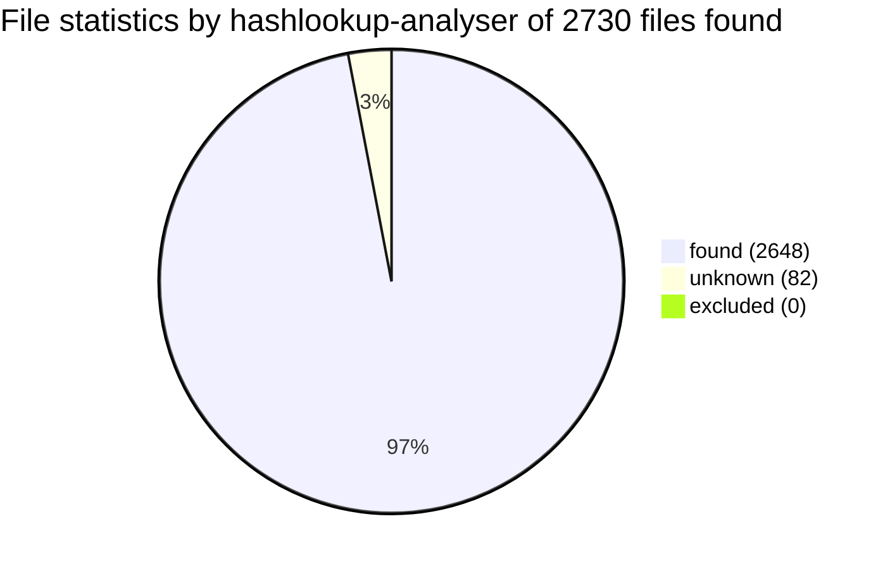
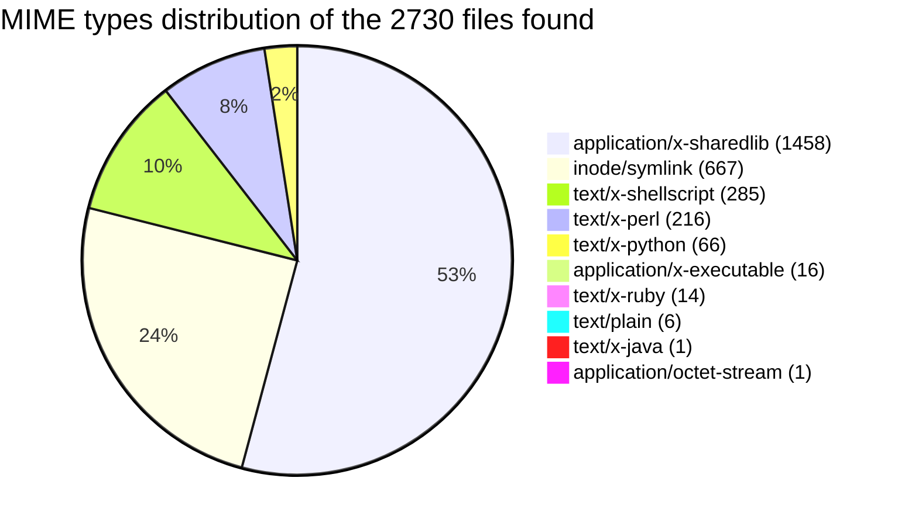

# Overall statistics

Analysed directory /bin on maurer running Linux-5.13.0-28-generic-x86_64-with-glibc2.29 at 2022-02-18 08:50:33.469586+00:00.

Run with [hashlookup-forensic-analysed](https://github.com/hashlookup/hashlookup-forensic-analyser) version 0.9.

|Hashlookup type|Numbers|
|:-------------:|:-----:|
|found|2648|
|unknown|82|
|excluded|0|
|analysed|2730|

 - *found* : File found and known in the [hashlookup database](https://circl.lu/services/hashlookup/).
 - *unknown* : File not found in the [hashlookup database](https://circl.lu/services/hashlookup/).
 - *excluded* : File excluded from the analysis such as special files or files inaccessible.
 - *analysed* : Total file analysed (hashed) without the excluded ones.

# Detailed review
Files analysed can be found below sorted by unknown and known files. The result is also available in a [JSON file](full.json).
## Unknown files

Files which might require further investigation and analysis are listed below.

|Filename|SHA-1 value|
|:-------|:----------|
|/bin/i386|E1E04B05BF3B791FE0B92DD031F95A00BBD8CD8E|
|/bin/last|514734EE61691C91D6803F2E4502E6BE1D6A5171|
|/bin/flock|B841B990367D7A9FFC67FE7C704AAEDC66A82D05|
|/bin/linux64|E1E04B05BF3B791FE0B92DD031F95A00BBD8CD8E|
|/bin/umount|2B5D99A90B60391928B683C2DFEC77DEC2DA6EB6|
|/bin/taskset|978AB662367B3D0DDDF1A03C32EDE9B76B0E4D7C|
|/bin/ua|EC070E567FAC512149CACE04927F517F172F7769|
|/bin/snapctl|05005D713DAE12513309C5DE5185F9ACB66D395D|
|/bin/rev|0886CCB5F47E8AF136E7AFD050624C4C4E9209F8|
|/bin/ex|31632E31A0EC09E9A370E44D0FBB815355E32AE7|
|/bin/rview|31632E31A0EC09E9A370E44D0FBB815355E32AE7|
|/bin/linux32|E1E04B05BF3B791FE0B92DD031F95A00BBD8CD8E|
|/bin/mesg|1ED9F9EB5759CFDCF6614F5E9F4323EFC07F13C8|
|/bin/fincore|C7D6A00BD8129DF5ACDAA1E7FB02050BEE2EB6FB|
|/bin/setterm|4DF7331B481B87BC6BE6E3A0E1F197BD6B3C69D1|
|/bin/osqueryctl|E35B99A161FF08B5F03B963989A364FBCEEBB16C|
|/bin/ubuntu-core-launcher|36815964EB5C9821B5046EDE22C013FA00F1D0D5|
|/bin/mountpoint|730017440BB9A97BE6D337521CC0F926AFC682E7|
|/bin/wdctl|C3C8E13144F0413253B667080C6B85BC978CC1A1|
|/bin/vimdiff|31632E31A0EC09E9A370E44D0FBB815355E32AE7|
|/bin/x86_64|E1E04B05BF3B791FE0B92DD031F95A00BBD8CD8E|
|/bin/partx|B0D3D3B7BA50F771347A58AF417D17A822DE404B|
|/bin/lsns|932242203743362FFFC579259015299E6993E2EE|
|/bin/ubuntu-advantage|EC070E567FAC512149CACE04927F517F172F7769|
|/bin/vim.tiny|5F444412BB6C53827167DB414D67829C33581E73|
|/bin/clamscan|2724E16F2DEB549F62A37DB75D0B1415A8483394|
|/bin/rename.ul|A59F43ADACEC9A26E6F18485B57E311DC157AFAB|
|/bin/clamsubmit|B620E5C75484241578DB80CC92FFF0F8A9D8C83E|
|/bin/fallocate|5E4D6711BCEDACD4F968260254D4BA89A34F81F5|
|/bin/delpart|003D5523AF42810BD6BFB70755D29FE1187E7982|
|/bin/rvim|31632E31A0EC09E9A370E44D0FBB815355E32AE7|
|/bin/findmnt|2CDFFB3EF9C18B94207043728CC61E754C2A4F45|
|/bin/logger|08CAF81C5424C16093AD28F9CC4C100BD819FE3A|
|/bin/script|AE6DF393CF6BD5333EB2A2B8F1A559494105E1CC|
|/bin/setpriv|6A0925B4001AE194164212573F1467EC9FFD4689|
|/bin/chrt|8C5C376E693FEFD38455A4AE7A34EE3131EF2EA9|
|/bin/lscpu|38484637C341054497C91BB20C9843DDEA331DC1|
|/bin/vim|31632E31A0EC09E9A370E44D0FBB815355E32AE7|
|/bin/clambc|7EA5085ECB280C77FB504E00DB48902DFDD4C153|
|/bin/renice|479978FFED14AB81FDCBB92FFFBC798BC49BE0DE|
|/bin/dmesg|C7DB48C841F0D4537AAA2D3083F5D874F2F5BA55|
|/bin/namei|B5A88A7D73A416FB480A728F7D5CDDE92A1AC843|
|/bin/pandoc|CFC93EF91D70B896D28BAC74C75654F67973B2F2|
|/bin/nsenter|AC1556D7FAB931E3BFD3EA1939D289A7EE0EA300|
|/bin/lsblk|8C34C3C0E7DD299B722465C84C69D66269DAD74D|
|/bin/vi|31632E31A0EC09E9A370E44D0FBB815355E32AE7|
|/bin/setarch|E1E04B05BF3B791FE0B92DD031F95A00BBD8CD8E|
|/bin/displaylink-installer|3855A770EF0E0144F90EBFD2791AD905AB081159|
|/bin/choom|5C24E9EC3D15374A279EB46498E6373AF314DA84|
|/bin/ionice|62E30263758A0D131DD48AE78DDCEADEF6AEBFA3|
|/bin/lsipc|3D5B32E8580744FD7D5410A220C7BE0F6FD9C2D1|
|/bin/ipcrm|F1475F86AE58E63A87E7E04D218B9DD10A6DD99E|
|/bin/zoom|1CC4413CCF1AFDF28AE91DD082C0B88A6457A595|
|/bin/sigtool|3D51CFBAB6EDD9E9E168DDFF47F6F7AE2E39905C|
|/bin/prlimit|A4B62B8B5062667F781800D5B54007FE00DE05AD|
|/bin/getopt|2336F2D23914D92D5C1C4019DA797A7A8C24DDA4|
|/bin/mcookie|2B0AD92B0DD9E5F4D97B09B8B146D5C4E199C35F|
|/bin/snap|C2DD90081CFAE30F3BBE9F10098C6B2DB7856701|
|/bin/ipcmk|EBEEBF9BCB8EEED26A0288C43B475D86F758F808|
|/bin/mount|6A0CCED78DF30ABB82747C7675805B84EB3AF212|
|/bin/addpart|F4AAED28ECB386099C5AF3E55F73F1C4F36AD309|
|/bin/uuidgen|39866E3100605C4CE90717F0E0103AA15BF7E3D2|
|/bin/setsid|CC8B3D087D51E787F173376DA6D8152EE77CBA5E|
|/bin/lslocks|AF2D666E77B0D6890C48B38C10D67A93D269628D|
|/bin/view|31632E31A0EC09E9A370E44D0FBB815355E32AE7|
|/bin/more|265204E626B330F9B1D874734E03E39396165F26|
|/bin/uuidparse|2CCEED36E6087B8693D137E6E2680F0DBA76AA2F|
|/bin/su|DEFCC1DCE97B27B977DF1AB92DF655E7F9F82EFD|
|/bin/resizepart|6751CF5483507D99C1BCD56539282A30966B2891|
|/bin/unshare|70C883BF6D208FAF36669D1B85CF0FE39A910368|
|/bin/lastb|514734EE61691C91D6803F2E4502E6BE1D6A5171|
|/bin/ipcs|D8A24E33C4091E13E9C809D6EB3D479B32F0DF22|
|/bin/lslogins|83AEDF4120A68EC544F0B8300628348AFEF26DBD|
|/bin/scriptreplay|D6B87DE2B33BF163E6FD16182CBD2645BC87495F|
|/bin/whereis|6A1825DB7A4D402C620A125A7A3F362840419A2E|
|/bin/vim.basic|31632E31A0EC09E9A370E44D0FBB815355E32AE7|
|/bin/freshclam|C799DA4481690BAD0559F2F769A7558EFACA250F|
|/bin/osqueryd|F94FCEFABE8A6E12EB18ECF9F24FB9FD2C1496D5|
|/bin/utmpdump|CF0BF1B6D845C34207D4E2DC5E9B609EB6A0D60F|
|/bin/osqueryi|F94FCEFABE8A6E12EB18ECF9F24FB9FD2C1496D5|
|/bin/lsmem|C0C880F7E458450CDC5F3A4D8C5F61F5391098D6|
|/bin/wall|1DA59E7CBCB1BB361C08D5AC621681638FFA9634|

## Known files

Files found in hashlookup which might require less investigation and analysis are listed below.

|Filename|SHA-1 value|
|:-------|:----------|
|/bin/gio-querymodules|[365C8A657289E1B17371E8BBC0BDC86D6A6BC532](https://hashlookup.circl.lu/lookup/sha1/365C8A657289E1B17371E8BBC0BDC86D6A6BC532)|
|/bin/fusermount|[760A0CDA27AD8AB8C3488F302E8C1ADC1CA6D6D1](https://hashlookup.circl.lu/lookup/sha1/760A0CDA27AD8AB8C3488F302E8C1ADC1CA6D6D1)|
|/bin/python3.8|[934CC4CE3ACA5F49FDDFFAF15E70E08D33D4FA99](https://hashlookup.circl.lu/lookup/sha1/934CC4CE3ACA5F49FDDFFAF15E70E08D33D4FA99)|
|/bin/glib-mkenums|[6A896782DD28DC18AED563E8AD19336800A1A20B](https://hashlookup.circl.lu/lookup/sha1/6A896782DD28DC18AED563E8AD19336800A1A20B)|
|/bin/truncate|[C38FFD20320B52A41E32D475E53C6B94391EF0CD](https://hashlookup.circl.lu/lookup/sha1/C38FFD20320B52A41E32D475E53C6B94391EF0CD)|
|/bin/traceproto|[F733CCCE9E72F9FCB9959C4DA88DEDF72B24BDDD](https://hashlookup.circl.lu/lookup/sha1/F733CCCE9E72F9FCB9959C4DA88DEDF72B24BDDD)|
|/bin/debconf-gettextize|[D087E63F242933C5E7F9D7CF17AA4BA71A54747A](https://hashlookup.circl.lu/lookup/sha1/D087E63F242933C5E7F9D7CF17AA4BA71A54747A)|
|/bin/sudoreplay|[252AF9ACE799283851B7603550257C25BDC0883C](https://hashlookup.circl.lu/lookup/sha1/252AF9ACE799283851B7603550257C25BDC0883C)|
|/bin/zegrep|[0B4EEBDDBD95C099C22E75245F001E10C4FD934D](https://hashlookup.circl.lu/lookup/sha1/0B4EEBDDBD95C099C22E75245F001E10C4FD934D)|
|/bin/xmore|[F8F69720AAB4EAE9FD303255A472482D16363950](https://hashlookup.circl.lu/lookup/sha1/F8F69720AAB4EAE9FD303255A472482D16363950)|
|/bin/gst-launch-1.0|[3ED882B5E9EE15C666EC77A530321847C7EB5D39](https://hashlookup.circl.lu/lookup/sha1/3ED882B5E9EE15C666EC77A530321847C7EB5D39)|
|/bin/kmod|[918DF370CE83664D58F09D4FE3CBD8EAA10A3334](https://hashlookup.circl.lu/lookup/sha1/918DF370CE83664D58F09D4FE3CBD8EAA10A3334)|
|/bin/dh_installifupdown|[FD55EEE48AB0D7262D6A75FCCBA0D4C1A30DB0A7](https://hashlookup.circl.lu/lookup/sha1/FD55EEE48AB0D7262D6A75FCCBA0D4C1A30DB0A7)|
|/bin/mkfontscale|[6EE282ED9DD9C332F1F2FC74DA14E43B7BF3E624](https://hashlookup.circl.lu/lookup/sha1/6EE282ED9DD9C332F1F2FC74DA14E43B7BF3E624)|
|/bin/mdatopbm|[E0ACA69C05C89735313984AD55502340FB47D96E](https://hashlookup.circl.lu/lookup/sha1/E0ACA69C05C89735313984AD55502340FB47D96E)|
|/bin/rubibtex|[D4E9D99ECEBDA4D629CB40D1057CA272F27DE2ED](https://hashlookup.circl.lu/lookup/sha1/D4E9D99ECEBDA4D629CB40D1057CA272F27DE2ED)|
|/bin/chktex|[949679C324D1919570CB46C2E399247D4C5DB758](https://hashlookup.circl.lu/lookup/sha1/949679C324D1919570CB46C2E399247D4C5DB758)|
|/bin/ps2pdf12|[6A9B252D8C4568A644E923767FE80C0D8AE47BFE](https://hashlookup.circl.lu/lookup/sha1/6A9B252D8C4568A644E923767FE80C0D8AE47BFE)|
|/bin/pnmtosir|[2D2857D2D445BD4970413CC5CAC4BE22564EF4CD](https://hashlookup.circl.lu/lookup/sha1/2D2857D2D445BD4970413CC5CAC4BE22564EF4CD)|
|/bin/fc-cache|[819F03D0F9670425BBD1777D2E8C1685FC3B5027](https://hashlookup.circl.lu/lookup/sha1/819F03D0F9670425BBD1777D2E8C1685FC3B5027)|
|/bin/kpsestat|[BB79945AC75C585B9723876885A82CC4A7FB1519](https://hashlookup.circl.lu/lookup/sha1/BB79945AC75C585B9723876885A82CC4A7FB1519)|
|/bin/ulockmgr_server|[EFE03CE1ABDDBD935C8EADCFAE71B57E1E0070E7](https://hashlookup.circl.lu/lookup/sha1/EFE03CE1ABDDBD935C8EADCFAE71B57E1E0070E7)|
|/bin/dh_installinit|[CF8CA2A3DA3A26ED017FE76C7E8BB4A8764AAB1E](https://hashlookup.circl.lu/lookup/sha1/CF8CA2A3DA3A26ED017FE76C7E8BB4A8764AAB1E)|
|/bin/gpu-manager|[617ACAC8DCA6A25F35BBBFBD5D25211543A94A9A](https://hashlookup.circl.lu/lookup/sha1/617ACAC8DCA6A25F35BBBFBD5D25211543A94A9A)|
|/bin/ppdhtml|[F454D6F7EA7DEE6ECC3BCA67F3D3F643F779051B](https://hashlookup.circl.lu/lookup/sha1/F454D6F7EA7DEE6ECC3BCA67F3D3F643F779051B)|
|/bin/id|[FACC2BE3AF2546E4E2F5C48BA4BC253C8B7138B7](https://hashlookup.circl.lu/lookup/sha1/FACC2BE3AF2546E4E2F5C48BA4BC253C8B7138B7)|
|/bin/tac|[4D1750E48D150154EE20F71DFD04EFAF7778E12E](https://hashlookup.circl.lu/lookup/sha1/4D1750E48D150154EE20F71DFD04EFAF7778E12E)|
|/bin/jpgicc|[B7F5C7E4A079BDD7856AB01B37635D07F3AF78A2](https://hashlookup.circl.lu/lookup/sha1/B7F5C7E4A079BDD7856AB01B37635D07F3AF78A2)|
|/bin/update-notifier|[9A2B69C7D42A00BDB2C45687CF64A3B1C350B410](https://hashlookup.circl.lu/lookup/sha1/9A2B69C7D42A00BDB2C45687CF64A3B1C350B410)|
|/bin/isoinfo|[B714A51E96FE064FEBC7F612C3863C5CC0C903DE](https://hashlookup.circl.lu/lookup/sha1/B714A51E96FE064FEBC7F612C3863C5CC0C903DE)|
|/bin/latexdiff-svn|[B2F528BC7EA37BE7235C1ADC67D9D895CCAC4792](https://hashlookup.circl.lu/lookup/sha1/B2F528BC7EA37BE7235C1ADC67D9D895CCAC4792)|
|/bin/dir|[20BF016B554AA799775CACD62328E8164DE2C811](https://hashlookup.circl.lu/lookup/sha1/20BF016B554AA799775CACD62328E8164DE2C811)|
|/bin/fixpsditps|[D01E616DEFCC772B81A6EAA931DC209950372452](https://hashlookup.circl.lu/lookup/sha1/D01E616DEFCC772B81A6EAA931DC209950372452)|
|/bin/deweb|[106660EF42FD585A369A384E19CBAE9EB4D73B03](https://hashlookup.circl.lu/lookup/sha1/106660EF42FD585A369A384E19CBAE9EB4D73B03)|
|/bin/nmtui-connect|[E1AEF7E35DADD2C7B04316278FEC7DDAE85386B1](https://hashlookup.circl.lu/lookup/sha1/E1AEF7E35DADD2C7B04316278FEC7DDAE85386B1)|
|/bin/ilbmtoppm|[C83548145D66C22B292687DB9FEFD3CC7792B53E](https://hashlookup.circl.lu/lookup/sha1/C83548145D66C22B292687DB9FEFD3CC7792B53E)|
|/bin/journalctl|[42F4CD4DA2695EC2A9455DC615015AEE38B5E143](https://hashlookup.circl.lu/lookup/sha1/42F4CD4DA2695EC2A9455DC615015AEE38B5E143)|
|/bin/autoconf|[19E4B8A8A68200F5C99F8F0A68E31009D5FB0ED6](https://hashlookup.circl.lu/lookup/sha1/19E4B8A8A68200F5C99F8F0A68E31009D5FB0ED6)|
|/bin/xml2ag|[BD97595DAF092D157603D2FC0BFB9C9FC51492B5](https://hashlookup.circl.lu/lookup/sha1/BD97595DAF092D157603D2FC0BFB9C9FC51492B5)|
|/bin/cksum|[6458E2E3853E9039DB23B2BE3F4BD2B623652C5D](https://hashlookup.circl.lu/lookup/sha1/6458E2E3853E9039DB23B2BE3F4BD2B623652C5D)|
|/bin/Xwayland|[DF7F24A227248E5BA0F5A9E1F8A3D425699CF457](https://hashlookup.circl.lu/lookup/sha1/DF7F24A227248E5BA0F5A9E1F8A3D425699CF457)|
|/bin/neqn|[E432BEAADC74B4072495B932EFABF22BAEF9C525](https://hashlookup.circl.lu/lookup/sha1/E432BEAADC74B4072495B932EFABF22BAEF9C525)|
|/bin/pnmscale|[1430BA32FF33236A86F063D209D3386E1D8543AC](https://hashlookup.circl.lu/lookup/sha1/1430BA32FF33236A86F063D209D3386E1D8543AC)|
|/bin/nawk|[DD8FA40126FB184F7C7F79744EE95C3C079825CC](https://hashlookup.circl.lu/lookup/sha1/DD8FA40126FB184F7C7F79744EE95C3C079825CC)|
|/bin/pax11publish|[6A6EF9A820AE78D6F6EB4ED18453FEE06716AD1F](https://hashlookup.circl.lu/lookup/sha1/6A6EF9A820AE78D6F6EB4ED18453FEE06716AD1F)|
|/bin/ssh-keygen|[DE893803FB4FD232DCEF3444846D0B364FD33A34](https://hashlookup.circl.lu/lookup/sha1/DE893803FB4FD232DCEF3444846D0B364FD33A34)|
|/bin/dh_icons|[CA04CAEA3CCC8643FE1158636B5B55B22BA7A9BC](https://hashlookup.circl.lu/lookup/sha1/CA04CAEA3CCC8643FE1158636B5B55B22BA7A9BC)|
|/bin/texindex|[8FF912E7FEE332B33DD08932DA766127A7698614](https://hashlookup.circl.lu/lookup/sha1/8FF912E7FEE332B33DD08932DA766127A7698614)|
|/bin/sjispdflatex|[E1A179C3EE976DE8AA162BC4ED5055B8E42BE902](https://hashlookup.circl.lu/lookup/sha1/E1A179C3EE976DE8AA162BC4ED5055B8E42BE902)|
|/bin/kill|[9BCAB7C0A9CAFED932174552A2F3CBB8B4728CC1](https://hashlookup.circl.lu/lookup/sha1/9BCAB7C0A9CAFED932174552A2F3CBB8B4728CC1)|
|/bin/bluemoon|[2DE1FDAD81F9A4E97C6DCF4B29E16CB1358478D8](https://hashlookup.circl.lu/lookup/sha1/2DE1FDAD81F9A4E97C6DCF4B29E16CB1358478D8)|
|/bin/git-upload-pack|[FE8452C7E612255D955EFDF41E8F734B94061AF0](https://hashlookup.circl.lu/lookup/sha1/FE8452C7E612255D955EFDF41E8F734B94061AF0)|
|/bin/mkofm|[F00B971DE4A81374DF2271BCB4E16EB9ED89BA88](https://hashlookup.circl.lu/lookup/sha1/F00B971DE4A81374DF2271BCB4E16EB9ED89BA88)|
|/bin/text2pcap|[B4F45258365B67A49948A521CC5CEB9DC222C0A8](https://hashlookup.circl.lu/lookup/sha1/B4F45258365B67A49948A521CC5CEB9DC222C0A8)|
|/bin/infocmp|[D1B0D980E733FB66BA2CA2A2AED2B9AC8BDA459F](https://hashlookup.circl.lu/lookup/sha1/D1B0D980E733FB66BA2CA2A2AED2B9AC8BDA459F)|
|/bin/mkdir|[9CCD403658B0184F165823B928003B5733DA4E02](https://hashlookup.circl.lu/lookup/sha1/9CCD403658B0184F165823B928003B5733DA4E02)|
|/bin/HEAD|[EEA16D773623505A6BCA380FDD5AB1DE1E25B08D](https://hashlookup.circl.lu/lookup/sha1/EEA16D773623505A6BCA380FDD5AB1DE1E25B08D)|
|/bin/c++|[98C9F326CD70B38F65AA9A0326F8F0EFC8C219A1](https://hashlookup.circl.lu/lookup/sha1/98C9F326CD70B38F65AA9A0326F8F0EFC8C219A1)|
|/bin/gxl2dot|[0FD1BC622EED78949853B2B63FF463560A4DA9BE](https://hashlookup.circl.lu/lookup/sha1/0FD1BC622EED78949853B2B63FF463560A4DA9BE)|
|/bin/psselect|[BFBC7A6C7D315EE603161202645A319F4AF8EB62](https://hashlookup.circl.lu/lookup/sha1/BFBC7A6C7D315EE603161202645A319F4AF8EB62)|
|/bin/xclipboard|[1B60141EF08169D285381BEC96B395B010D02157](https://hashlookup.circl.lu/lookup/sha1/1B60141EF08169D285381BEC96B395B010D02157)|
|/bin/sbkeysync|[77E1B0A85B403062ED2D3F3455EE9C4BD8B05051](https://hashlookup.circl.lu/lookup/sha1/77E1B0A85B403062ED2D3F3455EE9C4BD8B05051)|
|/bin/zipcloak|[7BE0A061A9A001CAAF9DE213BE4C7B03934DF187](https://hashlookup.circl.lu/lookup/sha1/7BE0A061A9A001CAAF9DE213BE4C7B03934DF187)|
|/bin/rpdfcrop|[2234C76EBE24A0CA49F02C5EECFCF3A167FDC927](https://hashlookup.circl.lu/lookup/sha1/2234C76EBE24A0CA49F02C5EECFCF3A167FDC927)|
|/bin/systemd-path|[0894314A27E8E64B735DA297C676693D2E21BC6D](https://hashlookup.circl.lu/lookup/sha1/0894314A27E8E64B735DA297C676693D2E21BC6D)|
|/bin/pamphletangler|[8A4E3B35D17C2E5230120A88223EF1621A9FF0E9](https://hashlookup.circl.lu/lookup/sha1/8A4E3B35D17C2E5230120A88223EF1621A9FF0E9)|
|/bin/apturl|[F63C2901D843216BE71317C0CB48C660619E57A1](https://hashlookup.circl.lu/lookup/sha1/F63C2901D843216BE71317C0CB48C660619E57A1)|
|/bin/x86_64-linux-gnu-gcov-tool-9|[D13DC9D80E0DC22B72D34AB769219CDDD7009A56](https://hashlookup.circl.lu/lookup/sha1/D13DC9D80E0DC22B72D34AB769219CDDD7009A56)|
|/bin/dh_installchangelogs|[6572A871CD90619D9C04AB5119A2BCBAF83F59E1](https://hashlookup.circl.lu/lookup/sha1/6572A871CD90619D9C04AB5119A2BCBAF83F59E1)|
|/bin/mcheck|[117BF4102F2E8D4ED29A0F9CB4B1981B74FFC313](https://hashlookup.circl.lu/lookup/sha1/117BF4102F2E8D4ED29A0F9CB4B1981B74FFC313)|
|/bin/busybox|[3EBCF65154B6A9D3054B153A6BE2E221B20F05BC](https://hashlookup.circl.lu/lookup/sha1/3EBCF65154B6A9D3054B153A6BE2E221B20F05BC)|
|/bin/x86_64-linux-gnu-gcc|[E89F3B4C21C2005896C964462DA4766057DD94E9](https://hashlookup.circl.lu/lookup/sha1/E89F3B4C21C2005896C964462DA4766057DD94E9)|
|/bin/mkindex|[BB52DD5165B88B2DB9FEB3FD059C62A4184272BE](https://hashlookup.circl.lu/lookup/sha1/BB52DD5165B88B2DB9FEB3FD059C62A4184272BE)|
|/bin/calibrate_ppa|[5BEB67A1BB9B58C8CBE48021B9E5310687212C5A](https://hashlookup.circl.lu/lookup/sha1/5BEB67A1BB9B58C8CBE48021B9E5310687212C5A)|
|/bin/dvired|[EFA186DD3C617A870DB4E2F457E9AA6906970E7C](https://hashlookup.circl.lu/lookup/sha1/EFA186DD3C617A870DB4E2F457E9AA6906970E7C)|
|/bin/flameshot|[EFB7C98EC924635C6E91DFE809E79421D037EF52](https://hashlookup.circl.lu/lookup/sha1/EFB7C98EC924635C6E91DFE809E79421D037EF52)|
|/bin/ssh-agent|[2A490FE4A57684FFEA36F9D107BC686B954AF17E](https://hashlookup.circl.lu/lookup/sha1/2A490FE4A57684FFEA36F9D107BC686B954AF17E)|
|/bin/dvipdft|[4A84D407AE9C500BF73D7AE90929BA49D6A411C0](https://hashlookup.circl.lu/lookup/sha1/4A84D407AE9C500BF73D7AE90929BA49D6A411C0)|
|/bin/montage|[91C4B86FED4533B5ED2565111F877A3C1E9433EF](https://hashlookup.circl.lu/lookup/sha1/91C4B86FED4533B5ED2565111F877A3C1E9433EF)|
|/bin/pnmcrop|[8C182BDEA7121A7701F2C393D4D1CD4275F3270C](https://hashlookup.circl.lu/lookup/sha1/8C182BDEA7121A7701F2C393D4D1CD4275F3270C)|
|/bin/localectl|[F0CCDEB3C44F7DB2C6347589A93141E6B628AD69](https://hashlookup.circl.lu/lookup/sha1/F0CCDEB3C44F7DB2C6347589A93141E6B628AD69)|
|/bin/pbmlife|[2F9B457CC0E7068D217F4D8AA0783379899CAACD](https://hashlookup.circl.lu/lookup/sha1/2F9B457CC0E7068D217F4D8AA0783379899CAACD)|
|/bin/latexdiff-rcs|[B2F528BC7EA37BE7235C1ADC67D9D895CCAC4792](https://hashlookup.circl.lu/lookup/sha1/B2F528BC7EA37BE7235C1ADC67D9D895CCAC4792)|
|/bin/jmod|[360A5ACA92483132CE87645FC7611440997A2DF3](https://hashlookup.circl.lu/lookup/sha1/360A5ACA92483132CE87645FC7611440997A2DF3)|
|/bin/chardet3|[13E57384F8AAFB44F81D05BFEA9D426E395FF3B2](https://hashlookup.circl.lu/lookup/sha1/13E57384F8AAFB44F81D05BFEA9D426E395FF3B2)|
|/bin/xcursorgen|[DE8F758733BC9D08D46159E26E48CBE24F08F2DB](https://hashlookup.circl.lu/lookup/sha1/DE8F758733BC9D08D46159E26E48CBE24F08F2DB)|
|/bin/desktop-file-edit|[2679A0D52B033993B70D5F8E10A61447BF32F424](https://hashlookup.circl.lu/lookup/sha1/2679A0D52B033993B70D5F8E10A61447BF32F424)|
|/bin/peekfd|[C895B6B876C3272A84805724937BFD4DCE651EA2](https://hashlookup.circl.lu/lookup/sha1/C895B6B876C3272A84805724937BFD4DCE651EA2)|
|/bin/pbmtolj|[B55D8BE01C46CB4DD3FFD064802A6C06D94C8D85](https://hashlookup.circl.lu/lookup/sha1/B55D8BE01C46CB4DD3FFD064802A6C06D94C8D85)|
|/bin/pic2tpic|[7DDE13D8762F8909ADE8F30098041D2D76DA5DBD](https://hashlookup.circl.lu/lookup/sha1/7DDE13D8762F8909ADE8F30098041D2D76DA5DBD)|
|/bin/lft|[352197C2B6E1A0BF0215C7C4F6004C3A8778C6D1](https://hashlookup.circl.lu/lookup/sha1/352197C2B6E1A0BF0215C7C4F6004C3A8778C6D1)|
|/bin/ppdmerge|[5FB0AF9EBE115F3AF9AE1E32C3105D731165424B](https://hashlookup.circl.lu/lookup/sha1/5FB0AF9EBE115F3AF9AE1E32C3105D731165424B)|
|/bin/fwupdtpmevlog|[42AA8E7EFA318DEC10E85A48EE3CD6EFF5CA081F](https://hashlookup.circl.lu/lookup/sha1/42AA8E7EFA318DEC10E85A48EE3CD6EFF5CA081F)|
|/bin/pnmmontage|[3DF327343A26E6A2E14F19B7647BA208D6F93C5F](https://hashlookup.circl.lu/lookup/sha1/3DF327343A26E6A2E14F19B7647BA208D6F93C5F)|
|/bin/match_parens|[1C71C4A51027A24DA9E8B51961FCFD94505CC590](https://hashlookup.circl.lu/lookup/sha1/1C71C4A51027A24DA9E8B51961FCFD94505CC590)|
|/bin/pdf2dsc|[50AB023251165545FC0AC72F0E0467D74DFD5B46](https://hashlookup.circl.lu/lookup/sha1/50AB023251165545FC0AC72F0E0467D74DFD5B46)|
|/bin/vstp|[E6962A90EB73F4C2A97E2E9A9629329DAAC4E725](https://hashlookup.circl.lu/lookup/sha1/E6962A90EB73F4C2A97E2E9A9629329DAAC4E725)|
|/bin/ps2frag|[A7717E03DA4C4D11510AF1135B78BD642BD6D6B7](https://hashlookup.circl.lu/lookup/sha1/A7717E03DA4C4D11510AF1135B78BD642BD6D6B7)|
|/bin/gnome-keyring|[0C8908B39776412DCDB241D1477D1353770FB7D4](https://hashlookup.circl.lu/lookup/sha1/0C8908B39776412DCDB241D1477D1353770FB7D4)|
|/bin/bundler|[89001B4AFB61CED7CEDBE83937CAEEEA467B3BD2](https://hashlookup.circl.lu/lookup/sha1/89001B4AFB61CED7CEDBE83937CAEEEA467B3BD2)|
|/bin/cefslatex|[5A1D114DDAA1F65CCDCC0DE91B7251252C8909CA](https://hashlookup.circl.lu/lookup/sha1/5A1D114DDAA1F65CCDCC0DE91B7251252C8909CA)|
|/bin/xman|[3DBFDAA69CB896CD57408EBB0C44E644E80B85FA](https://hashlookup.circl.lu/lookup/sha1/3DBFDAA69CB896CD57408EBB0C44E644E80B85FA)|
|/bin/podebconf-report-po|[32BB1364897E8F0B16E6BEF274D4E3210B179815](https://hashlookup.circl.lu/lookup/sha1/32BB1364897E8F0B16E6BEF274D4E3210B179815)|
|/bin/umax_pp|[678028CE44024BC33EC016E8EB4950FC0893E682](https://hashlookup.circl.lu/lookup/sha1/678028CE44024BC33EC016E8EB4950FC0893E682)|
|/bin/ico|[7D35BC2E12963FB72D47A8209AD28664452880F4](https://hashlookup.circl.lu/lookup/sha1/7D35BC2E12963FB72D47A8209AD28664452880F4)|
|/bin/dosepsbin|[1FF395D03F1C7CE9380B42CAFC241A5ECA59258C](https://hashlookup.circl.lu/lookup/sha1/1FF395D03F1C7CE9380B42CAFC241A5ECA59258C)|
|/bin/true|[237ACDD952D8969927DA83ECF8028B175646E634](https://hashlookup.circl.lu/lookup/sha1/237ACDD952D8969927DA83ECF8028B175646E634)|
|/bin/gvfs-rename|[B9A02BB9F2F05D960C58DA3001C1026A9A883A18](https://hashlookup.circl.lu/lookup/sha1/B9A02BB9F2F05D960C58DA3001C1026A9A883A18)|
|/bin/mktexlsr|[70B278499A090EFDAA3183AD854CF9F31F61497D](https://hashlookup.circl.lu/lookup/sha1/70B278499A090EFDAA3183AD854CF9F31F61497D)|
|/bin/pdftocairo|[3D2D9390C2D9C669FB4A85BD1E8CC6DE6E5B17D2](https://hashlookup.circl.lu/lookup/sha1/3D2D9390C2D9C669FB4A85BD1E8CC6DE6E5B17D2)|
|/bin/infotocap|[77CEFEFFC3FF3D7270295CE33EE14A3AD7703865](https://hashlookup.circl.lu/lookup/sha1/77CEFEFFC3FF3D7270295CE33EE14A3AD7703865)|
|/bin/identify-im6|[04C14EAA0B19FF23807399C8481545FDF5FDF808](https://hashlookup.circl.lu/lookup/sha1/04C14EAA0B19FF23807399C8481545FDF5FDF808)|
|/bin/mk_modmap|[7615CC7405805515CF057EB75C23336B78C3456D](https://hashlookup.circl.lu/lookup/sha1/7615CC7405805515CF057EB75C23336B78C3456D)|
|/bin/dpkg-shlibdeps|[E8F2D761CB62369E2DC1919F86E977E4BBAF02EE](https://hashlookup.circl.lu/lookup/sha1/E8F2D761CB62369E2DC1919F86E977E4BBAF02EE)|
|/bin/pyversions|[A7BF5ABD3EBCE3E932B0C51EF51E5E1E32F427DC](https://hashlookup.circl.lu/lookup/sha1/A7BF5ABD3EBCE3E932B0C51EF51E5E1E32F427DC)|
|/bin/POST|[EEA16D773623505A6BCA380FDD5AB1DE1E25B08D](https://hashlookup.circl.lu/lookup/sha1/EEA16D773623505A6BCA380FDD5AB1DE1E25B08D)|
|/bin/ppmrelief|[59677D13B4D2B82F7F02D4D700F88E1F8297FB5D](https://hashlookup.circl.lu/lookup/sha1/59677D13B4D2B82F7F02D4D700F88E1F8297FB5D)|
|/bin/gvfs-cat|[C19BC0159DFD62F1184809984269D2730A5F82A5](https://hashlookup.circl.lu/lookup/sha1/C19BC0159DFD62F1184809984269D2730A5F82A5)|
|/bin/lft.db|[352197C2B6E1A0BF0215C7C4F6004C3A8778C6D1](https://hashlookup.circl.lu/lookup/sha1/352197C2B6E1A0BF0215C7C4F6004C3A8778C6D1)|
|/bin/colcrt|[ED97120F80BFD11CC6A8BB32A49F3CE7D6F73E2B](https://hashlookup.circl.lu/lookup/sha1/ED97120F80BFD11CC6A8BB32A49F3CE7D6F73E2B)|
|/bin/ar|[E0A70D7245A7D3133871C2A8DBEA17D583082831](https://hashlookup.circl.lu/lookup/sha1/E0A70D7245A7D3133871C2A8DBEA17D583082831)|
|/bin/msxlint|[28CEF368B2FE396FC73F5C985C99C67FF7C4331E](https://hashlookup.circl.lu/lookup/sha1/28CEF368B2FE396FC73F5C985C99C67FF7C4331E)|
|/bin/[|[B3D68B1594B4AAAE52BD6A1A1FC7AA26A83B2DCE](https://hashlookup.circl.lu/lookup/sha1/B3D68B1594B4AAAE52BD6A1A1FC7AA26A83B2DCE)|
|/bin/dotty|[31D64293D5F583211C8D761774232241431117E2](https://hashlookup.circl.lu/lookup/sha1/31D64293D5F583211C8D761774232241431117E2)|
|/bin/r-pmpost|[AE2C683E5C725AB963CA73A77CA87E44450ECE27](https://hashlookup.circl.lu/lookup/sha1/AE2C683E5C725AB963CA73A77CA87E44450ECE27)|
|/bin/rake|[712A0FD3801F510FDC537F05F25B682A295D177F](https://hashlookup.circl.lu/lookup/sha1/712A0FD3801F510FDC537F05F25B682A295D177F)|
|/bin/mktexmf|[0DEC7D4EAAE776191C6363E5CF85288417177D2A](https://hashlookup.circl.lu/lookup/sha1/0DEC7D4EAAE776191C6363E5CF85288417177D2A)|
|/bin/wmf2svg|[BBC3BC74213C2F0B6D6F873DB8D8904FEA789206](https://hashlookup.circl.lu/lookup/sha1/BBC3BC74213C2F0B6D6F873DB8D8904FEA789206)|
|/bin/ketcindy|[91C81D089C718D29D615B2AA7244AC18EF9772F5](https://hashlookup.circl.lu/lookup/sha1/91C81D089C718D29D615B2AA7244AC18EF9772F5)|
|/bin/aa-enabled|[BB0C89E4ABF7721F84F5790BB36C1E105FDD94B0](https://hashlookup.circl.lu/lookup/sha1/BB0C89E4ABF7721F84F5790BB36C1E105FDD94B0)|
|/bin/ps2pdf13|[C529A0A4DAC3218F12F1BD0F3F2C8668B189E65B](https://hashlookup.circl.lu/lookup/sha1/C529A0A4DAC3218F12F1BD0F3F2C8668B189E65B)|
|/bin/migrate-pubring-from-classic-gpg|[4AEFD56F8A611862FB3FBA249B835262A6B0D0D4](https://hashlookup.circl.lu/lookup/sha1/4AEFD56F8A611862FB3FBA249B835262A6B0D0D4)|
|/bin/update-alternatives|[10387F151970B98B7179907FA0C41A1143322B18](https://hashlookup.circl.lu/lookup/sha1/10387F151970B98B7179907FA0C41A1143322B18)|
|/bin/png-fix-itxt|[B73E4CDC93E21C0B8842793A55142711A9D7F884](https://hashlookup.circl.lu/lookup/sha1/B73E4CDC93E21C0B8842793A55142711A9D7F884)|
|/bin/opl2ofm|[B1A16C285014336C2329ED71F49BF08098AB33D8](https://hashlookup.circl.lu/lookup/sha1/B1A16C285014336C2329ED71F49BF08098AB33D8)|
|/bin/pbmtopsg3|[6A2CB4A20E68E97C82DB27072612CC890588257B](https://hashlookup.circl.lu/lookup/sha1/6A2CB4A20E68E97C82DB27072612CC890588257B)|
|/bin/pgmramp|[846CA516C652F9985CDD702BB7314EA8DB827A03](https://hashlookup.circl.lu/lookup/sha1/846CA516C652F9985CDD702BB7314EA8DB827A03)|
|/bin/psbook|[C41CCC606D5E55991CFE3BFA9BB087BECA885063](https://hashlookup.circl.lu/lookup/sha1/C41CCC606D5E55991CFE3BFA9BB087BECA885063)|
|/bin/pygettext2|[4CF8C8FD30672380022CC08D9AC0F0208B1B18DE](https://hashlookup.circl.lu/lookup/sha1/4CF8C8FD30672380022CC08D9AC0F0208B1B18DE)|
|/bin/perl5.30.0|[16C30D1657573ACD4FF7DE10CEBF677E32688404](https://hashlookup.circl.lu/lookup/sha1/16C30D1657573ACD4FF7DE10CEBF677E32688404)|
|/bin/pnmtorle|[9E5D176244E4481AEDC8AE57F8A9CB37A03776CA](https://hashlookup.circl.lu/lookup/sha1/9E5D176244E4481AEDC8AE57F8A9CB37A03776CA)|
|/bin/dh_prep|[A2DB724A22DAF20A6E53075BC0E61A51F9756B44](https://hashlookup.circl.lu/lookup/sha1/A2DB724A22DAF20A6E53075BC0E61A51F9756B44)|
|/bin/nc|[142391AB131AF2520A0E4A1622643DBFD3057D52](https://hashlookup.circl.lu/lookup/sha1/142391AB131AF2520A0E4A1622643DBFD3057D52)|
|/bin/jstatd|[E42700DCA3C381C1E401664E2B4D765C56A4E61A](https://hashlookup.circl.lu/lookup/sha1/E42700DCA3C381C1E401664E2B4D765C56A4E61A)|
|/bin/gzexe|[A2C620C78BE47F4613C06F27658BF107DE468740](https://hashlookup.circl.lu/lookup/sha1/A2C620C78BE47F4613C06F27658BF107DE468740)|
|/bin/rawtoppm|[688E387A2B66788C0A09CAD66C35578DF5D1E667](https://hashlookup.circl.lu/lookup/sha1/688E387A2B66788C0A09CAD66C35578DF5D1E667)|
|/bin/snapfuse|[E4CC92D04E674274412D24695A853DBDE9D72674](https://hashlookup.circl.lu/lookup/sha1/E4CC92D04E674274412D24695A853DBDE9D72674)|
|/bin/colrm|[CE6BFD9B2A02CCC25A09F85D542BAD2ECA018DBF](https://hashlookup.circl.lu/lookup/sha1/CE6BFD9B2A02CCC25A09F85D542BAD2ECA018DBF)|
|/bin/xkbvleds|[3FABB0E7EE34698BE3CF4A93783D6F9981D6ACC1](https://hashlookup.circl.lu/lookup/sha1/3FABB0E7EE34698BE3CF4A93783D6F9981D6ACC1)|
|/bin/m-tx|[96E39129F099E797B1662427392FCF6B4AF951A5](https://hashlookup.circl.lu/lookup/sha1/96E39129F099E797B1662427392FCF6B4AF951A5)|
|/bin/foo2hbpl2-wrapper|[2C053D3D0A234C3C51A9E34773BDD59F7EB12B3B](https://hashlookup.circl.lu/lookup/sha1/2C053D3D0A234C3C51A9E34773BDD59F7EB12B3B)|
|/bin/ifdata|[1924C5A036E9C9B0B1056FBD6AF20C3757BF230A](https://hashlookup.circl.lu/lookup/sha1/1924C5A036E9C9B0B1056FBD6AF20C3757BF230A)|
|/bin/pasuspender|[1048856A50BDDCFC90E343EE0BBEE9FD1ECBCAE2](https://hashlookup.circl.lu/lookup/sha1/1048856A50BDDCFC90E343EE0BBEE9FD1ECBCAE2)|
|/bin/phar|[4011A56B23D72DFDC2448706C22DA14D99EF664A](https://hashlookup.circl.lu/lookup/sha1/4011A56B23D72DFDC2448706C22DA14D99EF664A)|
|/bin/py3versions|[45426DDB17A5072C26FE003669FA4CBDF157B2B2](https://hashlookup.circl.lu/lookup/sha1/45426DDB17A5072C26FE003669FA4CBDF157B2B2)|
|/bin/xinit|[456923F5E02CBFCB2B59B624F9C12D218342215F](https://hashlookup.circl.lu/lookup/sha1/456923F5E02CBFCB2B59B624F9C12D218342215F)|
|/bin/python3-config|[C1FAE489AAAF36024D345B74A4FC331052AF0D47](https://hashlookup.circl.lu/lookup/sha1/C1FAE489AAAF36024D345B74A4FC331052AF0D47)|
|/bin/editcap|[B7E662376EF44530104685183A227C8F0B2152E0](https://hashlookup.circl.lu/lookup/sha1/B7E662376EF44530104685183A227C8F0B2152E0)|
|/bin/dh_movefiles|[651F1C68DAC27658389F206E6139B6228952D823](https://hashlookup.circl.lu/lookup/sha1/651F1C68DAC27658389F206E6139B6228952D823)|
|/bin/dt2dv|[E7BFEE10DB8F6569C9063D8884C5065CCF08414A](https://hashlookup.circl.lu/lookup/sha1/E7BFEE10DB8F6569C9063D8884C5065CCF08414A)|
|/bin/gencat|[8303D12134DC737E13AB7632766AC1FC6861B9F8](https://hashlookup.circl.lu/lookup/sha1/8303D12134DC737E13AB7632766AC1FC6861B9F8)|
|/bin/ischroot|[3D8C6A5508802CBB679B1B3DBBFC286EF2AF047F](https://hashlookup.circl.lu/lookup/sha1/3D8C6A5508802CBB679B1B3DBBFC286EF2AF047F)|
|/bin/cjk-gs-integrate|[DC30194204846B32EB62C3067117FE0C5498F4D0](https://hashlookup.circl.lu/lookup/sha1/DC30194204846B32EB62C3067117FE0C5498F4D0)|
|/bin/mplayer|[03710EEEBF2D91055DD0E5F08CA71C3FCB0C04FC](https://hashlookup.circl.lu/lookup/sha1/03710EEEBF2D91055DD0E5F08CA71C3FCB0C04FC)|
|/bin/debconf-updatepo|[ABB26509B2921B519AB6A9213F347260CED796FF](https://hashlookup.circl.lu/lookup/sha1/ABB26509B2921B519AB6A9213F347260CED796FF)|
|/bin/pbmreduce|[DD4B5379C24C71F0AE2C3A18C5649212AF95195B](https://hashlookup.circl.lu/lookup/sha1/DD4B5379C24C71F0AE2C3A18C5649212AF95195B)|
|/bin/autoscan|[4A73E5BF50C7F38C35FAFBBC152F862B8143EAAD](https://hashlookup.circl.lu/lookup/sha1/4A73E5BF50C7F38C35FAFBBC152F862B8143EAAD)|
|/bin/obexctl|[C050E5D6FA5C0934E0242DA2914E7910A7C3FEA7](https://hashlookup.circl.lu/lookup/sha1/C050E5D6FA5C0934E0242DA2914E7910A7C3FEA7)|
|/bin/dvipdfmx|[66CB4B10DB12A406692ECA043B73AD13ADB4DD6C](https://hashlookup.circl.lu/lookup/sha1/66CB4B10DB12A406692ECA043B73AD13ADB4DD6C)|
|/bin/dpkg-name|[46D1DEC7E2D3547BDDF44973B7C105F6331F3DDE](https://hashlookup.circl.lu/lookup/sha1/46D1DEC7E2D3547BDDF44973B7C105F6331F3DDE)|
|/bin/dbus-cleanup-sockets|[365D50E0407FBCEEEDB8540B197BED6966F25555](https://hashlookup.circl.lu/lookup/sha1/365D50E0407FBCEEEDB8540B197BED6966F25555)|
|/bin/mcd|[B511AA2C0D1C6E167349EEBA6848C0A3F91717A5](https://hashlookup.circl.lu/lookup/sha1/B511AA2C0D1C6E167349EEBA6848C0A3F91717A5)|
|/bin/debconf-show|[28C58CAF56DFD7A565DE284297C301BFD3E5B33F](https://hashlookup.circl.lu/lookup/sha1/28C58CAF56DFD7A565DE284297C301BFD3E5B33F)|
|/bin/loffice|[F3A4E2E13A0D545B01D3CC82F7DEF6C175BBD584](https://hashlookup.circl.lu/lookup/sha1/F3A4E2E13A0D545B01D3CC82F7DEF6C175BBD584)|
|/bin/ping6|[4BA1551297D7E42AF02740DBCB952F9B7F5549C5](https://hashlookup.circl.lu/lookup/sha1/4BA1551297D7E42AF02740DBCB952F9B7F5549C5)|
|/bin/pnmtopng|[D4A66C97044D36E050F6715E435C138401C393C7](https://hashlookup.circl.lu/lookup/sha1/D4A66C97044D36E050F6715E435C138401C393C7)|
|/bin/dbus-run-session|[8F3B0657F4C6CE50C155B983D3AAB96AF835B14F](https://hashlookup.circl.lu/lookup/sha1/8F3B0657F4C6CE50C155B983D3AAB96AF835B14F)|
|/bin/msgcomm|[07D10CE34BD84806B315807371D41287256DDD55](https://hashlookup.circl.lu/lookup/sha1/07D10CE34BD84806B315807371D41287256DDD55)|
|/bin/wopl2ofm|[F313355B4CFCD93DC0E5303C80A9739C7129DE8A](https://hashlookup.circl.lu/lookup/sha1/F313355B4CFCD93DC0E5303C80A9739C7129DE8A)|
|/bin/pktogf|[A78C86B1037045554DB773656A7C6D332AB8A45C](https://hashlookup.circl.lu/lookup/sha1/A78C86B1037045554DB773656A7C6D332AB8A45C)|
|/bin/hp-query|[C9884541F0F9052A3A269A0D75AB335B8B007B81](https://hashlookup.circl.lu/lookup/sha1/C9884541F0F9052A3A269A0D75AB335B8B007B81)|
|/bin/udevadm|[880256859A76126B61E8A19D47C36EFE618900F8](https://hashlookup.circl.lu/lookup/sha1/880256859A76126B61E8A19D47C36EFE618900F8)|
|/bin/tex2aspc|[4E9AB0B2870FB0AC66628A698243A990EFE8F25F](https://hashlookup.circl.lu/lookup/sha1/4E9AB0B2870FB0AC66628A698243A990EFE8F25F)|
|/bin/ppmtoneo|[2DFA2B324B0EE2A9E8E78207D304888D7B221A3F](https://hashlookup.circl.lu/lookup/sha1/2DFA2B324B0EE2A9E8E78207D304888D7B221A3F)|
|/bin/lofromtemplate|[B22145C7EDC5E222E60847DDCB3995ECF5178F9F](https://hashlookup.circl.lu/lookup/sha1/B22145C7EDC5E222E60847DDCB3995ECF5178F9F)|
|/bin/stream-im6|[91F753974EF80F41CD5FEE6E83415ACF6B366790](https://hashlookup.circl.lu/lookup/sha1/91F753974EF80F41CD5FEE6E83415ACF6B366790)|
|/bin/kernel-install|[62CEC29B15043B8F3178DC6CAEDD34846E5169E4](https://hashlookup.circl.lu/lookup/sha1/62CEC29B15043B8F3178DC6CAEDD34846E5169E4)|
|/bin/xeyes|[5B2DD6B5DEA20531AB8740C23E1880F0C84282A1](https://hashlookup.circl.lu/lookup/sha1/5B2DD6B5DEA20531AB8740C23E1880F0C84282A1)|
|/bin/getkeycodes|[ADBD1E1B154E1958F25E6475E9B1E688CA1B63FA](https://hashlookup.circl.lu/lookup/sha1/ADBD1E1B154E1958F25E6475E9B1E688CA1B63FA)|
|/bin/gsnd|[C39C0B3D8457B3E4E104D2F0FB507F761BA9ADC6](https://hashlookup.circl.lu/lookup/sha1/C39C0B3D8457B3E4E104D2F0FB507F761BA9ADC6)|
|/bin/mktexfmt|[B7356D5F9E109E19E9A543EE097BB8C58DB1AD79](https://hashlookup.circl.lu/lookup/sha1/B7356D5F9E109E19E9A543EE097BB8C58DB1AD79)|
|/bin/amstex|[35E8F344ED5BD2D87F1CDB442EE843C6319F98E3](https://hashlookup.circl.lu/lookup/sha1/35E8F344ED5BD2D87F1CDB442EE843C6319F98E3)|
|/bin/nodejs|[E43B2314DFD0DC1273E58E3B6E18186263579E2B](https://hashlookup.circl.lu/lookup/sha1/E43B2314DFD0DC1273E58E3B6E18186263579E2B)|
|/bin/graphml2gv|[F5CC44CE8527E6F8070DB003371E961064966E76](https://hashlookup.circl.lu/lookup/sha1/F5CC44CE8527E6F8070DB003371E961064966E76)|
|/bin/ppmtowinicon|[1552B7A62AB40FFD9B5E9E8FAF9C3488B84AC2F9](https://hashlookup.circl.lu/lookup/sha1/1552B7A62AB40FFD9B5E9E8FAF9C3488B84AC2F9)|
|/bin/convert|[166194D1E435AEC24A20CDDBDB21729BD816B806](https://hashlookup.circl.lu/lookup/sha1/166194D1E435AEC24A20CDDBDB21729BD816B806)|
|/bin/mktemp|[E623DA5271F789A292BEF11169281BC4E662472E](https://hashlookup.circl.lu/lookup/sha1/E623DA5271F789A292BEF11169281BC4E662472E)|
|/bin/rletopnm|[7193CC390737396CC29CB77EDE11AEA568B63D21](https://hashlookup.circl.lu/lookup/sha1/7193CC390737396CC29CB77EDE11AEA568B63D21)|
|/bin/wish8.6|[DF63316C953A7E5F6E2B1D18E91C352E0746446E](https://hashlookup.circl.lu/lookup/sha1/DF63316C953A7E5F6E2B1D18E91C352E0746446E)|
|/bin/gc|[F0E9D557B97C85F5ACF68F6F2FC19D1D82C166B2](https://hashlookup.circl.lu/lookup/sha1/F0E9D557B97C85F5ACF68F6F2FC19D1D82C166B2)|
|/bin/pkaction|[9AEBEC9EC579F61ECE279652E857FA1A1515B55A](https://hashlookup.circl.lu/lookup/sha1/9AEBEC9EC579F61ECE279652E857FA1A1515B55A)|
|/bin/dh_autotools-dev_updateconfig|[718162930FC1FE0F50B32E433C8B4031600CD6FD](https://hashlookup.circl.lu/lookup/sha1/718162930FC1FE0F50B32E433C8B4031600CD6FD)|
|/bin/du|[1E04EDC86FC20A35BBDB37865A492630727A1062](https://hashlookup.circl.lu/lookup/sha1/1E04EDC86FC20A35BBDB37865A492630727A1062)|
|/bin/platex|[B9274577F4571DC3A3CA21ACAB8D46D38F51A3E4](https://hashlookup.circl.lu/lookup/sha1/B9274577F4571DC3A3CA21ACAB8D46D38F51A3E4)|
|/bin/pulseaudio|[4A7FE78040C813CB04A09FB1197E388A17F5FF78](https://hashlookup.circl.lu/lookup/sha1/4A7FE78040C813CB04A09FB1197E388A17F5FF78)|
|/bin/gtf|[6E7948265E7CCDF04634175E3E3AEBD3EEA5553D](https://hashlookup.circl.lu/lookup/sha1/6E7948265E7CCDF04634175E3E3AEBD3EEA5553D)|
|/bin/texplate|[53446DFAE7E16C99C94422D7D22820A5EBBD0A88](https://hashlookup.circl.lu/lookup/sha1/53446DFAE7E16C99C94422D7D22820A5EBBD0A88)|
|/bin/dh_installexamples|[56505A16E7D3981F06B20B46D227639780B4FF43](https://hashlookup.circl.lu/lookup/sha1/56505A16E7D3981F06B20B46D227639780B4FF43)|
|/bin/rdoc2.7|[C057D82DEEF8C4763F7AAE3B26672350BA36513C](https://hashlookup.circl.lu/lookup/sha1/C057D82DEEF8C4763F7AAE3B26672350BA36513C)|
|/bin/tex|[700D303D4AA3E5D141582CDA52764CC5BA1B4420](https://hashlookup.circl.lu/lookup/sha1/700D303D4AA3E5D141582CDA52764CC5BA1B4420)|
|/bin/rasttopnm|[C2E14675011511FFC652F73147C0EDBD28C22638](https://hashlookup.circl.lu/lookup/sha1/C2E14675011511FFC652F73147C0EDBD28C22638)|
|/bin/pod2texi|[2B2419CACCEC95433BAFBE8507FD341E9B096D39](https://hashlookup.circl.lu/lookup/sha1/2B2419CACCEC95433BAFBE8507FD341E9B096D39)|
|/bin/gipddecode|[FEA4C79EDB3949B8B4B13A85EFD57B3525A8457F](https://hashlookup.circl.lu/lookup/sha1/FEA4C79EDB3949B8B4B13A85EFD57B3525A8457F)|
|/bin/pydoc3.8|[E72F881297B1F98279B7DCF16EE7854F2885B9A0](https://hashlookup.circl.lu/lookup/sha1/E72F881297B1F98279B7DCF16EE7854F2885B9A0)|
|/bin/inputattach|[5EB2E9F80A7D94FE0BFDD867D726DD55928FB0C7](https://hashlookup.circl.lu/lookup/sha1/5EB2E9F80A7D94FE0BFDD867D726DD55928FB0C7)|
|/bin/vboxmanage|[7F64A4FB6E6AFC62FA31EC7D32A3C9B1EA1D1AAC](https://hashlookup.circl.lu/lookup/sha1/7F64A4FB6E6AFC62FA31EC7D32A3C9B1EA1D1AAC)|
|/bin/pdfopen|[92196D721AB3F1C6681A040D2BA686037EA1DB82](https://hashlookup.circl.lu/lookup/sha1/92196D721AB3F1C6681A040D2BA686037EA1DB82)|
|/bin/qrttoppm|[3C7A8B2C942F1D8986DDEFB673DB4A99A2720F8D](https://hashlookup.circl.lu/lookup/sha1/3C7A8B2C942F1D8986DDEFB673DB4A99A2720F8D)|
|/bin/nm-online|[FA864169ACB61F1904413327095AE2EB1794F6F8](https://hashlookup.circl.lu/lookup/sha1/FA864169ACB61F1904413327095AE2EB1794F6F8)|
|/bin/autosp|[40751299C3B57548E4CBEE95DEEE872918E8B187](https://hashlookup.circl.lu/lookup/sha1/40751299C3B57548E4CBEE95DEEE872918E8B187)|
|/bin/efibootmgr|[18B31AC3F73129CFE42556B2AE88003787C937B7](https://hashlookup.circl.lu/lookup/sha1/18B31AC3F73129CFE42556B2AE88003787C937B7)|
|/bin/flatpak|[BF216E938EDADCC9BFF2C64057FB0D8D32F06A34](https://hashlookup.circl.lu/lookup/sha1/BF216E938EDADCC9BFF2C64057FB0D8D32F06A34)|
|/bin/dpkg-mergechangelogs|[2FF6C7AC6D715E39FC4D63F8A6470AFB5D639D9A](https://hashlookup.circl.lu/lookup/sha1/2FF6C7AC6D715E39FC4D63F8A6470AFB5D639D9A)|
|/bin/ptftopl|[997B1F70AC5662A1010C35F8A29A76E0328AD165](https://hashlookup.circl.lu/lookup/sha1/997B1F70AC5662A1010C35F8A29A76E0328AD165)|
|/bin/sem|[6755A110FE96226836BAAC0F00F682870C6D0949](https://hashlookup.circl.lu/lookup/sha1/6755A110FE96226836BAAC0F00F682870C6D0949)|
|/bin/avahi-resolve-host-name|[B8333F50630E91C0FCCAE0001CF70A0AFE23AC25](https://hashlookup.circl.lu/lookup/sha1/B8333F50630E91C0FCCAE0001CF70A0AFE23AC25)|
|/bin/eplain|[35E8F344ED5BD2D87F1CDB442EE843C6319F98E3](https://hashlookup.circl.lu/lookup/sha1/35E8F344ED5BD2D87F1CDB442EE843C6319F98E3)|
|/bin/otfinfo|[61FF2A1B546A43CC9430116C29A36CFF0D462685](https://hashlookup.circl.lu/lookup/sha1/61FF2A1B546A43CC9430116C29A36CFF0D462685)|
|/bin/hp-clean|[1B60492F31B9289D6800927CFEEA355BDC04F229](https://hashlookup.circl.lu/lookup/sha1/1B60492F31B9289D6800927CFEEA355BDC04F229)|
|/bin/groups|[11A03CDD0E942DDBB323EB62424384F4E9999B70](https://hashlookup.circl.lu/lookup/sha1/11A03CDD0E942DDBB323EB62424384F4E9999B70)|
|/bin/cweave|[9611EA772D7F952C9CCB3641DC048B717601AF22](https://hashlookup.circl.lu/lookup/sha1/9611EA772D7F952C9CCB3641DC048B717601AF22)|
|/bin/cefpdflatex|[8E1A7290249747BB771318B3C49408BFEB3F45E3](https://hashlookup.circl.lu/lookup/sha1/8E1A7290249747BB771318B3C49408BFEB3F45E3)|
|/bin/mathspic|[8E78007C610C8367D82523692DE7B9EF19CC19EB](https://hashlookup.circl.lu/lookup/sha1/8E78007C610C8367D82523692DE7B9EF19CC19EB)|
|/bin/mflua-nowin|[ECC7C092007A635487449679D1CA317BE7DF1225](https://hashlookup.circl.lu/lookup/sha1/ECC7C092007A635487449679D1CA317BE7DF1225)|
|/bin/gnome-language-selector|[5DC70F7051853457628A03B829C1B003001D4A14](https://hashlookup.circl.lu/lookup/sha1/5DC70F7051853457628A03B829C1B003001D4A14)|
|/bin/x-terminal-emulator|[90323C0A81E68CF376C56C5F7A5A600149B03323](https://hashlookup.circl.lu/lookup/sha1/90323C0A81E68CF376C56C5F7A5A600149B03323)|
|/bin/software-properties-gtk|[2C0C2CC73AA89B3F7B9EFA92A09A99FD01C27C94](https://hashlookup.circl.lu/lookup/sha1/2C0C2CC73AA89B3F7B9EFA92A09A99FD01C27C94)|
|/bin/vmstat|[677ACEAE6EA2D9D66493911705E72141FDED3A00](https://hashlookup.circl.lu/lookup/sha1/677ACEAE6EA2D9D66493911705E72141FDED3A00)|
|/bin/allneeded|[60B8737835A602DBD0DF35DDD4030CFCF74749AF](https://hashlookup.circl.lu/lookup/sha1/60B8737835A602DBD0DF35DDD4030CFCF74749AF)|
|/bin/cfftot1|[4458850082DE94ED2858F03FC7727DA0E420083E](https://hashlookup.circl.lu/lookup/sha1/4458850082DE94ED2858F03FC7727DA0E420083E)|
|/bin/pfbtopfa|[2488CF27EA3847205A64C38F70712C71690ED908](https://hashlookup.circl.lu/lookup/sha1/2488CF27EA3847205A64C38F70712C71690ED908)|
|/bin/zip|[955E4F4FB81C64302C723185C9F9AEA9C2CE224E](https://hashlookup.circl.lu/lookup/sha1/955E4F4FB81C64302C723185C9F9AEA9C2CE224E)|
|/bin/psfgettable|[D7683203EDBA790854D0642DDA63F730520B46F5](https://hashlookup.circl.lu/lookup/sha1/D7683203EDBA790854D0642DDA63F730520B46F5)|
|/bin/soffice|[85EE58F49CECCB07D19B4BAA008DB3ACC4746A73](https://hashlookup.circl.lu/lookup/sha1/85EE58F49CECCB07D19B4BAA008DB3ACC4746A73)|
|/bin/glib-gettextize|[C35A2CCBA8B54FCB932A7BE17E3CBB4F473FD954](https://hashlookup.circl.lu/lookup/sha1/C35A2CCBA8B54FCB932A7BE17E3CBB4F473FD954)|
|/bin/mmd|[B511AA2C0D1C6E167349EEBA6848C0A3F91717A5](https://hashlookup.circl.lu/lookup/sha1/B511AA2C0D1C6E167349EEBA6848C0A3F91717A5)|
|/bin/rhythmbox-client|[2690668794B0127174489719B062DC1D041AA1A8](https://hashlookup.circl.lu/lookup/sha1/2690668794B0127174489719B062DC1D041AA1A8)|
|/bin/pkill|[33C253A7AC32800343CA08AF3CD3CFCCA729B943](https://hashlookup.circl.lu/lookup/sha1/33C253A7AC32800343CA08AF3CD3CFCCA729B943)|
|/bin/msgen|[2C285D5BD3CCB40905D39486D32963BB35179CAC](https://hashlookup.circl.lu/lookup/sha1/2C285D5BD3CCB40905D39486D32963BB35179CAC)|
|/bin/lorder|[54D44A49110E075529936EC581FFB75DE9373620](https://hashlookup.circl.lu/lookup/sha1/54D44A49110E075529936EC581FFB75DE9373620)|
|/bin/gnome-text-editor|[BE4FF39EBFEB7D09D7D199F044695DBDDAA06618](https://hashlookup.circl.lu/lookup/sha1/BE4FF39EBFEB7D09D7D199F044695DBDDAA06618)|
|/bin/dh_installcron|[937F08D16F08A88E9B3545FE9DA73C490F341918](https://hashlookup.circl.lu/lookup/sha1/937F08D16F08A88E9B3545FE9DA73C490F341918)|
|/bin/httexi|[6F0028EAF5713DA0BD586F31FF1641F9C4DA7D4D](https://hashlookup.circl.lu/lookup/sha1/6F0028EAF5713DA0BD586F31FF1641F9C4DA7D4D)|
|/bin/diadia|[23083228D91C91EDA732E109F1AAC7F360D017DF](https://hashlookup.circl.lu/lookup/sha1/23083228D91C91EDA732E109F1AAC7F360D017DF)|
|/bin/bg5latex|[02D83E7A3A2015E96CF065A1A7A5C0DA1F445467](https://hashlookup.circl.lu/lookup/sha1/02D83E7A3A2015E96CF065A1A7A5C0DA1F445467)|
|/bin/composite-im6|[89A70BDE73D8565A14BA7DD5EA57E3D2D62A51B0](https://hashlookup.circl.lu/lookup/sha1/89A70BDE73D8565A14BA7DD5EA57E3D2D62A51B0)|
|/bin/debconf-set-selections|[3A407308248020865AD84BF58807EE96F9E518AC](https://hashlookup.circl.lu/lookup/sha1/3A407308248020865AD84BF58807EE96F9E518AC)|
|/bin/lprm|[997721CB0C2ADC2AE4B631AA1FA6F4FF7A9E9274](https://hashlookup.circl.lu/lookup/sha1/997721CB0C2ADC2AE4B631AA1FA6F4FF7A9E9274)|
|/bin/inkview|[8923494FCC8CDB533BE1D56DD8C3907728FB2829](https://hashlookup.circl.lu/lookup/sha1/8923494FCC8CDB533BE1D56DD8C3907728FB2829)|
|/bin/libreoffice|[85EE58F49CECCB07D19B4BAA008DB3ACC4746A73](https://hashlookup.circl.lu/lookup/sha1/85EE58F49CECCB07D19B4BAA008DB3ACC4746A73)|
|/bin/ps2ascii|[B4DE16F7411A980DFA784863E206CB0FCEDE1FCC](https://hashlookup.circl.lu/lookup/sha1/B4DE16F7411A980DFA784863E206CB0FCEDE1FCC)|
|/bin/pbmclean|[A615A216CE9D31DC68C9F9694E56EFCD7AAE3F5B](https://hashlookup.circl.lu/lookup/sha1/A615A216CE9D31DC68C9F9694E56EFCD7AAE3F5B)|
|/bin/msgattrib|[E5078666DF0ABFB1CFB80DD75E86B6F4A3F190B3](https://hashlookup.circl.lu/lookup/sha1/E5078666DF0ABFB1CFB80DD75E86B6F4A3F190B3)|
|/bin/jcmd|[6597DECA39527A3760269DEE4FBDCA1CD80F1B56](https://hashlookup.circl.lu/lookup/sha1/6597DECA39527A3760269DEE4FBDCA1CD80F1B56)|
|/bin/expiry|[85A2D5187233F426B3B7DDD02A8AE197725E5902](https://hashlookup.circl.lu/lookup/sha1/85A2D5187233F426B3B7DDD02A8AE197725E5902)|
|/bin/f2py|[2B4E9D18F31D1886A8541EAA9BC5131940F42E91](https://hashlookup.circl.lu/lookup/sha1/2B4E9D18F31D1886A8541EAA9BC5131940F42E91)|
|/bin/screendump|[098BE96FFFF3E1DE0431E731A7ED96CFDC50C2E0](https://hashlookup.circl.lu/lookup/sha1/098BE96FFFF3E1DE0431E731A7ED96CFDC50C2E0)|
|/bin/xditview|[CCA48AD0FD039E8657FE4BE902FFA126DD77516B](https://hashlookup.circl.lu/lookup/sha1/CCA48AD0FD039E8657FE4BE902FFA126DD77516B)|
|/bin/pgrep|[33C253A7AC32800343CA08AF3CD3CFCCA729B943](https://hashlookup.circl.lu/lookup/sha1/33C253A7AC32800343CA08AF3CD3CFCCA729B943)|
|/bin/sleep|[CAE542290D1BB5C91C637350E0A633F71FD2A6E4](https://hashlookup.circl.lu/lookup/sha1/CAE542290D1BB5C91C637350E0A633F71FD2A6E4)|
|/bin/sha1sum|[F3F087097EAB01D63AEC5E500D82098EB563AAC5](https://hashlookup.circl.lu/lookup/sha1/F3F087097EAB01D63AEC5E500D82098EB563AAC5)|
|/bin/zmore|[3903489F39E4040974064117759758B5735D8BB9](https://hashlookup.circl.lu/lookup/sha1/3903489F39E4040974064117759758B5735D8BB9)|
|/bin/mltex|[35E8F344ED5BD2D87F1CDB442EE843C6319F98E3](https://hashlookup.circl.lu/lookup/sha1/35E8F344ED5BD2D87F1CDB442EE843C6319F98E3)|
|/bin/ssh|[C264E3875510F1FC3B2E7A44B166F78B199EB985](https://hashlookup.circl.lu/lookup/sha1/C264E3875510F1FC3B2E7A44B166F78B199EB985)|
|/bin/crc32|[33CA4F01832392717E037D68C65DBF0E295A3817](https://hashlookup.circl.lu/lookup/sha1/33CA4F01832392717E037D68C65DBF0E295A3817)|
|/bin/libpng-config|[2B7D01CC18393CAF7A27CE0EDF4FE757D3555713](https://hashlookup.circl.lu/lookup/sha1/2B7D01CC18393CAF7A27CE0EDF4FE757D3555713)|
|/bin/findrule|[1D262D09380112F1CB2623A35CB2F069191F6E5B](https://hashlookup.circl.lu/lookup/sha1/1D262D09380112F1CB2623A35CB2F069191F6E5B)|
|/bin/syslinux-legacy|[AD165C0825709178B523ED1CB261FABF97BD1018](https://hashlookup.circl.lu/lookup/sha1/AD165C0825709178B523ED1CB261FABF97BD1018)|
|/bin/dpkg-split|[82991140137FB27F3864B7A5A45684C508991D81](https://hashlookup.circl.lu/lookup/sha1/82991140137FB27F3864B7A5A45684C508991D81)|
|/bin/showchar|[72FBEA5A3A4985BB93AD804AC52A9CA3F9B059C8](https://hashlookup.circl.lu/lookup/sha1/72FBEA5A3A4985BB93AD804AC52A9CA3F9B059C8)|
|/bin/head|[BAFD0386F3CF5B88CAE09428538109DE22866132](https://hashlookup.circl.lu/lookup/sha1/BAFD0386F3CF5B88CAE09428538109DE22866132)|
|/bin/gslj|[82D222560489626F211558033EF85A69B4B62F29](https://hashlookup.circl.lu/lookup/sha1/82D222560489626F211558033EF85A69B4B62F29)|
|/bin/uz|[A42B5F5F243676A2768D6D3CEB48318FDF5B6E01](https://hashlookup.circl.lu/lookup/sha1/A42B5F5F243676A2768D6D3CEB48318FDF5B6E01)|
|/bin/irb|[6B6CC1AD45278186CC36012D95BF4F8E20F7CF81](https://hashlookup.circl.lu/lookup/sha1/6B6CC1AD45278186CC36012D95BF4F8E20F7CF81)|
|/bin/thor|[2B0696DD0A7602C03D86817E9133A87E74252D63](https://hashlookup.circl.lu/lookup/sha1/2B0696DD0A7602C03D86817E9133A87E74252D63)|
|/bin/pfb2pfa|[6ED211EDF40C36B2D0F67BC4B2EBC0FFCA7EE604](https://hashlookup.circl.lu/lookup/sha1/6ED211EDF40C36B2D0F67BC4B2EBC0FFCA7EE604)|
|/bin/bzegrep|[B476CE41E18D47F2FB0459F0733A8BD6A118F34A](https://hashlookup.circl.lu/lookup/sha1/B476CE41E18D47F2FB0459F0733A8BD6A118F34A)|
|/bin/git-receive-pack|[FE8452C7E612255D955EFDF41E8F734B94061AF0](https://hashlookup.circl.lu/lookup/sha1/FE8452C7E612255D955EFDF41E8F734B94061AF0)|
|/bin/gnome-session-custom-session|[44993CDC6C1DEB3C78B38349C17E2A435E98DF09](https://hashlookup.circl.lu/lookup/sha1/44993CDC6C1DEB3C78B38349C17E2A435E98DF09)|
|/bin/chardetect3|[13E57384F8AAFB44F81D05BFEA9D426E395FF3B2](https://hashlookup.circl.lu/lookup/sha1/13E57384F8AAFB44F81D05BFEA9D426E395FF3B2)|
|/bin/mkocp|[3AA2ACBB5EBBF75233A7E3107EC848C6F52A9117](https://hashlookup.circl.lu/lookup/sha1/3AA2ACBB5EBBF75233A7E3107EC848C6F52A9117)|
|/bin/VirtualBox|[7F64A4FB6E6AFC62FA31EC7D32A3C9B1EA1D1AAC](https://hashlookup.circl.lu/lookup/sha1/7F64A4FB6E6AFC62FA31EC7D32A3C9B1EA1D1AAC)|
|/bin/gvpack|[A6BB50F7AC52395ECB305E96939BCAC7E0C64218](https://hashlookup.circl.lu/lookup/sha1/A6BB50F7AC52395ECB305E96939BCAC7E0C64218)|
|/bin/sty2dtx|[45B6B64330071A86F47A06CD648E371467358185](https://hashlookup.circl.lu/lookup/sha1/45B6B64330071A86F47A06CD648E371467358185)|
|/bin/update-desktop-database|[548BC8D78F2692620574EFC6D570725D9A21AE45](https://hashlookup.circl.lu/lookup/sha1/548BC8D78F2692620574EFC6D570725D9A21AE45)|
|/bin/gvfs-mkdir|[D63BE7A12DD7D07CE9D79CCEBF22929F1AF00ED0](https://hashlookup.circl.lu/lookup/sha1/D63BE7A12DD7D07CE9D79CCEBF22929F1AF00ED0)|
|/bin/xbiff|[169ABFAB3CF1543CC321B6C1C0BF8F1855F7A709](https://hashlookup.circl.lu/lookup/sha1/169ABFAB3CF1543CC321B6C1C0BF8F1855F7A709)|
|/bin/ppmtoacad|[983E6F0A4714B0672FF8C67C79D74458D9452EE2](https://hashlookup.circl.lu/lookup/sha1/983E6F0A4714B0672FF8C67C79D74458D9452EE2)|
|/bin/gvfs-tree|[D4DD3B01A36207E379187410015213F080A02A82](https://hashlookup.circl.lu/lookup/sha1/D4DD3B01A36207E379187410015213F080A02A82)|
|/bin/kpsexpand|[EB4CFC833FF732521184FCC2702BE3C4C66774F7](https://hashlookup.circl.lu/lookup/sha1/EB4CFC833FF732521184FCC2702BE3C4C66774F7)|
|/bin/identify-im6.q16|[04C14EAA0B19FF23807399C8481545FDF5FDF808](https://hashlookup.circl.lu/lookup/sha1/04C14EAA0B19FF23807399C8481545FDF5FDF808)|
|/bin/ld|[9DEAB81CFF99FDDDAA22C34C8384645C30751062](https://hashlookup.circl.lu/lookup/sha1/9DEAB81CFF99FDDDAA22C34C8384645C30751062)|
|/bin/xqxdecode|[C64FEE5AB1F1D6A5712D1368F7905C8B07C97DA3](https://hashlookup.circl.lu/lookup/sha1/C64FEE5AB1F1D6A5712D1368F7905C8B07C97DA3)|
|/bin/sjisconv|[9FAF17E4F7D99B1D8C6739CAF17C34298EB484EB](https://hashlookup.circl.lu/lookup/sha1/9FAF17E4F7D99B1D8C6739CAF17C34298EB484EB)|
|/bin/gcov-9|[212521AD3C361A6DB91A3C0EE8AC901C68495CC1](https://hashlookup.circl.lu/lookup/sha1/212521AD3C361A6DB91A3C0EE8AC901C68495CC1)|
|/bin/cpp|[D8F2C9993A88159121354FA2CCED942B0165FBDE](https://hashlookup.circl.lu/lookup/sha1/D8F2C9993A88159121354FA2CCED942B0165FBDE)|
|/bin/otangle|[F912F1154BDF95CA04EE00B5DA0A9975B95319CA](https://hashlookup.circl.lu/lookup/sha1/F912F1154BDF95CA04EE00B5DA0A9975B95319CA)|
|/bin/gnome-disks|[08E98FD8C880EC703471B508A3211171D7B63970](https://hashlookup.circl.lu/lookup/sha1/08E98FD8C880EC703471B508A3211171D7B63970)|
|/bin/im-config|[29D7263726A21D878CA17F072BC5F567BA427FD4](https://hashlookup.circl.lu/lookup/sha1/29D7263726A21D878CA17F072BC5F567BA427FD4)|
|/bin/libpng16-config|[2B7D01CC18393CAF7A27CE0EDF4FE757D3555713](https://hashlookup.circl.lu/lookup/sha1/2B7D01CC18393CAF7A27CE0EDF4FE757D3555713)|
|/bin/fiascotopnm|[0A0AC4A8A5F8D68A4419C2E30A34F2EAF4FF4EAC](https://hashlookup.circl.lu/lookup/sha1/0A0AC4A8A5F8D68A4419C2E30A34F2EAF4FF4EAC)|
|/bin/msgconv|[34CE039E7E4538453B9AFC0C71BBAE3FEB6183AB](https://hashlookup.circl.lu/lookup/sha1/34CE039E7E4538453B9AFC0C71BBAE3FEB6183AB)|
|/bin/makeinfo|[E8C4C13FD6F538038DE56E58E8F5199D99F4EE9A](https://hashlookup.circl.lu/lookup/sha1/E8C4C13FD6F538038DE56E58E8F5199D99F4EE9A)|
|/bin/otp2ocp|[9F52F05C46691A134EA05BC423D59B7FEB01DC85](https://hashlookup.circl.lu/lookup/sha1/9F52F05C46691A134EA05BC423D59B7FEB01DC85)|
|/bin/lsinitramfs|[CF7D564001BDA036E27C80AA9FDB9F1F23680DB8](https://hashlookup.circl.lu/lookup/sha1/CF7D564001BDA036E27C80AA9FDB9F1F23680DB8)|
|/bin/capinfos|[D38CDAD7FFD5580FB61B8E9FCD3003DFFEA95BF1](https://hashlookup.circl.lu/lookup/sha1/D38CDAD7FFD5580FB61B8E9FCD3003DFFEA95BF1)|
|/bin/mt-gnu|[ECD2E8F1AC3871FD1A9450948A2D481F0E009401](https://hashlookup.circl.lu/lookup/sha1/ECD2E8F1AC3871FD1A9450948A2D481F0E009401)|
|/bin/libtoolize|[CFD8584B7C9A5907D21E109AC7EA5EA44AF71FC2](https://hashlookup.circl.lu/lookup/sha1/CFD8584B7C9A5907D21E109AC7EA5EA44AF71FC2)|
|/bin/py3compile|[7072AF33EF136944F637313226EE4D67A90903E6](https://hashlookup.circl.lu/lookup/sha1/7072AF33EF136944F637313226EE4D67A90903E6)|
|/bin/stl2gts|[D4165EE298DED837BE94F427F48DB847AFDE2198](https://hashlookup.circl.lu/lookup/sha1/D4165EE298DED837BE94F427F48DB847AFDE2198)|
|/bin/msgfmt|[1CD91B12880DE9AF864628C7B9E505CC5F2FEEBF](https://hashlookup.circl.lu/lookup/sha1/1CD91B12880DE9AF864628C7B9E505CC5F2FEEBF)|
|/bin/pic|[3BE0BF662D7AB2E97E18331464883102B6095961](https://hashlookup.circl.lu/lookup/sha1/3BE0BF662D7AB2E97E18331464883102B6095961)|
|/bin/xindex|[F1C5F4758D8C400CE0927FE9BCFB6381A33C0B64](https://hashlookup.circl.lu/lookup/sha1/F1C5F4758D8C400CE0927FE9BCFB6381A33C0B64)|
|/bin/pst2pdf|[3A796BD4CD658F50D0EE5C5BF20FE1A719A12D4B](https://hashlookup.circl.lu/lookup/sha1/3A796BD4CD658F50D0EE5C5BF20FE1A719A12D4B)|
|/bin/faked-sysv|[F08C0B82B9A5003F1943E3C9B5C066682824D519](https://hashlookup.circl.lu/lookup/sha1/F08C0B82B9A5003F1943E3C9B5C066682824D519)|
|/bin/node|[E43B2314DFD0DC1273E58E3B6E18186263579E2B](https://hashlookup.circl.lu/lookup/sha1/E43B2314DFD0DC1273E58E3B6E18186263579E2B)|
|/bin/texfot|[C42772FB08CD85FD9915897E6D2490BAEF1EF88C](https://hashlookup.circl.lu/lookup/sha1/C42772FB08CD85FD9915897E6D2490BAEF1EF88C)|
|/bin/grub-fstest|[26564CBC6FBEE5B8C79055AB4F7D0CCA5E0C1C78](https://hashlookup.circl.lu/lookup/sha1/26564CBC6FBEE5B8C79055AB4F7D0CCA5E0C1C78)|
|/bin/pgmoil|[8D6B45FBB488A1850B4B773A0137683FFDFF97CC](https://hashlookup.circl.lu/lookup/sha1/8D6B45FBB488A1850B4B773A0137683FFDFF97CC)|
|/bin/ppmflash|[A2300727BEC7525FE1E09081AA161BCB28BBAC69](https://hashlookup.circl.lu/lookup/sha1/A2300727BEC7525FE1E09081AA161BCB28BBAC69)|
|/bin/print|[5ED7493F3F475D4D9769DC7BB2A1AF6395A68215](https://hashlookup.circl.lu/lookup/sha1/5ED7493F3F475D4D9769DC7BB2A1AF6395A68215)|
|/bin/dh_missing|[C5C7D9043B7BC848B29F7D7BFCFEAF0EC92D0591](https://hashlookup.circl.lu/lookup/sha1/C5C7D9043B7BC848B29F7D7BFCFEAF0EC92D0591)|
|/bin/aspell-import|[EF2AC309519101F72632E874F528BCFDBA9686F3](https://hashlookup.circl.lu/lookup/sha1/EF2AC309519101F72632E874F528BCFDBA9686F3)|
|/bin/gdm-screenshot|[DC38A2EB8C8DBE937A040B9AA4EA0A800E3F31DF](https://hashlookup.circl.lu/lookup/sha1/DC38A2EB8C8DBE937A040B9AA4EA0A800E3F31DF)|
|/bin/mm2gv|[367A4CF27081ABC55F325C0955E1655131837FCF](https://hashlookup.circl.lu/lookup/sha1/367A4CF27081ABC55F325C0955E1655131837FCF)|
|/bin/pnmpsnr|[78AFD0007C7C77E3A12004345441E3AF85292137](https://hashlookup.circl.lu/lookup/sha1/78AFD0007C7C77E3A12004345441E3AF85292137)|
|/bin/gvfs-open|[EC5247B39AADB2F63C2C7B9DAEB537D611DA0CDC](https://hashlookup.circl.lu/lookup/sha1/EC5247B39AADB2F63C2C7B9DAEB537D611DA0CDC)|
|/bin/chattr|[BBC06BF8346FF75694B1BB204E82F6CE598EC2BF](https://hashlookup.circl.lu/lookup/sha1/BBC06BF8346FF75694B1BB204E82F6CE598EC2BF)|
|/bin/dviinfox|[DA47D9D5276A1892C2F92791A8119625E602A662](https://hashlookup.circl.lu/lookup/sha1/DA47D9D5276A1892C2F92791A8119625E602A662)|
|/bin/clear_console|[A88FA6E24840B218855182036CEC1E6EF4DC1254](https://hashlookup.circl.lu/lookup/sha1/A88FA6E24840B218855182036CEC1E6EF4DC1254)|
|/bin/ntfscat|[6F8704F28AD3259D4D443DEE759D61E07C0C029D](https://hashlookup.circl.lu/lookup/sha1/6F8704F28AD3259D4D443DEE759D61E07C0C029D)|
|/bin/serialver|[6777101C03FED5906E6B2D43885EB28126A436D2](https://hashlookup.circl.lu/lookup/sha1/6777101C03FED5906E6B2D43885EB28126A436D2)|
|/bin/psfxtable|[D7683203EDBA790854D0642DDA63F730520B46F5](https://hashlookup.circl.lu/lookup/sha1/D7683203EDBA790854D0642DDA63F730520B46F5)|
|/bin/env|[89A7C61A8B2A72F995CA8543D963B478F6893FBE](https://hashlookup.circl.lu/lookup/sha1/89A7C61A8B2A72F995CA8543D963B478F6893FBE)|
|/bin/texhash|[70B278499A090EFDAA3183AD854CF9F31F61497D](https://hashlookup.circl.lu/lookup/sha1/70B278499A090EFDAA3183AD854CF9F31F61497D)|
|/bin/pbmtopgm|[D2B3E9FBCD5726859AD38F17CEAC4FA8A8D44A22](https://hashlookup.circl.lu/lookup/sha1/D2B3E9FBCD5726859AD38F17CEAC4FA8A8D44A22)|
|/bin/pnm2ppa|[DF67F5E05AFCDB3604FE2C7B87A31F67FB78E356](https://hashlookup.circl.lu/lookup/sha1/DF67F5E05AFCDB3604FE2C7B87A31F67FB78E356)|
|/bin/allcm|[A5067D5A1294224101340FA6F2A692A6C55AD96E](https://hashlookup.circl.lu/lookup/sha1/A5067D5A1294224101340FA6F2A692A6C55AD96E)|
|/bin/fc-list|[F7D34884450C106DE5A7BEBBCB8E236D1BFF0E16](https://hashlookup.circl.lu/lookup/sha1/F7D34884450C106DE5A7BEBBCB8E236D1BFF0E16)|
|/bin/l4p-tmpl|[4570532DFF1FA80F85810DBBF0DBF2AB129EC4DA](https://hashlookup.circl.lu/lookup/sha1/4570532DFF1FA80F85810DBBF0DBF2AB129EC4DA)|
|/bin/ppmmake|[B474F6D14A0C42B938ABDB1CA7FA4BC6E5E8E0E6](https://hashlookup.circl.lu/lookup/sha1/B474F6D14A0C42B938ABDB1CA7FA4BC6E5E8E0E6)|
|/bin/autoopts-config|[39DD7315EBA4C5FE9D1D29F20B63AC7EF5D4B2C0](https://hashlookup.circl.lu/lookup/sha1/39DD7315EBA4C5FE9D1D29F20B63AC7EF5D4B2C0)|
|/bin/dpkg-genchanges|[E3D62EE7F71D71AB7EE48A7E0A6DD2A903DB2341](https://hashlookup.circl.lu/lookup/sha1/E3D62EE7F71D71AB7EE48A7E0A6DD2A903DB2341)|
|/bin/alsamixer|[C2024734CF25E0D8A815BBB4E36995CDCEBF20EA](https://hashlookup.circl.lu/lookup/sha1/C2024734CF25E0D8A815BBB4E36995CDCEBF20EA)|
|/bin/bsd-write|[32F4C7864DA91415474B8DAFD7FE43F42E531506](https://hashlookup.circl.lu/lookup/sha1/32F4C7864DA91415474B8DAFD7FE43F42E531506)|
|/bin/slogin|[C264E3875510F1FC3B2E7A44B166F78B199EB985](https://hashlookup.circl.lu/lookup/sha1/C264E3875510F1FC3B2E7A44B166F78B199EB985)|
|/bin/gts-config|[542192DD476138A05CA99240F8D85C6E6DB96308](https://hashlookup.circl.lu/lookup/sha1/542192DD476138A05CA99240F8D85C6E6DB96308)|
|/bin/gpgparsemail|[A6EC0146C4E4A84C9200B7C6B0088FD71574A6E1](https://hashlookup.circl.lu/lookup/sha1/A6EC0146C4E4A84C9200B7C6B0088FD71574A6E1)|
|/bin/xdg-icon-resource|[E9DB6100EF024F33B9DB34C5F98BC241766B4824](https://hashlookup.circl.lu/lookup/sha1/E9DB6100EF024F33B9DB34C5F98BC241766B4824)|
|/bin/listbib|[BEE3C20B1E04D1D765C4B3B23773AD7CACE08C0D](https://hashlookup.circl.lu/lookup/sha1/BEE3C20B1E04D1D765C4B3B23773AD7CACE08C0D)|
|/bin/strings|[1B760D53FA83E11FD73500B58EA98411AE200EC0](https://hashlookup.circl.lu/lookup/sha1/1B760D53FA83E11FD73500B58EA98411AE200EC0)|
|/bin/min12xxw|[3532712ABA8A6DE92E2AAA46D07B74ADFF490A58](https://hashlookup.circl.lu/lookup/sha1/3532712ABA8A6DE92E2AAA46D07B74ADFF490A58)|
|/bin/stream-im6.q16|[91F753974EF80F41CD5FEE6E83415ACF6B366790](https://hashlookup.circl.lu/lookup/sha1/91F753974EF80F41CD5FEE6E83415ACF6B366790)|
|/bin/ipod-time-sync|[9439C2671A12724EE2C86231E606E0363E8E3551](https://hashlookup.circl.lu/lookup/sha1/9439C2671A12724EE2C86231E606E0363E8E3551)|
|/bin/xsm|[9543D58BBF53A7748D307FF5B0B718CB3A6BD07B](https://hashlookup.circl.lu/lookup/sha1/9543D58BBF53A7748D307FF5B0B718CB3A6BD07B)|
|/bin/dh_dkms|[5858509D89108A345C18288E1DEECFF8D206DE85](https://hashlookup.circl.lu/lookup/sha1/5858509D89108A345C18288E1DEECFF8D206DE85)|
|/bin/tsort|[2512AE4DB08C08857433BE21A8D9B7E9F5C45C26](https://hashlookup.circl.lu/lookup/sha1/2512AE4DB08C08857433BE21A8D9B7E9F5C45C26)|
|/bin/soelim|[0BF41E97A2D808BB04FF71DE0858CBF4E700E824](https://hashlookup.circl.lu/lookup/sha1/0BF41E97A2D808BB04FF71DE0858CBF4E700E824)|
|/bin/thunderbird|[753AB436703DC21805F899E06C69CA3E2565DE63](https://hashlookup.circl.lu/lookup/sha1/753AB436703DC21805F899E06C69CA3E2565DE63)|
|/bin/lftpget|[B4A56F2639C5ECC9103DE9481BC84FD03AAB4033](https://hashlookup.circl.lu/lookup/sha1/B4A56F2639C5ECC9103DE9481BC84FD03AAB4033)|
|/bin/tor-gencert|[625C69FF874BD50F9EE88C89A031038E97A6078B](https://hashlookup.circl.lu/lookup/sha1/625C69FF874BD50F9EE88C89A031038E97A6078B)|
|/bin/uppltotf|[4A3B6F1584C71A5FB81D02B22600B1235845102B](https://hashlookup.circl.lu/lookup/sha1/4A3B6F1584C71A5FB81D02B22600B1235845102B)|
|/bin/xgc|[901A5FB246E4C6FD66859762512F0A5C68EE65E6](https://hashlookup.circl.lu/lookup/sha1/901A5FB246E4C6FD66859762512F0A5C68EE65E6)|
|/bin/xdg-desktop-menu|[6189F9627BACA6CC7F7670897E4EE4F3FEEFF227](https://hashlookup.circl.lu/lookup/sha1/6189F9627BACA6CC7F7670897E4EE4F3FEEFF227)|
|/bin/systemd-cgls|[F8AA72290B4FA1F0840DB639CD8BF923E88BAE11](https://hashlookup.circl.lu/lookup/sha1/F8AA72290B4FA1F0840DB639CD8BF923E88BAE11)|
|/bin/mmdbresolve|[3448C9C449CCA0CFCB4F1816CC2AD62D5B8A5CA5](https://hashlookup.circl.lu/lookup/sha1/3448C9C449CCA0CFCB4F1816CC2AD62D5B8A5CA5)|
|/bin/debconf-escape|[DE0E7CE4E7369158826DD9CAA0894EB5A357E743](https://hashlookup.circl.lu/lookup/sha1/DE0E7CE4E7369158826DD9CAA0894EB5A357E743)|
|/bin/xdpyinfo|[EE40391E428699DEC15709037EDF5D957EE81BB3](https://hashlookup.circl.lu/lookup/sha1/EE40391E428699DEC15709037EDF5D957EE81BB3)|
|/bin/wish|[DF63316C953A7E5F6E2B1D18E91C352E0746446E](https://hashlookup.circl.lu/lookup/sha1/DF63316C953A7E5F6E2B1D18E91C352E0746446E)|
|/bin/dumpcap|[6AABD887B35898691380E091EF37A0CEFD64F159](https://hashlookup.circl.lu/lookup/sha1/6AABD887B35898691380E091EF37A0CEFD64F159)|
|/bin/seq|[F86FC9E9B5FB8F29E4BF1842D528099C49FB39BA](https://hashlookup.circl.lu/lookup/sha1/F86FC9E9B5FB8F29E4BF1842D528099C49FB39BA)|
|/bin/htxelatex|[E00AC57A82F069402595105B7BFD76B42DE6AB68](https://hashlookup.circl.lu/lookup/sha1/E00AC57A82F069402595105B7BFD76B42DE6AB68)|
|/bin/yplan|[C92C66DD74167F456A9D14693F02D241BEBBE220](https://hashlookup.circl.lu/lookup/sha1/C92C66DD74167F456A9D14693F02D241BEBBE220)|
|/bin/cefconv|[C28E0093FD5A6AE3C3C5E796580168801A2FCEA6](https://hashlookup.circl.lu/lookup/sha1/C28E0093FD5A6AE3C3C5E796580168801A2FCEA6)|
|/bin/ppmtolj|[7186F66DF3787736AF5495265F87CE488A52EC01](https://hashlookup.circl.lu/lookup/sha1/7186F66DF3787736AF5495265F87CE488A52EC01)|
|/bin/evince|[138C8C799FB081650A833385434C8F8DD6355E1F](https://hashlookup.circl.lu/lookup/sha1/138C8C799FB081650A833385434C8F8DD6355E1F)|
|/bin/ispell-wrapper|[503ACE6AA83B3C8E9DA943041A5C8C6E8E07006A](https://hashlookup.circl.lu/lookup/sha1/503ACE6AA83B3C8E9DA943041A5C8C6E8E07006A)|
|/bin/xmessage|[580E04BD50414FECB3620F25DBFF766012D0BD63](https://hashlookup.circl.lu/lookup/sha1/580E04BD50414FECB3620F25DBFF766012D0BD63)|
|/bin/grep-status|[4A60DBA5C9154D4A9635D2B90290A1D27E3C9E12](https://hashlookup.circl.lu/lookup/sha1/4A60DBA5C9154D4A9635D2B90290A1D27E3C9E12)|
|/bin/latexdiff|[C7DAEDA076FA54A3B9C6E474EB810EA7085A402A](https://hashlookup.circl.lu/lookup/sha1/C7DAEDA076FA54A3B9C6E474EB810EA7085A402A)|
|/bin/ntfsdecrypt|[97FA3EB79C18BF47A127B773953EDA8666779279](https://hashlookup.circl.lu/lookup/sha1/97FA3EB79C18BF47A127B773953EDA8666779279)|
|/bin/remmina-gnome|[DD8AF29C3C22FE194075A6225A00C016E5B18864](https://hashlookup.circl.lu/lookup/sha1/DD8AF29C3C22FE194075A6225A00C016E5B18864)|
|/bin/t1rawafm|[7389FF19858BC99964477E1753936DBA8EF55647](https://hashlookup.circl.lu/lookup/sha1/7389FF19858BC99964477E1753936DBA8EF55647)|
|/bin/xwdtopnm|[F206EF5B1815F7E7977A7A5A0445420D33359121](https://hashlookup.circl.lu/lookup/sha1/F206EF5B1815F7E7977A7A5A0445420D33359121)|
|/bin/fig4latex|[0AB6265488BB78D62A4E9432A6007DC6DE49764D](https://hashlookup.circl.lu/lookup/sha1/0AB6265488BB78D62A4E9432A6007DC6DE49764D)|
|/bin/os-prober|[F3A189FFABE36F5F9AD4FB5933F449B0DBE9C7EE](https://hashlookup.circl.lu/lookup/sha1/F3A189FFABE36F5F9AD4FB5933F449B0DBE9C7EE)|
|/bin/loginctl|[8AC55417282A16016B40019F8018AB2AC899EAEE](https://hashlookup.circl.lu/lookup/sha1/8AC55417282A16016B40019F8018AB2AC899EAEE)|
|/bin/ln|[1126EE86E658B12B2BCE283E7D3361CA44EBD3DE](https://hashlookup.circl.lu/lookup/sha1/1126EE86E658B12B2BCE283E7D3361CA44EBD3DE)|
|/bin/gdbserver|[CA9532EF2AD4B4A982BD22D1FFF4A8C8C0BBB3B0](https://hashlookup.circl.lu/lookup/sha1/CA9532EF2AD4B4A982BD22D1FFF4A8C8C0BBB3B0)|
|/bin/dh_installmenu|[0293F8EB30743D40A44D39DC0BF3E73A2B27987C](https://hashlookup.circl.lu/lookup/sha1/0293F8EB30743D40A44D39DC0BF3E73A2B27987C)|
|/bin/mfluajit|[C87E402C32DF821436FF9B1B60E3C4A60C492535](https://hashlookup.circl.lu/lookup/sha1/C87E402C32DF821436FF9B1B60E3C4A60C492535)|
|/bin/pamstretch|[CDDD3FEB8BDEDA809457CC32A6C45C469ADF1200](https://hashlookup.circl.lu/lookup/sha1/CDDD3FEB8BDEDA809457CC32A6C45C469ADF1200)|
|/bin/7z|[DEAC5AEDA66017C25A9E21F36F5EE618D2AD9D3D](https://hashlookup.circl.lu/lookup/sha1/DEAC5AEDA66017C25A9E21F36F5EE618D2AD9D3D)|
|/bin/qt-faststart|[2C22E596F2B2E5EADC2AD707DE6D7A3E48EB8296](https://hashlookup.circl.lu/lookup/sha1/2C22E596F2B2E5EADC2AD707DE6D7A3E48EB8296)|
|/bin/pnmtoplainpnm|[779A8C453F1F002C724FAF7EC20B50E22FB754F8](https://hashlookup.circl.lu/lookup/sha1/779A8C453F1F002C724FAF7EC20B50E22FB754F8)|
|/bin/gvpr|[24132A4A498C849ED89A55FB41B0C15BCFE93735](https://hashlookup.circl.lu/lookup/sha1/24132A4A498C849ED89A55FB41B0C15BCFE93735)|
|/bin/msginit|[D2EF82CC0C672C1CAE6846123461BECDDBC76570](https://hashlookup.circl.lu/lookup/sha1/D2EF82CC0C672C1CAE6846123461BECDDBC76570)|
|/bin/tpic2pdftex|[CE16021A9FE6FA7857B8BFE0E77C44CF1F565B12](https://hashlookup.circl.lu/lookup/sha1/CE16021A9FE6FA7857B8BFE0E77C44CF1F565B12)|
|/bin/texmfstart|[1181E9C6C06B8231A34A5B3380561A7A48EC06EA](https://hashlookup.circl.lu/lookup/sha1/1181E9C6C06B8231A34A5B3380561A7A48EC06EA)|
|/bin/psidtopgm|[D5CB064F3CB0B0B5D5C9DD8220EFF123C7541E29](https://hashlookup.circl.lu/lookup/sha1/D5CB064F3CB0B0B5D5C9DD8220EFF123C7541E29)|
|/bin/gcov-tool|[D13DC9D80E0DC22B72D34AB769219CDDD7009A56](https://hashlookup.circl.lu/lookup/sha1/D13DC9D80E0DC22B72D34AB769219CDDD7009A56)|
|/bin/texluac|[6B784514755FEF5249B526998EC5DF186267A8A9](https://hashlookup.circl.lu/lookup/sha1/6B784514755FEF5249B526998EC5DF186267A8A9)|
|/bin/plog|[050FA6E224C9CADCA2DE181B24C015605C55180E](https://hashlookup.circl.lu/lookup/sha1/050FA6E224C9CADCA2DE181B24C015605C55180E)|
|/bin/bzcat|[660B2987DBD7A5A2EF6EB31BC2ECB4DFBCCE3699](https://hashlookup.circl.lu/lookup/sha1/660B2987DBD7A5A2EF6EB31BC2ECB4DFBCCE3699)|
|/bin/sysdig|[35266227C30F5D9115C869ABECD0888973CDA4AF](https://hashlookup.circl.lu/lookup/sha1/35266227C30F5D9115C869ABECD0888973CDA4AF)|
|/bin/oem-getlogs|[503120FBF489107769E44C48EDC5C6391E084494](https://hashlookup.circl.lu/lookup/sha1/503120FBF489107769E44C48EDC5C6391E084494)|
|/bin/htpasswd|[BD7B6698289AF8B5E9B362CCE8CACEA6319E2154](https://hashlookup.circl.lu/lookup/sha1/BD7B6698289AF8B5E9B362CCE8CACEA6319E2154)|
|/bin/ping4|[4BA1551297D7E42AF02740DBCB952F9B7F5549C5](https://hashlookup.circl.lu/lookup/sha1/4BA1551297D7E42AF02740DBCB952F9B7F5549C5)|
|/bin/pkfix|[2F12BD78F1E9C136FCF41BEE4B2B36B1AF814E3F](https://hashlookup.circl.lu/lookup/sha1/2F12BD78F1E9C136FCF41BEE4B2B36B1AF814E3F)|
|/bin/updvitomp|[10AFC4890031BED7EC9506F3E01975A946C7B144](https://hashlookup.circl.lu/lookup/sha1/10AFC4890031BED7EC9506F3E01975A946C7B144)|
|/bin/mtvtoppm|[7943164A7D2D5D3E3A3185063BB55330F8C8AFF2](https://hashlookup.circl.lu/lookup/sha1/7943164A7D2D5D3E3A3185063BB55330F8C8AFF2)|
|/bin/python-argcomplete-tcsh3|[100C14F6A5A49D294C09101E73542723608EBB37](https://hashlookup.circl.lu/lookup/sha1/100C14F6A5A49D294C09101E73542723608EBB37)|
|/bin/sar.sysstat|[7A92EDBEAA40F69455262DF2845C61A8353AA5DE](https://hashlookup.circl.lu/lookup/sha1/7A92EDBEAA40F69455262DF2845C61A8353AA5DE)|
|/bin/mktextfm|[91C74B73A430928763627D872E834D623F9ACACB](https://hashlookup.circl.lu/lookup/sha1/91C74B73A430928763627D872E834D623F9ACACB)|
|/bin/pnmcat|[F3B504B2444B163EC0D14C972FBB47170AA2FB29](https://hashlookup.circl.lu/lookup/sha1/F3B504B2444B163EC0D14C972FBB47170AA2FB29)|
|/bin/traceroute6.iputils|[7F3CC4FEC316068358A1F26F23B903E0C43FA6E4](https://hashlookup.circl.lu/lookup/sha1/7F3CC4FEC316068358A1F26F23B903E0C43FA6E4)|
|/bin/gawk|[DD8FA40126FB184F7C7F79744EE95C3C079825CC](https://hashlookup.circl.lu/lookup/sha1/DD8FA40126FB184F7C7F79744EE95C3C079825CC)|
|/bin/make|[B82B2B0F1CBACB1D1385B4F3287101C2C451409A](https://hashlookup.circl.lu/lookup/sha1/B82B2B0F1CBACB1D1385B4F3287101C2C451409A)|
|/bin/pkg-config|[27BB8688CBEA67045BFA4E99A63761107D2E166E](https://hashlookup.circl.lu/lookup/sha1/27BB8688CBEA67045BFA4E99A63761107D2E166E)|
|/bin/gbklatex|[19F20498F763225F7B9ACEAB59D4859C5A2F70F7](https://hashlookup.circl.lu/lookup/sha1/19F20498F763225F7B9ACEAB59D4859C5A2F70F7)|
|/bin/apt-get|[BA3F49A1FBDE5BFB8B7F949A4A7922A5D7E72B04](https://hashlookup.circl.lu/lookup/sha1/BA3F49A1FBDE5BFB8B7F949A4A7922A5D7E72B04)|
|/bin/xetex|[303401132D6AD2DCCD3BC6A2B78BDF35DFF23615](https://hashlookup.circl.lu/lookup/sha1/303401132D6AD2DCCD3BC6A2B78BDF35DFF23615)|
|/bin/pgmnorm|[871189FCAF17CF6D172BC35FAABA245AB6CB38AE](https://hashlookup.circl.lu/lookup/sha1/871189FCAF17CF6D172BC35FAABA245AB6CB38AE)|
|/bin/cifsiostat|[B03453D12D7A210891F8ED8A67D752670FC59BAB](https://hashlookup.circl.lu/lookup/sha1/B03453D12D7A210891F8ED8A67D752670FC59BAB)|
|/bin/perlbug|[F46E1AD0C7811BCDAB1D17E7892096F15987A9A2](https://hashlookup.circl.lu/lookup/sha1/F46E1AD0C7811BCDAB1D17E7892096F15987A9A2)|
|/bin/mkisofs|[AF5D0D8E3C1673D5C8369A1AC13E65B60F4E1E9D](https://hashlookup.circl.lu/lookup/sha1/AF5D0D8E3C1673D5C8369A1AC13E65B60F4E1E9D)|
|/bin/dbus-launch|[F24ED9C6AB8FC243BCBA4EE27D993C27BD9F346D](https://hashlookup.circl.lu/lookup/sha1/F24ED9C6AB8FC243BCBA4EE27D993C27BD9F346D)|
|/bin/dfu-tool|[ABD9AC11D32D6DD1EA2E561FF9DB974ADE5E1B28](https://hashlookup.circl.lu/lookup/sha1/ABD9AC11D32D6DD1EA2E561FF9DB974ADE5E1B28)|
|/bin/pcxtoppm|[D1A5952842B98E45E22A80A9DA8B81319B2FCC78](https://hashlookup.circl.lu/lookup/sha1/D1A5952842B98E45E22A80A9DA8B81319B2FCC78)|
|/bin/ld.gold|[DEB78502F84EA1DCFB1E8007EC55C6ED8EB0FC55](https://hashlookup.circl.lu/lookup/sha1/DEB78502F84EA1DCFB1E8007EC55C6ED8EB0FC55)|
|/bin/p11-kit|[3987F17D65A1C6F473B601770D8D066BAC18CE08](https://hashlookup.circl.lu/lookup/sha1/3987F17D65A1C6F473B601770D8D066BAC18CE08)|
|/bin/pnmtotiff|[F53CC0FE62EC7F2A02654F75E9512EC9DF3B92C5](https://hashlookup.circl.lu/lookup/sha1/F53CC0FE62EC7F2A02654F75E9512EC9DF3B92C5)|
|/bin/lodraw|[2B714068C75E45DE7BF41F2D22A3EDDAB8B89D5B](https://hashlookup.circl.lu/lookup/sha1/2B714068C75E45DE7BF41F2D22A3EDDAB8B89D5B)|
|/bin/ncal|[F435758A1C5739292625254BACA6AED5E001889B](https://hashlookup.circl.lu/lookup/sha1/F435758A1C5739292625254BACA6AED5E001889B)|
|/bin/apt-extracttemplates|[F9DD43FD842BFB5C292FB5A1DE569C6FCBE038E8](https://hashlookup.circl.lu/lookup/sha1/F9DD43FD842BFB5C292FB5A1DE569C6FCBE038E8)|
|/bin/as|[6A06707CA9AD82DC22E851E76F567656F6CCE303](https://hashlookup.circl.lu/lookup/sha1/6A06707CA9AD82DC22E851E76F567656F6CCE303)|
|/bin/extractres|[A6AC72E2A65D4CF06F49C823C56C31A9D9B3AEE2](https://hashlookup.circl.lu/lookup/sha1/A6AC72E2A65D4CF06F49C823C56C31A9D9B3AEE2)|
|/bin/dviluatex|[6B784514755FEF5249B526998EC5DF186267A8A9](https://hashlookup.circl.lu/lookup/sha1/6B784514755FEF5249B526998EC5DF186267A8A9)|
|/bin/iconv|[BE8885DB353CA192D781E1EBCBD729C78FAC6EBA](https://hashlookup.circl.lu/lookup/sha1/BE8885DB353CA192D781E1EBCBD729C78FAC6EBA)|
|/bin/check-language-support|[EA4DA182C1850938A67AC0740735A57521AC880E](https://hashlookup.circl.lu/lookup/sha1/EA4DA182C1850938A67AC0740735A57521AC880E)|
|/bin/join|[5941BC8415E6F2B315D6580EB93B305FF3F71ECB](https://hashlookup.circl.lu/lookup/sha1/5941BC8415E6F2B315D6580EB93B305FF3F71ECB)|
|/bin/systemd-cat|[7DE7C22AE8FC11E4EAB2E52760314F3D23D178DE](https://hashlookup.circl.lu/lookup/sha1/7DE7C22AE8FC11E4EAB2E52760314F3D23D178DE)|
|/bin/x86_64-linux-gnu-readelf|[7B46DC31D3697F901433BC67FACFC04FCD7FCE6B](https://hashlookup.circl.lu/lookup/sha1/7B46DC31D3697F901433BC67FACFC04FCD7FCE6B)|
|/bin/tclsh8.6|[D0A8FC4FA7F5B94C105D2F8BED3AA82FA8F60750](https://hashlookup.circl.lu/lookup/sha1/D0A8FC4FA7F5B94C105D2F8BED3AA82FA8F60750)|
|/bin/unity-scope-loader|[4ECA3F84F728E05ACDE5CD1D36A49816CF390B68](https://hashlookup.circl.lu/lookup/sha1/4ECA3F84F728E05ACDE5CD1D36A49816CF390B68)|
|/bin/ppmpat|[33BCCC478A54A4BCF6575303FD3E15E987EED328](https://hashlookup.circl.lu/lookup/sha1/33BCCC478A54A4BCF6575303FD3E15E987EED328)|
|/bin/bibexport|[F95E6C54D98503CB5A9F0562A3E4CE0346D00373](https://hashlookup.circl.lu/lookup/sha1/F95E6C54D98503CB5A9F0562A3E4CE0346D00373)|
|/bin/ceflatex|[E5C8B2FB28A375D3B94ED209C426234227811579](https://hashlookup.circl.lu/lookup/sha1/E5C8B2FB28A375D3B94ED209C426234227811579)|
|/bin/savelog|[B5979A34F2FE8EEA531F161920E12763713B17A8](https://hashlookup.circl.lu/lookup/sha1/B5979A34F2FE8EEA531F161920E12763713B17A8)|
|/bin/pbmpage|[B235B14425D0289CBAF198DFCC1A9CB150E2CED0](https://hashlookup.circl.lu/lookup/sha1/B235B14425D0289CBAF198DFCC1A9CB150E2CED0)|
|/bin/xdg-email|[D3023876D9BFFECFB27F40FFE21048266C2B1629](https://hashlookup.circl.lu/lookup/sha1/D3023876D9BFFECFB27F40FFE21048266C2B1629)|
|/bin/grub-mount|[CF15324CCD0277666DC7239D2B7966E756DDFDB2](https://hashlookup.circl.lu/lookup/sha1/CF15324CCD0277666DC7239D2B7966E756DDFDB2)|
|/bin/bdftruncate|[8118AA2D33AA757EB6711590EA685DBA12F8B55C](https://hashlookup.circl.lu/lookup/sha1/8118AA2D33AA757EB6711590EA685DBA12F8B55C)|
|/bin/man-recode|[4AD674C416746C5A2B34F3DBF886A2B5A1808152](https://hashlookup.circl.lu/lookup/sha1/4AD674C416746C5A2B34F3DBF886A2B5A1808152)|
|/bin/pk2bm|[CEB0932BB860CA6DD01737F08809906EEBB54F22](https://hashlookup.circl.lu/lookup/sha1/CEB0932BB860CA6DD01737F08809906EEBB54F22)|
|/bin/latexpand|[E4E6C606D42660371485CFAEFA91436B73CBF8F8](https://hashlookup.circl.lu/lookup/sha1/E4E6C606D42660371485CFAEFA91436B73CBF8F8)|
|/bin/notify-send|[9781C50A37A6DFF60BFE514990A8F6A89616096E](https://hashlookup.circl.lu/lookup/sha1/9781C50A37A6DFF60BFE514990A8F6A89616096E)|
|/bin/spice-vdagent|[AF4AF151A3B1222E5B25CEF75E596FAE4349F64D](https://hashlookup.circl.lu/lookup/sha1/AF4AF151A3B1222E5B25CEF75E596FAE4349F64D)|
|/bin/niceload|[0DFCF94B149C12E046B8F5D972A27E0D8EA58C29](https://hashlookup.circl.lu/lookup/sha1/0DFCF94B149C12E046B8F5D972A27E0D8EA58C29)|
|/bin/thumbpdf|[30C796AB59344DAE3FB90D2A598534FFAB83D95C](https://hashlookup.circl.lu/lookup/sha1/30C796AB59344DAE3FB90D2A598534FFAB83D95C)|
|/bin/t1ascii|[CAFD8D607CE0A2A8D2B2C073AD090FA7804FD5F4](https://hashlookup.circl.lu/lookup/sha1/CAFD8D607CE0A2A8D2B2C073AD090FA7804FD5F4)|
|/bin/prezip-bin|[DDF926A8C12D287DEEE1002DE2E4C970FA998FB7](https://hashlookup.circl.lu/lookup/sha1/DDF926A8C12D287DEEE1002DE2E4C970FA998FB7)|
|/bin/kpsereadlink|[AAA314A7244A25C64BECD2AE096738095F715D82](https://hashlookup.circl.lu/lookup/sha1/AAA314A7244A25C64BECD2AE096738095F715D82)|
|/bin/hp-colorcal|[A8885550EA059E69D8A0B924CDD1302CD1AD0965](https://hashlookup.circl.lu/lookup/sha1/A8885550EA059E69D8A0B924CDD1302CD1AD0965)|
|/bin/pamstretch-gen|[B55501E1903E7E682E29B4A501B9093DC9979C1A](https://hashlookup.circl.lu/lookup/sha1/B55501E1903E7E682E29B4A501B9093DC9979C1A)|
|/bin/e2pall|[BEA0C09F6D88E760B7C5DF057AF4C72BF03E7D99](https://hashlookup.circl.lu/lookup/sha1/BEA0C09F6D88E760B7C5DF057AF4C72BF03E7D99)|
|/bin/dh_perl_openssl|[87BC24183613580307369D993D737A8F016B7AAB](https://hashlookup.circl.lu/lookup/sha1/87BC24183613580307369D993D737A8F016B7AAB)|
|/bin/p7zip|[EFCF57D670D93AC63DD605C4D5C2FE006083385E](https://hashlookup.circl.lu/lookup/sha1/EFCF57D670D93AC63DD605C4D5C2FE006083385E)|
|/bin/wbmptopbm|[EB7855E64F4A6B9FB971BB5D9971C7CC49DA1C50](https://hashlookup.circl.lu/lookup/sha1/EB7855E64F4A6B9FB971BB5D9971C7CC49DA1C50)|
|/bin/latexfileversion|[78BB0D0C89B46E94EFF05B5E1CCC74127661DCA2](https://hashlookup.circl.lu/lookup/sha1/78BB0D0C89B46E94EFF05B5E1CCC74127661DCA2)|
|/bin/evince-previewer|[1499FBA7BFFFFA574D1E8D4812F88EB1108A6D40](https://hashlookup.circl.lu/lookup/sha1/1499FBA7BFFFFA574D1E8D4812F88EB1108A6D40)|
|/bin/semver|[E2B3CA8F99494B325CF7086A3954870EF9203ACD](https://hashlookup.circl.lu/lookup/sha1/E2B3CA8F99494B325CF7086A3954870EF9203ACD)|
|/bin/ps2epsi|[54691A70BE0938F30A422F887F6389EF80EDFB9C](https://hashlookup.circl.lu/lookup/sha1/54691A70BE0938F30A422F887F6389EF80EDFB9C)|
|/bin/jstack|[AC7BD057D8AB427E15C665C935B8BDB68E1A84C2](https://hashlookup.circl.lu/lookup/sha1/AC7BD057D8AB427E15C665C935B8BDB68E1A84C2)|
|/bin/animate-im6.q16|[1349CACDCA5A4A37F56760F8157BD3BDA3D7E3E1](https://hashlookup.circl.lu/lookup/sha1/1349CACDCA5A4A37F56760F8157BD3BDA3D7E3E1)|
|/bin/psnup|[A73B57784FB02ABD4FA13B51FBD38D8B33F79937](https://hashlookup.circl.lu/lookup/sha1/A73B57784FB02ABD4FA13B51FBD38D8B33F79937)|
|/bin/join-dctrl|[DD62B918778C9041CC310E7A3E25C549DDD0026D](https://hashlookup.circl.lu/lookup/sha1/DD62B918778C9041CC310E7A3E25C549DDD0026D)|
|/bin/precat|[C45F2CFF9A862DD639FA6EE81FD0AB50A157B830](https://hashlookup.circl.lu/lookup/sha1/C45F2CFF9A862DD639FA6EE81FD0AB50A157B830)|
|/bin/zrun|[53F5FFD9A7A408506D69107F52A783A9433A7989](https://hashlookup.circl.lu/lookup/sha1/53F5FFD9A7A408506D69107F52A783A9433A7989)|
|/bin/cc|[E89F3B4C21C2005896C964462DA4766057DD94E9](https://hashlookup.circl.lu/lookup/sha1/E89F3B4C21C2005896C964462DA4766057DD94E9)|
|/bin/remmina-file-wrapper|[3F6EA530315E97822A67B9D97FFB480B1B671D97](https://hashlookup.circl.lu/lookup/sha1/3F6EA530315E97822A67B9D97FFB480B1B671D97)|
|/bin/gpgsm|[370143EA26DDF2A7028B1AD624AADC9617684C20](https://hashlookup.circl.lu/lookup/sha1/370143EA26DDF2A7028B1AD624AADC9617684C20)|
|/bin/lzmore|[8318563E6AC7A7FBA010A52E727D60A92885618D](https://hashlookup.circl.lu/lookup/sha1/8318563E6AC7A7FBA010A52E727D60A92885618D)|
|/bin/pgmhist|[13033E0A2A7E76C8F1018A1371B664D2B67E3F84](https://hashlookup.circl.lu/lookup/sha1/13033E0A2A7E76C8F1018A1371B664D2B67E3F84)|
|/bin/texconfig|[DE259B89C151BCB81CB81530AB8640BB10A496AF](https://hashlookup.circl.lu/lookup/sha1/DE259B89C151BCB81CB81530AB8640BB10A496AF)|
|/bin/lz|[A42B5F5F243676A2768D6D3CEB48318FDF5B6E01](https://hashlookup.circl.lu/lookup/sha1/A42B5F5F243676A2768D6D3CEB48318FDF5B6E01)|
|/bin/grub-mkpasswd-pbkdf2|[EEE05D2460CAB1D145F6EC6C635E423D13281040](https://hashlookup.circl.lu/lookup/sha1/EEE05D2460CAB1D145F6EC6C635E423D13281040)|
|/bin/mkt1font|[AC21CBD5B1997D9692DDF93AF3D53C5BDFE46211](https://hashlookup.circl.lu/lookup/sha1/AC21CBD5B1997D9692DDF93AF3D53C5BDFE46211)|
|/bin/static-sh|[3EBCF65154B6A9D3054B153A6BE2E221B20F05BC](https://hashlookup.circl.lu/lookup/sha1/3EBCF65154B6A9D3054B153A6BE2E221B20F05BC)|
|/bin/fitstopnm|[E43A2E4AB5FBD17707289B9F8FF5BF24F9C09AF9](https://hashlookup.circl.lu/lookup/sha1/E43A2E4AB5FBD17707289B9F8FF5BF24F9C09AF9)|
|/bin/gsftopk|[3DBAC9A70A332F5418030A4987175FBD458509BF](https://hashlookup.circl.lu/lookup/sha1/3DBAC9A70A332F5418030A4987175FBD458509BF)|
|/bin/timedatectl|[353004C4D7B663FE1754C8869B6A6A1B59CBFA39](https://hashlookup.circl.lu/lookup/sha1/353004C4D7B663FE1754C8869B6A6A1B59CBFA39)|
|/bin/dpkg-genbuildinfo|[D5B55326CDC502C86A6C8A2C09903C7D1CE208D6](https://hashlookup.circl.lu/lookup/sha1/D5B55326CDC502C86A6C8A2C09903C7D1CE208D6)|
|/bin/xdvipdfmx|[66CB4B10DB12A406692ECA043B73AD13ADB4DD6C](https://hashlookup.circl.lu/lookup/sha1/66CB4B10DB12A406692ECA043B73AD13ADB4DD6C)|
|/bin/gnome-power-statistics|[1E6C2C47F994F83EE3B33DA597B323A31663EA36](https://hashlookup.circl.lu/lookup/sha1/1E6C2C47F994F83EE3B33DA597B323A31663EA36)|
|/bin/xpmtoppm|[856F141CA61E7853F96F114315A4126F259AA2B6](https://hashlookup.circl.lu/lookup/sha1/856F141CA61E7853F96F114315A4126F259AA2B6)|
|/bin/realpath|[F518E657EE0D06C444B29D3D5D243563A0D57B14](https://hashlookup.circl.lu/lookup/sha1/F518E657EE0D06C444B29D3D5D243563A0D57B14)|
|/bin/apt|[BE80904F67B9CC4FDEE24729C037582B3F6D1F84](https://hashlookup.circl.lu/lookup/sha1/BE80904F67B9CC4FDEE24729C037582B3F6D1F84)|
|/bin/gem2.7|[A8B145F57489865631037A60D181EA1B04174820](https://hashlookup.circl.lu/lookup/sha1/A8B145F57489865631037A60D181EA1B04174820)|
|/bin/autogen|[00EF078BC3B025031393086DC54F6EB1C6FB3117](https://hashlookup.circl.lu/lookup/sha1/00EF078BC3B025031393086DC54F6EB1C6FB3117)|
|/bin/sldtoppm|[B8953406F3D656EA54EE58A8527E4371CB51D305](https://hashlookup.circl.lu/lookup/sha1/B8953406F3D656EA54EE58A8527E4371CB51D305)|
|/bin/jarsigner|[9F2913C0E01005C8A7829608ADAA16F7BFAC0769](https://hashlookup.circl.lu/lookup/sha1/9F2913C0E01005C8A7829608ADAA16F7BFAC0769)|
|/bin/cpio-filter|[036DEEA8A027F8E541DF03FBE86CEA8DE9144088](https://hashlookup.circl.lu/lookup/sha1/036DEEA8A027F8E541DF03FBE86CEA8DE9144088)|
|/bin/ppmfade|[DC4736BEDF7D8AB53809B2B5F4578B97DA24BC01](https://hashlookup.circl.lu/lookup/sha1/DC4736BEDF7D8AB53809B2B5F4578B97DA24BC01)|
|/bin/env_parallel.tcsh|[7395D6735775341A7D9ED8062126B7FFBDEF702D](https://hashlookup.circl.lu/lookup/sha1/7395D6735775341A7D9ED8062126B7FFBDEF702D)|
|/bin/mgrtopbm|[BC750E03A740B7D5721F17B1EC74510B9B4AC735](https://hashlookup.circl.lu/lookup/sha1/BC750E03A740B7D5721F17B1EC74510B9B4AC735)|
|/bin/ppmchange|[030F38FC8B3A2A00F57651777293F05CFC327E11](https://hashlookup.circl.lu/lookup/sha1/030F38FC8B3A2A00F57651777293F05CFC327E11)|
|/bin/upmpost|[10AFC4890031BED7EC9506F3E01975A946C7B144](https://hashlookup.circl.lu/lookup/sha1/10AFC4890031BED7EC9506F3E01975A946C7B144)|
|/bin/mdig|[DBB75814945E9403C70BEFD816FCE8F3D533B425](https://hashlookup.circl.lu/lookup/sha1/DBB75814945E9403C70BEFD816FCE8F3D533B425)|
|/bin/routel|[08D272A08061FAC57CA9EBBA38833F225ED6EA26](https://hashlookup.circl.lu/lookup/sha1/08D272A08061FAC57CA9EBBA38833F225ED6EA26)|
|/bin/zipsplit|[5CBEDD73803BCD24F43FB6732E271ED7DAFE22D6](https://hashlookup.circl.lu/lookup/sha1/5CBEDD73803BCD24F43FB6732E271ED7DAFE22D6)|
|/bin/xkeystone|[42DADB27CC0F500286A2B427C662C9BFC2EE4172](https://hashlookup.circl.lu/lookup/sha1/42DADB27CC0F500286A2B427C662C9BFC2EE4172)|
|/bin/captoinfo|[77CEFEFFC3FF3D7270295CE33EE14A3AD7703865](https://hashlookup.circl.lu/lookup/sha1/77CEFEFFC3FF3D7270295CE33EE14A3AD7703865)|
|/bin/delaunay|[A728BB363FDC3239C0A9280EE4AB8E111DC3FF49](https://hashlookup.circl.lu/lookup/sha1/A728BB363FDC3239C0A9280EE4AB8E111DC3FF49)|
|/bin/gftopk|[2F394B5A13858CD02DDB809E0C0FFAC73E3A8698](https://hashlookup.circl.lu/lookup/sha1/2F394B5A13858CD02DDB809E0C0FFAC73E3A8698)|
|/bin/screen|[C28AEF669CFED7728E2C7A32E1E4142A12EFA032](https://hashlookup.circl.lu/lookup/sha1/C28AEF669CFED7728E2C7A32E1E4142A12EFA032)|
|/bin/lollipop|[700D303D4AA3E5D141582CDA52764CC5BA1B4420](https://hashlookup.circl.lu/lookup/sha1/700D303D4AA3E5D141582CDA52764CC5BA1B4420)|
|/bin/uptftopl|[DA9235705655D8F01BA12CE9D7ABDD4C0C72F550](https://hashlookup.circl.lu/lookup/sha1/DA9235705655D8F01BA12CE9D7ABDD4C0C72F550)|
|/bin/nping|[48611EBEB58768907CB642154909D4F76578F732](https://hashlookup.circl.lu/lookup/sha1/48611EBEB58768907CB642154909D4F76578F732)|
|/bin/luatex|[6B784514755FEF5249B526998EC5DF186267A8A9](https://hashlookup.circl.lu/lookup/sha1/6B784514755FEF5249B526998EC5DF186267A8A9)|
|/bin/dh_installemacsen|[10B29723F37B8B465A2C1BE321AAAAC959D2A031](https://hashlookup.circl.lu/lookup/sha1/10B29723F37B8B465A2C1BE321AAAAC959D2A031)|
|/bin/traceroute-nanog|[79E8E9CD3229EAC9D51F17E3B400682A43A0685F](https://hashlookup.circl.lu/lookup/sha1/79E8E9CD3229EAC9D51F17E3B400682A43A0685F)|
|/bin/ppmbrighten|[BEB2AE207D10A51D920E857227A7DB7DDF1E8E14](https://hashlookup.circl.lu/lookup/sha1/BEB2AE207D10A51D920E857227A7DB7DDF1E8E14)|
|/bin/mdu|[B511AA2C0D1C6E167349EEBA6848C0A3F91717A5](https://hashlookup.circl.lu/lookup/sha1/B511AA2C0D1C6E167349EEBA6848C0A3F91717A5)|
|/bin/nmtui-edit|[E1AEF7E35DADD2C7B04316278FEC7DDAE85386B1](https://hashlookup.circl.lu/lookup/sha1/E1AEF7E35DADD2C7B04316278FEC7DDAE85386B1)|
|/bin/convert-im6.q16|[166194D1E435AEC24A20CDDBDB21729BD816B806](https://hashlookup.circl.lu/lookup/sha1/166194D1E435AEC24A20CDDBDB21729BD816B806)|
|/bin/listings-ext|[FC92128262F52F729BEE1C1C4E60303A92C10839](https://hashlookup.circl.lu/lookup/sha1/FC92128262F52F729BEE1C1C4E60303A92C10839)|
|/bin/pi1toppm|[617007638D55DE0A04A889D60E229073A24731FB](https://hashlookup.circl.lu/lookup/sha1/617007638D55DE0A04A889D60E229073A24731FB)|
|/bin/gst-discoverer-1.0|[FC433AECF3B2874EA555BCFE573E367916A7A3A0](https://hashlookup.circl.lu/lookup/sha1/FC433AECF3B2874EA555BCFE573E367916A7A3A0)|
|/bin/sputoppm|[998616CD747DD54B4C726A323E3B336C4A07081D](https://hashlookup.circl.lu/lookup/sha1/998616CD747DD54B4C726A323E3B336C4A07081D)|
|/bin/pbmtomda|[A8F57639DDAD962628FD24792DD43D2037B5B717](https://hashlookup.circl.lu/lookup/sha1/A8F57639DDAD962628FD24792DD43D2037B5B717)|
|/bin/mscompress|[A3B3E3CE8768C3E994F4F50BFEF2EFF4A5C09704](https://hashlookup.circl.lu/lookup/sha1/A3B3E3CE8768C3E994F4F50BFEF2EFF4A5C09704)|
|/bin/do-release-upgrade|[81FBE6D271AC435DF2D5C914F8DC52B58677107C](https://hashlookup.circl.lu/lookup/sha1/81FBE6D271AC435DF2D5C914F8DC52B58677107C)|
|/bin/ltx2crossrefxml|[411E927CCA592E6634AA4BABD21CD101F59DC472](https://hashlookup.circl.lu/lookup/sha1/411E927CCA592E6634AA4BABD21CD101F59DC472)|
|/bin/gatttool|[496C175095C904A1BCBA484CD3DB8D7B186D39E9](https://hashlookup.circl.lu/lookup/sha1/496C175095C904A1BCBA484CD3DB8D7B186D39E9)|
|/bin/sort|[BC1E432C9AC6002400315C113C102F80FC7D0A15](https://hashlookup.circl.lu/lookup/sha1/BC1E432C9AC6002400315C113C102F80FC7D0A15)|
|/bin/nc.openbsd|[142391AB131AF2520A0E4A1622643DBFD3057D52](https://hashlookup.circl.lu/lookup/sha1/142391AB131AF2520A0E4A1622643DBFD3057D52)|
|/bin/fc-cat|[15588FA95DD2CE2ED340A7F96541B7783091CCB5](https://hashlookup.circl.lu/lookup/sha1/15588FA95DD2CE2ED340A7F96541B7783091CCB5)|
|/bin/uptime|[A5AB41B4A2D4789729A5E27B72D18E168ECC020E](https://hashlookup.circl.lu/lookup/sha1/A5AB41B4A2D4789729A5E27B72D18E168ECC020E)|
|/bin/GET|[EEA16D773623505A6BCA380FDD5AB1DE1E25B08D](https://hashlookup.circl.lu/lookup/sha1/EEA16D773623505A6BCA380FDD5AB1DE1E25B08D)|
|/bin/zdump|[E194455055543AF0410828FAB1F5464FDBE548F9](https://hashlookup.circl.lu/lookup/sha1/E194455055543AF0410828FAB1F5464FDBE548F9)|
|/bin/dpkg-deb|[7ECE332327FFCA55A27185E345028FEB8127E6E3](https://hashlookup.circl.lu/lookup/sha1/7ECE332327FFCA55A27185E345028FEB8127E6E3)|
|/bin/aclocal-1.16|[7C5CAB696A3240CF1FD688845F592629BE135B92](https://hashlookup.circl.lu/lookup/sha1/7C5CAB696A3240CF1FD688845F592629BE135B92)|
|/bin/htcontext|[73323731C3B716BE02D8411ED5D619BCB6721F6B](https://hashlookup.circl.lu/lookup/sha1/73323731C3B716BE02D8411ED5D619BCB6721F6B)|
|/bin/gftype|[8518A189F3C8E85E4F14F00B513D748100ED3AE0](https://hashlookup.circl.lu/lookup/sha1/8518A189F3C8E85E4F14F00B513D748100ED3AE0)|
|/bin/latex2man|[C719F688BD473197BB09640BE97BE3A54A864552](https://hashlookup.circl.lu/lookup/sha1/C719F688BD473197BB09640BE97BE3A54A864552)|
|/bin/podchecker|[829C8909F66C49A985B7E44FF92B3A8C7AAE2739](https://hashlookup.circl.lu/lookup/sha1/829C8909F66C49A985B7E44FF92B3A8C7AAE2739)|
|/bin/spd-conf|[F45A2ACB8530899A0BF30E449809D7B2BBB5E07F](https://hashlookup.circl.lu/lookup/sha1/F45A2ACB8530899A0BF30E449809D7B2BBB5E07F)|
|/bin/zless|[79B46E337D191BAFA4AC8781FB99F849A682C75C](https://hashlookup.circl.lu/lookup/sha1/79B46E337D191BAFA4AC8781FB99F849A682C75C)|
|/bin/xvidtune|[1DCB4FD2F4A07768D2D0780711C897CC3B8E036B](https://hashlookup.circl.lu/lookup/sha1/1DCB4FD2F4A07768D2D0780711C897CC3B8E036B)|
|/bin/cvtsudoers|[89DAE38B0B4C6F1B8AA2F71C3CA52452FFBD6A09](https://hashlookup.circl.lu/lookup/sha1/89DAE38B0B4C6F1B8AA2F71C3CA52452FFBD6A09)|
|/bin/dot2gxl|[0FD1BC622EED78949853B2B63FF463560A4DA9BE](https://hashlookup.circl.lu/lookup/sha1/0FD1BC622EED78949853B2B63FF463560A4DA9BE)|
|/bin/cef5latex|[94B559ACE48D308EA6C01AB00C7183D86F570D97](https://hashlookup.circl.lu/lookup/sha1/94B559ACE48D308EA6C01AB00C7183D86F570D97)|
|/bin/calendar|[D5E231D99ED0B4AB6856E40096E803F8195BC63D](https://hashlookup.circl.lu/lookup/sha1/D5E231D99ED0B4AB6856E40096E803F8195BC63D)|
|/bin/eject|[8BBF8B94EA31F9667DCB20FAB8E458C6438D513B](https://hashlookup.circl.lu/lookup/sha1/8BBF8B94EA31F9667DCB20FAB8E458C6438D513B)|
|/bin/pamcut|[AC0C70ACE3CF57204C15CDA2CE54F71FD8703913](https://hashlookup.circl.lu/lookup/sha1/AC0C70ACE3CF57204C15CDA2CE54F71FD8703913)|
|/bin/grub-script-check|[5E1ECCB90D96D5AD86BA6D48F2F1DF6E4FB94F90](https://hashlookup.circl.lu/lookup/sha1/5E1ECCB90D96D5AD86BA6D48F2F1DF6E4FB94F90)|
|/bin/rumakeindex|[5639C9AA1BF18EA8E2024FA75438DF3819A09D9E](https://hashlookup.circl.lu/lookup/sha1/5639C9AA1BF18EA8E2024FA75438DF3819A09D9E)|
|/bin/pnmtoddif|[0AEEDDA3BCD2A6D3BA47798F4B927558ED18BB87](https://hashlookup.circl.lu/lookup/sha1/0AEEDDA3BCD2A6D3BA47798F4B927558ED18BB87)|
|/bin/ffplay|[5809416A2A2B7FFAC0548E153379B9AECA115014](https://hashlookup.circl.lu/lookup/sha1/5809416A2A2B7FFAC0548E153379B9AECA115014)|
|/bin/chardetect|[09B82BA115241A4E70B49869BD4C4FDB56915E60](https://hashlookup.circl.lu/lookup/sha1/09B82BA115241A4E70B49869BD4C4FDB56915E60)|
|/bin/ppmquant|[82FCAAC39A22FB4F60AF84572E94C8E210D76EEC](https://hashlookup.circl.lu/lookup/sha1/82FCAAC39A22FB4F60AF84572E94C8E210D76EEC)|
|/bin/xkbwatch|[6C9954DD3C7369351C1461EAD53F311361BCCE93](https://hashlookup.circl.lu/lookup/sha1/6C9954DD3C7369351C1461EAD53F311361BCCE93)|
|/bin/transicc|[081D63150526BA082035FD77942AF2C98B4C2131](https://hashlookup.circl.lu/lookup/sha1/081D63150526BA082035FD77942AF2C98B4C2131)|
|/bin/cmuwmtopbm|[2DC979FED90D3F2840E4E81B7FC61DD167BF3121](https://hashlookup.circl.lu/lookup/sha1/2DC979FED90D3F2840E4E81B7FC61DD167BF3121)|
|/bin/kanji-config-updmap-sys|[D273B1E78A4A46A6568597C44A6E1F28FD760546](https://hashlookup.circl.lu/lookup/sha1/D273B1E78A4A46A6568597C44A6E1F28FD760546)|
|/bin/x86_64-linux-gnu-dwp|[476C7A30FA8AFCC227302B6637671E237AD7A8ED](https://hashlookup.circl.lu/lookup/sha1/476C7A30FA8AFCC227302B6637671E237AD7A8ED)|
|/bin/flex++|[32DF8D3A851418FB1530BA629736B9156FB00B12](https://hashlookup.circl.lu/lookup/sha1/32DF8D3A851418FB1530BA629736B9156FB00B12)|
|/bin/faillog|[348A79FB403F56B05DF0CFD2850F53EEB4E8A2B1](https://hashlookup.circl.lu/lookup/sha1/348A79FB403F56B05DF0CFD2850F53EEB4E8A2B1)|
|/bin/mogrify|[985176220B0200D1C82B139793B9213A4D4F181D](https://hashlookup.circl.lu/lookup/sha1/985176220B0200D1C82B139793B9213A4D4F181D)|
|/bin/gcc-nm-9|[1ED9BC2E5626F69A723701C21F6950CE7EE0BE3C](https://hashlookup.circl.lu/lookup/sha1/1ED9BC2E5626F69A723701C21F6950CE7EE0BE3C)|
|/bin/lomath|[D9330304737AE18E73CB46A0EE54C9F5E439B8E4](https://hashlookup.circl.lu/lookup/sha1/D9330304737AE18E73CB46A0EE54C9F5E439B8E4)|
|/bin/context|[5E0F980420290C36D2501247C7DCC809FC9AE5F3](https://hashlookup.circl.lu/lookup/sha1/5E0F980420290C36D2501247C7DCC809FC9AE5F3)|
|/bin/domainname|[E9528346DD66C381F5C8E1963447E242B5C42EDB](https://hashlookup.circl.lu/lookup/sha1/E9528346DD66C381F5C8E1963447E242B5C42EDB)|
|/bin/splitindex|[FEE43F62DAB841D176A10A62B6FEED9A24A16271](https://hashlookup.circl.lu/lookup/sha1/FEE43F62DAB841D176A10A62B6FEED9A24A16271)|
|/bin/ulqda|[92F53C0191A911BEB72A8A9EB0F2D07AA95F7F16](https://hashlookup.circl.lu/lookup/sha1/92F53C0191A911BEB72A8A9EB0F2D07AA95F7F16)|
|/bin/diffimg|[C8EA6DA649497C6D7541D390A910CC076FE3A6DD](https://hashlookup.circl.lu/lookup/sha1/C8EA6DA649497C6D7541D390A910CC076FE3A6DD)|
|/bin/pydoc2.7|[5BA8636BB5AB5AF5C704FBAC1D47E96C0D1626A7](https://hashlookup.circl.lu/lookup/sha1/5BA8636BB5AB5AF5C704FBAC1D47E96C0D1626A7)|
|/bin/zjsdecode|[32553E491D96D2B7B543850A5CDCA76ADF9E2FCD](https://hashlookup.circl.lu/lookup/sha1/32553E491D96D2B7B543850A5CDCA76ADF9E2FCD)|
|/bin/dbus-monitor|[BFF4200974025CE7DF26EB461F4AFE76E58C2809](https://hashlookup.circl.lu/lookup/sha1/BFF4200974025CE7DF26EB461F4AFE76E58C2809)|
|/bin/deb-systemd-helper|[DFDE7CBDC8714059CD2B25801809231E4C42CD4E](https://hashlookup.circl.lu/lookup/sha1/DFDE7CBDC8714059CD2B25801809231E4C42CD4E)|
|/bin/setfacl|[C1C8AC86186EA3A541119DAFDE9800641DEF069F](https://hashlookup.circl.lu/lookup/sha1/C1C8AC86186EA3A541119DAFDE9800641DEF069F)|
|/bin/ps2pdf14|[2347BB5E0826BFE5EC454FBA5A99D6EF8473BB9D](https://hashlookup.circl.lu/lookup/sha1/2347BB5E0826BFE5EC454FBA5A99D6EF8473BB9D)|
|/bin/ps2eps|[E7CB0BFB1EB0C087662545CF010A36098D001BE6](https://hashlookup.circl.lu/lookup/sha1/E7CB0BFB1EB0C087662545CF010A36098D001BE6)|
|/bin/scp-dbus-service|[4A54B1DC8C7F1BE9D2A29C417841A8721ABD83E1](https://hashlookup.circl.lu/lookup/sha1/4A54B1DC8C7F1BE9D2A29C417841A8721ABD83E1)|
|/bin/x86_64-linux-gnu-gcov-tool|[D13DC9D80E0DC22B72D34AB769219CDDD7009A56](https://hashlookup.circl.lu/lookup/sha1/D13DC9D80E0DC22B72D34AB769219CDDD7009A56)|
|/bin/tl-paper|[A2CBD504FE42806FF8840F3BCEA422F9F71268E1](https://hashlookup.circl.lu/lookup/sha1/A2CBD504FE42806FF8840F3BCEA422F9F71268E1)|
|/bin/patch|[430E2E4C72823E85BEAB0AADB16A514906E0E964](https://hashlookup.circl.lu/lookup/sha1/430E2E4C72823E85BEAB0AADB16A514906E0E964)|
|/bin/pbmtoptx|[079ADB238A2F1A93EB452E9DBF3D7F126A199258](https://hashlookup.circl.lu/lookup/sha1/079ADB238A2F1A93EB452E9DBF3D7F126A199258)|
|/bin/genisoimage|[AF5D0D8E3C1673D5C8369A1AC13E65B60F4E1E9D](https://hashlookup.circl.lu/lookup/sha1/AF5D0D8E3C1673D5C8369A1AC13E65B60F4E1E9D)|
|/bin/mousetweaks|[EB333583D52C449E94CA66804DAEC5D820FE483F](https://hashlookup.circl.lu/lookup/sha1/EB333583D52C449E94CA66804DAEC5D820FE483F)|
|/bin/latexrevise|[64592A5F45CEE032F724164F5CE42C5BBE90F127](https://hashlookup.circl.lu/lookup/sha1/64592A5F45CEE032F724164F5CE42C5BBE90F127)|
|/bin/redis-server|[06916DED57F5E064BAD930E4ABFD9EF5417A5C1E](https://hashlookup.circl.lu/lookup/sha1/06916DED57F5E064BAD930E4ABFD9EF5417A5C1E)|
|/bin/pnminterp-gen|[B55501E1903E7E682E29B4A501B9093DC9979C1A](https://hashlookup.circl.lu/lookup/sha1/B55501E1903E7E682E29B4A501B9093DC9979C1A)|
|/bin/brushtopbm|[5A19C4FBFDC8AC7425756AE624E3CFB8600F03E5](https://hashlookup.circl.lu/lookup/sha1/5A19C4FBFDC8AC7425756AE624E3CFB8600F03E5)|
|/bin/lesspipe|[B9678F53C5D08CD0315BA5375D77F66900192B18](https://hashlookup.circl.lu/lookup/sha1/B9678F53C5D08CD0315BA5375D77F66900192B18)|
|/bin/psfstriptable|[D7683203EDBA790854D0642DDA63F730520B46F5](https://hashlookup.circl.lu/lookup/sha1/D7683203EDBA790854D0642DDA63F730520B46F5)|
|/bin/aplaymidi|[22AF5768DCFC7D9D197DC0E197440A4DF2818222](https://hashlookup.circl.lu/lookup/sha1/22AF5768DCFC7D9D197DC0E197440A4DF2818222)|
|/bin/tor|[49897E632F82AE51D7D9355C5EB04B265FA08B52](https://hashlookup.circl.lu/lookup/sha1/49897E632F82AE51D7D9355C5EB04B265FA08B52)|
|/bin/pgmtopbm|[C73794DAB50931D3F59C8F5E94F6E313346A5764](https://hashlookup.circl.lu/lookup/sha1/C73794DAB50931D3F59C8F5E94F6E313346A5764)|
|/bin/gpgv|[B6BF599963BA923CCA498C13415D02B0BEF8D089](https://hashlookup.circl.lu/lookup/sha1/B6BF599963BA923CCA498C13415D02B0BEF8D089)|
|/bin/psresize|[1085E20F5EC43AC8E9C09AFA3ABBD0EBA63EA510](https://hashlookup.circl.lu/lookup/sha1/1085E20F5EC43AC8E9C09AFA3ABBD0EBA63EA510)|
|/bin/ucfq|[B01A1CE0D012B5CF28616D3C8B61D72954E27991](https://hashlookup.circl.lu/lookup/sha1/B01A1CE0D012B5CF28616D3C8B61D72954E27991)|
|/bin/bibtex.original|[E6215EA4F6C6DD4EBF775F4DBCDAC36841FC4FC1](https://hashlookup.circl.lu/lookup/sha1/E6215EA4F6C6DD4EBF775F4DBCDAC36841FC4FC1)|
|/bin/less|[BE1FA648D4F9CDCD41EBF827434CE042DE28790F](https://hashlookup.circl.lu/lookup/sha1/BE1FA648D4F9CDCD41EBF827434CE042DE28790F)|
|/bin/stdbuf|[979339A4A328EA41649DFB677473194DEF2DD9F9](https://hashlookup.circl.lu/lookup/sha1/979339A4A328EA41649DFB677473194DEF2DD9F9)|
|/bin/hp-config_usb_printer|[97A5B0A716FC5745E2BE646319F638808F50F577](https://hashlookup.circl.lu/lookup/sha1/97A5B0A716FC5745E2BE646319F638808F50F577)|
|/bin/isutf8|[DAA9D02DB7D78EA7AC35053A97C7CA59FB779037](https://hashlookup.circl.lu/lookup/sha1/DAA9D02DB7D78EA7AC35053A97C7CA59FB779037)|
|/bin/xvinfo|[284F861696CD5EC4D8354D33F548E8B40333A7EA](https://hashlookup.circl.lu/lookup/sha1/284F861696CD5EC4D8354D33F548E8B40333A7EA)|
|/bin/dvi2fax|[540967CECB3E92CB3949CB0C8542A70155502070](https://hashlookup.circl.lu/lookup/sha1/540967CECB3E92CB3949CB0C8542A70155502070)|
|/bin/outocp|[B7C0F9D6CA4302313EE72E7887E30F1447F648D3](https://hashlookup.circl.lu/lookup/sha1/B7C0F9D6CA4302313EE72E7887E30F1447F648D3)|
|/bin/xlsclients|[9BF331CE243E3EB6689EAFA1841EA3398ED084A9](https://hashlookup.circl.lu/lookup/sha1/9BF331CE243E3EB6689EAFA1841EA3398ED084A9)|
|/bin/xterm|[26127F8099EFBDF275176A22501D6141E7076F04](https://hashlookup.circl.lu/lookup/sha1/26127F8099EFBDF275176A22501D6141E7076F04)|
|/bin/montage-im6.q16|[91C4B86FED4533B5ED2565111F877A3C1E9433EF](https://hashlookup.circl.lu/lookup/sha1/91C4B86FED4533B5ED2565111F877A3C1E9433EF)|
|/bin/whoopsie-preferences|[DE3943C8A40E2C8B7100AF343BC3F02A7D8DE463](https://hashlookup.circl.lu/lookup/sha1/DE3943C8A40E2C8B7100AF343BC3F02A7D8DE463)|
|/bin/apt-config|[F7B37A1916ECE411DFC486A2860C49E1C69790DE](https://hashlookup.circl.lu/lookup/sha1/F7B37A1916ECE411DFC486A2860C49E1C69790DE)|
|/bin/jdeprscan|[50C45B909472A94522C78AD0902236BE9058AA08](https://hashlookup.circl.lu/lookup/sha1/50C45B909472A94522C78AD0902236BE9058AA08)|
|/bin/dwp|[476C7A30FA8AFCC227302B6637671E237AD7A8ED](https://hashlookup.circl.lu/lookup/sha1/476C7A30FA8AFCC227302B6637671E237AD7A8ED)|
|/bin/gobject-query|[48914DEBB7D4D8FF2F314602F1D9F37B4150724F](https://hashlookup.circl.lu/lookup/sha1/48914DEBB7D4D8FF2F314602F1D9F37B4150724F)|
|/bin/pack200|[8550772527E102069D9BFF7CD98AABDEBF2F0302](https://hashlookup.circl.lu/lookup/sha1/8550772527E102069D9BFF7CD98AABDEBF2F0302)|
|/bin/msexpand|[AAEB5E34379D5C18D428A7A47813109DF0590ABE](https://hashlookup.circl.lu/lookup/sha1/AAEB5E34379D5C18D428A7A47813109DF0590ABE)|
|/bin/mzip|[B511AA2C0D1C6E167349EEBA6848C0A3F91717A5](https://hashlookup.circl.lu/lookup/sha1/B511AA2C0D1C6E167349EEBA6848C0A3F91717A5)|
|/bin/cmp|[82BFA217DADB4E6E1ED8DA9AC93D463A74BBE09F](https://hashlookup.circl.lu/lookup/sha1/82BFA217DADB4E6E1ED8DA9AC93D463A74BBE09F)|
|/bin/pbmupc|[9F336C2B4911E191750CC0DDD67D7AA9900DF4AB](https://hashlookup.circl.lu/lookup/sha1/9F336C2B4911E191750CC0DDD67D7AA9900DF4AB)|
|/bin/unace|[7E4FA7EF10F11A91C87781E1E147CF64E9E7079D](https://hashlookup.circl.lu/lookup/sha1/7E4FA7EF10F11A91C87781E1E147CF64E9E7079D)|
|/bin/gnome-session-properties|[059C6CE993AB3AD880D99033F9543ED0167D4228](https://hashlookup.circl.lu/lookup/sha1/059C6CE993AB3AD880D99033F9543ED0167D4228)|
|/bin/lzmainfo|[DE9B4587EB979B484B098941A00A4906167F341A](https://hashlookup.circl.lu/lookup/sha1/DE9B4587EB979B484B098941A00A4906167F341A)|
|/bin/splain|[2CB5975D77381BF7BE53FA3DBF7C3D287AF79677](https://hashlookup.circl.lu/lookup/sha1/2CB5975D77381BF7BE53FA3DBF7C3D287AF79677)|
|/bin/mattrib|[B511AA2C0D1C6E167349EEBA6848C0A3F91717A5](https://hashlookup.circl.lu/lookup/sha1/B511AA2C0D1C6E167349EEBA6848C0A3F91717A5)|
|/bin/file-roller|[78140354FA38E557D4BE2D1CEC7911D815672717](https://hashlookup.circl.lu/lookup/sha1/78140354FA38E557D4BE2D1CEC7911D815672717)|
|/bin/ginstall-info|[8BCAD6A798738E1790707B38C9B6D22D9EFFD755](https://hashlookup.circl.lu/lookup/sha1/8BCAD6A798738E1790707B38C9B6D22D9EFFD755)|
|/bin/pslog|[F523F8D6481081D196E9307E24AE4590AA0E65AA](https://hashlookup.circl.lu/lookup/sha1/F523F8D6481081D196E9307E24AE4590AA0E65AA)|
|/bin/gdk-pixbuf-csource|[F106E28DE20C9DCB3A247AC96491B01C187E8D19](https://hashlookup.circl.lu/lookup/sha1/F106E28DE20C9DCB3A247AC96491B01C187E8D19)|
|/bin/fmt|[9869A56520C84830B8E610D3B915F13F2A39454E](https://hashlookup.circl.lu/lookup/sha1/9869A56520C84830B8E610D3B915F13F2A39454E)|
|/bin/xfd|[9C7018C791A8B124568BDBAE7F951CF8F37F9A9C](https://hashlookup.circl.lu/lookup/sha1/9C7018C791A8B124568BDBAE7F951CF8F37F9A9C)|
|/bin/virtualbox|[7F64A4FB6E6AFC62FA31EC7D32A3C9B1EA1D1AAC](https://hashlookup.circl.lu/lookup/sha1/7F64A4FB6E6AFC62FA31EC7D32A3C9B1EA1D1AAC)|
|/bin/ptex2pdf|[B190F8285136F576DB91D5CD0F08B543BFDD6AF8](https://hashlookup.circl.lu/lookup/sha1/B190F8285136F576DB91D5CD0F08B543BFDD6AF8)|
|/bin/fc-scan|[C0FCCBEF9729EB5F52C05C3532795940EA0A6521](https://hashlookup.circl.lu/lookup/sha1/C0FCCBEF9729EB5F52C05C3532795940EA0A6521)|
|/bin/amidi|[0461244B681F2442387D60FCD0976F898517E1DE](https://hashlookup.circl.lu/lookup/sha1/0461244B681F2442387D60FCD0976F898517E1DE)|
|/bin/chcon|[F7FEAEEC99C05E271044DF2A9E9D0C2FD632B92C](https://hashlookup.circl.lu/lookup/sha1/F7FEAEEC99C05E271044DF2A9E9D0C2FD632B92C)|
|/bin/xzfgrep|[5B9F79AC91758CB14C881B3D39949169F79FD557](https://hashlookup.circl.lu/lookup/sha1/5B9F79AC91758CB14C881B3D39949169F79FD557)|
|/bin/ngettext|[BDA8E00546CE45CB95848231F0AFABF44682DD9F](https://hashlookup.circl.lu/lookup/sha1/BDA8E00546CE45CB95848231F0AFABF44682DD9F)|
|/bin/pdfclose|[5C08E4B00E3FB73316E6842371FBAFD8FA89933A](https://hashlookup.circl.lu/lookup/sha1/5C08E4B00E3FB73316E6842371FBAFD8FA89933A)|
|/bin/kbd_mode|[5BC97A8FA88BE916388EBD26536000AC2FA3E02C](https://hashlookup.circl.lu/lookup/sha1/5BC97A8FA88BE916388EBD26536000AC2FA3E02C)|
|/bin/lessecho|[5D2CEC8C6CDDA237F3F857850269B137CF425138](https://hashlookup.circl.lu/lookup/sha1/5D2CEC8C6CDDA237F3F857850269B137CF425138)|
|/bin/ppmdim|[21AC1AB8A14FD5523F4F6E3AC1E464A70FFF80C7](https://hashlookup.circl.lu/lookup/sha1/21AC1AB8A14FD5523F4F6E3AC1E464A70FFF80C7)|
|/bin/pjtoppm|[BAB00B80D67076920753AEC7BB5708E24146A410](https://hashlookup.circl.lu/lookup/sha1/BAB00B80D67076920753AEC7BB5708E24146A410)|
|/bin/pdftotext|[5D8F4C8183867C8EE6684D1DCF7EF3025D1EF094](https://hashlookup.circl.lu/lookup/sha1/5D8F4C8183867C8EE6684D1DCF7EF3025D1EF094)|
|/bin/pnmtotiffcmyk|[708651A5512943EED471A453765B46567258B7DE](https://hashlookup.circl.lu/lookup/sha1/708651A5512943EED471A453765B46567258B7DE)|
|/bin/xbrlapi|[DC212FD831B1434AFFCA05C0D8AF6B12C82C87A5](https://hashlookup.circl.lu/lookup/sha1/DC212FD831B1434AFFCA05C0D8AF6B12C82C87A5)|
|/bin/cd-iccdump|[ED65697F787D456A0B456E4CFDA2BB32EF9F636E](https://hashlookup.circl.lu/lookup/sha1/ED65697F787D456A0B456E4CFDA2BB32EF9F636E)|
|/bin/devnag|[1A3B2DD74F0B7B41B1FD885100096E5C5D67D8CC](https://hashlookup.circl.lu/lookup/sha1/1A3B2DD74F0B7B41B1FD885100096E5C5D67D8CC)|
|/bin/gnome-screenshot|[EA15D3039CF248C6723254DB21C8466F48878168](https://hashlookup.circl.lu/lookup/sha1/EA15D3039CF248C6723254DB21C8466F48878168)|
|/bin/cut|[41A63557A5E1F0358372D4439AC98DA2745BF9B1](https://hashlookup.circl.lu/lookup/sha1/41A63557A5E1F0358372D4439AC98DA2745BF9B1)|
|/bin/ed|[038BC567601B66FF1D48D231E5BF817F77079BEA](https://hashlookup.circl.lu/lookup/sha1/038BC567601B66FF1D48D231E5BF817F77079BEA)|
|/bin/nsupdate|[692C3C492AFC312B6B0E347FC4F39DEEED06BF8C](https://hashlookup.circl.lu/lookup/sha1/692C3C492AFC312B6B0E347FC4F39DEEED06BF8C)|
|/bin/identify|[04C14EAA0B19FF23807399C8481545FDF5FDF808](https://hashlookup.circl.lu/lookup/sha1/04C14EAA0B19FF23807399C8481545FDF5FDF808)|
|/bin/showconsolefont|[883F566CCAB72BFACB54CFFCEF4B87268732E015](https://hashlookup.circl.lu/lookup/sha1/883F566CCAB72BFACB54CFFCEF4B87268732E015)|
|/bin/busctl|[B7A2D026278C4CD8EBBDD23D14AAE6B36A2982AA](https://hashlookup.circl.lu/lookup/sha1/B7A2D026278C4CD8EBBDD23D14AAE6B36A2982AA)|
|/bin/pnmcomp|[22AD99A0CB5D4C8CF004E589005ED886022359A9](https://hashlookup.circl.lu/lookup/sha1/22AD99A0CB5D4C8CF004E589005ED886022359A9)|
|/bin/ppmtoicr|[C50706B9C2D4E613B6A67F5176740AF3ED913088](https://hashlookup.circl.lu/lookup/sha1/C50706B9C2D4E613B6A67F5176740AF3ED913088)|
|/bin/mv|[C7E53D9DCFA7EE2C11A32547A7492B37EE7E75BB](https://hashlookup.circl.lu/lookup/sha1/C7E53D9DCFA7EE2C11A32547A7492B37EE7E75BB)|
|/bin/dh_auto_clean|[9EEA96006EC1CE229D41C8078833D6094B98736F](https://hashlookup.circl.lu/lookup/sha1/9EEA96006EC1CE229D41C8078833D6094B98736F)|
|/bin/nvidia-detector|[962F1C41185AB868BC4318C9D434550F90A3563B](https://hashlookup.circl.lu/lookup/sha1/962F1C41185AB868BC4318C9D434550F90A3563B)|
|/bin/gouldtoppm|[BC56BE537311BAF0D59F5C48A403246B3C43AE12](https://hashlookup.circl.lu/lookup/sha1/BC56BE537311BAF0D59F5C48A403246B3C43AE12)|
|/bin/ri2.7|[7F9B02CC54DB00EBAA64C2AC8A14932BEC3842F2](https://hashlookup.circl.lu/lookup/sha1/7F9B02CC54DB00EBAA64C2AC8A14932BEC3842F2)|
|/bin/pdfatfi|[AA9181D69F4157C472EDD7745249558EEF9E567D](https://hashlookup.circl.lu/lookup/sha1/AA9181D69F4157C472EDD7745249558EEF9E567D)|
|/bin/ppmtoeyuv|[BD5EF137D61769C50506D1C209B4685F13F56E66](https://hashlookup.circl.lu/lookup/sha1/BD5EF137D61769C50506D1C209B4685F13F56E66)|
|/bin/x86_64-linux-gnu-g++-9|[98C9F326CD70B38F65AA9A0326F8F0EFC8C219A1](https://hashlookup.circl.lu/lookup/sha1/98C9F326CD70B38F65AA9A0326F8F0EFC8C219A1)|
|/bin/mtype|[B511AA2C0D1C6E167349EEBA6848C0A3F91717A5](https://hashlookup.circl.lu/lookup/sha1/B511AA2C0D1C6E167349EEBA6848C0A3F91717A5)|
|/bin/dviasm|[9CC7E6A333492E4FE3E1F880FE360FA734D65FE8](https://hashlookup.circl.lu/lookup/sha1/9CC7E6A333492E4FE3E1F880FE360FA734D65FE8)|
|/bin/pdfdetach|[AEC84AB64889D34D332598A60525F9AB4CD7FD41](https://hashlookup.circl.lu/lookup/sha1/AEC84AB64889D34D332598A60525F9AB4CD7FD41)|
|/bin/gcr-viewer|[541D6E16AEAE115D2EEA6B5D4DDE217A56F9495D](https://hashlookup.circl.lu/lookup/sha1/541D6E16AEAE115D2EEA6B5D4DDE217A56F9495D)|
|/bin/unlz4|[168AEEE2F039E16D66D806F2B35729995C55C86B](https://hashlookup.circl.lu/lookup/sha1/168AEEE2F039E16D66D806F2B35729995C55C86B)|
|/bin/broadwayd|[B50726B4AA42D7635FEF0B22B23E90F1A02CA402](https://hashlookup.circl.lu/lookup/sha1/B50726B4AA42D7635FEF0B22B23E90F1A02CA402)|
|/bin/python-argcomplete-check-easy-install-script3|[161B7E3795542FA9B55634AD11AF2F6F4EA59278](https://hashlookup.circl.lu/lookup/sha1/161B7E3795542FA9B55634AD11AF2F6F4EA59278)|
|/bin/dh_link|[A2CFAFE91A152E608D00D18E16D7D29E55C91E0F](https://hashlookup.circl.lu/lookup/sha1/A2CFAFE91A152E608D00D18E16D7D29E55C91E0F)|
|/bin/lessfile|[B9678F53C5D08CD0315BA5375D77F66900192B18](https://hashlookup.circl.lu/lookup/sha1/B9678F53C5D08CD0315BA5375D77F66900192B18)|
|/bin/gcov|[212521AD3C361A6DB91A3C0EE8AC901C68495CC1](https://hashlookup.circl.lu/lookup/sha1/212521AD3C361A6DB91A3C0EE8AC901C68495CC1)|
|/bin/lwp-request|[EEA16D773623505A6BCA380FDD5AB1DE1E25B08D](https://hashlookup.circl.lu/lookup/sha1/EEA16D773623505A6BCA380FDD5AB1DE1E25B08D)|
|/bin/pdfmex|[35E8F344ED5BD2D87F1CDB442EE843C6319F98E3](https://hashlookup.circl.lu/lookup/sha1/35E8F344ED5BD2D87F1CDB442EE843C6319F98E3)|
|/bin/dh_installmanpages|[40FEAC3381D39FEE06D341AA55775953E5A7B618](https://hashlookup.circl.lu/lookup/sha1/40FEAC3381D39FEE06D341AA55775953E5A7B618)|
|/bin/openssl|[328A61AB54278C59C9EA7E223D57685338C54586](https://hashlookup.circl.lu/lookup/sha1/328A61AB54278C59C9EA7E223D57685338C54586)|
|/bin/parec|[BA3A8428068F504D27CA7D9188719DE469911F00](https://hashlookup.circl.lu/lookup/sha1/BA3A8428068F504D27CA7D9188719DE469911F00)|
|/bin/hp-firmware|[B8741C5EA9C3E3B21B66E5EC8959789E501FBFBD](https://hashlookup.circl.lu/lookup/sha1/B8741C5EA9C3E3B21B66E5EC8959789E501FBFBD)|
|/bin/xkill|[41FD55720726B0B73A0C3B163F9964451EF8F8C4](https://hashlookup.circl.lu/lookup/sha1/41FD55720726B0B73A0C3B163F9964451EF8F8C4)|
|/bin/hp-align|[BCBD0714F763F366FEAEA6B91856D4AA94A9B164](https://hashlookup.circl.lu/lookup/sha1/BCBD0714F763F366FEAEA6B91856D4AA94A9B164)|
|/bin/linux-boot-prober|[28B4770B736CAEE0071AF9BEED9B35E1D84005BB](https://hashlookup.circl.lu/lookup/sha1/28B4770B736CAEE0071AF9BEED9B35E1D84005BB)|
|/bin/glib-genmarshal|[B3D620256518DB07DD8344052B5E146F20174F1F](https://hashlookup.circl.lu/lookup/sha1/B3D620256518DB07DD8344052B5E146F20174F1F)|
|/bin/rbash|[41BA1BD49CB22466E422098D184BD4267EF9529E](https://hashlookup.circl.lu/lookup/sha1/41BA1BD49CB22466E422098D184BD4267EF9529E)|
|/bin/zcat|[312CD2F67DE3759B7998D4A0FC1AC444E1537D4C](https://hashlookup.circl.lu/lookup/sha1/312CD2F67DE3759B7998D4A0FC1AC444E1537D4C)|
|/bin/amuFormat.sh|[79F479E78F6EB5A1B2FC385354189074B96AEA00](https://hashlookup.circl.lu/lookup/sha1/79F479E78F6EB5A1B2FC385354189074B96AEA00)|
|/bin/tie|[D1A953802431BAC62A9EFA5A55F756DC3E5A38A7](https://hashlookup.circl.lu/lookup/sha1/D1A953802431BAC62A9EFA5A55F756DC3E5A38A7)|
|/bin/fgconsole|[400AE1E914C230B46703FE54C582B3B50EFAAF36](https://hashlookup.circl.lu/lookup/sha1/400AE1E914C230B46703FE54C582B3B50EFAAF36)|
|/bin/ps|[6D284276213419BBD98AEF6B254EF074E0AF2FC3](https://hashlookup.circl.lu/lookup/sha1/6D284276213419BBD98AEF6B254EF074E0AF2FC3)|
|/bin/latexdiff-git|[B2F528BC7EA37BE7235C1ADC67D9D895CCAC4792](https://hashlookup.circl.lu/lookup/sha1/B2F528BC7EA37BE7235C1ADC67D9D895CCAC4792)|
|/bin/cp|[4B91F7A387A6EDD4A7C0AFB2897F1CA968C9695B](https://hashlookup.circl.lu/lookup/sha1/4B91F7A387A6EDD4A7C0AFB2897F1CA968C9695B)|
|/bin/tar|[1306AE9E22495B3F6098A7B00302DD423AA261A3](https://hashlookup.circl.lu/lookup/sha1/1306AE9E22495B3F6098A7B00302DD423AA261A3)|
|/bin/wc|[898CCB370A257A483237137AD1DB60191EDD6199](https://hashlookup.circl.lu/lookup/sha1/898CCB370A257A483237137AD1DB60191EDD6199)|
|/bin/nautilus-autorun-software|[E77D2F2094F671922F460FBAE9ABA84B15E02EA2](https://hashlookup.circl.lu/lookup/sha1/E77D2F2094F671922F460FBAE9ABA84B15E02EA2)|
|/bin/redis-cli|[949994283B4D49A275AE79B8E3F883120A43CD15](https://hashlookup.circl.lu/lookup/sha1/949994283B4D49A275AE79B8E3F883120A43CD15)|
|/bin/xcutsel|[F69ABDC900427FFE07DFFC86D700699A6A5E612F](https://hashlookup.circl.lu/lookup/sha1/F69ABDC900427FFE07DFFC86D700699A6A5E612F)|
|/bin/gvfs-info|[10E1C2D31BDF74A9092EE6F536DD7D2FEC65FC2E](https://hashlookup.circl.lu/lookup/sha1/10E1C2D31BDF74A9092EE6F536DD7D2FEC65FC2E)|
|/bin/gcov-dump|[C525A35792698D47B48F3F743241AB64EA5DF456](https://hashlookup.circl.lu/lookup/sha1/C525A35792698D47B48F3F743241AB64EA5DF456)|
|/bin/ibus-daemon|[5915AE48F5C5BD6231CF635213587C3B7A38E9F3](https://hashlookup.circl.lu/lookup/sha1/5915AE48F5C5BD6231CF635213587C3B7A38E9F3)|
|/bin/git|[FE8452C7E612255D955EFDF41E8F734B94061AF0](https://hashlookup.circl.lu/lookup/sha1/FE8452C7E612255D955EFDF41E8F734B94061AF0)|
|/bin/texexec|[AA091ED2ED744A4F9C9CBB61225EDAC027A77C6C](https://hashlookup.circl.lu/lookup/sha1/AA091ED2ED744A4F9C9CBB61225EDAC027A77C6C)|
|/bin/apt-add-repository|[DE75BACF913C08E3C8FEB929AA1687DE99976424](https://hashlookup.circl.lu/lookup/sha1/DE75BACF913C08E3C8FEB929AA1687DE99976424)|
|/bin/dh_testroot|[8BBD07989CF3573FA872310D7BABBD1867C47CA2](https://hashlookup.circl.lu/lookup/sha1/8BBD07989CF3573FA872310D7BABBD1867C47CA2)|
|/bin/rdma|[B7C0A1A1319CBCC1F28DFE19BE3CE25524411474](https://hashlookup.circl.lu/lookup/sha1/B7C0A1A1319CBCC1F28DFE19BE3CE25524411474)|
|/bin/foo2xqx|[9DB70E7A6650FC57AA282038FC3A05A4B9D0B6B4](https://hashlookup.circl.lu/lookup/sha1/9DB70E7A6650FC57AA282038FC3A05A4B9D0B6B4)|
|/bin/mispipe|[4D0DB0C07DF08C7202636D7DD82C1E9003C28601](https://hashlookup.circl.lu/lookup/sha1/4D0DB0C07DF08C7202636D7DD82C1E9003C28601)|
|/bin/upbibtex|[3B7419100484C4C7EE29206EC72FDC51FB8B0A20](https://hashlookup.circl.lu/lookup/sha1/3B7419100484C4C7EE29206EC72FDC51FB8B0A20)|
|/bin/remmina|[55570FC66F867C89173808780A5145E0BB6F6551](https://hashlookup.circl.lu/lookup/sha1/55570FC66F867C89173808780A5145E0BB6F6551)|
|/bin/pstoedit|[ACDB39BB4D7C2739FF08672CCD0D21FAF9E39930](https://hashlookup.circl.lu/lookup/sha1/ACDB39BB4D7C2739FF08672CCD0D21FAF9E39930)|
|/bin/sha512sum|[08743FCF9A05FD719085BF7224EA0E32B84C6843](https://hashlookup.circl.lu/lookup/sha1/08743FCF9A05FD719085BF7224EA0E32B84C6843)|
|/bin/xrefresh|[B3E5C8CD04E4C8B7AA48F878ABA1E63E3ADE6E75](https://hashlookup.circl.lu/lookup/sha1/B3E5C8CD04E4C8B7AA48F878ABA1E63E3ADE6E75)|
|/bin/systemd-machine-id-setup|[E7E21F5EF1E1F50A85D19AAD7846587AFE1A7E23](https://hashlookup.circl.lu/lookup/sha1/E7E21F5EF1E1F50A85D19AAD7846587AFE1A7E23)|
|/bin/initex|[700D303D4AA3E5D141582CDA52764CC5BA1B4420](https://hashlookup.circl.lu/lookup/sha1/700D303D4AA3E5D141582CDA52764CC5BA1B4420)|
|/bin/dh_auto_configure|[4FD6613557EF06E32EB2DA941F8C1ECED9EF412F](https://hashlookup.circl.lu/lookup/sha1/4FD6613557EF06E32EB2DA941F8C1ECED9EF412F)|
|/bin/h2xs|[99BC9BE8BBC3CD2F52FF4DCB88850D329A1AA8B0](https://hashlookup.circl.lu/lookup/sha1/99BC9BE8BBC3CD2F52FF4DCB88850D329A1AA8B0)|
|/bin/addr2line|[C9015909791A145B90C4EE6D36E7AEDE52632CC0](https://hashlookup.circl.lu/lookup/sha1/C9015909791A145B90C4EE6D36E7AEDE52632CC0)|
|/bin/dh_auto_install|[32E5DA71A060FF49E094B5F528BF02E37CDBB3EE](https://hashlookup.circl.lu/lookup/sha1/32E5DA71A060FF49E094B5F528BF02E37CDBB3EE)|
|/bin/grub-mklayout|[00F14630A037550617ECAA046CFA18A8571CBE71](https://hashlookup.circl.lu/lookup/sha1/00F14630A037550617ECAA046CFA18A8571CBE71)|
|/bin/bibdoiadd|[6EDFA9990A62331B1692435D580D7A65929C9DE6](https://hashlookup.circl.lu/lookup/sha1/6EDFA9990A62331B1692435D580D7A65929C9DE6)|
|/bin/pnmfile|[B968FE0772331A737EFC5F2779F747E484B24DB5](https://hashlookup.circl.lu/lookup/sha1/B968FE0772331A737EFC5F2779F747E484B24DB5)|
|/bin/fc-match|[5602A05EB9E9CB40500B924C99C1EF4845FA6492](https://hashlookup.circl.lu/lookup/sha1/5602A05EB9E9CB40500B924C99C1EF4845FA6492)|
|/bin/pl2pm|[6B19954E3F15A9AC51CA026CBE8DDC00C0BA930B](https://hashlookup.circl.lu/lookup/sha1/6B19954E3F15A9AC51CA026CBE8DDC00C0BA930B)|
|/bin/l2ping|[7D7872688E8B9AFE19D7A94AD5F3A530EF6FFC39](https://hashlookup.circl.lu/lookup/sha1/7D7872688E8B9AFE19D7A94AD5F3A530EF6FFC39)|
|/bin/start-pulseaudio-x11|[E2F86D03EB8E9F28E1C31CF126E573B545EB4E03](https://hashlookup.circl.lu/lookup/sha1/E2F86D03EB8E9F28E1C31CF126E573B545EB4E03)|
|/bin/brltty-trtxt|[61AB1F8A7894231832C2A17A59EEC374AFB3D8BC](https://hashlookup.circl.lu/lookup/sha1/61AB1F8A7894231832C2A17A59EEC374AFB3D8BC)|
|/bin/ent|[C31146F49038D21200551E119D3479F82059099E](https://hashlookup.circl.lu/lookup/sha1/C31146F49038D21200551E119D3479F82059099E)|
|/bin/xdg-user-dir|[1B5CDEC454BD0F6A966FE2231BA543ABA3A10649](https://hashlookup.circl.lu/lookup/sha1/1B5CDEC454BD0F6A966FE2231BA543ABA3A10649)|
|/bin/catman|[9616DFBBACBBED7276B3968AD409DEF6BDF4BD51](https://hashlookup.circl.lu/lookup/sha1/9616DFBBACBBED7276B3968AD409DEF6BDF4BD51)|
|/bin/xwininfo|[356860B44FAF3C32E91883707AD38828401334F1](https://hashlookup.circl.lu/lookup/sha1/356860B44FAF3C32E91883707AD38828401334F1)|
|/bin/colormgr|[CC3CED48717ECBDDE124F492F9F1030172995B04](https://hashlookup.circl.lu/lookup/sha1/CC3CED48717ECBDDE124F492F9F1030172995B04)|
|/bin/iecset|[4E7784931D697A9ED622FA7A9A4B69976342E83F](https://hashlookup.circl.lu/lookup/sha1/4E7784931D697A9ED622FA7A9A4B69976342E83F)|
|/bin/faked-tcp|[503AE3126A1E8214F0DF30188078E7D60AA011DD](https://hashlookup.circl.lu/lookup/sha1/503AE3126A1E8214F0DF30188078E7D60AA011DD)|
|/bin/xzgrep|[5B9F79AC91758CB14C881B3D39949169F79FD557](https://hashlookup.circl.lu/lookup/sha1/5B9F79AC91758CB14C881B3D39949169F79FD557)|
|/bin/pnmhisteq|[AE08DB622D527D7469947DE64B51DC1C69D09A6C](https://hashlookup.circl.lu/lookup/sha1/AE08DB622D527D7469947DE64B51DC1C69D09A6C)|
|/bin/unattended-upgrades|[54743F098F221308CCC6D4512DFE1D92D71FD552](https://hashlookup.circl.lu/lookup/sha1/54743F098F221308CCC6D4512DFE1D92D71FD552)|
|/bin/chromium-browser|[F5EF93DB0F331BDAEEDAC50AE54530EC318AD04D](https://hashlookup.circl.lu/lookup/sha1/F5EF93DB0F331BDAEEDAC50AE54530EC318AD04D)|
|/bin/dd|[7D1B257D7A2009533A6E18441B6C087E27CD8050](https://hashlookup.circl.lu/lookup/sha1/7D1B257D7A2009533A6E18441B6C087E27CD8050)|
|/bin/aclocal|[7C5CAB696A3240CF1FD688845F592629BE135B92](https://hashlookup.circl.lu/lookup/sha1/7C5CAB696A3240CF1FD688845F592629BE135B92)|
|/bin/mbadblocks|[B511AA2C0D1C6E167349EEBA6848C0A3F91717A5](https://hashlookup.circl.lu/lookup/sha1/B511AA2C0D1C6E167349EEBA6848C0A3F91717A5)|
|/bin/dpkg-statoverride|[F1849EAC39F53C7799A22CB185D68ACF6E208611](https://hashlookup.circl.lu/lookup/sha1/F1849EAC39F53C7799A22CB185D68ACF6E208611)|
|/bin/pdftex|[35E8F344ED5BD2D87F1CDB442EE843C6319F98E3](https://hashlookup.circl.lu/lookup/sha1/35E8F344ED5BD2D87F1CDB442EE843C6319F98E3)|
|/bin/gvfs-monitor-dir|[4603D1560E9DDACF9798A35F20EAC018C4CAB113](https://hashlookup.circl.lu/lookup/sha1/4603D1560E9DDACF9798A35F20EAC018C4CAB113)|
|/bin/xsetmode|[37EBD45B86E2EBF53421B7520CFA37F4A789E1E2](https://hashlookup.circl.lu/lookup/sha1/37EBD45B86E2EBF53421B7520CFA37F4A789E1E2)|
|/bin/mkjobtexmf|[654D4563639C61CD365855147F10AFA4176FF669](https://hashlookup.circl.lu/lookup/sha1/654D4563639C61CD365855147F10AFA4176FF669)|
|/bin/apt-mark|[A004DF4F548005B93C6DFAE0B0E74E70A5A466B4](https://hashlookup.circl.lu/lookup/sha1/A004DF4F548005B93C6DFAE0B0E74E70A5A466B4)|
|/bin/gettextize|[BB6C00B0798BB97F2289A039E9A52FFDA5800988](https://hashlookup.circl.lu/lookup/sha1/BB6C00B0798BB97F2289A039E9A52FFDA5800988)|
|/bin/desktop-file-install|[2679A0D52B033993B70D5F8E10A61447BF32F424](https://hashlookup.circl.lu/lookup/sha1/2679A0D52B033993B70D5F8E10A61447BF32F424)|
|/bin/dpkg-scansources|[4F0903C4178F0BDDD6BFC2DE976C77E3E2551BC4](https://hashlookup.circl.lu/lookup/sha1/4F0903C4178F0BDDD6BFC2DE976C77E3E2551BC4)|
|/bin/debian-distro-info|[49F9595A16536BD7EE0D9611D9C238EE1E2D1711](https://hashlookup.circl.lu/lookup/sha1/49F9595A16536BD7EE0D9611D9C238EE1E2D1711)|
|/bin/padsp|[6956F1A2C92C32129F8715481F5622494B030134](https://hashlookup.circl.lu/lookup/sha1/6956F1A2C92C32129F8715481F5622494B030134)|
|/bin/ppmtosixel|[6FACD55021EF4C07BF0C5DA729F49F4B567E4FC5](https://hashlookup.circl.lu/lookup/sha1/6FACD55021EF4C07BF0C5DA729F49F4B567E4FC5)|
|/bin/jaotc|[FF5CAF21834E0186CC9BC84D9926716976FE9282](https://hashlookup.circl.lu/lookup/sha1/FF5CAF21834E0186CC9BC84D9926716976FE9282)|
|/bin/corelist|[5E24E8A847C42E7FE14AFD5730465B6EE4C20F6E](https://hashlookup.circl.lu/lookup/sha1/5E24E8A847C42E7FE14AFD5730465B6EE4C20F6E)|
|/bin/kpsewhich|[A27A81BDA6E3A55124B6800B8F2E2E493502FC97](https://hashlookup.circl.lu/lookup/sha1/A27A81BDA6E3A55124B6800B8F2E2E493502FC97)|
|/bin/gpgconf|[69E7FC87DC4D19CC819D1BCDD3C05146C136FCE4](https://hashlookup.circl.lu/lookup/sha1/69E7FC87DC4D19CC819D1BCDD3C05146C136FCE4)|
|/bin/racc2y2.7|[E9EC3554E97FA37C6A4C87BE917BD46E5FF13E29](https://hashlookup.circl.lu/lookup/sha1/E9EC3554E97FA37C6A4C87BE917BD46E5FF13E29)|
|/bin/apg|[189E95E12F7C2D2C71FBF1FA5BAA60A6305A86D2](https://hashlookup.circl.lu/lookup/sha1/189E95E12F7C2D2C71FBF1FA5BAA60A6305A86D2)|
|/bin/avahi-browse-domains|[E776A21496830216ED2785CD7A2EF71A8D95CED1](https://hashlookup.circl.lu/lookup/sha1/E776A21496830216ED2785CD7A2EF71A8D95CED1)|
|/bin/dh_install|[1130BF55A97745B1AC0EDA55C74267681246A86F](https://hashlookup.circl.lu/lookup/sha1/1130BF55A97745B1AC0EDA55C74267681246A86F)|
|/bin/afm2tfm|[AFE00851C5A9BAE76404E9E7FBF2C59DD5D60976](https://hashlookup.circl.lu/lookup/sha1/AFE00851C5A9BAE76404E9E7FBF2C59DD5D60976)|
|/bin/g-ir-compiler|[8D127DD9415808E476FAAF9FF4C82EAF04B652B9](https://hashlookup.circl.lu/lookup/sha1/8D127DD9415808E476FAAF9FF4C82EAF04B652B9)|
|/bin/xhost|[A26791FC3223E2436F42BFEC6085ECD4DBB2B482](https://hashlookup.circl.lu/lookup/sha1/A26791FC3223E2436F42BFEC6085ECD4DBB2B482)|
|/bin/podselect|[2D478B6B68E215CB2745847526A881B4A297988D](https://hashlookup.circl.lu/lookup/sha1/2D478B6B68E215CB2745847526A881B4A297988D)|
|/bin/pdfattach|[DE269E41E012592956BB5C371CDDA31E9B748D72](https://hashlookup.circl.lu/lookup/sha1/DE269E41E012592956BB5C371CDDA31E9B748D72)|
|/bin/xgamma|[606C2E5045B81017A3A6DAA84CFA4BBF41E79593](https://hashlookup.circl.lu/lookup/sha1/606C2E5045B81017A3A6DAA84CFA4BBF41E79593)|
|/bin/dh_shlibdeps|[0C940A8C360B84EEDB6F54B1BA871119780DC3C2](https://hashlookup.circl.lu/lookup/sha1/0C940A8C360B84EEDB6F54B1BA871119780DC3C2)|
|/bin/shasum|[91B262F9FFD4AFE75CDCF6A00D11C89620D5086A](https://hashlookup.circl.lu/lookup/sha1/91B262F9FFD4AFE75CDCF6A00D11C89620D5086A)|
|/bin/sftp|[80AD69CACA1535887714DD1BCFAA65C66714C50D](https://hashlookup.circl.lu/lookup/sha1/80AD69CACA1535887714DD1BCFAA65C66714C50D)|
|/bin/dh_builddeb|[D1EF8414B2058B4200F3CB9B69C84B8FC4EF3238](https://hashlookup.circl.lu/lookup/sha1/D1EF8414B2058B4200F3CB9B69C84B8FC4EF3238)|
|/bin/gs|[EC996F1F2A011F197EDB68B540BFE23A9AAADA00](https://hashlookup.circl.lu/lookup/sha1/EC996F1F2A011F197EDB68B540BFE23A9AAADA00)|
|/bin/pactl|[88D97DC2391942890DD553B5E8BC8A0B6ECF7388](https://hashlookup.circl.lu/lookup/sha1/88D97DC2391942890DD553B5E8BC8A0B6ECF7388)|
|/bin/grub-glue-efi|[BA13A9346EE0C73EF5819A3EE74145B5C1F760F0](https://hashlookup.circl.lu/lookup/sha1/BA13A9346EE0C73EF5819A3EE74145B5C1F760F0)|
|/bin/mclasserase|[B511AA2C0D1C6E167349EEBA6848C0A3F91717A5](https://hashlookup.circl.lu/lookup/sha1/B511AA2C0D1C6E167349EEBA6848C0A3F91717A5)|
|/bin/htcacheclean|[A9A41944CD9926BC36325DEAAB7F6D93440B001A](https://hashlookup.circl.lu/lookup/sha1/A9A41944CD9926BC36325DEAAB7F6D93440B001A)|
|/bin/gst-device-monitor-1.0|[BEB9C3304EB3E22BB4B9F936D531B6B0CEA93776](https://hashlookup.circl.lu/lookup/sha1/BEB9C3304EB3E22BB4B9F936D531B6B0CEA93776)|
|/bin/systemd-detect-virt|[6B2E69F054C3F13FA229B370DE6F26277CD777BF](https://hashlookup.circl.lu/lookup/sha1/6B2E69F054C3F13FA229B370DE6F26277CD777BF)|
|/bin/tificc|[172BA65D44C9CD1E936D3BB51DBB4831346103B9](https://hashlookup.circl.lu/lookup/sha1/172BA65D44C9CD1E936D3BB51DBB4831346103B9)|
|/bin/y2racc2.7|[2CBC337FB20B1B1E4C439A95ACC1E07126F33200](https://hashlookup.circl.lu/lookup/sha1/2CBC337FB20B1B1E4C439A95ACC1E07126F33200)|
|/bin/javadoc|[03A7DE51B5CFBBE1BB97CDDFA63C117C86D4311F](https://hashlookup.circl.lu/lookup/sha1/03A7DE51B5CFBBE1BB97CDDFA63C117C86D4311F)|
|/bin/mex|[35E8F344ED5BD2D87F1CDB442EE843C6319F98E3](https://hashlookup.circl.lu/lookup/sha1/35E8F344ED5BD2D87F1CDB442EE843C6319F98E3)|
|/bin/bash|[41BA1BD49CB22466E422098D184BD4267EF9529E](https://hashlookup.circl.lu/lookup/sha1/41BA1BD49CB22466E422098D184BD4267EF9529E)|
|/bin/false|[2CCCE38D1259F066EDD30F74E19D884911717A65](https://hashlookup.circl.lu/lookup/sha1/2CCCE38D1259F066EDD30F74E19D884911717A65)|
|/bin/setupcon|[9765901599922ED4AC2DF8914B8E02D270137266](https://hashlookup.circl.lu/lookup/sha1/9765901599922ED4AC2DF8914B8E02D270137266)|
|/bin/redis-benchmark|[5A9EC33FB3F433DE8B66651302F566BDAE5EC430](https://hashlookup.circl.lu/lookup/sha1/5A9EC33FB3F433DE8B66651302F566BDAE5EC430)|
|/bin/fixfmps|[922DA20B57EB03BC1E7382BDBCA76816F124795A](https://hashlookup.circl.lu/lookup/sha1/922DA20B57EB03BC1E7382BDBCA76816F124795A)|
|/bin/dbus-uuidgen|[E67E20A048E2CBC3334A8A25566B81A0E7611A98](https://hashlookup.circl.lu/lookup/sha1/E67E20A048E2CBC3334A8A25566B81A0E7611A98)|
|/bin/lzcat|[24665F8F80EE0BC3C5C12F06F27A438F3C5608A5](https://hashlookup.circl.lu/lookup/sha1/24665F8F80EE0BC3C5C12F06F27A438F3C5608A5)|
|/bin/futurize|[E1E2D48A66DE15398A2F93B946A3BDC620F17255](https://hashlookup.circl.lu/lookup/sha1/E1E2D48A66DE15398A2F93B946A3BDC620F17255)|
|/bin/teams|[B158C06EED11B9CEC4FDF638581E6D6451B35E23](https://hashlookup.circl.lu/lookup/sha1/B158C06EED11B9CEC4FDF638581E6D6451B35E23)|
|/bin/debconf|[E5FDF013A529AB1FAFEA520535B660FECA1A5658](https://hashlookup.circl.lu/lookup/sha1/E5FDF013A529AB1FAFEA520535B660FECA1A5658)|
|/bin/ghostscript|[EC996F1F2A011F197EDB68B540BFE23A9AAADA00](https://hashlookup.circl.lu/lookup/sha1/EC996F1F2A011F197EDB68B540BFE23A9AAADA00)|
|/bin/yelp|[50449E8FB6F55E48380A11F3E92E0F39DCCA9912](https://hashlookup.circl.lu/lookup/sha1/50449E8FB6F55E48380A11F3E92E0F39DCCA9912)|
|/bin/sfconv|[3E54C2122AA0A0F1466655B3FA35C153AA218167](https://hashlookup.circl.lu/lookup/sha1/3E54C2122AA0A0F1466655B3FA35C153AA218167)|
|/bin/canberra-gtk-play|[ED6502BB38DCA21719977CB2E5AEA36C6F7DFC9C](https://hashlookup.circl.lu/lookup/sha1/ED6502BB38DCA21719977CB2E5AEA36C6F7DFC9C)|
|/bin/poff|[C5BB31D2615294AA466695F68C24361CB241C4E8](https://hashlookup.circl.lu/lookup/sha1/C5BB31D2615294AA466695F68C24361CB241C4E8)|
|/bin/palmtopnm|[CF281C89DD53BD55517C5C1FCC6B7CA7F51B3518](https://hashlookup.circl.lu/lookup/sha1/CF281C89DD53BD55517C5C1FCC6B7CA7F51B3518)|
|/bin/lex|[32DF8D3A851418FB1530BA629736B9156FB00B12](https://hashlookup.circl.lu/lookup/sha1/32DF8D3A851418FB1530BA629736B9156FB00B12)|
|/bin/thinkjettopbm|[98B847E9CADFCE0C5FD50CE47955310F7880ABDF](https://hashlookup.circl.lu/lookup/sha1/98B847E9CADFCE0C5FD50CE47955310F7880ABDF)|
|/bin/xgettext|[E5E39CCFD226DF3F2563BC9B067E800CC90B3B4F](https://hashlookup.circl.lu/lookup/sha1/E5E39CCFD226DF3F2563BC9B067E800CC90B3B4F)|
|/bin/gzip|[F134FE8661848D640CF4967DC4631E4EF8B397D6](https://hashlookup.circl.lu/lookup/sha1/F134FE8661848D640CF4967DC4631E4EF8B397D6)|
|/bin/luit|[C91C5B3A00C32BFF8126F0BE972F3A52EB8B1809](https://hashlookup.circl.lu/lookup/sha1/C91C5B3A00C32BFF8126F0BE972F3A52EB8B1809)|
|/bin/otftotfm|[31C0C0B65C2FF89B0BDC3ABB19F279DD9081B837](https://hashlookup.circl.lu/lookup/sha1/31C0C0B65C2FF89B0BDC3ABB19F279DD9081B837)|
|/bin/xdg-dbus-proxy|[17CF89234AD9833419979670C6DD09D897D5806C](https://hashlookup.circl.lu/lookup/sha1/17CF89234AD9833419979670C6DD09D897D5806C)|
|/bin/tbl|[CDAE292EDB2B4D22E136C1EC8A98EE5CF888C9C7](https://hashlookup.circl.lu/lookup/sha1/CDAE292EDB2B4D22E136C1EC8A98EE5CF888C9C7)|
|/bin/py3clean|[8CE03CAE2649BAC2D7509C4BBCF978825EC65B12](https://hashlookup.circl.lu/lookup/sha1/8CE03CAE2649BAC2D7509C4BBCF978825EC65B12)|
|/bin/epsffit|[A7B753ADD7F56E404AF920FDBEF255D67E0A1A5E](https://hashlookup.circl.lu/lookup/sha1/A7B753ADD7F56E404AF920FDBEF255D67E0A1A5E)|
|/bin/jmap|[E68400240C9212A08BB4DDDF886685C01B0512BF](https://hashlookup.circl.lu/lookup/sha1/E68400240C9212A08BB4DDDF886685C01B0512BF)|
|/bin/xdvi.bin|[69D4F301ABA78CC97772DD900060E47CFDFF8F94](https://hashlookup.circl.lu/lookup/sha1/69D4F301ABA78CC97772DD900060E47CFDFF8F94)|
|/bin/xkbcomp|[3183A4F363471F4172C1F0C5CE6BB70C63814748](https://hashlookup.circl.lu/lookup/sha1/3183A4F363471F4172C1F0C5CE6BB70C63814748)|
|/bin/pedigree|[3C6E91E1AFC8EE5DFA4ECF111CE563B39BCDF58B](https://hashlookup.circl.lu/lookup/sha1/3C6E91E1AFC8EE5DFA4ECF111CE563B39BCDF58B)|
|/bin/rgb3toppm|[B4E055F731C27A30C203265B468C54A0FABC7437](https://hashlookup.circl.lu/lookup/sha1/B4E055F731C27A30C203265B468C54A0FABC7437)|
|/bin/ucfr|[F7DB21FA1ED73A720B2B940399FEB60C5129D4F0](https://hashlookup.circl.lu/lookup/sha1/F7DB21FA1ED73A720B2B940399FEB60C5129D4F0)|
|/bin/disdvi|[5DA8E7A0FAEA720C8E1EA455FB478BAE72B259E1](https://hashlookup.circl.lu/lookup/sha1/5DA8E7A0FAEA720C8E1EA455FB478BAE72B259E1)|
|/bin/browse|[5CF109BBA0EFCE58251159468D125D577255DB30](https://hashlookup.circl.lu/lookup/sha1/5CF109BBA0EFCE58251159468D125D577255DB30)|
|/bin/grub-mkimage|[96B3D3BC636F7A1CEEFE98BF3C5624D9184FEF3B](https://hashlookup.circl.lu/lookup/sha1/96B3D3BC636F7A1CEEFE98BF3C5624D9184FEF3B)|
|/bin/pbmtocmuwm|[09A8A51162AE000BA1DF75EA1155F2163957480E](https://hashlookup.circl.lu/lookup/sha1/09A8A51162AE000BA1DF75EA1155F2163957480E)|
|/bin/zipinfo|[C4CDB76EA5DE2E23AEB04E77E1F09E5022F0F5FB](https://hashlookup.circl.lu/lookup/sha1/C4CDB76EA5DE2E23AEB04E77E1F09E5022F0F5FB)|
|/bin/newgrp|[2D740D86C7D9B31F0EC5360DA5A77803CA6884F8](https://hashlookup.circl.lu/lookup/sha1/2D740D86C7D9B31F0EC5360DA5A77803CA6884F8)|
|/bin/cefspdflatex|[E579A4046B8BACC608641868509C4AA2C727D8CA](https://hashlookup.circl.lu/lookup/sha1/E579A4046B8BACC608641868509C4AA2C727D8CA)|
|/bin/mknod|[86296B04F4D81DA7C407C40F0AB6031860576960](https://hashlookup.circl.lu/lookup/sha1/86296B04F4D81DA7C407C40F0AB6031860576960)|
|/bin/pbmtozinc|[FBFB3EF139D6A9B2AA94885F9F7904429792B6E6](https://hashlookup.circl.lu/lookup/sha1/FBFB3EF139D6A9B2AA94885F9F7904429792B6E6)|
|/bin/updatedb|[78C34B35AC000328D61492F3DD9C15136DCD9291](https://hashlookup.circl.lu/lookup/sha1/78C34B35AC000328D61492F3DD9C15136DCD9291)|
|/bin/free|[5FD2DC1305922013AAB56AA3E33457F02823EF86](https://hashlookup.circl.lu/lookup/sha1/5FD2DC1305922013AAB56AA3E33457F02823EF86)|
|/bin/plymouth|[42452BD0F099ADD7324A1EE8DAA1040BC95BFDA1](https://hashlookup.circl.lu/lookup/sha1/42452BD0F099ADD7324A1EE8DAA1040BC95BFDA1)|
|/bin/dh_makeshlibs|[649941375A75A4F2D656F3833204489816051243](https://hashlookup.circl.lu/lookup/sha1/649941375A75A4F2D656F3833204489816051243)|
|/bin/epspdf|[1186F46EC3ED2358527A0B532EC06A7D39311AEF](https://hashlookup.circl.lu/lookup/sha1/1186F46EC3ED2358527A0B532EC06A7D39311AEF)|
|/bin/lavadecode|[017D096163C468E99CCFF1F76A0FB557564A1066](https://hashlookup.circl.lu/lookup/sha1/017D096163C468E99CCFF1F76A0FB557564A1066)|
|/bin/ppmtopi1|[217DF173B626DC9D0BBD71E954D1113C370106CA](https://hashlookup.circl.lu/lookup/sha1/217DF173B626DC9D0BBD71E954D1113C370106CA)|
|/bin/upower|[4F51FD391C029D6B2F88E52D0EB6482A2844BAB8](https://hashlookup.circl.lu/lookup/sha1/4F51FD391C029D6B2F88E52D0EB6482A2844BAB8)|
|/bin/env_parallel.csh|[1DA4D505A368313B76AC56E59A02A474C1411250](https://hashlookup.circl.lu/lookup/sha1/1DA4D505A368313B76AC56E59A02A474C1411250)|
|/bin/mkfifo|[D5F63636C8EE735C0F69F1679FDB9AAA79215F5F](https://hashlookup.circl.lu/lookup/sha1/D5F63636C8EE735C0F69F1679FDB9AAA79215F5F)|
|/bin/bzcmp|[1FD8DA878518017AE0481B275EBF70B9F558A454](https://hashlookup.circl.lu/lookup/sha1/1FD8DA878518017AE0481B275EBF70B9F558A454)|
|/bin/ibus|[5E7FC69FB430A68FBDA3B0200314E436DE50B6C7](https://hashlookup.circl.lu/lookup/sha1/5E7FC69FB430A68FBDA3B0200314E436DE50B6C7)|
|/bin/t1reencode|[950744F33C4AC0C74A68A0214CD12047115A36AA](https://hashlookup.circl.lu/lookup/sha1/950744F33C4AC0C74A68A0214CD12047115A36AA)|
|/bin/cat|[00216393538702616D9BA663141CA8063B901F58](https://hashlookup.circl.lu/lookup/sha1/00216393538702616D9BA663141CA8063B901F58)|
|/bin/mkzftree|[2C693008E35D7F8E708EB2609A467302E67A3B4D](https://hashlookup.circl.lu/lookup/sha1/2C693008E35D7F8E708EB2609A467302E67A3B4D)|
|/bin/mkpasswd|[DEE68A2666745DDE3D1743595B452297CCAD9646](https://hashlookup.circl.lu/lookup/sha1/DEE68A2666745DDE3D1743595B452297CCAD9646)|
|/bin/make4ht|[112263F6B0A9EA0321D46250433694CBD792A71E](https://hashlookup.circl.lu/lookup/sha1/112263F6B0A9EA0321D46250433694CBD792A71E)|
|/bin/rmdir|[7DBE8E5348F137990E473F35CF405C9B67DC0B65](https://hashlookup.circl.lu/lookup/sha1/7DBE8E5348F137990E473F35CF405C9B67DC0B65)|
|/bin/wmf2fig|[1B08505FB974CC9A8E2F54EF33A3F860C8158881](https://hashlookup.circl.lu/lookup/sha1/1B08505FB974CC9A8E2F54EF33A3F860C8158881)|
|/bin/pbmtomgr|[A72FB8D310433B33588334E470CD05DF363FC527](https://hashlookup.circl.lu/lookup/sha1/A72FB8D310433B33588334E470CD05DF363FC527)|
|/bin/x86_64-linux-gnu-ranlib|[27C231258E9991733784D744F6176DDA06B7D883](https://hashlookup.circl.lu/lookup/sha1/27C231258E9991733784D744F6176DDA06B7D883)|
|/bin/systemd-umount|[71C390ECA5EF4D20FCB76D30700A4BF7F51278CF](https://hashlookup.circl.lu/lookup/sha1/71C390ECA5EF4D20FCB76D30700A4BF7F51278CF)|
|/bin/libwacom-list-local-devices|[0310EDE0E5D2A7B26D140301653B600FD79F9521](https://hashlookup.circl.lu/lookup/sha1/0310EDE0E5D2A7B26D140301653B600FD79F9521)|
|/bin/x86_64-linux-gnu-ld|[9DEAB81CFF99FDDDAA22C34C8384645C30751062](https://hashlookup.circl.lu/lookup/sha1/9DEAB81CFF99FDDDAA22C34C8384645C30751062)|
|/bin/gtstemplate|[43D8EDCF876EB9B68B2EB621450A11013500924E](https://hashlookup.circl.lu/lookup/sha1/43D8EDCF876EB9B68B2EB621450A11013500924E)|
|/bin/gnome-extensions|[8EB30117E5B65100A0A25D0FFBE63482EEC470B8](https://hashlookup.circl.lu/lookup/sha1/8EB30117E5B65100A0A25D0FFBE63482EEC470B8)|
|/bin/foo2slx|[83170219C3DCEC877CF94ECBF9F2F7D1B9225E2E](https://hashlookup.circl.lu/lookup/sha1/83170219C3DCEC877CF94ECBF9F2F7D1B9225E2E)|
|/bin/xkbprint|[B130998AD0BCC55C9CFFFF3CB58CB8871C0BBE53](https://hashlookup.circl.lu/lookup/sha1/B130998AD0BCC55C9CFFFF3CB58CB8871C0BBE53)|
|/bin/pidstat|[FEEA14BDD117BF693942F31EC4D9935B11D36686](https://hashlookup.circl.lu/lookup/sha1/FEEA14BDD117BF693942F31EC4D9935B11D36686)|
|/bin/ctwill|[0E3B9D02604E54818978E53530C351DE6DCB8D5B](https://hashlookup.circl.lu/lookup/sha1/0E3B9D02604E54818978E53530C351DE6DCB8D5B)|
|/bin/ssh-add|[B55B0F86D56B1CA50D7364ACAFD9555A458AB895](https://hashlookup.circl.lu/lookup/sha1/B55B0F86D56B1CA50D7364ACAFD9555A458AB895)|
|/bin/pbmtomacp|[E9FE931FCA1B476C9F910E8753EC591D50C259DF](https://hashlookup.circl.lu/lookup/sha1/E9FE931FCA1B476C9F910E8753EC591D50C259DF)|
|/bin/nop|[2093FB0EC8D62F93AAF455F8540B71D4CF700D5A](https://hashlookup.circl.lu/lookup/sha1/2093FB0EC8D62F93AAF455F8540B71D4CF700D5A)|
|/bin/pdftoppm|[13343E7D8C9D2F3D0A207D3C2C0D3F6A45DD3AEF](https://hashlookup.circl.lu/lookup/sha1/13343E7D8C9D2F3D0A207D3C2C0D3F6A45DD3AEF)|
|/bin/pbmtonokia|[51B568866D675149DE3D904B5586D9D566199CE5](https://hashlookup.circl.lu/lookup/sha1/51B568866D675149DE3D904B5586D9D566199CE5)|
|/bin/fwupdtool|[428CF70F83816EF33C23A78FD7887AD5F85E829E](https://hashlookup.circl.lu/lookup/sha1/428CF70F83816EF33C23A78FD7887AD5F85E829E)|
|/bin/killall|[B90C7FBBA0C71ECD58E0C5227603A20FBB480314](https://hashlookup.circl.lu/lookup/sha1/B90C7FBBA0C71ECD58E0C5227603A20FBB480314)|
|/bin/ppmtomitsu|[CB18618CD9C06F46D80F8F4331839A1D2CAB6CBF](https://hashlookup.circl.lu/lookup/sha1/CB18618CD9C06F46D80F8F4331839A1D2CAB6CBF)|
|/bin/pyjwt3|[B4C2DC87B4C3280DB2BC70FC15F744F99CDB9DAB](https://hashlookup.circl.lu/lookup/sha1/B4C2DC87B4C3280DB2BC70FC15F744F99CDB9DAB)|
|/bin/htdigest|[89F11E1C779018E9922DC423A4EC9E5742931C68](https://hashlookup.circl.lu/lookup/sha1/89F11E1C779018E9922DC423A4EC9E5742931C68)|
|/bin/ppmtobmp|[A18800E6874FA08C95E581DB15F12C8BA1D4C3B3](https://hashlookup.circl.lu/lookup/sha1/A18800E6874FA08C95E581DB15F12C8BA1D4C3B3)|
|/bin/chkdvifont|[1E77FE70BE31312BA78293719356C4F9B45CFFCF](https://hashlookup.circl.lu/lookup/sha1/1E77FE70BE31312BA78293719356C4F9B45CFFCF)|
|/bin/xzcmp|[F24F2933CD2AE6B388DFD1597F28F44FF8B153E3](https://hashlookup.circl.lu/lookup/sha1/F24F2933CD2AE6B388DFD1597F28F44FF8B153E3)|
|/bin/egrep|[92AB8B62375EAE26758B91D285EC24A39AF1ABE8](https://hashlookup.circl.lu/lookup/sha1/92AB8B62375EAE26758B91D285EC24A39AF1ABE8)|
|/bin/ssh-argv0|[19068CCA406C6A76397E93034BD82BF5E8858B66](https://hashlookup.circl.lu/lookup/sha1/19068CCA406C6A76397E93034BD82BF5E8858B66)|
|/bin/parcat|[80A217765A736BBEABA08FEBFFD8A64B60AAEAEA](https://hashlookup.circl.lu/lookup/sha1/80A217765A736BBEABA08FEBFFD8A64B60AAEAEA)|
|/bin/gnome-terminal.wrapper|[90323C0A81E68CF376C56C5F7A5A600149B03323](https://hashlookup.circl.lu/lookup/sha1/90323C0A81E68CF376C56C5F7A5A600149B03323)|
|/bin/tail|[E38A077D44CE540760A0EB8612C6AA7BE215A6E1](https://hashlookup.circl.lu/lookup/sha1/E38A077D44CE540760A0EB8612C6AA7BE215A6E1)|
|/bin/bib2gls|[161CE294BBF5A73685C15AE34F57D21F7282A66B](https://hashlookup.circl.lu/lookup/sha1/161CE294BBF5A73685C15AE34F57D21F7282A66B)|
|/bin/transmission-gtk|[D2BECB51E4FD9A15C128C0D9C1829C934770E807](https://hashlookup.circl.lu/lookup/sha1/D2BECB51E4FD9A15C128C0D9C1829C934770E807)|
|/bin/vprerex|[DAA92224DA203CA734979C67CE426C8A6789C9BF](https://hashlookup.circl.lu/lookup/sha1/DAA92224DA203CA734979C67CE426C8A6789C9BF)|
|/bin/tor-print-ed-signing-cert|[1939E2A00F90F3A898BDD32EC53E8CA86511FF35](https://hashlookup.circl.lu/lookup/sha1/1939E2A00F90F3A898BDD32EC53E8CA86511FF35)|
|/bin/updatedb.mlocate|[78C34B35AC000328D61492F3DD9C15136DCD9291](https://hashlookup.circl.lu/lookup/sha1/78C34B35AC000328D61492F3DD9C15136DCD9291)|
|/bin/traceroute.db|[EF42C233680121DF90C9067F9D1F9750DC7BCD29](https://hashlookup.circl.lu/lookup/sha1/EF42C233680121DF90C9067F9D1F9750DC7BCD29)|
|/bin/texfont|[7F80C1418E34677572A77F21297DE10CBA7C741B](https://hashlookup.circl.lu/lookup/sha1/7F80C1418E34677572A77F21297DE10CBA7C741B)|
|/bin/pphs|[0DFD7B9D14E953DCDCC18CC11A647076CD404747](https://hashlookup.circl.lu/lookup/sha1/0DFD7B9D14E953DCDCC18CC11A647076CD404747)|
|/bin/usb_printerid|[2D9D689F09938C52F252036506CD67C6F4B52215](https://hashlookup.circl.lu/lookup/sha1/2D9D689F09938C52F252036506CD67C6F4B52215)|
|/bin/dh_dwz|[9D9C604F570B1A1C9B114C9144B51E5B424C12CD](https://hashlookup.circl.lu/lookup/sha1/9D9C604F570B1A1C9B114C9144B51E5B424C12CD)|
|/bin/m2300w-wrapper|[1EA3E449DC8B7D29377C1B7172BA12BA3EFC44E3](https://hashlookup.circl.lu/lookup/sha1/1EA3E449DC8B7D29377C1B7172BA12BA3EFC44E3)|
|/bin/helpztags|[A4FD9BAD0506943A933E7C453DD6C28A487BA3C5](https://hashlookup.circl.lu/lookup/sha1/A4FD9BAD0506943A933E7C453DD6C28A487BA3C5)|
|/bin/mkpic|[90D848FDBD12FB7429E74CCEC7E322192A131E4B](https://hashlookup.circl.lu/lookup/sha1/90D848FDBD12FB7429E74CCEC7E322192A131E4B)|
|/bin/x86_64-linux-gnu-addr2line|[C9015909791A145B90C4EE6D36E7AEDE52632CC0](https://hashlookup.circl.lu/lookup/sha1/C9015909791A145B90C4EE6D36E7AEDE52632CC0)|
|/bin/pnmmargin|[72FC23D902EC868F4D97ACE811D8860F5F00AC1D](https://hashlookup.circl.lu/lookup/sha1/72FC23D902EC868F4D97ACE811D8860F5F00AC1D)|
|/bin/gvmap|[92D96A2BE3A9D66D1F740902A6CFA33F7FCCD33A](https://hashlookup.circl.lu/lookup/sha1/92D96A2BE3A9D66D1F740902A6CFA33F7FCCD33A)|
|/bin/dh_installtex|[E3AEF2DF07BC04AB272A40F37388444843F55CB8](https://hashlookup.circl.lu/lookup/sha1/E3AEF2DF07BC04AB272A40F37388444843F55CB8)|
|/bin/pnmtofits|[D38D0D5CAC144543A2A66276836C26E74287A6A6](https://hashlookup.circl.lu/lookup/sha1/D38D0D5CAC144543A2A66276836C26E74287A6A6)|
|/bin/bioradtopgm|[E58DE3CBD6D352DE719DF2D1269CDE4D2E386A50](https://hashlookup.circl.lu/lookup/sha1/E58DE3CBD6D352DE719DF2D1269CDE4D2E386A50)|
|/bin/xmag|[255901ADA239688D888CAC1D9B673AD35DFFF65A](https://hashlookup.circl.lu/lookup/sha1/255901ADA239688D888CAC1D9B673AD35DFFF65A)|
|/bin/unmkinitramfs|[625B26C705B2B96D0BBA80B42A245F0B20610D74](https://hashlookup.circl.lu/lookup/sha1/625B26C705B2B96D0BBA80B42A245F0B20610D74)|
|/bin/ppdpo|[94F0D9F78291B2D1D6B451C707F869AD217C80C5](https://hashlookup.circl.lu/lookup/sha1/94F0D9F78291B2D1D6B451C707F869AD217C80C5)|
|/bin/env_parallel.pdksh|[A3A8558DF76E4A01C7EB126ED294512024FCE91C](https://hashlookup.circl.lu/lookup/sha1/A3A8558DF76E4A01C7EB126ED294512024FCE91C)|
|/bin/gtk-launch|[AA6313C9A9D960C2AE10CC341F1AE3AA677968AF](https://hashlookup.circl.lu/lookup/sha1/AA6313C9A9D960C2AE10CC341F1AE3AA677968AF)|
|/bin/repstopdf|[43BC7C865C8C4F4C7EB0A455B3C5B0C09844E3E0](https://hashlookup.circl.lu/lookup/sha1/43BC7C865C8C4F4C7EB0A455B3C5B0C09844E3E0)|
|/bin/fakeroot-sysv|[D0F1EB95B75C52F3AD296BE0A0A7C780039E3118](https://hashlookup.circl.lu/lookup/sha1/D0F1EB95B75C52F3AD296BE0A0A7C780039E3118)|
|/bin/ffmpeg|[8E3BF108B1956E2EEE92B67D6831C14A83C62105](https://hashlookup.circl.lu/lookup/sha1/8E3BF108B1956E2EEE92B67D6831C14A83C62105)|
|/bin/pnmarith|[3628B4C84AF13AE1224B33F55BAADA7BE65432B1](https://hashlookup.circl.lu/lookup/sha1/3628B4C84AF13AE1224B33F55BAADA7BE65432B1)|
|/bin/x86_64-linux-gnu-python3-config|[C1FAE489AAAF36024D345B74A4FC331052AF0D47](https://hashlookup.circl.lu/lookup/sha1/C1FAE489AAAF36024D345B74A4FC331052AF0D47)|
|/bin/kerneloops-submit|[3EA195810F33E6CEDC7DF10C4C294890C05CB85D](https://hashlookup.circl.lu/lookup/sha1/3EA195810F33E6CEDC7DF10C4C294890C05CB85D)|
|/bin/autopoint|[8F9B578C5FC1322CF17E4A5FCB796C343162066C](https://hashlookup.circl.lu/lookup/sha1/8F9B578C5FC1322CF17E4A5FCB796C343162066C)|
|/bin/texfind|[EBE00D800430020AF190881DDDE834FA83C1C9C5](https://hashlookup.circl.lu/lookup/sha1/EBE00D800430020AF190881DDDE834FA83C1C9C5)|
|/bin/latex-papersize|[674096B0AFF6B0DC031BBEED96F3F21DBC6DCBA0](https://hashlookup.circl.lu/lookup/sha1/674096B0AFF6B0DC031BBEED96F3F21DBC6DCBA0)|
|/bin/grog|[E35E55AD67BBAD5F6D99E66E521E79077334AD72](https://hashlookup.circl.lu/lookup/sha1/E35E55AD67BBAD5F6D99E66E521E79077334AD72)|
|/bin/lzdiff|[F24F2933CD2AE6B388DFD1597F28F44FF8B153E3](https://hashlookup.circl.lu/lookup/sha1/F24F2933CD2AE6B388DFD1597F28F44FF8B153E3)|
|/bin/ri|[7F9B02CC54DB00EBAA64C2AC8A14932BEC3842F2](https://hashlookup.circl.lu/lookup/sha1/7F9B02CC54DB00EBAA64C2AC8A14932BEC3842F2)|
|/bin/amixer|[B3B0F6CE6AC21CF964917F559B9931941F08E2D3](https://hashlookup.circl.lu/lookup/sha1/B3B0F6CE6AC21CF964917F559B9931941F08E2D3)|
|/bin/fixtpps|[0E289172891AA34B632919D8EACCF43A871BE76E](https://hashlookup.circl.lu/lookup/sha1/0E289172891AA34B632919D8EACCF43A871BE76E)|
|/bin/pnminterp|[CDDD3FEB8BDEDA809457CC32A6C45C469ADF1200](https://hashlookup.circl.lu/lookup/sha1/CDDD3FEB8BDEDA809457CC32A6C45C469ADF1200)|
|/bin/virtualboxvm|[54D719AA3B73AF10CF657EE2FD9BD3B8883A3963](https://hashlookup.circl.lu/lookup/sha1/54D719AA3B73AF10CF657EE2FD9BD3B8883A3963)|
|/bin/whoopsie|[06D7A996E653177A57FAECA0F30F0481447CA381](https://hashlookup.circl.lu/lookup/sha1/06D7A996E653177A57FAECA0F30F0481447CA381)|
|/bin/dnsdomainname|[E9528346DD66C381F5C8E1963447E242B5C42EDB](https://hashlookup.circl.lu/lookup/sha1/E9528346DD66C381F5C8E1963447E242B5C42EDB)|
|/bin/dvigif|[06C9BFE47F9773E350AFC5C42491B0C5566874FB](https://hashlookup.circl.lu/lookup/sha1/06C9BFE47F9773E350AFC5C42491B0C5566874FB)|
|/bin/deallocvt|[8E4B21835F9F6B9AA9E6E541251B067B00CCEE1A](https://hashlookup.circl.lu/lookup/sha1/8E4B21835F9F6B9AA9E6E541251B067B00CCEE1A)|
|/bin/ppmtogif|[867BEE474300DCC9791148F452181EC2209AF3D7](https://hashlookup.circl.lu/lookup/sha1/867BEE474300DCC9791148F452181EC2209AF3D7)|
|/bin/simple-scan|[18268105E27DD5B7CC194EC067404E7DA207E425](https://hashlookup.circl.lu/lookup/sha1/18268105E27DD5B7CC194EC067404E7DA207E425)|
|/bin/c99|[85D2FEB9FE8003EBF28BBA231F2090DF3938507D](https://hashlookup.circl.lu/lookup/sha1/85D2FEB9FE8003EBF28BBA231F2090DF3938507D)|
|/bin/uplatex-dev|[144CF4142CBC5E6D594D038E3437944B8E351BCA](https://hashlookup.circl.lu/lookup/sha1/144CF4142CBC5E6D594D038E3437944B8E351BCA)|
|/bin/setfont|[9F34BFE3D19414321475459A3F3FB50635F4E7BA](https://hashlookup.circl.lu/lookup/sha1/9F34BFE3D19414321475459A3F3FB50635F4E7BA)|
|/bin/compare-im6|[BA9A39088EA3D67A35D8032AFBCDAE2B6F0A5011](https://hashlookup.circl.lu/lookup/sha1/BA9A39088EA3D67A35D8032AFBCDAE2B6F0A5011)|
|/bin/gpg|[A72D7908AEABEB348CAB329AF9B75FF14D010158](https://hashlookup.circl.lu/lookup/sha1/A72D7908AEABEB348CAB329AF9B75FF14D010158)|
|/bin/gapplication|[9ACD5DEFE65439CBD4D5453B6E3263224B0B39F1](https://hashlookup.circl.lu/lookup/sha1/9ACD5DEFE65439CBD4D5453B6E3263224B0B39F1)|
|/bin/sbvarsign|[B4D6960BC9BF68323BDA8D9C5318FE8FCB2F8E68](https://hashlookup.circl.lu/lookup/sha1/B4D6960BC9BF68323BDA8D9C5318FE8FCB2F8E68)|
|/bin/setlogcons|[BDE73C45773BA83FA13B9D1CA1AB5908B0AACF44](https://hashlookup.circl.lu/lookup/sha1/BDE73C45773BA83FA13B9D1CA1AB5908B0AACF44)|
|/bin/grep|[218B7372669EFA4A5A1634822C097F8072166C9B](https://hashlookup.circl.lu/lookup/sha1/218B7372669EFA4A5A1634822C097F8072166C9B)|
|/bin/tput|[9DE2C775F57DCB2D54053FE586678AE4378AFA27](https://hashlookup.circl.lu/lookup/sha1/9DE2C775F57DCB2D54053FE586678AE4378AFA27)|
|/bin/xmltex|[35E8F344ED5BD2D87F1CDB442EE843C6319F98E3](https://hashlookup.circl.lu/lookup/sha1/35E8F344ED5BD2D87F1CDB442EE843C6319F98E3)|
|/bin/asy|[0AB9FA2FE97BE197745DC59512C1EBD50779CA09](https://hashlookup.circl.lu/lookup/sha1/0AB9FA2FE97BE197745DC59512C1EBD50779CA09)|
|/bin/split|[C1E103B77BF33804F64D92737452F06B87ADC5AE](https://hashlookup.circl.lu/lookup/sha1/C1E103B77BF33804F64D92737452F06B87ADC5AE)|
|/bin/rdoc|[C057D82DEEF8C4763F7AAE3B26672350BA36513C](https://hashlookup.circl.lu/lookup/sha1/C057D82DEEF8C4763F7AAE3B26672350BA36513C)|
|/bin/brltty-ctb|[71162BD1A4C528E365542818C351CBBCD3D3CB34](https://hashlookup.circl.lu/lookup/sha1/71162BD1A4C528E365542818C351CBBCD3D3CB34)|
|/bin/baobab|[7CB6BF5C154A314DA39240799F8544D1990F0390](https://hashlookup.circl.lu/lookup/sha1/7CB6BF5C154A314DA39240799F8544D1990F0390)|
|/bin/lz4|[168AEEE2F039E16D66D806F2B35729995C55C86B](https://hashlookup.circl.lu/lookup/sha1/168AEEE2F039E16D66D806F2B35729995C55C86B)|
|/bin/pnminvert|[66E12F88C95DFA23E987E912F3821FBB0AF9AC64](https://hashlookup.circl.lu/lookup/sha1/66E12F88C95DFA23E987E912F3821FBB0AF9AC64)|
|/bin/dirmngr|[BB6501AC28B0D48C7C2B3A5FA1B34D3F08F98291](https://hashlookup.circl.lu/lookup/sha1/BB6501AC28B0D48C7C2B3A5FA1B34D3F08F98291)|
|/bin/podebconf-display-po|[7F8F7143D2D8B934E7294E8DDC836DA0A5CCED6C](https://hashlookup.circl.lu/lookup/sha1/7F8F7143D2D8B934E7294E8DDC836DA0A5CCED6C)|
|/bin/grub-kbdcomp|[8BB67BE2C880B831DDEBC2226E5F3AF1CF624855](https://hashlookup.circl.lu/lookup/sha1/8BB67BE2C880B831DDEBC2226E5F3AF1CF624855)|
|/bin/link|[AC17C760955491EC0DDF89C714CB5C48F656D661](https://hashlookup.circl.lu/lookup/sha1/AC17C760955491EC0DDF89C714CB5C48F656D661)|
|/bin/ps2ps2|[6DF491B0E9E34C8B22634F6159D5CF21D76C9DD2](https://hashlookup.circl.lu/lookup/sha1/6DF491B0E9E34C8B22634F6159D5CF21D76C9DD2)|
|/bin/tclsh|[D0A8FC4FA7F5B94C105D2F8BED3AA82FA8F60750](https://hashlookup.circl.lu/lookup/sha1/D0A8FC4FA7F5B94C105D2F8BED3AA82FA8F60750)|
|/bin/mtxrun|[6519BDB72FA8CFAF5631591F0BECBE7F4DB45EB5](https://hashlookup.circl.lu/lookup/sha1/6519BDB72FA8CFAF5631591F0BECBE7F4DB45EB5)|
|/bin/hcitool|[135CAA16644B85F6F829082B86964318901DC12A](https://hashlookup.circl.lu/lookup/sha1/135CAA16644B85F6F829082B86964318901DC12A)|
|/bin/pdfjam|[FD41F2A2A6CEA5D7B137540801E5C1C71102692D](https://hashlookup.circl.lu/lookup/sha1/FD41F2A2A6CEA5D7B137540801E5C1C71102692D)|
|/bin/ntfs-3g.probe|[2B37C61B467EC9AEB227830040ADE3BB4456E2B1](https://hashlookup.circl.lu/lookup/sha1/2B37C61B467EC9AEB227830040ADE3BB4456E2B1)|
|/bin/apgbfm|[28638A937B037C4CD4D8E3A71B6CBF9CD12A43D4](https://hashlookup.circl.lu/lookup/sha1/28638A937B037C4CD4D8E3A71B6CBF9CD12A43D4)|
|/bin/pbmtoepsi|[40A527727DFC3EFE5111B0B0907B8C8B2A03020B](https://hashlookup.circl.lu/lookup/sha1/40A527727DFC3EFE5111B0B0907B8C8B2A03020B)|
|/bin/xdg-user-dirs-update|[9B82F9DC216C7FE59CD7FD0228D05008ABD052A5](https://hashlookup.circl.lu/lookup/sha1/9B82F9DC216C7FE59CD7FD0228D05008ABD052A5)|
|/bin/alsatplg|[BC4D931D46B4CAC117DE6A35065F3071464D1AAE](https://hashlookup.circl.lu/lookup/sha1/BC4D931D46B4CAC117DE6A35065F3071464D1AAE)|
|/bin/x86_64-linux-gnu-cpp-9|[D8F2C9993A88159121354FA2CCED942B0165FBDE](https://hashlookup.circl.lu/lookup/sha1/D8F2C9993A88159121354FA2CCED942B0165FBDE)|
|/bin/gcore|[016E25B650D16979E3E1878132694042E8EB3DC3](https://hashlookup.circl.lu/lookup/sha1/016E25B650D16979E3E1878132694042E8EB3DC3)|
|/bin/bibmradd|[89CA56F20CAD162D4D2BC57C02766AD01DD66F14](https://hashlookup.circl.lu/lookup/sha1/89CA56F20CAD162D4D2BC57C02766AD01DD66F14)|
|/bin/dh_installman|[64014D9616B46F1130C4A7D8E118D093AE40BD7C](https://hashlookup.circl.lu/lookup/sha1/64014D9616B46F1130C4A7D8E118D093AE40BD7C)|
|/bin/bsd-from|[FFF59A511F7E0DEAA40BABA6CA5A97587BE87608](https://hashlookup.circl.lu/lookup/sha1/FFF59A511F7E0DEAA40BABA6CA5A97587BE87608)|
|/bin/ppmtopj|[6FBD230B7ED35C9B12EA84A49F211BA43262233B](https://hashlookup.circl.lu/lookup/sha1/6FBD230B7ED35C9B12EA84A49F211BA43262233B)|
|/bin/which|[CD2CDF42C04FBA4123F4B8F12BCA9BBD76552C95](https://hashlookup.circl.lu/lookup/sha1/CD2CDF42C04FBA4123F4B8F12BCA9BBD76552C95)|
|/bin/xlsfonts|[39701C916D6ECA782936226EF64E06811C646FDD](https://hashlookup.circl.lu/lookup/sha1/39701C916D6ECA782936226EF64E06811C646FDD)|
|/bin/gts2xyz|[C3AD7A0F5DA177D09C54152095A6205465C9F7C8](https://hashlookup.circl.lu/lookup/sha1/C3AD7A0F5DA177D09C54152095A6205465C9F7C8)|
|/bin/ftp|[E6D378D6A0B6ED34704C0419F2AB32F5B1C54086](https://hashlookup.circl.lu/lookup/sha1/E6D378D6A0B6ED34704C0419F2AB32F5B1C54086)|
|/bin/strace-log-merge|[7E2BC77C4C12E7F40B39B8CC97697D1253783140](https://hashlookup.circl.lu/lookup/sha1/7E2BC77C4C12E7F40B39B8CC97697D1253783140)|
|/bin/xrandr|[01BA89E880CDA6A3C21236B406096999CCD05687](https://hashlookup.circl.lu/lookup/sha1/01BA89E880CDA6A3C21236B406096999CCD05687)|
|/bin/unxz|[24665F8F80EE0BC3C5C12F06F27A438F3C5608A5](https://hashlookup.circl.lu/lookup/sha1/24665F8F80EE0BC3C5C12F06F27A438F3C5608A5)|
|/bin/totem-video-thumbnailer|[C192AE29A608DA250181783E20098E88E7EB04C5](https://hashlookup.circl.lu/lookup/sha1/C192AE29A608DA250181783E20098E88E7EB04C5)|
|/bin/extconv|[CCBDB56C9C404C04125CC2C9BFCE6E6900A57A50](https://hashlookup.circl.lu/lookup/sha1/CCBDB56C9C404C04125CC2C9BFCE6E6900A57A50)|
|/bin/cal|[F435758A1C5739292625254BACA6AED5E001889B](https://hashlookup.circl.lu/lookup/sha1/F435758A1C5739292625254BACA6AED5E001889B)|
|/bin/gtk-query-settings|[FB41F6EEC8324BD16C814E3B134D79D1E1D089F6](https://hashlookup.circl.lu/lookup/sha1/FB41F6EEC8324BD16C814E3B134D79D1E1D089F6)|
|/bin/pnmscalefixed|[F8FE70A4A391C1A416EA6185BDA396B71EC61BAA](https://hashlookup.circl.lu/lookup/sha1/F8FE70A4A391C1A416EA6185BDA396B71EC61BAA)|
|/bin/arm2hpdl|[927EBB6A97D24AA7A009FE630F62AAF85B8811D5](https://hashlookup.circl.lu/lookup/sha1/927EBB6A97D24AA7A009FE630F62AAF85B8811D5)|
|/bin/Xorg|[E1E72E61DC4C46C092F2233198556341E10A70C9](https://hashlookup.circl.lu/lookup/sha1/E1E72E61DC4C46C092F2233198556341E10A70C9)|
|/bin/foo2oak-wrapper|[201D1C45DD44FA685BA1BC368A8FC33DC416B151](https://hashlookup.circl.lu/lookup/sha1/201D1C45DD44FA685BA1BC368A8FC33DC416B151)|
|/bin/update-perl-sax-parsers|[423583EE180EA5A39AC03D36C93A5409F1967DB9](https://hashlookup.circl.lu/lookup/sha1/423583EE180EA5A39AC03D36C93A5409F1967DB9)|
|/bin/xdg-desktop-icon|[76A1AE6D07956C129A3FE3CC3294647984B354D4](https://hashlookup.circl.lu/lookup/sha1/76A1AE6D07956C129A3FE3CC3294647984B354D4)|
|/bin/awk|[DD8FA40126FB184F7C7F79744EE95C3C079825CC](https://hashlookup.circl.lu/lookup/sha1/DD8FA40126FB184F7C7F79744EE95C3C079825CC)|
|/bin/import-im6|[B5CF90D271CFA63A546730CA1D7E800EB5B73522](https://hashlookup.circl.lu/lookup/sha1/B5CF90D271CFA63A546730CA1D7E800EB5B73522)|
|/bin/autoheader|[9491370745BAC1D63D568851D6DA4B4CD66DB927](https://hashlookup.circl.lu/lookup/sha1/9491370745BAC1D63D568851D6DA4B4CD66DB927)|
|/bin/systemd-run|[5E163EB73E9E7C0A6E6A611B4E087DB3A520B711](https://hashlookup.circl.lu/lookup/sha1/5E163EB73E9E7C0A6E6A611B4E087DB3A520B711)|
|/bin/nl|[699037037B6050B2B8C723FD3D8E806CE0C7C71C](https://hashlookup.circl.lu/lookup/sha1/699037037B6050B2B8C723FD3D8E806CE0C7C71C)|
|/bin/uplatex|[144CF4142CBC5E6D594D038E3437944B8E351BCA](https://hashlookup.circl.lu/lookup/sha1/144CF4142CBC5E6D594D038E3437944B8E351BCA)|
|/bin/update-mime-database|[91FD75A54910D954E4AE42D40739B9BBFCA5CE9B](https://hashlookup.circl.lu/lookup/sha1/91FD75A54910D954E4AE42D40739B9BBFCA5CE9B)|
|/bin/dvilualatex|[6B784514755FEF5249B526998EC5DF186267A8A9](https://hashlookup.circl.lu/lookup/sha1/6B784514755FEF5249B526998EC5DF186267A8A9)|
|/bin/pamoil|[8D6B45FBB488A1850B4B773A0137683FFDFF97CC](https://hashlookup.circl.lu/lookup/sha1/8D6B45FBB488A1850B4B773A0137683FFDFF97CC)|
|/bin/dh_numpy|[C77D9DD17E278D096593A74C352BC904004A6BCD](https://hashlookup.circl.lu/lookup/sha1/C77D9DD17E278D096593A74C352BC904004A6BCD)|
|/bin/mpstat|[42073F74E68BA95A564F590225095289F105A202](https://hashlookup.circl.lu/lookup/sha1/42073F74E68BA95A564F590225095289F105A202)|
|/bin/systemd|[8DD4969779DFFA84F959BCE54332FE06F8252512](https://hashlookup.circl.lu/lookup/sha1/8DD4969779DFFA84F959BCE54332FE06F8252512)|
|/bin/bzgrep|[B476CE41E18D47F2FB0459F0733A8BD6A118F34A](https://hashlookup.circl.lu/lookup/sha1/B476CE41E18D47F2FB0459F0733A8BD6A118F34A)|
|/bin/htlatex|[4B4FBBE8B7030CF21935D0CAB8AA269AF839032F](https://hashlookup.circl.lu/lookup/sha1/4B4FBBE8B7030CF21935D0CAB8AA269AF839032F)|
|/bin/printenv|[4F216D6CD748B7B322D99D183B4E84C7D0CB6B5C](https://hashlookup.circl.lu/lookup/sha1/4F216D6CD748B7B322D99D183B4E84C7D0CB6B5C)|
|/bin/lftp|[A6157F03BA34E847342076C999D2D61DCD84898B](https://hashlookup.circl.lu/lookup/sha1/A6157F03BA34E847342076C999D2D61DCD84898B)|
|/bin/compare-im6.q16|[BA9A39088EA3D67A35D8032AFBCDAE2B6F0A5011](https://hashlookup.circl.lu/lookup/sha1/BA9A39088EA3D67A35D8032AFBCDAE2B6F0A5011)|
|/bin/pgmenhance|[381F1163306267B380FEA937A8FBEF072454D987](https://hashlookup.circl.lu/lookup/sha1/381F1163306267B380FEA937A8FBEF072454D987)|
|/bin/neotoppm|[BD14A51EE34E71730017B9A504765F66602EA475](https://hashlookup.circl.lu/lookup/sha1/BD14A51EE34E71730017B9A504765F66602EA475)|
|/bin/lpq|[2DE33E39FB95F1A6A039F2B0F85121C7565EAA85](https://hashlookup.circl.lu/lookup/sha1/2DE33E39FB95F1A6A039F2B0F85121C7565EAA85)|
|/bin/gnome-logs|[473E02CB279023987FEE7F7C8EE8D124D10248D4](https://hashlookup.circl.lu/lookup/sha1/473E02CB279023987FEE7F7C8EE8D124D10248D4)|
|/bin/hexdump|[EABB52EDB5DE50A6D9B6DC70C169DE7E1F05A34B](https://hashlookup.circl.lu/lookup/sha1/EABB52EDB5DE50A6D9B6DC70C169DE7E1F05A34B)|
|/bin/bitmap|[9C59B6AEFF6A4229F88A601B213CCC0D6DC97041](https://hashlookup.circl.lu/lookup/sha1/9C59B6AEFF6A4229F88A601B213CCC0D6DC97041)|
|/bin/updvitype|[0594635E19F21D373C7872965C6279C31450B0F3](https://hashlookup.circl.lu/lookup/sha1/0594635E19F21D373C7872965C6279C31450B0F3)|
|/bin/texloganalyser|[0DF59BC3C976096233392FC013C224EBB64178B3](https://hashlookup.circl.lu/lookup/sha1/0DF59BC3C976096233392FC013C224EBB64178B3)|
|/bin/ppmtoleaf|[32E16E2A6042BFAFC14BF6A72EDA8D8456B7CFBF](https://hashlookup.circl.lu/lookup/sha1/32E16E2A6042BFAFC14BF6A72EDA8D8456B7CFBF)|
|/bin/python3.8-config|[C1FAE489AAAF36024D345B74A4FC331052AF0D47](https://hashlookup.circl.lu/lookup/sha1/C1FAE489AAAF36024D345B74A4FC331052AF0D47)|
|/bin/aconnect|[1BD7C8519DC0C7C41F5B25F55890CCC573E7842E](https://hashlookup.circl.lu/lookup/sha1/1BD7C8519DC0C7C41F5B25F55890CCC573E7842E)|
|/bin/btmon|[955F1D212CFE231371E949F9C43B86C7184A0635](https://hashlookup.circl.lu/lookup/sha1/955F1D212CFE231371E949F9C43B86C7184A0635)|
|/bin/ubuntu-bug|[256D4DCDD8174D51C7E0BF209D1F75CF96A48139](https://hashlookup.circl.lu/lookup/sha1/256D4DCDD8174D51C7E0BF209D1F75CF96A48139)|
|/bin/pbmtoatk|[B5C8B1D94B53D040B3B100911E6FFCEDC4EDE942](https://hashlookup.circl.lu/lookup/sha1/B5C8B1D94B53D040B3B100911E6FFCEDC4EDE942)|
|/bin/dpkg-buildflags|[B9AF43A2C7B7AF454DA5E0107F32CE0813192DC6](https://hashlookup.circl.lu/lookup/sha1/B9AF43A2C7B7AF454DA5E0107F32CE0813192DC6)|
|/bin/isdv4-serial-inputattach|[DA31F0050181C8532B2774D96E5EB6D49EAE9612](https://hashlookup.circl.lu/lookup/sha1/DA31F0050181C8532B2774D96E5EB6D49EAE9612)|
|/bin/ovf2ovp|[B1A16C285014336C2329ED71F49BF08098AB33D8](https://hashlookup.circl.lu/lookup/sha1/B1A16C285014336C2329ED71F49BF08098AB33D8)|
|/bin/lzcmp|[F24F2933CD2AE6B388DFD1597F28F44FF8B153E3](https://hashlookup.circl.lu/lookup/sha1/F24F2933CD2AE6B388DFD1597F28F44FF8B153E3)|
|/bin/b2sum|[D1F3E2AAA07B16180CF6299F0D11A18712E3D498](https://hashlookup.circl.lu/lookup/sha1/D1F3E2AAA07B16180CF6299F0D11A18712E3D498)|
|/bin/bunzip2|[660B2987DBD7A5A2EF6EB31BC2ECB4DFBCCE3699](https://hashlookup.circl.lu/lookup/sha1/660B2987DBD7A5A2EF6EB31BC2ECB4DFBCCE3699)|
|/bin/montage-im6|[91C4B86FED4533B5ED2565111F877A3C1E9433EF](https://hashlookup.circl.lu/lookup/sha1/91C4B86FED4533B5ED2565111F877A3C1E9433EF)|
|/bin/whatis|[8183E65B3F6ADBB46B8F0D09766301D778884089](https://hashlookup.circl.lu/lookup/sha1/8183E65B3F6ADBB46B8F0D09766301D778884089)|
|/bin/debconf-apt-progress|[C6E90C187F546D4E2B1968B56DBB2904F9B5A3EF](https://hashlookup.circl.lu/lookup/sha1/C6E90C187F546D4E2B1968B56DBB2904F9B5A3EF)|
|/bin/zforce|[93FC31E6E1EF86B43099B5149554FB925ECD83E0](https://hashlookup.circl.lu/lookup/sha1/93FC31E6E1EF86B43099B5149554FB925ECD83E0)|
|/bin/pbmtowbmp|[307B5B23A2BBCEBC95138FBDEA1ACF20BB7CF1D3](https://hashlookup.circl.lu/lookup/sha1/307B5B23A2BBCEBC95138FBDEA1ACF20BB7CF1D3)|
|/bin/texsis|[35E8F344ED5BD2D87F1CDB442EE843C6319F98E3](https://hashlookup.circl.lu/lookup/sha1/35E8F344ED5BD2D87F1CDB442EE843C6319F98E3)|
|/bin/chown|[31BBAF06D8A84653127CB272A16E0C77D3B64A94](https://hashlookup.circl.lu/lookup/sha1/31BBAF06D8A84653127CB272A16E0C77D3B64A94)|
|/bin/json_pp|[A34D29888C85E73D0D6B5213239E0F8FB6D742A1](https://hashlookup.circl.lu/lookup/sha1/A34D29888C85E73D0D6B5213239E0F8FB6D742A1)|
|/bin/preunzip|[C45F2CFF9A862DD639FA6EE81FD0AB50A157B830](https://hashlookup.circl.lu/lookup/sha1/C45F2CFF9A862DD639FA6EE81FD0AB50A157B830)|
|/bin/unlzma|[24665F8F80EE0BC3C5C12F06F27A438F3C5608A5](https://hashlookup.circl.lu/lookup/sha1/24665F8F80EE0BC3C5C12F06F27A438F3C5608A5)|
|/bin/element-desktop|[A0F5BC88BCD67207BF3FF6BD18419736EB7CC86D](https://hashlookup.circl.lu/lookup/sha1/A0F5BC88BCD67207BF3FF6BD18419736EB7CC86D)|
|/bin/pgmkernel|[EE0CA3E81C004CAB1965F53F602FD65D0994F1F8](https://hashlookup.circl.lu/lookup/sha1/EE0CA3E81C004CAB1965F53F602FD65D0994F1F8)|
|/bin/msggrep|[673B28794D3D684FC4EDB2E0B35EB52DD9F3E51C](https://hashlookup.circl.lu/lookup/sha1/673B28794D3D684FC4EDB2E0B35EB52DD9F3E51C)|
|/bin/simpdftex|[71D7CB12CAC50CA80321BD58A380C7D645B2DD0D](https://hashlookup.circl.lu/lookup/sha1/71D7CB12CAC50CA80321BD58A380C7D645B2DD0D)|
|/bin/ctanify|[88BBDA2CDFF2FA66D1BBB34867653D2FCD24E701](https://hashlookup.circl.lu/lookup/sha1/88BBDA2CDFF2FA66D1BBB34867653D2FCD24E701)|
|/bin/python3-futurize|[E1E2D48A66DE15398A2F93B946A3BDC620F17255](https://hashlookup.circl.lu/lookup/sha1/E1E2D48A66DE15398A2F93B946A3BDC620F17255)|
|/bin/mflua|[ECC7C092007A635487449679D1CA317BE7DF1225](https://hashlookup.circl.lu/lookup/sha1/ECC7C092007A635487449679D1CA317BE7DF1225)|
|/bin/uxterm|[68B8C43D777E4EC5981365E50958864AF11870F1](https://hashlookup.circl.lu/lookup/sha1/68B8C43D777E4EC5981365E50958864AF11870F1)|
|/bin/hp-check|[3D67EF7580C0F2BBBB761ED9D0883E341501B191](https://hashlookup.circl.lu/lookup/sha1/3D67EF7580C0F2BBBB761ED9D0883E341501B191)|
|/bin/printafm|[3C40AFD4CED26038D8B1314CDA282C76D3AF9157](https://hashlookup.circl.lu/lookup/sha1/3C40AFD4CED26038D8B1314CDA282C76D3AF9157)|
|/bin/foo2qpdl|[1E5736857A84748C8F9EB9D43A95CD684A253AA8](https://hashlookup.circl.lu/lookup/sha1/1E5736857A84748C8F9EB9D43A95CD684A253AA8)|
|/bin/jjs|[7959D344DA7B90192FD55D56EE9E15BA0559B576](https://hashlookup.circl.lu/lookup/sha1/7959D344DA7B90192FD55D56EE9E15BA0559B576)|
|/bin/glib-compile-schemas|[E03D6709B02360321475A73DB5C18FE01B95A8EA](https://hashlookup.circl.lu/lookup/sha1/E03D6709B02360321475A73DB5C18FE01B95A8EA)|
|/bin/pbmtoicon|[4FED0C15EE6BF8C8D9464BB50BDDD26031F3C464](https://hashlookup.circl.lu/lookup/sha1/4FED0C15EE6BF8C8D9464BB50BDDD26031F3C464)|
|/bin/geteltorito|[65714E678C07158399C25C54DB617DFCA1AE8D92](https://hashlookup.circl.lu/lookup/sha1/65714E678C07158399C25C54DB617DFCA1AE8D92)|
|/bin/torsocks|[75EF0D34E59287F670B34DB30D40EABDD6451ED1](https://hashlookup.circl.lu/lookup/sha1/75EF0D34E59287F670B34DB30D40EABDD6451ED1)|
|/bin/ppmtouil|[DD053BFE09A72E6672039D33DB36B7295298B394](https://hashlookup.circl.lu/lookup/sha1/DD053BFE09A72E6672039D33DB36B7295298B394)|
|/bin/tabs|[6608A5331B46A444043B70EA08F509DF350F7B08](https://hashlookup.circl.lu/lookup/sha1/6608A5331B46A444043B70EA08F509DF350F7B08)|
|/bin/tbl-dctrl|[813A9AF2CDE62987812F62E22E4CEC09BDFEDBEA](https://hashlookup.circl.lu/lookup/sha1/813A9AF2CDE62987812F62E22E4CEC09BDFEDBEA)|
|/bin/x86_64-linux-gnu-gcc-nm|[1ED9BC2E5626F69A723701C21F6950CE7EE0BE3C](https://hashlookup.circl.lu/lookup/sha1/1ED9BC2E5626F69A723701C21F6950CE7EE0BE3C)|
|/bin/lzip-compressor|[40C722E3FEF8524D1B02F4A5239031DD6B4CD3F1](https://hashlookup.circl.lu/lookup/sha1/40C722E3FEF8524D1B02F4A5239031DD6B4CD3F1)|
|/bin/pbmtopi3|[5C13EF4BDDB76194F34ED8B81D324AF800D0DF42](https://hashlookup.circl.lu/lookup/sha1/5C13EF4BDDB76194F34ED8B81D324AF800D0DF42)|
|/bin/pnmnorm|[871189FCAF17CF6D172BC35FAABA245AB6CB38AE](https://hashlookup.circl.lu/lookup/sha1/871189FCAF17CF6D172BC35FAABA245AB6CB38AE)|
|/bin/synctex|[ACFD030858B7275DE221BC02A7EF906C64924D01](https://hashlookup.circl.lu/lookup/sha1/ACFD030858B7275DE221BC02A7EF906C64924D01)|
|/bin/mergecap|[89506CD71FF41C1B8FCA8FA9511C370E561C3552](https://hashlookup.circl.lu/lookup/sha1/89506CD71FF41C1B8FCA8FA9511C370E561C3552)|
|/bin/dh_clean|[72BD3D9E19270F0C7A00343D6C3F5CBF7EF4F377](https://hashlookup.circl.lu/lookup/sha1/72BD3D9E19270F0C7A00343D6C3F5CBF7EF4F377)|
|/bin/rtstat|[83DCD0EC2BD0B4C68483E225719EDD4B89071FC2](https://hashlookup.circl.lu/lookup/sha1/83DCD0EC2BD0B4C68483E225719EDD4B89071FC2)|
|/bin/wmf2gd|[EEDCBBC2D261A76DBE24EF0CCA556CBD67DDB7B2](https://hashlookup.circl.lu/lookup/sha1/EEDCBBC2D261A76DBE24EF0CCA556CBD67DDB7B2)|
|/bin/nisdomainname|[E9528346DD66C381F5C8E1963447E242B5C42EDB](https://hashlookup.circl.lu/lookup/sha1/E9528346DD66C381F5C8E1963447E242B5C42EDB)|
|/bin/spd-say|[20131059B6DF69050EEE795FA305804E41B12FBB](https://hashlookup.circl.lu/lookup/sha1/20131059B6DF69050EEE795FA305804E41B12FBB)|
|/bin/mxtar|[AC9B8F5C1B1F23F421422359941348C3113C9775](https://hashlookup.circl.lu/lookup/sha1/AC9B8F5C1B1F23F421422359941348C3113C9775)|
|/bin/git-shell|[C45A3DC658026F24D7EBE290E3BA8DEA79F98710](https://hashlookup.circl.lu/lookup/sha1/C45A3DC658026F24D7EBE290E3BA8DEA79F98710)|
|/bin/l3build|[E63E6214EFD521B6BA3430CD167585B0AD5C32F6](https://hashlookup.circl.lu/lookup/sha1/E63E6214EFD521B6BA3430CD167585B0AD5C32F6)|
|/bin/gnome-thumbnail-font|[7D4A55DB00FF99D4C9001EF931884C2350647230](https://hashlookup.circl.lu/lookup/sha1/7D4A55DB00FF99D4C9001EF931884C2350647230)|
|/bin/duplicity|[539D8AC35BA6C9C4D837747024AB1DF3AA1AA030](https://hashlookup.circl.lu/lookup/sha1/539D8AC35BA6C9C4D837747024AB1DF3AA1AA030)|
|/bin/foo2hp2600-wrapper|[CECAB3EB1C45E30E0A0E4D8847317A1211B18189](https://hashlookup.circl.lu/lookup/sha1/CECAB3EB1C45E30E0A0E4D8847317A1211B18189)|
|/bin/pnmtosgi|[FECD724718EB308DA3F587DF560669AE6E2AA6D4](https://hashlookup.circl.lu/lookup/sha1/FECD724718EB308DA3F587DF560669AE6E2AA6D4)|
|/bin/composite|[89A70BDE73D8565A14BA7DD5EA57E3D2D62A51B0](https://hashlookup.circl.lu/lookup/sha1/89A70BDE73D8565A14BA7DD5EA57E3D2D62A51B0)|
|/bin/dpkg-architecture|[4DA152FE2AAB062007B0297DBA67F990D44033CA](https://hashlookup.circl.lu/lookup/sha1/4DA152FE2AAB062007B0297DBA67F990D44033CA)|
|/bin/gpg-zip|[1520C7EB577C417939FA1217AA38975C48D9F6A4](https://hashlookup.circl.lu/lookup/sha1/1520C7EB577C417939FA1217AA38975C48D9F6A4)|
|/bin/fmtutil-sys|[AA20542666A8416A0330DF42ABF0C71E992F1EF4](https://hashlookup.circl.lu/lookup/sha1/AA20542666A8416A0330DF42ABF0C71E992F1EF4)|
|/bin/gdk-pixbuf-thumbnailer|[3F5713AED58D4C77C358745AC726D62C161B3EFD](https://hashlookup.circl.lu/lookup/sha1/3F5713AED58D4C77C358745AC726D62C161B3EFD)|
|/bin/gtbl|[CDAE292EDB2B4D22E136C1EC8A98EE5CF888C9C7](https://hashlookup.circl.lu/lookup/sha1/CDAE292EDB2B4D22E136C1EC8A98EE5CF888C9C7)|
|/bin/fcgistarter|[CCBC019D6DC7580DF5413E16D48D1326D55B5737](https://hashlookup.circl.lu/lookup/sha1/CCBC019D6DC7580DF5413E16D48D1326D55B5737)|
|/bin/wmf2eps|[7E32132A1A37A454AA1988759DCBF44A7C176B31](https://hashlookup.circl.lu/lookup/sha1/7E32132A1A37A454AA1988759DCBF44A7C176B31)|
|/bin/VBoxSDL|[7F64A4FB6E6AFC62FA31EC7D32A3C9B1EA1D1AAC](https://hashlookup.circl.lu/lookup/sha1/7F64A4FB6E6AFC62FA31EC7D32A3C9B1EA1D1AAC)|
|/bin/vmwarectrl|[8C6410272316C89A2BD531CF23D49E78E2A53408](https://hashlookup.circl.lu/lookup/sha1/8C6410272316C89A2BD531CF23D49E78E2A53408)|
|/bin/pamon|[BA3A8428068F504D27CA7D9188719DE469911F00](https://hashlookup.circl.lu/lookup/sha1/BA3A8428068F504D27CA7D9188719DE469911F00)|
|/bin/apturl-gtk|[8C218902335E443694DF4E415071254A7703BB29](https://hashlookup.circl.lu/lookup/sha1/8C218902335E443694DF4E415071254A7703BB29)|
|/bin/openjade|[68645D6BB0DA79CC175BB08563EBA0709400A654](https://hashlookup.circl.lu/lookup/sha1/68645D6BB0DA79CC175BB08563EBA0709400A654)|
|/bin/dot_builtins|[88D6A524ECE6AA10AF79D0330C13EC457D318CB9](https://hashlookup.circl.lu/lookup/sha1/88D6A524ECE6AA10AF79D0330C13EC457D318CB9)|
|/bin/watchgnupg|[818D24221520B2E01ED6F39E25FF16A6B16169CD](https://hashlookup.circl.lu/lookup/sha1/818D24221520B2E01ED6F39E25FF16A6B16169CD)|
|/bin/ssdeep|[EFD27B1FDB87E3AAB4A8DC82878BCEF281562190](https://hashlookup.circl.lu/lookup/sha1/EFD27B1FDB87E3AAB4A8DC82878BCEF281562190)|
|/bin/gvmap.sh|[D96BDF0DAE1D3105E0A41AFEF764021A326986F5](https://hashlookup.circl.lu/lookup/sha1/D96BDF0DAE1D3105E0A41AFEF764021A326986F5)|
|/bin/nm-connection-editor|[11ABF617A91266F77E1B312682BC0967BF290E92](https://hashlookup.circl.lu/lookup/sha1/11ABF617A91266F77E1B312682BC0967BF290E92)|
|/bin/zenity|[4EC0D67A5BAF5B2F1234728E51627522C31869B5](https://hashlookup.circl.lu/lookup/sha1/4EC0D67A5BAF5B2F1234728E51627522C31869B5)|
|/bin/ppmnorm|[871189FCAF17CF6D172BC35FAABA245AB6CB38AE](https://hashlookup.circl.lu/lookup/sha1/871189FCAF17CF6D172BC35FAABA245AB6CB38AE)|
|/bin/hp-pkservice|[DB4D9C1AD740E99CE0E9B339D3936935572C5567](https://hashlookup.circl.lu/lookup/sha1/DB4D9C1AD740E99CE0E9B339D3936935572C5567)|
|/bin/minfo|[B511AA2C0D1C6E167349EEBA6848C0A3F91717A5](https://hashlookup.circl.lu/lookup/sha1/B511AA2C0D1C6E167349EEBA6848C0A3F91717A5)|
|/bin/acyclic|[4C38F93D023068A6EB81DD26E3264BE7921B9164](https://hashlookup.circl.lu/lookup/sha1/4C38F93D023068A6EB81DD26E3264BE7921B9164)|
|/bin/ntfsfallocate|[AEF672FF4E85DE81458B22EBF20255B7A8E3B2DB](https://hashlookup.circl.lu/lookup/sha1/AEF672FF4E85DE81458B22EBF20255B7A8E3B2DB)|
|/bin/install|[5EEE659CDC6B32BED307401573D3872E0C7BF896](https://hashlookup.circl.lu/lookup/sha1/5EEE659CDC6B32BED307401573D3872E0C7BF896)|
|/bin/x86_64-linux-gnu-objdump|[B3FAF28BDBB4F1B8A9ACA4AE447FCBB53C8D5810](https://hashlookup.circl.lu/lookup/sha1/B3FAF28BDBB4F1B8A9ACA4AE447FCBB53C8D5810)|
|/bin/bg5+pdflatex|[64BC0DEEF6984444DFAB5547182320A375ADEF90](https://hashlookup.circl.lu/lookup/sha1/64BC0DEEF6984444DFAB5547182320A375ADEF90)|
|/bin/expr|[D77822C87D529AB92F0BB2CD5BA6BEECCA2E294A](https://hashlookup.circl.lu/lookup/sha1/D77822C87D529AB92F0BB2CD5BA6BEECCA2E294A)|
|/bin/gio|[534D581ECA37A0AA49A42F32C599083B625F0B3E](https://hashlookup.circl.lu/lookup/sha1/534D581ECA37A0AA49A42F32C599083B625F0B3E)|
|/bin/bc|[3C69D15360C39A63D9369889CD0EA6F86D2FDA41](https://hashlookup.circl.lu/lookup/sha1/3C69D15360C39A63D9369889CD0EA6F86D2FDA41)|
|/bin/vpe|[6C0E73830C4533A0CBE65B8D5B822AC74479D702](https://hashlookup.circl.lu/lookup/sha1/6C0E73830C4533A0CBE65B8D5B822AC74479D702)|
|/bin/pdfseparate|[4392F4D33EFD91590AD09EF62A07405552EEF696](https://hashlookup.circl.lu/lookup/sha1/4392F4D33EFD91590AD09EF62A07405552EEF696)|
|/bin/xzmore|[8318563E6AC7A7FBA010A52E727D60A92885618D](https://hashlookup.circl.lu/lookup/sha1/8318563E6AC7A7FBA010A52E727D60A92885618D)|
|/bin/gpg-agent|[F74DFDB27125ED6903B3AD2AF257CCCC38D39A8B](https://hashlookup.circl.lu/lookup/sha1/F74DFDB27125ED6903B3AD2AF257CCCC38D39A8B)|
|/bin/hp-plugin|[2EEE358BB0E22D17C0450BE6F9D8DDDA5915477D](https://hashlookup.circl.lu/lookup/sha1/2EEE358BB0E22D17C0450BE6F9D8DDDA5915477D)|
|/bin/perl5.30-x86_64-linux-gnu|[F8D29C598A5ADA8FD548CC8193A048F18EF7B99C](https://hashlookup.circl.lu/lookup/sha1/F8D29C598A5ADA8FD548CC8193A048F18EF7B99C)|
|/bin/transset|[732AFF091F35A10C8C1E6215630E37933A21B8D2](https://hashlookup.circl.lu/lookup/sha1/732AFF091F35A10C8C1E6215630E37933A21B8D2)|
|/bin/scp|[104AAF31F51A064314DA96BDCF71AC215148D117](https://hashlookup.circl.lu/lookup/sha1/104AAF31F51A064314DA96BDCF71AC215148D117)|
|/bin/pcre2-config|[03FF96ED8A582E00B63639A7B7E53E70A143978A](https://hashlookup.circl.lu/lookup/sha1/03FF96ED8A582E00B63639A7B7E53E70A143978A)|
|/bin/unopkg|[583954271FA9737618CC8D2E4EDF4C3EF4FDC9F1](https://hashlookup.circl.lu/lookup/sha1/583954271FA9737618CC8D2E4EDF4C3EF4FDC9F1)|
|/bin/bluetoothctl|[5671223495E2E4B309AB03481E574CC97E1AEEC7](https://hashlookup.circl.lu/lookup/sha1/5671223495E2E4B309AB03481E574CC97E1AEEC7)|
|/bin/echo|[35BA42F8048C4F2E3BFB85C1D6B41C20F224E2AD](https://hashlookup.circl.lu/lookup/sha1/35BA42F8048C4F2E3BFB85C1D6B41C20F224E2AD)|
|/bin/scanimage|[E9FCCD7235058B2D74191C4295A88809AE9DDE71](https://hashlookup.circl.lu/lookup/sha1/E9FCCD7235058B2D74191C4295A88809AE9DDE71)|
|/bin/ddstdecode|[3B9DA5081BF7DEB2F7BE76B67CB1DA9CB4B581C8](https://hashlookup.circl.lu/lookup/sha1/3B9DA5081BF7DEB2F7BE76B67CB1DA9CB4B581C8)|
|/bin/t4ht|[A11EFD98F861C730BAC8E3B67E4AE14226C515A2](https://hashlookup.circl.lu/lookup/sha1/A11EFD98F861C730BAC8E3B67E4AE14226C515A2)|
|/bin/dh_installinitramfs|[8A11DD3130B006C8E6780058B9E34B847F519D60](https://hashlookup.circl.lu/lookup/sha1/8A11DD3130B006C8E6780058B9E34B847F519D60)|
|/bin/vboxwebsrv|[7F64A4FB6E6AFC62FA31EC7D32A3C9B1EA1D1AAC](https://hashlookup.circl.lu/lookup/sha1/7F64A4FB6E6AFC62FA31EC7D32A3C9B1EA1D1AAC)|
|/bin/openvt|[030BF65FC5EC86E1BCD7EF482C60566EE3CB5966](https://hashlookup.circl.lu/lookup/sha1/030BF65FC5EC86E1BCD7EF482C60566EE3CB5966)|
|/bin/chvt|[5A9F28DD768499170668C808A0E32BA0770386DD](https://hashlookup.circl.lu/lookup/sha1/5A9F28DD768499170668C808A0E32BA0770386DD)|
|/bin/dpkg-maintscript-helper|[B3CAA6AC32A2C2650303A2455D95D70B77FAB896](https://hashlookup.circl.lu/lookup/sha1/B3CAA6AC32A2C2650303A2455D95D70B77FAB896)|
|/bin/aa-exec|[A3A1E9479B28422517406C976011FC6677780BE6](https://hashlookup.circl.lu/lookup/sha1/A3A1E9479B28422517406C976011FC6677780BE6)|
|/bin/gpgcompose|[36D24AF565DCC365ACFED31E11A58C8C34F0E977](https://hashlookup.circl.lu/lookup/sha1/36D24AF565DCC365ACFED31E11A58C8C34F0E977)|
|/bin/gnome-www-browser|[131CC1D2E5D25952CBE8FD4964208D1061096F0E](https://hashlookup.circl.lu/lookup/sha1/131CC1D2E5D25952CBE8FD4964208D1061096F0E)|
|/bin/dh_installpam|[BE3DD408262BB050E2FF8CD5E1C5B3E8BF0A8A4D](https://hashlookup.circl.lu/lookup/sha1/BE3DD408262BB050E2FF8CD5E1C5B3E8BF0A8A4D)|
|/bin/mfluajit-nowin|[C87E402C32DF821436FF9B1B60E3C4A60C492535](https://hashlookup.circl.lu/lookup/sha1/C87E402C32DF821436FF9B1B60E3C4A60C492535)|
|/bin/ppm3d|[A716200F945859AD09DCB68323A47D2ADD93BF41](https://hashlookup.circl.lu/lookup/sha1/A716200F945859AD09DCB68323A47D2ADD93BF41)|
|/bin/t1asm|[D59805C1873B8DACAA9B89C10AA4C41EFE1B8897](https://hashlookup.circl.lu/lookup/sha1/D59805C1873B8DACAA9B89C10AA4C41EFE1B8897)|
|/bin/tgz|[D3406AA2A03C70305DADF4FC4FA4A9DA6F2FBBE9](https://hashlookup.circl.lu/lookup/sha1/D3406AA2A03C70305DADF4FC4FA4A9DA6F2FBBE9)|
|/bin/inimf|[66F9C138C218AC1E254E0DE72EE48B79A9CDB54E](https://hashlookup.circl.lu/lookup/sha1/66F9C138C218AC1E254E0DE72EE48B79A9CDB54E)|
|/bin/contextjit|[1EBAC6396E8420FF465816021862BAD7828A56B0](https://hashlookup.circl.lu/lookup/sha1/1EBAC6396E8420FF465816021862BAD7828A56B0)|
|/bin/x86_64-linux-gnu-gcc-nm-9|[1ED9BC2E5626F69A723701C21F6950CE7EE0BE3C](https://hashlookup.circl.lu/lookup/sha1/1ED9BC2E5626F69A723701C21F6950CE7EE0BE3C)|
|/bin/inkscape|[4AB9C0C1160125507286F74FE53EEC65AC2FB890](https://hashlookup.circl.lu/lookup/sha1/4AB9C0C1160125507286F74FE53EEC65AC2FB890)|
|/bin/dvilj4|[8E16F1CCC141FB5DD71AF229BE9EE829BD68DD70](https://hashlookup.circl.lu/lookup/sha1/8E16F1CCC141FB5DD71AF229BE9EE829BD68DD70)|
|/bin/komkindex|[AD3B6AD390A1755B785389422589ACDBAE6EFB14](https://hashlookup.circl.lu/lookup/sha1/AD3B6AD390A1755B785389422589ACDBAE6EFB14)|
|/bin/h2ph|[95C7819F8141A275A1B233A6F13E3B937EF8EF77](https://hashlookup.circl.lu/lookup/sha1/95C7819F8141A275A1B233A6F13E3B937EF8EF77)|
|/bin/slabtop|[75A21C549679AE0985DE2FF1ED5E8B2B9F36BA35](https://hashlookup.circl.lu/lookup/sha1/75A21C549679AE0985DE2FF1ED5E8B2B9F36BA35)|
|/bin/x86_64-pc-linux-gnu-pkg-config|[27BB8688CBEA67045BFA4E99A63761107D2E166E](https://hashlookup.circl.lu/lookup/sha1/27BB8688CBEA67045BFA4E99A63761107D2E166E)|
|/bin/nautilus-sendto|[0249FA734FBFEAAC7F67F842BD4DA445EAF4B613](https://hashlookup.circl.lu/lookup/sha1/0249FA734FBFEAAC7F67F842BD4DA445EAF4B613)|
|/bin/xstdcmap|[FAE72E05DB40758D1CDC42F9ECD6DA6DCE1BBD1A](https://hashlookup.circl.lu/lookup/sha1/FAE72E05DB40758D1CDC42F9ECD6DA6DCE1BBD1A)|
|/bin/pygettext2.7|[4CF8C8FD30672380022CC08D9AC0F0208B1B18DE](https://hashlookup.circl.lu/lookup/sha1/4CF8C8FD30672380022CC08D9AC0F0208B1B18DE)|
|/bin/loimpress|[3E215630CDA55C61FB97232350FA42D20D3FF97E](https://hashlookup.circl.lu/lookup/sha1/3E215630CDA55C61FB97232350FA42D20D3FF97E)|
|/bin/ltxfileinfo|[008D19F97F2A9645524CE232B4793A077A774EC9](https://hashlookup.circl.lu/lookup/sha1/008D19F97F2A9645524CE232B4793A077A774EC9)|
|/bin/gcc-ranlib-9|[55EDEF0182B751C20979A4DB1588294B6C80C07C](https://hashlookup.circl.lu/lookup/sha1/55EDEF0182B751C20979A4DB1588294B6C80C07C)|
|/bin/pmpost|[AE2C683E5C725AB963CA73A77CA87E44450ECE27](https://hashlookup.circl.lu/lookup/sha1/AE2C683E5C725AB963CA73A77CA87E44450ECE27)|
|/bin/infobrowser|[2419476DB0905EDEDE7B114C8AECC34CC59AF256](https://hashlookup.circl.lu/lookup/sha1/2419476DB0905EDEDE7B114C8AECC34CC59AF256)|
|/bin/pbmtog3|[DF18EB591DCE9FA278A3ECD9B3C9104316DE18AD](https://hashlookup.circl.lu/lookup/sha1/DF18EB591DCE9FA278A3ECD9B3C9104316DE18AD)|
|/bin/hp-timedate|[2DBA9FBAF85EFB4B1FD160A860DBEB8219C8E250](https://hashlookup.circl.lu/lookup/sha1/2DBA9FBAF85EFB4B1FD160A860DBEB8219C8E250)|
|/bin/kmodsign|[0BFCA32AF6D64CABEFE8ED93A0D5B8CBAD5DE13D](https://hashlookup.circl.lu/lookup/sha1/0BFCA32AF6D64CABEFE8ED93A0D5B8CBAD5DE13D)|
|/bin/jdb|[B10C691257DC48083483AA48DE70EBF9B70764B7](https://hashlookup.circl.lu/lookup/sha1/B10C691257DC48083483AA48DE70EBF9B70764B7)|
|/bin/nmcli|[623F98262215428773716C7BF585DE2F4B4BBDD8](https://hashlookup.circl.lu/lookup/sha1/623F98262215428773716C7BF585DE2F4B4BBDD8)|
|/bin/erb2.7|[6F902ABF50DA287265E7F50A2F074E3D4A580E14](https://hashlookup.circl.lu/lookup/sha1/6F902ABF50DA287265E7F50A2F074E3D4A580E14)|
|/bin/dpkg-distaddfile|[7881513C167B13036E251CB000227A396E3C3006](https://hashlookup.circl.lu/lookup/sha1/7881513C167B13036E251CB000227A396E3C3006)|
|/bin/zipgrep|[8D048BBB26E45274BC0815A208394BA11F5AF3D8](https://hashlookup.circl.lu/lookup/sha1/8D048BBB26E45274BC0815A208394BA11F5AF3D8)|
|/bin/mt|[ECD2E8F1AC3871FD1A9450948A2D481F0E009401](https://hashlookup.circl.lu/lookup/sha1/ECD2E8F1AC3871FD1A9450948A2D481F0E009401)|
|/bin/dash|[803FFDB71AA236AA25009BEF97DB1B8AD0E3C62B](https://hashlookup.circl.lu/lookup/sha1/803FFDB71AA236AA25009BEF97DB1B8AD0E3C62B)|
|/bin/gst-inspect-1.0|[32A4EBD297D5CDF364DBDA723B52DBEC27EE8F91](https://hashlookup.circl.lu/lookup/sha1/32A4EBD297D5CDF364DBDA723B52DBEC27EE8F91)|
|/bin/gkbd-keyboard-display|[5317F051AB31B4E098B35C4B0126BFF3A1A3E8FF](https://hashlookup.circl.lu/lookup/sha1/5317F051AB31B4E098B35C4B0126BFF3A1A3E8FF)|
|/bin/dvi2tty|[50693E7EB30DCF551832486BD7D6DA2FDA4ACADE](https://hashlookup.circl.lu/lookup/sha1/50693E7EB30DCF551832486BD7D6DA2FDA4ACADE)|
|/bin/pinentry-gnome3|[439247146E37501FE420126B43EA9F0E90BC289A](https://hashlookup.circl.lu/lookup/sha1/439247146E37501FE420126B43EA9F0E90BC289A)|
|/bin/axfer|[0E8EEE4A4B62BCA83C2F1563DC554EA7B3BBBBFF](https://hashlookup.circl.lu/lookup/sha1/0E8EEE4A4B62BCA83C2F1563DC554EA7B3BBBBFF)|
|/bin/startx|[5822F7D39764727A5BE6F8DF49F958F2DC708868](https://hashlookup.circl.lu/lookup/sha1/5822F7D39764727A5BE6F8DF49F958F2DC708868)|
|/bin/mogrify-im6|[985176220B0200D1C82B139793B9213A4D4F181D](https://hashlookup.circl.lu/lookup/sha1/985176220B0200D1C82B139793B9213A4D4F181D)|
|/bin/isovfy|[85A8184269B9619F6841D197F322D3CA5695A168](https://hashlookup.circl.lu/lookup/sha1/85A8184269B9619F6841D197F322D3CA5695A168)|
|/bin/kpsewhere|[C6F010DD65C473BFBB83E9067F3871097BF35855](https://hashlookup.circl.lu/lookup/sha1/C6F010DD65C473BFBB83E9067F3871097BF35855)|
|/bin/gdbtui|[921A3B72465E542E8FBCA8F526A847C6D1920FA5](https://hashlookup.circl.lu/lookup/sha1/921A3B72465E542E8FBCA8F526A847C6D1920FA5)|
|/bin/fc-conflist|[A1BCB59C624373037312DD71AC010AD795150CFE](https://hashlookup.circl.lu/lookup/sha1/A1BCB59C624373037312DD71AC010AD795150CFE)|
|/bin/unpack200|[D4A02E881A50BBA549349B3D82186A16E5BF584F](https://hashlookup.circl.lu/lookup/sha1/D4A02E881A50BBA549349B3D82186A16E5BF584F)|
|/bin/edgepaint|[7E0655FD6EAFE3BBF454A7AB3ED714981458A896](https://hashlookup.circl.lu/lookup/sha1/7E0655FD6EAFE3BBF454A7AB3ED714981458A896)|
|/bin/mren|[B511AA2C0D1C6E167349EEBA6848C0A3F91717A5](https://hashlookup.circl.lu/lookup/sha1/B511AA2C0D1C6E167349EEBA6848C0A3F91717A5)|
|/bin/rmid|[DFDBE1A25510DB8D48F50745936E32D05A50DD6A](https://hashlookup.circl.lu/lookup/sha1/DFDBE1A25510DB8D48F50745936E32D05A50DD6A)|
|/bin/slxdecode|[7715E429C7304345DE3953EFF48E7C0EA1C868E2](https://hashlookup.circl.lu/lookup/sha1/7715E429C7304345DE3953EFF48E7C0EA1C868E2)|
|/bin/objcopy|[DC51316C1491184753CBDFFF12CBFD52BAF26B29](https://hashlookup.circl.lu/lookup/sha1/DC51316C1491184753CBDFFF12CBFD52BAF26B29)|
|/bin/catchsegv|[2FBF918C27A674C6BB1506CE697478806A6FE760](https://hashlookup.circl.lu/lookup/sha1/2FBF918C27A674C6BB1506CE697478806A6FE760)|
|/bin/bzmore|[C90132A93C5CB1196E6CB10BE1D6171C8F1B1472](https://hashlookup.circl.lu/lookup/sha1/C90132A93C5CB1196E6CB10BE1D6171C8F1B1472)|
|/bin/syslinux|[031D00FD40EBE9E33670EACA07B59A74DC150F28](https://hashlookup.circl.lu/lookup/sha1/031D00FD40EBE9E33670EACA07B59A74DC150F28)|
|/bin/odvicopy|[0BE26835D2FA1537D6113C9F6F80E2430082D5A2](https://hashlookup.circl.lu/lookup/sha1/0BE26835D2FA1537D6113C9F6F80E2430082D5A2)|
|/bin/mawk|[C2B6413ED68A611766698DD487DF396C4F7796B8](https://hashlookup.circl.lu/lookup/sha1/C2B6413ED68A611766698DD487DF396C4F7796B8)|
|/bin/ctags|[F3E44F10320F4208AA97CB964298A0A6E643681F](https://hashlookup.circl.lu/lookup/sha1/F3E44F10320F4208AA97CB964298A0A6E643681F)|
|/bin/pwdx|[C1C91A7C3AEC28CC7665A5608D29BCB2CC1AD419](https://hashlookup.circl.lu/lookup/sha1/C1C91A7C3AEC28CC7665A5608D29BCB2CC1AD419)|
|/bin/eqn|[305225041A58AA0A0D20AF0162B2F6256C036F3A](https://hashlookup.circl.lu/lookup/sha1/305225041A58AA0A0D20AF0162B2F6256C036F3A)|
|/bin/xwd|[1B9C5A43050DA95824F5DE7B506C46F1B1465A90](https://hashlookup.circl.lu/lookup/sha1/1B9C5A43050DA95824F5DE7B506C46F1B1465A90)|
|/bin/lsof|[01A044B9E58839BEA3E58C66CB32ACC16241BF91](https://hashlookup.circl.lu/lookup/sha1/01A044B9E58839BEA3E58C66CB32ACC16241BF91)|
|/bin/lneato|[36C7DAA9ADCAF1465FE8E0265786E5F2B46986AB](https://hashlookup.circl.lu/lookup/sha1/36C7DAA9ADCAF1465FE8E0265786E5F2B46986AB)|
|/bin/xxd|[F12A9AA891B9DA4F0823EEC6F23565144A4955A3](https://hashlookup.circl.lu/lookup/sha1/F12A9AA891B9DA4F0823EEC6F23565144A4955A3)|
|/bin/gnome-disk-image-mounter|[CF68941964541FC4C62D6AD5259B37C0AD0A99FC](https://hashlookup.circl.lu/lookup/sha1/CF68941964541FC4C62D6AD5259B37C0AD0A99FC)|
|/bin/sshpk-sign|[75271A4B0392B5549555F50085B991E8D9A3BD0C](https://hashlookup.circl.lu/lookup/sha1/75271A4B0392B5549555F50085B991E8D9A3BD0C)|
|/bin/mesa-overlay-control.py|[ED958E27B0F0328EF31CA21E50056C1E2438D9BF](https://hashlookup.circl.lu/lookup/sha1/ED958E27B0F0328EF31CA21E50056C1E2438D9BF)|
|/bin/ot2kpx|[89C7A7FFF2A364C9BDBB66441FC4E5BEDF0D8C91](https://hashlookup.circl.lu/lookup/sha1/89C7A7FFF2A364C9BDBB66441FC4E5BEDF0D8C91)|
|/bin/dh_installmodules|[107E864323C7883AA4F7C006F239D3AFCB1BFCAB](https://hashlookup.circl.lu/lookup/sha1/107E864323C7883AA4F7C006F239D3AFCB1BFCAB)|
|/bin/gml2gv|[35ED6E0566593A7BBFEF6BFA635C1040E988FB5B](https://hashlookup.circl.lu/lookup/sha1/35ED6E0566593A7BBFEF6BFA635C1040E988FB5B)|
|/bin/hipercdecode|[69CD5D532DA66C5686CFD61B2720C0174F31928F](https://hashlookup.circl.lu/lookup/sha1/69CD5D532DA66C5686CFD61B2720C0174F31928F)|
|/bin/psjoin|[62976FE653F7469953630088DE5E728698C6A352](https://hashlookup.circl.lu/lookup/sha1/62976FE653F7469953630088DE5E728698C6A352)|
|/bin/pnmtoxwd|[4266ED471A4C667154DB7885B9C4AAD62FB5F1A3](https://hashlookup.circl.lu/lookup/sha1/4266ED471A4C667154DB7885B9C4AAD62FB5F1A3)|
|/bin/411toppm|[F500B3355F74B852C0976607ED54FA9D37012821](https://hashlookup.circl.lu/lookup/sha1/F500B3355F74B852C0976607ED54FA9D37012821)|
|/bin/ppmrainbow|[6776B095399FC804B2D7590E62AA649951FF0512](https://hashlookup.circl.lu/lookup/sha1/6776B095399FC804B2D7590E62AA649951FF0512)|
|/bin/chronic|[00CAFDFC5CF34FD9172462155EDC11BE1EE9C018](https://hashlookup.circl.lu/lookup/sha1/00CAFDFC5CF34FD9172462155EDC11BE1EE9C018)|
|/bin/dh_python2|[8082334C9FB1A8C6A97CD21BA51EEE8AE0578AE1](https://hashlookup.circl.lu/lookup/sha1/8082334C9FB1A8C6A97CD21BA51EEE8AE0578AE1)|
|/bin/jdeps|[6639FDE5B699EC730653E1D1BEAB22C6F8AECE0E](https://hashlookup.circl.lu/lookup/sha1/6639FDE5B699EC730653E1D1BEAB22C6F8AECE0E)|
|/bin/tset|[0529DA6DBB7C0E0775B52494B13697C86859F81F](https://hashlookup.circl.lu/lookup/sha1/0529DA6DBB7C0E0775B52494B13697C86859F81F)|
|/bin/vftovp|[BE5F9CAB463DD8C773304B469D52359207E000AC](https://hashlookup.circl.lu/lookup/sha1/BE5F9CAB463DD8C773304B469D52359207E000AC)|
|/bin/btattach|[6BF705739430137E095658B75D38B46CA5E6625F](https://hashlookup.circl.lu/lookup/sha1/6BF705739430137E095658B75D38B46CA5E6625F)|
|/bin/texluajit|[BBC3A5AA39722AD1AEF688C5C0F675FA9E2FB1B6](https://hashlookup.circl.lu/lookup/sha1/BBC3A5AA39722AD1AEF688C5C0F675FA9E2FB1B6)|
|/bin/pgmbentley|[E22A6A51014102A08F95A10A9E48E641ACDDAFA1](https://hashlookup.circl.lu/lookup/sha1/E22A6A51014102A08F95A10A9E48E641ACDDAFA1)|
|/bin/gnome-keyring-3|[0C8908B39776412DCDB241D1477D1353770FB7D4](https://hashlookup.circl.lu/lookup/sha1/0C8908B39776412DCDB241D1477D1353770FB7D4)|
|/bin/vptovf|[EA121F8103C9AE93C1D9050DEEC88267819737D0](https://hashlookup.circl.lu/lookup/sha1/EA121F8103C9AE93C1D9050DEEC88267819737D0)|
|/bin/telnet.netkit|[8B0622CF28D17C76BECB76F560D1AA82A5521EEA](https://hashlookup.circl.lu/lookup/sha1/8B0622CF28D17C76BECB76F560D1AA82A5521EEA)|
|/bin/r-mpost|[20565DE17B1A2D396F8FA4D5F97ACC2C7FB60104](https://hashlookup.circl.lu/lookup/sha1/20565DE17B1A2D396F8FA4D5F97ACC2C7FB60104)|
|/bin/rendercheck|[9B6237E1A37A23A3691D68DE7D3008647A031866](https://hashlookup.circl.lu/lookup/sha1/9B6237E1A37A23A3691D68DE7D3008647A031866)|
|/bin/wpa_passphrase|[897045C7BCF83803BFE46024DEF45F15601EB246](https://hashlookup.circl.lu/lookup/sha1/897045C7BCF83803BFE46024DEF45F15601EB246)|
|/bin/foo2hiperc-wrapper|[6E52D1D5D8D8C31D2D76E26780B20D72BFF438DC](https://hashlookup.circl.lu/lookup/sha1/6E52D1D5D8D8C31D2D76E26780B20D72BFF438DC)|
|/bin/ppmtoilbm|[AD7BCF9F57FB728525231392ADCB2D4420DC1F42](https://hashlookup.circl.lu/lookup/sha1/AD7BCF9F57FB728525231392ADCB2D4420DC1F42)|
|/bin/prepmx|[3082F812B2B8483664EC8F99F6A59D657CC15F9B](https://hashlookup.circl.lu/lookup/sha1/3082F812B2B8483664EC8F99F6A59D657CC15F9B)|
|/bin/t1dotlessj|[F63B12FB02044DFB8E10EB6C4C8DA764EC653ADD](https://hashlookup.circl.lu/lookup/sha1/F63B12FB02044DFB8E10EB6C4C8DA764EC653ADD)|
|/bin/dh_systemd_start|[6DF968CC9FFA073056C105772CDD6AF73FD38FF3](https://hashlookup.circl.lu/lookup/sha1/6DF968CC9FFA073056C105772CDD6AF73FD38FF3)|
|/bin/hd|[EABB52EDB5DE50A6D9B6DC70C169DE7E1F05A34B](https://hashlookup.circl.lu/lookup/sha1/EABB52EDB5DE50A6D9B6DC70C169DE7E1F05A34B)|
|/bin/totem|[BC13F7A1D043A3C2D661CF3664D29CA839718699](https://hashlookup.circl.lu/lookup/sha1/BC13F7A1D043A3C2D661CF3664D29CA839718699)|
|/bin/wmf2x|[3107F1D8CE8ABE97580F6F7FAB3A288C998626CE](https://hashlookup.circl.lu/lookup/sha1/3107F1D8CE8ABE97580F6F7FAB3A288C998626CE)|
|/bin/import|[B5CF90D271CFA63A546730CA1D7E800EB5B73522](https://hashlookup.circl.lu/lookup/sha1/B5CF90D271CFA63A546730CA1D7E800EB5B73522)|
|/bin/dvicopy|[7B81C7B54A930D3B54BFB567D3CA7F39D7A2C254](https://hashlookup.circl.lu/lookup/sha1/7B81C7B54A930D3B54BFB567D3CA7F39D7A2C254)|
|/bin/pager|[BE1FA648D4F9CDCD41EBF827434CE042DE28790F](https://hashlookup.circl.lu/lookup/sha1/BE1FA648D4F9CDCD41EBF827434CE042DE28790F)|
|/bin/cslatex|[35E8F344ED5BD2D87F1CDB442EE843C6319F98E3](https://hashlookup.circl.lu/lookup/sha1/35E8F344ED5BD2D87F1CDB442EE843C6319F98E3)|
|/bin/env_parallel|[B98ECA036FD92D13B373411A1685F90AC65C12F9](https://hashlookup.circl.lu/lookup/sha1/B98ECA036FD92D13B373411A1685F90AC65C12F9)|
|/bin/usb-devices|[54D31D0A3E445E4CDE36B56FD87B516EA876935A](https://hashlookup.circl.lu/lookup/sha1/54D31D0A3E445E4CDE36B56FD87B516EA876935A)|
|/bin/lsb_release|[6E48747582E61C5D9F09FD8E6A087A3F75DA14BC](https://hashlookup.circl.lu/lookup/sha1/6E48747582E61C5D9F09FD8E6A087A3F75DA14BC)|
|/bin/rstartd|[8455DD6CDFC30F0415E8255ECD15E8D23E9D616B](https://hashlookup.circl.lu/lookup/sha1/8455DD6CDFC30F0415E8255ECD15E8D23E9D616B)|
|/bin/rlogin|[C264E3875510F1FC3B2E7A44B166F78B199EB985](https://hashlookup.circl.lu/lookup/sha1/C264E3875510F1FC3B2E7A44B166F78B199EB985)|
|/bin/ntfs-3g|[74A2186CAB91302E853DA39C75EB31D23D896FE6](https://hashlookup.circl.lu/lookup/sha1/74A2186CAB91302E853DA39C75EB31D23D896FE6)|
|/bin/sadf|[9B8FC96EF96AA8E2E727CB61CCDA40AA151B2053](https://hashlookup.circl.lu/lookup/sha1/9B8FC96EF96AA8E2E727CB61CCDA40AA151B2053)|
|/bin/lsmod|[918DF370CE83664D58F09D4FE3CBD8EAA10A3334](https://hashlookup.circl.lu/lookup/sha1/918DF370CE83664D58F09D4FE3CBD8EAA10A3334)|
|/bin/dviconcat|[E1FE549ACAB329435CF440B31675EF873972B394](https://hashlookup.circl.lu/lookup/sha1/E1FE549ACAB329435CF440B31675EF873972B394)|
|/bin/lz4c|[168AEEE2F039E16D66D806F2B35729995C55C86B](https://hashlookup.circl.lu/lookup/sha1/168AEEE2F039E16D66D806F2B35729995C55C86B)|
|/bin/ttf2pk|[98297B9FDEDA30E261851996D53E5D100D958EB6](https://hashlookup.circl.lu/lookup/sha1/98297B9FDEDA30E261851996D53E5D100D958EB6)|
|/bin/sbsign|[DB4350B800CF75891128AC1C62EEA578F22F9D94](https://hashlookup.circl.lu/lookup/sha1/DB4350B800CF75891128AC1C62EEA578F22F9D94)|
|/bin/dv2dt|[4FBD772B917D65F839F3F8A3E6B0B9F7E584E13A](https://hashlookup.circl.lu/lookup/sha1/4FBD772B917D65F839F3F8A3E6B0B9F7E584E13A)|
|/bin/svn-multi|[E22D470CE486282C425624C4061FA9DF5186B8E4](https://hashlookup.circl.lu/lookup/sha1/E22D470CE486282C425624C4061FA9DF5186B8E4)|
|/bin/ppmtopcx|[4D5E670D8BD8B6186844B631A88C5648FCC6EA3B](https://hashlookup.circl.lu/lookup/sha1/4D5E670D8BD8B6186844B631A88C5648FCC6EA3B)|
|/bin/grub-menulst2cfg|[4F563C4C861D4F6154AD70802DF8EBB159146D7C](https://hashlookup.circl.lu/lookup/sha1/4F563C4C861D4F6154AD70802DF8EBB159146D7C)|
|/bin/ptardiff|[7AAE17F87DD35DB25BCA973C3884ED7A9A3FAE06](https://hashlookup.circl.lu/lookup/sha1/7AAE17F87DD35DB25BCA973C3884ED7A9A3FAE06)|
|/bin/gprof|[8D8B4231DE9B786E4051127DDAEB53FCD46ADF9A](https://hashlookup.circl.lu/lookup/sha1/8D8B4231DE9B786E4051127DDAEB53FCD46ADF9A)|
|/bin/dvitodvi|[1084AC897C1D52BC4914F4690AD4B9B7A4AEF6CC](https://hashlookup.circl.lu/lookup/sha1/1084AC897C1D52BC4914F4690AD4B9B7A4AEF6CC)|
|/bin/csysdig|[AB7A9F97361CBF4A09667030B577E3DB058BE37B](https://hashlookup.circl.lu/lookup/sha1/AB7A9F97361CBF4A09667030B577E3DB058BE37B)|
|/bin/bmtoa|[52E669EE0041F4BD13720E29FD636F36AF41AD02](https://hashlookup.circl.lu/lookup/sha1/52E669EE0041F4BD13720E29FD636F36AF41AD02)|
|/bin/sh|[803FFDB71AA236AA25009BEF97DB1B8AD0E3C62B](https://hashlookup.circl.lu/lookup/sha1/803FFDB71AA236AA25009BEF97DB1B8AD0E3C62B)|
|/bin/systemd-stdio-bridge|[03EC4FB60035D225279E0F635D00CD7840CB3C60](https://hashlookup.circl.lu/lookup/sha1/03EC4FB60035D225279E0F635D00CD7840CB3C60)|
|/bin/ls|[732458574C63C3790CAD093A36EADFB990D11EE6](https://hashlookup.circl.lu/lookup/sha1/732458574C63C3790CAD093A36EADFB990D11EE6)|
|/bin/appstreamcli|[8A877DC189BB859DCA96A8251E88067FDE036993](https://hashlookup.circl.lu/lookup/sha1/8A877DC189BB859DCA96A8251E88067FDE036993)|
|/bin/unlink|[5B4B0F79471C770CB8AA7ED85ED9662F00E4687E](https://hashlookup.circl.lu/lookup/sha1/5B4B0F79471C770CB8AA7ED85ED9662F00E4687E)|
|/bin/traceproto.db|[F733CCCE9E72F9FCB9959C4DA88DEDF72B24BDDD](https://hashlookup.circl.lu/lookup/sha1/F733CCCE9E72F9FCB9959C4DA88DEDF72B24BDDD)|
|/bin/session-migration|[F852EC1FDBFAFD5BB9A5F157E2B0A5DFAE532F41](https://hashlookup.circl.lu/lookup/sha1/F852EC1FDBFAFD5BB9A5F157E2B0A5DFAE532F41)|
|/bin/bcomps|[D2FC9C5F7F8B9556A3B1227B9852DFB6CB5162C1](https://hashlookup.circl.lu/lookup/sha1/D2FC9C5F7F8B9556A3B1227B9852DFB6CB5162C1)|
|/bin/lefty|[C26F94FEE1C9311DADCC2F99E8D8E4692C419A4D](https://hashlookup.circl.lu/lookup/sha1/C26F94FEE1C9311DADCC2F99E8D8E4692C419A4D)|
|/bin/proxy|[4E0E33EDC6066655D4C21A7BCA2D8272264F7AA1](https://hashlookup.circl.lu/lookup/sha1/4E0E33EDC6066655D4C21A7BCA2D8272264F7AA1)|
|/bin/symcryptrun|[206174F60F5CD6AE1A45596192FAE96CD1B65E83](https://hashlookup.circl.lu/lookup/sha1/206174F60F5CD6AE1A45596192FAE96CD1B65E83)|
|/bin/sshpk-conv|[C870B6D429849B83D74AAB97665D0404E1F6F91B](https://hashlookup.circl.lu/lookup/sha1/C870B6D429849B83D74AAB97665D0404E1F6F91B)|
|/bin/lynx|[F84ADF6278C65667622F53B2080CDC5698D7C1C1](https://hashlookup.circl.lu/lookup/sha1/F84ADF6278C65667622F53B2080CDC5698D7C1C1)|
|/bin/setpci|[90E079A18A65ABBAA654310EB1C95535C3548DE0](https://hashlookup.circl.lu/lookup/sha1/90E079A18A65ABBAA654310EB1C95535C3548DE0)|
|/bin/rawtopgm|[2FE63B041EC13DBD0D99BBE2F47AD09F986D386D](https://hashlookup.circl.lu/lookup/sha1/2FE63B041EC13DBD0D99BBE2F47AD09F986D386D)|
|/bin/dircolors|[C2E745364E96EF657FCCC728C864E313C986559A](https://hashlookup.circl.lu/lookup/sha1/C2E745364E96EF657FCCC728C864E313C986559A)|
|/bin/splitfont|[2D0CB73E8F3BFB83A8180112CE6C6DF42E8CB49D](https://hashlookup.circl.lu/lookup/sha1/2D0CB73E8F3BFB83A8180112CE6C6DF42E8CB49D)|
|/bin/biber|[C52D0E5676C7D2B5F16F51D13625DF0D0523DF44](https://hashlookup.circl.lu/lookup/sha1/C52D0E5676C7D2B5F16F51D13625DF0D0523DF44)|
|/bin/authorindex|[D7AB4ACEE30A81FC5C0737B3E7A447F3AB4077B4](https://hashlookup.circl.lu/lookup/sha1/D7AB4ACEE30A81FC5C0737B3E7A447F3AB4077B4)|
|/bin/xload|[E3ED1B1D9602E85588094B16F64219FA6F06089C](https://hashlookup.circl.lu/lookup/sha1/E3ED1B1D9602E85588094B16F64219FA6F06089C)|
|/bin/texluajitc|[BBC3A5AA39722AD1AEF688C5C0F675FA9E2FB1B6](https://hashlookup.circl.lu/lookup/sha1/BBC3A5AA39722AD1AEF688C5C0F675FA9E2FB1B6)|
|/bin/alsabat|[B3AD5AFEF3224C544B1B3D23080AAE69E3C18762](https://hashlookup.circl.lu/lookup/sha1/B3AD5AFEF3224C544B1B3D23080AAE69E3C18762)|
|/bin/mmpfb|[AC688F7EB811E24C943E84C2E9300993C25F77F2](https://hashlookup.circl.lu/lookup/sha1/AC688F7EB811E24C943E84C2E9300993C25F77F2)|
|/bin/mrd|[B511AA2C0D1C6E167349EEBA6848C0A3F91717A5](https://hashlookup.circl.lu/lookup/sha1/B511AA2C0D1C6E167349EEBA6848C0A3F91717A5)|
|/bin/dbus-update-activation-environment|[73CCDCBE673D79B251965EF252595A19826C1D62](https://hashlookup.circl.lu/lookup/sha1/73CCDCBE673D79B251965EF252595A19826C1D62)|
|/bin/mllatex|[35E8F344ED5BD2D87F1CDB442EE843C6319F98E3](https://hashlookup.circl.lu/lookup/sha1/35E8F344ED5BD2D87F1CDB442EE843C6319F98E3)|
|/bin/x86_64-linux-gnu-ld.gold|[DEB78502F84EA1DCFB1E8007EC55C6ED8EB0FC55](https://hashlookup.circl.lu/lookup/sha1/DEB78502F84EA1DCFB1E8007EC55C6ED8EB0FC55)|
|/bin/ctest|[DE19D6161A2922BAB0F2740E04427B49477CC83A](https://hashlookup.circl.lu/lookup/sha1/DE19D6161A2922BAB0F2740E04427B49477CC83A)|
|/bin/vlc-wrapper|[686034F1E9C50D5F978DCC09F6901122FB06AC7A](https://hashlookup.circl.lu/lookup/sha1/686034F1E9C50D5F978DCC09F6901122FB06AC7A)|
|/bin/dijkstra|[9501EFA000F39231839259387672FF5239F46629](https://hashlookup.circl.lu/lookup/sha1/9501EFA000F39231839259387672FF5239F46629)|
|/bin/avahi-resolve|[B8333F50630E91C0FCCAE0001CF70A0AFE23AC25](https://hashlookup.circl.lu/lookup/sha1/B8333F50630E91C0FCCAE0001CF70A0AFE23AC25)|
|/bin/foo2xqx-wrapper|[1D9C846BB05AC6D382FC7B1E1CB84EEBD04BB091](https://hashlookup.circl.lu/lookup/sha1/1D9C846BB05AC6D382FC7B1E1CB84EEBD04BB091)|
|/bin/xelatex|[303401132D6AD2DCCD3BC6A2B78BDF35DFF23615](https://hashlookup.circl.lu/lookup/sha1/303401132D6AD2DCCD3BC6A2B78BDF35DFF23615)|
|/bin/ppmtorgb3|[A1D08265B2A84142CC19F6642F619EA304C84F78](https://hashlookup.circl.lu/lookup/sha1/A1D08265B2A84142CC19F6642F619EA304C84F78)|
|/bin/sensible-pager|[9D8698583E9C62A126F061C99DC9A6A3F83969CB](https://hashlookup.circl.lu/lookup/sha1/9D8698583E9C62A126F061C99DC9A6A3F83969CB)|
|/bin/fixpspps|[19F9D11998A7779CABCA23CC1E6C4A7F1F68503E](https://hashlookup.circl.lu/lookup/sha1/19F9D11998A7779CABCA23CC1E6C4A7F1F68503E)|
|/bin/m2300w|[E697DE18FEC617E21071F2D3396E0C2751AA4688](https://hashlookup.circl.lu/lookup/sha1/E697DE18FEC617E21071F2D3396E0C2751AA4688)|
|/bin/yacc|[B1DDD70D8A906E7201A210D7AB6BC0CD21804541](https://hashlookup.circl.lu/lookup/sha1/B1DDD70D8A906E7201A210D7AB6BC0CD21804541)|
|/bin/systemd-notify|[9CEBCDD31E93AE7C0AEF9B3D96F493FD8E012CCE](https://hashlookup.circl.lu/lookup/sha1/9CEBCDD31E93AE7C0AEF9B3D96F493FD8E012CCE)|
|/bin/rsync|[94A25036C9C09F2DAD68DB966E2A6FB5D08DD4EB](https://hashlookup.circl.lu/lookup/sha1/94A25036C9C09F2DAD68DB966E2A6FB5D08DD4EB)|
|/bin/transform|[0C7C9DDE3A5A159A2DF78945CB941ACB935CA2B7](https://hashlookup.circl.lu/lookup/sha1/0C7C9DDE3A5A159A2DF78945CB941ACB935CA2B7)|
|/bin/t1binary|[4A71CBA1D8151F82040439B3A08B7C407A1F979D](https://hashlookup.circl.lu/lookup/sha1/4A71CBA1D8151F82040439B3A08B7C407A1F979D)|
|/bin/unzip|[C4CDB76EA5DE2E23AEB04E77E1F09E5022F0F5FB](https://hashlookup.circl.lu/lookup/sha1/C4CDB76EA5DE2E23AEB04E77E1F09E5022F0F5FB)|
|/bin/tload|[F93E9B203D649D17DC1F18171ABE6C64EFF73B6D](https://hashlookup.circl.lu/lookup/sha1/F93E9B203D649D17DC1F18171ABE6C64EFF73B6D)|
|/bin/chklref|[9A94379A73CBE8B73968C53C559DFCFBB9DBEB76](https://hashlookup.circl.lu/lookup/sha1/9A94379A73CBE8B73968C53C559DFCFBB9DBEB76)|
|/bin/lspci|[07BAEE419D473D926467BDB8F93FC2A1698F3C81](https://hashlookup.circl.lu/lookup/sha1/07BAEE419D473D926467BDB8F93FC2A1698F3C81)|
|/bin/gdb-add-index|[4A2870DFC057878695E2CBAD26BF98795AE68847](https://hashlookup.circl.lu/lookup/sha1/4A2870DFC057878695E2CBAD26BF98795AE68847)|
|/bin/lpr|[99B78FB578CD251DF2BC5D8E5ABA001D017CFE27](https://hashlookup.circl.lu/lookup/sha1/99B78FB578CD251DF2BC5D8E5ABA001D017CFE27)|
|/bin/pdfetex|[35E8F344ED5BD2D87F1CDB442EE843C6319F98E3](https://hashlookup.circl.lu/lookup/sha1/35E8F344ED5BD2D87F1CDB442EE843C6319F98E3)|
|/bin/loweb|[F2541776EA3DC41425C68993D884D87D9F9A5706](https://hashlookup.circl.lu/lookup/sha1/F2541776EA3DC41425C68993D884D87D9F9A5706)|
|/bin/updmap|[98F3AAFA3A7C7CC9911D37BB0941956CFF8CC0D6](https://hashlookup.circl.lu/lookup/sha1/98F3AAFA3A7C7CC9911D37BB0941956CFF8CC0D6)|
|/bin/pdftosrc|[A418F30725E15677C2C7214F33B28DDF53B12854](https://hashlookup.circl.lu/lookup/sha1/A418F30725E15677C2C7214F33B28DDF53B12854)|
|/bin/ssh-keyscan|[849B71EFE9102D1C0C3D78872E9B98567A80A007](https://hashlookup.circl.lu/lookup/sha1/849B71EFE9102D1C0C3D78872E9B98567A80A007)|
|/bin/foo2zjs-wrapper|[3A2E3107C050A7D3FE676C298C3694968FF625AE](https://hashlookup.circl.lu/lookup/sha1/3A2E3107C050A7D3FE676C298C3694968FF625AE)|
|/bin/pfarrei|[12A7EB0F8008DA329FF9B4233D31B4E57F055CB8](https://hashlookup.circl.lu/lookup/sha1/12A7EB0F8008DA329FF9B4233D31B4E57F055CB8)|
|/bin/cpio|[8275F12D744C2A1A1D0586A81B090F14F369DC1F](https://hashlookup.circl.lu/lookup/sha1/8275F12D744C2A1A1D0586A81B090F14F369DC1F)|
|/bin/pnmcut|[7F3E4FF85CEE77F42FB93CC9CBE2195697649FA6](https://hashlookup.circl.lu/lookup/sha1/7F3E4FF85CEE77F42FB93CC9CBE2195697649FA6)|
|/bin/urlbst|[E99666CF6508E3D15DB9DA1BE14A9D83910574ED](https://hashlookup.circl.lu/lookup/sha1/E99666CF6508E3D15DB9DA1BE14A9D83910574ED)|
|/bin/systemd-mount|[71C390ECA5EF4D20FCB76D30700A4BF7F51278CF](https://hashlookup.circl.lu/lookup/sha1/71C390ECA5EF4D20FCB76D30700A4BF7F51278CF)|
|/bin/rygel|[27FD54A976D45211484E91CF6ABDDE4CCB1BA730](https://hashlookup.circl.lu/lookup/sha1/27FD54A976D45211484E91CF6ABDDE4CCB1BA730)|
|/bin/dh_installtmpfiles|[009954EE1A1D9960BFB63A1A37F23D377274C2CA](https://hashlookup.circl.lu/lookup/sha1/009954EE1A1D9960BFB63A1A37F23D377274C2CA)|
|/bin/setxkbmap|[9456520B055E59553D244CFE5B6FD2BC374E2536](https://hashlookup.circl.lu/lookup/sha1/9456520B055E59553D244CFE5B6FD2BC374E2536)|
|/bin/apt-key|[88E2EA46E3C6F4B873C21B2F110B6CFB99285D66](https://hashlookup.circl.lu/lookup/sha1/88E2EA46E3C6F4B873C21B2F110B6CFB99285D66)|
|/bin/x86_64-linux-gnu-gcc-ar-9|[AADF3AFDBBE8C1B7DBE71721C508A66A1FBACBCB](https://hashlookup.circl.lu/lookup/sha1/AADF3AFDBBE8C1B7DBE71721C508A66A1FBACBCB)|
|/bin/bg5+latex|[19F20498F763225F7B9ACEAB59D4859C5A2F70F7](https://hashlookup.circl.lu/lookup/sha1/19F20498F763225F7B9ACEAB59D4859C5A2F70F7)|
|/bin/bbl2bib|[9C673EBC48BAF05C09C697DFAC4D6118279C0C9B](https://hashlookup.circl.lu/lookup/sha1/9C673EBC48BAF05C09C697DFAC4D6118279C0C9B)|
|/bin/ps4pdf|[D852ECB76A2F8F8E28C98DA992675C508417D3C2](https://hashlookup.circl.lu/lookup/sha1/D852ECB76A2F8F8E28C98DA992675C508417D3C2)|
|/bin/pfb2t1c|[D146C596D53B1039A296D8B4E7DCB9C59F77DEB7](https://hashlookup.circl.lu/lookup/sha1/D146C596D53B1039A296D8B4E7DCB9C59F77DEB7)|
|/bin/jinfo|[7B62CC90861E79C3AFFBADFB92CE7035A9DA5CAB](https://hashlookup.circl.lu/lookup/sha1/7B62CC90861E79C3AFFBADFB92CE7035A9DA5CAB)|
|/bin/dpkg-scanpackages|[6BF4AA423D9BBDC6E8321BF7C3B4A0320FC1B7C9](https://hashlookup.circl.lu/lookup/sha1/6BF4AA423D9BBDC6E8321BF7C3B4A0320FC1B7C9)|
|/bin/hbpldecode|[2CADD1301A690E31F31E3DAB7E0766638A1D0C99](https://hashlookup.circl.lu/lookup/sha1/2CADD1301A690E31F31E3DAB7E0766638A1D0C99)|
|/bin/pbmtoppa|[D3C3949A626BF4BA60181A2224FBE28937C4C1B8](https://hashlookup.circl.lu/lookup/sha1/D3C3949A626BF4BA60181A2224FBE28937C4C1B8)|
|/bin/ltrace|[28E292A9988BAFACAAEF0C1BBF221E81508E4B6F](https://hashlookup.circl.lu/lookup/sha1/28E292A9988BAFACAAEF0C1BBF221E81508E4B6F)|
|/bin/ps2ps|[7E1F932EBC97EA5E9022C831D73552AC79B6C28A](https://hashlookup.circl.lu/lookup/sha1/7E1F932EBC97EA5E9022C831D73552AC79B6C28A)|
|/bin/ppmcolors|[2899CC132AB4ECB0EFE9FF690E8846213508BF02](https://hashlookup.circl.lu/lookup/sha1/2899CC132AB4ECB0EFE9FF690E8846213508BF02)|
|/bin/7zr|[3146FAD337F98756C3D4045596211A6A8754A03E](https://hashlookup.circl.lu/lookup/sha1/3146FAD337F98756C3D4045596211A6A8754A03E)|
|/bin/eyuvtoppm|[FA1FFAB9F2F1C8B8F121E498EEBB50EA5C975444](https://hashlookup.circl.lu/lookup/sha1/FA1FFAB9F2F1C8B8F121E498EEBB50EA5C975444)|
|/bin/nautilus|[D2EE7E4574B5035FD3086FD473C8C8737C4CEBD2](https://hashlookup.circl.lu/lookup/sha1/D2EE7E4574B5035FD3086FD473C8C8737C4CEBD2)|
|/bin/jstat|[09D5BB3041C311E7C6761A26535A2B397E164E41](https://hashlookup.circl.lu/lookup/sha1/09D5BB3041C311E7C6761A26535A2B397E164E41)|
|/bin/ptx|[413E5E1C3AC5AFC83918060F833EDF361A152858](https://hashlookup.circl.lu/lookup/sha1/413E5E1C3AC5AFC83918060F833EDF361A152858)|
|/bin/strip|[964AD0BA2968FAB1B7227187D6707CCA06A4CE34](https://hashlookup.circl.lu/lookup/sha1/964AD0BA2968FAB1B7227187D6707CCA06A4CE34)|
|/bin/sync|[EA4ECB2017ACBBE3FA0595D84AE6273835306325](https://hashlookup.circl.lu/lookup/sha1/EA4ECB2017ACBBE3FA0595D84AE6273835306325)|
|/bin/rubikrotation|[70FB29A305956FAF4686BB2A0BF5E7B259116552](https://hashlookup.circl.lu/lookup/sha1/70FB29A305956FAF4686BB2A0BF5E7B259116552)|
|/bin/ntfsrecover|[0C00C838E02B85BCF9795B6043A65801ECB27ED6](https://hashlookup.circl.lu/lookup/sha1/0C00C838E02B85BCF9795B6043A65801ECB27ED6)|
|/bin/lsusb|[BA4EF6C963E2FE9CF5A2708D8890F24C45667BCC](https://hashlookup.circl.lu/lookup/sha1/BA4EF6C963E2FE9CF5A2708D8890F24C45667BCC)|
|/bin/x-www-browser|[131CC1D2E5D25952CBE8FD4964208D1061096F0E](https://hashlookup.circl.lu/lookup/sha1/131CC1D2E5D25952CBE8FD4964208D1061096F0E)|
|/bin/fmtutil|[B7356D5F9E109E19E9A543EE097BB8C58DB1AD79](https://hashlookup.circl.lu/lookup/sha1/B7356D5F9E109E19E9A543EE097BB8C58DB1AD79)|
|/bin/localedef|[52247AE394C35D44F2E71EC7394EE0F1FDB75755](https://hashlookup.circl.lu/lookup/sha1/52247AE394C35D44F2E71EC7394EE0F1FDB75755)|
|/bin/mingle|[94860A31225F5FB3F8F4C941E0A034090045A885](https://hashlookup.circl.lu/lookup/sha1/94860A31225F5FB3F8F4C941E0A034090045A885)|
|/bin/sbsiglist|[22DBD2CCD61A1851A0C40D4292F28C8A3F50176D](https://hashlookup.circl.lu/lookup/sha1/22DBD2CCD61A1851A0C40D4292F28C8A3F50176D)|
|/bin/ptar|[84451A6ED340D006FB6A83398820840227C8EDA5](https://hashlookup.circl.lu/lookup/sha1/84451A6ED340D006FB6A83398820840227C8EDA5)|
|/bin/driverless|[0DA321E37EE44F8D9F9E39E1F0407E882FF24E24](https://hashlookup.circl.lu/lookup/sha1/0DA321E37EE44F8D9F9E39E1F0407E882FF24E24)|
|/bin/vpl2vpl|[6D404F6C3691F2F89418FDF63198413AE8524070](https://hashlookup.circl.lu/lookup/sha1/6D404F6C3691F2F89418FDF63198413AE8524070)|
|/bin/latexindent|[3B49015DCB278AF3F8E3FAD679AA64D7ACE63700](https://hashlookup.circl.lu/lookup/sha1/3B49015DCB278AF3F8E3FAD679AA64D7ACE63700)|
|/bin/grub-render-label|[A05EF62750515F266E1139DB2CCC75728D8255CE](https://hashlookup.circl.lu/lookup/sha1/A05EF62750515F266E1139DB2CCC75728D8255CE)|
|/bin/jadetex|[35E8F344ED5BD2D87F1CDB442EE843C6319F98E3](https://hashlookup.circl.lu/lookup/sha1/35E8F344ED5BD2D87F1CDB442EE843C6319F98E3)|
|/bin/hostnamectl|[D9CEC474F3FF7A0270D0E604E2311901E8B0A0CE](https://hashlookup.circl.lu/lookup/sha1/D9CEC474F3FF7A0270D0E604E2311901E8B0A0CE)|
|/bin/wovp2ovf|[55A487D7479ED22CE4049D2D7A81F8AFFA65594F](https://hashlookup.circl.lu/lookup/sha1/55A487D7479ED22CE4049D2D7A81F8AFFA65594F)|
|/bin/find|[3C326E1993103B601CB91DE8552CE5C0D9D159FF](https://hashlookup.circl.lu/lookup/sha1/3C326E1993103B601CB91DE8552CE5C0D9D159FF)|
|/bin/x86_64-linux-gnu-objcopy|[DC51316C1491184753CBDFFF12CBFD52BAF26B29](https://hashlookup.circl.lu/lookup/sha1/DC51316C1491184753CBDFFF12CBFD52BAF26B29)|
|/bin/java|[279AE005138E50B78DA85B9413424974D6A99AAA](https://hashlookup.circl.lu/lookup/sha1/279AE005138E50B78DA85B9413424974D6A99AAA)|
|/bin/x11perfcomp|[AA721A72F638B6F2F05D75386BF6B82F69B3EE35](https://hashlookup.circl.lu/lookup/sha1/AA721A72F638B6F2F05D75386BF6B82F69B3EE35)|
|/bin/sirtopnm|[0FB631E2D3A8FEFBC23F40E4C59A8C32DF88489C](https://hashlookup.circl.lu/lookup/sha1/0FB631E2D3A8FEFBC23F40E4C59A8C32DF88489C)|
|/bin/grotty|[4D30CC22CFC33C813D5DF9E273439528F7BC3EBB](https://hashlookup.circl.lu/lookup/sha1/4D30CC22CFC33C813D5DF9E273439528F7BC3EBB)|
|/bin/sort-dctrl|[B06DA47658A382EF28DE191278A2125960C48DDC](https://hashlookup.circl.lu/lookup/sha1/B06DA47658A382EF28DE191278A2125960C48DDC)|
|/bin/eptex|[B9274577F4571DC3A3CA21ACAB8D46D38F51A3E4](https://hashlookup.circl.lu/lookup/sha1/B9274577F4571DC3A3CA21ACAB8D46D38F51A3E4)|
|/bin/wofm2opl|[3A831201B7CEFC8034F36ADAF5F91434E4B5C3DA](https://hashlookup.circl.lu/lookup/sha1/3A831201B7CEFC8034F36ADAF5F91434E4B5C3DA)|
|/bin/t1testpage|[E9AE8888B03CC482178D3CFA297210889B4308A3](https://hashlookup.circl.lu/lookup/sha1/E9AE8888B03CC482178D3CFA297210889B4308A3)|
|/bin/pidof|[3A93831C8123F1C23ADB4A154B38C75F2FEA458E](https://hashlookup.circl.lu/lookup/sha1/3A93831C8123F1C23ADB4A154B38C75F2FEA458E)|
|/bin/unflatten|[8C310E7BFF2CE2303058076B814FEBBFD57B7C16](https://hashlookup.circl.lu/lookup/sha1/8C310E7BFF2CE2303058076B814FEBBFD57B7C16)|
|/bin/logname|[9AD3FD9413DD50FD2C1C5F847E2E9E3572C8A33A](https://hashlookup.circl.lu/lookup/sha1/9AD3FD9413DD50FD2C1C5F847E2E9E3572C8A33A)|
|/bin/ps2pk|[8B6ABFE120AE0541EC1668A659C05BA068614E8B](https://hashlookup.circl.lu/lookup/sha1/8B6ABFE120AE0541EC1668A659C05BA068614E8B)|
|/bin/pdfjadetex|[35E8F344ED5BD2D87F1CDB442EE843C6319F98E3](https://hashlookup.circl.lu/lookup/sha1/35E8F344ED5BD2D87F1CDB442EE843C6319F98E3)|
|/bin/foomatic-rip|[ABE91DF1E03422FC435FD39B96C7491F93BB22CE](https://hashlookup.circl.lu/lookup/sha1/ABE91DF1E03422FC435FD39B96C7491F93BB22CE)|
|/bin/paste|[3D0F79F5624DDA28FC9290756B343C7D2655F3E5](https://hashlookup.circl.lu/lookup/sha1/3D0F79F5624DDA28FC9290756B343C7D2655F3E5)|
|/bin/gnome-session-quit|[952A0133027AECB169DB60F3B611BD7B64D34AAC](https://hashlookup.circl.lu/lookup/sha1/952A0133027AECB169DB60F3B611BD7B64D34AAC)|
|/bin/g-ir-doc-tool|[9649151D44A9D17763D2A3A316D24D08777AA552](https://hashlookup.circl.lu/lookup/sha1/9649151D44A9D17763D2A3A316D24D08777AA552)|
|/bin/pcre-config|[0871E5822A2F0F375497786A7CD6BD22253853E3](https://hashlookup.circl.lu/lookup/sha1/0871E5822A2F0F375497786A7CD6BD22253853E3)|
|/bin/display-im6|[4BE8F2280BEECC7FD2472972A52660ED3E850DE0](https://hashlookup.circl.lu/lookup/sha1/4BE8F2280BEECC7FD2472972A52660ED3E850DE0)|
|/bin/ciptool|[86B54AE5630C51172C6E2EC60C676E20B56C77E4](https://hashlookup.circl.lu/lookup/sha1/86B54AE5630C51172C6E2EC60C676E20B56C77E4)|
|/bin/bundle2.7|[E8D7C364F250510355F6E7A311F1626C6E11609B](https://hashlookup.circl.lu/lookup/sha1/E8D7C364F250510355F6E7A311F1626C6E11609B)|
|/bin/bmptoppm|[4DF37C3B6807202BCAFB54AFF5CE15CB4F85B996](https://hashlookup.circl.lu/lookup/sha1/4DF37C3B6807202BCAFB54AFF5CE15CB4F85B996)|
|/bin/xzless|[417CDDA75E1B6675BC3D22DCE534D9D032B2E9A8](https://hashlookup.circl.lu/lookup/sha1/417CDDA75E1B6675BC3D22DCE534D9D032B2E9A8)|
|/bin/gdk-pixbuf-pixdata|[40891EA5F20A8C84CC5429591B67D08C66CF3224](https://hashlookup.circl.lu/lookup/sha1/40891EA5F20A8C84CC5429591B67D08C66CF3224)|
|/bin/htmex|[8CBD560C5FE18438998EAF93E46E6F74D3B6664A](https://hashlookup.circl.lu/lookup/sha1/8CBD560C5FE18438998EAF93E46E6F74D3B6664A)|
|/bin/gvfs-trash|[7F2407739D8127B87C98452C9B79A3B79087A9C5](https://hashlookup.circl.lu/lookup/sha1/7F2407739D8127B87C98452C9B79A3B79087A9C5)|
|/bin/ppmtomap|[9F795183356AB2062FB3D4C2AA255AD440401FF8](https://hashlookup.circl.lu/lookup/sha1/9F795183356AB2062FB3D4C2AA255AD440401FF8)|
|/bin/cmake|[A62ADC417811A4B4D148D0685BB295D0EB7AE393](https://hashlookup.circl.lu/lookup/sha1/A62ADC417811A4B4D148D0685BB295D0EB7AE393)|
|/bin/pdfannotextractor|[14426B5D5F04EA983766F8A35C1E461A11CD6A6D](https://hashlookup.circl.lu/lookup/sha1/14426B5D5F04EA983766F8A35C1E461A11CD6A6D)|
|/bin/foo2qpdl-wrapper|[BDAAC42C9253F2E1DB62E5E28ADBE01FEC5699CF](https://hashlookup.circl.lu/lookup/sha1/BDAAC42C9253F2E1DB62E5E28ADBE01FEC5699CF)|
|/bin/c99-gcc|[85D2FEB9FE8003EBF28BBA231F2090DF3938507D](https://hashlookup.circl.lu/lookup/sha1/85D2FEB9FE8003EBF28BBA231F2090DF3938507D)|
|/bin/mcomp|[F1541DC63D476860B013737D6AD86BE5E27EE36A](https://hashlookup.circl.lu/lookup/sha1/F1541DC63D476860B013737D6AD86BE5E27EE36A)|
|/bin/nmtui-hostname|[E1AEF7E35DADD2C7B04316278FEC7DDAE85386B1](https://hashlookup.circl.lu/lookup/sha1/E1AEF7E35DADD2C7B04316278FEC7DDAE85386B1)|
|/bin/pdflatex-dev|[35E8F344ED5BD2D87F1CDB442EE843C6319F98E3](https://hashlookup.circl.lu/lookup/sha1/35E8F344ED5BD2D87F1CDB442EE843C6319F98E3)|
|/bin/getmapdl|[DA47E7E4938B601A5A99481A9FB76C0168062070](https://hashlookup.circl.lu/lookup/sha1/DA47E7E4938B601A5A99481A9FB76C0168062070)|
|/bin/dvipos|[5CECDAB84CC33FF242E8CDACB1ED46CEE221CF59](https://hashlookup.circl.lu/lookup/sha1/5CECDAB84CC33FF242E8CDACB1ED46CEE221CF59)|
|/bin/systemd-inhibit|[2BEBD2E8F43D7FB98AABB2BFFB7E198053A0C3F2](https://hashlookup.circl.lu/lookup/sha1/2BEBD2E8F43D7FB98AABB2BFFB7E198053A0C3F2)|
|/bin/foo2zjs|[799AEEEFD9203283B630FD2E2856C6FE307AA1B1](https://hashlookup.circl.lu/lookup/sha1/799AEEEFD9203283B630FD2E2856C6FE307AA1B1)|
|/bin/comm|[918458DD7606CD95D183ECDA419D32B750205FF6](https://hashlookup.circl.lu/lookup/sha1/918458DD7606CD95D183ECDA419D32B750205FF6)|
|/bin/dh_installmime|[7A4F31C99E6BD18BEC92DA677E41217D7FF4AE11](https://hashlookup.circl.lu/lookup/sha1/7A4F31C99E6BD18BEC92DA677E41217D7FF4AE11)|
|/bin/gtester-report|[AD3FA9B0496A1CD239EB4204A6BAF7E3155F4669](https://hashlookup.circl.lu/lookup/sha1/AD3FA9B0496A1CD239EB4204A6BAF7E3155F4669)|
|/bin/pamstack|[DFDF513FD194537B5BE7D0166C9D57518D77AB96](https://hashlookup.circl.lu/lookup/sha1/DFDF513FD194537B5BE7D0166C9D57518D77AB96)|
|/bin/VBoxManage|[7F64A4FB6E6AFC62FA31EC7D32A3C9B1EA1D1AAC](https://hashlookup.circl.lu/lookup/sha1/7F64A4FB6E6AFC62FA31EC7D32A3C9B1EA1D1AAC)|
|/bin/bzless|[C90132A93C5CB1196E6CB10BE1D6171C8F1B1472](https://hashlookup.circl.lu/lookup/sha1/C90132A93C5CB1196E6CB10BE1D6171C8F1B1472)|
|/bin/uudeview|[A1D6EFF49898BDE84CE87FBF19C6D320A62CBBD7](https://hashlookup.circl.lu/lookup/sha1/A1D6EFF49898BDE84CE87FBF19C6D320A62CBBD7)|
|/bin/pktype|[2803DE90AB9500C39BC6891269D3761AEB7D0EB1](https://hashlookup.circl.lu/lookup/sha1/2803DE90AB9500C39BC6891269D3761AEB7D0EB1)|
|/bin/systemd-analyze|[8A585133C4168D574EEED91CB05D0BB0CF46ABBF](https://hashlookup.circl.lu/lookup/sha1/8A585133C4168D574EEED91CB05D0BB0CF46ABBF)|
|/bin/ppmspread|[D0D4D34AAE546E5400C255F68DEF39EF2474A40A](https://hashlookup.circl.lu/lookup/sha1/D0D4D34AAE546E5400C255F68DEF39EF2474A40A)|
|/bin/x86_64-linux-gnu-gcov-dump|[C525A35792698D47B48F3F743241AB64EA5DF456](https://hashlookup.circl.lu/lookup/sha1/C525A35792698D47B48F3F743241AB64EA5DF456)|
|/bin/red|[925AB52C2983ECDA4A032580EE12A1820C24B22E](https://hashlookup.circl.lu/lookup/sha1/925AB52C2983ECDA4A032580EE12A1820C24B22E)|
|/bin/lzip|[40C722E3FEF8524D1B02F4A5239031DD6B4CD3F1](https://hashlookup.circl.lu/lookup/sha1/40C722E3FEF8524D1B02F4A5239031DD6B4CD3F1)|
|/bin/gcc-9|[E89F3B4C21C2005896C964462DA4766057DD94E9](https://hashlookup.circl.lu/lookup/sha1/E89F3B4C21C2005896C964462DA4766057DD94E9)|
|/bin/systemd-socket-activate|[043BCBA27CAB32F47979EB6B030514CD40809F39](https://hashlookup.circl.lu/lookup/sha1/043BCBA27CAB32F47979EB6B030514CD40809F39)|
|/bin/pdfcsplain|[35E8F344ED5BD2D87F1CDB442EE843C6319F98E3](https://hashlookup.circl.lu/lookup/sha1/35E8F344ED5BD2D87F1CDB442EE843C6319F98E3)|
|/bin/ppltotf|[0E37C73F885D53489952F1FB8AB9F436C83B33CF](https://hashlookup.circl.lu/lookup/sha1/0E37C73F885D53489952F1FB8AB9F436C83B33CF)|
|/bin/pod2html|[A1F57324EA2E6F8B9E6BD9DE22D8BE3A315E221E](https://hashlookup.circl.lu/lookup/sha1/A1F57324EA2E6F8B9E6BD9DE22D8BE3A315E221E)|
|/bin/ubuntu-report|[C3B1760B5A3919DABC1D369001BC8AE9AA8E0CD8](https://hashlookup.circl.lu/lookup/sha1/C3B1760B5A3919DABC1D369001BC8AE9AA8E0CD8)|
|/bin/lacheck|[868BBC58DA45000834268B99C30CC3DA6C726D8A](https://hashlookup.circl.lu/lookup/sha1/868BBC58DA45000834268B99C30CC3DA6C726D8A)|
|/bin/dh_gconf|[1A68EEA36B3C1BAE269146BBE8FD418F18846FFF](https://hashlookup.circl.lu/lookup/sha1/1A68EEA36B3C1BAE269146BBE8FD418F18846FFF)|
|/bin/xdg-screensaver|[05031D01861E2DD85B89FCF49176EA4AB3037233](https://hashlookup.circl.lu/lookup/sha1/05031D01861E2DD85B89FCF49176EA4AB3037233)|
|/bin/xauth|[C80608ABA666B731DAD0B55F98CF28633677D9D3](https://hashlookup.circl.lu/lookup/sha1/C80608ABA666B731DAD0B55F98CF28633677D9D3)|
|/bin/po2debconf|[C308B43A3F47148CAFCBA780FEAEC05729657F5A](https://hashlookup.circl.lu/lookup/sha1/C308B43A3F47148CAFCBA780FEAEC05729657F5A)|
|/bin/pbmtextps|[8A9CED99ED295B51C347F42C367AA37CCF80BBAE](https://hashlookup.circl.lu/lookup/sha1/8A9CED99ED295B51C347F42C367AA37CCF80BBAE)|
|/bin/lowntfs-3g|[1975165097CECA94113DB5FE853364B262A1A09B](https://hashlookup.circl.lu/lookup/sha1/1975165097CECA94113DB5FE853364B262A1A09B)|
|/bin/scor2prt|[80BD4D7D76A869E79FF3C36C86856C19BD81E520](https://hashlookup.circl.lu/lookup/sha1/80BD4D7D76A869E79FF3C36C86856C19BD81E520)|
|/bin/latexdiff-vc|[B2F528BC7EA37BE7235C1ADC67D9D895CCAC4792](https://hashlookup.circl.lu/lookup/sha1/B2F528BC7EA37BE7235C1ADC67D9D895CCAC4792)|
|/bin/texi2pdf|[D8D1D3408C35F416BC77CC9F772634E88C8A4128](https://hashlookup.circl.lu/lookup/sha1/D8D1D3408C35F416BC77CC9F772634E88C8A4128)|
|/bin/htdbm|[88047D0652AA0737805DE7E6278F00BC7B6C7664](https://hashlookup.circl.lu/lookup/sha1/88047D0652AA0737805DE7E6278F00BC7B6C7664)|
|/bin/run-with-aspell|[DAC6073813446B59CDE895C1F2E628DF3AD8B786](https://hashlookup.circl.lu/lookup/sha1/DAC6073813446B59CDE895C1F2E628DF3AD8B786)|
|/bin/ppmtopuzz|[90F1AE903B542ADD8C4A7175C0373E31C96E4891](https://hashlookup.circl.lu/lookup/sha1/90F1AE903B542ADD8C4A7175C0373E31C96E4891)|
|/bin/pf2afm|[EB614EC49BB2EFDAF35768889B212EF57031677A](https://hashlookup.circl.lu/lookup/sha1/EB614EC49BB2EFDAF35768889B212EF57031677A)|
|/bin/pdb2|[EF267030DE60592C71034B9428707698B2506FB7](https://hashlookup.circl.lu/lookup/sha1/EF267030DE60592C71034B9428707698B2506FB7)|
|/bin/stream|[91F753974EF80F41CD5FEE6E83415ACF6B366790](https://hashlookup.circl.lu/lookup/sha1/91F753974EF80F41CD5FEE6E83415ACF6B366790)|
|/bin/yuvtoppm|[3860BD0BD69527663DD45250A1E1EA922D12E12A](https://hashlookup.circl.lu/lookup/sha1/3860BD0BD69527663DD45250A1E1EA922D12E12A)|
|/bin/showkey|[10E94C50FAAE266C07526EBCB7A64607A4EED6C2](https://hashlookup.circl.lu/lookup/sha1/10E94C50FAAE266C07526EBCB7A64607A4EED6C2)|
|/bin/randpkt|[7A3280D38BC705B1167DDD420AE49E8D621CBEA9](https://hashlookup.circl.lu/lookup/sha1/7A3280D38BC705B1167DDD420AE49E8D621CBEA9)|
|/bin/webquiz|[3C7E59EB9CFE8179989F9D50696A63A5F6CCAD23](https://hashlookup.circl.lu/lookup/sha1/3C7E59EB9CFE8179989F9D50696A63A5F6CCAD23)|
|/bin/lualatex|[6B784514755FEF5249B526998EC5DF186267A8A9](https://hashlookup.circl.lu/lookup/sha1/6B784514755FEF5249B526998EC5DF186267A8A9)|
|/bin/ijs_pxljr|[D264EE37F4CFA31838A423E452143FDFAFEE8FBD](https://hashlookup.circl.lu/lookup/sha1/D264EE37F4CFA31838A423E452143FDFAFEE8FBD)|
|/bin/perldoc|[F15A536E09D560B7A4EF3591C0343F79F7165358](https://hashlookup.circl.lu/lookup/sha1/F15A536E09D560B7A4EF3591C0343F79F7165358)|
|/bin/manpath|[EA54B0932BE1050856FA1E82157FC9F7FE68AFAC](https://hashlookup.circl.lu/lookup/sha1/EA54B0932BE1050856FA1E82157FC9F7FE68AFAC)|
|/bin/qpdldecode|[89373C25C31778EB1B4F5FCDE8412C47BD786E20](https://hashlookup.circl.lu/lookup/sha1/89373C25C31778EB1B4F5FCDE8412C47BD786E20)|
|/bin/c_rehash|[2AEED58E1553EC2A641C9BCA7BB84D5F32C7B5DD](https://hashlookup.circl.lu/lookup/sha1/2AEED58E1553EC2A641C9BCA7BB84D5F32C7B5DD)|
|/bin/lxterm|[22BB4EC1859544D34E110F8436899F738D4FBE62](https://hashlookup.circl.lu/lookup/sha1/22BB4EC1859544D34E110F8436899F738D4FBE62)|
|/bin/x86_64-linux-gnu-ar|[E0A70D7245A7D3133871C2A8DBEA17D583082831](https://hashlookup.circl.lu/lookup/sha1/E0A70D7245A7D3133871C2A8DBEA17D583082831)|
|/bin/bzexe|[2EE4F4DFC208F374855DC78DBB7043811C994258](https://hashlookup.circl.lu/lookup/sha1/2EE4F4DFC208F374855DC78DBB7043811C994258)|
|/bin/speaker-test|[2210C6D3C90FC67F5755B86C57E1A0E18A3C3E2F](https://hashlookup.circl.lu/lookup/sha1/2210C6D3C90FC67F5755B86C57E1A0E18A3C3E2F)|
|/bin/dh_strip_nondeterminism|[85A882BCE60AC9B8A80535704983C45B4BE23EEB](https://hashlookup.circl.lu/lookup/sha1/85A882BCE60AC9B8A80535704983C45B4BE23EEB)|
|/bin/mdir|[B511AA2C0D1C6E167349EEBA6848C0A3F91717A5](https://hashlookup.circl.lu/lookup/sha1/B511AA2C0D1C6E167349EEBA6848C0A3F91717A5)|
|/bin/tic|[77CEFEFFC3FF3D7270295CE33EE14A3AD7703865](https://hashlookup.circl.lu/lookup/sha1/77CEFEFFC3FF3D7270295CE33EE14A3AD7703865)|
|/bin/dpkg-checkbuilddeps|[E606613059BA92AA82E5636D9D56A5027FB82C0D](https://hashlookup.circl.lu/lookup/sha1/E606613059BA92AA82E5636D9D56A5027FB82C0D)|
|/bin/afm2pl|[BCDEEAC442377C00F29F775F5B47860F75662FAD](https://hashlookup.circl.lu/lookup/sha1/BCDEEAC442377C00F29F775F5B47860F75662FAD)|
|/bin/uptex|[62F081CB76CB0739E96FC31D8131BC60BD5653EE](https://hashlookup.circl.lu/lookup/sha1/62F081CB76CB0739E96FC31D8131BC60BD5653EE)|
|/bin/dh_gencontrol|[46D396E04BE10D605EB190569DEB9BF6E4AE12BC](https://hashlookup.circl.lu/lookup/sha1/46D396E04BE10D605EB190569DEB9BF6E4AE12BC)|
|/bin/dh_bugfiles|[28F9EE4971D8728543CF1F2DB34ACC3866E5C87B](https://hashlookup.circl.lu/lookup/sha1/28F9EE4971D8728543CF1F2DB34ACC3866E5C87B)|
|/bin/readlink|[A58263BFD992B8FFA8DEEAD7E13E6423BF2C83C0](https://hashlookup.circl.lu/lookup/sha1/A58263BFD992B8FFA8DEEAD7E13E6423BF2C83C0)|
|/bin/strace|[E475F0C5CA4BF39902153B3081EDCE422EB4BC78](https://hashlookup.circl.lu/lookup/sha1/E475F0C5CA4BF39902153B3081EDCE422EB4BC78)|
|/bin/apport-cli|[F536A9656EBE83C47AF09EF6EE77C234E8130087](https://hashlookup.circl.lu/lookup/sha1/F536A9656EBE83C47AF09EF6EE77C234E8130087)|
|/bin/gnome-todo|[993679F664D897ECCF49B76D4BD535DE0DA10A46](https://hashlookup.circl.lu/lookup/sha1/993679F664D897ECCF49B76D4BD535DE0DA10A46)|
|/bin/bibtexu|[A7F698355E58A8601066909EAB02912A052A66A7](https://hashlookup.circl.lu/lookup/sha1/A7F698355E58A8601066909EAB02912A052A66A7)|
|/bin/ntfsfix|[9B012223BE441818D39703F737CF158587FDBD3F](https://hashlookup.circl.lu/lookup/sha1/9B012223BE441818D39703F737CF158587FDBD3F)|
|/bin/pbmtox10bm|[E659A4263B3158C5B52D0EE4A5B11EB750891868](https://hashlookup.circl.lu/lookup/sha1/E659A4263B3158C5B52D0EE4A5B11EB750891868)|
|/bin/leaftoppm|[34902550906151E7DA3D2040A303CDCA53BDEAE6](https://hashlookup.circl.lu/lookup/sha1/34902550906151E7DA3D2040A303CDCA53BDEAE6)|
|/bin/cachepic|[D16251C79272EF2DFBF2505846CE91B0205E8A1C](https://hashlookup.circl.lu/lookup/sha1/D16251C79272EF2DFBF2505846CE91B0205E8A1C)|
|/bin/ctangle|[0ADA3E8F764C50B7BFF6FF0EF8FDC0587AC0C287](https://hashlookup.circl.lu/lookup/sha1/0ADA3E8F764C50B7BFF6FF0EF8FDC0587AC0C287)|
|/bin/dtxgen|[5D6E3CF56C29B17D36590CF0B1990BA7E6FABE31](https://hashlookup.circl.lu/lookup/sha1/5D6E3CF56C29B17D36590CF0B1990BA7E6FABE31)|
|/bin/telnet|[8B0622CF28D17C76BECB76F560D1AA82A5521EEA](https://hashlookup.circl.lu/lookup/sha1/8B0622CF28D17C76BECB76F560D1AA82A5521EEA)|
|/bin/cvlc|[2412D314DA109FA0452263F0F9B8FEDC2D349DC3](https://hashlookup.circl.lu/lookup/sha1/2412D314DA109FA0452263F0F9B8FEDC2D349DC3)|
|/bin/ibus-setup|[25375BDC80B0EA0E297142CF174ECE13F7B1AAEE](https://hashlookup.circl.lu/lookup/sha1/25375BDC80B0EA0E297142CF174ECE13F7B1AAEE)|
|/bin/msguniq|[1F21623E3C4D0EDA2E497872AF71BDB548BCC1C0](https://hashlookup.circl.lu/lookup/sha1/1F21623E3C4D0EDA2E497872AF71BDB548BCC1C0)|
|/bin/mako-render|[7C421238343433EC39187C0AD2C39234EB7D9CE1](https://hashlookup.circl.lu/lookup/sha1/7C421238343433EC39187C0AD2C39234EB7D9CE1)|
|/bin/dc|[E2F88EFDEF646CB41DF7D3A0601819B7F6191D3B](https://hashlookup.circl.lu/lookup/sha1/E2F88EFDEF646CB41DF7D3A0601819B7F6191D3B)|
|/bin/pn2pdf|[FB7647C8EF7AE30CFBFBEE2ABB4856C5C842A33F](https://hashlookup.circl.lu/lookup/sha1/FB7647C8EF7AE30CFBFBEE2ABB4856C5C842A33F)|
|/bin/acpi_listen|[514751B65F4B7B9E0CDBE41A0192F6E7F03A8B8E](https://hashlookup.circl.lu/lookup/sha1/514751B65F4B7B9E0CDBE41A0192F6E7F03A8B8E)|
|/bin/evince-thumbnailer|[CA7397516776880166087C4D0346A31D4C3DA0F0](https://hashlookup.circl.lu/lookup/sha1/CA7397516776880166087C4D0346A31D4C3DA0F0)|
|/bin/bloom|[B9EBDBBBFCAA02D16563FF85BF9B2F206C90D8A3](https://hashlookup.circl.lu/lookup/sha1/B9EBDBBBFCAA02D16563FF85BF9B2F206C90D8A3)|
|/bin/pydoc3|[E72F881297B1F98279B7DCF16EE7854F2885B9A0](https://hashlookup.circl.lu/lookup/sha1/E72F881297B1F98279B7DCF16EE7854F2885B9A0)|
|/bin/hwe-support-status|[F9A88D766B296D76C40AB0D5244631F775F07DC8](https://hashlookup.circl.lu/lookup/sha1/F9A88D766B296D76C40AB0D5244631F775F07DC8)|
|/bin/python2.7|[8E37465FA7831B4D251AD52DA7EF622776AF1692](https://hashlookup.circl.lu/lookup/sha1/8E37465FA7831B4D251AD52DA7EF622776AF1692)|
|/bin/pmap|[1DAF3B3816686CD8E8330F2B6771AD3067807279](https://hashlookup.circl.lu/lookup/sha1/1DAF3B3816686CD8E8330F2B6771AD3067807279)|
|/bin/rar|[743C36FF1547CCC3B65474398F2ED12DC198417A](https://hashlookup.circl.lu/lookup/sha1/743C36FF1547CCC3B65474398F2ED12DC198417A)|
|/bin/t1disasm|[18619F12BA7A53564CD5EB8E8FC96B421A105F25](https://hashlookup.circl.lu/lookup/sha1/18619F12BA7A53564CD5EB8E8FC96B421A105F25)|
|/bin/dvilj|[1FA3111E368E561910F0DFD94FED2DAB88834CD2](https://hashlookup.circl.lu/lookup/sha1/1FA3111E368E561910F0DFD94FED2DAB88834CD2)|
|/bin/ttf2kotexfont|[80FAB01F078DF8ADA338BD9BC668E598223BFC78](https://hashlookup.circl.lu/lookup/sha1/80FAB01F078DF8ADA338BD9BC668E598223BFC78)|
|/bin/ppmshadow|[FD309F83F8D064545ADBE644FB3DED3473926330](https://hashlookup.circl.lu/lookup/sha1/FD309F83F8D064545ADBE644FB3DED3473926330)|
|/bin/sdptool|[B68DA57ACA8746042AE335725E869471B3D15AF1](https://hashlookup.circl.lu/lookup/sha1/B68DA57ACA8746042AE335725E869471B3D15AF1)|
|/bin/ctanbib|[4640338B59FD92E72059619FA515EA6321A8175D](https://hashlookup.circl.lu/lookup/sha1/4640338B59FD92E72059619FA515EA6321A8175D)|
|/bin/nohup|[65324834933228E25E4A1B31CD7277214B6208AB](https://hashlookup.circl.lu/lookup/sha1/65324834933228E25E4A1B31CD7277214B6208AB)|
|/bin/latex|[35E8F344ED5BD2D87F1CDB442EE843C6319F98E3](https://hashlookup.circl.lu/lookup/sha1/35E8F344ED5BD2D87F1CDB442EE843C6319F98E3)|
|/bin/fdp|[CF55BCEE326006EAFECE1182F889F207B90A9C98](https://hashlookup.circl.lu/lookup/sha1/CF55BCEE326006EAFECE1182F889F207B90A9C98)|
|/bin/display-im6.q16|[4BE8F2280BEECC7FD2472972A52660ED3E850DE0](https://hashlookup.circl.lu/lookup/sha1/4BE8F2280BEECC7FD2472972A52660ED3E850DE0)|
|/bin/mdel|[B511AA2C0D1C6E167349EEBA6848C0A3F91717A5](https://hashlookup.circl.lu/lookup/sha1/B511AA2C0D1C6E167349EEBA6848C0A3F91717A5)|
|/bin/chkweb|[16A346537B6A98863EDD76A59FBF1B0B880E24C3](https://hashlookup.circl.lu/lookup/sha1/16A346537B6A98863EDD76A59FBF1B0B880E24C3)|
|/bin/rnano|[9A448E7A57C71B5D206E8B1DA8C7918D3D5A3C06](https://hashlookup.circl.lu/lookup/sha1/9A448E7A57C71B5D206E8B1DA8C7918D3D5A3C06)|
|/bin/dbus-daemon|[52A0F9C43D62D6ECAA12D0F6B396F094F3B1DE57](https://hashlookup.circl.lu/lookup/sha1/52A0F9C43D62D6ECAA12D0F6B396F094F3B1DE57)|
|/bin/tangle|[D8BFBDC366C40CE951955279E314CA048EEFB1C6](https://hashlookup.circl.lu/lookup/sha1/D8BFBDC366C40CE951955279E314CA048EEFB1C6)|
|/bin/brltty|[CC8FBCE5AC2FC0AD4D58B264E43E1F0B64940C08](https://hashlookup.circl.lu/lookup/sha1/CC8FBCE5AC2FC0AD4D58B264E43E1F0B64940C08)|
|/bin/ccmake|[30FB97F95EB190391A8074D28A0A8D39AA4F3721](https://hashlookup.circl.lu/lookup/sha1/30FB97F95EB190391A8074D28A0A8D39AA4F3721)|
|/bin/curl|[FE2F5B58399C8ADB1B81C2C7497D3281DEF810B3](https://hashlookup.circl.lu/lookup/sha1/FE2F5B58399C8ADB1B81C2C7497D3281DEF810B3)|
|/bin/pycompile|[C1983DEE0505506DEDF125156AFEE33A166DBBAE](https://hashlookup.circl.lu/lookup/sha1/C1983DEE0505506DEDF125156AFEE33A166DBBAE)|
|/bin/mandb|[85A45280D64063328B30FA85255C836B3A829C21](https://hashlookup.circl.lu/lookup/sha1/85A45280D64063328B30FA85255C836B3A829C21)|
|/bin/x86_64-linux-gnu-ld.bfd|[9DEAB81CFF99FDDDAA22C34C8384645C30751062](https://hashlookup.circl.lu/lookup/sha1/9DEAB81CFF99FDDDAA22C34C8384645C30751062)|
|/bin/who|[1290995925FBEACDEFB6B57CADBA81C6CCBCC386](https://hashlookup.circl.lu/lookup/sha1/1290995925FBEACDEFB6B57CADBA81C6CCBCC386)|
|/bin/chage|[7B4ABEE65688DA51D6EFC36AE1A4F4035D45518F](https://hashlookup.circl.lu/lookup/sha1/7B4ABEE65688DA51D6EFC36AE1A4F4035D45518F)|
|/bin/patchwork|[CF55BCEE326006EAFECE1182F889F207B90A9C98](https://hashlookup.circl.lu/lookup/sha1/CF55BCEE326006EAFECE1182F889F207B90A9C98)|
|/bin/grub-file|[4770BA636DE294083CDE0933DC5001F4C62511DC](https://hashlookup.circl.lu/lookup/sha1/4770BA636DE294083CDE0933DC5001F4C62511DC)|
|/bin/pstree.x11|[D0282ACF824312433D6A09D753256E0196A708E4](https://hashlookup.circl.lu/lookup/sha1/D0282ACF824312433D6A09D753256E0196A708E4)|
|/bin/pgmtexture|[0771C181B18797E7451CB74C0072D3B81716E169](https://hashlookup.circl.lu/lookup/sha1/0771C181B18797E7451CB74C0072D3B81716E169)|
|/bin/unicode_stop|[7287DD8A7381FFE81CCB66FE806384C293331959](https://hashlookup.circl.lu/lookup/sha1/7287DD8A7381FFE81CCB66FE806384C293331959)|
|/bin/purifyeps|[C103CC5677FB0A7D2D0E504D7456B121BF55A19B](https://hashlookup.circl.lu/lookup/sha1/C103CC5677FB0A7D2D0E504D7456B121BF55A19B)|
|/bin/mf2pt1|[1030F246C49DEA39776DE1667A35756EB4106996](https://hashlookup.circl.lu/lookup/sha1/1030F246C49DEA39776DE1667A35756EB4106996)|
|/bin/latex-dev|[35E8F344ED5BD2D87F1CDB442EE843C6319F98E3](https://hashlookup.circl.lu/lookup/sha1/35E8F344ED5BD2D87F1CDB442EE843C6319F98E3)|
|/bin/bibtex8|[7BD5814F6E7042DDD5813A9D300794491B6B653E](https://hashlookup.circl.lu/lookup/sha1/7BD5814F6E7042DDD5813A9D300794491B6B653E)|
|/bin/imagetops|[A7E78EC8CDFFA52A370FACE0F3C64E749B353BB0](https://hashlookup.circl.lu/lookup/sha1/A7E78EC8CDFFA52A370FACE0F3C64E749B353BB0)|
|/bin/gsdj|[0D9851865AAEF2537C11ADE224F46A0AD904D520](https://hashlookup.circl.lu/lookup/sha1/0D9851865AAEF2537C11ADE224F46A0AD904D520)|
|/bin/register-python-argcomplete3|[65D0598270F5600342BFC7757D68630785B711B0](https://hashlookup.circl.lu/lookup/sha1/65D0598270F5600342BFC7757D68630785B711B0)|
|/bin/gcc-ranlib|[55EDEF0182B751C20979A4DB1588294B6C80C07C](https://hashlookup.circl.lu/lookup/sha1/55EDEF0182B751C20979A4DB1588294B6C80C07C)|
|/bin/gamma4scanimage|[9A09A07D058DB68EE931F2AC82C71D5CBA439AD6](https://hashlookup.circl.lu/lookup/sha1/9A09A07D058DB68EE931F2AC82C71D5CBA439AD6)|
|/bin/ovp2ovf|[B1A16C285014336C2329ED71F49BF08098AB33D8](https://hashlookup.circl.lu/lookup/sha1/B1A16C285014336C2329ED71F49BF08098AB33D8)|
|/bin/dh_autoreconf_clean|[6D745515B590EFD71708EC29CF1D7B362EA3C767](https://hashlookup.circl.lu/lookup/sha1/6D745515B590EFD71708EC29CF1D7B362EA3C767)|
|/bin/intel-virtual-output|[2A9CB5DDF2D39B91D8FEF1B2D42C901995BC835D](https://hashlookup.circl.lu/lookup/sha1/2A9CB5DDF2D39B91D8FEF1B2D42C901995BC835D)|
|/bin/cpp-9|[D8F2C9993A88159121354FA2CCED942B0165FBDE](https://hashlookup.circl.lu/lookup/sha1/D8F2C9993A88159121354FA2CCED942B0165FBDE)|
|/bin/tred|[A51E5C2B2B82237BFA1F893C050A890F6304796E](https://hashlookup.circl.lu/lookup/sha1/A51E5C2B2B82237BFA1F893C050A890F6304796E)|
|/bin/dvihp|[88C50A25273365DB2EA8CD7B21DE3D4E7BBE9A2A](https://hashlookup.circl.lu/lookup/sha1/88C50A25273365DB2EA8CD7B21DE3D4E7BBE9A2A)|
|/bin/pydoc2|[5BA8636BB5AB5AF5C704FBAC1D47E96C0D1626A7](https://hashlookup.circl.lu/lookup/sha1/5BA8636BB5AB5AF5C704FBAC1D47E96C0D1626A7)|
|/bin/systemd-escape|[97F4823E062CC4CB14258174850D744C2F7AEDCB](https://hashlookup.circl.lu/lookup/sha1/97F4823E062CC4CB14258174850D744C2F7AEDCB)|
|/bin/systemd-sysusers|[CE167929DDB8845D2646DED130BC8FFB13CF0F4F](https://hashlookup.circl.lu/lookup/sha1/CE167929DDB8845D2646DED130BC8FFB13CF0F4F)|
|/bin/nslookup|[94B34788E64150217B4E6AB30C458D57CDECE643](https://hashlookup.circl.lu/lookup/sha1/94B34788E64150217B4E6AB30C458D57CDECE643)|
|/bin/foo2oak|[EFA6FB6C7935078E867DC17C4BA7E998B43EDCB2](https://hashlookup.circl.lu/lookup/sha1/EFA6FB6C7935078E867DC17C4BA7E998B43EDCB2)|
|/bin/gdmflexiserver|[911A0C56DAB75D6DB6FF5114FBB041832D96FB13](https://hashlookup.circl.lu/lookup/sha1/911A0C56DAB75D6DB6FF5114FBB041832D96FB13)|
|/bin/torify|[84D88DB1A3AB9FD29F779296B25A517E06EBE606](https://hashlookup.circl.lu/lookup/sha1/84D88DB1A3AB9FD29F779296B25A517E06EBE606)|
|/bin/on_ac_power|[892FD8F6073792DD64D9D33D400ABA4FB1113D91](https://hashlookup.circl.lu/lookup/sha1/892FD8F6073792DD64D9D33D400ABA4FB1113D91)|
|/bin/euptex|[144CF4142CBC5E6D594D038E3437944B8E351BCA](https://hashlookup.circl.lu/lookup/sha1/144CF4142CBC5E6D594D038E3437944B8E351BCA)|
|/bin/parecord|[BA3A8428068F504D27CA7D9188719DE469911F00](https://hashlookup.circl.lu/lookup/sha1/BA3A8428068F504D27CA7D9188719DE469911F00)|
|/bin/aptdcon|[B1493D8B66E249A53D48821A15E583E45B7C45C0](https://hashlookup.circl.lu/lookup/sha1/B1493D8B66E249A53D48821A15E583E45B7C45C0)|
|/bin/fragmaster|[5FBCB0C7EA3B54C57CB6B5AEC6C2150B38AB3462](https://hashlookup.circl.lu/lookup/sha1/5FBCB0C7EA3B54C57CB6B5AEC6C2150B38AB3462)|
|/bin/fwupdate|[164A890430889A5FB4FABA1835A35C7414588353](https://hashlookup.circl.lu/lookup/sha1/164A890430889A5FB4FABA1835A35C7414588353)|
|/bin/geqn|[305225041A58AA0A0D20AF0162B2F6256C036F3A](https://hashlookup.circl.lu/lookup/sha1/305225041A58AA0A0D20AF0162B2F6256C036F3A)|
|/bin/host|[6A80328D1F18480D6DF496B4E06CB375FF1CD73D](https://hashlookup.circl.lu/lookup/sha1/6A80328D1F18480D6DF496B4E06CB375FF1CD73D)|
|/bin/basename|[240ED9AF0FA3D8C3D7D595528937FAC9BF5DD5FC](https://hashlookup.circl.lu/lookup/sha1/240ED9AF0FA3D8C3D7D595528937FAC9BF5DD5FC)|
|/bin/a2ping|[EE6773BD6B1E70B8F5CE90F161E776285D4989F1](https://hashlookup.circl.lu/lookup/sha1/EE6773BD6B1E70B8F5CE90F161E776285D4989F1)|
|/bin/musixflx|[4C33D8088C43D83D06C900B55B1EBBDEB15DC6DC](https://hashlookup.circl.lu/lookup/sha1/4C33D8088C43D83D06C900B55B1EBBDEB15DC6DC)|
|/bin/ifnames|[3CBCBF44ADF402AF73F85046A6E3347E03235C8E](https://hashlookup.circl.lu/lookup/sha1/3CBCBF44ADF402AF73F85046A6E3347E03235C8E)|
|/bin/weave|[128D621A75216ECB46C826B494D2C2B00D985869](https://hashlookup.circl.lu/lookup/sha1/128D621A75216ECB46C826B494D2C2B00D985869)|
|/bin/bibzbladd|[5B4C6B7F360D10E355F9E629679361233A78EF89](https://hashlookup.circl.lu/lookup/sha1/5B4C6B7F360D10E355F9E629679361233A78EF89)|
|/bin/setkeycodes|[181F0C562474398E6B371EF8D6C6D19BC1BB26D2](https://hashlookup.circl.lu/lookup/sha1/181F0C562474398E6B371EF8D6C6D19BC1BB26D2)|
|/bin/wireshark|[7E47DB086AB50D7F97246AA22D46D245D750612A](https://hashlookup.circl.lu/lookup/sha1/7E47DB086AB50D7F97246AA22D46D245D750612A)|
|/bin/ntfsinfo|[E0A94AEFDB1B5668D8A4D00AE2BCB89D8DF3A342](https://hashlookup.circl.lu/lookup/sha1/E0A94AEFDB1B5668D8A4D00AE2BCB89D8DF3A342)|
|/bin/znew|[ADDD77743381E6222E3543B8E7FE058E92900BA2](https://hashlookup.circl.lu/lookup/sha1/ADDD77743381E6222E3543B8E7FE058E92900BA2)|
|/bin/pacmd|[F62B1AF88F6F0D22CCDC5802693358D746B29552](https://hashlookup.circl.lu/lookup/sha1/F62B1AF88F6F0D22CCDC5802693358D746B29552)|
|/bin/pympress|[06C04012611090124E6FA8EB3E6A4A3AB1698AC6](https://hashlookup.circl.lu/lookup/sha1/06C04012611090124E6FA8EB3E6A4A3AB1698AC6)|
|/bin/pkcon|[7DE463ED3B24B60F955127E0A8E8D7E9FB1832C7](https://hashlookup.circl.lu/lookup/sha1/7DE463ED3B24B60F955127E0A8E8D7E9FB1832C7)|
|/bin/apport-collect|[256D4DCDD8174D51C7E0BF209D1F75CF96A48139](https://hashlookup.circl.lu/lookup/sha1/256D4DCDD8174D51C7E0BF209D1F75CF96A48139)|
|/bin/lesskey|[E436289CCFDF835CC88D42BFF9E6332DC7AD4AC2](https://hashlookup.circl.lu/lookup/sha1/E436289CCFDF835CC88D42BFF9E6332DC7AD4AC2)|
|/bin/black|[7C5ECC4FF260A9EC10055E25D8A3211B28A117AF](https://hashlookup.circl.lu/lookup/sha1/7C5ECC4FF260A9EC10055E25D8A3211B28A117AF)|
|/bin/xsetwacom|[A7C7350C143AE50B928F6A9C5DF3A129B5554A62](https://hashlookup.circl.lu/lookup/sha1/A7C7350C143AE50B928F6A9C5DF3A129B5554A62)|
|/bin/gvfs-save|[2D1C4917E0F8E42C23ACFCBF60C94226A85B6D61](https://hashlookup.circl.lu/lookup/sha1/2D1C4917E0F8E42C23ACFCBF60C94226A85B6D61)|
|/bin/grub-syslinux2cfg|[962D1CA89AACFFC10F5C19155A9221A5E1B639A5](https://hashlookup.circl.lu/lookup/sha1/962D1CA89AACFFC10F5C19155A9221A5E1B639A5)|
|/bin/top|[9B063AAA026ED50D13B6777D67781D66433E7FF5](https://hashlookup.circl.lu/lookup/sha1/9B063AAA026ED50D13B6777D67781D66433E7FF5)|
|/bin/apport-unpack|[F56118736D660104DDD7ED4705CF03F48AD96BCE](https://hashlookup.circl.lu/lookup/sha1/F56118736D660104DDD7ED4705CF03F48AD96BCE)|
|/bin/dumpkeys|[BD15F4F2F0DF928E16F3565A03D3D4EDA4577B5A](https://hashlookup.circl.lu/lookup/sha1/BD15F4F2F0DF928E16F3565A03D3D4EDA4577B5A)|
|/bin/xzdiff|[F24F2933CD2AE6B388DFD1597F28F44FF8B153E3](https://hashlookup.circl.lu/lookup/sha1/F24F2933CD2AE6B388DFD1597F28F44FF8B153E3)|
|/bin/troff|[D73C67C61A7E53DF099568CC0A989CCADCB1C40F](https://hashlookup.circl.lu/lookup/sha1/D73C67C61A7E53DF099568CC0A989CCADCB1C40F)|
|/bin/ctstat|[83DCD0EC2BD0B4C68483E225719EDD4B89071FC2](https://hashlookup.circl.lu/lookup/sha1/83DCD0EC2BD0B4C68483E225719EDD4B89071FC2)|
|/bin/VBoxBalloonCtrl|[7F64A4FB6E6AFC62FA31EC7D32A3C9B1EA1D1AAC](https://hashlookup.circl.lu/lookup/sha1/7F64A4FB6E6AFC62FA31EC7D32A3C9B1EA1D1AAC)|
|/bin/a5toa4|[B1FAAF1A23C74C527C36DC4A115AA6664212C843](https://hashlookup.circl.lu/lookup/sha1/B1FAAF1A23C74C527C36DC4A115AA6664212C843)|
|/bin/avahi-publish-address|[588175235C9BFBAD2743E8F6A64DEAB38A6B0E02](https://hashlookup.circl.lu/lookup/sha1/588175235C9BFBAD2743E8F6A64DEAB38A6B0E02)|
|/bin/npm|[AD595B592C7A60783E7C5CB6C853AA994C25F139](https://hashlookup.circl.lu/lookup/sha1/AD595B592C7A60783E7C5CB6C853AA994C25F139)|
|/bin/mf-nowin|[D02C9D57B1EE4EE59C7EB3097A4CDBB1945F608C](https://hashlookup.circl.lu/lookup/sha1/D02C9D57B1EE4EE59C7EB3097A4CDBB1945F608C)|
|/bin/x86_64-linux-gnu-gcov-dump-9|[C525A35792698D47B48F3F743241AB64EA5DF456](https://hashlookup.circl.lu/lookup/sha1/C525A35792698D47B48F3F743241AB64EA5DF456)|
|/bin/latex-git-log|[A3A26F534EF1B839F311FA703C1641BF0F88F900](https://hashlookup.circl.lu/lookup/sha1/A3A26F534EF1B839F311FA703C1641BF0F88F900)|
|/bin/gjs-console|[D641AFA3723C8342F459DBB61EB222824F76BEA5](https://hashlookup.circl.lu/lookup/sha1/D641AFA3723C8342F459DBB61EB222824F76BEA5)|
|/bin/ubuntu-drivers|[77070FAE9B6505088BE0931C9B21285CEBBB23E0](https://hashlookup.circl.lu/lookup/sha1/77070FAE9B6505088BE0931C9B21285CEBBB23E0)|
|/bin/unzipsfx|[75DEE473F28AB25B3456DD80A6980930558171C9](https://hashlookup.circl.lu/lookup/sha1/75DEE473F28AB25B3456DD80A6980930558171C9)|
|/bin/md5sum|[0F3C915164960C98038314BBD91B24A76C8F3A5A](https://hashlookup.circl.lu/lookup/sha1/0F3C915164960C98038314BBD91B24A76C8F3A5A)|
|/bin/rfcomm|[7EE1507277DA2C83709B31944487CB3C74644B09](https://hashlookup.circl.lu/lookup/sha1/7EE1507277DA2C83709B31944487CB3C74644B09)|
|/bin/texosquery|[E56EC656170D469B06DCCF388D872F319177B925](https://hashlookup.circl.lu/lookup/sha1/E56EC656170D469B06DCCF388D872F319177B925)|
|/bin/avahi-resolve-address|[B8333F50630E91C0FCCAE0001CF70A0AFE23AC25](https://hashlookup.circl.lu/lookup/sha1/B8333F50630E91C0FCCAE0001CF70A0AFE23AC25)|
|/bin/xvminitoppm|[CA42F8033AB6A43F5C4CDC265D8D80CD0CC39B4D](https://hashlookup.circl.lu/lookup/sha1/CA42F8033AB6A43F5C4CDC265D8D80CD0CC39B4D)|
|/bin/zipnote|[809D4511F6AC2EE430CF574A25AA331466A7A883](https://hashlookup.circl.lu/lookup/sha1/809D4511F6AC2EE430CF574A25AA331466A7A883)|
|/bin/sponge|[0ADA88DDD9A07E18D090ECAC5298CE6AEA0D6263](https://hashlookup.circl.lu/lookup/sha1/0ADA88DDD9A07E18D090ECAC5298CE6AEA0D6263)|
|/bin/system-config-printer-applet|[6A6C460A71D852477C08FD328E8E862D58708CB7](https://hashlookup.circl.lu/lookup/sha1/6A6C460A71D852477C08FD328E8E862D58708CB7)|
|/bin/enchant-lsmod-2|[984D88E2AABFDB9CDDDBEEC05E20A85FADDA7526](https://hashlookup.circl.lu/lookup/sha1/984D88E2AABFDB9CDDDBEEC05E20A85FADDA7526)|
|/bin/audacity|[112FFF2C598D5480A820D6A3F638AE877FE37F5D](https://hashlookup.circl.lu/lookup/sha1/112FFF2C598D5480A820D6A3F638AE877FE37F5D)|
|/bin/foo2lava|[0F8ACD357D07A4CA0C310ED8D57C541492D20DDB](https://hashlookup.circl.lu/lookup/sha1/0F8ACD357D07A4CA0C310ED8D57C541492D20DDB)|
|/bin/fgrep|[AD12BD4526AE3F3172987179D850AD1077BE0100](https://hashlookup.circl.lu/lookup/sha1/AD12BD4526AE3F3172987179D850AD1077BE0100)|
|/bin/osage|[CF55BCEE326006EAFECE1182F889F207B90A9C98](https://hashlookup.circl.lu/lookup/sha1/CF55BCEE326006EAFECE1182F889F207B90A9C98)|
|/bin/chmod|[8338501C1B2D35159008E2B99663256780EFBE63](https://hashlookup.circl.lu/lookup/sha1/8338501C1B2D35159008E2B99663256780EFBE63)|
|/bin/prtstat|[909CA2062052F2224984E7FAB577628F6CCE2D41](https://hashlookup.circl.lu/lookup/sha1/909CA2062052F2224984E7FAB577628F6CCE2D41)|
|/bin/httex|[7E26B3859C2A18ECDEA74C879A70F8C2363D22EE](https://hashlookup.circl.lu/lookup/sha1/7E26B3859C2A18ECDEA74C879A70F8C2363D22EE)|
|/bin/ht|[E6C7FC4D9A6A8955A00AB12478BA28B147799AC6](https://hashlookup.circl.lu/lookup/sha1/E6C7FC4D9A6A8955A00AB12478BA28B147799AC6)|
|/bin/autoinst|[9507C04EA39C6E3B9C7597A3A1BFDB66C521CF15](https://hashlookup.circl.lu/lookup/sha1/9507C04EA39C6E3B9C7597A3A1BFDB66C521CF15)|
|/bin/c89|[C70119483D984A7C2300947679663FFFD5DF1419](https://hashlookup.circl.lu/lookup/sha1/C70119483D984A7C2300947679663FFFD5DF1419)|
|/bin/msgfilter|[58A202A00E1A3E3E0ED1455D8BBEAE9F74DCD189](https://hashlookup.circl.lu/lookup/sha1/58A202A00E1A3E3E0ED1455D8BBEAE9F74DCD189)|
|/bin/dvisvgm|[203E3A918BEE15939C9252C9A977015C9DECC718](https://hashlookup.circl.lu/lookup/sha1/203E3A918BEE15939C9252C9A977015C9DECC718)|
|/bin/fbreader|[44452FC5C0D5B5758DF70D23C1BD065FA49273C1](https://hashlookup.circl.lu/lookup/sha1/44452FC5C0D5B5758DF70D23C1BD065FA49273C1)|
|/bin/im-launch|[C23B85E6317FB9EFEB206D099AA46995E6C8F7B1](https://hashlookup.circl.lu/lookup/sha1/C23B85E6317FB9EFEB206D099AA46995E6C8F7B1)|
|/bin/asciitopgm|[701B7D07C63D7A539E232A95DEA32249A97EB8A2](https://hashlookup.circl.lu/lookup/sha1/701B7D07C63D7A539E232A95DEA32249A97EB8A2)|
|/bin/mptopdf|[0AEDC1E7FFD2A219E7E40B875D2C9B1F686CABAB](https://hashlookup.circl.lu/lookup/sha1/0AEDC1E7FFD2A219E7E40B875D2C9B1F686CABAB)|
|/bin/gnome-keyring-daemon|[7745349C155A59F4A2FB4D728FF42FD26913F985](https://hashlookup.circl.lu/lookup/sha1/7745349C155A59F4A2FB4D728FF42FD26913F985)|
|/bin/viewres|[5A56819DA05F6D7055627F8C4FE5C1ED97AAB42E](https://hashlookup.circl.lu/lookup/sha1/5A56819DA05F6D7055627F8C4FE5C1ED97AAB42E)|
|/bin/gnome-terminal|[4125E31F375A4FDA6A2A05D096F3E9B729D136DE](https://hashlookup.circl.lu/lookup/sha1/4125E31F375A4FDA6A2A05D096F3E9B729D136DE)|
|/bin/pbmtoxbm|[BB1CB7A3FEA8A3F5941FF9E75A22F81396173E51](https://hashlookup.circl.lu/lookup/sha1/BB1CB7A3FEA8A3F5941FF9E75A22F81396173E51)|
|/bin/mformat|[B511AA2C0D1C6E167349EEBA6848C0A3F91717A5](https://hashlookup.circl.lu/lookup/sha1/B511AA2C0D1C6E167349EEBA6848C0A3F91717A5)|
|/bin/pdfxup|[78BEE2D75C098B92B7279C2579BC237D74BB454B](https://hashlookup.circl.lu/lookup/sha1/78BEE2D75C098B92B7279C2579BC237D74BB454B)|
|/bin/columns|[772E1BE41106FD3AB88C16ECA2D38FF0614AA29B](https://hashlookup.circl.lu/lookup/sha1/772E1BE41106FD3AB88C16ECA2D38FF0614AA29B)|
|/bin/ctwill-refsort|[F65F0C4B9D7CA91C2A5685B209BF4038B49DA6CB](https://hashlookup.circl.lu/lookup/sha1/F65F0C4B9D7CA91C2A5685B209BF4038B49DA6CB)|
|/bin/vbox-img|[04BE1DC51CA847EFDF6C121CCA417E34D3B440F3](https://hashlookup.circl.lu/lookup/sha1/04BE1DC51CA847EFDF6C121CCA417E34D3B440F3)|
|/bin/pdftex-quiet|[7EFFECD5C8790A1CEC54513D144269D290234A0C](https://hashlookup.circl.lu/lookup/sha1/7EFFECD5C8790A1CEC54513D144269D290234A0C)|
|/bin/pygettext3.8|[0B15F3E0C834798C28BA5001BDE08266287510A9](https://hashlookup.circl.lu/lookup/sha1/0B15F3E0C834798C28BA5001BDE08266287510A9)|
|/bin/dh_installdirs|[E29DCCF9CCC9D8F573AE242D3932AF859FB1FFC6](https://hashlookup.circl.lu/lookup/sha1/E29DCCF9CCC9D8F573AE242D3932AF859FB1FFC6)|
|/bin/allec|[A5067D5A1294224101340FA6F2A692A6C55AD96E](https://hashlookup.circl.lu/lookup/sha1/A5067D5A1294224101340FA6F2A692A6C55AD96E)|
|/bin/gv2gml|[F1B9DED9B6D933FE868D4A048D386F2302EAA025](https://hashlookup.circl.lu/lookup/sha1/F1B9DED9B6D933FE868D4A048D386F2302EAA025)|
|/bin/php|[C4FF4709B6332D40BBE9CDF465CA4A528A2E70AC](https://hashlookup.circl.lu/lookup/sha1/C4FF4709B6332D40BBE9CDF465CA4A528A2E70AC)|
|/bin/gcc-ar-9|[AADF3AFDBBE8C1B7DBE71721C508A66A1FBACBCB](https://hashlookup.circl.lu/lookup/sha1/AADF3AFDBBE8C1B7DBE71721C508A66A1FBACBCB)|
|/bin/gnome-shell-perf-tool|[C5F473B7273153C6FF90D861987F9BF8BDFFEE43](https://hashlookup.circl.lu/lookup/sha1/C5F473B7273153C6FF90D861987F9BF8BDFFEE43)|
|/bin/mtools|[B511AA2C0D1C6E167349EEBA6848C0A3F91717A5](https://hashlookup.circl.lu/lookup/sha1/B511AA2C0D1C6E167349EEBA6848C0A3F91717A5)|
|/bin/makedtx|[6A61C66AD2F41E815A691C985B6772E2110B8778](https://hashlookup.circl.lu/lookup/sha1/6A61C66AD2F41E815A691C985B6772E2110B8778)|
|/bin/foo2zjs-pstops|[60941D21BE2E4A726BCEDF34D21A25E22DA4CACD](https://hashlookup.circl.lu/lookup/sha1/60941D21BE2E4A726BCEDF34D21A25E22DA4CACD)|
|/bin/grops|[37E32CF55958BE4DA081AA7D9848D2837E1636E9](https://hashlookup.circl.lu/lookup/sha1/37E32CF55958BE4DA081AA7D9848D2837E1636E9)|
|/bin/ppdc|[39B0A4F7BA47B77E92AC3EF54A9E6402A509C1C7](https://hashlookup.circl.lu/lookup/sha1/39B0A4F7BA47B77E92AC3EF54A9E6402A509C1C7)|
|/bin/hp-info|[9F8AE1F2012002982977FD204F9EECE629EE5E52](https://hashlookup.circl.lu/lookup/sha1/9F8AE1F2012002982977FD204F9EECE629EE5E52)|
|/bin/pamdice|[7039CD85A891CBAA6219955B014FB4DDAFF3C49B](https://hashlookup.circl.lu/lookup/sha1/7039CD85A891CBAA6219955B014FB4DDAFF3C49B)|
|/bin/gnome-font-viewer|[5F513C1987BBDA0A8A45FDCF3B21C6AC60DAFBF1](https://hashlookup.circl.lu/lookup/sha1/5F513C1987BBDA0A8A45FDCF3B21C6AC60DAFBF1)|
|/bin/gts2dxf|[74C12DBAD9C992D3D8B8F39BABB153EF838A49D6](https://hashlookup.circl.lu/lookup/sha1/74C12DBAD9C992D3D8B8F39BABB153EF838A49D6)|
|/bin/ppmshift|[669855D0436EE826D755ADC52C5DDFD70D602A81](https://hashlookup.circl.lu/lookup/sha1/669855D0436EE826D755ADC52C5DDFD70D602A81)|
|/bin/bundledoc|[C6592DE0E836E40F99E7A87DB2827E9E46DD19B5](https://hashlookup.circl.lu/lookup/sha1/C6592DE0E836E40F99E7A87DB2827E9E46DD19B5)|
|/bin/compare|[BA9A39088EA3D67A35D8032AFBCDAE2B6F0A5011](https://hashlookup.circl.lu/lookup/sha1/BA9A39088EA3D67A35D8032AFBCDAE2B6F0A5011)|
|/bin/pbmpscale|[07305E4E630A7D576C9C113E679BA16C6024A487](https://hashlookup.circl.lu/lookup/sha1/07305E4E630A7D576C9C113E679BA16C6024A487)|
|/bin/dh_auto_build|[B0ED829129A68FC0B00595DC3706C02A7F24D6B0](https://hashlookup.circl.lu/lookup/sha1/B0ED829129A68FC0B00595DC3706C02A7F24D6B0)|
|/bin/x86_64-linux-gnu-gcc-9|[E89F3B4C21C2005896C964462DA4766057DD94E9](https://hashlookup.circl.lu/lookup/sha1/E89F3B4C21C2005896C964462DA4766057DD94E9)|
|/bin/getfacl|[3CFEF55EB0CBE4C98C0711D3F2AF88A7B6F6F79E](https://hashlookup.circl.lu/lookup/sha1/3CFEF55EB0CBE4C98C0711D3F2AF88A7B6F6F79E)|
|/bin/recode-sr-latin|[071C2EF6A2C340BB6D8ACFA9CA48051FCA3B7238](https://hashlookup.circl.lu/lookup/sha1/071C2EF6A2C340BB6D8ACFA9CA48051FCA3B7238)|
|/bin/dh_installwm|[6806C94AED90E6F0954D5793B5CEBD18DC15D1E7](https://hashlookup.circl.lu/lookup/sha1/6806C94AED90E6F0954D5793B5CEBD18DC15D1E7)|
|/bin/ximtoppm|[629B0902DAF465B5564A5FF3A378DFB98D3A6E39](https://hashlookup.circl.lu/lookup/sha1/629B0902DAF465B5564A5FF3A378DFB98D3A6E39)|
|/bin/texdef|[ECD70DC91D96DBD444094DFEFA21664D26DC13A8](https://hashlookup.circl.lu/lookup/sha1/ECD70DC91D96DBD444094DFEFA21664D26DC13A8)|
|/bin/pdftohtml|[EDD07EA93DA0BD06245D4B1A13213E6CD0BBC511](https://hashlookup.circl.lu/lookup/sha1/EDD07EA93DA0BD06245D4B1A13213E6CD0BBC511)|
|/bin/gpasswd|[4209506FE5E08675A92B7C70E59A89E2188E0864](https://hashlookup.circl.lu/lookup/sha1/4209506FE5E08675A92B7C70E59A89E2188E0864)|
|/bin/pngfix|[49407A166C28F2F37BB09D9B01852D91B4540751](https://hashlookup.circl.lu/lookup/sha1/49407A166C28F2F37BB09D9B01852D91B4540751)|
|/bin/kanji-config-updmap|[586E52AAB7F5C831197F9F8DF5B081511A92B778](https://hashlookup.circl.lu/lookup/sha1/586E52AAB7F5C831197F9F8DF5B081511A92B778)|
|/bin/cpan5.30-x86_64-linux-gnu|[3908A7A3530AAA6ED3BCF0C8ADD8CE00A6D48260](https://hashlookup.circl.lu/lookup/sha1/3908A7A3530AAA6ED3BCF0C8ADD8CE00A6D48260)|
|/bin/dconf|[0BA2B4470EB2AEA2969C0CC3426271F637DA7402](https://hashlookup.circl.lu/lookup/sha1/0BA2B4470EB2AEA2969C0CC3426271F637DA7402)|
|/bin/systemd-id128|[EF7FB574F41E969FD72190EFF865A3DCD3128B24](https://hashlookup.circl.lu/lookup/sha1/EF7FB574F41E969FD72190EFF865A3DCD3128B24)|
|/bin/xdriinfo|[6A4C0A9D0588B30566C567DFFE9D25630B1427D0](https://hashlookup.circl.lu/lookup/sha1/6A4C0A9D0588B30566C567DFFE9D25630B1427D0)|
|/bin/ybmtopbm|[FE37F67692EFED11C6FF67894D44119A652A8694](https://hashlookup.circl.lu/lookup/sha1/FE37F67692EFED11C6FF67894D44119A652A8694)|
|/bin/gnome-system-monitor|[E152F25BB37F9BC80FADD08DDA0BDDA93D6BE525](https://hashlookup.circl.lu/lookup/sha1/E152F25BB37F9BC80FADD08DDA0BDDA93D6BE525)|
|/bin/combine|[6CAAD881FD51A75B5EE8DE9D0837CD080211B6A1](https://hashlookup.circl.lu/lookup/sha1/6CAAD881FD51A75B5EE8DE9D0837CD080211B6A1)|
|/bin/anytopnm|[962D6BC3FB5503614AA0DDD9938A0C2F24ABD22D](https://hashlookup.circl.lu/lookup/sha1/962D6BC3FB5503614AA0DDD9938A0C2F24ABD22D)|
|/bin/dh_strip|[CA48C6B76495992B786F7C7DEAB1FC944EF65F1E](https://hashlookup.circl.lu/lookup/sha1/CA48C6B76495992B786F7C7DEAB1FC944EF65F1E)|
|/bin/laptop-detect|[E2B456910874E7EB582E1CF84DD8009EE0E3D247](https://hashlookup.circl.lu/lookup/sha1/E2B456910874E7EB582E1CF84DD8009EE0E3D247)|
|/bin/ucf|[0EF43DCFD978DAEC8D1605A1338264FAC74C02BC](https://hashlookup.circl.lu/lookup/sha1/0EF43DCFD978DAEC8D1605A1338264FAC74C02BC)|
|/bin/pdfxmltex|[35E8F344ED5BD2D87F1CDB442EE843C6319F98E3](https://hashlookup.circl.lu/lookup/sha1/35E8F344ED5BD2D87F1CDB442EE843C6319F98E3)|
|/bin/systemd-tmpfiles|[534CC71D5094D95665FB033B1CA1EE53581D4A91](https://hashlookup.circl.lu/lookup/sha1/534CC71D5094D95665FB033B1CA1EE53581D4A91)|
|/bin/pyclean|[A58A654615F5D7D444BC40F9094896F3B1545BB8](https://hashlookup.circl.lu/lookup/sha1/A58A654615F5D7D444BC40F9094896F3B1545BB8)|
|/bin/smproxy|[4AC3F4C9C7A80BEE273717CBB443CDE1D2D725CA](https://hashlookup.circl.lu/lookup/sha1/4AC3F4C9C7A80BEE273717CBB443CDE1D2D725CA)|
|/bin/ctwill-twinx|[48AA37C42C53C315F071D337A5DC8A6C2283BE06](https://hashlookup.circl.lu/lookup/sha1/48AA37C42C53C315F071D337A5DC8A6C2283BE06)|
|/bin/captype|[8F7A14306632D71A6FC5424202019E8EC4495590](https://hashlookup.circl.lu/lookup/sha1/8F7A14306632D71A6FC5424202019E8EC4495590)|
|/bin/dh|[1E5F8297B3CACBBEB2873944B25CA938AF07D604](https://hashlookup.circl.lu/lookup/sha1/1E5F8297B3CACBBEB2873944B25CA938AF07D604)|
|/bin/x86_64-linux-gnu-gcov-9|[212521AD3C361A6DB91A3C0EE8AC901C68495CC1](https://hashlookup.circl.lu/lookup/sha1/212521AD3C361A6DB91A3C0EE8AC901C68495CC1)|
|/bin/makejvf|[7CEBE125E4643F43A1E7AA13E26ADE3777B8340E](https://hashlookup.circl.lu/lookup/sha1/7CEBE125E4643F43A1E7AA13E26ADE3777B8340E)|
|/bin/gpg-connect-agent|[A219A773403852116B5A5E68028E6B894F577DAF](https://hashlookup.circl.lu/lookup/sha1/A219A773403852116B5A5E68028E6B894F577DAF)|
|/bin/dh_installxfonts|[7EE08C03693D243292B13499055E5BC5839CD8AC](https://hashlookup.circl.lu/lookup/sha1/7EE08C03693D243292B13499055E5BC5839CD8AC)|
|/bin/snice|[9BCAB7C0A9CAFED932174552A2F3CBB8B4728CC1](https://hashlookup.circl.lu/lookup/sha1/9BCAB7C0A9CAFED932174552A2F3CBB8B4728CC1)|
|/bin/perli11ndoc|[D61F74AFD32303A11BBE404F005FA85C9AC3F064](https://hashlookup.circl.lu/lookup/sha1/D61F74AFD32303A11BBE404F005FA85C9AC3F064)|
|/bin/xsubpp|[EDB79CED158615B8AB5B0F2A363A72F471E7C325](https://hashlookup.circl.lu/lookup/sha1/EDB79CED158615B8AB5B0F2A363A72F471E7C325)|
|/bin/opener|[0B29373CCFB45A96DF98845FE2A24394E67AD28C](https://hashlookup.circl.lu/lookup/sha1/0B29373CCFB45A96DF98845FE2A24394E67AD28C)|
|/bin/l2test|[0A5C6DCAF0615ECCE60A3E7E7F5FDB318E5ABD77](https://hashlookup.circl.lu/lookup/sha1/0A5C6DCAF0615ECCE60A3E7E7F5FDB318E5ABD77)|
|/bin/mshowfat|[B511AA2C0D1C6E167349EEBA6848C0A3F91717A5](https://hashlookup.circl.lu/lookup/sha1/B511AA2C0D1C6E167349EEBA6848C0A3F91717A5)|
|/bin/editres|[9A72F5399189BAA8540BB02C41F17EE459D8913A](https://hashlookup.circl.lu/lookup/sha1/9A72F5399189BAA8540BB02C41F17EE459D8913A)|
|/bin/linux-check-removal|[16144A6532F3D21D651B8D8CAE7CB6164340F613](https://hashlookup.circl.lu/lookup/sha1/16144A6532F3D21D651B8D8CAE7CB6164340F613)|
|/bin/sccmap|[F1DD4C75C5BD48EECC6A889C1E0803DA2260F1AB](https://hashlookup.circl.lu/lookup/sha1/F1DD4C75C5BD48EECC6A889C1E0803DA2260F1AB)|
|/bin/seahorse|[ED0B9A5ECB6D731EC395C733A182DC03C0C68214](https://hashlookup.circl.lu/lookup/sha1/ED0B9A5ECB6D731EC395C733A182DC03C0C68214)|
|/bin/aseqnet|[4773AF7BA9364EBE35A2172DDA1E7C37663E0750](https://hashlookup.circl.lu/lookup/sha1/4773AF7BA9364EBE35A2172DDA1E7C37663E0750)|
|/bin/systemctl|[17FE764122B945784CF86054D5D0C60E9D69B5CF](https://hashlookup.circl.lu/lookup/sha1/17FE764122B945784CF86054D5D0C60E9D69B5CF)|
|/bin/sgitopnm|[35F02FB406062F1D893F3699243FFA9614B9BAB0](https://hashlookup.circl.lu/lookup/sha1/35F02FB406062F1D893F3699243FFA9614B9BAB0)|
|/bin/ping|[4BA1551297D7E42AF02740DBCB952F9B7F5549C5](https://hashlookup.circl.lu/lookup/sha1/4BA1551297D7E42AF02740DBCB952F9B7F5549C5)|
|/bin/lwp-mirror|[2CBDF116FAE8EA2126E5725CE6FF258435A2AA5A](https://hashlookup.circl.lu/lookup/sha1/2CBDF116FAE8EA2126E5725CE6FF258435A2AA5A)|
|/bin/xclock|[0DC5C2D25DF92552BA129C26B597252BDB300133](https://hashlookup.circl.lu/lookup/sha1/0DC5C2D25DF92552BA129C26B597252BDB300133)|
|/bin/nano|[9A448E7A57C71B5D206E8B1DA8C7918D3D5A3C06](https://hashlookup.circl.lu/lookup/sha1/9A448E7A57C71B5D206E8B1DA8C7918D3D5A3C06)|
|/bin/cd-it8|[016E7BAB076F2C13CB85C71F3C710253735E8E74](https://hashlookup.circl.lu/lookup/sha1/016E7BAB076F2C13CB85C71F3C710253735E8E74)|
|/bin/prezip|[C45F2CFF9A862DD639FA6EE81FD0AB50A157B830](https://hashlookup.circl.lu/lookup/sha1/C45F2CFF9A862DD639FA6EE81FD0AB50A157B830)|
|/bin/mpost|[20565DE17B1A2D396F8FA4D5F97ACC2C7FB60104](https://hashlookup.circl.lu/lookup/sha1/20565DE17B1A2D396F8FA4D5F97ACC2C7FB60104)|
|/bin/jexec|[9C0AEF36329CC237FF95C847F183C853CEAEF468](https://hashlookup.circl.lu/lookup/sha1/9C0AEF36329CC237FF95C847F183C853CEAEF468)|
|/bin/xedit|[95F91ADE3D32CB3DE079EB5B9EAF4033FAF47A48](https://hashlookup.circl.lu/lookup/sha1/95F91ADE3D32CB3DE079EB5B9EAF4033FAF47A48)|
|/bin/dh_installinfo|[603914F24AA5740E78C7A52D4A3D20363CB9B0A0](https://hashlookup.circl.lu/lookup/sha1/603914F24AA5740E78C7A52D4A3D20363CB9B0A0)|
|/bin/latexdiff-cvs|[B2F528BC7EA37BE7235C1ADC67D9D895CCAC4792](https://hashlookup.circl.lu/lookup/sha1/B2F528BC7EA37BE7235C1ADC67D9D895CCAC4792)|
|/bin/x86_64-linux-gnu-gcc-ranlib|[55EDEF0182B751C20979A4DB1588294B6C80C07C](https://hashlookup.circl.lu/lookup/sha1/55EDEF0182B751C20979A4DB1588294B6C80C07C)|
|/bin/make-first-existing-target|[D7BA89B8B4A66AC1787AB9997918D33D7EA158B2](https://hashlookup.circl.lu/lookup/sha1/D7BA89B8B4A66AC1787AB9997918D33D7EA158B2)|
|/bin/pbmtogem|[6C268F80780F1F490A70DA23A86FF1AECDAC7C09](https://hashlookup.circl.lu/lookup/sha1/6C268F80780F1F490A70DA23A86FF1AECDAC7C09)|
|/bin/tapestat|[F6F01DFC7A3F957ED7E97908EEE75F3A09F6635B](https://hashlookup.circl.lu/lookup/sha1/F6F01DFC7A3F957ED7E97908EEE75F3A09F6635B)|
|/bin/opldecode|[CBB8729BCA8CDE5596A997541A289CA9EC840635](https://hashlookup.circl.lu/lookup/sha1/CBB8729BCA8CDE5596A997541A289CA9EC840635)|
|/bin/shuf|[58188185EA1952D4EB9AF06BDD51F67BF2423FD6](https://hashlookup.circl.lu/lookup/sha1/58188185EA1952D4EB9AF06BDD51F67BF2423FD6)|
|/bin/apropos|[8183E65B3F6ADBB46B8F0D09766301D778884089](https://hashlookup.circl.lu/lookup/sha1/8183E65B3F6ADBB46B8F0D09766301D778884089)|
|/bin/ctags-exuberant|[F3E44F10320F4208AA97CB964298A0A6E643681F](https://hashlookup.circl.lu/lookup/sha1/F3E44F10320F4208AA97CB964298A0A6E643681F)|
|/bin/pldd|[E550FEAB82D02DCDE530F07D104EF00DF3D12E35](https://hashlookup.circl.lu/lookup/sha1/E550FEAB82D02DCDE530F07D104EF00DF3D12E35)|
|/bin/dh_usrlocal|[1F1878C99AB830AB79F98D063E5ED15B9418A03F](https://hashlookup.circl.lu/lookup/sha1/1F1878C99AB830AB79F98D063E5ED15B9418A03F)|
|/bin/sbigtopgm|[593C82E6D1BF994AFC37ACB6D681F1AAD59CE566](https://hashlookup.circl.lu/lookup/sha1/593C82E6D1BF994AFC37ACB6D681F1AAD59CE566)|
|/bin/file2brl|[AB94E064308D27806DF231BD4B061C6BF457771A](https://hashlookup.circl.lu/lookup/sha1/AB94E064308D27806DF231BD4B061C6BF457771A)|
|/bin/ebb|[66CB4B10DB12A406692ECA043B73AD13ADB4DD6C](https://hashlookup.circl.lu/lookup/sha1/66CB4B10DB12A406692ECA043B73AD13ADB4DD6C)|
|/bin/hostname|[E9528346DD66C381F5C8E1963447E242B5C42EDB](https://hashlookup.circl.lu/lookup/sha1/E9528346DD66C381F5C8E1963447E242B5C42EDB)|
|/bin/foo2hiperc|[7A7C20E30987465EDD1EE63C03CE44A7DE2C25A9](https://hashlookup.circl.lu/lookup/sha1/7A7C20E30987465EDD1EE63C03CE44A7DE2C25A9)|
|/bin/xdg-settings|[CFAE8FFD24E0C87F40DC3C1D237CD298B2A5CA58](https://hashlookup.circl.lu/lookup/sha1/CFAE8FFD24E0C87F40DC3C1D237CD298B2A5CA58)|
|/bin/mft|[D500D322B9C358937F444BE3D432CE6D958C3EC4](https://hashlookup.circl.lu/lookup/sha1/D500D322B9C358937F444BE3D432CE6D958C3EC4)|
|/bin/sotruss|[EF861CE25E935A0BDF6E82C7F27DD8EDBE8FCB72](https://hashlookup.circl.lu/lookup/sha1/EF861CE25E935A0BDF6E82C7F27DD8EDBE8FCB72)|
|/bin/gnome-session-inhibit|[7ACC874EA77378E2D9A0735F2BADB39E044AFC84](https://hashlookup.circl.lu/lookup/sha1/7ACC874EA77378E2D9A0735F2BADB39E044AFC84)|
|/bin/pod2text|[E530D1F67D9AB1C25D5A580F41CBDC90A7605C51](https://hashlookup.circl.lu/lookup/sha1/E530D1F67D9AB1C25D5A580F41CBDC90A7605C51)|
|/bin/pslatex|[FF0E0B4DE874CF0A773C9C2A8F1FE1A225E7266C](https://hashlookup.circl.lu/lookup/sha1/FF0E0B4DE874CF0A773C9C2A8F1FE1A225E7266C)|
|/bin/trust|[3C66911943FAE56E42BDA5C992E61C558473DBC6](https://hashlookup.circl.lu/lookup/sha1/3C66911943FAE56E42BDA5C992E61C558473DBC6)|
|/bin/spctoppm|[B1E72BE3EF1DA9C8DED2EBE1AD3FF305E4E2BD8A](https://hashlookup.circl.lu/lookup/sha1/B1E72BE3EF1DA9C8DED2EBE1AD3FF305E4E2BD8A)|
|/bin/txixml2texi|[6665D4B495BBECC5A8777A8DAB764A90B5136BF9](https://hashlookup.circl.lu/lookup/sha1/6665D4B495BBECC5A8777A8DAB764A90B5136BF9)|
|/bin/rpcgen|[E6FA45F430E1D570541BFC3BE0D28B6952387177](https://hashlookup.circl.lu/lookup/sha1/E6FA45F430E1D570541BFC3BE0D28B6952387177)|
|/bin/pathchk|[83EF519369CB17CFA131D294B8ABC359C41D2623](https://hashlookup.circl.lu/lookup/sha1/83EF519369CB17CFA131D294B8ABC359C41D2623)|
|/bin/pcap-config|[B5C884F49A803D0198D67C4E7C40CAF721A6F691](https://hashlookup.circl.lu/lookup/sha1/B5C884F49A803D0198D67C4E7C40CAF721A6F691)|
|/bin/dvipdf|[A45CE2075A47EC45A3C00F3CE38FECE2A082B584](https://hashlookup.circl.lu/lookup/sha1/A45CE2075A47EC45A3C00F3CE38FECE2A082B584)|
|/bin/ctan-o-mat|[A98EE6A07E5C6F6CD6E2B27520E5D0849D5E1F37](https://hashlookup.circl.lu/lookup/sha1/A98EE6A07E5C6F6CD6E2B27520E5D0849D5E1F37)|
|/bin/gemtopbm|[9BC023D948B11D06F9109299E54D078BE029A03F](https://hashlookup.circl.lu/lookup/sha1/9BC023D948B11D06F9109299E54D078BE029A03F)|
|/bin/sensible-browser|[6A8E29C054CA7E94B99678499DAAA833B97B083B](https://hashlookup.circl.lu/lookup/sha1/6A8E29C054CA7E94B99678499DAAA833B97B083B)|
|/bin/resize|[51E3E71FD4FDCCD345421D0365C4F9B026AC910A](https://hashlookup.circl.lu/lookup/sha1/51E3E71FD4FDCCD345421D0365C4F9B026AC910A)|
|/bin/pdftops|[3FA27FAC8E481709F3F555493B0B8FE0721BC8D0](https://hashlookup.circl.lu/lookup/sha1/3FA27FAC8E481709F3F555493B0B8FE0721BC8D0)|
|/bin/pinentry-curses|[9D37DC844199418EE13FD4781F25AC227FBF9AA6](https://hashlookup.circl.lu/lookup/sha1/9D37DC844199418EE13FD4781F25AC227FBF9AA6)|
|/bin/gnome-session-remmina|[EA2317C4BA9C028DE354B1BB15666A9AD4DF110C](https://hashlookup.circl.lu/lookup/sha1/EA2317C4BA9C028DE354B1BB15666A9AD4DF110C)|
|/bin/routef|[F89BE598D299290C30B640D541C1193AEE0C24A2](https://hashlookup.circl.lu/lookup/sha1/F89BE598D299290C30B640D541C1193AEE0C24A2)|
|/bin/dvipng|[06C9BFE47F9773E350AFC5C42491B0C5566874FB](https://hashlookup.circl.lu/lookup/sha1/06C9BFE47F9773E350AFC5C42491B0C5566874FB)|
|/bin/epstopdf|[43BC7C865C8C4F4C7EB0A455B3C5B0C09844E3E0](https://hashlookup.circl.lu/lookup/sha1/43BC7C865C8C4F4C7EB0A455B3C5B0C09844E3E0)|
|/bin/texi2any|[E8C4C13FD6F538038DE56E58E8F5199D99F4EE9A](https://hashlookup.circl.lu/lookup/sha1/E8C4C13FD6F538038DE56E58E8F5199D99F4EE9A)|
|/bin/mmove|[B511AA2C0D1C6E167349EEBA6848C0A3F91717A5](https://hashlookup.circl.lu/lookup/sha1/B511AA2C0D1C6E167349EEBA6848C0A3F91717A5)|
|/bin/ntfswipe|[0F3275E1A162060538F8AFD640568D6CCF864B2E](https://hashlookup.circl.lu/lookup/sha1/0F3275E1A162060538F8AFD640568D6CCF864B2E)|
|/bin/gnome-calendar|[170F1BC84B64BDA185E07EE29C66CB9CBFA175D4](https://hashlookup.circl.lu/lookup/sha1/170F1BC84B64BDA185E07EE29C66CB9CBFA175D4)|
|/bin/x86_64-linux-gnu-gold|[DEB78502F84EA1DCFB1E8007EC55C6ED8EB0FC55](https://hashlookup.circl.lu/lookup/sha1/DEB78502F84EA1DCFB1E8007EC55C6ED8EB0FC55)|
|/bin/hp-levels|[A4B9B10BDACD5B25DA89D0F86B1E181812FC888F](https://hashlookup.circl.lu/lookup/sha1/A4B9B10BDACD5B25DA89D0F86B1E181812FC888F)|
|/bin/traceroute6|[7F3CC4FEC316068358A1F26F23B903E0C43FA6E4](https://hashlookup.circl.lu/lookup/sha1/7F3CC4FEC316068358A1F26F23B903E0C43FA6E4)|
|/bin/gold|[DEB78502F84EA1DCFB1E8007EC55C6ED8EB0FC55](https://hashlookup.circl.lu/lookup/sha1/DEB78502F84EA1DCFB1E8007EC55C6ED8EB0FC55)|
|/bin/jq|[7CE7F0D3E15E1BD6751E184B561D00563E609A34](https://hashlookup.circl.lu/lookup/sha1/7CE7F0D3E15E1BD6751E184B561D00563E609A34)|
|/bin/ffprobe|[C7009A1C21B0F5660654C36B502BF3C40ECCD541](https://hashlookup.circl.lu/lookup/sha1/C7009A1C21B0F5660654C36B502BF3C40ECCD541)|
|/bin/lshw|[90026879CEBBCA438569F54EBB827B2DABDAA068](https://hashlookup.circl.lu/lookup/sha1/90026879CEBBCA438569F54EBB827B2DABDAA068)|
|/bin/gftodvi|[DE549A05ADE1D6BCF63AFA2BE7C5530A2D976FCF](https://hashlookup.circl.lu/lookup/sha1/DE549A05ADE1D6BCF63AFA2BE7C5530A2D976FCF)|
|/bin/x86_64-linux-gnu-pkg-config|[A5F86C748E43FA996FC0F72507523E3FBF369DD5](https://hashlookup.circl.lu/lookup/sha1/A5F86C748E43FA996FC0F72507523E3FBF369DD5)|
|/bin/winicontoppm|[0663A91187F7DF6D00897F8732012A8110239586](https://hashlookup.circl.lu/lookup/sha1/0663A91187F7DF6D00897F8732012A8110239586)|
|/bin/xsetroot|[CA83B17B63C412F57ADF6CE866310BE0FAD9D07A](https://hashlookup.circl.lu/lookup/sha1/CA83B17B63C412F57ADF6CE866310BE0FAD9D07A)|
|/bin/cpack|[9D309CB61C6BC56D5D455103A3CBD7BF94134F43](https://hashlookup.circl.lu/lookup/sha1/9D309CB61C6BC56D5D455103A3CBD7BF94134F43)|
|/bin/dot|[CF55BCEE326006EAFECE1182F889F207B90A9C98](https://hashlookup.circl.lu/lookup/sha1/CF55BCEE326006EAFECE1182F889F207B90A9C98)|
|/bin/gtk-builder-tool|[B1C40435580F04DD3D5CFE676E2B4D7CB0D6707C](https://hashlookup.circl.lu/lookup/sha1/B1C40435580F04DD3D5CFE676E2B4D7CB0D6707C)|
|/bin/zcmp|[091C5AF548D76F0DD02258405A0015931B2CD16C](https://hashlookup.circl.lu/lookup/sha1/091C5AF548D76F0DD02258405A0015931B2CD16C)|
|/bin/boltctl|[284248D7809F79CD975D32E61615CD5472C1BD84](https://hashlookup.circl.lu/lookup/sha1/284248D7809F79CD975D32E61615CD5472C1BD84)|
|/bin/pbmtobbnbg|[C54F16B18D8D9FAB63621C03F58A5F6EE6FEB959](https://hashlookup.circl.lu/lookup/sha1/C54F16B18D8D9FAB63621C03F58A5F6EE6FEB959)|
|/bin/f2py2.7|[AF665B30616D6B1B72A9E6340A77B05EA44A29F2](https://hashlookup.circl.lu/lookup/sha1/AF665B30616D6B1B72A9E6340A77B05EA44A29F2)|
|/bin/gvfs-less|[4BE1C62F435571546370A3F70BD31238BE0C390B](https://hashlookup.circl.lu/lookup/sha1/4BE1C62F435571546370A3F70BD31238BE0C390B)|
|/bin/installfont-tl|[5C592BFA76AC8849CC8A7FA0B21C255283ED397E](https://hashlookup.circl.lu/lookup/sha1/5C592BFA76AC8849CC8A7FA0B21C255283ED397E)|
|/bin/arlatex|[2D1EA7522441B1ADFA76CBF0F0839441180811A7](https://hashlookup.circl.lu/lookup/sha1/2D1EA7522441B1ADFA76CBF0F0839441180811A7)|
|/bin/ts|[827FBD251F9F9E29B206FE4C384148D43D7A05B5](https://hashlookup.circl.lu/lookup/sha1/827FBD251F9F9E29B206FE4C384148D43D7A05B5)|
|/bin/bbox|[CFA060B63E02FF9EC6B7FC6AC2960C728B5815D7](https://hashlookup.circl.lu/lookup/sha1/CFA060B63E02FF9EC6B7FC6AC2960C728B5815D7)|
|/bin/distro-info|[0BC1733AE73BFA1DE0E2E526CB9B5704A0EC94F5](https://hashlookup.circl.lu/lookup/sha1/0BC1733AE73BFA1DE0E2E526CB9B5704A0EC94F5)|
|/bin/gnome-control-center|[1EA7E452CA4F7AD15E8658980B0D29A135B788DE](https://hashlookup.circl.lu/lookup/sha1/1EA7E452CA4F7AD15E8658980B0D29A135B788DE)|
|/bin/r-upmpost|[10AFC4890031BED7EC9506F3E01975A946C7B144](https://hashlookup.circl.lu/lookup/sha1/10AFC4890031BED7EC9506F3E01975A946C7B144)|
|/bin/mag|[95D47C9E067F338E3E217045D5BD9C4322034AB6](https://hashlookup.circl.lu/lookup/sha1/95D47C9E067F338E3E217045D5BD9C4322034AB6)|
|/bin/sbverify|[6912F707F194C810D1DB3A6788A736452F15392F](https://hashlookup.circl.lu/lookup/sha1/6912F707F194C810D1DB3A6788A736452F15392F)|
|/bin/touch|[D0235872B0F5D50CD9CE789690249FAC3CEB9045](https://hashlookup.circl.lu/lookup/sha1/D0235872B0F5D50CD9CE789690249FAC3CEB9045)|
|/bin/lpoptions|[5663115F9A7D5C204A4A4ABD553785B6292CE440](https://hashlookup.circl.lu/lookup/sha1/5663115F9A7D5C204A4A4ABD553785B6292CE440)|
|/bin/pnmshear|[60DDB744AB7893FFA2C9D94F438B1F7CA1814518](https://hashlookup.circl.lu/lookup/sha1/60DDB744AB7893FFA2C9D94F438B1F7CA1814518)|
|/bin/dh_md5sums|[83791307FEEC59D42D95B6D31BFB64E24B57BC67](https://hashlookup.circl.lu/lookup/sha1/83791307FEEC59D42D95B6D31BFB64E24B57BC67)|
|/bin/nproc|[E90B76B0D3EE9E0F5AFE2E29FE3933FB0D3A2B5E](https://hashlookup.circl.lu/lookup/sha1/E90B76B0D3EE9E0F5AFE2E29FE3933FB0D3A2B5E)|
|/bin/pee|[C84FC948FD87217EEA1B40D69F56B74FE89F5D31](https://hashlookup.circl.lu/lookup/sha1/C84FC948FD87217EEA1B40D69F56B74FE89F5D31)|
|/bin/lwarpmk|[8A8AD0C96AE827D377BABD1ABB4C9C987B777A42](https://hashlookup.circl.lu/lookup/sha1/8A8AD0C96AE827D377BABD1ABB4C9C987B777A42)|
|/bin/gpgsplit|[449DC49D01095C1FA2A2211D5C1796384149E18B](https://hashlookup.circl.lu/lookup/sha1/449DC49D01095C1FA2A2211D5C1796384149E18B)|
|/bin/msgunfmt|[B028B78CFDA366E2CEDC2EB5968409BE31382843](https://hashlookup.circl.lu/lookup/sha1/B028B78CFDA366E2CEDC2EB5968409BE31382843)|
|/bin/csplit|[0ABB05CBD2E833CC586896DC60AFDA568884EB83](https://hashlookup.circl.lu/lookup/sha1/0ABB05CBD2E833CC586896DC60AFDA568884EB83)|
|/bin/node-gyp|[932A4C1D181B67F731851681F9F1DDE7A22EBB82](https://hashlookup.circl.lu/lookup/sha1/932A4C1D181B67F731851681F9F1DDE7A22EBB82)|
|/bin/dh_installdebconf|[63BC9EA4191C74E6E0DFE39F9A998D5E5D314F12](https://hashlookup.circl.lu/lookup/sha1/63BC9EA4191C74E6E0DFE39F9A998D5E5D314F12)|
|/bin/gvfs-copy|[B94BBCB39BF0E95DEADF656DF38A572E82FF1522](https://hashlookup.circl.lu/lookup/sha1/B94BBCB39BF0E95DEADF656DF38A572E82FF1522)|
|/bin/hp-testpage|[0610D705EBB416689B7B1C2597D3429DCFF7AFD9](https://hashlookup.circl.lu/lookup/sha1/0610D705EBB416689B7B1C2597D3429DCFF7AFD9)|
|/bin/hex2hcd|[2C5A4A341EA000B08BB9A36546FDA961CFFD078D](https://hashlookup.circl.lu/lookup/sha1/2C5A4A341EA000B08BB9A36546FDA961CFFD078D)|
|/bin/conjure-im6|[515FFF7BC4A53F70D2D8B47F8E30E23CA1992C79](https://hashlookup.circl.lu/lookup/sha1/515FFF7BC4A53F70D2D8B47F8E30E23CA1992C79)|
|/bin/ppmcolormask|[9C6ACDA001907E0CBD2DF2AA0B97B04E54FC7F3D](https://hashlookup.circl.lu/lookup/sha1/9C6ACDA001907E0CBD2DF2AA0B97B04E54FC7F3D)|
|/bin/pdfbook2|[E2C1D0AFA1A027973AFC31EC46C8302A081CEC4B](https://hashlookup.circl.lu/lookup/sha1/E2C1D0AFA1A027973AFC31EC46C8302A081CEC4B)|
|/bin/printer-profile|[756E99A886C0ADCC80F2BF6806BB0B9A0591D0FB](https://hashlookup.circl.lu/lookup/sha1/756E99A886C0ADCC80F2BF6806BB0B9A0591D0FB)|
|/bin/rsh|[C264E3875510F1FC3B2E7A44B166F78B199EB985](https://hashlookup.circl.lu/lookup/sha1/C264E3875510F1FC3B2E7A44B166F78B199EB985)|
|/bin/dvilj6|[8E16F1CCC141FB5DD71AF229BE9EE829BD68DD70](https://hashlookup.circl.lu/lookup/sha1/8E16F1CCC141FB5DD71AF229BE9EE829BD68DD70)|
|/bin/pdb2.7|[EF267030DE60592C71034B9428707698B2506FB7](https://hashlookup.circl.lu/lookup/sha1/EF267030DE60592C71034B9428707698B2506FB7)|
|/bin/pgmcrater|[0473253C3D9925B7A992B34AB139F8D31C982ACA](https://hashlookup.circl.lu/lookup/sha1/0473253C3D9925B7A992B34AB139F8D31C982ACA)|
|/bin/pdfcrop|[2234C76EBE24A0CA49F02C5EECFCF3A167FDC927](https://hashlookup.circl.lu/lookup/sha1/2234C76EBE24A0CA49F02C5EECFCF3A167FDC927)|
|/bin/fstopgm|[04890F50918B052A1C8096C98AD081EEC6A01C8F](https://hashlookup.circl.lu/lookup/sha1/04890F50918B052A1C8096C98AD081EEC6A01C8F)|
|/bin/uuenview|[D884D1FEA877841987B34346A93F9F40A3ECCB64](https://hashlookup.circl.lu/lookup/sha1/D884D1FEA877841987B34346A93F9F40A3ECCB64)|
|/bin/gvfs-ls|[410041C38466A1B4B58D205F3CC52A21477883C0](https://hashlookup.circl.lu/lookup/sha1/410041C38466A1B4B58D205F3CC52A21477883C0)|
|/bin/pnmtopalm|[E7CBAEA73590AFF607F680C079379E60A62F99AD](https://hashlookup.circl.lu/lookup/sha1/E7CBAEA73590AFF607F680C079379E60A62F99AD)|
|/bin/lispmtopgm|[B6E0091DE6AD25F5FCD96BE26559F514D023CD9E](https://hashlookup.circl.lu/lookup/sha1/B6E0091DE6AD25F5FCD96BE26559F514D023CD9E)|
|/bin/rtorrent|[9244FA668717DEFDBC78A9A812529B50FA4C463D](https://hashlookup.circl.lu/lookup/sha1/9244FA668717DEFDBC78A9A812529B50FA4C463D)|
|/bin/pygmentize|[3E3421ED34D0D13BC022957B3CFC0DC3CABB50BB](https://hashlookup.circl.lu/lookup/sha1/3E3421ED34D0D13BC022957B3CFC0DC3CABB50BB)|
|/bin/rmiregistry|[87E003365993E704F7C1A1BBB6CC03161F2B6185](https://hashlookup.circl.lu/lookup/sha1/87E003365993E704F7C1A1BBB6CC03161F2B6185)|
|/bin/pon|[F307FC02308067E0B42055D6483230F2A86D56F6](https://hashlookup.circl.lu/lookup/sha1/F307FC02308067E0B42055D6483230F2A86D56F6)|
|/bin/gdbus|[44CC114813E30E350480346DE1D1C3526E347B03](https://hashlookup.circl.lu/lookup/sha1/44CC114813E30E350480346DE1D1C3526E347B03)|
|/bin/getconf|[757561D524603B4816EE93D0BF01572E0466D133](https://hashlookup.circl.lu/lookup/sha1/757561D524603B4816EE93D0BF01572E0466D133)|
|/bin/base32|[81CBDEA9B12ABBB9CE8EA9BCA123B5E09807DDA0](https://hashlookup.circl.lu/lookup/sha1/81CBDEA9B12ABBB9CE8EA9BCA123B5E09807DDA0)|
|/bin/xmodmap|[1A473752E3441A03CE7AE38CA31AECBD5F01084C](https://hashlookup.circl.lu/lookup/sha1/1A473752E3441A03CE7AE38CA31AECBD5F01084C)|
|/bin/latex2nemeth|[36038E636749F333F54A5B543CE858D1C1A552AB](https://hashlookup.circl.lu/lookup/sha1/36038E636749F333F54A5B543CE858D1C1A552AB)|
|/bin/mmcli|[13FCEF73EEDDAF649F8855F8802DA9EA1DC7657C](https://hashlookup.circl.lu/lookup/sha1/13FCEF73EEDDAF649F8855F8802DA9EA1DC7657C)|
|/bin/env_parallel.fish|[49300E42B7F7BE9E8EBFBCCB5F9806BA036B3086](https://hashlookup.circl.lu/lookup/sha1/49300E42B7F7BE9E8EBFBCCB5F9806BA036B3086)|
|/bin/ppmcie|[13473A767039619D89E1377B54ADD62F7588370C](https://hashlookup.circl.lu/lookup/sha1/13473A767039619D89E1377B54ADD62F7588370C)|
|/bin/tempfile|[6A48D96E05ABDA45C23375ABBBB02C6B62951B07](https://hashlookup.circl.lu/lookup/sha1/6A48D96E05ABDA45C23375ABBBB02C6B62951B07)|
|/bin/pnmtorast|[E2086C4771192BBB7CCC7FB4C10B8DF655C708CF](https://hashlookup.circl.lu/lookup/sha1/E2086C4771192BBB7CCC7FB4C10B8DF655C708CF)|
|/bin/bootctl|[BD5B52175476DE5A7C125D2BB8518AB779EC18C6](https://hashlookup.circl.lu/lookup/sha1/BD5B52175476DE5A7C125D2BB8518AB779EC18C6)|
|/bin/resolvectl|[64C68F57CC3C9D5E715C45927C6E8C9BD5CD340A](https://hashlookup.circl.lu/lookup/sha1/64C68F57CC3C9D5E715C45927C6E8C9BD5CD340A)|
|/bin/hostid|[EA6F9ACA14A6EB360372CA01E32CECDBEA82E338](https://hashlookup.circl.lu/lookup/sha1/EA6F9ACA14A6EB360372CA01E32CECDBEA82E338)|
|/bin/pbmtoplot|[F320AF72588A29C126B0D2EABB4DA118C068B71E](https://hashlookup.circl.lu/lookup/sha1/F320AF72588A29C126B0D2EABB4DA118C068B71E)|
|/bin/gts2oogl|[CD9F08C480539133036A505FD1A249FA19F821FF](https://hashlookup.circl.lu/lookup/sha1/CD9F08C480539133036A505FD1A249FA19F821FF)|
|/bin/xargs|[62B49F194E3F94A8E62E31F4D275ACE850813354](https://hashlookup.circl.lu/lookup/sha1/62B49F194E3F94A8E62E31F4D275ACE850813354)|
|/bin/prune|[C6E50051C6359E523267151C5D494ECB31E7C44C](https://hashlookup.circl.lu/lookup/sha1/C6E50051C6359E523267151C5D494ECB31E7C44C)|
|/bin/keyring|[A768B0D9A90DDF95543AF954DA14ECB87FC8E5B2](https://hashlookup.circl.lu/lookup/sha1/A768B0D9A90DDF95543AF954DA14ECB87FC8E5B2)|
|/bin/includeres|[2C8E6EC392622EB058BF774590F44667EA430BE3](https://hashlookup.circl.lu/lookup/sha1/2C8E6EC392622EB058BF774590F44667EA430BE3)|
|/bin/reset|[0529DA6DBB7C0E0775B52494B13697C86859F81F](https://hashlookup.circl.lu/lookup/sha1/0529DA6DBB7C0E0775B52494B13697C86859F81F)|
|/bin/jshell|[0D4A79BB2839EF78F95DFF73447C183E4B81B77E](https://hashlookup.circl.lu/lookup/sha1/0D4A79BB2839EF78F95DFF73447C183E4B81B77E)|
|/bin/utf8mex|[35E8F344ED5BD2D87F1CDB442EE843C6319F98E3](https://hashlookup.circl.lu/lookup/sha1/35E8F344ED5BD2D87F1CDB442EE843C6319F98E3)|
|/bin/debconf-copydb|[DCD02E9EDAC2712756664B713D4EC5F0066B861A](https://hashlookup.circl.lu/lookup/sha1/DCD02E9EDAC2712756664B713D4EC5F0066B861A)|
|/bin/sensible-editor|[D99DE19AF08294B5F580E1A9B705EE910DEAD0D2](https://hashlookup.circl.lu/lookup/sha1/D99DE19AF08294B5F580E1A9B705EE910DEAD0D2)|
|/bin/ttfread|[D62D74D98ECA89D077F01113FF22EE0C23958A8D](https://hashlookup.circl.lu/lookup/sha1/D62D74D98ECA89D077F01113FF22EE0C23958A8D)|
|/bin/gnome-help|[50449E8FB6F55E48380A11F3E92E0F39DCCA9912](https://hashlookup.circl.lu/lookup/sha1/50449E8FB6F55E48380A11F3E92E0F39DCCA9912)|
|/bin/rotatelogs|[2AE80C91564512229AB02A23C65E72BFAAD07BA4](https://hashlookup.circl.lu/lookup/sha1/2AE80C91564512229AB02A23C65E72BFAAD07BA4)|
|/bin/gtester|[C693E688B74AA788F5DE5FD6E9C60920FEEB8B03](https://hashlookup.circl.lu/lookup/sha1/C693E688B74AA788F5DE5FD6E9C60920FEEB8B03)|
|/bin/passwd|[ECF6F4C42C2A80F0CEE1060C9C9F33F1A3B33E68](https://hashlookup.circl.lu/lookup/sha1/ECF6F4C42C2A80F0CEE1060C9C9F33F1A3B33E68)|
|/bin/ippfind|[8D92E66E8D9AEF8657E3C8853CBC349C6D9BA299](https://hashlookup.circl.lu/lookup/sha1/8D92E66E8D9AEF8657E3C8853CBC349C6D9BA299)|
|/bin/sessreg|[D1E4EC7B3B4BB4472610EF11092B0833648DC9D3](https://hashlookup.circl.lu/lookup/sha1/D1E4EC7B3B4BB4472610EF11092B0833648DC9D3)|
|/bin/ibus-table-createdb|[A9320481CDE0AF1B70AC7E6D8CF50332C7C085AC](https://hashlookup.circl.lu/lookup/sha1/A9320481CDE0AF1B70AC7E6D8CF50332C7C085AC)|
|/bin/apport-bug|[256D4DCDD8174D51C7E0BF209D1F75CF96A48139](https://hashlookup.circl.lu/lookup/sha1/256D4DCDD8174D51C7E0BF209D1F75CF96A48139)|
|/bin/shred|[2C91E98D3FA6177EC2B001021E063B91F9A4363F](https://hashlookup.circl.lu/lookup/sha1/2C91E98D3FA6177EC2B001021E063B91F9A4363F)|
|/bin/gbkpdflatex|[64BC0DEEF6984444DFAB5547182320A375ADEF90](https://hashlookup.circl.lu/lookup/sha1/64BC0DEEF6984444DFAB5547182320A375ADEF90)|
|/bin/xfontsel|[6AA91257AE9A3DAD662000731B1E0F69ADDCB56F](https://hashlookup.circl.lu/lookup/sha1/6AA91257AE9A3DAD662000731B1E0F69ADDCB56F)|
|/bin/gst-typefind-1.0|[3D86918F8D874B62460EA5DBAADD3FF44455C2F1](https://hashlookup.circl.lu/lookup/sha1/3D86918F8D874B62460EA5DBAADD3FF44455C2F1)|
|/bin/tor-resolve|[F32CEBD6C1021865F58F1E2E06EF9A4B95850854](https://hashlookup.circl.lu/lookup/sha1/F32CEBD6C1021865F58F1E2E06EF9A4B95850854)|
|/bin/X|[E1E72E61DC4C46C092F2233198556341E10A70C9](https://hashlookup.circl.lu/lookup/sha1/E1E72E61DC4C46C092F2233198556341E10A70C9)|
|/bin/pftp|[E6D378D6A0B6ED34704C0419F2AB32F5B1C54086](https://hashlookup.circl.lu/lookup/sha1/E6D378D6A0B6ED34704C0419F2AB32F5B1C54086)|
|/bin/dh_girepository|[D8C453917E2E393E0A38C99DBCC034DBA9393E24](https://hashlookup.circl.lu/lookup/sha1/D8C453917E2E393E0A38C99DBCC034DBA9393E24)|
|/bin/gnome-shell-extension-tool|[B1DC83A52663623CCA1A62EB8650D253A0F82105](https://hashlookup.circl.lu/lookup/sha1/B1DC83A52663623CCA1A62EB8650D253A0F82105)|
|/bin/ntfssecaudit|[455E27F27E8958B9A6F415B445EF905E08978934](https://hashlookup.circl.lu/lookup/sha1/455E27F27E8958B9A6F415B445EF905E08978934)|
|/bin/getafm|[FA1F378598D4C2B4E6E799512546F2E3C00B44AA](https://hashlookup.circl.lu/lookup/sha1/FA1F378598D4C2B4E6E799512546F2E3C00B44AA)|
|/bin/gyp|[3F416B35DCC76F3EB024FE442E37018F02FA6CC5](https://hashlookup.circl.lu/lookup/sha1/3F416B35DCC76F3EB024FE442E37018F02FA6CC5)|
|/bin/loadkeys|[4F7D1BB083CFC5B647DD38D03B58856DECEE20E1](https://hashlookup.circl.lu/lookup/sha1/4F7D1BB083CFC5B647DD38D03B58856DECEE20E1)|
|/bin/pamfile|[46275A7D226B2D610DA96AEBEA49F9ACFD178CEB](https://hashlookup.circl.lu/lookup/sha1/46275A7D226B2D610DA96AEBEA49F9ACFD178CEB)|
|/bin/ifne|[E3852EDCABEE41307754AAD3453329FADCC15E1E](https://hashlookup.circl.lu/lookup/sha1/E3852EDCABEE41307754AAD3453329FADCC15E1E)|
|/bin/csplain|[35E8F344ED5BD2D87F1CDB442EE843C6319F98E3](https://hashlookup.circl.lu/lookup/sha1/35E8F344ED5BD2D87F1CDB442EE843C6319F98E3)|
|/bin/x86_64-linux-gnu-g++|[98C9F326CD70B38F65AA9A0326F8F0EFC8C219A1](https://hashlookup.circl.lu/lookup/sha1/98C9F326CD70B38F65AA9A0326F8F0EFC8C219A1)|
|/bin/bibtex|[E6215EA4F6C6DD4EBF775F4DBCDAC36841FC4FC1](https://hashlookup.circl.lu/lookup/sha1/E6215EA4F6C6DD4EBF775F4DBCDAC36841FC4FC1)|
|/bin/translit|[6B47A087E7F7773F0DA360FD1E1FDBA1C47CED27](https://hashlookup.circl.lu/lookup/sha1/6B47A087E7F7773F0DA360FD1E1FDBA1C47CED27)|
|/bin/dbxtool|[42D51CFCF328EDCC7AFBD7AE04298FDA48F1E981](https://hashlookup.circl.lu/lookup/sha1/42D51CFCF328EDCC7AFBD7AE04298FDA48F1E981)|
|/bin/dh_installxmlcatalogs|[E6BAAE8773867F0F2F12C3BEE88E04D49C3CB84A](https://hashlookup.circl.lu/lookup/sha1/E6BAAE8773867F0F2F12C3BEE88E04D49C3CB84A)|
|/bin/pacat|[BA3A8428068F504D27CA7D9188719DE469911F00](https://hashlookup.circl.lu/lookup/sha1/BA3A8428068F504D27CA7D9188719DE469911F00)|
|/bin/apt-cache|[DB8DD3D8BDDEFDF614F9307EE47FB2BCDE4F7595](https://hashlookup.circl.lu/lookup/sha1/DB8DD3D8BDDEFDF614F9307EE47FB2BCDE4F7595)|
|/bin/transfig|[FB05DB315F52F2481A4C0196FB7420F5ED71CF3E](https://hashlookup.circl.lu/lookup/sha1/FB05DB315F52F2481A4C0196FB7420F5ED71CF3E)|
|/bin/pdb3|[AFDD474C5FF609C54E68F0F8B76DA161EC98BB88](https://hashlookup.circl.lu/lookup/sha1/AFDD474C5FF609C54E68F0F8B76DA161EC98BB88)|
|/bin/x86_64-linux-gnu-size|[7ECB3B0F34A150CBA2BBACA2D6481140AA596BCF](https://hashlookup.circl.lu/lookup/sha1/7ECB3B0F34A150CBA2BBACA2D6481140AA596BCF)|
|/bin/perlthanks|[F46E1AD0C7811BCDAB1D17E7892096F15987A9A2](https://hashlookup.circl.lu/lookup/sha1/F46E1AD0C7811BCDAB1D17E7892096F15987A9A2)|
|/bin/tgatoppm|[331268325393DC609E5565D2DDC60EA45DB1C054](https://hashlookup.circl.lu/lookup/sha1/331268325393DC609E5565D2DDC60EA45DB1C054)|
|/bin/xsetpointer|[C153FECD4E5EB9C9F172962A2F1677B0276D1743](https://hashlookup.circl.lu/lookup/sha1/C153FECD4E5EB9C9F172962A2F1677B0276D1743)|
|/bin/arch|[00BFA9513537AE9212999998DA9A895C670E9EAA](https://hashlookup.circl.lu/lookup/sha1/00BFA9513537AE9212999998DA9A895C670E9EAA)|
|/bin/texcount|[3B48F7D4A59476340530B39C6FE615C8731C0EFF](https://hashlookup.circl.lu/lookup/sha1/3B48F7D4A59476340530B39C6FE615C8731C0EFF)|
|/bin/gcov-dump-9|[C525A35792698D47B48F3F743241AB64EA5DF456](https://hashlookup.circl.lu/lookup/sha1/C525A35792698D47B48F3F743241AB64EA5DF456)|
|/bin/crontab|[1322E2FD3F2B15CD4FD927C4ADA6E9659F3506C9](https://hashlookup.circl.lu/lookup/sha1/1322E2FD3F2B15CD4FD927C4ADA6E9659F3506C9)|
|/bin/date|[D368AFE5AE644AEDE580A90B79A213E712761127](https://hashlookup.circl.lu/lookup/sha1/D368AFE5AE644AEDE580A90B79A213E712761127)|
|/bin/pamdeinterlace|[9833C71AD1BC980EBD8150631A750D346818E3EC](https://hashlookup.circl.lu/lookup/sha1/9833C71AD1BC980EBD8150631A750D346818E3EC)|
|/bin/bison.yacc|[B1DDD70D8A906E7201A210D7AB6BC0CD21804541](https://hashlookup.circl.lu/lookup/sha1/B1DDD70D8A906E7201A210D7AB6BC0CD21804541)|
|/bin/platex-dev|[B9274577F4571DC3A3CA21ACAB8D46D38F51A3E4](https://hashlookup.circl.lu/lookup/sha1/B9274577F4571DC3A3CA21ACAB8D46D38F51A3E4)|
|/bin/sha384sum|[02F83E7441EFB4E760380CFB4F626ED301F6B3A3](https://hashlookup.circl.lu/lookup/sha1/02F83E7441EFB4E760380CFB4F626ED301F6B3A3)|
|/bin/env_parallel.ksh|[AEE1A3E631022CFCC768AA1FCCC3BFF91B4DA841](https://hashlookup.circl.lu/lookup/sha1/AEE1A3E631022CFCC768AA1FCCC3BFF91B4DA841)|
|/bin/rctest|[0A5311331470C1B02B055A1D13C162AFB87C7938](https://hashlookup.circl.lu/lookup/sha1/0A5311331470C1B02B055A1D13C162AFB87C7938)|
|/bin/mtr|[91416943D1C86187C39B75692B83FBBB26D61A28](https://hashlookup.circl.lu/lookup/sha1/91416943D1C86187C39B75692B83FBBB26D61A28)|
|/bin/glib-compile-resources|[CDB8727FA6A8209D8D920AEDCDE5C09E7E04F50E](https://hashlookup.circl.lu/lookup/sha1/CDB8727FA6A8209D8D920AEDCDE5C09E7E04F50E)|
|/bin/getent|[0163A11700CBBDCB296169F343C21C8F50961F6F](https://hashlookup.circl.lu/lookup/sha1/0163A11700CBBDCB296169F343C21C8F50961F6F)|
|/bin/texlinks|[1A2EAF86D27146AFE066F98C064BE0A350F90BC3](https://hashlookup.circl.lu/lookup/sha1/1A2EAF86D27146AFE066F98C064BE0A350F90BC3)|
|/bin/rrsync|[6EBD3DB6A2A438EF25923EB474B46B869BCD6BE1](https://hashlookup.circl.lu/lookup/sha1/6EBD3DB6A2A438EF25923EB474B46B869BCD6BE1)|
|/bin/orca-dm-wrapper|[E39A147DCF471471D1E77077394F8572230B8E88](https://hashlookup.circl.lu/lookup/sha1/E39A147DCF471471D1E77077394F8572230B8E88)|
|/bin/typeoutfileinfo|[9A124AFEAA2708AE1803EA4CCAC4F3F8581F940F](https://hashlookup.circl.lu/lookup/sha1/9A124AFEAA2708AE1803EA4CCAC4F3F8581F940F)|
|/bin/rmic|[5B2E55D79DF441B8ADB6865B73D786AFEF9CFCDB](https://hashlookup.circl.lu/lookup/sha1/5B2E55D79DF441B8ADB6865B73D786AFEF9CFCDB)|
|/bin/gemtopnm|[9BC023D948B11D06F9109299E54D078BE029A03F](https://hashlookup.circl.lu/lookup/sha1/9BC023D948B11D06F9109299E54D078BE029A03F)|
|/bin/psmerge|[DE8F204F7775BE479AE5845E77A03E6C78810EDA](https://hashlookup.circl.lu/lookup/sha1/DE8F204F7775BE479AE5845E77A03E6C78810EDA)|
|/bin/ttf2afm|[8E4263E9B5335A692574C2A8C72708CA4776B9B2](https://hashlookup.circl.lu/lookup/sha1/8E4263E9B5335A692574C2A8C72708CA4776B9B2)|
|/bin/vlna|[7D96321CECB5AD3529598AD316F23317A5BCDBEA](https://hashlookup.circl.lu/lookup/sha1/7D96321CECB5AD3529598AD316F23317A5BCDBEA)|
|/bin/x86_64-linux-gnu-as|[6A06707CA9AD82DC22E851E76F567656F6CCE303](https://hashlookup.circl.lu/lookup/sha1/6A06707CA9AD82DC22E851E76F567656F6CCE303)|
|/bin/hp-logcapture|[6D226C33C0B73EF2953306618AB1CD81C94E50E3](https://hashlookup.circl.lu/lookup/sha1/6D226C33C0B73EF2953306618AB1CD81C94E50E3)|
|/bin/FBReader|[44452FC5C0D5B5758DF70D23C1BD065FA49273C1](https://hashlookup.circl.lu/lookup/sha1/44452FC5C0D5B5758DF70D23C1BD065FA49273C1)|
|/bin/dh_installlogrotate|[B5750E060CB4BD9907D79882A0E2F44FA4285763](https://hashlookup.circl.lu/lookup/sha1/B5750E060CB4BD9907D79882A0E2F44FA4285763)|
|/bin/x86_64-linux-gnu-c++filt|[24A8D08256A9639BF4F6EFA18B87DC7379E8F011](https://hashlookup.circl.lu/lookup/sha1/24A8D08256A9639BF4F6EFA18B87DC7379E8F011)|
|/bin/pkttyagent|[A353C454572F2E3998967FCC1995C83DF428520E](https://hashlookup.circl.lu/lookup/sha1/A353C454572F2E3998967FCC1995C83DF428520E)|
|/bin/st4topgm|[29952648E4BBFF067BCF39B3E7172716263335AF](https://hashlookup.circl.lu/lookup/sha1/29952648E4BBFF067BCF39B3E7172716263335AF)|
|/bin/pdftexi2dvi|[D8D1D3408C35F416BC77CC9F772634E88C8A4128](https://hashlookup.circl.lu/lookup/sha1/D8D1D3408C35F416BC77CC9F772634E88C8A4128)|
|/bin/macptopbm|[66C63781A52CF928515F3FE63AFE73C084EEEFA1](https://hashlookup.circl.lu/lookup/sha1/66C63781A52CF928515F3FE63AFE73C084EEEFA1)|
|/bin/jlink|[09100F787E8DB4DC7D732B529849F270D31D3378](https://hashlookup.circl.lu/lookup/sha1/09100F787E8DB4DC7D732B529849F270D31D3378)|
|/bin/checkgid|[67086466EB153A75523707380088673C04B2700A](https://hashlookup.circl.lu/lookup/sha1/67086466EB153A75523707380088673C04B2700A)|
|/bin/env_parallel.bash|[CABFB52E9FC17F627BC677EE5BFFFFCC5F4DD223](https://hashlookup.circl.lu/lookup/sha1/CABFB52E9FC17F627BC677EE5BFFFFCC5F4DD223)|
|/bin/isodump|[FA1C91877CD84C3C038E4D420D4F4631D4BBD545](https://hashlookup.circl.lu/lookup/sha1/FA1C91877CD84C3C038E4D420D4F4631D4BBD545)|
|/bin/x86_64-linux-gnu-gprof|[8D8B4231DE9B786E4051127DDAEB53FCD46ADF9A](https://hashlookup.circl.lu/lookup/sha1/8D8B4231DE9B786E4051127DDAEB53FCD46ADF9A)|
|/bin/texdiff|[59BFB1EEAFBD49E35A87FFE1D7594C3F8B8097A6](https://hashlookup.circl.lu/lookup/sha1/59BFB1EEAFBD49E35A87FFE1D7594C3F8B8097A6)|
|/bin/fprintd-list|[9D92687951AC900B03BC07325A90059FC1F9ED49](https://hashlookup.circl.lu/lookup/sha1/9D92687951AC900B03BC07325A90059FC1F9ED49)|
|/bin/deb-systemd-invoke|[018FD487B799048C59199AE69E42D2EC06178271](https://hashlookup.circl.lu/lookup/sha1/018FD487B799048C59199AE69E42D2EC06178271)|
|/bin/md5sum.textutils|[0F3C915164960C98038314BBD91B24A76C8F3A5A](https://hashlookup.circl.lu/lookup/sha1/0F3C915164960C98038314BBD91B24A76C8F3A5A)|
|/bin/activate-global-python-argcomplete3|[6CF9D9F32A9049C8F0370B6FFFC44DBB484AF834](https://hashlookup.circl.lu/lookup/sha1/6CF9D9F32A9049C8F0370B6FFFC44DBB484AF834)|
|/bin/pnmrotate|[1E2DFAB47BBAAF053A662477E1FBD57E86673BA0](https://hashlookup.circl.lu/lookup/sha1/1E2DFAB47BBAAF053A662477E1FBD57E86673BA0)|
|/bin/kbdinfo|[C62197E953AA842ECB734F8D705054862D66101B](https://hashlookup.circl.lu/lookup/sha1/C62197E953AA842ECB734F8D705054862D66101B)|
|/bin/python3|[934CC4CE3ACA5F49FDDFFAF15E70E08D33D4FA99](https://hashlookup.circl.lu/lookup/sha1/934CC4CE3ACA5F49FDDFFAF15E70E08D33D4FA99)|
|/bin/dpkg|[359C370B0B05FD2149E2437260979C908F5BBBFC](https://hashlookup.circl.lu/lookup/sha1/359C370B0B05FD2149E2437260979C908F5BBBFC)|
|/bin/loadunimap|[81C60A3F2F50075E8B1F188B9BC7DCBBD4BB5E14](https://hashlookup.circl.lu/lookup/sha1/81C60A3F2F50075E8B1F188B9BC7DCBBD4BB5E14)|
|/bin/fold|[2ACF062CCDA946810D720D07F35B99EE4D7F2504](https://hashlookup.circl.lu/lookup/sha1/2ACF062CCDA946810D720D07F35B99EE4D7F2504)|
|/bin/codepage|[42E006FEBECAE6861F0FC3F69AF260AC66CFDBC7](https://hashlookup.circl.lu/lookup/sha1/42E006FEBECAE6861F0FC3F69AF260AC66CFDBC7)|
|/bin/unattended-upgrade|[54743F098F221308CCC6D4512DFE1D92D71FD552](https://hashlookup.circl.lu/lookup/sha1/54743F098F221308CCC6D4512DFE1D92D71FD552)|
|/bin/rawshark|[824B24F2FD6BE7CBC540CFD302D5D52881D502B9](https://hashlookup.circl.lu/lookup/sha1/824B24F2FD6BE7CBC540CFD302D5D52881D502B9)|
|/bin/dh_installsystemduser|[2BD5F1CD13F699EABA24D26F67434EFC4A745BCD](https://hashlookup.circl.lu/lookup/sha1/2BD5F1CD13F699EABA24D26F67434EFC4A745BCD)|
|/bin/cluster|[B8C5EE70529C168513F9E95FDE8E23FFB2426E9D](https://hashlookup.circl.lu/lookup/sha1/B8C5EE70529C168513F9E95FDE8E23FFB2426E9D)|
|/bin/texdoctk|[905FA4CD16E16E1170EE2EF223757A0C5A94F27E](https://hashlookup.circl.lu/lookup/sha1/905FA4CD16E16E1170EE2EF223757A0C5A94F27E)|
|/bin/ipptool|[FE724C1E7E9F976288451AB27BB3446987E5DA62](https://hashlookup.circl.lu/lookup/sha1/FE724C1E7E9F976288451AB27BB3446987E5DA62)|
|/bin/texosquery-jre8|[2F50A42285E35420FD8999A73E2123BC6BFDD463](https://hashlookup.circl.lu/lookup/sha1/2F50A42285E35420FD8999A73E2123BC6BFDD463)|
|/bin/dirname|[0482BF74AE161CB5EEBDDB038B41CA52194847D0](https://hashlookup.circl.lu/lookup/sha1/0482BF74AE161CB5EEBDDB038B41CA52194847D0)|
|/bin/xz|[24665F8F80EE0BC3C5C12F06F27A438F3C5608A5](https://hashlookup.circl.lu/lookup/sha1/24665F8F80EE0BC3C5C12F06F27A438F3C5608A5)|
|/bin/networkd-dispatcher|[FC3D9B8F071DF3E439A6FC768F212801B1701D60](https://hashlookup.circl.lu/lookup/sha1/FC3D9B8F071DF3E439A6FC768F212801B1701D60)|
|/bin/optex|[6B784514755FEF5249B526998EC5DF186267A8A9](https://hashlookup.circl.lu/lookup/sha1/6B784514755FEF5249B526998EC5DF186267A8A9)|
|/bin/tftopl|[86E6EB4D9F13B6656F0065270DF0147E7C7CAEF0](https://hashlookup.circl.lu/lookup/sha1/86E6EB4D9F13B6656F0065270DF0147E7C7CAEF0)|
|/bin/fig2ps2tex|[1CCB7C080E84106F853AC966428426D4AB39529D](https://hashlookup.circl.lu/lookup/sha1/1CCB7C080E84106F853AC966428426D4AB39529D)|
|/bin/fixdlsrps|[2668AE8E473B12C6E856866B717486A9DAD4F291](https://hashlookup.circl.lu/lookup/sha1/2668AE8E473B12C6E856866B717486A9DAD4F291)|
|/bin/neato|[CF55BCEE326006EAFECE1182F889F207B90A9C98](https://hashlookup.circl.lu/lookup/sha1/CF55BCEE326006EAFECE1182F889F207B90A9C98)|
|/bin/latexdiff-fast|[C7DAEDA076FA54A3B9C6E474EB810EA7085A402A](https://hashlookup.circl.lu/lookup/sha1/C7DAEDA076FA54A3B9C6E474EB810EA7085A402A)|
|/bin/grub-ntldr-img|[38DC259CD36E6A1B0579F03A8C4F9A812F1631FB](https://hashlookup.circl.lu/lookup/sha1/38DC259CD36E6A1B0579F03A8C4F9A812F1631FB)|
|/bin/gts2stl|[0B8B5C70D61B72ECF2DCCDF950336D3B43245C22](https://hashlookup.circl.lu/lookup/sha1/0B8B5C70D61B72ECF2DCCDF950336D3B43245C22)|
|/bin/dpkg-gensymbols|[3003D704E18BCC5E289DDD0876880FE3856FFB5A](https://hashlookup.circl.lu/lookup/sha1/3003D704E18BCC5E289DDD0876880FE3856FFB5A)|
|/bin/dvispc|[5081CBDD7FC60D471B9FA4A39C6AD21F41DB737A](https://hashlookup.circl.lu/lookup/sha1/5081CBDD7FC60D471B9FA4A39C6AD21F41DB737A)|
|/bin/hp-makeuri|[859FE0AF7B142C203B4767786DC6DDC064840262](https://hashlookup.circl.lu/lookup/sha1/859FE0AF7B142C203B4767786DC6DDC064840262)|
|/bin/vpl2ovp|[A8384E74B08B81A1054C354C0DA73ED0A8756F65](https://hashlookup.circl.lu/lookup/sha1/A8384E74B08B81A1054C354C0DA73ED0A8756F65)|
|/bin/xcalc|[C0E1A864355376F0BA213C3935B34185290B8F70](https://hashlookup.circl.lu/lookup/sha1/C0E1A864355376F0BA213C3935B34185290B8F70)|
|/bin/dh_systemd_enable|[4E4318ED6BFB2BFCB6B293E4CCC390579E8541CC](https://hashlookup.circl.lu/lookup/sha1/4E4318ED6BFB2BFCB6B293E4CCC390579E8541CC)|
|/bin/pgmtofs|[4A1DA0FD86E70BB616456A49B92629CDD0C8E127](https://hashlookup.circl.lu/lookup/sha1/4A1DA0FD86E70BB616456A49B92629CDD0C8E127)|
|/bin/gcov-tool-9|[D13DC9D80E0DC22B72D34AB769219CDDD7009A56](https://hashlookup.circl.lu/lookup/sha1/D13DC9D80E0DC22B72D34AB769219CDDD7009A56)|
|/bin/redis-check-aof|[06916DED57F5E064BAD930E4ABFD9EF5417A5C1E](https://hashlookup.circl.lu/lookup/sha1/06916DED57F5E064BAD930E4ABFD9EF5417A5C1E)|
|/bin/bundle|[39C2D44DDF3504F30075E0056D4A769342D99D79](https://hashlookup.circl.lu/lookup/sha1/39C2D44DDF3504F30075E0056D4A769342D99D79)|
|/bin/7za|[063E6780336F4870DE736B90B48CDC85F3F1D57F](https://hashlookup.circl.lu/lookup/sha1/063E6780336F4870DE736B90B48CDC85F3F1D57F)|
|/bin/grep-available|[4A60DBA5C9154D4A9635D2B90290A1D27E3C9E12](https://hashlookup.circl.lu/lookup/sha1/4A60DBA5C9154D4A9635D2B90290A1D27E3C9E12)|
|/bin/lzegrep|[5B9F79AC91758CB14C881B3D39949169F79FD557](https://hashlookup.circl.lu/lookup/sha1/5B9F79AC91758CB14C881B3D39949169F79FD557)|
|/bin/fig2dev|[C3A8294FF095D656DDDBD7FEC186AE81E117616A](https://hashlookup.circl.lu/lookup/sha1/C3A8294FF095D656DDDBD7FEC186AE81E117616A)|
|/bin/lastlog|[872A187A9068CCE5618111D2710EBBB52559E9E5](https://hashlookup.circl.lu/lookup/sha1/872A187A9068CCE5618111D2710EBBB52559E9E5)|
|/bin/fonttosfnt|[AB0588068C73F772089E2D46C4BE189FF1B7C46F](https://hashlookup.circl.lu/lookup/sha1/AB0588068C73F772089E2D46C4BE189FF1B7C46F)|
|/bin/mlocate|[9517B9DE673FE2375BAEFF43FF7AB335111FACA5](https://hashlookup.circl.lu/lookup/sha1/9517B9DE673FE2375BAEFF43FF7AB335111FACA5)|
|/bin/hp-plugin-ubuntu|[8FC61E8AD41A8A39D3FD432C57079420F9FF3E5C](https://hashlookup.circl.lu/lookup/sha1/8FC61E8AD41A8A39D3FD432C57079420F9FF3E5C)|
|/bin/unexpand|[EA8D3366DEA86FC22E53156E68E2ABC14387C96A](https://hashlookup.circl.lu/lookup/sha1/EA8D3366DEA86FC22E53156E68E2ABC14387C96A)|
|/bin/pdvitomp|[AE2C683E5C725AB963CA73A77CA87E44450ECE27](https://hashlookup.circl.lu/lookup/sha1/AE2C683E5C725AB963CA73A77CA87E44450ECE27)|
|/bin/systemd-tty-ask-password-agent|[FDFCE2B9C0E810A35478F8CB78F530A319401C76](https://hashlookup.circl.lu/lookup/sha1/FDFCE2B9C0E810A35478F8CB78F530A319401C76)|
|/bin/sudo|[895DF18E6AEC2F7B39FEA368BA045C40EA650A54](https://hashlookup.circl.lu/lookup/sha1/895DF18E6AEC2F7B39FEA368BA045C40EA650A54)|
|/bin/keytool|[FBEF0BE4D4043527873F2B776DDE30B688D9CDC3](https://hashlookup.circl.lu/lookup/sha1/FBEF0BE4D4043527873F2B776DDE30B688D9CDC3)|
|/bin/x86_64-linux-gnu-strip|[964AD0BA2968FAB1B7227187D6707CCA06A4CE34](https://hashlookup.circl.lu/lookup/sha1/964AD0BA2968FAB1B7227187D6707CCA06A4CE34)|
|/bin/bccmd|[19A340C434A5CBAC497407408CDD48FE16C402BC](https://hashlookup.circl.lu/lookup/sha1/19A340C434A5CBAC497407408CDD48FE16C402BC)|
|/bin/fprintd-enroll|[0AC431EBA7DD59ECF0D2D194A1AAE36274BA4D14](https://hashlookup.circl.lu/lookup/sha1/0AC431EBA7DD59ECF0D2D194A1AAE36274BA4D14)|
|/bin/pdb3.8|[AFDD474C5FF609C54E68F0F8B76DA161EC98BB88](https://hashlookup.circl.lu/lookup/sha1/AFDD474C5FF609C54E68F0F8B76DA161EC98BB88)|
|/bin/sql|[94AB1F9C52EA102F66D742A586AEF30981F1373F](https://hashlookup.circl.lu/lookup/sha1/94AB1F9C52EA102F66D742A586AEF30981F1373F)|
|/bin/lzless|[417CDDA75E1B6675BC3D22DCE534D9D032B2E9A8](https://hashlookup.circl.lu/lookup/sha1/417CDDA75E1B6675BC3D22DCE534D9D032B2E9A8)|
|/bin/mpartition|[B511AA2C0D1C6E167349EEBA6848C0A3F91717A5](https://hashlookup.circl.lu/lookup/sha1/B511AA2C0D1C6E167349EEBA6848C0A3F91717A5)|
|/bin/rdiffdir|[BC06B30297A7D2D61C35B98B4540A15A3287679E](https://hashlookup.circl.lu/lookup/sha1/BC06B30297A7D2D61C35B98B4540A15A3287679E)|
|/bin/aseqdump|[EBC3A3ACF3ABE70DF87D9B32CBD39D40B6BBE4F6](https://hashlookup.circl.lu/lookup/sha1/EBC3A3ACF3ABE70DF87D9B32CBD39D40B6BBE4F6)|
|/bin/foo2ddst-wrapper|[B38612736D8F06F170B02F287BBE7BDC7C9CEAF7](https://hashlookup.circl.lu/lookup/sha1/B38612736D8F06F170B02F287BBE7BDC7C9CEAF7)|
|/bin/x86_64-linux-gnu-cpp|[D8F2C9993A88159121354FA2CCED942B0165FBDE](https://hashlookup.circl.lu/lookup/sha1/D8F2C9993A88159121354FA2CCED942B0165FBDE)|
|/bin/hciattach|[44D531CC001C1A54D6F9BCB0D75DD4ACA6F27963](https://hashlookup.circl.lu/lookup/sha1/44D531CC001C1A54D6F9BCB0D75DD4ACA6F27963)|
|/bin/g-ir-annotation-tool|[EF2064C85E02D6712ED51B87133BCCC2061A3DB5](https://hashlookup.circl.lu/lookup/sha1/EF2064C85E02D6712ED51B87133BCCC2061A3DB5)|
|/bin/pnmhistmap|[511B2A8F0123C932AF248D44BCFBAF3776BF6013](https://hashlookup.circl.lu/lookup/sha1/511B2A8F0123C932AF248D44BCFBAF3776BF6013)|
|/bin/hciconfig|[F018108D7B8F06FFE8987CECF4E7E56FED4C98E6](https://hashlookup.circl.lu/lookup/sha1/F018108D7B8F06FFE8987CECF4E7E56FED4C98E6)|
|/bin/autoupdate|[D3643A68BC3760C95B4B4F599FECC2BCADC903AE](https://hashlookup.circl.lu/lookup/sha1/D3643A68BC3760C95B4B4F599FECC2BCADC903AE)|
|/bin/xlsatoms|[01131B2AD774D69ACEF6075C498268C5FDCCBA6C](https://hashlookup.circl.lu/lookup/sha1/01131B2AD774D69ACEF6075C498268C5FDCCBA6C)|
|/bin/msgcat|[F5A354AFEE364DC63A66AE27EE9B8ABD4170CF73](https://hashlookup.circl.lu/lookup/sha1/F5A354AFEE364DC63A66AE27EE9B8ABD4170CF73)|
|/bin/sg|[2D740D86C7D9B31F0EC5360DA5A77803CA6884F8](https://hashlookup.circl.lu/lookup/sha1/2D740D86C7D9B31F0EC5360DA5A77803CA6884F8)|
|/bin/ppdi|[6C26BBC14B23D9179009E76863084EDB943E1976](https://hashlookup.circl.lu/lookup/sha1/6C26BBC14B23D9179009E76863084EDB943E1976)|
|/bin/cefsconv|[CDD969DFAA9A00751725321D8AC0D3B93FF8621D](https://hashlookup.circl.lu/lookup/sha1/CDD969DFAA9A00751725321D8AC0D3B93FF8621D)|
|/bin/chfn|[F75FF65D70DDD1C5C4DD5C7A44EC6E9F9C1FFDCA](https://hashlookup.circl.lu/lookup/sha1/F75FF65D70DDD1C5C4DD5C7A44EC6E9F9C1FFDCA)|
|/bin/dh_installdeb|[5126BBB8C2709512EB650FA2667D379E8203B165](https://hashlookup.circl.lu/lookup/sha1/5126BBB8C2709512EB650FA2667D379E8203B165)|
|/bin/pgmedge|[6EA7290A7252002905EC5F6EBEDB6C995C4B31B0](https://hashlookup.circl.lu/lookup/sha1/6EA7290A7252002905EC5F6EBEDB6C995C4B31B0)|
|/bin/pwd|[AC92D81CF380B65FC9F4E5F71D6251B6F702EB74](https://hashlookup.circl.lu/lookup/sha1/AC92D81CF380B65FC9F4E5F71D6251B6F702EB74)|
|/bin/pkexec|[DD7BFAD78CC31C87F1656BEF838D797438C88CBF](https://hashlookup.circl.lu/lookup/sha1/DD7BFAD78CC31C87F1656BEF838D797438C88CBF)|
|/bin/sdiff|[6BCDCD876040A011041CE4D578E6296808A93A59](https://hashlookup.circl.lu/lookup/sha1/6BCDCD876040A011041CE4D578E6296808A93A59)|
|/bin/update-manager|[3A4227C802F5474A6D00871E4FD54862359ED686](https://hashlookup.circl.lu/lookup/sha1/3A4227C802F5474A6D00871E4FD54862359ED686)|
|/bin/ppmqvga|[4D265D655B9480783F69E372C9E6BB91EC498BE1](https://hashlookup.circl.lu/lookup/sha1/4D265D655B9480783F69E372C9E6BB91EC498BE1)|
|/bin/iptables-xml|[FEECD84949DC89090CE2E4226145DD8D776C8819](https://hashlookup.circl.lu/lookup/sha1/FEECD84949DC89090CE2E4226145DD8D776C8819)|
|/bin/gtk-encode-symbolic-svg|[FC5F0E30E096A394EC8B14D673B7013AE36A3B39](https://hashlookup.circl.lu/lookup/sha1/FC5F0E30E096A394EC8B14D673B7013AE36A3B39)|
|/bin/dvilj2p|[4C47B5DE32CF77AA41EFAC88DC4534345D2F0EAC](https://hashlookup.circl.lu/lookup/sha1/4C47B5DE32CF77AA41EFAC88DC4534345D2F0EAC)|
|/bin/linkicc|[17319D7B2265FAC160C554C63E43266319349816](https://hashlookup.circl.lu/lookup/sha1/17319D7B2265FAC160C554C63E43266319349816)|
|/bin/fig2mpdf|[30BA0F747455BE52A1064295A055C83696ABC501](https://hashlookup.circl.lu/lookup/sha1/30BA0F747455BE52A1064295A055C83696ABC501)|
|/bin/jps|[D7F945CA11C44FBE8710473E7F589E946A09CF06](https://hashlookup.circl.lu/lookup/sha1/D7F945CA11C44FBE8710473E7F589E946A09CF06)|
|/bin/gamemoderun|[6ECF9EC4989F0B6840646904414C5C2D5B292E15](https://hashlookup.circl.lu/lookup/sha1/6ECF9EC4989F0B6840646904414C5C2D5B292E15)|
|/bin/qvlc|[1986CF8FC8238F717F6DA1AC62AE0887C128C520](https://hashlookup.circl.lu/lookup/sha1/1986CF8FC8238F717F6DA1AC62AE0887C128C520)|
|/bin/npx|[56C308235C3E279757D280D738A6C1FC220B5DFB](https://hashlookup.circl.lu/lookup/sha1/56C308235C3E279757D280D738A6C1FC220B5DFB)|
|/bin/mksquashfs|[E6E8C8C7B89D76C4AC3F963A98FCBC9A1C82DA68](https://hashlookup.circl.lu/lookup/sha1/E6E8C8C7B89D76C4AC3F963A98FCBC9A1C82DA68)|
|/bin/select-editor|[B82E8C5C543AF401B6CBC3C39FD7A4E81EA068A9](https://hashlookup.circl.lu/lookup/sha1/B82E8C5C543AF401B6CBC3C39FD7A4E81EA068A9)|
|/bin/mtoolstest|[B511AA2C0D1C6E167349EEBA6848C0A3F91717A5](https://hashlookup.circl.lu/lookup/sha1/B511AA2C0D1C6E167349EEBA6848C0A3F91717A5)|
|/bin/erb|[6F902ABF50DA287265E7F50A2F074E3D4A580E14](https://hashlookup.circl.lu/lookup/sha1/6F902ABF50DA287265E7F50A2F074E3D4A580E14)|
|/bin/login|[D8AC0B0B604371A4D75CDB932E1819671965F48B](https://hashlookup.circl.lu/lookup/sha1/D8AC0B0B604371A4D75CDB932E1819671965F48B)|
|/bin/ppmtompeg|[AC44060852F3D08B2B6B5A4A147EB1AA4CECD3C4](https://hashlookup.circl.lu/lookup/sha1/AC44060852F3D08B2B6B5A4A147EB1AA4CECD3C4)|
|/bin/setleds|[014A4B38F1C85B504FC636C25BDE20436D705224](https://hashlookup.circl.lu/lookup/sha1/014A4B38F1C85B504FC636C25BDE20436D705224)|
|/bin/apt-ftparchive|[F5C8401DF476E5655EC6AEDD58D835341177F885](https://hashlookup.circl.lu/lookup/sha1/F5C8401DF476E5655EC6AEDD58D835341177F885)|
|/bin/unsquashfs|[F37C7AD38E0011357D5DCFB62B678879E767C39A](https://hashlookup.circl.lu/lookup/sha1/F37C7AD38E0011357D5DCFB62B678879E767C39A)|
|/bin/pbmtext|[3EF48D26FF754E1F84337E430997161461B25ED0](https://hashlookup.circl.lu/lookup/sha1/3EF48D26FF754E1F84337E430997161461B25ED0)|
|/bin/usb-creator-gtk|[DBD517CEDD51520995C9C5E2E68E91DEB2F7E6E9](https://hashlookup.circl.lu/lookup/sha1/DBD517CEDD51520995C9C5E2E68E91DEB2F7E6E9)|
|/bin/srcredact|[188106C5A45937B47DA0FE143F3D6F1CA38D2C9E](https://hashlookup.circl.lu/lookup/sha1/188106C5A45937B47DA0FE143F3D6F1CA38D2C9E)|
|/bin/xzcat|[24665F8F80EE0BC3C5C12F06F27A438F3C5608A5](https://hashlookup.circl.lu/lookup/sha1/24665F8F80EE0BC3C5C12F06F27A438F3C5608A5)|
|/bin/latexdef|[ECD70DC91D96DBD444094DFEFA21664D26DC13A8](https://hashlookup.circl.lu/lookup/sha1/ECD70DC91D96DBD444094DFEFA21664D26DC13A8)|
|/bin/nm|[9BDC940E0415D5A898205DCDC590675DB2A76C22](https://hashlookup.circl.lu/lookup/sha1/9BDC940E0415D5A898205DCDC590675DB2A76C22)|
|/bin/elfedit|[2F5AC4D6023C08FD370FD5456FF9C9AC30359702](https://hashlookup.circl.lu/lookup/sha1/2F5AC4D6023C08FD370FD5456FF9C9AC30359702)|
|/bin/ptargrep|[C66A5314BDF62903B9E39E2E21CAFDDFCD01FC3F](https://hashlookup.circl.lu/lookup/sha1/C66A5314BDF62903B9E39E2E21CAFDDFCD01FC3F)|
|/bin/findhyph|[F807D20701B02405F1B22D3B53DFF55371873CC9](https://hashlookup.circl.lu/lookup/sha1/F807D20701B02405F1B22D3B53DFF55371873CC9)|
|/bin/luajittex|[BBC3A5AA39722AD1AEF688C5C0F675FA9E2FB1B6](https://hashlookup.circl.lu/lookup/sha1/BBC3A5AA39722AD1AEF688C5C0F675FA9E2FB1B6)|
|/bin/kbxutil|[DB5A051F2DA9079E490C15A71C542724EFA2B136](https://hashlookup.circl.lu/lookup/sha1/DB5A051F2DA9079E490C15A71C542724EFA2B136)|
|/bin/pbmtoepson|[9744C60714AE6330A78EA9889B97A770C6FD70A1](https://hashlookup.circl.lu/lookup/sha1/9744C60714AE6330A78EA9889B97A770C6FD70A1)|
|/bin/jfmutil|[C95A693A3E7F18DBD3E5666F3E5D08DCE08774A1](https://hashlookup.circl.lu/lookup/sha1/C95A693A3E7F18DBD3E5666F3E5D08DCE08774A1)|
|/bin/grub-mkrescue|[659A9C51198D7E2E6152490EEAC401C35280B066](https://hashlookup.circl.lu/lookup/sha1/659A9C51198D7E2E6152490EEAC401C35280B066)|
|/bin/udisksctl|[46B7C213DF60E024EA69501C53A359954FC950EB](https://hashlookup.circl.lu/lookup/sha1/46B7C213DF60E024EA69501C53A359954FC950EB)|
|/bin/mcat|[B511AA2C0D1C6E167349EEBA6848C0A3F91717A5](https://hashlookup.circl.lu/lookup/sha1/B511AA2C0D1C6E167349EEBA6848C0A3F91717A5)|
|/bin/atktopbm|[1947E3CB7A57BD4DB5D7175A7B1C3781B993151D](https://hashlookup.circl.lu/lookup/sha1/1947E3CB7A57BD4DB5D7175A7B1C3781B993151D)|
|/bin/g-ir-scanner|[9C9D70C748A05B7610D0FC64681E6CB4356CDA9A](https://hashlookup.circl.lu/lookup/sha1/9C9D70C748A05B7610D0FC64681E6CB4356CDA9A)|
|/bin/fixwpps|[9ED08A6C11D39031F4AA0DCC3BFA63BB714142A7](https://hashlookup.circl.lu/lookup/sha1/9ED08A6C11D39031F4AA0DCC3BFA63BB714142A7)|
|/bin/lzip-decompressor|[40C722E3FEF8524D1B02F4A5239031DD6B4CD3F1](https://hashlookup.circl.lu/lookup/sha1/40C722E3FEF8524D1B02F4A5239031DD6B4CD3F1)|
|/bin/esc-m|[C1B1CF4E92851ED6191250A5FC44278ABFD1A1D0](https://hashlookup.circl.lu/lookup/sha1/C1B1CF4E92851ED6191250A5FC44278ABFD1A1D0)|
|/bin/ttftotype42|[E43AB8D62CFEC746E0C0986AFEEE9BAFE7D6BA45](https://hashlookup.circl.lu/lookup/sha1/E43AB8D62CFEC746E0C0986AFEEE9BAFE7D6BA45)|
|/bin/objdump|[B3FAF28BDBB4F1B8A9ACA4AE447FCBB53C8D5810](https://hashlookup.circl.lu/lookup/sha1/B3FAF28BDBB4F1B8A9ACA4AE447FCBB53C8D5810)|
|/bin/hipstopgm|[8BB440AA627E2F912B7650AAE659FEE9B8B7B4A2](https://hashlookup.circl.lu/lookup/sha1/8BB440AA627E2F912B7650AAE659FEE9B8B7B4A2)|
|/bin/kpsepath|[EB4CFC833FF732521184FCC2702BE3C4C66774F7](https://hashlookup.circl.lu/lookup/sha1/EB4CFC833FF732521184FCC2702BE3C4C66774F7)|
|/bin/convbkmk|[91789BFBDE2C4B7D5670771C20BCA8FE29A75084](https://hashlookup.circl.lu/lookup/sha1/91789BFBDE2C4B7D5670771C20BCA8FE29A75084)|
|/bin/volname|[557F3AB3586116F2C0884F3404AADAC6B0B43954](https://hashlookup.circl.lu/lookup/sha1/557F3AB3586116F2C0884F3404AADAC6B0B43954)|
|/bin/htxetex|[A58EA46C8B12DE724A6C02C0B0CE553366CB30C2](https://hashlookup.circl.lu/lookup/sha1/A58EA46C8B12DE724A6C02C0B0CE553366CB30C2)|
|/bin/logresolve|[BF9A6DDC3C8C53D4C1F868D63E4FC97145079AD8](https://hashlookup.circl.lu/lookup/sha1/BF9A6DDC3C8C53D4C1F868D63E4FC97145079AD8)|
|/bin/alsaloop|[1142EE7FBA8ABC4F6C7D3E8C53C9B54844FEADFA](https://hashlookup.circl.lu/lookup/sha1/1142EE7FBA8ABC4F6C7D3E8C53C9B54844FEADFA)|
|/bin/dpkg-query|[8890DD15917C24199F790A6B3710D8952D09044A](https://hashlookup.circl.lu/lookup/sha1/8890DD15917C24199F790A6B3710D8952D09044A)|
|/bin/xprop|[F9E5ADF2D0F1B97C7DD633D615DADA873D41AD68](https://hashlookup.circl.lu/lookup/sha1/F9E5ADF2D0F1B97C7DD633D615DADA873D41AD68)|
|/bin/imgtoppm|[75A845064C9718BEBA3F91CA00C1FDF210A71BD8](https://hashlookup.circl.lu/lookup/sha1/75A845064C9718BEBA3F91CA00C1FDF210A71BD8)|
|/bin/gtk-update-icon-cache|[20269CC720EBD9038751C6D50244CE9725FA3C9F](https://hashlookup.circl.lu/lookup/sha1/20269CC720EBD9038751C6D50244CE9725FA3C9F)|
|/bin/ubuntu-distro-info|[0BC1733AE73BFA1DE0E2E526CB9B5704A0EC94F5](https://hashlookup.circl.lu/lookup/sha1/0BC1733AE73BFA1DE0E2E526CB9B5704A0EC94F5)|
|/bin/dh_installlogcheck|[0C864D767524A313471C78607EC18E92D4A3A8C2](https://hashlookup.circl.lu/lookup/sha1/0C864D767524A313471C78607EC18E92D4A3A8C2)|
|/bin/patgen|[620DA8BE2DDE34FCFFD5873B615882F07095DED1](https://hashlookup.circl.lu/lookup/sha1/620DA8BE2DDE34FCFFD5873B615882F07095DED1)|
|/bin/hbf2gf|[66C3AAF824BFAA37F3332861D0E6854C0D755FA9](https://hashlookup.circl.lu/lookup/sha1/66C3AAF824BFAA37F3332861D0E6854C0D755FA9)|
|/bin/stty|[BE2EE630A56B8931548BF8E6C2E63AB8DEBD1CD0](https://hashlookup.circl.lu/lookup/sha1/BE2EE630A56B8931548BF8E6C2E63AB8DEBD1CD0)|
|/bin/pooltype|[0EE104BFB7F12ECC895AA3181BA9E628FB412599](https://hashlookup.circl.lu/lookup/sha1/0EE104BFB7F12ECC895AA3181BA9E628FB412599)|
|/bin/tzselect|[54C7575F9F3A665F918E89503221DB09E8D8AD21](https://hashlookup.circl.lu/lookup/sha1/54C7575F9F3A665F918E89503221DB09E8D8AD21)|
|/bin/lexgrog|[502A96EDDB10DDA11E5E1A8AD754D802D489D358](https://hashlookup.circl.lu/lookup/sha1/502A96EDDB10DDA11E5E1A8AD754D802D489D358)|
|/bin/xlogo|[2D431F4811579975416FB107512CFDA8FA66B1EB](https://hashlookup.circl.lu/lookup/sha1/2D431F4811579975416FB107512CFDA8FA66B1EB)|
|/bin/zdiff|[A6C51EECB16D19B24CC8EA9D2F213FC5C7B1F614](https://hashlookup.circl.lu/lookup/sha1/A6C51EECB16D19B24CC8EA9D2F213FC5C7B1F614)|
|/bin/kanji-fontmap-creator|[21BDDB42AD60B0B8622122F917887CA3F9E64A54](https://hashlookup.circl.lu/lookup/sha1/21BDDB42AD60B0B8622122F917887CA3F9E64A54)|
|/bin/pbmmake|[F9DA83CD3072C9291DA2AD4E2F8819B4333861CE](https://hashlookup.circl.lu/lookup/sha1/F9DA83CD3072C9291DA2AD4E2F8819B4333861CE)|
|/bin/gv2gxl|[0FD1BC622EED78949853B2B63FF463560A4DA9BE](https://hashlookup.circl.lu/lookup/sha1/0FD1BC622EED78949853B2B63FF463560A4DA9BE)|
|/bin/parallel.moreutils|[E48FAC8CFF847529B16947E08502FCC2689AD110](https://hashlookup.circl.lu/lookup/sha1/E48FAC8CFF847529B16947E08502FCC2689AD110)|
|/bin/htop|[A815FDD582EDF2A559C3EB8AEA1F6FCB9D80837B](https://hashlookup.circl.lu/lookup/sha1/A815FDD582EDF2A559C3EB8AEA1F6FCB9D80837B)|
|/bin/ppmhist|[7BEA0E1E78FE7AB7F3B35A3C0931ECC223CAA091](https://hashlookup.circl.lu/lookup/sha1/7BEA0E1E78FE7AB7F3B35A3C0931ECC223CAA091)|
|/bin/luaotfload-tool|[FB36174C742355FC547525BE440E4170FEE7E751](https://hashlookup.circl.lu/lookup/sha1/FB36174C742355FC547525BE440E4170FEE7E751)|
|/bin/feynmf|[3597F3B2753F9D2E33D38F60B45BFE7E98E3336C](https://hashlookup.circl.lu/lookup/sha1/3597F3B2753F9D2E33D38F60B45BFE7E98E3336C)|
|/bin/nice|[E489197BF12EB2DA7AD68C3B4E6A930BBE2437E0](https://hashlookup.circl.lu/lookup/sha1/E489197BF12EB2DA7AD68C3B4E6A930BBE2437E0)|
|/bin/ckbcomp|[4F7B796DC621CFBEC0D783D73144FEE088287EBC](https://hashlookup.circl.lu/lookup/sha1/4F7B796DC621CFBEC0D783D73144FEE088287EBC)|
|/bin/flex|[32DF8D3A851418FB1530BA629736B9156FB00B12](https://hashlookup.circl.lu/lookup/sha1/32DF8D3A851418FB1530BA629736B9156FB00B12)|
|/bin/rdesktop-vrdp|[7EC8F796764A2B43B5C20D06C2B9CDE7A2EA582C](https://hashlookup.circl.lu/lookup/sha1/7EC8F796764A2B43B5C20D06C2B9CDE7A2EA582C)|
|/bin/ppmtv|[58E8EE8390183B18FC162C8B6B2F8F0339B1E210](https://hashlookup.circl.lu/lookup/sha1/58E8EE8390183B18FC162C8B6B2F8F0339B1E210)|
|/bin/pnmtile|[66DAED853EF0984F094B31B931FC0FA388FC6F7C](https://hashlookup.circl.lu/lookup/sha1/66DAED853EF0984F094B31B931FC0FA388FC6F7C)|
|/bin/mdeltree|[B511AA2C0D1C6E167349EEBA6848C0A3F91717A5](https://hashlookup.circl.lu/lookup/sha1/B511AA2C0D1C6E167349EEBA6848C0A3F91717A5)|
|/bin/jhsdb|[90DDE6D9C4B1EFC42FDB90180765DFC94BDC0F38](https://hashlookup.circl.lu/lookup/sha1/90DDE6D9C4B1EFC42FDB90180765DFC94BDC0F38)|
|/bin/mimetype|[0FD23A464E57EB740119A7CB61AFD323ECD9F491](https://hashlookup.circl.lu/lookup/sha1/0FD23A464E57EB740119A7CB61AFD323ECD9F491)|
|/bin/bdftopcf|[DBA64C52630C361591CAEE4731A954E5005CA3AD](https://hashlookup.circl.lu/lookup/sha1/DBA64C52630C361591CAEE4731A954E5005CA3AD)|
|/bin/sjislatex|[869F72B6AA6EEB7A76D80738D5214CC54FA77ABB](https://hashlookup.circl.lu/lookup/sha1/869F72B6AA6EEB7A76D80738D5214CC54FA77ABB)|
|/bin/test|[BEC70A62DEAF6EE09DB5ADF03D7E62C4AB5973CA](https://hashlookup.circl.lu/lookup/sha1/BEC70A62DEAF6EE09DB5ADF03D7E62C4AB5973CA)|
|/bin/dvitomp|[20565DE17B1A2D396F8FA4D5F97ACC2C7FB60104](https://hashlookup.circl.lu/lookup/sha1/20565DE17B1A2D396F8FA4D5F97ACC2C7FB60104)|
|/bin/xev|[C8667CC6354358E877BDE41E886B2A2D506D9661](https://hashlookup.circl.lu/lookup/sha1/C8667CC6354358E877BDE41E886B2A2D506D9661)|
|/bin/aleph|[16C73F8D0A15436EB7D20A70ADFE1431ACFA6448](https://hashlookup.circl.lu/lookup/sha1/16C73F8D0A15436EB7D20A70ADFE1431ACFA6448)|
|/bin/pdfcslatex|[35E8F344ED5BD2D87F1CDB442EE843C6319F98E3](https://hashlookup.circl.lu/lookup/sha1/35E8F344ED5BD2D87F1CDB442EE843C6319F98E3)|
|/bin/makeglossaries-lite|[AC41CB45CA6CFAD7821E4CEE9AB05A3F686C0EB9](https://hashlookup.circl.lu/lookup/sha1/AC41CB45CA6CFAD7821E4CEE9AB05A3F686C0EB9)|
|/bin/epspdftk|[630A74494C3A33EDB6F2955669E3B7843E47B8DD](https://hashlookup.circl.lu/lookup/sha1/630A74494C3A33EDB6F2955669E3B7843E47B8DD)|
|/bin/install-printerdriver|[DC95DB6947EF687C633174E048926B22A0F82C3E](https://hashlookup.circl.lu/lookup/sha1/DC95DB6947EF687C633174E048926B22A0F82C3E)|
|/bin/xelatex-dev|[303401132D6AD2DCCD3BC6A2B78BDF35DFF23615](https://hashlookup.circl.lu/lookup/sha1/303401132D6AD2DCCD3BC6A2B78BDF35DFF23615)|
|/bin/cluttex|[9D7F1A8AE06947868E85B5025E2DC118807A1261](https://hashlookup.circl.lu/lookup/sha1/9D7F1A8AE06947868E85B5025E2DC118807A1261)|
|/bin/linux-version|[7E48FAFEB4DB6C851B2AA57FE8289F5BC1B8C213](https://hashlookup.circl.lu/lookup/sha1/7E48FAFEB4DB6C851B2AA57FE8289F5BC1B8C213)|
|/bin/foo2hbpl2|[E56FD6D44C37BD79BF49252BCCD621B27AC063E5](https://hashlookup.circl.lu/lookup/sha1/E56FD6D44C37BD79BF49252BCCD621B27AC063E5)|
|/bin/ptex|[CE57F42DDE62966858F53B1B4F754CC5754EE685](https://hashlookup.circl.lu/lookup/sha1/CE57F42DDE62966858F53B1B4F754CC5754EE685)|
|/bin/teckit_compile|[D128825747B0636E7AA3CD81A566216F4BD594D0](https://hashlookup.circl.lu/lookup/sha1/D128825747B0636E7AA3CD81A566216F4BD594D0)|
|/bin/python3-pasteurize|[09E026AA071ABE34E076DE39B7375A33491B7878](https://hashlookup.circl.lu/lookup/sha1/09E026AA071ABE34E076DE39B7375A33491B7878)|
|/bin/afm2afm|[C47A3ABE6F9BA06D996F31B4CF0A04EEF1B1F200](https://hashlookup.circl.lu/lookup/sha1/C47A3ABE6F9BA06D996F31B4CF0A04EEF1B1F200)|
|/bin/irb2.7|[6B6CC1AD45278186CC36012D95BF4F8E20F7CF81](https://hashlookup.circl.lu/lookup/sha1/6B6CC1AD45278186CC36012D95BF4F8E20F7CF81)|
|/bin/dh_ucf|[CCBC54E22338915095544441327F918D0E3BCD4C](https://hashlookup.circl.lu/lookup/sha1/CCBC54E22338915095544441327F918D0E3BCD4C)|
|/bin/pnmquant|[2A3349848A6B512E7BA2AA52DE02BE4A9AC66436](https://hashlookup.circl.lu/lookup/sha1/2A3349848A6B512E7BA2AA52DE02BE4A9AC66436)|
|/bin/lsattr|[493A6A83882D87B7127BB33E71B89CCC259F1BDD](https://hashlookup.circl.lu/lookup/sha1/493A6A83882D87B7127BB33E71B89CCC259F1BDD)|
|/bin/c++filt|[24A8D08256A9639BF4F6EFA18B87DC7379E8F011](https://hashlookup.circl.lu/lookup/sha1/24A8D08256A9639BF4F6EFA18B87DC7379E8F011)|
|/bin/lua2dox_filter|[BA4B3976ACF6102A4CC470A2B625488461849A44](https://hashlookup.circl.lu/lookup/sha1/BA4B3976ACF6102A4CC470A2B625488461849A44)|
|/bin/VBoxHeadless|[7F64A4FB6E6AFC62FA31EC7D32A3C9B1EA1D1AAC](https://hashlookup.circl.lu/lookup/sha1/7F64A4FB6E6AFC62FA31EC7D32A3C9B1EA1D1AAC)|
|/bin/mkgrkindex|[A01A5D8DC1CAB86C553605955C5732B68E7C1A32](https://hashlookup.circl.lu/lookup/sha1/A01A5D8DC1CAB86C553605955C5732B68E7C1A32)|
|/bin/pkcheck|[C0160FFBDA75623340285F7B67D584B36092E773](https://hashlookup.circl.lu/lookup/sha1/C0160FFBDA75623340285F7B67D584B36092E773)|
|/bin/pdftrimwhite|[9F73F7F6C5C09E36D3723B7C4CDE8B9A7C91DD5F](https://hashlookup.circl.lu/lookup/sha1/9F73F7F6C5C09E36D3723B7C4CDE8B9A7C91DD5F)|
|/bin/updmap-user|[786F6EE0378F6ED5825582D11C49D0C39238135D](https://hashlookup.circl.lu/lookup/sha1/786F6EE0378F6ED5825582D11C49D0C39238135D)|
|/bin/dpkg-source|[3D6176B67FD731773CB118563DF452681A08098C](https://hashlookup.circl.lu/lookup/sha1/3D6176B67FD731773CB118563DF452681A08098C)|
|/bin/xdvi|[93BB906B5174F5B3179AB7F93F9DFEBC3A354A63](https://hashlookup.circl.lu/lookup/sha1/93BB906B5174F5B3179AB7F93F9DFEBC3A354A63)|
|/bin/dh_installcatalogs|[A16645A5EA112D492253F3F678B8E0E90DA41C6E](https://hashlookup.circl.lu/lookup/sha1/A16645A5EA112D492253F3F678B8E0E90DA41C6E)|
|/bin/cd-create-profile|[7E617CF4FCCA8783FEE0B873F8676C0E1C2C6596](https://hashlookup.circl.lu/lookup/sha1/7E617CF4FCCA8783FEE0B873F8676C0E1C2C6596)|
|/bin/grub-mkrelpath|[FDF3F90198DC5DA40E10F99F0B523E154CB88D12](https://hashlookup.circl.lu/lookup/sha1/FDF3F90198DC5DA40E10F99F0B523E154CB88D12)|
|/bin/jconsole|[7A48CC43C6284F862621E8080F1AB22F47AB81FE](https://hashlookup.circl.lu/lookup/sha1/7A48CC43C6284F862621E8080F1AB22F47AB81FE)|
|/bin/df|[36F2F3FB96D9236F9E7DF46D2591A26FFC2C1E65](https://hashlookup.circl.lu/lookup/sha1/36F2F3FB96D9236F9E7DF46D2591A26FFC2C1E65)|
|/bin/pdflatex|[35E8F344ED5BD2D87F1CDB442EE843C6319F98E3](https://hashlookup.circl.lu/lookup/sha1/35E8F344ED5BD2D87F1CDB442EE843C6319F98E3)|
|/bin/lp|[08B2B473835A2F5DBFF8FA7B2F7FF789685EEB54](https://hashlookup.circl.lu/lookup/sha1/08B2B473835A2F5DBFF8FA7B2F7FF789685EEB54)|
|/bin/depythontex|[C14F176C3247E9ACE5F68C67DA8116204B1A623A](https://hashlookup.circl.lu/lookup/sha1/C14F176C3247E9ACE5F68C67DA8116204B1A623A)|
|/bin/watch|[5134E1D184FADF997C5063DDDC8BAECCC57C32E8](https://hashlookup.circl.lu/lookup/sha1/5134E1D184FADF997C5063DDDC8BAECCC57C32E8)|
|/bin/automake-1.16|[7AA0DD79CEB9AF550A90C2B746AFDE435602E7C9](https://hashlookup.circl.lu/lookup/sha1/7AA0DD79CEB9AF550A90C2B746AFDE435602E7C9)|
|/bin/ppmtopgm|[1A80EACFFBFC4F915F4F428254981351CBC9784F](https://hashlookup.circl.lu/lookup/sha1/1A80EACFFBFC4F915F4F428254981351CBC9784F)|
|/bin/info|[2419476DB0905EDEDE7B114C8AECC34CC59AF256](https://hashlookup.circl.lu/lookup/sha1/2419476DB0905EDEDE7B114C8AECC34CC59AF256)|
|/bin/run-mailcap|[5ED7493F3F475D4D9769DC7BB2A1AF6395A68215](https://hashlookup.circl.lu/lookup/sha1/5ED7493F3F475D4D9769DC7BB2A1AF6395A68215)|
|/bin/g++-9|[98C9F326CD70B38F65AA9A0326F8F0EFC8C219A1](https://hashlookup.circl.lu/lookup/sha1/98C9F326CD70B38F65AA9A0326F8F0EFC8C219A1)|
|/bin/mtxrunjit|[56A8A0AED64600E659693B7D0133E5500EC1B3F7](https://hashlookup.circl.lu/lookup/sha1/56A8A0AED64600E659693B7D0133E5500EC1B3F7)|
|/bin/nikto|[32CC764F48B26AF39989699EECD17DCEF07A68E2](https://hashlookup.circl.lu/lookup/sha1/32CC764F48B26AF39989699EECD17DCEF07A68E2)|
|/bin/bundler2.7|[A01DDAADC9057D1C852CBCF067D81B5DA4FE4604](https://hashlookup.circl.lu/lookup/sha1/A01DDAADC9057D1C852CBCF067D81B5DA4FE4604)|
|/bin/phar.phar|[4011A56B23D72DFDC2448706C22DA14D99EF664A](https://hashlookup.circl.lu/lookup/sha1/4011A56B23D72DFDC2448706C22DA14D99EF664A)|
|/bin/ttfdump|[5787FD75481FCDDEFC7AA6D397869C179DFC2818](https://hashlookup.circl.lu/lookup/sha1/5787FD75481FCDDEFC7AA6D397869C179DFC2818)|
|/bin/gdb|[DB5498E31363F8B0CE0544CA7AB8F39892732B4B](https://hashlookup.circl.lu/lookup/sha1/DB5498E31363F8B0CE0544CA7AB8F39892732B4B)|
|/bin/pstree|[D0282ACF824312433D6A09D753256E0196A708E4](https://hashlookup.circl.lu/lookup/sha1/D0282ACF824312433D6A09D753256E0196A708E4)|
|/bin/mimeopen|[33BFCCB44480236AB465413EB4E55BBBA344AA23](https://hashlookup.circl.lu/lookup/sha1/33BFCCB44480236AB465413EB4E55BBBA344AA23)|
|/bin/ssh-copy-id|[6544CEEC7AB56C9F0FD76B521F477AF09B8423F6](https://hashlookup.circl.lu/lookup/sha1/6544CEEC7AB56C9F0FD76B521F477AF09B8423F6)|
|/bin/atobm|[CDAE950591653F859151B1F550BE12CAAE932952](https://hashlookup.circl.lu/lookup/sha1/CDAE950591653F859151B1F550BE12CAAE932952)|
|/bin/grep-aptavail|[4A60DBA5C9154D4A9635D2B90290A1D27E3C9E12](https://hashlookup.circl.lu/lookup/sha1/4A60DBA5C9154D4A9635D2B90290A1D27E3C9E12)|
|/bin/pgmslice|[8E02148A0B11D682D854FB6D3CCA7BCF379976D7](https://hashlookup.circl.lu/lookup/sha1/8E02148A0B11D682D854FB6D3CCA7BCF379976D7)|
|/bin/showrgb|[C1645C801714812AC8C47D7D02A9A83F14B14C71](https://hashlookup.circl.lu/lookup/sha1/C1645C801714812AC8C47D7D02A9A83F14B14C71)|
|/bin/adhocfilelist|[9FEC241AD8EB74901F7BA2A59EF59003F7E32655](https://hashlookup.circl.lu/lookup/sha1/9FEC241AD8EB74901F7BA2A59EF59003F7E32655)|
|/bin/base64|[4AE234F977041E1116D00BA93B3A792D921352F0](https://hashlookup.circl.lu/lookup/sha1/4AE234F977041E1116D00BA93B3A792D921352F0)|
|/bin/www-browser|[F84ADF6278C65667622F53B2080CDC5698D7C1C1](https://hashlookup.circl.lu/lookup/sha1/F84ADF6278C65667622F53B2080CDC5698D7C1C1)|
|/bin/speech-dispatcher|[196CADEF731C9428D402B961954A54F566816C91](https://hashlookup.circl.lu/lookup/sha1/196CADEF731C9428D402B961954A54F566816C91)|
|/bin/chardet|[09B82BA115241A4E70B49869BD4C4FDB56915E60](https://hashlookup.circl.lu/lookup/sha1/09B82BA115241A4E70B49869BD4C4FDB56915E60)|
|/bin/mokutil|[484D3BCA90BC261F0A99D52DE25570C8F6FA6596](https://hashlookup.circl.lu/lookup/sha1/484D3BCA90BC261F0A99D52DE25570C8F6FA6596)|
|/bin/sharkd|[2846FB03B63EAB63266B096BCE8E481035185A2D](https://hashlookup.circl.lu/lookup/sha1/2846FB03B63EAB63266B096BCE8E481035185A2D)|
|/bin/dvips|[DF278A47436E3304F7223D4969CD400CF42347E2](https://hashlookup.circl.lu/lookup/sha1/DF278A47436E3304F7223D4969CD400CF42347E2)|
|/bin/makeindex|[8DD02B8FC45AB88BD118EF4F252B325F8EC8B52D](https://hashlookup.circl.lu/lookup/sha1/8DD02B8FC45AB88BD118EF4F252B325F8EC8B52D)|
|/bin/rm|[F12BDBA0B05E07CB677EDD8245FB1D25B72A8DCC](https://hashlookup.circl.lu/lookup/sha1/F12BDBA0B05E07CB677EDD8245FB1D25B72A8DCC)|
|/bin/sfdp|[CF55BCEE326006EAFECE1182F889F207B90A9C98](https://hashlookup.circl.lu/lookup/sha1/CF55BCEE326006EAFECE1182F889F207B90A9C98)|
|/bin/lz4cat|[168AEEE2F039E16D66D806F2B35729995C55C86B](https://hashlookup.circl.lu/lookup/sha1/168AEEE2F039E16D66D806F2B35729995C55C86B)|
|/bin/ruby|[B0AC89C0217B8ED72BC21301707FC5A2195E8A5D](https://hashlookup.circl.lu/lookup/sha1/B0AC89C0217B8ED72BC21301707FC5A2195E8A5D)|
|/bin/usbhid-dump|[041FC9C72717ADB635FC9EA41807ECF62F5A9ABE](https://hashlookup.circl.lu/lookup/sha1/041FC9C72717ADB635FC9EA41807ECF62F5A9ABE)|
|/bin/pdffonts|[38B2B3F04A62C6210570938F129AF1502FD7B513](https://hashlookup.circl.lu/lookup/sha1/38B2B3F04A62C6210570938F129AF1502FD7B513)|
|/bin/man|[49C421E95866A59717A931DD835B18D8C83D04CA](https://hashlookup.circl.lu/lookup/sha1/49C421E95866A59717A931DD835B18D8C83D04CA)|
|/bin/gxl2gv|[0FD1BC622EED78949853B2B63FF463560A4DA9BE](https://hashlookup.circl.lu/lookup/sha1/0FD1BC622EED78949853B2B63FF463560A4DA9BE)|
|/bin/pgmtolispm|[F89A7FF72BE8BE4BB2B54685D9AD13B97F61C6E1](https://hashlookup.circl.lu/lookup/sha1/F89A7FF72BE8BE4BB2B54685D9AD13B97F61C6E1)|
|/bin/rgrep|[AF86E14387B692C347DCC6659508CEF278F74EDC](https://hashlookup.circl.lu/lookup/sha1/AF86E14387B692C347DCC6659508CEF278F74EDC)|
|/bin/ppmtopict|[01390AE951C136713E48F3C53015614C5D00891F](https://hashlookup.circl.lu/lookup/sha1/01390AE951C136713E48F3C53015614C5D00891F)|
|/bin/grub-mknetdir|[E37F2532EB8B44C4D57BB3F6BE71232EB177A5B4](https://hashlookup.circl.lu/lookup/sha1/E37F2532EB8B44C4D57BB3F6BE71232EB177A5B4)|
|/bin/clear|[9F92712C997D55B6D79FF891F366A10B631B062A](https://hashlookup.circl.lu/lookup/sha1/9F92712C997D55B6D79FF891F366A10B631B062A)|
|/bin/pico|[9A448E7A57C71B5D206E8B1DA8C7918D3D5A3C06](https://hashlookup.circl.lu/lookup/sha1/9A448E7A57C71B5D206E8B1DA8C7918D3D5A3C06)|
|/bin/rvlc|[D030EC4983737A1AE9A46784FD51E84FB0C6521A](https://hashlookup.circl.lu/lookup/sha1/D030EC4983737A1AE9A46784FD51E84FB0C6521A)|
|/bin/pgmnoise|[E2A875C2B970B231688821BB187EB8BBF2E4291C](https://hashlookup.circl.lu/lookup/sha1/E2A875C2B970B231688821BB187EB8BBF2E4291C)|
|/bin/jfr|[DFF1BFEB4E2C3BBF8CD163F4DD327D3BAEDE005F](https://hashlookup.circl.lu/lookup/sha1/DFF1BFEB4E2C3BBF8CD163F4DD327D3BAEDE005F)|
|/bin/lzip.lzip|[40C722E3FEF8524D1B02F4A5239031DD6B4CD3F1](https://hashlookup.circl.lu/lookup/sha1/40C722E3FEF8524D1B02F4A5239031DD6B4CD3F1)|
|/bin/gnome-terminal.real|[BFDFBBC151F91B8C2003307D7F1DA4CDEB6E84F8](https://hashlookup.circl.lu/lookup/sha1/BFDFBBC151F91B8C2003307D7F1DA4CDEB6E84F8)|
|/bin/pltotf|[2828C61709701AC31B41BE1B804090A97432ED98](https://hashlookup.circl.lu/lookup/sha1/2828C61709701AC31B41BE1B804090A97432ED98)|
|/bin/bmptopnm|[4DF37C3B6807202BCAFB54AFF5CE15CB4F85B996](https://hashlookup.circl.lu/lookup/sha1/4DF37C3B6807202BCAFB54AFF5CE15CB4F85B996)|
|/bin/deja-dup|[AAC0D36BB26219854AC4BAD04B650A72904E7BC2](https://hashlookup.circl.lu/lookup/sha1/AAC0D36BB26219854AC4BAD04B650A72904E7BC2)|
|/bin/lzfgrep|[5B9F79AC91758CB14C881B3D39949169F79FD557](https://hashlookup.circl.lu/lookup/sha1/5B9F79AC91758CB14C881B3D39949169F79FD557)|
|/bin/toe|[701073FC6861DC3CB22DF996D01A68EAF32361EE](https://hashlookup.circl.lu/lookup/sha1/701073FC6861DC3CB22DF996D01A68EAF32361EE)|
|/bin/pmxab|[B50255D127EC13E242A48C55B1EAF48A21FFC3D8](https://hashlookup.circl.lu/lookup/sha1/B50255D127EC13E242A48C55B1EAF48A21FFC3D8)|
|/bin/rstart|[05A00E03EC108A5C8FC180EDEF875B94453A7937](https://hashlookup.circl.lu/lookup/sha1/05A00E03EC108A5C8FC180EDEF875B94453A7937)|
|/bin/pgmtoppm|[CF41994414962AA9738E7FD63267E58777781723](https://hashlookup.circl.lu/lookup/sha1/CF41994414962AA9738E7FD63267E58777781723)|
|/bin/ccomps|[30279ED0D30208093A5E014FEBB2D8AFEF745B0B](https://hashlookup.circl.lu/lookup/sha1/30279ED0D30208093A5E014FEBB2D8AFEF745B0B)|
|/bin/lzma|[24665F8F80EE0BC3C5C12F06F27A438F3C5608A5](https://hashlookup.circl.lu/lookup/sha1/24665F8F80EE0BC3C5C12F06F27A438F3C5608A5)|
|/bin/ctie|[83B2ED3D977E3A9B636AF4093ECF3BAAF32A4D96](https://hashlookup.circl.lu/lookup/sha1/83B2ED3D977E3A9B636AF4093ECF3BAAF32A4D96)|
|/bin/select-default-iwrap|[FFB542C4EA8BEA7B9F8557F24E91DF5C25B65AEC](https://hashlookup.circl.lu/lookup/sha1/FFB542C4EA8BEA7B9F8557F24E91DF5C25B65AEC)|
|/bin/pdfinfo|[A3179729B1AC55DDF8E9AD4D0782B6FBD3CDC910](https://hashlookup.circl.lu/lookup/sha1/A3179729B1AC55DDF8E9AD4D0782B6FBD3CDC910)|
|/bin/iceauth|[25EEA55EA14B0B9CD53E7C64E5633144F1024557](https://hashlookup.circl.lu/lookup/sha1/25EEA55EA14B0B9CD53E7C64E5633144F1024557)|
|/bin/detex|[0E9738E9AF91F06F7B14CF53F0BEB9A517E303F3](https://hashlookup.circl.lu/lookup/sha1/0E9738E9AF91F06F7B14CF53F0BEB9A517E303F3)|
|/bin/x86_64-linux-gnu-gcc-ranlib-9|[55EDEF0182B751C20979A4DB1588294B6C80C07C](https://hashlookup.circl.lu/lookup/sha1/55EDEF0182B751C20979A4DB1588294B6C80C07C)|
|/bin/zipdetails|[5A6EC9E18CD257503E0474B7240A9D563835C315](https://hashlookup.circl.lu/lookup/sha1/5A6EC9E18CD257503E0474B7240A9D563835C315)|
|/bin/avahi-publish|[588175235C9BFBAD2743E8F6A64DEAB38A6B0E02](https://hashlookup.circl.lu/lookup/sha1/588175235C9BFBAD2743E8F6A64DEAB38A6B0E02)|
|/bin/kpseaccess|[98227910804C8A2D56FC043291E573843FD05B9C](https://hashlookup.circl.lu/lookup/sha1/98227910804C8A2D56FC043291E573843FD05B9C)|
|/bin/automake|[7AA0DD79CEB9AF550A90C2B746AFDE435602E7C9](https://hashlookup.circl.lu/lookup/sha1/7AA0DD79CEB9AF550A90C2B746AFDE435602E7C9)|
|/bin/xset|[9DEEB00691D2ABD9E7F56B3FDF810833CEA176F8](https://hashlookup.circl.lu/lookup/sha1/9DEEB00691D2ABD9E7F56B3FDF810833CEA176F8)|
|/bin/column|[D630DECE26DF7F3074BD585CEC339954D181884E](https://hashlookup.circl.lu/lookup/sha1/D630DECE26DF7F3074BD585CEC339954D181884E)|
|/bin/xdg-user-dirs-gtk-update|[B9228BC8D0B6CB1DBA4FBE351495004DB7FE298B](https://hashlookup.circl.lu/lookup/sha1/B9228BC8D0B6CB1DBA4FBE351495004DB7FE298B)|
|/bin/ppmdist|[59D814C9946A4192C7C7D3DD342773D579B993A9](https://hashlookup.circl.lu/lookup/sha1/59D814C9946A4192C7C7D3DD342773D579B993A9)|
|/bin/fuser|[FB343B61F1E61D0998C99E792198DE7D7F06F768](https://hashlookup.circl.lu/lookup/sha1/FB343B61F1E61D0998C99E792198DE7D7F06F768)|
|/bin/dpkg-vendor|[8424E178E8F490C58B98E4CD63581FCA004F5EBD](https://hashlookup.circl.lu/lookup/sha1/8424E178E8F490C58B98E4CD63581FCA004F5EBD)|
|/bin/pnmenlarge|[FF7636529484622AE8744FE8047A172E0BA486DC](https://hashlookup.circl.lu/lookup/sha1/FF7636529484622AE8744FE8047A172E0BA486DC)|
|/bin/readelf|[7B46DC31D3697F901433BC67FACFC04FCD7FCE6B](https://hashlookup.circl.lu/lookup/sha1/7B46DC31D3697F901433BC67FACFC04FCD7FCE6B)|
|/bin/dirmngr-client|[FD712360324611B1EE19B212B83E3FD28A5C3425](https://hashlookup.circl.lu/lookup/sha1/FD712360324611B1EE19B212B83E3FD28A5C3425)|
|/bin/run-parts|[9F61838E29E843ABA7F3F79AFBCC8082E761B974](https://hashlookup.circl.lu/lookup/sha1/9F61838E29E843ABA7F3F79AFBCC8082E761B974)|
|/bin/texlua|[6B784514755FEF5249B526998EC5DF186267A8A9](https://hashlookup.circl.lu/lookup/sha1/6B784514755FEF5249B526998EC5DF186267A8A9)|
|/bin/gsettings|[8C3D84AB05212FB9A866B5F5EE44C45DF2FECFF7](https://hashlookup.circl.lu/lookup/sha1/8C3D84AB05212FB9A866B5F5EE44C45DF2FECFF7)|
|/bin/enchant-2|[D271E1D6AA9A7BD672041B6C0FB71FEA32DE2872](https://hashlookup.circl.lu/lookup/sha1/D271E1D6AA9A7BD672041B6C0FB71FEA32DE2872)|
|/bin/time|[8945B7FCDFCD7477167866640B4AA52B9BBB293A](https://hashlookup.circl.lu/lookup/sha1/8945B7FCDFCD7477167866640B4AA52B9BBB293A)|
|/bin/grub-mkstandalone|[BFD81F9D752046FBD36AAD12AA6734D9FC891587](https://hashlookup.circl.lu/lookup/sha1/BFD81F9D752046FBD36AAD12AA6734D9FC891587)|
|/bin/debconf-communicate|[5783CFF11D024454030745E28BC81EDAE1278792](https://hashlookup.circl.lu/lookup/sha1/5783CFF11D024454030745E28BC81EDAE1278792)|
|/bin/gvfs-monitor-file|[4603D1560E9DDACF9798A35F20EAC018C4CAB113](https://hashlookup.circl.lu/lookup/sha1/4603D1560E9DDACF9798A35F20EAC018C4CAB113)|
|/bin/vdir|[574C83AEC694FC5E7E2458D09F8F11EC61794A55](https://hashlookup.circl.lu/lookup/sha1/574C83AEC694FC5E7E2458D09F8F11EC61794A55)|
|/bin/whois|[BBCE147F2C50C0A78CDAD3DEFBC74DB9C5B5D197](https://hashlookup.circl.lu/lookup/sha1/BBCE147F2C50C0A78CDAD3DEFBC74DB9C5B5D197)|
|/bin/ppmtoxpm|[7F06A73076D163B311061F7F80E6250D301F06BC](https://hashlookup.circl.lu/lookup/sha1/7F06A73076D163B311061F7F80E6250D301F06BC)|
|/bin/cabextract|[9EB2DC6CC75F724831DC76D2BFC820EC89769712](https://hashlookup.circl.lu/lookup/sha1/9EB2DC6CC75F724831DC76D2BFC820EC89769712)|
|/bin/jpegtopnm|[774A9A766C086AB69550F40FF6A12968459E2E28](https://hashlookup.circl.lu/lookup/sha1/774A9A766C086AB69550F40FF6A12968459E2E28)|
|/bin/install-info|[8BCAD6A798738E1790707B38C9B6D22D9EFFD755](https://hashlookup.circl.lu/lookup/sha1/8BCAD6A798738E1790707B38C9B6D22D9EFFD755)|
|/bin/gdbus-codegen|[BCE7BF17B146380B8C88F8A1E8F885ED53CD8E6D](https://hashlookup.circl.lu/lookup/sha1/BCE7BF17B146380B8C88F8A1E8F885ED53CD8E6D)|
|/bin/foo2lava-wrapper|[09725844E63FCBFE40CD40B5E4E621EAAADD5261](https://hashlookup.circl.lu/lookup/sha1/09725844E63FCBFE40CD40B5E4E621EAAADD5261)|
|/bin/VirtualBoxVM|[54D719AA3B73AF10CF657EE2FD9BD3B8883A3963](https://hashlookup.circl.lu/lookup/sha1/54D719AA3B73AF10CF657EE2FD9BD3B8883A3963)|
|/bin/ubuntu-security-status|[A563B5C558523C89141761896E0B90DFE6F1F6EC](https://hashlookup.circl.lu/lookup/sha1/A563B5C558523C89141761896E0B90DFE6F1F6EC)|
|/bin/lwp-download|[FDE329F147DE0E4A86F60461BCB4541279CAF38D](https://hashlookup.circl.lu/lookup/sha1/FDE329F147DE0E4A86F60461BCB4541279CAF38D)|
|/bin/funzip|[A36FAB19291EAE6956BBD99250ADA164268D4713](https://hashlookup.circl.lu/lookup/sha1/A36FAB19291EAE6956BBD99250ADA164268D4713)|
|/bin/systemd-cgtop|[F1072B410B38B0CF38E0C22FE9291DD41B3E64FE](https://hashlookup.circl.lu/lookup/sha1/F1072B410B38B0CF38E0C22FE9291DD41B3E64FE)|
|/bin/diff|[7EDA019EAFDC147791919996E21224432888B4A3](https://hashlookup.circl.lu/lookup/sha1/7EDA019EAFDC147791919996E21224432888B4A3)|
|/bin/gvgen|[872DF85F5B135820C14F280915515760174D1EA0](https://hashlookup.circl.lu/lookup/sha1/872DF85F5B135820C14F280915515760174D1EA0)|
|/bin/omfonts|[B1A16C285014336C2329ED71F49BF08098AB33D8](https://hashlookup.circl.lu/lookup/sha1/B1A16C285014336C2329ED71F49BF08098AB33D8)|
|/bin/alsaucm|[729F95EB993B8FC0B80FA472EEC09B86544FFCFF](https://hashlookup.circl.lu/lookup/sha1/729F95EB993B8FC0B80FA472EEC09B86544FFCFF)|
|/bin/systemd-hwdb|[9CD38B7889D20AA6FF6AC61101EA34B0B7534FF2](https://hashlookup.circl.lu/lookup/sha1/9CD38B7889D20AA6FF6AC61101EA34B0B7534FF2)|
|/bin/printerbanner|[3CA60F7B0DF3EFF1366507C65A57CEAC2C5F21F6](https://hashlookup.circl.lu/lookup/sha1/3CA60F7B0DF3EFF1366507C65A57CEAC2C5F21F6)|
|/bin/vidir|[CB514F6201C6A09D02D6329ADC9E0F3B8753CE53](https://hashlookup.circl.lu/lookup/sha1/CB514F6201C6A09D02D6329ADC9E0F3B8753CE53)|
|/bin/gstreamer-codec-install|[51C3E1E1566D866A193BCF918348BC8471D55AC0](https://hashlookup.circl.lu/lookup/sha1/51C3E1E1566D866A193BCF918348BC8471D55AC0)|
|/bin/hp-probe|[D06670D373897AFAA99592E80B9993E837F4BFA3](https://hashlookup.circl.lu/lookup/sha1/D06670D373897AFAA99592E80B9993E837F4BFA3)|
|/bin/delv|[59B9D5D5A42D07F3C00D5DE0F9B09A244276C6D6](https://hashlookup.circl.lu/lookup/sha1/59B9D5D5A42D07F3C00D5DE0F9B09A244276C6D6)|
|/bin/sha256sum|[6BA3D35C8C22F07339CB519ADB78273630BADEB2](https://hashlookup.circl.lu/lookup/sha1/6BA3D35C8C22F07339CB519ADB78273630BADEB2)|
|/bin/tr|[8CFBB8418F37604626CE80F6EF79819C25B2C2C0](https://hashlookup.circl.lu/lookup/sha1/8CFBB8418F37604626CE80F6EF79819C25B2C2C0)|
|/bin/fc-query|[2F71F1155A838B945A914B39BAD31066379F3286](https://hashlookup.circl.lu/lookup/sha1/2F71F1155A838B945A914B39BAD31066379F3286)|
|/bin/dvilualatex-dev|[6B784514755FEF5249B526998EC5DF186267A8A9](https://hashlookup.circl.lu/lookup/sha1/6B784514755FEF5249B526998EC5DF186267A8A9)|
|/bin/write|[32F4C7864DA91415474B8DAFD7FE43F42E531506](https://hashlookup.circl.lu/lookup/sha1/32F4C7864DA91415474B8DAFD7FE43F42E531506)|
|/bin/display|[4BE8F2280BEECC7FD2472972A52660ED3E850DE0](https://hashlookup.circl.lu/lookup/sha1/4BE8F2280BEECC7FD2472972A52660ED3E850DE0)|
|/bin/nvlc|[E426582FED38B223F30D5D5AE24A45E367240F9E](https://hashlookup.circl.lu/lookup/sha1/E426582FED38B223F30D5D5AE24A45E367240F9E)|
|/bin/x86_64-linux-gnu-python3.8-config|[C1FAE489AAAF36024D345B74A4FC331052AF0D47](https://hashlookup.circl.lu/lookup/sha1/C1FAE489AAAF36024D345B74A4FC331052AF0D47)|
|/bin/gnome-calculator|[5FCCB067DA4DD0DB52699726FF9DE3240262F999](https://hashlookup.circl.lu/lookup/sha1/5FCCB067DA4DD0DB52699726FF9DE3240262F999)|
|/bin/gvfs-mime|[E0E03E40457EBB103794B7E7DC29FD173D749110](https://hashlookup.circl.lu/lookup/sha1/E0E03E40457EBB103794B7E7DC29FD173D749110)|
|/bin/ppmlabel|[A3F7349FC503B292FF0AB0C7B713913CAE4A74BC](https://hashlookup.circl.lu/lookup/sha1/A3F7349FC503B292FF0AB0C7B713913CAE4A74BC)|
|/bin/dpkg-parsechangelog|[2D8C22645E1BD3C26B5CC142E003EF7AB416015E](https://hashlookup.circl.lu/lookup/sha1/2D8C22645E1BD3C26B5CC142E003EF7AB416015E)|
|/bin/pnmtojpeg|[3E58E8B167C108EF22B6F95857D471EA4F89C48C](https://hashlookup.circl.lu/lookup/sha1/3E58E8B167C108EF22B6F95857D471EA4F89C48C)|
|/bin/arecord|[A8557A16107FCC44547C22DD445A398EE0964D7E](https://hashlookup.circl.lu/lookup/sha1/A8557A16107FCC44547C22DD445A398EE0964D7E)|
|/bin/musixtex|[210E7240620E9AD9BF11D7FE1547C0F4C23A1943](https://hashlookup.circl.lu/lookup/sha1/210E7240620E9AD9BF11D7FE1547C0F4C23A1943)|
|/bin/c89-gcc|[C70119483D984A7C2300947679663FFFD5DF1419](https://hashlookup.circl.lu/lookup/sha1/C70119483D984A7C2300947679663FFFD5DF1419)|
|/bin/lpstat|[9D6457682EDAFD95C0FCA77E0D26A192598C1D47](https://hashlookup.circl.lu/lookup/sha1/9D6457682EDAFD95C0FCA77E0D26A192598C1D47)|
|/bin/gedit|[BE4FF39EBFEB7D09D7D199F044695DBDDAA06618](https://hashlookup.circl.lu/lookup/sha1/BE4FF39EBFEB7D09D7D199F044695DBDDAA06618)|
|/bin/ppmtotga|[BD6D5E5FF70328C0EB52B07499EBDCE348684E1B](https://hashlookup.circl.lu/lookup/sha1/BD6D5E5FF70328C0EB52B07499EBDCE348684E1B)|
|/bin/pbmtoascii|[45D05C3EA4287281E8BFAC78C00C9C712852E3FF](https://hashlookup.circl.lu/lookup/sha1/45D05C3EA4287281E8BFAC78C00C9C712852E3FF)|
|/bin/g-ir-generate|[F06F164BE92B105937FD2AEEC7EABD93D5ECD6D8](https://hashlookup.circl.lu/lookup/sha1/F06F164BE92B105937FD2AEEC7EABD93D5ECD6D8)|
|/bin/cancel|[8D4490BB73C227D6FEB185AFCC08382BC0FB49AE](https://hashlookup.circl.lu/lookup/sha1/8D4490BB73C227D6FEB185AFCC08382BC0FB49AE)|
|/bin/javac|[99BEA6D6946D01ABECBADC1F3BF80E9FB0C4CC9A](https://hashlookup.circl.lu/lookup/sha1/99BEA6D6946D01ABECBADC1F3BF80E9FB0C4CC9A)|
|/bin/localc|[906520496229A0B43C29108365F960DBC932909E](https://hashlookup.circl.lu/lookup/sha1/906520496229A0B43C29108365F960DBC932909E)|
|/bin/ps2txt|[B4DE16F7411A980DFA784863E206CB0FCEDE1FCC](https://hashlookup.circl.lu/lookup/sha1/B4DE16F7411A980DFA784863E206CB0FCEDE1FCC)|
|/bin/unicode_start|[C04F7A254D7739A1D1FE872553E962D2710CDD30](https://hashlookup.circl.lu/lookup/sha1/C04F7A254D7739A1D1FE872553E962D2710CDD30)|
|/bin/composite-im6.q16|[89A70BDE73D8565A14BA7DD5EA57E3D2D62A51B0](https://hashlookup.circl.lu/lookup/sha1/89A70BDE73D8565A14BA7DD5EA57E3D2D62A51B0)|
|/bin/firefox|[131CC1D2E5D25952CBE8FD4964208D1061096F0E](https://hashlookup.circl.lu/lookup/sha1/131CC1D2E5D25952CBE8FD4964208D1061096F0E)|
|/bin/from|[FFF59A511F7E0DEAA40BABA6CA5A97587BE87608](https://hashlookup.circl.lu/lookup/sha1/FFF59A511F7E0DEAA40BABA6CA5A97587BE87608)|
|/bin/ip|[0ABDA415C3A6F5D8DB84A64910E85ED50F8070E6](https://hashlookup.circl.lu/lookup/sha1/0ABDA415C3A6F5D8DB84A64910E85ED50F8070E6)|
|/bin/jrunscript|[7008408CBEDCAD9E6C9E5C4F0580CB09EDA37EAD](https://hashlookup.circl.lu/lookup/sha1/7008408CBEDCAD9E6C9E5C4F0580CB09EDA37EAD)|
|/bin/pinentry-x11|[439247146E37501FE420126B43EA9F0E90BC289A](https://hashlookup.circl.lu/lookup/sha1/439247146E37501FE420126B43EA9F0E90BC289A)|
|/bin/arara|[483633A5F625DD9D6A7F9FF57961E8E74D396F2E](https://hashlookup.circl.lu/lookup/sha1/483633A5F625DD9D6A7F9FF57961E8E74D396F2E)|
|/bin/fixwwps|[E29A55913B04B543FB7932D4206D50D4561A3F81](https://hashlookup.circl.lu/lookup/sha1/E29A55913B04B543FB7932D4206D50D4561A3F81)|
|/bin/tex4ht|[6548B38A4AA1F84C43A2F89080BD12B5414A634C](https://hashlookup.circl.lu/lookup/sha1/6548B38A4AA1F84C43A2F89080BD12B5414A634C)|
|/bin/see|[5ED7493F3F475D4D9769DC7BB2A1AF6395A68215](https://hashlookup.circl.lu/lookup/sha1/5ED7493F3F475D4D9769DC7BB2A1AF6395A68215)|
|/bin/ttf2tfm|[CFBE9F80C7BAAE964EE7E3565F88ABDF77296302](https://hashlookup.circl.lu/lookup/sha1/CFBE9F80C7BAAE964EE7E3565F88ABDF77296302)|
|/bin/xzegrep|[5B9F79AC91758CB14C881B3D39949169F79FD557](https://hashlookup.circl.lu/lookup/sha1/5B9F79AC91758CB14C881B3D39949169F79FD557)|
|/bin/whiptail|[62AB05D37F100AEA7CBA531F7FB375858CA8C723](https://hashlookup.circl.lu/lookup/sha1/62AB05D37F100AEA7CBA531F7FB375858CA8C723)|
|/bin/x11perf|[FB398CEA6A8BE86058E21E228E20A7AAB7CEE785](https://hashlookup.circl.lu/lookup/sha1/FB398CEA6A8BE86058E21E228E20A7AAB7CEE785)|
|/bin/twopi|[CF55BCEE326006EAFECE1182F889F207B90A9C98](https://hashlookup.circl.lu/lookup/sha1/CF55BCEE326006EAFECE1182F889F207B90A9C98)|
|/bin/chgrp|[4F3C8EF6BFF12518E72273E431ACEF031943C245](https://hashlookup.circl.lu/lookup/sha1/4F3C8EF6BFF12518E72273E431ACEF031943C245)|
|/bin/dvidvi|[F38D5D60F145D102D32F323F731A8FE9D1B90287](https://hashlookup.circl.lu/lookup/sha1/F38D5D60F145D102D32F323F731A8FE9D1B90287)|
|/bin/ss|[7D392A87F7DB787DFA85FBCDF2A5BA6F0B59B4ED](https://hashlookup.circl.lu/lookup/sha1/7D392A87F7DB787DFA85FBCDF2A5BA6F0B59B4ED)|
|/bin/wget|[1B540BE30C2AFC696E103692AE7D1BBACF40A107](https://hashlookup.circl.lu/lookup/sha1/1B540BE30C2AFC696E103692AE7D1BBACF40A107)|
|/bin/pinky|[F5D526D7B15ABB2B09F8095B7CDFCC1647E20F42](https://hashlookup.circl.lu/lookup/sha1/F5D526D7B15ABB2B09F8095B7CDFCC1647E20F42)|
|/bin/gpg-wks-server|[BEC44BCCABC469474E227154DEAA2F3448F476E1](https://hashlookup.circl.lu/lookup/sha1/BEC44BCCABC469474E227154DEAA2F3448F476E1)|
|/bin/nmap|[5100F2A5A2993D20DF6AD7010765A693629FCCF4](https://hashlookup.circl.lu/lookup/sha1/5100F2A5A2993D20DF6AD7010765A693629FCCF4)|
|/bin/vimtutor|[B7C6323758028E910C1686514C4271E993D5DCF2](https://hashlookup.circl.lu/lookup/sha1/B7C6323758028E910C1686514C4271E993D5DCF2)|
|/bin/grep-debtags|[4A60DBA5C9154D4A9635D2B90290A1D27E3C9E12](https://hashlookup.circl.lu/lookup/sha1/4A60DBA5C9154D4A9635D2B90290A1D27E3C9E12)|
|/bin/pnmremap|[2D77C573CC6AE1356378B9DD2C2CD2DD48CDE892](https://hashlookup.circl.lu/lookup/sha1/2D77C573CC6AE1356378B9DD2C2CD2DD48CDE892)|
|/bin/mkfontdir|[6E72D18125AF12FFE687C3E75C509259A926C37D](https://hashlookup.circl.lu/lookup/sha1/6E72D18125AF12FFE687C3E75C509259A926C37D)|
|/bin/pygettext3|[0B15F3E0C834798C28BA5001BDE08266287510A9](https://hashlookup.circl.lu/lookup/sha1/0B15F3E0C834798C28BA5001BDE08266287510A9)|
|/bin/gjs|[D641AFA3723C8342F459DBB61EB222824F76BEA5](https://hashlookup.circl.lu/lookup/sha1/D641AFA3723C8342F459DBB61EB222824F76BEA5)|
|/bin/ab|[F3845EE03EE895EE945865C3C0E62633CAA2320D](https://hashlookup.circl.lu/lookup/sha1/F3845EE03EE895EE945865C3C0E62633CAA2320D)|
|/bin/dh_update_autotools_config|[F110F5D23F91B8F591307A486FA3D64FAEE7D712](https://hashlookup.circl.lu/lookup/sha1/F110F5D23F91B8F591307A486FA3D64FAEE7D712)|
|/bin/eutp|[B1B6995C944DE914D57B4DC53FEBC0DA22E37E35](https://hashlookup.circl.lu/lookup/sha1/B1B6995C944DE914D57B4DC53FEBC0DA22E37E35)|
|/bin/fprintd-verify|[3274E22683424FC3B9CA244FF3928906275BA3D2](https://hashlookup.circl.lu/lookup/sha1/3274E22683424FC3B9CA244FF3928906275BA3D2)|
|/bin/preconv|[071A8E0BB2921A67CA892B60608D9A33E64BC4FB](https://hashlookup.circl.lu/lookup/sha1/071A8E0BB2921A67CA892B60608D9A33E64BC4FB)|
|/bin/netcat|[142391AB131AF2520A0E4A1622643DBFD3057D52](https://hashlookup.circl.lu/lookup/sha1/142391AB131AF2520A0E4A1622643DBFD3057D52)|
|/bin/tracker|[C681CFE515E585BE94A58ABAF8A13D4CF211488C](https://hashlookup.circl.lu/lookup/sha1/C681CFE515E585BE94A58ABAF8A13D4CF211488C)|
|/bin/pnmnlfilt|[759477CCEECE1AF214E8BFD302BEE114B41F64A9](https://hashlookup.circl.lu/lookup/sha1/759477CCEECE1AF214E8BFD302BEE114B41F64A9)|
|/bin/edit|[5ED7493F3F475D4D9769DC7BB2A1AF6395A68215](https://hashlookup.circl.lu/lookup/sha1/5ED7493F3F475D4D9769DC7BB2A1AF6395A68215)|
|/bin/x-session-manager|[89EE23613A929EB41101E128828E5E60D65D1E42](https://hashlookup.circl.lu/lookup/sha1/89EE23613A929EB41101E128828E5E60D65D1E42)|
|/bin/mfplain|[20565DE17B1A2D396F8FA4D5F97ACC2C7FB60104](https://hashlookup.circl.lu/lookup/sha1/20565DE17B1A2D396F8FA4D5F97ACC2C7FB60104)|
|/bin/gnome-shell|[6794382AEE9EABB96FF96C57C3702D721D492A44](https://hashlookup.circl.lu/lookup/sha1/6794382AEE9EABB96FF96C57C3702D721D492A44)|
|/bin/mtr-packet|[7AE74C0E903F408DFC4A7A6821709526849DEEC1](https://hashlookup.circl.lu/lookup/sha1/7AE74C0E903F408DFC4A7A6821709526849DEEC1)|
|/bin/eog|[1F391766F9EF2F065CEDED8B4A13B6C28FFA1D46](https://hashlookup.circl.lu/lookup/sha1/1F391766F9EF2F065CEDED8B4A13B6C28FFA1D46)|
|/bin/grub-editenv|[84A2AA4617B015EDE217AB5EC81C6EFCCA0E15CB](https://hashlookup.circl.lu/lookup/sha1/84A2AA4617B015EDE217AB5EC81C6EFCCA0E15CB)|
|/bin/racc2.7|[C640FD4C437D05E1293C118D00B7758380087D60](https://hashlookup.circl.lu/lookup/sha1/C640FD4C437D05E1293C118D00B7758380087D60)|
|/bin/gunzip|[683C487108CCBDE6B89744D95CA6E295FA634C4B](https://hashlookup.circl.lu/lookup/sha1/683C487108CCBDE6B89744D95CA6E295FA634C4B)|
|/bin/x86_64-linux-gnu-gcov|[212521AD3C361A6DB91A3C0EE8AC901C68495CC1](https://hashlookup.circl.lu/lookup/sha1/212521AD3C361A6DB91A3C0EE8AC901C68495CC1)|
|/bin/gtscheck|[9E19B11C8C806B02674EC2C6C3CFF6C81901B7B8](https://hashlookup.circl.lu/lookup/sha1/9E19B11C8C806B02674EC2C6C3CFF6C81901B7B8)|
|/bin/xkbevd|[6BEFEA720755F8139B5ED87CE6CB713325D2F382](https://hashlookup.circl.lu/lookup/sha1/6BEFEA720755F8139B5ED87CE6CB713325D2F382)|
|/bin/fakeroot-tcp|[644A75AE90AD0C6F55D249F4F6B4EB283772DE9B](https://hashlookup.circl.lu/lookup/sha1/644A75AE90AD0C6F55D249F4F6B4EB283772DE9B)|
|/bin/pythontex|[7AED3DA44D678E3446BCFCCCD3EC275C20FC6005](https://hashlookup.circl.lu/lookup/sha1/7AED3DA44D678E3446BCFCCCD3EC275C20FC6005)|
|/bin/circo|[CF55BCEE326006EAFECE1182F889F207B90A9C98](https://hashlookup.circl.lu/lookup/sha1/CF55BCEE326006EAFECE1182F889F207B90A9C98)|
|/bin/gcc-ar|[AADF3AFDBBE8C1B7DBE71721C508A66A1FBACBCB](https://hashlookup.circl.lu/lookup/sha1/AADF3AFDBBE8C1B7DBE71721C508A66A1FBACBCB)|
|/bin/dviselect|[6C7C8F665065E55BB1B060787841F37F46466D72](https://hashlookup.circl.lu/lookup/sha1/6C7C8F665065E55BB1B060787841F37F46466D72)|
|/bin/JSONStream|[6A009CB3C47D92960692CBA7E994E4454BF416E4](https://hashlookup.circl.lu/lookup/sha1/6A009CB3C47D92960692CBA7E994E4454BF416E4)|
|/bin/gcc-nm|[1ED9BC2E5626F69A723701C21F6950CE7EE0BE3C](https://hashlookup.circl.lu/lookup/sha1/1ED9BC2E5626F69A723701C21F6950CE7EE0BE3C)|
|/bin/pdvitype|[F50A42F606E8144B8A282B40D3FC60045B207771](https://hashlookup.circl.lu/lookup/sha1/F50A42F606E8144B8A282B40D3FC60045B207771)|
|/bin/pnmtops|[BA08576486FA4976E6B1DEF10564A59E627C073F](https://hashlookup.circl.lu/lookup/sha1/BA08576486FA4976E6B1DEF10564A59E627C073F)|
|/bin/t1unmac|[E1CC1E3566D1FB089BE4EE3E24C394D83286C893](https://hashlookup.circl.lu/lookup/sha1/E1CC1E3566D1FB089BE4EE3E24C394D83286C893)|
|/bin/dh_perl|[06E506A959127F20110732FAA66E5DF9CD619F69](https://hashlookup.circl.lu/lookup/sha1/06E506A959127F20110732FAA66E5DF9CD619F69)|
|/bin/dpkg-divert|[3A726DB342A99A05A037D7D6E0652A88FC3A8710](https://hashlookup.circl.lu/lookup/sha1/3A726DB342A99A05A037D7D6E0652A88FC3A8710)|
|/bin/mutter|[208DDA6A1265F171FF4DB6057E9BDB30C1BE0334](https://hashlookup.circl.lu/lookup/sha1/208DDA6A1265F171FF4DB6057E9BDB30C1BE0334)|
|/bin/pbmtogo|[F050969661958698B50CDA753C6F88D46594C5D8](https://hashlookup.circl.lu/lookup/sha1/F050969661958698B50CDA753C6F88D46594C5D8)|
|/bin/koi8rxterm|[2A67A8C5AE553DA6707F1B61C4144F7A542B76CB](https://hashlookup.circl.lu/lookup/sha1/2A67A8C5AE553DA6707F1B61C4144F7A542B76CB)|
|/bin/svlc|[6757CC3C30831CE88C00494FF5DE59B6E772EA2D](https://hashlookup.circl.lu/lookup/sha1/6757CC3C30831CE88C00494FF5DE59B6E772EA2D)|
|/bin/sane-find-scanner|[F999ADE21D8DD6F9770EFF47FE6DD04B71D7AEE9](https://hashlookup.circl.lu/lookup/sha1/F999ADE21D8DD6F9770EFF47FE6DD04B71D7AEE9)|
|/bin/timeout|[7CCB145D0B75F455671421BBCCFFC59D9CDB96AB](https://hashlookup.circl.lu/lookup/sha1/7CCB145D0B75F455671421BBCCFFC59D9CDB96AB)|
|/bin/foo2slx-wrapper|[AD9A9525D49A1278099ADA9FA200B9A4D51DE7AA](https://hashlookup.circl.lu/lookup/sha1/AD9A9525D49A1278099ADA9FA200B9A4D51DE7AA)|
|/bin/dh_lintian|[70157AED57E322E3D0C2069545FC5E3209A0D732](https://hashlookup.circl.lu/lookup/sha1/70157AED57E322E3D0C2069545FC5E3209A0D732)|
|/bin/bluetooth-sendto|[A5CE508803C7021C43BE128015B1237B5008A0A8](https://hashlookup.circl.lu/lookup/sha1/A5CE508803C7021C43BE128015B1237B5008A0A8)|
|/bin/groff|[07DEDA5FD2351DEC8438EB476981E9E3F6CB5E03](https://hashlookup.circl.lu/lookup/sha1/07DEDA5FD2351DEC8438EB476981E9E3F6CB5E03)|
|/bin/pnmtofiasco|[D519EA4AC26F1919B7EB822054BAA8AC3C3126D7](https://hashlookup.circl.lu/lookup/sha1/D519EA4AC26F1919B7EB822054BAA8AC3C3126D7)|
|/bin/texconfig-dialog|[2883CE468469FAC4FB52BA088A6431D3453AE29D](https://hashlookup.circl.lu/lookup/sha1/2883CE468469FAC4FB52BA088A6431D3453AE29D)|
|/bin/nm-applet|[438838AB3A17727387F9B507CC05F54F8B16397E](https://hashlookup.circl.lu/lookup/sha1/438838AB3A17727387F9B507CC05F54F8B16397E)|
|/bin/autoreconf|[51F47CC2ECA2472F5E288E486C39B0E7C88C3863](https://hashlookup.circl.lu/lookup/sha1/51F47CC2ECA2472F5E288E486C39B0E7C88C3863)|
|/bin/oclock|[E0A7AA446AA69AFE6DF31B3E0D965DA4931052E1](https://hashlookup.circl.lu/lookup/sha1/E0A7AA446AA69AFE6DF31B3E0D965DA4931052E1)|
|/bin/dig|[09C55A53A73FEC4B762709BF5A0B2C65E6902A33](https://hashlookup.circl.lu/lookup/sha1/09C55A53A73FEC4B762709BF5A0B2C65E6902A33)|
|/bin/bzip2recover|[2EC3E520161E28A9583DE2952FCB5888A654DC7D](https://hashlookup.circl.lu/lookup/sha1/2EC3E520161E28A9583DE2952FCB5888A654DC7D)|
|/bin/luatools|[7DF3E92C179D1D649AF59F788DFC2EF245884F85](https://hashlookup.circl.lu/lookup/sha1/7DF3E92C179D1D649AF59F788DFC2EF245884F85)|
|/bin/usbreset|[949B34436806E5E0826E43295D2231A083969F05](https://hashlookup.circl.lu/lookup/sha1/949B34436806E5E0826E43295D2231A083969F05)|
|/bin/msgmerge|[3E13DA948B01373121DE67D306BC2EE92CCF7988](https://hashlookup.circl.lu/lookup/sha1/3E13DA948B01373121DE67D306BC2EE92CCF7988)|
|/bin/updmap-sys|[BEDC304FD8A7DF5EB7E364F35AB884555E8DFAF3](https://hashlookup.circl.lu/lookup/sha1/BEDC304FD8A7DF5EB7E364F35AB884555E8DFAF3)|
|/bin/expand|[8DCDC609B364720E1C78E5D6F25609C658E870ED](https://hashlookup.circl.lu/lookup/sha1/8DCDC609B364720E1C78E5D6F25609C658E870ED)|
|/bin/mk4ht|[FE2514D9B93BC99207BDC50E0C73970C9A91AF77](https://hashlookup.circl.lu/lookup/sha1/FE2514D9B93BC99207BDC50E0C73970C9A91AF77)|
|/bin/ntfsls|[2C980CF1CD65E839A571294344B50DF3A6B28017](https://hashlookup.circl.lu/lookup/sha1/2C980CF1CD65E839A571294344B50DF3A6B28017)|
|/bin/ltximg|[212F2B8CA0BC37191B710241CE5F3F8BB3824544](https://hashlookup.circl.lu/lookup/sha1/212F2B8CA0BC37191B710241CE5F3F8BB3824544)|
|/bin/etags|[F3E44F10320F4208AA97CB964298A0A6E643681F](https://hashlookup.circl.lu/lookup/sha1/F3E44F10320F4208AA97CB964298A0A6E643681F)|
|/bin/gamemoded|[1633FC302CB9F4A8EEFEE11C624E480E47530BA8](https://hashlookup.circl.lu/lookup/sha1/1633FC302CB9F4A8EEFEE11C624E480E47530BA8)|
|/bin/ipod-read-sysinfo-extended|[56D9632F5C8E258D1ABEB45504993A48E93A6686](https://hashlookup.circl.lu/lookup/sha1/56D9632F5C8E258D1ABEB45504993A48E93A6686)|
|/bin/texdoc|[495BABA4AF49591B5395B8F66BF110E5447FA828](https://hashlookup.circl.lu/lookup/sha1/495BABA4AF49591B5395B8F66BF110E5447FA828)|
|/bin/dh_installdocs|[FC7D335C1AFCF7C6F017EFB641C130A4F8BDF8E9](https://hashlookup.circl.lu/lookup/sha1/FC7D335C1AFCF7C6F017EFB641C130A4F8BDF8E9)|
|/bin/orca|[293DCF3015810A53CCD8DF3A3380365D1F05D7F9](https://hashlookup.circl.lu/lookup/sha1/293DCF3015810A53CCD8DF3A3380365D1F05D7F9)|
|/bin/tee|[C911109E4833CD9A081EF859C8225001CD8BC6CA](https://hashlookup.circl.lu/lookup/sha1/C911109E4833CD9A081EF859C8225001CD8BC6CA)|
|/bin/a5booklet|[86AB9BFDA9287095E6FA066AACDCB3EC12D9D853](https://hashlookup.circl.lu/lookup/sha1/86AB9BFDA9287095E6FA066AACDCB3EC12D9D853)|
|/bin/mtrace|[FEAEBA9D18FF4C1CB3D7DE144F1538B68744AC80](https://hashlookup.circl.lu/lookup/sha1/FEAEBA9D18FF4C1CB3D7DE144F1538B68744AC80)|
|/bin/uname|[20B61B557279B45397E1FE7FD90351BEDF976705](https://hashlookup.circl.lu/lookup/sha1/20B61B557279B45397E1FE7FD90351BEDF976705)|
|/bin/i686-linux-gnu-pkg-config|[A5F86C748E43FA996FC0F72507523E3FBF369DD5](https://hashlookup.circl.lu/lookup/sha1/A5F86C748E43FA996FC0F72507523E3FBF369DD5)|
|/bin/checkcites|[A385516D9C232EE9A6A52E88746055B862BC63A9](https://hashlookup.circl.lu/lookup/sha1/A385516D9C232EE9A6A52E88746055B862BC63A9)|
|/bin/w.procps|[AA5C80480FF055C1D18B858D76E635930F72A0B9](https://hashlookup.circl.lu/lookup/sha1/AA5C80480FF055C1D18B858D76E635930F72A0B9)|
|/bin/lualatex-dev|[6B784514755FEF5249B526998EC5DF186267A8A9](https://hashlookup.circl.lu/lookup/sha1/6B784514755FEF5249B526998EC5DF186267A8A9)|
|/bin/pinentry|[439247146E37501FE420126B43EA9F0E90BC289A](https://hashlookup.circl.lu/lookup/sha1/439247146E37501FE420126B43EA9F0E90BC289A)|
|/bin/word-list-compress|[3E0E632166A95C718316D67417AB52D957212C5D](https://hashlookup.circl.lu/lookup/sha1/3E0E632166A95C718316D67417AB52D957212C5D)|
|/bin/eps2eps|[2316940EB02CF525DEB7376EE01995D0FF8D038A](https://hashlookup.circl.lu/lookup/sha1/2316940EB02CF525DEB7376EE01995D0FF8D038A)|
|/bin/latexdiff-hg|[B2F528BC7EA37BE7235C1ADC67D9D895CCAC4792](https://hashlookup.circl.lu/lookup/sha1/B2F528BC7EA37BE7235C1ADC67D9D895CCAC4792)|
|/bin/g++|[98C9F326CD70B38F65AA9A0326F8F0EFC8C219A1](https://hashlookup.circl.lu/lookup/sha1/98C9F326CD70B38F65AA9A0326F8F0EFC8C219A1)|
|/bin/latexmk|[0E2DD4934072ED91E3ACA8F1F861A07CF63D76DE](https://hashlookup.circl.lu/lookup/sha1/0E2DD4934072ED91E3ACA8F1F861A07CF63D76DE)|
|/bin/x-window-manager|[208DDA6A1265F171FF4DB6057E9BDB30C1BE0334](https://hashlookup.circl.lu/lookup/sha1/208DDA6A1265F171FF4DB6057E9BDB30C1BE0334)|
|/bin/pnmdepth|[EDD9A8C1967505033FD31B0F05777760A00B9F9D](https://hashlookup.circl.lu/lookup/sha1/EDD9A8C1967505033FD31B0F05777760A00B9F9D)|
|/bin/wovf2ovp|[2394A74C13BAD67DBCC4BDFDAB0F7062E6C3EC52](https://hashlookup.circl.lu/lookup/sha1/2394A74C13BAD67DBCC4BDFDAB0F7062E6C3EC52)|
|/bin/pstops|[779646544FA1384B60288FF5C86FCDD09F607DF7](https://hashlookup.circl.lu/lookup/sha1/779646544FA1384B60288FF5C86FCDD09F607DF7)|
|/bin/fwupdmgr|[9C2CB737D52434F6C8DA23B8D3830424B41F1DE8](https://hashlookup.circl.lu/lookup/sha1/9C2CB737D52434F6C8DA23B8D3830424B41F1DE8)|
|/bin/mendex|[333F1779804EF7A378AFE999A2DAF3B6746D79D4](https://hashlookup.circl.lu/lookup/sha1/333F1779804EF7A378AFE999A2DAF3B6746D79D4)|
|/bin/dh_installudev|[E99B11142790A8490A0944F47FAD22041977C8D0](https://hashlookup.circl.lu/lookup/sha1/E99B11142790A8490A0944F47FAD22041977C8D0)|
|/bin/giftopnm|[A482A0B76BB08C21E6930BD122FEC585AB6848C5](https://hashlookup.circl.lu/lookup/sha1/A482A0B76BB08C21E6930BD122FEC585AB6848C5)|
|/bin/pbibtex|[577EB4A83B0F4E45DAC45467A7440D67E3036722](https://hashlookup.circl.lu/lookup/sha1/577EB4A83B0F4E45DAC45467A7440D67E3036722)|
|/bin/errno|[9DDA8DECD8A6420E5D2920582DFC79C9E6F3A408](https://hashlookup.circl.lu/lookup/sha1/9DDA8DECD8A6420E5D2920582DFC79C9E6F3A408)|
|/bin/conjure-im6.q16|[515FFF7BC4A53F70D2D8B47F8E30E23CA1992C79](https://hashlookup.circl.lu/lookup/sha1/515FFF7BC4A53F70D2D8B47F8E30E23CA1992C79)|
|/bin/g-ir-inspect|[65F0A4EC771B3B6335DC539A359DEB4B29465129](https://hashlookup.circl.lu/lookup/sha1/65F0A4EC771B3B6335DC539A359DEB4B29465129)|
|/bin/pdfsig|[0DC03AF8B802E5CAD4AE73B30B40DB9087A62E6E](https://hashlookup.circl.lu/lookup/sha1/0DC03AF8B802E5CAD4AE73B30B40DB9087A62E6E)|
|/bin/sbattach|[94D00F7C5BDE3933AC916CD11D86F17B4B705491](https://hashlookup.circl.lu/lookup/sha1/94D00F7C5BDE3933AC916CD11D86F17B4B705491)|
|/bin/iostat|[19A223B25295176E6FD6AC5B9CE3CBE29519F6E5](https://hashlookup.circl.lu/lookup/sha1/19A223B25295176E6FD6AC5B9CE3CBE29519F6E5)|
|/bin/instmodsh|[9A118B8284CDE5928AC31D5FB983644B1326A450](https://hashlookup.circl.lu/lookup/sha1/9A118B8284CDE5928AC31D5FB983644B1326A450)|
|/bin/dbus-send|[6826A62202212C535B28EF8DBA94FCD80C1F061B](https://hashlookup.circl.lu/lookup/sha1/6826A62202212C535B28EF8DBA94FCD80C1F061B)|
|/bin/netkit-ftp|[E6D378D6A0B6ED34704C0419F2AB32F5B1C54086](https://hashlookup.circl.lu/lookup/sha1/E6D378D6A0B6ED34704C0419F2AB32F5B1C54086)|
|/bin/bzdiff|[1FD8DA878518017AE0481B275EBF70B9F558A454](https://hashlookup.circl.lu/lookup/sha1/1FD8DA878518017AE0481B275EBF70B9F558A454)|
|/bin/gsbj|[7B99951BE618A8A269B8F2E77D019435D3B1819E](https://hashlookup.circl.lu/lookup/sha1/7B99951BE618A8A269B8F2E77D019435D3B1819E)|
|/bin/cpan|[F6F0657AD9DF084B45340C98DDEE4D9E57479BA4](https://hashlookup.circl.lu/lookup/sha1/F6F0657AD9DF084B45340C98DDEE4D9E57479BA4)|
|/bin/fc-pattern|[C161E451A097FB4A94C88AED8A3957649D9411F9](https://hashlookup.circl.lu/lookup/sha1/C161E451A097FB4A94C88AED8A3957649D9411F9)|
|/bin/lnstat|[83DCD0EC2BD0B4C68483E225719EDD4B89071FC2](https://hashlookup.circl.lu/lookup/sha1/83DCD0EC2BD0B4C68483E225719EDD4B89071FC2)|
|/bin/grep-dctrl|[4A60DBA5C9154D4A9635D2B90290A1D27E3C9E12](https://hashlookup.circl.lu/lookup/sha1/4A60DBA5C9154D4A9635D2B90290A1D27E3C9E12)|
|/bin/perlivp|[10409D77474E21972A6002DF0320DC5C0BC8A426](https://hashlookup.circl.lu/lookup/sha1/10409D77474E21972A6002DF0320DC5C0BC8A426)|
|/bin/tty|[C33EC66EE660CAB81618A92F0BD2DCBB18F94679](https://hashlookup.circl.lu/lookup/sha1/C33EC66EE660CAB81618A92F0BD2DCBB18F94679)|
|/bin/gem|[A8B145F57489865631037A60D181EA1B04174820](https://hashlookup.circl.lu/lookup/sha1/A8B145F57489865631037A60D181EA1B04174820)|
|/bin/sar|[7A92EDBEAA40F69455262DF2845C61A8353AA5DE](https://hashlookup.circl.lu/lookup/sha1/7A92EDBEAA40F69455262DF2845C61A8353AA5DE)|
|/bin/javap|[3F2E70956199FF4E06D9972770CE0B7BBCB91F27](https://hashlookup.circl.lu/lookup/sha1/3F2E70956199FF4E06D9972770CE0B7BBCB91F27)|
|/bin/gettext.sh|[7C6C571F0AA3BA0D13A17DB91773A906C87EC508](https://hashlookup.circl.lu/lookup/sha1/7C6C571F0AA3BA0D13A17DB91773A906C87EC508)|
|/bin/w|[AA5C80480FF055C1D18B858D76E635930F72A0B9](https://hashlookup.circl.lu/lookup/sha1/AA5C80480FF055C1D18B858D76E635930F72A0B9)|
|/bin/gettext|[906D58A52FC4044DB07E9283961C07E405073E40](https://hashlookup.circl.lu/lookup/sha1/906D58A52FC4044DB07E9283961C07E405073E40)|
|/bin/xdvi-xaw|[69D4F301ABA78CC97772DD900060E47CFDFF8F94](https://hashlookup.circl.lu/lookup/sha1/69D4F301ABA78CC97772DD900060E47CFDFF8F94)|
|/bin/apt-cdrom|[7340D0E886B69D54E46B6F0321AEEB2C6A3DBAEF](https://hashlookup.circl.lu/lookup/sha1/7340D0E886B69D54E46B6F0321AEEB2C6A3DBAEF)|
|/bin/pmxchords|[02AA359B1455210B29C3DB8F31897040133A655B](https://hashlookup.circl.lu/lookup/sha1/02AA359B1455210B29C3DB8F31897040133A655B)|
|/bin/rhythmbox|[49E0B152C042F4088383BB5F8FD530BEC18B15DC](https://hashlookup.circl.lu/lookup/sha1/49E0B152C042F4088383BB5F8FD530BEC18B15DC)|
|/bin/pr|[BF39596266E7CEC8EC3FA45D963254EC44BA140A](https://hashlookup.circl.lu/lookup/sha1/BF39596266E7CEC8EC3FA45D963254EC44BA140A)|
|/bin/ppmtojpeg|[3E58E8B167C108EF22B6F95857D471EA4F89C48C](https://hashlookup.circl.lu/lookup/sha1/3E58E8B167C108EF22B6F95857D471EA4F89C48C)|
|/bin/aplay|[A8557A16107FCC44547C22DD445A398EE0964D7E](https://hashlookup.circl.lu/lookup/sha1/A8557A16107FCC44547C22DD445A398EE0964D7E)|
|/bin/pnmgamma|[989CE5F07CB645E31DA318B71EF3D5C1020F3200](https://hashlookup.circl.lu/lookup/sha1/989CE5F07CB645E31DA318B71EF3D5C1020F3200)|
|/bin/systemd-delta|[18586651354D13F29BFE7363FDA6C89E0DB42515](https://hashlookup.circl.lu/lookup/sha1/18586651354D13F29BFE7363FDA6C89E0DB42515)|
|/bin/bg5pdflatex|[455E74AF449FC364392BCE5A6B3EFEDEE45EBCD2](https://hashlookup.circl.lu/lookup/sha1/455E74AF449FC364392BCE5A6B3EFEDEE45EBCD2)|
|/bin/dh_compress|[A0DAD2439A2009D50FCB62F3618E54BB6C5534D3](https://hashlookup.circl.lu/lookup/sha1/A0DAD2439A2009D50FCB62F3618E54BB6C5534D3)|
|/bin/gvfs-rm|[2A11002F94CD7F19A2460774CD9375AF069F61BF](https://hashlookup.circl.lu/lookup/sha1/2A11002F94CD7F19A2460774CD9375AF069F61BF)|
|/bin/vboxheadless|[7F64A4FB6E6AFC62FA31EC7D32A3C9B1EA1D1AAC](https://hashlookup.circl.lu/lookup/sha1/7F64A4FB6E6AFC62FA31EC7D32A3C9B1EA1D1AAC)|
|/bin/perl|[16C30D1657573ACD4FF7DE10CEBF677E32688404](https://hashlookup.circl.lu/lookup/sha1/16C30D1657573ACD4FF7DE10CEBF677E32688404)|
|/bin/diff3|[ECF1B3A75843C52E89148BB4D402F8E2C061CC69](https://hashlookup.circl.lu/lookup/sha1/ECF1B3A75843C52E89148BB4D402F8E2C061CC69)|
|/bin/dh_bash-completion|[18E0691943A1839C8762E3CE89AC7E77EBDBCDB7](https://hashlookup.circl.lu/lookup/sha1/18E0691943A1839C8762E3CE89AC7E77EBDBCDB7)|
|/bin/cef5conv|[4CD7911F94B9A5E87F5CB1EEB27670F6569ECF51](https://hashlookup.circl.lu/lookup/sha1/4CD7911F94B9A5E87F5CB1EEB27670F6569ECF51)|
|/bin/qtox|[D1B6E6FD1F55B8C1A28956973830DD27807907BA](https://hashlookup.circl.lu/lookup/sha1/D1B6E6FD1F55B8C1A28956973830DD27807907BA)|
|/bin/skill|[9BCAB7C0A9CAFED932174552A2F3CBB8B4728CC1](https://hashlookup.circl.lu/lookup/sha1/9BCAB7C0A9CAFED932174552A2F3CBB8B4728CC1)|
|/bin/pstopnm|[BF32EAA456B137EEC43A8018202F2EB3BF6F6CE7](https://hashlookup.circl.lu/lookup/sha1/BF32EAA456B137EEC43A8018202F2EB3BF6F6CE7)|
|/bin/yuvsplittoppm|[F4C01EC59688E0ECB048F66F159280B4948FB0E4](https://hashlookup.circl.lu/lookup/sha1/F4C01EC59688E0ECB048F66F159280B4948FB0E4)|
|/bin/gvfs-mount|[38E3DB47D43AFE701873E2D29504EE1515575074](https://hashlookup.circl.lu/lookup/sha1/38E3DB47D43AFE701873E2D29504EE1515575074)|
|/bin/dh_autoreconf|[623A55D93BCC2180C636E5D3598C694490CE715E](https://hashlookup.circl.lu/lookup/sha1/623A55D93BCC2180C636E5D3598C694490CE715E)|
|/bin/cvt|[233177E2BF0038F717A71B0327C6FBD59F8BCDD7](https://hashlookup.circl.lu/lookup/sha1/233177E2BF0038F717A71B0327C6FBD59F8BCDD7)|
|/bin/phar.phar7.4|[4011A56B23D72DFDC2448706C22DA14D99EF664A](https://hashlookup.circl.lu/lookup/sha1/4011A56B23D72DFDC2448706C22DA14D99EF664A)|
|/bin/pnmconvol|[C6785455298534D94D355A9403438B5D67059395](https://hashlookup.circl.lu/lookup/sha1/C6785455298534D94D355A9403438B5D67059395)|
|/bin/xwud|[9353113117D70D417E1DAFA48506F32A65F7D2A0](https://hashlookup.circl.lu/lookup/sha1/9353113117D70D417E1DAFA48506F32A65F7D2A0)|
|/bin/x86_64-linux-gnu-gcc-ar|[AADF3AFDBBE8C1B7DBE71721C508A66A1FBACBCB](https://hashlookup.circl.lu/lookup/sha1/AADF3AFDBBE8C1B7DBE71721C508A66A1FBACBCB)|
|/bin/col|[FBEFAAAAFE5E3FDF671973F3DE1290BED7A6C174](https://hashlookup.circl.lu/lookup/sha1/FBEFAAAAFE5E3FDF671973F3DE1290BED7A6C174)|
|/bin/paplay|[BA3A8428068F504D27CA7D9188719DE469911F00](https://hashlookup.circl.lu/lookup/sha1/BA3A8428068F504D27CA7D9188719DE469911F00)|
|/bin/sha224sum|[6F31C29426F1D052B46D95D5DB225B5BDD3CAD2F](https://hashlookup.circl.lu/lookup/sha1/6F31C29426F1D052B46D95D5DB225B5BDD3CAD2F)|
|/bin/mmount|[B511AA2C0D1C6E167349EEBA6848C0A3F91717A5](https://hashlookup.circl.lu/lookup/sha1/B511AA2C0D1C6E167349EEBA6848C0A3F91717A5)|
|/bin/arecordmidi|[CBCFDAF45076E75A1FAEF53A515AA3F5B3704804](https://hashlookup.circl.lu/lookup/sha1/CBCFDAF45076E75A1FAEF53A515AA3F5B3704804)|
|/bin/lp_solve|[40934445BA8BD1C337389C931A6EC34FB0F2BAAA](https://hashlookup.circl.lu/lookup/sha1/40934445BA8BD1C337389C931A6EC34FB0F2BAAA)|
|/bin/lwp-dump|[A37ED2E654D1EC6245B819655309F8B7B9B913B8](https://hashlookup.circl.lu/lookup/sha1/A37ED2E654D1EC6245B819655309F8B7B9B913B8)|
|/bin/gnome-characters|[00BFFC9E8F1E913588B7AC8FA2F1B5095199CA04](https://hashlookup.circl.lu/lookup/sha1/00BFFC9E8F1E913588B7AC8FA2F1B5095199CA04)|
|/bin/ipython3|[FFE7EB547153329D5DA49B97958335FF23494337](https://hashlookup.circl.lu/lookup/sha1/FFE7EB547153329D5DA49B97958335FF23494337)|
|/bin/dh_installppp|[A6BE41B670A9ED98A06B1B50D041E10FDFA60B81](https://hashlookup.circl.lu/lookup/sha1/A6BE41B670A9ED98A06B1B50D041E10FDFA60B81)|
|/bin/gnome-session|[89EE23613A929EB41101E128828E5E60D65D1E42](https://hashlookup.circl.lu/lookup/sha1/89EE23613A929EB41101E128828E5E60D65D1E42)|
|/bin/odvitype|[4131EF56BB5285D166DAD013DA89876AEFB35CD8](https://hashlookup.circl.lu/lookup/sha1/4131EF56BB5285D166DAD013DA89876AEFB35CD8)|
|/bin/vipe|[AD5C2ECE63CE6B6F8A963DECD5B140688397F243](https://hashlookup.circl.lu/lookup/sha1/AD5C2ECE63CE6B6F8A963DECD5B140688397F243)|
|/bin/convert-im6|[166194D1E435AEC24A20CDDBDB21729BD816B806](https://hashlookup.circl.lu/lookup/sha1/166194D1E435AEC24A20CDDBDB21729BD816B806)|
|/bin/add-apt-repository|[DE75BACF913C08E3C8FEB929AA1687DE99976424](https://hashlookup.circl.lu/lookup/sha1/DE75BACF913C08E3C8FEB929AA1687DE99976424)|
|/bin/foo2hp|[6EEBDA319E5B07B722DDD33FD1CA6725FDB93652](https://hashlookup.circl.lu/lookup/sha1/6EEBDA319E5B07B722DDD33FD1CA6725FDB93652)|
|/bin/editor|[9A448E7A57C71B5D206E8B1DA8C7918D3D5A3C06](https://hashlookup.circl.lu/lookup/sha1/9A448E7A57C71B5D206E8B1DA8C7918D3D5A3C06)|
|/bin/ld.bfd|[9DEAB81CFF99FDDDAA22C34C8384645C30751062](https://hashlookup.circl.lu/lookup/sha1/9DEAB81CFF99FDDDAA22C34C8384645C30751062)|
|/bin/chacl|[73839CBBAC5B82320621A9B214C5388F26F1023B](https://hashlookup.circl.lu/lookup/sha1/73839CBBAC5B82320621A9B214C5388F26F1023B)|
|/bin/chsh|[80A5FE3C38EE9A7A39739298C45891B2766659A5](https://hashlookup.circl.lu/lookup/sha1/80A5FE3C38EE9A7A39739298C45891B2766659A5)|
|/bin/tlmgr|[589F33D3787E345341740FB545ED0B2DCC50FBE9](https://hashlookup.circl.lu/lookup/sha1/589F33D3787E345341740FB545ED0B2DCC50FBE9)|
|/bin/ppmforge|[63BDF17ACD2E85A0316E0D87F8345D021121E862](https://hashlookup.circl.lu/lookup/sha1/63BDF17ACD2E85A0316E0D87F8345D021121E862)|
|/bin/ppmtoyuv|[EF4A46F000523F42427F545D69B958056FAE13AE](https://hashlookup.circl.lu/lookup/sha1/EF4A46F000523F42427F545D69B958056FAE13AE)|
|/bin/traceroute6.db|[EF42C233680121DF90C9067F9D1F9750DC7BCD29](https://hashlookup.circl.lu/lookup/sha1/EF42C233680121DF90C9067F9D1F9750DC7BCD29)|
|/bin/msgcmp|[1175B7022B56040A768B20AFBC46578757DBC2DE](https://hashlookup.circl.lu/lookup/sha1/1175B7022B56040A768B20AFBC46578757DBC2DE)|
|/bin/cd-fix-profile|[FD695259AC8E50366A1B21E6D8D4E6BB1D479636](https://hashlookup.circl.lu/lookup/sha1/FD695259AC8E50366A1B21E6D8D4E6BB1D479636)|
|/bin/avahi-set-host-name|[3D1EE145EE7BDC4EF163360BC063B3671104A646](https://hashlookup.circl.lu/lookup/sha1/3D1EE145EE7BDC4EF163360BC063B3671104A646)|
|/bin/gvcolor|[64DB9BAC36B81F275007E46AC250A45D1E463442](https://hashlookup.circl.lu/lookup/sha1/64DB9BAC36B81F275007E46AC250A45D1E463442)|
|/bin/prove|[B3AC500DE2656DD3B7E7F2E1E7CF84C21E9E02C3](https://hashlookup.circl.lu/lookup/sha1/B3AC500DE2656DD3B7E7F2E1E7CF84C21E9E02C3)|
|/bin/aspell|[AF814C2DE45F7B9EBE93728E7CF6CF664B473270](https://hashlookup.circl.lu/lookup/sha1/AF814C2DE45F7B9EBE93728E7CF6CF664B473270)|
|/bin/locale-check|[79C36A82E2798AF43A97F27AAAD24BF59E63B13E](https://hashlookup.circl.lu/lookup/sha1/79C36A82E2798AF43A97F27AAAD24BF59E63B13E)|
|/bin/xdg-open|[5CF109BBA0EFCE58251159468D125D577255DB30](https://hashlookup.circl.lu/lookup/sha1/5CF109BBA0EFCE58251159468D125D577255DB30)|
|/bin/libnetcfg|[D8B55C5F8F73B37C704CB4A9AB64E3C11336491A](https://hashlookup.circl.lu/lookup/sha1/D8B55C5F8F73B37C704CB4A9AB64E3C11336491A)|
|/bin/watchmedo|[46F7B2712CE5FBD05C84FEA333FF2B20EF0175F5](https://hashlookup.circl.lu/lookup/sha1/46F7B2712CE5FBD05C84FEA333FF2B20EF0175F5)|
|/bin/ntfsmove|[7327BEBB5F1D2A6DF093CC2880A71A3C191BCC54](https://hashlookup.circl.lu/lookup/sha1/7327BEBB5F1D2A6DF093CC2880A71A3C191BCC54)|
|/bin/texliveonfly|[9F5F126BB6645158F4A4D06856A14DF46053721B](https://hashlookup.circl.lu/lookup/sha1/9F5F126BB6645158F4A4D06856A14DF46053721B)|
|/bin/kanji-config-updmap-user|[7C1FB4B336615B2CA19E2509C5A91907B117ABA3](https://hashlookup.circl.lu/lookup/sha1/7C1FB4B336615B2CA19E2509C5A91907B117ABA3)|
|/bin/animate|[1349CACDCA5A4A37F56760F8157BD3BDA3D7E3E1](https://hashlookup.circl.lu/lookup/sha1/1349CACDCA5A4A37F56760F8157BD3BDA3D7E3E1)|
|/bin/ppmntsc|[B46F1BFCF1AE499ECC5D44E70CCFCEB06378CE77](https://hashlookup.circl.lu/lookup/sha1/B46F1BFCF1AE499ECC5D44E70CCFCEB06378CE77)|
|/bin/pa-info|[7652D3131CD878B9B2F85A602BCF2A686EBA1997](https://hashlookup.circl.lu/lookup/sha1/7652D3131CD878B9B2F85A602BCF2A686EBA1997)|
|/bin/bwrap|[B1CD46E46AD0F264CF446CF5E256255EB025347D](https://hashlookup.circl.lu/lookup/sha1/B1CD46E46AD0F264CF446CF5E256255EB025347D)|
|/bin/ldd|[740EA733ABDC863F4C133333FE1FA4107E356CF0](https://hashlookup.circl.lu/lookup/sha1/740EA733ABDC863F4C133333FE1FA4107E356CF0)|
|/bin/dh_installsystemd|[2EBD9A9E3AD100807FAEA3C483814D86AD881014](https://hashlookup.circl.lu/lookup/sha1/2EBD9A9E3AD100807FAEA3C483814D86AD881014)|
|/bin/runcon|[52EF31C09C74BCD4532D73A2F532501F5FC2DBE6](https://hashlookup.circl.lu/lookup/sha1/52EF31C09C74BCD4532D73A2F532501F5FC2DBE6)|
|/bin/ntfsusermap|[268B917E495F146CF19797F5AFE4B655B4FC16F6](https://hashlookup.circl.lu/lookup/sha1/268B917E495F146CF19797F5AFE4B655B4FC16F6)|
|/bin/dh_installgsettings|[CD6FF8A81C889B9E8013BBF8410EF3E2818CE591](https://hashlookup.circl.lu/lookup/sha1/CD6FF8A81C889B9E8013BBF8410EF3E2818CE591)|
|/bin/prerex|[DB236BD4AF3612ECD6275AF2AFA04F86B3E77402](https://hashlookup.circl.lu/lookup/sha1/DB236BD4AF3612ECD6275AF2AFA04F86B3E77402)|
|/bin/pi3topbm|[F0C886FDA2E6729E51F6BAC461A90D423EBA552B](https://hashlookup.circl.lu/lookup/sha1/F0C886FDA2E6729E51F6BAC461A90D423EBA552B)|
|/bin/gpic|[3BE0BF662D7AB2E97E18331464883102B6095961](https://hashlookup.circl.lu/lookup/sha1/3BE0BF662D7AB2E97E18331464883102B6095961)|
|/bin/vboxballoonctrl|[7F64A4FB6E6AFC62FA31EC7D32A3C9B1EA1D1AAC](https://hashlookup.circl.lu/lookup/sha1/7F64A4FB6E6AFC62FA31EC7D32A3C9B1EA1D1AAC)|
|/bin/x86_64-linux-gnu-nm|[9BDC940E0415D5A898205DCDC590675DB2A76C22](https://hashlookup.circl.lu/lookup/sha1/9BDC940E0415D5A898205DCDC590675DB2A76C22)|
|/bin/tifftopnm|[5908C98234157D7A87637CB1F6C452FE8C3CC898](https://hashlookup.circl.lu/lookup/sha1/5908C98234157D7A87637CB1F6C452FE8C3CC898)|
|/bin/vboxsdl|[7F64A4FB6E6AFC62FA31EC7D32A3C9B1EA1D1AAC](https://hashlookup.circl.lu/lookup/sha1/7F64A4FB6E6AFC62FA31EC7D32A3C9B1EA1D1AAC)|
|/bin/jimage|[DE16CE7F262029202C6D1AAECE48879020BBA1AD](https://hashlookup.circl.lu/lookup/sha1/DE16CE7F262029202C6D1AAECE48879020BBA1AD)|
|/bin/resizecons|[D6AA358758EACBF70199958044F535019616EF22](https://hashlookup.circl.lu/lookup/sha1/D6AA358758EACBF70199958044F535019616EF22)|
|/bin/fakeroot|[D0F1EB95B75C52F3AD296BE0A0A7C780039E3118](https://hashlookup.circl.lu/lookup/sha1/D0F1EB95B75C52F3AD296BE0A0A7C780039E3118)|
|/bin/texdirflatten|[CE29FF1B812DA1EF5F9EE5B055020DB155AFD7D5](https://hashlookup.circl.lu/lookup/sha1/CE29FF1B812DA1EF5F9EE5B055020DB155AFD7D5)|
|/bin/pip|[58BEB54D5E0636C944D8599283C84A4B60468584](https://hashlookup.circl.lu/lookup/sha1/58BEB54D5E0636C944D8599283C84A4B60468584)|
|/bin/stat|[F05ECFC53E00E056EA67B14841E0B4B614DECD47](https://hashlookup.circl.lu/lookup/sha1/F05ECFC53E00E056EA67B14841E0B4B614DECD47)|
|/bin/psicc|[FFCE13E055FACDF18B1FB065833860AB1809CC80](https://hashlookup.circl.lu/lookup/sha1/FFCE13E055FACDF18B1FB065833860AB1809CC80)|
|/bin/sprof|[C202E3E42718E4C8D576D4761EFE5E06CF50D482](https://hashlookup.circl.lu/lookup/sha1/C202E3E42718E4C8D576D4761EFE5E06CF50D482)|
|/bin/2to3-2.7|[B1EA2D9E6421A329AFFDDCEA21FC5E038834F907](https://hashlookup.circl.lu/lookup/sha1/B1EA2D9E6421A329AFFDDCEA21FC5E038834F907)|
|/bin/txtconv|[78F9FDD0C9BD7AE85D1B13E968E9620D71D6FEA1](https://hashlookup.circl.lu/lookup/sha1/78F9FDD0C9BD7AE85D1B13E968E9620D71D6FEA1)|
|/bin/whoami|[C8423DCD94EBA5F1212CDFFFC46F39B9CDE551BC](https://hashlookup.circl.lu/lookup/sha1/C8423DCD94EBA5F1212CDFFFC46F39B9CDE551BC)|
|/bin/vimdot|[EA3C410D794357614B790A891A300805AA2B793B](https://hashlookup.circl.lu/lookup/sha1/EA3C410D794357614B790A891A300805AA2B793B)|
|/bin/animate-im6|[1349CACDCA5A4A37F56760F8157BD3BDA3D7E3E1](https://hashlookup.circl.lu/lookup/sha1/1349CACDCA5A4A37F56760F8157BD3BDA3D7E3E1)|
|/bin/pdf2ps|[99F265CEC5DDD1760D0F86FED99A7F86A96F0A31](https://hashlookup.circl.lu/lookup/sha1/99F265CEC5DDD1760D0F86FED99A7F86A96F0A31)|
|/bin/efibootdump|[576958C8F95DF6849595EB982AB8C6B420C416F8](https://hashlookup.circl.lu/lookup/sha1/576958C8F95DF6849595EB982AB8C6B420C416F8)|
|/bin/nmtui|[E1AEF7E35DADD2C7B04316278FEC7DDAE85386B1](https://hashlookup.circl.lu/lookup/sha1/E1AEF7E35DADD2C7B04316278FEC7DDAE85386B1)|
|/bin/networkctl|[D03AAFD150C8D257DF9FEC3788068310548C9CC4](https://hashlookup.circl.lu/lookup/sha1/D03AAFD150C8D257DF9FEC3788068310548C9CC4)|
|/bin/ppmtoyuvsplit|[A99AB26DE911C68B20E6D7A534DCAC753D86E581](https://hashlookup.circl.lu/lookup/sha1/A99AB26DE911C68B20E6D7A534DCAC753D86E581)|
|/bin/vboximg-mount|[8A23F4C33EF7257CAA9971BBB0283FDD799458B1](https://hashlookup.circl.lu/lookup/sha1/8A23F4C33EF7257CAA9971BBB0283FDD799458B1)|
|/bin/desktop-file-validate|[C7B120797E185FB3D5319D3996DD272DD8F2A37D](https://hashlookup.circl.lu/lookup/sha1/C7B120797E185FB3D5319D3996DD272DD8F2A37D)|
|/bin/pnmflip|[6601EE7CE9142F7364EEDED7365C6E54CF9FCAD7](https://hashlookup.circl.lu/lookup/sha1/6601EE7CE9142F7364EEDED7365C6E54CF9FCAD7)|
|/bin/env_parallel.zsh|[0D81749AB6E8BF0AAE04BA96E15B707C06D2A67E](https://hashlookup.circl.lu/lookup/sha1/0D81749AB6E8BF0AAE04BA96E15B707C06D2A67E)|
|/bin/sshpk-verify|[BED5D9CC90700090B09D785D84F985B7815E55F8](https://hashlookup.circl.lu/lookup/sha1/BED5D9CC90700090B09D785D84F985B7815E55F8)|
|/bin/php7.4|[C4FF4709B6332D40BBE9CDF465CA4A528A2E70AC](https://hashlookup.circl.lu/lookup/sha1/C4FF4709B6332D40BBE9CDF465CA4A528A2E70AC)|
|/bin/hp-setup|[EDBF5EEA35490A1DE501342367B64304D100A49D](https://hashlookup.circl.lu/lookup/sha1/EDBF5EEA35490A1DE501342367B64304D100A49D)|
|/bin/encguess|[E7294ACFA56EF0D308029A768635E13F92E74EE1](https://hashlookup.circl.lu/lookup/sha1/E7294ACFA56EF0D308029A768635E13F92E74EE1)|
|/bin/locate|[9517B9DE673FE2375BAEFF43FF7AB335111FACA5](https://hashlookup.circl.lu/lookup/sha1/9517B9DE673FE2375BAEFF43FF7AB335111FACA5)|
|/bin/bison|[5BC4F5FF8D32A0E93ADFC162F511F51408F6B411](https://hashlookup.circl.lu/lookup/sha1/5BC4F5FF8D32A0E93ADFC162F511F51408F6B411)|
|/bin/gdialog|[365258EDEFFDC3BA996523DA9B450F0235F96343](https://hashlookup.circl.lu/lookup/sha1/365258EDEFFDC3BA996523DA9B450F0235F96343)|
|/bin/lzgrep|[5B9F79AC91758CB14C881B3D39949169F79FD557](https://hashlookup.circl.lu/lookup/sha1/5B9F79AC91758CB14C881B3D39949169F79FD557)|
|/bin/sed|[1970086487AAE151BC8160035ACD9FE6CF3FB34B](https://hashlookup.circl.lu/lookup/sha1/1970086487AAE151BC8160035ACD9FE6CF3FB34B)|
|/bin/mapscrn|[F7F409E9040EC84EF73010D247D96DA49C92B3C3](https://hashlookup.circl.lu/lookup/sha1/F7F409E9040EC84EF73010D247D96DA49C92B3C3)|
|/bin/sum|[3CAD71A8396039EBAD41D6FF60666541E4FCA329](https://hashlookup.circl.lu/lookup/sha1/3CAD71A8396039EBAD41D6FF60666541E4FCA329)|
|/bin/makeglossaries|[2A7AA4EC2C6060A4CC7BB312FF2C95FE520B0933](https://hashlookup.circl.lu/lookup/sha1/2A7AA4EC2C6060A4CC7BB312FF2C95FE520B0933)|
|/bin/foo2zjs-icc2ps|[FFCE13E055FACDF18B1FB065833860AB1809CC80](https://hashlookup.circl.lu/lookup/sha1/FFCE13E055FACDF18B1FB065833860AB1809CC80)|
|/bin/ranlib|[27C231258E9991733784D744F6176DDA06B7D883](https://hashlookup.circl.lu/lookup/sha1/27C231258E9991733784D744F6176DDA06B7D883)|
|/bin/ypdomainname|[E9528346DD66C381F5C8E1963447E242B5C42EDB](https://hashlookup.circl.lu/lookup/sha1/E9528346DD66C381F5C8E1963447E242B5C42EDB)|
|/bin/cupstestppd|[FA0730CCDCD5FCBBCA2B662031D2396D40D36594](https://hashlookup.circl.lu/lookup/sha1/FA0730CCDCD5FCBBCA2B662031D2396D40D36594)|
|/bin/devdump|[1D36639C16D83A76A95B127125712F3BD9997DA8](https://hashlookup.circl.lu/lookup/sha1/1D36639C16D83A76A95B127125712F3BD9997DA8)|
|/bin/gvfs-move|[F27C6C03B3A805628C1A8466B47E468FF4088FDF](https://hashlookup.circl.lu/lookup/sha1/F27C6C03B3A805628C1A8466B47E468FF4088FDF)|
|/bin/grub-mkfont|[6678F3D36F12D3DD579713CE509038A8FCAA9DDE](https://hashlookup.circl.lu/lookup/sha1/6678F3D36F12D3DD579713CE509038A8FCAA9DDE)|
|/bin/etex|[35E8F344ED5BD2D87F1CDB442EE843C6319F98E3](https://hashlookup.circl.lu/lookup/sha1/35E8F344ED5BD2D87F1CDB442EE843C6319F98E3)|
|/bin/dvipdfm|[66CB4B10DB12A406692ECA043B73AD13ADB4DD6C](https://hashlookup.circl.lu/lookup/sha1/66CB4B10DB12A406692ECA043B73AD13ADB4DD6C)|
|/bin/lowriter|[BC3ACDC78D1AD075B259A793810B924565C157E0](https://hashlookup.circl.lu/lookup/sha1/BC3ACDC78D1AD075B259A793810B924565C157E0)|
|/bin/redis-check-rdb|[06916DED57F5E064BAD930E4ABFD9EF5417A5C1E](https://hashlookup.circl.lu/lookup/sha1/06916DED57F5E064BAD930E4ABFD9EF5417A5C1E)|
|/bin/file|[0390B9E9383E8831929394112C9E095E78D38103](https://hashlookup.circl.lu/lookup/sha1/0390B9E9383E8831929394112C9E095E78D38103)|
|/bin/fixwfwps|[5EC15CE45D18896AE28FFA9B72DBC13E645083D4](https://hashlookup.circl.lu/lookup/sha1/5EC15CE45D18896AE28FFA9B72DBC13E645083D4)|
|/bin/zgrep|[5CDB1C5455DD94DF82A50B03F92D0F8ECFFB57A3](https://hashlookup.circl.lu/lookup/sha1/5CDB1C5455DD94DF82A50B03F92D0F8ECFFB57A3)|
|/bin/pnmsmooth|[512E2945E16DA65634559C40C0231B0C8B377D2F](https://hashlookup.circl.lu/lookup/sha1/512E2945E16DA65634559C40C0231B0C8B377D2F)|
|/bin/m2400w|[A9614D48EF5B1DBDB9AAEE8133AB5C60844C3A62](https://hashlookup.circl.lu/lookup/sha1/A9614D48EF5B1DBDB9AAEE8133AB5C60844C3A62)|
|/bin/pasteurize|[09E026AA071ABE34E076DE39B7375A33491B7878](https://hashlookup.circl.lu/lookup/sha1/09E026AA071ABE34E076DE39B7375A33491B7878)|
|/bin/gresource|[0C3D7D9B3156838D3CE4FDD8F2890E99B496F1D6](https://hashlookup.circl.lu/lookup/sha1/0C3D7D9B3156838D3CE4FDD8F2890E99B496F1D6)|
|/bin/pnmalias|[CCFDC6A42EA39B0A5ED9FF13BA039B10FB94C13E](https://hashlookup.circl.lu/lookup/sha1/CCFDC6A42EA39B0A5ED9FF13BA039B10FB94C13E)|
|/bin/piconv|[F13702F83E47A6C0AE0D43A63972AE050C290A46](https://hashlookup.circl.lu/lookup/sha1/F13702F83E47A6C0AE0D43A63972AE050C290A46)|
|/bin/xbmtopbm|[9CDEBAFBA9BA0907AD5F8F6E43D3A4C267C8C252](https://hashlookup.circl.lu/lookup/sha1/9CDEBAFBA9BA0907AD5F8F6E43D3A4C267C8C252)|
|/bin/tex4ebook|[3D3BD2D1098E1939C383B880BD0EB051D1F9E9D6](https://hashlookup.circl.lu/lookup/sha1/3D3BD2D1098E1939C383B880BD0EB051D1F9E9D6)|
|/bin/ppmquantall|[CDE5F0E5FB0BE7F5941DD13EF1F30CCF770177C1](https://hashlookup.circl.lu/lookup/sha1/CDE5F0E5FB0BE7F5941DD13EF1F30CCF770177C1)|
|/bin/gtscompare|[65DFC23E36BDDDF21C4D82C10F38E59D5F2CD7B9](https://hashlookup.circl.lu/lookup/sha1/65DFC23E36BDDDF21C4D82C10F38E59D5F2CD7B9)|
|/bin/dh_autotools-dev_restoreconfig|[793C208EA4BCD2823C736F47353EF31D90CCB3C0](https://hashlookup.circl.lu/lookup/sha1/793C208EA4BCD2823C736F47353EF31D90CCB3C0)|
|/bin/phar7.4|[4011A56B23D72DFDC2448706C22DA14D99EF664A](https://hashlookup.circl.lu/lookup/sha1/4011A56B23D72DFDC2448706C22DA14D99EF664A)|
|/bin/pdfimages|[8E16B28A37397D790E7F1FDDBB82DF786546E2D3](https://hashlookup.circl.lu/lookup/sha1/8E16B28A37397D790E7F1FDDBB82DF786546E2D3)|
|/bin/systemd-resolve|[64C68F57CC3C9D5E715C45927C6E8C9BD5CD340A](https://hashlookup.circl.lu/lookup/sha1/64C68F57CC3C9D5E715C45927C6E8C9BD5CD340A)|
|/bin/mf|[66F9C138C218AC1E254E0DE72EE48B79A9CDB54E](https://hashlookup.circl.lu/lookup/sha1/66F9C138C218AC1E254E0DE72EE48B79A9CDB54E)|
|/bin/gregorio|[1C9FE01AD89FE693F4457E3C5CF10AE77D126104](https://hashlookup.circl.lu/lookup/sha1/1C9FE01AD89FE693F4457E3C5CF10AE77D126104)|
|/bin/monitor-sensor|[9C8605F2BB1C9CC9A94A11967421CCA6439AF963](https://hashlookup.circl.lu/lookup/sha1/9C8605F2BB1C9CC9A94A11967421CCA6439AF963)|
|/bin/fwupdagent|[556A5E801007E7DB6170CE4DD48793C0689F8828](https://hashlookup.circl.lu/lookup/sha1/556A5E801007E7DB6170CE4DD48793C0689F8828)|
|/bin/pnmcolormap|[B6A69D5711DB40CA18A7770D0CF36933953A455C](https://hashlookup.circl.lu/lookup/sha1/B6A69D5711DB40CA18A7770D0CF36933953A455C)|
|/bin/jar|[7304DCC184DC1CAAEB05136C4E648CEA263862E4](https://hashlookup.circl.lu/lookup/sha1/7304DCC184DC1CAAEB05136C4E648CEA263862E4)|
|/bin/x86_64-linux-gnu-strings|[1B760D53FA83E11FD73500B58EA98411AE200EC0](https://hashlookup.circl.lu/lookup/sha1/1B760D53FA83E11FD73500B58EA98411AE200EC0)|
|/bin/gpgtar|[C9BB2F6764EE589DF6B9A7D40298D975A6880732](https://hashlookup.circl.lu/lookup/sha1/C9BB2F6764EE589DF6B9A7D40298D975A6880732)|
|/bin/vlc|[5BD7EFBA937ED1F4D201B44B3FF64FBBBC64CC8B](https://hashlookup.circl.lu/lookup/sha1/5BD7EFBA937ED1F4D201B44B3FF64FBBBC64CC8B)|
|/bin/rimraf|[1731655E8325ABC4648944AB3F9C4E4B975F5E2A](https://hashlookup.circl.lu/lookup/sha1/1731655E8325ABC4648944AB3F9C4E4B975F5E2A)|
|/bin/pbmmask|[0D2289A4007E0FB10D21D210393F5430981CFC9E](https://hashlookup.circl.lu/lookup/sha1/0D2289A4007E0FB10D21D210393F5430981CFC9E)|
|/bin/mcopy|[B511AA2C0D1C6E167349EEBA6848C0A3F91717A5](https://hashlookup.circl.lu/lookup/sha1/B511AA2C0D1C6E167349EEBA6848C0A3F91717A5)|
|/bin/btmgmt|[3E33E28E5B34E2B0EDE6B5962D73DD1F766ED2C0](https://hashlookup.circl.lu/lookup/sha1/3E33E28E5B34E2B0EDE6B5962D73DD1F766ED2C0)|
|/bin/pbmto10x|[D1F7DE80914CA25D2ED86BE543386BAC9F4D3170](https://hashlookup.circl.lu/lookup/sha1/D1F7DE80914CA25D2ED86BE543386BAC9F4D3170)|
|/bin/xdg-mime|[D43EF72963C01E0C6C6345B7182157489ADAD453](https://hashlookup.circl.lu/lookup/sha1/D43EF72963C01E0C6C6345B7182157489ADAD453)|
|/bin/xrdb|[B905DA8A9CC41752A4CE7F1EE9F41EF5AF25EEE5](https://hashlookup.circl.lu/lookup/sha1/B905DA8A9CC41752A4CE7F1EE9F41EF5AF25EEE5)|
|/bin/dpkg-trigger|[8060E00CE512D670AEDACD5F1EB10E5F6FA4582A](https://hashlookup.circl.lu/lookup/sha1/8060E00CE512D670AEDACD5F1EB10E5F6FA4582A)|
|/bin/t1mac|[EC1A69E6D02142284C2BD744A4999BE13FF9C6FC](https://hashlookup.circl.lu/lookup/sha1/EC1A69E6D02142284C2BD744A4999BE13FF9C6FC)|
|/bin/rcp|[104AAF31F51A064314DA96BDCF71AC215148D117](https://hashlookup.circl.lu/lookup/sha1/104AAF31F51A064314DA96BDCF71AC215148D117)|
|/bin/lcf|[9E829B6099A98D9C6419ABC3F66D2126D8208D7A](https://hashlookup.circl.lu/lookup/sha1/9E829B6099A98D9C6419ABC3F66D2126D8208D7A)|
|/bin/multibibliography|[C92EE473B8E521EEBF4DC11F8C4071C80F00D136](https://hashlookup.circl.lu/lookup/sha1/C92EE473B8E521EEBF4DC11F8C4071C80F00D136)|
|/bin/openjade-1.4devel|[68645D6BB0DA79CC175BB08563EBA0709400A654](https://hashlookup.circl.lu/lookup/sha1/68645D6BB0DA79CC175BB08563EBA0709400A654)|
|/bin/ppmdither|[80B25F2D34938173F87DF3B8A312DBDAAD4D509A](https://hashlookup.circl.lu/lookup/sha1/80B25F2D34938173F87DF3B8A312DBDAAD4D509A)|
|/bin/linux-update-symlinks|[A7466628CB77F069643268BFEBFD836B5ADED2DB](https://hashlookup.circl.lu/lookup/sha1/A7466628CB77F069643268BFEBFD836B5ADED2DB)|
|/bin/pod2man|[EB7DD660670393D60E6280EBBF47CDEECA0DDB49](https://hashlookup.circl.lu/lookup/sha1/EB7DD660670393D60E6280EBBF47CDEECA0DDB49)|
|/bin/texconfig-sys|[451D1F4A836EE961E2CD294162243CD8F85E4193](https://hashlookup.circl.lu/lookup/sha1/451D1F4A836EE961E2CD294162243CD8F85E4193)|
|/bin/cef5pdflatex|[DA989EFF5E2206DD7965A62307F6B70DA1061E80](https://hashlookup.circl.lu/lookup/sha1/DA989EFF5E2206DD7965A62307F6B70DA1061E80)|
|/bin/traceroute|[EF42C233680121DF90C9067F9D1F9750DC7BCD29](https://hashlookup.circl.lu/lookup/sha1/EF42C233680121DF90C9067F9D1F9750DC7BCD29)|
|/bin/zeisstopnm|[0E13F24232F762C6D5C7478A863DAB7D140CC32C](https://hashlookup.circl.lu/lookup/sha1/0E13F24232F762C6D5C7478A863DAB7D140CC32C)|
|/bin/t1c2pfb|[00AF5507C990FA63D5E8AC4F5294156FFFA2422D](https://hashlookup.circl.lu/lookup/sha1/00AF5507C990FA63D5E8AC4F5294156FFFA2422D)|
|/bin/dpkg-gencontrol|[43DC84636A09477E610F8999303F94F0D38CBDE4](https://hashlookup.circl.lu/lookup/sha1/43DC84636A09477E610F8999303F94F0D38CBDE4)|
|/bin/locale|[DAED9568FFDD21C06F279CDA2B1FADFB585E6DD9](https://hashlookup.circl.lu/lookup/sha1/DAED9568FFDD21C06F279CDA2B1FADFB585E6DD9)|
|/bin/od|[64F9EA0C5375E54482A7BC6AEAB602830275A4BD](https://hashlookup.circl.lu/lookup/sha1/64F9EA0C5375E54482A7BC6AEAB602830275A4BD)|
|/bin/mkmanifest|[F8A01F269EB9CBBCF9519C3FD72CBE1A5DF7266B](https://hashlookup.circl.lu/lookup/sha1/F8A01F269EB9CBBCF9519C3FD72CBE1A5DF7266B)|
|/bin/bg5conv|[C4D2EDFB0E70ABE0DE8084451BFE42AF124A95B4](https://hashlookup.circl.lu/lookup/sha1/C4D2EDFB0E70ABE0DE8084451BFE42AF124A95B4)|
|/bin/pnmsplit|[53ED4651DDA77CC268CFC895D8295C8AA8E07918](https://hashlookup.circl.lu/lookup/sha1/53ED4651DDA77CC268CFC895D8295C8AA8E07918)|
|/bin/sudoedit|[895DF18E6AEC2F7B39FEA368BA045C40EA650A54](https://hashlookup.circl.lu/lookup/sha1/895DF18E6AEC2F7B39FEA368BA045C40EA650A54)|
|/bin/icontopbm|[B255B28F01C9553E03CF10D173213F28587391E6](https://hashlookup.circl.lu/lookup/sha1/B255B28F01C9553E03CF10D173213F28587391E6)|
|/bin/import-im6.q16|[B5CF90D271CFA63A546730CA1D7E800EB5B73522](https://hashlookup.circl.lu/lookup/sha1/B5CF90D271CFA63A546730CA1D7E800EB5B73522)|
|/bin/apt-sortpkgs|[F027B8A0A89D225E39EB261CB9C5A0908CB7F319](https://hashlookup.circl.lu/lookup/sha1/F027B8A0A89D225E39EB261CB9C5A0908CB7F319)|
|/bin/xhlatex|[B1D1354B77D00038F5D373960AA5AD38AB3E3CCD](https://hashlookup.circl.lu/lookup/sha1/B1D1354B77D00038F5D373960AA5AD38AB3E3CCD)|
|/bin/xconsole|[A87ED5BC4F29FC425D95A566E4242F724DE17905](https://hashlookup.circl.lu/lookup/sha1/A87ED5BC4F29FC425D95A566E4242F724DE17905)|
|/bin/upmendex|[947320F6BDE190A7F090B887449C7E9C8D6EAF7B](https://hashlookup.circl.lu/lookup/sha1/947320F6BDE190A7F090B887449C7E9C8D6EAF7B)|
|/bin/ntfscluster|[F8788475670D03221E17C7F438159E58077A05B2](https://hashlookup.circl.lu/lookup/sha1/F8788475670D03221E17C7F438159E58077A05B2)|
|/bin/hp-scan|[363E7D04545A4D609E1958B663C465C6C295E53A](https://hashlookup.circl.lu/lookup/sha1/363E7D04545A4D609E1958B663C465C6C295E53A)|
|/bin/envsubst|[5F7B57FE849D16F50F7D0066327B8D3B1892D8F1](https://hashlookup.circl.lu/lookup/sha1/5F7B57FE849D16F50F7D0066327B8D3B1892D8F1)|
|/bin/hp-doctor|[90D7E5D4E2CCCEFF2565E0C5438703E1A9FB3214](https://hashlookup.circl.lu/lookup/sha1/90D7E5D4E2CCCEFF2565E0C5438703E1A9FB3214)|
|/bin/perltex|[F0C0CFCE9046FF8653C0267E3AB5E4D0AF4D8A42](https://hashlookup.circl.lu/lookup/sha1/F0C0CFCE9046FF8653C0267E3AB5E4D0AF4D8A42)|
|/bin/size|[7ECB3B0F34A150CBA2BBACA2D6481140AA596BCF](https://hashlookup.circl.lu/lookup/sha1/7ECB3B0F34A150CBA2BBACA2D6481140AA596BCF)|
|/bin/brltty-ttb|[A42F5749C6EED2C4B55F94FE78DCB7C9C6E0AFEA](https://hashlookup.circl.lu/lookup/sha1/A42F5749C6EED2C4B55F94FE78DCB7C9C6E0AFEA)|
|/bin/m4|[5FAB49BF99E63CDD8E7BEDB356E99CCAFA65D212](https://hashlookup.circl.lu/lookup/sha1/5FAB49BF99E63CDD8E7BEDB356E99CCAFA65D212)|
|/bin/dh_fixperms|[D713E87AD10C963D2C3B0CBA74865791D6EBEEED](https://hashlookup.circl.lu/lookup/sha1/D713E87AD10C963D2C3B0CBA74865791D6EBEEED)|
|/bin/factor|[3FE140BD16943B0649D7AA3BCE45A43931BB7DFC](https://hashlookup.circl.lu/lookup/sha1/3FE140BD16943B0649D7AA3BCE45A43931BB7DFC)|
|/bin/conjure|[515FFF7BC4A53F70D2D8B47F8E30E23CA1992C79](https://hashlookup.circl.lu/lookup/sha1/515FFF7BC4A53F70D2D8B47F8E30E23CA1992C79)|
|/bin/foo2ddst|[A65EF5F651BD2F969E7FF732C3172B5AD58407EC](https://hashlookup.circl.lu/lookup/sha1/A65EF5F651BD2F969E7FF732C3172B5AD58407EC)|
|/bin/lamed|[16C73F8D0A15436EB7D20A70ADFE1431ACFA6448](https://hashlookup.circl.lu/lookup/sha1/16C73F8D0A15436EB7D20A70ADFE1431ACFA6448)|
|/bin/axohelp|[EEF15B6573B9378375AB5A5FB3949DD6BEDDDBAF](https://hashlookup.circl.lu/lookup/sha1/EEF15B6573B9378375AB5A5FB3949DD6BEDDDBAF)|
|/bin/fixscribeps|[CF6D5BD7999ADB5E76F2C3E8B58328FAE4E8A7BE](https://hashlookup.circl.lu/lookup/sha1/CF6D5BD7999ADB5E76F2C3E8B58328FAE4E8A7BE)|
|/bin/pbmtoybm|[7C8CA41D2040F75E599B789CF938B874B781B67E](https://hashlookup.circl.lu/lookup/sha1/7C8CA41D2040F75E599B789CF938B874B781B67E)|
|/bin/autom4te|[3C0BE9C093BDDB7EA959882B2631DF8F5C6E0342](https://hashlookup.circl.lu/lookup/sha1/3C0BE9C093BDDB7EA959882B2631DF8F5C6E0342)|
|/bin/uncompress|[683C487108CCBDE6B89744D95CA6E295FA634C4B](https://hashlookup.circl.lu/lookup/sha1/683C487108CCBDE6B89744D95CA6E295FA634C4B)|
|/bin/mogrify-im6.q16|[985176220B0200D1C82B139793B9213A4D4F181D](https://hashlookup.circl.lu/lookup/sha1/985176220B0200D1C82B139793B9213A4D4F181D)|
|/bin/fmtutil-user|[E2C50C758BEEA38C98CEF0CC876E4CDF31BFA32F](https://hashlookup.circl.lu/lookup/sha1/E2C50C758BEEA38C98CEF0CC876E4CDF31BFA32F)|
|/bin/pod2usage|[F24FE2A07CFC072F11A86EBC64F083505A77D308](https://hashlookup.circl.lu/lookup/sha1/F24FE2A07CFC072F11A86EBC64F083505A77D308)|
|/bin/ofm2opl|[B1A16C285014336C2329ED71F49BF08098AB33D8](https://hashlookup.circl.lu/lookup/sha1/B1A16C285014336C2329ED71F49BF08098AB33D8)|
|/bin/bzip2|[660B2987DBD7A5A2EF6EB31BC2ECB4DFBCCE3699](https://hashlookup.circl.lu/lookup/sha1/660B2987DBD7A5A2EF6EB31BC2ECB4DFBCCE3699)|
|/bin/dwz|[C253A887C87EFCAF8A6FB41AFAB4EDAD5773A6EB](https://hashlookup.circl.lu/lookup/sha1/C253A887C87EFCAF8A6FB41AFAB4EDAD5773A6EB)|
|/bin/pnmindex|[5FE5986EF0B386059B770ABC02757BED7E761850](https://hashlookup.circl.lu/lookup/sha1/5FE5986EF0B386059B770ABC02757BED7E761850)|
|/bin/quirks-handler|[AE8CFAC20BE0ADCF96FE02099AD1D6F4738FDB68](https://hashlookup.circl.lu/lookup/sha1/AE8CFAC20BE0ADCF96FE02099AD1D6F4738FDB68)|
|/bin/dpkg-buildpackage|[233CDC297036F70FA992F187DC4E31982D790CE0](https://hashlookup.circl.lu/lookup/sha1/233CDC297036F70FA992F187DC4E31982D790CE0)|
|/bin/pkmon|[CFF161BD9242F0DCEEEFF3DCFBFF191D34DB5AF1](https://hashlookup.circl.lu/lookup/sha1/CFF161BD9242F0DCEEEFF3DCFBFF191D34DB5AF1)|
|/bin/pngtopnm|[3F16B7968CDC754CB83671330F76ACF070AA536D](https://hashlookup.circl.lu/lookup/sha1/3F16B7968CDC754CB83671330F76ACF070AA536D)|
|/bin/mktexpk|[33E9F93D29FF13746AABF876AE40D9DE27781C05](https://hashlookup.circl.lu/lookup/sha1/33E9F93D29FF13746AABF876AE40D9DE27781C05)|
|/bin/Xephyr|[B95429B8260CA88D54F4CFF615FFA3AFD3D11A97](https://hashlookup.circl.lu/lookup/sha1/B95429B8260CA88D54F4CFF615FFA3AFD3D11A97)|
|/bin/dirsplit|[BFB53F61454780A720EC0086226CBB7BB82DE672](https://hashlookup.circl.lu/lookup/sha1/BFB53F61454780A720EC0086226CBB7BB82DE672)|
|/bin/rungs|[92EAD654A85F99033A02E18F994302F140EEA644](https://hashlookup.circl.lu/lookup/sha1/92EAD654A85F99033A02E18F994302F140EEA644)|
|/bin/pkfix-helper|[6F86DC9E64ADD7D87DC52310C68A12DA79449425](https://hashlookup.circl.lu/lookup/sha1/6F86DC9E64ADD7D87DC52310C68A12DA79449425)|
|/bin/dh_listpackages|[C4DBBE7F25A53DA0C4E3261A30C0A48DD96C2355](https://hashlookup.circl.lu/lookup/sha1/C4DBBE7F25A53DA0C4E3261A30C0A48DD96C2355)|
|/bin/ps2pdf|[9A91019471162117E0F870DD8189CDFC7A6179D9](https://hashlookup.circl.lu/lookup/sha1/9A91019471162117E0F870DD8189CDFC7A6179D9)|
|/bin/gcalccmd|[DE366DFABCA061E820666FEEC3A1F2FD17A0EB87](https://hashlookup.circl.lu/lookup/sha1/DE366DFABCA061E820666FEEC3A1F2FD17A0EB87)|
|/bin/g3topbm|[3493AF43491FD05144FAC98C8935BC1C2730DDDE](https://hashlookup.circl.lu/lookup/sha1/3493AF43491FD05144FAC98C8935BC1C2730DDDE)|
|/bin/lspgpot|[DA8EDA208F163A0EFBC438DD103C0724EA1D625C](https://hashlookup.circl.lu/lookup/sha1/DA8EDA208F163A0EFBC438DD103C0724EA1D625C)|
|/bin/getdefs|[3B8F06F1DBE340784D168972009B52309D8C5AB7](https://hashlookup.circl.lu/lookup/sha1/3B8F06F1DBE340784D168972009B52309D8C5AB7)|
|/bin/yes|[7C057B8E718249022CE363DB9B1CB2CF78F311DC](https://hashlookup.circl.lu/lookup/sha1/7C057B8E718249022CE363DB9B1CB2CF78F311DC)|
|/bin/dh_testdir|[A0D99988D343A8FDF15643297F27A308220BB293](https://hashlookup.circl.lu/lookup/sha1/A0D99988D343A8FDF15643297F27A308220BB293)|
|/bin/texi2dvi|[576A5D6D9849BFF052DD876E947A0C8BDA17B8BA](https://hashlookup.circl.lu/lookup/sha1/576A5D6D9849BFF052DD876E947A0C8BDA17B8BA)|
|/bin/mlabel|[B511AA2C0D1C6E167349EEBA6848C0A3F91717A5](https://hashlookup.circl.lu/lookup/sha1/B511AA2C0D1C6E167349EEBA6848C0A3F91717A5)|
|/bin/uniq|[60B78AB8B6CB108ECE4CF9C8AE662BB06398318E](https://hashlookup.circl.lu/lookup/sha1/60B78AB8B6CB108ECE4CF9C8AE662BB06398318E)|
|/bin/paperconf|[F8B59E0841ACED026AF25669494267086C32AA27](https://hashlookup.circl.lu/lookup/sha1/F8B59E0841ACED026AF25669494267086C32AA27)|
|/bin/nroff|[1C4AD501B01A6FEC5F87373203681659038AB45A](https://hashlookup.circl.lu/lookup/sha1/1C4AD501B01A6FEC5F87373203681659038AB45A)|
|/bin/compose|[5ED7493F3F475D4D9769DC7BB2A1AF6395A68215](https://hashlookup.circl.lu/lookup/sha1/5ED7493F3F475D4D9769DC7BB2A1AF6395A68215)|
|/bin/lckdo|[756110BD4D53F793285AAD810F4AD5BD0B84091F](https://hashlookup.circl.lu/lookup/sha1/756110BD4D53F793285AAD810F4AD5BD0B84091F)|
|/bin/gsdj500|[01EB8767C233B6AB8607A1711D1666149DBAC2ED](https://hashlookup.circl.lu/lookup/sha1/01EB8767C233B6AB8607A1711D1666149DBAC2ED)|
|/bin/fprintd-delete|[042592B3AFBB030171F037AA3F89690A794F3D32](https://hashlookup.circl.lu/lookup/sha1/042592B3AFBB030171F037AA3F89690A794F3D32)|
|/bin/ntfscmp|[04E73C92CC86F10A61D8CDAC504A58AE5071C103](https://hashlookup.circl.lu/lookup/sha1/04E73C92CC86F10A61D8CDAC504A58AE5071C103)|
|/bin/fontinst|[E1D1364A9B0192B56225654961756A9D4D740750](https://hashlookup.circl.lu/lookup/sha1/E1D1364A9B0192B56225654961756A9D4D740750)|
|/bin/netstat|[64665A224F472B07778819F38FF5A300C1712EEB](https://hashlookup.circl.lu/lookup/sha1/64665A224F472B07778819F38FF5A300C1712EEB)|
|/bin/look|[6B98D9C09C7522FE44AFEACF28141230DB93602B](https://hashlookup.circl.lu/lookup/sha1/6B98D9C09C7522FE44AFEACF28141230DB93602B)|
|/bin/xinput|[412BDE67B6C78E015CFB3C086132E805DB3D47EF](https://hashlookup.circl.lu/lookup/sha1/412BDE67B6C78E015CFB3C086132E805DB3D47EF)|
|/bin/mshortname|[B511AA2C0D1C6E167349EEBA6848C0A3F91717A5](https://hashlookup.circl.lu/lookup/sha1/B511AA2C0D1C6E167349EEBA6848C0A3F91717A5)|
|/bin/gvfs-set-attribute|[8222E287CB5513267CBF2B47917C918C09E15776](https://hashlookup.circl.lu/lookup/sha1/8222E287CB5513267CBF2B47917C918C09E15776)|
|/bin/ntfstruncate|[26B4FA5C86E399F39491526BA3539CEBAD2DE6BC](https://hashlookup.circl.lu/lookup/sha1/26B4FA5C86E399F39491526BA3539CEBAD2DE6BC)|
|/bin/dvibook|[7C0DE904019C4314D8B87026DD866FB447180A4A](https://hashlookup.circl.lu/lookup/sha1/7C0DE904019C4314D8B87026DD866FB447180A4A)|
|/bin/git-upload-archive|[FE8452C7E612255D955EFDF41E8F734B94061AF0](https://hashlookup.circl.lu/lookup/sha1/FE8452C7E612255D955EFDF41E8F734B94061AF0)|
|/bin/ruby2.7|[B0AC89C0217B8ED72BC21301707FC5A2195E8A5D](https://hashlookup.circl.lu/lookup/sha1/B0AC89C0217B8ED72BC21301707FC5A2195E8A5D)|
|/bin/cautious-launcher|[44C93D655F18E3FEF6BECA666E4F9E6C01345B5A](https://hashlookup.circl.lu/lookup/sha1/44C93D655F18E3FEF6BECA666E4F9E6C01345B5A)|
|/bin/texosquery-jre5|[E56EC656170D469B06DCCF388D872F319177B925](https://hashlookup.circl.lu/lookup/sha1/E56EC656170D469B06DCCF388D872F319177B925)|
|/bin/exceltex|[B2437B317E4D520824C550AEED491756247DE8EF](https://hashlookup.circl.lu/lookup/sha1/B2437B317E4D520824C550AEED491756247DE8EF)|
|/bin/checklistings|[81EEB8552E1FE7A4D38D8BE7452F9BCF0D710D64](https://hashlookup.circl.lu/lookup/sha1/81EEB8552E1FE7A4D38D8BE7452F9BCF0D710D64)|
|/bin/fc-validate|[1367970943D16394020E2460F3B98E6C1759647A](https://hashlookup.circl.lu/lookup/sha1/1367970943D16394020E2460F3B98E6C1759647A)|
|/bin/js|[E43B2314DFD0DC1273E58E3B6E18186263579E2B](https://hashlookup.circl.lu/lookup/sha1/E43B2314DFD0DC1273E58E3B6E18186263579E2B)|
|/bin/tracepath|[6A32F70FD62BFD3B3850892FD061E5F397F94524](https://hashlookup.circl.lu/lookup/sha1/6A32F70FD62BFD3B3850892FD061E5F397F94524)|
|/bin/listres|[E883017C79554E54369355771F5A923E2459897E](https://hashlookup.circl.lu/lookup/sha1/E883017C79554E54369355771F5A923E2459897E)|
|/bin/users|[655481B8AFDE75D7B085C927AFEB88F77696AE9C](https://hashlookup.circl.lu/lookup/sha1/655481B8AFDE75D7B085C927AFEB88F77696AE9C)|
|/bin/gcc|[E89F3B4C21C2005896C964462DA4766057DD94E9](https://hashlookup.circl.lu/lookup/sha1/E89F3B4C21C2005896C964462DA4766057DD94E9)|
|/bin/zfgrep|[C6CBE086A0C5D526960A93759673FA452251E77E](https://hashlookup.circl.lu/lookup/sha1/C6CBE086A0C5D526960A93759673FA452251E77E)|
|/bin/biburl2doi|[B04A2BABB02364E6648F374DE92424433F6034EF](https://hashlookup.circl.lu/lookup/sha1/B04A2BABB02364E6648F374DE92424433F6034EF)|
|/bin/dh_auto_test|[5DF36C6179E030A80BF381AAEC0EBF8E68B5B098](https://hashlookup.circl.lu/lookup/sha1/5DF36C6179E030A80BF381AAEC0EBF8E68B5B098)|
|/bin/bashbug|[0ECA12B361273191780D2E66DBFD2426CE078836](https://hashlookup.circl.lu/lookup/sha1/0ECA12B361273191780D2E66DBFD2426CE078836)|
|/bin/isdv4-serial-debugger|[35CE4754F94245B309F30D673597AE5BE624C58D](https://hashlookup.circl.lu/lookup/sha1/35CE4754F94245B309F30D673597AE5BE624C58D)|
|/bin/nstat|[E37738BFF1BFEBF0A26E13E5103143409526315D](https://hashlookup.circl.lu/lookup/sha1/E37738BFF1BFEBF0A26E13E5103143409526315D)|
|/bin/pip3|[5BBDDBC31911B16590BBAA8E5FA54903E1F3F45E](https://hashlookup.circl.lu/lookup/sha1/5BBDDBC31911B16590BBAA8E5FA54903E1F3F45E)|
|/bin/pdfunite|[F6DBA014BACB0C3A357212EA54749BF419DA32E7](https://hashlookup.circl.lu/lookup/sha1/F6DBA014BACB0C3A357212EA54749BF419DA32E7)|
|/bin/psfaddtable|[D7683203EDBA790854D0642DDA63F730520B46F5](https://hashlookup.circl.lu/lookup/sha1/D7683203EDBA790854D0642DDA63F730520B46F5)|
|/bin/msgexec|[CCFEF6C1D81535A19D1A880BE042546267D15DAD](https://hashlookup.circl.lu/lookup/sha1/CCFEF6C1D81535A19D1A880BE042546267D15DAD)|
|/bin/ppmmix|[59AE27398674CA4AB0E90157E499C31008476B92](https://hashlookup.circl.lu/lookup/sha1/59AE27398674CA4AB0E90157E499C31008476B92)|
|/bin/dvilj4l|[D7173CC1F7714F158291ACA8E3E3E35E84B23A66](https://hashlookup.circl.lu/lookup/sha1/D7173CC1F7714F158291ACA8E3E3E35E84B23A66)|
|/bin/parallel|[6755A110FE96226836BAAC0F00F682870C6D0949](https://hashlookup.circl.lu/lookup/sha1/6755A110FE96226836BAAC0F00F682870C6D0949)|
|/bin/pnmpaste|[ECD0365631CD22A755B1B5CCDD11997FD3F615AD](https://hashlookup.circl.lu/lookup/sha1/ECD0365631CD22A755B1B5CCDD11997FD3F615AD)|
|/bin/pnmpad|[6D93DA527F40AF61BE9B2248E315293AB6466A3E](https://hashlookup.circl.lu/lookup/sha1/6D93DA527F40AF61BE9B2248E315293AB6466A3E)|
|/bin/systemd-ask-password|[360ECB9BCEFDC3B20D16082AA633DE47DDC9B7ED](https://hashlookup.circl.lu/lookup/sha1/360ECB9BCEFDC3B20D16082AA633DE47DDC9B7ED)|
|/bin/convertgls2bib|[86338916E114B0CD3CF2CA4A00E8B5F8A479A768](https://hashlookup.circl.lu/lookup/sha1/86338916E114B0CD3CF2CA4A00E8B5F8A479A768)|
|/bin/python2|[8E37465FA7831B4D251AD52DA7EF622776AF1692](https://hashlookup.circl.lu/lookup/sha1/8E37465FA7831B4D251AD52DA7EF622776AF1692)|
|/bin/latex-wordcount|[2BBBF83CFFDB5C652A2C1956F797F404E1693852](https://hashlookup.circl.lu/lookup/sha1/2BBBF83CFFDB5C652A2C1956F797F404E1693852)|
|/bin/jamo-normalize|[34B7F5A411810905D295333480D904060533E59B](https://hashlookup.circl.lu/lookup/sha1/34B7F5A411810905D295333480D904060533E59B)|
|/bin/mmafm|[8DAD411FD3C45321A53FDFD0EF5A1BFE628E7A18](https://hashlookup.circl.lu/lookup/sha1/8DAD411FD3C45321A53FDFD0EF5A1BFE628E7A18)|
|/bin/bzfgrep|[B476CE41E18D47F2FB0459F0733A8BD6A118F34A](https://hashlookup.circl.lu/lookup/sha1/B476CE41E18D47F2FB0459F0733A8BD6A118F34A)|
|/bin/xkbbell|[9317226FEC4B0AD28781420A0F5415F3537B2ED6](https://hashlookup.circl.lu/lookup/sha1/9317226FEC4B0AD28781420A0F5415F3537B2ED6)|
|/bin/dvitype|[D66D56DC9E591464EEA837D6862B9B50F8E91391](https://hashlookup.circl.lu/lookup/sha1/D66D56DC9E591464EEA837D6862B9B50F8E91391)|
|/bin/ps2pdfwr|[5B28EE2196EF0D8C26A810EB717589C8AF188DE2](https://hashlookup.circl.lu/lookup/sha1/5B28EE2196EF0D8C26A810EB717589C8AF188DE2)|
|/bin/avahi-browse|[E776A21496830216ED2785CD7A2EF71A8D95CED1](https://hashlookup.circl.lu/lookup/sha1/E776A21496830216ED2785CD7A2EF71A8D95CED1)|
|/bin/x86_64-linux-gnu-elfedit|[2F5AC4D6023C08FD370FD5456FF9C9AC30359702](https://hashlookup.circl.lu/lookup/sha1/2F5AC4D6023C08FD370FD5456FF9C9AC30359702)|
|/bin/ul|[A9AF62CB6AE3D6B4991B78A349D56AB916B162EA](https://hashlookup.circl.lu/lookup/sha1/A9AF62CB6AE3D6B4991B78A349D56AB916B162EA)|
|/bin/cheese|[8832D0C987CCAA628B89BC342906B8E959386B9E](https://hashlookup.circl.lu/lookup/sha1/8832D0C987CCAA628B89BC342906B8E959386B9E)|
|/bin/extractbb|[66CB4B10DB12A406692ECA043B73AD13ADB4DD6C](https://hashlookup.circl.lu/lookup/sha1/66CB4B10DB12A406692ECA043B73AD13ADB4DD6C)|
|/bin/oakdecode|[0A270D1DA18503F00318DBC2CEC924A342AE6D25](https://hashlookup.circl.lu/lookup/sha1/0A270D1DA18503F00318DBC2CEC924A342AE6D25)|
|/bin/pdflatexpicscale|[25AC777DFC132698E416A3E58118EA008F53ABB0](https://hashlookup.circl.lu/lookup/sha1/25AC777DFC132698E416A3E58118EA008F53ABB0)|
|/bin/shotwell|[E5FE46A10CF8CB6D94D5A8E68EF31C4EC3186C59](https://hashlookup.circl.lu/lookup/sha1/E5FE46A10CF8CB6D94D5A8E68EF31C4EC3186C59)|
|/bin/printf|[6AC78045010A70E2BC3B92C9AF0854A59FFFCB8A](https://hashlookup.circl.lu/lookup/sha1/6AC78045010A70E2BC3B92C9AF0854A59FFFCB8A)|
|/bin/xcmsdb|[24EB6BA34E22167B858EF12DF13EC4BF6BB987DC](https://hashlookup.circl.lu/lookup/sha1/24EB6BA34E22167B858EF12DF13EC4BF6BB987DC)|
|/bin/ctanupload|[03B0009F19AAC7E948EADC6BF9F17EB806D5E1BC](https://hashlookup.circl.lu/lookup/sha1/03B0009F19AAC7E948EADC6BF9F17EB806D5E1BC)|
|/bin/gst-play-1.0|[75C39BE68B97796DBE792B32D0E9130DEE94F44D](https://hashlookup.circl.lu/lookup/sha1/75C39BE68B97796DBE792B32D0E9130DEE94F44D)|
|/bin/reordercap|[F21AD2DCE9593B28EE0E912B68B9EB470995B2D2](https://hashlookup.circl.lu/lookup/sha1/F21AD2DCE9593B28EE0E912B68B9EB470995B2D2)|
|/bin/numfmt|[26F35020C662B9AA7003D6E8C121B3B85AE709EB](https://hashlookup.circl.lu/lookup/sha1/26F35020C662B9AA7003D6E8C121B3B85AE709EB)|
|/bin/pnmnoraw|[779A8C453F1F002C724FAF7EC20B50E22FB754F8](https://hashlookup.circl.lu/lookup/sha1/779A8C453F1F002C724FAF7EC20B50E22FB754F8)|
|/bin/t1lint|[8B863213A2D5A93DCBAD46B14A3F2FA8A2E7ABCA](https://hashlookup.circl.lu/lookup/sha1/8B863213A2D5A93DCBAD46B14A3F2FA8A2E7ABCA)|
|/bin/ucs2any|[28859351156C987DEF049553D8C74805C3C45D9E](https://hashlookup.circl.lu/lookup/sha1/28859351156C987DEF049553D8C74805C3C45D9E)|
|/bin/kpsetool|[EB4CFC833FF732521184FCC2702BE3C4C66774F7](https://hashlookup.circl.lu/lookup/sha1/EB4CFC833FF732521184FCC2702BE3C4C66774F7)|
|/bin/appres|[C5A40DBF48A2B454E5F535432D7EB11B95B018F3](https://hashlookup.circl.lu/lookup/sha1/C5A40DBF48A2B454E5F535432D7EB11B95B018F3)|
|/bin/setmetamode|[D915BFE1C843E7946C048E537ACA395101B8B81C](https://hashlookup.circl.lu/lookup/sha1/D915BFE1C843E7946C048E537ACA395101B8B81C)|
|/bin/enc2xs|[D4AED99517DFB49DCCB53EA32B7BA5CE9BD569C9](https://hashlookup.circl.lu/lookup/sha1/D4AED99517DFB49DCCB53EA32B7BA5CE9BD569C9)|
|/bin/gslp|[3E77E6D9057E1FC43B9EC837C79A5DA15D170BA3](https://hashlookup.circl.lu/lookup/sha1/3E77E6D9057E1FC43B9EC837C79A5DA15D170BA3)|
|/bin/exiftool|[198F1A9E57507C9C86A315B159CB14373A251AE2](https://hashlookup.circl.lu/lookup/sha1/198F1A9E57507C9C86A315B159CB14373A251AE2)|
|/bin/avahi-publish-service|[588175235C9BFBAD2743E8F6A64DEAB38A6B0E02](https://hashlookup.circl.lu/lookup/sha1/588175235C9BFBAD2743E8F6A64DEAB38A6B0E02)|
|/bin/system-config-printer|[491FA9410975011AB10F736714C7006DBA197E39](https://hashlookup.circl.lu/lookup/sha1/491FA9410975011AB10F736714C7006DBA197E39)|

## MIME types

|MIME type|Occurences|
|:--------|:---------|
|application/x-sharedlib|1458|
|inode/symlink|667|
|text/x-shellscript|285|
|text/x-perl|216|
|text/x-python|66|
|application/x-executable|16|
|text/x-ruby|14|
|text/plain|6|
|text/x-java|1|
|application/octet-stream|1|
